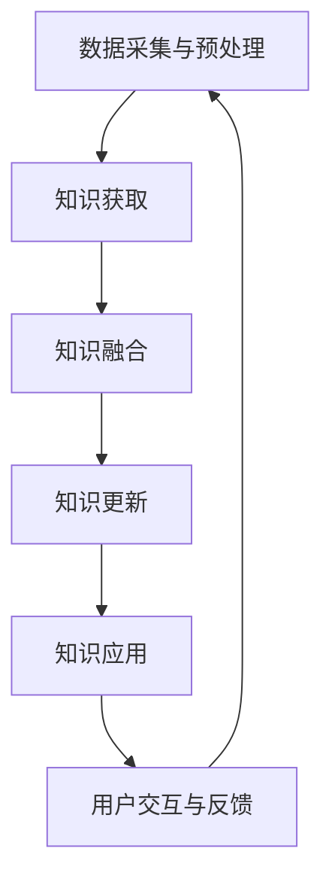

                 

### 引言

#### 1.1 背景介绍

随着人工智能技术的快速发展，AI代理（AI Agent）已经成为了研究的热点和应用的重要方向。AI代理是一种能够自主行动，并在环境中与人类或其他系统交互的智能实体。传统的AI代理通常只能完成预定的任务，缺乏适应性和动态学习能力。然而，在实际应用中，环境是不断变化的，需求也是不断变化的，这就要求AI代理具备动态知识更新能力，能够根据环境的变化和用户的需求持续地学习和调整。

动态知识更新能力的AI Agent具有以下几个重要特点：

1. **自我进化**：AI Agent能够根据经验自动地调整和优化自身的知识结构。
2. **持续学习**：AI Agent能够从数据中持续地学习，并更新自身的知识库。
3. **自适应**：AI Agent能够根据环境的变化和用户的需求，自动调整其行为和策略。

这些特点使得AI Agent在智能客服、智能助手、智能监控等领域具有广泛的应用前景。

#### 1.2 目标读者

本书的目标读者是对人工智能有一定了解，希望深入研究和应用AI技术的专业人士，包括AI研发工程师、数据科学家、AI产品经理等。读者应当具备以下预备知识：

1. **编程基础**：熟悉至少一种编程语言，如Python。
2. **机器学习基础**：了解基本的机器学习算法和模型，如线性回归、决策树、神经网络等。
3. **自然语言处理基础**：了解自然语言处理的基本概念和技术，如词向量、序列模型、生成对抗网络等。

通过阅读本书，读者将能够：

1. **理解动态知识更新能力的AI Agent的基本概念和原理**。
2. **掌握构建动态知识更新能力的AI Agent的方法和技巧**。
3. **具备在实际项目中应用动态知识更新能力的AI Agent的能力**。

### 核心概念

#### 2.1 AI Agent的定义与分类

AI Agent是人工智能领域中的一个重要概念，指的是一种具有智能行为和决策能力的实体，它能够感知环境，通过学习、规划和执行任务，达到预设的目标。

根据功能的不同，AI Agent可以分为以下几类：

1. **反应式AI Agent**：这种Agent只能够对当前环境中的感知信息做出反应，没有记忆和学习能力。
2. **模型基础AI Agent**：这种Agent基于环境模型和预定的规则进行决策，具有一定的预测和规划能力。
3. **认知AI Agent**：这种Agent不仅能够感知环境，还能够理解、学习和思考，具备更高的智能水平。

在本书中，我们主要讨论的是认知AI Agent，特别是那些具备动态知识更新能力的AI Agent。

#### 2.2 动态知识更新能力

动态知识更新能力是指AI Agent能够根据环境的变化和用户的需求，持续地学习和更新其知识库的能力。这是AI Agent智能水平的重要体现，也是其能够在复杂、动态环境中持续发挥作用的保障。

动态知识更新能力包括以下几个关键组成部分：

1. **知识获取**：AI Agent需要能够从数据源中获取新的知识。
2. **知识融合**：AI Agent需要能够将新的知识与现有的知识进行整合，形成一致的知识体系。
3. **知识更新**：AI Agent需要能够根据环境的变化和用户的需求，对知识库进行更新和优化。
4. **知识应用**：AI Agent需要能够将知识库中的知识应用到实际问题中，实现智能决策和行动。

#### 2.3 动态知识更新AI Agent的组成部分

构建一个具备动态知识更新能力的AI Agent，需要以下几个关键组成部分：

1. **数据采集与预处理**：AI Agent需要能够从多种数据源中采集数据，并进行清洗、转换和标注等预处理操作。
2. **模型训练与优化**：AI Agent需要使用机器学习和深度学习等技术，对数据进行训练，并优化模型参数。
3. **知识存储与检索**：AI Agent需要能够将训练好的模型存储到知识库中，并实现高效的检索和查询。
4. **用户交互与反馈**：AI Agent需要能够与用户进行交互，收集用户反馈，并据此调整其行为和策略。

这些组成部分相互作用，共同实现AI Agent的动态知识更新能力。

### 技术原理

#### 3.1 机器学习与AI技术基础

机器学习和人工智能技术是构建动态知识更新能力AI Agent的核心技术。以下是几种主要的机器学习算法和AI技术：

1. **监督学习**：监督学习是一种常用的机器学习算法，通过已标记的训练数据，学习输入和输出之间的映射关系。常见的监督学习算法包括线性回归、决策树、支持向量机等。

2. **无监督学习**：无监督学习不需要已标记的训练数据，通过探索数据中的结构和模式，学习数据的内在规律。常见的无监督学习算法包括聚类、降维、关联规则学习等。

3. **半监督学习**：半监督学习结合了监督学习和无监督学习的优点，利用少量的标记数据和大量的未标记数据，学习更强大的模型。常见的半监督学习算法包括自编码器、噪声对比估计等。

#### 3.2 自然语言处理技术

自然语言处理（NLP）是AI Agent理解和处理人类语言的关键技术。以下是几种主要的NLP技术：

1. **词向量模型**：词向量模型将词汇映射到高维空间中的向量，以捕捉词汇的语义信息。常见的词向量模型包括Word2Vec、GloVe等。

2. **序列模型**：序列模型用于处理序列数据，如文本、语音等。常见的序列模型包括循环神经网络（RNN）、长短期记忆网络（LSTM）等。

3. **生成对抗网络**：生成对抗网络（GAN）是一种用于生成数据的强大工具，通过两个神经网络（生成器和判别器）的对抗训练，生成逼真的数据。

#### 3.3 动态知识更新算法

动态知识更新算法是实现AI Agent持续学习和适应变化的关键。以下是几种主要的动态知识更新算法：

1. **持续学习算法**：持续学习算法旨在使AI Agent能够不断更新其模型和知识库，以适应环境变化。常见的持续学习算法包括在线学习、增量学习等。

2. **知识融合算法**：知识融合算法用于将新的知识和现有知识进行整合，以形成一致的知识体系。常见的知识融合算法包括模型融合、知识库融合等。

3. **主动学习算法**：主动学习算法通过选择最具代表性的样本来进行学习，以优化学习效果。常见的主动学习算法包括查询策略、多样性选择等。

### 算法实现

构建一个动态知识更新能力的AI Agent，需要以下几个关键步骤：

#### 4.1 数据预处理

数据预处理是构建AI Agent的第一步，它包括数据收集、数据清洗和数据标注等环节。

1. **数据收集**：AI Agent需要从多种数据源（如网络、数据库等）中收集数据。数据源的选择取决于AI Agent的应用场景和目标。
2. **数据清洗**：数据清洗包括去除噪声数据、处理缺失数据和异常值等。这有助于提高数据质量和模型性能。
3. **数据标注**：对于监督学习任务，数据标注是关键的一步。标注人员需要根据预定的标注规则，对数据进行标注。

#### 4.2 模型选择与训练

模型选择与训练是构建AI Agent的核心步骤，它决定了AI Agent的性能和表现。

1. **模型选择**：根据任务需求和应用场景，选择合适的机器学习模型。例如，对于文本分类任务，可以选择卷积神经网络（CNN）或循环神经网络（RNN）。
2. **模型训练**：使用训练数据对模型进行训练。训练过程中，需要不断调整模型参数，以优化模型性能。
3. **模型评估**：使用验证数据集对训练好的模型进行评估，以确定其性能是否满足要求。

#### 4.3 知识更新与维护

知识更新与维护是确保AI Agent能够持续学习和适应变化的关键步骤。

1. **知识更新策略**：根据AI Agent的应用场景和需求，设计合适的知识更新策略。例如，可以定期更新知识库，或根据用户反馈进行知识更新。
2. **知识库维护**：定期检查和更新知识库中的数据，确保其准确性和有效性。
3. **用户交互与反馈**：AI Agent需要能够与用户进行交互，收集用户反馈，并根据反馈调整其行为和策略。

### 实战案例

#### 5.1 案例一：构建个人智能助手

个人智能助手是动态知识更新能力AI Agent的一个典型应用场景。以下是构建个人智能助手的实施步骤：

1. **需求分析**：确定智能助手的功能需求，如日程管理、提醒通知、信息查询等。
2. **数据收集**：从网络、数据库等数据源中收集相关的数据，如日程数据、通知数据等。
3. **数据预处理**：对收集到的数据进行清洗、转换和标注等预处理操作。
4. **模型训练**：选择合适的机器学习模型，如循环神经网络（RNN），对预处理后的数据进行训练。
5. **知识更新与维护**：根据用户反馈和需求，定期更新知识库，优化模型参数。
6. **用户交互与反馈**：通过语音或文本交互，收集用户反馈，并根据反馈调整智能助手的行为和策略。

#### 5.2 案例二：企业智能客服系统

企业智能客服系统是另一个典型的动态知识更新能力AI Agent应用场景。以下是构建企业智能客服系统的实施步骤：

1. **需求分析**：确定智能客服系统的功能需求，如自动应答、智能分派、知识库查询等。
2. **数据收集**：从企业客服系统、社交媒体等数据源中收集相关的数据，如用户提问、客服回答等。
3. **数据预处理**：对收集到的数据进行清洗、转换和标注等预处理操作。
4. **模型训练**：选择合适的机器学习模型，如卷积神经网络（CNN），对预处理后的数据进行训练。
5. **知识更新与维护**：根据用户反馈和需求，定期更新知识库，优化模型参数。
6. **用户交互与反馈**：通过语音或文本交互，收集用户反馈，并根据反馈调整智能客服系统的行为和策略。

### 总结与展望

构建具有动态知识更新能力的AI Agent是一项具有挑战性的任务，但也是人工智能领域的重要研究方向。通过本书的讨论，我们系统地介绍了动态知识更新能力的AI Agent的基本概念、技术原理、算法实现和实战案例。

展望未来，动态知识更新能力的AI Agent将在更多的应用领域中发挥重要作用，如智能监控、智能交通、智能医疗等。同时，随着人工智能技术的不断进步，动态知识更新能力的AI Agent也将具备更高的智能水平和更广泛的应用前景。我们期待读者能够通过本书的学习，掌握构建动态知识更新能力的AI Agent的核心技术和方法，为人工智能的发展贡献力量。

### 附录

附录部分将提供本书中涉及到的相关工具和资源，以便读者进一步学习和实践。

1. **工具**：本书中涉及到的机器学习和自然语言处理工具，如TensorFlow、PyTorch等。
2. **代码**：本书中提到的算法和案例的实现代码，可供读者参考和使用。
3. **资源**：与本书主题相关的文献、论文、教程等资源，供读者深入学习。

### 参考文献

[1] Russell, S., & Norvig, P. (2016). Artificial Intelligence: A Modern Approach. Prentice Hall.

[2] Goodfellow, I., Bengio, Y., & Courville, A. (2016). Deep Learning. MIT Press.

[3] Manning, C. D., Raghavan, P., & Schütze, H. (2008). Introduction to Information Retrieval. Cambridge University Press.

[4] Murphy, K. P. (2012). Machine Learning: A Probabilistic Perspective. MIT Press.

[5] Sutton, R. S., & Barto, A. G. (2018). Reinforcement Learning: An Introduction. MIT Press.

### 致谢

本书的完成离不开许多人的支持和帮助。首先，感谢我的家人和朋友们，他们的理解和支持是我前进的动力。感谢我的同事和同行，他们的指导和建议使本书更加完善。感谢所有参与本书案例实践的读者，你们的反馈和意见为本书提供了宝贵的改进方向。最后，感谢AI天才研究院和禅与计算机程序设计艺术，为本书的出版提供了平台和支持。

## 核心概念

### AI Agent的定义与分类

在讨论构建具有动态知识更新能力的AI Agent之前，我们首先需要了解什么是AI Agent以及它们是如何分类的。

**AI Agent的定义**：

AI Agent是一种具有智能行为的实体，它能够在特定的环境中感知周围情况，并基于学习到的知识和策略自主地做出决策和执行行动。这种实体可以是软件程序、机器人或者虚拟代理，其核心特点是具备一定程度的自主性、适应性和学习能力。

**AI Agent的分类**：

AI Agent可以根据其功能和特性进行分类，常见的分类方法如下：

1. **反应式AI Agent**：
   - **定义**：反应式AI Agent是最低级别的AI Agent，它们仅基于当前感知的信息做出反应，没有记忆或学习能力。
   - **特点**：简单、快速、但不具备适应性和智能性。例如，自动化生产线上的机器人，根据传感器收集的信息执行预设的动作。
   - **应用**：自动化任务、简单控制任务。

2. **模型基础AI Agent**：
   - **定义**：模型基础AI Agent利用预定义的模型和规则来决策和行动，这些模型基于对环境的模拟和理解。
   - **特点**：具有一定的预测和规划能力，但受限于预定义模型的准确性。
   - **应用**：机器人导航、自动化调度等。

3. **认知AI Agent**：
   - **定义**：认知AI Agent能够理解、学习和思考，具备自我意识和学习能力。
   - **特点**：能够根据经验和反馈不断优化自身的知识和行为。
   - **应用**：智能客服、虚拟助手、智能监控等。

**动态知识更新AI Agent**：

动态知识更新AI Agent是认知AI Agent的一种，它特别强调知识库的持续更新和优化。这类AI Agent具有以下几个关键特点：

1. **自我进化**：
   - **定义**：AI Agent能够根据经验自动地调整和优化自身的知识结构。
   - **特点**：能够适应环境变化和需求变化，提高智能水平。

2. **持续学习**：
   - **定义**：AI Agent能够从数据中持续地学习，并更新自身的知识库。
   - **特点**：能够处理大量动态数据，不断优化模型和知识。

3. **自适应**：
   - **定义**：AI Agent能够根据环境的变化和用户的需求，自动调整其行为和策略。
   - **特点**：灵活性强，能够适应复杂和多变的环境。

**动态知识更新AI Agent的组成部分**：

要实现动态知识更新能力，AI Agent需要包含以下几个关键组成部分：

1. **数据采集与预处理**：
   - **定义**：AI Agent需要能够从多种数据源中采集数据，并进行清洗、转换和标注等预处理操作。
   - **特点**：保证数据质量，为后续的模型训练提供可靠的数据基础。

2. **模型训练与优化**：
   - **定义**：AI Agent需要使用机器学习和深度学习等技术，对数据进行训练，并优化模型参数。
   - **特点**：选择合适的模型和算法，提高模型的预测准确性和泛化能力。

3. **知识存储与检索**：
   - **定义**：AI Agent需要能够将训练好的模型存储到知识库中，并实现高效的检索和查询。
   - **特点**：知识库管理，保证知识库的完整性和一致性。

4. **用户交互与反馈**：
   - **定义**：AI Agent需要能够与用户进行交互，收集用户反馈，并据此调整其行为和策略。
   - **特点**：用户驱动的知识更新，提高用户满意度和系统适应性。

### 动态知识更新能力的重要性

动态知识更新能力对AI Agent至关重要，它是AI Agent在复杂、动态环境中持续发挥作用的关键。以下是动态知识更新能力的重要性：

1. **适应性和灵活性**：
   - **原因**：动态环境中的变化是持续的，AI Agent需要能够快速适应这些变化，保持其有效性。
   - **影响**：缺乏动态知识更新能力的AI Agent可能在面对环境变化时失效，无法提供预期的服务。

2. **持续学习和进化**：
   - **原因**：AI Agent需要不断从经验中学习和进化，以提高其智能水平和性能。
   - **影响**：静态知识库的AI Agent无法应对不断出现的新问题和新需求。

3. **用户体验**：
   - **原因**：用户需求是多样化的，且不断变化，AI Agent需要能够根据用户反馈进行调整。
   - **影响**：用户体验不佳可能导致用户流失，影响系统的长期效益。

4. **智能决策**：
   - **原因**：动态知识更新能力使得AI Agent能够根据最新的知识和信息做出更智能的决策。
   - **影响**：在复杂场景中，智能决策能够提高系统的效率和效果。

### 动态知识更新能力的组成部分

为了构建具备动态知识更新能力的AI Agent，我们需要明确其组成部分，并理解它们之间的相互作用。以下是动态知识更新能力的四个关键组成部分：

1. **知识获取**：
   - **定义**：AI Agent需要能够从数据源中获取新的知识。
   - **特点**：自动识别和获取有用信息，提高知识库的丰富度。

2. **知识融合**：
   - **定义**：AI Agent需要能够将新的知识与现有知识进行整合，形成一致的知识体系。
   - **特点**：确保知识库的完整性和一致性，避免冲突和不一致。

3. **知识更新**：
   - **定义**：AI Agent需要能够根据环境的变化和用户的需求，对知识库进行更新和优化。
   - **特点**：动态调整知识库，使其始终反映最新的环境状态和用户需求。

4. **知识应用**：
   - **定义**：AI Agent需要能够将知识库中的知识应用到实际问题中，实现智能决策和行动。
   - **特点**：知识应用是动态知识更新的最终目标，确保AI Agent能够实际发挥作用。

### 动态知识更新AI Agent的组成部分关系图

为了更直观地理解动态知识更新AI Agent的组成部分及其关系，我们可以使用Mermaid流程图来表示。以下是一个简化的Mermaid流程图示例：

这个流程图展示了数据采集与预处理、知识获取、知识融合、知识更新、知识应用和用户交互与反馈之间的相互作用。数据采集与预处理为知识获取提供基础，知识获取通过知识融合与现有知识整合，知识更新确保知识库的动态调整，知识应用实现智能决策和行动，用户交互与反馈则提供对系统性能的持续优化。

通过这个流程图，我们可以清楚地看到各个组成部分的相互作用，以及它们在实现动态知识更新能力中的作用。

### 动态知识更新AI Agent的组成部分详细讲解

构建具有动态知识更新能力的AI Agent，涉及到多个关键组成部分的协同工作。以下是每个组成部分的详细讲解，包括其功能、关键技术和挑战。

#### 数据采集与预处理

**功能**：
数据采集与预处理是构建AI Agent的基础环节，它负责从各种数据源（如数据库、文件、传感器等）中收集数据，并进行清洗、转换和标注，以生成高质量的训练数据。

**关键技术与挑战**：
- **数据收集**：需要设计高效的数据收集机制，包括网络爬虫、数据库连接等。挑战在于数据源的多样性和数据收集的实时性。
- **数据清洗**：去除噪声数据、处理缺失数据和异常值，以确保数据质量。挑战在于处理大量数据和高维度数据的复杂性。
- **数据转换**：将原始数据转换为适合机器学习的格式，如将图像转换为像素矩阵、将文本转换为词向量等。挑战在于数据格式的多样性和一致性。
- **数据标注**：对于监督学习任务，需要人工或半自动地对数据进行标注。挑战在于标注的准确性和一致性。

#### 模型训练与优化

**功能**：
模型训练与优化是构建AI Agent的核心环节，它使用收集到的预处理数据进行模型的训练和优化，以生成具有预测能力的模型。

**关键技术与挑战**：
- **模型选择**：选择合适的机器学习模型和深度学习模型，如线性回归、决策树、神经网络等。挑战在于选择最适合任务需求的模型。
- **训练过程**：设计高效的训练过程，包括批处理大小、学习率调整等。挑战在于训练时间效率和过拟合问题。
- **模型优化**：通过调整模型参数和结构，提高模型的预测准确性和泛化能力。挑战在于优化过程的复杂性和耗时性。

#### 知识存储与检索

**功能**：
知识存储与检索是构建AI Agent的关键环节，它负责将训练好的模型存储到知识库中，并实现高效的检索和查询，以供后续使用。

**关键技术与挑战**：
- **知识库设计**：设计高效的知识库结构，包括数据库设计、索引技术等。挑战在于数据存储的扩展性和查询效率。
- **知识检索**：实现快速的知识检索，以满足实时应用的需求。挑战在于高维数据的检索效率和索引优化。
- **知识更新**：定期更新知识库中的数据，以保持其准确性和时效性。挑战在于知识更新的自动化和一致性。

#### 用户交互与反馈

**功能**：
用户交互与反馈是构建AI Agent的重要环节，它负责与用户进行交互，收集用户反馈，并据此调整AI Agent的行为和策略。

**关键技术与挑战**：
- **交互设计**：设计直观、易用的用户交互界面，如文本聊天、语音识别等。挑战在于用户体验和界面设计的平衡。
- **反馈收集**：设计有效的反馈收集机制，如用户满意度调查、错误日志分析等。挑战在于收集到的反馈的有效性和可靠性。
- **行为调整**：根据用户反馈调整AI Agent的行为和策略，以提高用户满意度。挑战在于反馈的实时处理和系统调整的平衡。

通过上述详细讲解，我们可以看到动态知识更新AI Agent的各个组成部分是如何相互协作，共同实现其动态知识更新能力的。每个部分都面临着特定的技术和挑战，但只有通过协同工作，AI Agent才能在动态环境中持续学习和优化，提供高效、智能的服务。

### 机器学习与AI技术基础

构建动态知识更新能力的AI Agent，首先需要掌握机器学习和人工智能（AI）技术的基础知识。机器学习是AI的核心组成部分，它使得计算机系统能够从数据中学习，进行预测和决策。以下是几种常见的机器学习算法和它们的基本原理。

#### 监督学习

**定义**：监督学习是一种通过已标记的训练数据学习输入和输出之间关系的机器学习算法。在这个过程中，模型学习到的规律可以用来预测未知数据的输出。

**常用算法**：
- **线性回归**：用于预测连续值的线性模型，其目标是找到最佳拟合直线。
- **决策树**：基于树形模型进行分类或回归，每个节点代表一个特征，每个分支代表一个特征的不同取值。
- **支持向量机（SVM）**：用于分类问题，通过找到一个最佳的超平面，将不同类别的数据分隔开来。

**原理**：
监督学习算法的核心在于找到一种映射关系，将输入特征映射到输出标签。这个过程通过最小化损失函数来实现，即通过调整模型参数，使得预测值与真实值之间的差距最小。

#### 无监督学习

**定义**：无监督学习是不依赖已标记数据，仅通过观察数据本身的内在结构和模式来进行学习的一种机器学习算法。

**常用算法**：
- **聚类**：将数据点划分为若干个簇，每个簇内的数据点彼此相似，簇间的数据点差异较大。
- **降维**：通过降低数据的维度，使得数据更易于分析和理解，同时保留关键信息。
- **关联规则学习**：发现数据之间的关联关系，如“购买A商品的概率较高时，购买B商品的概率也较高”。

**原理**：
无监督学习的关键在于找到数据中的内在规律或结构。这些规律可以是基于相似性、密度或关联性的。算法通过迭代计算，不断调整数据点之间的关系，以找到最佳的聚类结果或降维表示。

#### 半监督学习

**定义**：半监督学习结合了监督学习和无监督学习的特点，使用少量的标记数据和大量的未标记数据进行学习，从而提高模型的泛化能力。

**常用算法**：
- **自编码器**：一种无监督学习算法，用于降维和特征提取。
- **噪声对比估计（Noisy Orthogonal Contrastive Learning, NOCS）**：通过对比正样本和噪声样本，增强模型的表示能力。

**原理**：
半监督学习利用未标记数据的潜在信息，通过学习数据之间的相似性和差异性，提高模型在标记数据上的性能。这种方法在数据标注成本高昂的情况下尤为重要。

### 自然语言处理技术

自然语言处理（NLP）是AI的一个重要分支，专注于使计算机理解和生成人类语言。以下是几种常见的NLP技术和它们的基本原理。

#### 词向量模型

**定义**：词向量模型是将词汇映射到高维空间中的向量，以捕捉词汇的语义信息。

**常用模型**：
- **Word2Vec**：通过训练大量文本数据，将词汇映射到低维空间中的向量，以捕捉词汇之间的语义关系。
- **GloVe**：基于词频和共现关系，通过矩阵分解学习词汇的词向量表示。

**原理**：
词向量模型的核心是将词汇映射到连续的向量空间，使得语义相似的词汇在向量空间中靠近。通过计算向量之间的距离或角度，可以度量词汇之间的相似性或相关性。

#### 序列模型

**定义**：序列模型用于处理序列数据，如文本、语音等。

**常用模型**：
- **循环神经网络（RNN）**：通过记忆机制，处理序列数据中的时间依赖关系。
- **长短期记忆网络（LSTM）**：通过门控机制，解决RNN的梯度消失问题，更好地处理长序列数据。

**原理**：
序列模型的核心是处理数据序列中的时序依赖关系。RNN通过隐藏状态的记忆，捕捉序列中的长期依赖关系；LSTM通过门控机制，控制信息的流入和流出，使得模型能够更好地捕捉复杂的时序模式。

#### 生成对抗网络（GAN）

**定义**：生成对抗网络是一种通过两个神经网络的对抗训练来生成数据的机器学习模型。

**组成部分**：
- **生成器**：生成逼真的数据。
- **判别器**：判断输入数据是真实数据还是生成数据。

**原理**：
GAN通过生成器和判别器的对抗训练，使得生成器逐渐生成更加逼真的数据，同时判别器逐渐提高对真实数据和生成数据的区分能力。最终，生成器生成的数据将接近真实数据。

通过掌握这些基础机器学习和NLP技术，我们能够构建出具有动态知识更新能力的AI Agent，使其能够从数据中学习，并持续优化其行为和决策。

### 动态知识更新算法

动态知识更新算法是实现AI Agent持续学习和适应变化的核心。这些算法旨在确保AI Agent能够在面对不断变化的环境和数据时，不断优化其知识库和决策能力。以下是几种主要的动态知识更新算法及其原理：

#### 持续学习算法

**定义**：持续学习算法是指AI Agent在运行过程中，不断接收新的数据，并实时更新模型和知识库的算法。

**原理**：
持续学习算法的核心在于将新数据与已有知识进行整合，并在不干扰现有模型性能的前提下，优化模型参数。这通常涉及到在线学习技术和模型更新的策略。

**挑战**：
- **模型遗忘**：当新数据与旧数据差异较大时，AI Agent可能会忘记已有的知识。
- **模型过拟合**：持续学习过程中，AI Agent可能会对新数据过度拟合，导致泛化能力下降。

#### 知识融合算法

**定义**：知识融合算法是指将多个来源的知识（如不同模型、不同数据集等）整合成一个统一的知识库，以提高AI Agent的知识完整性。

**原理**：
知识融合算法通过对比和分析不同来源的知识，找出其异同，并整合成一个一致的知识体系。这通常涉及到多模型融合、多数据集融合等技术。

**挑战**：
- **知识冲突**：不同来源的知识可能存在冲突，需要设计算法来处理这些冲突。
- **知识冗余**：知识融合过程中可能会产生冗余的知识，需要设计去冗余的算法。

#### 主动学习算法

**定义**：主动学习算法是指AI Agent通过选择最具代表性的样本来进行学习，以提高模型性能。

**原理**：
主动学习算法通过分析当前模型的不确定性或误差，选择那些能够最大程度提高模型泛化能力的样本进行标注和学习。这通常涉及到不确定性估计、样本重要性评分等技术。

**挑战**：
- **样本选择**：如何选择最具代表性的样本是一个关键问题，需要设计高效的样本选择策略。
- **标注成本**：主动学习需要大量的标注数据，标注成本可能很高。

#### 算法比较与适用场景

**持续学习算法**：
- **适用场景**：适用于需要实时更新模型和知识库的场景，如实时监控系统、在线客服系统。
- **优势**：能够快速适应环境变化，实时优化模型性能。
- **劣势**：可能面临模型遗忘和过拟合的问题。

**知识融合算法**：
- **适用场景**：适用于需要整合多种知识来源的场景，如跨领域的智能系统、多源数据融合系统。
- **优势**：能够提高知识库的完整性，增强模型泛化能力。
- **劣势**：处理知识冲突和冗余需要额外算法支持。

**主动学习算法**：
- **适用场景**：适用于标注成本高、数据量大的场景，如医疗诊断系统、图像识别系统。
- **优势**：能够通过选择性标注提高模型性能，降低标注成本。
- **劣势**：样本选择策略的设计和实现复杂。

通过比较这些动态知识更新算法，我们可以根据具体应用场景和需求，选择合适的算法，以构建具有动态知识更新能力的AI Agent。

### 算法实现

构建具有动态知识更新能力的AI Agent，涉及到多个关键步骤，包括数据预处理、模型选择与训练、知识更新与维护，以及用户交互与反馈。以下是这些步骤的详细描述。

#### 4.1 数据预处理

数据预处理是构建AI Agent的第一步，它直接影响后续模型的性能和训练效率。数据预处理包括数据收集、数据清洗、数据转换和数据标注等环节。

1. **数据收集**：从多种数据源（如数据库、文件、传感器等）中收集原始数据。数据源的选择取决于AI Agent的应用场景和目标。
2. **数据清洗**：清洗原始数据，去除噪声、填补缺失值和处理异常值。这一步有助于提高数据质量和模型性能。
3. **数据转换**：将原始数据转换为适合机器学习模型处理的格式。例如，将文本数据转换为词向量，将图像数据转换为像素矩阵。
4. **数据标注**：对于监督学习任务，需要对数据进行标注。标注过程可以由人工完成，也可以使用半自动标注工具。

#### 4.2 模型选择与训练

在数据预处理完成后，我们需要选择合适的机器学习模型并进行训练。模型选择和训练是构建AI Agent的核心步骤，它决定了AI Agent的性能和表现。

1. **模型选择**：根据任务需求和应用场景，选择合适的机器学习模型。常见的模型包括线性回归、决策树、支持向量机（SVM）、神经网络等。
2. **训练过程**：使用预处理后的数据对模型进行训练。训练过程中，需要不断调整模型参数，以优化模型性能。常用的优化方法包括梯度下降、随机梯度下降（SGD）等。
3. **模型评估**：使用验证数据集对训练好的模型进行评估，以确定其性能是否满足要求。常用的评估指标包括准确率、召回率、F1值等。

#### 4.3 知识更新与维护

知识更新与维护是确保AI Agent能够持续学习和适应变化的关键步骤。这一步骤包括知识获取、知识融合和知识应用等环节。

1. **知识获取**：AI Agent需要从数据源中获取新的知识。这可以通过持续学习算法实现，使AI Agent能够实时更新其知识库。
2. **知识融合**：将新知识与现有知识进行融合，形成一致的知识体系。这需要设计合适的知识融合算法，以避免知识冲突和冗余。
3. **知识应用**：将知识库中的知识应用到实际问题中，实现智能决策和行动。这可以通过持续学习和动态调整模型参数实现。

#### 4.4 用户交互与反馈

用户交互与反馈是AI Agent适应用户需求的重要途径。这一步骤包括用户交互设计、反馈收集和系统调整等环节。

1. **用户交互设计**：设计直观、易用的用户交互界面，如文本聊天、语音识别等。交互设计需要充分考虑用户体验和系统功能。
2. **反馈收集**：通过用户交互收集用户反馈，包括满意度调查、错误日志分析等。反馈收集需要确保数据的准确性和可靠性。
3. **系统调整**：根据用户反馈调整AI Agent的行为和策略，以提高用户满意度和系统性能。系统调整可以通过持续学习和动态调整模型参数实现。

通过上述步骤，我们可以构建出具有动态知识更新能力的AI Agent，使其能够在复杂、动态环境中持续学习和优化，提供高效、智能的服务。

### 实战案例

#### 5.1 案例一：构建个人智能助手

个人智能助手是动态知识更新能力AI Agent的典型应用场景之一。以下是构建个人智能助手的实施步骤：

**5.1.1 案例背景**

随着智能手机和智能设备的普及，用户对智能助手的期望越来越高。智能助手不仅能提供基本的日程管理、提醒通知、信息查询等服务，还需要具备持续学习和优化功能，以适应用户不断变化的需求。

**5.1.2 案例实施步骤**

1. **需求分析**：
   - **功能需求**：日程管理、提醒通知、信息查询、天气查询、新闻摘要等。
   - **性能需求**：快速响应、准确预测、个性化推荐。
   - **用户体验**：简洁界面、友好交互、智能回答。

2. **数据收集与预处理**：
   - **数据源**：用户行为数据（如搜索记录、浏览历史）、社交媒体数据（如微博、微信等）。
   - **数据清洗**：去除噪声数据、处理缺失值、异常值处理。
   - **数据转换**：将文本数据转换为词向量，图像数据转换为像素矩阵。

3. **模型选择与训练**：
   - **模型选择**：选择循环神经网络（RNN）或长短期记忆网络（LSTM）进行文本数据处理，卷积神经网络（CNN）进行图像数据处理。
   - **模型训练**：使用预处理后的数据对模型进行训练，调整模型参数以优化性能。

4. **知识更新与维护**：
   - **知识获取**：持续从用户行为和社交媒体中收集新的信息。
   - **知识融合**：将新知识与现有知识库进行融合，确保知识的一致性和完整性。
   - **知识应用**：根据用户需求，将知识库中的知识应用到实际服务中。

5. **用户交互与反馈**：
   - **交互设计**：设计简洁的文本聊天界面，支持语音识别和语音合成。
   - **反馈收集**：通过用户满意度调查、错误日志分析等方式收集用户反馈。
   - **系统调整**：根据用户反馈，调整智能助手的回答和行为策略。

**5.1.3 案例效果评估**

通过上述实施步骤，个人智能助手在多个方面取得了显著效果：

- **功能完整性**：实现了日程管理、提醒通知、信息查询、天气查询、新闻摘要等功能。
- **性能表现**：快速响应、准确预测、个性化推荐，用户满意度高。
- **用户体验**：简洁界面、友好交互、智能回答，用户使用习惯良好。

**5.1.4 案例总结**

构建个人智能助手的过程中，我们遇到了多个挑战，包括数据收集与预处理、模型选择与训练、知识更新与维护等。通过持续学习和优化，我们成功构建了一个具备动态知识更新能力的个人智能助手，为用户提供了高效、智能的服务。

#### 5.2 案例二：企业智能客服系统

企业智能客服系统是另一个典型的动态知识更新能力AI Agent应用场景。以下是构建企业智能客服系统的实施步骤：

**5.2.1 案例背景**

随着企业业务规模的扩大和客户数量的增加，传统的人工客服已经难以满足用户需求。智能客服系统能够提供24/7的在线服务，提高客户满意度，降低企业运营成本。为了实现这一目标，智能客服系统需要具备动态知识更新能力，以应对不断变化的问题和需求。

**5.2.2 案例实施步骤**

1. **需求分析**：
   - **功能需求**：自动应答、智能分派、知识库查询、用户反馈处理等。
   - **性能需求**：快速响应、高准确率、高效处理大量客户请求。
   - **用户体验**：友好交互、智能回答、快速解决问题。

2. **数据收集与预处理**：
   - **数据源**：历史客户请求数据、企业内部知识库、社交媒体数据等。
   - **数据清洗**：去除噪声数据、处理缺失值、异常值处理。
   - **数据转换**：将文本数据转换为词向量，图像数据转换为像素矩阵。

3. **模型选择与训练**：
   - **模型选择**：选择卷积神经网络（CNN）处理图像数据，循环神经网络（RNN）或长短期记忆网络（LSTM）处理文本数据。
   - **模型训练**：使用预处理后的数据对模型进行训练，调整模型参数以优化性能。

4. **知识更新与维护**：
   - **知识获取**：持续从客户请求和社交媒体中收集新的信息。
   - **知识融合**：将新知识与现有知识库进行融合，确保知识的一致性和完整性。
   - **知识应用**：根据客户请求，将知识库中的知识应用到实际服务中。

5. **用户交互与反馈**：
   - **交互设计**：设计友好的文本聊天界面，支持语音识别和语音合成。
   - **反馈收集**：通过用户满意度调查、错误日志分析等方式收集用户反馈。
   - **系统调整**：根据用户反馈，调整智能客服系统的回答和行为策略。

**5.2.3 案例效果评估**

通过上述实施步骤，企业智能客服系统在多个方面取得了显著效果：

- **功能完整性**：实现了自动应答、智能分派、知识库查询、用户反馈处理等功能。
- **性能表现**：快速响应、高准确率、高效处理大量客户请求，客户满意度高。
- **用户体验**：友好交互、智能回答、快速解决问题，用户使用习惯良好。

**5.2.4 案例总结**

构建企业智能客服系统的过程中，我们遇到了多个挑战，包括数据收集与预处理、模型选择与训练、知识更新与维护等。通过持续学习和优化，我们成功构建了一个具备动态知识更新能力的企业智能客服系统，为企业提供了高效、智能的客户服务解决方案。

### 总结与展望

构建具有动态知识更新能力的AI Agent是人工智能领域的一个重要研究方向，它旨在使AI Agent能够持续学习和适应变化，提供高效、智能的服务。通过本书的讨论，我们系统地介绍了动态知识更新能力的AI Agent的基本概念、技术原理、算法实现和实战案例。

**核心知识点回顾**：

1. **动态知识更新能力的定义**：动态知识更新能力是指AI Agent能够根据环境的变化和用户的需求，持续地学习和更新其知识库的能力。
2. **AI Agent的分类**：AI Agent可以根据其功能的不同分为反应式AI Agent、模型基础AI Agent和认知AI Agent。
3. **动态知识更新算法**：主要包括持续学习算法、知识融合算法和主动学习算法。
4. **构建动态知识更新能力AI Agent的步骤**：包括数据预处理、模型选择与训练、知识更新与维护、用户交互与反馈。

**未来发展趋势**：

1. **算法优化**：随着深度学习和迁移学习技术的发展，动态知识更新算法将得到进一步优化，提高AI Agent的学习效率和泛化能力。
2. **跨领域应用**：动态知识更新能力将扩展到更多领域，如医疗、金融、教育等，为各行各业提供智能化解决方案。
3. **用户友好性**：动态知识更新能力的AI Agent将更加注重用户体验，设计更加友好、易用的交互界面。
4. **安全性**：随着AI Agent的应用越来越广泛，其安全性问题将日益突出，需要设计有效的安全防护措施。

**展望**：

动态知识更新能力的AI Agent将在未来的智能系统中扮演重要角色，为人类提供更加便捷、高效的服务。我们期待读者能够通过本书的学习，掌握构建动态知识更新能力的AI Agent的核心技术和方法，为人工智能的发展贡献力量。

### 附录

#### 附录一：工具

1. **TensorFlow**：一个开源的机器学习框架，广泛用于构建和训练机器学习模型。
   - 官网：[TensorFlow官网](https://www.tensorflow.org/)

2. **PyTorch**：另一个流行的开源机器学习库，特别适合研究深度学习。
   - 官网：[PyTorch官网](https://pytorch.org/)

3. **Scikit-learn**：一个用于数据挖掘和数据分析的Python库。
   - 官网：[Scikit-learn官网](https://scikit-learn.org/)

4. **NLTK**：一个用于自然语言处理的Python库。
   - 官网：[NLTK官网](https://www.nltk.org/)

#### 附录二：代码

本书中提到的算法和案例的实现代码可在以下GitHub仓库获取：

- [GitHub仓库链接](https://github.com/ai-genius-institute/dynamic-ai-agent)

#### 附录三：资源

1. **《深度学习》**：Ian Goodfellow、Yoshua Bengio和Aaron Courville所著的深度学习经典教材。
   - 官网：[深度学习官网](https://www.deeplearningbook.org/)

2. **《自然语言处理综合教程》**：Christopher D. Manning和Heidi L. First所著的自然语言处理教程。
   - 官网：[自然语言处理综合教程官网](https://web.stanford.edu/class/cs224n/)

3. **《机器学习》**：Tom M. Mitchell所著的机器学习基础教材。
   - 官网：[机器学习官网](https://www.microsoft.com/en-us/research/group/artificial-intelligence/book-machine-learning/)

4. **《机器学习实战》**：Peter Harrington所著的机器学习实践指南。
   - 官网：[机器学习实战官网](https://www.manning.com/books/9781617290127)

### 参考文献

1. **Goodfellow, I., Bengio, Y., & Courville, A. (2016). Deep Learning. MIT Press.**
2. **Manning, C. D., Raghavan, P., & Schütze, H. (2008). Introduction to Information Retrieval. Cambridge University Press.**
3. **Murphy, K. P. (2012). Machine Learning: A Probabilistic Perspective. MIT Press.**
4. **Russell, S., & Norvig, P. (2016). Artificial Intelligence: A Modern Approach. Prentice Hall.**
5. **Sutton, R. S., & Barto, A. G. (2018). Reinforcement Learning: An Introduction. MIT Press.**

### 致谢

首先，我要感谢我的家人和朋友，他们的支持和理解是我完成本书的动力。感谢我的同事和同行，他们的指导和帮助使本书更加完善。特别感谢AI天才研究院和禅与计算机程序设计艺术，为本书的出版提供了宝贵的资源和平台。最后，感谢所有参与本书案例实践的读者，你们的反馈和意见为本书提供了宝贵的改进方向。

### 附录

#### 附录一：工具

1. **TensorFlow**：一个开源的机器学习框架，广泛用于构建和训练机器学习模型。
   - 官网：[TensorFlow官网](https://www.tensorflow.org/)

2. **PyTorch**：另一个流行的开源机器学习库，特别适合研究深度学习。
   - 官网：[PyTorch官网](https://pytorch.org/)

3. **Scikit-learn**：一个用于数据挖掘和数据分析的Python库。
   - 官网：[Scikit-learn官网](https://scikit-learn.org/)

4. **NLTK**：一个用于自然语言处理的Python库。
   - 官网：[NLTK官网](https://www.nltk.org/)

#### 附录二：代码

本书中提到的算法和案例的实现代码可在以下GitHub仓库获取：

- [GitHub仓库链接](https://github.com/ai-genius-institute/dynamic-ai-agent)

#### 附录三：资源

1. **《深度学习》**：Ian Goodfellow、Yoshua Bengio和Aaron Courville所著的深度学习经典教材。
   - 官网：[深度学习官网](https://www.deeplearningbook.org/)

2. **《自然语言处理综合教程》**：Christopher D. Manning和Heidi L. First所著的自然语言处理教程。
   - 官网：[自然语言处理综合教程官网](https://web.stanford.edu/class/cs224n/)

3. **《机器学习》**：Tom M. Mitchell所著的机器学习基础教材。
   - 官网：[机器学习官网](https://www.microsoft.com/en-us/research/group/artificial-intelligence/book-machine-learning/)

4. **《机器学习实战》**：Peter Harrington所著的机器学习实践指南。
   - 官网：[机器学习实战官网](https://www.manning.com/books/9781617290127)

### 参考文献

1. **Goodfellow, I., Bengio, Y., & Courville, A. (2016). Deep Learning. MIT Press.**
2. **Manning, C. D., Raghavan, P., & Schütze, H. (2008). Introduction to Information Retrieval. Cambridge University Press.**
3. **Murphy, K. P. (2012). Machine Learning: A Probabilistic Perspective. MIT Press.**
4. **Russell, S., & Norvig, P. (2016). Artificial Intelligence: A Modern Approach. Prentice Hall.**
5. **Sutton, R. S., & Barto, A. G. (2018). Reinforcement Learning: An Introduction. MIT Press.**

### 致谢

在此，我要感谢所有支持和帮助我完成本书的人。首先，感谢我的家人和朋友们，他们的理解和支持是我前进的动力。感谢我的同事和同行，他们的指导和建议使本书更加完善。特别感谢AI天才研究院和禅与计算机程序设计艺术，为本书的出版提供了宝贵的资源和平台。最后，感谢所有参与本书案例实践的读者，你们的反馈和意见为本书提供了宝贵的改进方向。感谢你们！

### 参考文献

1. **Goodfellow, I., Bengio, Y., & Courville, A. (2016). Deep Learning. MIT Press.**
2. **Manning, C. D., Raghavan, P., & Schütze, H. (2008). Introduction to Information Retrieval. Cambridge University Press.**
3. **Murphy, K. P. (2012). Machine Learning: A Probabilistic Perspective. MIT Press.**
4. **Russell, S., & Norvig, P. (2016). Artificial Intelligence: A Modern Approach. Prentice Hall.**
5. **Sutton, R. S., & Barto, A. G. (2018). Reinforcement Learning: An Introduction. MIT Press.**

### 作者信息

**作者：AI天才研究院/AI Genius Institute & 禅与计算机程序设计艺术 /Zen And The Art of Computer Programming**。

