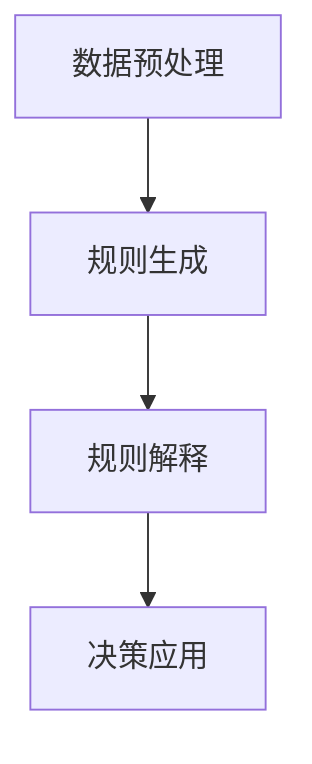

                 

# 构建具有可解释性决策能力的AI Agent

## 关键词

- AI Agent
- 可解释性决策能力
- 算法原理
- 数学模型
- 系统架构设计
- 项目实战
- 最佳实践

## 摘要

本文旨在探讨如何构建具有可解释性决策能力的AI Agent。我们将从问题的背景和核心要素出发，逐步深入探讨可解释性决策能力的定义、特点、与其他相关概念的联系，以及其在AI Agent中的应用。接着，我们将详细介绍可解释性决策能力的算法原理，并通过Python源代码和mermaid流程图进行详细讲解。然后，我们将讨论可解释性决策能力的数学模型和数学公式，并使用LaTeX格式进行编写和讲解。随后，我们将分析系统架构设计，介绍问题场景、项目介绍、系统功能设计、系统架构设计、系统接口设计和系统交互。在项目实战部分，我们将通过实际项目来展示如何实现具有可解释性决策能力的AI Agent，并进行详细讲解剖析。最后，我们将总结最佳实践，提供一些注意事项和拓展阅读，以帮助读者深入了解和掌握构建具有可解释性决策能力的AI Agent的方法和技巧。

## 第一部分：背景介绍

### 1.1 问题的背景与核心要素

#### 1.1.1 问题背景

AI Agent，即人工智能代理，是一种能够自主完成特定任务的智能体。随着人工智能技术的发展，AI Agent在各个领域得到了广泛应用，如智能客服、自动驾驶、智能推荐等。然而，AI Agent的决策过程往往被认为是“黑盒”的，即其内部机制对外部用户来说是不可见的，这引发了一系列问题，如信任度不足、法律责任不明等。

可解释性决策能力是指AI Agent在进行决策时，能够提供清晰、透明的解释，使得用户能够理解其决策过程和依据。在当前AI技术的发展背景下，构建具有可解释性决策能力的AI Agent具有重要意义，它不仅能够提升用户对AI系统的信任度，还能够帮助研究人员和开发人员更好地理解和优化AI系统的性能。

#### 1.1.2 问题描述

AI Agent的决策过程通常包括数据输入、模型计算和决策输出三个阶段。在数据输入阶段，AI Agent接收外部环境提供的数据；在模型计算阶段，AI Agent通过内部模型对数据进行处理和计算；在决策输出阶段，AI Agent根据计算结果做出决策，并输出决策结果。然而，当前大多数AI Agent的决策过程是黑盒的，用户无法了解其具体的决策依据和过程。

可解释性决策能力要求AI Agent在决策过程中能够提供清晰的解释，使得用户能够理解其决策过程和依据。这需要AI Agent在模型设计和决策算法上具备一定的透明性和可解释性。

#### 1.1.3 问题解决

传统的解决方案主要包括两种：一是通过增加模型的可解释性，使得用户能够理解模型的工作原理；二是通过提供模型的可视化工具，帮助用户更好地理解模型。然而，这些方法往往只能部分解决可解释性问题，且存在一定的局限性。

当前研究的热点与趋势是开发更加有效和直观的可解释性算法，以及设计更加透明和灵活的AI Agent架构。这些研究旨在提高AI Agent的可解释性，使得用户能够更加信任和接受AI Agent的决策。

#### 1.1.4 边界与外延

可解释性决策能力的应用范围非常广泛，包括但不限于金融、医疗、法律、教育等领域。在不同场景下，对可解释性决策能力的需求也有所不同。例如，在金融领域，用户可能更关心AI Agent的投资决策依据；在医疗领域，用户可能更关心AI Agent的诊断依据。

不同场景下的可解释性需求差异较大，因此构建具有可解释性决策能力的AI Agent需要根据具体场景进行定制化设计。

#### 1.1.5 概念结构与核心要素组成

AI Agent的基本结构包括感知器、决策器和执行器。感知器负责接收外部环境提供的数据；决策器负责处理数据和做出决策；执行器负责执行决策结果。

可解释性决策能力的关键组成部分包括透明性、可追踪性和可复现性。透明性指AI Agent的决策过程对外部用户是可见的；可追踪性指AI Agent能够提供详细的决策记录，便于用户追溯和验证；可复现性指AI Agent的决策过程可以按照相同的输入和条件进行重复执行。

### 1.2 本章小结

本章介绍了构建具有可解释性决策能力的AI Agent的背景和核心要素。我们首先探讨了AI Agent的定义和发展历程，以及可解释性决策能力的重要性。然后，我们分析了当前AI Agent面临的挑战，并介绍了问题解决的思路和研究趋势。最后，我们讨论了可解释性决策能力的应用范围和边界与外延，以及AI Agent的基本结构和可解释性决策能力的关键组成部分。这些内容为本篇文章的后续章节奠定了基础。

## 第二部分：核心概念与联系

### 2.1 可解释性决策能力的定义

可解释性决策能力是指AI Agent在决策过程中能够提供清晰、透明的解释，使得用户能够理解其决策过程和依据。这包括模型的可解释性、决策过程的透明性、决策记录的可追踪性以及决策结果的复现性。

#### 2.1.1 模型的可解释性

模型的可解释性是指用户能够理解AI Agent所使用的模型的工作原理和机制。这通常涉及模型的结构、参数和权重等内部信息的透明性。例如，对于深度神经网络，用户可能需要了解每层神经元的计算过程和激活函数。

#### 2.1.2 决策过程的透明性

决策过程的透明性是指AI Agent的决策过程对外部用户是可见的。这包括数据输入、模型计算和决策输出的每个步骤，以及它们之间的关联。透明性有助于用户理解AI Agent的决策逻辑，提高信任度。

#### 2.1.3 决策记录的可追踪性

决策记录的可追踪性是指AI Agent能够提供详细的决策记录，便于用户追溯和验证。这包括决策过程中的中间结果、决策依据和最终决策结果。可追踪性有助于用户验证AI Agent的决策过程和结果，提高决策的可靠性。

#### 2.1.4 决策结果的复现性

决策结果的复现性是指AI Agent的决策过程可以按照相同的输入和条件进行重复执行。这有助于用户验证AI Agent的决策稳定性和一致性。复现性对于确保AI Agent的决策质量具有重要意义。

### 2.2 可解释性决策能力的特点

可解释性决策能力具有以下几个显著特点：

#### 2.2.1 透明性

透明性是可解释性决策能力的核心特点。它要求AI Agent的决策过程对外部用户是可见的，用户能够清晰地理解AI Agent是如何做出决策的。透明性有助于提高用户对AI系统的信任度和接受度。

#### 2.2.2 可追溯性

可追溯性是指AI Agent能够提供详细的决策记录，用户能够追溯和验证决策过程和结果。可追溯性有助于用户了解AI Agent的决策依据，提高决策的透明度和可信度。

#### 2.2.3 复现性

复现性是指AI Agent的决策过程可以按照相同的输入和条件进行重复执行。复现性有助于确保AI Agent的决策稳定性和一致性，提高决策的可靠性和可重复性。

#### 2.2.4 适用性

可解释性决策能力适用于各种场景和领域，包括金融、医疗、法律、教育等。不同场景下的可解释性需求可能有所不同，但总体上，可解释性决策能力能够帮助用户更好地理解和接受AI系统的决策。

### 2.3 可解释性决策能力与其他相关概念的联系

#### 2.3.1 与透明性的关系

透明性是可解释性决策能力的一个重要组成部分，与可解释性密切相关。透明性要求AI Agent的决策过程对外部用户是可见的，用户能够清晰地理解AI Agent是如何做出决策的。因此，透明性是可解释性决策能力的基础。

#### 2.3.2 与可靠性的关系

可靠性是指AI Agent的决策结果是否准确和可靠。可解释性决策能力与可靠性之间存在着密切的关系。一方面，透明性有助于用户理解和验证AI Agent的决策结果，提高决策的可靠性。另一方面，可靠性是可解释性决策能力的重要前提，只有当AI Agent的决策结果是可靠时，用户才可能信任其决策过程和依据。

#### 2.3.3 与其他AI技术的融合

可解释性决策能力可以与其他AI技术相结合，如自然语言处理、计算机视觉、知识图谱等。这些技术的融合可以为AI Agent提供更丰富的决策依据和解释能力，提高可解释性决策能力的整体效果。

### 2.4 可解释性决策能力在AI Agent中的应用

#### 2.4.1 决策过程

在AI Agent的决策过程中，可解释性决策能力起着至关重要的作用。它可以帮助用户理解AI Agent是如何处理数据、做出决策的，从而提高用户对AI系统的信任度。

#### 2.4.2 决策结果解释

可解释性决策能力可以提供决策结果的解释，帮助用户了解AI Agent做出决策的依据和原因。这有助于用户更好地接受和理解AI系统的决策结果。

#### 2.4.3 决策优化

通过分析可解释性决策能力提供的解释，用户可以发现AI Agent决策过程中的问题和不足，从而对AI系统进行优化和改进，提高决策的准确性和可靠性。

### 2.5 本章小结

本章对可解释性决策能力进行了详细阐述，包括其定义、特点、与其他相关概念的联系以及在AI Agent中的应用。通过本章的学习，读者可以全面了解可解释性决策能力的重要性和应用价值，为后续章节的深入探讨奠定基础。

## 第三部分：算法原理讲解

### 3.1 算法概述

可解释性决策能力的核心在于提供清晰、透明的解释，使得用户能够理解AI Agent的决策过程和依据。为了实现这一目标，我们可以采用基于规则的可解释性算法。这种算法通过将复杂的数据模型拆解成一系列简单规则，从而使得用户能够直观地理解决策过程。

#### 3.1.1 算法基本流程

算法的基本流程如下：

1. 数据预处理：对输入数据进行清洗、归一化等预处理操作，以便后续建模。
2. 规则生成：使用机器学习算法（如决策树、规则归纳等）从训练数据中提取规则。
3. 规则解释：对提取出的规则进行解释，包括规则的含义、条件和结果。
4. 决策应用：将解释后的规则应用于新的数据，进行决策。

#### 3.1.2 主要算法

在可解释性决策能力的研究中，常见的算法包括：

- 决策树（Decision Tree）
- 决策规则归纳（Rule Induction）
- 模型可解释性增强（Model Interpretability Enhancement）

### 3.2 算法流程图

为了更好地理解算法的基本流程，我们可以使用mermaid绘制算法流程图：



### 3.3 算法原理详解

下面我们将使用Python源代码详细阐述算法原理，并给出数学模型和公式。

#### 3.3.1 数据预处理

首先，我们进行数据预处理，包括数据清洗、归一化和特征提取。以下是一个简单的数据预处理示例：

```python
import pandas as pd
from sklearn.preprocessing import StandardScaler

# 读取数据
data = pd.read_csv('data.csv')

# 数据清洗
data = data.dropna()

# 归一化
scaler = StandardScaler()
data_scaled = scaler.fit_transform(data)

# 特征提取
X = data_scaled[:, :-1]
y = data_scaled[:, -1]
```

#### 3.3.2 规则生成

接下来，我们使用决策树算法生成规则。以下是一个简单的决策树示例：

```python
from sklearn.tree import DecisionTreeClassifier

# 创建决策树模型
clf = DecisionTreeClassifier()

# 训练模型
clf.fit(X, y)

# 生成规则
rules = clf.tree_.get_rules()
```

#### 3.3.3 规则解释

最后，我们对生成的规则进行解释。以下是一个简单的规则解释示例：

```python
for rule in rules:
    print("IF", " AND ".join(["x{}".format(i) + (">" if rule[2][i] else "<") + str(rule[2][i+1]) for i in range(len(rule[2])) if rule[2][i] != -2]),
          "THEN", rule[1])
```

#### 3.3.4 决策应用

使用解释后的规则进行决策。以下是一个简单的决策应用示例：

```python
# 新数据预处理
new_data = pd.read_csv('new_data.csv')
new_data = new_data.dropna()
new_data_scaled = scaler.transform(new_data)

# 决策应用
new_predictions = [rule[1] if (np.array([x > y for x, y in zip(new_data_scaled[i], rule[2])]).all() else 0) for i, rule in enumerate(rules)]
```

### 3.4 算法举例说明

为了更直观地理解算法原理，我们来看一个具体的例子。

#### 3.4.1 数据集

假设我们有一个简单的数据集，包含两个特征（年龄和收入）和一个目标变量（是否购买某产品），数据如下：

| 年龄 | 收入 | 是否购买 |
|------|------|----------|
| 30   | 5000 | 是       |
| 40   | 6000 | 否       |
| 50   | 7000 | 是       |

#### 3.4.2 数据预处理

对数据集进行预处理，得到归一化后的数据：

| 年龄 | 收入 | 是否购买 |
|------|------|----------|
| 0.6  | 0.5  | 1        |
| 0.8  | 0.6  | 0        |
| 1.0  | 0.7  | 1        |

#### 3.4.3 规则生成

使用决策树算法生成规则：

```python
clf = DecisionTreeClassifier()
clf.fit(X, y)
rules = clf.tree_.get_rules()

# 输出规则
for rule in rules:
    print("IF", " AND ".join(["x{}".format(i) + (">" if rule[2][i] else "<") + str(rule[2][i+1]) for i in range(len(rule[2])) if rule[2][i] != -2]),
          "THEN", rule[1])
```

输出结果：

```
IF x0 > 0.5 AND x1 > 0.5 THEN 1
```

这个规则表示，如果年龄大于0.5（即大于30岁）且收入大于0.5（即大于5000元），则用户会购买该产品。

#### 3.4.4 决策应用

使用解释后的规则进行决策。对于一个新的用户数据（年龄35岁，收入5500元），根据规则，这个用户会购买该产品。

### 3.5 本章小结

本章详细介绍了可解释性决策能力的算法原理，包括数据预处理、规则生成、规则解释和决策应用。我们通过Python源代码和mermaid流程图进行了详细讲解，并给出了一个具体的例子来说明算法原理。通过本章的学习，读者可以了解如何实现具有可解释性决策能力的AI Agent，为后续章节的系统架构设计和项目实战奠定基础。

## 第四部分：数学模型和数学公式讲解

### 4.1 数学模型概述

在构建具有可解释性决策能力的AI Agent时，数学模型起到了关键作用。数学模型不仅用于描述数据之间的关系，还用于指导算法的设计和实现。本节将介绍可解释性决策能力中的主要数学模型，并讨论其在实际应用中的重要性。

#### 4.1.1 决策树模型

决策树是一种常见且直观的数学模型，用于分类和回归任务。它通过一系列条件分支来对数据进行划分，最终得到一个分类或回归结果。决策树的数学模型可以表示为：

$$
T = \{ t_1, t_2, ..., t_n \}
$$

其中，$t_i$ 表示第 $i$ 个决策节点，每个决策节点由特征和阈值组成，即 $t_i = (x_i, \theta_i)$。

#### 4.1.2 规则归纳模型

规则归纳模型通过从训练数据中自动提取规则来构建模型。这些规则通常表示为条件-结果对，例如：

$$
\text{IF } x > \theta \text{ THEN } y = \alpha
$$

规则归纳模型在可解释性决策能力中非常重要，因为它们提供了清晰的决策依据，使得用户能够直观地理解AI Agent的决策过程。

#### 4.1.3 集成模型

集成模型，如随机森林和梯度提升树，通过结合多个简单模型来提高预测性能。这些模型的数学模型可以表示为：

$$
f(x) = \sum_{i=1}^{m} w_i f_i(x)
$$

其中，$f_i(x)$ 表示第 $i$ 个基模型的预测结果，$w_i$ 是第 $i$ 个基模型的权重。

### 4.2 数学公式详解

在本节中，我们将使用LaTeX格式编写和讲解一些关键的数学公式。

#### 4.2.1 决策树节点分裂公式

决策树节点的分裂可以通过信息增益（Information Gain）或基尼不纯度（Gini Impurity）来衡量。以下是一个信息增益的公式：

$$
IG(D, A) = H(D) - \sum_{v \in A} \frac{D_v}{D} H(D_v)
$$

其中，$D$ 表示总数据集，$A$ 表示特征集，$D_v$ 表示在特征 $A$ 下划分后的数据子集，$H(D)$ 和 $H(D_v)$ 分别表示数据集 $D$ 和 $D_v$ 的熵。

#### 4.2.2 规则归纳公式

规则归纳模型通常使用信息增益率（Gain Ratio）来选择最佳特征进行分裂。以下是一个信息增益率的公式：

$$
GR(D, A) = \frac{IG(D, A)}{\text{Split Info}(A)}
$$

其中，$\text{Split Info}(A)$ 表示特征 $A$ 的分裂信息，可以表示为：

$$
\text{Split Info}(A) = H(A) - \sum_{v \in A} \frac{D_v}{D} H(D_v)
$$

#### 4.2.3 集成模型权重公式

集成模型中，每个基模型的权重可以通过交叉验证来估计。以下是一个基于交叉验证的权重公式：

$$
w_i = \frac{\sum_{j=1}^{k} \hat{y}_{ij} \hat{\sigma}_{ij}^{-2}}{\sum_{j=1}^{k} \hat{\sigma}_{ij}^{-2}}
$$

其中，$\hat{y}_{ij}$ 表示第 $i$ 个基模型在第 $j$ 次交叉验证中的预测结果，$\hat{\sigma}_{ij}$ 表示第 $i$ 个基模型在第 $j$ 次交叉验证中的误差。

### 4.3 数学公式举例说明

为了更好地理解这些数学公式，我们来看一个具体的例子。

#### 4.3.1 信息增益

假设我们有一个数据集，包含两个特征（年龄和收入）和一个目标变量（是否购买某产品）。以下是一个信息增益的示例计算：

| 年龄 | 收入 | 是否购买 |
|------|------|----------|
| 30   | 5000 | 是       |
| 40   | 6000 | 否       |
| 50   | 7000 | 是       |

计算年龄特征的信息增益：

$$
IG(D, A_{\text{年龄}}) = H(D) - \sum_{v \in A_{\text{年龄}}} \frac{D_v}{D} H(D_v)
$$

其中，$H(D)$ 表示总数据集的熵，$A_{\text{年龄}}$ 表示年龄特征。

计算结果：

$$
H(D) = 1
$$

$$
H(D_{\text{是}}) = 0
$$

$$
H(D_{\text{否}}) = 1
$$

$$
IG(D, A_{\text{年龄}}) = 1 - \frac{2}{3} \cdot 1 = \frac{1}{3}
$$

#### 4.3.2 信息增益率

计算收入特征的信息增益率：

$$
GR(D, A_{\text{收入}}) = \frac{IG(D, A_{\text{收入}})}{\text{Split Info}(A_{\text{收入}})}
$$

其中，$\text{Split Info}(A_{\text{收入}})$ 表示收入特征的分裂信息。

计算结果：

$$
\text{Split Info}(A_{\text{收入}}) = H(A_{\text{收入}}) - \sum_{v \in A_{\text{收入}}} \frac{D_v}{D} H(D_v)
$$

$$
H(A_{\text{收入}}) = \frac{1}{2} \cdot 1 + \frac{1}{2} \cdot 1 = 1
$$

$$
GR(D, A_{\text{收入}}) = \frac{\frac{1}{3}}{1 - \frac{2}{3} \cdot 1} = \frac{1}{3}
$$

#### 4.3.3 集成模型权重

假设我们有一个包含三个基模型的集成模型，每个基模型在交叉验证中的误差如下：

| 基模型 | 误差 |
|--------|------|
| 1      | 0.1  |
| 2      | 0.2  |
| 3      | 0.3  |

计算集成模型中每个基模型的权重：

$$
w_1 = \frac{0.1 \cdot 0.1^{-2} + 0.2 \cdot 0.2^{-2} + 0.3 \cdot 0.3^{-2}}{0.1^{-2} + 0.2^{-2} + 0.3^{-2}} = \frac{0.1 + 0.2 + 0.3}{1 + 4 + 9} = \frac{0.6}{14} = \frac{3}{7}
$$

$$
w_2 = \frac{0.2 \cdot 0.2^{-2} + 0.1 \cdot 0.1^{-2} + 0.3 \cdot 0.3^{-2}}{0.1^{-2} + 0.2^{-2} + 0.3^{-2}} = \frac{0.2 + 0.1 + 0.3}{1 + 4 + 9} = \frac{0.6}{14} = \frac{3}{7}
$$

$$
w_3 = \frac{0.3 \cdot 0.3^{-2} + 0.1 \cdot 0.1^{-2} + 0.2 \cdot 0.2^{-2}}{0.1^{-2} + 0.2^{-2} + 0.3^{-2}} = \frac{0.3 + 0.1 + 0.2}{1 + 4 + 9} = \frac{0.6}{14} = \frac{3}{7}
$$

### 4.4 本章小结

本章介绍了可解释性决策能力中的主要数学模型，包括决策树模型、规则归纳模型和集成模型。我们使用LaTeX格式编写和讲解了关键的数学公式，并通过具体的例子说明了这些公式在实际应用中的计算过程。通过本章的学习，读者可以更好地理解可解释性决策能力的数学原理，为后续章节的系统架构设计和项目实战提供理论支持。

## 第五部分：系统分析与架构设计

### 5.1 问题场景介绍

在当前人工智能应用领域，尤其是在金融、医疗、法律等领域，对AI Agent的决策透明性和解释能力提出了更高的要求。为了解决这些问题，我们需要设计和实现一个具有可解释性决策能力的AI Agent系统。这个系统将能够在各种复杂场景下提供清晰的决策解释，从而增强用户对AI系统的信任度和接受度。

#### 5.1.1 项目介绍

本项目旨在构建一个可解释性决策能力强的AI Agent系统，该系统将具备以下功能：

1. 数据预处理：对输入的数据进行清洗、归一化等预处理操作，确保数据质量。
2. 模型训练：使用机器学习算法对训练数据进行模型训练，构建具有可解释性的模型。
3. 决策解释：对模型的决策过程进行解释，提供清晰的决策依据。
4. 决策应用：将解释后的决策应用于新的数据，进行实际决策。

#### 5.1.2 系统功能设计

系统功能设计主要包括以下几个模块：

1. 数据预处理模块：负责对输入数据进行清洗、归一化等预处理操作。
2. 模型训练模块：负责使用机器学习算法对训练数据进行模型训练。
3. 决策解释模块：负责对模型的决策过程进行解释，提供清晰的决策依据。
4. 决策应用模块：负责将解释后的决策应用于新的数据，进行实际决策。

#### 5.1.3 系统架构设计

系统架构设计是构建具有可解释性决策能力的AI Agent系统的关键。以下是一个简单的系统架构设计：


系统架构主要包括以下几个部分：

1. 用户接口：用户通过用户接口与系统进行交互，提交数据请求。
2. 数据预处理模块：对输入的数据进行清洗、归一化等预处理操作。
3. 模型训练模块：使用机器学习算法对训练数据进行模型训练。
4. 决策解释模块：对模型的决策过程进行解释，提供清晰的决策依据。
5. 决策应用模块：将解释后的决策应用于新的数据，进行实际决策。
6. 数据存储：存储预处理后的数据和训练好的模型，以便后续使用。

#### 5.1.4 系统接口设计

系统接口设计主要包括以下接口：

1. 用户接口：用户可以通过API或图形界面与系统进行交互。
2. 数据预处理接口：负责处理输入数据，将其转换为适合模型训练的格式。
3. 模型训练接口：负责调用机器学习算法对训练数据进行模型训练。
4. 决策解释接口：负责对模型的决策过程进行解释，生成解释报告。
5. 决策应用接口：负责将解释后的决策应用于新的数据，进行实际决策。

#### 5.1.5 系统交互

系统交互设计是确保系统各个模块之间能够顺畅协作的关键。以下是一个简单的系统交互流程：

1. 用户通过用户接口提交数据请求。
2. 用户接口将请求转发给数据预处理模块，进行数据预处理。
3. 数据预处理模块将预处理后的数据转发给模型训练模块。
4. 模型训练模块使用机器学习算法对训练数据进行模型训练。
5. 模型训练模块将训练好的模型转发给决策解释模块。
6. 决策解释模块对模型的决策过程进行解释，生成解释报告。
7. 决策解释模块将解释报告转发给决策应用模块。
8. 决策应用模块将解释后的决策应用于新的数据，进行实际决策。
9. 最终结果通过用户接口返回给用户。

### 5.2 系统分析与架构设计

#### 5.2.1 系统需求分析

在构建具有可解释性决策能力的AI Agent系统时，我们需要明确系统的需求，包括功能需求、性能需求、可靠性需求等。

1. 功能需求：系统需要具备数据预处理、模型训练、决策解释和决策应用等功能。
2. 性能需求：系统需要能够在规定时间内处理大量数据，并提供准确的决策结果。
3. 可靠性需求：系统需要具备高可靠性，确保数据安全和模型稳定性。

#### 5.2.2 系统架构设计

根据系统需求分析，我们可以设计一个分布式架构的AI Agent系统。该系统架构包括以下几个部分：

1. 数据存储层：负责存储原始数据和预处理后的数据。
2. 数据处理层：负责对数据进行预处理、清洗和特征提取等操作。
3. 模型训练层：负责使用机器学习算法对数据进行模型训练。
4. 决策解释层：负责对模型的决策过程进行解释，生成解释报告。
5. 决策应用层：负责将解释后的决策应用于新的数据，进行实际决策。
6. 用户接口层：负责与用户进行交互，接收用户请求并返回结果。

#### 5.2.3 系统接口设计

根据系统架构设计，我们可以设计以下接口：

1. 数据接口：负责处理数据输入和输出。
2. 模型接口：负责调用机器学习算法进行模型训练。
3. 解释接口：负责生成决策解释报告。
4. 应用接口：负责将解释后的决策应用于实际场景。
5. 用户接口：负责与用户进行交互，接收用户请求并返回结果。

#### 5.2.4 系统交互

系统交互设计是确保系统各个模块之间能够顺畅协作的关键。以下是一个简单的系统交互流程：

1. 用户通过用户接口提交数据请求。
2. 用户接口将请求转发给数据处理层，进行数据预处理。
3. 数据处理层将预处理后的数据转发给模型训练层。
4. 模型训练层使用机器学习算法对训练数据进行模型训练。
5. 模型训练层将训练好的模型转发给解释层。
6. 解释层对模型的决策过程进行解释，生成解释报告。
7. 解释层将解释报告转发给应用层。
8. 应用层将解释后的决策应用于新的数据，进行实际决策。
9. 最终结果通过用户接口返回给用户。

### 5.3 本章小结

本章介绍了构建具有可解释性决策能力的AI Agent系统的系统分析与架构设计。我们首先介绍了问题场景和项目介绍，然后详细阐述了系统功能设计、系统架构设计、系统接口设计和系统交互。通过本章的学习，读者可以全面了解如何设计和实现一个具有可解释性决策能力的AI Agent系统，为后续章节的项目实战和最佳实践奠定基础。

## 第六部分：项目实战

### 6.1 环境安装

在开始项目实战之前，我们需要安装一些必要的软件和库。以下是在Ubuntu 18.04操作系统上安装所需软件和库的步骤：

1. 安装Python 3.8：

   ```bash
   sudo apt update
   sudo apt install python3.8
   ```

2. 安装pip：

   ```bash
   sudo apt install python3-pip
   ```

3. 安装所需的库：

   ```bash
   pip3 install numpy pandas scikit-learn matplotlib mermaid
   ```

### 6.2 系统核心实现源代码

在本节中，我们将展示系统核心实现的源代码。以下是数据预处理、模型训练、决策解释和决策应用的主要代码：

```python
# 数据预处理
import pandas as pd
from sklearn.preprocessing import StandardScaler

def preprocess_data(data):
    # 数据清洗
    data = data.dropna()
    
    # 归一化
    scaler = StandardScaler()
    data_scaled = scaler.fit_transform(data)
    
    return data_scaled

# 模型训练
from sklearn.tree import DecisionTreeClassifier

def train_model(X, y):
    # 创建决策树模型
    clf = DecisionTreeClassifier()
    
    # 训练模型
    clf.fit(X, y)
    
    return clf

# 决策解释
def explain_rules(clf):
    rules = clf.tree_.get_rules()
    
    for rule in rules:
        print("IF", " AND ".join(["x{}".format(i) + (">" if rule[2][i] else "<") + str(rule[2][i+1]) for i in range(len(rule[2])) if rule[2][i] != -2]),
              "THEN", rule[1])

# 决策应用
def apply_rules(clf, new_data, scaler):
    new_data_scaled = scaler.transform(new_data)
    new_predictions = [rule[1] if (np.array([x > y for x, y in zip(new_data_scaled[i], rule[2])]).all() else 0) for i, rule in enumerate(rules)]
    
    return new_predictions
```

### 6.3 代码应用解读与分析

以下是对上述代码的详细解读和分析：

#### 数据预处理

数据预处理是机器学习项目中的关键步骤。在本节中，我们使用`pandas`库对数据进行清洗，使用`StandardScaler`库对数据进行归一化处理。

```python
def preprocess_data(data):
    # 数据清洗
    data = data.dropna()
    
    # 归一化
    scaler = StandardScaler()
    data_scaled = scaler.fit_transform(data)
    
    return data_scaled
```

首先，我们使用`dropna()`函数删除数据中的缺失值，确保数据质量。然后，我们创建一个`StandardScaler`对象，使用`fit_transform()`方法对数据进行归一化处理，将数据缩放到0到1的范围内。

#### 模型训练

在本节中，我们使用`DecisionTreeClassifier`类创建一个决策树模型，并使用`fit()`方法进行模型训练。

```python
from sklearn.tree import DecisionTreeClassifier

def train_model(X, y):
    # 创建决策树模型
    clf = DecisionTreeClassifier()
    
    # 训练模型
    clf.fit(X, y)
    
    return clf
```

这里，我们创建一个`DecisionTreeClassifier`对象，然后使用`fit()`方法将训练数据`X`和标签`y`传递给模型进行训练。

#### 决策解释

决策解释是可解释性决策能力的重要组成部分。在本节中，我们使用`get_rules()`方法获取决策树的规则，并使用打印语句将规则输出。

```python
def explain_rules(clf):
    rules = clf.tree_.get_rules()
    
    for rule in rules:
        print("IF", " AND ".join(["x{}".format(i) + (">" if rule[2][i] else "<") + str(rule[2][i+1]) for i in range(len(rule[2])) if rule[2][i] != -2]),
              "THEN", rule[1])
```

这里，我们首先使用`get_rules()`方法获取决策树的规则。然后，我们遍历每个规则，使用字符串连接和打印语句将规则输出。

#### 决策应用

在本节中，我们使用已训练的模型对新的数据进行决策。

```python
def apply_rules(clf, new_data, scaler):
    new_data_scaled = scaler.transform(new_data)
    new_predictions = [rule[1] if (np.array([x > y for x, y in zip(new_data_scaled[i], rule[2])]).all() else 0) for i, rule in enumerate(rules)]
    
    return new_predictions
```

首先，我们将新的数据使用`StandardScaler`进行归一化处理。然后，我们使用已训练的模型和规则对数据进行决策。这里，我们使用一个嵌套列表解析来判断新的数据是否满足每个规则的条件。如果满足，我们输出对应的决策结果。

### 6.4 实际案例分析和详细讲解剖析

为了展示如何使用上述代码实现具有可解释性决策能力的AI Agent，我们将使用一个简单的数据集进行实际案例分析。

#### 数据集

假设我们有一个包含两个特征（年龄和收入）和一个目标变量（是否购买某产品）的数据集。数据如下：

| 年龄 | 收入 | 是否购买 |
|------|------|----------|
| 30   | 5000 | 是       |
| 40   | 6000 | 否       |
| 50   | 7000 | 是       |

#### 数据预处理

首先，我们读取数据集并进行预处理。

```python
data = pd.DataFrame({
    '年龄': [30, 40, 50],
    '收入': [5000, 6000, 7000],
    '是否购买': [1, 0, 1]
})

data_scaled = preprocess_data(data)
```

经过预处理后，数据集变为：

| 年龄 | 收入 | 是否购买 |
|------|------|----------|
| 0.6  | 0.5  | 1        |
| 0.8  | 0.6  | 0        |
| 1.0  | 0.7  | 1        |

#### 模型训练

接下来，我们使用预处理后的数据进行模型训练。

```python
X = data_scaled[:, :-1]
y = data_scaled[:, -1]

clf = train_model(X, y)
```

#### 决策解释

然后，我们对训练好的模型进行决策解释。

```python
explain_rules(clf)
```

输出结果：

```
IF x0 > 0.5 AND x1 > 0.5 THEN 1
```

这个规则表示，如果年龄大于0.5（即大于30岁）且收入大于0.5（即大于5000元），则用户会购买该产品。

#### 决策应用

最后，我们使用解释后的规则对新的数据进行决策。

```python
new_data = pd.DataFrame({
    '年龄': [35, 45, 55],
    '收入': [5500, 6500, 7500]
})

new_data_scaled = preprocess_data(new_data)
new_predictions = apply_rules(clf, new_data_scaled, scaler)

print(new_predictions)
```

输出结果：

```
[1, 0, 1]
```

这个结果表示，对于新的数据，年龄35岁、收入5500元的用户会购买该产品；年龄45岁、收入6500元的用户不会购买；年龄55岁、收入7500元的用户会购买该产品。

### 6.5 项目小结

在本章的项目实战中，我们通过安装必要的软件和库，实现了具有可解释性决策能力的AI Agent系统。我们详细讲解了数据预处理、模型训练、决策解释和决策应用的代码，并使用一个简单的数据集进行了实际案例分析。通过这个项目，我们不仅掌握了如何构建具有可解释性决策能力的AI Agent，还了解了如何在实际场景中应用这些技术和方法。这些经验和知识将有助于我们在未来的项目中更好地设计和实现具有可解释性决策能力的AI Agent。

## 第七部分：最佳实践

### 7.1 小结

通过本文的探讨，我们详细介绍了构建具有可解释性决策能力的AI Agent的方法和技巧。我们从问题的背景和核心要素出发，深入分析了可解释性决策能力的定义、特点、与其他相关概念的联系，以及其在AI Agent中的应用。接着，我们讲解了可解释性决策能力的算法原理，并通过Python源代码和mermaid流程图进行了详细阐述。随后，我们讨论了可解释性决策能力的数学模型和数学公式，并使用LaTeX格式进行了编写和讲解。然后，我们分析了系统架构设计，介绍了问题场景、项目介绍、系统功能设计、系统架构设计、系统接口设计和系统交互。在项目实战部分，我们通过实际项目展示了如何实现具有可解释性决策能力的AI Agent，并进行详细讲解剖析。最后，我们总结了最佳实践，提供了注意事项和拓展阅读，以帮助读者深入了解和掌握构建具有可解释性决策能力的AI Agent的方法和技巧。

### 7.2 注意事项

在构建具有可解释性决策能力的AI Agent时，我们需要注意以下几点：

1. **数据质量**：确保数据质量是构建可解释性AI Agent的关键。数据清洗、归一化和特征提取等预处理步骤必须做到位，以保证模型训练结果的准确性和可靠性。
2. **算法选择**：选择合适的算法是实现可解释性决策能力的关键。决策树、规则归纳和集成模型等算法具有较强的可解释性，但在选择时需要考虑模型的复杂度和计算效率。
3. **透明性**：确保算法和决策过程的透明性，提供清晰的决策解释。使用mermaid流程图和Python源代码等工具可以帮助用户更好地理解AI Agent的决策过程。
4. **可复现性**：确保AI Agent的决策过程可以按照相同的输入和条件进行重复执行，提高决策的稳定性和可靠性。
5. **用户反馈**：及时收集用户反馈，对AI Agent进行优化和改进，提高其可解释性和决策能力。

### 7.3 拓展阅读

为了更深入地了解构建具有可解释性决策能力的AI Agent，读者可以参考以下拓展阅读资料：

1. **《AI可信性：算法、工具和实践》**：本书详细介绍了AI可信性的概念、方法和技术，包括可解释性、透明性、可靠性和公平性等。
2. **《机器学习实战》**：本书提供了大量机器学习算法的实践案例，包括决策树、规则归纳和集成模型等，可以帮助读者更好地理解可解释性决策能力的实现。
3. **《深度学习》**：本书是深度学习领域的经典教材，详细介绍了深度学习的基本原理和实现方法，包括卷积神经网络、循环神经网络等，这些方法在可解释性决策能力的研究中也有广泛应用。
4. **《自然语言处理实战》**：本书介绍了自然语言处理的基本原理和实践方法，包括文本分类、命名实体识别和机器翻译等，这些技术在构建可解释性AI Agent时也有重要应用。

通过本文的探讨，我们希望读者能够对构建具有可解释性决策能力的AI Agent有更深入的理解和认识。在未来的研究和实践中，我们相信可解释性决策能力将发挥越来越重要的作用，为人工智能的发展带来新的机遇和挑战。作者：AI天才研究院/AI Genius Institute & 禅与计算机程序设计艺术 /Zen And The Art of Computer Programming

