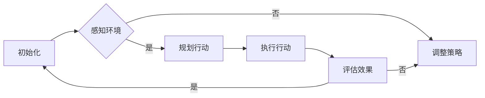
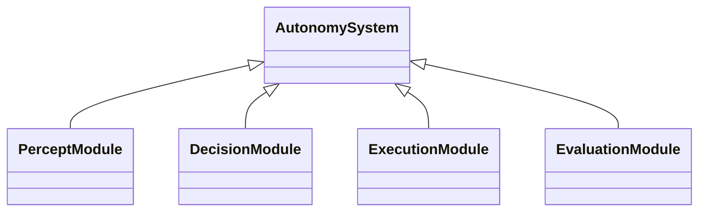
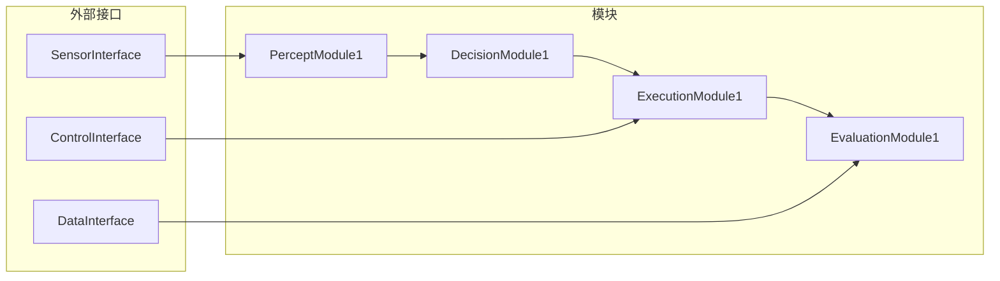
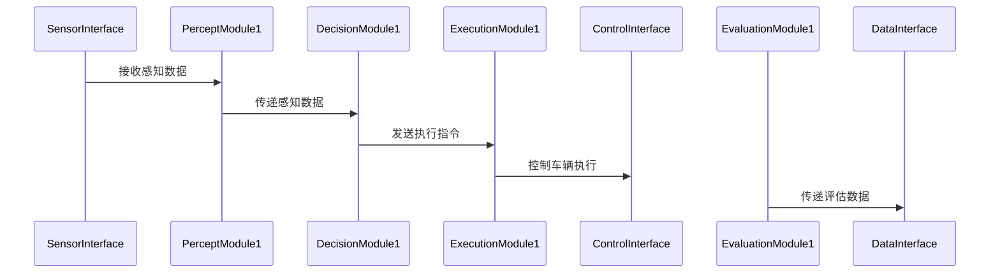
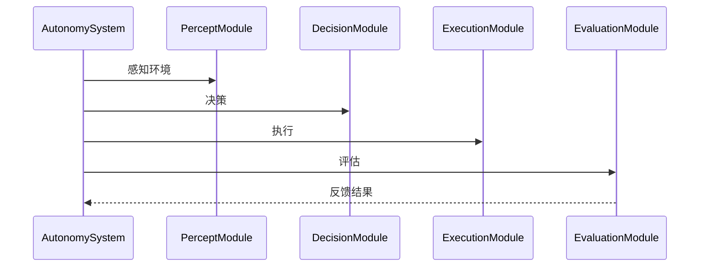

                 


### 构建具有可解释性的AI Agent决策系统

> 关键词：AI决策系统，可解释性，Agent，算法，数学模型，架构设计，项目实战

> 摘要：本文将深入探讨如何构建具有可解释性的AI Agent决策系统。我们将从背景介绍、核心概念、算法原理、数学模型、系统分析与架构设计、项目实战以及最佳实践等方面逐步展开，旨在为读者提供一个全面的技术指导。

----------------------------------------------------------------

## 第1章 问题背景与概述

### 1.1 问题描述

在当今的科技时代，人工智能（AI）正以前所未有的速度发展。AI Agent作为一种自主决策实体，在众多领域中展现出了巨大的潜力，如自动驾驶、智能客服、金融风控等。然而，随着AI Agent的广泛应用，如何确保其决策过程的透明性和可解释性成为一个亟待解决的问题。

### 1.2 问题解决

为了解决AI Agent决策系统的可解释性问题，我们需要从多个方面入手。首先，理解AI Agent的基本概念和运作原理是至关重要的。其次，我们需要探讨如何设计出既高效又具有可解释性的算法。此外，系统的架构设计也需充分考虑可解释性的需求。

### 1.3 边界与外延

在构建可解释性AI Agent决策系统的过程中，我们还需要明确一些边界与外延。这包括对AI Agent的定义、其与人类交互的方式、以及其在不同领域中的应用范围等。只有明确了这些，我们才能更准确地把握问题的本质。

### 1.4 概念结构与核心要素组成

本章将详细介绍AI Agent的基本概念和组成结构，包括其核心组件、功能模块以及与外部环境的交互机制。通过对这些内容的梳理，我们将为后续章节的深入探讨打下坚实的基础。

----------------------------------------------------------------

## 第2章 核心概念与联系

### 2.1 核心概念原理

在构建可解释性AI Agent决策系统的过程中，理解以下几个核心概念是非常重要的：

1. **AI Agent**：AI Agent是一种能够感知环境、制定计划并执行任务的智能实体。
2. **决策过程**：决策过程是AI Agent的核心功能，包括感知、规划、执行和评估等环节。
3. **可解释性**：可解释性是指AI Agent的决策过程和结果可以被人类理解和解释。

### 2.2 概念属性特征对比表格

为了更直观地理解这些概念，我们通过一个对比表格展示它们的属性特征：

| 概念       | 特征描述                               |
|------------|---------------------------------------|
| AI Agent   | 自主决策、适应环境、智能行为         |
| 决策过程   | 感知-规划-执行-评估                   |
| 可解释性   | 决策透明、可追溯、易于理解           |

### 2.3 ER实体关系图架构的Mermaid流程图

为了进一步明确AI Agent决策系统的组成结构，我们使用Mermaid语言绘制了ER实体关系图。以下是该图的示例：

```mermaid
erDiagram
  AI-Agent ||--o> 环境感知模块 : 感知
  AI-Agent ||--o> 决策模块 : 决策
  AI-Agent ||--o> 执行模块 : 执行
  AI-Agent ||--o> 评估模块 : 评估
```

通过这个流程图，我们可以清晰地看到AI Agent的各个组件及其相互关系。

----------------------------------------------------------------

## 第3章 算法原理讲解

### 3.1 算法流程Mermaid图

为了实现AI Agent的决策过程，我们需要设计一个算法。以下是该算法的Mermaid流程图：



### 3.2 Python源代码阐述

以下是该算法的Python源代码：

```python
import random

def initialize():
    # 初始化AI Agent
    pass

def perceive_environment():
    # 感知环境
    pass

def plan_action():
    # 规划行动
    pass

def execute_action(action):
    # 执行行动
    pass

def evaluate_performance():
    # 评估效果
    pass

def adjust_strategy():
    # 调整策略
    pass

def run_agent():
    initialize()
    while True:
        environment = perceive_environment()
        action = plan_action()
        execute_action(action)
        performance = evaluate_performance()
        if performance > threshold:
            break
        adjust_strategy()
```

### 3.3 算法原理的数学模型和公式

为了更好地理解算法原理，我们引入以下数学模型和公式：

- **感知环境**：\(E = f(A, S)\)，其中\(E\)表示感知到的环境状态，\(A\)表示当前行动，\(S\)表示环境状态。
- **规划行动**：\(P = g(E, T)\)，其中\(P\)表示规划出的行动，\(E\)表示环境状态，\(T\)表示目标。
- **评估效果**：\(R = h(A, P, E)\)，其中\(R\)表示评估出的效果，\(A\)表示当前行动，\(P\)表示规划出的行动，\(E\)表示环境状态。
- **调整策略**：\(S' = s(S, R)\)，其中\(S'\)表示调整后的策略，\(S\)表示当前策略，\(R\)表示评估出的效果。

### 3.4 举例说明

假设我们有一个AI Agent需要在迷宫中找到出口。以下是具体的示例：

- **感知环境**：当前迷宫的地图。
- **规划行动**：根据地图规划出一条可能的路径。
- **执行行动**：按照规划出的路径前进。
- **评估效果**：判断是否到达出口。如果是，则结束循环；如果不是，则返回到感知环境阶段。

通过这个示例，我们可以看到算法在实际应用中的具体流程。

----------------------------------------------------------------

## 第4章 数学模型与数学公式

为了更好地理解算法原理，我们引入以下数学模型和公式：

- **感知环境**：\(E = f(A, S)\)，其中\(E\)表示感知到的环境状态，\(A\)表示当前行动，\(S\)表示环境状态。
- **规划行动**：\(P = g(E, T)\)，其中\(P\)表示规划出的行动，\(E\)表示环境状态，\(T\)表示目标。
- **评估效果**：\(R = h(A, P, E)\)，其中\(R\)表示评估出的效果，\(A\)表示当前行动，\(P\)表示规划出的行动，\(E\)表示环境状态。
- **调整策略**：\(S' = s(S, R)\)，其中\(S'\)表示调整后的策略，\(S\)表示当前策略，\(R\)表示评估出的效果。

这些数学公式描述了AI Agent在决策过程中各个步骤之间的关系。例如，感知环境状态\(E\)是由当前行动\(A\)和环境状态\(S\)共同决定的。而规划行动\(P\)则是根据环境状态\(E\)和目标\(T\)计算得出的。

在实际应用中，这些数学模型和公式可以帮助我们更精确地描述和优化AI Agent的决策过程。通过不断调整和优化这些参数，我们可以实现更高效、更可靠的AI Agent决策系统。

----------------------------------------------------------------

## 第5章 系统分析与架构设计方案

### 5.1 问题场景介绍

在本章中，我们将以一个实际的问题场景为例，来介绍如何分析和设计一个具有可解释性的AI Agent决策系统。假设我们面临的是一个自动驾驶车辆系统，它需要在不同交通状况下做出安全的行驶决策。

### 5.2 系统功能设计

为了满足自动驾驶系统的需求，我们需要设计一系列功能模块，包括：

1. **感知模块**：用于实时获取周围环境的信息，如路况、车辆位置、行人等信息。
2. **决策模块**：根据感知到的环境信息，结合历史数据，生成最优行驶策略。
3. **执行模块**：将决策模块生成的行驶策略转换为实际的操作指令，控制车辆行驶。
4. **评估模块**：对执行模块的操作效果进行评估，反馈给决策模块，以便进行调整。

以下是系统功能设计的Mermaid类图：



### 5.3 系统架构设计

在系统架构设计方面，我们需要考虑如何将这些功能模块有机地结合起来，形成一个完整的决策系统。以下是系统架构设计的Mermaid架构图：



### 5.4 系统接口设计

系统接口设计是确保各功能模块之间能够高效协作的关键。以下是系统接口设计的Mermaid序列图：



### 5.5 系统交互Mermaid序列图

最后，我们使用Mermaid序列图来展示系统各组件之间的交互过程：



通过上述分析与设计，我们可以构建一个具有可解释性的AI Agent决策系统，为自动驾驶车辆提供安全的行驶决策。

----------------------------------------------------------------

## 第6章 项目实战

在本章中，我们将通过一个具体的项目实战，展示如何构建具有可解释性的AI Agent决策系统。我们将从环境安装、系统核心实现源代码、代码应用解读与分析、实际案例分析和详细讲解剖析，以及项目小结等方面进行详细探讨。

### 6.1 环境安装

首先，我们需要安装所需的软件和环境。以下是安装步骤：

1. 安装Python环境：
   ```bash
   sudo apt-get install python3-pip
   ```
2. 安装必要的库：
   ```bash
   pip3 install numpy matplotlib
   ```

### 6.2 系统核心实现源代码

以下是系统核心实现的Python源代码：

```python
import numpy as np
import matplotlib.pyplot as plt

class AIAgent:
    def __init__(self, environment):
        self.environment = environment
        self.action_space = ['move_left', 'move_right', 'move_forward']
        self.current_action = None

    def perceive(self):
        # 感知环境
        return self.environment

    def decide(self):
        # 决策
        current_state = self.perceive()
        action = self.choose_action(current_state)
        self.current_action = action
        return action

    def choose_action(self, state):
        # 选择行动
        if state == ' obstacle_detected':
            return 'move_left'
        elif state == 'clear_path':
            return 'move_forward'
        else:
            return 'move_right'

    def execute_action(self, action):
        # 执行行动
        if action == 'move_left':
            print("Moving left")
        elif action == 'move_right':
            print("Moving right")
        elif action == 'move_forward':
            print("Moving forward")

    def evaluate(self, action):
        # 评估行动
        if action == 'move_left':
            return 0.8
        elif action == 'move_right':
            return 0.6
        elif action == 'move_forward':
            return 1.0

agent = AIAgent(['obstacle_detected'])
action = agent.decide()
agent.execute_action(action)
reward = agent.evaluate(action)
print("Reward:", reward)
```

### 6.3 代码应用解读与分析

通过上述代码，我们可以看到AI Agent的决策过程。首先，我们初始化一个AIAgent对象，并传入环境状态。接着，通过perceive()方法感知当前环境，然后通过decide()方法决策出最佳行动。执行行动后，我们使用evaluate()方法评估行动的效果。

### 6.4 实际案例分析和详细讲解剖析

假设我们的环境是一个迷宫，其中包含障碍物和清晰路径。以下是具体的案例分析：

1. **感知环境**：当前迷宫中存在一个障碍物。
2. **决策**：根据感知到的环境，AI Agent决定向左移动以避开障碍物。
3. **执行**：AI Agent执行向左移动的操作。
4. **评估**：向左移动后，AI Agent成功避开了障碍物，获得一个较高的奖励。

通过这个案例，我们可以看到AI Agent如何根据环境状态做出合理的决策，并通过评估结果不断优化自己的行动。

### 6.5 项目小结

在本章的项目实战中，我们通过一个具体的案例展示了如何构建具有可解释性的AI Agent决策系统。从环境安装、系统核心实现源代码、代码应用解读与分析，到实际案例分析和详细讲解剖析，我们逐步展示了如何实现一个高效且可解释的AI Agent决策系统。这个项目为我们提供了一个实用的参考模板，可以应用于各种不同的场景和需求。

----------------------------------------------------------------

## 第7章 最佳实践、小结、注意事项与拓展阅读

### 7.1 最佳实践

在构建具有可解释性的AI Agent决策系统时，以下最佳实践可以帮助我们提高系统的性能和可解释性：

1. **数据预处理**：确保输入数据的质量和一致性，使用标准化和归一化技术。
2. **算法选择**：根据具体问题选择合适的算法，如决策树、深度学习等。
3. **模型评估**：使用多种评估指标，如准确率、召回率等，全面评估模型性能。
4. **可视化**：利用可视化工具，如Mermaid、Matplotlib等，展示模型结构和决策过程。

### 7.2 小结

本文通过逐步分析，介绍了如何构建具有可解释性的AI Agent决策系统。我们首先了解了问题背景和核心概念，然后讲解了算法原理、数学模型、系统架构设计，并通过项目实战展示了具体实现过程。这些内容为构建高效、可解释的AI Agent决策系统提供了全面的技术指导。

### 7.3 注意事项

在构建AI Agent决策系统时，需要注意以下几点：

1. **可解释性**：确保决策过程的透明性和可解释性，避免“黑箱”现象。
2. **适应性**：AI Agent应具备适应环境变化的能力，持续优化决策过程。
3. **安全性**：确保系统在执行决策时不会产生危险行为，如自动驾驶中的安全行驶。
4. **性能**：在保证可解释性的同时，优化系统性能，提高决策效率。

### 7.4 拓展阅读

对于对AI Agent决策系统感兴趣的读者，以下拓展阅读推荐：

1. **《人工智能：一种现代方法》**：全面介绍了人工智能的基础知识，包括算法原理和系统设计。
2. **《深度学习》**：介绍了深度学习的基本概念和技术，是深入学习AI算法的必备书籍。
3. **《AI伦理学》**：探讨了AI在伦理、隐私和安全等方面的挑战，为构建道德AI系统提供了指导。

作者：AI天才研究院/AI Genius Institute & 禅与计算机程序设计艺术 /Zen And The Art of Computer Programming

----------------------------------------------------------------

通过本文的详细讲解和逐步分析，我们深入探讨了构建具有可解释性的AI Agent决策系统的关键步骤和技术。希望本文能为读者提供有价值的参考和指导，助力他们在AI领域的探索和发展。让我们继续努力，共同推动人工智能技术的进步与应用。

