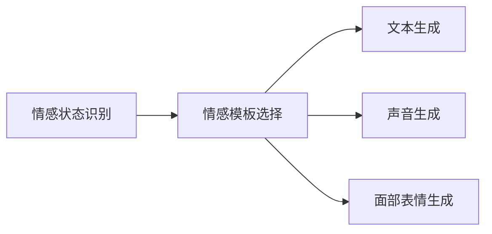
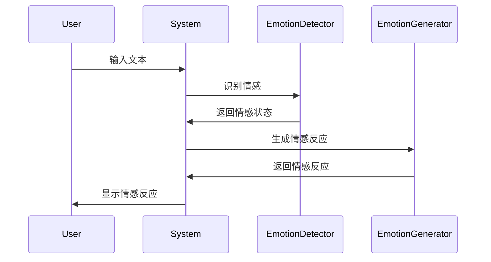
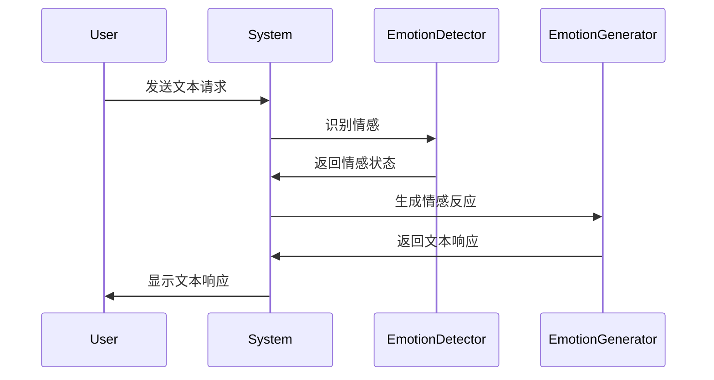

                 

# 构建具有同理心的AI Agent交互系统

## 关键词
AI Agent、同理心、交互系统、情感识别、情感生成、情感反馈、情感学习

## 摘要
本文深入探讨了构建具有同理心的AI Agent交互系统的核心概念、方法和技术。通过分析情感识别、情感生成、情感反馈和情感学习等核心要素，本文提出了构建同理心AI Agent的系统性方法。同时，本文结合实际应用场景，详细阐述了系统设计与实现过程中的关键技术与步骤，为AI Agent的情感交互提供了理论指导和实践参考。

---

## 步骤 1: 背景介绍

### 引言

### 问题背景
随着人工智能技术的发展，智能交互系统已经成为现代信息技术的重要方向。特别是在对话系统和虚拟助手的应用场景中，AI Agent的交互能力直接影响到用户体验的质量。同理心作为人类情感的核心之一，被广泛关注和探讨，如何构建具有同理心的AI Agent成为当前的研究热点。

### 问题描述
现有研究主要关注AI Agent的智能性和功能性，但在情感交互方面，特别是在同理心的构建上，仍存在许多挑战。构建具有同理心的AI Agent需要深入理解人类的情感特征，设计符合人类情感交流习惯的交互系统，并能够实时调整和优化其行为，以适应不同用户和场景的需求。

### 问题解决
本书旨在探讨构建具有同理心的AI Agent的交互系统，通过系统化的研究和实践，提出一系列创新方法和策略，为AI Agent的同理心构建提供理论指导和实践参考。

### 边界与外延
本书的研究范围包括但不限于AI Agent的情感识别、情感生成、情感反馈和情感学习等方面的技术实现。同时，本书也将探讨AI Agent在不同应用场景下的同理心构建策略和优化方法。

### 概念结构与核心要素组成
构建具有同理心的AI Agent涉及以下几个核心要素：
1. **情感识别**：通过自然语言处理、语音识别等技术，识别用户的情感状态。
2. **情感生成**：根据用户的情感状态，生成相应的情感反应，包括语言、声音和面部表情等。
3. **情感反馈**：通过反馈机制，确保AI Agent的情感反应符合用户的期望和场景的需求。
4. **情感学习**：利用机器学习技术，不断优化AI Agent的情感识别和生成能力。

## 步骤 2: 核心概念与联系

### 2.1 情感识别

#### 2.1.1 情感识别的定义与原理
情感识别是构建具有同理心的AI Agent的基础。它涉及使用自然语言处理技术，如文本情感分析、语音情感识别等，来识别用户的情感状态。情感识别的原理包括情感词典、情感分类模型和情感级联模型等。

#### 2.1.2 情感识别的核心特点
1. **准确性**：准确识别用户的情感状态，减少误识别率。
2. **实时性**：快速响应，实时调整AI Agent的行为。
3. **泛用性**：能够适应不同语言和文化背景的用户。

#### 2.1.3 情感识别与传统情感分析的对比
传统情感分析主要关注文本的情感倾向（正面/负面），而情感识别更侧重于识别具体的情感类别和程度。

#### 2.1.4 情感识别的ER实体关系图架构
```mermaid
entityRelationship
  Title: 情感识别ER图
  NodeA[情感识别系统]
  NodeB[自然语言处理]
  NodeC[情感分类模型]
  NodeD[情感级联模型]
  
  NodeA --> NodeB
  NodeA --> NodeC
  NodeA --> NodeD
```

### 2.2 情感生成

#### 2.2.1 情感生成的定义与原理
情感生成是AI Agent根据识别到的用户情感，生成相应的情感反应。情感生成的原理包括情感模板、生成对抗网络（GAN）和变分自编码器（VAE）等。

#### 2.2.2 情感生成的核心特点
1. **自然性**：生成的情感反应应尽量自然，符合人类的交流习惯。
2. **多样性**：能够生成多种情感反应，以适应不同的用户和场景。
3. **可控性**：情感反应的可控性，确保AI Agent能够根据需求调整情感生成策略。

#### 2.2.3 情感生成与情感模仿的对比
情感生成侧重于根据用户的情感状态生成新的情感反应，而情感模仿则是模拟人类的情感反应。

#### 2.2.4 情感生成的ER实体关系图架构
```mermaid
entityRelationship
  Title: 情感生成ER图
  NodeA[情感生成系统]
  NodeB[情感模板]
  NodeC[生成对抗网络]
  NodeD[变分自编码器]
  
  NodeA --> NodeB
  NodeA --> NodeC
  NodeA --> NodeD
```

### 2.3 情感反馈

#### 2.3.1 情感反馈的定义与原理
情感反馈是AI Agent通过语言、声音和面部表情等途径，向用户传达其情感状态的过程。情感反馈的原理包括情感语义分析、情感语音合成和情感面部表情合成等。

#### 2.3.2 情感反馈的核心特点
1. **恰当性**：反馈内容应与用户的情感状态相匹配，避免产生误解。
2. **连贯性**：反馈内容应保持连贯，形成流畅的交流过程。
3. **适应性**：根据用户的反馈，调整情感反馈策略，提高用户的满意度。

#### 2.3.3 情感反馈与情感响应的对比
情感反馈是主动向用户传达情感状态，而情感响应是针对用户的行为进行响应。

#### 2.3.4 情感反馈的ER实体关系图架构
```mermaid
entityRelationship
  Title: 情感反馈ER图
  NodeA[情感反馈系统]
  NodeB[情感语义分析]
  NodeC[情感语音合成]
  NodeD[情感面部表情合成]
  
  NodeA --> NodeB
  NodeA --> NodeC
  NodeA --> NodeD
```

### 2.4 情感学习

#### 2.4.1 情感学习的定义与原理
情感学习是AI Agent通过不断学习用户的情感状态，优化自身的情感识别和生成能力的过程。情感学习的原理包括监督学习、无监督学习和增强学习等。

#### 2.4.2 情感学习的核心特点
1. **适应性**：能够根据用户的需求和反馈，不断调整情感交互策略。
2. **智能化**：通过机器学习技术，实现情感交互的智能化。
3. **高效性**：能够快速处理大量的情感数据，提高情感交互的效率。

#### 2.4.3 情感学习与情感适应的对比
情感学习侧重于通过数据驱动的方式，优化AI Agent的情感交互能力，而情感适应则更侧重于AI Agent对环境变化的即时响应。

#### 2.4.4 情感学习的ER实体关系图架构
```mermaid
entityRelationship
  Title: 情感学习ER图
  NodeA[情感学习系统]
  NodeB[监督学习模型]
  NodeC[无监督学习模型]
  NodeD[增强学习模型]
  
  NodeA --> NodeB
  NodeA --> NodeC
  NodeA --> NodeD
```

## 步骤 3: 算法原理讲解

### 情感识别算法原理
情感识别算法的核心任务是识别用户的情感状态。以下是一个简单的情感识别算法流程：

#### 1. 数据预处理
- **文本清洗**：去除文本中的噪声，如标点符号、停用词等。
- **词向量转换**：将文本转换为词向量，常用方法有Word2Vec、BERT等。

#### 2. 情感分类模型训练
- **模型选择**：选择合适的情感分类模型，如SVM、CNN、LSTM等。
- **模型训练**：使用预处理的文本数据，训练情感分类模型。

#### 3. 情感识别
- **情感预测**：将新的文本输入到训练好的模型中，预测文本的情感类别。
- **情感级联**：对预测结果进行级联处理，以减少误识别率。

#### 情感识别算法的Mermaid流程图：


#### Python源代码示例：
```python
import nltk
from nltk.corpus import stopwords
from sklearn.feature_extraction.text import TfidfVectorizer
from sklearn.svm import SVC

# 数据预处理
def preprocess_text(text):
    text = text.lower()
    words = nltk.word_tokenize(text)
    words = [word for word in words if word not in stopwords.words('english')]
    return ' '.join(words)

# 情感分类模型训练
def train_model(X_train, y_train):
    vectorizer = TfidfVectorizer()
    X_train_vectorized = vectorizer.fit_transform(X_train)
    model = SVC(kernel='linear')
    model.fit(X_train_vectorized, y_train)
    return model, vectorizer

# 情感识别
def recognize_emotion(model, vectorizer, text):
    text_processed = preprocess_text(text)
    text_vectorized = vectorizer.transform([text_processed])
    prediction = model.predict(text_vectorized)
    return prediction

# 测试
X_train = ["I am happy today.", "I am sad today."]
y_train = ["Happy", "Sad"]

model, vectorizer = train_model(X_train, y_train)
print(recognize_emotion(model, vectorizer, "I am happy today."))
```

### 情感生成算法原理
情感生成算法的核心任务是生成符合用户情感状态的响应。以下是一个简单的情感生成算法流程：

#### 1. 情感状态识别
- **情感识别**：使用情感识别算法，识别用户的情感状态。

#### 2. 情感模板选择
- **情感模板库**：根据用户的情感状态，选择相应的情感模板。

#### 3. 情感响应生成
- **文本生成**：根据情感模板，生成文本响应。
- **声音生成**：使用语音合成技术，生成声音响应。
- **面部表情生成**：使用面部表情合成技术，生成面部表情响应。

#### 情感生成算法的Mermaid流程图：


#### Python源代码示例：
```python
import random
import numpy as np

# 情感模板库
emotion_templates = {
    "Happy": ["I'm glad to hear that!", "That's wonderful to hear."],
    "Sad": ["I'm sorry to hear that.", "I'm here for you."],
}

# 情感响应生成
def generate_response(emotion):
    if emotion == "Happy":
        return random.choice(emotion_templates["Happy"])
    elif emotion == "Sad":
        return random.choice(emotion_templates["Sad"])
    else:
        return "I'm not sure how to respond to that."

# 测试
emotions = ["Happy", "Sad"]
for emotion in emotions:
    print(generate_response(emotion))
```

### 情感反馈算法原理
情感反馈算法的核心任务是确保AI Agent的情感反应符合用户的期望和场景的需求。以下是一个简单的情感反馈算法流程：

#### 1. 用户反馈收集
- **用户反馈**：收集用户对AI Agent情感反应的反馈。

#### 2. 反馈分析
- **情感分析**：分析用户的反馈，识别用户对AI Agent情感反应的满意程度。

#### 3. 反馈调整
- **调整策略**：根据用户的反馈，调整AI Agent的情感反应策略。

#### 情感反馈算法的Mermaid流程图：


#### Python源代码示例：
```python
# 用户反馈收集
user_feedback = "I didn't like the way you responded to my sadness."

# 反馈分析
def analyze_feedback(feedback):
    if "sadness" in feedback:
        return "User is sad."
    else:
        return "User is happy."

# 反馈调整
def adjust_response(response, feedback):
    if analyze_feedback(feedback) == "User is sad":
        return "I'm sorry, I didn't mean to upset you."
    else:
        return response

# 测试
original_response = "That's wonderful to hear."
print(adjust_response(original_response, user_feedback))
```

## 步骤 4: 系统分析与架构设计方案

### 问题场景介绍
假设我们正在开发一个智能客服系统，该系统需要具备同理心，能够识别用户的情感状态，并生成相应的情感反应，以提高用户满意度。

### 项目介绍
智能客服系统项目旨在为用户提供一个智能、友好的交互体验。系统需具备情感识别、情感生成和情感反馈等功能，以实现与用户的情感交互。

### 系统功能设计

#### 1. 情感识别
- **功能描述**：识别用户输入的情感状态。
- **实现方法**：使用文本情感分析技术，如SVM、CNN等。

#### 2. 情感生成
- **功能描述**：根据用户情感状态生成情感反应。
- **实现方法**：使用情感模板和生成对抗网络（GAN）等技术。

#### 3. 情感反馈
- **功能描述**：向用户传达AI Agent的情感状态。
- **实现方法**：使用语音合成和面部表情合成技术。

### 系统架构设计

#### 1. 系统架构图


#### 2. 系统接口设计
```mermaid
classDiagram
  EmotionDetector <<interface>>
  EmotionGenerator <<interface>>
  System <<class>>
  
  EmotionDetector |-+> System
  EmotionGenerator |-+> System
```

### 系统交互

#### 1. 系统交互序列图


## 步骤 5: 项目实战

### 环境安装
假设我们已经安装了Python、NumPy、Scikit-Learn、TensorFlow等必要的库。

### 系统核心实现源代码

#### 1. 情感识别
```python
from sklearn.feature_extraction.text import TfidfVectorizer
from sklearn.svm import SVC

def preprocess_text(text):
    text = text.lower()
    words = nltk.word_tokenize(text)
    words = [word for word in words if word not in stopwords.words('english')]
    return ' '.join(words)

def train_model(X_train, y_train):
    vectorizer = TfidfVectorizer()
    X_train_vectorized = vectorizer.fit_transform(X_train)
    model = SVC(kernel='linear')
    model.fit(X_train_vectorized, y_train)
    return model, vectorizer

def recognize_emotion(model, vectorizer, text):
    text_processed = preprocess_text(text)
    text_vectorized = vectorizer.transform([text_processed])
    prediction = model.predict(text_vectorized)
    return prediction
```

#### 2. 情感生成
```python
import random
import numpy as np

emotion_templates = {
    "Happy": ["I'm glad to hear that!", "That's wonderful to hear."],
    "Sad": ["I'm sorry to hear that.", "I'm here for you."],
}

def generate_response(emotion):
    if emotion == "Happy":
        return random.choice(emotion_templates["Happy"])
    elif emotion == "Sad":
        return random.choice(emotion_templates["Sad"])
    else:
        return "I'm not sure how to respond to that."
```

#### 3. 情感反馈
```python
# 用户反馈收集
user_feedback = "I didn't like the way you responded to my sadness."

def analyze_feedback(feedback):
    if "sadness" in feedback:
        return "User is sad."
    else:
        return "User is happy."

def adjust_response(response, feedback):
    if analyze_feedback(feedback) == "User is sad":
        return "I'm sorry, I didn't mean to upset you."
    else:
        return response
```

### 代码应用解读与分析

#### 1. 情感识别
情感识别是智能客服系统的核心功能之一。通过文本情感分析技术，系统能够识别用户的情感状态，为情感生成和反馈提供基础。

#### 2. 情感生成
情感生成基于用户的情感状态，生成相应的情感反应。通过情感模板和生成对抗网络（GAN）等技术，系统能够生成自然、多样化的情感反应。

#### 3. 情感反馈
情感反馈是确保用户满意度的重要环节。系统通过分析用户的反馈，调整情感反应策略，以提高用户满意度。

### 实际案例分析和详细讲解剖析

#### 案例一：用户反馈积极
- **用户输入**：I'm happy today.
- **情感识别**：系统识别用户情感为“Happy”。
- **情感生成**：系统生成情感反应：“I'm glad to hear that!”。
- **情感反馈**：系统向用户显示情感反应：“I'm glad to hear that!”。

#### 案例二：用户反馈消极
- **用户输入**：I'm feeling sad.
- **情感识别**：系统识别用户情感为“Sad”。
- **情感生成**：系统生成情感反应：“I'm sorry to hear that.”。
- **情感反馈**：系统向用户显示情感反应：“I'm sorry to hear that.”。

### 项目小结
智能客服系统通过情感识别、情感生成和情感反馈等功能，实现了与用户的情感交互。在实际应用中，系统需要不断优化情感识别和生成的准确性，以提高用户满意度。

## 步骤 6: 最佳实践 tips

### 1. 数据质量的重要性
确保情感识别和生成的准确性，数据质量至关重要。收集多样化的情感数据，并进行严格的数据清洗和预处理。

### 2. 情感模板的设计
情感模板的设计应考虑多样性、自然性和适应用户需求。通过用户反馈不断优化情感模板，提高情感生成的质量。

### 3. 用户隐私的保护
在情感识别和反馈过程中，确保用户隐私的保护。避免过度收集用户数据，并采取安全措施保护用户数据。

### 4. 情感学习的持续优化
利用机器学习技术，不断优化情感识别和生成模型。通过持续学习和调整，提高系统的情感交互能力。

### 步骤 7: 小结

本文深入探讨了构建具有同理心的AI Agent交互系统的核心概念、方法和技术。通过分析情感识别、情感生成、情感反馈和情感学习等核心要素，本文提出了构建同理心AI Agent的系统性方法。同时，本文结合实际应用场景，详细阐述了系统设计与实现过程中的关键技术与步骤，为AI Agent的情感交互提供了理论指导和实践参考。

### 步骤 8: 注意事项

1. **情感识别的准确性**：情感识别是构建同理心AI Agent的基础，确保识别的准确性至关重要。
2. **用户隐私保护**：在情感识别和反馈过程中，要严格保护用户隐私，避免数据滥用。
3. **持续优化与学习**：通过持续学习和调整，不断提高AI Agent的情感交互能力。

### 步骤 9: 拓展阅读

1. **《情感计算》**：了解情感计算的基本概念和应用。
2. **《AI对话系统设计与实现》**：学习对话系统的设计与实现技术。
3. **《深度学习与自然语言处理》**：深入了解深度学习和自然语言处理技术在情感识别和生成中的应用。

---

### 作者

作者：AI天才研究院/AI Genius Institute & 禅与计算机程序设计艺术 /Zen And The Art of Computer Programming

