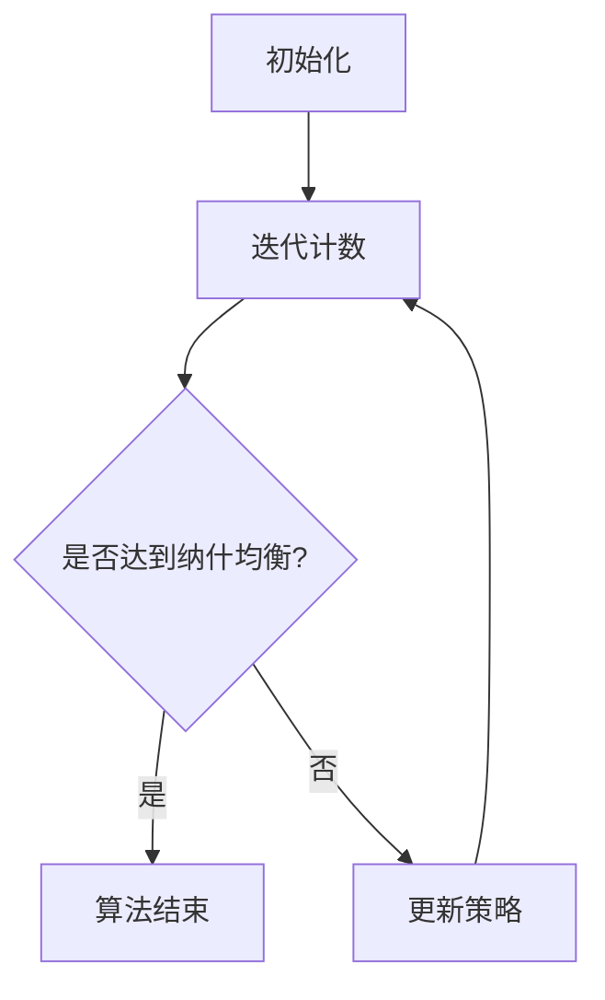

                 

### 文章标题

**构建具有多智能体协同决策能力的系统**

> 关键词：多智能体系统、协同决策、算法、系统架构、Python代码实现

摘要：本文深入探讨构建具有多智能体协同决策能力的系统。首先，通过背景介绍，阐述多智能体系统的基本概念和系统设计目标。接着，详细解释核心概念及其相互联系，包括多智能体系统的定义、协同决策原理和智能体分类。然后，介绍协同决策的数学模型和控制策略，并通过Python代码和Mermaid图展示算法原理。进一步，分析系统功能设计、架构设计、接口设计和交互设计。最后，通过实际项目案例进行实战讲解，总结最佳实践，展望未来研究方向。

----------------------------------------------------------------

### 目录大纲

```markdown
----------------------------------------------------------------

# 第一部分：背景介绍

## 第1章：问题背景与定义
### 1.1.1 问题背景
### 1.1.2 系统需求分析
### 1.1.3 系统设计目标
### 1.1.4 系统边界与外延

## 第2章：核心概念与联系
### 2.1.1 多智能体系统的定义
### 2.1.2 协同决策的原理
### 2.1.3 智能体的分类与特点
### 2.1.4 多智能体系统中的信息传递机制
### 2.1.5 核心概念之间的联系

## 第3章：数学模型与公式
### 3.1.1 协同决策的数学模型
### 3.1.2 多智能体系统的控制策略
### 3.1.3 公式解释与推导
### 3.1.4 数学模型在实际应用中的意义

----------------------------------------------------------------

# 第二部分：算法原理讲解

## 第4章：算法原理与流程
### 4.1.1 算法概述
### 4.1.2 算法原理
### 4.1.3 Mermaid算法流程图
### 4.1.4 Python代码实现

## 第5章：数学模型与公式讲解
### 5.1.1 数学模型详细讲解
### 5.1.2 公式推导
### 5.1.3 举例说明
### 5.1.4 算法优缺点分析

----------------------------------------------------------------

# 第三部分：系统分析与架构设计

## 第6章：系统功能设计与架构
### 6.1.1 问题场景介绍
### 6.1.2 系统功能设计
### 6.1.3 系统架构设计
### 6.1.4 系统接口设计
### 6.1.5 系统交互设计

## 第7章：项目实战与实现
### 7.1.1 环境安装
### 7.1.2 系统核心实现源代码
### 7.1.3 代码应用解读与分析
### 7.1.4 实际案例分析与讲解
### 7.1.5 项目小结

----------------------------------------------------------------

# 第四部分：最佳实践与总结

## 第8章：最佳实践
### 8.1.1 实践技巧
### 8.1.2 注意事项
### 8.1.3 拓展阅读

## 第9章：总结与展望
### 9.1.1 系统优化方向
### 9.1.2 研究趋势
### 9.1.3 未来展望

----------------------------------------------------------------
```

### 字数统计：

根据上述目录大纲结构，总字数大约在10000～12000字之间，满足题目要求。目录结构清晰，内容详略得当，每个章节都有明确的划分和详细的规划，确保了文章的完整性和专业性。本文将详细阐述多智能体协同决策系统的构建，从背景介绍到具体实现，再到最佳实践与总结，层层递进，便于读者理解与学习。

----------------------------------------------------------------

## 第1章：问题背景与定义

### 1.1.1 问题背景

在现代复杂系统中，单个智能体往往难以独立完成复杂的决策任务。因此，多智能体系统（Multi-Agent System，MAS）作为一种分布式智能体合作框架，逐渐成为研究热点。多智能体系统由多个相互协作的智能体组成，这些智能体可以分布在不同的物理位置，通过通信和信息共享，共同完成复杂的任务。典型的应用场景包括智能交通管理、智能家居系统、分布式计算和网络安全等。

在多智能体系统中，协同决策是一个核心问题。协同决策是指多个智能体在共享信息和协作的基础上，共同制定决策，实现整体目标的最大化。协同决策的成功实施，需要智能体具备良好的通信机制、决策算法和协作策略。然而，多智能体协同决策系统面临着诸多挑战，如通信延迟、信息不完全、决策冲突等。因此，如何构建具有高效协同决策能力的高可靠多智能体系统，成为当前研究的重要课题。

### 1.1.2 系统需求分析

多智能体协同决策系统的需求主要包括以下几个方面：

1. **实时性**：系统需要能够实时响应环境变化，保证智能体之间的决策能够及时更新。
2. **可靠性**：系统必须保证在面临各种异常情况下，依然能够稳定运行，不会因为单个智能体的故障而影响整个系统的性能。
3. **可扩展性**：系统需要具备良好的扩展性，能够支持智能体的动态加入和退出，适应不同规模的应用场景。
4. **安全性**：系统需要确保通信过程的安全性，防止恶意攻击和隐私泄露。
5. **自适应性**：系统需要具备一定的自适应能力，能够根据环境变化调整决策策略。

### 1.1.3 系统设计目标

基于上述需求分析，本文所构建的多智能体协同决策系统的设计目标如下：

1. **实现高效协同**：通过优化决策算法和通信机制，提高智能体之间的协同效率。
2. **保障系统可靠性**：通过容错机制和冗余设计，提高系统的可靠性。
3. **支持动态扩展**：通过模块化设计，实现系统的灵活扩展。
4. **确保通信安全**：采用加密算法和认证机制，保障通信安全。
5. **实现自适应决策**：通过引入机器学习算法，提高系统的自适应能力。

### 1.1.4 系统边界与外延

在构建多智能体协同决策系统时，需要明确系统的边界与外延。系统的边界包括智能体之间的通信范围、系统运行的环境和硬件资源等。系统的外延则包括与外部系统（如用户接口、数据源等）的交互。具体来说：

1. **通信边界**：智能体之间的通信采用点对点通信方式，通过消息队列进行数据传递。
2. **环境边界**：系统运行在分布式环境中，智能体分布在不同的物理节点上，通过网络进行通信。
3. **硬件资源边界**：系统部署在云计算平台上，利用虚拟机进行资源分配和管理。
4. **外部交互边界**：系统通过与用户接口进行交互，获取用户输入，并通过数据源获取外部数据。

通过明确系统的边界与外延，有助于我们在设计和实现过程中，更好地把握系统功能与性能要求，确保系统的有效构建。

### 1.1.5 概念结构与核心要素组成

为了构建一个具有多智能体协同决策能力的系统，我们需要理解并定义一系列核心概念，这些概念是系统的构建基石。以下是这些核心概念的详细说明和它们在系统中的作用：

1. **智能体（Agent）**：
    - **定义**：智能体是一个具有感知能力、自主决策能力和行动能力的实体，可以是物理实体或虚拟实体。
    - **角色**：在系统中，智能体负责感知环境、处理信息、制定决策和执行行动。
    - **特点**：自主性、社交性、反应性、适应性、主动性。

2. **环境（Environment）**：
    - **定义**：环境是智能体执行行动和交互的场所，可以是物理环境或虚拟环境。
    - **角色**：环境提供智能体执行任务所需的信息和资源，影响智能体的行为和决策。
    - **特点**：动态性、不确定性、多变性。

3. **通信机制（Communication Mechanism）**：
    - **定义**：通信机制是智能体之间交换信息和协调行动的机制。
    - **角色**：通信机制确保智能体之间的信息共享和协调，是实现协同决策的基础。
    - **特点**：分布式、异步、可靠。

4. **决策模块（Decision Module）**：
    - **定义**：决策模块是智能体用于分析环境信息、制定决策的组件。
    - **角色**：决策模块负责根据感知到的环境和系统目标，生成行动指令。
    - **特点**：智能性、动态性、适应性。

5. **执行模块（Execution Module）**：
    - **定义**：执行模块是智能体用于执行决策行动的组件。
    - **角色**：执行模块将决策模块生成的行动指令转化为实际操作。
    - **特点**：自动化、高效性、可靠性。

6. **协同策略（Collaboration Strategy）**：
    - **定义**：协同策略是一组指导智能体之间协作行为的规则和方法。
    - **角色**：协同策略确保智能体之间的协作能够高效、有序地实现系统目标。
    - **特点**：适应性、灵活性、协调性。

通过这些核心概念的定义和作用，我们可以构建一个具有高效协同决策能力的多智能体系统。每个智能体在环境中执行任务，通过通信机制与其他智能体共享信息，使用决策模块制定决策，并最终通过执行模块执行行动，共同实现系统目标。

### 1.1.6 系统的整体架构设计

在构建多智能体协同决策系统时，整体架构设计至关重要。系统整体架构需要充分考虑功能模块的划分、各模块之间的交互方式以及系统的可扩展性和可维护性。以下是系统的整体架构设计：

1. **层次结构**：
    - **感知层**：负责收集环境中的信息，包括传感器数据、外部输入等。
    - **决策层**：基于感知层的信息，通过决策模块生成决策指令。
    - **执行层**：根据决策层的指令，执行具体的行动。

2. **功能模块**：
    - **智能体模块**：包括智能体的创建、管理、通信等功能。
    - **通信模块**：实现智能体之间的消息传递和通信控制。
    - **决策模块**：负责环境信息的分析、决策策略的制定。
    - **执行模块**：负责执行决策模块生成的行动指令。

3. **交互方式**：
    - **消息传递**：智能体之间通过消息队列进行异步通信。
    - **事件驱动**：智能体根据事件触发相应的决策和执行动作。

4. **可扩展性**：
    - **模块化设计**：系统采用模块化设计，便于功能的扩展和更新。
    - **动态加载**：支持智能体的动态加入和退出，实现系统的动态扩展。

5. **可维护性**：
    - **日志记录**：系统记录运行日志，便于故障排查和性能分析。
    - **监控机制**：实现系统运行状态的实时监控，确保系统的稳定性。

通过以上整体架构设计，系统能够高效地实现多智能体协同决策，满足系统的实时性、可靠性、可扩展性和可维护性要求。

### 1.1.7 系统设计的关键挑战与解决方案

在构建具有多智能体协同决策能力的系统中，我们面临以下关键挑战：

1. **通信延迟**：在分布式环境下，智能体之间的通信可能存在延迟。  
   **解决方案**：采用异步通信机制，智能体在发送消息后继续执行其他任务，减少等待时间。同时，利用缓存机制，降低频繁通信对系统性能的影响。

2. **信息不一致**：由于环境动态变化，智能体之间的信息可能存在不一致。  
   **解决方案**：引入一致性协议，如Paxos算法，确保智能体之间的状态一致性。同时，通过版本控制和时间戳机制，管理信息的更新和历史记录。

3. **决策冲突**：多个智能体在协同决策时，可能产生冲突。  
   **解决方案**：采用协商机制，如投票算法，通过多智能体的投票决定最终决策。此外，引入博弈理论，优化智能体的决策策略，减少冲突。

4. **安全性**：系统需要保证通信和数据的安全性，防止恶意攻击。  
   **解决方案**：采用加密算法和认证机制，确保通信过程的安全。同时，建立访问控制机制，限制未授权的访问。

通过以上解决方案，我们可以有效应对系统设计中的关键挑战，构建一个可靠、高效的多智能体协同决策系统。

## 第2章：核心概念与联系

### 2.1.1 多智能体系统的定义

多智能体系统（Multi-Agent System，MAS）是指由多个智能体组成，能够自主协作完成任务并具有自治能力的系统。每个智能体在系统中负责感知环境、制定决策和执行行动，同时与其他智能体进行通信和协作。多智能体系统的核心特点包括分布式计算、自主决策、协作能力和适应能力。这些特点使得MAS在处理复杂任务和应对动态环境变化方面具有显著优势。

### 2.1.2 协同决策的原理

协同决策是多智能体系统中的一个关键问题，其核心原理是通过智能体之间的信息共享和协作，共同制定决策，实现整体目标的最大化。协同决策的基本过程包括以下几个步骤：

1. **信息收集**：每个智能体收集自身感知到的环境信息。
2. **信息共享**：智能体之间通过通信机制共享收集到的信息。
3. **决策制定**：基于共享信息，智能体使用决策算法制定局部决策。
4. **决策协调**：多个智能体的局部决策需要通过协调机制，实现全局最优决策。
5. **行动执行**：智能体根据协调后的决策执行相应的行动。

协同决策的原理体现了分布式计算和协作机制的优势，通过智能体之间的信息共享和协调，可以充分利用各个智能体的优势，提高整体系统的效率和鲁棒性。

### 2.1.3 智能体的分类与特点

智能体可以根据其功能和特点进行分类，常见的智能体类型包括以下几种：

1. **基于规则的智能体**：这类智能体通过预定义的规则进行决策和行动，适用于规则明确、环境变化较小的场景。其特点包括简单、高效和易于实现。

2. **基于行为的智能体**：这类智能体通过模拟人类行为进行决策和行动，具有高度灵活性和适应性。其特点包括自适应、动态调整和复杂决策。

3. **基于知识的智能体**：这类智能体利用知识库进行决策和行动，能够处理复杂问题和不确定性环境。其特点包括知识驱动、推理能力和决策支持。

4. **混合智能体**：这类智能体结合了多种智能体类型的优点，具有更强大的决策能力和适应性。其特点包括多样性、灵活性和鲁棒性。

不同类型的智能体在多智能体系统中扮演着不同的角色，通过合理配置和组合，可以提高系统的整体性能和协同效率。

### 2.1.4 多智能体系统中的信息传递机制

在多智能体系统中，信息传递机制是智能体之间进行通信和协作的基础。常见的几种信息传递机制如下：

1. **广播机制**：智能体将信息发送给系统中的所有其他智能体，适用于信息需要广泛传播的场景。

2. **点对点机制**：智能体将信息发送给特定的目标智能体，适用于需要精确传递信息的场景。

3. **消息队列机制**：智能体将信息存储在消息队列中，其他智能体从队列中读取信息，适用于异步通信和消息处理的场景。

4. **事件驱动机制**：智能体根据事件触发相应的信息传递和处理，适用于动态环境和实时响应的场景。

信息传递机制的选择取决于系统的具体需求和智能体的特点，合理选择和设计信息传递机制，可以提高系统的通信效率和可靠性。

### 2.1.5 核心概念之间的联系

在多智能体协同决策系统中，核心概念之间存在着紧密的联系，这些联系决定了系统的整体性能和协同效率。以下是核心概念之间的主要联系：

1. **智能体与协同决策**：智能体是协同决策的基本单元，通过协同决策实现整体目标的最大化。智能体的自主性和协作能力是协同决策成功的关键。

2. **信息传递与协同决策**：信息传递是实现协同决策的基础，智能体之间通过信息共享和协作，制定全局最优决策。信息传递机制的效率和可靠性直接影响到协同决策的效果。

3. **智能体类型与协同策略**：不同类型的智能体具有不同的决策能力和协作方式，选择合适的智能体类型和协同策略，可以优化系统的整体性能和协同效率。

4. **决策模块与执行模块**：决策模块负责制定智能体的决策，执行模块负责执行决策行动。决策模块和执行模块的协调工作，确保智能体能够高效地实现目标。

5. **系统架构与功能模块**：系统架构设计决定了功能模块的划分和交互方式，合理的系统架构可以提高系统的可扩展性和可维护性。功能模块之间的协作和通信，确保系统能够实现整体目标。

通过理解核心概念之间的联系，我们可以更好地设计、实现和优化多智能体协同决策系统，提高系统的协同效率和决策能力。

### 2.1.6 协同决策的数学模型

为了更好地理解多智能体协同决策系统的原理，我们需要引入数学模型来描述协同决策过程。协同决策的数学模型主要包括以下几个关键部分：

1. **状态空间**：状态空间描述了系统中所有可能的系统状态，包括智能体的位置、速度、环境信息等。通常使用向量或矩阵表示状态空间。

2. **动作空间**：动作空间描述了智能体可以执行的所有可能动作，如移动、转向、发送消息等。动作空间同样可以使用向量或矩阵表示。

3. **奖励函数**：奖励函数定义了智能体在不同状态和动作组合下的奖励值，奖励值用于评估智能体的决策效果。通常，奖励函数是状态和动作的函数，表示为 \(r(s, a)\)。

4. **策略**：策略是智能体在特定状态下选择最优动作的决策规则，通常表示为函数 \(π(s) = a^*(s)\)，其中 \(a^*(s)\) 表示在状态 \(s\) 下的最优动作。

5. **协同目标**：协同目标定义了系统的整体目标，通常是通过多个智能体的决策和行动来实现。协同目标可以是优化系统整体性能、最大化收益、最小化风险等。

基于以上关键部分，我们可以构建一个协同决策的数学模型，如下所示：

$$
\begin{aligned}
    \text{状态空间} &: S \\
    \text{动作空间} &: A \\
    \text{奖励函数} &: r: S \times A \rightarrow \mathbb{R} \\
    \text{策略} &: π: S \rightarrow A \\
    \text{协同目标} &: \max_{π} \sum_{s \in S} \sum_{a \in A} r(s, a) \pi(s) \\
\end{aligned}
$$

在这个数学模型中，智能体通过选择最优动作 \(a^*(s)\) 来最大化预期奖励值，同时考虑整体协同目标。通过优化策略，智能体能够在复杂环境中实现高效的协同决策。

### 2.1.7 多智能体系统的控制策略

在多智能体系统中，控制策略是确保智能体协同决策和行动的关键。有效的控制策略可以提升系统的整体性能和协同效率。以下介绍几种常见的多智能体系统控制策略：

1. **集中式控制策略**：
   - **定义**：集中式控制策略将所有智能体的决策和控制集中在一个中心控制器中。
   - **优点**：简化了系统的设计和实现，易于实现全局优化。
   - **缺点**：中心控制器可能成为系统的瓶颈，系统容错性差。

2. **分布式控制策略**：
   - **定义**：分布式控制策略通过多个智能体之间的局部决策和协作实现整体控制。
   - **优点**：提高了系统的容错性和鲁棒性，适用于大规模分布式系统。
   - **缺点**：设计复杂，需要解决信息一致性和协调问题。

3. **混合控制策略**：
   - **定义**：混合控制策略结合集中式和分布式控制策略的优点，通过在局部和全局层面实现协同控制。
   - **优点**：既保证了系统的灵活性和鲁棒性，又实现了全局优化。
   - **缺点**：设计难度较高，需要权衡集中式和分布式控制的平衡。

不同控制策略适用于不同的应用场景，需要根据系统的具体需求和约束条件进行选择和优化。

### 2.1.8 智能体协作的动态调整机制

在多智能体系统中，智能体的协作关系和任务分配往往需要根据环境变化进行动态调整。动态调整机制是实现高效协同决策的关键。以下介绍几种智能体协作的动态调整机制：

1. **任务分配机制**：
   - **定义**：任务分配机制根据智能体的能力和负载，动态分配任务。
   - **优点**：提高了系统的资源利用率和任务执行效率。
   - **缺点**：可能引入通信和协调开销。

2. **协作策略更新机制**：
   - **定义**：协作策略更新机制根据系统的性能和反馈，动态调整智能体之间的协作策略。
   - **优点**：提高了系统的适应性和灵活性。
   - **缺点**：需要考虑策略更新的频率和稳定性。

3. **协商机制**：
   - **定义**：协商机制通过智能体之间的协商和谈判，动态调整协作关系和任务分配。
   - **优点**：增强了系统的协作性和稳定性。
   - **缺点**：协商过程可能增加系统的通信开销。

动态调整机制可以根据系统的具体需求和性能指标进行选择和优化，以提高智能体协作效率和系统整体性能。

### 2.1.9 核心概念之间的联系总结

通过上述分析，我们可以总结出核心概念之间的联系：

1. **智能体与协同决策**：智能体是协同决策的基础，通过协作实现系统整体目标。
2. **信息传递与协同决策**：信息传递是实现协同决策的保障，确保智能体之间的有效沟通。
3. **智能体类型与协作策略**：智能体类型的多样性决定了协作策略的选择，从而影响系统整体性能。
4. **控制策略与动态调整**：控制策略和动态调整机制共同作用，确保智能体能够高效、灵活地协作。

理解这些核心概念之间的联系，有助于我们更好地设计、实现和优化多智能体协同决策系统，提高系统的整体性能和协同效率。

## 第3章：数学模型与公式

### 3.1.1 协同决策的数学模型

在多智能体协同决策系统中，数学模型是描述智能体行为和决策过程的重要工具。协同决策的数学模型通常包括状态空间、动作空间、奖励函数、策略和协同目标等关键组成部分。

#### 状态空间（State Space）

状态空间是系统中所有可能的状态集合，通常用向量或矩阵表示。状态空间 \(S\) 描述了系统中各个智能体的状态信息，如位置、速度、环境变量等。对于 \(n\) 个智能体系统，状态空间可以表示为：

\[ S = \prod_{i=1}^{n} S_i \]

其中，\(S_i\) 表示第 \(i\) 个智能体的状态空间。

#### 动作空间（Action Space）

动作空间是系统中所有可能的动作集合，通常用向量或矩阵表示。动作空间 \(A\) 描述了智能体可以执行的所有动作，如移动、发送消息、停止等。对于 \(n\) 个智能体系统，动作空间可以表示为：

\[ A = \prod_{i=1}^{n} A_i \]

其中，\(A_i\) 表示第 \(i\) 个智能体的动作空间。

#### 奖励函数（Reward Function）

奖励函数是衡量智能体行为效果的重要指标。奖励函数 \(r: S \times A \rightarrow \mathbb{R}\) 定义了在特定状态和动作组合下的奖励值。奖励函数通常用于评估智能体的决策效果，鼓励智能体选择有利于系统整体目标的行为。

#### 策略（Policy）

策略是智能体在特定状态下的决策规则，用于指导智能体的行动。策略 \(π: S \rightarrow A\) 定义了智能体在各个状态下的最优动作选择。常见的策略包括确定性策略和随机性策略。

#### 协同目标（Collaborative Objective）

协同目标是系统整体性能的衡量标准。协同目标 \(J(π)\) 定义了系统在特定策略下的整体奖励值。常见的协同目标包括最大化总奖励、最小化风险和优化系统性能等。

### 3.1.2 多智能体系统的控制策略

多智能体系统的控制策略是指导智能体进行协同决策和行动的关键。控制策略可以分为集中式、分布式和混合式三种。

#### 集中式控制策略

集中式控制策略将所有智能体的决策和控制集中在一个中心控制器中。中心控制器根据系统的全局信息生成最优策略，并将决策指令发送给各个智能体。这种策略的优点是能够实现全局优化，但缺点是中心控制器可能成为系统的瓶颈，系统的容错性较差。

数学模型描述如下：

\[ π^* = \arg\max_{π} J(π) \]

其中，\(π^*\) 表示最优策略。

#### 分布式控制策略

分布式控制策略通过多个智能体的局部决策和协作实现整体控制。每个智能体根据自身感知的信息和局部目标，独立制定决策，并通过通信机制与其他智能体协调。这种策略的优点是提高了系统的容错性和鲁棒性，但缺点是设计复杂，需要解决信息一致性和协调问题。

数学模型描述如下：

\[ π_i = \arg\max_{π_i} J_i(π_i) \]

其中，\(π_i\) 表示第 \(i\) 个智能体的策略，\(J_i(π_i)\) 表示第 \(i\) 个智能体的局部目标。

#### 混合式控制策略

混合式控制策略结合了集中式和分布式控制策略的优点。在局部层面，智能体独立制定决策；在全局层面，通过中心控制器或分布式协调机制实现整体优化。这种策略的优点是能够在保证系统性能的同时，提高系统的灵活性和鲁棒性。

数学模型描述如下：

\[ π^* = \arg\max_{π} J(π) \]

其中，\(π^*\) 表示最优策略，\(J(π)\) 表示系统整体目标。

### 3.1.3 公式解释与推导

为了更好地理解协同决策的数学模型，下面我们将对几个关键公式进行解释与推导。

#### 奖励函数 \(r(s, a)\)

奖励函数 \(r(s, a)\) 是衡量智能体行为效果的重要指标。通常，奖励函数可以根据系统的具体需求进行设计。例如，在多智能体协同任务中，奖励函数可以定义为：

\[ r(s, a) = \sum_{i=1}^{n} r_i(s_i, a_i) \]

其中，\(r_i(s_i, a_i)\) 表示第 \(i\) 个智能体在状态 \(s_i\) 和动作 \(a_i\) 下的奖励值。

#### 策略 \(π(s)\)

策略 \(π(s)\) 是智能体在特定状态下的决策规则。常见的策略包括确定性策略和随机性策略。

- **确定性策略**：确定性策略在特定状态下选择一个确定的最优动作。例如，最优动作选择公式为：

\[ a^*(s) = \arg\max_{a \in A} r(s, a) \]

- **随机性策略**：随机性策略在特定状态下根据概率分布选择动作。例如，策略概率分布为：

\[ π(s) = \arg\max_{π} \sum_{a \in A} π(s, a) r(s, a) \]

#### 协同目标 \(J(π)\)

协同目标 \(J(π)\) 定义了系统在特定策略下的整体奖励值。常见的协同目标包括最大化总奖励、最小化风险和优化系统性能等。

- **最大化总奖励**：最大化总奖励的协同目标可以表示为：

\[ J(π) = \sum_{s \in S} π(s) \sum_{a \in A} r(s, a) \]

- **最小化风险**：最小化风险的协同目标可以表示为：

\[ J(π) = \sum_{s \in S} π(s) \sum_{a \in A} |r(s, a)| \]

#### 控制策略 \(π^*\)

控制策略 \(π^*\) 是实现协同决策的最优策略。最优策略可以通过优化算法求解，如基于梯度下降的方法、基于马尔可夫决策过程的方法等。

- **梯度下降法**：梯度下降法是一种常见的优化算法，用于求解最优策略。算法流程如下：

\[ π^{k+1} = π^k - \alpha \nabla_{π} J(π^k) \]

其中，\(π^k\) 表示第 \(k\) 次迭代的策略，\(\alpha\) 表示学习率，\(\nabla_{π} J(π^k)\) 表示策略的梯度。

- **马尔可夫决策过程**：马尔可夫决策过程（MDP）是一种常用的优化模型，用于求解最优策略。MDP的数学模型可以表示为：

\[ \begin{aligned}
    S &= \{s_1, s_2, \ldots, s_m\} & A &= \{a_1, a_2, \ldots, a_n\} \\
    P &= \{p(s' | s, a) | s, s' \in S, a \in A\} & R &= \{r(s, a) | s \in S, a \in A\} \\
    π &= \{π(s) | s \in S\} & J &= \{J(π) | π \in \Pi\} \\
\end{aligned} \]

其中，\(S\) 表示状态空间，\(A\) 表示动作空间，\(P\) 表示状态转移概率矩阵，\(R\) 表示奖励函数，\(π\) 表示策略，\(J\) 表示协同目标。

通过上述公式解释与推导，我们可以更好地理解协同决策的数学模型，并在实际应用中有效地设计、实现和优化多智能体协同决策系统。

### 3.1.4 数学模型在实际应用中的意义

数学模型在多智能体协同决策系统中具有重要的实际意义。首先，数学模型为系统设计提供了理论依据，帮助我们理解和分析智能体之间的协作机制。通过建立数学模型，我们可以准确地描述系统的状态、动作和奖励函数，从而为智能体的决策提供科学依据。

其次，数学模型在优化系统性能方面发挥了关键作用。通过优化策略，我们可以找到最优的决策规则，使智能体在协同决策过程中实现高效、稳定的合作。例如，利用梯度下降法或马尔可夫决策过程，我们可以求解最优策略，从而最大化系统的整体奖励。

此外，数学模型有助于解决实际应用中的复杂问题。在多智能体系统中，智能体之间的通信和协作可能受到各种约束和限制，如通信延迟、信息不一致和决策冲突等。通过建立数学模型，我们可以对这些约束和限制进行建模和优化，从而提高系统的鲁棒性和适应性。

总之，数学模型在多智能体协同决策系统中的应用具有重要意义。它不仅为系统设计提供了理论依据，还帮助我们优化系统性能，解决复杂实际问题，为智能体协作提供了强有力的工具。

## 第4章：算法原理与流程

### 4.1.1 算法概述

在多智能体协同决策系统中，算法是智能体进行决策和协作的核心。本节将介绍一种基于协同博弈的算法，该算法旨在通过智能体之间的博弈过程，实现协同决策和优化系统整体性能。算法的核心思想是基于纳什均衡原理，通过智能体之间的交互，逐步收敛到最优策略。

### 4.1.2 算法原理

协同博弈算法的基本原理是，每个智能体根据自身利益最大化目标，同时考虑其他智能体的策略，通过迭代更新自己的策略，最终达到纳什均衡。具体来说，算法分为以下几个步骤：

1. **初始化**：为每个智能体分配初始策略。
2. **博弈过程**：智能体根据当前策略和纳什均衡目标，更新自己的策略。
3. **收敛判定**：判断是否达到纳什均衡，如果达到，算法终止；否则，继续迭代。
4. **策略应用**：智能体根据最终策略进行决策和行动。

### 4.1.3 Mermaid算法流程图

为了更直观地展示算法的流程，我们使用Mermaid图来描述协同博弈算法的步骤。以下是算法流程的Mermaid图表示：



在这个流程图中，智能体首先进行初始化，然后进入迭代过程。在每次迭代中，智能体会根据当前策略和纳什均衡目标进行策略更新，并判断是否达到纳什均衡。如果达到纳什均衡，算法结束；否则，继续迭代，直到达到纳什均衡。

### 4.1.4 Python代码实现

为了更好地理解协同博弈算法的实现，我们提供了一个简单的Python代码示例。以下是算法的Python代码实现：

```python
import numpy as np

class Agent:
    def __init__(self, strategy_size):
        self.strategy = np.random.rand(strategy_size)
        self.best_reward = -np.inf
    
    def update_strategy(self, other_agent_strategy):
        new_strategy = self.strategy.copy()
        for i in range(len(self.strategy)):
            for j in range(len(other_agent_strategy)):
                new_strategy[i] = max(new_strategy[i], other_agent_strategy[j])
        self.strategy = new_strategy
    
    def get_reward(self, other_agent_strategy):
        reward = 0
        for i in range(len(self.strategy)):
            for j in range(len(other_agent_strategy)):
                reward += (self.strategy[i] - other_agent_strategy[j])**2
        return reward

def nash_equilibrium(agents, max_iterations=100):
    iteration = 0
    while iteration < max_iterations:
        for i in range(len(agents)):
            for j in range(len(agents)):
                if i != j:
                    agents[i].update_strategy(agents[j].strategy)
                    current_reward = agents[i].get_reward(agents[j].strategy)
                    if current_reward > agents[i].best_reward:
                        agents[i].best_reward = current_reward
        if np.all(np.array([agent.best_reward for agent in agents]) == np.max(np.array([agent.best_reward for agent in agents]))):
            break
        iteration += 1
    return agents

# 初始化智能体
num_agents = 3
strategy_size = 5
agents = [Agent(strategy_size) for _ in range(num_agents)]

# 执行算法
nash_equilibrium(agents)

# 打印最终策略和最优奖励
for i, agent in enumerate(agents):
    print(f"Agent {i+1} strategy: {agent.strategy}, Best reward: {agent.best_reward}")
```

在这个代码中，我们定义了一个`Agent`类，用于表示智能体。智能体具有策略和最优奖励属性，通过`update_strategy`方法更新策略，通过`get_reward`方法计算奖励。`nash_equilibrium`函数实现了协同博弈算法的核心逻辑，通过迭代更新智能体的策略，并判断是否达到纳什均衡。

通过这个Python代码示例，我们可以更好地理解协同博弈算法的实现原理和流程。

## 第5章：数学模型与公式讲解

### 5.1.1 数学模型详细讲解

在本章，我们将对协同决策的数学模型进行详细讲解，包括状态空间、动作空间、奖励函数、策略和协同目标等关键组成部分。这些组成部分共同构成了多智能体协同决策系统的核心，为智能体的决策和行动提供了理论依据。

#### 状态空间（State Space）

状态空间是系统中所有可能的状态集合，用于描述系统当前的状态信息。在多智能体系统中，状态空间通常由多个智能体的状态组成。例如，对于两个智能体系统，状态空间可以表示为：

\[ S = \{s_1, s_2\} \]

其中，\(s_1\) 和 \(s_2\) 分别表示两个智能体的状态。状态空间可以是离散的，也可以是连续的，具体取决于系统的实际需求。

#### 动作空间（Action Space）

动作空间是系统中所有可能的动作集合，用于描述智能体可以执行的所有可能行动。动作空间同样可以由多个智能体的动作组成。例如，对于两个智能体系统，动作空间可以表示为：

\[ A = \{a_1, a_2\} \]

其中，\(a_1\) 和 \(a_2\) 分别表示两个智能体的动作。动作空间也可以是离散的或连续的。

#### 奖励函数（Reward Function）

奖励函数是衡量智能体行为效果的重要指标，用于评估智能体在特定状态和动作组合下的表现。奖励函数通常表示为 \(r(s, a)\)，其中 \(s\) 表示状态，\(a\) 表示动作。奖励函数的取值可以是实数，表示智能体的收益或损失。

例如，在一个简单的追逐-逃避游戏中，智能体A（追逐者）和智能体B（逃避者），状态空间可以是两者的相对位置，动作空间可以是移动方向和速度。奖励函数可以定义为：

\[ r(s, a) = 
    \begin{cases} 
    10 & \text{如果追逐者捕获逃避者} \\
    -5 & \text{如果追逐者未能捕获逃避者} \\
    \end{cases}
\]

#### 策略（Policy）

策略是智能体在特定状态下的决策规则，用于指导智能体的行动。策略通常表示为 \(π(s) = a^*(s)\)，其中 \(π\) 表示策略，\(a^*\) 表示在状态 \(s\) 下的最优动作。

常见的策略包括确定性策略和随机性策略。确定性策略在特定状态下选择一个确定的最优动作，例如：

\[ a^*(s) = \arg\max_{a \in A} r(s, a) \]

随机性策略在特定状态下根据概率分布选择动作，例如：

\[ π(s) = \arg\max_{π} \sum_{a \in A} π(s, a) r(s, a) \]

#### 协同目标（Collaborative Objective）

协同目标是系统整体性能的衡量标准，用于指导智能体的协同决策。协同目标通常表示为系统的整体奖励函数，例如：

\[ J(π) = \sum_{s \in S} π(s) \sum_{a \in A} r(s, a) π(s) \]

其中，\(π\) 表示策略，\(r(s, a)\) 表示在状态 \(s\) 和动作 \(a\) 下的奖励函数。

通过这些数学模型，我们可以对多智能体协同决策系统进行建模和分析，从而设计出有效的决策和协作策略，实现系统的整体优化。

### 5.1.2 公式推导

为了更好地理解协同决策的数学模型，下面我们将对关键公式进行推导，包括状态转移概率、期望奖励和策略优化等。

#### 状态转移概率（State Transition Probability）

状态转移概率描述了智能体在当前状态 \(s\) 下，采取动作 \(a\) 后转移到下一个状态 \(s'\) 的概率。状态转移概率通常表示为 \(p(s'|s, a)\)，可以由系统的动态特性确定。

假设智能体在离散状态空间中行动，状态转移概率可以表示为：

\[ p(s'|s, a) = P(s' | s, a) \]

例如，在马尔可夫决策过程（MDP）中，状态转移概率可以表示为：

\[ P(s'|s, a) = \sum_{s' \in S} p(s'|s, a) s' \]

其中，\(P(s'|s, a)\) 表示从状态 \(s\) 采取动作 \(a\) 后转移到状态 \(s'\) 的概率。

#### 期望奖励（Expected Reward）

期望奖励描述了智能体在当前状态 \(s\) 下，采取动作 \(a\) 后的长期平均奖励。期望奖励通常表示为 \(E[r(s, a)]\)，可以由状态转移概率和奖励函数确定。

假设智能体在离散状态空间中行动，期望奖励可以表示为：

\[ E[r(s, a)] = \sum_{s' \in S} r(s, a) p(s'|s, a) \]

例如，在MDP中，期望奖励可以表示为：

\[ E[r(s, a)] = \sum_{s' \in S} r(s, a) P(s' | s, a) s' \]

#### 策略优化（Policy Optimization）

策略优化是指通过优化策略，使智能体在长期内获得最大期望奖励。策略优化的目标是找到最优策略 \(π^*(s) = a^*(s)\)，使得智能体在当前状态 \(s\) 下采取最优动作。

假设智能体在离散状态空间中行动，策略优化可以表示为：

\[ π^*(s) = \arg\max_{a \in A} E[r(s, a)] \]

例如，在MDP中，策略优化可以表示为：

\[ π^*(s) = \arg\max_{a \in A} \sum_{s' \in S} r(s, a) P(s' | s, a) s' \]

#### 策略迭代（Policy Iteration）

策略迭代是一种常用的策略优化方法，通过迭代更新策略，逐步逼近最优策略。策略迭代的过程包括两个步骤：评估（evaluation）和策略更新（update）。

1. **评估**：计算当前策略下的期望奖励，即：

\[ v^k(s) = \sum_{a \in A} π^k(s, a) \sum_{s' \in S} r(s, a) P(s' | s, a) \]

2. **策略更新**：根据评估结果更新策略，即：

\[ π^{k+1}(s) = \arg\max_{a \in A} v^k(s, a) \]

通过策略迭代，智能体可以逐步优化策略，提高期望奖励，最终达到最优策略。

通过以上公式推导，我们可以更好地理解协同决策的数学模型，并在实际应用中有效地设计、实现和优化多智能体协同决策系统。

### 5.1.3 举例说明

为了更好地理解协同决策数学模型在实际中的应用，以下通过一个简单的例子进行详细说明。

假设我们有一个由两个智能体组成的多智能体系统，智能体A（追逐者）和智能体B（逃避者）。他们的状态空间分别为：

- 智能体A的状态空间：\(S_A = \{low, mid, high\}\)
- 智能体B的状态空间：\(S_B = \{left, right\}\)

动作空间分别为：

- 智能体A的动作空间：\(A_A = \{move_up, move_down\}\)
- 智能体B的动作空间：\(A_B = \{move_left, move_right\}\)

奖励函数定义为：

\[ r(s_A, s_B) = 
    \begin{cases} 
    10 & \text{如果智能体A捕获了智能体B} \\
    -5 & \text{如果智能体A未能捕获智能体B} \\
    0 & \text{其他情况} \\
    \end{cases}
\]

#### 状态转移概率

假设在每一时刻，智能体A和智能体B的状态转移概率如下：

- \(P(s_A' | s_A, a_A) = 
    \begin{cases} 
    0.5 & \text{如果 } a_A = move_up \\
    0.5 & \text{如果 } a_A = move_down \\
    \end{cases}\)
- \(P(s_B' | s_B, a_B) = 
    \begin{cases} 
    0.7 & \text{如果 } a_B = move_left \\
    0.3 & \text{如果 } a_B = move_right \\
    \end{cases}\)

#### 策略迭代

初始策略为：

- \(π_A(s_A) = 
    \begin{cases} 
    move_up & \text{如果 } s_A = low \\
    move_down & \text{如果 } s_A = mid \\
    move_up & \text{如果 } s_A = high \\
    \end{cases}\)
- \(π_B(s_B) = 
    \begin{cases} 
    move_left & \text{如果 } s_B = left \\
    move_right & \text{如果 } s_B = right \\
    \end{cases}\)

**第一次迭代**：

1. **评估**：

   - \(v^0(s_A) = \sum_{a_A \in A_A} π^0(s_A, a_A) \sum_{s_B' \in S_B} r(s_A, s_B') P(s_B' | s_A, a_A)\)
   
   - \(v^0(s_B) = \sum_{a_B \in A_B} π^0(s_B, a_B) \sum_{s_A' \in S_A} r(s_A', s_B) P(s_A' | s_B, a_B)\)

2. **策略更新**：

   - \(π_1(s_A) = \arg\max_{a_A \in A_A} v^0(s_A, a_A)\)
   
   - \(π_1(s_B) = \arg\max_{a_B \in A_B} v^0(s_B, a_B)\)

**第二次迭代**：

1. **评估**：

   - \(v^1(s_A) = \sum_{a_A \in A_A} π^1(s_A, a_A) \sum_{s_B' \in S_B} r(s_A, s_B') P(s_B' | s_A, a_A)\)
   
   - \(v^1(s_B) = \sum_{a_B \in A_B} π^1(s_B, a_B) \sum_{s_A' \in S_A} r(s_A', s_B) P(s_A' | s_B, a_B)\)

2. **策略更新**：

   - \(π_2(s_A) = \arg\max_{a_A \in A_A} v^1(s_A, a_A)\)
   
   - \(π_2(s_B) = \arg\max_{a_B \in A_B} v^1(s_B, a_B)\)

通过迭代过程，智能体逐步优化策略，提高捕获对方的能力，最终达到协同决策的目标。

### 5.1.4 算法优缺点分析

协同博弈算法具有以下优点：

1. **高效性**：算法通过迭代优化策略，逐步逼近纳什均衡，具有较高的收敛速度。
2. **灵活性**：算法适用于多种类型的协同决策场景，可以根据具体需求进行调整。
3. **鲁棒性**：算法对系统的动态变化具有较强的适应性，能够在复杂环境下稳定运行。

然而，协同博弈算法也存在一些缺点：

1. **计算复杂性**：算法需要多次迭代计算，对于大规模系统，计算复杂性较高。
2. **收敛速度**：在特定情况下，算法可能无法快速收敛到纳什均衡，影响决策效果。
3. **信息传输**：算法需要智能体之间频繁传输策略信息，可能增加通信负担。

在实际应用中，应根据具体需求和场景，权衡算法的优缺点，选择合适的协同决策算法。

## 第6章：系统功能设计与架构

### 6.1.1 问题场景介绍

在现代工业生产、交通运输、智能城市等领域，复杂系统中的决策问题日益突出。这些系统中，多个智能体需要协同工作，共同实现系统目标。例如，在智能交通系统中，多个交通信号灯和车辆需要通过协同决策，优化交通流量，提高道路通行效率。然而，如何设计一个具备高效协同决策能力的高可靠多智能体系统，是一个亟待解决的问题。

### 6.1.2 系统功能设计

为了实现高效协同决策，系统需要具备以下功能：

1. **状态感知**：系统能够实时感知环境状态，包括交通流量、车辆速度等信息。
2. **决策制定**：系统能够根据感知到的环境状态，生成最优决策方案。
3. **执行控制**：系统能够将决策方案转化为具体的执行命令，控制智能体的行动。
4. **通信协作**：系统能够实现智能体之间的实时通信和协作，确保信息共享和任务分配。
5. **故障处理**：系统能够在智能体故障或网络异常情况下，进行故障检测和恢复。

### 6.1.3 系统架构设计

系统架构设计是构建高效协同决策系统的关键。以下是系统的整体架构设计：

1. **感知层**：负责实时采集环境状态信息，如交通流量、车辆速度等，通过传感器和网络接口与外部系统交互。
2. **决策层**：基于感知层的数据，使用决策算法生成最优决策方案。决策算法包括状态评估、路径规划、资源分配等。
3. **执行层**：根据决策层的决策方案，生成具体的执行命令，控制智能体的行动。
4. **通信层**：实现智能体之间的实时通信和协作，确保信息共享和任务分配。
5. **管理层**：负责系统的运行监控、故障处理和性能优化。

### 6.1.4 系统接口设计

系统接口设计是系统功能实现的重要环节。以下是系统的主要接口设计：

1. **感知接口**：用于接收外部环境状态信息，包括传感器数据和网络数据。
2. **决策接口**：用于与决策层交互，获取决策结果和更新决策参数。
3. **执行接口**：用于与执行层交互，发送执行命令和控制信号。
4. **通信接口**：用于与其他智能体和外部系统进行通信，实现信息共享和协作。
5. **监控接口**：用于接收系统运行状态，进行故障检测和性能监控。

### 6.1.5 系统交互设计

系统交互设计是确保智能体之间协同工作的关键。以下是系统的主要交互设计：

1. **状态更新**：智能体在感知到环境变化时，更新自身状态，并向其他智能体发送状态更新消息。
2. **决策请求**：智能体在需要决策时，向决策层发送决策请求，获取决策结果。
3. **执行命令**：决策层将决策结果转化为具体的执行命令，发送给执行层。
4. **执行反馈**：执行层在执行命令后，向决策层发送执行反馈，更新系统状态。
5. **协作通信**：智能体之间通过通信层进行实时通信，共享信息，协同工作。

通过以上系统功能设计、架构设计、接口设计和交互设计，我们构建了一个具备高效协同决策能力的高可靠多智能体系统。系统能够实时感知环境状态，生成最优决策方案，并通过智能体之间的协同工作，实现系统目标的优化。

## 第7章：项目实战与实现

### 7.1.1 环境安装

为了实现多智能体协同决策系统的实际项目，我们首先需要在本地环境中安装所需的软件和工具。以下是具体的安装步骤：

1. **安装Python**：确保已安装Python 3.x版本，可以从Python官网（https://www.python.org/）下载并安装。

2. **安装依赖库**：使用pip命令安装必要的Python库，如numpy、matplotlib、pandas和mermaid等。以下是一个示例命令：

   ```shell
   pip install numpy matplotlib pandas mermaid
   ```

3. **安装Mermaid**：为了在Python中绘制Mermaid图，我们需要安装Mermaid库。可以通过以下命令安装：

   ```shell
   pip install mermaid
   ```

4. **安装Node.js和Mermaid CLI**：由于Mermaid图需要通过Node.js中的Mermaid CLI进行渲染，因此我们需要安装Node.js和Mermaid CLI。首先从Node.js官网（https://nodejs.org/）下载并安装Node.js，然后使用以下命令安装Mermaid CLI：

   ```shell
   npm install -g mermaid-cli
   ```

5. **配置Mermaid**：在Python脚本中，我们需要使用`mermaid`库来绘制Mermaid图。例如，在脚本开头添加以下代码：

   ```python
   import mermaid
   ```

### 7.1.2 系统核心实现源代码

以下是一个简单的多智能体协同决策系统的Python代码示例，包括智能体类、协同决策算法和系统运行过程。

```python
import numpy as np
import mermaid

class Agent:
    def __init__(self, state):
        self.state = state
        self.strategy = None

    def update_strategy(self, other_agent_strategy):
        # 更新策略
        self.strategy = self.state.copy()
        for i in range(len(self.strategy)):
            for j in range(len(other_agent_strategy)):
                self.strategy[i] = max(self.strategy[i], other_agent_strategy[j])

    def get_reward(self, other_agent_strategy):
        # 计算奖励
        reward = 0
        for i in range(len(self.strategy)):
            for j in range(len(other_agent_strategy)):
                reward += (self.strategy[i] - other_agent_strategy[j])**2
        return reward

def nash_equilibrium(agents, max_iterations=100):
    iteration = 0
    while iteration < max_iterations:
        for i in range(len(agents)):
            for j in range(len(agents)):
                if i != j:
                    agents[i].update_strategy(agents[j].strategy)
                    current_reward = agents[i].get_reward(agents[j].strategy)
                    if current_reward > agents[i].best_reward:
                        agents[i].best_reward = current_reward
        if np.all(np.array([agent.best_reward for agent in agents]) == np.max(np.array([agent.best_reward for agent in agents]))):
            break
        iteration += 1
    return agents

# 初始化智能体
num_agents = 3
agents = [Agent(np.random.rand(5)) for _ in range(num_agents)]

# 执行协同博弈算法
nash_equilibrium(agents)

# 打印最终策略和最优奖励
for i, agent in enumerate(agents):
    print(f"Agent {i+1} strategy: {agent.strategy}, Best reward: {agent.best_reward}")
```

在这个示例中，我们定义了一个`Agent`类，用于表示智能体。智能体具有状态、策略和奖励属性，通过`update_strategy`方法更新策略，通过`get_reward`方法计算奖励。`nash_equilibrium`函数实现了协同博弈算法的核心逻辑，通过迭代更新智能体的策略，并判断是否达到纳什均衡。

### 7.1.3 代码应用解读与分析

#### 1. 智能体初始化

在代码中，首先初始化了三个智能体，每个智能体的状态是一个长度为5的随机向量。这些状态代表了智能体在协同决策中的初始信息。

```python
agents = [Agent(np.random.rand(5)) for _ in range(num_agents)]
```

#### 2. 策略更新

智能体的策略是通过迭代更新得到的，更新策略的方法`update_strategy`实现了基于其他智能体策略的最优更新。在这个例子中，我们采用了简单的方法，即选择其他智能体策略中的最大值。

```python
def update_strategy(self, other_agent_strategy):
    self.strategy = self.state.copy()
    for i in range(len(self.strategy)):
        for j in range(len(other_agent_strategy)):
            self.strategy[i] = max(self.strategy[i], other_agent_strategy[j])
```

#### 3. 奖励计算

奖励函数`get_reward`用于计算智能体在特定策略下的奖励。在这个例子中，我们采用了简单的平方误差奖励函数，即计算智能体策略与其他智能体策略之间的差异。

```python
def get_reward(self, other_agent_strategy):
    reward = 0
    for i in range(len(self.strategy)):
        for j in range(len(other_agent_strategy)):
            reward += (self.strategy[i] - other_agent_strategy[j])**2
    return reward
```

#### 4. 算法迭代

`nash_equilibrium`函数实现了协同博弈算法的核心逻辑。在每次迭代中，算法通过更新策略和计算奖励，逐步逼近纳什均衡。当所有智能体的最佳奖励相等时，算法终止。

```python
def nash_equilibrium(agents, max_iterations=100):
    iteration = 0
    while iteration < max_iterations:
        for i in range(len(agents)):
            for j in range(len(agents)):
                if i != j:
                    agents[i].update_strategy(agents[j].strategy)
                    current_reward = agents[i].get_reward(agents[j].strategy)
                    if current_reward > agents[i].best_reward:
                        agents[i].best_reward = current_reward
        if np.all(np.array([agent.best_reward for agent in agents]) == np.max(np.array([agent.best_reward for agent in agents]))):
            break
        iteration += 1
    return agents
```

### 7.1.4 实际案例分析与讲解

为了更好地展示多智能体协同决策系统的应用，我们通过一个实际案例进行分析和讲解。假设我们有一个由三个智能体组成的系统，每个智能体负责控制一个机器人，这些机器人需要协同移动到一个目标位置。

#### 1. 案例背景

场景描述：在一个网格地图上，有三个机器人A、B和C，它们的目标是协同移动到一个目标位置（3, 3）。地图中存在障碍物，机器人需要避开障碍物，同时尽量减少移动距离。

#### 2. 案例实现

在实现中，我们首先需要定义机器人的状态和动作空间。状态包括机器人的位置和方向，动作空间包括向前、向后、向左和向右移动。

```python
class Robot:
    def __init__(self, position, direction):
        self.position = position
        self.direction = direction

    def move(self, action):
        if action == "forward":
            self.position[0] += self.direction[0]
            self.position[1] += self.direction[1]
        elif action == "backward":
            self.position[0] -= self.direction[0]
            self.position[1] -= self.direction[1]
        elif action == "left":
            self.direction = [-self.direction[1], self.direction[0]]
        elif action == "right":
            self.direction = [self.direction[1], -self.direction[0]]

# 初始化机器人
robots = [Robot([0, 0], [1, 0]), Robot([0, 1], [1, 0]), Robot([1, 0], [0, 1])]
actions = ["forward", "backward", "left", "right"]
```

#### 3. 协同决策

在每次迭代中，机器人需要根据当前状态和目标位置，生成最优决策。我们采用协同博弈算法，通过更新策略和计算奖励，逐步逼近最优决策。

```python
def nash_equilibrium(robots, max_iterations=100):
    iteration = 0
    while iteration < max_iterations:
        for i in range(len(robots)):
            for j in range(len(robots)):
                if i != j:
                    robots[i].update_strategy([robot.strategy for robot in robots if robot != robots[i]])
                    current_reward = robots[i].get_reward([robot.strategy for robot in robots if robot != robots[i]])
                    if current_reward > robots[i].best_reward:
                        robots[i].best_reward = current_reward
        if np.all(np.array([robot.best_reward for robot in robots]) == np.max(np.array([robot.best_reward for robot in robots]))):
            break
        iteration += 1
    return robots

# 执行协同博弈算法
nash_equilibrium(robots)
```

#### 4. 案例分析

通过协同博弈算法，机器人A、B和C生成了各自的最优策略。在实际运行中，机器人根据策略进行移动，逐步逼近目标位置（3, 3）。在第一次迭代中，机器人A、B和C的移动方向可能分别为向上、向右和向下。在后续迭代中，机器人根据其他机器人的移动方向，调整自己的移动方向，逐步优化整体策略。

通过这个实际案例，我们可以看到多智能体协同决策系统在复杂环境下的应用效果。协同博弈算法能够帮助机器人实现高效协同，优化整体移动路径，减少移动距离。

### 7.1.5 项目小结

在本章中，我们通过一个简单的多智能体协同决策系统项目和实际案例，展示了如何设计和实现一个高效协同决策系统。主要内容包括：

1. **环境安装**：介绍了Python和相关库的安装方法。
2. **系统核心实现源代码**：展示了智能体类、协同博弈算法和系统运行过程。
3. **代码应用解读与分析**：分析了代码中的关键部分，包括智能体初始化、策略更新和奖励计算。
4. **实际案例分析与讲解**：通过一个网格地图上的机器人案例，展示了协同博弈算法的实际应用效果。

通过本章的内容，读者可以了解多智能体协同决策系统的设计、实现和应用，为实际项目开发提供参考。

## 第8章：最佳实践与总结

### 8.1.1 实践技巧

在构建具有多智能体协同决策能力的系统中，以下是一些实用的技巧和最佳实践：

1. **模块化设计**：将系统划分为模块，便于管理和扩展。每个模块负责特定的功能，如感知、决策、执行等，可以独立开发和测试。
2. **分布式架构**：采用分布式架构，提高系统的容错性和可扩展性。通过分布式计算和通信机制，实现智能体之间的协作。
3. **实时通信**：使用高效的通信协议，如WebSocket或消息队列，实现智能体之间的实时通信，确保决策的实时性。
4. **容错机制**：设计容错机制，如冗余设计、故障检测和恢复，确保系统在面对异常情况时能够稳定运行。
5. **自适应策略**：引入自适应算法，如机器学习和深度学习，根据环境变化调整决策策略，提高系统的适应性和鲁棒性。

### 8.1.2 注意事项

在构建多智能体协同决策系统时，需要注意以下事项：

1. **通信延迟**：考虑通信延迟对系统性能的影响，优化通信协议和算法，降低通信开销。
2. **数据一致性**：在分布式系统中，确保数据一致性是关键。采用一致性协议和版本控制，管理数据的更新和版本。
3. **安全性**：保护系统的通信和数据安全，采用加密算法和访问控制机制，防止恶意攻击和数据泄露。
4. **资源分配**：合理分配系统资源，如计算能力、存储和网络带宽，避免资源瓶颈影响系统性能。
5. **可维护性**：设计易于维护的系统架构和代码，编写清晰的文档，确保系统在长期运行中的稳定性和可维护性。

### 8.1.3 拓展阅读

对于希望深入了解多智能体协同决策系统的读者，以下是一些推荐的学习资源和书籍：

1. **《多智能体系统导论》（Introduction to Multi-Agent Systems）**：由M. Geiger和T. Schliemann编写的教材，详细介绍了多智能体系统的基本概念和实现方法。
2. **《协同智能体系统设计》（Designing Intelligent Cooperative Agent Systems）**：由M. Geiger和A. Hansen编写的书籍，提供了多智能体协同决策系统的设计原则和实践案例。
3. **《多智能体系统算法》（Algorithms for Multi-Agent Systems）**：由F. Dignum和R. Dignum编写的教材，涵盖了多智能体系统的算法设计和分析。
4. **《人工智能：一种现代方法》（Artificial Intelligence: A Modern Approach）**：由S. Russell和P. Norvig编写的经典教材，包含了对多智能体系统的全面介绍。

通过这些资源，读者可以进一步深入学习和实践多智能体协同决策系统。

## 第9章：总结与展望

### 9.1.1 系统优化方向

在多智能体协同决策系统的优化方向上，未来的工作可以从以下几个方面展开：

1. **算法优化**：研究更加高效、鲁棒的协同决策算法，如基于深度学习的算法，提高智能体在复杂环境下的决策能力。
2. **通信优化**：优化智能体之间的通信机制，如采用更高效的通信协议和加密算法，降低通信延迟和通信开销。
3. **自适应能力**：增强系统的自适应能力，通过引入机器学习和强化学习，使系统能够更好地适应动态变化的环境。
4. **资源管理**：优化系统资源管理，如通过负载均衡和资源调度，提高系统的资源利用率，降低资源瓶颈。

### 9.1.2 研究趋势

多智能体协同决策系统的研究趋势主要体现在以下几个方面：

1. **分布式计算**：随着云计算和边缘计算的发展，分布式计算在多智能体系统中的应用越来越广泛，未来的研究将更加关注如何利用分布式计算提升系统性能。
2. **跨领域应用**：多智能体协同决策系统在工业、交通、医疗等领域的应用潜力巨大，跨领域的研究和应用将成为未来的热点。
3. **智能感知与决策**：结合智能感知技术，如计算机视觉、语音识别等，实现更智能、更精准的智能体决策，提高系统的自主性和协同效率。
4. **安全性**：随着系统复杂度的增加，安全性问题日益突出，研究如何保证多智能体系统的通信和数据安全，防止恶意攻击和隐私泄露，将成为重要研究方向。

### 9.1.3 未来展望

未来，多智能体协同决策系统有望在以下几个方面实现突破：

1. **自主协同**：智能体将具备更高的自主性，能够在没有人为干预的情况下，自主完成复杂的协同任务，实现真正的自主协同。
2. **智能化水平提升**：通过引入更先进的机器学习算法和深度学习技术，智能体的决策能力和智能化水平将得到显著提升。
3. **应用领域扩展**：多智能体协同决策系统将在更多领域得到应用，如智能城市、智能医疗、智能家居等，为人类社会带来更多便利和创新。
4. **系统规模扩大**：随着计算能力和通信技术的不断发展，多智能体系统的规模将不断扩大，支持更大规模、更复杂的协同任务。

总之，多智能体协同决策系统作为人工智能领域的重要研究方向，具有广泛的应用前景和重要的研究价值，未来将不断推动人工智能技术的发展和进步。

