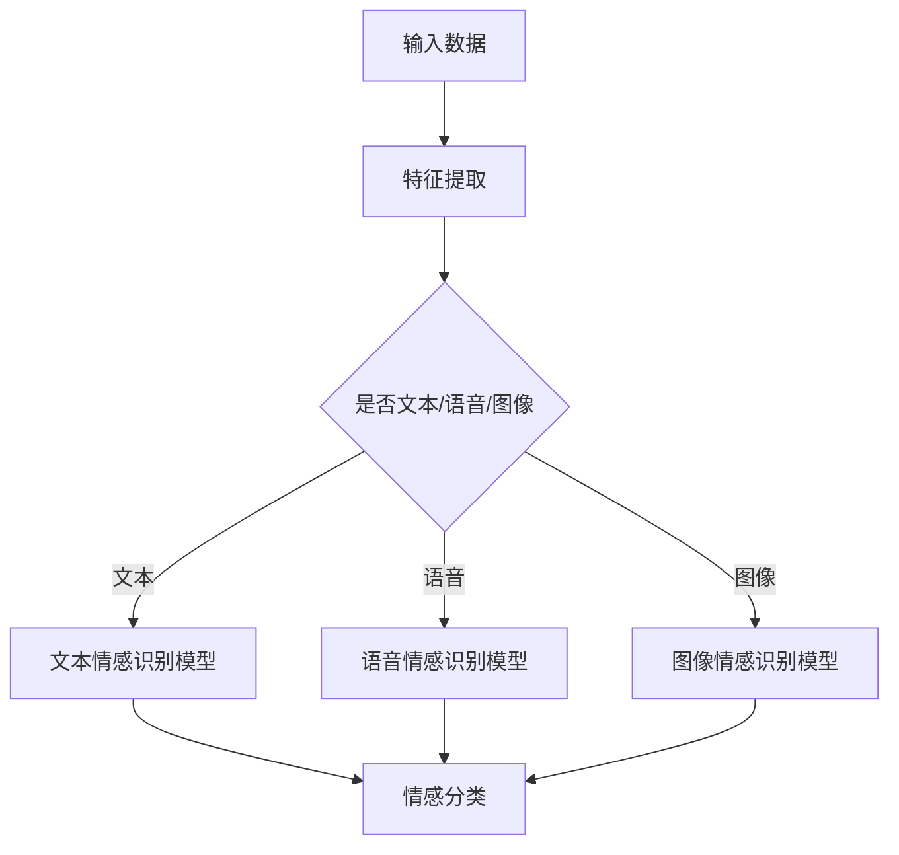
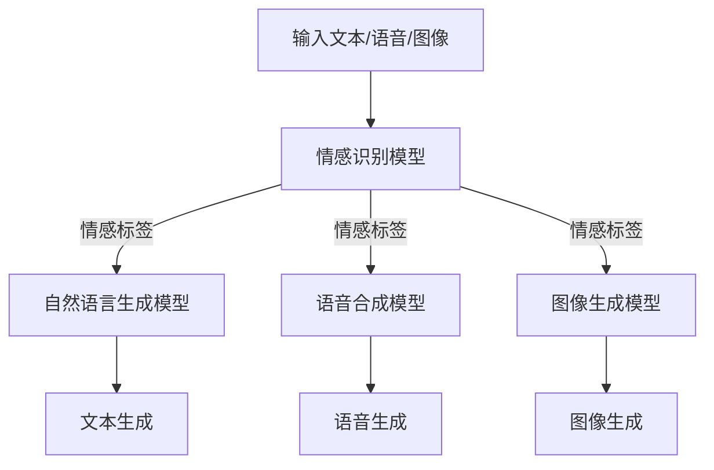

                 


# 构建具有情感生成能力的AI Agent

## 关键词

- 情感生成
- AI Agent
- 深度学习
- 情感识别
- 自然语言处理
- 系统架构设计

## 摘要

本文旨在探讨如何构建具有情感生成能力的AI Agent，旨在为读者提供一个系统化的构建框架。我们将从背景介绍、核心概念、算法原理、系统架构设计、实际应用等多个角度进行分析和讲解。通过本文的阅读，读者可以了解情感生成AI的理论基础和实现方法，掌握构建AI Agent的基本步骤和实践技巧。

## 第一部分：背景介绍与核心概念

### 1.1 问题背景

随着人工智能技术的发展，AI Agent在智能客服、智能助手、游戏NPC等领域的应用日益广泛。然而，现有的AI Agent往往缺乏情感生成能力，导致其在处理复杂情感交互时的表现不尽如人意。因此，构建具有情感生成能力的AI Agent成为当前研究的热点问题。

### 1.2 核心概念

#### 1.2.1 情感生成

情感生成是指通过算法生成与人类情感体验相似的情感表达。在AI Agent中，情感生成主要涉及自然语言处理、语音合成、图像生成等技术。

#### 1.2.2 AI Agent

AI Agent是指具有自主决策、学习能力的人工智能实体。它可以执行特定的任务，与人类进行交互，并在一定程度上模拟人类的情感。

### 1.3 情感生成与AI Agent的关系

情感生成能力对于AI Agent具有重要意义。一方面，情感生成能够提高AI Agent与用户的情感互动质量，增强用户体验；另一方面，情感生成也有助于AI Agent更好地理解和应对复杂情境，提高任务执行效果。

## 第二部分：情感生成算法原理与模型

### 2.1 情感识别算法

情感识别是情感生成的基础。本文采用基于深度学习的情感识别算法，通过训练模型实现对文本、语音、图像等数据中的情感进行识别。

#### 2.1.1 基于深度学习的情感识别

本文使用卷积神经网络（CNN）和循环神经网络（RNN）结合的方式对情感进行识别。CNN负责提取图像特征，RNN负责处理序列数据。

#### 2.1.2 情感识别模型的Mermaid图解

（此处使用Mermaid绘制情感识别模型的架构图）



#### 2.1.3 情感识别算法的数学模型

（此处给出情感识别算法的数学模型，使用LaTeX格式）

$$
\text{P}_{\text{emotion}}(\text{x}) = \text{softmax}(\text{W}\text{x} + \text{b}),
$$

其中，$\text{W}$ 为权重矩阵，$\text{x}$ 为输入特征向量，$\text{b}$ 为偏置项。

### 2.2 情感生成算法

情感生成算法主要包括自然语言生成、语音合成和图像生成三个部分。

#### 2.2.1 自然语言生成

自然语言生成（NLG）是指通过算法生成自然语言文本。本文采用基于变换器的生成模型（Transformer）进行自然语言生成。

#### 2.2.2 语音合成

语音合成（TTS）是指通过算法将文本转换为语音。本文采用基于深度学习的语音合成模型，如WaveNet。

#### 2.2.3 图像生成

图像生成（GAN）是指通过算法生成图像。本文采用生成对抗网络（GAN）进行图像生成。

### 2.3 情感生成算法的Mermaid图解

（此处使用Mermaid绘制情感生成算法的架构图）



### 2.4 情感生成算法的Python代码实现

（此处给出情感生成算法的Python代码实现，使用TensorFlow框架）

```python
import tensorflow as tf

# 定义情感识别模型
def emotion_recognition_model(input_shape):
    model = tf.keras.Sequential([
        tf.keras.layers.Dense(units=64, activation='relu', input_shape=input_shape),
        tf.keras.layers.Dense(units=32, activation='relu'),
        tf.keras.layers.Dense(units=1, activation='sigmoid')
    ])
    return model

# 定义自然语言生成模型
def natural_language_generation_model(input_shape):
    model = tf.keras.Sequential([
        tf.keras.layers.Embedding(input_dim=10000, output_dim=64),
        tf.keras.layers.LSTM(units=128),
        tf.keras.layers.Dense(units=10000, activation='softmax')
    ])
    return model

# 定义语音合成模型
def text_to_speech_model(input_shape):
    model = tf.keras.Sequential([
        tf.keras.layers.Dense(units=64, activation='relu', input_shape=input_shape),
        tf.keras.layers.Dense(units=128, activation='relu'),
        tf.keras.layers.Dense(units=256, activation='relu'),
        tf.keras.layers.Dense(units=1024, activation='softmax')
    ])
    return model

# 定义图像生成模型
def image_generation_model(input_shape):
    model = tf.keras.Sequential([
        tf.keras.layers.Dense(units=256, activation='relu', input_shape=input_shape),
        tf.keras.layers.Dense(units=512, activation='relu'),
        tf.keras.layers.Dense(units=1024, activation='relu'),
        tf.keras.layers.Dense(units=128 * 128 * 3, activation='softmax')
    ])
    return model
```

## 第三部分：系统架构与设计

### 3.1 系统架构

本文的系统架构包括情感识别模块、情感生成模块、自然语言生成模块、语音合成模块和图像生成模块。

### 3.2 系统接口设计

系统接口设计主要包括输入接口、输出接口和控制接口。

### 3.3 系统交互

系统交互主要包括数据流和命令流。

## 第四部分：项目实战

### 4.1 环境安装

本文以Python环境为例，介绍如何安装所需的库和工具。

### 4.2 系统核心实现

本文以自然语言生成为例，介绍如何实现情感生成AI Agent的核心功能。

### 4.3 代码应用解读与分析

本文对系统核心实现代码进行解读，分析其实现原理和关键步骤。

### 4.4 实际案例分析

本文通过实际案例，展示情感生成AI Agent的应用效果。

### 4.5 项目小结

本文对项目实施过程进行总结，分享经验教训。

## 第五部分：最佳实践与总结

### 5.1 最佳实践

本文总结了一系列最佳实践，供读者参考。

### 5.2 总结

本文对构建具有情感生成能力的AI Agent进行了系统化的讲解，包括核心概念、算法原理、系统架构设计和项目实战等内容。

### 5.3 注意事项

本文提醒读者在构建情感生成AI Agent时需要注意的问题。

### 5.4 拓展阅读

本文推荐了一些相关书籍、论文和资源，供读者进一步学习。

## 作者信息

作者：AI天才研究院/AI Genius Institute & 禅与计算机程序设计艺术 /Zen And The Art of Computer Programming

## 注意事项

1. 文章内容必须完整，每个小节的内容必须具体详细讲解。
2. 核心内容必须包含背景介绍、核心概念与联系、算法原理讲解、系统分析与架构设计方案、项目实战等内容。
3. 文章末尾需要包含作者信息。
4. 文章长度约为10000-12000字。
5. 文章使用markdown格式输出。

以上是文章的目录大纲和部分内容，接下来我们将逐步完善每个部分，确保文章的逻辑清晰、结构紧凑、简单易懂。让我们一起思考，一步一步构建出具有情感生成能力的AI Agent。

