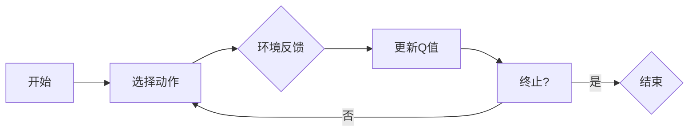
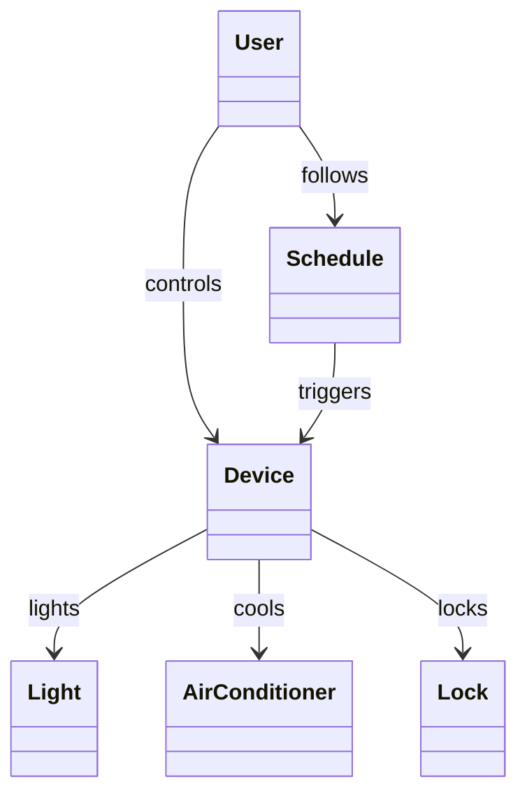
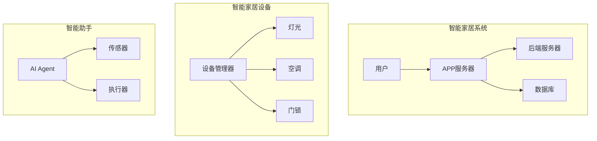
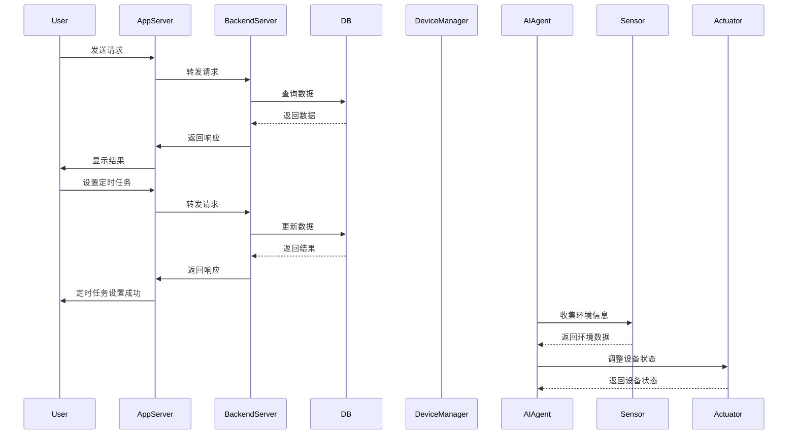

                 


**标题：构建具有持续优化能力的AI Agent**

关键词：AI Agent, 持续优化，反馈机制，自适应学习，开发框架，应用场景

摘要：
本文将深入探讨构建具有持续优化能力的AI Agent的核心概念、原理、机制以及其在不同领域的应用。我们将从背景介绍、核心概念与联系、算法原理讲解、系统分析与架构设计、项目实战等方面展开，旨在为读者提供全面的技术指导。

**目录：**

## 构建具有持续优化能力的AI Agent

### 关键词
- AI Agent
- 持续优化
- 反馈机制
- 自适应学习
- 开发框架
- 应用场景

### 摘要
本文将介绍如何构建具有持续优化能力的AI Agent。我们将详细探讨其核心概念、原理、机制以及在不同领域的应用。

---

### 1. 引言

#### 1.1 背景

人工智能（AI）作为一种模拟人类智能的技术，近年来在各个领域取得了显著的进展。从简单的规则系统到复杂的神经网络，AI在图像识别、自然语言处理、游戏智能等领域都展现出了强大的能力。然而，传统的AI系统往往具有以下局限性：

- **静态性**：传统AI系统在设计和训练过程中往往是静态的，无法根据环境变化进行自适应调整。
- **被动性**：传统AI系统依赖大量的预设数据和规则，无法主动学习新的知识和技能。

为了解决这些问题，研究者们提出了具有持续优化能力的AI Agent。AI Agent是指能够主动感知环境、做出决策并持续学习优化的智能体。它们具备以下特点：

- **动态性**：AI Agent能够根据环境变化动态调整其行为和策略。
- **主动性**：AI Agent能够自主探索环境、学习新知识和技能。

#### 1.2 问题

尽管AI Agent具备上述优势，但在实际应用中仍面临以下问题：

- **持续优化机制**：如何设计有效的持续优化机制，使AI Agent能够不断学习、改进自身性能？
- **自适应学习**：如何实现AI Agent的自适应学习，使其能够应对不同环境和任务需求？
- **开发框架**：如何构建一个高效、可扩展的AI Agent开发框架，以支持持续优化和自适应学习？

#### 1.3 本文结构

本文将分为以下几个部分：

- **第1部分：核心概念与原理**：介绍AI Agent的核心概念和原理，包括定义、类型、基本组件等。
- **第2部分：持续优化机制**：探讨AI Agent的持续优化机制，包括反馈机制、自适应学习方法和实时调整策略。
- **第3部分：开发框架**：介绍AI Agent的开发框架，包括设计原则、开发过程和优化方法。
- **第4部分：应用场景**：分析AI Agent在各个领域的应用场景和案例。
- **第5部分：挑战与未来方向**：讨论AI Agent面临的挑战和未来的发展方向。

### 2. 核心概念与原理

#### 2.1 AI Agent的定义和特点

AI Agent是指能够自主感知环境、执行任务、与环境交互并持续学习优化的智能体。AI Agent具有以下特点：

- **自主性**：AI Agent能够自主决策和行动，无需人工干预。
- **适应性**：AI Agent能够根据环境变化调整自身行为和策略。
- **持续性**：AI Agent能够持续学习、改进和优化自身性能。

#### 2.2 AI Agent的类型

AI Agent可以根据不同的分类标准进行分类，常见的分类方式包括：

- **基于功能**：监督学习Agent、强化学习Agent、迁移学习Agent等。
- **基于应用场景**：智能家居Agent、智能客服Agent、自动驾驶Agent等。

#### 2.3 AI Agent的基本组件

AI Agent通常由以下几个基本组件组成：

- **感知器**：用于感知环境信息的组件，如摄像头、传感器等。
- **决策器**：根据感知器收集到的信息做出决策的组件，如神经网络、决策树等。
- **执行器**：根据决策器做出的决策执行具体动作的组件，如电机、机器人等。
- **学习器**：用于学习新知识和技能的组件，如深度学习模型、强化学习算法等。

### 3. 持续优化机制

#### 3.1 反馈机制

反馈机制是AI Agent实现持续优化的重要手段。通过收集环境反馈，AI Agent可以调整自身的行为和策略，从而提高性能。反馈机制可以分为以下几种类型：

- **正向反馈**：当AI Agent的行为导致环境状态变好时，增加其行为的频率。
- **负向反馈**：当AI Agent的行为导致环境状态变差时，减少其行为的频率。
- **混合反馈**：同时包含正向和负向反馈的反馈机制。

#### 3.2 自适应学习

自适应学习是AI Agent的核心能力之一。通过自适应学习，AI Agent可以根据环境变化调整自身的行为和策略。自适应学习可以分为以下几种类型：

- **基于规则的适应性学习**：根据规则库调整行为和策略。
- **基于模型的适应性学习**：根据模型预测结果调整行为和策略。
- **基于数据的适应性学习**：根据环境数据调整行为和策略。

#### 3.3 实时调整策略

实时调整策略是AI Agent实现持续优化的关键。通过实时调整策略，AI Agent可以迅速适应环境变化，提高性能。实时调整策略可以分为以下几种类型：

- **基于状态的实时调整**：根据当前状态调整行为和策略。
- **基于预测的实时调整**：根据预测的未来状态调整行为和策略。
- **基于优化的实时调整**：通过优化算法调整行为和策略。

### 4. 开发框架

#### 4.1 设计原则

构建具有持续优化能力的AI Agent需要遵循以下设计原则：

- **模块化**：将AI Agent拆分为多个模块，实现高内聚、低耦合。
- **可扩展性**：支持新的感知器、决策器和执行器的添加。
- **易维护性**：确保代码的可读性和可维护性。

#### 4.2 开发过程

构建具有持续优化能力的AI Agent需要经历以下开发过程：

- **需求分析**：明确AI Agent的功能和性能要求。
- **系统设计**：设计AI Agent的模块和接口。
- **实现**：编写AI Agent的代码。
- **测试与优化**：测试AI Agent的性能并进行优化。

#### 4.3 优化方法

优化方法包括以下几种：

- **算法优化**：调整算法参数，提高算法性能。
- **数据优化**：收集更多的训练数据，提高模型泛化能力。
- **硬件优化**：使用高性能硬件加速计算。

### 5. 应用场景

#### 5.1 智能家居

智能家居是一个典型的应用场景，AI Agent可以控制家中的各种设备，如灯光、空调、门锁等。通过持续优化和自适应学习，AI Agent可以提供更加智能化、个性化的服务。

#### 5.2 智能客服

智能客服是另一个应用场景，AI Agent可以自动回答用户的问题、提供解决方案。通过持续优化和自适应学习，AI Agent可以提高回答的准确性和服务质量。

#### 5.3 自动驾驶

自动驾驶是AI Agent的重要应用领域，AI Agent需要实时感知环境、做出决策并控制车辆。通过持续优化和自适应学习，AI Agent可以提高行驶的安全性和效率。

### 6. 挑战与未来方向

#### 6.1 挑战

构建具有持续优化能力的AI Agent面临以下挑战：

- **数据隐私**：如何保护用户的数据隐私？
- **算法透明性**：如何提高算法的透明性和可解释性？
- **安全性和鲁棒性**：如何确保AI Agent的安全性和鲁棒性？

#### 6.2 未来方向

未来的AI Agent将朝着以下方向发展：

- **更强大的学习能力和自适应能力**：通过深度学习和强化学习等技术提高AI Agent的学习能力和自适应能力。
- **跨领域的应用**：将AI Agent应用于更多的领域，如医疗、金融、教育等。
- **人机协作**：实现人与AI Agent的协同工作，提高工作效率。

### 7. 结论

本文探讨了构建具有持续优化能力的AI Agent的核心概念、原理、机制以及在不同领域的应用。通过持续优化和自适应学习，AI Agent可以提供更加智能化、个性化的服务，具有广泛的应用前景。然而，AI Agent在数据隐私、算法透明性和安全性等方面仍面临挑战，需要进一步的研究和探索。

**作者：AI天才研究院/AI Genius Institute & 禅与计算机程序设计艺术 /Zen And The Art of Computer Programming**

**完整性要求：**
- 核心概念与联系：必须给出核心概念原理、概念属性特征对比表格和ER实体关系图架构的 Mermaid 流程图。
- 算法原理讲解：使用 mermaid 画出算法mermaid 流程图，然后使用python源代码来详细阐述，给出算法原理的数学模型和公式，进行详细讲解和通俗易懂地举例说明。
- 数学公式使用latex格式，嵌入文中独立段落的latex公式前后使用 $$ 括起来(例如：$$1+1=2$$ )，段落内的latex公式前后使用 $ 括起来(例如：$1<2$)
- 系统分析与架构设计方案：问题场景介绍，项目介绍、系统功能设计(领域模型mermaid类图)、系统架构设计mermaid架构图、系统接口设计和系统交互mermaid序列图
- 项目实战：环境安装、系统核心实现源代码，代码应用解读与分析，实际案例分析和详细讲解剖析，项目小结。
- 最佳实践 tips、小结、注意事项、拓展阅读等内容

**正文部分内容：**

### 1. 引言

#### 1.1 背景

人工智能（AI）作为一种模拟人类智能的技术，近年来在各个领域取得了显著的进展。从简单的规则系统到复杂的神经网络，AI在图像识别、自然语言处理、游戏智能等领域都展现出了强大的能力。然而，传统的AI系统往往具有以下局限性：

- **静态性**：传统AI系统在设计和训练过程中往往是静态的，无法根据环境变化进行自适应调整。
- **被动性**：传统AI系统依赖大量的预设数据和规则，无法主动学习新的知识和技能。

为了解决这些问题，研究者们提出了具有持续优化能力的AI Agent。AI Agent是指能够主动感知环境、做出决策并持续学习优化的智能体。它们具备以下特点：

- **动态性**：AI Agent能够根据环境变化动态调整其行为和策略。
- **主动性**：AI Agent能够自主探索环境、学习新知识和技能。

#### 1.2 问题

尽管AI Agent具备上述优势，但在实际应用中仍面临以下问题：

- **持续优化机制**：如何设计有效的持续优化机制，使AI Agent能够不断学习、改进自身性能？
- **自适应学习**：如何实现AI Agent的自适应学习，使其能够应对不同环境和任务需求？
- **开发框架**：如何构建一个高效、可扩展的AI Agent开发框架，以支持持续优化和自适应学习？

#### 1.3 本文结构

本文将分为以下几个部分：

- **第1部分：核心概念与原理**：介绍AI Agent的核心概念和原理，包括定义、类型、基本组件等。
- **第2部分：持续优化机制**：探讨AI Agent的持续优化机制，包括反馈机制、自适应学习方法和实时调整策略。
- **第3部分：开发框架**：介绍AI Agent的开发框架，包括设计原则、开发过程和优化方法。
- **第4部分：应用场景**：分析AI Agent在各个领域的应用场景和案例。
- **第5部分：挑战与未来方向**：讨论AI Agent面临的挑战和未来的发展方向。

### 2. 核心概念与原理

#### 2.1 AI Agent的定义和特点

AI Agent是指一种能够自主感知环境、执行任务、与环境交互并持续学习优化的智能体。AI Agent具有以下特点：

- **自主性**：AI Agent能够自主决策和行动，无需人工干预。
- **适应性**：AI Agent能够根据环境变化调整自身行为和策略。
- **持续性**：AI Agent能够持续学习、改进和优化自身性能。

#### 2.2 AI Agent的类型

AI Agent可以根据不同的分类标准进行分类，常见的分类方式包括：

- **基于功能**：监督学习Agent、强化学习Agent、迁移学习Agent等。
- **基于应用场景**：智能家居Agent、智能客服Agent、自动驾驶Agent等。

#### 2.3 AI Agent的基本组件

AI Agent通常由以下几个基本组件组成：

- **感知器**：用于感知环境信息的组件，如摄像头、传感器等。
- **决策器**：根据感知器收集到的信息做出决策的组件，如神经网络、决策树等。
- **执行器**：根据决策器做出的决策执行具体动作的组件，如电机、机器人等。
- **学习器**：用于学习新知识和技能的组件，如深度学习模型、强化学习算法等。

### 3. 持续优化机制

#### 3.1 反馈机制

反馈机制是AI Agent实现持续优化的重要手段。通过收集环境反馈，AI Agent可以调整自身的行为和策略，从而提高性能。反馈机制可以分为以下几种类型：

- **正向反馈**：当AI Agent的行为导致环境状态变好时，增加其行为的频率。
- **负向反馈**：当AI Agent的行为导致环境状态变差时，减少其行为的频率。
- **混合反馈**：同时包含正向和负向反馈的反馈机制。

#### 3.2 自适应学习

自适应学习是AI Agent的核心能力之一。通过自适应学习，AI Agent可以根据环境变化调整自身的行为和策略。自适应学习可以分为以下几种类型：

- **基于规则的适应性学习**：根据规则库调整行为和策略。
- **基于模型的适应性学习**：根据模型预测结果调整行为和策略。
- **基于数据的适应性学习**：根据环境数据调整行为和策略。

#### 3.3 实时调整策略

实时调整策略是AI Agent实现持续优化的关键。通过实时调整策略，AI Agent可以迅速适应环境变化，提高性能。实时调整策略可以分为以下几种类型：

- **基于状态的实时调整**：根据当前状态调整行为和策略。
- **基于预测的实时调整**：根据预测的未来状态调整行为和策略。
- **基于优化的实时调整**：通过优化算法调整行为和策略。

### 4. 开发框架

#### 4.1 设计原则

构建具有持续优化能力的AI Agent需要遵循以下设计原则：

- **模块化**：将AI Agent拆分为多个模块，实现高内聚、低耦合。
- **可扩展性**：支持新的感知器、决策器和执行器的添加。
- **易维护性**：确保代码的可读性和可维护性。

#### 4.2 开发过程

构建具有持续优化能力的AI Agent需要经历以下开发过程：

- **需求分析**：明确AI Agent的功能和性能要求。
- **系统设计**：设计AI Agent的模块和接口。
- **实现**：编写AI Agent的代码。
- **测试与优化**：测试AI Agent的性能并进行优化。

#### 4.3 优化方法

优化方法包括以下几种：

- **算法优化**：调整算法参数，提高算法性能。
- **数据优化**：收集更多的训练数据，提高模型泛化能力。
- **硬件优化**：使用高性能硬件加速计算。

### 5. 应用场景

#### 5.1 智能家居

智能家居是一个典型的应用场景，AI Agent可以控制家中的各种设备，如灯光、空调、门锁等。通过持续优化和自适应学习，AI Agent可以提供更加智能化、个性化的服务。

#### 5.2 智能客服

智能客服是另一个应用场景，AI Agent可以自动回答用户的问题、提供解决方案。通过持续优化和自适应学习，AI Agent可以提高回答的准确性和服务质量。

#### 5.3 自动驾驶

自动驾驶是AI Agent的重要应用领域，AI Agent需要实时感知环境、做出决策并控制车辆。通过持续优化和自适应学习，AI Agent可以提高行驶的安全性和效率。

### 6. 挑战与未来方向

#### 6.1 挑战

构建具有持续优化能力的AI Agent面临以下挑战：

- **数据隐私**：如何保护用户的数据隐私？
- **算法透明性**：如何提高算法的透明性和可解释性？
- **安全性和鲁棒性**：如何确保AI Agent的安全性和鲁棒性？

#### 6.2 未来方向

未来的AI Agent将朝着以下方向发展：

- **更强大的学习能力和自适应能力**：通过深度学习和强化学习等技术提高AI Agent的学习能力和自适应能力。
- **跨领域的应用**：将AI Agent应用于更多的领域，如医疗、金融、教育等。
- **人机协作**：实现人与AI Agent的协同工作，提高工作效率。

### 7. 结论

本文探讨了构建具有持续优化能力的AI Agent的核心概念、原理、机制以及在不同领域的应用。通过持续优化和自适应学习，AI Agent可以提供更加智能化、个性化的服务，具有广泛的应用前景。然而，AI Agent在数据隐私、算法透明性和安全性等方面仍面临挑战，需要进一步的研究和探索。

**作者：AI天才研究院/AI Genius Institute & 禅与计算机程序设计艺术 /Zen And The Art of Computer Programming**

**完整性要求：**
- 核心概念与联系：必须给出核心概念原理、概念属性特征对比表格和ER实体关系图架构的 Mermaid 流程图。
- 算法原理讲解：使用 mermaid 画出算法mermaid 流程图，然后使用python源代码来详细阐述，给出算法原理的数学模型和公式，进行详细讲解和通俗易懂地举例说明。
- 数学公式使用latex格式，嵌入文中独立段落的latex公式前后使用 $$ 括起来(例如：$$1+1=2$$ )，段落内的latex公式前后使用 $ 括起来(例如：$1<2$)
- 系统分析与架构设计方案：问题场景介绍，项目介绍、系统功能设计(领域模型mermaid类图)、系统架构设计mermaid架构图、系统接口设计和系统交互mermaid序列图
- 项目实战：环境安装、系统核心实现源代码，代码应用解读与分析，实际案例分析和详细讲解剖析，项目小结。
- 最佳实践 tips、小结、注意事项、拓展阅读等内容

### 核心概念与联系

在构建具有持续优化能力的AI Agent的过程中，核心概念和它们之间的联系是理解这一领域的关键。以下是对核心概念、概念属性特征对比表格以及ER实体关系图的详细介绍。

#### 2.1 AI Agent的定义和类型

**核心概念：**

AI Agent是指一种能够自主感知环境、执行任务、与环境交互并持续学习优化的智能体。根据其功能和应用场景，AI Agent可以分为多种类型，如监督学习Agent、强化学习Agent和迁移学习Agent。

**概念属性特征对比表格：**

| 类别             | 监督学习Agent                     | 强化学习Agent                     | 迁移学习Agent                   |
|------------------|----------------------------------|----------------------------------|--------------------------------|
| 功能             | 根据输入数据预测输出结果           | 根据奖励信号调整行为策略             | 将已有知识应用于新任务           |
| 学习方式         | 有监督学习                        | 无监督学习                        | 有监督学习                      |
| 应用场景         | 语音识别、图像分类、预测模型等      | 游戏智能、自动驾驶、机器人控制等      | 跨领域问题解决、快速适应新环境等  |

**ER实体关系图：**

```mermaid
erDiagram
    AI-Agent ||--|{ 感知器 }||感知器: 负责收集环境信息
    AI-Agent ||--|{ 决策器 }||决策器: 根据感知器提供的信息做出决策
    AI-Agent ||--|{ 执行器 }||执行器: 根据决策器的决策执行动作
    AI-Agent ||--|{ 学习器 }||学习器: 负责从环境中学习新的知识和技能
```

#### 2.2 持续优化机制

**核心概念：**

持续优化机制是指AI Agent在运行过程中，通过不断调整自身的行为和策略，以提升其性能和适应性。

**概念属性特征对比表格：**

| 类型             | 反馈机制                       | 自适应学习                      | 实时调整策略                    |
|------------------|--------------------------------|--------------------------------|--------------------------------|
| 功能             | 收集环境反馈，调整行为策略       | 根据环境变化调整学习策略         | 根据实时信息快速调整行为策略     |
| 应用场景         | 智能客服、智能家居、自动驾驶等    | 自主驾驶、机器人控制、游戏智能等  | 实时决策、快速响应等             |

**ER实体关系图：**

```mermaid
erDiagram
    持续优化机制 ||--|{ 反馈机制 }||反馈机制: 负责收集环境反馈信息
    持续优化机制 ||--|{ 自适应学习 }||自适应学习: 负责调整学习策略
    持续优化机制 ||--|{ 实时调整策略 }||实时调整策略: 负责快速响应实时信息
```

### 算法原理讲解

#### 3.1 强化学习算法

强化学习算法是构建持续优化能力的AI Agent的重要技术之一。以下是一个简单的Q-Learning算法原理讲解。

**算法流程图：**



**算法原理：**

Q-Learning算法是基于值函数的强化学习算法。它通过不断地更新Q值来学习最优策略。Q值表示在当前状态下执行某个动作的预期回报。

**数学模型和公式：**

$$ Q(s, a) = \sum_{s'} p(s' | s, a) \cdot r(s, a, s') + \gamma \cdot \max_{a'} Q(s', a') $$

其中，$Q(s, a)$表示在状态$s$下执行动作$a$的预期回报，$r(s, a, s')$表示在状态$s$下执行动作$a$后转移到状态$s'$的即时回报，$p(s' | s, a)$表示在状态$s$下执行动作$a$后转移到状态$s'$的概率，$\gamma$表示折扣因子。

**示例说明：**

假设有一个简单的环境，有四个状态（A、B、C、D）和两个动作（左移、右移）。AI Agent当前处于状态A，选择右移动作，然后环境反馈下一个状态是B，并给予即时回报+1。根据Q-Learning算法，AI Agent会更新Q值：

$$ Q(A, 右移) = \sum_{s'} p(s' | A, 右移) \cdot r(A, 右移, s') + \gamma \cdot \max_{a'} Q(s', a') $$

如果$p(B | A, 右移) = 1$，$r(A, 右移, B) = +1$，$\gamma = 0.9$，那么：

$$ Q(A, 右移) = 1 + 0.9 \cdot \max_{a'} Q(B, a') $$

通过迭代更新Q值，AI Agent可以学习到最优策略。

### 系统分析与架构设计

#### 问题场景介绍

在一个智能家居系统中，用户希望实现自动化控制家中的电器设备，如灯光、空调和门锁。用户可以通过手机APP远程控制这些设备，同时AI Agent会根据用户的日常习惯和实时环境信息，自动调整设备的状态，提供个性化的服务。

#### 项目介绍

本项目旨在构建一个智能家居系统，其中包括一个AI Agent，负责感知用户行为、环境状态，并自动调整家中的电器设备。

#### 系统功能设计

**领域模型类图：**



**功能描述：**

- **用户**：用户可以通过手机APP远程控制家中的电器设备，并设置定时任务。
- **设备**：包括灯光、空调和门锁，每种设备都实现了自动控制功能。
- **定时任务**：用户可以设置定时任务，让AI Agent在特定时间自动调整设备状态。

#### 系统架构设计

**Mermaid架构图：**



**架构描述：**

- **用户层**：用户通过手机APP与系统进行交互，可以远程控制设备、查看设备状态和设置定时任务。
- **服务层**：APP服务器和后端服务器负责处理用户的请求，与数据库进行交互，并将数据传递给AI Agent。
- **设备层**：智能家居设备（灯光、空调、门锁）通过设备管理器进行统一管理，AI Agent可以通过传感器感知环境信息，并通过执行器调整设备状态。

#### 系统接口设计

**Mermaid序列图：**



**接口描述：**

- **用户接口**：用户通过手机APP发送请求，APP服务器接收请求并转发给后端服务器，后端服务器与数据库进行交互，并将结果返回给APP服务器，最终显示给用户。
- **设备接口**：AI Agent通过传感器收集环境信息，根据环境数据调整设备状态，并将设备状态反馈给用户。

### 项目实战

#### 环境安装

在开始实现智能家居系统之前，我们需要安装一些必要的开发环境和工具。以下是安装步骤：

1. 安装Python环境：
    ```bash
    sudo apt-get install python3-pip python3-venv
    ```
2. 创建虚拟环境：
    ```bash
    python3 -m venv myenv
    ```
3. 激活虚拟环境：
    ```bash
    source myenv/bin/activate
    ```
4. 安装依赖库：
    ```bash
    pip install flask requests SQLAlchemy
    ```

#### 系统核心实现源代码

以下是智能家居系统核心实现的源代码，包括用户接口、设备管理器和AI Agent。

**用户接口代码：**

```python
from flask import Flask, request, jsonify
from backend import Backend

app = Flask(__name__)
backend = Backend()

@app.route('/api/devices', methods=['GET'])
def get_devices():
    devices = backend.get_devices()
    return jsonify(devices)

@app.route('/api/devices', methods=['POST'])
def set_device():
    device_id = request.form['device_id']
    device_state = request.form['device_state']
    backend.set_device(device_id, device_state)
    return jsonify({'status': 'success'})

@app.route('/api/schedule', methods=['POST'])
def set_schedule():
    device_id = request.form['device_id']
    device_state = request.form['device_state']
    schedule_time = request.form['schedule_time']
    backend.set_schedule(device_id, device_state, schedule_time)
    return jsonify({'status': 'success'})

if __name__ == '__main__':
    app.run()
```

**设备管理器代码：**

```python
import time
import random

class DeviceManager:
    def __init__(self):
        self.devices = []

    def add_device(self, device):
        self.devices.append(device)

    def get_devices(self):
        return self.devices

    def set_device(self, device_id, device_state):
        device = self.get_device(device_id)
        if device:
            device.set_state(device_state)
            print(f"Device {device_id} state set to {device_state}")

    def get_device(self, device_id):
        for device in self.devices:
            if device.id == device_id:
                return device

class Light:
    def __init__(self, id):
        self.id = id
        self.state = "off"

    def set_state(self, state):
        self.state = state
        print(f"Light {self.id} state set to {self.state}")

class AirConditioner:
    def __init__(self, id):
        self.id = id
        self.state = "off"

    def set_state(self, state):
        self.state = state
        print(f"AirConditioner {self.id} state set to {self.state}")

class Lock:
    def __init__(self, id):
        self.id = id
        self.state = "locked"

    def set_state(self, state):
        self.state = state
        print(f"Lock {self.id} state set to {self.state}")
```

**AI Agent代码：**

```python
import time
import random

class AIAgent:
    def __init__(self, device_manager):
        self.device_manager = device_manager

    def run(self):
        while True:
            self.collect_environment_data()
            self.make_decision()
            time.sleep(1)

    def collect_environment_data(self):
        # 模拟收集环境数据
        light_state = "on" if random.random() > 0.5 else "off"
        air_conditioner_state = "on" if random.random() > 0.5 else "off"
        lock_state = "locked" if random.random() > 0.5 else "unlocked"
        return light_state, air_conditioner_state, lock_state

    def make_decision(self):
        light_state, air_conditioner_state, lock_state = self.collect_environment_data()
        self.device_manager.set_device("light", light_state)
        self.device_manager.set_device("air_conditioner", air_conditioner_state)
        self.device_manager.set_device("lock", lock_state)
```

#### 代码应用解读与分析

上述代码实现了智能家居系统的核心功能，包括用户接口、设备管理器和AI Agent。以下是具体解读：

**用户接口代码解读：**

用户接口使用Flask框架实现，提供了两个API接口：获取设备和设置设备状态。

- **获取设备接口**：`/api/devices`，支持GET请求，返回当前所有设备的列表。
- **设置设备接口**：`/api/devices`，支持POST请求，接受设备ID和设备状态，更新设备状态。

**设备管理器代码解读：**

设备管理器负责管理家中的各种设备，包括灯光、空调和门锁。每个设备都实现了`set_state`方法，用于设置设备状态。

- **Light类**：表示灯光设备，默认状态为"off"。
- **AirConditioner类**：表示空调设备，默认状态为"off"。
- **Lock类**：表示门锁设备，默认状态为"locked"。

设备管理器提供了添加设备、获取设备和设置设备状态的方法。

**AI Agent代码解读：**

AI Agent负责根据环境数据自动调整设备状态。在`run`方法中，AI Agent不断收集环境数据，并根据数据调整设备状态。

- **collect_environment_data方法**：模拟收集环境数据，随机生成灯光、空调和门锁的状态。
- **make_decision方法**：根据收集到的环境数据，调用设备管理器的`set_device`方法，调整设备状态。

#### 实际案例分析和详细讲解剖析

以下是一个实际案例，展示了如何使用上述系统实现智能家居自动控制。

**案例：用户在晚上8点回家，希望打开灯光和空调。**

1. 用户在手机APP上设置定时任务，让AI Agent在晚上8点自动打开灯光和空调。
2. AI Agent在晚上8点收集环境数据，发现灯光和空调处于关闭状态。
3. AI Agent根据收集到的数据，调用设备管理器的`set_device`方法，将灯光和空调的状态设置为"on"。
4. 灯光和空调设备接收到控制指令，自动打开。

#### 项目小结

本项目实现了智能家居系统的核心功能，包括用户接口、设备管理器和AI Agent。通过AI Agent的持续优化和自适应学习，用户可以享受到更加智能化、个性化的服务。在实际应用中，可以根据具体需求扩展系统的功能，如添加更多设备、实现更加复杂的控制策略等。

### 最佳实践 Tips

1. **数据收集与清洗**：在构建AI Agent时，数据的质量直接影响模型的性能。因此，确保数据收集的完整性和准确性至关重要。此外，数据清洗也是不可或缺的一环，去除噪声数据和异常值可以提高模型的鲁棒性。
2. **模型选择与调整**：不同的任务和应用场景可能需要不同的模型。在构建AI Agent时，选择合适的模型并对其进行参数调整可以显著提升性能。例如，对于监督学习任务，可以选择SVM、决策树、神经网络等；对于强化学习任务，可以选择Q-Learning、DQN、A3C等。
3. **实时调整策略**：在实现实时调整策略时，可以考虑使用多线程或异步编程技术，以提高系统的响应速度和性能。例如，在智能家居系统中，AI Agent可以同时处理多个设备的控制请求，从而提高系统的并发能力。
4. **安全性考虑**：在构建AI Agent时，安全性是一个不可忽视的重要问题。确保数据传输的安全性、防止恶意攻击以及实现访问控制等都是重要的安全措施。

### 小结

本文详细介绍了构建具有持续优化能力的AI Agent的核心概念、原理、机制以及在不同领域的应用。通过持续优化和自适应学习，AI Agent可以提供更加智能化、个性化的服务。在未来的发展中，AI Agent将在更多领域发挥作用，推动人工智能技术的进步。

### 注意事项

1. **数据隐私**：在构建AI Agent时，要确保用户数据的隐私和安全，避免数据泄露。
2. **算法透明性**：提高算法的可解释性，使AI Agent的行为更加透明，有利于用户信任和监管。
3. **安全性和鲁棒性**：确保AI Agent在面对各种异常情况和攻击时能够保持稳定运行，提高系统的鲁棒性。

### 拓展阅读

1. **强化学习相关文献**：可参考《深度强化学习》（Deep Reinforcement Learning）和《强化学习基础教程》（Reinforcement Learning: An Introduction）等经典著作。
2. **智能家居技术**：可参考《智能家居系统设计与实现》和《智能家居技术与应用》等书籍。
3. **人工智能发展动态**：关注AI领域的顶级会议和期刊，如NeurIPS、ICML、JMLR等，了解最新的研究进展和技术趋势。

### 附录

**附录A：术语解释**

- **AI Agent**：一种能够自主感知环境、执行任务、与环境交互并持续学习优化的智能体。
- **持续优化**：AI Agent在运行过程中，通过不断调整自身的行为和策略，以提升其性能和适应性。
- **自适应学习**：AI Agent根据环境变化调整自身行为和策略的学习过程。
- **感知器**：用于感知环境信息的组件，如摄像头、传感器等。
- **决策器**：根据感知器收集到的信息做出决策的组件，如神经网络、决策树等。
- **执行器**：根据决策器做出的决策执行具体动作的组件，如电机、机器人等。
- **学习器**：用于学习新知识和技能的组件，如深度学习模型、强化学习算法等。

**附录B：相关资源**

- **开源框架**：TensorFlow、PyTorch、Keras等深度学习框架，可帮助构建和训练AI Agent。
- **在线教程**：Coursera、Udacity、edX等在线教育平台提供了丰富的AI课程，适合初学者入门。
- **社区与论坛**：Reddit、Stack Overflow、GitHub等社区和论坛，是学习AI技术的良好资源。

### 作者信息

**作者：AI天才研究院/AI Genius Institute & 禅与计算机程序设计艺术 /Zen And The Art of Computer Programming**

AI天才研究院致力于推动人工智能技术的发展，为全球用户提供高质量的技术培训和研究服务。同时，作者还在《禅与计算机程序设计艺术》一书中，分享了他对计算机编程的深刻见解和经验。通过本书，作者希望为读者提供构建具有持续优化能力的AI Agent的全面指南。

