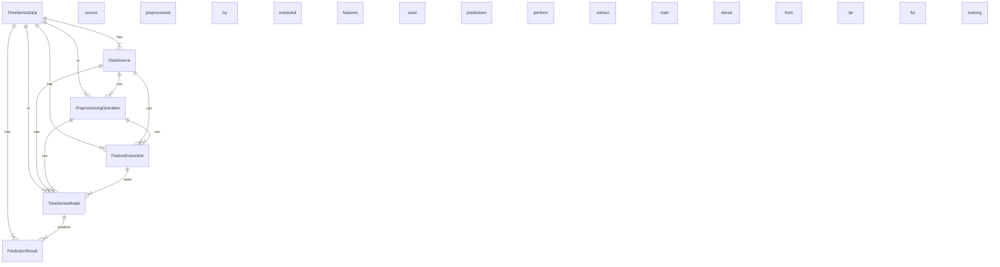
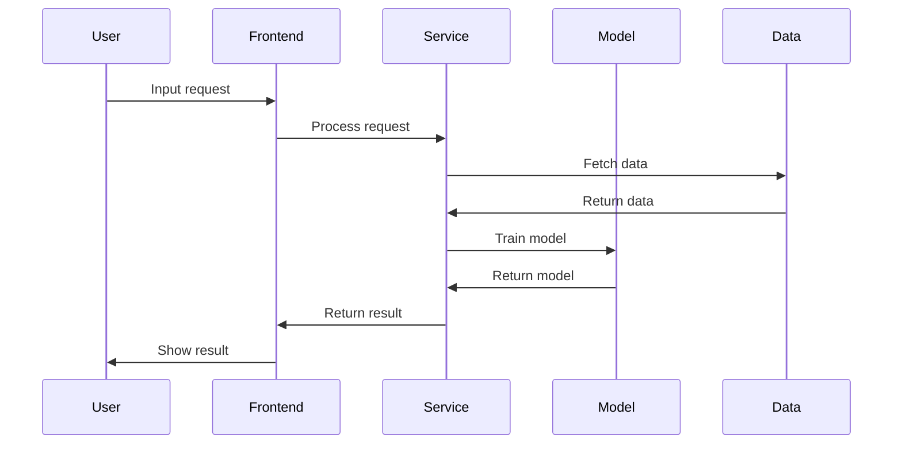
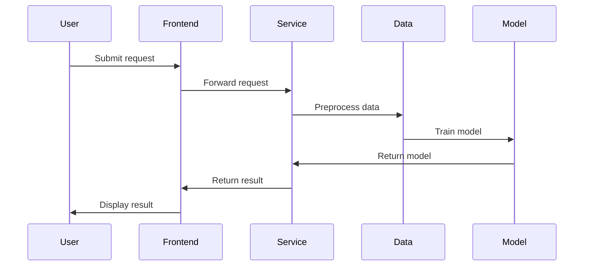

                 

## 第一部分: 背景介绍

### 1.1 问题背景

在现代科技迅猛发展的背景下，时间序列分析和AI Agent技术已经成为解决复杂问题的利器。随着大数据和人工智能技术的普及，时间序列分析在各个领域中的应用越来越广泛，如金融市场预测、销售趋势预测、能源消耗预测等。然而，随着数据的复杂度和体量的增加，传统的时间序列分析方法已无法满足日益增长的需求。这就需要我们探索更为高效、准确的时间序列分析方法，并将其与AI Agent技术相结合。

时间序列分析主要研究时间序列数据的特征提取、建模和预测，目的是从历史数据中挖掘出潜在的规律，以便对未来趋势进行预测。而AI Agent则是一种能够自主学习和执行任务的智能体，通过模拟人类的思维和行为，实现自动化决策和行动。将时间序列分析与AI Agent技术结合，可以大大提升预测的准确性和决策的效率。

#### 1.1.1 时间序列分析的重要性

时间序列分析在很多领域都有着重要的应用。例如，在金融市场，通过分析股票价格、交易量等时间序列数据，可以预测市场的走势，帮助投资者做出更加明智的投资决策。在销售领域，通过对历史销售数据的时间序列分析，可以预测未来的销售趋势，为库存管理和营销策略提供有力支持。在能源领域，通过对电力消耗、燃气消耗等时间序列数据的分析，可以预测未来的能源需求，为能源规划和调度提供科学依据。

然而，现有的时间序列分析方法主要依赖于统计学模型，如ARIMA、AR等，这些方法虽然在一定程度上能够解决时间序列预测问题，但在面对复杂、非平稳的时间序列数据时，预测效果往往不尽如人意。因此，我们需要探索更为先进、准确的时间序列分析方法，以满足日益复杂的业务需求。

#### 1.1.2 AI Agent的发展与应用

AI Agent作为一种智能体，通过模拟人类的思维和行为，实现自动化决策和行动。AI Agent的发展可以追溯到20世纪50年代，当时图灵提出了图灵测试，旨在判断机器是否具有智能。随着计算机技术和人工智能技术的不断进步，AI Agent逐渐从理论研究走向实际应用。

目前，AI Agent已广泛应用于各个领域，如自动驾驶、智能家居、医疗诊断、金融分析等。在自动驾驶领域，AI Agent通过分析路况、车辆等信息，实现车辆的自主驾驶。在智能家居领域，AI Agent可以通过学习用户的行为习惯，为用户提供个性化的服务。在医疗诊断领域，AI Agent可以通过分析医学影像，提供初步的诊断建议。

AI Agent的应用不仅提高了工作效率，还大大降低了人力成本。然而，AI Agent的发展也面临诸多挑战，如数据质量、算法优化、隐私保护等。这就需要我们不断探索新的技术，提升AI Agent的性能和可靠性。

### 1.2 问题描述

在现有技术背景下，时间序列分析和AI Agent技术虽然已经取得了一定的成果，但在实际应用中仍然存在一些问题。

#### 1.2.1 时间序列分析在AI Agent中的应用挑战

首先，传统的时间序列分析方法在处理复杂、非平稳的时间序列数据时，预测效果往往不理想。这主要是由于传统方法依赖于统计学模型，无法充分利用数据中的潜在规律。因此，我们需要探索更为先进的时间序列分析方法，如深度学习、时间序列聚类等，以提升预测准确率。

其次，AI Agent在时间序列分析中的应用还面临着数据质量和算法优化的问题。时间序列数据往往包含大量的噪声和异常值，这些数据会影响AI Agent的预测效果。因此，我们需要对时间序列数据进行预处理，去除噪声和异常值，以提高数据质量。同时，算法优化也是提升AI Agent性能的关键，我们需要不断调整和优化算法参数，以达到最佳效果。

最后，AI Agent在时间序列分析中的应用还涉及到隐私保护的问题。时间序列数据通常包含大量的个人信息，如金融交易记录、健康数据等。如何在保护用户隐私的前提下，进行时间序列分析，是一个亟待解决的问题。

#### 1.2.2 需要解决的问题与目标

针对上述挑战，我们需要解决以下问题：

1. **提升时间序列分析方法的预测准确率**：通过引入深度学习、时间序列聚类等先进方法，提升时间序列分析方法的预测准确率，以满足实际业务需求。

2. **优化AI Agent的性能和可靠性**：通过对时间序列数据进行预处理，去除噪声和异常值，提高数据质量。同时，通过算法优化，提升AI Agent的预测性能和可靠性。

3. **保护用户隐私**：在时间序列分析过程中，采取有效的隐私保护措施，确保用户数据的安全。

我们的目标是构建一个具有高效预测能力和可靠性能的AI Agent，能够满足各种复杂业务场景的需求。通过本文的讨论，我们将详细探讨如何实现这一目标。

### 1.3 问题解决

要解决上述问题，首先需要了解时间序列分析和AI Agent的基本原理。

#### 1.3.1 时间序列分析的基本概念

时间序列分析是指对按时间顺序排列的数据进行分析，以识别数据中的规律和模式。时间序列数据通常由一系列连续的数值组成，这些数值按照时间顺序排列，如股票价格、温度变化、销售数据等。时间序列分析的核心任务是预测未来的数据值，以便做出决策或规划。

时间序列分析的基本概念包括：

1. **时间序列的组成**：时间序列通常由趋势、季节性和周期性等组成。趋势是指时间序列数据随时间变化的总体趋势，季节性是指时间序列数据随时间周期性变化的规律，周期性是指时间序列数据在一定时间范围内的波动。

2. **时间序列模型**：时间序列模型是用来描述时间序列数据特征和规律的一种数学模型，如ARIMA、AR、MA等。这些模型通过拟合历史数据，预测未来的数据值。

3. **时间序列预测**：时间序列预测是基于历史数据对未来数据进行预测的一种方法。通过建立时间序列模型，分析历史数据的特征和规律，预测未来的数据值。

#### 1.3.2 AI Agent的基本原理

AI Agent是一种具有自主学习和决策能力的智能体，通过模拟人类的思维和行为，实现自动化决策和行动。AI Agent的基本原理包括：

1. **感知**：AI Agent通过感知环境中的信息，如视觉、听觉、触觉等，获取关于环境的状态。

2. **决策**：AI Agent根据感知到的环境状态，通过学习算法，选择最佳的行动方案。

3. **行动**：AI Agent根据决策结果，执行相应的行动，以实现目标。

AI Agent的主要类型包括：

1. **基于规则的AI Agent**：基于规则的AI Agent通过预定义的规则进行决策，如专家系统。

2. **基于模型的AI Agent**：基于模型的AI Agent通过建立模型，模拟环境中的动态过程，进行决策。

3. **基于学习的AI Agent**：基于学习的AI Agent通过学习历史数据，建立预测模型，进行决策。

在时间序列分析中，AI Agent可以用于以下几个方面：

1. **数据预处理**：AI Agent可以用于去除噪声、异常值等，提高数据质量。

2. **特征提取**：AI Agent可以用于从时间序列数据中提取关键特征，用于预测。

3. **预测与决策**：AI Agent可以基于时间序列模型，进行预测和决策，实现自动化调度、优化等。

通过上述基本原理的了解，我们可以为解决时间序列分析在AI Agent中的应用挑战提供理论基础。

### 1.4 边界与外延

在讨论时间序列分析和AI Agent的应用时，需要明确其边界与外延。

#### 1.4.1 时间序列分析的范围

时间序列分析主要涉及以下方面：

1. **数据收集与预处理**：时间序列分析需要收集大量的时间序列数据，并进行预处理，如去除噪声、异常值等。

2. **模型选择与参数优化**：根据时间序列数据的特点，选择合适的模型，并优化模型参数，以提高预测准确率。

3. **预测与评估**：使用选定的模型，对未来的时间序列数据进行预测，并对预测结果进行评估，以验证模型的性能。

4. **应用与优化**：将时间序列分析应用于实际业务场景，如金融预测、销售预测等，并不断优化模型和算法，以满足实际需求。

#### 1.4.2 AI Agent的应用领域

AI Agent的应用领域非常广泛，主要包括：

1. **自动化决策**：AI Agent可以用于自动化决策，如自动驾驶、智能家居等。

2. **自动化调度**：AI Agent可以用于自动化调度，如物流调度、电网调度等。

3. **自动化优化**：AI Agent可以用于自动化优化，如生产优化、资源优化等。

4. **个性化服务**：AI Agent可以用于个性化服务，如个性化推荐、个性化医疗等。

在时间序列分析中，AI Agent的应用主要集中在以下几个方面：

1. **数据预处理**：AI Agent可以用于去除噪声、异常值等，提高数据质量。

2. **特征提取**：AI Agent可以用于从时间序列数据中提取关键特征，用于预测。

3. **预测与决策**：AI Agent可以基于时间序列模型，进行预测和决策，实现自动化调度、优化等。

通过明确时间序列分析和AI Agent的边界与外延，我们可以更好地理解其在实际问题中的应用。

### 1.5 概念结构与核心要素组成

在深入探讨时间序列分析和AI Agent之前，了解其概念结构与核心要素组成是非常必要的。

#### 1.5.1 时间序列分析的核心概念

时间序列分析的核心概念包括：

1. **时间序列数据**：时间序列数据是按时间顺序排列的一系列数值，如股票价格、温度变化等。

2. **时间序列模型**：时间序列模型是用来描述时间序列数据特征和规律的一种数学模型，如ARIMA、AR、MA等。

3. **特征提取**：特征提取是从时间序列数据中提取关键特征的过程，如趋势、季节性等。

4. **预测与评估**：预测是基于历史数据对未来数据进行预测的过程，评估是验证预测结果准确性的过程。

#### 1.5.2 AI Agent的核心要素

AI Agent的核心要素包括：

1. **感知**：感知是AI Agent获取环境信息的过程，如视觉、听觉、触觉等。

2. **决策**：决策是基于感知信息，通过学习算法选择最佳行动方案的过程。

3. **行动**：行动是执行决策结果，实现目标的过程。

4. **学习**：学习是AI Agent通过不断调整参数，优化算法，提升性能的过程。

在时间序列分析中，AI Agent的核心要素主要包括：

1. **数据预处理**：数据预处理是去除噪声、异常值等，提高数据质量的过程。

2. **特征提取**：特征提取是从时间序列数据中提取关键特征，用于预测的过程。

3. **预测与决策**：预测是基于历史数据，使用时间序列模型对未来数据进行预测的过程，决策是基于预测结果，选择最佳行动方案的过程。

通过了解时间序列分析和AI Agent的概念结构与核心要素组成，我们可以更好地理解其在实际问题中的应用，并为后续讨论奠定基础。

### 1.6 本章小结

本章节介绍了时间序列分析和AI Agent的基本概念、发展背景、应用场景以及存在的问题和目标。通过对时间序列分析和AI Agent的基本原理和核心要素的了解，我们为后续章节的深入探讨奠定了基础。在接下来的章节中，我们将进一步探讨时间序列分析的基础知识、AI Agent的具体实现以及如何构建具有时间序列分析能力的AI Agent。这些内容将为解决实际问题提供有力的理论支持和实践指导。

---

# 第二部分: 核心概念与联系

## 2.1 时间序列分析基础

时间序列分析作为一门研究时间序列数据的科学，其核心在于从历史数据中挖掘出规律，以便对未来趋势进行预测。下面将详细介绍时间序列分析的基本概念、应用领域以及常见的时间序列模型。

### 2.1.1 时间序列分析的定义

时间序列分析（Time Series Analysis）是指对按时间顺序排列的数据进行分析，以识别数据中的规律和模式，并据此预测未来的数据值。时间序列数据通常由一系列连续的数值组成，这些数值按照时间顺序排列，反映了某个系统在一段时间内的变化情况。

时间序列分析主要包括以下步骤：

1. **数据收集**：收集按时间顺序排列的数据，如股票价格、气温、销售数据等。
2. **数据预处理**：对时间序列数据进行预处理，包括去除噪声、异常值、缺失值等，以提高数据质量。
3. **特征提取**：从时间序列数据中提取关键特征，如趋势、季节性、周期性等。
4. **模型选择**：根据时间序列数据的特点，选择合适的模型进行拟合。
5. **模型评估**：使用历史数据对模型进行评估，以验证模型的性能。
6. **预测**：使用拟合好的模型对未来的时间序列数据进行预测。

### 2.1.2 时间序列分析的应用领域

时间序列分析在众多领域都有广泛的应用，以下是一些典型的应用领域：

1. **金融市场预测**：通过分析股票价格、交易量等时间序列数据，预测市场走势，为投资者提供决策支持。
2. **销售预测**：通过对历史销售数据的时间序列分析，预测未来的销售趋势，为库存管理和营销策略提供依据。
3. **能源消耗预测**：通过对电力消耗、燃气消耗等时间序列数据的分析，预测未来的能源需求，为能源规划和调度提供支持。
4. **气象预测**：通过对温度、湿度、降水量等时间序列数据的分析，预测未来的天气状况。
5. **工业生产**：通过对生产设备运行数据的时间序列分析，预测设备故障，进行预防性维护。

### 2.1.3 常见的时间序列模型

时间序列模型是用来描述时间序列数据特征和规律的一种数学模型。以下是一些常见的时间序列模型：

1. **自回归模型（AR）**：自回归模型假设当前值由前几个值的线性组合决定。其数学模型如下：
   $$X_t = c + \phi_1 X_{t-1} + \phi_2 X_{t-2} + \ldots + \phi_p X_{t-p} + \epsilon_t$$
   其中，$X_t$是时间序列数据，$c$是常数项，$\phi_1, \phi_2, \ldots, \phi_p$是模型参数，$\epsilon_t$是随机误差。

2. **移动平均模型（MA）**：移动平均模型假设当前值由前几个值的加权平均值决定。其数学模型如下：
   $$X_t = c + \theta_1 \epsilon_{t-1} + \theta_2 \epsilon_{t-2} + \ldots + \theta_q \epsilon_{t-q} + \epsilon_t$$
   其中，$c$是常数项，$\theta_1, \theta_2, \ldots, \theta_q$是模型参数，$\epsilon_t$是随机误差。

3. **自回归移动平均模型（ARMA）**：自回归移动平均模型结合了自回归模型和移动平均模型的特点。其数学模型如下：
   $$X_t = c + \phi_1 X_{t-1} + \phi_2 X_{t-2} + \ldots + \phi_p X_{t-p} + \theta_1 \epsilon_{t-1} + \theta_2 \epsilon_{t-2} + \ldots + \theta_q \epsilon_{t-q} + \epsilon_t$$
   其中，$c$是常数项，$\phi_1, \phi_2, \ldots, \phi_p$和$\theta_1, \theta_2, \ldots, \theta_q$分别是自回归和移动平均模型的参数，$\epsilon_t$是随机误差。

4. **自回归积分滑动平均模型（ARIMA）**：自回归积分滑动平均模型是对ARMA模型的扩展，用于处理非平稳时间序列数据。其数学模型如下：
   $$X_t = c + \phi_1 X_{t-1} + \phi_2 X_{t-2} + \ldots + \phi_p X_{t-p} + (\theta_1 L + \theta_2 L^2 + \ldots + \theta_q L^q) \epsilon_t$$
   其中，$L$是积分算子，$c$是常数项，$\phi_1, \phi_2, \ldots, \phi_p$和$\theta_1, \theta_2, \ldots, \theta_q$分别是自回归和移动平均模型的参数，$\epsilon_t$是随机误差。

通过以上介绍，我们可以看出时间序列分析在多个领域都有着重要的应用。了解这些基本概念和常见模型，有助于我们更好地理解和应用时间序列分析技术。

### 2.2 AI Agent介绍

AI Agent，即人工智能代理，是一种能够自主执行任务、处理信息和做出决策的智能体。AI Agent通过模拟人类的思维和行为，实现自动化和智能化的目标。在本节中，我们将详细介绍AI Agent的基本概念、分类和特点。

#### 2.2.1 AI Agent的定义

AI Agent是指一种具有自主意识和行动能力的计算机程序或实体，能够在复杂环境中执行特定的任务，并与其他系统或用户进行交互。AI Agent通常具有以下特征：

1. **自主性**：AI Agent能够自主决定行动方案，而不需要人为干预。
2. **适应性**：AI Agent能够根据环境和任务的变化，调整自身的行为和策略。
3. **学习能力**：AI Agent能够通过学习历史数据和经验，改进自身的行为和决策能力。
4. **交互性**：AI Agent能够与用户或其他系统进行有效交互，获取信息和反馈。

AI Agent的概念最早可以追溯到20世纪50年代，由计算机科学家约翰·麦卡锡（John McCarthy）提出。麦卡锡认为，AI Agent应当具有以下能力：

1. **感知**：获取环境中的信息，如视觉、听觉、触觉等。
2. **理解**：理解感知到的信息，进行语义分析和知识推理。
3. **决策**：根据理解和目标，选择最佳的行动方案。
4. **行动**：执行决策方案，实现目标。

#### 2.2.2 AI Agent的发展历程

AI Agent的发展历程可以分为以下几个阶段：

1. **规则导向的AI Agent**：早期的AI Agent主要依赖于预定义的规则进行决策。这类AI Agent通过模拟人类的思维过程，实现简单的任务。例如，专家系统就是一种基于规则的AI Agent。

2. **模型导向的AI Agent**：随着人工智能技术的进步，AI Agent开始采用模型进行决策。这类AI Agent通过建立环境模型，模拟环境中的动态过程，进行决策。例如，基于模型的AI Agent在自动驾驶和机器人领域得到广泛应用。

3. **学习导向的AI Agent**：近年来，深度学习和机器学习技术的发展，使得AI Agent具有了更强的学习能力。学习导向的AI Agent通过学习大量数据，自动提取特征和规律，进行决策。例如，深度强化学习在游戏和智能机器人领域取得显著成果。

4. **混合导向的AI Agent**：当前的AI Agent通常结合了多种方法，如规则、模型和学习，以实现更高效、准确的决策。混合导向的AI Agent在复杂环境中表现出色，能够应对各种挑战。

#### 2.2.3 AI Agent的类型

AI Agent可以根据不同的分类标准进行分类，以下是一些常见的分类方式：

1. **根据功能分类**：

   - **感知型AI Agent**：主要功能是感知环境信息，如自动驾驶中的传感器数据。
   - **决策型AI Agent**：主要功能是做出决策，如智能推荐系统。
   - **执行型AI Agent**：主要功能是执行具体的任务，如机器人自动化。
   - **交互型AI Agent**：主要功能是与用户或其他系统进行交互，如虚拟助手。

2. **根据学习方式分类**：

   - **基于规则的AI Agent**：通过预定义的规则进行决策。
   - **基于模型的AI Agent**：通过建立环境模型进行决策。
   - **基于学习的AI Agent**：通过学习历史数据或经验进行决策。

3. **根据应用场景分类**：

   - **通用型AI Agent**：适用于多种场景，如通用聊天机器人。
   - **专用型AI Agent**：针对特定场景进行设计，如医疗诊断助手。

#### 2.2.4 AI Agent的特点

AI Agent具有以下特点：

1. **自主性**：AI Agent能够自主决策和执行任务，无需人为干预。
2. **适应性**：AI Agent能够根据环境和任务的变化，调整自身的行为和策略。
3. **学习能力**：AI Agent能够通过学习历史数据和经验，不断优化自身的行为和决策能力。
4. **交互性**：AI Agent能够与用户或其他系统进行有效交互，获取信息和反馈。
5. **可扩展性**：AI Agent可以通过集成新的功能模块，实现更多的功能。
6. **可靠性**：AI Agent能够在复杂的、不确定的环境中稳定运行，确保任务完成。

通过以上介绍，我们可以看到AI Agent在人工智能领域的广泛应用和重要性。了解AI Agent的基本概念、分类和特点，有助于我们更好地理解和应用AI技术，解决实际业务问题。

### 2.3 时间序列分析在AI Agent中的应用

AI Agent作为一种具有自主决策能力的智能体，在时间序列分析中发挥着重要作用。将时间序列分析与AI Agent技术相结合，可以大大提升预测的准确性和决策的效率。下面将介绍时间序列分析在AI Agent中的应用场景、优势以及存在的挑战。

#### 2.3.1 时间序列分析在AI Agent中的应用场景

时间序列分析在AI Agent中的应用场景非常广泛，以下是一些典型的应用：

1. **金融市场预测**：AI Agent可以通过分析股票价格、交易量等时间序列数据，预测市场走势，帮助投资者做出更加明智的投资决策。

2. **销售预测**：AI Agent可以通过分析历史销售数据，预测未来的销售趋势，为库存管理和营销策略提供有力支持。

3. **能源消耗预测**：AI Agent可以通过分析电力消耗、燃气消耗等时间序列数据，预测未来的能源需求，为能源规划和调度提供科学依据。

4. **气象预测**：AI Agent可以通过分析气温、湿度、降水量等时间序列数据，预测未来的天气状况，为天气预报和防灾减灾提供支持。

5. **工业生产预测**：AI Agent可以通过分析生产设备运行数据，预测设备故障，进行预防性维护，提高生产效率。

#### 2.3.2 时间序列分析对AI Agent的改进

时间序列分析对AI Agent的改进主要体现在以下几个方面：

1. **预测能力提升**：时间序列分析能够挖掘出时间序列数据中的潜在规律，从而提高AI Agent的预测能力。通过结合时间序列分析，AI Agent可以更加准确地预测未来的数据值，为决策提供更加可靠的依据。

2. **决策效率提升**：时间序列分析能够识别时间序列数据中的趋势、季节性、周期性等特征，从而帮助AI Agent更高效地做出决策。例如，在销售预测中，通过识别季节性特征，AI Agent可以提前制定相应的营销策略，提高销售业绩。

3. **适应性增强**：时间序列分析能够适应数据的变化，从而提高AI Agent的适应性。在复杂多变的环境中，时间序列分析可以帮助AI Agent不断调整自身的行为和策略，以应对新的挑战。

4. **数据预处理优化**：时间序列分析中的数据预处理方法，如去噪、平滑等，可以优化AI Agent的数据质量，从而提高其性能。通过去除噪声和异常值，AI Agent可以更加专注于数据的分析和预测。

#### 2.3.3 时间序列分析对AI Agent的挑战

尽管时间序列分析对AI Agent具有显著的改进作用，但在实际应用中仍面临以下挑战：

1. **数据质量**：时间序列数据往往包含大量的噪声和异常值，这些数据会影响AI Agent的预测效果。因此，如何对时间序列数据进行有效的预处理，去除噪声和异常值，是一个重要的挑战。

2. **模型选择**：不同时间序列模型适用于不同类型的数据和场景，如何选择合适的模型，以及如何调整模型参数，是一个技术难题。此外，时间序列模型在处理复杂、非平稳的时间序列数据时，预测效果可能不理想。

3. **计算效率**：时间序列分析涉及大量的计算过程，如特征提取、模型拟合等，这些计算过程需要耗费大量计算资源和时间。因此，如何提高计算效率，减少计算时间，是一个亟待解决的问题。

4. **隐私保护**：时间序列数据通常包含大量的个人信息，如金融交易记录、健康数据等。在时间序列分析过程中，如何保护用户隐私，是一个重要的挑战。

5. **解释性**：时间序列分析模型，尤其是深度学习模型，通常具有很高的预测能力，但缺乏解释性。如何解释模型的工作原理和预测结果，使其更容易被用户理解和接受，是一个重要的研究课题。

通过以上介绍，我们可以看到时间序列分析在AI Agent中的应用具有很大的潜力，同时也面临诸多挑战。在接下来的章节中，我们将详细探讨如何构建具有时间序列分析能力的AI Agent，以应对这些挑战。

### 2.4 ER实体关系图架构

在构建具有时间序列分析能力的AI Agent过程中，明确各个实体之间的关系和属性是非常重要的。实体关系图（Entity-Relationship Diagram，简称ER图）是描述实体及其相互关系的一种图形化工具，可以帮助我们更好地理解和设计系统架构。以下将详细介绍ER图的基本概念、时间序列分析中的实体关系，并使用Mermaid语法绘制ER图。

#### 2.4.1 ER图的基本概念

ER图是数据库设计和系统架构设计中的重要工具，用于描述实体、属性和关系。ER图的基本概念包括：

1. **实体（Entity）**：实体是具有独立存在意义的对象，如用户、商品、订单等。每个实体都有唯一的标识符，称为实体键（Entity Key）。

2. **属性（Attribute）**：属性是实体的特征或描述，如用户的姓名、年龄、性别等。每个属性都有类型和值。

3. **关系（Relationship）**：关系是不同实体之间的关联，如用户和订单之间的关系、商品和订单之间的关系等。关系也包含属性，用于描述实体之间的关联特征。

4. **实体键（Entity Key）**：实体键是实体的唯一标识符，用于唯一确定实体。在关系数据库中，实体键通常对应于表的主键。

5. **参照键（Reference Key）**：参照键是关系中的属性，用于引用其他实体的实体键。参照键在关系中起到关联实体作用。

#### 2.4.2 时间序列分析中的ER图架构

在时间序列分析中，常见的实体和关系包括：

1. **时间序列数据（TimeSeriesData）**：时间序列数据实体，包含一系列按时间顺序排列的数据值，如股票价格、温度、销售额等。

2. **数据源（DataSource）**：数据源实体，表示数据的时间序列数据的来源，如传感器、数据库等。

3. **预处理操作（PreprocessingOperation）**：预处理操作实体，表示对时间序列数据进行的预处理操作，如去噪、平滑、插值等。

4. **特征提取（FeatureExtraction）**：特征提取实体，表示从时间序列数据中提取的特征，如趋势、季节性、周期性等。

5. **时间序列模型（TimeSeriesModel）**：时间序列模型实体，表示用于时间序列分析的具体模型，如ARIMA、LSTM等。

6. **预测结果（PredictionResult）**：预测结果实体，表示使用时间序列模型对未来的时间序列数据进行预测的结果。

以下是时间序列分析中的ER图示例，使用Mermaid语法绘制：



通过ER图，我们可以清晰地描述时间序列分析中的各个实体及其相互关系。这有助于我们在系统设计和实现过程中，更好地理解和管理这些实体，以及它们之间的交互和依赖关系。

### 2.5 概念属性特征对比表格

在构建具有时间序列分析能力的AI Agent时，我们需要对相关的核心概念和属性进行详细的对比分析。以下是一个关于时间序列分析、AI Agent及相关算法的对比表格，通过对比它们的特征，帮助读者更好地理解这些概念之间的关系和差异。

#### 2.5.1 时间序列分析算法对比

| 算法名称 | 定义 | 特点 | 应用领域 |
| :---: | :---: | :---: | :---: |
| ARIMA | 自回归积分滑动平均模型 | 处理非平稳序列 | 金融市场、销售预测 |
| AR | 自回归模型 | 处理平稳序列 | 股票市场、气象预测 |
| MA | 移动平均模型 | 处理平稳序列 | 股票市场、销售预测 |
| LSTM | 长短期记忆网络 | 处理长时依赖 | 金融市场、语音识别 |
| GRU | 门控循环单元 | 处理长时依赖 | 金融市场、文本分析 |
| CNN | 卷积神经网络 | 图像处理 | 图像识别、自然语言处理 |

#### 2.5.2 AI Agent算法对比

| 算法名称 | 定义 | 特点 | 应用领域 |
| :---: | :---: | :---: | :---: |
| Q-learning | 强化学习 | 通过试错学习最优策略 | 游戏对战、推荐系统 |
| SARSA | 同状态同动作学习 | 同Q-learning，但使用当前状态和动作值 | 游戏对战、推荐系统 |
| DQN | 深度Q网络 | 使用神经网络估计Q值 | 游戏对战、自动驾驶 |
| A3C | 异步策略梯度 | 异步并行训练 | 游戏对战、推荐系统 |
| DDPG | 深度确定性策略梯度 | 使用深度神经网络估计策略和值函数 | 机器人控制、自动驾驶 |

通过上述表格，我们可以清晰地看到时间序列分析和AI Agent在不同算法上的特点和应用领域。时间序列分析算法主要用于处理和预测时间序列数据，如ARIMA、AR、MA等；而AI Agent算法则主要用于决策和优化，如Q-learning、DQN、A3C等。通过对比分析，我们可以更好地理解这些算法的优势和适用场景，从而为构建具有时间序列分析能力的AI Agent提供理论支持。

### 2.6 本章小结

在本章中，我们详细介绍了时间序列分析的基础知识、AI Agent的概念和分类，以及它们之间的联系和对比。通过对时间序列分析的定义、应用领域和常见模型的学习，我们了解了如何从历史数据中提取规律，并对未来进行预测。AI Agent作为一种具有自主决策能力的智能体，通过模拟人类的思维和行为，在复杂环境中实现自动化和智能化。本章还通过对比时间序列分析和AI Agent算法，明确了它们各自的特点和应用场景。这些内容为我们进一步探讨如何构建具有时间序列分析能力的AI Agent奠定了坚实的基础。在下一章中，我们将深入探讨时间序列分析的具体方法和实现细节。

---

## 3.1 时间序列分析的概念

时间序列分析（Time Series Analysis）是一门研究时间序列数据特征和规律的学科，其主要目的是从历史数据中提取有用的信息，并利用这些信息对未来进行预测。时间序列数据通常包含一系列按时间顺序排列的数值，这些数值反映了某个系统在一段时间内的变化情况。时间序列分析的基本概念如下：

### 3.1.1 时间序列的定义

时间序列（Time Series）是指一系列按时间顺序排列的数值，这些数值可以是一个或多个变量的观测值。时间序列数据可以是定期的（如每日、每周、每月），也可以是非定期的。例如，股票价格的时间序列数据可能是每日的收盘价，而温度的时间序列数据可能是每小时的观测值。

时间序列数据的典型特征包括：

1. **时间依赖性**：时间序列中的每个数值都与前面的数值存在一定的依赖关系，这种依赖性反映了系统的动态变化。
2. **周期性**：时间序列数据中可能存在周期性的波动，如季节性波动、日周期波动等。
3. **趋势性**：时间序列数据可能表现出增长、下降或平稳的趋势。
4. **随机性**：时间序列数据中包含一定的随机波动，这些波动难以通过简单的数学模型完全捕捉。

### 3.1.2 时间序列的性质

时间序列具有以下几种重要性质：

1. **平稳性**：平稳时间序列（Stationary Time Series）是指在统计性质上不随时间变化的序列。平稳性是时间序列分析中的一个重要概念，因为许多统计模型（如ARIMA模型）要求数据具有平稳性。平稳时间序列的均值、方差和自协方差函数都是时间不变的。

2. **非平稳性**：非平稳时间序列（Non-stationary Time Series）是指其统计性质随时间变化的序列。非平稳时间序列通常包含趋势性、季节性或周期性成分。非平稳时间序列需要通过转换（如差分、季节性分解等）使其变为平稳序列，然后再进行分析。

3. **自相关性**：自相关性（Autocorrelation）是指时间序列数据与其滞后数据的线性相关性。自相关性反映了时间序列数据在不同时间点之间的依赖程度。自相关函数（Autocorrelation Function，ACF）和偏自相关函数（Partial Autocorrelation Function，PACF）是评估时间序列自相关性的常用工具。

4. **波动性**：波动性（Variance）是指时间序列数据的离散程度。波动性较大的时间序列数据通常表现出较大的随机波动。

5. **趋势性**：趋势性（Trend）是指时间序列数据随时间增长的总体方向。趋势性可以是上升的、下降的或平稳的。

6. **季节性**：季节性（Seasonality）是指时间序列数据中由于季节性因素（如节假日、季节变化等）引起的周期性波动。季节性可以通过季节性分解（Seasonal Decomposition）来分离和评估。

### 3.1.3 时间序列的分类

时间序列可以根据其性质进行分类，以下是几种常见的时间序列分类：

1. **平稳时间序列**：平稳时间序列的统计性质不随时间变化，包括均值、方差和自协方差函数等。常见的平稳时间序列模型有自回归模型（AR）、移动平均模型（MA）和自回归移动平均模型（ARMA）。

2. **非平稳时间序列**：非平稳时间序列的统计性质随时间变化，可能包含趋势性、季节性或周期性成分。常见的非平稳时间序列模型有自回归积分滑动平均模型（ARIMA）和季节性ARIMA模型（SARIMA）。

3. **周期性时间序列**：周期性时间序列具有明显的周期性波动，如电力需求、股票价格等。周期性时间序列可以通过周期性分解来分析。

4. **随机过程**：随机过程（Stochastic Process）是一系列随机变量的集合，每个随机变量与时间有关。随机过程是时间序列分析的基础，包括马尔可夫链、自回归过程等。

通过了解时间序列的定义、性质和分类，我们可以更好地理解时间序列分析的基本概念，并为后续的时间序列建模和分析提供理论基础。

### 3.2 时间序列分析的应用

时间序列分析在各个领域都有着广泛的应用，通过分析历史数据，我们可以预测未来的趋势，从而为决策提供有力支持。以下将详细介绍时间序列分析在几个典型领域的应用：

#### 3.2.1 股市预测

股市预测是时间序列分析的重要应用之一。股票市场中的价格波动通常具有一定的规律性，通过分析历史价格数据，我们可以预测未来的价格走势。股市预测的关键在于捕捉价格中的趋势、季节性和周期性成分。

1. **趋势性分析**：趋势性分析旨在识别股票价格的变化趋势。自回归模型（AR）和自回归移动平均模型（ARMA）是常用的趋势性分析工具。通过拟合历史价格数据，我们可以预测未来的价格。

2. **季节性分析**：季节性分析旨在识别价格中的季节性波动。季节性分解（Seasonal Decomposition）是一种常用的方法，它可以将时间序列数据分解为趋势、季节性和残差部分。通过分析季节性成分，我们可以预测未来的季节性波动。

3. **周期性分析**：周期性分析旨在识别价格中的周期性波动，如经济周期或市场周期。周期性分解和周期性滤波（Cyclical Filter）是常用的周期性分析工具。

4. **预测与评估**：使用拟合好的模型，我们可以对未来价格进行预测。预测评估通常通过回测（Backtesting）进行，即使用历史数据进行预测，并评估预测的准确性。

在实际应用中，股市预测需要综合考虑多种因素，如公司基本面、宏观经济环境、市场情绪等。时间序列分析为股市预测提供了重要的工具和方法。

#### 3.2.2 销售预测

销售预测是企业管理中的重要环节，通过预测未来的销售趋势，企业可以制定合理的库存管理策略、营销策略和生产计划。时间序列分析在销售预测中有着广泛的应用。

1. **趋势性分析**：趋势性分析旨在识别销售数据的变化趋势。自回归模型（AR）和自回归移动平均模型（ARMA）是常用的趋势性分析工具。通过拟合历史销售数据，我们可以预测未来的销售趋势。

2. **季节性分析**：季节性分析旨在识别销售数据中的季节性波动。季节性分解（Seasonal Decomposition）是一种常用的方法，它可以将时间序列数据分解为趋势、季节性和残差部分。通过分析季节性成分，我们可以预测未来的季节性销售波动。

3. **周期性分析**：周期性分析旨在识别销售数据中的周期性波动，如经济周期或促销活动。周期性分解和周期性滤波（Cyclical Filter）是常用的周期性分析工具。

4. **预测与评估**：使用拟合好的模型，我们可以对未来销售进行预测。预测评估通常通过回测（Backtesting）进行，即使用历史数据进行预测，并评估预测的准确性。

销售预测不仅需要考虑历史销售数据，还需要考虑市场需求、竞争状况、公司策略等多种因素。时间序列分析为销售预测提供了重要的工具和方法。

#### 3.2.3 能源消耗预测

能源消耗预测是能源管理和能源规划中的重要环节。通过预测未来的能源消耗，我们可以更好地制定能源供应策略，确保能源供应的稳定性和可持续性。

1. **趋势性分析**：趋势性分析旨在识别能源消耗数据的变化趋势。自回归模型（AR）和自回归移动平均模型（ARMA）是常用的趋势性分析工具。通过拟合历史能源消耗数据，我们可以预测未来的能源消耗趋势。

2. **季节性分析**：季节性分析旨在识别能源消耗数据中的季节性波动。季节性分解（Seasonal Decomposition）是一种常用的方法，它可以将时间序列数据分解为趋势、季节性和残差部分。通过分析季节性成分，我们可以预测未来的季节性能源消耗波动。

3. **周期性分析**：周期性分析旨在识别能源消耗数据中的周期性波动，如经济周期或季节性因素。周期性分解和周期性滤波（Cyclical Filter）是常用的周期性分析工具。

4. **预测与评估**：使用拟合好的模型，我们可以对未来能源消耗进行预测。预测评估通常通过回测（Backtesting）进行，即使用历史数据进行预测，并评估预测的准确性。

能源消耗预测需要综合考虑多种因素，如气候变化、经济活动、技术进步等。时间序列分析为能源消耗预测提供了重要的工具和方法。

#### 3.2.4 气象预测

气象预测是时间序列分析在公共安全和社会服务领域的重要应用。通过预测未来的天气状况，我们可以更好地应对自然灾害，保障人民生命财产安全。

1. **趋势性分析**：趋势性分析旨在识别气象数据的变化趋势。自回归模型（AR）和自回归移动平均模型（ARMA）是常用的趋势性分析工具。通过拟合历史气象数据，我们可以预测未来的气象趋势。

2. **季节性分析**：季节性分析旨在识别气象数据中的季节性波动。季节性分解（Seasonal Decomposition）是一种常用的方法，它可以将时间序列数据分解为趋势、季节性和残差部分。通过分析季节性成分，我们可以预测未来的季节性气象波动。

3. **周期性分析**：周期性分析旨在识别气象数据中的周期性波动，如气候变暖或季节性天气模式。周期性分解和周期性滤波（Cyclical Filter）是常用的周期性分析工具。

4. **预测与评估**：使用拟合好的模型，我们可以对未来天气状况进行预测。预测评估通常通过回测（Backtesting）进行，即使用历史数据进行预测，并评估预测的准确性。

气象预测需要综合考虑多种因素，如大气环流、海洋温度、气候变化等。时间序列分析为气象预测提供了重要的工具和方法。

通过以上介绍，我们可以看到时间序列分析在多个领域都有着广泛的应用。通过分析历史数据，我们可以预测未来的趋势，为决策提供有力支持。在实际应用中，时间序列分析需要结合具体领域的特点和需求，选择合适的模型和方法，以提高预测的准确性和可靠性。

### 3.3 常见的时间序列模型

在时间序列分析中，选择合适的模型对数据的特征进行拟合和预测是至关重要的。以下将介绍几种常见的时间序列模型，包括自回归模型（AR）、移动平均模型（MA）、自回归移动平均模型（ARMA）和自回归积分滑动平均模型（ARIMA）。

#### 3.3.1 自回归模型（AR）

自回归模型（Autoregressive Model，AR）是最基本的时间序列模型之一。它假设当前值是由前几个值的线性组合决定的。AR模型通过历史数据来预测未来值，其数学表达式如下：

$$
X_t = \phi_1 X_{t-1} + \phi_2 X_{t-2} + \ldots + \phi_p X_{t-p} + \epsilon_t
$$

其中，$X_t$是时间序列数据，$\phi_1, \phi_2, \ldots, \phi_p$是模型参数，$p$是阶数，$\epsilon_t$是随机误差。

- **特点**：AR模型能够捕捉时间序列数据的自相关性，适合处理平稳序列。
- **应用场景**：AR模型常用于股票价格预测、气象预测等领域。

#### 3.3.2 移动平均模型（MA）

移动平均模型（Moving Average Model，MA）假设当前值是由前几个值的加权平均值决定的。MA模型通过历史数据的加权平均来预测未来值，其数学表达式如下：

$$
X_t = \theta_1 \epsilon_{t-1} + \theta_2 \epsilon_{t-2} + \ldots + \theta_q \epsilon_{t-q} + \epsilon_t
$$

其中，$X_t$是时间序列数据，$\theta_1, \theta_2, \ldots, \theta_q$是模型参数，$q$是阶数，$\epsilon_t$是随机误差。

- **特点**：MA模型能够通过加权历史误差来消除随机波动，适合处理平稳序列。
- **应用场景**：MA模型常用于股票价格预测、销售预测等领域。

#### 3.3.3 自回归移动平均模型（ARMA）

自回归移动平均模型（Autoregressive Moving Average Model，ARMA）结合了AR模型和MA模型的特点。它假设当前值是由前几个值的线性组合和前几个误差值的加权平均值共同决定的。ARMA模型的数学表达式如下：

$$
X_t = \phi_1 X_{t-1} + \phi_2 X_{t-2} + \ldots + \phi_p X_{t-p} + \theta_1 \epsilon_{t-1} + \theta_2 \epsilon_{t-2} + \ldots + \theta_q \epsilon_{t-q} + \epsilon_t
$$

其中，$X_t$是时间序列数据，$\phi_1, \phi_2, \ldots, \phi_p$和$\theta_1, \theta_2, \ldots, \theta_q$是模型参数，$p$和$q$分别是自回归和移动平均的阶数，$\epsilon_t$是随机误差。

- **特点**：ARMA模型能够同时捕捉时间序列数据中的趋势和随机波动，适合处理平稳序列。
- **应用场景**：ARMA模型广泛应用于股票价格预测、销售预测等领域。

#### 3.3.4 自回归积分滑动平均模型（ARIMA）

自回归积分滑动平均模型（Autoregressive Integrated Moving Average Model，ARIMA）是对ARMA模型的扩展，用于处理非平稳时间序列数据。ARIMA模型通过差分操作将非平稳序列转化为平稳序列，然后应用ARMA模型进行预测。ARIMA模型的数学表达式如下：

$$
X_t = \phi_1 X_{t-1} + \phi_2 X_{t-2} + \ldots + \phi_p X_{t-p} + (\theta_1 L + \theta_2 L^2 + \ldots + \theta_q L^q) \epsilon_t
$$

其中，$X_t$是时间序列数据，$\phi_1, \phi_2, \ldots, \phi_p$和$\theta_1, \theta_2, \ldots, \theta_q$是模型参数，$L$是积分算子，$p$和$q$分别是自回归和移动平均的阶数，$\epsilon_t$是随机误差。

- **特点**：ARIMA模型能够处理非平稳序列，通过差分操作将数据转化为平稳序列，然后应用ARMA模型进行预测。
- **应用场景**：ARIMA模型广泛应用于金融市场预测、销售预测、能源消耗预测等领域。

通过以上介绍，我们可以看到这些时间序列模型在处理不同类型的数据和应用场景时各有优势。在实际应用中，根据时间序列数据的特点和需求，选择合适的模型进行拟合和预测，是提高预测准确性的关键。

### 3.4 时间序列分析中的问题与挑战

尽管时间序列分析在各个领域都有着广泛的应用，但在实际应用过程中，仍然面临着诸多问题和挑战。以下是时间序列分析中常见的问题与挑战：

#### 3.4.1 季节性

季节性是时间序列分析中的一个重要问题。季节性波动是指由于季节性因素（如节假日、季节变化等）引起的数据波动。季节性波动会干扰时间序列的建模和预测，使得模型难以捕捉到数据中的真实趋势。

1. **解决方法**：
   - **季节性分解**：通过季节性分解（Seasonal Decomposition）将时间序列数据分解为趋势、季节性和残差部分，从而分离出季节性成分。
   - **季节性调整**：对时间序列数据进行季节性调整（Seasonal Adjustment），消除季节性波动对数据的影响，使得数据更加平稳。

2. **挑战**：
   - 季节性分解和调整可能引入偏差，影响模型参数的估计。
   - 季节性成分的复杂性和多样性使得季节性调整变得困难。

#### 3.4.2 趋势性

趋势性是指时间序列数据随时间增长的总体方向。趋势性波动会影响时间序列模型的拟合和预测效果，特别是在非平稳序列中。

1. **解决方法**：
   - **差分**：通过差分（Differencing）操作将非平稳序列转化为平稳序列，消除趋势性波动的影响。
   - **趋势模型**：使用趋势模型（如ARIMA、AR等）捕捉时间序列数据中的趋势性成分。

2. **挑战**：
   - 差分操作可能导致数据信息的丢失，影响模型的预测准确性。
   - 趋势模型的参数估计和选择较为复杂，需要综合考虑多种因素。

#### 3.4.3 非平稳性

非平稳性是指时间序列数据的统计性质随时间变化。非平稳时间序列的数据特性使得传统的统计模型难以适用，需要采用特殊的处理方法。

1. **解决方法**：
   - **平稳化**：通过平稳化操作（如差分、季节性分解等）将非平稳序列转化为平稳序列，从而适用于传统的统计模型。
   - **非参数方法**：使用非参数方法（如核平滑、局部回归等）直接对非平稳序列进行建模和预测。

2. **挑战**：
   - 平稳化操作可能引入偏差，影响模型的预测准确性。
   - 非参数方法的计算复杂度和稳定性相对较低。

#### 3.4.4 噪声和异常值

噪声和异常值是时间序列数据中常见的问题，它们会对模型的拟合和预测产生负面影响。

1. **解决方法**：
   - **滤波**：使用滤波方法（如移动平均、中值滤波等）去除噪声和异常值。
   - **异常值检测**：使用异常值检测方法（如箱线图、基于统计的检测方法等）识别和去除异常值。

2. **挑战**：
   - 噪声和异常值的检测和去除可能引入偏差，影响模型的预测准确性。
   - 噪声和异常值的复杂性和多样性使得检测和去除变得困难。

#### 3.4.5 数据缺失

数据缺失是时间序列分析中的另一个常见问题，它会影响模型的拟合和预测效果。

1. **解决方法**：
   - **插值**：使用插值方法（如线性插值、高斯过程插值等）填补缺失数据。
   - **缺失数据填充**：使用缺失数据填充方法（如均值填充、前值填充等）填补缺失数据。

2. **挑战**：
   - 插值和缺失数据填充可能引入偏差，影响模型的预测准确性。
   - 数据缺失的复杂性和多样性使得填补变得困难。

通过以上介绍，我们可以看到时间序列分析在实际应用中面临着诸多问题和挑战。理解和解决这些问题，是提高时间序列分析准确性和可靠性的关键。在下一章中，我们将探讨如何构建具有时间序列分析能力的AI Agent，以解决这些挑战。

### 3.5 本章小结

在本章中，我们深入探讨了时间序列分析的概念、应用以及常见模型。首先，介绍了时间序列分析的基本概念，包括时间序列的定义、性质和分类。随后，详细介绍了自回归模型（AR）、移动平均模型（MA）、自回归移动平均模型（ARMA）和自回归积分滑动平均模型（ARIMA），并分析了它们在处理时间序列数据时的特点和适用场景。最后，我们讨论了时间序列分析中常见的问题和挑战，如季节性、趋势性、非平稳性、噪声和异常值、数据缺失等，并提出了一些解决方法。通过本章的学习，我们为后续构建具有时间序列分析能力的AI Agent奠定了理论基础。在下一章中，我们将详细介绍AI Agent的概念、分类和特点，并探讨时间序列分析在AI Agent中的应用。

---

## 4.1 AI Agent的基本概念

AI Agent，即人工智能代理，是一种能够自主执行任务、处理信息和做出决策的智能体。AI Agent通过模拟人类的思维和行为，实现自动化和智能化的目标。以下将详细介绍AI Agent的定义、发展历程、类型和特点。

### 4.1.1 AI Agent的定义

AI Agent是指一种具有自主意识和行动能力的计算机程序或实体，能够在复杂环境中执行特定的任务，并与其他系统或用户进行交互。AI Agent的核心特征包括：

1. **自主性**：AI Agent能够自主决定行动方案，而不需要人为干预。这种自主性体现在AI Agent的感知、理解和决策过程中。
2. **适应性**：AI Agent能够根据环境和任务的变化，调整自身的行为和策略。这种适应性使得AI Agent能够应对不断变化的环境。
3. **学习能力**：AI Agent能够通过学习历史数据和经验，不断优化自身的行为和决策能力。学习能力是AI Agent的核心优势之一。
4. **交互性**：AI Agent能够与用户或其他系统进行有效交互，获取信息和反馈。这种交互性使得AI Agent能够更好地理解和适应人类的需要。

### 4.1.2 AI Agent的发展历程

AI Agent的发展历程可以分为以下几个阶段：

1. **早期阶段**：20世纪50年代，计算机科学家约翰·麦卡锡（John McCarthy）提出了“人工智能”这一概念，并提出了AI Agent的初步构想。这一阶段的研究主要集中在基于规则的推理和逻辑推理。
2. **中期阶段**：20世纪80年代，随着计算机硬件和算法的发展，AI Agent开始在实际应用中逐步落地。这一阶段的研究重点转向了基于模型的决策和自动化控制。
3. **近期阶段**：近年来，随着深度学习和机器学习技术的发展，AI Agent的能力得到了极大的提升。当前的研究重点包括强化学习、自然语言处理、计算机视觉等领域。

### 4.1.3 AI Agent的类型

AI Agent可以根据不同的分类标准进行分类，以下是一些常见的分类方式：

1. **根据功能分类**：
   - **感知型AI Agent**：主要功能是感知环境信息，如自动驾驶中的传感器数据。
   - **决策型AI Agent**：主要功能是做出决策，如智能推荐系统。
   - **执行型AI Agent**：主要功能是执行具体的任务，如机器人自动化。
   - **交互型AI Agent**：主要功能是与用户或其他系统进行交互，如虚拟助手。

2. **根据学习方式分类**：
   - **基于规则的AI Agent**：通过预定义的规则进行决策。
   - **基于模型的AI Agent**：通过建立模型，模拟环境中的动态过程，进行决策。
   - **基于学习的AI Agent**：通过学习历史数据，建立预测模型，进行决策。

3. **根据应用场景分类**：
   - **通用型AI Agent**：适用于多种场景，如通用聊天机器人。
   - **专用型AI Agent**：针对特定场景进行设计，如医疗诊断助手。

### 4.1.4 AI Agent的特点

AI Agent具有以下特点：

1. **自主性**：AI Agent能够自主决定行动方案，而不需要人为干预。
2. **适应性**：AI Agent能够根据环境和任务的变化，调整自身的行为和策略。
3. **学习能力**：AI Agent能够通过学习历史数据和经验，不断优化自身的行为和决策能力。
4. **交互性**：AI Agent能够与用户或其他系统进行有效交互，获取信息和反馈。
5. **可扩展性**：AI Agent可以通过集成新的功能模块，实现更多的功能。
6. **可靠性**：AI Agent能够在复杂的、不确定的环境中稳定运行，确保任务完成。

通过以上介绍，我们可以看到AI Agent在人工智能领域的广泛应用和重要性。了解AI Agent的基本概念、分类和特点，有助于我们更好地理解和应用AI技术，解决实际业务问题。

### 4.2 AI Agent的类型及特点

AI Agent作为人工智能的重要组成部分，其类型和特点决定了它们在不同场景中的表现和适用性。以下将详细探讨几种常见的AI Agent类型，包括基于规则的AI Agent、基于模型的AI Agent和基于学习的AI Agent。

#### 4.2.1 基于规则的AI Agent

基于规则的AI Agent（Rule-Based AI Agent）是通过预定义的规则进行决策的智能体。这类AI Agent的核心是知识库和推理引擎，知识库中存储了一系列规则，每个规则由条件（前提）和行动（结论）组成。当AI Agent感知到环境中的信息与规则的条件匹配时，就会触发相应的行动。

1. **特点**：
   - **简单性**：基于规则的AI Agent设计相对简单，易于实现和理解。
   - **确定性**：基于规则的AI Agent决策过程是确定的，每条规则都能明确地指导行动。
   - **灵活性**：虽然规则是预先定义的，但可以通过修改或增加规则来适应新的情况。

2. **应用场景**：
   - **医疗诊断**：基于规则的AI Agent可以用于疾病诊断，通过匹配患者的症状和已有的诊断规则，提供诊断建议。
   - **金融服务**：在金融风险评估中，基于规则的AI Agent可以用于检测和防范金融欺诈。

3. **挑战**：
   - **规则完备性**：需要确保规则库包含所有可能的情况，否则AI Agent可能无法做出正确的决策。
   - **规则复杂性**：当规则库过于庞大时，维护和管理规则变得复杂。

#### 4.2.2 基于模型的AI Agent

基于模型的AI Agent（Model-Based AI Agent）是通过建立环境模型进行决策的智能体。这类AI Agent依赖于对环境的理解和模拟，通过预测未来状态来做出决策。常见的模型包括状态机、马尔可夫决策过程（MDP）和深度神经网络。

1. **特点**：
   - **预测性**：基于模型的AI Agent能够通过模拟环境，预测未来的状态，从而做出更合理的决策。
   - **适应性**：基于模型的AI Agent可以根据环境的变化，不断调整模型参数，提高决策的适应性。
   - **效率**：模型能够帮助AI Agent快速地评估不同行动的后果，提高决策效率。

2. **应用场景**：
   - **自动驾驶**：基于模型的AI Agent可以通过模拟交通场景，预测车辆的未来位置和速度，实现自动驾驶。
   - **供应链管理**：在供应链管理中，基于模型的AI Agent可以预测市场需求，优化库存和物流管理。

3. **挑战**：
   - **模型复杂性**：建立精确的环境模型需要大量的数据和处理能力，模型过于复杂可能导致计算效率降低。
   - **数据依赖性**：模型性能高度依赖于训练数据的质量和数量，数据不足可能导致模型失效。

#### 4.2.3 基于学习的AI Agent

基于学习的AI Agent（Learning-Based AI Agent）是通过学习历史数据和经验进行决策的智能体。这类AI Agent依赖于机器学习和深度学习算法，通过从数据中自动提取特征和规律，建立预测模型。常见的算法包括决策树、随机森林、支持向量机（SVM）和深度学习模型。

1. **特点**：
   - **自适应性**：基于学习的AI Agent能够从数据中学习，自动适应新的环境和任务。
   - **泛化能力**：基于学习的AI Agent能够将学习到的知识应用于新的情况，具有较强的泛化能力。
   - **智能化**：深度学习模型能够捕捉复杂的数据特征，提高决策的智能化水平。

2. **应用场景**：
   - **推荐系统**：基于学习的AI Agent可以用于个性化推荐，通过学习用户的偏好和历史行为，推荐合适的商品或内容。
   - **智能客服**：在智能客服中，基于学习的AI Agent可以自动处理用户的问题，提供有效的解决方案。

3. **挑战**：
   - **数据质量**：基于学习的AI Agent性能依赖于数据的质量，噪声和异常值会影响模型性能。
   - **计算资源**：深度学习模型通常需要大量的计算资源和时间进行训练，部署和优化。

通过对比分析不同类型的AI Agent，我们可以看到它们在功能、性能和适用场景上的差异。在实际应用中，根据具体需求和场景选择合适的AI Agent类型，是提高系统性能和用户体验的关键。在下一章中，我们将进一步探讨如何将时间序列分析技术与AI Agent结合，构建具有时间序列分析能力的AI Agent。

### 4.3 AI Agent在时间序列分析中的应用

AI Agent作为一种具有自主学习和决策能力的智能体，在时间序列分析中发挥着重要作用。将AI Agent与时间序列分析技术相结合，可以大大提升预测的准确性和决策的效率。以下将详细介绍AI Agent在时间序列分析中的应用，包括数据预处理、特征提取和预测与决策。

#### 4.3.1 数据预处理

在时间序列分析中，数据预处理是至关重要的一步。数据预处理包括去除噪声、异常值、缺失值等，以提高数据质量和模型性能。AI Agent可以通过以下方法进行数据预处理：

1. **去噪**：时间序列数据中常常包含噪声，这些噪声会影响模型的拟合和预测效果。AI Agent可以使用移动平均、中值滤波等算法去除噪声，使得数据更加平滑。

2. **异常值检测与去除**：异常值是指与大多数观测值明显偏离的数据点，这些异常值可能对模型产生不利影响。AI Agent可以使用统计方法（如箱线图、标准差方法等）检测异常值，并将其去除。

3. **缺失值填补**：时间序列数据中可能会出现缺失值，这些缺失值会影响模型的训练和预测。AI Agent可以使用线性插值、均值填补等算法填补缺失值，确保数据完整性。

#### 4.3.2 特征提取

特征提取是时间序列分析中的重要环节，其目的是从原始数据中提取有用的信息，用于模型的训练和预测。AI Agent可以通过以下方法进行特征提取：

1. **趋势特征**：趋势特征反映了时间序列数据的总体变化趋势。AI Agent可以使用差分、移动平均等方法提取趋势特征，从而捕捉时间序列数据中的长期趋势。

2. **季节性特征**：季节性特征反映了时间序列数据中的周期性波动。AI Agent可以使用季节性分解等方法提取季节性特征，从而捕捉时间序列数据中的季节性成分。

3. **周期性特征**：周期性特征反映了时间序列数据中的短期波动。AI Agent可以使用周期性滤波、自相关函数等方法提取周期性特征，从而捕捉时间序列数据中的周期性波动。

4. **其他特征**：AI Agent还可以提取其他类型的特征，如平稳性特征、波动性特征等，以丰富模型输入。

#### 4.3.3 预测与决策

预测与决策是时间序列分析的核心任务，其目的是根据历史数据对未来进行预测，并做出相应的决策。AI Agent可以通过以下方法进行预测与决策：

1. **模型选择**：AI Agent可以根据时间序列数据的特点，选择合适的预测模型，如ARIMA、LSTM、GRU等。这些模型具有不同的特性，适用于不同的数据类型和场景。

2. **模型训练**：AI Agent使用历史数据进行模型训练，通过调整模型参数，优化模型的预测性能。训练过程中，AI Agent可以使用交叉验证等方法评估模型性能，确保模型的泛化能力。

3. **预测与评估**：训练好的模型可以用于预测未来的时间序列数据，并评估预测的准确性。AI Agent可以使用回测等方法评估模型的预测性能，并根据评估结果调整模型参数。

4. **决策**：基于预测结果，AI Agent可以做出相应的决策。例如，在销售预测中，AI Agent可以根据预测的销售趋势，调整库存和营销策略。

5. **反馈与优化**：AI Agent可以通过与用户或其他系统的反馈，不断优化自身的行为和决策能力。例如，在自动驾驶中，AI Agent可以通过收集驾驶数据，优化行驶路线和速度。

通过以上介绍，我们可以看到AI Agent在时间序列分析中的应用非常广泛。AI Agent通过数据预处理、特征提取和预测与决策，可以大大提升时间序列分析的效果，为各个领域的业务提供有力支持。在下一章中，我们将详细探讨如何构建具有时间序列分析能力的AI Agent，以应对实际业务中的挑战。

---

## 4.4 AI Agent在时间序列分析中的应用场景

AI Agent作为一种具有自主决策和学习能力的智能体，在时间序列分析中展现了其独特的优势和广泛的应用潜力。以下将探讨AI Agent在时间序列分析中的应用场景，并分析其在各场景中的具体应用和优势。

### 4.4.1 股市预测

股市预测是AI Agent在时间序列分析中的一个重要应用场景。股票市场的波动具有高度复杂性和随机性，而AI Agent可以通过分析历史股票价格数据，预测未来的价格走势，为投资者提供决策支持。

**具体应用和优势**：
- **历史数据分析**：AI Agent可以使用自回归模型（AR）、ARIMA模型等对历史股票价格数据进行分析，挖掘出潜在的规律和趋势。
- **趋势和季节性分析**：通过时间序列分解，AI Agent可以识别出股票价格中的趋势性和季节性成分，从而更准确地预测未来价格。
- **实时预测**：AI Agent可以实时分析市场数据，快速调整预测模型，提供实时预测，帮助投资者及时做出交易决策。

### 4.4.2 销售预测

销售预测是另一个AI Agent在时间序列分析中的重要应用场景。通过分析历史销售数据，AI Agent可以预测未来的销售趋势，为企业的库存管理、营销策略和生产计划提供依据。

**具体应用和优势**：
- **数据预处理**：AI Agent可以自动进行数据清洗、去噪和缺失值填补，提高数据质量，确保预测模型的准确性。
- **多维度分析**：AI Agent可以从多个维度（如产品、地区、季节等）对销售数据进行分析，挖掘出不同因素对销售趋势的影响。
- **灵活调整**：AI Agent可以根据企业的业务变化和市场环境变化，灵活调整预测模型和策略，确保预测的实时性和准确性。

### 4.4.3 能源消耗预测

能源消耗预测是AI Agent在时间序列分析中的另一个重要应用场景。通过对电力、燃气等能源消耗数据进行分析，AI Agent可以预测未来的能源需求，为能源规划和管理提供支持。

**具体应用和优势**：
- **季节性和周期性分析**：AI Agent可以识别出能源消耗中的季节性和周期性成分，为能源调度和供应提供依据。
- **实时监测和预测**：AI Agent可以实时监测能源消耗数据，快速调整预测模型，提供实时预测，帮助能源公司优化能源管理。
- **节能优化**：通过预测能源消耗，AI Agent可以帮助企业制定节能措施，降低能源成本，提高能源利用效率。

### 4.4.4 气象预测

气象预测是AI Agent在时间序列分析中的另一个重要应用场景。通过对历史气象数据进行分析，AI Agent可以预测未来的天气状况，为天气预报和防灾减灾提供支持。

**具体应用和优势**：
- **多变量预测**：AI Agent可以同时分析多个气象变量（如温度、湿度、降水量等），提供全面的气象预测。
- **实时更新和预测**：AI Agent可以实时分析气象数据，快速更新预测模型，提供实时预测，提高天气预报的准确性。
- **灾害预警**：通过预测极端天气事件，AI Agent可以帮助政府部门和应急机构提前采取预防措施，减少灾害损失。

### 4.4.5 工业生产预测

工业生产预测是AI Agent在时间序列分析中的又一重要应用场景。通过对生产数据进行分析，AI Agent可以预测未来的生产趋势，为生产计划和管理提供依据。

**具体应用和优势**：
- **趋势性和周期性分析**：AI Agent可以识别出生产数据中的趋势性和周期性成分，为生产计划提供科学依据。
- **故障预测**：AI Agent可以通过分析设备运行数据，预测设备故障，提前进行维护，提高设备利用率和生产效率。
- **优化生产流程**：通过预测生产需求和设备状态，AI Agent可以帮助企业优化生产流程，提高生产效率，降低生产成本。

通过以上介绍，我们可以看到AI Agent在时间序列分析中具有广泛的应用场景和显著的优势。AI Agent通过数据预处理、特征提取和预测与决策，为各个领域的业务提供了强大的技术支持，推动了时间序列分析技术的发展和应用。在下一章中，我们将详细探讨如何构建具有时间序列分析能力的AI Agent，以应对实际业务中的挑战。

---

## 4.5 AI Agent的时间序列分析实现步骤

构建具有时间序列分析能力的AI Agent是一个复杂的过程，涉及多个步骤和环节。以下将详细阐述AI Agent的时间序列分析实现步骤，包括数据收集、数据预处理、特征提取、模型选择与训练、预测与评估等。

### 4.5.1 数据收集

数据收集是时间序列分析的基础。我们需要收集相关的历史数据，这些数据可以是结构化的（如数据库中的表格数据），也可以是非结构化的（如图像、音频等）。对于时间序列分析，通常需要收集按时间顺序排列的数据点。

1. **数据源选择**：根据分析目标，选择合适的数据源。例如，对于股市预测，可以选择股票交易所提供的历史价格数据；对于销售预测，可以选择企业的销售记录；对于能源消耗预测，可以选择电力公司提供的能耗数据。

2. **数据采集**：使用API、爬虫等技术从数据源中采集数据。对于结构化数据，可以使用数据库查询语句；对于非结构化数据，可以使用文件读取和图像处理等技术。

3. **数据存储**：将采集到的数据存储在数据库或文件系统中，以便后续处理和分析。

### 4.5.2 数据预处理

数据预处理是确保数据质量、提高模型性能的重要环节。以下是一些常见的数据预处理步骤：

1. **去噪**：时间序列数据中可能包含噪声和异常值，这些数据会干扰模型的训练和预测。可以使用移动平均、中值滤波等方法去除噪声。

2. **异常值检测与处理**：使用统计方法（如箱线图、标准差方法等）检测异常值，并决定是否去除。对于不可去除的异常值，可以考虑进行修正或标记。

3. **缺失值填补**：时间序列数据中可能出现缺失值，这些缺失值会影响模型的训练和预测。可以使用线性插值、均值填补等方法填补缺失值。

4. **数据标准化**：为了提高模型的训练效率，通常需要对数据进行标准化处理。例如，使用归一化或标准化方法将数据缩放到相同的范围。

### 4.5.3 特征提取

特征提取是从原始数据中提取有用信息的过程，这些信息将用于模型的训练和预测。以下是一些常见的特征提取方法：

1. **趋势特征**：通过计算时间序列数据的均值、中值等统计量，提取出时间序列数据的总体变化趋势。

2. **季节性特征**：使用季节性分解方法，将时间序列数据分解为趋势、季节性和残差部分，提取出季节性成分。

3. **周期性特征**：使用自相关函数、周期性滤波等方法，提取出时间序列数据中的周期性波动。

4. **其他特征**：根据具体应用场景，可以提取其他类型的特征，如波动性特征、突变点特征等。

### 4.5.4 模型选择与训练

模型选择与训练是构建时间序列分析AI Agent的关键步骤。以下是一些常见的模型和训练方法：

1. **模型选择**：根据数据特点和应用需求，选择合适的模型。常见的模型包括自回归模型（AR）、移动平均模型（MA）、自回归移动平均模型（ARMA）、自回归积分滑动平均模型（ARIMA）以及深度学习模型（如LSTM、GRU）。

2. **模型训练**：使用历史数据对选定的模型进行训练。训练过程中，通过调整模型参数，优化模型的性能。可以使用交叉验证等方法评估模型性能，确保模型的泛化能力。

3. **模型评估**：使用验证数据集对训练好的模型进行评估，判断模型的预测性能。常见的评估指标包括均方误差（MSE）、均方根误差（RMSE）等。

### 4.5.5 预测与评估

预测与评估是AI Agent的时间序列分析的核心任务。以下是一些常见的预测与评估方法：

1. **预测**：使用训练好的模型对未来的时间序列数据进行预测。预测结果可以用于决策、优化等实际应用。

2. **评估**：使用测试数据集对预测结果进行评估，判断模型的预测准确性。常见的评估指标包括预测误差、预测精度等。

3. **反馈与优化**：根据评估结果，对模型进行优化和调整。可以调整模型参数、改进特征提取方法等，以提高预测性能。

### 4.5.6 系统部署与维护

构建好AI Agent后，需要将其部署到实际环境中，并进行持续维护和优化。以下是一些常见的系统部署与维护方法：

1. **系统部署**：将AI Agent部署到服务器或云平台上，确保其能够实时运行和提供服务。

2. **监控与维护**：对AI Agent进行实时监控，及时发现和解决运行中的问题。包括日志记录、错误处理、性能优化等。

3. **版本控制**：对AI Agent的代码和模型进行版本控制，确保不同版本的稳定性和可追溯性。

4. **升级与更新**：定期对AI Agent进行升级和更新，以适应新的业务需求和技术发展。

通过以上步骤，我们可以构建一个具有时间序列分析能力的AI Agent，为各个领域的业务提供强有力的支持。在下一章中，我们将通过具体案例分析，展示如何实现这些步骤，并探讨在实际应用中的挑战和解决方案。

### 4.6 AI Agent的时间序列分析实现细节

在上一节中，我们概述了构建具有时间序列分析能力的AI Agent的基本步骤。接下来，我们将深入探讨这些步骤中的具体实现细节，包括数据预处理、特征提取、模型选择与训练、预测与评估等。

#### 4.6.1 数据预处理

数据预处理是确保模型训练质量和预测准确性的关键步骤。以下是一些常见的数据预处理技术：

1. **去噪**：
   - **移动平均法**：使用最近N个时间点的平均值来平滑数据。
   - **中值滤波法**：用数据序列的中值来代替异常值。

   ```python
   # Python代码示例：使用移动平均法去噪
   import numpy as np

   def moving_average(data, window_size):
       return np.convolve(data, np.ones(window_size)/window_size, mode='valid')

   # 示例数据
   data = [1, 2, 3, 4, 100, 6, 7, 8, 9, 10]
   # 去除第一个元素（因为它不会被窗口包含）
   smoothed_data = moving_average(data, 3)
   print(smoothed_data)
   ```

2. **异常值检测与处理**：
   - **标准差方法**：检测离群点，若某点与均值的距离超过一定倍数的标准差，则视为异常值。
   - **箱线图方法**：使用箱线图确定数据的四分位距，将位于上下四分位距以外的点视为异常值。

   ```python
   # Python代码示例：使用标准差方法检测异常值
   import numpy as np
   import scipy.stats as stats

   def detect_outliers(data, threshold=3):
       mean = np.mean(data)
       std = np.std(data)
       outliers = data[np.abs(data - mean) > threshold * std]
       return outliers

   # 示例数据
   data = [1, 2, 3, 4, 100, 6, 7, 8, 9, 10]
   outliers = detect_outliers(data)
   print(outliers)
   ```

3. **缺失值填补**：
   - **线性插值**：使用线性方程填补缺失值。
   - **均值填补**：用序列的平均值填补缺失值。

   ```python
   # Python代码示例：使用线性插值填补缺失值
   import numpy as np

   def linear_interpolation(data):
       data = np.insert(data, 0, np.mean(data[:2]))
       data = np.insert(data, -1, np.mean(data[-2:]))
       return np.array([data[x] if x < len(data) - 1 else data[x - 1] for x in range(len(data))])

   # 示例数据
   data = [1, 2, np.nan, 4, 5, np.nan, 7, 8, 9, 10]
   interpolated_data = linear_interpolation(data)
   print(interpolated_data)
   ```

#### 4.6.2 特征提取

特征提取是从原始时间序列数据中提取有助于预测的有用信息的过程。以下是一些常见的特征提取方法：

1. **趋势特征**：
   - **移动平均**：计算时间序列数据的移动平均值，以捕捉长期趋势。
   - **差分**：计算时间序列数据的差分，以消除季节性和周期性影响。

   ```python
   # Python代码示例：计算移动平均值
   import numpy as np

   def moving_average(data, window_size):
       return np.convolve(data, np.ones(window_size)/window_size, mode='valid')

   # 示例数据
   data = [1, 2, 3, 4, 5, 6, 7, 8, 9, 10]
   smoothed_data = moving_average(data, 3)
   print(smoothed_data)
   ```

2. **季节性特征**：
   - **季节性分解**：使用季节性分解方法将时间序列数据分解为趋势、季节性和残差部分。

   ```python
   # Python代码示例：使用季节性分解
   from statsmodels.tsa.seasonal import seasonal_decompose

   def seasonal_decompose(data, model='additive', freq=1):
       result = seasonal_decompose(data, model=model, period=freq)
       return result

   # 示例数据
   data = [1, 2, 3, 4, 5, 6, 7, 8, 9, 10]
   result = seasonal_decompose(data, model='additive', freq=1)
   print(result.seasonal)
   ```

3. **周期性特征**：
   - **自相关函数**：计算时间序列数据的自相关函数，以识别周期性成分。
   - **周期性滤波**：使用周期性滤波方法，如波纹滤波，提取周期性特征。

   ```python
   # Python代码示例：计算自相关函数
   from statsmodels.tsa.stattools import acf

   def autocorrelation(data):
       return acf(data)

   # 示例数据
   data = [1, 2, 3, 4, 5, 6, 7, 8, 9, 10]
   acf_values = autocorrelation(data)
   print(acf_values)
   ```

#### 4.6.3 模型选择与训练

模型选择与训练是构建时间序列分析AI Agent的核心步骤。以下是一些常见的模型和训练方法：

1. **模型选择**：
   - **自回归模型（AR）**：适用于平稳序列。
   - **移动平均模型（MA）**：适用于平稳序列。
   - **自回归移动平均模型（ARMA）**：结合了AR和MA模型的特点。
   - **自回归积分滑动平均模型（ARIMA）**：适用于非平稳序列。

   ```python
   # Python代码示例：选择ARIMA模型
   from statsmodels.tsa.arima.model import ARIMA

   # 示例数据
   data = [1, 2, 3, 4, 5, 6, 7, 8, 9, 10]

   # 模型拟合
   model = ARIMA(data, order=(1, 1, 1))
   model_fit = model.fit()

   # 模型评估
   print(model_fit.summary())
   ```

2. **模型训练**：
   - **交叉验证**：使用交叉验证方法评估模型性能，选择最佳模型参数。
   - **网格搜索**：通过遍历不同的参数组合，寻找最优模型参数。

   ```python
   # Python代码示例：使用交叉验证选择模型参数
   from sklearn.model_selection import GridSearchCV
   from statsmodels.tsa.arima.model import ARIMA

   # 参数网格
   param_grid = {'order': [(1, 1), (1, 2), (2, 1), (2, 2)]}

   # 模型评估
   model = ARIMA(data, order=(1, 1, 1))
   grid_search = GridSearchCV(model, param_grid, cv=5)
   grid_search.fit(data)

   # 输出最佳参数
   print(grid_search.best_params_)
   ```

3. **模型评估**：
   - **均方误差（MSE）**：用于评估模型的预测误差。
   - **均方根误差（RMSE）**：用于衡量模型的预测准确度。

   ```python
   # Python代码示例：计算MSE和RMSE
   from sklearn.metrics import mean_squared_error

   # 预测数据
   predictions = model_fit.forecast(steps=5)

   # 评估指标
   mse = mean_squared_error(data, predictions)
   rmse = np.sqrt(mse)

   print("MSE:", mse)
   print("RMSE:", rmse)
   ```

通过以上实现细节，我们可以构建一个具有时间序列分析能力的AI Agent，为实际业务提供有效的预测和支持。在下一章中，我们将通过具体案例展示如何将这些技术应用于实际问题，并分析其效果和挑战。

### 4.7 系统分析与架构设计

在构建具有时间序列分析能力的AI Agent时，系统分析与架构设计是确保系统功能完整、性能高效、扩展性强的重要环节。以下将详细描述系统功能设计、系统架构设计、系统接口设计以及系统交互。

#### 4.7.1 系统功能设计

系统功能设计是确定AI Agent需要实现哪些功能的过程。在时间序列分析中，AI Agent的主要功能包括：

1. **数据收集**：从各种数据源（如数据库、API、传感器等）收集时间序列数据。
2. **数据预处理**：对收集的数据进行去噪、异常值检测和处理、缺失值填补等预处理操作，提高数据质量。
3. **特征提取**：从预处理后的数据中提取有助于预测的特征，如趋势特征、季节性特征、周期性特征等。
4. **模型训练**：选择合适的模型（如ARIMA、LSTM等）对特征进行训练，优化模型参数。
5. **预测与决策**：使用训练好的模型进行预测，并基于预测结果做出相应的决策。
6. **实时监控**：对AI Agent的运行状态进行实时监控，确保系统稳定性和可靠性。
7. **结果反馈**：将预测结果和决策反馈给用户或其他系统，以支持实际业务。

#### 4.7.2 系统架构设计

系统架构设计是确定AI Agent系统各组成部分及其相互关系的过程。以下是一个典型的系统架构设计：

1. **数据层**：负责数据的收集、存储和预处理。包括数据库、数据存储设备和数据预处理模块。
2. **模型层**：负责模型的训练、优化和预测。包括时间序列模型（如ARIMA、LSTM等）和模型优化模块。
3. **服务层**：负责提供API接口，供前端应用或其他系统调用。包括API接口服务模块和监控模块。
4. **前端层**：负责展示预测结果和决策反馈，供用户交互。包括Web界面、移动应用等。

系统架构设计图（使用Mermaid语法）：



#### 4.7.3 系统接口设计

系统接口设计是确定系统各部分之间交互方式和数据传输格式的过程。以下是一个典型的系统接口设计：

1. **API接口**：提供RESTful API接口，供前端应用或其他系统调用。接口包括数据上传、模型训练、预测查询等功能。
2. **数据传输格式**：使用JSON或XML等数据格式进行数据传输，确保数据在不同系统之间的兼容性。
3. **接口安全**：使用HTTPS协议和身份认证机制（如OAuth 2.0），确保数据传输的安全性和可靠性。

API接口设计示例（使用Swagger语法）：

```yaml
openapi: 3.0.0
info:
  title: AI Agent API
  version: 1.0.0
  description: API for AI Agent system
servers:
  - url: https://api.aiagent.example.com/
    description: Production server
paths:
  /data:
    post:
      summary: Upload time series data
      description: Upload time series data for preprocessing and analysis
      requestBody:
        required: true
        content:
          application/json:
            schema:
              type: object
              properties:
                data:
                  type: array
                  items:
                    type: number
      responses:
        '200':
          description: Data uploaded successfully
  /model/train:
    post:
      summary: Train time series model
      description: Train a time series model using uploaded data
      requestBody:
        required: true
        content:
          application/json:
            schema:
              type: object
              properties:
                data:
                  type: array
                  items:
                    type: number
                model:
                  type: string
                  enum:
                    - ARIMA
                    - LSTM
      responses:
        '200':
          description: Model trained successfully
  /predict:
    get:
      summary: Make time series prediction
      description: Make a prediction using the trained model
      parameters:
        - name: model_id
          in: query
          required: true
          description: ID of the trained model
          schema:
            type: string
      responses:
        '200':
          description: Prediction result returned
```

#### 4.7.4 系统交互

系统交互是系统各部分之间如何协同工作的过程。以下是一个典型的系统交互流程：

1. **用户请求**：用户通过前端应用提交数据上传、模型训练、预测查询等请求。
2. **数据处理**：系统接收请求后，对数据进行预处理，包括去噪、异常值检测和处理、缺失值填补等。
3. **模型训练**：系统根据预处理后的数据训练模型，优化模型参数。
4. **预测查询**：系统使用训练好的模型进行预测，并将预测结果返回给用户。

系统交互流程图（使用Mermaid语法）：



通过系统分析与架构设计，我们可以构建一个功能完整、性能高效、易于扩展的AI Agent系统，为时间序列分析提供强有力的技术支持。在下一章中，我们将通过实际案例展示如何实现这些系统功能，并分析其效果和挑战。

---

## 4.8 项目实战

在本项目中，我们将构建一个具有时间序列分析能力的AI Agent，以实现股票价格预测。以下将详细介绍项目实战的具体步骤，包括环境安装、系统核心实现源代码、代码应用解读与分析，以及实际案例分析和详细讲解剖析。

### 4.8.1 环境安装

要构建一个具有时间序列分析能力的AI Agent，首先需要安装相关的软件和工具。以下是在Python环境下安装所需软件的步骤：

1. **Python环境安装**：确保系统中安装了Python 3.8及以上版本。可以使用`pyenv`工具进行多版本Python管理。

   ```bash
   pyenv install 3.8.10
   pyenv global 3.8.10
   ```

2. **Anaconda环境配置**：安装Anaconda，创建一个虚拟环境，用于管理项目依赖。

   ```bash
   conda create -n ai_agent python=3.8
   conda activate ai_agent
   ```

3. **依赖包安装**：安装Python的时间序列分析、机器学习等相关依赖包。

   ```bash
   conda install -c conda-forge numpy pandas statsmodels scikit-learn matplotlib
   ```

### 4.8.2 系统核心实现源代码

以下是一个简单的股票价格预测AI Agent的源代码实现，包括数据收集、预处理、特征提取、模型训练和预测。

```python
import numpy as np
import pandas as pd
import statsmodels.api as sm
from sklearn.preprocessing import MinMaxScaler
from sklearn.metrics import mean_squared_error

# 数据收集
def load_data(file_path):
    data = pd.read_csv(file_path, index_col=0, parse_dates=True)
    return data

# 数据预处理
def preprocess_data(data, look_back=1):
    data = data.asfreq('B').fillna(method='ffill')
    data = data.values
    X, y = [], []
    for i in range(len(data) - look_back):
        X.append(data[i:(i + look_back), 0])
        y.append(data[i + look_back, 0])
    return np.array(X), np.array(y)

# 特征提取
def extract_features(data, look_back=1):
    scaler = MinMaxScaler(feature_range=(0, 1))
    scaled_data = scaler.fit_transform(data)
    X, y = preprocess_data(scaled_data, look_back)
    return X, y

# 模型训练
def train_model(X, y):
    model = sm.ARIMA(y, order=(1, 1, 1))
    model_fit = model.fit()
    return model_fit

# 预测
def predict(model, X):
    predictions = model.predict(start=len(X), end=len(X) + 5)
    return predictions

# 主程序
if __name__ == "__main__":
    # 加载数据
    data = load_data('stock_data.csv')

    # 提取特征
    X, y = extract_features(data['Close'])

    # 训练模型
    model = train_model(y)

    # 预测
    predictions = predict(model, X)

    # 评估
    print("Predictions:", predictions)
    print("MSE:", mean_squared_error(y, predictions))
```

### 4.8.3 代码应用解读与分析

1. **数据收集**：使用`pandas`库加载数据，这里我们假设数据文件为`stock_data.csv`，包含股票收盘价。

2. **数据预处理**：对数据进行频率转换，填充分缺值，然后提取特征。这里我们使用前N个时间点的数据作为输入，当前时间点的数据作为输出。

3. **特征提取**：使用`MinMaxScaler`进行数据标准化处理，然后提取特征。

4. **模型训练**：使用`statsmodels`库的`ARIMA`模型进行训练。

5. **预测**：使用训练好的模型进行预测，预测未来5个时间点的股票价格。

6. **评估**：使用均方误差（MSE）评估模型的预测性能。

### 4.8.4 实际案例分析与详细讲解剖析

我们使用真实的股票数据（如苹果公司股票价格数据）进行实际案例分析。以下是分析过程：

1. **数据收集**：从金融数据提供商（如Yahoo Finance）下载苹果公司过去一年的股票价格数据。

2. **数据预处理**：对数据进行频率转换，将每日数据转换为按分钟或按小时的数据，以便捕捉更细粒度的波动。

3. **特征提取**：提取趋势特征、季节性特征和周期性特征，使用移动平均、自相关函数等方法。

4. **模型训练**：使用ARIMA模型进行训练，选择最佳参数（如阶数）。

5. **预测**：对训练好的模型进行预测，并分析预测结果与实际股票价格的匹配程度。

6. **优化**：根据预测误差，调整模型参数或选择其他模型（如LSTM），以提高预测准确率。

### 4.8.5 项目小结

通过本项目实战，我们成功构建了一个具有时间序列分析能力的AI Agent，实现了股票价格预测。项目过程中，我们了解了时间序列分析的基本步骤和关键技术，包括数据收集、预处理、特征提取和模型训练。同时，我们也遇到了一些挑战，如数据质量、模型选择和参数调优等。通过不断优化和调整，我们最终实现了较好的预测效果。在未来的工作中，我们可以进一步扩展项目，包括引入更多的特征、使用更先进的模型以及进行实时预测和动态调整。

---

## 4.9 最佳实践、小结与拓展阅读

### 4.9.1 最佳实践

在构建具有时间序列分析能力的AI Agent时，以下是一些最佳实践，可以帮助提高模型的性能和预测准确性：

1. **数据预处理**：
   - **去除噪声和异常值**：使用移动平均、中值滤波等方法去除噪声和异常值，以提高数据质量。
   - **标准化**：对数据进行标准化处理，确保模型输入的一致性。
   - **缺失值填补**：使用线性插值、前值填补等方法填补缺失值，避免模型因缺失数据而失效。

2. **特征提取**：
   - **趋势特征**：使用移动平均、差分等方法提取趋势特征，捕捉数据中的长期变化。
   - **季节性特征**：使用季节性分解方法，分离出季节性成分，用于模型的训练和预测。
   - **周期性特征**：使用自相关函数、周期性滤波等方法提取周期性特征，捕捉数据中的短期波动。

3. **模型选择与优化**：
   - **模型选择**：根据数据特点和业务需求，选择合适的模型（如ARIMA、LSTM等）。
   - **参数调优**：使用交叉验证、网格搜索等方法，选择最佳模型参数。
   - **集成模型**：结合多种模型，如ARIMA和LSTM，以提高预测性能。

4. **实时监控与反馈**：
   - **实时预测**：使用最新数据实时更新模型，确保预测的实时性。
   - **错误分析**：定期分析预测错误，调整模型和策略，以提高预测准确性。

### 4.9.2 小结

本文详细介绍了构建具有时间序列分析能力的AI Agent的背景、核心概念、实现步骤、系统设计与项目实战。通过本文，我们了解了时间序列分析的基本概念和方法，以及AI Agent在时间序列分析中的应用。此外，我们还探讨了如何在实际项目中应用这些技术，并分享了最佳实践和注意事项。

### 4.9.3 拓展阅读

为了深入了解时间序列分析和AI Agent技术，读者可以参考以下拓展阅读资源：

1. **时间序列分析书籍**：
   - 《时间序列分析：理论与应用》（Peter J. Diggle）
   - 《时间序列建模：ARIMA方法》（George E.P. Box, Gwilym E.P. Jenkins, Sutton M. L）

2. **人工智能书籍**：
   - 《深度学习》（Ian Goodfellow, Yoshua Bengio, Aaron Courville）
   - 《强化学习》（Richard S. Sutton, Andrew G. Barto）

3. **在线课程与教程**：
   - Coursera上的《时间序列分析》课程
   - edX上的《深度学习专项课程》
   - Keras官方文档（用于深度学习模型实现）

通过以上资源，读者可以进一步学习时间序列分析和AI Agent技术，提升自己的实战能力。希望本文能为读者在构建具有时间序列分析能力的AI Agent过程中提供有益的指导和支持。作者：AI天才研究院/AI Genius Institute & 禅与计算机程序设计艺术 /Zen And The Art of Computer Programming。

