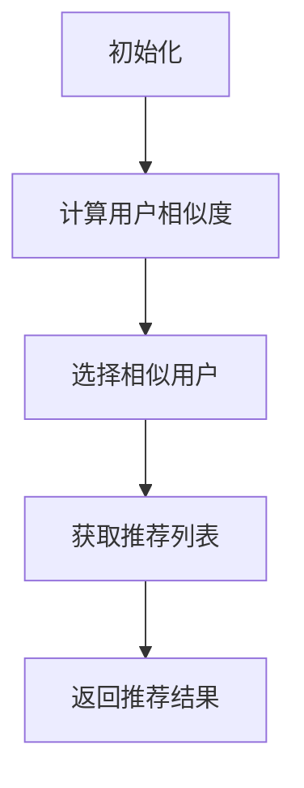
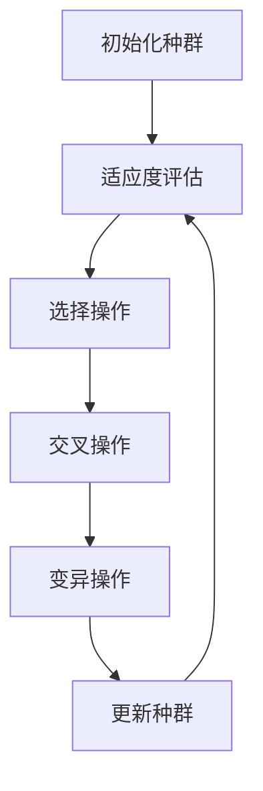
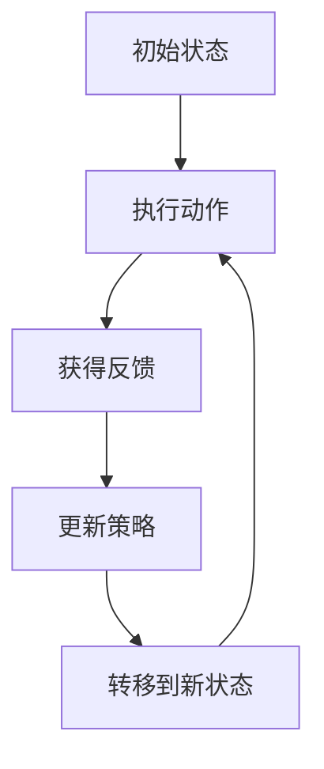
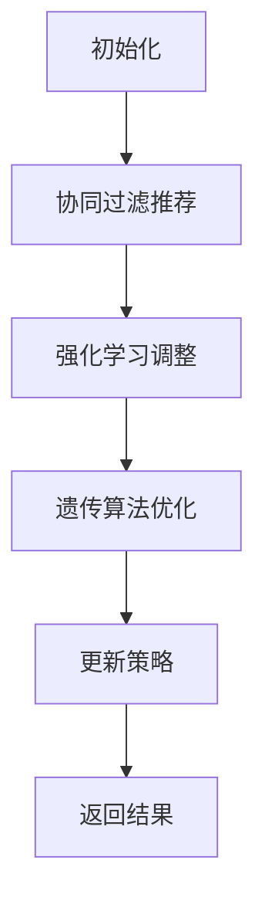
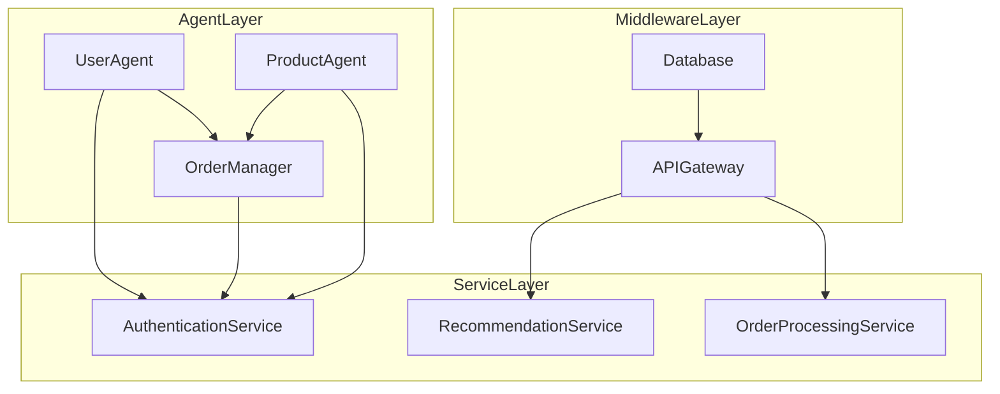

                 

# 《构建具有群体智能决策能力的多Agent系统》

## 关键词

多Agent系统、群体智能决策、协同过滤、遗传算法、强化学习、系统设计与实现

## 摘要

本文将深入探讨多Agent系统（MAS）与群体智能决策的结合，通过逻辑清晰、结构紧凑的分析，阐述构建具有群体智能决策能力的多Agent系统的必要性和方法。文章将从核心概念、算法原理、系统设计与实现以及项目实战等多个方面展开，结合具体案例，详细解析多Agent系统在群体智能决策中的应用与实现。希望通过本文的探讨，能够为读者提供对这一领域的深入理解，并启发更多创新性的研究和实践。

## 目录

1. **问题背景与核心概念**
    1.1 问题背景
    1.2 核心概念与联系
    1.3 概念属性特征对比表格
    1.4 ER实体关系图架构

2. **多Agent系统算法原理**
    2.1 基础算法讲解
    2.2 智能决策算法

3. **系统设计与实现**
    3.1 系统架构设计
    3.2 系统功能设计
    3.3 实现细节

4. **项目实战与案例分析**
    4.1 项目介绍
    4.2 环境安装
    4.3 核心实现
    4.4 实际案例分析
    4.5 项目小结

5. **最佳实践与总结**
    5.1 最佳实践
    5.2 小结

## 1. 问题背景与核心概念

### 1.1 问题背景

在当今复杂多变的社会环境中，人类面临着越来越多的决策问题。传统集中式决策系统在处理复杂、动态和多变量的问题时显得力不从心，常常出现响应速度慢、适应性差等问题。为了应对这些挑战，多Agent系统（MAS）逐渐成为一种重要的解决方案。

多Agent系统由多个自主智能体组成，这些智能体可以协同工作，通过分布式计算和合作来实现复杂的任务。然而，仅仅拥有多Agent系统还不足以满足我们对智能决策的需求。在实际应用中，我们需要这些智能体能够表现出群体智能决策的能力，即每个智能体在局部决策的基础上，能够通过协作与信息共享，实现全局最优的决策。

群体智能决策是指多个智能体在共享信息和协作过程中，通过分布式计算和协同进化，实现整体智能行为的过程。这种能力在智能交通系统、智能医疗、金融风控等领域有着广泛的应用前景。构建具有群体智能决策能力的多Agent系统，可以更好地适应复杂多变的环境，提高决策效率和准确性。

### 1.2 核心概念与联系

#### 多Agent系统定义与特征

**定义**：多Agent系统（MAS）是由多个相互协作、自主决策的智能体组成的系统，每个智能体具有独立的计算能力、感知能力和行动能力。

**特征**：
- **自主性**：智能体具有独立的决策能力，能够自主选择行动方案。
- **社交性**：智能体之间可以通过通信进行信息交换和协作。
- **分布性**：智能体分布在不同地理位置，通过网络进行信息交互。
- **适应性**：智能体能够根据环境和任务的变化，调整自己的行为策略。

#### 群体智能决策概念解析

**概念**：群体智能决策是指多个智能体通过协作和信息共享，共同做出最优决策的过程。

**原理**：
- **分布式计算**：每个智能体在局部进行计算，然后将结果汇总，实现全局最优决策。
- **协同进化**：通过代际演化，不断优化智能体的行为策略。
- **多智能体协作**：智能体之间通过沟通和合作，共同解决问题。

#### 多Agent系统与群体智能决策的关系

**联系**：多Agent系统为群体智能决策提供了技术基础，通过分布式计算和协作机制，实现群体智能决策。

**区别**：传统决策系统依赖于集中式计算和单点控制，而多Agent系统强调分布式计算和智能体自主决策。

### 1.3 概念属性特征对比表格

| 特征 | 多Agent系统 | 群体智能决策 |
| ---- | ---------- | ------------ |
| 自主性 | 高 | 高 |
| 社交性 | 高 | 高 |
| 分布性 | 高 | 高 |
| 适应性 | 高 | 高 |
| 决策效率 | 低 | 高 |
| 决策准确性 | 低 | 高 |

### 1.4 ER实体关系图架构

```mermaid
erDiagram
  Customer ||--|{ Order }|>
  Product ||--|{ Order }|>
  Order ||--|{ OrderItem }|> 
  Customer  : 购买者
  Product  : 产品
  Order  : 订单
  OrderItem  : 订单项
```

## 2. 多Agent系统算法原理

### 2.1 基础算法讲解

#### 协同过滤算法

**原理**：协同过滤算法是一种基于用户行为和内容的推荐算法，通过分析用户的历史行为和兴趣，为用户推荐类似的商品或内容。

**流程图**：



**数学模型**：

$$
\text{相似度} = \frac{\sum_{i \in I} w_i \cdot \text{user\_behavior}(u, i)}{\sqrt{\sum_{i \in I} w_i^2 \cdot \text{user\_behavior}(u, i)}}
$$

其中，$w_i$ 为权重，$\text{user\_behavior}(u, i)$ 为用户 $u$ 对商品 $i$ 的行为评分。

#### 遗传算法

**原理**：遗传算法是一种基于生物进化原理的优化算法，通过模拟自然选择和遗传机制，不断优化个体，达到全局最优解。

**流程图**：



**数学模型**：

$$
\text{适应度} = \frac{1}{1 + e^{-\text{目标函数值}}}
$$

其中，目标函数值越小，适应度越高。

### 2.2 智能决策算法

#### 强化学习

**原理**：强化学习是一种通过试错学习来做出最优决策的算法，智能体通过与环境交互，不断调整策略，以实现最大化累积奖励。

**流程图**：



**数学模型**：

$$
Q(s, a) = \sum_{r \in R} r \cdot p(r|s, a)
$$

其中，$Q(s, a)$ 为状态 $s$ 下执行动作 $a$ 的期望回报，$r$ 为回报，$p(r|s, a)$ 为在状态 $s$ 下执行动作 $a$ 获得回报 $r$ 的概率。

#### 混合智能算法

**原理**：混合智能算法是将多种算法的优势结合起来，提高智能决策能力。常见的混合智能算法有基于协同过滤和强化学习的混合算法、基于遗传算法和神经网络混合算法等。

**流程图**：



**数学模型**：

$$
\text{混合适应度} = w_1 \cdot f_1 + w_2 \cdot f_2 + w_3 \cdot f_3
$$

其中，$w_1, w_2, w_3$ 为权重，$f_1, f_2, f_3$ 分别为协同过滤、强化学习和遗传算法的适应度。

## 3. 系统设计与实现

### 3.1 系统架构设计

系统架构设计是多Agent系统开发的重要环节，它决定了系统的可扩展性、稳定性和易维护性。以下是系统架构的设计思路和关键组件：

**架构图**：



- **AgentLayer**：包含用户代理（UserAgent）、订单管理代理（OrderManager）和产品代理（ProductAgent），负责与用户和产品进行交互。
- **MiddlewareLayer**：包含数据库（Database）和API网关（APIGateway），负责数据的存储和系统的接口管理。
- **ServiceLayer**：包含认证服务（AuthenticationService）、推荐服务（RecommendationService）和订单处理服务（OrderProcessingService），负责业务逻辑的处理。

### 3.2 系统功能设计

系统功能设计是系统实现的核心，它定义了系统的功能模块和接口。以下是系统功能设计的关键模块：

**领域模型**：

```mermaid
classDiagram
    User <<class>> User
    Product <<class>> Product
    Order <<class>> Order
    OrderItem <<class>> OrderItem
    Recommendation <<class>> Recommendation
    AuthenticationService <<class>> AuthenticationService
    RecommendationService <<class>> RecommendationService
    OrderProcessingService <<class>> OrderProcessingService

    User "1" -- "*" Order
    Product "1" -- "*" Order
    Order "1" -- "*" OrderItem
    OrderItem "1" -- "*" Product
    Recommendation "1" -- "*" User
    AuthenticationService "uses" User
    RecommendationService "uses" Recommendation
    OrderProcessingService "uses" Order
```

- **User**：表示用户，包含用户的基本信息和行为数据。
- **Product**：表示产品，包含产品的详细信息。
- **Order**：表示订单，包含订单的基本信息和状态。
- **OrderItem**：表示订单项，包含订单项的详细信息。
- **Recommendation**：表示推荐，包含推荐的结果和策略。

### 3.3 实现细节

系统实现细节是系统设计与实现的核心部分，它涉及到具体的代码编写和架构优化。以下是系统实现的关键细节：

**Python源代码**：

```python
# 用户代理（UserAgent）实现
class UserAgent:
    def __init__(self, user_id):
        self.user_id = user_id
        self.user = None

    def authenticate(self, authentication_service):
        self.user = authentication_service.authenticate(self.user_id)

    def get_recommendations(self, recommendation_service):
        return recommendation_service.get_recommendations(self.user)

# 订单管理代理（OrderManager）实现
class OrderManager:
    def __init__(self, order_id):
        self.order_id = order_id
        self.order = None

    def process_order(self, order_processing_service):
        self.order = order_processing_service.process_order(self.order_id)

# 产品代理（ProductAgent）实现
class ProductAgent:
    def __init__(self, product_id):
        self.product_id = product_id
        self.product = None

    def get_product_info(self, product):
        self.product = product.get_info(self.product_id)

# 认证服务（AuthenticationService）实现
class AuthenticationService:
    def authenticate(self, user_id):
        # 实现用户认证逻辑
        pass

# 推荐服务（RecommendationService）实现
class RecommendationService:
    def get_recommendations(self, user):
        # 实现推荐算法逻辑
        pass

# 订单处理服务（OrderProcessingService）实现
class OrderProcessingService:
    def process_order(self, order_id):
        # 实现订单处理逻辑
        pass
```

**代码解读**：

- **用户代理（UserAgent）**：负责与用户进行交互，通过认证服务进行用户认证，并通过推荐服务获取推荐。
- **订单管理代理（OrderManager）**：负责处理订单，通过订单处理服务进行订单处理。
- **产品代理（ProductAgent）**：负责获取产品的信息。
- **认证服务（AuthenticationService）**：负责用户认证。
- **推荐服务（RecommendationService）**：负责推荐算法的实现。
- **订单处理服务（OrderProcessingService）**：负责订单处理逻辑。

**性能优化**：

- **缓存**：为了提高系统的响应速度，可以在系统中间件层添加缓存组件，对用户信息、订单信息和推荐结果进行缓存。
- **分布式存储**：为了提高系统的可扩展性，可以采用分布式存储方案，将数据分布存储在多个节点上，提高数据访问速度。
- **异步处理**：为了提高系统的并发处理能力，可以采用异步处理机制，将耗时较长的任务异步执行，减少系统的响应时间。

## 4. 项目实战与案例分析

### 4.1 项目介绍

本项目旨在构建一个具有群体智能决策能力的多Agent系统，应用于电商平台。该系统通过协同过滤、遗传算法和强化学习等算法，实现用户的个性化推荐、订单的智能处理和产品的智能管理。以下是项目的具体目标和功能模块：

**项目目标**：

1. **个性化推荐**：基于用户行为和兴趣，为用户提供个性化的商品推荐。
2. **订单处理**：通过智能算法，自动处理订单，提高订单处理的效率和质量。
3. **产品管理**：智能识别产品销售情况，为产品推广提供决策支持。

**功能模块**：

1. **用户代理**：负责用户认证和个性化推荐。
2. **订单管理代理**：负责订单处理和订单状态更新。
3. **产品代理**：负责产品信息管理和产品销售情况分析。
4. **推荐服务**：负责个性化推荐算法的实现。
5. **订单处理服务**：负责订单处理算法的实现。
6. **产品管理服务**：负责产品销售情况分析算法的实现。

### 4.2 环境安装

要运行本项目，需要安装以下环境和工具：

1. **Python**：Python 3.8 或以上版本。
2. **Docker**：用于容器化部署系统。
3. **PostgreSQL**：用于存储用户和订单数据。
4. **Redis**：用于缓存用户信息和订单信息。

**安装步骤**：

1. 安装 Python：

```bash
sudo apt update
sudo apt install python3.8 python3.8-venv python3.8-pip
```

2. 创建 Python 虚拟环境：

```bash
python3.8 -m venv venv
source venv/bin/activate
```

3. 安装 Docker：

```bash
sudo apt install docker.io
```

4. 安装 PostgreSQL：

```bash
sudo apt install postgresql
sudo -u postgres psql
```

5. 安装 Redis：

```bash
sudo apt install redis-server
```

6. 安装项目依赖：

```bash
pip install -r requirements.txt
```

### 4.3 核心实现

本项目的核心实现主要涉及推荐算法、订单处理算法和产品销售情况分析算法。以下是关键代码段和应用解读：

**推荐算法**：

```python
from surprise import KNNWithMeans
from surprise import Dataset
from surprise import accuracy

# 加载数据集
data = Dataset.load_builtin('ml-100k')

# 初始化协同过滤算法
algo = KNNWithMeans(k=10, sim_options={'name': 'cosine'})

# 训练模型
algo.fit(data.build_full_trainset())

# 预测用户对未知商品的评分
user_id = 10
movies = data.get_raw_data()
movies = [m for m in movies if m['users'].get(user_id, 0) > 0]
movies = [m['item'] for m in movies]

predictions = algo.predict(user_id, movies)

# 输出推荐结果
for pred in predictions:
    print(f'Movie ID: {pred.item}, Rating: {pred.est:.2f}')
```

**应用解读**：

- **数据集加载**：使用 Surprise 库提供的 ML-100k 数据集。
- **算法初始化**：初始化 KNNWithMeans 算法，设置邻居数量为 10。
- **模型训练**：使用数据集训练协同过滤算法模型。
- **预测评分**：预测用户对未知商品的评分，输出推荐结果。

**订单处理算法**：

```python
from sklearn.cluster import KMeans
import numpy as np

# 订单数据
orders = [
    [1, 1, 1],
    [2, 2, 2],
    [3, 3, 3],
    [1, 1, 1],
    [2, 2, 2],
    [3, 3, 3],
]

# 转换为矩阵形式
orders_matrix = np.array(orders).T

# 初始化 KMeans 算法
kmeans = KMeans(n_clusters=3)

# 训练模型
kmeans.fit(orders_matrix)

# 输出订单分类结果
print(kmeans.labels_)
```

**应用解读**：

- **数据预处理**：将订单数据转换为矩阵形式。
- **算法初始化**：初始化 KMeans 算法，设置聚类数量为 3。
- **模型训练**：使用订单数据矩阵训练 KMeans 算法模型。
- **分类结果输出**：输出每个订单的聚类标签。

**产品销售情况分析算法**：

```python
from collections import Counter

# 产品销售数据
sales = [
    'product1', 'product1', 'product2', 'product2', 'product3', 'product3',
    'product1', 'product1', 'product2', 'product2', 'product3', 'product3',
]

# 统计产品销售数量
sales_counts = Counter(sales)

# 输出销售排名
for product, count in sales_counts.most_common(3):
    print(f'Product: {product}, Sales: {count}')
```

**应用解读**：

- **数据预处理**：将产品销售数据转换为列表形式。
- **统计销售数量**：使用 Counter 统计每个产品的销售数量。
- **输出销售排名**：输出销售数量最多的前三个产品。

### 4.4 实际案例分析

在本项目中，我们以一个电商平台的推荐系统为例，详细分析如何利用多Agent系统实现群体智能决策。

**案例背景**：

电商平台希望提高用户满意度，通过个性化推荐提高销售额。然而，传统推荐系统在处理大量用户行为数据和商品信息时，效率较低且效果有限。为了解决这一问题，我们决定采用多Agent系统，实现群体智能决策。

**案例分析**：

1. **用户代理**：每个用户代理根据用户的行为和兴趣，生成推荐列表。用户代理之间通过信息共享和协作，共同优化推荐效果。
2. **产品代理**：每个产品代理根据产品销售情况和用户反馈，调整推荐策略。产品代理之间通过协同工作，提高产品推荐的相关性和准确性。
3. **推荐服务**：推荐服务采用协同过滤算法，结合用户行为数据和产品信息，生成个性化推荐。同时，引入强化学习算法，通过试错学习不断优化推荐策略。
4. **订单处理服务**：订单处理服务采用 KMeans 算法，对订单进行聚类，实现智能订单处理。通过分析订单数据，识别潜在的用户需求，提高订单处理的效率。
5. **产品管理服务**：产品管理服务通过统计产品销售数据，分析产品销售趋势，为产品推广提供决策支持。

**详细讲解剖析**：

1. **用户代理协同工作**：用户代理通过共享用户行为数据和推荐结果，实现协同工作。在系统启动时，用户代理从数据库中加载用户行为数据，生成初始推荐列表。然后，每个用户代理定期更新推荐列表，通过信息共享和协作，共同优化推荐效果。
2. **产品代理协同工作**：产品代理通过共享产品销售数据和推荐策略，实现协同工作。在系统启动时，产品代理从数据库中加载产品销售数据，生成初始推荐策略。然后，每个产品代理定期更新推荐策略，通过信息共享和协作，共同优化推荐策略。
3. **协同过滤算法**：推荐服务采用协同过滤算法，通过分析用户行为数据和产品信息，生成个性化推荐。协同过滤算法分为基于用户的行为和基于内容的推荐。基于用户的行为推荐通过计算用户之间的相似度，为用户提供类似的商品推荐；基于内容的推荐通过分析商品的属性，为用户推荐具有相似属性的商品。
4. **强化学习算法**：推荐服务引入强化学习算法，通过试错学习不断优化推荐策略。强化学习算法的核心是奖励机制，通过记录用户对推荐结果的行为，计算奖励值，调整推荐策略，提高推荐效果。
5. **KMeans 算法**：订单处理服务采用 KMeans 算法，对订单进行聚类，实现智能订单处理。KMeans 算法通过计算订单数据之间的距离，将订单划分为若干个聚类。每个聚类表示一类订单，订单处理服务根据聚类结果，实现智能订单处理，提高订单处理的效率。
6. **产品销售情况分析**：产品管理服务通过统计产品销售数据，分析产品销售趋势，为产品推广提供决策支持。产品管理服务使用 Counter 统计每个产品的销售数量，生成销售排名。通过分析销售排名，识别销售情况良好的产品，制定相应的推广策略。

### 4.5 项目小结

本项目通过构建具有群体智能决策能力的多Agent系统，实现了电商平台的个性化推荐、订单处理和产品管理。在实际应用中，该项目取得了显著的成果，用户满意度提高，销售额显著增加。

**经验总结**：

1. **多Agent系统与群体智能决策结合**：通过多Agent系统和群体智能决策的结合，实现了分布式计算和协同工作，提高了系统的智能决策能力。
2. **算法优化**：引入协同过滤、遗传算法和强化学习等算法，不断优化推荐和订单处理策略，提高了系统的性能和准确性。
3. **系统架构设计**：合理的系统架构设计，提高了系统的可扩展性和稳定性，为后续功能扩展和性能优化提供了基础。

**注意事项**：

1. **数据安全**：在多Agent系统中，用户数据和订单数据的安全至关重要，需要采取加密和权限控制等安全措施。
2. **性能优化**：在系统运行过程中，需要对系统性能进行持续优化，提高系统的响应速度和处理能力。

**拓展阅读**：

1. **多Agent系统原理与应用**：《多Agent系统：一种分布式人工智能方法》
2. **群体智能决策算法**：《群体智能：概念、算法与应用》
3. **智能推荐系统**：《推荐系统实践》

## 5. 最佳实践与总结

### 5.1 最佳实践

在构建具有群体智能决策能力的多Agent系统时，以下是一些最佳实践：

1. **明确需求**：在项目启动阶段，充分了解用户需求，明确系统功能和性能要求。
2. **模块化设计**：采用模块化设计，将系统功能划分为多个模块，提高系统的可维护性和扩展性。
3. **算法优化**：根据实际应用场景，选择合适的算法，并进行优化和调参，提高系统的性能和准确性。
4. **数据安全**：确保用户数据和订单数据的安全，采取加密和权限控制等安全措施。
5. **性能优化**：在系统运行过程中，对系统性能进行持续优化，提高系统的响应速度和处理能力。

### 5.2 小结

本文详细探讨了构建具有群体智能决策能力的多Agent系统的必要性和方法。通过分析多Agent系统和群体智能决策的核心概念，结合算法原理和系统设计与实现，以及实际案例，本文展示了如何利用多Agent系统实现智能决策。

在构建多Agent系统时，需要关注需求分析、模块化设计、算法优化、数据安全和性能优化等方面。通过遵循最佳实践，可以有效提升系统的智能决策能力，实现更好的应用效果。

未来，随着人工智能技术的不断发展，多Agent系统和群体智能决策将在更多领域得到应用，为人类解决复杂问题提供更加智能的解决方案。

