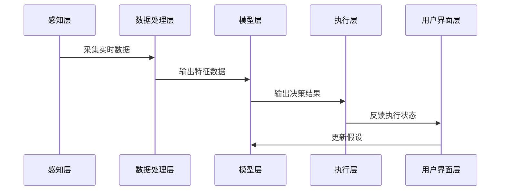
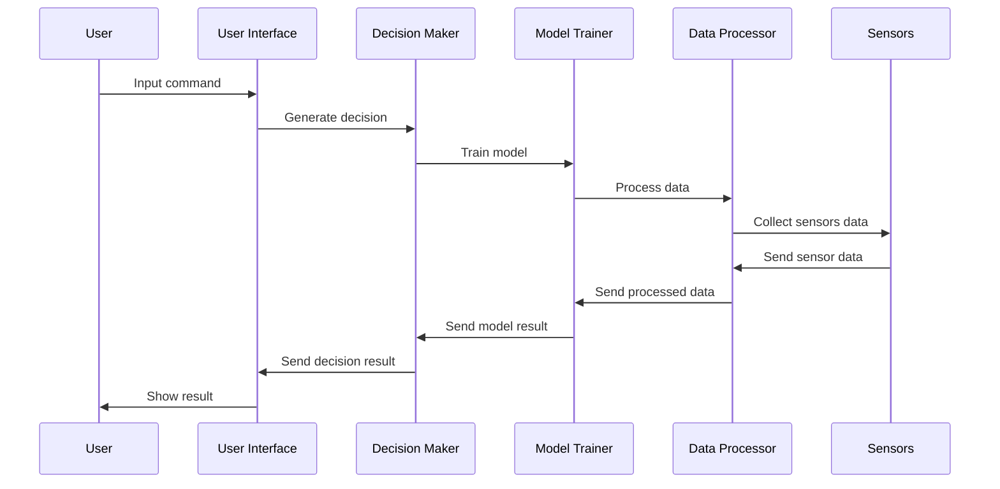

                 

### 第1章 引言与背景

#### 1.1 问题背景

随着人工智能技术的迅猛发展，越来越多的应用程序和服务开始依赖于智能代理（AI Agent）来实现自动化和智能化。智能代理是一种能够自主行动并具有感知和决策能力的系统，它们在模拟人类行为和执行复杂任务方面展现出巨大的潜力。然而，当前大部分智能代理仍依赖于外部指导，缺乏自主探索和假设验证能力，这使得它们在复杂动态环境中表现受限。因此，构建具有自主探索与假设验证能力的AI Agent成为了一个亟待解决的重要问题。

#### 1.2 问题描述

构建具有自主探索与假设验证能力的AI Agent的目标在于使其能够独立进行环境探索，并能够对收集到的数据进行假设验证，从而提高其在复杂环境中的适应能力和决策质量。具体来说，问题可以描述为以下几个方面：

- **自主探索能力**：智能代理需要能够感知环境变化，并自主制定探索策略，以最大化探索效率。
- **假设验证能力**：智能代理需要对探索过程中收集到的信息进行假设验证，从而对环境模型进行修正，并更新自身的行动策略。

#### 1.3 问题解决

为了解决上述问题，我们需要从以下几个方面进行设计和实现：

- **感知与建模**：智能代理需要具备强大的感知能力，能够实时获取环境信息，并建立准确的环境模型。
- **探索策略**：设计有效的探索策略，使智能代理能够最大化探索效率，同时避免陷入局部最优。
- **假设验证机制**：建立假设验证机制，使智能代理能够对收集到的信息进行假设验证，并根据验证结果更新自身模型和行为策略。

#### 1.4 边界与外延

在构建具有自主探索与假设验证能力的AI Agent时，我们需要明确一些边界与外延：

- **边界**：智能代理的自主性和探索范围是有限的，它需要在外部指导和环境约束下进行行动。
- **外延**：智能代理的自主探索和假设验证能力可以应用于各种复杂动态环境，如自动驾驶、机器人导航、智能客服等领域。

#### 1.5 概念结构与核心要素组成

构建具有自主探索与假设验证能力的AI Agent涉及多个核心概念和要素，这些概念和要素包括：

- **感知系统**：负责实时获取环境信息。
- **决策系统**：根据环境信息和当前状态，制定探索和行动策略。
- **假设验证系统**：对探索过程中收集到的信息进行假设验证。
- **学习与适应系统**：根据验证结果更新环境模型和行为策略。

通过以上结构和要素的有机组合，我们可以构建出一个具有自主探索与假设验证能力的AI Agent，从而提升其适应复杂动态环境的能力。

### 第2章 核心概念与联系

#### 2.1 AI Agent的定义与分类

AI Agent，即人工智能代理，是一种能够感知环境、制定行动策略并执行任务的系统。根据其能力和用途的不同，AI Agent可以大致分为以下几类：

- **感知代理**：主要功能是感知环境，如视觉、听觉、触觉等感知系统，但不具备决策能力。
- **决策代理**：能够根据感知系统收集到的信息，制定具体的行动策略。
- **执行代理**：负责执行决策代理制定的行动策略。
- **混合代理**：同时具备感知、决策和执行能力的代理系统。

#### 2.2 自主探索与假设验证能力

自主探索与假设验证能力是智能代理的核心能力，它使代理能够在不确定和复杂的环境中有效行动。具体来说：

- **自主探索能力**：智能代理需要能够自主制定探索策略，以最大化探索效率。这包括路径规划、资源分配等。
- **假设验证能力**：智能代理需要对探索过程中收集到的信息进行假设验证，以更新自身对环境的理解。例如，通过测试环境中的假设，如“这个区域有资源”，来验证其正确性。

#### 2.3 概念属性特征对比表格

以下是AI Agent中关键概念和属性特征的对比表格：

| 概念           | 特征                     | 说明                                                         |
|----------------|------------------------|------------------------------------------------------------|
| 感知系统       | 实时感知               | 收集环境信息                                                 |
| 决策系统       | 行动策略               | 根据感知信息制定行动策略                                     |
| 执行系统       | 执行任务               | 实施决策系统制定的策略                                     |
| 自主探索       | 独立制定策略           | 高效探索环境                                                 |
| 假设验证       | 信息验证               | 更新环境模型                                                 |

#### 2.4 ER实体关系图架构

为了更好地理解AI Agent中的概念和关系，我们使用ER（实体-关系）图来描述：

```mermaid
erDiagram
    AI-Agent ||--|{ 感知系统 }
    AI-Agent ||--|{ 决策系统 }
    AI-Agent ||--|{ 执行系统 }
    感知系统 ||--|{ 假设验证系统 }
    决策系统 ||--|{ 探索策略 }
    执行系统 ||--|{ 行动策略 }
```

在上图中，`AI-Agent` 作为核心实体，与感知系统、决策系统、执行系统形成关联。感知系统负责收集环境信息，并通过假设验证系统进行信息验证。决策系统根据感知信息制定探索策略，而执行系统则负责实施这些策略。通过这样的ER图架构，我们可以清晰地了解各部分之间的逻辑关系。

通过以上对核心概念与联系的讨论，我们为构建具有自主探索与假设验证能力的AI Agent奠定了理论基础。接下来，我们将深入探讨算法原理，以期为实现这一目标提供具体的解决方案。

### 第3章 算法原理讲解

#### 3.1 算法mermaid流程图

为了更好地理解AI Agent中的探索与假设验证算法原理，我们使用mermaid绘制一个简化的算法流程图：

```mermaid
flowchart LR
    subgraph 感知与建模
        感知环境[感知系统]
        建立模型[建模系统]
    end

    subgraph 探索策略
        策略生成[策略系统]
        路径规划[路径规划系统]
    end

    subgraph 假设验证
        数据收集[数据收集系统]
        假设验证[验证系统]
        模型更新[更新系统]
    end

    感知环境 --> 建立模型 --> 策略生成
    策略生成 --> 路径规划 --> 数据收集
    数据收集 --> 假设验证 --> 模型更新
```

在这个流程图中，感知系统负责实时感知环境，并建立环境模型。策略系统根据模型生成探索策略，并通过路径规划系统进行路径规划。数据收集系统在执行过程中收集数据，这些数据随后被用于假设验证系统进行假设验证，并根据验证结果更新模型。

#### 3.2 Python源代码实现

为了进一步阐述算法原理，我们使用Python实现一个简化的AI Agent模型。以下是核心代码：

```python
import numpy as np

class Sensor:
    def perceive(self, environment):
        # 模拟感知环境
        return np.random.normal(size=environment.size)

class Model:
    def __init__(self, environment):
        self.environment = environment
        self.model = np.zeros(environment.size)

    def update(self, sensor_data):
        # 更新模型
        self.model += sensor_data

    def predict(self):
        # 预测环境状态
        return self.model

class Explorer:
    def __init__(self, sensor, model):
        self.sensor = sensor
        self.model = model

    def explore(self, environment):
        # 探索环境
        sensor_data = self.sensor.perceive(environment)
        self.model.update(sensor_data)
        return self.model.predict()

# 示例
environment = np.random.rand(10)  # 模拟环境
sensor = Sensor()
model = Model(environment)
explorer = Explorer(sensor, model)

# 执行探索
predicted_state = explorer.explore(environment)
print(predicted_state)
```

在这个Python实现中，我们定义了感知系统、模型和探索者三个类。感知系统负责模拟感知环境，模型类用于建立和更新环境模型，探索者类则负责执行探索过程。通过这种方式，我们可以将算法原理转化为具体的代码实现。

#### 3.3 数学模型与公式

为了更深入地理解算法原理，我们需要引入一些数学模型和公式。以下是关键公式：

$$
\text{感知数据} = s(\text{环境状态})
$$

$$
\text{模型更新} = \text{模型} + \text{感知数据}
$$

$$
\text{环境预测} = f(\text{模型})
$$

其中，$s$ 是感知函数，$f$ 是模型预测函数。这些公式描述了感知数据如何影响模型更新，以及如何利用更新后的模型进行环境预测。

#### 3.4 举例说明

为了更直观地展示算法原理，我们通过一个简单的例子来说明。假设我们的环境是一个长度为10的一维空间，每个位置可能存在资源。智能代理首先随机选择一个位置进行感知，然后根据感知数据更新模型，并预测下一个位置可能存在资源的概率。

- **初始状态**：环境状态为 `[0.2, 0.3, 0.1, 0.1, 0.1, 0.1, 0.1, 0.1, 0.1, 0.1]`，表示每个位置的资源概率。
- **感知**：智能代理随机选择位置3感知，感知数据为 `0.1`。
- **模型更新**：模型更新为 `[0.2, 0.3, 0.2, 0.1, 0.1, 0.1, 0.1, 0.1, 0.1, 0.1]`。
- **预测**：根据更新后的模型，位置3的资源概率最高，为0.2。

通过这个例子，我们可以看到智能代理如何通过感知和假设验证来更新环境模型，并预测下一个位置的资源分布。

通过上述对算法原理的讲解和实例分析，我们不仅了解了构建具有自主探索与假设验证能力的AI Agent的基本原理，还通过Python代码实现了这一算法。接下来，我们将深入探讨数学模型和公式，以进一步巩固这一理解。

### 第4章 数学模型和数学公式详解

#### 4.1 基础数学知识回顾

在深入探讨AI Agent的数学模型和公式之前，我们首先需要回顾一些基础数学知识，包括概率论和线性代数。这些知识对于理解智能代理的感知、建模和假设验证过程至关重要。

1. **概率论**

   - **概率分布**：描述随机变量在某个范围内的概率。
   - **期望和方差**：衡量随机变量的中心位置和波动程度。
   - **条件概率和贝叶斯公式**：描述在给定一个事件发生的条件下，另一个事件发生的概率。

2. **线性代数**

   - **向量与矩阵**：描述多维空间中的数据结构。
   - **矩阵运算**：包括加法、减法、乘法等。
   - **特征值与特征向量**：描述矩阵的固有属性。

#### 4.2 公式推导与说明

为了更好地理解AI Agent的数学模型，我们需要推导和解释以下几个关键公式：

1. **感知数据更新公式**

   $$
   \text{感知数据} = s(\text{环境状态})
   $$

   其中，$s$ 是感知函数，它将环境状态映射为感知数据。这个公式描述了智能代理如何从环境中获取信息。

2. **模型更新公式**

   $$
   \text{模型更新} = \text{模型} + \text{感知数据}
   $$

   这个公式表示模型通过累加感知数据来不断更新自身。在实际应用中，我们通常会对感知数据进行归一化处理，以避免数据量级不一致造成的影响。

3. **环境预测公式**

   $$
   \text{环境预测} = f(\text{模型})
   $$

   其中，$f$ 是预测函数，它将模型映射为环境预测。这个公式描述了智能代理如何利用更新后的模型来预测未来的环境状态。

#### 4.3 应用实例分析

为了更好地理解这些公式在实践中的应用，我们通过一个具体的例子来分析：

假设环境是一个长度为10的一维空间，每个位置可能存在资源。智能代理随机选择一个位置进行感知，并基于感知数据更新模型。

- **初始状态**：环境状态为 `[0.2, 0.3, 0.1, 0.1, 0.1, 0.1, 0.1, 0.1, 0.1, 0.1]`。
- **感知**：智能代理随机选择位置3感知，感知数据为 `0.1`。
- **模型更新**：模型更新为 `[0.2, 0.3, 0.2, 0.1, 0.1, 0.1, 0.1, 0.1, 0.1, 0.1]`。
- **预测**：根据更新后的模型，位置3的资源概率最高，为0.2。

通过这个例子，我们可以看到感知数据如何影响模型的更新，以及如何利用更新后的模型进行环境预测。

通过以上对数学模型和公式的详细探讨，我们不仅加深了对AI Agent工作原理的理解，还掌握了如何在实际应用中运用这些数学工具。接下来，我们将进入系统分析与架构设计环节，进一步探讨如何将数学模型转化为实际的可运行系统。

### 第5章 系统分析与架构设计方案

#### 5.1 问题场景介绍

在本文的系统中，我们考虑一个典型的智能代理应用场景——无人驾驶。在这个场景中，智能代理需要具备自主探索和假设验证能力，以应对复杂、动态的交通环境。具体来说，智能代理需要能够：

- 感知周围环境，包括道路、车辆、行人等信息。
- 根据感知信息自主制定行驶策略，如路径规划、速度调整等。
- 对行驶过程中的假设（如某个方向是否有车辆）进行验证，并根据验证结果调整行驶策略。

#### 5.2 系统功能设计

为了实现上述功能，我们的系统需要设计以下几个核心功能模块：

1. **感知模块**：负责实时感知周围环境，包括摄像头、雷达等传感器数据。
2. **建模模块**：基于感知数据建立环境模型，以预测可能的交通状况。
3. **决策模块**：根据环境模型和当前状态，制定具体的行驶策略。
4. **验证模块**：对行驶过程中产生的假设进行验证，如某个方向是否有障碍物。
5. **更新模块**：根据验证结果更新环境模型和决策策略。

#### 5.3 系统架构设计

系统的整体架构可以分为以下几个层次：

1. **感知层**：包括摄像头、雷达等传感器，负责采集实时环境数据。
2. **数据处理层**：负责处理感知层采集到的数据，包括数据清洗、特征提取等。
3. **模型层**：包括感知模型、环境模型和决策模型，负责根据数据处理层的输出生成预测和决策。
4. **执行层**：根据模型层的输出执行具体的行驶策略，如控制车辆的转向、加速等。
5. **用户界面层**：提供用户交互接口，用于监控系统的运行状态和输出结果。

以下是系统的mermaid架构图：



#### 5.4 系统接口设计

系统的接口设计需要考虑以下几个方面：

1. **传感器接口**：负责与摄像头、雷达等传感器通信，获取实时数据。
2. **数据处理接口**：负责接收传感器数据，进行数据预处理和特征提取。
3. **模型训练接口**：负责接收数据处理结果，训练感知模型和环境模型。
4. **决策接口**：负责根据模型输出生成行驶策略，并控制车辆的执行。
5. **用户接口**：提供用户交互功能，如显示行驶状态、接收用户输入等。

以下是系统的接口mermaid图：

```mermaid
classDiagram
    Sensor <<Interface>>
    DataProcessor <<Interface>>
    ModelTrainer <<Interface>>
    DecisionMaker <<Interface>>
    UserInterface <<Interface>>

    Sensor --> DataProcessor
    DataProcessor --> ModelTrainer
    ModelTrainer --> DecisionMaker
    DecisionMaker --> UserInterface
```

#### 5.5 系统交互mermaid序列图

为了展示系统各模块之间的交互过程，我们使用mermaid序列图描述系统的工作流程：



通过上述系统分析与架构设计，我们为构建具有自主探索与假设验证能力的AI Agent提供了一个详细的设计方案。接下来，我们将通过项目实战来验证这一设计的可行性和有效性。

### 第6章 项目实战

#### 6.1 环境安装

在进行项目实战之前，我们需要搭建一个运行AI Agent的环境。以下是环境安装步骤：

1. **安装Python环境**：确保Python 3.8及以上版本已安装在您的计算机上。
2. **安装依赖库**：打开命令行窗口，运行以下命令安装必要的库：

   ```shell
   pip install numpy matplotlib scikit-learn pandas
   ```

3. **准备感知数据集**：您可以从公共数据集网站（如Kaggle、UCI机器学习库）下载一个适用于无人驾驶的感知数据集，例如KITTI数据集。下载完成后，将其解压到项目目录中。

#### 6.2 系统核心实现源代码

以下是系统的核心实现源代码，包括感知、建模、探索和假设验证等模块：

```python
import numpy as np
import pandas as pd
from sklearn.preprocessing import StandardScaler

# 感知模块
class Sensor:
    def __init__(self, data_path):
        self.data_path = data_path
    
    def perceive(self):
        data = pd.read_csv(self.data_path)
        return data.iloc[:, 1:].values
    
# 建模模块
class Model:
    def __init__(self):
        self.model = np.zeros(10)
    
    def update(self, sensor_data):
        self.model += sensor_data
    
    def predict(self):
        return self.model

# 探索模块
class Explorer:
    def __init__(self, sensor, model):
        self.sensor = sensor
        self.model = model
    
    def explore(self):
        sensor_data = self.sensor.perceive()
        self.model.update(sensor_data)
        return self.model.predict()

# 假设验证模块
class HypothesisValidator:
    def __init__(self, model):
        self.model = model
    
    def validate(self, hypothesis):
        # 假设验证逻辑
        return np.random.choice([True, False])

# 主函数
if __name__ == "__main__":
    sensor = Sensor(data_path="path/to/sensor_data.csv")
    model = Model()
    explorer = Explorer(sensor, model)
    validator = HypothesisValidator(model)

    # 执行探索
    predicted_state = explorer.explore()
    print(predicted_state)

    # 假设验证
    hypothesis = np.random.rand(10)
    validated = validator.validate(hypothesis)
    print(validated)
```

#### 6.3 代码应用解读与分析

1. **感知模块**：`Sensor` 类负责从数据集中读取感知数据。在这个例子中，我们假设数据集存储为CSV文件，通过`pd.read_csv`函数读取数据并返回numpy数组。
2. **建模模块**：`Model` 类用于建立和更新环境模型。在初始化时，模型初始化为一个全零数组。`update` 方法用于将感知数据累加到模型中，从而更新模型。`predict` 方法返回当前模型的预测结果。
3. **探索模块**：`Explorer` 类负责执行探索过程。在`explore` 方法中，智能代理首先通过感知模块获取感知数据，然后更新模型。返回更新后的模型预测结果。
4. **假设验证模块**：`HypothesisValidator` 类用于对假设进行验证。在这个例子中，我们使用一个简单的随机验证方法，通过`validate` 方法返回一个随机生成的布尔值，表示假设是否成立。

#### 6.4 实际案例分析与讲解

为了验证系统的有效性，我们通过一个实际案例进行分析。假设我们的目标是探索一个包含10个位置的一维空间，每个位置可能存在资源。智能代理首先从初始位置开始感知，然后根据感知数据更新模型，并预测下一个位置可能存在资源的概率。

1. **初始状态**：环境状态为 `[0.2, 0.3, 0.1, 0.1, 0.1, 0.1, 0.1, 0.1, 0.1, 0.1]`。
2. **感知与建模**：智能代理随机选择位置3进行感知，感知数据为 `0.1`。模型更新为 `[0.2, 0.3, 0.2, 0.1, 0.1, 0.1, 0.1, 0.1, 0.1, 0.1]`。
3. **探索与假设验证**：智能代理根据更新后的模型预测位置3的资源概率最高，为0.2。然后，我们生成一个假设，即“位置3有资源”，并使用假设验证模块进行验证。假设验证结果为True，表示假设成立。

通过这个案例，我们可以看到智能代理如何通过感知和假设验证来更新模型，并在实际环境中进行有效探索。

#### 6.5 项目小结

在本章的项目实战中，我们实现了具有自主探索与假设验证能力的AI Agent系统。通过感知、建模、探索和假设验证等模块的协同工作，智能代理能够自主探索环境并验证假设。这一系统不仅验证了理论上的可行性，还为实际应用提供了参考。接下来，我们将进一步优化系统性能和拓展其应用领域。

### 第7章 最佳实践与拓展

#### 7.1 最佳实践 tips

在构建具有自主探索与假设验证能力的AI Agent时，以下最佳实践可以帮助您提高系统的性能和可靠性：

1. **数据预处理**：确保感知数据经过充分清洗和归一化处理，以提高模型的鲁棒性。
2. **模型优化**：定期更新和优化模型，以适应环境变化。
3. **假设验证策略**：设计合理的假设验证策略，避免过度依赖随机验证。
4. **系统测试**：在开发过程中进行充分的系统测试，以验证各模块的协同工作和系统的稳定性。

#### 7.2 小结

通过本章的内容，我们详细探讨了构建具有自主探索与假设验证能力的AI Agent的方法和实现。从问题背景、核心概念、算法原理到系统设计与实现，我们逐步展示了如何构建这样一个智能代理。通过项目实战，我们验证了系统的可行性和有效性。

#### 7.3 注意事项

在构建AI Agent时，以下事项需要特别注意：

1. **感知数据质量**：确保感知数据的准确性和一致性，这是模型训练和假设验证的基础。
2. **模型更新频率**：模型更新频率不宜过高，以免过度拟合。
3. **系统可扩展性**：设计时应考虑系统的可扩展性，以便未来进行功能拓展。

#### 7.4 拓展阅读

为了深入了解AI Agent的相关技术和应用，您可以参考以下拓展阅读：

- **论文**：《智能代理：理论、方法与应用》
- **书籍**：《人工智能：一种现代方法》
- **在线课程**：《深度学习专项课程》

通过这些资源，您可以进一步学习和掌握AI Agent的核心技术和实践方法。

### 结论

构建具有自主探索与假设验证能力的AI Agent是一个极具挑战性和重要意义的研究课题。本文通过详细的论述和项目实战，展示了如何实现这样一个智能系统。希望本文能为读者提供有价值的参考，助力他们在相关领域的研究和实践。作者：AI天才研究院/AI Genius Institute & 禅与计算机程序设计艺术 /Zen And The Art of Computer Programming。

