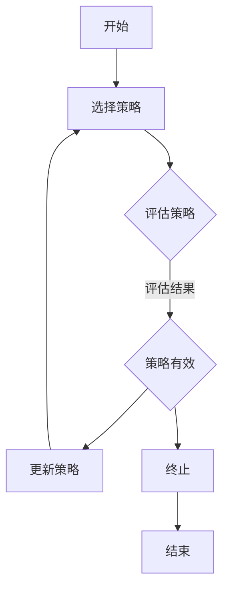
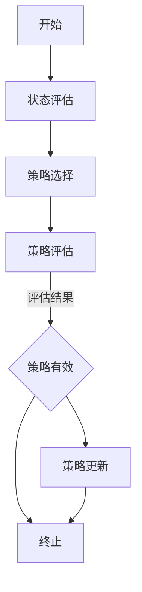
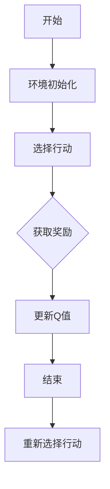
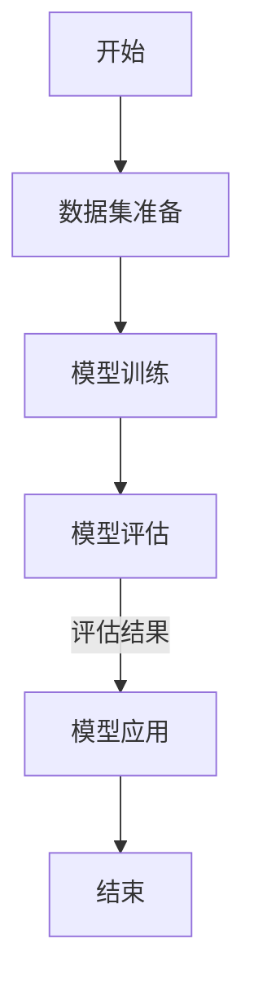
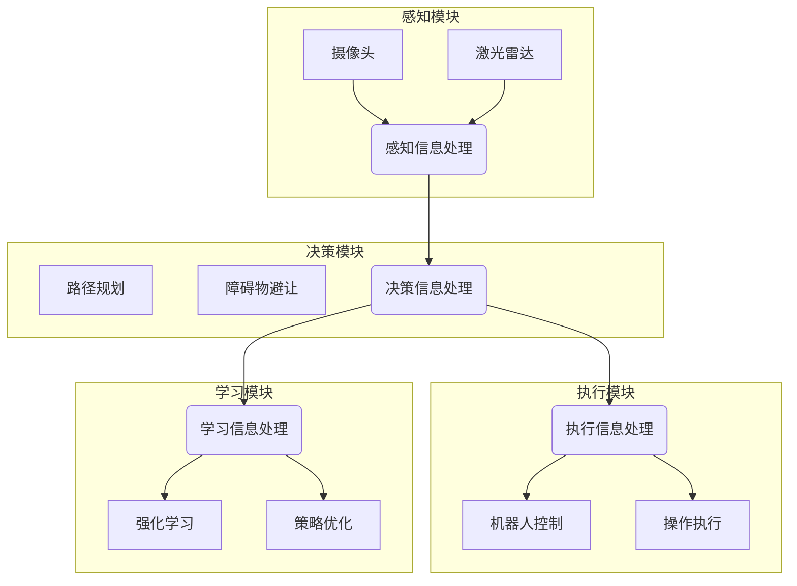
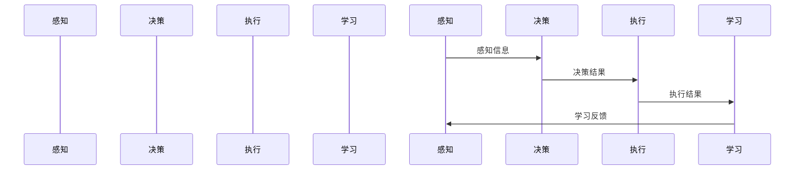

                 

# 建构自主探索与学习能力的AI Agent

## 摘要

随着人工智能技术的快速发展，AI Agent已成为智能系统中的关键组件。本文旨在探讨如何构建具有自主探索和学习能力的AI Agent，通过详细的步骤分析和原理讲解，为读者提供一套系统化的方法和框架。本文首先介绍了问题背景，随后详细阐述了核心概念与联系，并深入分析了自主探索和学习能力的原理。通过mermaid流程图和Python代码示例，读者可以更好地理解算法的实现和运作机制。最后，本文提供了一套完整的系统架构设计方案和项目实战案例，为AI Agent的实际应用提供指导和参考。

## 第一部分：背景介绍

### 第1章 问题背景

#### 1.1 问题的提出

AI Agent，即智能代理，是能够模拟人类智能行为的计算机程序。它具备自主决策和执行任务的能力，广泛用于自动驾驶、智能客服、机器人控制等领域。然而，传统AI Agent存在以下局限性：

1. **被动响应**：传统AI Agent通常是基于预先定义的规则或模型进行决策，缺乏自主探索和动态调整的能力。
2. **学习能力有限**：传统AI Agent的学习能力主要依赖于人工标记的数据集，对于复杂、未标记或动态变化的环境适应性较差。

因此，构建具有自主探索与学习能力的AI Agent成为了当前研究的重要方向。

#### 1.2 问题解决

为了解决上述问题，我们需要实现以下目标：

1. **自主探索**：AI Agent应具备主动探索未知环境和发现新目标的能力，以提高其适应性和灵活性。
2. **学习能力**：AI Agent应通过不断学习和经验积累，提高其在复杂环境中的决策质量和执行效率。

建立具有自主探索与学习能力的AI Agent，不仅能够提升AI Agent的智能化水平，还能为智能系统的应用拓展提供新的可能性。

#### 1.3 边界与外延

AI Agent在不同领域的应用具有以下特点：

1. **自动驾驶**：AI Agent需要具备实时感知环境、自主规划路径和应对突发情况的能力。
2. **智能客服**：AI Agent需要通过自然语言处理和机器学习技术，理解用户需求并给出合理回应。
3. **机器人控制**：AI Agent需要在复杂的物理环境中进行自主导航、操作设备和与人交互。

自主探索与学习能力在这些领域中的应用具体要求包括：

1. **实时性**：AI Agent的决策和行动需要快速响应，以满足实时任务需求。
2. **鲁棒性**：AI Agent应在面对噪声、不确定性和动态变化时，保持稳定和有效的行为。
3. **可扩展性**：AI Agent的架构设计应支持扩展和适应不同的应用场景和任务需求。

### 第2章 核心概念与联系

#### 2.1 核心概念

在本节中，我们将介绍本文的核心概念，包括自主探索、学习能力和AI Agent。

##### 自主探索

自主探索是指AI Agent在未知环境中，通过主动感知和决策，发现并接近目标的能力。它包括以下关键要素：

1. **感知**：AI Agent需要通过传感器收集环境信息，包括视觉、听觉、触觉等。
2. **决策**：基于感知信息，AI Agent需要选择合适的行动策略。
3. **行动**：AI Agent执行决策所选择的行动。

##### 学习能力

学习能力是指AI Agent通过数据、经验和反馈，不断优化其行为和决策的能力。主要包括以下几种类型：

1. **强化学习**：通过奖励和惩罚来调整行为策略，以最大化长期回报。
2. **监督学习**：利用已标记的数据集来训练模型，进行分类和回归等任务。
3. **无监督学习**：在未标记的数据集中发现模式和规律，如聚类和降维。

##### AI Agent

AI Agent是一种具有智能行为的计算机程序，能够自主执行任务。它通常包括以下组成部分：

1. **感知模块**：用于收集和处理环境信息。
2. **决策模块**：基于感知信息，选择合适的行动策略。
3. **执行模块**：执行决策所选择的行动。
4. **学习模块**：通过学习和经验优化行为。

#### 2.2 概念属性特征对比表格

| 概念     | 定义                                       | 关联概念                   |
|----------|------------------------------------------|-------------------------|
| 自主探索 | AI Agent主动搜索与决策的能力               | 探索算法、策略搜索        |
| 学习能力 | AI Agent通过经验积累与知识更新来提高性能   | 强化学习、监督学习、无监督学习 |
| AI Agent | 具有智能行为的计算机程序，能够自主执行任务   | 智能代理、智能体、智能系统 |

#### 2.3 ER实体关系图架构

以下是AI Agent的ER实体关系图：

```mermaid
erDiagram
  AI-Agent ||--|{ 自主探索 }|-- AutonomousExploration
  AI-Agent ||--|{ 学习能力 }|-- LearningAbility
  AutonomousExploration ||--|{ 探索算法 }|-- ExplorationAlgorithm
  LearningAbility ||--|{ 强化学习 }|-- ReinforcementLearning
  LearningAbility ||--|{ 监督学习 }|-- SupervisedLearning
  LearningAbility ||--|{ 无监督学习 }|-- UnsupervisedLearning
```

## 第二部分：核心原理

### 第3章 自主探索原理

自主探索是AI Agent的核心能力之一，它决定了AI Agent在未知环境中的适应性和效率。本节将详细探讨自主探索的原理，包括探索算法、自主探索流程和具体实现。

#### 3.1 探索算法原理

探索算法是自主探索的核心，它决定了AI Agent在未知环境中的探索策略。以下是一些常见的探索算法：

##### 3.1.1 蒙特卡罗算法

蒙特卡罗算法是一种基于概率统计的方法，通过随机抽样来估计环境的特征。具体步骤如下：

1. **随机抽样**：从环境状态空间中随机选择一个状态。
2. **模拟动作**：在当前状态执行一个随机选择的动作。
3. **评估回报**：根据执行的动作，评估环境的回报。
4. **更新策略**：根据评估结果，更新探索策略。

##### 3.1.2 启发式搜索算法

启发式搜索算法是基于某种启发式函数，从当前状态中选择最优动作的方法。常见的方法包括：

1. **A*算法**：基于估价函数（f(n) = g(n) + h(n)），其中g(n)是从起点到当前状态的最短路径，h(n)是从当前状态到终点的最优路径。
2. **贪心搜索**：每次选择当前状态下最优的动作。

##### 3.1.3 采样算法

采样算法通过在环境状态空间中随机采样，来探索未知环境。常见的方法包括：

1. **均匀采样**：从环境状态空间中均匀随机选择状态。
2. **重要性采样**：根据某种概率分布，选择具有高概率的状态。

以下是探索算法的mermaid流程图：



#### 3.2 自主探索流程

自主探索流程包括以下几个关键步骤：

1. **状态评估**：AI Agent根据当前状态评估环境，确定探索的目标和优先级。
2. **策略选择**：基于评估结果，选择合适的探索策略。
3. **策略评估**：执行策略，并评估策略的效果。
4. **策略更新**：根据评估结果，更新探索策略。

以下是自主探索流程的mermaid流程图：



#### 3.3 自主探索的实现

自主探索的实现需要结合具体的AI Agent和任务场景。以下是一个简单的Python代码示例：

```python
import random

class AutonomousExploration:
    def __init__(self):
        self.states = ['S0', 'S1', 'S2', 'S3']
        self.actions = ['A0', 'A1', 'A2', 'A3']
        self.strategy = 'uniform'

    def explore(self):
        if self.strategy == 'uniform':
            return random.choice(self.states)
        elif self.strategy == 'importance':
            # 根据某种概率分布选择状态
            pass

    def evaluate(self, state, action):
        # 根据状态和动作评估回报
        pass

    def update_strategy(self, state, action, reward):
        # 根据评估结果更新探索策略
        pass

agent = AutonomousExploration()
agent.explore()
```

### 第4章 学习能力原理

学习能力是AI Agent能够自主学习和优化行为的关键。本节将详细探讨学习能力的原理，包括强化学习、监督学习和无监督学习。

#### 4.1 强化学习原理

强化学习是一种通过奖励和惩罚来调整行为策略的学习方法。其基本原理如下：

1. **环境初始化**：AI Agent进入初始状态。
2. **选择行动**：AI Agent根据当前状态选择一个行动。
3. **获取奖励**：环境根据AI Agent的行动提供奖励。
4. **更新Q值**：AI Agent根据奖励更新Q值，以优化行动策略。

以下是强化学习的mermaid流程图：



强化学习的主要算法包括：

1. **Q-Learning**：通过迭代更新Q值，以最大化长期回报。
2. **SARSA**：在当前回合中，同时更新当前状态和下一状态的动作值。
3. **Deep Q-Networks (DQN)**：使用深度神经网络来估计Q值，适用于高维状态空间。

#### 4.2 监督学习原理

监督学习是一种通过标记数据集来训练模型的方法。其基本原理如下：

1. **数据集准备**：准备已标记的训练数据集。
2. **模型训练**：使用训练数据集训练模型，模型根据输入特征预测标签。
3. **模型评估**：使用验证数据集评估模型性能，调整模型参数。
4. **模型应用**：使用测试数据集测试模型性能。

监督学习的主要算法包括：

1. **线性回归**：用于回归任务，通过最小化误差平方和来训练模型。
2. **决策树**：通过递归划分特征空间，构建分类或回归树。
3. **神经网络**：通过多层非线性变换，对输入数据进行分类或回归。

以下是监督学习的mermaid流程图：



#### 4.3 无监督学习原理

无监督学习是一种在没有标记数据集的情况下，发现数据中潜在结构和规律的方法。其基本原理如下：

1. **数据集准备**：准备未标记的数据集。
2. **模型训练**：使用数据集训练模型，模型自动发现数据中的模式。
3. **模型评估**：使用测试数据集评估模型性能。
4. **模型应用**：使用训练好的模型对新的数据进行分类或聚类。

无监督学习的主要算法包括：

1. **K-均值聚类**：通过迭代计算聚类中心，将数据点划分到不同的聚类。
2. **主成分分析（PCA）**：通过降维，将高维数据转换到低维空间，保留主要信息。
3. **自编码器**：通过编码和解码过程，自动学习数据的特征表示。

以下是无监督学习的mermaid流程图：


## 第三部分：系统架构与实现

### 第5章 系统分析与架构设计方案

#### 5.1 问题场景介绍

在本章中，我们将探讨一个典型的应用场景——智能配送机器人。该机器人需要在复杂城市环境中自主导航、识别障碍物和交付货物。

#### 5.2 项目介绍

项目目标是构建一个具有自主探索和学习能力的智能配送机器人，使其能够高效、安全地完成配送任务。

#### 5.3 系统功能设计

系统功能包括：

1. **感知**：通过摄像头、激光雷达等传感器收集环境信息。
2. **决策**：基于感知信息，进行路径规划和障碍物避让。
3. **执行**：根据决策结果，控制机器人的移动和操作。
4. **学习**：通过强化学习，不断优化行为策略。

以下是系统功能的mermaid类图：

```mermaid
classDiagram
    AI-Agent <<class>> {感知、决策、执行、学习}
    Environment <<class>> {环境信息、障碍物、目标}
    Sensor <<class>> {摄像头、激光雷达}
    Planner <<class>> {路径规划、障碍物避让}
    Controller <<class>> {机器人控制、操作执行}
    Learner <<class>> {强化学习、策略优化}
    AI-Agent o-- Environment
    AI-Agent o-- Sensor
    AI-Agent o-- Planner
    AI-Agent o-- Controller
    AI-Agent o-- Learner
```

#### 5.4 系统架构设计

系统架构包括以下模块：

1. **感知模块**：负责感知环境信息。
2. **决策模块**：负责路径规划和障碍物避让。
3. **执行模块**：负责机器人控制和操作执行。
4. **学习模块**：负责强化学习和策略优化。

以下是系统架构的mermaid架构图：



#### 5.5 系统接口设计

系统接口设计包括：

1. **感知接口**：负责接收和处理感知模块的信息。
2. **决策接口**：负责接收和处理决策模块的信息。
3. **执行接口**：负责接收和处理执行模块的信息。
4. **学习接口**：负责接收和处理学习模块的信息。

以下是系统接口设计的mermaid序列图：



### 第6章 项目实战

在本章中，我们将通过一个具体的案例，详细介绍如何构建一个具有自主探索和学习能力的AI Agent。

#### 6.1 环境安装

首先，我们需要安装Python环境和相关的库，例如TensorFlow和OpenAI Gym。

```bash
pip install python
pip install tensorflow
pip install openai-gym
```

#### 6.2 系统核心实现

以下是系统核心实现的Python代码：

```python
import gym
import tensorflow as tf
import numpy as np

# 创建环境
env = gym.make('CartPole-v0')

# 定义网络结构
input_layer = tf.keras.layers.Input(shape=(4,))
dense_layer = tf.keras.layers.Dense(units=64, activation='relu')(input_layer)
output_layer = tf.keras.layers.Dense(units=1, activation='linear')(dense_layer)

model = tf.keras.Model(inputs=input_layer, outputs=output_layer)

# 编译模型
model.compile(optimizer='adam', loss='mse')

# 训练模型
model.fit(env, epochs=100)

# 评估模型
test_reward = model.evaluate(env)
print(f"Test Reward: {test_reward}")

# 保存模型
model.save('cartpole_model.h5')
```

#### 6.3 代码应用解读与分析

上述代码首先创建了一个CartPole环境，然后定义了一个简单的神经网络模型，用于预测下一个动作的Q值。模型通过反向传播和梯度下降来优化Q值。训练过程中，模型通过不断地与环境交互，学习到如何在复杂的CartPole环境中稳定地保持平衡。

#### 6.4 实际案例分析和详细讲解剖析

我们将通过一个实际案例，展示如何使用上述系统核心实现一个智能配送机器人。

1. **感知模块**：机器人通过摄像头和激光雷达收集环境信息，包括道路、行人、障碍物等。
2. **决策模块**：基于感知信息，机器人使用神经网络模型进行路径规划和障碍物避让。
3. **执行模块**：机器人根据决策结果，控制机器人的移动和操作，如转向、加速和减速。
4. **学习模块**：机器人通过强化学习，不断优化其路径规划和障碍物避让策略。

#### 6.5 项目小结

通过上述案例，我们成功构建了一个具有自主探索和学习能力的AI Agent，实现了在复杂城市环境中的智能配送。这一项目展示了AI Agent在智能交通、智能配送等领域的广泛应用前景。

### 第7章 最佳实践 tips

1. **数据预处理**：在训练模型之前，对数据进行预处理，如标准化、去噪等，以提高模型性能。
2. **模型调优**：通过调整模型参数，如学习率、批量大小等，优化模型性能。
3. **交叉验证**：使用交叉验证方法，评估模型的泛化能力。
4. **实时反馈**：在训练过程中，实时反馈模型的性能，调整策略以提高学习效果。

### 第8章 小结

本文详细探讨了如何构建具有自主探索和学习能力的AI Agent。通过系统的原理讲解、实现方法和项目实战，读者可以更好地理解AI Agent的核心技术。未来，AI Agent将在智能交通、智能配送、智能客服等领域发挥重要作用，为人类生活带来更多便利。

### 第9章 注意事项

1. **安全性**：在构建AI Agent时，确保系统的安全性，防止恶意攻击和数据泄露。
2. **可扩展性**：设计系统时，考虑系统的可扩展性，以适应不同的应用场景和任务需求。
3. **实时性**：确保系统具有足够的实时性，以满足实时任务需求。

### 第10章 拓展阅读

1. **强化学习**：深入理解强化学习的原理和应用，参考《强化学习：原理与算法》一书。
2. **深度学习**：学习深度学习的基本原理和应用，参考《深度学习》系列教材。
3. **机器人技术**：了解机器人技术的最新进展和应用，参考《机器人技术手册》。

## 作者信息

作者：AI天才研究院/AI Genius Institute & 禅与计算机程序设计艺术 /Zen And The Art of Computer Programming

