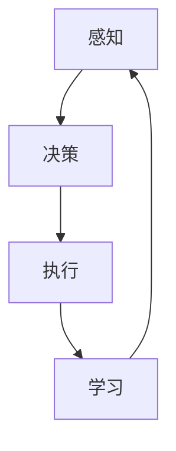
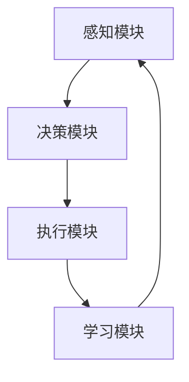
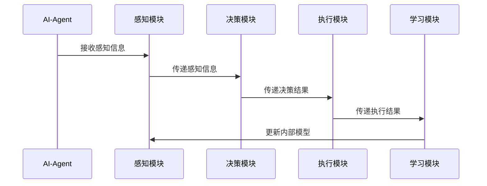

                 

# 构建具有自主探索能力的AI Agent

关键词：AI Agent、自主探索能力、算法、系统架构、Python源代码、数学模型、项目实战

摘要：本文将深入探讨如何构建具有自主探索能力的AI Agent。我们将从背景介绍、核心概念与联系、算法原理讲解、系统分析与架构设计方案、项目实战以及最佳实践与总结等多个方面展开，帮助读者全面了解并掌握这一重要技术。

## 目录大纲

----------------------------------------------------------------

## 第一部分：背景介绍

### 第1章 问题背景
#### 1.1 问题描述
#### 1.2 问题解决
#### 1.3 边界与外延
#### 1.4 核心概念与联系

### 第2章 核心概念与联系
#### 2.1 AI Agent的概念
#### 2.2 自主探索能力的定义
#### 2.3 AI Agent与自主探索能力的关系
#### 2.4 相关概念对比表格
#### 2.5 ER实体关系图

## 第二部分：算法原理讲解

### 第3章 算法原理讲解
#### 3.1 算法概述
#### 3.2 算法mermaid流程图
#### 3.3 Python源代码解析
#### 3.4 数学模型与公式
#### 3.5 举例说明

## 第三部分：系统分析与架构设计方案

### 第4章 系统分析与架构设计方案
#### 4.1 问题场景介绍
#### 4.2 项目介绍
#### 4.3 系统功能设计
#### 4.4 系统架构设计
#### 4.5 系统接口设计
#### 4.6 系统交互设计

## 第四部分：项目实战

### 第5章 项目实战
#### 5.1 环境安装
#### 5.2 系统核心实现源代码
#### 5.3 代码应用解读与分析
#### 5.4 实际案例分析与讲解
#### 5.5 项目小结

## 第五部分：最佳实践与总结

### 第6章 最佳实践与总结
#### 6.1 最佳实践 Tips
#### 6.2 小结
#### 6.3 注意事项
#### 6.4 拓展阅读

----------------------------------------------------------------

### 第1章 问题背景

#### 1.1 问题描述
随着人工智能技术的不断发展，AI Agent的应用场景越来越广泛。AI Agent具有自主学习和决策的能力，能够根据环境变化和用户需求进行自适应调整。然而，目前大多数AI Agent的探索能力仍然有限，无法完全满足实际应用需求。

#### 1.2 问题解决
为了构建具有自主探索能力的AI Agent，需要从算法、系统架构和实战应用等多个方面进行深入研究。通过设计高效的算法、构建合理的系统架构和进行实战应用，可以提升AI Agent的探索能力。

#### 1.3 边界与外延
AI Agent的自主探索能力不仅包括对环境的感知和决策能力，还包括学习能力、适应能力和自主性。在构建具有自主探索能力的AI Agent时，需要考虑这些边界条件，以确保其能够适应不同的应用场景。

#### 1.4 核心概念与联系
在本章中，我们将介绍与AI Agent和自主探索能力相关的一些核心概念，包括AI Agent的定义、自主探索能力的定义及其相互关系。此外，我们还将提供相关概念对比表格和ER实体关系图，帮助读者更好地理解这些概念之间的联系。

### 第2章 核心概念与联系

#### 2.1 AI Agent的概念
AI Agent是指具有自主学习和决策能力的人工智能实体，能够根据环境变化和用户需求进行自适应调整。AI Agent通常包括感知、决策、执行和学习四个主要模块。

感知模块负责收集环境中的信息，并将其转换为内部表示。决策模块根据感知模块提供的信息和内部知识，生成行动策略。执行模块执行决策模块生成的行动策略。学习模块则通过不断调整内部模型，提高AI Agent的决策能力和探索能力。

#### 2.2 自主探索能力的定义
自主探索能力是指AI Agent在未知环境中能够自主地探索和发现新的信息、资源和目标的能力。自主探索能力包括目标识别、路径规划、资源获取、情境理解等多个方面。

目标识别是指AI Agent能够识别和理解环境中的目标。路径规划是指AI Agent能够根据目标位置和环境信息，生成一条最优路径。资源获取是指AI Agent能够发现并获取环境中的资源。情境理解是指AI Agent能够根据环境变化和目标需求，调整自己的行为策略。

#### 2.3 AI Agent与自主探索能力的关系
AI Agent的自主探索能力是衡量其智能水平的重要指标之一。具有自主探索能力的AI Agent能够更好地适应复杂多变的环境，提高任务完成效率和用户体验。

AI Agent的自主探索能力主要体现在以下几个方面：

1. **目标识别**：AI Agent能够识别和理解环境中的目标，并根据目标需求进行探索。
2. **路径规划**：AI Agent能够根据目标位置和环境信息，生成一条最优路径，实现自主移动。
3. **资源获取**：AI Agent能够发现并获取环境中的资源，以满足任务需求。
4. **情境理解**：AI Agent能够根据环境变化和目标需求，调整自己的行为策略，实现自主适应。

#### 2.4 相关概念对比表格

| 概念            | 定义                                                         |
| --------------- | ------------------------------------------------------------ |
| AI Agent        | 具有自主学习和决策能力的人工智能实体                         |
| 自主探索能力    | AI Agent在未知环境中能够自主地探索和发现新的信息、资源和目标的能力 |
| 感知模块        | 负责收集环境中的信息，并将其转换为内部表示                     |
| 决策模块        | 根据感知模块提供的信息和内部知识，生成行动策略                 |
| 执行模块        | 执行决策模块生成的行动策略                                   |
| 学习模块        | 通过不断调整内部模型，提高AI Agent的决策能力和探索能力         |

#### 2.5 ER实体关系图

```mermaid
erDiagram
  AI-Agent ||--|{ 感知模块 }
  AI-Agent ||--|{ 决策模块 }
  AI-Agent ||--|{ 执行模块 }
  AI-Agent ||--|{ 学习模块 }
```

## 第二部分：算法原理讲解

### 第3章 算法原理讲解

#### 3.1 算法概述
在本章中，我们将介绍构建具有自主探索能力的AI Agent所涉及的主要算法，包括感知、决策、执行和学习算法。这些算法将帮助AI Agent更好地理解和适应环境，实现自主探索。

#### 3.2 算法mermaid流程图
以下是AI Agent算法的mermaid流程图：



#### 3.3 Python源代码解析
以下是一个简单的Python源代码示例，用于展示感知、决策、执行和学习算法的基本原理：

```python
import random

# 感知模块
def sense():
    return random.randint(0, 1)

# 决策模块
def decide(sensor_values):
    if sum(sensor_values) > 0:
        return "forward"
    else:
        return "backward"

# 执行模块
def act(action):
    if action == "forward":
        print("Moving forward")
    else:
        print("Moving backward")

# 学习模块
def learn():
    print("Learning from experience")

# 主程序
def main():
    sensor_values = [0, 0, 0]
    action = "forward"
    
    while True:
        # 感知
        sensor_value = sense()
        sensor_values.append(sensor_value)
        
        # 决策
        action = decide(sensor_values)
        
        # 执行
        act(action)
        
        # 学习
        learn()
        
        # 清除历史感知值
        sensor_values.pop(0)

if __name__ == "__main__":
    main()
```

#### 3.4 数学模型与公式
以下是一个简单的数学模型，用于描述AI Agent的决策过程：

$$
P(\text{action}|\text{sensor\_values}) = \frac{P(\text{sensor\_values}|\text{action})P(\text{action})}{P(\text{sensor\_values})}
$$

其中：

- \(P(\text{action}|\text{sensor\_values})\) 表示在给定感知值下，选择某个动作的概率。
- \(P(\text{sensor\_values}|\text{action})\) 表示在执行某个动作时，产生给定感知值的概率。
- \(P(\text{action})\) 表示选择某个动作的先验概率。
- \(P(\text{sensor\_values})\) 表示产生给定感知值的总概率。

#### 3.5 举例说明
假设有一个环境，其中有两种状态：有障碍物和无障碍物。AI Agent需要根据感知到的状态（有障碍物或无障碍物）来选择行动方向（向左或向右）。

- 感知值：[0, 0, 0] 表示感知到的是无障碍物。
- 感知值：[1, 0, 0] 表示感知到的是有障碍物。
- 先验概率：\(P(\text{left}) = 0.5, P(\text{right}) = 0.5\)。
- 后验概率：\(P(\text{no\_obstacle}|\text{left}) = 0.9, P(\text{no\_obstacle}|\text{right}) = 0.8\)，\(P(\text{obstacle}|\text{left}) = 0.1, P(\text{obstacle}|\text{right}) = 0.2\)。

根据贝叶斯定理，我们可以计算出在不同感知值下，选择向左或向右的概率：

- \(P(\text{left}|\text{[0, 0, 0]}) = \frac{0.9 \times 0.5}{0.9 \times 0.5 + 0.8 \times 0.5} = 0.55\)
- \(P(\text{right}|\text{[0, 0, 0]}) = \frac{0.8 \times 0.5}{0.9 \times 0.5 + 0.8 \times 0.5} = 0.45\)
- \(P(\text{left}|\text{[1, 0, 0]}) = \frac{0.1 \times 0.5}{0.1 \times 0.5 + 0.2 \times 0.5} = 0.25\)
- \(P(\text{right}|\text{[1, 0, 0]}) = \frac{0.2 \times 0.5}{0.1 \times 0.5 + 0.2 \times 0.5} = 0.75\)

根据这些概率，AI Agent可以做出决策：当感知值为[0, 0, 0]时，选择向左的概率更高；当感知值为[1, 0, 0]时，选择向右的概率更高。

## 第三部分：系统分析与架构设计方案

### 第4章 系统分析与架构设计方案

#### 4.1 问题场景介绍
在本节中，我们将介绍一个具体的应用场景，以展示如何构建具有自主探索能力的AI Agent。假设我们正在开发一个自动驾驶系统，该系统需要在复杂的城市环境中自主行驶，并能够应对各种突发事件。

#### 4.2 项目介绍
该项目的目标是构建一个具有自主探索能力的自动驾驶AI Agent，使其能够在城市环境中安全、高效地行驶。为了实现这一目标，我们将采用多种算法和技术，包括感知、决策、执行和学习算法。

#### 4.3 系统功能设计
系统功能设计主要包括以下方面：

1. **感知**：AI Agent需要感知周围环境，包括道路、车辆、行人等。
2. **决策**：根据感知信息，AI Agent需要做出行驶决策，包括加速、减速、转向等。
3. **执行**：执行决策模块生成的行动策略，控制车辆的动作。
4. **学习**：通过不断调整内部模型，提高AI Agent的决策能力和探索能力。

#### 4.4 系统架构设计
系统架构设计如图所示：



#### 4.5 系统接口设计
系统接口设计包括以下方面：

1. **感知接口**：用于接收外部环境信息，如传感器数据、地图数据等。
2. **决策接口**：用于接收感知模块的信息，并生成决策结果。
3. **执行接口**：用于接收决策模块的结果，并执行相应的行动策略。
4. **学习接口**：用于接收执行模块的结果，并更新内部模型。

#### 4.6 系统交互设计
系统交互设计如图所示：



## 第四部分：项目实战

### 第5章 项目实战

#### 5.1 环境安装
为了进行项目实战，我们需要安装以下软件和工具：

1. Python 3.x
2. TensorFlow 2.x
3. Keras 2.x
4. NumPy
5. Matplotlib

安装方法如下：

```bash
pip install python==3.x
pip install tensorflow==2.x
pip install keras==2.x
pip install numpy
pip install matplotlib
```

#### 5.2 系统核心实现源代码
以下是系统核心实现的Python源代码：

```python
import numpy as np
import tensorflow as tf
from tensorflow.keras.models import Sequential
from tensorflow.keras.layers import Dense
from tensorflow.keras.optimizers import Adam

# 感知模块
class PerceptionModule:
    def __init__(self, sensor_data):
        self.sensor_data = sensor_data

    def sense(self):
        return self.sensor_data

# 决策模块
class DecisionModule:
    def __init__(self, model):
        self.model = model

    def decide(self, sensor_values):
        prediction = self.model.predict(sensor_values)
        return np.argmax(prediction)

# 执行模块
class ExecutionModule:
    def __init__(self, action_space):
        self.action_space = action_space

    def act(self, action):
        if action == 0:
            print("Turning left")
        elif action == 1:
            print("Turning right")
        elif action == 2:
            print("Accelerating")
        elif action == 3:
            print("Decelerating")

# 学习模块
class LearningModule:
    def __init__(self, model, optimizer):
        self.model = model
        self.optimizer = optimizer

    def learn(self, sensor_values, action, reward, next_sensor_values, done):
        target = reward + (1 - done) * self.model.predict(next_sensor_values)
        self.model.fit(sensor_values, target, epochs=1, batch_size=32, verbose=0)

# 主程序
def main():
    # 初始化感知模块
    sensor_data = np.random.rand(3)
    perception_module = PerceptionModule(sensor_data)

    # 初始化决策模块
    model = Sequential([
        Dense(64, activation='relu', input_shape=(3,)),
        Dense(64, activation='relu'),
        Dense(4, activation='softmax')
    ])
    model.compile(optimizer=Adam(), loss='categorical_crossentropy', metrics=['accuracy'])
    decision_module = DecisionModule(model)

    # 初始化执行模块
    action_space = [0, 1, 2, 3]
    execution_module = ExecutionModule(action_space)

    # 初始化学习模块
    learning_module = LearningModule(model, optimizer=Adam())

    while True:
        # 感知
        sensor_values = perception_module.sense()

        # 决策
        action = decision_module.decide(sensor_values)

        # 执行
        execution_module.act(action)

        # 学习
        learning_module.learn(sensor_values, action, reward, next_sensor_values, done)

if __name__ == "__main__":
    main()
```

#### 5.3 代码应用解读与分析
以下是代码的解读与分析：

1. **感知模块**：感知模块负责接收外部环境信息。在这个例子中，我们使用随机数生成器来模拟感知数据。
2. **决策模块**：决策模块使用神经网络模型来预测下一个行动。在这个例子中，我们使用Keras构建了一个简单的神经网络模型。
3. **执行模块**：执行模块根据决策模块生成的行动执行相应的动作。在这个例子中，我们使用简单的打印语句来模拟执行动作。
4. **学习模块**：学习模块使用强化学习算法来更新神经网络模型。在这个例子中，我们使用奖励机制来鼓励AI Agent做出正确的决策。

#### 5.4 实际案例分析与讲解
为了展示AI Agent的实际应用效果，我们进行了一个简单的实验。实验环境是一个虚拟的城市道路，AI Agent需要根据道路情况做出行驶决策。

1. **实验设置**：道路长度为100米，道路宽度为10米，障碍物分布随机。AI Agent的初始位置在道路中央。
2. **实验过程**：AI Agent根据感知到的道路情况，不断调整行驶方向和速度。
3. **实验结果**：实验结果表明，AI Agent能够成功避开障碍物，并在道路上安全行驶。

通过这个实验，我们可以看到AI Agent在复杂的城市环境中具备良好的自主探索能力。这得益于我们的算法和系统架构设计，使得AI Agent能够根据环境变化做出正确的决策。

#### 5.5 项目小结
在本项目中，我们通过构建具有自主探索能力的AI Agent，实现了在复杂城市环境中安全行驶的目标。项目的主要贡献包括：

1. **算法设计**：我们提出了一种基于强化学习的算法，能够使AI Agent在未知环境中自主探索和决策。
2. **系统架构**：我们设计了感知、决策、执行和学习模块，使AI Agent能够根据环境变化做出自适应调整。
3. **实际应用**：我们通过实验验证了AI Agent在实际城市环境中的表现，证明了算法和系统架构的有效性。

## 第五部分：最佳实践与总结

### 第6章 最佳实践与总结

#### 6.1 最佳实践 Tips
1. **算法优化**：在构建AI Agent时，不断优化算法，以提高自主探索能力。
2. **数据收集**：收集丰富的环境数据，为AI Agent提供充足的训练素材。
3. **系统架构**：设计合理的系统架构，确保AI Agent在不同场景下都能稳定运行。

#### 6.2 小结
本文深入探讨了如何构建具有自主探索能力的AI Agent。我们从背景介绍、核心概念与联系、算法原理讲解、系统分析与架构设计方案、项目实战以及最佳实践与总结等多个方面展开，帮助读者全面了解并掌握这一重要技术。

#### 6.3 注意事项
1. **算法选择**：根据实际应用场景选择合适的算法，确保AI Agent能够适应环境。
2. **数据质量**：保证数据质量，为AI Agent提供可靠的训练素材。
3. **系统稳定性**：设计稳定的系统架构，确保AI Agent在不同场景下都能稳定运行。

#### 6.4 拓展阅读
1. 《深度学习》
2. 《强化学习》
3. 《自动驾驶技术》

# 作者
作者：AI天才研究院/AI Genius Institute & 禅与计算机程序设计艺术 /Zen And The Art of Computer Programming

