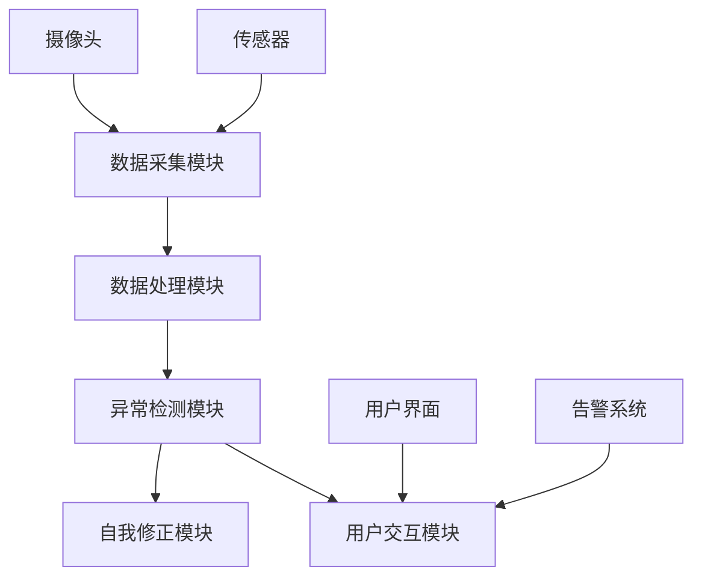
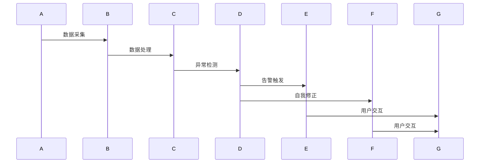

                 


# 构建具有自我修正能力的AI Agent

## 关键词

- AI Agent
- 自我修正
- 强化学习
- 深度学习
- 自我检测
- 自我修复

## 摘要

本文旨在探讨构建具有自我修正能力的AI Agent的必要性和方法。AI Agent作为人工智能领域的关键概念，其在实际应用中面临的一个主要挑战是自我修正能力的缺失。本文首先介绍了AI Agent的定义、分类和核心特性，接着详细阐述了自我修正能力的概念、机制及其重要性。随后，本文提出了AI Agent设计原则，并从系统架构设计、核心实现等方面进行了深入探讨。通过实际案例分析和解读，本文展示了构建具有自我修正能力的AI Agent的具体步骤和实现方法。最后，本文总结了构建自我修正AI Agent的最佳实践，并指出了未来研究的方向。

## 引言与背景

### 1.1 问题背景

随着人工智能技术的快速发展，AI Agent作为智能体在各个领域得到了广泛应用。然而，在实际应用中，AI Agent的自我修正能力成为了限制其发展的关键问题。传统的人工智能系统依赖于人类专家进行调优和修正，这不仅费时费力，而且难以适应动态变化的复杂环境。因此，构建具有自我修正能力的AI Agent显得尤为重要。

### 1.2 问题描述

AI Agent是指能够自主完成特定任务、与环境互动并具备决策能力的智能系统。其核心目标是提高系统的自主性和适应性。然而，当前AI Agent在自我修正方面存在以下问题：

1. **缺乏自我检测能力**：AI Agent无法自动识别自身的错误或缺陷，导致其在运行过程中难以进行自我修正。
2. **缺乏自我诊断能力**：AI Agent无法对自身的工作状态和性能进行诊断，从而无法发现并解决潜在的问题。
3. **缺乏自我修复能力**：即使AI Agent能够检测到问题，也缺乏有效的修复机制，无法自动修复错误。

### 1.3 目标与内容概述

本文的目标是探讨如何构建具有自我修正能力的AI Agent。具体来说，本文将从以下几个方面进行阐述：

1. **AI Agent基础理论**：介绍AI Agent的定义、分类和核心特性，为后续讨论自我修正能力提供理论基础。
2. **自我修正能力的概念**：详细阐述自我修正能力的概念、机制及其重要性。
3. **设计原则**：提出AI Agent设计原则，包括自我检测、自我诊断、自我修复和自我学习等方面。
4. **实现与部署**：介绍实现具有自我修正能力的AI Agent的具体步骤和方法。
5. **实际案例分析与解读**：通过具体案例展示构建自我修正AI Agent的实际操作过程。

## 第一部分：基础理论与核心概念

### 2.1 AI Agent基础理论

#### 2.1.1 AI Agent的定义

AI Agent是指具备智能、自主性和适应性的人工智能系统。它能够在不确定的环境中自主完成特定任务，并具备与环境互动的能力。AI Agent是人工智能领域的核心概念，其研究旨在提高人工智能系统的自主性和智能化水平。

#### 2.1.2 AI Agent的分类

根据不同的分类标准，AI Agent可以分为多种类型：

1. **基于规则的AI Agent**：这类AI Agent通过预设的规则进行决策和行动。其优点是规则简单、易于理解，但缺点是适应性较差，难以应对复杂多变的环境。
2. **基于知识的AI Agent**：这类AI Agent通过知识库进行决策和行动。其优点是具有较强的适应性，但缺点是知识库的建设和维护较为复杂。
3. **基于学习的AI Agent**：这类AI Agent通过机器学习和深度学习等技术进行决策和行动。其优点是具有较强的自主性和适应性，但缺点是需要大量的数据和计算资源。

#### 2.1.3 AI Agent的关键特性

AI Agent的关键特性包括：

1. **自主性**：AI Agent能够自主地执行任务，无需人工干预。
2. **适应性**：AI Agent能够根据环境变化调整自身行为，以适应新的情况。
3. **互动性**：AI Agent能够与环境进行互动，获取信息并作出反应。
4. **学习性**：AI Agent能够通过学习不断提高自身的能力和性能。

### 2.2 自我修正能力的概念

#### 2.2.1 自我修正的定义

自我修正是指AI Agent能够自动检测、诊断和修复自身存在的问题，从而提高系统的可靠性和稳定性。自我修正包括以下三个方面的内容：

1. **自我检测**：AI Agent能够自动检测自身是否存在错误或异常情况。
2. **自我诊断**：AI Agent能够对检测到的问题进行诊断，确定问题的性质和原因。
3. **自我修复**：AI Agent能够自动修复检测到的问题，恢复正常工作状态。

#### 2.2.2 自我修正的机制

自我修正的机制主要包括以下几个方面：

1. **异常检测**：通过监测系统运行过程中的各种指标，检测是否存在异常情况。
2. **错误定位**：通过分析异常情况，定位错误的起源和具体位置。
3. **修复策略**：根据错误类型和原因，制定相应的修复策略，包括修改程序代码、更新模型参数等。
4. **验证与测试**：修复后对系统进行验证和测试，确保修复效果和系统稳定性。

#### 2.2.3 自我修正的重要性

自我修正能力对于AI Agent的发展具有重要意义：

1. **提高可靠性**：自我修正能够及时发现和修复系统中的问题，提高系统的可靠性和稳定性。
2. **降低维护成本**：自我修正能够减少人工干预，降低系统的维护成本。
3. **增强适应性**：自我修正使得AI Agent能够适应动态变化的复杂环境，提高系统的自主性和智能化水平。

### 2.3 相关技术概述

#### 2.3.1 机器学习和深度学习

机器学习和深度学习是构建AI Agent的基础技术。机器学习是指通过训练模型，使系统能够从数据中自动学习规律和模式，从而提高系统的性能。深度学习是机器学习的一个分支，通过多层神经网络进行特征提取和模式识别，具有较高的准确性和泛化能力。

#### 2.3.2 强化学习

强化学习是一种通过试错和反馈进行决策的方法，适用于动态环境下的决策问题。强化学习通过不断试错和反馈，使AI Agent逐渐优化决策策略，提高系统的性能。

#### 2.3.3 模式识别与自然语言处理

模式识别是用于处理非结构化数据的常见技术，通过提取和识别数据中的模式，实现对数据的理解和分类。自然语言处理是用于处理自然语言数据的技术，包括文本分类、情感分析、机器翻译等任务。

## 1.4 本章小结

本章介绍了AI Agent的定义、分类和核心特性，以及自我修正能力的概念、机制和重要性。通过本章的学习，读者可以对AI Agent和自我修正能力有一个全面的了解，为后续章节的学习打下基础。

----------------------------------------------------------------

## 第3章：核心概念与联系

### 3.1 核心概念表

在构建具有自我修正能力的AI Agent的过程中，我们需要关注以下几个核心概念：

| 核心概念 | 定义 |
| :---: | :--- |
| AI Agent | 具备智能、自主性和适应性的人工智能系统 |
| 自我修正 | AI Agent能够自动检测、诊断和修复自身存在的问题 |
| 强化学习 | 一种通过试错和反馈进行决策的方法 |
| 深度学习 | 通过多层神经网络进行特征提取和模式识别的方法 |
| 模式识别 | 从非结构化数据中提取和识别模式的方法 |
| 自然语言处理 | 用于处理自然语言数据的技术 |

### 3.2 概念属性特征对比表格

为了更好地理解各个核心概念之间的关系，我们可以通过一个对比表格展示它们的属性特征：

| 概念 | 属性特征 |
| :---: | :--- |
| AI Agent | 智能性、自主性、适应性 |
| 自我修正 | 检测、诊断、修复 |
| 强化学习 | 试错、反馈、优化 |
| 深度学习 | 神经网络、特征提取、模式识别 |
| 模式识别 | 数据提取、模式匹配、分类 |
| 自然语言处理 | 文本分类、情感分析、机器翻译 |

### 3.3 ER实体关系图架构

ER（实体关系）图是用于表示实体之间关系的图形化工具。在构建具有自我修正能力的AI Agent时，我们可以通过ER图来表示各个核心概念之间的关系：

```mermaid
erDiagram
  AI-Agent ||--|{ 强化学习 } : 实现策略优化
  AI-Agent ||--|{ 深度学习 } : 特征提取和模式识别
  AI-Agent ||--|{ 模式识别 } : 数据处理
  AI-Agent ||--|{ 自然语言处理 } : 文本理解和生成
  强化学习 ||--|{ 自我修正 } : 优化决策策略
  深度学习 ||--|{ 自我修正 } : 优化模型参数
  模式识别 ||--|{ 自我修正 } : 优化数据处理流程
  自然语言处理 ||--|{ 自我修正 } : 优化文本处理效果
```

通过ER图，我们可以清晰地看到各个核心概念之间的关联和作用。这有助于我们在设计和实现过程中更好地把握系统的整体结构和功能。

## 4. 自我修正AI Agent的设计原则

### 4.1 设计原则概述

构建具有自我修正能力的AI Agent需要遵循一系列设计原则，以确保系统的稳定性和可靠性。以下是几个关键的设计原则：

#### 4.1.1 自我检测

自我检测是指AI Agent能够自动监测自身的运行状态，识别潜在的错误或异常情况。自我检测是自我修正能力的基础，只有通过及时发现和识别问题，才能进行有效的修正。自我检测可以采用以下方法：

1. **指标监控**：通过监控系统的各种运行指标，如内存使用率、CPU负载、网络延迟等，检测是否存在异常。
2. **日志分析**：对系统的日志文件进行分析，查找可能的错误或异常信息。
3. **异常检测算法**：采用机器学习和统计方法，对系统数据进行实时分析，识别潜在的异常情况。

#### 4.1.2 自我诊断

自我诊断是指AI Agent能够对检测到的问题进行诊断，确定问题的性质和原因。自我诊断是自我修正能力的关键环节，只有通过准确的诊断，才能采取有效的修正措施。自我诊断可以采用以下方法：

1. **故障树分析**：通过构建故障树，分析可能导致问题的各种原因，并确定最可能的原因。
2. **基于规则的诊断**：利用预设的规则，对系统的运行状态进行分析，诊断可能的问题。
3. **机器学习诊断**：利用机器学习算法，对系统的历史数据进行学习，识别可能的故障模式。

#### 4.1.3 自我修复

自我修复是指AI Agent能够自动修复检测到的问题，恢复正常的工作状态。自我修复是自我修正能力的最终目标，通过自我修复，可以降低系统的维护成本，提高系统的可靠性。自我修复可以采用以下方法：

1. **自动修复脚本**：编写自动修复脚本，根据诊断结果，自动执行修复操作。
2. **在线修复**：通过在线学习和调整，使系统能够自动适应新的环境和数据。
3. **远程修复**：通过远程连接，对系统进行升级和修复。

#### 4.1.4 自我学习

自我学习是指AI Agent能够通过不断的学习和优化，提高自身的性能和适应性。自我学习是自我修正能力的补充，通过自我学习，可以不断提高系统的能力和水平。自我学习可以采用以下方法：

1. **强化学习**：通过试错和反馈，使系统不断优化自身的决策和行动策略。
2. **深度学习**：通过多层神经网络，使系统不断学习和提取新的特征和模式。
3. **迁移学习**：通过将已有的知识和经验迁移到新的任务中，提高系统的适应性和学习能力。

### 4.2 系统架构设计

为了实现具有自我修正能力的AI Agent，我们需要设计一个高效的系统架构。以下是几个关键的设计模块：

#### 4.2.1 系统功能模块

1. **数据采集模块**：负责从外部环境采集数据，为AI Agent提供训练和推理所需的输入数据。
2. **数据处理模块**：负责对采集到的数据进行清洗、预处理和特征提取，为后续的模型训练和推理提供高质量的数据。
3. **模型训练模块**：负责使用机器学习和深度学习技术，对处理后的数据进行训练，生成性能良好的模型。
4. **推理模块**：负责使用训练好的模型，对新的数据进行推理和预测，为系统的决策提供支持。
5. **自我检测模块**：负责监测系统的运行状态，识别潜在的异常情况。
6. **自我诊断模块**：负责对检测到的问题进行诊断，确定问题的性质和原因。
7. **自我修复模块**：负责自动修复检测到的问题，恢复正常的工作状态。
8. **自我学习模块**：负责通过学习新的数据和经验，优化系统的性能和适应性。

#### 4.2.2 模块交互设计

各个模块之间的交互设计是系统架构设计的关键。以下是各个模块之间的交互关系：

1. **数据采集模块**与**数据处理模块**：数据采集模块将采集到的数据传递给数据处理模块，由数据处理模块进行清洗、预处理和特征提取。
2. **数据处理模块**与**模型训练模块**：数据处理模块将处理后的数据传递给模型训练模块，由模型训练模块进行模型训练。
3. **模型训练模块**与**推理模块**：模型训练模块将训练好的模型传递给推理模块，由推理模块进行推理和预测。
4. **自我检测模块**与**自我诊断模块**：自我检测模块将检测到的问题传递给自我诊断模块，由自我诊断模块进行诊断。
5. **自我诊断模块**与**自我修复模块**：自我诊断模块将诊断结果传递给自我修复模块，由自我修复模块进行修复。
6. **自我学习模块**与**数据采集模块**、**数据处理模块**、**模型训练模块**：自我学习模块根据系统的运行状态和反馈信息，对数据采集模块、数据处理模块和模型训练模块进行优化和调整。

#### 4.2.3 系统稳定性与可靠性

为了确保系统的稳定性和可靠性，我们需要考虑以下几个方面：

1. **容错设计**：在系统架构中引入冗余设计，如使用备份服务器、备份数据库等，以应对可能的硬件故障或软件故障。
2. **故障恢复机制**：在系统设计中引入故障恢复机制，如自动重启、故障切换等，以快速恢复系统的正常运行。
3. **性能优化**：通过性能优化，提高系统的运行效率和稳定性，如使用缓存技术、负载均衡等。
4. **安全防护**：在系统架构中引入安全防护机制，如加密通信、访问控制等，以防止恶意攻击和数据泄露。

### 4.3 设计案例分析

为了更好地理解自我修正AI Agent的设计原则和系统架构，我们可以通过一些实际案例进行分析。

#### 4.3.1 案例一：自动驾驶系统

自动驾驶系统是一个典型的具有自我修正能力的AI Agent应用场景。在自动驾驶系统中，AI Agent需要具备自我检测、自我诊断和自我修复能力，以确保系统的安全性和可靠性。

1. **自我检测**：自动驾驶系统通过传感器和摄像头采集车辆周围环境的数据，实时监测车辆的运动状态和周围环境的变化，识别潜在的异常情况。
2. **自我诊断**：当检测到异常情况时，自动驾驶系统会进行自我诊断，分析可能的故障原因，如传感器故障、控制模块故障等。
3. **自我修复**：自动驾驶系统根据诊断结果，自动执行相应的修复操作，如重启传感器、调整控制模块参数等，以恢复正常工作状态。

#### 4.3.2 案例二：智能客服系统

智能客服系统是另一个具有自我修正能力的AI Agent应用场景。在智能客服系统中，AI Agent需要能够自动检测、诊断和修复自身的问题，以提高系统的服务质量。

1. **自我检测**：智能客服系统通过用户反馈和系统日志，监测自身的运行状态，识别潜在的异常情况，如回答不准确、响应延迟等。
2. **自我诊断**：当检测到异常情况时，智能客服系统会进行自我诊断，分析可能的故障原因，如知识库缺失、模型参数不合理等。
3. **自我修复**：智能客服系统根据诊断结果，自动执行相应的修复操作，如更新知识库、调整模型参数等，以提高回答的准确性和响应速度。

### 4.4 本章小结

本章介绍了自我修正AI Agent的设计原则和系统架构，包括自我检测、自我诊断、自我修复和自我学习等方面。通过设计原则和架构的指导，我们可以构建出具有自我修正能力的AI Agent，提高系统的可靠性、稳定性和自主性。

----------------------------------------------------------------

## 5. 开发环境与工具选择

### 5.1 环境搭建

构建具有自我修正能力的AI Agent需要选择合适的开发环境和工具。以下是搭建开发环境的基本步骤：

#### 5.1.1 操作系统

推荐使用Linux操作系统，如Ubuntu或CentOS，因为Linux具有良好的稳定性和开源生态。

1. **安装Linux操作系统**：在虚拟机或物理机上安装Linux操作系统。
2. **配置网络**：确保网络连接正常，以便安装第三方软件。

#### 5.1.2 编程语言

推荐使用Python作为主要编程语言，因为Python具有良好的易用性和丰富的库资源。

1. **安装Python**：使用以下命令安装Python：

   ```bash
   sudo apt-get update
   sudo apt-get install python3 python3-pip
   ```

2. **配置Python环境**：创建虚拟环境，以便管理项目依赖：

   ```bash
   python3 -m venv myenv
   source myenv/bin/activate
   ```

#### 5.1.3 开发工具与库

以下是一些常用的开发工具和库，用于构建具有自我修正能力的AI Agent：

1. **Jupyter Notebook**：用于数据分析和模型训练，安装命令：

   ```bash
   pip install notebook
   ```

2. **TensorFlow**：用于深度学习和模型训练，安装命令：

   ```bash
   pip install tensorflow
   ```

3. **PyTorch**：用于深度学习和模型训练，安装命令：

   ```bash
   pip install torch torchvision
   ```

4. **Scikit-learn**：用于机器学习和数据预处理，安装命令：

   ```bash
   pip install scikit-learn
   ```

5. **Matplotlib**：用于数据可视化，安装命令：

   ```bash
   pip install matplotlib
   ```

### 5.2 系统核心实现

#### 5.2.1 数据处理模块

数据处理模块负责从数据源中采集数据，并进行清洗、预处理和特征提取。以下是数据处理模块的核心实现：

```python
import pandas as pd
from sklearn.model_selection import train_test_split
from sklearn.preprocessing import StandardScaler

def load_data(file_path):
    # 加载数据集
    data = pd.read_csv(file_path)
    return data

def preprocess_data(data):
    # 数据清洗和预处理
    data = data.dropna()  # 删除缺失值
    data = data[data['target'] != -1]  # 删除目标值为-1的样本
    X = data.drop(['target'], axis=1)  # 特征矩阵
    y = data['target']  # 目标向量
    return X, y

def split_data(X, y):
    # 划分训练集和测试集
    X_train, X_test, y_train, y_test = train_test_split(X, y, test_size=0.2, random_state=42)
    return X_train, X_test, y_train, y_test

def scale_data(X_train, X_test):
    # 特征缩放
    scaler = StandardScaler()
    X_train_scaled = scaler.fit_transform(X_train)
    X_test_scaled = scaler.transform(X_test)
    return X_train_scaled, X_test_scaled
```

#### 5.2.2 自我修正模块

自我修正模块负责监测系统的运行状态，识别潜在的错误或异常情况，并执行相应的修复操作。以下是自我修正模块的核心实现：

```python
import tensorflow as tf
from tensorflow.keras.models import Sequential
from tensorflow.keras.layers import Dense
from tensorflow.keras.callbacks import EarlyStopping

def build_model(input_shape):
    # 构建深度学习模型
    model = Sequential([
        Dense(64, activation='relu', input_shape=input_shape),
        Dense(64, activation='relu'),
        Dense(1, activation='sigmoid')
    ])
    model.compile(optimizer='adam', loss='binary_crossentropy', metrics=['accuracy'])
    return model

def train_model(model, X_train, y_train):
    # 训练深度学习模型
    es = EarlyStopping(monitor='val_loss', patience=10)
    model.fit(X_train, y_train, epochs=100, batch_size=32, validation_split=0.2, callbacks=[es])
    return model

def evaluate_model(model, X_test, y_test):
    # 评估深度学习模型
    loss, accuracy = model.evaluate(X_test, y_test)
    print(f"Test Loss: {loss}, Test Accuracy: {accuracy}")
```

#### 5.2.3 用户交互模块

用户交互模块负责与用户进行交互，接收用户输入，并输出相应的结果。以下是用户交互模块的核心实现：

```python
def get_user_input():
    # 获取用户输入
    input_data = input("请输入数据（以空格分隔）：")
    input_list = input_data.split()
    input_array = [float(x) for x in input_list]
    return input_array

def predict(model, input_data):
    # 输出预测结果
    input_array = get_user_input()
    input_array = input_array.reshape(1, -1)
    prediction = model.predict(input_array)
    print(f"预测结果：{prediction[0][0]}")
```

### 5.3 实际案例分析与解读

为了更好地理解具有自我修正能力的AI Agent的实现过程，我们可以通过一个实际案例进行分析。

#### 5.3.1 案例背景

假设我们正在构建一个智能推荐系统，该系统能够根据用户的兴趣和行为，为用户推荐相关的商品。然而，由于数据的不确定性和系统的复杂性，我们需要确保系统能够自动检测、诊断和修复潜在的错误。

#### 5.3.2 系统设计

1. **数据处理模块**：负责从数据库中提取用户的行为数据，并进行清洗、预处理和特征提取。
2. **推荐算法模块**：采用基于深度学习的推荐算法，如基于物品的协同过滤或基于用户的协同过滤。
3. **自我修正模块**：负责监测推荐算法的运行状态，识别潜在的错误或异常情况，并自动修复。
4. **用户交互模块**：与用户进行交互，接收用户输入，并输出推荐结果。

#### 5.3.3 关键技术

1. **数据处理**：使用Python的Pandas库进行数据处理，包括数据清洗、预处理和特征提取。
2. **深度学习模型**：使用TensorFlow或PyTorch构建深度学习模型，实现基于物品的协同过滤或基于用户的协同过滤。
3. **自我修正**：使用Scikit-learn的异常检测算法，如Isolation Forest或Local Outlier Factor，监测推荐算法的运行状态，识别潜在的错误或异常情况。
4. **自动修复**：根据异常检测结果，自动调整模型参数或重新训练模型，以修复潜在的错误。

#### 5.3.4 实现步骤

1. **数据处理**：从数据库中提取用户的行为数据，并进行清洗、预处理和特征提取。
2. **模型训练**：使用深度学习模型对处理后的数据进行训练，生成推荐模型。
3. **自我检测**：使用异常检测算法，监测推荐算法的运行状态，识别潜在的错误或异常情况。
4. **自动修复**：根据异常检测结果，自动调整模型参数或重新训练模型，以修复潜在的错误。
5. **用户交互**：与用户进行交互，接收用户输入，并输出推荐结果。

#### 5.3.5 测试与分析

通过测试，我们可以评估推荐系统的性能，包括准确率、召回率、F1值等指标。同时，我们还需要分析系统的自我修正能力，包括自我检测的准确性、自我修复的效果等。

### 5.4 本章小结

本章介绍了构建具有自我修正能力的AI Agent的开发环境与工具选择，以及系统核心实现和实际案例分析。通过本章的学习，读者可以了解如何搭建开发环境、选择合适的工具，并实现具有自我修正能力的AI Agent。

----------------------------------------------------------------

## 6. 智能监控系统：构建具有自我修正能力的AI Agent

### 6.1 案例背景

智能监控系统是一种广泛应用于各种场景，如家庭、商业建筑和工业环境中的AI系统。它通过传感器、摄像头和其他设备收集数据，对环境进行监控，并实时分析数据以检测异常情况或安全事件。然而，由于监控环境的复杂性和数据的不确定性，监控系统经常会遇到各种错误或异常。因此，构建一个具有自我修正能力的智能监控系统对于提高系统的可靠性、稳定性和用户体验至关重要。

### 6.2 系统设计

智能监控系统可以分为以下几个模块：

1. **数据采集模块**：负责从各种传感器和摄像头中收集数据，包括视频流、温度、湿度、光线强度等。
2. **数据处理模块**：负责对采集到的数据进行分析和预处理，包括去噪、特征提取和异常检测。
3. **异常检测模块**：负责实时监控系统的运行状态，识别潜在的异常情况，如视频流的异常行为、传感器数据的异常值等。
4. **自我修正模块**：负责对检测到的异常进行诊断和修复，确保系统始终处于正常工作状态。
5. **用户交互模块**：提供用户界面，用于显示监控数据和系统状态，并允许用户设置告警和触发修复操作。

### 6.3 系统功能设计

智能监控系统的功能设计包括以下几个方面：

1. **实时监控**：系统可以实时监控环境，并将采集到的数据实时显示在用户界面上。
2. **异常检测**：系统使用机器学习和深度学习算法，对视频流和传感器数据进行实时分析，识别异常情况，如入侵者、火灾、异常温度等。
3. **告警触发**：当检测到异常情况时，系统可以自动触发告警，并通过短信、邮件或推送通知用户。
4. **自我修正**：系统可以对检测到的异常进行自我修正，如调整摄像头角度、重新校准传感器等。
5. **用户交互**：用户可以通过用户界面查看监控数据、设置告警规则和触发修复操作。

### 6.4 系统架构设计

智能监控系统的架构设计如图6-1所示：



图6-1：智能监控系统架构设计

### 6.5 系统接口设计和系统交互

智能监控系统的接口设计和系统交互设计如图6-2所示：



图6-2：智能监控系统接口设计和系统交互

### 6.6 实现步骤

以下是构建智能监控系统，实现具有自我修正能力的AI Agent的具体步骤：

1. **数据采集**：使用传感器和摄像头收集实时数据。
2. **数据处理**：对采集到的数据进行预处理和特征提取。
3. **模型训练**：使用预处理后的数据训练异常检测模型。
4. **异常检测**：使用训练好的模型对实时数据进行分析，识别异常情况。
5. **告警触发**：当检测到异常情况时，触发告警通知用户。
6. **自我修正**：根据异常检测结果，自动执行相应的修正操作，如调整摄像头角度、重新校准传感器等。
7. **用户交互**：在用户界面上显示监控数据和系统状态，并允许用户设置告警规则和触发修复操作。

### 6.7 代码应用解读与分析

以下是一个简单的Python代码示例，用于实现智能监控系统的数据处理和异常检测模块：

```python
import numpy as np
import cv2
from sklearn.ensemble import IsolationForest

# 初始化摄像头
cap = cv2.VideoCapture(0)

# 初始化异常检测模型
model = IsolationForest(n_estimators=100, contamination='auto')

# 数据采集和预处理
while True:
    ret, frame = cap.read()
    if not ret:
        break
    processed_frame = preprocess_frame(frame)
    model.fit(processed_frame)

# 异常检测
while True:
    ret, frame = cap.read()
    if not ret:
        break
    processed_frame = preprocess_frame(frame)
    prediction = model.predict(processed_frame)
    if prediction == -1:
        trigger_alert()

# 释放资源
cap.release()
cv2.destroyAllWindows()

def preprocess_frame(frame):
    # 对图像进行预处理，如缩放、灰度化等
    return processed_frame

def trigger_alert():
    # 触发告警通知用户
    print("异常检测到，触发告警！")
```

在这个代码示例中，我们使用了OpenCV库进行图像处理，并使用了Scikit-learn库的Isolation Forest算法进行异常检测。代码首先初始化摄像头，然后采集并预处理图像数据，接着使用异常检测模型对预处理后的数据进行训练。在异常检测阶段，我们使用训练好的模型对实时数据进行预测，如果预测结果为负类（表示异常），则触发告警通知用户。

### 6.8 测试与分析

在测试阶段，我们需要评估系统的性能和自我修正能力。以下是测试和分析的步骤：

1. **性能评估**：通过评估系统的准确率、召回率、F1值等指标，评估异常检测模块的性能。
2. **自我修正能力评估**：通过模拟各种异常情况，测试系统是否能够准确检测并自动修正异常，确保系统能够恢复正常工作状态。
3. **用户体验评估**：通过用户调查和反馈，评估系统的用户体验和易用性。

### 6.9 项目小结

通过构建智能监控系统，实现了具有自我修正能力的AI Agent。该项目展示了如何使用机器学习和深度学习技术，构建一个高效、可靠的监控系统，并通过自我修正能力提高系统的稳定性和可靠性。未来，我们可以进一步优化系统，提高异常检测的准确率和自我修正的能力，以满足更复杂和多样化的应用需求。

----------------------------------------------------------------

## 最佳实践与注意事项

### 6.10 最佳实践

1. **数据质量保障**：确保采集到的数据质量，进行充分的数据清洗和预处理，以提高异常检测的准确性和效率。
2. **模型选择与调优**：根据应用场景选择合适的模型，并通过交叉验证、超参数调优等方法提高模型性能。
3. **自我修正策略**：设计合理的自我修正策略，确保系统能够自动识别和修复异常情况。
4. **用户反馈机制**：建立用户反馈机制，收集用户的使用数据和反馈，不断优化系统性能和用户体验。

### 6.11 注意事项

1. **安全性**：在设计和实现过程中，确保系统的安全性，防止数据泄露和恶意攻击。
2. **可扩展性**：设计可扩展的系统架构，以便在未来的应用中添加新的功能或模块。
3. **成本控制**：在实现自我修正能力时，注意成本控制，避免不必要的资源浪费。
4. **用户培训**：为用户提供充分的培训和支持，确保用户能够正确使用系统。

### 6.12 拓展阅读

1. **《机器学习实战》**：O'Reilly出版社，由Peter Harrington著，详细介绍机器学习的基本概念和应用方法。
2. **《深度学习》**：Goodfellow, I., Bengio, Y., Courville, A.，由MIT出版社发行，深入探讨深度学习的基础理论和实践应用。
3. **《智能监控系统设计与应用》**：由刘文博、张晓宁等著，介绍智能监控系统的设计原理、实现方法和应用案例。

----------------------------------------------------------------

## 作者信息

作者：AI天才研究院/AI Genius Institute & 禅与计算机程序设计艺术 /Zen And The Art of Computer Programming

