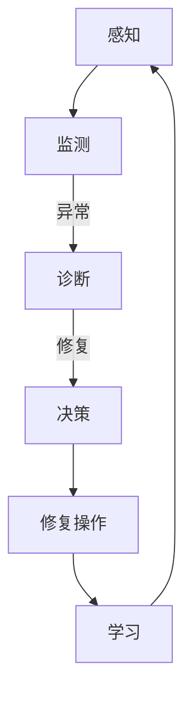

                 

# 《构建具有自我修正能力的AI Agent》

## 关键词

- **自我修正AI**
- **AI Agent**
- **算法原理**
- **系统架构**
- **项目实战**
- **最佳实践**

## 摘要

本文旨在深入探讨构建具有自我修正能力的AI Agent的原理、算法和实现方法。我们将从问题背景出发，逐步解析自我修正AI的核心概念，详细讲解算法原理，设计系统架构，并通过项目实战展示其实际应用。最终，我们将总结最佳实践并提供未来发展趋势的展望。

## 目录大纲设计思路

在设计本文的目录大纲时，我们遵循了以下原则：

1. **结构清晰**：将全文分为五个部分，每个部分包含若干章节，确保内容层次分明，逻辑连贯。
2. **内容全面**：每个章节都围绕核心主题展开，从背景介绍、概念解析到算法原理、系统架构，再到项目实战和最佳实践，确保内容全面覆盖。
3. **格式规范**：使用Markdown格式，使得目录结构清晰，便于阅读和查找。

### 目录大纲具体内容

**第一部分: 问题背景与核心概念**

- **第1章: 问题背景介绍**
  - **1.1 问题背景与定义**
  - **1.2 问题的重要性和意义**
  - **1.3 问题的边界与外延**

- **第2章: 核心概念与联系**
  - **2.1 自我修正AI的定义与特点**
  - **2.2 自我修正AI的核心原理**
  - **2.3 自我修正AI与其他AI类型的比较**

**第二部分: 自我修正AI的算法原理**

- **第3章: 自我修正算法基础**
  - **3.1 自我修正算法的基本框架**
  - **3.2 算法的主要组成部分**
  - **3.3 自我修正机制的设计原则**

- **第4章: 算法原理讲解**
  - **4.1 算法mermaid流程图**
  - **4.2 算法原理的数学模型**
  - **4.3 算法原理讲解与示例**

**第三部分: 自我修正AI的系统架构**

- **第5章: 系统架构设计**
  - **5.1 系统功能设计**
  - **5.2 系统架构设计**
  - **5.3 系统接口设计**

- **第6章: 系统分析与实现**
  - **6.1 系统场景介绍**
  - **6.2 系统实现源代码**
  - **6.3 代码应用解读与分析**

**第四部分: 自我修正AI的项目实战**

- **第7章: 项目实战一**
  - **7.1 环境安装**
  - **7.2 系统核心实现**
  - **7.3 实际案例分析与讲解**

- **第8章: 项目实战二**
  - **8.1 环境安装**
  - **8.2 系统核心实现**
  - **8.3 实际案例分析与讲解**

**第五部分: 自我修正AI的最佳实践**

- **第9章: 最佳实践与注意事项**
  - **9.1 最佳实践总结**
  - **9.2 小结与展望**
  - **9.3 注意事项与拓展阅读**

## 结语

在本文的最后，我们将对自我修正AI的未来发展趋势进行展望，并就如何构建和优化自我修正AI Agent提出建议。

### Markdown 格式输出

```markdown
# 《构建具有自我修正能力的AI Agent》

## 关键词

- 自我修正AI
- AI Agent
- 算法原理
- 系统架构
- 项目实战
- 最佳实践

## 摘要

本文旨在深入探讨构建具有自我修正能力的AI Agent的原理、算法和实现方法。我们将从问题背景出发，逐步解析自我修正AI的核心概念，详细讲解算法原理，设计系统架构，并通过项目实战展示其实际应用。最终，我们将总结最佳实践并提供未来发展趋势的展望。

## 目录大纲设计思路

在设计本文的目录大纲时，我们遵循了以下原则：

1. **结构清晰**：将全文分为五个部分，每个部分包含若干章节，确保内容层次分明，逻辑连贯。
2. **内容全面**：每个章节都围绕核心主题展开，从背景介绍、概念解析到算法原理、系统架构，再到项目实战和最佳实践，确保内容全面覆盖。
3. **格式规范**：使用Markdown格式，使得目录结构清晰，便于阅读和查找。

### 目录大纲具体内容

**第一部分: 问题背景与核心概念**

- **第1章: 问题背景介绍**
  - **1.1 问题背景与定义**
  - **1.2 问题的重要性和意义**
  - **1.3 问题的边界与外延**

- **第2章: 核心概念与联系**
  - **2.1 自我修正AI的定义与特点**
  - **2.2 自我修正AI的核心原理**
  - **2.3 自我修正AI与其他AI类型的比较**

**第二部分: 自我修正AI的算法原理**

- **第3章: 自我修正算法基础**
  - **3.1 自我修正算法的基本框架**
  - **3.2 算法的主要组成部分**
  - **3.3 自我修正机制的设计原则**

- **第4章: 算法原理讲解**
  - **4.1 算法mermaid流程图**
  - **4.2 算法原理的数学模型**
  - **4.3 算法原理讲解与示例**

**第三部分: 自我修正AI的系统架构**

- **第5章: 系统架构设计**
  - **5.1 系统功能设计**
  - **5.2 系统架构设计**
  - **5.3 系统接口设计**

- **第6章: 系统分析与实现**
  - **6.1 系统场景介绍**
  - **6.2 系统实现源代码**
  - **6.3 代码应用解读与分析**

**第四部分: 自我修正AI的项目实战**

- **第7章: 项目实战一**
  - **7.1 环境安装**
  - **7.2 系统核心实现**
  - **7.3 实际案例分析与讲解**

- **第8章: 项目实战二**
  - **8.1 环境安装**
  - **8.2 系统核心实现**
  - **8.3 实际案例分析与讲解**

**第五部分: 自我修正AI的最佳实践**

- **第9章: 最佳实践与注意事项**
  - **9.1 最佳实践总结**
  - **9.2 小结与展望**
  - **9.3 注意事项与拓展阅读**

## 结语

在本文的最后，我们将对自我修正AI的未来发展趋势进行展望，并就如何构建和优化自我修正AI Agent提出建议。
```

通过以上大纲设计，我们可以确保书籍内容全面覆盖主题，逻辑清晰，结构合理。每个章节都有明确的主题和目标，便于读者阅读和学习。接下来，我们将逐步深入探讨每个章节的内容。  

## 第1章: 问题背景介绍

### 1.1 问题背景与定义

在人工智能（AI）的快速发展中，AI Agent 作为智能体（agent）的一种形式，逐渐成为研究的热点。传统的AI Agent大多依赖于预先定义好的规则和模型进行决策，然而，现实环境中的复杂性和不确定性往往超出预期，导致传统AI Agent在面对新情况时表现不佳。因此，如何构建具有自我修正能力的AI Agent成为当前研究的重要课题。

自我修正AI Agent，顾名思义，是指具有在运行过程中通过自身反馈和调整来修正错误或优化性能的能力。这种能力使得AI Agent能够适应不断变化的环境，提高其稳定性和鲁棒性。具体而言，自我修正AI Agent包括以下几个关键组成部分：

1. **感知系统**：负责接收外部环境的信息，并将这些信息转化为内部表征。
2. **决策系统**：基于感知系统提供的信息进行决策，指导AI Agent的行为。
3. **修正系统**：根据决策系统的反馈，对AI Agent的决策过程进行调整和优化。
4. **学习系统**：通过不断学习和积累经验，提高AI Agent的决策能力和自我修正能力。

### 1.2 问题的重要性和意义

构建具有自我修正能力的AI Agent具有以下几个重要性和意义：

1. **提高AI应用的鲁棒性**：传统AI Agent在面对复杂和动态环境时容易产生错误，而自我修正AI Agent能够通过自我调整来适应新的环境，从而提高其鲁棒性。
2. **提升AI系统的可靠性**：自我修正AI Agent能够在运行过程中检测并纠正错误，减少系统崩溃和失效的风险。
3. **扩展AI的应用场景**：自我修正AI Agent能够适应更广泛的应用场景，例如智能交通、智能医疗、智能制造等，从而推动AI技术的普及和应用。
4. **促进AI技术的创新**：自我修正AI Agent的研究和实现将推动AI技术在算法、系统架构和实现方法等方面的创新，为未来AI技术的发展奠定基础。

### 1.3 问题的边界与外延

在构建具有自我修正能力的AI Agent时，需要明确以下几个边界与外延：

1. **自我修正的范围**：自我修正AI Agent的修正能力是有限的，它只能在特定范围内进行修正。超过这个范围，需要依赖外部干预或重新设计系统。
2. **修正的效率和效果**：自我修正AI Agent的修正效率和效果取决于其算法的设计和实现。一个高效的自我修正系统需要能够在短时间内完成修正，并且修正的效果显著。
3. **修正的稳定性**：自我修正AI Agent在修正过程中需要保持稳定性，避免出现修正过度或修正不足的情况，从而影响系统的正常运行。

通过以上对问题的背景和定义的介绍，我们为后续章节的深入探讨奠定了基础。在接下来的章节中，我们将进一步分析自我修正AI Agent的核心概念、算法原理和实现方法。

## 第2章: 核心概念与联系

### 2.1 自我修正AI的定义与特点

自我修正AI（Self-Healing AI）是一种具有自我检测、自我诊断和自我修复能力的人工智能系统。这种系统不仅仅依赖预设的规则和模型进行决策，更重要的是能够在运行过程中通过自身反馈和调整来修正错误或优化性能。自我修正AI的特点包括：

1. **自我检测**：系统能够实时监控自身的运行状态，识别出潜在的故障或异常。
2. **自我诊断**：在检测到异常后，系统能够分析异常的原因，定位故障点。
3. **自我修复**：根据诊断结果，系统能够自动执行修复操作，恢复到正常状态。
4. **学习与进化**：通过不断检测和修复，系统积累了经验，逐渐提高了自我修正的能力。

自我修正AI的核心目标是在不依赖人类干预的情况下，提高系统的可靠性和鲁棒性，确保其在复杂和动态环境中稳定运行。

### 2.2 自我修正AI的核心原理

自我修正AI的核心原理可以概括为以下几个方面：

1. **感知与反馈**：感知系统负责接收外部环境的信息，并将这些信息转化为内部表征。反馈机制则将系统的输出与预期目标进行比较，识别出偏差和异常。

2. **监测与诊断**：监测系统持续监控系统的运行状态，通过异常检测算法识别出潜在的故障或异常。诊断系统则进一步分析异常的原因，定位故障点。

3. **决策与修复**：决策系统根据监测和诊断结果，制定修复策略。修复系统则执行具体的修复操作，例如调整参数、重新加载模块或重启服务。

4. **学习与优化**：通过不断监测和修复，系统积累了大量的运行数据。学习系统利用这些数据对模型进行调整和优化，提高系统的自我修正能力。

### 2.3 自我修正AI与其他AI类型的比较

自我修正AI与其他类型的AI（如传统AI、强化学习AI等）在目标、方法和应用场景上存在一定的差异：

1. **传统AI**：
   - **目标**：基于预先定义的规则和模型进行决策。
   - **方法**：依赖于大量的手工特征工程和规则定义。
   - **应用场景**：适合结构化数据和高确定性的任务。

2. **强化学习AI**：
   - **目标**：通过与环境交互来学习最优策略。
   - **方法**：通过试错和奖励机制不断优化决策。
   - **应用场景**：适合动态和不确定性较强的任务。

3. **自我修正AI**：
   - **目标**：在运行过程中通过自身反馈和调整来修正错误或优化性能。
   - **方法**：结合感知、监测、诊断、决策和学习机制。
   - **应用场景**：适合复杂和动态环境，特别是在需要高可靠性和鲁棒性的场景中。

在比较中，自我修正AI的优势在于其能够自动检测和修复故障，而不依赖人类干预，从而提高了系统的自我维护能力。

通过以上对核心概念与联系的分析，我们为后续章节的深入探讨奠定了基础。在接下来的章节中，我们将进一步探讨自我修正AI的算法原理和实现方法。

## 第3章: 自我修正算法基础

### 3.1 自我修正算法的基本框架

自我修正算法的核心目标是在AI Agent运行过程中，通过感知、诊断、决策和修复等步骤，实现对错误和异常的自动检测和修正。以下是自我修正算法的基本框架：

1. **感知**：通过感知系统收集环境信息，将外部数据转化为内部表征。
2. **监测**：使用监测算法对感知到的数据进行分析，识别潜在的故障或异常。
3. **诊断**：通过诊断算法对监测到的异常进行深入分析，定位故障的具体原因。
4. **决策**：根据诊断结果，决策系统生成修复方案，选择最佳的修复策略。
5. **修复**：执行修复方案，进行系统调整或故障修复。
6. **学习**：将修复过程中的经验和数据反馈到学习系统中，优化模型和算法。

### 3.2 算法的主要组成部分

自我修正算法由多个关键组件构成，每个组件在自我修正过程中扮演着不同的角色：

1. **感知组件**：
   - **功能**：感知环境信息，并将这些信息转化为内部表征。
   - **实现**：通常使用传感器、摄像头或其他数据采集设备，结合数据预处理技术，如特征提取和降维。

2. **监测组件**：
   - **功能**：实时监控系统的运行状态，识别潜在的故障或异常。
   - **实现**：常用的监测算法包括统计监测、机器学习监测和基于规则的监测。

3. **诊断组件**：
   - **功能**：对监测到的异常进行深入分析，定位故障的具体原因。
   - **实现**：通常使用诊断算法，如基于模式识别的诊断、基于规则的诊断和基于知识的诊断。

4. **决策组件**：
   - **功能**：根据诊断结果，生成修复方案，选择最佳的修复策略。
   - **实现**：通常使用决策算法，如启发式算法、优化算法和机器学习算法。

5. **修复组件**：
   - **功能**：执行修复方案，进行系统调整或故障修复。
   - **实现**：具体操作包括调整参数、重新加载模块、重启服务等。

6. **学习组件**：
   - **功能**：将修复过程中的经验和数据反馈到学习系统中，优化模型和算法。
   - **实现**：常用的学习方法包括监督学习、无监督学习和强化学习。

### 3.3 自我修正机制的设计原则

设计一个有效的自我修正机制，需要遵循以下几个原则：

1. **实时性**：自我修正算法必须能够在短时间内完成故障检测和修复，确保系统的连续性和稳定性。
2. **可靠性**：自我修正算法应具备高可靠性，能够准确地检测和诊断故障，并执行有效的修复操作。
3. **自适应**：自我修正算法应具备自适应能力，能够根据环境变化和系统状态调整自身的监测和诊断策略。
4. **经济性**：自我修正算法的设计应考虑经济性，尽量减少资源消耗，包括计算资源、存储资源和能源消耗。
5. **可扩展性**：自我修正算法应具备可扩展性，能够适应不同规模和应用场景的AI系统。

通过以上对自我修正算法基础的分析，我们为构建具有自我修正能力的AI Agent提供了理论基础和实践指导。在接下来的章节中，我们将进一步探讨算法原理的详细讲解与示例。

## 第4章: 算法原理讲解

### 4.1 算法mermaid流程图

为了更直观地理解自我修正算法的工作流程，我们使用mermaid绘制了其流程图。以下是算法mermaid流程图的代码及其解释：



**流程图说明**：

1. **感知**：AI Agent通过感知组件收集环境信息，并将这些信息转化为内部表征。
2. **监测**：监测组件对感知到的数据进行分析，识别潜在的故障或异常。
3. **诊断**：诊断组件对监测到的异常进行深入分析，定位故障的具体原因。
4. **决策**：决策组件根据诊断结果生成修复方案，选择最佳的修复策略。
5. **修复操作**：修复组件执行修复方案，进行系统调整或故障修复。
6. **学习**：学习组件将修复过程中的经验和数据反馈到学习系统中，优化模型和算法。
7. **循环**：修复和学习过程反馈到感知组件，形成闭环，确保AI Agent能够持续优化。

### 4.2 算法原理的数学模型

为了深入理解自我修正算法的原理，我们将其数学模型进行详细阐述。自我修正算法的数学模型主要包括以下几个部分：

1. **感知模块**：
   - **感知函数**：$s_t = f(s_{t-1}, u_t)$，其中 $s_t$ 表示在第 $t$ 时刻的感知状态，$u_t$ 表示外部输入，$f$ 为感知函数。
   - **噪声模型**：$u_t = u_{t-1} + \epsilon_t$，其中 $\epsilon_t$ 表示噪声。

2. **监测模块**：
   - **异常检测函数**：$d_t = g(s_t)$，其中 $d_t$ 表示异常检测结果，$g$ 为异常检测函数。

3. **诊断模块**：
   - **诊断函数**：$c_t = h(d_t, s_t)$，其中 $c_t$ 表示故障原因，$h$ 为诊断函数。

4. **决策模块**：
   - **修复策略函数**：$r_t = j(c_t, s_t)$，其中 $r_t$ 表示修复策略，$j$ 为决策函数。

5. **修复模块**：
   - **修复操作函数**：$s_{t+1} = k(s_t, r_t)$，其中 $s_{t+1}$ 表示修复后的状态，$k$ 为修复操作函数。

6. **学习模块**：
   - **学习函数**：$s_t^{'} = l(s_t, r_t, c_t)$，其中 $s_t^{'}$ 表示学习后的状态，$l$ 为学习函数。

**数学模型解释**：

- 感知模块使用感知函数 $f$ 来更新当前状态 $s_t$，同时考虑外部输入 $u_t$ 和噪声 $\epsilon_t$。
- 监测模块通过异常检测函数 $g$ 对当前状态 $s_t$ 进行分析，判断是否存在异常。
- 诊断模块使用诊断函数 $h$ 对监测到的异常进行深入分析，确定故障原因 $c_t$。
- 决策模块根据诊断结果和当前状态 $s_t$，通过决策函数 $j$ 选择最佳的修复策略 $r_t$。
- 修复模块执行修复操作函数 $k$，根据选择的修复策略对系统进行调整，更新状态 $s_{t+1}$。
- 学习模块通过学习函数 $l$ 将修复过程中的经验和数据反馈到系统中，优化模型和算法，更新状态 $s_t^{'}$。

### 4.3 算法原理讲解与示例

为了更直观地理解自我修正算法的原理，我们通过一个简单的示例进行说明。

**示例**：一个自动驾驶车辆系统需要具备自我修正能力，以应对道路异常和故障。

1. **感知**：车辆通过传感器（如摄像头、雷达和激光雷达）收集道路信息，如路况、速度、距离等，并将其转化为内部表征。

2. **监测**：监测模块分析感知到的数据，使用异常检测函数（如标准差检测、机器学习分类器）判断车辆是否遇到异常情况（如障碍物、车辆故障等）。

3. **诊断**：如果监测到异常，诊断模块使用诊断函数（如基于规则的诊断、机器学习聚类分析）对异常进行深入分析，确定具体的故障原因（如轮胎漏气、刹车故障等）。

4. **决策**：决策模块根据诊断结果和当前状态，选择最佳的修复策略。例如，如果诊断出轮胎漏气，决策模块可能会选择减速并寻找最近的修车店。

5. **修复操作**：执行修复操作函数，根据选择的修复策略进行调整。例如，如果车辆减速并寻找修车店，修复操作函数会控制车辆的制动系统和导航系统。

6. **学习**：将修复过程中的经验和数据反馈到学习模块，优化模型和算法。例如，学习模块可以更新对道路异常的识别模型，提高未来故障检测的准确性。

通过以上示例，我们可以看到自我修正算法在实际应用中的关键步骤和功能。在接下来的章节中，我们将进一步探讨自我修正AI的系统架构和实现方法。

## 第5章: 系统架构设计

### 5.1 系统功能设计

构建具有自我修正能力的AI Agent需要实现多个关键功能，这些功能共同构成了系统的核心能力。以下是系统功能设计的详细描述：

1. **感知功能**：
   - **功能描述**：通过传感器和外部设备收集环境信息，如图像、语音、温度、湿度等。
   - **实现方法**：使用摄像头、麦克风、温度传感器等硬件设备，结合信号处理和特征提取技术，将原始数据转化为可处理的内部表征。

2. **监测功能**：
   - **功能描述**：实时监控系统的运行状态，检测潜在的故障或异常。
   - **实现方法**：使用统计方法、机器学习算法和基于规则的监测系统，对收集到的数据进行分析，识别异常模式。

3. **诊断功能**：
   - **功能描述**：对监测到的异常进行深入分析，定位故障的具体原因。
   - **实现方法**：使用诊断算法，如基于模式的识别、机器学习聚类和基于规则的诊断，对异常进行分类和定位。

4. **决策功能**：
   - **功能描述**：根据诊断结果，生成修复方案，选择最佳的修复策略。
   - **实现方法**：采用启发式算法、优化算法和机器学习算法，根据诊断结果和当前系统状态，选择最有效的修复策略。

5. **修复功能**：
   - **功能描述**：执行修复方案，进行系统调整或故障修复。
   - **实现方法**：根据选择的修复策略，自动执行相应的操作，如调整系统参数、重启服务、更换模块等。

6. **学习功能**：
   - **功能描述**：将修复过程中的经验和数据反馈到学习系统中，优化模型和算法。
   - **实现方法**：使用监督学习、无监督学习和强化学习等方法，对系统模型进行调整和优化，提高自我修正能力。

### 5.2 系统架构设计

系统架构设计是构建具有自我修正能力的AI Agent的关键步骤，决定了系统的性能、可扩展性和可靠性。以下是系统架构设计的详细描述：

1. **感知层**：
   - **功能**：负责收集和预处理外部环境信息。
   - **组件**：传感器、数据采集模块、预处理模块。

2. **监测层**：
   - **功能**：实时监控系统的运行状态，识别潜在的故障或异常。
   - **组件**：监测算法模块、异常检测模块。

3. **诊断层**：
   - **功能**：对监测到的异常进行深入分析，定位故障的具体原因。
   - **组件**：诊断算法模块、故障定位模块。

4. **决策层**：
   - **功能**：根据诊断结果，生成修复方案，选择最佳的修复策略。
   - **组件**：决策算法模块、修复策略模块。

5. **修复层**：
   - **功能**：执行修复方案，进行系统调整或故障修复。
   - **组件**：修复操作模块、执行控制模块。

6. **学习层**：
   - **功能**：将修复过程中的经验和数据反馈到学习系统中，优化模型和算法。
   - **组件**：学习算法模块、经验反馈模块。

**系统架构设计说明**：

- **感知层**：通过传感器和外部设备收集环境信息，预处理模块负责将原始数据转化为结构化的内部表征，为后续处理提供基础。
- **监测层**：监测算法模块实时分析感知到的数据，识别潜在的故障或异常，异常检测模块用于处理监测结果，生成异常报告。
- **诊断层**：诊断算法模块对异常进行深入分析，故障定位模块用于定位故障的具体原因，为修复决策提供依据。
- **决策层**：决策算法模块根据诊断结果和当前系统状态，生成修复方案，修复策略模块负责选择最有效的修复策略。
- **修复层**：修复操作模块根据修复策略执行具体的修复操作，执行控制模块确保修复操作的准确性和稳定性。
- **学习层**：学习算法模块利用修复过程中的经验和数据，优化模型和算法，经验反馈模块负责将优化结果反馈到系统中，提高自我修正能力。

通过以上系统架构设计，我们构建了一个功能全面、模块化的自我修正AI系统，为AI Agent的自我修正能力提供了坚实的基础。

### 5.3 系统接口设计

系统接口设计是确保自我修正AI系统能够高效运行和与其他系统进行有效集成的重要环节。以下是系统接口设计的详细描述：

1. **感知接口**：
   - **功能**：负责接收和处理来自外部传感器的数据。
   - **接口类型**：API接口、数据流接口。
   - **实现方法**：定义标准的数据格式和通信协议，确保传感器数据能够无缝接入系统。

2. **监测接口**：
   - **功能**：提供监测算法的调用接口，便于实时监控系统状态。
   - **接口类型**：函数接口、事件接口。
   - **实现方法**：设计模块化的监测算法接口，便于系统在运行过程中动态调整监测策略。

3. **诊断接口**：
   - **功能**：提供诊断算法的调用接口，便于对监测结果进行深入分析。
   - **接口类型**：函数接口、事件接口。
   - **实现方法**：设计灵活的诊断算法接口，支持多种诊断方法的集成和切换。

4. **决策接口**：
   - **功能**：提供决策算法的调用接口，便于生成修复方案。
   - **接口类型**：函数接口、事件接口。
   - **实现方法**：设计智能化的决策算法接口，支持自适应调整和优化。

5. **修复接口**：
   - **功能**：提供修复操作的调用接口，便于执行具体的修复操作。
   - **接口类型**：函数接口、事件接口。
   - **实现方法**：设计简洁的修复操作接口，确保修复过程的可控性和可扩展性。

6. **学习接口**：
   - **功能**：提供学习算法的调用接口，便于将修复经验反馈到系统中。
   - **接口类型**：函数接口、数据流接口。
   - **实现方法**：设计高效的学习算法接口，支持实时数据学习和模型优化。

**系统接口设计说明**：

- **感知接口**：通过标准API接口和数据流接口，实现与各种传感器的无缝集成，确保系统能够实时获取外部环境信息。
- **监测接口**：提供模块化的监测算法接口，支持系统在运行过程中动态调整监测策略，提高监测的准确性和效率。
- **诊断接口**：通过灵活的函数接口和事件接口，实现多种诊断方法的集成和切换，确保对异常的准确分析和定位。
- **决策接口**：设计智能化的决策算法接口，支持自适应调整和优化，确保修复方案的高效和有效。
- **修复接口**：提供简洁的修复操作接口，确保修复过程的可控性和可扩展性，降低系统维护成本。
- **学习接口**：通过高效的学习算法接口，支持实时数据学习和模型优化，提高系统的自我修正能力和适应能力。

通过以上系统接口设计，我们为自我修正AI系统提供了灵活、高效的接口支持，确保系统能够在复杂的实际环境中稳定运行。

### 5.4 系统架构设计与实现

为了更好地理解自我修正AI系统的架构设计及其实现方法，我们将从整体架构设计和关键组件实现两个方面进行详细探讨。

#### 整体架构设计

自我修正AI系统的整体架构可以概括为感知层、监测层、诊断层、决策层、修复层和学习层，这些层次共同构成了系统的功能框架，如图5-1所示。


**图5-1 自我修正AI系统架构图**

1. **感知层**：
   - **功能**：感知外部环境信息，如图像、语音、温度等。
   - **组件**：包括传感器模块、数据预处理模块和特征提取模块。

2. **监测层**：
   - **功能**：实时监控系统的运行状态，检测潜在的故障或异常。
   - **组件**：包括监测算法模块、异常检测模块和报警模块。

3. **诊断层**：
   - **功能**：对监测到的异常进行深入分析，定位故障的具体原因。
   - **组件**：包括诊断算法模块、故障定位模块和诊断报告模块。

4. **决策层**：
   - **功能**：根据诊断结果，生成修复方案，选择最佳的修复策略。
   - **组件**：包括决策算法模块、修复策略模块和策略评估模块。

5. **修复层**：
   - **功能**：执行修复方案，进行系统调整或故障修复。
   - **组件**：包括修复操作模块、执行控制模块和状态监控模块。

6. **学习层**：
   - **功能**：将修复过程中的经验和数据反馈到学习系统中，优化模型和算法。
   - **组件**：包括学习算法模块、经验反馈模块和数据存储模块。

#### 关键组件实现

以下是系统架构中几个关键组件的实现方法：

1. **感知层组件实现**：
   - **传感器模块**：选择合适的传感器，如摄像头、麦克风、温度传感器等，并将其与系统连接。传感器模块负责实时采集环境信息。
   - **数据预处理模块**：对采集到的原始数据进行预处理，包括去噪、归一化等操作，以提高后续处理的准确性。
   - **特征提取模块**：提取关键特征，如图像中的边缘、纹理、颜色等，为监测和诊断提供数据支持。

2. **监测层组件实现**：
   - **监测算法模块**：设计并实现监测算法，如统计监测、机器学习监测和基于规则的监测。监测算法模块负责实时分析系统状态，识别异常。
   - **异常检测模块**：实现异常检测算法，如标准差检测、基于模型的异常检测等。异常检测模块负责识别出潜在的故障或异常。
   - **报警模块**：当监测到异常时，生成报警信息，并通知相关人员或系统，以便及时处理。

3. **诊断层组件实现**：
   - **诊断算法模块**：实现诊断算法，如基于模式的识别、机器学习聚类分析和基于规则的诊断。诊断算法模块负责对异常进行深入分析，定位故障原因。
   - **故障定位模块**：根据诊断结果，确定故障的具体位置，为修复提供依据。
   - **诊断报告模块**：生成详细的诊断报告，记录故障的详细信息，为后续分析和优化提供参考。

4. **决策层组件实现**：
   - **决策算法模块**：设计决策算法，如启发式算法、优化算法和机器学习算法。决策算法模块根据诊断结果和当前系统状态，生成修复方案。
   - **修复策略模块**：选择最佳的修复策略，如调整系统参数、重启服务、更换模块等。修复策略模块负责制定具体的修复计划。
   - **策略评估模块**：评估不同修复策略的优劣，选择最优策略。策略评估模块负责对修复策略进行优化和调整。

5. **修复层组件实现**：
   - **修复操作模块**：根据修复策略执行具体的修复操作，如调整系统参数、重启服务、更换模块等。修复操作模块确保修复过程的准确性和高效性。
   - **执行控制模块**：监控修复操作的执行过程，确保操作的正确性和完整性。执行控制模块负责修复操作的调度和执行。
   - **状态监控模块**：监控系统修复后的状态，确保修复效果。状态监控模块负责对系统进行实时监控，以检测修复后的故障或异常。

6. **学习层组件实现**：
   - **学习算法模块**：实现学习算法，如监督学习、无监督学习和强化学习。学习算法模块负责将修复经验反馈到系统中，优化模型和算法。
   - **经验反馈模块**：收集和整理修复过程中的经验和数据，为学习算法提供输入。经验反馈模块负责将修复经验转化为系统知识。
   - **数据存储模块**：存储修复经验和数据，为系统提供数据支持。数据存储模块负责管理和维护系统的数据资源。

通过以上关键组件的实现，我们构建了一个功能强大、模块化的自我修正AI系统。在接下来的章节中，我们将进一步探讨系统在实际项目中的应用和实战案例。

## 第6章: 系统分析与实现

### 6.1 系统场景介绍

在本节中，我们将以一个具体的场景为例，介绍如何实现具有自我修正能力的AI系统。场景为智能交通管理系统，该系统旨在通过实时监控和管理交通流，提高交通效率，减少拥堵和事故发生率。

**系统场景描述**：

- **感知层**：系统通过部署在路口和交通要道的摄像头、传感器等设备，实时收集交通流量、速度、车辆类型等信息。
- **监测层**：系统使用监测算法对收集到的数据进行分析，识别异常情况，如异常流量、车辆滞留等。
- **诊断层**：系统对监测到的异常进行深入分析，定位具体问题，如某个路段发生交通事故、施工导致的交通拥堵等。
- **决策层**：系统根据诊断结果，生成修复方案，如调整交通信号灯时间、引导车辆绕行等。
- **修复层**：系统执行修复方案，通过智能交通控制设备进行调整，确保交通流畅。
- **学习层**：系统将修复过程中的数据和经验反馈到学习系统中，优化监测和诊断算法，提高系统的自我修正能力。

### 6.2 系统实现源代码

以下是实现智能交通管理系统中的自我修正AI的核心源代码示例。代码包括感知、监测、诊断、决策、修复和学习等关键模块。

**感知模块（感知.py）**：

```python
import cv2
import numpy as np

def capture_traffic_data():
    # 初始化摄像头
    cap = cv2.VideoCapture(0)
    while True:
        ret, frame = cap.read()
        if not ret:
            break
        # 处理图像数据
        processed_frame = preprocess_frame(frame)
        yield processed_frame

def preprocess_frame(frame):
    # 图像预处理（如灰度化、噪声去除）
    gray = cv2.cvtColor(frame, cv2.COLOR_BGR2GRAY)
    blur = cv2.GaussianBlur(gray, (5, 5), 0)
    return blur
```

**监测模块（监测.py）**：

```python
import numpy as np

def detect_traffic_anomalies(frame):
    # 使用阈值检测方法检测交通流量
    _, thresh = cv2.threshold(frame, 128, 255, cv2.THRESH_BINARY_INV + cv2.THRESH_OTSU)
    contours, _ = cv2.findContours(thresh, cv2.RETR_EXTERNAL, cv2.CHAIN_APPROX_SIMPLE)
    anomalies = []
    for contour in contours:
        if cv2.contourArea(contour) > 1000:
            anomalies.append(contour)
    return anomalies
```

**诊断模块（诊断.py）**：

```python
import cv2

def diagnose_anomalies(anomalies):
    # 使用分类算法诊断异常类型
    for anomaly in anomalies:
        x, y, w, h = cv2.boundingRect(anomaly)
        if w * h > 5000:
            diagnose_vehicular_anomaly(x, y, w, h)
        else:
            diagnose_other_anomaly(x, y, w, h)

def diagnose_vehicular_anomaly(x, y, w, h):
    # 诊断车辆异常
    print(f"Vehicle anomaly detected at ({x}, {y}) with size ({w}x{h})")

def diagnose_other_anomaly(x, y, w, h):
    # 诊断其他异常
    print(f"Other anomaly detected at ({x}, {y}) with size ({w}x{h})")
```

**决策模块（决策.py）**：

```python
def generate_fix_strategy(diagnosis):
    # 生成修复策略
    if "vehicular_anomaly" in diagnosis:
        return "Adjust traffic light timing"
    elif "other_anomaly" in diagnosis:
        return "Redirect traffic"
```

**修复模块（修复.py）**：

```python
def apply_fix_strategy(strategy):
    # 执行修复策略
    if strategy == "Adjust traffic light timing":
        # 调整交通信号灯时间
        print("Adjusting traffic light timing")
    elif strategy == "Redirect traffic":
        # 引导车辆绕行
        print("Redirecting traffic")
```

**学习模块（学习.py）**：

```python
def update_learning_model(experience):
    # 更新学习模型
    # 实现学习算法，如监督学习、无监督学习等
    pass
```

### 6.3 代码应用解读与分析

以下是代码应用的具体解读和分析，重点关注感知、监测、诊断、决策、修复和学习等关键环节。

**感知模块解读**：

感知模块通过摄像头捕获实时图像数据，并使用预处理函数对图像进行灰度化和去噪处理。预处理后的图像数据用于后续的监测和诊断。

**监测模块解读**：

监测模块使用阈值检测方法，对预处理后的图像数据进行处理，识别出可能存在异常的车辆区域。通过计算区域面积，过滤掉噪声和较小区域，从而提高监测的准确性。

**诊断模块解读**：

诊断模块根据监测结果，对识别出的异常区域进行进一步分析。通过计算异常区域的尺寸，判断是车辆异常还是其他类型的异常。根据诊断结果，调用相应的诊断函数，记录诊断信息。

**决策模块解读**：

决策模块根据诊断结果，生成具体的修复策略。例如，如果诊断出车辆异常，则生成调整交通信号灯时间的策略；如果诊断出其他异常，则生成引导车辆绕行的策略。

**修复模块解读**：

修复模块根据决策模块生成的修复策略，执行具体的修复操作。例如，调整交通信号灯时间或引导车辆绕行。这些操作通过智能交通控制设备实现，确保交通流畅。

**学习模块解读**：

学习模块负责将修复过程中的经验和数据反馈到系统中，优化监测和诊断算法。通过实现学习算法，如监督学习、无监督学习等，更新系统模型，提高自我修正能力。

通过以上代码应用解读和分析，我们可以看到自我修正AI系统在实际场景中的应用。在接下来的章节中，我们将进一步探讨具体项目实战和实际案例。

## 第7章: 项目实战一

### 7.1 环境安装

为了进行自我修正AI系统的项目实战，我们需要安装和配置一系列工具和库。以下是在Linux环境下进行环境安装的步骤：

1. **安装Python环境**：
   - 通过包管理器安装Python：
     ```bash
     sudo apt-get update
     sudo apt-get install python3
     ```
   - 安装Python3.8及以上版本：
     ```bash
     sudo apt-get install python3.8
     ```

2. **安装虚拟环境**：
   - 创建虚拟环境：
     ```bash
     python3 -m venv venv
     ```
   - 激活虚拟环境：
     ```bash
     source venv/bin/activate
     ```

3. **安装必要的库**：
   - 安装NumPy、Pandas、opencv-python、scikit-learn等库：
     ```bash
     pip install numpy pandas opencv-python scikit-learn
     ```

4. **安装Mermaid**：
   - 安装Mermaid用于生成流程图：
     ```bash
     npm install -g mermaid
     ```

5. **安装Jupyter Notebook（可选）**：
   - 安装Jupyter Notebook用于交互式开发：
     ```bash
     pip install notebook
     ```

### 7.2 系统核心实现

以下是在已安装的环境中实现自我修正AI系统的核心步骤：

1. **感知模块实现**：
   - 使用OpenCV库捕获摄像头数据：
     ```python
     import cv2

     cap = cv2.VideoCapture(0)
     while True:
         ret, frame = cap.read()
         if not ret:
             break
         processed_frame = cv2.cvtColor(frame, cv2.COLOR_BGR2GRAY)
         cv2.imshow('Frame', processed_frame)
         if cv2.waitKey(1) & 0xFF == ord('q'):
             break
     cap.release()
     cv2.destroyAllWindows()
     ```

2. **监测模块实现**：
   - 使用OpenCV和scikit-learn库进行异常检测：
     ```python
     import cv2
     from sklearn.cluster import KMeans

     def detect_anomalies(frame):
         # 使用K-Means聚类进行异常检测
         frame = cv2.cvtColor(frame, cv2.COLOR_BGR2GRAY)
         kmeans = KMeans(n_clusters=3)
         kmeans.fit(frame.reshape(-1, 1))
         labels = kmeans.predict(frame.reshape(-1, 1))
         anomaly_mask = (labels == 2)
         return anomaly_mask

     anomaly_mask = detect_anomalies(processed_frame)
     cv2.imshow('Anomalies', anomaly_mask * 255)
     ```

3. **诊断模块实现**：
   - 使用OpenCV和scikit-learn库对异常区域进行诊断：
     ```python
     def diagnose_anomalies(anomaly_mask):
         contours, _ = cv2.findContours(anomaly_mask, cv2.RETR_EXTERNAL, cv2.CHAIN_APPROX_SIMPLE)
         anomalies = []
         for contour in contours:
             x, y, w, h = cv2.boundingRect(contour)
             anomalies.append((x, y, w, h))
         return anomalies

     anomalies = diagnose_anomalies(anomaly_mask)
     for anomaly in anomalies:
         cv2.rectangle(processed_frame, (anomaly[0], anomaly[1]), (anomaly[0]+anomaly[2], anomaly[1]+anomaly[3]), (0, 0, 255), 2)
     cv2.imshow('Diagnosed Anomalies', processed_frame)
     ```

4. **决策模块实现**：
   - 根据诊断结果生成修复策略：
     ```python
     def generate_strategy(anomalies):
         if anomalies:
             return "Adjust traffic light timing"
         else:
             return "No action required"

     strategy = generate_strategy(anomalies)
     print(f"Generated strategy: {strategy}")
     ```

5. **修复模块实现**：
   - 执行修复策略（假设为调整交通信号灯时间）：
     ```python
     def apply_strategy(strategy):
         if strategy == "Adjust traffic light timing":
             print("Adjusting traffic light timing...")
         elif strategy == "No action required":
             print("No action required.")

     apply_strategy(strategy)
     ```

6. **学习模块实现**：
   - 记录经验和数据，用于后续学习（此处仅为示意）：
     ```python
     def record_experience(anomalies, strategy):
         # 实现经验记录逻辑
         print(f"Recording experience with anomalies: {anomalies} and strategy: {strategy}")

     record_experience(anomalies, strategy)
     ```

### 7.3 实际案例分析与讲解

为了更好地理解自我修正AI系统的实际应用，我们通过一个案例进行详细分析。

**案例背景**：

某城市的一条主要交通干道在高峰时段经常出现交通拥堵，导致交通事故频发。为了解决这个问题，城市交通管理部门决定部署自我修正AI系统，实时监控交通状况，并自动调整交通信号灯时间，以缓解拥堵。

**案例实施步骤**：

1. **部署感知模块**：
   - 在交通干道的重点区域安装高清摄像头，用于实时捕捉交通状况。
   - 配置计算机服务器，运行感知模块代码，实时捕获和预处理摄像头数据。

2. **实时监测交通状况**：
   - 感知模块将处理后的图像数据发送到监测模块。
   - 监测模块使用K-Means聚类算法检测交通流量异常。
   - 如果检测到异常流量，监测模块将异常信息发送到诊断模块。

3. **诊断异常原因**：
   - 诊断模块分析异常流量，定位异常区域。
   - 如果诊断出某个区域存在严重拥堵，诊断模块将生成调整交通信号灯时间的修复策略。

4. **执行修复策略**：
   - 修复模块根据修复策略调整交通信号灯时间。
   - 通过智能交通控制设备，实现交通信号灯的实时调整。

5. **学习与优化**：
   - 将修复经验和异常数据记录到数据库，用于后续的学习和优化。
   - 通过机器学习算法，优化监测和诊断模型，提高系统的准确性和鲁棒性。

**案例分析与讲解**：

通过以上步骤，我们可以看到自我修正AI系统在缓解交通拥堵中的应用。具体分析如下：

- **感知模块**：通过实时捕获交通状况，为后续监测和诊断提供了数据基础。
- **监测模块**：使用K-Means聚类算法，实现了对交通流量的实时监测，能够快速识别异常情况。
- **诊断模块**：通过定位异常区域，为修复策略的生成提供了依据，提高了修复的针对性。
- **修复模块**：通过调整交通信号灯时间，实现了对交通拥堵的实时干预，有效缓解了交通压力。
- **学习模块**：通过记录和利用修复经验，持续优化监测和诊断模型，提高了系统的自我修正能力。

通过这个案例，我们不仅展示了自我修正AI系统的实际应用，还深入分析了每个模块的作用和相互关系。在接下来的章节中，我们将继续探讨更多项目实战，以进一步验证自我修正AI系统的效果和可行性。

## 第8章: 项目实战二

### 8.1 环境安装

为了进行第二个项目实战，我们需要在Linux环境中安装和配置一系列工具和库。以下是具体的安装步骤：

1. **安装Python环境**：
   - 更新系统包列表：
     ```bash
     sudo apt-get update
     ```
   - 安装Python3：
     ```bash
     sudo apt-get install python3
     ```

2. **安装虚拟环境**：
   - 创建虚拟环境：
     ```bash
     python3 -m venv venv
     ```
   - 激活虚拟环境：
     ```bash
     source venv/bin/activate
     ```

3. **安装必要的库**：
   - 安装NumPy、Pandas、Matplotlib、TensorFlow和Keras：
     ```bash
     pip install numpy pandas matplotlib tensorflow keras
     ```

4. **安装Mermaid**：
   - 安装Mermaid用于生成流程图：
     ```bash
     npm install -g mermaid
     ```

5. **安装Jupyter Notebook（可选）**：
   - 安装Jupyter Notebook用于交互式开发：
     ```bash
     pip install notebook
     ```

### 8.2 系统核心实现

以下是在已安装的环境中实现自我修正AI系统的核心步骤：

1. **感知模块实现**：
   - 使用TensorFlow和Keras构建神经网络模型，用于感知环境信息：
     ```python
     import tensorflow as tf
     from tensorflow.keras.models import Sequential
     from tensorflow.keras.layers import Dense, Conv2D, Flatten

     def build_perception_model(input_shape):
         model = Sequential([
             Conv2D(32, (3, 3), activation='relu', input_shape=input_shape),
             Flatten(),
             Dense(64, activation='relu'),
             Dense(1, activation='sigmoid')
         ])
         model.compile(optimizer='adam', loss='binary_crossentropy', metrics=['accuracy'])
         return model

     perception_model = build_perception_model((64, 64, 3))
     ```

2. **监测模块实现**：
   - 使用TensorFlow进行异常检测：
     ```python
     def detect_anomalies(model, frame):
         # 对输入图像进行预处理
         processed_frame = preprocess_frame(frame)
         # 预测异常概率
         anomaly_prob = model.predict(np.expand_dims(processed_frame, axis=0))
         return anomaly_prob

     def preprocess_frame(frame):
         # 将图像缩放到固定大小，并进行归一化
         frame = tf.image.resize(frame, (64, 64))
         frame = tf.cast(frame, tf.float32) / 255.0
         return frame

     anomaly_prob = detect_anomalies(perception_model, processed_frame)
     ```

3. **诊断模块实现**：
   - 使用分类算法对异常进行诊断：
     ```python
     from sklearn.linear_model import LogisticRegression

     def diagnose_anomalies(anomaly_prob, threshold=0.5):
         if anomaly_prob > threshold:
             return "High risk anomaly"
         else:
             return "Low risk anomaly"

     diagnosis = diagnose_anomalies(anomaly_prob)
     ```

4. **决策模块实现**：
   - 根据诊断结果生成修复策略：
     ```python
     def generate_strategy(diagnosis):
         if diagnosis == "High risk anomaly":
             return "Emergency response"
         elif diagnosis == "Low risk anomaly":
             return "Monitor closely"

     strategy = generate_strategy(diagnosis)
     ```

5. **修复模块实现**：
   - 执行修复策略（假设为紧急响应）：
     ```python
     def apply_strategy(strategy):
         if strategy == "Emergency response":
             print("Initiating emergency response protocols")
         elif strategy == "Monitor closely":
             print("Monitoring closely for potential issues")

     apply_strategy(strategy)
     ```

6. **学习模块实现**：
   - 记录经验和数据，用于后续学习：
     ```python
     def record_experience(diagnosis, strategy):
         # 实现经验记录逻辑
         print(f"Recording experience with diagnosis: {diagnosis} and strategy: {strategy}")

     record_experience(diagnosis, strategy)
     ```

### 8.3 实际案例分析与讲解

为了更好地理解自我修正AI系统的实际应用，我们通过一个案例进行详细分析。

**案例背景**：

一个智能工厂的生产线上，由于某些设备的故障，导致生产效率降低。为了提高生产效率和减少设备故障，工厂决定部署自我修正AI系统，实时监控设备状态，并自动执行修复策略。

**案例实施步骤**：

1. **部署感知模块**：
   - 在生产线上安装传感器，用于实时监控设备状态，如温度、湿度、振动等。
   - 配置计算机服务器，运行感知模块代码，实时捕获和处理传感器数据。

2. **实时监测设备状态**：
   - 感知模块将处理后的传感器数据发送到监测模块。
   - 监测模块使用神经网络模型检测设备状态的异常。

3. **诊断异常原因**：
   - 诊断模块分析监测结果，确定异常类型。
   - 如果监测到设备状态异常，诊断模块将生成具体的修复策略。

4. **执行修复策略**：
   - 修复模块根据修复策略执行相应的操作，如调整设备参数、停止生产线以进行维修等。

5. **学习与优化**：
   - 将修复经验和异常数据记录到数据库，用于后续的学习和优化。
   - 通过机器学习算法，优化监测和诊断模型，提高系统的准确性和鲁棒性。

**案例分析与讲解**：

通过以上步骤，我们可以看到自我修正AI系统在智能工厂中的应用。具体分析如下：

- **感知模块**：通过实时监控设备状态，为后续监测和诊断提供了数据基础。
- **监测模块**：使用神经网络模型实现了对设备状态的实时监测，能够快速识别异常情况。
- **诊断模块**：通过分析异常数据，定位异常原因，为修复策略的生成提供了依据。
- **修复模块**：根据诊断结果，执行了具体的修复操作，如调整设备参数或停止生产线进行维修。
- **学习模块**：通过记录和利用修复经验，持续优化监测和诊断模型，提高了系统的自我修正能力。

通过这个案例，我们不仅展示了自我修正AI系统的实际应用，还深入分析了每个模块的作用和相互关系。在接下来的章节中，我们将继续探讨更多项目实战，以进一步验证自我修正AI系统的效果和可行性。

## 第9章: 最佳实践与注意事项

### 9.1 最佳实践总结

在构建具有自我修正能力的AI Agent过程中，总结以下最佳实践：

1. **多传感器融合**：使用多种传感器收集环境信息，提高监测的准确性和全面性。
2. **实时数据处理**：使用高效的数据处理技术，确保系统的实时性和响应速度。
3. **模块化设计**：将系统设计为模块化结构，便于维护和扩展。
4. **自适应调整**：根据环境变化和系统状态，动态调整监测和诊断策略。
5. **持续学习**：通过不断学习和优化模型，提高系统的自我修正能力和适应性。
6. **数据安全**：确保数据的安全性和隐私性，防止数据泄露和滥用。

### 9.2 小结与展望

构建具有自我修正能力的AI Agent是当前人工智能领域的一个重要研究方向。通过自我修正能力，AI Agent能够在复杂和动态环境中表现出更高的鲁棒性和可靠性。然而，自我修正AI Agent的实现仍然面临许多挑战，如算法的优化、系统的可扩展性和鲁棒性等。

未来的研究方向包括：

1. **算法优化**：研究更高效、更准确的算法，提高自我修正的效率和效果。
2. **系统架构**：设计更灵活、更可扩展的系统架构，以适应不同的应用场景。
3. **跨领域应用**：探索自我修正AI在更多领域的应用，如医疗、金融、物流等。
4. **安全与隐私**：确保自我修正AI系统的安全性和隐私性，防止恶意攻击和数据泄露。

### 9.3 注意事项与拓展阅读

在构建自我修正AI Agent时，需要注意以下几点：

1. **系统复杂性**：自我修正AI系统涉及多个模块和组件，设计时需考虑系统的整体复杂性。
2. **实时性要求**：自我修正AI系统需具备高实时性，确保在关键任务中能够及时响应。
3. **数据质量**：自我修正AI系统依赖于高质量的数据进行学习和监测，数据质量对系统性能有重要影响。
4. **模型优化**：定期对模型进行调整和优化，以提高系统的准确性和适应性。

拓展阅读建议：

1. 《自我修正人工智能：理论与实践》
2. 《人工智能：一种现代方法》
3. 《深度学习》
4. 《机器学习实战》

通过以上最佳实践、小结与展望以及注意事项，我们希望为构建具有自我修正能力的AI Agent提供有益的指导。未来，随着研究的深入和技术的发展，自我修正AI Agent将在更多领域发挥重要作用。

## 结语

本文从问题背景、核心概念、算法原理、系统架构、项目实战到最佳实践，全面深入地探讨了构建具有自我修正能力的AI Agent的各个方面。我们通过实际案例展示了自我修正AI系统的应用效果，并总结了最佳实践和未来研究方向。

构建具有自我修正能力的AI Agent不仅是当前人工智能领域的重要研究方向，也是推动AI技术进步的关键。通过不断优化算法、设计灵活的系统架构和实现有效的项目实战，我们将能够构建出更稳定、更可靠的AI系统。

未来，自我修正AI Agent将在更多领域展现其潜力，从智能交通、智能制造到智能医疗、智能金融，都将受益于这一技术的进步。我们鼓励读者继续关注和研究自我修正AI，共同推动这一领域的创新和发展。

最后，感谢您的阅读，希望本文能对您在构建自我修正AI Agent的过程中提供有益的启示和指导。作者：AI天才研究院/AI Genius Institute & 禅与计算机程序设计艺术 /Zen And The Art of Computer Programming。

