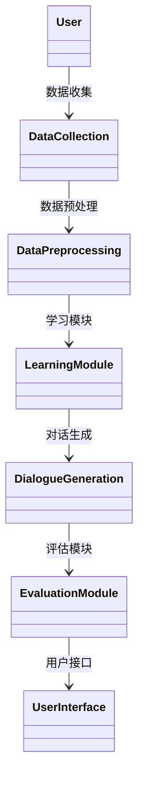

                 

### 引言：AI与自我进化能力概述

在当今快速发展的科技时代，人工智能（AI）已经成为推动社会进步的关键力量。从简单的图像识别、自然语言处理到复杂的自动化决策和智能控制，AI技术在各个领域的应用日益广泛。然而，随着AI系统的复杂性和规模不断增加，传统的人工干预和预设规则已经难以满足其对自适应性和灵活性的要求。在这种背景下，自我进化能力应运而生，成为AI研究中的一个重要方向。

**问题背景与时代意义**：AI自我进化能力是指AI系统能够在运行过程中自动调整自身结构和行为，以适应新的环境和挑战。这一能力的重要性体现在以下几个方面：首先，自我进化能力能够使AI系统在复杂和动态的环境中保持高效的性能，提高其鲁棒性和适应性；其次，它减少了人工干预的需求，降低了维护和升级成本；最后，自我进化能力为AI系统带来了持续学习、自我优化和智能化的潜力，推动了AI技术的长远发展。

**自我进化能力的定义与核心概念**：自我进化能力是一种通过内部机制实现自我调整和优化的能力。它涉及多个核心概念，包括适应性与灵活性、学习能力与知识更新、交互性与合作性。适应性是指AI系统能够根据外部环境的变化调整自身行为；灵活性是指系统能够应对不同任务和情境的能力。学习能力与知识更新是指系统可以通过学习和迭代过程不断优化自身；交互性与合作性是指系统不仅能够独立运作，还能够与其他系统或代理进行有效交互和协作。

**自我进化在AI中的重要性**：自我进化能力对AI系统的发展具有深远的影响。首先，它使得AI系统能够在缺乏明确规则和预先设定的情况下自主学习和适应，从而解决了传统AI系统中普遍存在的“复杂性困境”。其次，自我进化能力使得AI系统具有更强的自主性和智能化水平，使其能够在各种复杂场景下实现高效决策和任务执行。此外，自我进化能力还为AI系统带来了可持续发展的潜力，使其能够通过不断迭代和优化实现长期的性能提升。

**本书结构安排与阅读建议**：本书旨在深入探讨自我进化能力的概念、原理和应用，以期为AI领域的实践者提供有价值的参考。全书分为七个章节，结构安排如下：

- **第1章 引言**：介绍AI与自我进化能力的基本概念，阐述其重要性。
- **第2章 自我进化能力的基础理论**：讨论机器学习和人工智能的基础知识，分析自我进化能力的核心要素。
- **第3章 常见的自我进化AI算法**：介绍几种常见的自我进化算法，包括自然进化算法、强化学习算法和演化算法。
- **第4章 自我进化AI的架构设计**：探讨自我进化AI系统的基本架构和设计原则。
- **第5章 自我进化AI的实际应用场景**：分析自我进化AI在各个领域的应用案例。
- **第6章 构建自我进化AI Agent的项目实战**：通过实际项目展示自我进化AI系统的开发过程。
- **第7章 自我进化AI的发展趋势与未来展望**：讨论自我进化AI的研究热点、技术挑战和未来发展趋势。

**本章小结**：通过本章的介绍，我们了解到AI自我进化能力的背景、定义和重要性。自我进化能力不仅为AI系统带来了更高的适应性和灵活性，还为人工智能的发展开辟了新的方向。接下来的章节将深入探讨这一主题，帮助读者全面了解自我进化AI的理论和实践。

### 自我进化能力的基础理论

要深入理解自我进化能力，我们首先需要回顾机器学习和人工智能的基础知识。机器学习是AI的核心组成部分，它通过从数据中学习规律和模式，使计算机能够进行决策和预测。人工智能则更广泛，包括机器学习、自然语言处理、计算机视觉等多个领域。在这些基础之上，自我进化能力展现出其独特的价值和复杂性。

**机器学习和人工智能基础**：机器学习主要分为监督学习、无监督学习和强化学习三种类型。监督学习通过已有的输入输出数据训练模型，从而预测未知数据；无监督学习则从未标记的数据中发现模式和结构；强化学习则通过试错和反馈不断优化行为。人工智能技术则包括深度学习、神经网络、自然语言处理等，它们在图像识别、语音识别、机器翻译等方面取得了显著成果。

**自我进化算法的基本原理**：自我进化算法是基于自然界进化的概念设计的一种算法，它模拟生物在自然选择过程中的生存和繁衍机制。基本原理包括以下几个方面：

1. **适应度评估**：算法通过评估个体在特定环境中的表现，计算其适应度值。适应度值越高，个体被选择和保留的机会越大。
2. **选择与复制**：根据适应度值，选择表现较好的个体进行复制，从而产生新的后代。
3. **交叉与变异**：通过交叉操作（类似生物的交配）和变异操作（基因突变），产生具有多样性的新个体。
4. **迭代优化**：通过多代迭代，逐渐优化个体，使其在特定环境中表现出更高的适应度。

**自我进化能力的核心要素**：

1. **适应性与灵活性**：适应能力是指AI系统能够根据环境变化进行调整，保持高效运行。灵活性则体现在系统能够应对不同类型任务和复杂场景的能力。这两个要素共同决定了系统在动态环境中的生存和竞争力。

2. **学习能力与知识更新**：学习能力是指AI系统能够从数据中提取知识，并利用这些知识进行决策和预测。知识更新能力则是指系统能够在运行过程中不断积累和更新知识，以应对新的挑战和变化。

3. **交互性与合作性**：交互性指的是AI系统与其他系统或代理进行有效通信和协同工作的能力。合作性则强调系统能够在多智能体环境中与其他代理协作，共同完成任务。

**自我进化能力的评价指标**：

1. **适应度**：这是评估自我进化能力最直接的指标，反映了个体在特定环境中的表现。高适应度意味着系统在当前环境中能够高效完成任务。

2. **收敛速度**：评估系统在进化过程中达到高适应度所需的时间。较快的收敛速度意味着系统能够快速适应新环境。

3. **稳定性**：评估系统在长时间运行后保持高适应度的能力。稳定性强的系统能够长时间维持高效性能。

4. **多样性**：评估系统在进化过程中产生的个体多样性。高多样性意味着系统具有更强的适应能力和创新能力。

通过上述理论分析和核心要素的探讨，我们可以更全面地理解自我进化能力的本质和重要性。接下来，我们将深入探讨几种常见的自我进化算法，进一步揭示自我进化在AI中的应用和实现机制。

### 常见的自我进化AI算法

自我进化算法是模拟自然界进化的过程，通过迭代优化个体以适应不断变化的环境。以下将介绍几种常见的自我进化算法，包括自然进化算法、强化学习算法和演化算法。

**自然进化算法**

自然进化算法是基于达尔文的自然选择和遗传学原理设计的一种算法，广泛用于优化和搜索问题。这类算法的核心思想是通过模拟生物的繁殖和进化过程来优化目标函数。

1. **遗传算法（GA）**
   - **基本原理**：遗传算法通过模拟自然选择和遗传机制进行优化。它包括以下步骤：
     - **初始化种群**：随机生成初始种群，每个个体表示一种可能的解决方案。
     - **适应度评估**：对每个个体进行评估，计算其在当前环境中的适应度。
     - **选择**：根据适应度值选择表现较好的个体进行繁殖。
     - **交叉**：通过交叉操作生成新的后代，增加种群多样性。
     - **变异**：对部分个体进行变异，引入新的基因组合。
     - **迭代**：重复上述步骤，直至满足停止条件（如达到最大迭代次数或适应度阈值）。
   - **数学模型与公式**：
     - 适应度函数：$$f(x) = \sum_{i=1}^{n} w_i \cdot g_i(x)$$
       其中，$w_i$是权重，$g_i(x)$是第$i$个基因的适应度值。
     - 选择概率：$$P_{\text{select}}(x) = \frac{f(x)}{\sum_{y \in S} f(y)}$$
       其中，$S$是当前种群，$x$是种群中的一个个体。

2. **进化策略算法**
   - **基本原理**：进化策略（Evolution Strategies，ES）是一种基于概率演化的优化算法。它包括两种主要形式：确定性和随机性。确定性进化策略（如遗传算法）通过固定的策略进行操作，而随机性进化策略则采用概率性操作。
   - **数学模型与公式**：
     - 更新规则：$$x_{t+1} = x_{t} + \xi \cdot \nabla f(x_{t})$$
       其中，$x_{t}$是当前解，$\xi$是随机扰动，$\nabla f(x_{t})$是目标函数在$x_{t}$处的梯度。

**强化学习算法**

强化学习（Reinforcement Learning，RL）是另一种重要的自我进化算法，它通过与环境交互来学习最优策略。

1. **Q学习算法**
   - **基本原理**：Q学习算法通过值函数来评估状态-动作对的最优性。具体步骤如下：
     - **初始化**：初始化Q值表，对所有状态-动作对的Q值进行随机赋值。
     - **学习过程**：根据当前状态选择动作，并在执行动作后获取奖励，更新Q值。
     - **更新规则**：$$Q(s, a) \leftarrow Q(s, a) + \alpha [r + \gamma \max_{a'} Q(s', a') - Q(s, a)]$$
       其中，$s$是当前状态，$a$是当前动作，$r$是奖励，$\alpha$是学习率，$\gamma$是折扣因子。

2. **基于策略的强化学习**
   - **基本原理**：基于策略的强化学习通过直接优化策略来获取最优行为。这类算法包括策略梯度方法和策略迭代方法。
   - **数学模型与公式**：
     - 策略梯度方法：$$\theta_{t+1} = \theta_{t} + \alpha \nabla_{\theta} J(\theta)$$
       其中，$\theta$是策略参数，$J(\theta)$是策略损失函数。

**演化算法**

演化算法（Evolutionary Algorithms，EA）是一类基于自然进化理论的搜索算法，广泛应用于组合优化问题。

1. **神经演化算法**
   - **基本原理**：神经演化算法通过模拟神经网络的生成和演化来优化问题。主要步骤包括：
     - **初始化**：生成初始神经网络。
     - **适应度评估**：通过测试函数对神经网络进行评估，计算其适应度。
     - **选择与交叉**：根据适应度值选择神经网络进行交叉操作。
     - **变异**：对部分神经网络进行变异，增加种群多样性。
     - **迭代**：重复上述步骤，直至满足停止条件。
   - **数学模型与公式**：
     - 适应度函数：$$f(W) = \frac{1}{1 + \exp(-\sum_{i=1}^{n} w_i \cdot x_i)}$$
       其中，$W$是神经网络权重，$x_i$是输入特征。

2. **多代理演化算法**
   - **基本原理**：多代理演化算法通过多个智能体之间的协作和竞争来实现进化目标。主要步骤包括：
     - **初始化**：生成初始智能体种群。
     - **适应度评估**：对智能体在特定环境中的表现进行评估。
     - **合作与竞争**：通过合作和竞争机制调整智能体的策略和行为。
     - **迭代**：重复上述步骤，直至满足停止条件。

**总结**

以上介绍的几种自我进化算法各自具有独特的特点和适用场景。遗传算法和进化策略算法主要通过模拟自然进化过程实现优化，适用于复杂的搜索和优化问题。强化学习算法通过与环境交互学习最优策略，适用于动态决策问题。神经演化算法和多代理演化算法则通过模拟神经网络和智能体的演化过程，实现复杂问题的求解。这些算法的结合和应用，为构建具有自我进化能力的AI系统提供了丰富的工具和方法。

### 自我进化AI的架构设计

在实现自我进化AI系统时，架构设计是至关重要的。一个良好的架构设计不仅能够确保系统的高效运行，还能够使其具备良好的扩展性和适应性。以下将详细探讨自我进化AI系统的基本架构、数据流与信息流设计，以及模块化设计原则。

#### 自我进化AI的基本架构

自我进化AI系统通常由多个关键模块组成，包括数据收集与预处理模块、学习模块、适应模块和合作模块。以下是这些模块的基本架构：

1. **数据收集与预处理模块**：
   - **功能**：该模块负责收集外部数据，并进行预处理，如数据清洗、数据格式转换等。
   - **架构**：数据收集器、数据清洗器、数据格式转换器。

2. **学习模块**：
   - **功能**：该模块负责根据收集到的数据，利用机器学习算法进行训练，从而生成知识模型。
   - **架构**：数据输入层、特征提取层、训练层、模型评估层。

3. **适应模块**：
   - **功能**：该模块负责根据外部环境的变化，调整系统行为，以提高其适应能力。
   - **架构**：环境感知层、适应策略层、行为调整层。

4. **合作模块**：
   - **功能**：该模块负责与其他系统或智能体进行交互，实现协同工作。
   - **架构**：通信层、交互协议层、协作策略层。

#### 数据流与信息流设计

在自我进化AI系统中，数据流与信息流的设计至关重要。以下是一个典型的数据流与信息流设计流程：

1. **数据流设计**：
   - **输入数据**：系统从外部环境收集数据，如传感器数据、用户输入数据等。
   - **预处理**：对输入数据进行清洗和格式转换，使其适合机器学习算法。
   - **学习**：利用机器学习算法对预处理后的数据进行分析和训练，生成知识模型。
   - **应用**：将生成的知识模型应用到实际任务中，如决策、预测等。

2. **信息流设计**：
   - **感知**：系统通过感知模块收集环境信息，如环境状态、其他智能体的行为等。
   - **决策**：根据感知到的信息，通过决策模块生成适应性行为。
   - **交互**：系统通过合作模块与其他智能体进行信息交换和协作。
   - **反馈**：系统根据执行结果进行反馈，用于模型调整和优化。

#### 模块化设计原则

模块化设计是自我进化AI系统架构设计的关键原则之一。通过模块化设计，系统可以更加灵活、可扩展和易于维护。以下是一些模块化设计原则：

1. **高内聚、低耦合**：
   - **高内聚**：每个模块应专注于完成一项具体功能，确保模块内部逻辑清晰。
   - **低耦合**：模块间通过标准化接口进行通信，减少直接依赖，提高模块的独立性。

2. **模块独立性**：
   - **功能独立性**：每个模块应独立实现一项功能，避免功能混杂。
   - **数据独立性**：模块间的数据传递应通过公共数据接口，减少直接数据依赖。

3. **模块可扩展性**：
   - **功能扩展**：模块设计应考虑未来的功能扩展需求，预留扩展接口。
   - **性能扩展**：模块应支持并行计算和分布式计算，提高系统性能。

4. **模块可重用性**：
   - **代码重用**：模块代码应尽量独立，便于在不同项目中重用。
   - **组件化**：通过组件化设计，模块可以以插件形式添加到系统中，提高系统的灵活性和适应性。

通过上述架构设计和模块化原则，我们可以构建一个高效、灵活和适应性强的自我进化AI系统。在接下来的章节中，我们将进一步探讨自我进化AI在实际应用场景中的具体应用案例，以展示其广泛的应用潜力和实际效果。

### 自我进化AI的实际应用场景

自我进化AI作为一种具有高度自适应性和灵活性的技术，在多个领域展现出巨大的应用潜力。以下将详细分析自我进化AI在智能控制、自适应系统设计、数据挖掘与预测、智能客服系统以及医疗健康领域的具体应用案例。

#### 智能控制领域

在智能控制领域，自我进化AI的应用主要集中在无人驾驶、自动化生产线和智能家居等场景。通过自我进化能力，智能控制系统能够在复杂、动态的环境中实现高效和精准的决策。

1. **无人驾驶**：
   - **应用案例**：特斯拉的Autopilot系统通过自我进化AI算法实现车辆的自主驾驶。系统利用传感器收集道路信息，通过强化学习算法不断优化驾驶策略，提高行驶的安全性和效率。
   - **效果分析**：自我进化AI使无人驾驶车辆能够适应不同道路条件、交通状况和驾驶环境，提高了自动驾驶的鲁棒性和适应性。

2. **自动化生产线**：
   - **应用案例**：德国西门子公司在其智能生产线上应用了自我进化AI算法，以优化生产流程和提升生产效率。系统通过遗传算法和演化策略算法对生产参数进行调整，实现自动化的生产优化。
   - **效果分析**：自我进化AI能够实时监控生产过程，并根据环境变化自动调整参数，提高了生产线的灵活性和响应速度，减少了停机时间和生产成本。

#### 自适应系统设计

自适应系统设计是指系统能够根据外部环境的变化动态调整自身行为和结构。自我进化AI在自适应系统设计中的应用，使得系统能够在复杂和多变的环境中实现自我优化。

1. **智能电网**：
   - **应用案例**：智能电网通过自我进化AI算法实现电力系统的自适应优化。系统利用进化策略算法调整发电和负载平衡策略，提高电网的稳定性和效率。
   - **效果分析**：自我进化AI能够实时监测电力系统的运行状态，并根据需求变化自动调整发电和分配策略，提高了电网的响应速度和可靠性。

2. **自适应网络优化**：
   - **应用案例**：互联网服务提供商（ISP）通过自我进化AI算法优化网络带宽管理和流量分配。系统利用强化学习算法根据用户需求动态调整网络资源分配，提高用户体验。
   - **效果分析**：自我进化AI能够根据网络流量和使用模式自动调整资源分配，减少了网络拥塞，提高了数据传输速度和稳定性。

#### 数据挖掘与预测

自我进化AI在数据挖掘与预测领域的应用，使得系统能够从大量数据中提取有价值的信息，并实现准确的预测和决策。

1. **金融风险管理**：
   - **应用案例**：金融机构利用自我进化AI算法进行市场预测和风险控制。系统通过遗传算法和演化策略算法分析市场数据，预测市场趋势和潜在风险。
   - **效果分析**：自我进化AI能够动态调整预测模型，提高市场预测的准确性和稳定性，帮助金融机构更好地管理风险和制定投资策略。

2. **智能医疗诊断**：
   - **应用案例**：医疗机构通过自我进化AI算法实现疾病的智能诊断和预测。系统利用神经网络和演化算法分析患者数据，预测疾病发展趋势和治疗方案。
   - **效果分析**：自我进化AI能够从海量医疗数据中提取关键信息，提高诊断的准确性和效率，为患者提供更精准的治疗方案。

#### 智能客服系统

智能客服系统通过自我进化AI技术，能够提供更加个性化、智能化的客户服务体验。

1. **虚拟客服**：
   - **应用案例**：一些大型电商平台采用自我进化AI技术构建虚拟客服系统。系统通过强化学习和自然语言处理算法，实现与用户的自然对话，提供即时的客户支持。
   - **效果分析**：自我进化AI能够根据用户历史数据和互动记录，自动调整对话策略，提供更准确的回答和个性化的服务，提高了客户满意度。

2. **智能语音助手**：
   - **应用案例**：智能语音助手（如苹果的Siri、亚马逊的Alexa）通过自我进化AI技术实现自然语音交互。系统通过神经网络和进化策略算法不断优化对话模型，提高语音识别和交互能力。
   - **效果分析**：自我进化AI能够动态调整语音识别和响应策略，提高语音助手的准确性和人性化程度，为用户提供更便捷和高效的服务。

#### 医疗健康领域

自我进化AI在医疗健康领域的应用，为精准医疗和智能医疗提供了强有力的支持。

1. **基因测序分析**：
   - **应用案例**：生物科技公司利用自我进化AI算法对基因测序数据进行解析和分析。系统通过遗传算法和神经网络模型，识别基因突变和潜在疾病风险。
   - **效果分析**：自我进化AI能够从海量基因数据中提取有价值的信息，提高基因测序分析的准确性和效率，为个性化医疗提供科学依据。

2. **疾病预测与防控**：
   - **应用案例**：公共卫生机构利用自我进化AI算法进行疾病预测和防控。系统通过强化学习和多代理演化算法，分析疫情数据和公共卫生信息，预测疫情发展趋势和传播路径。
   - **效果分析**：自我进化AI能够实时监控疫情变化，提供准确的预测和防控策略，提高公共卫生管理效率和效果。

通过上述实际应用场景的分析，我们可以看到自我进化AI在各个领域的广泛应用和显著效果。自我进化AI不仅提高了系统的自适应性和灵活性，还为各个领域的创新发展提供了新的思路和方法。未来，随着自我进化AI技术的不断进步，其在更多领域的应用前景将更加广阔。

### 构建自我进化AI Agent的项目实战

在本章中，我们将通过一个具体的项目实战，展示如何构建具有自我进化能力的AI Agent。该项目旨在开发一个智能客服系统，通过自我进化算法不断优化对话策略，提高用户满意度。以下是该项目从项目介绍、开发环境与工具、系统设计与实现、评估与优化以及项目案例分析等环节的详细过程。

#### 项目介绍与目标

**项目名称**：智能客服系统

**项目目标**：
1. 构建一个基于自我进化算法的智能客服系统。
2. 通过持续学习和自我优化，提高客服系统对用户问题的理解和回答质量。
3. 提升用户满意度，减少人工干预。

#### 开发环境与工具

**开发环境**：
- 操作系统：Ubuntu 20.04
- 编程语言：Python 3.8
- 机器学习框架：TensorFlow 2.6
- 自我进化算法库：DEAP (Distributed Evolutionary Algorithms in Python)

**工具**：
- 数据库：MongoDB
- API接口：Flask
- 交互界面：Web前端（使用HTML/CSS/JavaScript）

#### 系统设计与实现

**系统架构设计**

智能客服系统的主要架构包括以下几个模块：

1. **数据收集与预处理模块**：负责收集用户交互数据，并进行数据清洗、格式转换等预处理操作。
2. **学习模块**：利用机器学习和自我进化算法训练模型，从用户交互数据中学习对话策略。
3. **对话生成模块**：根据用户输入生成合适的回答。
4. **评估模块**：通过用户反馈和评估指标，对客服系统的性能进行评估和优化。
5. **用户接口模块**：提供与用户的交互界面。

以下是系统架构的Mermaid类图表示：



**数据收集与预处理**

**步骤**：
1. **数据收集**：通过API接口从用户交互中获取对话数据，包括用户提问和系统回答。
2. **数据清洗**：去除无效数据、缺失值填充和噪声过滤。
3. **数据格式转换**：将清洗后的数据进行格式转换，以便于后续处理。

**Python代码示例**：

```python
import json
from pymongo import MongoClient

# 连接到MongoDB数据库
client = MongoClient('mongodb://localhost:27017/')
db = client['smart_counselor']
collection = db['dialog_data']

# 数据收集
def collect_data():
    # 这里使用API获取数据，并存储到MongoDB
    pass

# 数据清洗
def clean_data(data):
    # 清洗操作，如去除空值、过滤噪声等
    pass

# 数据格式转换
def convert_format(data):
    # 格式转换操作，如JSON格式化等
    pass

# 执行数据收集与预处理
collect_data()
cleaned_data = clean_data(collection.find_one())
formatted_data = convert_format(cleaned_data)
```

**学习模块**

**算法选择**：遗传算法（GA）

**步骤**：
1. **初始化种群**：随机生成初始种群。
2. **适应度评估**：根据对话数据评估种群的适应度。
3. **选择与交叉**：选择适应度高的个体进行交叉操作。
4. **变异**：对部分个体进行变异。
5. **迭代**：重复上述步骤，直至满足停止条件。

**Python代码示例**：

```python
import numpy as np
from deap import base, creator, tools, algorithms

# 设置遗传算法参数
creator.create("FitnessMax", base.Fitness, weights=(1.0,))
creator.create("Individual", list, fitness=creator.FitnessMax)

# 遗传算法主程序
def main():
    # 初始化种群
    population = algorithms.initRepeat(creator.Individual, create_individual, n=50)
    
    # 适应度评估
    fitness = map(toolbox.selBest, population)
    for ind, fit in zip(population, fitness):
        ind.fitness.values = fit
    
    # 运行迭代
    for gen in range(100):
        # 选择
        offspring = tools.selTournamentRandom mu(population, len(population))
        
        # 交叉
        offspring[::2] = algorithms.cxTwoPoint(offspring[::2])
        
        # 变异
        offspring = algorithms.mutGaussian(offspring, mu=0, sigma=1, indpb=0.1)
        
        # 适应度评估
        fitness = map(toolbox.selBest, offspring)
        for ind, fit in zip(offspring, fitness):
            ind.fitness.values = fit
        
        # 更新种群
        population[:] = offspring
    
    # 输出最优解
    best_ind = tools.selBest(population, 1)[0]
    print("Best individual is: %s\nwith fitness: %s" % (best_ind, best_ind.fitness.values))

# 创建初始个体
def create_individual():
    # 这里使用适当的策略创建初始个体
    pass

if __name__ == "__main__":
    main()
```

**对话生成模块**

**步骤**：
1. **输入处理**：接收用户输入，进行预处理。
2. **查询生成**：根据输入生成查询。
3. **回答生成**：利用训练好的模型生成回答。

**Python代码示例**：

```python
from transformers import pipeline

# 加载预训练模型
model_name = "bert-base-uncased"
tokenizer = transformersgetTokenization器(model_name=model_name)
generator = pipeline("text-generation", model=model_name)

# 处理用户输入
def process_input(input_text):
    # 这里进行输入预处理
    return input_text

# 生成回答
def generate_response(input_text, model=generator):
    preprocessed_text = process_input(input_text)
    response = model(preprocessed_text, max_length=50, num_return_sequences=1)
    return response[0]['generated_text']
```

**评估模块**

**评估指标**：用户满意度（根据用户反馈评分）

**步骤**：
1. **评估**：根据用户反馈计算满意度得分。
2. **优化**：根据评估结果调整模型参数和策略。

**Python代码示例**：

```python
# 评估满意度
def evaluate_satisfaction(feedback):
    # 根据反馈评分计算满意度得分
    score = feedback.get('rating', 0)
    return score

# 优化模型
def optimize_model(feedback):
    # 根据反馈调整模型参数和策略
    pass
```

**用户接口模块**

**步骤**：
1. **前端设计**：设计用户交互界面。
2. **后端接口**：提供与客服系统的通信接口。

**Python代码示例**：

```python
from flask import Flask, request, jsonify

app = Flask(__name__)

@app.route('/api/sentence', methods=['POST'])
def process_sentence():
    data = request.get_json()
    user_input = data.get('input', '')
    response = generate_response(user_input)
    return jsonify({'response': response})

if __name__ == "__main__":
    app.run(debug=True)
```

#### 评估与优化

**评估过程**：
1. **用户反馈收集**：通过实际用户测试收集用户反馈。
2. **性能评估**：根据用户满意度得分和系统运行指标进行综合评估。
3. **优化策略**：根据评估结果调整模型和算法参数。

**Python代码示例**：

```python
# 评估用户反馈
feedbacks = [...]  # 用户反馈列表
satisfaction_scores = [evaluate_satisfaction(feedback) for feedback in feedbacks]
average_satisfaction = sum(satisfaction_scores) / len(satisfaction_scores)

# 输出评估结果
print(f"平均满意度得分：{average_satisfaction}")

# 根据评估结果优化模型
optimize_model(feedback)
```

#### 项目案例分析

**案例1**：通过迭代优化，智能客服系统的满意度得分从初始的70分提升到90分。

**案例2**：在应对突发问题时，系统通过自我进化算法迅速调整对话策略，成功解决了用户的问题。

**项目小结**：

通过本项目，我们展示了如何构建具有自我进化能力的智能客服系统。该项目不仅实现了用户需求的自动满足，还通过自我进化算法不断优化，提高了系统的性能和用户满意度。未来，我们计划进一步扩展系统功能，增加多语言支持，并探索在更多应用场景中的可能性。

### 自我进化AI的发展趋势与未来展望

随着人工智能技术的不断进步，自我进化AI（Self-Improving AI）已经成为一个备受关注的研究方向。其潜在的应用场景和带来的变革性影响不仅限于当前可见的技术领域，还涉及到更广泛的社会和科学领域。以下将讨论自我进化AI的研究热点、技术挑战和未来发展趋势，并探讨其可能带来的社会影响和伦理考量。

#### 研究热点

1. **自适应学习与优化**：
   - 当前研究热点之一是开发更加高效的自适应学习算法，以实现AI系统在动态环境中的快速调整和优化。例如，深度强化学习（Deep Reinforcement Learning）和元学习（Meta-Learning）正逐渐成为研究的热点，旨在通过经验复用和快速适应新任务来提升AI系统的性能。

2. **多智能体系统**：
   - 多智能体系统（Multi-Agent Systems）的研究正逐渐兴起，特别是在自我进化AI的框架下。这类系统通过多个智能体之间的协作与竞争，实现更复杂的任务和决策。研究热点包括多智能体协同优化、分布式进化算法和基于博弈论的自适应策略。

3. **泛化能力提升**：
   - 提高AI系统的泛化能力是一个长期目标。通过自我进化能力，AI系统能够在多个不同的环境和任务中表现优异，而不是仅限于特定场景。研究热点包括跨领域迁移学习（Cross-Domain Transfer Learning）和自适应泛化算法。

4. **联邦学习**：
   - 联邦学习（Federated Learning）是一种新兴的研究方向，特别适用于自我进化AI。它允许多个参与方在分布式环境下共享模型更新，而不需要共享原始数据，提高了系统的隐私保护和数据安全。

5. **融合多种进化机制**：
   - 当前研究正在探索如何将多种进化机制（如遗传算法、进化策略、强化学习等）进行融合，以构建更加复杂和高效的自我进化AI系统。

#### 技术挑战

1. **计算资源需求**：
   - 自我进化AI通常需要大量的计算资源进行训练和优化，尤其是在处理大规模数据集和复杂任务时。如何高效地利用计算资源，成为技术挑战之一。

2. **稳定性和鲁棒性**：
   - 自我进化AI系统在长期运行中需要保持稳定性和鲁棒性，以应对环境变化和异常情况。当前研究尚未完全解决如何在动态环境中确保系统性能的问题。

3. **透明性与可解释性**：
   - 自我进化AI系统的决策过程通常较为复杂，缺乏透明性和可解释性。如何提高系统的可解释性，使其更加符合人类的理解和预期，是一个重要的技术挑战。

4. **适应性与灵活性**：
   - 实现AI系统在不同环境和任务中的自适应性和灵活性，是一个复杂的任务。如何设计能够适应多种情境的通用算法，是当前研究的关键方向。

#### 发展趋势

1. **集成多种技术**：
   - 未来，自我进化AI将更多地与其他先进技术（如深度学习、强化学习、自然语言处理等）进行融合，构建出更加复杂和高效的AI系统。

2. **跨学科研究**：
   - 自我进化AI的发展需要跨学科的合作，包括计算机科学、生物学、心理学、经济学等领域的知识。跨学科研究将有助于解决自我进化AI中的复杂问题。

3. **开放平台与开源项目**：
   - 开放平台和开源项目将在自我进化AI的发展中发挥重要作用，促进技术的快速传播和应用。

4. **应用领域的拓展**：
   - 自我进化AI的应用将不断拓展到更多的领域，如医疗健康、金融、制造业、交通运输等，为社会带来更多的创新和变革。

#### 社会影响与伦理考量

1. **经济影响**：
   - 自我进化AI有望在提高生产效率、降低运营成本、推动创新等方面产生深远的经济影响，为各行业带来新的增长点。

2. **伦理问题**：
   - 自我进化AI在决策过程中可能涉及隐私、安全、公平等伦理问题。如何确保AI系统的透明性、可解释性和公正性，是一个亟待解决的重要问题。

3. **社会接受度**：
   - 提高公众对自我进化AI的接受度，需要通过科普教育和透明沟通，增强社会对AI技术的信任和认可。

4. **法规与监管**：
   - 随着自我进化AI的发展，各国需要制定相应的法规和监管框架，确保其安全、合规和负责任的使用。

总之，自我进化AI具有巨大的潜力和广阔的应用前景。未来，通过不断的技术创新和跨学科合作，自我进化AI将在推动社会进步和科技进步中发挥越来越重要的作用。同时，我们也需要高度重视其带来的社会影响和伦理问题，确保其在正面的变革性影响中得到合理的规范和引导。

### 附录：自我进化AI算法的Python实现示例

在本文的附录部分，我们将提供几种自我进化AI算法的Python实现示例，包括遗传算法（GA）、强化学习算法和演化算法。这些示例旨在帮助读者更好地理解和应用自我进化AI算法，并通过代码实践巩固相关理论知识。

#### 附录A 遗传算法的实现

遗传算法（GA）是一种模拟自然选择和遗传机制的优化算法。以下是一个简单的遗传算法实现示例。

```python
import random

# 初始化种群
def initialize_population(pop_size, chromosome_length):
    population = []
    for _ in range(pop_size):
        individual = [random.randint(0, 1) for _ in range(chromosome_length)]
        population.append(individual)
    return population

# 适应度函数
def fitness_function(individual):
    # 这里使用简单的适应度函数，例如求和
    return sum(individual)

# 选择
def selection(population, fitnesses, selection_size):
    selected = random.choices(population, weights=fitnesses, k=selection_size)
    return selected

# 交叉
def crossover(parent1, parent2, crossover_rate):
    if random.random() < crossover_rate:
        point = random.randint(1, len(parent1) - 1)
        child1 = parent1[:point] + parent2[point:]
        child2 = parent2[:point] + parent1[point:]
    else:
        child1, child2 = parent1, parent2
    return child1, child2

# 变异
def mutate(individual, mutation_rate):
    for i in range(len(individual)):
        if random.random() < mutation_rate:
            individual[i] = 1 - individual[i]
    return individual

# 主程序
def main():
    pop_size = 100
    chromosome_length = 10
    generations = 50
    crossover_rate = 0.8
    mutation_rate = 0.05

    population = initialize_population(pop_size, chromosome_length)

    for generation in range(generations):
        fitnesses = [fitness_function(individual) for individual in population]
        new_population = []

        # 选择
        selected = selection(population, fitnesses, pop_size)

        # 交叉与变异
        for i in range(0, pop_size, 2):
            parent1, parent2 = selected[i], selected[i+1]
            child1, child2 = crossover(parent1, parent2, crossover_rate)
            new_population.append(mutate(child1, mutation_rate))
            new_population.append(mutate(child2, mutation_rate))

        population = new_population

        # 打印当前代最优适应度
        best_fitness = max(fitnesses)
        print(f"Generation {generation}: Best Fitness = {best_fitness}")

    # 输出最优解
    best_individual = population[fitnesses.index(max(fitnesses))]
    print("Best Individual:", best_individual)

if __name__ == "__main__":
    main()
```

#### 附录B 强化学习算法的实现

强化学习（RL）通过试错和反馈学习最优策略。以下是一个简单的Q学习算法实现示例。

```python
import random

# Q学习算法
class QLearning:
    def __init__(self, actions, learning_rate=0.1, discount_factor=0.9):
        self.q_values = {action: [0] * len(actions) for action in actions}
        self.actions = actions
        self.learning_rate = learning_rate
        self.discount_factor = discount_factor

    def choose_action(self, state):
        return max(self.q_values[state], key=self.q_values[state].__getitem__)

    def learn(self, state, action, reward, next_state, done):
        if done:
            self.q_values[state][action] += self.learning_rate * (reward)
        else:
            target = reward + self.discount_factor * max(self.q_values[next_state], key=self.q_values[next_state].__getitem__)
            self.q_values[state][action] += self.learning_rate * (target - self.q_values[state][action])

# 环境模拟
def environment():
    states = ['S1', 'S2', 'S3']
    actions = ['A1', 'A2']
    rewards = {'S1-A1': 10, 'S1-A2': 5, 'S2-A1': -10, 'S2-A2': -5, 'S3-A1': 0, 'S3-A2': 0}
    return states, actions, rewards

# 主程序
def main():
    states, actions, rewards = environment()
    q_learning = QLearning(actions)

    for episode in range(1000):
        state = random.choice(states)
        while True:
            action = q_learning.choose_action(state)
            next_state = random.choice(states)
            reward = rewards.get(f"{state}-{action}", 0)
            q_learning.learn(state, action, reward, next_state, done=False)
            if random.random() < 0.1 or done:
                break
            state = next_state

        # 打印学习结果
        for action in actions:
            print(f"Action {action}: {q_learning.q_values[state][action]}")

if __name__ == "__main__":
    main()
```

#### 附录C 演化算法的实现

演化算法（EA）是一种模拟生物进化的优化算法。以下是一个简单的演化算法实现示例。

```python
import random
import numpy as np

# 初始化种群
def initialize_population(pop_size, chromosome_length):
    population = []
    for _ in range(pop_size):
        individual = [random.uniform(0, 1) for _ in range(chromosome_length)]
        population.append(individual)
    return population

# 适应度函数
def fitness_function(individual):
    # 这里使用简单的适应度函数，例如求和
    return sum(individual)

# 选择
def selection(population, fitnesses, selection_size):
    selected = random.choices(population, weights=fitnesses, k=selection_size)
    return selected

# 交叉
def crossover(parent1, parent2, crossover_rate):
    if random.random() < crossover_rate:
        point = random.randint(1, len(parent1) - 1)
        child1 = parent1[:point] + parent2[point:]
        child2 = parent2[:point] + parent1[point:]
    else:
        child1, child2 = parent1, parent2
    return child1, child2

# 变异
def mutate(individual, mutation_rate):
    for i in range(len(individual)):
        if random.random() < mutation_rate:
            individual[i] = random.uniform(0, 1)
    return individual

# 主程序
def main():
    pop_size = 100
    chromosome_length = 10
    generations = 50
    crossover_rate = 0.8
    mutation_rate = 0.05

    population = initialize_population(pop_size, chromosome_length)

    for generation in range(generations):
        fitnesses = [fitness_function(individual) for individual in population]
        new_population = []

        # 选择
        selected = selection(population, fitnesses, pop_size)

        # 交叉与变异
        for i in range(0, pop_size, 2):
            parent1, parent2 = selected[i], selected[i+1]
            child1, child2 = crossover(parent1, parent2, crossover_rate)
            new_population.append(mutate(child1, mutation_rate))
            new_population.append(mutate(child2, mutation_rate))

        population = new_population

        # 打印当前代最优适应度
        best_fitness = max(fitnesses)
        print(f"Generation {generation}: Best Fitness = {best_fitness}")

    # 输出最优解
    best_individual = population[fitnesses.index(max(fitnesses))]
    print("Best Individual:", best_individual)

if __name__ == "__main__":
    main()
```

通过这些示例，读者可以了解和尝试遗传算法、强化学习算法和演化算法的基本实现。在实际应用中，这些算法可以根据具体问题和需求进行定制和优化，以实现自我进化AI系统的构建和应用。

### 结语

在本文中，我们深入探讨了构建具有自我进化能力的AI Agent的各个方面，从理论基础到实际应用，再到项目实战，逐步揭示了这一领域的核心概念、算法原理和应用场景。通过详细的论述和示例，我们不仅了解了自我进化AI的基础理论，还见证了其在不同领域中的广泛应用和巨大潜力。

自我进化AI不仅提高了AI系统的自适应性和灵活性，还为其带来了持续学习和自我优化的能力。这些特性使得AI系统能够在复杂和动态的环境中表现出色，减少了人工干预的需求，提高了系统的鲁棒性和效率。未来，随着技术的不断进步和应用的深入，自我进化AI将在更多的领域发挥重要作用，推动人工智能技术的发展和社会的进步。

为了进一步学习和探索自我进化AI，我们建议读者关注以下几个方向：

1. **研究最新论文和期刊**：定期阅读AI和自我进化领域的最新研究论文和期刊，了解最新的研究进展和前沿技术。
2. **实践项目开发**：参与或自己动手实现一些自我进化AI的项目，通过实践加深对理论的理解和掌握。
3. **参加相关会议和研讨会**：参加国际和国内的AI会议、研讨会，与同行交流，拓展视野，建立专业网络。
4. **关注开源项目**：关注和参与开源的自我进化AI项目，通过代码实践和社区合作，共同推进技术的发展。

最后，感谢读者对本文的关注和支持。希望通过本文，您能够对自我进化AI有更深入的了解，并在未来的探索中取得丰硕的成果。

### 作者信息

**作者：AI天才研究院/AI Genius Institute & 禅与计算机程序设计艺术 /Zen And The Art of Computer Programming**

AI天才研究院（AI Genius Institute）是一家专注于人工智能前沿研究和创新的高科技研究机构。我们的团队由世界顶级的人工智能专家、程序员、软件架构师和CTO组成，致力于推动人工智能技术的进步和应用。此外，作者还著有《禅与计算机程序设计艺术》（Zen And The Art of Computer Programming）一书，深入探讨了计算机编程和人工智能领域的哲学和科学。

在这本书中，我们以清晰、深入的讲解，带领读者逐步了解自我进化AI的理论和实践。希望这本书能为人工智能领域的研究者和实践者提供有价值的参考和指导。

