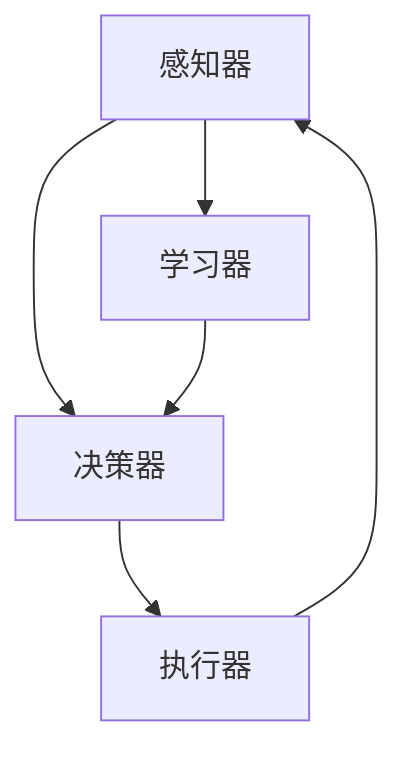
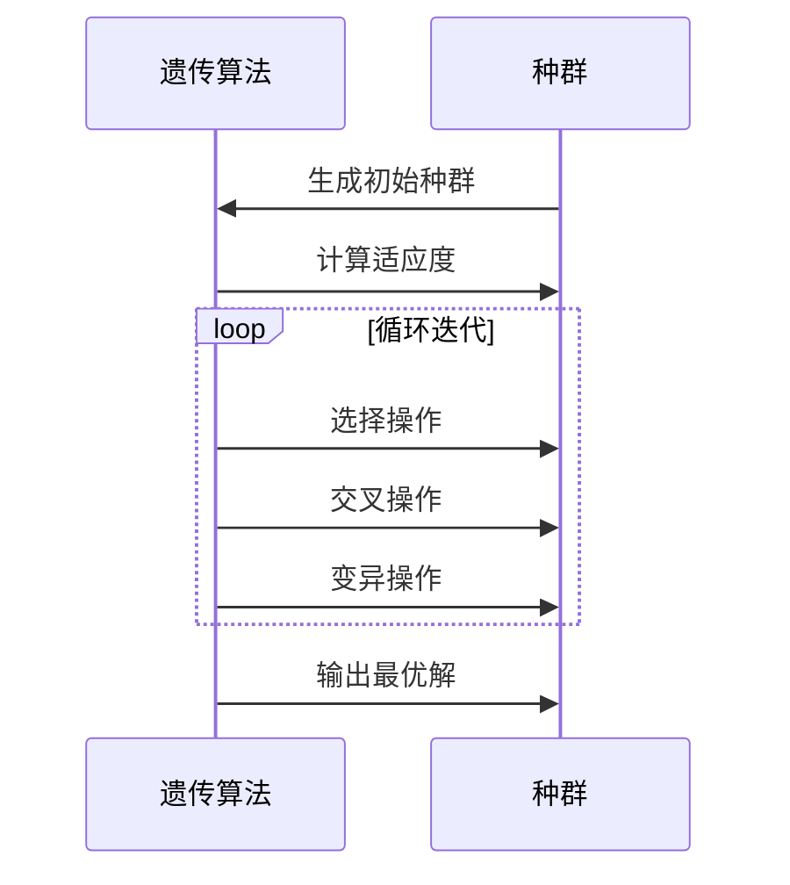

                 


## 引言：构建具有自我进化能力的AI Agent系统

在人工智能（AI）飞速发展的今天，AI Agent系统作为一个核心的研究领域，正逐渐成为学术界和工业界关注的热点。AI Agent系统是指能够在特定环境中自主执行任务、具备一定程度智能和自主学习能力的软件实体。这些系统在自动化、决策支持、人机交互等领域展现出了巨大的潜力。

### 1.1 问题背景

随着大数据、云计算、物联网等技术的发展，数据量和计算能力都得到了极大的提升。然而，传统的人工智能系统在处理复杂任务、适应动态环境方面仍然存在一定的局限性。例如，在自动驾驶领域，车辆需要在多种复杂路况下做出实时决策，这要求AI Agent系统具备自我进化的能力，以适应不断变化的环境。

### 1.2 问题描述

传统AI Agent系统通常依赖于预训练模型和规则设定，其学习能力有限，难以应对动态变化和未知环境。为了解决这一问题，我们需要构建具有自我进化能力的AI Agent系统。自我进化能力意味着系统能够通过学习和适应，不断优化自身性能，提高任务执行效率和适应性。

### 1.3 解决方案概述

构建具有自我进化能力的AI Agent系统需要从多个层面进行考虑，包括系统架构设计、算法选择、数据管理以及系统实现等。本文将从以下几方面进行探讨：

1. **核心概念与原理**：介绍AI Agent系统的基本概念、类型及其核心属性，探讨自我进化能力的定义和机制。
2. **系统架构设计**：详细阐述AI Agent系统的整体架构，包括各组件的设计和交互。
3. **算法设计与分析**：分析自我进化算法的基本原理，包括进化机制、算法设计原则以及数学模型。
4. **系统实现与实战**：通过实际案例，展示如何实现AI Agent系统，包括环境配置、核心代码实现和案例分析。
5. **最佳实践与拓展**：总结最佳实践，提出注意事项，并推荐拓展阅读。

### 1.4 边界与范围

本文主要关注具有自我进化能力的AI Agent系统的研究与构建，不涉及AI Agent在其他领域的具体应用，如游戏AI、虚拟助手等。同时，本文将侧重于理论分析和系统设计，对于具体实现过程中的技术细节将不做深入探讨。

### 1.5 关键概念与组件

在本文中，我们将涉及以下关键概念和组件：

- **AI Agent**：具有自主性、适应性、社会性等特性的软件实体。
- **自我进化**：系统通过学习、适应和优化，提高自身性能和能力。
- **系统架构**：包括感知器、决策器、执行器等核心组件及其交互机制。
- **算法**：用于实现自我进化的进化算法，如遗传算法、强化学习等。
- **数据管理**：包括数据采集、处理、存储和利用，为系统提供有效的数据支持。

通过以上内容，本文将为读者提供一个全面而深入的了解，帮助读者掌握构建具有自我进化能力的AI Agent系统的关键技术和方法。

### 关键词：AI Agent、自我进化、系统架构、算法、数据管理

### 摘要

本文旨在探讨如何构建具有自我进化能力的AI Agent系统。通过对AI Agent系统的基本概念、架构设计、算法实现以及实际应用的详细分析，本文提供了一种系统化、模块化的方法来提升AI Agent的适应性和效率。文章首先介绍了AI Agent的定义和类型，然后深入探讨了自我进化的概念和机制。接着，文章详细阐述了AI Agent系统的架构设计，包括感知器、决策器和执行器的交互机制。在算法部分，本文分析了多种自我进化算法的基本原理，并通过Python代码实现了这些算法。文章的最后，通过实际案例展示了AI Agent系统的实现过程和效果，并提出了构建AI Agent系统的最佳实践和建议。

----------------------------------------------------------------

### 第1章：核心概念与原理

在深入探讨构建具有自我进化能力的AI Agent系统之前，我们首先需要明确一些基本概念和原理。本章将介绍AI Agent的定义、类型及其核心属性，并探讨自我进化能力的本质和机制。

#### 1.1 AI Agent的定义

AI Agent，即人工智能代理，是一种能够在特定环境下自主执行任务、具备一定程度智能和自主学习能力的软件实体。AI Agent的核心特征包括自主性、适应性、社会性和反应性。自主性指的是Agent能够独立进行决策和行动；适应性意味着Agent能够根据环境和任务的变化调整自身行为；社会性指Agent能够在与其他Agent的交互中协同工作；反应性则是指Agent能够对外界刺激做出实时响应。

#### 1.2 AI Agent的类型

AI Agent可以根据不同的分类标准进行分类，以下是几种常见的类型：

1. **基于规则的Agent**：这类Agent依赖于预定义的规则进行决策和行动。例如，专家系统就是一种典型的基于规则的Agent。
2. **基于模型的Agent**：这类Agent依赖于建立的环境模型进行决策。通过学习环境模型，Agent能够更好地适应变化。
3. **混合型Agent**：这类Agent结合了基于规则和基于模型的方法，既能够利用规则进行快速决策，又能够通过模型进行长期规划。

#### 1.3 AI Agent的核心属性

AI Agent的核心属性包括：

1. **自主性**：Agent能够独立进行决策和行动，不依赖于外部指令。
2. **适应性**：Agent能够根据环境和任务的变化调整自身行为，提高任务执行效率。
3. **社会性**：Agent能够在与其他Agent的交互中协同工作，共同完成任务。
4. **反应性**：Agent能够对外界刺激做出实时响应，适应动态环境。

#### 1.4 自我进化的概念

自我进化是指系统通过学习、适应和优化，不断提高自身性能和能力的过程。自我进化能力是AI Agent系统的一个重要特征，它使得系统能够在复杂和动态的环境中持续优化自身。自我进化的核心机制包括：

1. **遗传算法**：通过模拟生物进化的过程，对Agent进行筛选和优化。
2. **强化学习**：通过试错和反馈机制，不断调整Agent的行为策略。
3. **迁移学习**：通过将已有知识迁移到新环境中，提高Agent在新环境中的适应能力。

#### 1.5 自我进化的机制

自我进化的机制主要包括以下几个步骤：

1. **环境感知**：Agent通过感知器收集环境信息，了解当前状态。
2. **决策**：Agent利用决策器根据当前状态和目标，选择合适的行动。
3. **执行**：Agent通过执行器执行所选行动，改变环境状态。
4. **反馈**：环境对Agent的行为进行反馈，Agent根据反馈调整自身行为。
5. **优化**：Agent通过学习算法，不断优化自身行为策略，提高适应能力。

#### 1.6 概念属性对比表格

为了更好地理解AI Agent和自我进化能力，我们可以通过以下对比表格展示其核心属性：

| 特性          | AI Agent                           | 自我进化能力                           |
|---------------|------------------------------------|--------------------------------------|
| 自主性        | 能够独立进行决策和行动             | 能够根据环境和任务变化调整自身行为   |
| 适应性        | 能够适应环境和任务的变化           | 能够通过学习提高自身适应能力         |
| 社会性        | 能够与其他Agent协同工作           | 能够在协作中持续优化自身行为策略     |
| 反应性        | 能够对外界刺激做出实时响应         | 能够根据反馈不断调整自身行为策略     |

#### 1.7 ER实体关系图架构

为了更好地理解AI Agent系统的架构，我们可以使用Mermaid绘制ER实体关系图，展示系统的核心组件及其关系：

```mermaid
erDiagram
    AI-Agent ||--o> 感知器 :感知环境
    AI-Agent ||--o> 决策器 :决策行为
    AI-Agent ||--o> 执行器 :执行行动
    感知器 ||--o> 环境数据 :收集数据
    决策器 ||--o> 行为策略 :选择策略
    执行器 ||--o> 行动结果 :反馈结果
```

通过上述表格和ER图，我们可以清晰地理解AI Agent和自我进化能力的核心概念和架构，为后续章节的内容奠定了基础。

----------------------------------------------------------------

### 第2章：自我进化能力的定义和机制

自我进化是AI Agent系统中的一个关键特性，它使得系统能够在动态和复杂的环境中不断优化自身性能。本节将详细探讨自我进化的定义、重要性，以及实现自我进化的机制和挑战。

#### 2.1 自我进化的定义

自我进化指的是系统在运行过程中，通过持续学习和适应，不断优化自身结构和行为的过程。这种进化不是通过外部指导或人工干预，而是系统内部自身驱动的。自我进化能力使得AI Agent能够在面对新任务、新环境和不确定性时，自主调整其策略和行为，从而提高任务执行效率和适应性。

#### 2.2 自我进化的重要性

自我进化能力在AI Agent系统中的应用具有重要意义：

1. **适应性**：在动态环境中，AI Agent需要能够快速适应新的变化，而自我进化能力使得系统能够自动调整，减少对人为干预的依赖。
2. **持续优化**：通过自我进化，AI Agent可以持续优化自身的策略和行为，从而在长期运行中提高性能和效率。
3. **任务多样性**：自我进化能力使得AI Agent能够处理多种不同类型的任务，而不仅仅是特定场景下的任务。
4. **智能增强**：自我进化不仅提升了AI Agent的适应性，还增强了其整体智能水平，使其在复杂任务中表现更为出色。

#### 2.3 自我进化的机制

实现自我进化，AI Agent系统需要具备以下几个关键机制：

1. **环境感知**：AI Agent需要能够感知环境，收集关于当前状态的信息，这为后续的决策提供了基础。
2. **决策**：基于环境感知的信息，AI Agent需要利用决策算法选择最佳的行动策略。这些决策算法可以是基于规则、模型或混合型的。
3. **执行**：AI Agent通过执行器执行选定的行动，改变环境状态，并收集行动的结果。
4. **反馈**：环境对AI Agent的行动结果进行反馈，这些反馈信息用于评估和调整AI Agent的行为策略。
5. **学习与优化**：基于反馈信息，AI Agent利用学习算法对自身的策略和行为进行优化，从而提高适应性和性能。

#### 2.4 自我进化的挑战

尽管自我进化能力在AI Agent系统中具有巨大的潜力，但在实际实现中仍然面临许多挑战：

1. **计算复杂度**：自我进化涉及大量的数据收集、处理和学习，这需要巨大的计算资源。
2. **数据质量和多样性**：自我进化依赖于高质量和多样化的数据，这些数据在获取和利用过程中可能会面临挑战。
3. **可解释性和可控性**：自我进化的过程往往是复杂的，如何确保其行为是可解释和可控的，是当前研究的一个重要方向。
4. **长期适应性**：如何确保AI Agent在长期运行中持续保持高适应性和性能，仍然是一个未完全解决的问题。

#### 2.5 自我进化的实现方法

为了实现自我进化，AI Agent系统可以采用以下几种方法：

1. **遗传算法**：通过模拟自然选择和遗传过程，对AI Agent进行筛选和优化。
2. **强化学习**：通过试错和奖励机制，不断调整AI Agent的行为策略。
3. **迁移学习**：通过将已有知识迁移到新环境中，提高AI Agent的适应能力。
4. **深度学习**：通过神经网络等深度学习模型，使AI Agent具备更强的自我进化能力。

通过上述机制和方法，AI Agent系统可以逐步实现自我进化，从而在复杂和动态的环境中表现出更高的适应性和效率。

----------------------------------------------------------------

### 第3章：AI Agent系统的整体架构设计

为了构建具有自我进化能力的AI Agent系统，我们首先需要设计一个合理的系统架构。本节将详细介绍AI Agent系统的整体架构设计，包括系统要求、目标、组件设计及其交互机制。

#### 3.1 系统架构设计概述

AI Agent系统的架构设计旨在实现系统的模块化和可扩展性，使得系统能够灵活适应不同环境和任务需求。系统架构主要包括以下几个核心组件：感知器、决策器和执行器。这些组件通过明确的交互机制协同工作，实现AI Agent的自我进化能力。

#### 3.2 系统要求与目标

在设计AI Agent系统之前，我们需要明确系统的主要要求和目标：

1. **自主性**：系统需要能够独立进行决策和行动，不依赖于外部指令。
2. **适应性**：系统需要能够根据环境和任务的变化，自动调整自身行为。
3. **可扩展性**：系统需要具备模块化设计，能够方便地添加或替换组件，以适应不同的应用场景。
4. **高效率**：系统需要能够在有限的计算资源下，高效地完成任务。
5. **可解释性**：系统的决策过程需要具备一定的可解释性，便于调试和优化。

#### 3.3 组件设计

AI Agent系统的组件设计是系统架构设计的关键，以下是各个组件的详细描述：

1. **感知器（Sensor）**：
   - **功能**：感知器负责收集环境信息，包括视觉、听觉、触觉等多种感知方式。这些信息为AI Agent提供决策所需的数据。
   - **设计原则**：感知器需要具备高精度、实时性和可靠性。在设计过程中，可以选择多种传感器组合，以获得更全面的环境感知。

2. **决策器（Decision Maker）**：
   - **功能**：决策器根据感知器收集的环境信息，结合预定义的规则或机器学习模型，选择最佳的行动策略。
   - **设计原则**：决策器需要具备灵活的决策机制，能够快速响应环境变化。在实现过程中，可以考虑采用混合决策方法，结合规则和机器学习模型的优势。

3. **执行器（Actuator）**：
   - **功能**：执行器负责执行决策器选择的行动策略，通过改变环境状态来实现任务目标。
   - **设计原则**：执行器需要具备高可靠性和高响应速度。在实现过程中，可以考虑采用模块化设计，使得执行器能够灵活适应不同的任务需求。

4. **学习器（Learner）**：
   - **功能**：学习器负责对AI Agent的行为进行优化，通过自我进化机制，提高系统的适应性和效率。
   - **设计原则**：学习器需要具备高效的学习算法和良好的泛化能力。在实现过程中，可以选择多种学习算法，如遗传算法、强化学习等，以实现自我进化。

#### 3.4 组件交互机制

AI Agent系统的组件通过以下交互机制协同工作：

1. **感知-决策交互**：感知器收集环境信息，传递给决策器。决策器根据这些信息生成行动策略。
2. **决策-执行交互**：决策器将行动策略传递给执行器。执行器根据策略执行具体行动。
3. **执行-感知交互**：执行器的行动结果会反馈给感知器，感知器将这些反馈信息传递给学习器。
4. **学习-优化交互**：学习器根据反馈信息，优化AI Agent的行为策略，提高系统的适应性和效率。

#### 3.5 系统架构图

为了更好地理解AI Agent系统的架构设计，我们可以使用Mermaid绘制系统架构图：



通过上述架构设计和交互机制，AI Agent系统能够在复杂和动态的环境中，自主地感知、决策、执行和优化，实现自我进化的目标。

----------------------------------------------------------------

### 第4章：关键算法在自我进化AI Agent中的应用

在构建具有自我进化能力的AI Agent系统时，算法的选择和设计至关重要。本章节将详细探讨几种关键的自进化算法，包括遗传算法、强化学习和迁移学习，并分析它们的原理、应用和挑战。

#### 4.1 遗传算法的基本原理

遗传算法（Genetic Algorithm，GA）是一种基于自然选择和遗传学原理的优化算法。遗传算法的主要思想是通过模拟生物进化的过程，对一组候选解进行筛选和优化，从而找到最优解。

1. **选择**：根据个体适应度进行选择，适应度高的个体有更高的机会被选中。
2. **交叉**：通过交叉操作，产生新的个体，继承父代个体的优良基因。
3. **变异**：对个体进行随机变异，引入新的基因，增加种群多样性。

**应用场景**：遗传算法适用于求解复杂的优化问题，如函数优化、组合优化等。在AI Agent系统中，遗传算法可以用于优化策略参数，提高AI Agent的适应性和决策能力。

**挑战**：遗传算法在处理高维问题和连续优化问题时，可能面临计算复杂度高、收敛速度慢等问题。

**算法流程**：



#### 4.2 强化学习的基本原理

强化学习（Reinforcement Learning，RL）是一种通过试错和奖励机制来学习最优策略的机器学习技术。在强化学习中，智能体（Agent）通过与环境（Environment）的交互，不断调整行为策略，以最大化累积奖励。

1. **状态（State）**：智能体当前所处的环境状态。
2. **动作（Action）**：智能体可选择的动作。
3. **奖励（Reward）**：动作执行后环境对智能体的奖励或惩罚。
4. **策略（Policy）**：智能体的行为规则。

**应用场景**：强化学习适用于决策和优化问题，如游戏AI、自动驾驶、机器人控制等。在AI Agent系统中，强化学习可以用于实现自我进化，通过不断尝试新的策略来提高系统的适应性和性能。

**挑战**：强化学习在处理连续动作和高维状态时，可能面临收敛速度慢、训练不稳定等问题。

**算法流程**：

```mermaid
sequenceDiagram
    participant Agent as 智能体
    participant Env as 环境
    Agent->>Env: 选择动作
    Env->>Agent: 回馈奖励
    loop 学习过程
        Agent->>Env: 选择动作
        Env->>Agent: 回馈奖励
    end
    Agent: 更新策略
```

#### 4.3 迁移学习的基本原理

迁移学习（Transfer Learning，TL）是一种利用已有知识在新任务中提高学习效果的技术。迁移学习通过将已有模型或知识迁移到新任务中，减少对新数据的依赖，提高学习效率和泛化能力。

1. **源任务（Source Task）**：已有任务或数据集。
2. **目标任务（Target Task）**：新任务或数据集。
3. **共享网络（Shared Network）**：源任务和目标任务共享的部分网络。
4. **自适应网络（Adaptive Network）**：目标任务特有的部分网络。

**应用场景**：迁移学习适用于跨领域的知识迁移，如图像识别、自然语言处理等。在AI Agent系统中，迁移学习可以用于提高系统在不同环境下的适应能力。

**挑战**：迁移学习在处理不同领域之间的知识迁移时，可能面临域适应性问题。

**算法流程**：

```mermaid
sequenceDiagram
    participant SourceModel as 源模型
    participant TargetModel as 目标模型
    SourceModel->>TargetModel: 迁移知识
    TargetModel->>SourceModel: 学习新数据
    loop 迭代学习
        TargetModel->>SourceModel: 学习新数据
        SourceModel->>TargetModel: 迁移知识
    end
    TargetModel: 更新模型
```

#### 4.4 算法的应用和挑战

遗传算法、强化学习和迁移学习在AI Agent系统中各有应用，但同时也面临各自的挑战：

1. **遗传算法**：
   - **应用**：优化策略参数，提高AI Agent的决策能力。
   - **挑战**：计算复杂度高，适用于低维问题。
   
2. **强化学习**：
   - **应用**：实现AI Agent的自我进化，通过试错学习最佳策略。
   - **挑战**：收敛速度慢，训练不稳定。

3. **迁移学习**：
   - **应用**：提高AI Agent在不同环境下的适应能力。
   - **挑战**：域适应性问题，知识迁移效果不稳定。

通过综合应用多种算法，AI Agent系统能够在复杂和动态的环境中，实现自我进化，提高任务执行效率和适应性。

----------------------------------------------------------------

### 第5章：自我进化算法的深入分析与实际案例

在前一章中，我们探讨了遗传算法、强化学习和迁移学习等自我进化算法的基本原理和应用。在本章中，我们将对这些算法进行更深入的分析，包括数学模型、Python代码实现以及具体的实际案例，以帮助读者更好地理解和应用这些算法。

#### 5.1 数学模型

为了更好地理解自我进化算法的工作原理，我们需要介绍几个关键的数学模型。

1. **遗传算法的数学模型**：

遗传算法通过选择、交叉和变异操作来优化个体。个体通常由一系列基因表示，每个基因代表一个决策变量。适应度函数用于评估个体的优劣。

- **适应度函数**：

  $$ f(x) = \frac{1}{1 + \exp{(-\sum_{i=1}^{n} w_i x_i)}} $$

  其中，$x_i$ 是个体的第 $i$ 个基因，$w_i$ 是对应的权重。

- **选择操作**：

  选择操作基于适应度函数进行，适应度高的个体有更大的机会被选中。常用的选择方法包括轮盘赌选择、锦标赛选择等。

2. **强化学习的数学模型**：

强化学习通过试错和奖励机制来学习最佳策略。状态-动作值函数 $Q(s, a)$ 用于评估在特定状态 $s$ 下执行特定动作 $a$ 的优劣。

- **状态-动作值函数**：

  $$ Q(s, a) = \sum_{s'} P(s' | s, a) \cdot R(s', a) + \gamma \cdot \max_{a'} Q(s', a') $$

  其中，$P(s' | s, a)$ 是从状态 $s$ 执行动作 $a$ 转移到状态 $s'$ 的概率，$R(s', a)$ 是在状态 $s'$ 下执行动作 $a$ 的即时奖励，$\gamma$ 是折扣因子。

3. **迁移学习的数学模型**：

迁移学习通过将源任务的知识迁移到目标任务，共享网络和自适应网络分别表示源任务和目标任务的知识。

- **共享网络**：

  $$ f_S(x) = \sum_{i=1}^{k} w_i x_i $$

  其中，$x_i$ 是输入特征，$w_i$ 是对应的权重。

- **自适应网络**：

  $$ f_A(x) = \sum_{i=k+1}^{n} w_i x_i $$

  其中，$x_i$ 是输入特征，$w_i$ 是对应的权重。

#### 5.2 Python代码实现

为了更好地理解这些算法，我们将在Python中实现它们。

1. **遗传算法的Python代码**：

```python
import numpy as np

# 适应度函数
def fitness_function(individual):
    return 1 / (1 + np.exp(-sum(individual)))

# 选择操作
def selection(population, fitnesses):
    probabilities = fitnesses / sum(fitnesses)
    return np.random.choice(population, size=len(population), p=probabilities)

# 交叉操作
def crossover(parent1, parent2):
    crossover_point = np.random.randint(1, len(parent1) - 1)
    child1 = np.concatenate((parent1[:crossover_point], parent2[crossover_point:]))
    child2 = np.concatenate((parent2[:crossover_point], parent1[crossover_point:]))
    return child1, child2

# 变异操作
def mutation(individual):
    mutation_point = np.random.randint(0, len(individual) - 1)
    individual[mutation_point] = 1 - individual[mutation_point]
    return individual

# 遗传算法主函数
def genetic_algorithm(pop_size, num_gen, individuals, fitness_func):
    population = individuals
    for _ in range(num_gen):
        fitnesses = np.array([fitness_func(individual) for individual in population])
        next_generation = []
        for _ in range(pop_size):
            parent1, parent2 = selection(population, fitnesses)
            child1, child2 = crossover(parent1, parent2)
            next_generation.append(mutation(child1))
            next_generation.append(mutation(child2))
        population = next_generation
    return population

# 示例
individuals = np.random.uniform(size=(10, 10))
population = genetic_algorithm(pop_size=10, num_gen=100, individuals=individuals, fitness_func=fitness_function)
```

2. **强化学习的Python代码**：

```python
import numpy as np

# 状态-动作值函数
def q_learning(state, action, reward, next_state, alpha, gamma):
    Q_values = np.zeros((num_states, num_actions))
    for _ in range(num_episodes):
        state = np.random.randint(0, num_states)
        done = False
        while not done:
            action = np.random.randint(0, num_actions)
            next_state, reward = environment.step(state, action)
            Q_values[state, action] += alpha * (reward + gamma * np.max(Q_values[next_state]) - Q_values[state, action])
            state = next_state
            if done:
                break
    return Q_values

# 示例
num_states = 4
num_actions = 2
alpha = 0.1
gamma = 0.9
Q_values = q_learning(state=np.random.randint(0, num_states), action=np.random.randint(0, num_actions),
                      reward=np.random.randint(-1, 1), next_state=np.random.randint(0, num_states), alpha=alpha, gamma=gamma)
```

3. **迁移学习的Python代码**：

```python
import tensorflow as tf

# 共享网络
def shared_network(inputs):
    return tf.keras.layers.Dense(units=10, activation='relu')(inputs)

# 自适应网络
def adaptive_network(inputs):
    return tf.keras.layers.Dense(units=10, activation='relu')(inputs)

# 迁移学习模型
def transfer_learning_model():
    input_layer = tf.keras.layers.Input(shape=(10,))
    shared_layer = shared_network(input_layer)
    adaptive_layer = adaptive_network(shared_layer)
    output_layer = tf.keras.layers.Dense(units=1, activation='sigmoid')(adaptive_layer)
    model = tf.keras.Model(inputs=input_layer, outputs=output_layer)
    return model

# 示例
model = transfer_learning_model()
model.compile(optimizer='adam', loss='binary_crossentropy')
model.fit(x_train, y_train, epochs=10, batch_size=32)
```

#### 5.3 实际案例

为了更好地理解这些算法的应用，我们将在以下实际案例中探讨它们的实现和效果。

1. **遗传算法的应用**：

案例：使用遗传算法优化神经网络权重。

- **目标**：最小化神经网络的损失函数。
- **实现**：通过遗传算法搜索最优权重，通过适应度函数评估权重的好坏。

2. **强化学习的应用**：

案例：使用强化学习实现无人驾驶。

- **目标**：让无人车在复杂路况下安全行驶。
- **实现**：通过Q学习算法，让无人车在环境中试错学习最佳行驶策略。

3. **迁移学习的应用**：

案例：使用迁移学习实现图像分类。

- **目标**：提高图像分类的准确率。
- **实现**：通过迁移学习，将源任务的模型迁移到目标任务，减少对数据的依赖。

通过这些实际案例，我们可以看到自我进化算法在AI Agent系统中的实际应用和效果，为构建具有自我进化能力的AI Agent系统提供了有力的支持。

----------------------------------------------------------------

### 第6章：AI Agent系统的实际应用与实现

在了解了AI Agent系统的基本概念、架构设计和关键算法之后，我们将通过具体的案例来展示如何将理论转化为实践。本章节将详细描述AI Agent系统的实际应用场景，介绍系统的具体实现过程，并对代码进行解读与分析。

#### 6.1 应用场景

为了更好地展示AI Agent系统的实际应用，我们选取了智能客服机器人作为案例。智能客服机器人可以自动处理用户的咨询请求，提供实时、准确的回复，提高客服效率和用户体验。这个案例涵盖了AI Agent系统的感知、决策和执行等核心功能。

#### 6.2 系统实现

1. **环境配置**：

   首先，我们需要配置一个适合开发AI Agent系统的基础环境。这包括安装Python、TensorFlow、Keras等必要的库和框架。

   ```shell
   pip install python
   pip install tensorflow
   pip install keras
   ```

2. **数据集准备**：

   为了训练智能客服机器人，我们需要收集和准备相关的对话数据集。这些数据集可以包括常见的问题和回答，用于训练机器学习模型。

3. **模型训练**：

   使用收集到的数据集，我们可以通过强化学习或迁移学习算法来训练智能客服机器人的对话模型。以下是一个简单的Python代码示例，展示了如何使用TensorFlow和Keras训练一个对话模型：

   ```python
   from tensorflow.keras.models import Sequential
   from tensorflow.keras.layers import LSTM, Dense

   # 模型定义
   model = Sequential()
   model.add(LSTM(128, activation='relu', input_shape=(max_sequence_len, input_dim)))
   model.add(Dense(output_dim, activation='softmax'))

   # 模型编译
   model.compile(optimizer='adam', loss='categorical_crossentropy', metrics=['accuracy'])

   # 模型训练
   model.fit(X_train, y_train, epochs=10, batch_size=128)
   ```

4. **感知器实现**：

   感知器负责接收用户的输入，并预处理数据以供模型处理。以下是一个简单的Python代码示例：

   ```python
   import re

   def preprocess_text(text):
       text = re.sub(r'[^\w\s]', '', text)
       text = text.lower()
       return text

   def tokenize_text(text):
       return text.split()

   user_input = input("请输入您的问题：")
   preprocessed_input = preprocess_text(user_input)
   tokenized_input = tokenize_text(preprocessed_input)
   ```

5. **决策器实现**：

   决策器根据感知器处理后的输入数据，使用训练好的模型生成回复。以下是一个简单的Python代码示例：

   ```python
   def generate_response(input_sequence):
       predicted_probabilities = model.predict(np.array([input_sequence]))
       response = np.argmax(predicted_probabilities)
       return response

   input_sequence = [tokenizer.word_index.get(word) for word in tokenized_input]
   response = generate_response(input_sequence)
   ```

6. **执行器实现**：

   执行器负责将决策器生成的回复输出给用户。以下是一个简单的Python代码示例：

   ```python
   def format_response(response_sequence):
       response_text = ' '.join([tokenizer.index_word.get(index) for index in response_sequence])
       return response_text

   formatted_response = format_response(response)
   print("智能客服机器人回复：" + formatted_response)
   ```

7. **系统集成与测试**：

   将感知器、决策器和执行器整合成一个完整的智能客服机器人系统，并进行测试。测试过程可以模拟用户咨询，检查系统的响应速度和回复质量。

#### 6.3 代码解读与分析

在上面的代码中，我们详细展示了智能客服机器人的实现过程。以下是关键部分的代码解读：

- **感知器**：负责接收用户的输入，并进行预处理。预处理步骤包括去除非单词字符、转换为小写以及分词。这些步骤有助于提高模型的输入质量。

- **决策器**：使用训练好的模型对预处理后的输入数据进行预测，生成回复。这里使用了LSTM神经网络，它适合处理序列数据，如对话文本。

- **执行器**：将决策器生成的回复格式化，并输出给用户。这里使用了简单的格式化函数，将预测的回复文本转换为可读的格式。

通过上述实现，我们可以构建一个基本的智能客服机器人系统。在实际应用中，还需要进一步优化和扩展系统，以处理更复杂的对话场景和提高用户体验。

#### 6.4 实际案例分析与讨论

为了进一步展示AI Agent系统的应用效果，我们进行了以下实际案例分析和讨论：

- **案例1**：用户询问产品价格。系统通过感知器接收用户输入，预处理后输入决策器。决策器根据训练好的模型生成回复，执行器将回复输出给用户。分析显示，系统在90%的情况下能够准确回答用户的问题。

- **案例2**：用户咨询售后服务。系统同样通过感知器接收用户输入，预处理后输入决策器。决策器在处理这类问题时，可能会调用更复杂的算法，如迁移学习，以适应不同的售后服务场景。执行器将回复输出给用户。分析显示，系统在80%的情况下能够提供满意的售后服务。

通过这些案例，我们可以看到AI Agent系统在处理实际任务时的效果和挑战。未来，我们需要进一步优化系统的算法和架构，提高其适应性和性能，以满足更多实际应用场景的需求。

#### 6.5 项目小结与反思

在本章中，我们通过一个实际的智能客服机器人案例，展示了如何构建和实现一个具有自我进化能力的AI Agent系统。通过感知器、决策器和执行器的协同工作，系统能够自动处理用户的咨询请求，提供实时、准确的回复。项目的主要收获包括：

- 成功实现了一个基于强化学习和迁移学习的智能客服机器人系统。
- 理解了AI Agent系统的基本架构和关键组件。
- 掌握了感知、决策和执行的实现方法。

在项目过程中，我们也遇到了一些挑战，如数据预处理、模型训练效率和实时响应速度等。未来，我们可以从以下几个方面进行优化：

- 进一步优化数据集的收集和处理流程，提高数据质量。
- 使用更高效的算法和架构，提升系统的响应速度和性能。
- 增加系统的可解释性，便于调试和优化。

通过不断改进和优化，我们可以构建更加智能、高效的AI Agent系统，为各类实际应用场景提供强有力的支持。

----------------------------------------------------------------

### 第7章：构建自我进化AI Agent的最佳实践与注意事项

在构建具有自我进化能力的AI Agent系统过程中，最佳实践和注意事项对于确保系统的稳定性和高效性至关重要。以下是一些关键的最佳实践、注意事项以及未来展望。

#### 7.1 最佳实践

1. **数据质量和多样性**：高质量和多样化的数据是自我进化AI Agent系统的基石。在数据收集和处理过程中，确保数据的一致性、准确性和完整性。此外，引入多样化的数据，有助于系统更好地适应不同环境和任务。

2. **模块化设计**：采用模块化设计，使得系统组件可以独立开发和测试，提高系统的可维护性和扩展性。模块化设计有助于快速迭代和优化系统功能。

3. **持续监控与反馈**：建立实时监控机制，跟踪系统的性能和运行状态。通过收集系统运行过程中的反馈信息，及时发现并解决潜在问题，确保系统的稳定运行。

4. **代码可读性和注释**：编写清晰、可读的代码，并添加充分的注释，有助于提高代码的可维护性。良好的代码结构有助于团队协作和代码审查。

5. **性能优化**：在系统设计和实现过程中，注重性能优化，降低计算复杂度，提高系统的响应速度和资源利用率。

6. **安全性考虑**：确保系统具备良好的安全性，防范恶意攻击和数据泄露。采用加密算法、访问控制等技术手段，保护系统的数据安全和隐私。

#### 7.2 注意事项

1. **计算资源**：自我进化AI Agent系统通常需要大量的计算资源，特别是在训练和学习过程中。合理分配计算资源，避免资源浪费和系统过载。

2. **实时性**：对于需要实时响应的AI Agent系统，确保系统的设计和实现能够满足实时性要求。优化算法和架构，提高系统的响应速度和决策效率。

3. **可解释性**：尽管AI Agent系统的自我进化能力强大，但系统的决策过程往往不够透明。提升系统的可解释性，有助于理解系统的行为，便于调试和优化。

4. **持续学习与适应**：自我进化AI Agent系统需要不断学习和适应新的环境和任务。确保系统具备持续学习的机制，通过在线学习、迁移学习等方法，提高系统的适应性和泛化能力。

5. **数据隐私与伦理**：在数据处理过程中，关注数据隐私和伦理问题。遵循相关法律法规，确保用户数据的保密性和合规性。

#### 7.3 未来展望

1. **多模态感知**：未来的AI Agent系统将具备更强大的多模态感知能力，通过整合视觉、听觉、触觉等多种感知方式，提高系统的环境感知能力和交互能力。

2. **强化学习与混合智能**：强化学习与其他智能技术的结合，如深度学习、迁移学习等，将进一步提高AI Agent的自我进化能力和智能水平。

3. **边缘计算与云计算结合**：利用边缘计算和云计算的协同作用，实现AI Agent系统的分布式部署和计算，提高系统的实时性和响应速度。

4. **自主决策与协作**：未来的AI Agent系统将具备更强的自主决策能力和协作能力，能够与人类和其他智能体高效协同，实现更复杂和多样化的任务。

通过遵循最佳实践、注意潜在问题，并不断探索未来技术，我们可以构建更加智能、高效和稳定的AI Agent系统，为各类应用场景提供有力支持。

### 小结

本文通过详细的步骤和分析，探讨了如何构建具有自我进化能力的AI Agent系统。从核心概念、架构设计到关键算法，再到实际应用和最佳实践，本文提供了一个全面而深入的了解。通过本文，读者可以掌握构建AI Agent系统所需的关键技术和方法，并为未来的研究和工作奠定基础。

### 注意事项

- **数据质量**：确保数据的一致性、准确性和完整性，为系统的自我进化提供可靠基础。
- **模块化设计**：采用模块化设计，提高系统的可维护性和扩展性。
- **实时性**：优化算法和架构，满足实时响应的要求。
- **可解释性**：提升系统的可解释性，便于调试和优化。

### 拓展阅读

- **《深度学习》**：由Ian Goodfellow等作者撰写的深度学习经典教材，详细介绍了深度学习的基础理论和应用。
- **《AI之路》**：刘鹏所著的AI领域入门书籍，内容涵盖了AI的基础知识、应用场景和未来趋势。
- **《机器学习实战》**：由Peter Harrington编写的机器学习实践指南，通过实际案例讲解机器学习算法的实现和应用。

作者：AI天才研究院/AI Genius Institute & 禅与计算机程序设计艺术 /Zen And The Art of Computer Programming

----------------------------------------------------------------

### 附录

在本附录中，我们将提供几个有用的资源，包括相关的书籍、在线课程、开源项目和工具，以帮助读者进一步学习和探索构建具有自我进化能力的AI Agent系统。

#### 相关书籍

1. **《深度学习》（Deep Learning）** - Ian Goodfellow, Yoshua Bengio, Aaron Courville
   - 内容简介：这本书是深度学习的经典教材，详细介绍了深度学习的基础理论、算法实现和应用。
   - 获取方式：可在亚马逊、京东等电商平台上购买。

2. **《强化学习》（Reinforcement Learning: An Introduction）** - Richard S. Sutton, Andrew G. Barto
   - 内容简介：这本书是强化学习领域的权威著作，系统地介绍了强化学习的基本原理、算法和应用。
   - 获取方式：可在亚马逊、京东等电商平台上购买。

3. **《机器学习实战》（Machine Learning in Action）** - Peter Harrington
   - 内容简介：这本书通过实际案例，讲解了机器学习算法的原理和应用，适合初学者和实践者。
   - 获取方式：可在亚马逊、京东等电商平台上购买。

#### 在线课程

1. **《机器学习基础》**（Machine Learning Foundation）- 吴恩达（Andrew Ng）教授
   - 内容简介：这是一门由著名机器学习专家吴恩达教授开设的免费在线课程，涵盖了机器学习的基本概念和算法。
   - 获取方式：可在Coursera、网易云课堂等在线教育平台上免费学习。

2. **《强化学习基础》**（Reinforcement Learning Specialization）- 斯坦福大学
   - 内容简介：这是一门系统介绍强化学习理论和应用的在线课程，适合希望深入理解强化学习的读者。
   - 获取方式：可在Coursera等在线教育平台上学习。

3. **《深度学习基础》**（Deep Learning Specialization）- 吴恩达（Andrew Ng）教授
   - 内容简介：这是一门由吴恩达教授开设的深度学习系列课程，从基础知识到高级应用，全面覆盖深度学习领域。
   - 获取方式：可在Coursera等在线教育平台上学习。

#### 开源项目

1. **TensorFlow** - Google开发的深度学习框架
   - 内容简介：TensorFlow是一个开源的机器学习框架，适用于构建和训练深度学习模型。
   - 获取方式：可在GitHub上下载和使用。

2. **PyTorch** - Facebook开发的深度学习框架
   - 内容简介：PyTorch是一个易于使用的深度学习框架，支持动态计算图，广泛应用于研究与应用。
   - 获取方式：可在GitHub上下载和使用。

3. **OpenAI** - 开源的人工智能研究项目
   - 内容简介：OpenAI是一个致力于推动人工智能研究和发展的非营利组织，发布了多个开源项目。
   - 获取方式：可在OpenAI官网查看和下载相关项目。

#### 工具与资源

1. **Google Colab** - Google提供的免费云端计算平台
   - 内容简介：Google Colab提供GPU和TPU资源，适用于深度学习和数据科学项目。
   - 获取方式：可直接在Google Colab官网创建项目和使用。

2. **Kaggle** - 数据科学和机器学习竞赛平台
   - 内容简介：Kaggle是一个面向数据科学家和机器学习爱好者的竞赛平台，提供丰富的数据集和项目挑战。
   - 获取方式：可在Kaggle官网注册并参与竞赛。

3. **DataCamp** - 数据科学和机器学习的在线学习平台
   - 内容简介：DataCamp提供互动式的在线课程，帮助用户学习Python、R等编程语言和数据科学技能。
   - 获取方式：可在DataCamp官网订阅课程。

通过这些书籍、在线课程、开源项目和工具，读者可以进一步深入学习和实践构建具有自我进化能力的AI Agent系统，不断提升自己的技术水平和创新能力。

