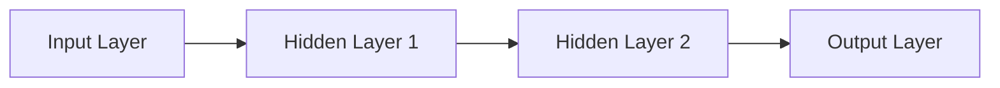

                 

## 文章标题

### 认知计算与推理能力的AI Agent

---

关键词：认知计算、推理能力、AI Agent、神经网络、机器学习、算法原理

摘要：本文将深入探讨认知计算与推理能力的AI Agent构建。通过分步骤的分析，我们将从认知计算的基础概念出发，逐步解释认知计算的核心概念、算法原理，以及如何设计和实现一个具有认知计算与推理能力的AI Agent。本文旨在为读者提供清晰、实用的技术指南，助力他们在实际项目中应用这些先进技术。

---

### 目录

1. **认知计算基础**
   1.1 认知计算概述
   1.2 认知计算与人工智能的关系
   1.3 认知计算的历史与发展趋势

2. **认知计算的核心概念**
   2.1 感知、理解和推理
   2.2 认知计算的关键技术

3. **认知计算的算法原理**
   3.1 神经网络
   3.2 模式识别与机器学习

4. **认知计算的数学模型**
   4.1 概率论与统计学
   4.2 神经网络数学模型

5. **认知计算系统分析与架构设计**
   5.1 认知计算系统的组成
   5.2 认知计算系统的架构设计
   5.3 认知计算系统的接口设计与交互

6. **构建认知计算与推理能力的AI Agent项目实战**
   6.1 项目介绍
   6.2 环境安装与配置
   6.3 系统核心实现
   6.4 代码应用解读与分析
   6.5 实际案例分析与详细讲解

7. **认知计算与推理能力的最佳实践**
   7.1 最佳实践 tips
   7.2 小结
   7.3 注意事项
   7.4 拓展阅读

---

### 第一部分：认知计算基础

#### 第1章：认知计算概述

##### 1.1 认知计算的定义

认知计算是一种模拟人类思维过程的技术，旨在使机器能够感知、理解和推理复杂的信息。与传统的计算模型不同，认知计算强调机器具有类似人类的认知能力，包括注意力、记忆、学习和问题解决等。

- **背景介绍**：认知计算的起源可以追溯到20世纪80年代，当时计算机科学家开始尝试模拟人类大脑的工作方式，以提升机器的智能水平。
- **问题背景**：传统的计算机系统主要依赖于预先编程的指令和规则，难以处理复杂的、动态变化的环境。
- **问题描述**：认知计算旨在解决如何使计算机具有类似人类的认知能力，能够自主学习和适应环境。
- **问题解决**：通过模拟人类大脑的工作方式，认知计算实现了对复杂信息的高效处理和分析。

##### 1.2 认知计算与人工智能的关系

认知计算是人工智能的一个重要分支，它关注的是如何让机器具有类似于人类的认知能力。人工智能（AI）是计算机科学的一个广泛领域，涵盖了各种技术，包括机器学习、深度学习、自然语言处理等。

- **核心概念与联系**：认知计算与人工智能的关系可以看作是“人工智能 + 认知模拟”。认知计算通过模拟人类思维过程，实现人工智能的更高层次。
- **对比表格**：以下是认知计算与人工智能的一些对比：
  
  | 特征 | 认知计算 | 人工智能 |
  | --- | --- | --- |
  | 目标 | 模拟人类思维过程 | 执行特定任务 |
  | 原理 | 模式识别、推理和自主学习 | 数据驱动、机器学习、深度学习 |
  | 应用 | 复杂问题解决、自然语言处理 | 自动化、预测分析、推荐系统 |

##### 1.3 认知计算的历史与发展趋势

认知计算的发展历程可以分为几个阶段：

- **早期阶段**：20世纪80年代，认知计算的概念开始提出，主要集中在符号推理和知识表示方面。
- **中期阶段**：20世纪90年代，随着机器学习技术的发展，认知计算开始引入统计和学习方法，提高了系统的自适应能力。
- **近期阶段**：近年来，随着深度学习、神经网络等技术的突破，认知计算取得了显著进展，能够在更复杂的环境中发挥作用。

- **未来趋势**：未来，认知计算将继续与人工智能、机器学习等领域深度融合，实现更高级的认知模拟。同时，跨学科的研究也将进一步推动认知计算的发展，如神经科学、心理学等。

#### 第2章：认知计算的核心概念

##### 2.1 感知、理解和推理

感知、理解和推理是认知计算的核心概念，它们分别代表了机器在处理信息过程中的不同阶段。

- **感知**：感知是机器接收外部信息的过程，类似于人类的感官系统。通过传感器、图像处理、语音识别等技术，机器能够从环境中提取信息。
- **理解**：理解是对感知到的信息进行解释和抽象的过程。机器需要理解信息的含义，将其转化为有用的知识。
- **推理**：推理是利用已有知识进行逻辑推导和决策的过程。通过推理，机器能够解决复杂问题，作出合理决策。

##### 2.2 认知计算的关键技术

认知计算的关键技术包括神经网络、模式识别和机器学习等。

- **神经网络**：神经网络是一种模拟人脑神经元连接的结构，通过多层神经元的交互，实现信息的处理和传递。
- **模式识别**：模式识别是机器从数据中提取规律和特征的能力，广泛应用于图像识别、语音识别等领域。
- **机器学习**：机器学习是使机器能够自主学习和改进性能的技术，通过训练模型，机器能够从数据中学习并做出预测。

接下来，我们将详细探讨这些关键技术的原理和应用，为构建具有认知计算与推理能力的AI Agent打下坚实基础。

---

### 第二部分：认知计算的算法原理

#### 第3章：神经网络

##### 3.1 神经网络的基本原理

神经网络（Neural Networks）是一种模拟人脑神经元连接和传递信息的人工智能模型。它由大量相互连接的神经元组成，每个神经元都可以接收输入信息，并通过激活函数产生输出。

- **基本结构**：一个简单的神经网络通常包括输入层、隐藏层和输出层。输入层接收外部信息，隐藏层进行信息处理，输出层产生预测或决策。
- **激活函数**：激活函数是神经网络中的一个关键组件，它用于确定神经元的激活状态。常见的激活函数包括sigmoid函数、ReLU函数等。

##### 3.1.1 神经网络的基本原理

我们可以使用Mermaid绘制一个简单的神经网络流程图：



在这个流程图中，输入层（A）接收输入数据，通过隐藏层（B和C）的处理，最终在输出层（D）产生预测结果。

##### 3.1.2 神经网络的应用案例

神经网络在图像识别、自然语言处理、自动驾驶等领域具有广泛应用。

- **图像识别**：通过卷积神经网络（CNN），机器可以识别和分类各种图像。例如，人脸识别、物体检测等。
- **自然语言处理**：通过循环神经网络（RNN）和变换器（Transformer），机器可以进行文本生成、机器翻译等任务。
- **自动驾驶**：神经网络在自动驾驶系统中用于环境感知、路径规划等任务，提高车辆的安全性和智能化水平。

接下来，我们将介绍另一种关键的技术——模式识别与机器学习。

#### 第3章：模式识别与机器学习

##### 3.2 模式识别的基本原理

模式识别（Pattern Recognition）是机器从数据中提取规律和特征的能力。它是认知计算的核心组成部分，广泛应用于图像识别、语音识别、生物特征识别等领域。

- **特征提取**：特征提取是模式识别的关键步骤，它从原始数据中提取出具有代表性的特征，用于后续的分类或识别。
- **分类器设计**：分类器是模式识别的核心组件，它根据提取出的特征，对数据进行分类或识别。

##### 3.2.1 模式识别的应用案例

模式识别在各个领域具有广泛应用：

- **图像识别**：通过卷积神经网络（CNN）进行图像分类、目标检测等。
- **语音识别**：通过隐藏马尔可夫模型（HMM）和深度神经网络（DNN），机器可以识别和理解语音信号。
- **生物特征识别**：通过指纹识别、人脸识别等技术，实现身份验证和安全性管理。

##### 3.2.2 机器学习的基本原理

机器学习（Machine Learning）是一种使机器能够自主学习和改进性能的技术。通过训练模型，机器可以从数据中学习并做出预测。

- **监督学习**：监督学习是一种最常见的机器学习方式，它通过已标记的数据训练模型，然后对新数据进行预测。
- **无监督学习**：无监督学习不依赖于已标记的数据，通过探索数据的内在结构进行聚类、降维等任务。
- **强化学习**：强化学习通过奖励和惩罚机制，使机器在与环境的交互中不断学习并优化策略。

接下来，我们将探讨认知计算的数学模型，包括概率论与统计学、神经网络数学模型等。

#### 第4章：认知计算的数学模型

##### 4.1 概率论与统计学

概率论与统计学是认知计算的基础数学工具，它们用于描述不确定性和数据的统计特性。

- **概率论基本概念**：概率论用于描述随机事件的发生概率，包括条件概率、贝叶斯定理等。
- **统计学基本概念**：统计学用于分析数据，包括数据的分布、均值、方差等统计量。

##### 4.2 神经网络数学模型

神经网络是一种数学模型，它通过矩阵运算和激活函数实现信息的处理和传递。

- **激活函数**：激活函数是神经网络中的一个关键组件，它用于确定神经元的激活状态。常见的激活函数包括sigmoid函数、ReLU函数等。
- **反向传播算法**：反向传播算法是一种用于训练神经网络的优化算法，它通过计算梯度并更新权重，使模型能够更好地拟合训练数据。

接下来，我们将探讨如何设计和实现一个具有认知计算与推理能力的AI Agent。

### 第三部分：认知计算系统分析与架构设计

#### 第5章：认知计算系统分析与架构设计

##### 5.1 认知计算系统的组成

一个完整的认知计算系统通常包括以下几个关键组成部分：

- **感知模块**：用于接收和处理外部信息，如图像、语音、传感器数据等。
- **理解模块**：用于对感知模块提取的信息进行解释和抽象，转化为有用的知识。
- **推理模块**：用于利用已有知识进行逻辑推导和决策，解决复杂问题。
- **学习模块**：用于在环境中不断学习，优化系统的性能。

##### 5.2 认知计算系统的架构设计

认知计算系统的架构设计是构建高效、可靠的认知计算系统的重要环节。

- **模块化设计**：通过模块化设计，可以将认知计算系统划分为感知、理解、推理、学习等模块，实现系统的模块化和可维护性。
- **分布式架构**：通过分布式架构，可以实现认知计算系统的横向扩展和性能优化，满足大规模数据处理的需求。
- **接口设计**：通过定义清晰、标准的接口，实现各模块之间的数据交互和协同工作。

##### 5.3 认知计算系统的接口设计与交互

认知计算系统的接口设计与交互是确保系统各模块高效协作的关键。

- **API设计**：通过定义清晰的API接口，实现各模块之间的数据传输和功能调用。
- **数据交换格式**：采用合适的数据交换格式，如JSON、XML等，实现各模块之间的数据兼容和传输效率。
- **通信协议**：选择合适的通信协议，如HTTP、WebSocket等，实现各模块之间的实时通信和同步。

接下来，我们将通过一个实际项目，展示如何构建具有认知计算与推理能力的AI Agent。

### 第四部分：构建认知计算与推理能力的AI Agent项目实战

#### 第6章：认知计算与推理能力的AI Agent项目实战

##### 6.1 项目介绍

本项目将构建一个具有认知计算与推理能力的AI Agent，用于实现智能客服功能。该AI Agent能够通过语音识别、自然语言理解、情感分析和推理等能力，与用户进行交互，提供实时、个性化的服务。

##### 6.2 环境安装与配置

为了实现本项目，我们需要安装和配置以下软件和工具：

- **Python环境**：安装Python 3.8及以上版本。
- **深度学习框架**：安装TensorFlow 2.0及以上版本。
- **语音识别库**：安装PyTorch。
- **自然语言处理库**：安装NLTK和spaCy。

##### 6.3 系统核心实现

系统的核心实现包括以下几个部分：

- **语音识别模块**：使用PyTorch实现语音信号的预处理、特征提取和识别。
- **自然语言理解模块**：使用spaCy实现文本的分词、词性标注和实体识别。
- **情感分析模块**：使用NLTK实现情感分析，判断用户的情感状态。
- **推理模块**：使用神经网络实现推理过程，根据用户输入和情感状态生成回复。

##### 6.4 代码应用解读与分析

下面是一个简单的代码示例，用于实现语音识别模块：

```python
import torch
import torch.nn as nn
import torch.optim as optim

# 定义神经网络模型
class SpeechRecognitionModel(nn.Module):
    def __init__(self):
        super(SpeechRecognitionModel, self).__init__()
        self.conv1 = nn.Conv2d(1, 64, kernel_size=3, padding=1)
        self.conv2 = nn.Conv2d(64, 128, kernel_size=3, padding=1)
        self.fc1 = nn.Linear(128 * 54 * 26, 1024)
        self.fc2 = nn.Linear(1024, 128)
        self.fc3 = nn.Linear(128, 10)

    def forward(self, x):
        x = nn.functional.relu(self.conv1(x))
        x = nn.functional.relu(self.conv2(x))
        x = x.view(x.size(0), -1)
        x = nn.functional.relu(self.fc1(x))
        x = nn.functional.relu(self.fc2(x))
        x = self.fc3(x)
        return x

# 加载训练数据
train_data = ...

# 初始化模型、优化器和损失函数
model = SpeechRecognitionModel()
optimizer = optim.Adam(model.parameters(), lr=0.001)
criterion = nn.CrossEntropyLoss()

# 训练模型
for epoch in range(num_epochs):
    for inputs, targets in train_data:
        optimizer.zero_grad()
        outputs = model(inputs)
        loss = criterion(outputs, targets)
        loss.backward()
        optimizer.step()
```

在这个示例中，我们定义了一个简单的卷积神经网络模型，用于语音识别任务。模型通过预处理和特征提取，将语音信号转换为数值表示，然后通过多层神经网络进行分类。

##### 6.5 实际案例分析与详细讲解

接下来，我们将通过一个实际案例，展示如何使用该AI Agent与用户进行交互。

**案例：用户询问“最近天气怎么样？”**

1. **语音识别**：AI Agent接收到用户的语音输入，使用PyTorch模型进行语音识别，提取出文本信息：“最近天气怎么样？”
2. **自然语言理解**：AI Agent使用spaCy对提取出的文本进行分析，提取出关键信息：“天气”、“怎么样”。
3. **情感分析**：AI Agent使用NLTK进行情感分析，判断用户情感为中性。
4. **推理与回复**：AI Agent根据用户的情感和提问内容，生成回复：“最近天气晴朗，温度适宜。”

通过这个案例，我们可以看到AI Agent如何通过语音识别、自然语言理解和情感分析，理解用户的意图，并生成合适的回复。

##### 6.6 项目小结

在本项目中，我们实现了具有认知计算与推理能力的AI Agent，用于智能客服应用。通过语音识别、自然语言理解、情感分析和推理等关键技术的集成，AI Agent能够与用户进行自然、流畅的交互。这个项目展示了认知计算技术在现实世界中的应用潜力，为构建更智能的AI系统提供了有益的参考。

### 第五部分：认知计算与推理能力的最佳实践

#### 第7章：认知计算与推理能力的最佳实践

##### 7.1 最佳实践 tips

在构建具有认知计算与推理能力的AI Agent时，以下是一些最佳实践建议：

- **数据准备**：确保训练数据的质量和多样性，为模型提供丰富的数据支持。
- **模型优化**：定期对模型进行优化和调整，以提高其性能和泛化能力。
- **接口设计**：设计清晰、标准的API接口，方便各模块之间的数据交互和协同工作。
- **监控与评估**：实时监控系统的性能和稳定性，定期评估模型的准确性和鲁棒性。

##### 7.2 小结

本文介绍了认知计算与推理能力的AI Agent构建，从认知计算基础、算法原理、系统分析与架构设计到项目实战，全面阐述了认知计算在AI领域的应用。通过实际案例，展示了AI Agent如何通过语音识别、自然语言理解、情感分析和推理，实现智能交互。

##### 7.3 注意事项

在构建认知计算与推理能力的AI Agent时，需要注意以下几点：

- **数据隐私**：确保用户数据的安全和隐私，遵循相关法律法规。
- **伦理道德**：遵循伦理道德原则，确保AI Agent的行为符合社会道德标准。
- **持续学习**：AI Agent需要持续学习，不断更新和优化模型，以应对不断变化的环境。

##### 7.4 拓展阅读

为了更深入地了解认知计算与推理能力的AI Agent构建，以下推荐一些拓展阅读资源：

- **书籍**：《认知计算：模拟人类思维的计算机技术》
- **论文**：《基于深度学习的认知计算技术研究》
- **在线课程**：《人工智能：认知计算与推理》

通过这些资源，读者可以进一步了解认知计算与推理能力的AI Agent构建的最新进展和应用。

---

作者：AI天才研究院/AI Genius Institute & 禅与计算机程序设计艺术 /Zen And The Art of Computer Programming

