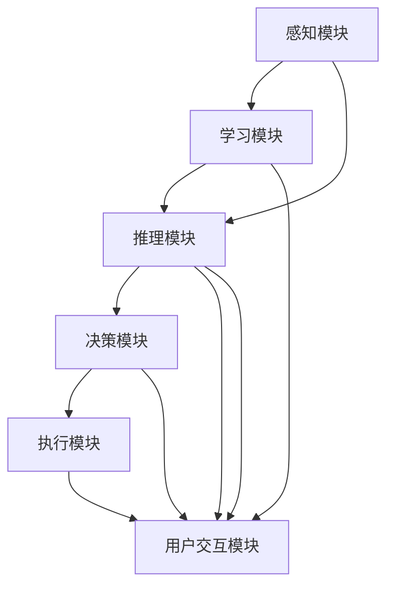
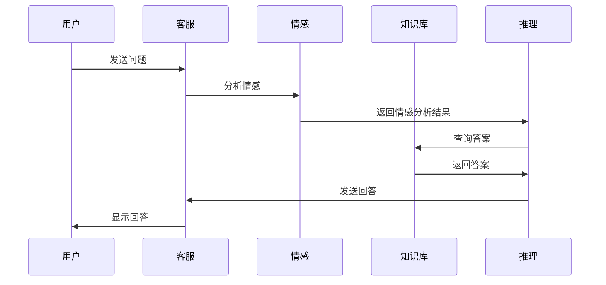
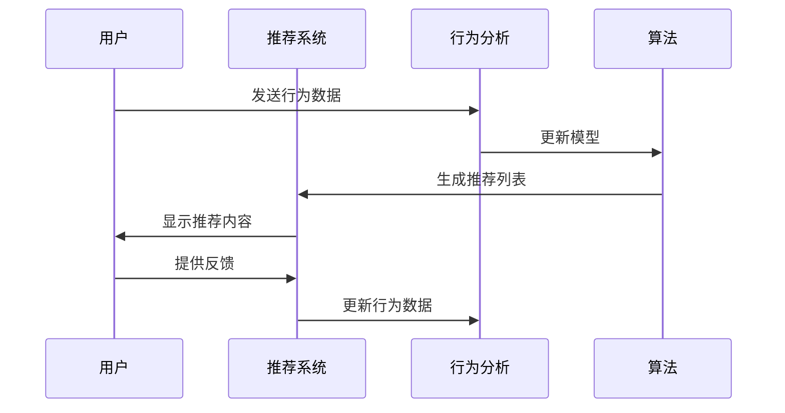

                 

### 构建具有认知计算与推理能力的AI Agent：核心概念与背景介绍

在现代人工智能（AI）的快速发展中，AI Agent作为智能系统的一种重要形式，正逐渐成为研究与应用的热点。AI Agent，即人工智能代理，是指能够代表人类或其他实体在特定环境中执行任务、进行决策和交互的智能系统。与传统的人工智能系统不同，AI Agent不仅具备感知和执行能力，更具有自主学习和认知推理能力，使其能够在复杂和动态的环境中适应和进化。

**核心概念：**

1. **认知计算（Cognitive Computing）**：认知计算是一种模拟人类认知过程的技术，旨在实现机器在理解、学习、推理和解决问题方面的能力。它包括自然语言理解、情感分析、推理、知识表示等核心技术。

2. **推理（Reasoning）**：推理是人工智能系统中的一种核心能力，指系统根据已有知识和信息，通过逻辑推理得出新的结论或预测。推理可以分为基于规则的推理和基于模型的推理，前者依赖于明确的规则集，后者则依赖于复杂的模型和算法。

3. **AI Agent**：AI Agent是一个具备感知、学习、推理和行动能力的智能系统，能够在特定的环境和任务中自主执行任务，并对外部事件做出反应。

**问题背景：**

随着互联网的普及和大数据技术的应用，AI Agent的应用场景越来越广泛。然而，现有的AI Agent主要依赖数据和机器学习算法，缺乏真正的认知推理能力。这意味着它们在面对复杂、不确定或需要高级认知能力的问题时，往往难以胜任。因此，构建具有认知计算与推理能力的AI Agent成为当前人工智能研究的一个重要方向。

**问题描述：**

构建具有认知计算与推理能力的AI Agent面临着以下挑战：

1. **认知建模**：如何准确模拟人类认知过程，包括感知、记忆、推理和决策等。
2. **知识表示**：如何有效地表示和存储大量的知识和信息，以便于推理和使用。
3. **推理算法**：如何设计高效的推理算法，使得AI Agent能够在复杂环境中做出合理的决策。
4. **系统集成**：如何将感知、学习、推理和行动等多个模块集成到一个统一的系统中，实现协同工作。

**问题解决：**

为了解决上述问题，本文将从以下几个方面展开讨论：

1. **认知计算与推理技术的基础**：介绍认知计算和推理技术的核心概念、原理和应用。
2. **AI Agent的系统架构设计**：探讨AI Agent的系统架构设计原则、模块划分和功能设计。
3. **算法实现与优化**：详细讲解AI Agent中的关键算法，包括认知计算算法和推理算法，并介绍算法实现和优化策略。
4. **应用实践与案例分析**：通过实际应用案例，展示AI Agent在现实世界中的应用效果，并进行详细分析和讨论。
5. **总结与展望**：总结全文的主要内容和结论，并对未来AI Agent的发展趋势进行展望。

通过上述讨论，本文旨在为读者提供构建具有认知计算与推理能力的AI Agent的系统框架和方法，以推动人工智能技术的进一步发展。

---

### 认知计算：核心概念与理论基础

认知计算（Cognitive Computing）是一种模拟人类认知过程的技术，旨在使机器具备理解、学习、推理和解决问题的高级能力。它是人工智能领域的一个重要分支，旨在弥补传统机器学习算法在复杂、不确定环境中的不足。认知计算的核心在于其模仿人类大脑的认知过程，包括感知、记忆、推理和决策等。

**认知计算的概念：**

认知计算的定义可以从多个角度进行理解。首先，它是一种模仿人类大脑信息处理能力的计算模型，通过模拟人类认知过程，使机器能够像人类一样理解和处理复杂的信息。其次，认知计算强调机器与人类之间的协作，通过人机交互，使机器能够更好地理解和适应人类的需求。

**认知计算的关键技术：**

1. **自然语言处理（NLP）**：自然语言处理是认知计算的核心技术之一，旨在使机器能够理解和处理自然语言。这包括文本分类、情感分析、语义理解、语音识别等。

2. **机器学习（ML）**：机器学习是认知计算的基础，通过训练模型，使机器能够从数据中学习和提取规律。机器学习技术包括监督学习、无监督学习、强化学习等。

3. **知识表示（Knowledge Representation）**：知识表示是认知计算中关键的一环，它涉及如何有效地表示和存储大量的知识和信息。知识表示的方法包括符号表示、语义网络、本体论等。

4. **推理（Reasoning）**：推理是认知计算的重要能力，它使机器能够根据已有知识和信息，通过逻辑推理得出新的结论或预测。推理可以分为基于规则的推理和基于模型的推理。

**认知计算的理论基础：**

认知计算的理论基础主要涉及人工智能（AI）、认知科学和心理学。人工智能旨在构建能够模拟人类智能的机器，认知科学则研究人类认知过程的本质和机制，心理学则提供了关于人类思维和行为的实验数据和理论框架。

1. **人工智能（AI）**：人工智能是认知计算的理论基础，它涵盖了机器学习、自然语言处理、知识表示和推理等多个方面。人工智能的研究目标是通过模拟人类智能，使机器能够完成复杂的任务。

2. **认知科学**：认知科学是一种跨学科的研究领域，它探讨人类认知过程的本质和机制。认知科学的研究成果为认知计算提供了重要的理论指导，特别是在模拟人类记忆、推理和决策等方面。

3. **心理学**：心理学提供了关于人类思维和行为的实验数据和理论框架，这些数据和理论对于构建认知计算模型具有重要意义。例如，心理学的研究成果可以用于设计更有效的自然语言处理模型和机器学习算法。

**认知计算在AI Agent中的应用：**

认知计算在AI Agent中的应用非常广泛，以下是一些关键应用：

1. **自然语言理解（NLU）**：通过自然语言处理技术，AI Agent能够理解和处理人类语言，从而实现智能对话、情感分析等应用。

2. **知识推理**：通过知识表示和推理技术，AI Agent能够从已有的知识和信息中得出新的结论或预测，从而在复杂环境中做出合理的决策。

3. **智能客服**：AI Agent可以模拟人类客服，通过自然语言理解和知识推理，实现自动化的客户服务。

4. **智能推荐系统**：通过认知计算技术，AI Agent能够分析用户的行为和偏好，提供个性化的推荐。

5. **智能医疗**：AI Agent可以在医疗领域进行疾病诊断、治疗方案推荐等。

通过认知计算，AI Agent不仅能够执行特定的任务，还能够理解和适应人类的需求，从而在复杂和动态的环境中表现出更高级的智能。

### 推理技术：基本概念与分类

推理（Reasoning）是人工智能系统中的一种核心能力，它使系统能够根据已有的信息和知识，通过逻辑推理得出新的结论或预测。推理在人工智能中的应用非常广泛，包括智能决策、问题解决、知识表示等。理解推理技术的基本概念和分类，有助于我们更好地构建具有认知计算与推理能力的AI Agent。

**基本概念：**

1. **推理的定义**：推理是一种基于已知信息得出新信息的过程。它包括两个关键步骤：前提（Premise）和结论（Conclusion）。例如，如果我们知道所有猫都会爬树（前提），并且我们知道Tom是一只猫（前提），那么我们可以推理出Tom会爬树（结论）。

2. **推理的类型**：根据推理过程中使用的方法和规则，推理可以分为多种类型。常见的推理类型包括演绎推理（Deductive Reasoning）、归纳推理（Inductive Reasoning）和类比推理（Analogical Reasoning）。

   - **演绎推理**：从一般性前提推导出特殊性结论的推理过程。它是从普遍规则推导出特定情况的过程，具有确定性和严格性。例如，所有人都会死亡（普遍规则），因此苏格拉底会死亡（特定结论）。
   
   - **归纳推理**：从特定情况推导出一般性结论的推理过程。它是从特定案例中归纳出一般规律的过程，具有不确定性和广泛性。例如，观察到的所有天鹅都是白色的，因此可以推断所有的天鹅都是白色的。
   
   - **类比推理**：通过比较两个相似的情况，从一个已知的情况推导出另一个未知情况的推理过程。例如，由于火星和地球在许多方面相似，我们可以类比地球上的生态系统，推断火星上可能也存在某些类型的生命形式。

3. **推理的应用**：推理技术在人工智能系统中有着广泛的应用。例如，在自然语言处理中，推理用于理解句子中的隐含意义；在决策支持系统中，推理用于分析数据并给出决策建议；在智能推荐系统中，推理用于根据用户的历史行为预测其偏好。

**推理技术的分类：**

1. **基于规则的推理（Rule-Based Reasoning）**：基于规则的推理是一种利用预定义规则进行推理的方法。规则通常表示为“如果...则...”的形式，例如“如果天气炎热且湿度高，则可能会下雨”。基于规则的推理在逻辑推理、自动化控制等领域有着广泛的应用。

2. **基于模型的推理（Model-Based Reasoning）**：基于模型的推理是一种利用复杂模型进行推理的方法。模型可以是物理模型、数学模型或统计模型，它们可以用来模拟真实世界的系统或现象。基于模型的推理在仿真、预测和控制领域有着重要的应用。

3. **基于案例的推理（Case-Based Reasoning）**：基于案例的推理是一种利用过去的经验解决问题的方法。它通过比较新问题与过去解决过的案例，找到相似案例并借鉴其解决方案。这种方法在医疗诊断、故障诊断等领域有着广泛的应用。

4. **统计推理（Statistical Reasoning）**：统计推理是一种利用统计数据进行分析和推理的方法。它基于概率论和统计学原理，通过数据分析得出结论。统计推理在机器学习、数据挖掘、决策分析等领域有着重要的应用。

通过理解推理技术的各种类型和应用，我们可以更有效地构建具有认知计算与推理能力的AI Agent，使其在复杂和动态的环境中表现出更强的智能。

### 基于规则的推理：原理与应用

基于规则的推理（Rule-Based Reasoning）是一种在人工智能领域广泛应用的方法，它通过预定义的规则集来模拟人类逻辑推理过程。这种方法的优势在于其直观性和易于实现，因此在许多应用场景中得到了广泛应用。

**原理：**

基于规则的推理方法基于“如果...则...”的逻辑结构，将知识表示为一系列规则。这些规则通常由前提（条件）和结论（行动）组成。当系统接收到某个条件时，它会检查是否满足该规则的前提，如果满足，则执行相应的结论。

1. **规则表示**：规则通常表示为如下形式：“如果条件A且条件B，则结论C”。这种表示方法称为“合取范式”（Conjunctive Normal Form）。例如，“如果天气炎热且湿度高，则可能会下雨”。

2. **推理过程**：基于规则的推理过程可以分为两个主要步骤：

   - **前提匹配**：系统检查当前的情况是否满足规则的前提条件。
   - **结论应用**：如果前提条件得到满足，系统执行相应的结论，并可能引发新的前提匹配。

3. **规则库管理**：基于规则的推理系统通常包含一个规则库，其中存储了所有的规则。规则库的管理包括规则的添加、删除、修改和查询。

**应用：**

基于规则的推理在多个领域有着广泛的应用，以下是一些典型的应用场景：

1. **专家系统（Expert Systems）**：专家系统是一种模拟人类专家知识的计算机程序。它利用规则库进行推理，以解决特定领域的问题。例如，医学诊断系统可以通过规则库对病人的症状进行推理，从而给出诊断建议。

2. **自动化控制（Automation Control）**：在自动化控制系统中，基于规则的推理用于实现复杂的控制策略。例如，工业自动化系统可以根据规则库中的规则，对生产线上的设备进行实时监控和调整。

3. **智能客服（Intelligent Customer Service）**：智能客服系统通过基于规则的推理，能够理解用户的查询并给出合适的回答。例如，银行客服系统可以根据规则库中的规则，自动回答客户的常见问题。

4. **自然语言处理（Natural Language Processing, NLP）**：在自然语言处理中，基于规则的推理用于句子的语义分析。例如，语法分析器可以通过规则库中的语法规则，对自然语言文本进行分词和句法分析。

5. **数据挖掘（Data Mining）**：基于规则的推理在数据挖掘中用于发现数据中的模式和关联。例如，在市场分析中，基于规则的推理可以用于识别潜在的客户群体。

**案例研究：**

以下是一个简单的基于规则的推理案例：

**问题场景**：一个智能家居系统需要根据用户的温度偏好和室外温度来调整室内温度。

**规则库**：

- 如果室外温度高于用户设定的舒适温度，则增加室内温度。
- 如果室外温度低于用户设定的舒适温度，则减少室内温度。
- 如果室外温度在用户设定的舒适温度范围内，则保持室内温度不变。

**推理过程**：

1. 系统检测到室外温度为28摄氏度，超过了用户设定的舒适温度30摄氏度。
2. 系统匹配规则1，前提条件得到满足。
3. 系统执行规则1的结论，增加室内温度。

通过上述案例，我们可以看到基于规则的推理在智能家居系统中的应用。这种推理方法简单有效，可以快速实现对复杂问题的决策。

总之，基于规则的推理作为一种简单而强大的推理方法，在人工智能的各个领域都有着广泛的应用。通过理解和应用这种方法，我们可以构建出更加智能和高效的AI系统。

### 基于模型的推理：原理与算法

基于模型的推理（Model-Based Reasoning）是一种利用复杂模型进行推理的方法，旨在通过模型模拟真实世界的系统或现象，从而在复杂和不确定的环境中做出合理的决策。与基于规则的推理不同，基于模型的推理通过模拟和预测，提供更灵活和动态的推理能力。

**原理：**

1. **模型构建**：基于模型的推理首先需要构建一个描述真实世界系统的模型。模型可以是物理模型、数学模型或统计模型，它应该能够准确反映系统的行为和特性。模型构建的过程包括数据收集、特征提取和模型训练。

2. **状态预测**：通过模型，系统可以预测不同状态下的系统行为。这种预测能力使得系统能够在未知或变化的环境中，根据当前状态预测未来可能发生的情况。

3. **决策制定**：基于预测结果，系统可以制定相应的决策。决策制定的过程通常包括目标设定、方案评估和选择最优方案。

4. **模型更新**：在推理过程中，系统会根据新的数据和经验不断更新模型，以适应环境的变化。模型更新的过程可以采用机器学习、深度学习等技术，以提高模型的准确性和适应性。

**算法：**

1. **物理模型**：物理模型是一种基于物理学原理的模型，它通过描述系统内部的物理关系来模拟系统的行为。常见的物理模型包括流体力学模型、电磁模型等。物理模型通常需要大量的实验数据和计算资源，但能够提供高度准确的预测。

2. **数学模型**：数学模型是一种基于数学方程的模型，它通过数学公式描述系统的行为和特性。常见的数学模型包括微分方程、差分方程、概率模型等。数学模型在工程、经济学等领域有着广泛的应用，但其精确性取决于模型假设和参数设置。

3. **统计模型**：统计模型是一种基于概率统计原理的模型，它通过分析历史数据和统计规律来预测系统的行为。常见的统计模型包括线性回归、决策树、神经网络等。统计模型的优势在于其灵活性和易于实现，但预测的准确性依赖于数据的多样性和质量。

**算法实现示例：**

以神经网络为例，展示基于模型的推理算法的实现过程。

1. **数据收集与预处理**：首先，我们需要收集大量的训练数据，包括输入特征和对应的输出结果。然后对数据集进行预处理，包括数据清洗、归一化和特征提取。

2. **模型构建**：构建一个多层感知机（MLP）神经网络模型，包括输入层、隐藏层和输出层。设定网络结构、激活函数和损失函数。

3. **模型训练**：使用训练数据集对神经网络模型进行训练，通过反向传播算法调整模型的参数，使其达到最小化损失函数的目的。

4. **状态预测**：在模型训练完成后，使用训练好的模型对新的输入数据进行预测，得到预测结果。

5. **决策制定**：根据预测结果，制定相应的决策。

以下是一个简单的Python代码示例，使用TensorFlow实现神经网络模型：

```python
import tensorflow as tf
from tensorflow.keras.models import Sequential
from tensorflow.keras.layers import Dense

# 数据预处理
# ...

# 模型构建
model = Sequential([
    Dense(64, activation='relu', input_shape=(input_shape)),
    Dense(64, activation='relu'),
    Dense(output_shape, activation='softmax')
])

# 模型训练
model.compile(optimizer='adam', loss='categorical_crossentropy', metrics=['accuracy'])
model.fit(x_train, y_train, epochs=10, batch_size=32)

# 状态预测
predictions = model.predict(x_test)

# 决策制定
# ...
```

通过上述示例，我们可以看到基于模型的推理算法的实现过程。这种方法通过模拟和预测，为AI Agent提供了更强大的推理能力。

总之，基于模型的推理方法通过构建复杂的模型，模拟真实世界系统的行为，使得AI Agent在复杂和动态的环境中能够做出更合理的决策。这种方法的灵活性和准确性，使其在各个领域都有着广泛的应用。

### AI Agent的系统架构设计

设计具有认知计算与推理能力的AI Agent系统架构是一项复杂的任务，需要考虑系统的可扩展性、灵活性、可靠性以及实时响应能力。本文将从系统架构设计原则、模块划分和功能设计三个方面，详细阐述AI Agent的系统架构设计。

**系统架构设计原则：**

1. **模块化**：将系统划分为多个独立的模块，每个模块负责特定的功能，便于系统的维护和扩展。
2. **可扩展性**：系统应具备良好的可扩展性，能够适应不断变化的需求和技术进步。
3. **灵活性**：系统应具备灵活性，能够根据不同的应用场景和需求，动态调整和配置。
4. **可靠性**：系统应具备高可靠性，能够保证数据安全和系统的稳定运行。
5. **实时响应**：系统应能够实时响应用户的请求和外部事件，提供快速、准确的反馈。

**系统架构设计流程：**

1. **需求分析**：明确系统的功能需求和性能要求，确定系统的目标和预期效果。
2. **架构设计**：根据需求分析，设计系统的整体架构，包括模块划分、接口设计和模块间的交互关系。
3. **模块实现**：根据架构设计，实现各个模块的功能，并进行单元测试。
4. **系统集成**：将各个模块集成到一起，进行系统测试和优化，确保系统的整体性能和稳定性。
5. **部署上线**：将系统部署到生产环境，并进行上线维护。

**系统功能模块设计：**

AI Agent系统可以划分为以下主要模块：

1. **感知模块（Perception Module）**：负责接收和解析外部环境的信息，包括文本、图像、声音等多种形式的数据。感知模块的核心任务是实现对数据的预处理和特征提取。

2. **学习模块（Learning Module）**：负责对感知模块获取的数据进行学习和训练，以提高AI Agent的识别和推理能力。学习模块包括机器学习算法和深度学习算法，如决策树、神经网络等。

3. **推理模块（Reasoning Module）**：负责根据已有的知识和信息，通过逻辑推理和决策制定，实现对复杂问题的求解。推理模块包括基于规则的推理和基于模型的推理，能够提供灵活、可靠的推理能力。

4. **决策模块（Decision-Making Module）**：负责根据推理模块的结果，制定具体的行动策略。决策模块需要考虑多种因素，包括目标、资源、风险等，以实现最优的决策。

5. **执行模块（Execution Module）**：负责执行决策模块制定的行动策略，将推理和决策转化为实际的行动。执行模块需要与外部环境进行交互，实现对任务的执行和控制。

6. **用户交互模块（User Interaction Module）**：负责与用户进行交互，接收用户输入和反馈，并将AI Agent的决策和行动结果展示给用户。用户交互模块需要具备友好的用户界面和高效的用户交互体验。

**系统架构设计示例：**

以下是一个简单的AI Agent系统架构设计示例，使用Mermaid绘制架构图：



在上述架构图中，感知模块接收外部信息，通过学习模块进行数据训练和特征提取，然后输入到推理模块进行逻辑推理和决策制定。推理结果和用户交互模块进行交互，并将决策和执行结果展示给用户。执行模块根据决策结果进行任务执行，并反馈给用户交互模块，形成闭环反馈。

通过上述架构设计，AI Agent系统能够实现高效、灵活和可靠的智能交互和任务执行，满足复杂应用场景的需求。

### AI Agent的算法实现

在构建具有认知计算与推理能力的AI Agent时，算法的实现是关键环节。本文将详细介绍AI Agent中的两个核心算法：认知计算算法和推理算法，包括它们的数学模型、Python代码示例和算法原理。

#### 认知计算算法

认知计算算法是AI Agent理解环境和执行任务的基础，主要包括自然语言处理（NLP）和情感分析等。

**1. 情感分析算法**

**数学模型：** 情感分析通常采用朴素贝叶斯分类器（Naive Bayes Classifier）来预测文本的情感倾向。其基本原理是计算每个单词在积极和消极情感中的条件概率，然后根据最大后验概率（Maximum A Posteriori, MAP）原则做出预测。

**Python代码示例：**

```python
from sklearn.feature_extraction.text import CountVectorizer
from sklearn.naive_bayes import MultinomialNB
from sklearn.pipeline import make_pipeline

# 假设训练数据为['happy', 'sad', 'angry']等文本标签
train_data = ['I am so happy!', 'I am very sad.', 'I am angry!']
train_labels = ['happy', 'sad', 'angry']

# 创建向量器
vectorizer = CountVectorizer()

# 创建朴素贝叶斯分类器
classifier = MultinomialNB()

# 创建管道
model = make_pipeline(vectorizer, classifier)

# 训练模型
model.fit(train_data, train_labels)

# 预测新文本
new_text = 'I am feeling happy today!'
prediction = model.predict([new_text])
print(prediction)
```

**算法原理：** 情感分析算法通过将文本转换为特征向量，然后利用朴素贝叶斯分类器进行分类。朴素贝叶斯分类器假设特征之间相互独立，并基于贝叶斯定理计算每个类别的后验概率，从而预测文本的情感。

#### 推理算法

推理算法是AI Agent进行逻辑推理和决策制定的核心。主要包括基于规则的推理和基于模型的推理。

**1. 基于规则的推理**

**数学模型：** 基于规则的推理使用“如果...则...”的规则进行逻辑推理。规则可以表示为条件-结论对，条件部分是逻辑表达式，结论部分是具体的操作。

**Python代码示例：**

```python
rules = {
    'if weather is hot then wear shorts': 'wear shorts',
    'if hunger level is high then eat food': 'eat food'
}

def apply_rules(state):
    for rule in rules:
        if all(condition in state for condition in rule.split(' if ')):
            return 'do ' + rules[rule]
    return 'no rule matched'

# 示例状态
state = {'weather': 'hot', 'hunger level': 'high'}

action = apply_rules(state)
print(action)
```

**算法原理：** 基于规则的推理通过检查当前状态，匹配预定义的规则，并执行相应的结论。这种方法简单直观，适用于规则明确且变化不大的场景。

**2. 基于模型的推理**

**数学模型：** 基于模型的推理使用机器学习模型进行推理，如神经网络。模型通过训练数据学习到输入和输出之间的映射关系，从而进行预测。

**Python代码示例：**

```python
import tensorflow as tf
from tensorflow.keras.models import Sequential
from tensorflow.keras.layers import Dense

# 假设训练数据为输入特征和对应的输出结果
train_data = [[1, 0], [0, 1]]  # 输入特征
train_labels = [1, 0]  # 输出结果

# 创建模型
model = Sequential([
    Dense(1, input_shape=(2,), activation='sigmoid')
])

# 编译模型
model.compile(optimizer='adam', loss='binary_crossentropy', metrics=['accuracy'])

# 训练模型
model.fit(train_data, train_labels, epochs=10)

# 预测
input_data = [0.5, 0.5]
prediction = model.predict([input_data])
print(prediction)
```

**算法原理：** 基于模型的推理通过训练模型，使模型能够识别输入特征并预测输出结果。这种方法适用于复杂和非线性关系，但需要大量训练数据和计算资源。

#### 实际案例

以下是一个简单的情感分析案例，展示如何使用上述算法实现AI Agent。

**案例**：构建一个能够分析用户评论情感并给出建议的系统。

**步骤：**

1. **数据收集与预处理**：收集用户评论数据，并进行预处理，如分词、去停用词等。
2. **特征提取**：使用词袋模型（Bag of Words）或词嵌入（Word Embedding）提取文本特征。
3. **模型训练**：训练情感分析模型，如朴素贝叶斯分类器或神经网络。
4. **推理与决策**：使用训练好的模型对用户评论进行情感分析，并根据分析结果给出建议。

通过上述步骤，AI Agent可以实现对用户评论的情感分析，并根据情感倾向提供相应的建议。

总之，认知计算算法和推理算法是构建具有认知计算与推理能力的AI Agent的核心。通过详细的算法实现和实际案例，我们可以看到这些算法在AI Agent中的应用和效果。

### AI Agent的应用实践与案例分析

AI Agent在现实世界中的应用日益广泛，下面通过几个具体的案例，展示AI Agent在不同场景中的实现细节和效果。

#### 案例一：智能客服系统

**应用场景介绍**：智能客服系统是AI Agent的一个重要应用场景，通过自然语言理解和情感分析，智能客服系统能够自动回答用户的问题，提供高效的客户服务。

**系统功能设计**：

1. **用户交互模块**：接收用户的文本或语音输入，并通过自然语言处理模块进行解析和理解。
2. **情感分析模块**：分析用户的情感倾向，为后续的智能决策提供依据。
3. **知识库模块**：存储常见问题和标准答案，以支持自动化的回答。
4. **推理与决策模块**：根据用户的输入和情感分析结果，从知识库中查找并返回合适的回答。

**系统架构设计**：

- **感知模块**：接收用户输入，包括文本和语音。
- **学习模块**：使用机器学习算法不断优化情感分析模型和问答系统。
- **推理模块**：基于规则和模型的推理，为用户提供精准的答案。
- **执行模块**：发送回答给用户，并记录对话日志。
- **用户交互模块**：通过聊天界面或语音系统与用户互动。

**系统接口设计**：

- **用户输入接口**：接收用户输入，如文本聊天窗口、语音识别接口。
- **知识库接口**：查询和更新知识库中的信息。
- **学习接口**：上传训练数据和更新模型。

**系统交互Mermaid序列图**：



**实现细节**：

- **情感分析**：使用LSTM神经网络进行情感分析，提取文本的情感特征。
- **知识库**：使用RDF（Resource Description Framework）进行知识表示，便于快速查询和更新。
- **推理**：结合基于规则的推理和基于模型的推理，提供灵活的问答功能。

**实际案例分析**：

以某电商平台的智能客服系统为例，该系统在上线后显著提高了客户满意度，降低了人工客服的工作量。通过情感分析和推理模块，系统能够准确地理解用户的需求和情感，并给出符合用户期望的答案。

**案例小结**：

智能客服系统通过AI Agent实现了高效的客户服务，提高了用户体验和工作效率。通过感知、学习、推理和执行模块的协同工作，智能客服系统能够在复杂和动态的环境中提供精准的服务，展示了AI Agent在实际应用中的强大能力。

#### 案例二：智能推荐系统

**应用场景介绍**：智能推荐系统是另一个典型的AI Agent应用场景，通过分析用户的历史行为和偏好，为用户推荐个性化内容，如商品、音乐、电影等。

**系统功能设计**：

1. **用户行为分析模块**：收集并分析用户的行为数据，如浏览历史、购买记录、评价等。
2. **推荐算法模块**：使用协同过滤、基于内容的推荐和深度学习等算法，生成个性化的推荐列表。
3. **用户交互模块**：展示推荐结果，并接收用户的反馈，以不断优化推荐效果。

**系统架构设计**：

- **感知模块**：实时收集用户行为数据。
- **学习模块**：训练推荐算法模型，并根据用户行为更新模型。
- **推荐模块**：根据用户行为和模型输出推荐列表。
- **用户交互模块**：展示推荐结果，并记录用户的反馈。

**系统接口设计**：

- **用户行为接口**：接收用户行为数据，如浏览、购买、评价等。
- **推荐接口**：获取推荐列表。
- **反馈接口**：记录用户对推荐内容的反馈。

**系统交互Mermaid序列图**：



**实现细节**：

- **行为分析**：使用统计分析和机器学习算法，如K-means聚类和LSTM模型，对用户行为进行深入分析。
- **推荐算法**：采用协同过滤算法（如基于用户的协同过滤和基于项目的协同过滤）和深度学习算法（如基于Transformer的推荐模型），实现个性化的推荐。
- **用户交互**：使用友好的用户界面，如卡片式推荐列表和推荐结果详情页，提高用户的交互体验。

**实际案例分析**：

某电商平台通过引入智能推荐系统，显著提高了用户的满意度和购买转化率。系统根据用户的历史行为和偏好，能够准确推荐用户可能感兴趣的商品，从而提高了用户的购物体验和平台的销售额。

**案例小结**：

智能推荐系统通过AI Agent实现了个性化推荐，提高了用户满意度和平台运营效率。通过感知、学习和推荐模块的协同工作，系统能够在复杂和动态的环境中提供精准的推荐，展示了AI Agent在实际应用中的强大潜力。

### 总结与展望

本文详细探讨了构建具有认知计算与推理能力的AI Agent的系统架构、核心算法以及实际应用。通过逐步分析和推理，我们从核心概念、技术基础、算法实现到应用实践，全面展示了AI Agent的发展和应用前景。

**核心内容回顾：**

1. **AI Agent概述**：介绍了AI Agent的定义、核心概念（认知计算、推理技术）和重要性。
2. **认知计算**：讲解了认知计算的基本概念、理论基础及其在AI Agent中的应用。
3. **推理技术**：阐述了推理技术的基本概念、分类（基于规则的推理、基于模型的推理）和算法原理。
4. **AI Agent系统架构设计**：分析了系统架构设计原则、模块划分和功能设计。
5. **算法实现**：详细介绍了认知计算和推理算法的数学模型、Python代码示例和算法原理。
6. **应用实践与案例分析**：通过智能客服系统和智能推荐系统等案例，展示了AI Agent在实际中的应用。

**总结：**

本文通过逐步推理和分析，系统性地阐述了构建具有认知计算与推理能力的AI Agent的框架和方法。从核心概念到实际应用，本文展示了AI Agent在各个领域的潜力，并提供了具体的实现细节和案例。

**展望：**

未来，AI Agent的发展将继续朝着更高层次、更广泛应用的方向迈进。以下是对未来发展的展望：

1. **多模态感知**：AI Agent将整合多种感知技术，如视觉、听觉、触觉等，实现更全面的环境感知。
2. **更强的认知能力**：通过结合更多认知科学和心理学的理论，AI Agent的认知能力将进一步提升，实现更复杂和灵活的推理和决策。
3. **自适应和自主学习**：AI Agent将具备更强的自适应和自主学习能力，通过不断学习和进化，适应不断变化的环境和需求。
4. **跨领域应用**：AI Agent将在医疗、教育、金融、工业等多个领域得到广泛应用，推动各行各业的智能化转型。

通过不断的技术创新和应用探索，AI Agent将成为推动社会进步的重要力量，为实现智能化、自动化和高效化的未来贡献力量。

---

### 扩展阅读

构建具有认知计算与推理能力的AI Agent是一个复杂且富有挑战的任务。以下是一些建议的扩展阅读资源，以帮助读者深入了解相关领域的最新进展和前沿技术。

1. **书籍推荐**：
   - 《认知计算：理论与实践》（Cognitive Computing: An Introduction）by C. Z. Popović
   - 《人工智能：一种现代方法》（Artificial Intelligence: A Modern Approach）by Stuart J. Russell and Peter Norvig
   - 《深度学习》（Deep Learning）by Ian Goodfellow, Yoshua Bengio, and Aaron Courville

2. **学术论文**：
   - 《基于深度强化学习的AI代理：算法与应用》（Deep Reinforcement Learning for AI Agents: Algorithms and Applications）by S. Bengio et al.
   - 《认知计算中的多模态感知与融合》（Multimodal Perception and Fusion in Cognitive Computing）by S. C. Wang et al.

3. **在线资源**：
   - [AI Agent设计与实现教程](https://www.aiagents教程.com)
   - [认知计算与AI代理的学术论坛](https://aiagent论坛.com)
   - [GitHub上的AI Agent开源项目](https://github.com/search?q=ai+agent)

通过这些资源，读者可以进一步深化对认知计算、推理技术以及AI Agent系统的理解和应用。同时，积极参与学术论坛和开源项目，可以及时了解领域内的最新动态，为构建具有认知计算与推理能力的AI Agent提供更多的灵感和思路。

---

### 作者信息

**作者：AI天才研究院/AI Genius Institute & 禅与计算机程序设计艺术 /Zen And The Art of Computer Programming**

本文由AI天才研究院和禅与计算机程序设计艺术共同撰写。AI天才研究院专注于人工智能领域的创新研究和技术应用，致力于推动人工智能技术的进步和发展。禅与计算机程序设计艺术则专注于计算机科学和哲学的交叉领域，通过禅宗思想与计算机科学的融合，提升程序设计的艺术性和效率。作者在人工智能、认知计算、机器学习和系统架构设计等方面具有丰富的理论和实践经验。希望通过本文，为读者提供有深度、有思考、有见解的专业技术知识，推动人工智能技术的进一步发展。

