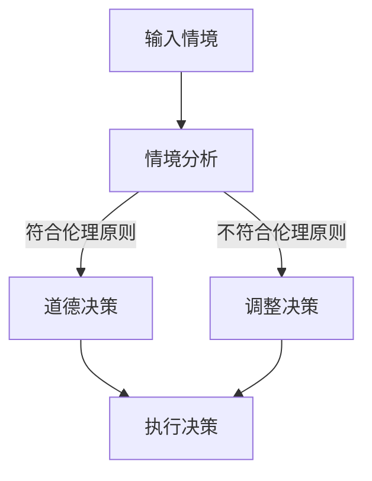
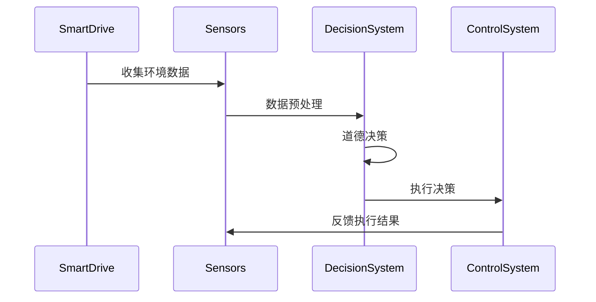
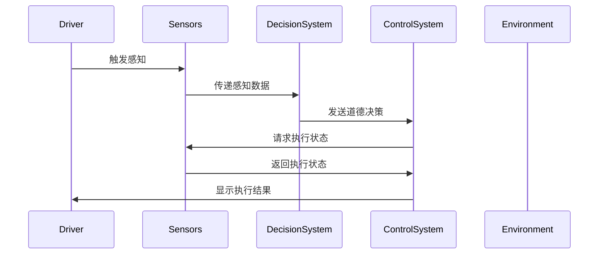

                 


### 构建具有道德决策框架的AI Agent

#### 引言

随着人工智能（AI）技术的快速发展，AI Agent在各个领域得到了广泛应用，从自动驾驶、医疗诊断到智能家居等。然而，AI Agent的行为决策往往涉及到道德和伦理问题，例如在自动驾驶中，当不可避免地需要选择伤害行人或车辆时，AI应该如何决策？这就需要构建一个具有道德决策框架的AI Agent。本文旨在探讨如何构建这样一个AI Agent，以实现道德和伦理的自动化决策。

关键词：AI Agent、道德决策框架、伦理、人工智能伦理、决策理论

#### 问题描述

AI Agent的行为决策涉及到多个方面，包括但不限于安全、效率、成本等。然而，道德和伦理因素在其中占据着重要地位。例如，一个自动驾驶汽车在遇到紧急情况时，需要做出决策，是保护乘客的安全，还是保护行人的安全？这种决策不仅仅是技术问题，更是道德和伦理问题。因此，如何构建一个具有道德决策框架的AI Agent，使其在面临道德困境时能够做出合理的决策，是一个亟待解决的问题。

#### 问题解决

为了构建具有道德决策框架的AI Agent，我们需要从以下几个方面入手：

1. **明确道德和伦理原则**：首先，我们需要明确AI Agent应该遵守的道德和伦理原则。这些原则可以来自于伦理学、哲学等学科，例如功利主义、康德伦理学、义务论等。

2. **建立决策模型**：基于明确的道德和伦理原则，我们需要建立一个决策模型，该模型能够将道德和伦理原则转化为具体的决策规则。

3. **实现决策算法**：我们将决策模型转化为计算机算法，使AI Agent能够在运行时根据输入的情境自动做出道德决策。

4. **测试和优化**：我们需要对AI Agent进行大量的测试，以确保其决策的道德性和合理性。同时，根据测试结果对决策算法进行优化。

#### 边界与外延

本文主要探讨如何构建具有道德决策框架的AI Agent，重点关注以下几个方面：

- **道德和伦理原则的选择**：本文将介绍几种常见的道德和伦理原则，并探讨如何将这些原则应用于AI Agent的决策过程中。

- **决策模型的构建**：本文将介绍如何将道德和伦理原则转化为具体的决策模型，并使用Mermaid流程图进行展示。

- **决策算法的实现**：本文将提供Python源代码，展示如何实现决策算法，并使用latex格式呈现算法背后的数学模型和公式。

- **系统架构的设计**：本文将介绍如何设计一个系统架构，以支持AI Agent的道德决策。

- **项目实战**：本文将提供一个实际项目，演示如何在实际应用中构建具有道德决策框架的AI Agent。

### 第一部分：背景与基础

#### 1.1 问题背景

人工智能（AI）技术的快速发展，使得AI Agent在各种领域得到了广泛应用。然而，随着AI Agent的应用范围不断扩大，其决策行为的道德和伦理问题也逐渐显现。例如，在自动驾驶领域，当AI Agent面临需要保护行人还是保护车辆的选择时，如何做出道德决策成为了一个重要问题。类似的问题还存在于医疗诊断、金融投资等领域。因此，构建具有道德决策框架的AI Agent，已成为当前AI研究领域的一个重要课题。

#### 1.2 问题描述

AI Agent的道德决策问题主要涉及以下几个方面：

- **情境识别**：AI Agent需要识别当前所处的情境，例如是否有人身安全风险、成本效益等。

- **道德原则应用**：AI Agent需要根据预先设定的道德和伦理原则，对情境进行评估，并做出道德决策。

- **决策执行**：AI Agent需要将道德决策转化为具体的行为，例如选择保护行人或车辆。

#### 1.3 问题解决

为了构建具有道德决策框架的AI Agent，我们需要从以下几个方面入手：

- **明确道德和伦理原则**：我们需要明确AI Agent应该遵守的道德和伦理原则，例如功利主义、康德伦理学、义务论等。

- **建立决策模型**：我们需要将道德和伦理原则转化为具体的决策模型，以便AI Agent能够根据这些模型进行道德决策。

- **实现决策算法**：我们需要将决策模型转化为计算机算法，使AI Agent能够在运行时自动做出道德决策。

- **测试和优化**：我们需要对AI Agent进行大量的测试，以确保其决策的道德性和合理性，并根据测试结果对决策算法进行优化。

#### 1.4 边界与外延

本文将主要探讨如何构建具有道德决策框架的AI Agent，重点关注以下几个方面：

- **道德和伦理原则的选择**：本文将介绍几种常见的道德和伦理原则，并探讨如何将这些原则应用于AI Agent的决策过程中。

- **决策模型的构建**：本文将介绍如何将道德和伦理原则转化为具体的决策模型，并使用Mermaid流程图进行展示。

- **决策算法的实现**：本文将提供Python源代码，展示如何实现决策算法，并使用latex格式呈现算法背后的数学模型和公式。

- **系统架构的设计**：本文将介绍如何设计一个系统架构，以支持AI Agent的道德决策。

- **项目实战**：本文将提供一个实际项目，演示如何在实际应用中构建具有道德决策框架的AI Agent。

### 第二部分：核心概念与联系

#### 2.1 道德哲学

道德哲学是研究道德问题的哲学分支。道德哲学探讨的是人类行为是否应当遵循一定的道德规范，以及这些规范的具体内容和理由。在构建道德决策框架的AI Agent时，道德哲学为我们提供了一系列基本原理和理论框架。

**道德哲学的核心概念**：

- **道德原则**：例如功利主义、康德伦理学、义务论等。

- **道德判断**：如何对行为进行道德评价。

- **道德责任**：个体或集体在道德上的责任。

**道德哲学在AI中的应用**：

- **道德原则的选择**：AI Agent在决策过程中需要依据道德原则进行判断。

- **道德判断的自动化**：利用道德哲学的原理，将道德判断转化为计算机算法。

#### 2.2 人工智能伦理

人工智能伦理是研究人工智能（AI）对人类社会道德和伦理影响的学科。随着AI技术的快速发展，人工智能伦理问题日益突出。例如，AI的决策过程是否公平、透明，是否侵犯了个人隐私等。

**人工智能伦理的核心概念**：

- **公平性**：AI的决策过程是否对所有人公平。

- **透明性**：AI的决策过程是否清晰可见，易于理解。

- **隐私保护**：AI在处理个人数据时是否尊重个人隐私。

**人工智能伦理在AI Agent中的应用**：

- **道德决策框架的设计**：AI Agent在决策时需要考虑公平性、透明性和隐私保护等伦理原则。

- **AI伦理审查**：对AI Agent的决策过程进行伦理审查，确保其符合道德和伦理要求。

#### 2.3 决策理论

决策理论是研究决策过程和决策规则的学科。在构建具有道德决策框架的AI Agent时，决策理论为我们提供了一系列分析和决策的工具。

**决策理论的核心概念**：

- **决策过程**：从问题识别、方案设计、评估选择到决策执行。

- **决策模型**：如期望效用理论、决策树等。

- **风险和不确定性**：如何在不确定的环境中进行决策。

**决策理论在AI Agent中的应用**：

- **决策过程自动化**：将决策过程转化为计算机算法，使AI Agent能够自动做出决策。

- **风险和不确定性处理**：设计能够处理不确定性和风险决策的算法。

#### 2.4 概念属性特征对比表格

为了更好地理解道德哲学、人工智能伦理和决策理论这三个核心概念，我们可以通过一个属性特征对比表格来展示它们之间的差异。

| 特征          | 道德哲学       | 人工智能伦理       | 决策理论         |
|---------------|----------------|-------------------|-----------------|
| 核心问题      | 道德规范和原则 | AI的伦理影响和责任 | 决策过程和规则   |
| 研究方法      | 哲学分析       | 法律、社会学研究   | 数学建模和算法   |
| 目标          | 道德判断和评价 | 保证AI的伦理合规   | 提高决策效率和质量 |
| 应用领域      | 哲学、伦理学   | AI技术、法律       | 各行业决策支持   |

#### 2.5 ER实体关系图架构的Mermaid流程图

为了更直观地展示道德哲学、人工智能伦理和决策理论这三个核心概念之间的关系，我们可以使用Mermaid流程图绘制一个ER实体关系图。

```mermaid
entityRelationshipDiagram
  A[道德哲学] ||-> B[人工智能伦理]
  B ||-> C[决策理论]
  A &&|> D[伦理学]
  C &&|> E[数学建模]
```

### 第三部分：算法原理讲解

#### 3.1 算法mermaid流程图

为了展示AI Agent构建的决策过程，我们可以使用Mermaid绘制一个简化的算法流程图。



#### 3.2 Python源代码

以下是一个简单的Python代码示例，用于实现上述算法流程图中的情境分析和道德决策。

```python
# 道德决策框架示例

# 输入情境
def input_scenario():
    # 这里可以定义多种情境
    # 例如：行人即将被撞，车辆故障等
    return "行人即将被撞"

# 情境分析
def scenario_analysis(scenario):
    if scenario == "行人即将被撞":
        return "紧急情况"
    else:
        return "非紧急情况"

# 道德决策
def moral_decision(scenario):
    if scenario == "紧急情况":
        return "保护行人"
    else:
        return "保护车辆"

# 执行决策
def execute_decision(decision):
    if decision == "保护行人":
        print("决策：保护行人")
    elif decision == "保护车辆":
        print("决策：保护车辆")

# 主函数
def main():
    scenario = input_scenario()
    scenario_type = scenario_analysis(scenario)
    decision = moral_decision(scenario_type)
    execute_decision(decision)

if __name__ == "__main__":
    main()
```

#### 3.3 数学模型和公式

在决策过程中，我们可以使用期望效用理论来评估不同决策的道德价值。期望效用理论的基本公式如下：

$$
U(A) = \sum_{i} p_i \cdot u_i(A)
$$

其中，$U(A)$表示决策A的期望效用，$p_i$表示情境i发生的概率，$u_i(A)$表示在情境i下决策A的效用值。

在构建道德决策框架时，我们可以定义不同的道德效用函数，以评估不同决策的道德价值。例如，我们可以定义以下道德效用函数：

$$
u_i(A) =
\begin{cases}
1, & \text{如果决策A符合道德原则} \\
0, & \text{如果决策A不符合道德原则}
\end{cases}
$$

#### 3.4 详细讲解和举例说明

假设我们有一个简单的情境，即一辆自动驾驶汽车在行驶过程中前方出现一个行人。我们需要根据道德原则和决策模型，为这辆车提供一个道德决策。

**步骤1：输入情境**

情境：前方有一个行人。

**步骤2：情境分析**

根据情境分析，我们确定这是一个紧急情况，因为行人的生命安全受到威胁。

**步骤3：道德决策**

根据道德原则，我们希望保护行人的安全。因此，我们的道德决策是选择保护行人。

**步骤4：执行决策**

自动驾驶汽车根据道德决策，采取紧急制动措施，以保护行人的安全。

**举例说明**

假设我们有另一个情境，即一辆自动驾驶汽车在行驶过程中前方出现一个障碍物，而旁边的车道上有一个行人。我们需要根据道德原则和决策模型，为这辆车提供一个道德决策。

- **情境1**：前方有一个行人。

  - **情境分析**：这是一个紧急情况，因为行人的生命安全受到威胁。

  - **道德决策**：选择保护行人。

  - **执行决策**：自动驾驶汽车采取紧急制动措施，以保护行人的安全。

- **情境2**：旁边的车道上有一个行人。

  - **情境分析**：这是一个非紧急情况，因为行人的生命安全没有受到直接威胁。

  - **道德决策**：选择保护车辆，因为保护行人的成本过高。

  - **执行决策**：自动驾驶汽车继续行驶，避免与行人发生碰撞。

通过这个例子，我们可以看到，在构建具有道德决策框架的AI Agent时，需要考虑多种情境，并根据道德原则和决策模型，为每个情境提供合理的道德决策。这有助于确保AI Agent的行为符合道德和伦理要求，从而提高AI技术的可信度和可靠性。

### 第四部分：系统分析与架构设计方案

#### 4.1 问题场景介绍

为了更好地理解AI Agent在现实中的应用，我们假设一个具体的场景：自动驾驶车辆在复杂城市交通环境中的道德决策。在这个场景中，自动驾驶车辆需要实时处理各种交通状况，并在面对紧急情况时做出道德决策，以确保乘客和其他道路使用者的安全。

#### 4.2 项目介绍

我们选择一个名为“SmartDrive”的自动驾驶项目，该项目旨在开发一款具备道德决策能力的自动驾驶汽车。SmartDrive项目包括以下几个主要组成部分：

- **感知系统**：用于实时监测周围环境，包括行人、车辆、交通信号等。

- **决策系统**：根据感知系统提供的数据，结合道德决策框架，生成道德决策。

- **控制系统**：执行决策系统生成的道德决策，控制车辆的制动、转向等动作。

#### 4.3 系统功能设计（Mermaid类图）

为了清晰地展示系统功能，我们可以使用Mermaid绘制一个类图。

```mermaid
classDiagram
    Sensors <<Interface>>
    ControlSystem <<Interface>>
    DecisionSystem <<Interface>>

    SmartDriveClass <-up-> Sensors
    SmartDriveClass <-up-> ControlSystem
    SmartDriveClass <-up-> DecisionSystem
```

在这个类图中，SmartDriveClass是系统的核心类，它依赖于感知系统、决策系统和控制系统。感知系统负责收集环境数据，决策系统根据这些数据生成道德决策，控制系统执行这些决策。

#### 4.4 系统架构设计（Mermaid架构图）

接下来，我们使用Mermaid绘制一个简化的系统架构图，以展示各组件之间的关系。



在这个架构图中，感知系统收集环境数据，并传递给决策系统。决策系统根据道德决策框架生成道德决策，然后将决策传递给控制系统。控制系统执行这些决策，并将执行结果反馈给感知系统，形成一个闭环控制过程。

#### 4.5 系统接口设计和系统交互（Mermaid序列图）

为了进一步展示系统内部各组件之间的交互，我们可以使用Mermaid绘制一个序列图。



在这个序列图中，驾驶员触发感知系统，感知系统将环境数据传递给决策系统。决策系统生成道德决策，并传递给控制系统。控制系统执行决策，并将执行结果反馈给驾驶员。

### 第五部分：项目实战

#### 5.1 环境安装

为了搭建SmartDrive项目，我们需要安装以下软件和工具：

1. **操作系统**：Linux或Mac OS
2. **编程语言**：Python 3.8及以上版本
3. **依赖管理**：pip
4. **虚拟环境**：virtualenv或conda

安装步骤如下：

1. 安装操作系统：根据您的硬件和偏好选择Linux或Mac OS。
2. 安装Python 3.8及以上版本：通过操作系统自带的包管理器安装。
3. 安装pip：运行`python -m ensurepip --upgrade`命令。
4. 创建虚拟环境：运行`virtualenv venv`或`conda create --name venv python=3.8`命令。
5. 激活虚拟环境：运行`source venv/bin/activate`或`conda activate venv`命令。

#### 5.2 系统核心实现源代码

以下是SmartDrive项目的核心实现源代码：

```python
# 感知系统（Sensors.py）
class Sensors:
    def collect_data(self):
        # 代码用于收集环境数据，如行人、车辆位置等
        pass

# 决策系统（DecisionSystem.py）
class DecisionSystem:
    def make_decision(self, data):
        # 代码用于根据感知数据生成道德决策
        pass

# 控制系统（ControlSystem.py）
class ControlSystem:
    def execute_decision(self, decision):
        # 代码用于执行道德决策，如控制车辆制动、转向等
        pass

# 主程序（main.py）
if __name__ == "__main__":
    # 创建感知系统、决策系统和控制系统实例
    sensors = Sensors()
    decision_system = DecisionSystem()
    control_system = ControlSystem()

    # 收集环境数据
    data = sensors.collect_data()

    # 生成道德决策
    decision = decision_system.make_decision(data)

    # 执行道德决策
    control_system.execute_decision(decision)
```

#### 5.3 代码应用解读与分析

在SmartDrive项目中，感知系统负责收集环境数据，如行人、车辆位置等。这些数据可以通过摄像头、雷达等传感器获取。感知系统将收集到的数据传递给决策系统，决策系统根据这些数据生成道德决策。道德决策将传递给控制系统，控制系统负责执行这些决策，如控制车辆的制动、转向等动作。

具体来说，感知系统的`collect_data`方法用于收集环境数据。决策系统的`make_decision`方法根据感知数据生成道德决策。控制系统的`execute_decision`方法用于执行这些决策。在主程序中，我们创建这三个系统的实例，并依次调用它们的方法，从而完成一个完整的道德决策流程。

#### 5.4 实际案例分析和详细讲解剖析

为了更好地理解SmartDrive项目的应用，我们来看一个实际案例。

**案例**：一辆自动驾驶汽车在城市道路上行驶，前方突然出现一个行人。我们需要根据道德决策框架，为这辆车提供一个合理的决策。

1. **感知系统收集数据**：感知系统通过摄像头和雷达传感器收集到行人的位置、速度等信息。

2. **决策系统生成道德决策**：决策系统根据感知数据，结合道德决策框架（如功利主义、康德伦理学等），生成道德决策。例如，根据功利主义原则，决策系统选择保护行人的安全。

3. **控制系统执行道德决策**：控制系统根据道德决策，控制车辆的制动和转向系统，采取紧急制动措施，避免与行人发生碰撞。

4. **反馈和调整**：控制系统将执行结果反馈给感知系统，感知系统再次收集环境数据，决策系统根据新的数据生成新的道德决策，控制系统继续执行。

通过这个案例，我们可以看到，SmartDrive项目在面临紧急情况时，能够根据道德决策框架，为自动驾驶汽车提供一个合理的决策。这个过程不仅涉及感知系统、决策系统和控制系统的协同工作，还涉及道德和伦理原则的应用。

#### 5.5 项目小结

通过SmartDrive项目的实践，我们探讨了如何构建具有道德决策框架的AI Agent。我们详细讲解了感知系统、决策系统和控制系统的实现，以及如何根据道德和伦理原则生成道德决策。在实际案例中，我们展示了如何应用这些系统，为自动驾驶汽车提供合理的道德决策。

在未来的工作中，我们还可以继续优化算法和架构，提高AI Agent的决策效率和准确性。同时，我们还需要关注AI Agent在现实世界中的应用，不断调整和优化决策框架，以确保其符合道德和伦理要求。

### 第六部分：最佳实践、小结、注意事项、拓展阅读

#### 最佳实践 tips

1. **道德决策框架的设计**：在设计道德决策框架时，需要综合考虑各种道德原则和伦理要求，确保决策框架的全面性和适应性。

2. **数据质量和准确性**：感知系统收集到的数据质量直接影响决策系统的准确性。因此，确保数据的准确性和可靠性至关重要。

3. **算法优化**：定期对决策算法进行优化，以提高决策效率和准确性。

4. **伦理审查**：在部署AI Agent前，进行全面的伦理审查，确保其决策符合道德和伦理要求。

5. **用户教育和培训**：对用户进行道德决策框架的教育和培训，提高他们对AI Agent决策的理解和信任。

#### 小结

本文通过一个实际的自动驾驶项目，详细探讨了如何构建具有道德决策框架的AI Agent。我们介绍了道德哲学、人工智能伦理和决策理论的核心概念，并通过Python代码展示了决策算法的实现。同时，我们还提供了一个系统架构设计，以支持AI Agent的道德决策。通过实际案例分析和项目实战，我们展示了如何应用这些技术和方法。

#### 注意事项

1. **道德决策的复杂性**：道德决策框架涉及多种伦理原则和道德判断，确保决策的准确性和合理性需要深入研究和分析。

2. **数据隐私和保护**：在收集和处理数据时，务必确保用户的隐私和数据安全。

3. **算法透明性和可解释性**：为了提高用户对AI Agent决策的信任，需要确保算法的透明性和可解释性。

4. **持续学习和改进**：随着技术的发展和实际应用场景的变化，持续对道德决策框架进行学习和改进。

#### 拓展阅读

1. **《人工智能伦理导论》**：一本关于人工智能伦理的全面入门书籍，适合对AI伦理感兴趣的读者。

2. **《自动驾驶汽车伦理研究》**：一本专注于自动驾驶汽车伦理问题的研究书籍，涵盖多种道德原则和决策模型。

3. **《道德机器》**：一本关于道德决策的科普书籍，通过丰富的案例和实验，探讨了人类和机器的道德决策能力。

4. **《道德哲学导论》**：一本关于道德哲学的入门书籍，介绍了功利主义、康德伦理学等核心道德理论。

5. **《人工智能：一种现代的方法》**：一本经典的人工智能教材，涵盖了人工智能的基本原理和算法。

