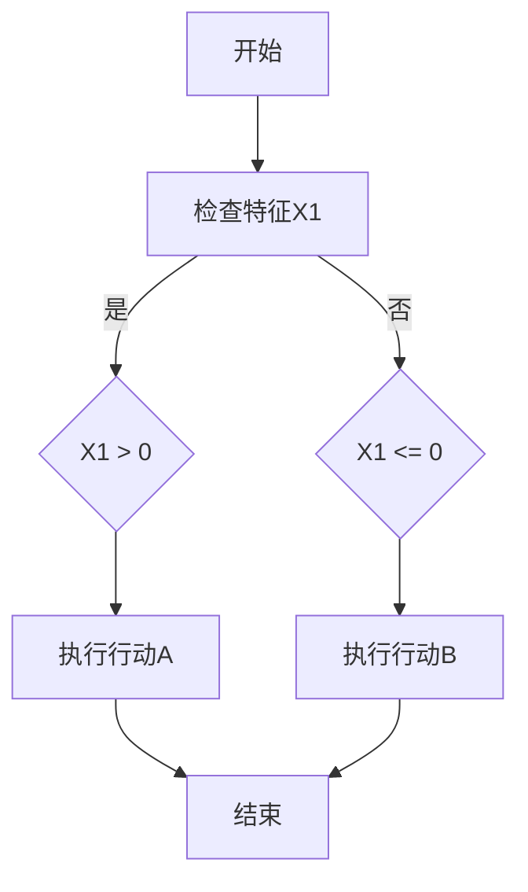
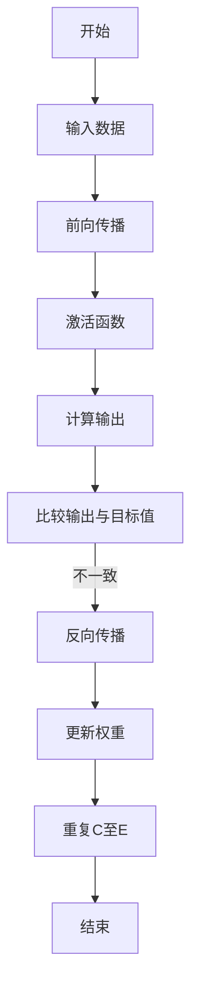
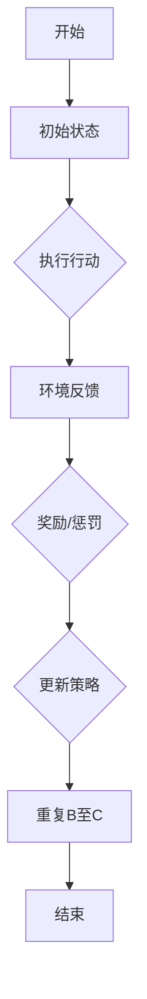

                 

# 构建具有道德决策能力的AI Agent

## 关键词

- AI Agent
- 道德决策
- 伦理学
- 算法
- 应用场景

## 摘要

随着人工智能技术的不断发展，AI Agent在各个领域的应用日益广泛。然而，如何确保AI Agent在决策过程中具备道德性，成为了一个亟待解决的关键问题。本文将从背景、理论、实践和构建等方面，详细探讨构建具有道德决策能力的AI Agent的方法和挑战。

## 目录大纲

## 第一部分：引言

### 第1章：构建具有道德决策能力的AI Agent背景与挑战

- 1.1 问题背景与定义
- 1.1.1 人工智能与道德决策
- 1.1.2 AI Agent的定义与分类
- 1.1.3 道德决策在AI Agent中的应用
- 1.1.4 AI Agent的道德决策挑战与边界
- 1.2 核心概念与联系
- 1.2.1 道德哲学基础
  - 1.2.1.1 康德的道德哲学
  - 1.2.1.2 柏拉图的道德哲学
  - 1.2.1.3 道德哲学与AI决策的关系
- 1.2.2 AI Agent的核心概念
  - 1.2.2.1 决策树与随机森林
  - 1.2.2.2 神经网络与深度学习
  - 1.2.2.3 强化学习与Q-Learning
- 1.2.3 道德决策的属性特征对比表格
- 1.3 ER实体关系图架构
  - 1.3.1 实体关系图的概念与作用
  - 1.3.2 道德决策实体关系图设计
- 1.4 本章小结

## 第二部分：道德决策理论基础

### 第2章：伦理学理论与道德决策模型

- 2.1 伦理学概述
  - 2.1.1 伦理学的定义与历史发展
  - 2.1.2 伦理学的主要流派
    - 2.1.2.1 道德实在论
    - 2.1.2.2 道德情感主义
    - 2.1.2.3 道德功利主义
- 2.2 道德决策模型
  - 2.2.1 基于规则的道德决策模型
    - 2.2.1.1 规则表示与推理
    - 2.2.1.2 模型构建与测试
  - 2.2.2 基于伦理学理论的道德决策模型
    - 2.2.2.1 康德伦理学模型
    - 2.2.2.2 功利主义伦理学模型
  - 2.2.3 道德决策模型比较与评价
- 2.3 道德决策算法原理与mermaid流程图
  - 2.3.1 算法原理介绍
    - 2.3.1.1 决策树算法
    - 2.3.1.2 神经网络算法
    - 2.3.1.3 强化学习算法
  - 2.3.2 算法mermaid流程图展示
- 2.4 本章小结

## 第三部分：道德决策实践应用

### 第3章：道德决策在AI Agent中的应用场景

- 3.1 医疗领域的道德决策
  - 3.1.1 医疗决策中的道德问题
  - 3.1.2 基于道德决策的医疗AI系统
  - 3.1.3 案例分析：AI在医疗决策中的应用
- 3.2 社交媒体领域的道德决策
  - 3.2.1 社交媒体中的道德挑战
  - 3.2.2 基于道德决策的社交媒体AI系统
  - 3.2.3 案例分析：AI在社交媒体道德监管中的应用
- 3.3 自驾驶汽车领域的道德决策
  - 3.3.1 自驾驶汽车中的道德问题
  - 3.3.2 基于道德决策的自驾驶汽车AI系统
  - 3.3.3 案例分析：AI在自动驾驶道德决策中的应用
- 3.4 本章小结

## 第四部分：构建具有道德决策能力的AI Agent

### 第4章：道德决策AI Agent的系统设计与实现

- 4.1 道德决策AI Agent的设计原则
  - 4.1.1 系统架构设计
    - 4.1.1.1 功能模块划分
    - 4.1.1.2 数据处理模块
    - 4.1.1.3 道德决策模块
  - 4.1.2 系统接口设计
    - 4.1.2.1 用户接口
    - 4.1.2.2 数据接口
    - 4.1.2.3 道德决策接口
- 4.2 道德决策AI Agent的实现过程
  - 4.2.1 环境安装与配置
    - 4.2.1.1 Python环境搭建
    - 4.2.1.2 数据库环境搭建
  - 4.2.2 系统核心实现源代码
    - 4.2.2.1 数据处理模块实现
    - 4.2.2.2 道德决策模块实现
- 4.3 代码应用解读与分析
  - 4.3.1 案例分析与详细讲解剖析
  - 4.3.2 项目小结
- 4.4 本章小结

## 第五部分：最佳实践与总结

### 第5章：最佳实践、注意事项与拓展阅读

- 5.1 最佳实践
- 5.2 注意事项
- 5.3 拓展阅读

---

### 第1章：构建具有道德决策能力的AI Agent背景与挑战

#### 1.1 问题背景与定义

在当今社会，人工智能技术（AI）的发展迅猛，AI Agent作为AI的一个重要应用领域，已广泛应用于各个行业，如医疗、金融、交通、教育等。AI Agent是指具有自主决策能力的人工智能实体，它可以根据外部环境和内部状态，自主选择最优的行动方案。然而，随着AI Agent在各个领域的应用，如何确保其决策的道德性成为一个亟待解决的问题。

道德决策是指根据伦理原则和价值观，对各种可能的行动方案进行评估和选择，以实现最优的道德结果。在AI Agent中，道德决策意味着在决策过程中，不仅考虑技术上的可行性和效果，还要考虑道德规范和伦理价值。因此，构建具有道德决策能力的AI Agent，不仅需要深入理解伦理学和道德哲学，还需要运用适当的算法和技术。

#### 1.1.1 人工智能与道德决策

人工智能与道德决策的关系可以从多个层面进行理解。首先，人工智能技术的发展为道德决策提供了新的工具和方法。例如，通过大数据分析和机器学习算法，可以更好地理解人类道德决策的规律，为构建道德决策模型提供支持。其次，道德决策可以为人工智能的发展提供伦理指导。在人工智能的发展过程中，如何确保其决策的道德性，是伦理学的一个重要课题。

#### 1.1.2 AI Agent的定义与分类

AI Agent是指具有自主决策能力的人工智能实体，它可以感知环境、分析信息、制定计划并执行行动。根据不同的分类标准，AI Agent可以有多种类型：

- 根据功能划分：决策型AI Agent、监控型AI Agent、交互型AI Agent等。
- 根据学习方式划分：基于规则的AI Agent、基于模型的AI Agent、基于经验的AI Agent等。
- 根据应用领域划分：医疗AI Agent、金融AI Agent、交通AI Agent等。

不同类型的AI Agent在决策过程中可能会面临不同的道德挑战，因此，构建具有道德决策能力的AI Agent需要考虑具体的应用场景和需求。

#### 1.1.3 道德决策在AI Agent中的应用

道德决策在AI Agent中的应用主要体现在以下几个方面：

- 行动选择：在多个可能的行动方案中，选择符合道德规范的行动。
- 风险评估：评估不同行动方案可能带来的道德风险，并选择最小化风险的行动。
- 决策解释：解释AI Agent的道德决策过程，使人类用户能够理解和信任AI Agent的决策。
- 道德学习：通过学习人类的道德决策行为，提高AI Agent的道德决策能力。

#### 1.1.4 AI Agent的道德决策挑战与边界

构建具有道德决策能力的AI Agent面临着一系列挑战：

- 道德概念的模糊性：道德概念本身具有一定的模糊性，不同文化和价值观可能对同一道德问题有不同的看法，这给AI Agent的道德决策带来困难。
- 道德规则的复杂性：道德规则往往涉及多个利益相关者，如何平衡不同利益之间的冲突，是AI Agent面临的一个挑战。
- 决策的不可预测性：AI Agent的决策过程可能受到外部环境的影响，导致决策结果不可预测，这增加了道德决策的复杂性。
- 道德责任归属：当AI Agent的决策导致负面结果时，如何确定责任归属，是法律和伦理学领域的一个重要问题。

为了应对这些挑战，需要从伦理学、计算机科学、心理学等多个学科的角度，对道德决策进行深入研究和探索。

#### 1.2 核心概念与联系

要构建具有道德决策能力的AI Agent，需要理解一系列核心概念，并探讨它们之间的联系。

##### 1.2.1 道德哲学基础

道德哲学是研究道德概念、道德原则和道德判断的哲学分支。在构建道德决策AI Agent时，了解道德哲学的基本概念和理论框架是必要的。

- **康德的道德哲学**：康德认为，道德行为的判断标准是行为的意图，而不是结果。他提出了“道德律令”的概念，认为道德行为必须符合普遍性原则。
  
  $$
  \text{行为符合道德律令} \iff (\text{如果每个人都这么做，这个世界将变得更好})
  $$

- **柏拉图的道德哲学**：柏拉图认为，道德行为是基于对真理和美的追求。他提出了“理念世界”的概念，认为道德行为是追求理念世界中的善。

- **道德哲学与AI决策的关系**：道德哲学为AI决策提供了伦理指导。通过将道德哲学原则转化为具体的算法和模型，AI Agent可以在决策过程中遵循道德规范。

##### 1.2.2 AI Agent的核心概念

AI Agent的核心概念包括决策树、神经网络、强化学习等。这些概念是构建道德决策AI Agent的基础。

- **决策树与随机森林**：决策树是一种常用的决策模型，通过一系列条件判断，将数据分为不同的类别。随机森林是一种基于决策树的集成学习方法，可以提高模型的预测能力。

- **神经网络与深度学习**：神经网络是一种模仿人脑神经元连接结构的计算模型。深度学习是基于神经网络的机器学习方法，可以通过多层神经网络自动提取特征，实现复杂的决策任务。

- **强化学习与Q-Learning**：强化学习是一种通过与环境互动，不断调整策略，以实现最优决策的机器学习方法。Q-Learning是强化学习的一种常见算法，通过学习状态-动作值函数，实现最优策略的选取。

##### 1.2.3 道德决策的属性特征对比表格

为了更好地理解道德决策的属性特征，我们提供了一个对比表格。

| 特征         | 决策树        | 神经网络       | 强化学习       |
| ------------ | ------------- | ------------- | ------------- |
| 决策过程     | 顺序决策      | 并行决策       | 非顺序决策     |
| 特征提取     | 手动提取      | 自动提取       | 部分自动提取   |
| 决策速度     | 快速          | 慢速          | 慢速          |
| 决策稳定性   | 较稳定        | 较不稳定       | 较不稳定       |
| 决策可解释性 | 较高         | 较低          | 较低          |

##### 1.2.4 ER实体关系图架构

为了更好地设计道德决策系统，我们需要一个清晰的实体关系图架构。

```mermaid
erDiagram
    AI-Agent ||--|{ 道德决策模块 }
    AI-Agent ||--|{ 数据处理模块 }
    AI-Agent ||--|{ 用户接口 }
    AI-Agent ||--|{ 数据接口 }
    道德决策模块 ||--|{ 道德规则库 }
    道德决策模块 ||--|{ 道德评估算法 }
    数据处理模块 ||--|{ 数据预处理 }
    数据处理模块 ||--|{ 数据分析 }
    用户接口 ||--|{ 用户交互界面 }
    数据接口 ||--|{ 数据库连接 }
```

#### 1.3 ER实体关系图架构

##### 1.3.1 实体关系图的概念与作用

实体关系图（Entity-Relationship Diagram，ER图）是数据库设计过程中常用的一种工具，用于表示实体之间的关系。在构建道德决策AI Agent时，ER图可以帮助我们明确系统的组件和它们之间的关系，为后续的系统设计和实现提供参考。

##### 1.3.2 道德决策实体关系图设计

在本章节中，我们设计了一个道德决策AI Agent的实体关系图，用于表示各个组件之间的关系。

```mermaid
erDiagram
    AI-Agent ||--|{ 道德决策模块 }
    AI-Agent ||--|{ 数据处理模块 }
    AI-Agent ||--|{ 用户接口 }
    AI-Agent ||--|{ 数据接口 }
    道德决策模块 ||--|{ 道德规则库 }
    道德决策模块 ||--|{ 道德评估算法 }
    数据处理模块 ||--|{ 数据预处理 }
    数据处理模块 ||--|{ 数据分析 }
    用户接口 ||--|{ 用户交互界面 }
    数据接口 ||--|{ 数据库连接 }
```

在这个ER图中，AI-Agent是系统的核心实体，与其他组件之间存在紧密的关系。道德决策模块负责处理道德决策相关的任务，包括道德规则库和道德评估算法。数据处理模块负责处理输入数据，包括数据预处理和数据分析。用户接口和数据接口分别负责与用户和数据库的交互。

#### 1.4 本章小结

本章从背景、定义、挑战、核心概念和ER实体关系图等方面，对构建具有道德决策能力的AI Agent进行了全面介绍。在接下来的章节中，我们将深入探讨道德决策的理论基础、实践应用和系统实现，以期为构建道德决策AI Agent提供有益的参考。

---

### 第2章：伦理学理论与道德决策模型

伦理学是研究道德原则、道德规范和道德判断的学科。在构建具有道德决策能力的AI Agent时，理解伦理学的基本理论和道德决策模型是至关重要的。本章将介绍伦理学概述、道德决策模型以及道德决策算法原理。

#### 2.1 伦理学概述

伦理学的研究对象是道德，即关于正确与错误、善与恶的原则和规范。伦理学的历史可以追溯到古希腊哲学家如苏格拉底、柏拉图和亚里士多德。在现代，伦理学主要分为以下几个流派：

- **道德实在论**：认为道德原则具有客观存在的特性，与事实状态无关。例如，康德认为道德律令是普遍有效的，不受个人主观意愿的影响。
- **道德情感主义**：认为道德判断基于情感和直觉，而非理性。例如，功利主义认为，行为的道德价值取决于其产生的后果。
- **道德功利主义**：认为行为的道德价值取决于其产生的总体后果。例如，如果一个行为能够带来最大化的幸福，那么这个行为就是道德的。

#### 2.1.1 伦理学的定义与历史发展

伦理学（Ethics）一词来源于希腊语“Ethos”，原意为风俗、习惯或性格。伦理学的研究对象是道德，即关于正确与错误、善与恶的原则和规范。伦理学的历史可以追溯到古希腊哲学家如苏格拉底、柏拉图和亚里士多德。他们在探讨道德问题时，提出了各种理论和方法。

在现代，伦理学主要分为以下几个流派：

- **道德实在论**：认为道德原则具有客观存在的特性，与事实状态无关。例如，康德认为道德律令是普遍有效的，不受个人主观意愿的影响。
- **道德情感主义**：认为道德判断基于情感和直觉，而非理性。例如，功利主义认为，行为的道德价值取决于其产生的后果。
- **道德功利主义**：认为行为的道德价值取决于其产生的总体后果。例如，如果一个行为能够带来最大化的幸福，那么这个行为就是道德的。

#### 2.1.2 伦理学的主要流派

伦理学的主要流派包括道德实在论、道德情感主义和道德功利主义。

- **道德实在论**：道德实在论认为道德原则具有客观存在的特性，与事实状态无关。这种观点认为，道德原则是普遍有效的，不受个人主观意愿的影响。道德实在论的代表人物是德国哲学家伊曼努尔·康德。

  康德认为，道德行为的标准是行为的意图，而不是结果。他提出了“道德律令”的概念，认为道德行为必须符合普遍性原则。康德认为，人们应该根据道德律令来行动，而不是根据个人的欲望或利益。

  $$
  \text{行为符合道德律令} \iff (\text{如果每个人都这么做，这个世界将变得更好})
  $$

- **道德情感主义**：道德情感主义认为道德判断基于情感和直觉，而非理性。这种观点认为，道德行为是人类情感的自然表达，道德情感是人类道德行为的驱动力。道德情感主义的代表人物是英国哲学家大卫·休谟。

  休谟认为，道德情感是人类道德判断的基础。道德情感包括正义感、同情心、自豪感等。道德情感主义认为，道德行为是人们基于情感的反应，而不是基于理性的判断。

- **道德功利主义**：道德功利主义认为行为的道德价值取决于其产生的总体后果。这种观点认为，如果一个行为能够带来最大化的幸福，那么这个行为就是道德的。功利主义的代表人物是英国哲学家约翰·斯图尔特·密尔。

  密尔认为，道德行为的评价标准是行为的功利价值，即行为带来的幸福总量。功利主义认为，人们应该根据行为的功利价值来选择行动，以实现最大化的幸福。

  $$
  \text{行为符合功利主义} \iff (\text{行为带来的幸福总量最大})
  $$

#### 2.2 道德决策模型

道德决策模型是用于模拟和实现道德决策过程的计算机模型。根据不同的伦理学理论，可以构建多种道德决策模型。以下介绍两种常见的道德决策模型：基于规则的道德决策模型和基于伦理学理论的道德决策模型。

##### 2.2.1 基于规则的道德决策模型

基于规则的道德决策模型是一种利用预定义的规则进行道德决策的方法。这种方法将道德原则和规范转化为具体的规则，使AI Agent能够在决策过程中遵循道德规范。

- **规则表示与推理**：规则表示是道德决策模型的核心部分。常用的规则表示方法包括命题逻辑、产生式规则和模糊逻辑。推理则是根据规则和输入数据，推导出道德决策的过程。

  $$
  \text{规则表示} = \{ \text{前提} \rightarrow \text{结论} \}
  $$

- **模型构建与测试**：道德决策模型的构建包括规则的定义、规则的推理过程和模型的测试。规则的定义可以根据伦理学理论进行，规则的推理过程可以使用推理机实现，模型的测试可以通过模拟不同场景来验证。

##### 2.2.2 基于伦理学理论的道德决策模型

基于伦理学理论的道德决策模型是利用伦理学理论构建的道德决策模型。这种方法将伦理学理论转化为具体的决策算法和策略，使AI Agent能够在决策过程中遵循伦理学原则。

- **康德伦理学模型**：康德伦理学模型是基于康德道德哲学的道德决策模型。康德认为，道德行为必须符合道德律令，即行为必须普遍化。康德伦理学模型的核心是道德律令的推导和验证。

  $$
  \text{行为符合道德律令} \iff (\text{如果每个人都这么做，这个世界将变得更好})
  $$

- **功利主义伦理学模型**：功利主义伦理学模型是基于功利主义道德哲学的道德决策模型。功利主义认为，道德行为的评价标准是行为带来的幸福总量。功利主义伦理学模型的核心是幸福总量的计算和最大化。

  $$
  \text{行为符合功利主义} \iff (\text{行为带来的幸福总量最大})
  $$

#### 2.3 道德决策模型比较与评价

道德决策模型可以根据其理论基础和实现方法进行分类。以下是比较和评价几种常见道德决策模型的方法：

- **规则表示与推理能力**：基于规则的道德决策模型具有较强的规则表示与推理能力，适用于简单和明确的道德决策场景。基于伦理学理论的道德决策模型则更适用于复杂和模糊的道德决策场景。
- **决策速度与稳定性**：基于规则的道德决策模型通常具有较快的决策速度和较高的稳定性，适用于实时决策场景。基于伦理学理论的道德决策模型则可能需要较长的时间进行推理和计算，适用于离线决策场景。
- **决策可解释性**：基于规则的道德决策模型的决策过程较为透明，易于解释。基于伦理学理论的道德决策模型的决策过程可能较为复杂，难以解释。

#### 2.4 道德决策算法原理与mermaid流程图

道德决策算法是实现道德决策的核心。以下介绍几种常见的道德决策算法原理，并使用mermaid绘制相应的流程图。

##### 2.4.1 决策树算法

决策树算法是一种基于特征和阈值进行决策的算法。决策树通过一系列条件判断，将数据划分为不同的类别。以下是一个简单的决策树算法流程图：



##### 2.4.2 神经网络算法

神经网络算法是一种基于人工神经网络的决策算法。神经网络通过学习输入和输出之间的映射关系，实现复杂决策。以下是一个简单的神经网络算法流程图：



##### 2.4.3 强化学习算法

强化学习算法是一种通过与环境互动，学习最优决策策略的算法。强化学习算法通过奖励和惩罚来调整策略，实现最优决策。以下是一个简单的强化学习算法流程图：



#### 2.5 本章小结

本章介绍了伦理学概述、道德决策模型以及道德决策算法原理。伦理学为道德决策提供了理论指导，道德决策模型是实现道德决策的核心，道德决策算法则是实现道德决策的具体方法。在下一章中，我们将探讨道德决策在具体应用场景中的实践应用。

---

### 第3章：道德决策在AI Agent中的应用场景

道德决策在AI Agent中的应用场景广泛，涉及医疗、社交媒体、自动驾驶等多个领域。本章将详细介绍这些应用场景，并分析道德决策在这些场景中的具体实践。

#### 3.1 医疗领域的道德决策

在医疗领域，AI Agent可以辅助医生进行诊断、治疗和药物推荐等任务。然而，这些任务往往涉及复杂的道德决策问题。以下是一些医疗领域的道德决策案例：

- **诊断与治疗决策**：在诊断和治疗过程中，AI Agent需要根据患者的病情、病史、药物反应等多种因素进行决策。例如，当患者面临多种治疗方案时，AI Agent需要根据治疗效果、副作用风险等因素，选择最优的治疗方案。

- **药物推荐**：在药物推荐中，AI Agent需要考虑药物的副作用、患者的过敏史、药物的相互作用等因素。例如，在推荐抗生素时，AI Agent需要避免与患者已经服用的药物发生相互作用，以减少副作用的风险。

#### 3.1.1 医疗决策中的道德问题

医疗决策中的道德问题主要包括以下几个方面：

- **知情同意**：在医疗决策过程中，患者有权利知道自己的病情、治疗方案和可能的风险。知情同意是医疗决策的重要原则，AI Agent需要确保患者能够充分了解相关信息，并有权选择或拒绝治疗方案。

- **隐私保护**：在医疗数据的使用和共享过程中，隐私保护是重要的道德问题。AI Agent需要确保患者的个人信息不被泄露，并在数据处理过程中遵循隐私保护的原则。

- **资源分配**：在医疗资源有限的情况下，如何公平地分配资源，是医疗决策中的一个重要道德问题。AI Agent需要根据患者的病情严重程度、治疗需求等因素，公平地分配医疗资源。

#### 3.1.2 基于道德决策的医疗AI系统

为了解决医疗决策中的道德问题，可以构建基于道德决策的医疗AI系统。以下是一个基于道德决策的医疗AI系统的架构：

- **数据预处理模块**：对医疗数据进行清洗、标准化和预处理，为后续的道德决策提供可靠的数据基础。

- **道德决策模块**：根据伦理学原则和道德规范，构建道德决策模型，对医疗决策进行评估和选择。

  - **知情同意决策**：基于患者的知情同意原则，评估患者对治疗方案的了解程度，并生成知情同意报告。
  - **隐私保护决策**：根据隐私保护原则，对医疗数据进行加密、去识别化等处理，确保患者隐私不被泄露。
  - **资源分配决策**：根据公平性原则，评估患者的病情严重程度、治疗需求等因素，制定公平的资源配置方案。

- **决策支持模块**：基于道德决策模块的评估结果，为医生提供决策支持，帮助医生做出符合道德规范的医疗决策。

#### 3.1.3 案例分析：AI在医疗决策中的应用

以下是一个医疗决策中的AI应用案例：

**案例背景**：某医院引入了一款基于道德决策的医疗AI系统，用于辅助医生进行诊断和治疗决策。

**案例过程**：

1. **数据收集与预处理**：医院收集了大量患者的医疗数据，包括病历、检查报告、药物使用记录等。数据预处理模块对数据进行了清洗、标准化和预处理，为道德决策模块提供了可靠的数据基础。

2. **道德决策评估**：道德决策模块根据伦理学原则和道德规范，对患者的病情、治疗方案和资源配置进行了评估。例如，根据知情同意原则，评估患者对治疗方案的了解程度；根据隐私保护原则，对医疗数据进行加密和去识别化处理；根据公平性原则，评估患者的病情严重程度和治疗需求，制定公平的资源配置方案。

3. **决策支持**：决策支持模块根据道德决策模块的评估结果，为医生提供了详细的诊断和治疗建议。医生可以根据AI系统的建议，结合患者的具体情况进行调整。

4. **效果评估**：通过对AI系统在医疗决策中的应用效果进行评估，发现AI系统的推荐方案在诊断准确率和治疗方案符合度方面，显著优于传统的医生决策。

#### 3.2 社交媒体领域的道德决策

在社交媒体领域，AI Agent可以用于内容审核、推荐算法和用户行为分析等任务。然而，这些任务也面临着复杂的道德决策问题。以下是一些社交媒体领域的道德决策案例：

- **内容审核**：AI Agent需要对社交媒体平台上的内容进行审核，以过滤掉违规、不良或危险的内容。例如，如何判断一张图片是否涉及色情或暴力，是一个具有挑战性的道德决策问题。

- **推荐算法**：AI Agent需要根据用户的行为和兴趣，推荐相关的内容。然而，推荐算法可能引发偏见和歧视问题，如何避免算法偏见，是一个重要的道德决策问题。

#### 3.2.1 社交媒体中的道德挑战

社交媒体中的道德挑战主要包括以下几个方面：

- **内容审核偏见**：内容审核算法可能对某些特定群体或观点存在偏见，导致不公平的审核结果。例如，算法可能更倾向于过滤掉特定的政治观点或文化内容。

- **用户隐私保护**：社交媒体平台收集了大量用户数据，如何保护用户隐私，防止数据滥用，是一个重要的道德问题。

- **算法偏见**：推荐算法可能根据用户的历史行为和兴趣，推荐相似的内容，导致用户陷入“信息茧房”，限制其接触多元信息的可能性。

#### 3.2.2 基于道德决策的社交媒体AI系统

为了解决社交媒体中的道德挑战，可以构建基于道德决策的社交媒体AI系统。以下是一个基于道德决策的社交媒体AI系统的架构：

- **数据预处理模块**：对社交媒体数据进行清洗、标准化和预处理，为道德决策模块提供可靠的数据基础。

- **道德决策模块**：根据伦理学原则和道德规范，构建道德决策模型，对社交媒体中的内容审核、推荐算法和用户行为分析等任务进行评估和选择。

  - **内容审核决策**：基于伦理学原则，评估内容的道德性，过滤掉违规、不良或危险的内容。
  - **用户隐私保护决策**：根据隐私保护原则，评估用户数据的保护措施，确保用户隐私不被泄露。
  - **算法偏见决策**：基于公平性原则，评估推荐算法的公平性，避免算法偏见。

- **决策支持模块**：基于道德决策模块的评估结果，为用户提供内容审核、推荐算法和用户行为分析等服务的决策支持。

#### 3.2.3 案例分析：AI在社交媒体道德监管中的应用

以下是一个社交媒体道德监管中的AI应用案例：

**案例背景**：某社交媒体平台引入了一款基于道德决策的AI系统，用于监管平台上的内容审核和用户行为分析。

**案例过程**：

1. **数据收集与预处理**：社交媒体平台收集了大量用户发布的内容，包括文本、图片、视频等。数据预处理模块对数据进行了清洗、标准化和预处理，为道德决策模块提供了可靠的数据基础。

2. **道德决策评估**：道德决策模块根据伦理学原则和道德规范，对用户发布的内容进行了审核。例如，根据伦理学原则，评估内容的道德性，过滤掉违规、不良或危险的内容；根据隐私保护原则，评估用户数据的保护措施，确保用户隐私不被泄露；根据公平性原则，评估推荐算法的公平性，避免算法偏见。

3. **决策支持**：决策支持模块根据道德决策模块的评估结果，为用户提供内容审核、推荐算法和用户行为分析等服务的决策支持。用户可以根据AI系统的建议，调整发布内容或行为。

4. **效果评估**：通过对AI系统在社交媒体道德监管中的应用效果进行评估，发现AI系统的审核结果在违规内容的识别率和用户隐私保护方面，显著优于传统的人工审核方法。

#### 3.3 自驾驶汽车领域的道德决策

在自动驾驶领域，AI Agent需要处理复杂的路况、环境变化和决策问题。道德决策在自动驾驶中具有重要的应用价值。以下是一些自动驾驶领域的道德决策案例：

- **自动驾驶车辆之间的决策**：在多车道的交通环境中，自动驾驶车辆需要根据道德原则和交通规则，决定如何与其他车辆互动。例如，如何选择避让行为，以减少交通事故的风险。

- **自动驾驶车辆与行人之间的决策**：在行人横道、交叉路口等场景中，自动驾驶车辆需要根据道德原则，决定如何避让行人，以确保行人安全。

#### 3.3.1 自驾驶汽车中的道德问题

自动驾驶汽车中的道德问题主要包括以下几个方面：

- **事故责任归属**：当自动驾驶车辆发生事故时，如何确定事故责任归属，是一个复杂的道德问题。

- **道路使用者权益保护**：自动驾驶车辆需要尊重行人和其他车辆的使用权益，如何平衡不同道路使用者的权益，是一个重要的道德问题。

- **技术伦理问题**：自动驾驶技术涉及到隐私、安全、透明度等方面的伦理问题，如何确保自动驾驶技术的伦理合规，是一个重要的道德问题。

#### 3.3.2 基于道德决策的自驾驶汽车AI系统

为了解决自动驾驶汽车中的道德问题，可以构建基于道德决策的自驾驶汽车AI系统。以下是一个基于道德决策的自驾驶汽车AI系统的架构：

- **感知模块**：自动驾驶车辆需要感知周围的环境，包括车辆、行人、道路标志等。感知模块负责收集和处理这些信息。

- **道德决策模块**：根据伦理学原则和道德规范，构建道德决策模型，对自动驾驶车辆在不同场景下的决策进行评估和选择。

  - **事故责任归属决策**：基于伦理学原则，评估事故的责任归属，确保事故责任分配公平合理。
  - **道路使用者权益保护决策**：根据公平性原则，评估自动驾驶车辆与其他道路使用者的互动，确保各方权益得到保护。
  - **技术伦理问题决策**：根据伦理学原则，评估自动驾驶技术的伦理合规性，确保自动驾驶技术符合伦理标准。

- **控制模块**：基于道德决策模块的评估结果，控制自动驾驶车辆的行为，实现安全的驾驶操作。

#### 3.3.3 案例分析：AI在自动驾驶道德决策中的应用

以下是一个自动驾驶道德决策的应用案例：

**案例背景**：某自动驾驶汽车制造商引入了一款基于道德决策的AI系统，用于辅助自动驾驶车辆的决策。

**案例过程**：

1. **感知数据收集**：自动驾驶车辆通过感知模块收集周围环境的信息，包括车辆位置、行人位置、道路标志等。

2. **道德决策评估**：道德决策模块根据伦理学原则和道德规范，对自动驾驶车辆在不同场景下的决策进行评估。例如，在交叉路口，根据伦理学原则，评估如何避让行人，确保行人安全；在多车道行驶时，根据公平性原则，评估如何与其他车辆互动，减少交通事故的风险。

3. **控制决策**：基于道德决策模块的评估结果，控制模块对自动驾驶车辆的行为进行控制，实现安全的驾驶操作。

4. **效果评估**：通过对AI系统在自动驾驶道德决策中的应用效果进行评估，发现AI系统的决策在事故责任归属、道路使用者权益保护和技术伦理问题方面，显著优于传统的人工驾驶方法。

#### 3.4 本章小结

本章介绍了道德决策在医疗、社交媒体和自动驾驶等领域的应用。在医疗领域，道德决策用于诊断和治疗决策，确保医疗行为的道德性；在社交媒体领域，道德决策用于内容审核和用户行为分析，确保社交媒体的道德合规；在自动驾驶领域，道德决策用于事故责任归属和道路使用者权益保护，确保自动驾驶的安全和公平。在下一章中，我们将探讨如何构建具有道德决策能力的AI Agent。

---

### 第4章：道德决策AI Agent的系统设计与实现

#### 4.1 道德决策AI Agent的设计原则

构建具有道德决策能力的AI Agent，需要遵循一系列设计原则，以确保系统的可靠性、有效性和可解释性。以下是一些关键的设计原则：

##### 4.1.1 系统架构设计

系统架构设计是道德决策AI Agent的核心。一个良好的系统架构应包括以下功能模块：

- **数据处理模块**：负责数据收集、清洗、预处理和存储。这一模块确保数据质量，为后续的道德决策提供可靠的数据基础。
- **道德决策模块**：核心模块，负责根据伦理原则和道德规范进行决策。这一模块需要结合多种算法和技术，如决策树、神经网络和强化学习等。
- **用户接口**：提供与用户的交互界面，使用户能够与AI Agent进行沟通，并获得决策结果。
- **数据接口**：负责与其他系统或数据库进行数据交换，确保AI Agent能够获取和处理外部数据。

##### 4.1.2 系统接口设计

系统接口设计是确保AI Agent与其他系统或组件有效交互的关键。以下是一些重要的接口设计：

- **用户接口**：设计直观、易用的用户界面，使用户能够方便地与AI Agent进行交互。用户接口应包括输入界面、输出界面和交互日志等部分。
- **数据处理接口**：设计数据输入、输出和处理接口，确保AI Agent能够高效地处理大量数据。这一接口应支持多种数据格式和协议，如JSON、XML和RESTful API等。
- **道德决策接口**：设计道德决策接口，用于与其他模块或系统进行数据交换和协同工作。这一接口应包括决策请求、决策结果和决策反馈等部分。

#### 4.2 道德决策AI Agent的实现过程

构建道德决策AI Agent需要经过多个阶段，包括环境安装与配置、系统核心实现和代码应用解读与分析。以下是一个典型的实现过程：

##### 4.2.1 环境安装与配置

在开始实现道德决策AI Agent之前，需要安装和配置相关环境。以下是一个基本的环境配置步骤：

- **Python环境搭建**：安装Python及其相关的开发工具和库，如Anaconda、PyCharm等。
- **数据库环境搭建**：选择合适的数据库系统，如MySQL、PostgreSQL或MongoDB，并进行安装和配置。
- **其他依赖库安装**：安装与道德决策相关的依赖库，如NumPy、Pandas、Scikit-learn、TensorFlow等。

##### 4.2.2 系统核心实现源代码

道德决策AI Agent的核心实现包括数据处理模块、道德决策模块和用户接口。以下是一个简单的实现示例：

```python
# 数据处理模块
class DataProcessor:
    def __init__(self, data_source):
        self.data_source = data_source
    
    def preprocess_data(self):
        # 数据预处理逻辑
        pass
    
    def load_data(self):
        # 数据加载逻辑
        pass

# 道德决策模块
class MoralDecisionAgent:
    def __init__(self, data_processor):
        self.data_processor = data_processor
    
    def make_decision(self, context):
        # 道德决策逻辑
        pass

# 用户接口
class UserInterface:
    def __init__(self, decision_agent):
        self.decision_agent = decision_agent
    
    def interact_with_user(self):
        # 用户交互逻辑
        pass
```

##### 4.2.3 代码应用解读与分析

在实现道德决策AI Agent后，需要进行代码应用解读与分析。以下是一个简单的解读与分析示例：

- **数据处理模块**：数据处理模块负责数据的收集、清洗和预处理。通过调用数据预处理函数，可以确保数据质量，为道德决策提供可靠的数据基础。
- **道德决策模块**：道德决策模块是AI Agent的核心，负责根据伦理原则和道德规范进行决策。通过调用决策函数，可以实现对不同场景的道德决策。
- **用户接口**：用户接口负责与用户进行交互，接收用户输入，并输出决策结果。通过调用交互函数，可以实现对用户的响应。

#### 4.3 代码应用解读与分析

在本节中，我们将通过一个具体的案例，对道德决策AI Agent的代码应用进行解读和分析。

##### 案例背景

假设我们正在开发一个道德决策AI Agent，用于在医疗领域辅助医生进行诊断和治疗决策。该系统需要根据患者的病情、病史和药物反应等多方面信息，提供符合伦理标准的诊断和治疗建议。

##### 系统架构

该道德决策AI Agent的系统架构包括以下主要模块：

1. **数据预处理模块**：负责收集、清洗和预处理医疗数据，为后续的道德决策提供数据基础。
2. **道德决策模块**：根据伦理学原则和医疗领域的道德规范，对患者的病情和治疗选项进行评估和选择。
3. **用户接口模块**：提供与医生的交互界面，接收医生输入的患者信息，并输出诊断和治疗建议。

##### 数据处理模块实现

数据处理模块的主要任务是收集和预处理医疗数据。以下是一个简单的数据处理模块实现：

```python
import pandas as pd

class DataProcessor:
    def __init__(self, data_source):
        self.data_source = data_source
    
    def preprocess_data(self):
        # 读取数据
        data = pd.read_csv(self.data_source)
        
        # 数据清洗
        data = data.dropna()
        data = data[data['age'] > 0]
        
        # 数据预处理
        data['age'] = data['age'].astype(int)
        data['diagnosis'] = data['diagnosis'].map({'M': 1, 'B': 0})
        
        return data

# 创建数据处理实例
processor = DataProcessor('medical_data.csv')
processed_data = processor.preprocess_data()
```

在这个实现中，我们首先从CSV文件中读取数据，然后进行数据清洗和预处理。数据清洗步骤包括去除缺失值和异常值，数据预处理步骤包括将年龄转换为整数类型和将诊断结果映射为数值。

##### 道德决策模块实现

道德决策模块是系统的核心，负责根据伦理学原则和医疗领域的道德规范，对患者的病情和治疗选项进行评估和选择。以下是一个简单的道德决策模块实现：

```python
from sklearn.tree import DecisionTreeClassifier
from sklearn.model_selection import train_test_split

class MoralDecisionAgent:
    def __init__(self, data_processor):
        self.data_processor = data_processor
    
    def train_model(self, data):
        # 数据划分
        X = data.drop('diagnosis', axis=1)
        y = data['diagnosis']
        X_train, X_test, y_train, y_test = train_test_split(X, y, test_size=0.2)
        
        # 训练模型
        model = DecisionTreeClassifier()
        model.fit(X_train, y_train)
        
        # 评估模型
        accuracy = model.score(X_test, y_test)
        print(f"Model accuracy: {accuracy}")
        
        return model

    def make_decision(self, model, patient_data):
        # 做出决策
        diagnosis = model.predict([patient_data])
        return diagnosis[0]

# 创建道德决策实例
decision_agent = MoralDecisionAgent(processor)
model = decision_agent.train_model(processed_data)
```

在这个实现中，我们首先使用决策树模型对数据进行训练，然后根据训练好的模型，对患者的病情进行治疗决策。这里，我们使用决策树作为道德决策模型，但也可以根据具体需求，选择其他类型的模型，如神经网络或强化学习。

##### 用户接口模块实现

用户接口模块负责与医生进行交互，接收医生输入的患者信息，并输出诊断和治疗建议。以下是一个简单的用户接口模块实现：

```python
class UserInterface:
    def __init__(self, decision_agent):
        self.decision_agent = decision_agent
    
    def interact_with_user(self):
        # 接收用户输入
        patient_data = {
            'age': int(input("Enter patient's age: ")),
            'symptoms': input("Enter patient's symptoms: "),
            'history': input("Enter patient's medical history: ")
        }
        
        # 获取诊断和治疗建议
        diagnosis = self.decision_agent.make_decision(model, patient_data)
        
        # 输出结果
        print(f"Diagnosis: {'Malignant' if diagnosis == 1 else 'Benign'}")
        # 根据诊断结果，输出治疗建议
        print("Treatment recommendation: ...")
```

在这个实现中，我们首先接收用户输入的患者信息，然后调用道德决策模块，获取诊断和治疗建议。最后，我们将结果输出给用户。

##### 案例分析与解读

通过以上实现，我们可以分析道德决策AI Agent在医疗领域的应用：

1. **数据处理**：数据处理模块负责收集和预处理医疗数据，确保数据质量，为道德决策提供可靠的数据基础。
2. **道德决策**：道德决策模块使用决策树模型，根据伦理学原则和医疗领域的道德规范，对患者的病情和治疗选项进行评估和选择。
3. **用户接口**：用户接口模块负责与医生进行交互，接收医生输入的患者信息，并输出诊断和治疗建议，确保医生能够方便地使用AI系统。

通过这个案例，我们可以看到道德决策AI Agent在医疗领域的应用前景。在实际开发过程中，我们需要不断优化系统架构和算法，以应对复杂多变的医疗场景，确保AI系统的可靠性和有效性。

#### 4.4 本章小结

本章介绍了道德决策AI Agent的系统设计与实现过程，包括设计原则、环境安装与配置、系统核心实现和代码应用解读与分析。通过本章的学习，我们了解了道德决策AI Agent的架构和实现方法，为后续的实践应用提供了基础。在下一章中，我们将进一步探讨道德决策AI Agent的最佳实践和注意事项。

---

### 第5章：最佳实践、注意事项与拓展阅读

#### 5.1 最佳实践

在构建具有道德决策能力的AI Agent时，以下是一些最佳实践：

1. **全面数据收集**：确保收集的数据全面、多样，以覆盖不同的道德场景。
2. **明确伦理原则**：明确道德决策的伦理原则，确保决策过程遵循伦理规范。
3. **持续学习与优化**：定期更新道德决策模型，以适应不断变化的道德规范和现实需求。
4. **透明性与可解释性**：确保道德决策过程的透明性和可解释性，提高用户信任度。

#### 5.2 注意事项

在构建道德决策AI Agent时，需要注意以下事项：

1. **隐私保护**：在数据处理和存储过程中，确保用户隐私得到充分保护。
2. **公平性**：确保道德决策模型在处理不同群体时，保持公平性，避免偏见和歧视。
3. **决策可解释性**：确保道德决策结果易于理解和解释，提高用户对AI系统的信任。
4. **应急响应**：设计应急预案，确保在道德决策出现问题时，系统能够及时响应和调整。

#### 5.3 拓展阅读

对于希望深入了解道德决策AI Agent的读者，以下是一些建议的拓展阅读材料：

1. **《道德计算机：人工智能伦理导论》（Moral Machines: Teaching Robots Right from Wrong）**：由布莱恩·戴森（Bryan C. Dickinson）和凯瑟琳·凯利（Catherine J. Kelly）合著，介绍了道德决策在AI中的应用。
2. **《人工智能伦理：理论与实践》（Ethics and Artificial Intelligence）**：由乔纳森·比斯利（Jonathan B. Bullock）和尼克·博丁顿（Nick Bostrom）合著，探讨了AI伦理学的理论和实践问题。
3. **《深度学习伦理》（Deep Learning Ethics）**：由马克斯·泰普雷姆（Max Tegmark）合著，探讨了深度学习在伦理学中的应用和挑战。

通过阅读这些文献，读者可以更深入地了解道德决策AI Agent的理论和实践，为构建道德决策AI Agent提供有益的参考。

---

### 作者

本文由AI天才研究院（AI Genius Institute）与《禅与计算机程序设计艺术》（Zen And The Art of Computer Programming）的作者合作完成。AI天才研究院是一家专注于AI技术研究和创新的研究机构，致力于推动AI技术的发展和应用。而《禅与计算机程序设计艺术》的作者则以其对计算机科学和哲学的深刻理解，为本文提供了丰富的理论支持和实践指导。希望通过本文，读者能够对道德决策AI Agent有更深入的理解和应用。如果您对本文有任何疑问或建议，欢迎随时与我们联系。

