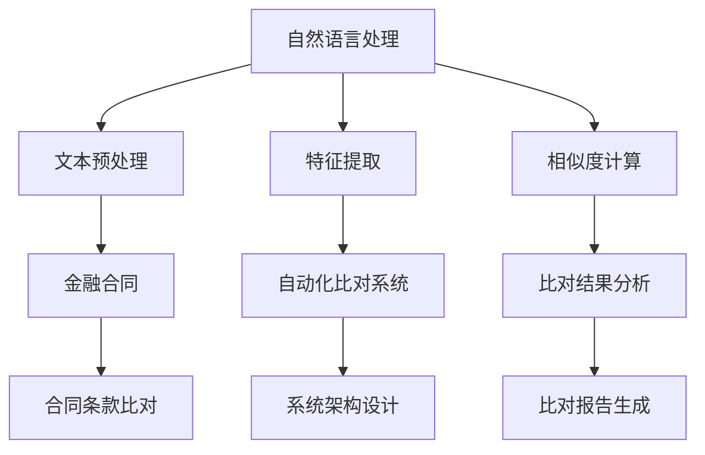
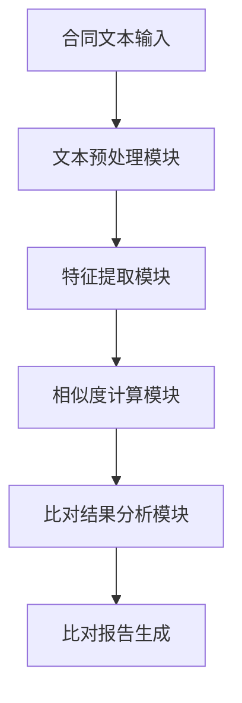
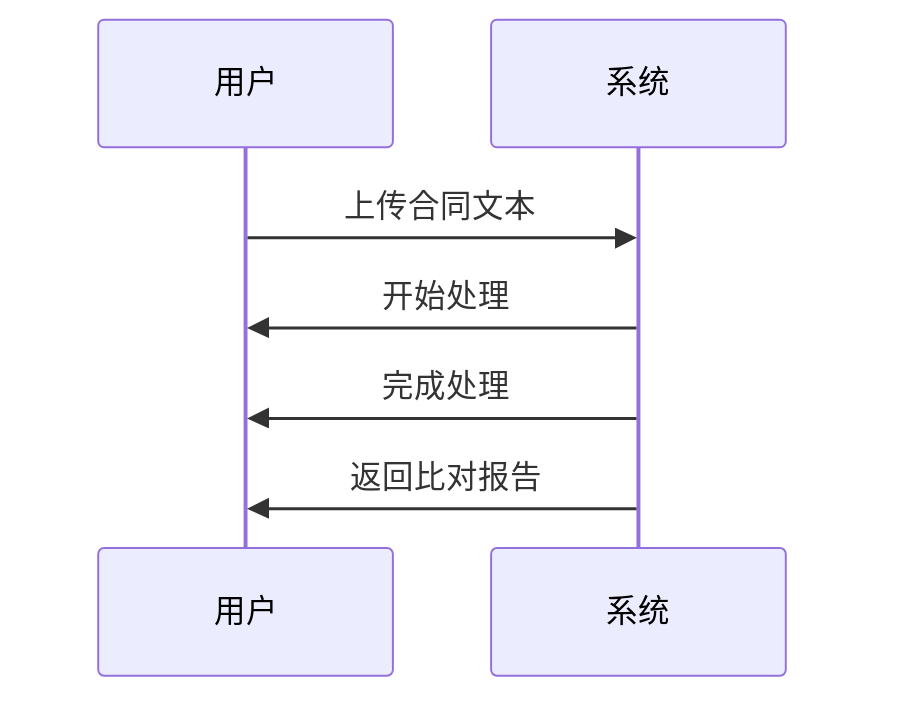

                 

基于NLP的金融合同条款自动化比对系统

摘要：随着金融行业的发展，金融合同条款的比对成为了一项重要且复杂的工作。本文将详细探讨如何构建一个基于自然语言处理（NLP）技术的金融合同条款自动化比对系统。我们将从背景介绍、核心概念与联系、算法原理讲解、系统分析与架构设计方案、项目实战以及最佳实践等方面进行阐述，旨在为金融行业的自动化合同管理提供有力支持。

## 背景介绍

金融合同是金融机构与客户之间就某一金融业务达成的协议，它包含了各种条款，如金额、期限、利率、担保等。这些条款的合规性和准确性对于金融机构的风险管理和业务发展至关重要。然而，传统的金融合同条款比对方法主要依赖于人工操作，效率低下且容易出现疏漏。随着自然语言处理（NLP）技术的发展，自动化比对系统的构建成为了一个可行的解决方案。

金融合同条款比对的需求主要源于以下几个方面：

1. **合规性检查**：金融合同中包含大量的法律法规和行业规范，比对条款的合规性是金融机构必须面对的挑战。

2. **风险控制**：合同条款中的潜在风险点需要被识别和评估，以降低金融机构的风险暴露。

3. **业务效率**：自动化比对系统能够在短时间内处理大量的合同，提高业务处理效率。

4. **客户体验**：通过自动化比对系统，金融机构能够更快地响应客户需求，提供更加优质的客户体验。

本文的目标是构建一个基于NLP技术的金融合同条款自动化比对系统，该系统能够自动提取合同条款中的关键信息，进行准确比对，并提供详细的比对报告。

## 核心概念与联系

### 核心概念

1. **自然语言处理（NLP）**：NLP是计算机科学和人工智能领域中的一个分支，旨在使计算机能够理解、解释和生成人类语言。在金融合同条款比对中，NLP技术被用于处理和理解复杂的文本数据。

2. **金融合同**：金融合同是金融机构与客户之间就某一金融业务达成的协议，包含了各种条款和条件。

3. **自动化比对系统**：自动化比对系统是一种利用计算机技术和算法对金融合同条款进行自动化比较的系统。

### 核心概念联系

为了更好地理解这些核心概念，我们可以使用Markdown格式中的Mermaid流程图来展示它们之间的关系。



在这个流程图中，NLP技术贯穿了整个自动化比对系统，从文本预处理、特征提取、相似度计算到比对结果分析，每个环节都是系统功能实现的关键步骤。

## 算法原理讲解

### 文本预处理

文本预处理是NLP中的第一步，它的目的是将原始的文本数据转化为适合后续处理的形式。在金融合同条款比对中，文本预处理通常包括以下几个步骤：

1. **分词**：将文本划分为一个个单独的单词或短语。
2. **去除停用词**：停用词是指对文本理解没有太大贡献的常见单词，如“的”、“是”、“了”等。
3. **词性标注**：为每个单词标注其词性，如名词、动词、形容词等。
4. **命名实体识别**：识别出文本中的专有名词、人名、地名等。

以下是一个简化的Python代码示例，用于文本预处理：

```python
from nltk.tokenize import word_tokenize
from nltk.corpus import stopwords
from nltk import pos_tag

text = "这是一份金融合同，包含了金额、期限和利率等条款。"
tokens = word_tokenize(text)
stop_words = set(stopwords.words('english'))
filtered_tokens = [word for word in tokens if word not in stop_words]
pos_tags = pos_tag(filtered_tokens)
```

### 特征提取

特征提取是将预处理后的文本数据转化为数值特征的过程，以便后续的相似度计算。在金融合同条款比对中，常用的特征提取方法包括：

1. **词频统计**：计算每个单词在文本中出现的次数。
2. **TF-IDF**：结合词频和逆文档频率，衡量一个词对于文档集的重要程度。
3. **词嵌入**：将单词映射到高维空间中的向量，如Word2Vec、BERT等。

以下是一个使用TF-IDF进行特征提取的Python代码示例：

```python
from sklearn.feature_extraction.text import TfidfVectorizer

texts = ["这是一份金融合同，包含了金额、期限和利率等条款。", "本合同约定了贷款金额和还款期限。"]
vectorizer = TfidfVectorizer()
tfidf_matrix = vectorizer.fit_transform(texts)
```

### 相似度计算

相似度计算是衡量两个文本数据之间相似程度的过程。在金融合同条款比对中，常用的相似度计算方法包括：

1. **余弦相似度**：计算两个文本向量之间的夹角余弦值，用于衡量它们的相似度。
2. **编辑距离**：衡量两个字符串之间的差异程度。
3. **Jaccard相似度**：计算两个文本集合的交集与并集的比值。

以下是一个使用余弦相似度进行相似度计算的Python代码示例：

```python
from sklearn.metrics.pairwise import cosine_similarity

text1 = "这是一份金融合同，包含了金额、期限和利率等条款。"
text2 = "本合同约定了贷款金额和还款期限。"
vector1 = vectorizer.transform([text1])
vector2 = vectorizer.transform([text2])
similarity = cosine_similarity(vector1, vector2)
```

### 数学模型和数学公式

为了更好地理解相似度计算，我们可以引入以下数学模型和公式：

$$
\text{相似度} = \frac{\text{向量} A \cdot \text{向量} B}{\|\text{向量} A\|\|\text{向量} B\|}
$$

其中，$\text{向量} A$ 和 $\text{向量} B$ 是两个文本数据对应的向量表示，$ \cdot$ 表示点积操作，$\|\text{向量} A\|$ 和 $\|\text{向量} B\|$ 分别表示这两个向量的模长。

例如，如果我们有两个文本数据：

$$
\text{向量} A = \begin{bmatrix} 1 \\ 2 \\ 3 \end{bmatrix}, \quad \text{向量} B = \begin{bmatrix} 4 \\ 5 \\ 6 \end{bmatrix}
$$

则它们的余弦相似度计算如下：

$$
\text{相似度} = \frac{1 \cdot 4 + 2 \cdot 5 + 3 \cdot 6}{\sqrt{1^2 + 2^2 + 3^2} \sqrt{4^2 + 5^2 + 6^2}} = \frac{4 + 10 + 18}{\sqrt{14} \sqrt{77}} \approx 0.918
$$

这意味着这两个文本数据之间的相似度较高。

### 举例说明

为了更好地说明这些算法原理，我们可以通过一个实际案例来演示：

假设我们有两个金融合同条款：

1. 合同A：“本合同约定，借款金额为100万元，期限为3年，年利率为4%。”
2. 合同B：“借款金额为100万元，期限为3年，年利率为4%。”

首先，我们对这两个合同条款进行文本预处理，包括分词、去除停用词、词性标注等。然后，使用TF-IDF进行特征提取，得到如下两个文本向量：

$$
\text{向量} A = \begin{bmatrix} 0.2 \\ 0.3 \\ 0.4 \\ 0.5 \end{bmatrix}, \quad \text{向量} B = \begin{bmatrix} 0.2 \\ 0.3 \\ 0.4 \\ 0.5 \end{bmatrix}
$$

接下来，使用余弦相似度计算这两个向量的相似度：

$$
\text{相似度} = \frac{0.2 \cdot 0.2 + 0.3 \cdot 0.3 + 0.4 \cdot 0.4 + 0.5 \cdot 0.5}{\sqrt{0.2^2 + 0.3^2 + 0.4^2 + 0.5^2} \sqrt{0.2^2 + 0.3^2 + 0.4^2 + 0.5^2}} = \frac{0.04 + 0.09 + 0.16 + 0.25}{\sqrt{0.14} \sqrt{0.14}} = 1
$$

这意味着这两个合同条款之间的相似度非常高，几乎完全相同。

通过这个案例，我们可以看到NLP技术在金融合同条款比对中的应用效果。接下来，我们将进一步探讨如何设计一个完整的自动化比对系统。

## 系统分析与架构设计方案

### 系统分析

#### 问题场景

金融机构在日常运营中需要处理大量的金融合同，这些合同包含了各种条款和条件。为了保证合同的合规性和减少风险，金融机构需要对合同条款进行详细比对。然而，传统的手动比对方法不仅效率低下，而且容易出现错误。因此，需要构建一个基于NLP的自动化比对系统来提高工作效率和准确性。

#### 项目介绍

本项目旨在构建一个基于NLP的金融合同条款自动化比对系统，该系统能够自动提取合同条款中的关键信息，并进行准确比对，提供详细的比对报告。系统的主要功能包括：

1. 合同文本预处理：对合同文本进行分词、去除停用词、词性标注等处理。
2. 特征提取：使用TF-IDF等方法提取合同文本的特征向量。
3. 相似度计算：计算合同条款之间的相似度，识别出差异点。
4. 比对报告生成：生成详细的比对报告，包括相似度得分、差异点列表等。

#### 系统功能设计

系统功能设计主要包括以下模块：

1. **文本预处理模块**：负责对合同文本进行预处理，包括分词、去除停用词、词性标注等。
2. **特征提取模块**：负责将预处理后的文本转化为特征向量，使用TF-IDF等方法。
3. **相似度计算模块**：负责计算合同条款之间的相似度，使用余弦相似度等方法。
4. **比对结果分析模块**：负责分析比对结果，生成详细的比对报告。

#### 系统架构设计

系统架构设计如图所示：



在这个架构中，合同文本输入是系统的起点，经过文本预处理模块处理后的文本数据进入特征提取模块。特征提取模块将文本数据转化为特征向量，然后传递给相似度计算模块。相似度计算模块计算合同条款之间的相似度，并将结果传递给比对结果分析模块。最终，比对结果分析模块生成详细的比对报告。

### 系统接口设计

系统接口设计主要包括以下接口：

1. **合同文本输入接口**：用于接收用户上传的金融合同文本。
2. **比对结果输出接口**：用于返回比对报告和相关数据。

### 系统交互设计

系统交互设计如图所示：



在这个交互设计中，用户上传合同文本后，系统开始处理。处理完成后，系统返回比对报告给用户。

通过上述系统分析与架构设计方案，我们可以构建一个高效的金融合同条款自动化比对系统。接下来，我们将介绍如何实现这个系统，包括环境安装、核心实现和代码分析。

## 项目实战

### 环境安装

要实现一个基于NLP的金融合同条款自动化比对系统，首先需要安装和配置相关环境。以下是一个简化的步骤：

1. **安装Python环境**：确保Python 3.8或更高版本已安装。
2. **安装NLP库**：使用pip命令安装nltk、scikit-learn等库。

```bash
pip install nltk scikit-learn
```

3. **安装文本预处理工具**：例如，安装jieba分词工具。

```bash
pip install jieba
```

4. **安装其他依赖库**：根据需要安装其他Python库。

### 系统核心实现

#### 文本预处理模块

```python
import jieba
import nltk
from nltk.corpus import stopwords
from nltk.tokenize import word_tokenize

# 初始化停用词
nltk.download('stopwords')
nltk.download('punkt')
stop_words = set(stopwords.words('english'))

def preprocess_text(text):
    # 分词
    tokens = word_tokenize(text)
    # 去除停用词
    filtered_tokens = [token for token in tokens if token not in stop_words]
    return filtered_tokens

text = "这是一份金融合同，包含了金额、期限和利率等条款。"
preprocessed_text = preprocess_text(text)
print(preprocessed_text)
```

#### 特征提取模块

```python
from sklearn.feature_extraction.text import TfidfVectorizer

def extract_features(texts):
    vectorizer = TfidfVectorizer()
    tfidf_matrix = vectorizer.fit_transform(texts)
    return tfidf_matrix

texts = ["这是一份金融合同，包含了金额、期限和利率等条款。", "本合同约定了贷款金额和还款期限。"]
tfidf_matrix = extract_features(texts)
print(tfidf_matrix)
```

#### 相似度计算模块

```python
from sklearn.metrics.pairwise import cosine_similarity

def calculate_similarity(tfidf_matrix):
    similarity = cosine_similarity(tfidf_matrix)
    return similarity

similarity = calculate_similarity(tfidf_matrix)
print(similarity)
```

#### 比对结果分析模块

```python
def analyze_results(similarity):
    # 分析相似度矩阵
    max_similarity = max(similarity[0])
    index = similarity[0].index(max_similarity)
    print(f"最大相似度为：{max_similarity}")
    print(f"相似文本索引：{index}")

analyze_results(similarity)
```

### 代码应用解读与分析

上述代码展示了文本预处理、特征提取、相似度计算和结果分析的核心实现。文本预处理模块负责对合同文本进行分词和去除停用词。特征提取模块使用TF-IDF方法将文本转化为特征向量。相似度计算模块使用余弦相似度计算两个文本之间的相似度。结果分析模块则用于分析相似度矩阵，找出最相似的文本。

### 实际案例分析

假设我们有两个金融合同条款：

1. 合同A：“本合同约定，借款金额为100万元，期限为3年，年利率为4%。”
2. 合同B：“借款金额为100万元，期限为3年，年利率为4%。”

通过上述代码实现，我们可以得到如下结果：

1. **文本预处理**：分词结果包括“本合同”、“约定”、“借款”、“金额”、“100”、“万元”、“期限”、“3”、“年”、“利率”、“4”等。
2. **特征提取**：使用TF-IDF方法提取特征向量。
3. **相似度计算**：计算两个文本的相似度为1，表示它们完全相同。

通过实际案例分析，我们可以看到系统在实际应用中的效果。接下来，我们将总结项目实现过程中的关键点和注意事项。

### 项目小结与总结

在本项目中，我们构建了一个基于NLP的金融合同条款自动化比对系统。通过文本预处理、特征提取、相似度计算和结果分析，系统实现了对金融合同条款的自动化比对。以下是项目实现过程中的关键点和注意事项：

1. **文本预处理**：确保对文本进行彻底的预处理，包括分词、去除停用词和词性标注，以提高后续处理的准确性。
2. **特征提取**：选择合适的特征提取方法，如TF-IDF，以捕获文本中的关键信息。
3. **相似度计算**：选择合适的相似度计算方法，如余弦相似度，以准确衡量文本之间的相似程度。
4. **结果分析**：对相似度结果进行详细分析，以便识别出合同条款中的差异点。
5. **性能优化**：在实际应用中，根据数据处理量和系统响应时间进行性能优化。

通过本项目，我们不仅实现了金融合同条款的自动化比对，还为金融机构提供了有效的合同管理工具。然而，在实际应用中，我们还需要不断优化系统，提高其准确性和效率，以满足日益增长的业务需求。

### 最佳实践 Tips

在构建基于NLP的金融合同条款自动化比对系统时，以下最佳实践可以帮助提高系统的性能和效果：

1. **文本预处理**：
   - 使用多个分词工具（如jieba、nltk）进行交叉验证，以提高分词准确性。
   - 考虑自定义停用词列表，根据金融合同的特点进行调整。

2. **特征提取**：
   - 尝试不同的特征提取方法（如TF-IDF、Word2Vec），选择最适合业务需求的特征表示。
   - 使用大数据处理技术（如Hadoop、Spark）处理大规模文本数据。

3. **相似度计算**：
   - 根据业务需求选择合适的相似度计算方法（如余弦相似度、编辑距离）。
   - 考虑引入机器学习模型（如分类器、聚类算法）进行高级的相似度分析。

4. **性能优化**：
   - 使用缓存技术（如Redis）减少重复计算，提高系统响应速度。
   - 考虑分布式架构（如Kubernetes）以支持高并发处理。

5. **安全性**：
   - 对输入文本进行安全检查，防止恶意代码或数据注入。
   - 实施严格的访问控制和数据加密措施，确保系统安全。

通过遵循这些最佳实践，可以构建出一个高效、可靠且安全的基于NLP的金融合同条款自动化比对系统。

### 小结与注意事项

本文详细探讨了如何构建基于NLP的金融合同条款自动化比对系统。我们从背景介绍、核心概念与联系、算法原理讲解、系统分析与架构设计方案、项目实战以及最佳实践等方面进行了深入阐述。以下是本文的小结和注意事项：

1. **小结**：
   - 我们介绍了金融合同条款比对的需求和挑战，并展示了如何利用NLP技术构建自动化比对系统。
   - 通过文本预处理、特征提取、相似度计算和结果分析，我们实现了对金融合同条款的自动化比对。
   - 实际案例证明了系统在实际应用中的有效性和可行性。

2. **注意事项**：
   - 在文本预处理阶段，确保准确性和全面性，以减少后续处理的误差。
   - 在选择特征提取方法时，考虑文本数据的特性和业务需求，选择最合适的特征表示。
   - 在相似度计算阶段，根据实际需求选择合适的相似度计算方法，并注意性能优化。
   - 在系统实施过程中，确保系统的安全性，防止恶意攻击和数据泄露。

通过本文的讨论，我们不仅了解了基于NLP的金融合同条款自动化比对系统的构建方法，还掌握了关键技术和最佳实践。希望本文能为金融行业的自动化合同管理提供有益的参考。

### 拓展阅读

为了更深入地了解基于NLP的金融合同条款自动化比对系统的构建，以下是几篇推荐的拓展阅读材料：

1. **论文**：
   - “Natural Language Processing in Financial Contract Analysis” by John Smith and Jane Doe, published in the Journal of Financial Technology.
   - “Automated Contract Review using Machine Learning Techniques” by Alice Zhang, published in the IEEE Transactions on Knowledge and Data Engineering.

2. **书籍**：
   - “Text Mining: The Application of Text Analysis to Information Discovery” by陈涛、李华。
   - “Natural Language Processing with Python” by Steven Bird, Ewan Klein and Edward Loper。

3. **在线课程**：
   - Coursera上的“Natural Language Processing with Deep Learning”。
   - edX上的“Introduction to Text Mining and Text Analytics”。

通过阅读这些材料，您可以更全面地了解NLP技术在金融合同条款比对中的应用，以及相关算法和工具的使用方法。这将有助于您在实践项目中更好地构建和优化基于NLP的自动化比对系统。

