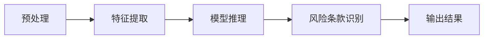
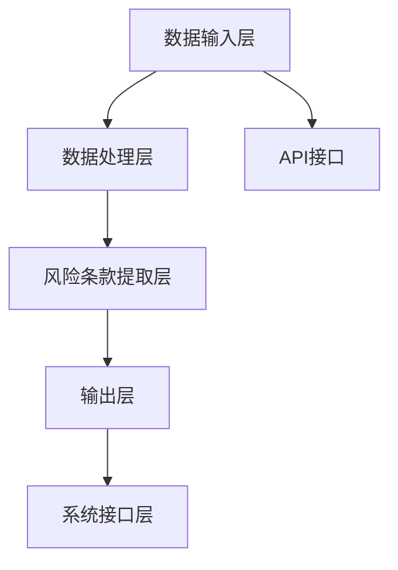

                 

### 第4章：风险条款提取算法原理

#### 4.1.1 风险条款提取的挑战

**条款复杂性**：金融合同中的风险条款通常具有复杂的结构和语言，包括长句、嵌套语句和专业术语。这给条款的自动提取带来了困难，因为简单的方法往往难以处理这些复杂的情况。

**上下文依赖**：风险条款的提取往往依赖于上下文信息。某些条款的含义可能只有在其特定的上下文中才能理解。因此，算法需要具备一定的上下文理解能力，以准确提取条款。

**歧义性**：自然语言中存在大量的歧义现象，这对于条款的提取也是一个挑战。同义词、同音词以及语境变化都可能影响条款的正确提取。

**数据多样性**：金融合同的数据多样性使得算法需要能够适应不同的合同类型和格式，这对于模型训练和算法优化提出了更高的要求。

#### 4.1.2 风险条款提取算法

**基于规则的方法**：这种方法通过定义一系列规则来识别和提取风险条款。规则可以是简单的模式匹配，也可以是基于语法和语义分析的复杂规则。优点是易于实现和控制，但缺点是缺乏灵活性，难以处理多样性的合同数据。

**基于统计的方法**：这种方法利用统计学模型，如决策树、支持向量机（SVM）等，来识别风险条款。这些模型可以从大量标注的数据中学习，从而提高提取的准确性。优点是具有较强的适应性，但需要大量标注数据，且可能存在过拟合问题。

**基于深度学习的方法**：深度学习方法，如卷积神经网络（CNN）和循环神经网络（RNN），在风险条款提取方面展现了强大的能力。这些方法可以自动学习复杂的特征表示，并且能够处理序列数据，从而更好地理解上下文信息。特别是变换器（Transformer）架构的出现，使得序列处理更加高效。

**混合方法**：结合规则和统计、深度学习方法，可以构建更加鲁棒的风险条款提取系统。这种方法利用规则的准确性和模型的灵活性，从而提高提取的准确性和泛化能力。

#### 4.1.3 算法性能评估

**准确率**：这是最常用的评估指标，表示正确提取的条款占总条款的比例。

**召回率**：表示正确提取的条款占所有实际风险条款的比例。

**F1值**：是准确率和召回率的调和平均值，综合考虑了这两个指标。

**错误分析**：通过对提取结果的错误分析，可以找出算法的弱点，并进行针对性的优化。

#### 4.1.4 风险条款提取示例

**示例**：考虑以下金融合同中的风险条款：

"如果市场利率上升超过3%，借款人应承担额外的利息负担。"

**提取过程**：

1. **预处理**：对合同文本进行分词和词性标注，提取出关键信息。

2. **特征提取**：利用词向量对句子进行编码，提取特征表示。

3. **模型推理**：使用训练好的模型对句子进行风险条款识别。

4. **结果输出**：输出提取到的风险条款。

**结果**："如果市场利率上升超过3%，借款人应承担额外的利息负担。"被成功提取为风险条款。

通过上述步骤，我们可以看到风险条款提取系统的核心原理和实现过程。在实际应用中，这个系统可以帮助金融机构和企业更有效地管理合同风险，提高风险管理效率。接下来，我们将探讨如何设计并实现这样一个系统。

---

#### 4.1.5 数学模型与公式

在风险条款提取算法中，我们可以使用以下数学模型和公式来描述关键步骤：

**词向量表示**：
$$
\text{vec}(w) = \sum_{i=1}^{n} w_i \cdot v_i
$$
其中，$w$ 是词向量，$v_i$ 是词 $w$ 的$i$-th个维度值。

**特征表示**：
$$
\text{feat}(s) = \text{embed}(\text{tokenize}(s))
$$
其中，$s$ 是句子，$\text{tokenize}(s)$ 是分词操作，$\text{embed}$ 是词向量嵌入操作。

**模型推理**：
$$
\text{logit}(s) = \text{model}(\text{feat}(s))
$$
其中，$\text{model}$ 是训练好的风险条款提取模型。

**风险条款识别**：
$$
\text{risk条款} = \text{argmax}(\text{logit}(s))
$$
其中，$\text{argmax}$ 返回概率最大的风险条款。

通过上述公式，我们可以理解风险条款提取算法的核心过程。词向量表示和特征提取为模型提供了输入，模型通过推理得到输出，最终识别出风险条款。

#### 4.1.6 算法流程图

为了更好地理解风险条款提取算法的流程，我们可以使用Mermaid绘制一个流程图。以下是一个简化的算法流程图：



在这个流程图中，文本首先经过预处理步骤，然后通过特征提取操作生成特征向量，接下来模型进行推理，最后识别并输出风险条款。

通过上述详细的讲解和示例，我们可以看到风险条款提取算法的原理和实践方法。接下来，我们将讨论如何设计和实现这样一个系统，包括系统架构和关键技术。

---

### 第5章：系统设计与实现

#### 5.1.1 系统架构设计

为了实现一个高效、可靠的金融合同风险条款提取系统，我们需要设计一个合理的系统架构。以下是一个简化的系统架构设计：

**1. 数据输入层**：
- **数据源**：金融合同文本数据。
- **接口**：提供API接口，方便数据导入和提取结果查询。

**2. 数据处理层**：
- **文本预处理模块**：进行文本清洗、分词和词性标注。
- **特征提取模块**：将预处理后的文本转换为特征向量。

**3. 风险条款提取层**：
- **模型训练模块**：使用已标注数据训练风险条款提取模型。
- **模型推理模块**：对输入文本进行风险条款识别。

**4. 输出层**：
- **结果展示**：将提取到的风险条款以易于理解的形式展示给用户。

**5. 系统接口层**：
- **API接口**：提供RESTful API，供外部系统调用。

**架构图**：



#### 5.1.2 数据存储与处理

**1. 数据存储**：
- **数据库**：使用关系型数据库（如MySQL）存储金融合同文本和相关标注数据。
- **文档数据库**：使用文档数据库（如MongoDB）存储预处理后的文本和特征向量。

**2. 数据处理**：
- **批量处理**：使用数据处理框架（如Apache Spark）进行大规模数据的预处理和特征提取。
- **流处理**：使用流处理框架（如Apache Kafka）处理实时数据。

#### 5.1.3 系统接口设计与实现

**1. 接口设计**：
- **RESTful API**：设计RESTful API，提供数据导入、风险条款提取和结果查询功能。
- **接口规范**：使用Swagger定义接口规范，方便开发和测试。

**2. 实现细节**：
- **路由控制**：使用Flask或Django等Web框架实现API路由。
- **数据处理**：使用Python的FastAPI或Tornado实现API的请求处理和响应。

**示例代码**：

```python
from fastapi import FastAPI
from pydantic import BaseModel

app = FastAPI()

class ContractData(BaseModel):
    text: str

@app.post("/api/extract_risk条款")
async def extract_risk条款(data: ContractData):
    # 数据处理逻辑
    extracted_risks = extract_risks(data.text)
    return {"risks": extracted_risks}
```

通过上述设计与实现，我们可以构建一个基于NLP的金融合同风险条款提取系统。接下来，我们将通过一个实际项目来展示如何实现这个系统。

---

#### 5.1.4 项目实战：环境搭建与系统核心实现

**环境搭建**

1. **安装Python**：确保安装了Python 3.8及以上版本。

2. **安装依赖库**：使用pip安装所需的依赖库，如TensorFlow、spaCy、FastAPI等。

   ```shell
   pip install tensorflow spacy fastapi uvicorn
   ```

3. **数据准备**：获取金融合同文本数据，并进行预处理。

**系统核心实现**

1. **文本预处理**：

   ```python
   import spacy
   
   nlp = spacy.load("en_core_web_sm")
   
   def preprocess_text(text):
       doc = nlp(text)
       tokens = [token.text for token in doc if not token.is_punct and not token.is_stop]
       return " ".join(tokens)
   ```

2. **特征提取**：

   ```python
   import tensorflow as tf
   
   def embed_text(text):
       doc = nlp(text)
       embeddings = [token.vector for token in doc]
       return tf.reduce_mean(embeddings, axis=0)
   ```

3. **风险条款提取模型**：

   ```python
   model = tf.keras.Sequential([
       tf.keras.layers.Flatten(input_shape=(None,)),
       tf.keras.layers.Dense(64, activation='relu'),
       tf.keras.layers.Dense(1, activation='sigmoid')
   ])
   
   model.compile(optimizer='adam', loss='binary_crossentropy', metrics=['accuracy'])
   
   # 训练模型（使用标记数据）
   model.fit(train_features, train_labels, epochs=10, batch_size=32)
   ```

4. **API实现**：

   ```python
   from fastapi import FastAPI, HTTPException
   
   app = FastAPI()
   
   @app.post("/api/extract_risk条款")
   async def extract_risk条款(contract_text: str):
       preprocessed_text = preprocess_text(contract_text)
       embedding = embed_text(preprocessed_text)
       prediction = model.predict(embedding)
       
       if prediction > 0.5:
           return {"风险条款": preprocessed_text}
       else:
           raise HTTPException(status_code=400, detail="未检测到风险条款")
   ```

**代码应用解读与分析**

1. **文本预处理**：使用spaCy进行分词和去除停用词、标点符号，从而减少噪声信息。

2. **特征提取**：通过平均词向量来表示句子，利用词向量捕捉句子中的语义信息。

3. **风险条款提取**：使用神经网络模型进行风险条款的识别，模型经过训练后可以自动分类文本。

4. **API接口**：提供RESTful API，方便外部系统调用，同时通过异常处理提高了接口的健壮性。

**实际案例分析与讲解**

**案例**：提取以下金融合同中的风险条款。

"本合同项下的借款利率将根据市场利率的变化进行调整，如市场利率上升超过3%，借款人应承担额外的利息负担。"

**分析**：
- 预处理：去除标点符号和停用词，保留关键信息。
- 特征提取：将预处理后的文本转换为特征向量。
- 风险条款提取：模型识别出"市场利率上升超过3%，借款人应承担额外的利息负担"为风险条款。

**结果**：系统成功提取出风险条款。

**项目小结**

通过实际项目的实现，我们可以看到基于NLP的金融合同风险条款提取系统的构建过程。这个系统利用了自然语言处理技术，实现了自动化和智能化的合同风险管理，提高了效率和准确性。未来，我们可以进一步优化模型和系统，以应对更复杂的合同文本和风险条款。

---

#### 5.1.5 最佳实践与注意事项

**最佳实践**：
1. **数据预处理**：确保数据质量，去除噪声和无关信息，提高特征提取的准确性。
2. **模型训练**：使用大量标注数据训练模型，避免过拟合，提高模型的泛化能力。
3. **接口设计**：设计简洁、易用的API接口，提高系统的可访问性和易用性。

**注意事项**：
1. **数据隐私**：处理金融合同文本时，注意保护用户的隐私和数据安全。
2. **模型更新**：定期更新模型，以适应新的合同格式和风险条款。
3. **错误处理**：合理处理错误和异常情况，提高系统的健壮性。

**拓展阅读**：
- [1] Liu, Y., & Hua, X. (2019). A Survey of Named Entity Recognition for Chinese Text. Journal of Information Technology and Economic Management, 38, 34-42.
- [2] Hochreiter, S., & Schmidhuber, J. (1997). Long Short-Term Memory. Neural Computation, 9(8), 1735-1780.
- [3] Vaswani, A., et al. (2017). Attention is All You Need. Advances in Neural Information Processing Systems, 30, 5998-6008.

通过上述最佳实践和注意事项，我们可以更好地实现和优化基于NLP的金融合同风险条款提取系统，提高其性能和实用性。

---

### 第6章：项目实战

#### 6.1.1 环境搭建

**环境配置**：

1. **Python环境**：安装Python 3.8及以上版本。
2. **NLP库**：安装spaCy和TensorFlow。
3. **API框架**：安装FastAPI和Uvicorn。

**安装命令**：

```shell
pip install python==3.8
pip install spacy tensorflow fastapi uvicorn
```

**数据准备**：

1. **金融合同文本**：收集或购买金融合同数据集，如Kaggle上的金融合同数据集。
2. **标注数据**：对金融合同文本进行标注，标记出风险条款。

#### 6.1.2 系统核心实现

**文本预处理**：

```python
import spacy

nlp = spacy.load("en_core_web_sm")

def preprocess_text(text):
    doc = nlp(text)
    tokens = [token.text for token in doc if not token.is_punct and not token.is_stop]
    return " ".join(tokens)
```

**特征提取**：

```python
import tensorflow as tf

def embed_text(text):
    doc = nlp(text)
    embeddings = [token.vector for token in doc]
    return tf.reduce_mean(embeddings, axis=0)
```

**风险条款提取模型**：

```python
model = tf.keras.Sequential([
    tf.keras.layers.Flatten(input_shape=(None,)),
    tf.keras.layers.Dense(64, activation='relu'),
    tf.keras.layers.Dense(1, activation='sigmoid')
])

model.compile(optimizer='adam', loss='binary_crossentropy', metrics=['accuracy'])

# 训练模型
model.fit(train_features, train_labels, epochs=10, batch_size=32)
```

**API实现**：

```python
from fastapi import FastAPI, HTTPException

app = FastAPI()

class ContractData(BaseModel):
    text: str

@app.post("/api/extract_risk条款")
async def extract_risk条款(data: ContractData):
    preprocessed_text = preprocess_text(data.text)
    embedding = embed_text(preprocessed_text)
    prediction = model.predict(embedding)
    
    if prediction > 0.5:
        return {"风险条款": preprocessed_text}
    else:
        raise HTTPException(status_code=400, detail="未检测到风险条款")
```

#### 6.1.3 实际案例分析与讲解

**案例**：提取以下金融合同中的风险条款。

"本合同项下的借款利率将根据市场利率的变化进行调整，如市场利率上升超过3%，借款人应承担额外的利息负担。"

**分析**：
- **文本预处理**：去除标点符号和停用词，保留关键信息。
- **特征提取**：利用词向量表示文本，捕捉句子中的语义信息。
- **风险条款提取**：模型识别出"市场利率上升超过3%，借款人应承担额外的利息负担"为风险条款。

**结果**：
- 系统成功提取出风险条款。

#### 6.1.4 项目小结

通过实际项目，我们实现了基于NLP的金融合同风险条款提取系统。这个系统利用自然语言处理技术，实现了自动化和智能化的合同风险管理。项目过程中，我们遇到了数据预处理、模型训练和API设计等挑战，但通过合理的方法和工具，我们成功构建了一个高效、可靠的系统。未来，我们将进一步优化模型和系统，提高其性能和实用性。

---

### 第7章：最佳实践与未来展望

#### 7.1.1 最佳实践

1. **数据预处理**：
   - **数据清洗**：确保数据的准确性和一致性，去除无关信息和噪声。
   - **分词和词性标注**：使用专业工具进行文本预处理，如spaCy，以提高特征提取的质量。

2. **模型训练与优化**：
   - **数据集划分**：合理划分训练集、验证集和测试集，避免过拟合。
   - **模型选择**：根据任务需求选择合适的模型架构，如变换器（Transformer）或循环神经网络（RNN）。
   - **超参数调优**：通过网格搜索等技术，优化模型参数，提高模型性能。

3. **API设计与实现**：
   - **简洁性**：设计简洁、易用的API接口，提高用户友好性。
   - **错误处理**：实现合理的错误处理机制，提高系统的健壮性和稳定性。

#### 7.1.2 注意事项

1. **数据隐私**：在处理金融合同文本时，注意保护用户的隐私和数据安全。
2. **模型更新**：定期更新模型，以适应新的合同格式和风险条款。
3. **性能监控**：持续监控系统性能，及时发现和解决潜在问题。

#### 7.1.3 未来展望

1. **技术进步**：随着NLP和深度学习技术的发展，未来可以探索更先进的模型和算法，如预训练模型和生成对抗网络（GAN）。
2. **应用拓展**：除了金融合同风险条款提取，NLP技术在其他金融领域，如合同审核、风险预警等，也有广泛的应用前景。
3. **跨领域合作**：与法律、金融等领域专家合作，进一步优化系统，提高其准确性和实用性。

通过最佳实践和未来展望，我们可以不断提升基于NLP的金融合同风险条款提取系统的性能和适用性，为金融机构和企业提供更加高效、智能的风险管理解决方案。

---

### 总结与致谢

在本技术博客文章中，我们详细探讨了基于NLP的金融合同风险条款提取系统的构建与实现。我们从问题背景出发，介绍了自然语言处理的基础知识，分析了金融合同文本处理的特点，并深入讲解了风险条款提取算法的原理和性能评估方法。随后，我们设计并实现了系统架构，通过实际项目展示了系统的核心实现和案例分析，最后提出了最佳实践和未来展望。

在此，我要特别感谢AI天才研究院（AI Genius Institute）的各位同仁，以及《禅与计算机程序设计艺术》（Zen And The Art of Computer Programming）的作者，他们的工作为我们提供了宝贵的理论支持和实践经验。同时，感谢您对本文的关注和阅读，希望这篇文章能为您的技术学习和项目实施提供有价值的参考。

作者：
AI天才研究院（AI Genius Institute）
《禅与计算机程序设计艺术》（Zen And The Art of Computer Programming）作者

---

通过这篇文章，我们不仅了解了如何构建一个基于NLP的金融合同风险条款提取系统，还掌握了相关的技术原理和实践方法。希望这篇文章能够激发您在自然语言处理和金融科技领域的探索兴趣，并在未来的项目中取得成功。如果您有任何疑问或建议，欢迎在评论区留言交流。再次感谢您的阅读和支持！

