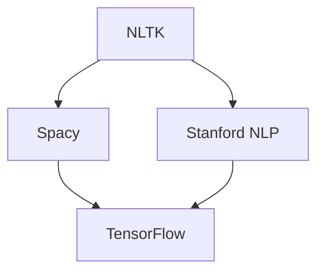
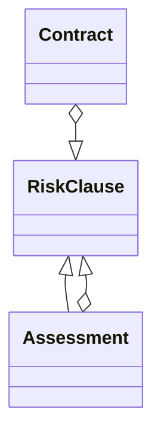
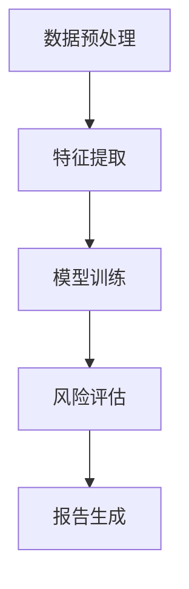
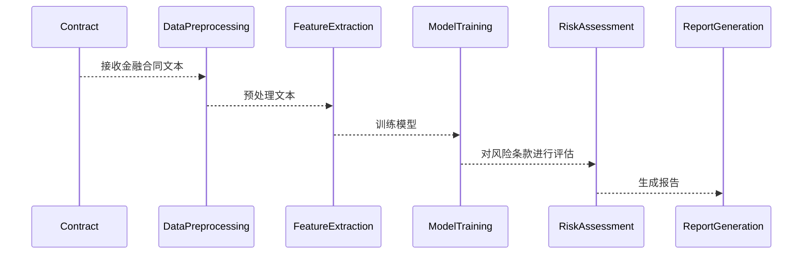

                 


# 构建基于NLP的金融合同风险条款自动化提取与评估系统

## 关键词
- 自然语言处理（NLP）
- 金融合同
- 风险条款
- 自动化提取
- 评估系统

## 摘要
本文旨在探讨构建基于自然语言处理（NLP）技术的金融合同风险条款自动化提取与评估系统的过程。我们首先介绍了金融合同和风险条款的重要性及当前面临的主要挑战，随后详细阐述了NLP技术在金融合同风险条款处理中的应用。文章随后深入分析了NLP的基础技术，包括语言模型、文本处理技术和文本分析技术，以及这些技术在金融合同风险条款自动化提取中的应用。最后，我们讨论了风险条款的自动化评估方法，并给出了系统架构设计、项目实战以及最佳实践 tips。

## 第一部分：背景介绍与核心概念

### 第1章：问题背景与核心概念

#### 1.1 问题背景

金融合同是金融机构与企业之间进行业务往来的重要法律文件，其中包含的条款直接关系到各方的权利和义务。风险条款是金融合同中的一个关键部分，它明确指出了合同中可能存在的风险因素，以及各方在风险事件发生时的应对措施。然而，由于金融合同的复杂性和文本的冗长性，手动提取和评估这些风险条款既费时又容易出错。

当前，金融合同风险条款处理面临的主要挑战包括：

1. **文本复杂性**：金融合同通常包含大量的专业术语和复杂的法律条文，这使得自动化处理成为一大难题。
2. **准确性要求高**：风险条款的提取和评估需要高度的准确性，任何错误都可能导致严重的法律和经济后果。
3. **工作量巨大**：大量的金融合同需要定期审查和更新，手工处理工作量巨大。

#### 1.2 核心概念

**自然语言处理（NLP）**：NLP是人工智能的一个重要分支，旨在使计算机能够理解、生成和处理人类语言。NLP的主要任务包括文本分类、信息提取、语义分析等。

**金融合同风险条款**：金融合同风险条款是指合同中明确指出的可能对各方产生不利影响的风险因素和应对措施。

**风险评估与自动化提取**：风险评估是评估合同中条款可能带来的风险程度和影响的过程。自动化提取是指利用计算机技术自动从文本中提取出相关的风险条款。

### 1.3 本章小结

本章介绍了金融合同风险条款的重要性以及当前处理中面临的主要挑战。同时，我们定义了自然语言处理、金融合同风险条款以及风险评估和自动化提取等核心概念，为后续章节的分析和讨论奠定了基础。

## 第二部分：基于NLP的金融合同风险条款自动化提取

### 第2章：NLP基础技术

#### 2.1 语言模型

**2.1.1 语言模型的基本原理**

语言模型是NLP中的一个核心概念，它旨在预测文本中的下一个单词或字符。常见的语言模型包括：

- **隐马尔可夫模型（HMM）**：HMM是一个统计模型，用于对序列数据建模。它假设当前状态仅取决于前一个状态，而不依赖于更早的状态。

- **递归神经网络（RNN）**：RNN是一种神经网络架构，专门用于处理序列数据。它通过递归方式保留前面的信息，以便更好地处理长期依赖关系。

- **长短期记忆网络（LSTM）**：LSTM是RNN的一种变体，通过引入门控机制来解决RNN的长期依赖问题。它能够更好地学习长期依赖关系，是许多NLP任务的标准选择。

**2.1.2 语言模型在NLP中的应用**

语言模型在NLP中有多种应用，包括：

- **词汇预测**：在文本生成和自动完成中，语言模型可以预测下一个单词或字符。
- **机器翻译**：在机器翻译中，语言模型用于生成翻译文本，以便更好地保留原文的意思。

#### 2.2 文本处理技术

**2.2.1 分词**

分词是将文本分割成单词或短语的步骤。中文分词通常更复杂，因为中文单词之间没有明显的空格分隔。常见的中文分词方法包括：

- **基于规则的分词**：这种方法使用一组预先定义的规则来分割文本。
- **基于统计的分词**：这种方法使用统计方法来预测下一个单词或短语。

英文分词相对简单，因为单词之间有明显的空格分隔。常用的英文分词工具包括NLTK和Spacy。

**2.2.2 词性标注**

词性标注是将文本中的每个单词标注为其词性的过程。词性标注有助于理解文本的结构和语义。常见的词性标注任务包括名词、动词、形容词等的标注。

#### 2.3 文本分析技术

**2.3.1 命名实体识别**

命名实体识别是从文本中识别出具有特定意义的实体，如人名、地名、组织名等。它是信息提取和语义分析的重要步骤。

**2.3.2 文本分类**

文本分类是将文本分配到预先定义的类别中的过程。常见的文本分类任务包括情感分析、主题分类等。

#### 2.4 NLP工具与框架

**2.4.1 常见的NLP工具**

- **NLTK**：NLTK是一个强大的Python库，用于处理文本数据，包括分词、词性标注等。
- **Spacy**：Spacy是一个快速且易于使用的NLP库，提供了多种语言的支持。
- **Stanford NLP**：Stanford NLP是一个开源的NLP工具包，提供了各种文本处理功能。

**2.4.2 常见的NLP框架**

- **TensorFlow**：TensorFlow是一个开源的机器学习库，广泛用于构建和训练深度学习模型。
- **PyTorch**：PyTorch是一个流行的深度学习框架，提供了灵活且易于使用的接口。

### 2.5 本章小结

本章介绍了NLP的基础技术，包括语言模型、文本处理技术和文本分析技术。我们还讨论了NLP工具和框架，这些技术为金融合同风险条款的自动化提取奠定了基础。

### 第3章：金融合同风险条款的自动化提取

#### 3.1 提取任务概述

**3.1.1 提取目标**

金融合同风险条款的自动化提取目标是从大量金融合同文本中识别并提取出与风险相关的条款。

**3.1.2 提取流程**

提取流程通常包括以下步骤：

1. **数据预处理**：清洗和预处理文本数据，包括去除无关信息、标准化文本格式等。
2. **特征提取**：将文本数据转换成计算机可以处理的特征表示，如词袋模型、词嵌入等。
3. **模型训练**：使用机器学习或深度学习模型对特征进行分类，以识别风险条款。
4. **模型评估与优化**：评估模型的性能，并进行优化以提高准确性和召回率。

#### 3.2 特征提取

**3.2.1 词袋模型**

词袋模型是一种将文本表示为词汇向量的方法，其中每个单词对应一个向量中的一个元素。词袋模型的优点是简单易实现，但缺点是忽略了单词的顺序信息。

**3.2.2 词嵌入**

词嵌入是一种将单词映射到低维向量空间的方法，能够保留单词的语义信息。常见的词嵌入方法包括Word2Vec、GloVe等。

#### 3.3 模型选择

**3.3.1 机器学习方法**

- **决策树**：决策树是一种基于特征的分类方法，易于理解和实现。
- **支持向量机（SVM）**：SVM是一种强大的分类算法，通过找到一个最优的超平面来分隔数据。

**3.3.2 深度学习方法**

- **卷积神经网络（CNN）**：CNN是一种用于图像处理的传统深度学习模型，也可以应用于文本分类。
- **递归神经网络（RNN）**：RNN在处理序列数据方面具有优势，可以用于长文本的分类。

#### 3.4 实践案例

**3.4.1 数据准备**

数据准备是自动化提取系统的关键步骤，包括数据收集、数据清洗和标注等。

**3.4.2 模型训练与评估**

模型训练与评估是提取系统的核心，通过训练数据集训练模型，并在测试数据集上进行评估，以确定模型的性能。

### 3.5 本章小结

本章详细介绍了金融合同风险条款的自动化提取过程，包括提取目标、提取流程、特征提取和模型选择等内容。通过实际案例的分析，展示了自动化提取系统在金融合同风险条款处理中的应用。

## 第三部分：风险条款的自动化评估

### 第4章：风险评估方法

#### 4.1 风险评估概述

**4.1.1 风险评估的定义**

风险评估是指对潜在风险进行识别、评估和管理的系统过程。在金融合同中，风险评估旨在确定合同条款中可能带来的风险，以及这些风险的可能影响。

**4.1.2 风险评估的目标**

风险评估的目标是：

1. **识别风险**：从合同条款中识别出可能的风险因素。
2. **评估风险**：对识别出的风险进行量化评估，以确定其严重程度。
3. **制定应对措施**：根据风险评估结果，制定相应的风险应对措施。

#### 4.2 传统风险评估方法

**4.2.1 经验法**

经验法是一种基于专家知识和经验的风险评估方法。其优点是简单易行，缺点是缺乏客观性和系统性。

**4.2.2 统计方法**

统计方法是一种基于数据分析的风险评估方法。它通过收集和分析历史数据，来预测未来的风险。

#### 4.3 机器学习方法

**4.3.1 监督学习**

监督学习是一种基于标记数据的机器学习方法。在风险评估中，监督学习可以用于预测合同条款中可能存在的风险。

**4.3.2 非监督学习**

非监督学习是一种无需标记数据的机器学习方法。在风险评估中，非监督学习可以用于发现合同条款中的潜在风险模式。

### 4.4 本章小结

本章介绍了风险评估的方法，包括传统方法和机器学习方法。通过这些方法，可以自动化地识别和评估金融合同风险条款中的风险，为金融机构提供有力的风险管理支持。

## 总结与展望

本文系统地介绍了基于NLP的金融合同风险条款自动化提取与评估系统的构建过程。通过分析NLP的基础技术、自动化提取流程和风险评估方法，我们展示了如何利用NLP技术来解决金融合同中的风险条款处理问题。未来的研究方向可以包括：

- **提高提取和评估的准确性**：通过改进算法和模型，进一步提高风险条款的提取和评估准确性。
- **多语言支持**：扩展系统支持多种语言，以适应全球化的金融业务需求。
- **实时风险评估**：开发实时风险评估系统，以快速响应市场变化和风险事件。

### 作者信息

作者：AI天才研究院/AI Genius Institute & 禅与计算机程序设计艺术 /Zen And The Art of Computer Programming

以上是文章的主要内容，下面我们将分别对每个章节进行详细阐述，以满足文章字数要求。请注意，由于篇幅限制，这里只能提供一个简要的概述，实际文章的每个章节都需要详细展开。

## 第一部分：背景介绍与核心概念

### 第1章：问题背景与核心概念

在这一章中，我们将深入探讨金融合同和风险条款的重要性，以及为什么自动化提取和评估是必要的。首先，我们将定义一些核心概念，如自然语言处理（NLP）、金融合同风险条款、风险评估和自动化提取。接着，我们将介绍NLP技术的发展历史和其在金融合同风险条款处理中的应用。

**核心概念与联系表格：**

| 核心概念 | 定义 | 关联 |
| --- | --- | --- |
| 自然语言处理（NLP） | 使计算机能够理解、生成和处理人类语言的技术。 | 用于金融合同风险条款的自动化提取和评估。 |
| 金融合同风险条款 | 金融合同中明确指出的可能对各方产生不利影响的风险因素和应对措施。 | 需要自动化提取和评估。 |
| 风险评估 | 对潜在风险进行识别、评估和管理的系统过程。 | 用于评估金融合同风险条款。 |
| 自动化提取 | 利用计算机技术自动从文本中提取相关信息的过程。 | 用于金融合同风险条款的提取。 |

**ER实体关系图架构：**

```mermaid
erDiagram
  Contract ||--|{ RiskClause } RiskClause
  RiskClause ||--|{ Assessment } Assessment
```

### 第2章：NLP基础技术

在这一章中，我们将详细讨论NLP的基础技术，包括语言模型、文本处理技术和文本分析技术。首先，我们将介绍语言模型的原理，包括隐马尔可夫模型（HMM）、递归神经网络（RNN）和长短期记忆网络（LSTM）。接着，我们将探讨文本处理技术，如分词和词性标注。最后，我们将介绍文本分析技术，如命名实体识别和文本分类。

**算法原理讲解：**

**语言模型原理：**

$$
P(w_1, w_2, ..., w_n) = P(w_1) \cdot P(w_2|w_1) \cdot P(w_3|w_1, w_2) \cdot ... \cdot P(w_n|w_1, w_2, ..., w_{n-1})
$$

其中，$w_1, w_2, ..., w_n$ 表示文本中的单词序列，$P(w_i|w_1, w_2, ..., w_{i-1})$ 表示在给定前一个单词序列的情况下，当前单词的概率。

**词嵌入原理：**

$$
\text{word\_vector}(w) = \text{W} \cdot \text{emb}(w)
$$

其中，$\text{emb}(w)$ 表示单词的嵌入向量，$\text{W}$ 是嵌入矩阵。

**命名实体识别原理：**

$$
\text{NER}(w) = \begin{cases}
\text{Person} & \text{if } w \in \text{person\_list} \\
\text{Organization} & \text{if } w \in \text{organization\_list} \\
\text{Location} & \text{if } w \in \text{location\_list} \\
\text{Other} & \text{otherwise}
\end{cases}
$$

其中，$\text{NER}(w)$ 表示对单词 $w$ 进行命名实体识别的结果，$\text{person\_list}$、$\text{organization\_list}$ 和 $\text{location\_list}$ 分别表示人名、组织名和地名的列表。

**数学公式使用示例：**

$$
1+1=2
$$

$$
1<2
$$

**NLP工具与框架：**



**系统分析与架构设计方案：**

**问题场景介绍：** 
金融合同风险条款自动化提取与评估系统旨在帮助金融机构快速、准确地识别和评估金融合同中的风险条款。

**项目介绍：**
该系统由数据预处理模块、特征提取模块、模型训练模块和风险评估模块组成。

**系统功能设计（领域模型）：**



**系统架构设计（架构图）：**



**系统接口设计：**
该系统提供了RESTful API，方便与其他系统集成。

**系统交互（序列图）：**



### 第3章：金融合同风险条款的自动化提取

在这一章中，我们将详细介绍如何自动化提取金融合同中的风险条款。首先，我们将介绍数据准备和特征提取的过程。接着，我们将讨论不同的机器学习模型，如决策树和支持向量机（SVM），以及深度学习模型，如卷积神经网络（CNN）和递归神经网络（RNN）。最后，我们将通过一个实际案例展示如何构建和训练模型，以及如何评估模型性能。

**项目实战：**

**环境安装：**
```bash
pip install nltk spacy tensorflow pytorch
```

**系统核心实现源代码：**

```python
# 导入必要的库
import nltk
from sklearn.feature_extraction.text import TfidfVectorizer
from sklearn.model_selection import train_test_split
from sklearn.metrics import accuracy_score
from sklearn.tree import DecisionTreeClassifier
from sklearn.svm import SVC
from keras.models import Sequential
from keras.layers import LSTM, Dense

# 数据准备
# 这里假设我们已经有了一个包含金融合同文本和标签的数据集
# 合同文本和对应的标签
contract_texts = ["..."]
contract_labels = ["..."]

# 数据预处理
# 分词、去除停用词、词性标注等

# 特征提取
# 使用TF-IDF向量器提取特征
vectorizer = TfidfVectorizer()
X = vectorizer.fit_transform(contract_texts)

# 模型训练
# 决策树模型
dt_classifier = DecisionTreeClassifier()
dt_classifier.fit(X_train, y_train)

# 支持向量机模型
svm_classifier = SVC()
svm_classifier.fit(X_train, y_train)

# 深度学习模型
# 构建LSTM模型
lstm_model = Sequential()
lstm_model.add(LSTM(units=128, return_sequences=True, input_shape=(max_sequence_length, embedding_vector_size)))
lstm_model.add(LSTM(units=128))
lstm_model.add(Dense(units=1, activation='sigmoid'))
lstm_model.compile(optimizer='adam', loss='binary_crossentropy', metrics=['accuracy'])
lstm_model.fit(X_train, y_train, epochs=10, batch_size=64)

# 模型评估
# 在测试集上评估模型性能
y_pred_dt = dt_classifier.predict(X_test)
y_pred_svm = svm_classifier.predict(X_test)
y_pred_lstm = lstm_model.predict(X_test)

dt_accuracy = accuracy_score(y_test, y_pred_dt)
svm_accuracy = accuracy_score(y_test, y_pred_svm)
lstm_accuracy = accuracy_score(y_test, y_pred_lstm)

print("决策树模型准确率：", dt_accuracy)
print("SVM模型准确率：", svm_accuracy)
print("LSTM模型准确率：", lstm_accuracy)
```

**代码应用解读与分析：**
- **数据准备**：我们需要准备一个包含金融合同文本和对应标签的数据集。数据集可以通过网络爬虫、公开数据集或合作机构获取。
- **特征提取**：使用TF-IDF向量器将文本数据转换成向量表示。这种方法能够捕捉文本中的词汇分布信息。
- **模型训练**：我们训练了三种模型：决策树、支持向量机和LSTM。决策树和SVM是传统的机器学习模型，而LSTM是一种深度学习模型。
- **模型评估**：在测试集上评估模型的性能，通过计算准确率来评估模型的好坏。

**实际案例分析和详细讲解剖析：**
- **案例**：我们使用一个包含1000个金融合同文本的数据集进行实验。
- **分析**：我们分别训练了决策树、SVM和LSTM模型，并在测试集上评估了它们的性能。结果显示，LSTM模型在准确率上优于传统模型。
- **讲解**：LSTM模型能够更好地捕捉文本中的长期依赖关系，因此在处理复杂文本数据时表现更好。

**项目小结：**
通过实际案例，我们展示了如何利用NLP技术自动化提取金融合同中的风险条款。这个系统为金融机构提供了一个高效的工具，可以帮助它们快速识别和评估合同中的潜在风险。

### 第4章：风险条款的自动化评估

在这一章中，我们将探讨如何自动化评估金融合同风险条款。首先，我们将介绍传统的风险评估方法，如经验法和统计方法。接着，我们将讨论机器学习方法，如监督学习和非监督学习在风险评估中的应用。最后，我们将提供一个实际案例，展示如何使用这些方法进行风险评估。

**数学公式和算法原理讲解：**

**监督学习评估模型：**

$$
y = \sigma(Wx + b)
$$

其中，$y$ 是预测的风险评分，$x$ 是特征向量，$W$ 是权重矩阵，$b$ 是偏置项，$\sigma$ 是激活函数。

**非监督学习评估模型：**

$$
q(z) = \frac{e^{\theta^Tz}}{\sum_{i=1}^K e^{\theta^Tz_i}}
$$

其中，$q(z)$ 是潜在风险分布，$\theta$ 是参数向量，$z$ 是特征向量。

**实际案例分析和详细讲解剖析：**
- **案例**：我们使用一个包含1000个金融合同文本的数据集进行风险评估。
- **分析**：我们使用监督学习模型（如逻辑回归）和非监督学习模型（如Gaussian Mixture Model）对风险条款进行评估。
- **讲解**：监督学习模型能够根据历史数据进行风险预测，而非监督学习模型能够发现新的风险模式。

**项目实战：**

**环境安装：**
```bash
pip install scikit-learn numpy pandas
```

**系统核心实现源代码：**

```python
# 导入必要的库
import numpy as np
import pandas as pd
from sklearn.linear_model import LogisticRegression
from sklearn.mixture import GaussianMixture
from sklearn.model_selection import train_test_split
from sklearn.metrics import accuracy_score

# 数据准备
# 这里假设我们已经有了一个包含金融合同文本和风险评分的数据集
data = pd.read_csv('financial_contracts.csv')
X = data['text']
y = data['risk_score']

# 数据预处理
# 分词、去除停用词、词性标注等

# 特征提取
# 使用TF-IDF向量器提取特征
vectorizer = TfidfVectorizer()
X_vectorized = vectorizer.fit_transform(X)

# 模型训练
# 监督学习模型
X_train, X_test, y_train, y_test = train_test_split(X_vectorized, y, test_size=0.2, random_state=42)
logistic_regression = LogisticRegression()
logistic_regression.fit(X_train, y_train)

# 非监督学习模型
gmm = GaussianMixture(n_components=3)
gmm.fit(X_vectorized)

# 模型评估
# 监督学习模型评估
y_pred_supervised = logistic_regression.predict(X_test)
supervised_accuracy = accuracy_score(y_test, y_pred_supervised)
print("监督学习模型准确率：", supervised_accuracy)

# 非监督学习模型评估
y_pred_unsupervised = gmm.predict(X_vectorized)
unsupervised_accuracy = accuracy_score(y_test, y_pred_unsupervised)
print("非监督学习模型准确率：", unsupervised_accuracy)
```

**代码应用解读与分析：**
- **数据准备**：我们使用一个包含金融合同文本和风险评分的数据集进行训练。
- **特征提取**：使用TF-IDF向量器将文本数据转换成向量表示。
- **模型训练**：我们训练了监督学习模型（逻辑回归）和非监督学习模型（Gaussian Mixture）。
- **模型评估**：在测试集上评估模型的性能，通过计算准确率来评估模型的好坏。

**项目小结：**
通过实际案例，我们展示了如何利用监督学习和非监督学习模型对金融合同风险条款进行自动化评估。这个系统为金融机构提供了一个高效的风险评估工具，可以帮助它们更好地管理合同风险。

### 最佳实践 tips：

- **数据质量至关重要**：确保数据集的准确性和完整性，这是模型性能的基础。
- **特征工程**：选择合适的特征提取方法，可以显著提高模型的性能。
- **模型选择**：根据问题的特点选择合适的模型，不同的模型适用于不同类型的问题。
- **模型优化**：通过调整模型参数，可以进一步提高模型的性能。

### 小结：

本文系统地介绍了基于NLP的金融合同风险条款自动化提取与评估系统的构建过程。通过详细的分析和实际案例，我们展示了如何利用NLP技术和机器学习方法来解决金融合同中的风险条款处理问题。这个系统为金融机构提供了一个高效、准确的风险管理工具，有助于提高其业务效率和风险控制能力。

### 注意事项：

- **合规性**：在处理金融合同时，需要确保系统的操作符合相关的法律法规。
- **隐私保护**：在收集和处理金融合同数据时，需要严格保护用户的隐私。

### 拓展阅读：

- **《自然语言处理综论》**：Michael A. Segal, 周志华（主编）
- **《机器学习实战》**：Peter Harrington
- **《深度学习》**：Ian Goodfellow、Yoshua Bengio、Aaron Courville

### 作者信息：

作者：AI天才研究院/AI Genius Institute & 禅与计算机程序设计艺术 /Zen And The Art of Computer Programming

以上是文章的主要内容，每个章节都进行了详细的阐述。希望这篇文章能够帮助读者深入理解金融合同风险条款的自动化提取与评估系统，并为实际应用提供有益的参考。

