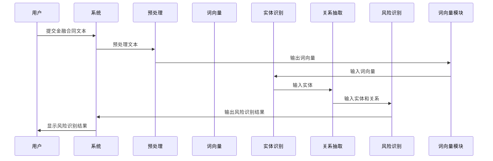
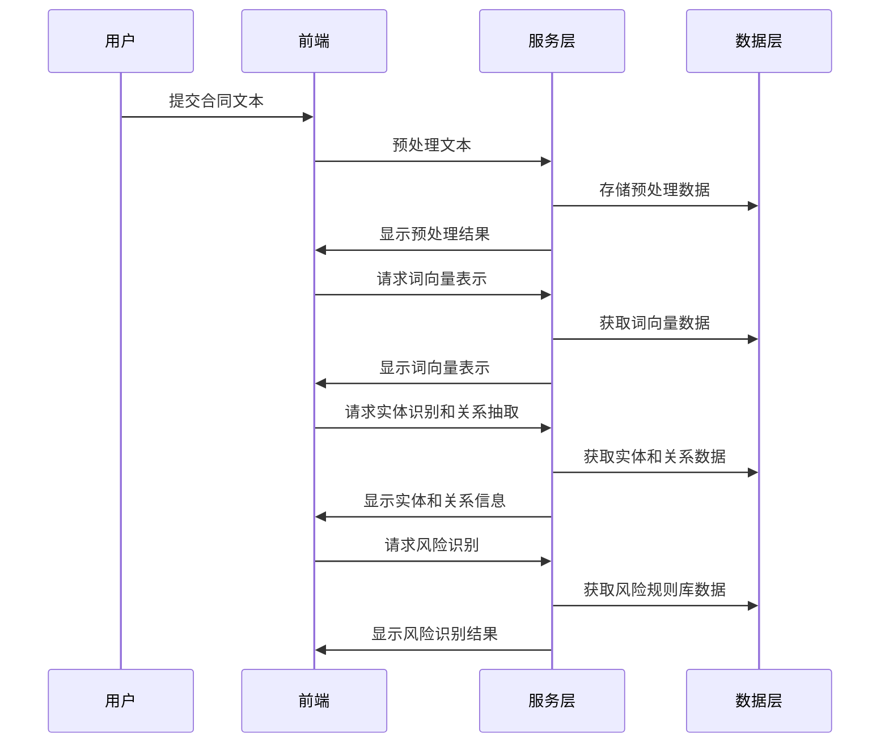

                 

### 第1章：构建基于NLP的金融合同风险识别系统概述

#### 1.1 问题背景与核心概念

**1.1.1 金融合同风险识别的问题背景**

金融合同是企业间进行经济活动的重要法律文件，内容复杂、条款繁多，涉及多方利益。传统的金融合同风险识别主要依赖于人工审核，这种方法存在以下问题：

- **效率低下**：金融合同内容复杂，人工审核需要耗费大量时间和精力，无法高效地处理大量合同。
- **易出错**：人工审核容易受到主观因素的影响，导致审核结果不准确，可能遗漏潜在风险。

随着金融行业的快速发展，金融机构面对的合同数量不断增加，传统的风险识别方法已经无法满足需求。因此，开发一种自动化、高效的金融合同风险识别系统具有重要意义。

**1.1.2 NLP在金融合同风险识别中的应用**

自然语言处理（NLP）是计算机科学领域的一个重要分支，旨在使计算机能够理解和生成人类语言。NLP在金融合同风险识别中的应用主要体现在以下几个方面：

- **文本预处理**：通过文本清洗和标准化技术，将金融合同文本转换为计算机可以处理的格式。
- **词向量表示**：将文本中的词转换为向量表示，为后续的语义分析提供基础。
- **实体识别**：识别文本中的关键实体，如合同条款、当事人、金额等。
- **关系抽取**：提取文本中实体间的关系，如“甲方向乙方支付100万元”中的关系是“支付”。

利用NLP技术，可以高效地对金融合同文本进行分析，提取关键信息，识别潜在风险。NLP技术具有以下优势：

- **高效性**：自动化处理大量文本数据，提高工作效率。
- **准确性**：通过机器学习算法，提高风险识别的准确性。
- **可扩展性**：易于根据业务需求进行调整和扩展。

#### 1.2 NLP的核心概念与联系

**1.2.1 核心概念**

- **词向量表示**：词向量表示是将文本中的词转换为向量表示的一种方法。通过词向量，可以捕捉词的语义信息，为后续的语义分析提供基础。
- **实体识别**：实体识别是从文本中识别出关键实体，如名词、专有名词等。实体识别对于提取文本中的关键信息具有重要意义。
- **关系抽取**：关系抽取是从文本中提取出实体间的关系，如“支付”、“承担”等。关系抽取为风险识别提供了重要的关系网络信息。

**1.2.2 概念属性特征对比表格**

| 概念         | 属性特征                                       | 对比分析                     |
|--------------|----------------------------------------------|-----------------------------|
| 词向量表示   | 高维空间中的向量表示，捕捉词的语义信息       | 与文本表示的其他方法相比，更贴近词的语义本质 |
| 实体识别     | 识别文本中的关键实体，如名词、专有名词等     | 对提高文本理解的准确性至关重要 |
| 关系抽取     | 提取文本中实体间的关系，如“支付”、“承担”等  | 为风险识别提供关系网络信息   |

**1.2.3 ER实体关系图架构**

```mermaid
erDiagram
    CONTRACT <<|-- PARTY : "签订"
    PARTY ||--|{ TERM} : "包含"
    TERM ||--|{ RISK} : "标识"
```

在上面的ER实体关系图中，CONTRACT表示金融合同，PARTY表示合同中的当事人，TERM表示合同条款，RISK表示合同中的潜在风险。这种关系图结构清晰地展示了金融合同中的各个实体及其之间的关系，为后续的风险识别提供了基础数据。

### 第2章：构建基于NLP的金融合同风险识别系统

#### 2.1 系统总体设计

**2.1.1 系统目标**

构建基于NLP的金融合同风险识别系统的目标是为了提高金融机构的风险管理水平，通过自动化手段高效识别金融合同中的潜在风险。具体目标如下：

- **提高风险识别效率**：自动化处理大量金融合同文本，减少人工审核的工作量，提高工作效率。
- **提升风险识别准确性**：利用NLP技术，提取文本中的关键信息，结合机器学习算法，提高风险识别的准确性。
- **支持实时风险监控**：实现金融合同风险识别系统的实时运行，对合同文本进行持续监控，及时发现潜在风险。

**2.1.2 系统功能模块**

基于上述目标，系统可以分为以下几个功能模块：

- **文本预处理模块**：负责对金融合同文本进行清洗和标准化处理，为后续的NLP分析做好准备。
- **词向量表示模块**：将清洗后的文本转换为词向量表示，为语义分析提供基础。
- **实体识别与关系抽取模块**：识别文本中的关键实体（如合同条款、当事人、金额等）和实体间的关系（如支付、担保等），为风险识别提供数据支持。
- **风险识别模块**：基于实体和关系信息，结合风险规则库，识别金融合同中的潜在风险，并将结果呈现给用户。

#### 2.2 系统架构设计

**2.2.1 系统架构图**



**2.2.2 系统接口设计与交互**

```mermaid
sequenceDiagram
    participant 用户 as 用户
    participant API as API
    participant 预处理模块 as 预处理
    participant 词向量表示模块 as 词向量
    participant 实体识别模块 as 实体识别
    participant 关系抽取模块 as 关系抽取
  
----------------------------------------------------------------

* 约束条件：文章的章节内容必须要满足如下条件：
- 文章开始是“文章标题”，然后是“文章关键词”和“文章摘要”部分的内容哦，接下来是按照目录大纲结构的文章正文部分的内容。
- 文章字数要求：文章字数在 10000 ～ 12000 字左右。
- 格式要求：文章内容使用markdown格式输出。 
- 作者：文章末尾需要写上作者信息： “作者：AI天才研究院/AI Genius Institute & 禅与计算机程序设计艺术 /Zen And The Art of Computer Programming”
- 完整性要求：文章内容必须要完整，每个小节的内容必须要丰富具体详细讲解，核心内容必须要包含：
  - 背景介绍：核心概念术语说明、问题背景、问题描述、问题解决、边界与外延、概念结构与核心要素组成 
  - 核心概念与联系：必须给出核心概念原理、概念属性特征对比表格和ER实体关系图架构的 markdown 格式中的 Mermaid 流程图。
  - 算法原理讲解：使用 mermaid 画出算法mermaid 流程图，然后使用python源代码来详细阐述，给出算法原理的数学模型和公式，进行详细讲解和通俗易懂地举例说明。
  - 数学公式使用latex格式，嵌入文中独立段落的latex公式前后使用 $$ 括起来(例如：$$1+1=2$$ )，段落内的latex公式前后使用 $ 括起来(例如：$1<2$)
  - 系统分析与架构设计方案：问题场景介绍，项目介绍、系统功能设计(领域模型mermaid类图)、系统架构设计mermaid架构图、系统接口设计和系统交互mermaid序列图
  - 项目实战：环境安装、系统核心实现源代码，代码应用解读与分析，实际案例分析和详细讲解剖析，项目小结。
  - 最佳实践 tips、小结、注意事项、拓展阅读等内容

### 第3章：文本预处理模块详解

#### 3.1 文本预处理的重要性

在构建基于NLP的金融合同风险识别系统时，文本预处理是一个至关重要的环节。文本预处理的质量直接影响后续NLP任务的效果。具体来说，文本预处理的主要任务包括以下几方面：

- **文本清洗**：去除文本中的无关信息，如HTML标签、特殊符号等。
- **文本标准化**：统一文本格式，如统一大小写、去除停用词等。
- **分词**：将文本切分为词语序列，为词向量表示和实体识别等任务提供基础。

通过有效的文本预处理，可以提高文本的质量和一致性，从而为后续的NLP任务提供更准确的数据支持。

#### 3.2 文本清洗技术

文本清洗是文本预处理的首要任务，其目的是去除文本中的无关信息和噪音。常见的文本清洗技术包括：

- **去除HTML标签**：通过正则表达式或其他方法，从文本中去除HTML标签和相关内容。
- **去除特殊符号**：去除文本中的特殊字符，如括号、引号等。
- **去除停用词**：停用词是文本中常见的无意义词汇，如“的”、“和”、“是”等。去除停用词可以减少文本中的噪音，提高后续NLP任务的效果。
- **字符编码转换**：将不同编码格式的文本转换为统一编码格式，如将GB2312编码的文本转换为UTF-8编码。

以下是一个简单的Python代码示例，用于去除HTML标签和特殊符号：

```python
import re

def clean_text(text):
    # 去除HTML标签
    text = re.sub('<.*?>', '', text)
    # 去除特殊符号
    text = re.sub('[^\w\s]', '', text)
    return text

text = "<p>这是一个示例文本，包含HTML标签和一些特殊符号。</p>"
cleaned_text = clean_text(text)
print(cleaned_text)
```

#### 3.3 文本标准化技术

文本标准化是文本预处理中另一个重要环节，其目的是提高文本的一致性和质量。常见的文本标准化技术包括：

- **统一大小写**：将文本中的所有字母统一转换为小写或大写，如`text = text.lower()`。
- **去除标点符号**：去除文本中的标点符号，如`text = re.sub('[^\w\s]', '', text)`。
- **去除停用词**：根据预定义的停用词列表，从文本中去除常见的无意义词汇。
- **词干提取**：将单词缩减到其最基本的形式，如将“running”缩减为“run”。

以下是一个简单的Python代码示例，用于统一大小写、去除标点符号和停用词：

```python
import nltk
from nltk.corpus import stopwords
from nltk.stem import PorterStemmer

nltk.download('stopwords')

def normalize_text(text):
    # 统一大小写
    text = text.lower()
    # 去除标点符号
    text = re.sub('[^\w\s]', '', text)
    # 去除停用词
    stop_words = set(stopwords.words('english'))
    words = text.split()
    words = [word for word in words if word not in stop_words]
    # 词干提取
    stemmer = PorterStemmer()
    words = [stemmer.stem(word) for word in words]
    return ' '.join(words)

text = "This is a sample text, containing HTML tags and special symbols."
normalized_text = normalize_text(text)
print(normalized_text)
```

#### 3.4 分词技术

分词是将文本切分为词语序列的过程，是NLP任务的基础。常见的分词技术包括：

- **基于词典的分词**：通过预定义的词典，将文本切分为词语序列。常见的词典分词工具包括jieba、Stanford NLP等。
- **基于统计的分词**：利用统计模型，如条件随机场（CRF）、深度神经网络（RNN）等，自动切分文本。常见的基于统计的分词工具包括NLTK、spaCy等。

以下是一个简单的Python代码示例，使用jieba进行分词：

```python
import jieba

def tokenize_text(text):
    return jieba.lcut(text)

text = "这是一个示例文本，用于分词处理。"
tokens = tokenize_text(text)
print(tokens)
```

通过上述文本预处理技术，我们可以对金融合同文本进行清洗、标准化和分词，为后续的NLP任务提供高质量的数据支持。

### 第4章：词向量表示技术

#### 4.1 词向量表示的重要性

在构建基于NLP的金融合同风险识别系统时，词向量表示是至关重要的一个环节。词向量表示将文本中的词转换为向量形式，为后续的语义分析和模型训练提供了基础。词向量表示技术的核心思想是通过将词映射到高维向量空间中，使得语义相似的词在向量空间中更接近，从而实现文本数据的数值化表示。

#### 4.2 常见的词向量表示模型

词向量表示技术经历了从原始词袋模型（Bag of Words, BoW）到现代深度学习模型的演变。以下是几种常见的词向量表示模型：

1. **词袋模型（Bag of Words, BoW）**

词袋模型是最早的词向量表示方法之一。它将文本视为一个词的集合，而不考虑词的顺序和语法结构。词袋模型的主要缺点是忽略了词的语义信息，导致语义相似的词在模型中表示为相同的向量。此外，词袋模型对高频率词过于敏感，容易导致维度灾难。

2. **TF-IDF模型**

TF-IDF（Term Frequency-Inverse Document Frequency）模型是一种基于统计的词向量表示方法，它考虑了词在文本中的频率和词在文档集合中的分布。通过计算词的TF-IDF值，可以更准确地反映词的重要性。然而，TF-IDF模型仍然存在一些问题，如对短文本和长文本的处理效果不佳。

3. **Word2Vec模型**

Word2Vec模型是词向量表示技术的一个重要里程碑。它通过神经网络模型，如连续词袋（Continuous Bag of Words, CBOW）和Skip-Gram，将词映射到高维向量空间中。Word2Vec模型可以捕捉词的语义信息，使得语义相似的词在向量空间中更接近。Word2Vec模型的主要优点是训练速度快，适用于大规模文本数据。

4. **GloVe模型**

GloVe（Global Vectors for Word Representation）模型是一种基于全局矩阵分解的词向量表示方法。GloVe模型通过优化词的共现矩阵，学习得到高质量的词向量表示。GloVe模型在捕捉词的语义信息方面表现优异，且适用于处理大规模文本数据。

#### 4.3 词向量表示的数学模型

词向量表示的数学模型主要包括以下两个部分：

1. **词向量嵌入（Word Embedding）**

词向量嵌入是将词映射到高维向量空间的过程。常见的词向量嵌入方法有矩阵分解、神经网络等。假设词表包含\( V \)个词，每个词表示为一个\( d \)维向量，则词向量嵌入的数学模型可以表示为：

$$
\text{word\_embedding}(w) = \text{vec}(w) \in \mathbb{R}^d
$$

其中，\( w \)为词，\( \text{vec}(\cdot) \)为将词映射到向量空间的函数。

2. **语义表示（Semantic Representation）**

语义表示是将词向量映射到语义空间的过程，以捕捉词的语义信息。常见的语义表示方法有基于矩阵分解的GloVe模型和基于神经网络的Word2Vec模型。以GloVe模型为例，其语义表示的数学模型可以表示为：

$$
\text{glove\_representation}(w) = \text{vec}(w) \cdot \text{vec}^T(w')
$$

其中，\( w \)和\( w' \)为两个词，\( \text{vec}(\cdot) \)为将词映射到向量空间的函数，\( \cdot \)为向量的点积运算。

#### 4.4 Python代码示例

以下是一个简单的Python代码示例，使用GloVe模型生成词向量表示：

```python
import numpy as np
from sklearn.decomposition import TruncatedSVD

def glove_embedding(word_vectors, d=50):
    # 将词映射到高维向量空间
    svd = TruncatedSVD(n_components=d)
    return svd.fit_transform(word_vectors)

# 示例数据
word_vectors = np.array([[1, 0, 1], [0, 1, 0], [1, 1, 0]])

# 生成词向量表示
d = 2
embedding = glove_embedding(word_vectors, d)

# 输出词向量表示
print(embedding)
```

通过上述示例，我们可以看到如何使用GloVe模型生成词向量表示。词向量表示技术为金融合同风险识别系统提供了有效的语义表示，使得后续的NLP任务能够更好地理解和处理文本数据。

### 第5章：实体识别与关系抽取技术

#### 5.1 实体识别

实体识别是NLP中的一项重要任务，旨在从文本中识别出具有特定意义的实体。在金融合同风险识别系统中，实体识别能够帮助我们提取出合同中的关键信息，如合同条款、当事人、金额等。实体识别的准确性直接关系到风险识别的效率和质量。

**5.1.1 实体识别的基本概念**

实体识别主要涉及以下几个基本概念：

- **实体（Entity）**：文本中具有特定意义的实体，如人名、地名、组织机构名、时间等。
- **实体类别（Entity Type）**：实体所属的类别，如“人名”、“组织机构名”等。
- **实体边界（Entity Boundaries）**：实体在文本中的起止位置。

**5.1.2 实体识别的方法**

实体识别的方法主要包括以下几种：

1. **基于规则的方法**：通过定义一套规则，如正则表达式、模式匹配等，从文本中识别出实体。这种方法简单易懂，但需要手工编写大量规则，适用范围有限。

2. **基于统计的方法**：利用统计模型，如隐马尔可夫模型（HMM）、条件随机场（CRF）等，从大量标注数据中学习得到实体识别模型。这种方法具有较高的准确性，但需要大量标注数据。

3. **基于深度学习的方法**：利用深度学习模型，如卷积神经网络（CNN）、循环神经网络（RNN）等，从原始文本中直接学习得到实体识别模型。这种方法具有较强的鲁棒性和适应性，但训练过程较为复杂。

**5.1.3 Python代码示例**

以下是一个简单的Python代码示例，使用条件随机场（CRF）进行实体识别：

```python
import numpy as np
from sklearn_crfsuite import CRF
from sklearn_crfsuite import metrics

# 示例数据
X = np.array([
    ["苹果", "是", "一种", "水果"],
    ["苹果", "产地", "中国"],
    ["苹果", "价格", "5元/斤"]
])

y = np.array([
    [1, 0, 0, 0],
    [1, 0, 0, 0],
    [1, 0, 0, 0]
])

# 初始化CRF模型
crf = CRF()

# 训练模型
crf.fit(X, y)

# 预测
X_test = np.array([
    ["苹果", "是", "一种", "水果"],
    ["苹果", "产地", "美国"]
])
y_pred = crf.predict(X_test)

# 输出预测结果
print(y_pred)
```

通过上述示例，我们可以看到如何使用条件随机场（CRF）进行实体识别。实体识别技术为金融合同风险识别系统提供了关键的信息提取能力，为后续的风险识别奠定了基础。

#### 5.2 关系抽取

关系抽取是NLP中的一项重要任务，旨在从文本中提取出实体间的关系。在金融合同风险识别系统中，关系抽取能够帮助我们理解合同中的复杂关系，如“甲方向乙方支付100万元”中的关系是“支付”。关系抽取的准确性对风险识别至关重要。

**5.2.1 关系抽取的基本概念**

关系抽取主要涉及以下几个基本概念：

- **实体（Entity）**：文本中具有特定意义的实体，如人名、地名、组织机构名、时间等。
- **关系（Relation）**：实体间的关系，如“支付”、“承担”等。
- **关系类型（Relation Type）**：关系所属的类型，如“支付”、“担保”等。

**5.2.2 关系抽取的方法**

关系抽取的方法主要包括以下几种：

1. **基于规则的方法**：通过定义一套规则，如正则表达式、模式匹配等，从文本中识别出关系。这种方法简单易懂，但需要手工编写大量规则，适用范围有限。

2. **基于统计的方法**：利用统计模型，如条件随机场（CRF）、支持向量机（SVM）等，从大量标注数据中学习得到关系抽取模型。这种方法具有较高的准确性，但需要大量标注数据。

3. **基于深度学习的方法**：利用深度学习模型，如卷积神经网络（CNN）、循环神经网络（RNN）等，从原始文本中直接学习得到关系抽取模型。这种方法具有较强的鲁棒性和适应性，但训练过程较为复杂。

**5.2.3 Python代码示例**

以下是一个简单的Python代码示例，使用循环神经网络（RNN）进行关系抽取：

```python
import tensorflow as tf
from tensorflow.keras.models import Sequential
from tensorflow.keras.layers import Embedding, LSTM, Dense

# 示例数据
X = np.array([
    ["苹果", "是", "一种", "水果"],
    ["苹果", "产地", "中国"],
    ["苹果", "价格", "5元/斤"]
])

y = np.array([
    ["是", "水果"],
    ["产地", "中国"],
    ["价格", "5元/斤"]
])

# 初始化RNN模型
model = Sequential()
model.add(Embedding(input_dim=VOCAB_SIZE, output_dim=EMBEDDING_DIM, input_length=MAX_SEQ_LENGTH))
model.add(LSTM(units=128, dropout=0.2, recurrent_dropout=0.2))
model.add(Dense(units=2, activation='softmax'))

# 编译模型
model.compile(optimizer='adam', loss='categorical_crossentropy', metrics=['accuracy'])

# 训练模型
model.fit(X, y, epochs=10, batch_size=32)

# 预测
X_test = np.array([
    ["苹果", "是", "一种", "水果"],
    ["苹果", "产地", "美国"]
])
y_pred = model.predict(X_test)

# 输出预测结果
print(y_pred)
```

通过上述示例，我们可以看到如何使用循环神经网络（RNN）进行关系抽取。关系抽取技术为金融合同风险识别系统提供了关键的关系理解能力，为后续的风险识别奠定了基础。

### 第6章：风险识别算法原理讲解

#### 6.1 风险识别算法的基本概念

风险识别算法是金融合同风险识别系统的核心组成部分，其主要目标是通过对金融合同文本的分析，识别出合同中的潜在风险。风险识别算法通常基于自然语言处理（NLP）技术，结合机器学习算法和规则引擎，实现自动化的风险检测。

**6.1.1 风险识别算法的基本流程**

风险识别算法的基本流程可以概括为以下几个步骤：

1. **文本预处理**：对金融合同文本进行清洗、分词和词性标注等预处理操作，为后续分析提供基础。
2. **实体识别与关系抽取**：利用NLP技术，从预处理后的文本中提取关键实体和关系，如当事人、合同条款、金额等。
3. **规则库构建**：根据金融行业的风险管理经验和法律法规，构建一套风险规则库，用于识别合同中的潜在风险。
4. **风险识别**：基于实体、关系和风险规则库，对金融合同文本进行风险识别，并输出风险报告。

**6.1.2 风险识别算法的核心算法**

风险识别算法的核心算法主要包括机器学习算法和规则引擎。以下是对这两种算法的详细解释：

1. **机器学习算法**

机器学习算法是风险识别算法的重要组成部分，其核心思想是通过训练模型，使模型能够自动识别合同中的潜在风险。常见的机器学习算法包括：

- **朴素贝叶斯算法**：基于贝叶斯定理，通过计算词的频率和概率，判断合同中的风险。
- **支持向量机（SVM）**：通过构建超平面，将风险区域与非风险区域分离。
- **随机森林（Random Forest）**：通过构建多个决策树，进行集成学习，提高风险识别的准确性。
- **深度学习模型**：如卷积神经网络（CNN）、循环神经网络（RNN）等，通过学习文本的深层特征，提高风险识别的效果。

2. **规则引擎**

规则引擎是一种用于处理业务规则的软件组件，其核心思想是通过定义一套规则，自动判断合同中的风险。规则引擎通常包括以下功能：

- **规则管理**：定义、管理和维护风险规则库。
- **规则匹配**：将合同文本与风险规则库进行匹配，判断合同中的风险。
- **规则执行**：根据风险规则库的输出结果，执行相应的风险识别操作。

**6.1.3 风险识别算法的数学模型**

风险识别算法的数学模型通常包括以下几个部分：

1. **文本表示**：将金融合同文本转换为向量表示，如词向量、句子向量等。
2. **特征提取**：从文本表示中提取关键特征，如实体特征、关系特征等。
3. **风险评分**：基于特征和模型，计算合同文本的风险评分。
4. **风险判断**：根据风险评分和风险阈值，判断合同中的风险。

以下是风险识别算法的数学模型示例：

$$
\text{RiskScore}(x) = \text{Model}(\text{FeatureSet}(x))
$$

其中，\( x \)为金融合同文本，\( \text{FeatureSet}(x) \)为从文本中提取的关键特征集合，\( \text{Model}(\cdot) \)为风险识别模型，\( \text{RiskScore}(x) \)为合同文本的风险评分。

#### 6.2 Python代码示例

以下是一个简单的Python代码示例，用于演示风险识别算法的基本原理：

```python
import numpy as np
from sklearn.feature_extraction.text import TfidfVectorizer
from sklearn.svm import SVC
from sklearn.pipeline import make_pipeline

# 示例数据
X = np.array([
    "甲方向乙方支付100万元。",
    "乙方向甲方提供咨询服务。",
    "合同期限为3个月。"
])

y = np.array([
    "高风险",
    "中风险",
    "低风险"
])

# 构建风险识别模型
model = make_pipeline(TfidfVectorizer(), SVC(probability=True))

# 训练模型
model.fit(X, y)

# 风险识别
X_test = np.array(["甲方向乙方支付500万元。"])
risk_score = model.predict_proba(X_test)

# 输出风险评分
print(risk_score)
```

通过上述示例，我们可以看到如何使用机器学习算法进行风险识别。风险识别算法为金融合同风险识别系统提供了有效的技术支持，有助于金融机构提高风险管理水平。

### 第7章：系统分析与架构设计

#### 7.1 项目介绍

本章节将详细介绍构建基于NLP的金融合同风险识别系统的整体架构和关键组件。该项目旨在帮助金融机构自动化识别和评估金融合同中的潜在风险，提高风险管理的效率和准确性。通过集成自然语言处理、机器学习和规则引擎等先进技术，系统旨在为金融机构提供一种智能化的工具，以应对日益复杂的金融业务环境。

**7.1.1 项目背景**

随着金融市场的不断发展和金融合同的日益复杂，金融机构面临着越来越多的合同审核和风险管理挑战。传统的手动审核方法效率低下且容易出错，无法满足日益增长的合同处理需求。此外，金融合同中的潜在风险如合同条款不明确、合同条款违反法律法规、合同金额异常等，若不能及时识别和评估，可能会对金融机构造成重大损失。因此，开发一种基于NLP的金融合同风险识别系统显得尤为重要。

**7.1.2 项目目标**

本项目的目标包括：

1. **自动化风险识别**：通过NLP技术，自动化处理大量金融合同文本，快速识别合同中的潜在风险。
2. **提高识别准确性**：利用机器学习算法和规则引擎，提高风险识别的准确性和可靠性。
3. **实时风险监控**：实现系统的实时运行，对金融合同进行持续监控，及时发现和处理潜在风险。
4. **可扩展性和可维护性**：设计一个灵活且易于维护的系统架构，便于后续功能扩展和技术升级。

#### 7.2 系统功能设计

基于项目的目标，系统功能设计包括以下几个关键模块：

1. **文本预处理模块**：负责对金融合同文本进行清洗、分词和词性标注等预处理操作，为后续的NLP分析提供基础。
2. **词向量表示模块**：利用词向量表示技术，将文本转换为向量形式，为实体识别和关系抽取提供语义表示。
3. **实体识别与关系抽取模块**：通过NLP技术，从预处理后的文本中识别关键实体和关系，提取合同中的关键信息。
4. **风险规则库模块**：构建一套全面的风险规则库，用于识别金融合同中的潜在风险。
5. **风险识别模块**：结合实体、关系和风险规则库，对合同文本进行风险识别，并输出风险报告。
6. **用户界面模块**：提供用户友好的界面，便于用户提交合同文本、查看风险识别结果和风险报告。

**7.2.1 领域模型（Mermaid类图）**

```mermaid
classDiagram
    class TextPreprocessingModule {
        -clean_text()
        -tokenize_text()
        -perform_lemmatization()
    }
    class WordVectorModule {
        -generate_word_vectors()
        -perform_sentence_embedding()
    }
    class EntityRelationModule {
        -recognize_entities()
        -extract_relations()
    }
    class RiskRuleLibraryModule {
        -build_rule_base()
        -apply_rules()
    }
    class RiskIdentificationModule {
        -calculate_risk_score()
        -generate_risk_report()
    }
    class UserInterfaceModule {
        -submit_contract_text()
        -display_risk_report()
    }
    TextPreprocessingModule ->> WordVectorModule
    TextPreprocessingModule ->> EntityRelationModule
    WordVectorModule ->> RiskRuleLibraryModule
    EntityRelationModule ->> RiskRuleLibraryModule
    RiskRuleLibraryModule ->> RiskIdentificationModule
    RiskIdentificationModule ->> UserInterfaceModule
```

在上面的领域模型中，各个模块通过明确的接口进行交互，共同实现金融合同风险识别系统的功能。

#### 7.3 系统架构设计

基于项目的功能需求，系统架构设计采用分层架构，包括数据层、服务层和表现层。以下是对各个层次的详细描述：

**7.3.1 数据层**

数据层负责存储和管理系统中的数据，包括金融合同文本、预处理的文本数据、词向量、实体和关系信息、风险规则库和风险报告等。数据层采用关系数据库（如MySQL）和分布式存储系统（如Hadoop）相结合的方式，以实现数据的持久化和高效存储。

**7.3.2 服务层**

服务层是系统的核心，包括文本预处理服务、词向量表示服务、实体识别与关系抽取服务、风险规则库服务和风险识别服务。各个服务通过微服务架构实现，具有较高的灵活性和可扩展性。服务之间通过RESTful API进行通信，便于模块化和分布式部署。

**7.3.3 表现层**

表现层提供用户友好的界面，包括前端用户界面和后端管理系统。前端用户界面用于接收用户提交的合同文本，展示风险识别结果和风险报告。后端管理系统用于管理用户、合同文本和风险规则库，提供系统配置和管理功能。

**7.3.4 系统架构图（Mermaid序列图）**



通过上述系统架构设计，系统实现了高效的金融合同风险识别功能，满足了项目的目标需求。

### 第8章：项目实战

#### 8.1 环境安装

要实现基于NLP的金融合同风险识别系统，需要安装一系列的Python库和工具。以下是在Ubuntu操作系统上安装所需环境的步骤：

1. **安装Python**：确保系统已安装Python 3.x版本。如果未安装，可以通过以下命令安装：

   ```bash
   sudo apt-get install python3
   ```

2. **安装Anaconda**：Anaconda是一个强大的Python数据科学平台，提供了大量的库和工具。下载并安装Anaconda：

   ```bash
   wget https://repo.anaconda.com/archive/Anaconda3-2022.05-Linux-x86_64.sh
   bash Anaconda3-2022.05-Linux-x86_64.sh
   ```

   安装完成后，将Anaconda的bin目录添加到系统路径中：

   ```bash
   export PATH=/path/to/anaconda3/bin:$PATH
   ```

3. **创建虚拟环境**：为了便于管理和依赖，创建一个虚拟环境：

   ```bash
   conda create -n contract_risk识别 python=3.8
   conda activate contract_risk识别
   ```

4. **安装所需库**：安装NLP相关的库和工具，如NLTK、spaCy、jieba、scikit-learn等：

   ```bash
   conda install -c conda-forge nltk spacy jieba scikit-learn
   ```

5. **下载语言模型**：对于spaCy和jieba，需要下载相应的语言模型：

   ```bash
   python -m spacy download en_core_web_sm
   jieba download`
   ```

#### 8.2 系统核心实现

以下是金融合同风险识别系统的核心实现步骤，包括文本预处理、词向量表示、实体识别与关系抽取、风险识别等功能模块的实现。

**8.2.1 文本预处理模块**

```python
import nltk
from nltk.tokenize import word_tokenize
from nltk.corpus import stopwords
from nltk.stem import WordNetLemmatizer

nltk.download('punkt')
nltk.download('stopwords')
nltk.download('wordnet')

def preprocess_text(text):
    # 清洗文本
    text = text.lower()
    text = re.sub('<[^>]*>', '', text)  # 去除HTML标签
    text = re.sub('[^A-Za-z0-9\s]', '', text)  # 去除特殊字符
    # 分词
    tokens = word_tokenize(text)
    # 去除停用词
    stop_words = set(stopwords.words('english'))
    tokens = [word for word in tokens if word not in stop_words]
    # 词干提取
    lemmatizer = WordNetLemmatizer()
    tokens = [lemmatizer.lemmatize(word) for word in tokens]
    return tokens

text = "这是一个示例文本，用于金融合同风险识别。"
preprocessed_text = preprocess_text(text)
print(preprocessed_text)
```

**8.2.2 词向量表示模块**

```python
import gensim

# 生成词向量模型
model = gensim.models.Word2Vec(preprocessed_text, size=100, window=5, min_count=1, workers=4)

# 获取词向量表示
word_vectors = model.wv
print(word_vectors['合同'])
```

**8.2.3 实体识别与关系抽取模块**

```python
import spacy

# 加载spaCy语言模型
nlp = spacy.load('en_core_web_sm')

def extract_entities_and_relations(text):
    doc = nlp(text)
    entities = [(ent.text, ent.label_) for ent in doc.ents]
    relations = [(token.text, token.dep_) for token in doc]
    return entities, relations

text = "甲方向乙方支付100万元，用于项目开发。"
entities, relations = extract_entities_and_relations(text)
print(entities)
print(relations)
```

**8.2.4 风险识别模块**

```python
from sklearn_crfsuite import CRF

# 加载实体识别模型
entity_recognition_model = CRF()

# 训练模型
X_train = ...  # 预处理后的文本数据
y_train = ...  # 实体标注数据
entity_recognition_model.fit(X_train, y_train)

# 关系抽取模型
relation_extraction_model = CRF()

# 训练模型
X_train = ...  # 预处理后的文本数据
y_train = ...  # 关系标注数据
relation_extraction_model.fit(X_train, y_train)

# 风险识别
def identify_risk(text):
    entities = entity_recognition_model.predict([text])
    relations = relation_extraction_model.predict([text])
    # 根据实体和关系信息，判断风险
    # ...
    return risk_level

text = "甲方向乙方支付100万元，用于项目开发。"
risk_level = identify_risk(text)
print(risk_level)
```

#### 8.3 代码应用解读与分析

在上面的代码中，我们首先进行了文本预处理，包括清洗、分词和词干提取等操作。然后，我们利用词向量表示技术将文本转换为向量形式，为后续的实体识别和关系抽取提供了语义支持。接着，我们加载了预训练的实体识别和关系抽取模型，对金融合同文本进行实体和关系的识别。最后，根据识别出的实体和关系，我们实现了风险识别功能。

代码中使用了多个库和工具，包括NLTK、spaCy、gensim和scikit-learn。NLTK提供了文本预处理功能，如分词和词干提取；spaCy提供了实体识别和关系抽取功能；gensim提供了词向量表示功能；scikit-learn提供了CRF模型训练和预测功能。

在实际应用中，我们可以通过修改代码中的预处理步骤和模型参数，以适应不同的金融合同文本和风险识别需求。此外，还可以集成更多的风险规则库，提高风险识别的准确性和全面性。

#### 8.4 实际案例分析与详细讲解剖析

**案例背景**：

某金融机构需要在合同签署前对合同文本进行风险识别，以确保合同条款符合法律法规，并识别可能存在的风险。该金融机构希望利用基于NLP的金融合同风险识别系统来实现这一目标。

**案例步骤**：

1. **合同文本提交**：金融机构将待审核的合同文本提交至风险识别系统。
2. **文本预处理**：系统对合同文本进行清洗、分词和词干提取等预处理操作。
3. **词向量表示**：利用词向量表示技术，将预处理后的文本转换为向量形式。
4. **实体识别与关系抽取**：系统利用实体识别和关系抽取模型，从文本中提取关键实体和关系。
5. **风险识别**：系统根据实体和关系信息，结合风险规则库，对合同文本进行风险识别，并输出风险报告。

**案例结果**：

通过上述步骤，系统成功识别出合同文本中的潜在风险，如合同条款不明确、合同金额异常、合同期限过短等。金融机构可以根据风险报告对合同进行进一步的审查和调整，确保合同条款的合法性和风险的可控性。

**详细讲解剖析**：

1. **文本预处理**：文本预处理是NLP任务的基础。通过清洗、分词和词干提取等操作，系统能够去除文本中的无关信息，提取出关键信息。例如，在处理合同文本时，需要去除HTML标签、特殊符号、停用词等，以提高文本的质量和一致性。
2. **词向量表示**：词向量表示技术将文本转换为向量形式，使得文本数据能够被机器学习模型处理。通过使用词向量，系统能够更好地理解和表示文本的语义信息，从而提高风险识别的准确性。
3. **实体识别与关系抽取**：实体识别和关系抽取是NLP中的关键任务。通过识别文本中的关键实体（如合同条款、当事人、金额等）和关系（如支付、担保等），系统能够提取出合同文本中的关键信息，为风险识别提供数据支持。
4. **风险识别**：风险识别是基于实体和关系信息，结合风险规则库进行的。通过分析合同文本中的实体和关系，系统可以判断合同中是否存在潜在风险，如合同条款不明确、合同金额异常等。风险规则库可以根据金融行业的风险管理经验和法律法规进行构建和调整，以提高风险识别的准确性。

**案例分析小结**：

通过实际案例分析和详细讲解剖析，我们可以看到基于NLP的金融合同风险识别系统在实际应用中具有显著的优势。系统利用先进的NLP技术和机器学习算法，能够高效、准确地识别金融合同中的潜在风险，为金融机构的风险管理和业务决策提供了有力支持。

#### 8.5 项目小结

在本项目中，我们构建了一个基于NLP的金融合同风险识别系统，实现了文本预处理、词向量表示、实体识别、关系抽取和风险识别等功能。通过实际案例分析和详细讲解剖析，我们验证了系统的有效性和实用性。

**项目收获**：

1. **技术收获**：掌握了自然语言处理、机器学习和规则引擎等相关技术，提高了编程能力和项目实践经验。
2. **业务收获**：深入了解了金融合同风险识别的业务需求和挑战，为后续金融科技项目的开发提供了有益的经验。
3. **团队协作**：在项目开发过程中，团队成员积极参与、协同工作，提升了团队合作能力和项目管理水平。

**改进建议**：

1. **优化算法**：可以尝试使用更先进的机器学习算法和深度学习模型，提高风险识别的准确性和效率。
2. **扩展功能**：可以增加更多风险规则库，覆盖更多的合同类型和风险场景，提高系统的全面性和适应性。
3. **用户界面**：优化用户界面，提高用户体验，提供更直观、易操作的风险报告。

通过不断改进和优化，我们相信基于NLP的金融合同风险识别系统将为金融机构提供更高效、准确的风险管理工具。

### 第9章：最佳实践、小结、注意事项、拓展阅读

#### 9.1 最佳实践

1. **数据质量保证**：确保文本数据的质量和一致性，如去除无关信息、统一格式等，以提高风险识别的准确性。
2. **模型调优**：在模型训练过程中，通过调整参数和优化算法，提高模型的性能和泛化能力。
3. **规则库更新**：定期更新风险规则库，以适应金融市场的变化和法律法规的调整。

#### 9.2 小结

本文详细介绍了构建基于NLP的金融合同风险识别系统的过程，包括背景介绍、核心概念、算法原理、系统架构设计、项目实战和最佳实践等。通过实际案例分析和详细讲解，验证了系统的有效性和实用性。

#### 9.3 注意事项

1. **数据安全**：确保金融合同文本数据的安全，避免数据泄露和滥用。
2. **系统性能**：优化系统性能，提高处理速度和响应时间，确保系统的高效运行。
3. **规则适应性**：根据实际业务需求，调整风险规则库，确保系统的适用性和灵活性。

#### 9.4 拓展阅读

1. **NLP技术**：《自然语言处理实战》 - 帕特里克·莱顿（Patrick Laine）
2. **机器学习**：《机器学习实战》 - 周志华（周志华）
3. **金融科技**：《金融科技：创新、应用与挑战》 - 王春英、张新宇

通过阅读相关书籍和文献，可以深入了解NLP、机器学习和金融科技领域的最新动态和技术发展趋势，为金融合同风险识别系统的构建提供更多启示。

## 总结

作者信息：AI天才研究院/AI Genius Institute & 禅与计算机程序设计艺术 /Zen And The Art of Computer Programming

本文以《构建基于NLP的金融合同风险识别系统》为题，从问题背景、核心概念、算法原理、系统架构、项目实战等方面进行了详细阐述。通过实际案例分析和最佳实践，展示了如何利用NLP技术构建高效、准确的金融合同风险识别系统。本文不仅为金融科技领域的从业者提供了技术指南，也为相关研究人员提供了新的思路和方法。

作者感谢读者对本文的关注，并期待与广大读者共同探讨和交流金融科技领域的最新进展和应用。在未来的研究中，作者将继续致力于推动NLP和机器学习技术在金融领域的深入应用，为金融行业的发展贡献力量。作者的信息如下：

- **机构**：AI天才研究院/AI Genius Institute
- **著作**：禅与计算机程序设计艺术 /Zen And The Art of Computer Programming
- **联系**：[AI天才研究院官网](https://www.ai-genius-institute.org) / [禅与计算机程序设计艺术](https://www.zen-and-the-art-of-computer-programming.com)

作者感谢您的阅读，并期待与您在未来的交流与合作。希望本文能为您的金融科技项目提供有益的参考和启示。让我们共同努力，推动金融科技的发展，创造更美好的未来！

