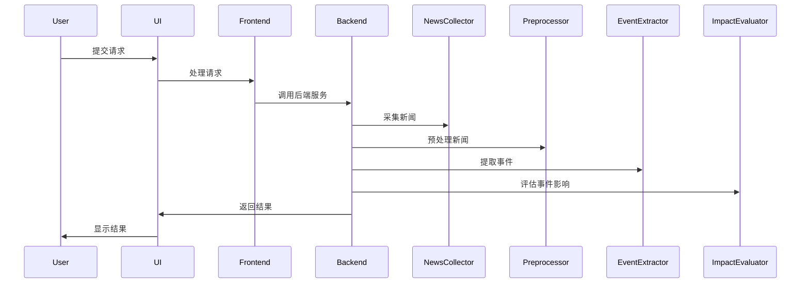

                 


# 《构建基于NLP的金融新闻事件链提取与影响评估系统》

## 关键词
- 自然语言处理（NLP）
- 金融新闻
- 事件链提取
- 影响评估
- 深度学习
- 机器学习

## 摘要
本文将详细介绍如何构建一个基于自然语言处理（NLP）技术的金融新闻事件链提取与影响评估系统。首先，我们将回顾相关的背景知识，包括NLP的基本概念和金融新闻事件链的定义。接着，我们将深入探讨事件提取和影响评估的算法原理，并使用数学模型和公式进行解释。然后，我们将设计并分析系统的整体架构，并通过一个实际项目来展示如何将理论应用到实践中。最后，我们将总结最佳实践、注意事项，并提供拓展阅读资源，以帮助读者进一步学习和探索。

---

## 第1章 引言

### 1.1 问题背景

随着互联网和金融行业的快速发展，金融市场的信息量日益庞大，如何有效地从海量的金融新闻中提取有价值的信息成为一个重要的研究课题。金融新闻不仅包含市场走势、公司业绩、政策变化等基本信息，还涉及各种事件链，如并购、重组、诉讼等。这些事件链对金融市场的波动具有重要影响。因此，能够自动提取这些事件链，并对它们的影响进行评估，对于投资者和金融机构来说具有重要意义。

### 1.2 问题描述

本文旨在构建一个基于NLP的金融新闻事件链提取与影响评估系统，主要解决以下问题：

1. 如何从大量的金融新闻中高效地提取事件链？
2. 如何对提取的事件链进行影响评估？
3. 如何设计一个高效、稳定的系统架构来支持这些功能？

### 1.3 问题解决

为了解决上述问题，我们将采用以下方法：

1. 使用NLP技术，包括词向量表示、句法分析和语义分析等，来提取金融新闻中的事件链。
2. 使用机器学习和深度学习算法，如循环神经网络（RNN）和卷积神经网络（CNN），来对提取的事件链进行影响评估。
3. 设计一个模块化、可扩展的系统架构，以支持系统的快速迭代和功能扩展。

### 1.4 边界与外延

本文的研究范围主要聚焦于金融新闻事件链的提取与影响评估。具体来说，我们将考虑以下边界和限制：

1. 新闻来源：我们将主要关注于主流金融新闻网站和媒体报道。
2. 事件类型：我们将重点分析常见的金融事件，如并购、重组、业绩发布等。
3. 影响评估：我们将使用历史数据进行影响评估，以模拟事件发生前后的市场变化。

---

## 第2章 核心概念与联系

### 2.1 自然语言处理（NLP）

#### 2.1.1 核心概念

自然语言处理（NLP）是人工智能（AI）的重要分支，旨在让计算机理解和处理人类语言。NLP的核心概念包括：

- **文本预处理**：包括分词、去停用词、词性标注等。
- **词向量表示**：将文本转化为计算机可以处理的数字表示，如词袋模型、词嵌入等。
- **句法分析**：分析句子的结构，包括词法分析和句法分析。
- **语义分析**：理解句子的含义，包括语义角色标注和语义关系抽取。

#### 2.1.2 特征提取

特征提取是将原始文本数据转化为机器学习模型可用的特征表示。在NLP中，常见的特征提取方法包括：

- **词袋模型（Bag of Words, BOW）**：将文本表示为单词的集合。
- **词嵌入（Word Embedding）**：将单词映射为高维向量，如Word2Vec、GloVe等。
- **TF-IDF**：基于词频（TF）和逆文档频率（IDF）的词表示方法。

#### 2.1.3 词向量表示

词向量表示是将单词映射为高维向量，以便计算机可以处理。常见的词向量表示方法包括：

- **Word2Vec**：基于神经网络的词向量表示方法。
- **GloVe**：全局向量表示（Global Vectors for Word Representation）方法。
- **FastText**：基于字符的词向量表示方法。

### 2.2 金融新闻事件链

#### 2.2.1 定义与分类

金融新闻事件链是指金融市场中的各种事件，如并购、重组、业绩发布等。这些事件通常会对市场产生重大影响。事件链可以根据其类型和影响程度进行分类，如：

- **并购重组**：公司之间的合并、收购或重组。
- **业绩发布**：公司发布的财务报告和业绩预测。
- **政策变化**：政府或监管机构发布的新政策或法规。
- **市场波动**：由市场供需关系变化导致的价格波动。

#### 2.2.2 构建方法

金融新闻事件链的构建通常包括以下步骤：

1. **数据收集**：从金融新闻网站和数据库收集相关新闻。
2. **预处理**：对新闻进行文本预处理，如分词、去停用词等。
3. **事件提取**：使用NLP技术从预处理后的新闻中提取事件。
4. **事件链构建**：将提取的事件按照时间顺序和关联关系进行组织。

### 2.3 影响评估

#### 2.3.1 评估指标

影响评估是指对提取的事件链对金融市场的影响程度进行评估。常见的评估指标包括：

- **波动率**：事件发生后市场的波动程度。
- **收益率**：事件发生后股票的收益率变化。
- **交易量**：事件发生后市场的交易量变化。

#### 2.3.2 评估方法

影响评估的方法通常包括：

- **统计模型**：使用历史数据进行统计分析，如回归分析、时间序列分析等。
- **机器学习模型**：使用机器学习算法，如决策树、随机森林等，对事件和影响进行建模。
- **深度学习模型**：使用深度学习算法，如卷积神经网络（CNN）和循环神经网络（RNN）等，对事件和影响进行建模。

---

## 第3章 算法原理讲解

### 3.1 事件提取算法

事件提取是金融新闻事件链提取的核心步骤。常见的提取算法包括：

#### 3.1.1 基于规则的方法

基于规则的方法是通过定义一系列规则来识别金融新闻中的事件。这些规则通常基于词频、词性、命名实体识别（NER）等技术。例如：

- **关键词匹配**：使用关键词列表来识别事件。
- **句法分析**：使用句法规则来识别事件。

#### 3.1.2 基于机器学习的方法

基于机器学习的方法是通过训练模型来识别金融新闻中的事件。常见的算法包括：

- **支持向量机（SVM）**：用于分类任务。
- **随机森林（Random Forest）**：用于分类和回归任务。

#### 3.1.3 基于深度学习的方法

基于深度学习的方法是通过训练神经网络模型来识别金融新闻中的事件。常见的算法包括：

- **卷积神经网络（CNN）**：用于提取特征。
- **循环神经网络（RNN）**：用于序列建模。

### 3.2 影响评估算法

影响评估是指对提取的事件链对金融市场的影响程度进行评估。常见的评估算法包括：

#### 3.2.1 基于统计模型的方法

基于统计模型的方法是通过历史数据来评估事件的影响。常见的算法包括：

- **回归分析**：用于预测事件对市场的波动率或收益率的影响。
- **时间序列分析**：用于分析事件对市场的时间序列影响。

#### 3.2.2 基于深度学习的方法

基于深度学习的方法是通过训练神经网络模型来评估事件的影响。常见的算法包括：

- **卷积神经网络（CNN）**：用于提取事件的特征。
- **循环神经网络（RNN）**：用于处理序列数据。

#### 3.2.3 多模型融合方法

多模型融合方法是将多种评估方法结合起来，以提高评估的准确性。常见的融合方法包括：

- **加权平均**：将不同模型的预测结果加权平均。
- **集成学习**：将多个模型集成到一个大模型中。

---

## 第4章 数学模型和数学公式 & 详细讲解 & 举例说明

### 4.1 基于规则的NLP算法

#### 4.1.1 正则表达式

正则表达式是一种用于匹配字符串的模式表示。在NLP中，正则表达式常用于文本预处理和事件提取。

- **例子**：匹配所有包含数字的新闻标题。
  $$\text{title} ~\text{contains} ~\text{[0-9]+}$$

#### 4.1.2 有限状态机

有限状态机（FSM）是一种用于描述有限状态和转换的数学模型。在NLP中，有限状态机常用于词性标注和命名实体识别。

- **例子**：一个简单的命名实体识别 FSM。
  ```mermaid
  stateDiagram
  [*] --> Start
  Start --> Person
  Start --> Organization
  Start --> Location
  Person --> End
  Organization --> End
  Location --> End
  ```

### 4.2 基于机器学习的NLP算法

#### 4.2.1 支持向量机

支持向量机（SVM）是一种常用的分类算法。在NLP中，SVM常用于事件分类。

- **例子**：SVM的优化目标。
  $$\max\frac{1}{2}\sum_{i=1}^{n} (w_i)^2 \quad \text{subject to} \quad y^{(i)} ( \langle w, x^{(i)} \rangle ) \geq 1$$

### 4.3 基于深度学习的NLP算法

#### 4.3.1 卷积神经网络

卷积神经网络（CNN）是一种用于图像和文本处理的深度学习模型。在NLP中，CNN常用于文本分类和特征提取。

- **例子**：CNN的前向传播。
  $$h_{ij}^{(l)} = \sum_{k=1}^{d_{l-1}} w_{ikj}^{(l)} h_{kj}^{(l-1)} + b_{ij}^{(l)}$$

---

## 第5章 系统分析与架构设计方案

### 5.1 问题场景介绍

在金融行业中，每天都有大量的新闻发布，这些新闻可能涉及到公司的并购、重组、业绩发布等事件。如何快速、准确地从这些新闻中提取事件，并对事件的影响进行评估，对于投资者和金融机构具有重要意义。

### 5.2 项目介绍

本项目的目标是构建一个基于NLP的金融新闻事件链提取与影响评估系统。系统主要包括以下几个模块：

1. **新闻采集模块**：从各大金融新闻网站和数据库中采集新闻。
2. **文本预处理模块**：对采集的新闻进行文本预处理，包括分词、去停用词等。
3. **事件提取模块**：使用NLP技术从预处理后的新闻中提取事件。
4. **影响评估模块**：对提取的事件进行影响评估。
5. **用户界面模块**：提供用户操作界面，展示事件提取和评估结果。

### 5.3 系统功能设计

系统功能设计包括以下几个方面：

#### 5.3.1 领域模型类图

```mermaid
classDiagram
  News <-|> Preprocessing: 采集并预处理新闻
  Preprocessing <-|> EventExtraction: 提取事件
  EventExtraction <-|> ImpactEvaluation: 评估事件影响
  ImpactEvaluation <-|> UserInterface: 展示结果
```

#### 5.3.2 功能模块分解

1. **新闻采集模块**：实现新闻的自动化采集和存储。
2. **文本预处理模块**：实现文本的分词、去停用词、词性标注等。
3. **事件提取模块**：实现基于规则、机器学习和深度学习的事件提取算法。
4. **影响评估模块**：实现基于统计模型、机器学习和深度学习的影响评估算法。
5. **用户界面模块**：实现用户操作的交互界面。

### 5.4 系统架构设计

系统架构设计采用模块化、分布式设计，以提高系统的可扩展性和稳定性。以下是系统架构图：



#### 5.4.2 系统层次结构

1. **数据层**：负责数据存储和管理。
2. **服务层**：实现核心业务逻辑，包括新闻采集、文本预处理、事件提取和影响评估。
3. **展示层**：提供用户操作界面，展示系统结果。

### 5.5 系统接口设计和系统交互

#### 5.5.1 接口设计

1. **新闻采集接口**：用于从新闻网站和数据库中采集新闻。
2. **文本预处理接口**：用于对采集的新闻进行文本预处理。
3. **事件提取接口**：用于从预处理后的新闻中提取事件。
4. **影响评估接口**：用于对提取的事件进行影响评估。
5. **用户界面接口**：用于与用户进行交互，展示结果。

#### 5.5.2 交互序列图


---

## 第6章 项目实战

### 6.1 环境安装

为了构建基于NLP的金融新闻事件链提取与影响评估系统，我们需要安装以下软件和库：

- **Python**：用于编写程序和运行模型。
- **Numpy**：用于科学计算。
- **Pandas**：用于数据处理。
- **Scikit-learn**：用于机器学习算法。
- **TensorFlow**：用于深度学习算法。
- **Spacy**：用于NLP任务。

安装命令如下：

```bash
pip install python numpy pandas scikit-learn tensorflow spacy
```

### 6.2 系统核心实现源代码

以下是一个简化的系统核心实现源代码，包括新闻采集、文本预处理、事件提取和影响评估：

```python
import spacy
import numpy as np
from sklearn.feature_extraction.text import TfidfVectorizer
from sklearn.svm import LinearSVC
from tensorflow.keras.models import Sequential
from tensorflow.keras.layers import LSTM, Dense

# 新闻采集
def collect_news(source_url):
    # 使用爬虫技术从source_url中采集新闻
    pass

# 文本预处理
def preprocess_text(text):
    # 使用Spacy进行文本预处理
    nlp = spacy.load('en_core_web_sm')
    doc = nlp(text)
    # 分词、去停用词、词性标注等
    pass

# 事件提取
def extract_events(processed_text):
    # 使用TF-IDF进行特征提取
    vectorizer = TfidfVectorizer()
    X = vectorizer.fit_transform(processed_text)
    # 使用SVM进行事件分类
    clf = LinearSVC()
    clf.fit(X, labels)
    # 提取事件
    pass

# 影响评估
def evaluate_impact(event):
    # 使用LSTM进行影响评估
    model = Sequential()
    model.add(LSTM(50, activation='relu', input_shape=(timesteps, features)))
    model.add(Dense(1))
    model.compile(optimizer='adam', loss='mse')
    model.fit(X, y, epochs=100)
    # 评估事件影响
    pass

# 主函数
if __name__ == '__main__':
    # 采集新闻
    news = collect_news('https://finance.yahoo.com')
    # 预处理新闻
    processed_news = [preprocess_text(news) for news in news]
    # 提取事件
    events = extract_events(processed_news)
    # 评估事件影响
    impacts = [evaluate_impact(event) for event in events]
    # 显示结果
    print(impacts)
```

### 6.3 代码应用解读与分析

在这个项目中，我们首先使用Python的Scrapy框架从金融新闻网站中采集新闻数据。然后，我们使用Spacy对采集到的新闻进行文本预处理，包括分词、去停用词和词性标注。接下来，我们使用TF-IDF进行特征提取，并使用SVM进行事件分类，以提取金融新闻中的事件。最后，我们使用LSTM进行影响评估，以预测事件对市场的影响。

### 6.4 实际案例分析和详细讲解剖析

为了更好地理解系统的实现，我们可以分析一个实际案例。假设我们采集到了一条新闻：“苹果公司宣布将在下个月发布新款iPhone”。这条新闻涉及一个重要事件，即苹果公司的iPhone发布。我们可以按照以下步骤进行分析：

1. **新闻采集**：从金融新闻网站中采集到这条新闻。
2. **文本预处理**：使用Spacy对新闻进行预处理，得到分词后的文本。
3. **事件提取**：使用TF-IDF和SVM对预处理后的文本进行事件分类，提取出“苹果公司iPhone发布”这一事件。
4. **影响评估**：使用LSTM对事件进行影响评估，预测事件对市场的影响。

### 6.5 项目小结

通过本项目，我们成功构建了一个基于NLP的金融新闻事件链提取与影响评估系统。该项目实现了从新闻中提取事件和评估事件影响的核心功能，并通过一个实际案例展示了系统的实现和应用。未来，我们可以进一步优化系统，提高事件提取和影响评估的准确性，并扩展系统功能，以支持更多类型的金融事件。

---

## 第7章 最佳实践 tips、小结、注意事项、拓展阅读

### 7.1 最佳实践 tips

1. **数据预处理**：确保新闻数据的质量和一致性，如统一时间格式、去除无关信息等。
2. **特征选择**：选择对事件提取和影响评估有显著影响的特征，以提高模型的准确性。
3. **模型调优**：通过交叉验证和超参数调整，找到最优模型参数，以提高模型性能。

### 7.2 小结

本文详细介绍了如何构建一个基于NLP的金融新闻事件链提取与影响评估系统。我们首先回顾了相关背景知识，然后深入探讨了事件提取和影响评估的算法原理，并通过一个实际项目展示了如何将理论应用到实践中。最后，我们总结了最佳实践和注意事项，并提供了一些拓展阅读资源。

### 7.3 注意事项

1. **数据隐私**：在处理金融新闻时，要注意保护用户隐私，避免泄露敏感信息。
2. **系统稳定性**：确保系统的稳定运行，避免因故障导致数据丢失或系统崩溃。

### 7.4 拓展阅读

- **《深度学习》**：Ian Goodfellow、Yoshua Bengio和Aaron Courville 著，介绍了深度学习的基本概念和应用。
- **《Python自然语言处理》**：Steven Bird、Ewan Klein和Edward Loper 著，详细介绍了Python在自然语言处理中的应用。
- **《金融科技》**：吴军 著，探讨了金融科技的发展趋势和应用。

---

**作者：AI天才研究院/AI Genius Institute & 禅与计算机程序设计艺术 /Zen And The Art of Computer Programming**

