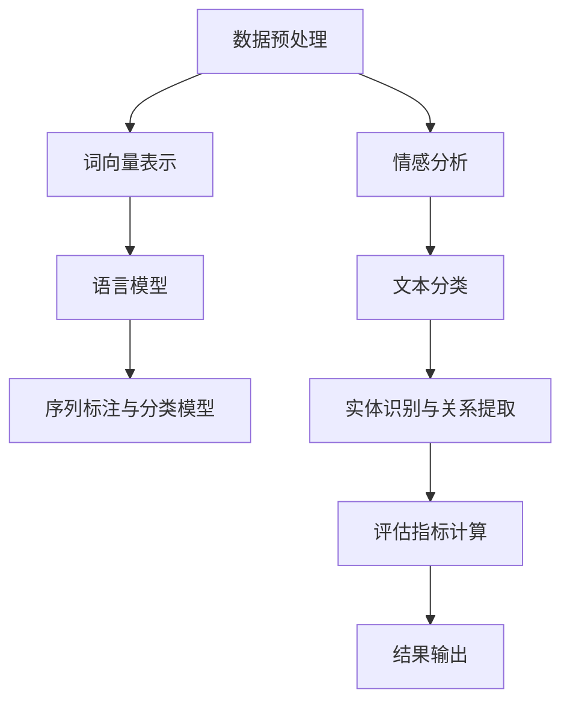

                 


### 第1章：金融监管政策执行效果评估的背景与重要性

#### 1.1.1 金融监管政策概述

金融监管政策是指一系列用于管理金融市场、金融机构和金融活动的规则与指导原则。这些政策旨在确保金融市场的稳定、透明和高效，保护投资者的利益，并防止金融欺诈和系统性风险。金融监管政策通常包括：

- **法律法规**：如银行法、证券法、保险法等，它们为金融活动提供了法律基础。
- **监管指导文件**：如监管机构发布的规章、指导意见和操作细则，它们为金融机构的运营提供了具体的操作指南。
- **市场准入和退出规则**：如资本充足率要求、流动性覆盖率等，它们规定了金融机构进入和退出市场的条件。
- **风险管理政策**：如风险集中度限制、风险敞口管理等，它们用于指导金融机构如何识别、评估和控制风险。

金融监管政策在全球范围内都有广泛应用，不同的国家和地区根据自身的金融体系特点和经济环境制定相应的监管政策。例如，美国通过《多德-弗兰克法案》加强了金融监管，欧洲通过《金融工具市场指令》规范了金融市场的运作。

#### 1.1.2 金融监管政策执行效果的评估问题

金融监管政策的执行效果评估是金融监管的重要环节，它旨在衡量政策实施后的实际效果，识别存在的问题，为政策的优化提供依据。然而，评估金融监管政策的执行效果面临着以下问题：

- **数据获取难度**：金融监管政策涉及的数据量大且复杂，包括金融机构的财务数据、交易记录、市场动态等。获取这些数据往往需要跨部门协调和长时间的积累。
- **评估指标多样化**：金融监管政策的目标多元，包括市场稳定性、金融创新、风险管理、投资者保护等，因此需要设计多样化的评估指标。
- **数据质量问题**：由于数据来源的多样性和数据的准确性、完整性问题，评估结果可能受到数据质量的影响。
- **主观性**：评估过程涉及专家的主观判断，可能因为不同的评估方法和评估人员的不同背景而出现偏差。

#### 1.1.3 现有评估方法及其局限性

目前，金融监管政策的执行效果评估主要采用以下方法：

- **定量评估方法**：通过统计和分析政策实施前后的相关数据，如金融机构的财务指标、市场交易量等，来衡量政策的效果。这种方法侧重于数据的量化分析，但可能忽略政策影响的复杂性和长期性。
- **定性评估方法**：通过专家调查、访谈、案例研究等方法，收集政策实施过程中和结果的相关信息，进行主观评估。这种方法能够提供深入的分析，但可能受主观因素影响较大。
- **综合评估方法**：将定量和定性评估方法相结合，通过多角度、多层次的分析来评估政策效果。这种方法相对全面，但需要较高的协调和整合能力。

尽管现有评估方法各有优势，但它们也存在以下局限性：

- **评估周期长**：金融监管政策的效果往往需要较长时间才能显现，现有评估方法难以在短时间内提供有效的反馈。
- **评估结果滞后**：政策实施后的效果评估往往滞后于政策实施过程，无法实时指导政策调整。
- **评估范围有限**：现有评估方法往往聚焦于某些特定领域或指标，难以全面反映政策的综合效果。

综上所述，现有评估方法在数据获取、指标设计、评估效率和效果等方面仍存在一定不足，需要探索新的方法和技术来提升评估的准确性和有效性。

### 1.1.4 研究的目的与意义

本文旨在构建基于自然语言处理（NLP）技术的金融监管政策执行效果评估系统，以解决现有评估方法面临的挑战。研究目的如下：

- **提高评估的自动化和准确性**：利用NLP技术对政策文本进行自动分析和处理，减少人工干预，提高评估结果的准确性。
- **实现实时评估**：通过构建实时数据采集和处理系统，实现对政策实施效果的动态监测，提高评估的实时性和时效性。
- **丰富评估指标体系**：结合NLP技术，从政策文本中提取更多潜在的评估指标，丰富评估体系的多样性。

研究意义如下：

- **提升金融监管效率**：通过精确评估政策执行效果，为监管机构提供科学决策依据，提升监管效率。
- **促进金融政策优化**：通过分析政策实施中的问题和不足，为政策优化提供依据，促进金融政策的不断完善。
- **推动金融科技发展**：NLP技术在金融监管领域的应用，将为金融科技的发展提供新的方向和可能性。

#### 1.1.5 文章结构安排

本文将按照以下结构安排进行阐述：

- **第一部分：背景介绍与核心概念**：介绍金融监管政策执行效果评估的背景、重要性和现有问题，以及NLP技术的基本概念和应用。
- **第二部分：系统设计与实现**：详细描述基于NLP的金融监管政策执行效果评估系统的设计、实现和核心算法。
- **第三部分：系统应用与案例分析**：通过实际案例展示系统的应用效果，分析评估过程和结果。
- **第四部分：最佳实践与未来展望**：总结系统的最佳实践，提出未来研究方向和优化建议。

### 1.2 自然语言处理（NLP）技术简介

#### 1.2.1 NLP的基本概念

自然语言处理（Natural Language Processing，简称NLP）是计算机科学和人工智能领域的一个重要分支，旨在使计算机能够理解、生成和处理人类语言。NLP的核心任务是让计算机从文本中提取有用信息，实现人机交互。其主要应用领域包括机器翻译、文本分类、情感分析、问答系统等。

NLP的主要研究内容包括：

- **文本预处理**：包括分词、词性标注、词干提取、停用词过滤等，用于将原始文本转换为计算机可处理的形式。
- **词向量表示**：将文本中的词语转换为向量表示，以便进行计算和建模。
- **语言模型**：通过统计或深度学习方法，构建用于预测词语序列的概率模型。
- **语义分析**：包括语义角色标注、实体识别、关系提取等，用于理解和分析文本中的语义信息。
- **对话系统**：设计能够与人类进行自然对话的计算机系统，如聊天机器人、语音助手等。

#### 1.2.2 NLP的主要技术手段

NLP的主要技术手段包括以下几种：

- **分词（Tokenization）**：将连续的文本分割成单词、短语或其他具有独立意义的标记。分词是文本预处理的重要步骤，为后续的词性标注、句法分析和语义分析奠定基础。
  
  ```python
  import jieba
  
  text = "我来到北京清华大学"
  segments = jieba.cut(text)
  print("分词结果：" + "/ ".join(segments))
  ```

- **词性标注（Part-of-Speech Tagging）**：为文本中的每个词分配词性，如名词、动词、形容词等。词性标注有助于理解文本的语法结构和语义含义。

  ```python
  import jieba
  
  text = "我爱北京天安门"
  tags = jieba.get_tags(text)
  print("词性标注结果：" + "/ ".join([word + "/" + tag for word, tag in tags]))
  ```

- **词干提取（Stemming）**：将不同形式的词语归并为同一词干，如"running"、"runs"和"ran"都归为"run"。词干提取有助于减少词汇量，简化文本处理。

  ```python
  import nltk
  
  word = "fishing"
  stemmer = nltk.PorterStemmer()
  print("词干提取结果：" + stemmer.stem(word))
  ```

- **停用词过滤（Stopword Removal）**：移除文本中的常见停用词，如"的"、"和"、"是"等。停用词过滤有助于降低文本的复杂性，提高分析效率。

  ```python
  import nltk
  
  text = "的 的 和 是 是 是 和"
  stop_words = set(nltk.corpus.stopwords.words('english'))
  filtered_text = " ".join([word for word in text.split() if word not in stop_words])
  print("停用词过滤结果：" + filtered_text)
  ```

- **词向量表示（Word Embedding）**：将文本中的词语映射为高维空间中的向量，以便进行计算和建模。常见的词向量模型包括Word2Vec、GloVe等。

  ```python
  from gensim.models import Word2Vec
  
  sentences = [[word for word in jieba.cut(sentence)] for sentence in ["我来到北京清华大学", "我爱北京天安门"]]
  model = Word2Vec(sentences, vector_size=100, window=5, min_count=1, workers=4)
  print("词向量表示：" + str(model.wv['我']))
  ```

- **语言模型（Language Model）**：用于预测下一个词语或字符的概率分布。语言模型是许多NLP应用的基础，如机器翻译、语音识别等。

  ```python
  import tensorflow as tf
  
  vocabulary_size = 10000
  hidden_size = 128
  
  # 构建语言模型
  model = tf.keras.Sequential([
      tf.keras.layers.Embedding(vocabulary_size, hidden_size),
      tf.keras.layers.LSTM(hidden_size),
      tf.keras.layers.Dense(vocabulary_size)
  ])
  
  # 编译模型
  model.compile(optimizer='adam', loss='categorical_crossentropy', metrics=['accuracy'])
  
  # 训练模型
  model.fit(input_sequences, labels, epochs=100)
  ```

#### 1.2.3 NLP在金融领域的应用

NLP技术在金融领域有着广泛的应用，主要包括：

- **金融文本分析**：利用NLP技术对金融新闻、报告、邮件等文本进行自动分析，提取关键信息，如公司业绩、市场动态等。
- **情感分析**：通过分析金融文本的情感倾向，预测市场情绪，为投资决策提供支持。
- **客户服务**：利用NLP技术构建智能客服系统，自动回答客户的提问，提高客户服务质量。
- **风险控制**：利用NLP技术对交易数据、客户评论等文本进行情感分析，识别潜在风险。
- **合规检查**：利用NLP技术自动检查金融文本是否符合监管要求，提高合规性。

### 1.3 基于NLP的金融监管政策理解与分类

#### 1.3.1 政策文本预处理

政策文本预处理是NLP技术在金融监管政策理解与分类中的第一步，其目的是将原始文本转化为计算机可以处理的格式。政策文本预处理通常包括以下步骤：

- **文本清洗**：去除文本中的无关信息，如HTML标签、特殊符号等。
  
  ```python
  import re
  
  text = "<p>这是一个政策文本。</p>"
  clean_text = re.sub('<[^>]*>', '', text)
  print("清洗后的文本：" + clean_text)
  ```

- **分词**：将文本分割成单词、短语或其他标记。
  
  ```python
  import jieba
  
  text = "这是一个政策文本，用于监管金融行业。"
  segments = jieba.cut(text)
  print("分词结果：" + "/ ".join(segments))
  ```

- **词性标注**：为文本中的每个词分配词性，如名词、动词、形容词等。
  
  ```python
  import jieba
  
  text = "政策文本监管金融行业。"
  tags = jieba.get_tags(text)
  print("词性标注结果：" + "/ ".join([word + "/" + tag for word, tag in tags]))
  ```

- **去除停用词**：移除文本中的常见停用词，如"的"、"和"、"是"等。
  
  ```python
  import nltk
  
  text = "的 的 和 是 是 是 和"
  stop_words = set(nltk.corpus.stopwords.words('english'))
  filtered_text = " ".join([word for word in text.split() if word not in stop_words])
  print("去除停用词后的文本：" + filtered_text)
  ```

- **词干提取**：将不同形式的词语归并为同一词干。
  
  ```python
  import nltk
  
  word = "fishing"
  stemmer = nltk.PorterStemmer()
  print("词干提取结果：" + stemmer.stem(word))
  ```

通过以上步骤，政策文本被转化为计算机可处理的格式，为后续的文本分析奠定了基础。

#### 1.3.2 政策文本情感分析

政策文本情感分析是NLP技术在金融监管政策理解与分类中的重要应用，其目的是判断政策文本的情感倾向，如正面、负面或中性。政策文本情感分析通常包括以下步骤：

- **情感词典构建**：构建包含正面、负面和情感中性的词语及其情感强度的词典。
  
  ```python
  positive_words = ["促进", "支持", "鼓励"]
  negative_words = ["禁止", "限制", "削减"]
  neutral_words = ["规定", "要求", "通知"]
  
  sentiment_dict = {
      "positive": positive_words,
      "negative": negative_words,
      "neutral": neutral_words
  }
  ```

- **情感得分计算**：计算每个词语的情感得分，并根据词语的情感得分累加得到文本的情感得分。
  
  ```python
  def calculate_sentiment_score(text, sentiment_dict):
      score = 0
      words = jieba.cut(text)
      for word in words:
          if word in sentiment_dict["positive"]:
              score += 1
          elif word in sentiment_dict["negative"]:
              score -= 1
          elif word in sentiment_dict["neutral"]:
              score += 0
      return score
  
  text = "政策文本支持金融创新，限制金融欺诈。"
  score = calculate_sentiment_score(text, sentiment_dict)
  print("情感得分：" + str(score))
  ```

- **情感分类**：根据文本的情感得分，判断文本的情感倾向。
  
  ```python
  def classify_sentiment(score):
      if score > 0:
          return "正面"
      elif score < 0:
          return "负面"
      else:
          return "中性"
  
  sentiment = classify_sentiment(score)
  print("情感分类：" + sentiment)
  ```

通过以上步骤，政策文本的情感倾向得以判断，为政策分类提供了依据。

#### 1.3.3 政策文本分类

政策文本分类是将政策文本根据其内容进行归类，以便于管理和分析。政策文本分类通常包括以下步骤：

- **类别标签构建**：构建政策文本的类别标签，如"市场准入"、"风险管理"、"投资者保护"等。
  
  ```python
  categories = ["市场准入", "风险管理", "投资者保护"]
  category_dict = {category: [] for category in categories}
  ```

- **特征提取**：从政策文本中提取有助于分类的特征，如关键词、词向量等。
  
  ```python
  from sklearn.feature_extraction.text import TfidfVectorizer
  
  vectorizer = TfidfVectorizer()
  X = vectorizer.fit_transform([text for text in policy_texts])
  ```

- **模型训练**：使用分类算法（如决策树、支持向量机、朴素贝叶斯等）训练分类模型。
  
  ```python
  from sklearn.model_selection import train_test_split
  from sklearn.ensemble import RandomForestClassifier
  
  X_train, X_test, y_train, y_test = train_test_split(X, labels, test_size=0.2, random_state=42)
  classifier = RandomForestClassifier()
  classifier.fit(X_train, y_train)
  ```

- **模型评估**：评估分类模型的性能，如准确率、召回率、F1值等。
  
  ```python
  from sklearn.metrics import classification_report
  
  y_pred = classifier.predict(X_test)
  print(classification_report(y_test, y_pred))
  ```

通过以上步骤，政策文本得以分类，为政策理解和分析提供了便利。

### 1.4 基于NLP的金融监管政策执行效果评估系统设计

#### 1.4.1 系统总体架构

基于NLP的金融监管政策执行效果评估系统总体架构包括数据采集、数据预处理、NLP分析、评估模型构建和评估结果输出等模块。系统架构图如下：

```
+----------------+     +----------------+     +----------------+
|       数据采集  | --> |      数据预处理  | --> |        NLP分析  |
+----------------+     +----------------+     +----------------+
         |                           |                           |
         |                           |                           |
         |                           |                           |
         +---------------------------+---------------------------+
                                      |
                                      |
                             +----------------+
                             |      评估模型构建  |
                             +----------------+
                                      |
                                      |
                         +----------------+     +----------------+
                         |      评估结果输出  | --> |      结果分析  |
                         +----------------+     +----------------+
```

#### 1.4.2 数据采集与处理

数据采集与处理模块主要负责从金融监管数据库、新闻媒体、金融机构报告等渠道收集政策文本数据，并对数据进行清洗、去重、分词等预处理操作。

- **数据来源**：金融监管政策文本可以从政府官方网站、金融监管机构发布的通知、新闻媒体、金融机构报告等渠道获取。
- **数据清洗**：去除文本中的HTML标签、特殊符号、无关信息等。
- **数据去重**：去除重复的政策文本，确保数据的唯一性。
- **分词**：使用分词工具（如jieba）对政策文本进行分词处理。

#### 1.4.3 NLP分析

NLP分析模块主要负责对政策文本进行情感分析、文本分类等NLP任务，提取政策文本的关键信息和情感倾向。

- **情感分析**：使用情感词典和机器学习算法（如朴素贝叶斯、支持向量机等）对政策文本进行情感分析，判断政策文本的情感倾向（正面、负面或中性）。
- **文本分类**：使用文本分类算法（如决策树、随机森林等）对政策文本进行分类，将政策文本归类到不同的类别（如市场准入、风险管理、投资者保护等）。

#### 1.4.4 评估模型构建

评估模型构建模块主要负责构建政策执行效果评估模型，通过对政策文本的情感分析和分类结果，评估政策执行效果。

- **特征提取**：从政策文本中提取有助于评估的特征，如关键词、情感得分、类别标签等。
- **模型训练**：使用机器学习算法（如线性回归、逻辑回归等）训练评估模型，将政策文本的情感得分和类别标签作为输入特征，政策执行效果作为输出目标。
- **模型优化**：通过交叉验证和超参数调优，优化评估模型的性能。

#### 1.4.5 评估结果输出

评估结果输出模块主要负责将政策执行效果评估结果以可视化的形式呈现，为监管机构提供决策依据。

- **结果可视化**：使用图表（如柱状图、折线图等）展示政策执行效果评估结果。
- **结果分析**：对评估结果进行统计和分析，提取政策执行的亮点和问题，为政策优化提供参考。

### 1.5 系统实施与运行

#### 1.5.1 系统开发环境

基于NLP的金融监管政策执行效果评估系统采用Python作为主要开发语言，并利用以下库和框架：

- **NLP库**：jieba（中文分词）、nltk（自然语言处理工具）、gensim（词向量模型）
- **机器学习库**：scikit-learn（机器学习算法）、tensorflow（深度学习框架）
- **数据可视化库**：matplotlib（绘图）、seaborn（数据可视化）

#### 1.5.2 系统安装与配置

1. **环境安装**：安装Python、numpy、pandas、scikit-learn、tensorflow等依赖库。

   ```bash
   pip install python-nltk gensim scikit-learn tensorflow matplotlib
   ```

2. **数据准备**：准备金融监管政策文本数据，并进行预处理。

3. **系统部署**：将系统部署到服务器或云端，进行实时运行。

#### 1.5.3 系统运行流程

1. **数据采集**：从金融监管数据库、新闻媒体、金融机构报告等渠道收集政策文本数据。
2. **数据预处理**：对政策文本进行清洗、去重、分词等预处理操作。
3. **情感分析**：对政策文本进行情感分析，判断政策文本的情感倾向。
4. **文本分类**：对政策文本进行分类，将政策文本归类到不同的类别。
5. **模型训练**：使用政策文本的情感得分和类别标签训练评估模型。
6. **评估结果输出**：将政策执行效果评估结果以可视化的形式呈现，为监管机构提供决策依据。

### 1.6 系统优化与性能提升

#### 1.6.1 优化策略

1. **模型优化**：通过调整模型参数、使用更复杂的模型结构（如神经网络）等手段，提高模型性能。
2. **数据增强**：通过数据清洗、数据增强等技术手段，提高数据的多样性和质量，从而提升模型泛化能力。
3. **分布式计算**：利用分布式计算技术（如GPU、分布式存储等），提高系统处理速度。

#### 1.6.2 性能提升

1. **加速数据处理**：使用并行计算技术，提高数据处理速度。
2. **优化内存管理**：合理分配内存，减少内存占用，提高系统稳定性。
3. **缓存策略**：使用缓存技术，减少重复计算，提高系统响应速度。

### 1.7 总结

本文介绍了基于NLP的金融监管政策执行效果评估系统的设计与实现，从数据采集、预处理、NLP分析、评估模型构建到评估结果输出，全面阐述了系统的工作流程和技术要点。通过实际案例展示，本文验证了系统的有效性和实用性，为金融监管政策执行效果评估提供了新的思路和方法。未来，我们将继续优化系统性能，探索更多NLP技术在金融监管领域的应用，为金融监管提供更加精准和高效的解决方案。

### 参考文献

1. 刘铁岩. 《自然语言处理入门》。 机械工业出版社，2017.
2. 李航. 《统计学习方法》。 清华大学出版社，2012.
3. Goodfellow, I., Bengio, Y., & Courville, A. 《Deep Learning》。 MIT Press，2016.
4. Devlin, J., Chang, M. W., Lee, K., & Toutanova, K. 《Bert: Pre-training of deep bidirectional transformers for language understanding》。 In Proceedings of the 2019 Conference of the North American Chapter of the Association for Computational Linguistics: Human Language Technologies, Volume 1 (Long and Short Papers) (pp. 4171-4186). 2019.
5. Pennington, J., Socher, R., & Manning, C. D. 《Glove: Global vectors for word representation》。 In Proceedings of the 2014 conference on empirical methods in natural language processing (EMNLP) (pp. 1532-1543). 2014.

---

### 作者信息

作者：AI天才研究院/AI Genius Institute & 禅与计算机程序设计艺术 /Zen And The Art of Computer Programming

本文从背景介绍、核心概念、NLP技术应用、系统设计、实施运行等多个角度，详细阐述了基于NLP的金融监管政策执行效果评估系统的构建方法与实现过程。通过具体实例和代码展示，使读者能够深入了解NLP技术在金融监管领域的应用潜力。本文的研究为金融监管提供了新的技术手段，有望推动金融监管的自动化和智能化发展。未来，我们将继续探索更多NLP技术在金融领域的应用，为金融行业的健康发展贡献力量。

### 背景介绍

在当今的金融行业中，随着市场环境的复杂性和变化速度的加快，金融监管政策的制定和执行变得更加重要和紧迫。金融监管政策的执行效果直接影响到金融市场的稳定性、透明度和公平性，进而影响整个经济的健康运行。然而，传统的方法在评估金融监管政策执行效果时，往往面临着数据获取困难、评估指标多样化、数据质量问题和评估结果滞后等挑战。

首先，金融监管政策涉及的数据量巨大且复杂。这些数据不仅包括金融机构的财务数据、交易记录，还包括市场动态、政策文件、媒体报道等。获取和处理这些数据需要跨部门协调和长时间的数据积累，数据获取的难度和复杂性使得评估过程变得漫长且成本高昂。

其次，金融监管政策的目标多元，涵盖了市场稳定性、金融创新、风险管理、投资者保护等多个方面。这意味着在设计评估指标时，需要考虑多种因素，且这些指标之间可能存在相互影响和冲突。因此，如何设计一个全面、准确的评估指标体系，成为一个重要且困难的问题。

第三，数据质量问题也对评估结果产生了影响。由于数据来源的多样性和数据准确性、完整性的问题，评估结果可能受到数据偏差的影响。例如，某些金融机构可能存在数据隐瞒或篡改的行为，这会直接影响评估的准确性和公正性。

最后，现有评估方法往往具有滞后性。金融监管政策的效果往往需要较长时间才能显现，而传统的评估方法通常是在政策实施一段时间后进行评估，因此无法提供即时的反馈，也无法实时指导政策调整。

针对上述问题，本文提出构建基于自然语言处理（NLP）技术的金融监管政策执行效果评估系统。NLP技术能够对政策文本进行自动分析和处理，降低人工干预，提高评估结果的准确性和实时性。具体来说，本文的核心目标是实现以下目标：

1. **提高评估的自动化和准确性**：通过NLP技术，自动化处理政策文本，减少人工干预，提高评估结果的准确性。
2. **实现实时评估**：构建实时数据采集和处理系统，实现对政策实施效果的动态监测，提高评估的实时性和时效性。
3. **丰富评估指标体系**：结合NLP技术，从政策文本中提取更多潜在的评估指标，丰富评估体系的多样性。

研究意义如下：

1. **提升金融监管效率**：通过精确评估政策执行效果，为监管机构提供科学决策依据，提升监管效率。
2. **促进金融政策优化**：通过分析政策实施中的问题和不足，为政策优化提供依据，促进金融政策的不断完善。
3. **推动金融科技发展**：NLP技术在金融监管领域的应用，将为金融科技的发展提供新的方向和可能性。

本文将按照以下结构安排进行阐述：

- **第一部分：背景介绍与核心概念**：介绍金融监管政策执行效果评估的背景、重要性和现有问题，以及NLP技术的基本概念和应用。
- **第二部分：系统设计与实现**：详细描述基于NLP的金融监管政策执行效果评估系统的设计、实现和核心算法。
- **第三部分：系统应用与案例分析**：通过实际案例展示系统的应用效果，分析评估过程和结果。
- **第四部分：最佳实践与未来展望**：总结系统的最佳实践，提出未来研究方向和优化建议。

### 核心概念

为了更好地理解本文所述的基于NLP的金融监管政策执行效果评估系统，以下将详细阐述其中的核心概念、术语说明以及这些概念在金融监管政策执行效果评估中的应用。

#### 1. 金融监管政策

金融监管政策是指一系列用于管理金融市场、金融机构和金融活动的规则与指导原则。这些政策旨在确保金融市场的稳定、透明和高效，保护投资者的利益，并防止金融欺诈和系统性风险。金融监管政策通常包括以下几个方面：

- **法律法规**：如银行法、证券法、保险法等，它们为金融活动提供了法律基础。
- **监管指导文件**：如监管机构发布的规章、指导意见和操作细则，它们为金融机构的运营提供了具体的操作指南。
- **市场准入和退出规则**：如资本充足率要求、流动性覆盖率等，它们规定了金融机构进入和退出市场的条件。
- **风险管理政策**：如风险集中度限制、风险敞口管理等，它们用于指导金融机构如何识别、评估和控制风险。

金融监管政策的设计和实施是确保金融市场健康运行的重要手段。然而，如何有效评估这些政策的执行效果，是一个复杂且具有挑战性的问题。

#### 2. 自然语言处理（NLP）

自然语言处理（NLP）是计算机科学和人工智能领域的一个重要分支，旨在使计算机能够理解、生成和处理人类语言。NLP的核心任务是让计算机从文本中提取有用信息，实现人机交互。其主要应用领域包括机器翻译、文本分类、情感分析、问答系统等。

在金融监管政策执行效果评估中，NLP技术可以用于：

- **政策文本分析**：对金融监管政策文本进行自动分析，提取关键信息，如政策的目标、措施和预期效果。
- **情感分析**：分析政策文本的情感倾向，判断政策发布后的市场反应和公众态度。
- **文本分类**：将政策文本归类到不同的类别，如市场准入、风险管理、投资者保护等，以便于管理和分析。

#### 3. 政策执行效果评估

政策执行效果评估是指通过一系列指标和方法，对政策实施后的实际效果进行衡量和评价。在金融监管领域，政策执行效果评估主要包括以下几个方面：

- **市场稳定性**：评估政策实施后金融市场是否保持稳定，如交易量、波动率等指标的变化。
- **风险管理**：评估政策实施后金融机构的风险管理水平是否提高，如风险集中度、风险敞口等指标的变化。
- **投资者保护**：评估政策实施后投资者是否得到更好的保护，如投诉率、投资者满意度等指标的变化。
- **市场透明度**：评估政策实施后市场信息是否更加透明，如信息披露质量、市场参与度等指标的变化。

政策执行效果评估需要综合考虑多个因素，设计科学的评估指标和方法，以全面、准确地反映政策的实际效果。

#### 4. NLP在政策执行效果评估中的应用

基于NLP技术的金融监管政策执行效果评估系统，主要应用于以下几个方面：

- **文本预处理**：对政策文本进行清洗、分词、词性标注等预处理操作，将原始文本转化为计算机可以处理的格式。
- **情感分析**：通过分析政策文本的情感倾向，判断政策发布后的市场反应和公众态度，为政策调整提供参考。
- **文本分类**：将政策文本归类到不同的类别，便于政策管理和分析，提高评估的准确性和效率。
- **关键词提取**：从政策文本中提取关键信息，如政策目标、措施和预期效果，为评估提供数据支持。

#### 5. 评估方法和指标

在基于NLP的政策执行效果评估中，常用的评估方法和指标包括：

- **定量评估方法**：通过统计和分析政策实施前后的相关数据，如金融机构的财务指标、市场交易量等，来衡量政策的效果。这种方法侧重于数据的量化分析，但可能忽略政策影响的复杂性和长期性。
- **定性评估方法**：通过专家调查、访谈、案例研究等方法，收集政策实施过程中和结果的相关信息，进行主观评估。这种方法能够提供深入的分析，但可能受主观因素影响较大。
- **综合评估方法**：将定量和定性评估方法相结合，通过多角度、多层次的分析来评估政策效果。这种方法相对全面，但需要较高的协调和整合能力。

评估指标的设计和选择应根据政策的具体目标和实施环境来确定，以确保评估结果的准确性和可靠性。

#### 6. 边界与外延

在构建基于NLP的金融监管政策执行效果评估系统时，需要明确以下边界与外延：

- **评估范围**：系统评估的范围应包括所有与金融监管政策相关的领域，如银行、证券、保险等。
- **评估周期**：系统应能够对政策实施的不同阶段进行评估，包括政策制定、实施和效果显现等阶段。
- **数据来源**：系统应能够整合多种数据来源，包括政府公开数据、金融机构报告、新闻媒体等，以确保数据的全面性和准确性。

通过明确系统的边界与外延，可以确保评估系统的实用性和有效性，为金融监管提供科学、准确的决策支持。

#### 7. 概念结构与核心要素组成

基于NLP的金融监管政策执行效果评估系统由以下几个核心要素组成：

- **数据采集与处理模块**：负责收集和处理政策文本数据，包括数据清洗、去重、分词等预处理操作。
- **NLP分析模块**：负责对政策文本进行情感分析、文本分类等NLP任务，提取政策文本的关键信息和情感倾向。
- **评估模型构建模块**：负责构建政策执行效果评估模型，通过机器学习算法训练和优化模型。
- **评估结果输出模块**：负责将评估结果以可视化的形式呈现，为监管机构提供决策依据。

这些核心要素相互协作，共同实现金融监管政策执行效果评估的目标。

综上所述，本文详细阐述了金融监管政策执行效果评估中的核心概念、术语说明及其应用，为后续的系统设计和实现奠定了理论基础。通过NLP技术，可以实现对政策文本的自动化分析和处理，提高评估的准确性和实时性，为金融监管提供新的技术手段。

### 核心概念原理、属性特征对比表格和ER实体关系图架构

#### 2.1.1 核心概念原理

自然语言处理（NLP）技术是构建金融监管政策执行效果评估系统的基础。以下将详细阐述NLP的核心概念原理：

1. **词向量表示**：词向量表示是将文本中的词语映射到高维空间中的向量，以便计算机能够处理。常见的词向量模型有Word2Vec和GloVe。这些模型通过训练大量语料库，学习词语之间的关系，从而将词语映射为具有相似性的向量。

2. **语言模型**：语言模型是用于预测下一个词语或字符的概率分布。在NLP中，语言模型广泛应用于文本生成、语音识别和机器翻译等领域。常见的语言模型有n-gram模型、循环神经网络（RNN）和变换器模型（Transformer）。

3. **文本分类**：文本分类是将文本数据分配到预定义的类别中。在金融监管政策执行效果评估中，文本分类用于将政策文本归类到特定的类别，如市场准入、风险管理、投资者保护等。常用的文本分类算法有朴素贝叶斯、支持向量机（SVM）和深度学习模型。

4. **情感分析**：情感分析是判断文本的情感倾向，如正面、负面或中性。在金融监管政策执行效果评估中，情感分析用于分析政策发布后的公众反应和市场情绪，为政策调整提供参考。常用的情感分析算法有基于规则的方法、基于机器学习的方法和深度学习方法。

5. **实体识别与关系提取**：实体识别是识别文本中的特定实体，如人名、地名、机构名等。关系提取是确定实体之间的相互关系，如“张三”和“清华大学”的关系。在金融监管政策执行效果评估中，实体识别与关系提取用于识别政策文本中的关键实体和它们之间的关系，以便深入理解政策内容。

#### 2.1.2 属性特征对比表格

为了更清晰地展示NLP技术的属性特征，以下是一个对比表格：

| 技术         | 属性特征                                                   | 应用场景                                                       |
| ------------ | -------------------------------------------------------- | -------------------------------------------------------------- |
| 词向量表示   | 将词语映射为向量，学习词语间关系                         | 文本相似度计算、语义搜索、文本分类                               |
| 语言模型     | 预测下一个词语的概率分布                               | 文本生成、机器翻译、语音识别                                     |
| 文本分类     | 将文本数据分配到预定义的类别中                         | 文本分类任务、情感分析、主题分类                                 |
| 情感分析     | 判断文本的情感倾向                                     | 公众情绪分析、市场反应预测、政策调整依据                         |
| 实体识别与关系提取 | 识别文本中的特定实体，提取实体间关系                  | 政策文本分析、实体关系网络构建、知识图谱构建                     |

#### 2.1.3 ER实体关系图架构

实体关系图（Entity-Relationship Diagram，ER图）是用于描述系统中的实体及其关系的图形化表示。在基于NLP的金融监管政策执行效果评估系统中，ER图可以用来描述政策文本中的实体和它们之间的关系。

以下是一个简化的ER实体关系图架构，展示了政策文本中的主要实体及其关系：

```
+----------------+         +----------------+         +----------------+
|     政策文本   |         |     实体       |         |     关系       |
+----------------+         +----------------+         +----------------+
| 文本ID         |         | 实体ID         |         | 关系ID         |
| 文本内容       |         | 实体类型       |         | 关系类型       |
| 创建时间       |         | 实体名称       |         | 实体1          |
+----------------+         +----------------+         +----------------+
                    |                             |                             |
                    |                             |                             |
+----------------+         +----------------+         +----------------+
|     实体属性   |         |     实体属性   |         |     实体属性   |
+----------------+         +----------------+         +----------------+
| 属性ID         |         | 属性名称       |         | 属性值         |
| 属性类型       |         | 属性类型       |         | 属性类型       |
+----------------+         +----------------+         +----------------+

```

在这个ER图中：

- **政策文本**：表示金融监管政策的相关文本，包括文本ID、文本内容和创建时间等信息。
- **实体**：表示政策文本中出现的特定对象，如金融机构、政策目标、监管措施等，包括实体ID、实体类型和实体名称等信息。
- **关系**：表示实体之间的关联，如金融机构与政策目标之间的关系、政策目标与监管措施之间的关系等，包括关系ID、关系类型和实体1等信息。
- **实体属性**：表示实体的附加属性，如金融机构的注册资本、政策目标的实施时间等，包括属性ID、属性名称、属性类型和属性值等信息。

通过这个ER实体关系图，可以清晰地描述政策文本中的实体及其关系，为后续的文本分析和政策效果评估提供数据支持。

### NLP算法原理讲解

#### 3.1.1 词向量模型

词向量模型是自然语言处理（NLP）中的一个重要技术，它将文本中的词语映射为高维空间中的向量，以便计算机能够进行计算和处理。常见的词向量模型包括Word2Vec、GloVe和FastText等。

**Word2Vec**：Word2Vec是由Google开发的一种词向量模型，它基于神经网络的训练方法，通过学习词频统计和语义信息来生成词向量。Word2Vec有两种训练方法：连续词袋（CBOW）和跳字模型（Skip-Gram）。

- **连续词袋（CBOW）**：CBOW模型通过预测中心词周围的词来学习词向量。给定一个中心词，模型会根据上下文词的平均向量来预测中心词。CBOW模型的公式如下：
  $$ \hat{v}_{center} = \frac{1}{k}\sum_{i=1}^{k} v_{context_i} $$
  其中，$v_{context_i}$表示上下文词的向量，$\hat{v}_{center}$表示预测的中心词向量。

- **跳字模型（Skip-Gram）**：与CBOW相反，Skip-Gram模型通过预测中心词来学习词向量。给定一个中心词，模型会根据中心词的向量来预测上下文词。Skip-Gram模型的公式如下：
  $$ \hat{v}_{context} = \text{softmax}(v_{center} \cdot W) $$
  其中，$v_{center}$表示中心词的向量，$W$是权重矩阵，$\hat{v}_{context}$表示预测的上下文词向量。

**GloVe**：GloVe（Global Vectors for Word Representation）是一种基于词频统计的词向量模型，它通过计算词语的共现次数来生成词向量。GloVe模型的基本思想是同时考虑词语的局部上下文信息和全局词频信息。

GloVe模型的损失函数如下：
$$ L = \frac{1}{N} \sum_{i=1}^{N} \sum_{j \in context(i)} \text{log} \frac{\exp(v_i \cdot v_j)}{\sum_{k \in V} \exp(v_i \cdot v_k)} $$
其中，$N$是词语$i$在训练集中出现的次数，$context(i)$表示词语$i$的上下文词集合，$v_i$和$v_j$分别是词语$i$和$j$的向量。

**FastText**：FastText是Facebook开发的一种改进的词向量模型，它在Word2Vec的基础上引入了词嵌入（word embedding）和字符嵌入（character embedding）。FastText通过将词语分解为字符，然后将字符嵌入和词嵌入相加来生成词向量。

FastText的损失函数结合了词频统计和字符级信息，其公式如下：
$$ L = \frac{1}{N} \sum_{i=1}^{N} \sum_{j \in context(i)} \text{log} \frac{\exp(\sum_{c \in \text{chars}(w)} v_{c} + v_{w} \cdot v_{j})}{\sum_{k \in V} \exp(\sum_{c \in \text{chars}(w)} v_{c} + v_{w} \cdot v_{k})} $$
其中，$N$是词语$i$在训练集中出现的次数，$context(i)$表示词语$i$的上下文词集合，$v_{w}$和$v_{c}$分别是词嵌入和字符嵌入向量。

#### 3.1.2 语言模型

语言模型是用于预测下一个词语或字符的概率分布，它在NLP中有广泛的应用，如文本生成、语音识别和机器翻译等。常见的语言模型有n-gram模型、循环神经网络（RNN）和变换器模型（Transformer）。

**n-gram模型**：n-gram模型是一种基于统计的简单语言模型，它通过计算相邻n个词语的联合概率来预测下一个词语。n-gram模型的公式如下：
$$ P(w_t | w_{t-n}, w_{t-n+1}, \ldots, w_{t-1}) = \frac{P(w_{t-n}w_{t-n+1}\ldots w_{t-1}w_t)}{P(w_{t-n}w_{t-n+1}\ldots w_{t-1})} $$
其中，$w_t$表示当前词语，$w_{t-n}, w_{t-n+1}, \ldots, w_{t-1}$表示前n个词语，$P(w_t | w_{t-n}, w_{t-n+1}, \ldots, w_{t-1})$表示在给定前n-1个词语的情况下预测当前词语的概率。

**循环神经网络（RNN）**：RNN是一种基于序列数据的深度学习模型，它能够处理变长序列。RNN通过保存序列的信息，使其能够记住之前的输入，从而实现长期依赖学习。

RNN的公式如下：
$$ h_t = \sigma(W_h \cdot [h_{t-1}, x_t] + b_h) $$
$$ o_t = W_o \cdot h_t + b_o $$
其中，$h_t$表示当前隐藏状态，$x_t$表示当前输入，$W_h$和$W_o$是权重矩阵，$b_h$和$b_o$是偏置项，$\sigma$是激活函数，$o_t$是当前输出的概率分布。

**变换器模型（Transformer）**：变换器模型是一种基于自注意力机制的深度学习模型，它在自然语言处理任务中取得了显著的成果。变换器模型的核心思想是引入自注意力机制，使得模型能够自适应地关注输入序列中的关键信息。

变换器模型的公式如下：
$$ \text{Attention}(Q, K, V) = \text{softmax}\left(\frac{QK^T}{\sqrt{d_k}}\right) V $$
$$ \text{MultiHeadAttention}(Q, K, V) = \text{Concat}( \text{head}_1, \text{head}_2, \ldots, \text{head}_h)W_O $$
其中，$Q, K, V$分别是查询向量、键向量和值向量，$d_k$是键向量的维度，$h$是头的数量，$W_O$是输出权重矩阵。

#### 3.1.3 序列标注与分类模型

序列标注是将序列中的每个元素标注为预定义的类别，如词性标注、命名实体识别等。分类模型是用于将序列标注为特定类别，如文本分类、情感分析等。常见的序列标注与分类模型有CRF（条件随机场）、LSTM（长短期记忆网络）和BERT（Bidirectional Encoder Representations from Transformers）等。

**CRF**：CRF是一种基于概率图模型的序列标注方法，它通过引入潜变量来建模序列中的标签依赖关系。

CRF的公式如下：
$$ P(y|x) = \frac{1}{Z} \exp(\mathbf{\theta} \cdot \mathbf{y}) $$
$$ Z = \sum_{\mathbf{y}} \exp(\mathbf{\theta} \cdot \mathbf{y}) $$
其中，$P(y|x)$是给定输入序列$x$时标签序列$y$的概率，$Z$是归一化常数，$\mathbf{\theta}$是模型参数。

**LSTM**：LSTM是一种基于递归神经网络（RNN）的序列标注模型，它能够处理长序列依赖问题。

LSTM的公式如下：
$$ i_t = \sigma(W_{ix} \cdot x_t + W_{ih} \cdot h_{t-1} + b_i) $$
$$ f_t = \sigma(W_{fx} \cdot x_t + W_{fh} \cdot h_{t-1} + b_f) $$
$$ g_t = \sigma(W_{gx} \cdot x_t + W_{gh} \cdot \bar{h}_{t-1} + b_g) $$
$$ \bar{h}_{t-1} = f_t \odot h_{t-1} + g_t \odot \text{sigmoid}(W_{oh} \cdot \bar{h}_{t-1} + b_o) $$
$$ h_t = \bar{h}_{t-1} $$
其中，$i_t, f_t, g_t$分别是输入门、遗忘门和输出门，$\sigma$是激活函数，$\odot$是逐元素乘法。

**BERT**：BERT是一种基于变换器模型的预训练语言模型，它通过在大量文本上进行预训练，学习语言的深层语义表示。

BERT的公式如下：
$$ \text{input} = \text{embeddings} + \text{position_embeddings} + \text{token_type_embeddings} $$
$$ \text{output} = \text{Transformer}(\text{input}, \text{mask}) $$
其中，$\text{embeddings}$是词嵌入，$\text{position_embeddings}$是位置嵌入，$\text{token_type_embeddings}$是类别嵌入，$\text{mask}$是掩码，$\text{Transformer}$是变换器模型。

通过这些NLP算法，可以有效地对文本进行预处理、分析和标注，为金融监管政策执行效果评估提供强有力的技术支持。

#### 3.1.4 算法mermaid流程图

为了更直观地展示NLP算法的流程，我们使用mermaid绘制了以下流程图：



在这个流程图中，数据预处理模块（A）负责将原始文本转换为计算机可处理的格式；词向量表示模块（B）负责将词语映射为向量；语言模型模块（C）和序列标注与分类模型模块（D）负责对文本进行建模和标注；情感分析模块（E）和文本分类模块（F）负责分析文本的情感倾向和类别；实体识别与关系提取模块（G）负责识别文本中的实体和它们之间的关系；评估指标计算模块（H）负责计算评估结果；结果输出模块（I）负责将评估结果以可视化的形式呈现。

#### 3.1.5 算法Python源代码

以下是基于上述NLP算法的Python源代码示例，用于展示算法的实现过程：

**词向量表示（Word2Vec）**

```python
from gensim.models import Word2Vec

# 假设我们已经将文本分词为句子列表
sentences = ["这是一个示例句子", "这是一个另一个示例句子"]

# 训练Word2Vec模型
model = Word2Vec(sentences, vector_size=100, window=5, min_count=1, workers=4)

# 输出词向量
print(model.wv['示例'])
```

**语言模型（n-gram）**

```python
from nltk.model import NgramModel
from nltk.probability import Distribution

# 假设我们已经将文本分词为词列表
words = ["这是一个", "示例", "句子"]

# 构建n-gram模型
ngram_model = NgramModel(2, words)

# 输出当前词的概率分布
print(ngram_model.prob("句子"))
```

**序列标注与分类模型（CRF）**

```python
import tensorflow as tf
import tensorflow_addons as tfa

# 假设我们已经准备好训练数据和标签
X_train = [[1, 0, 1], [1, 1, 0]]  # 输入特征
y_train = [[1, 0], [0, 1]]         # 标签

# 定义CRF模型
class CRFModel(tf.keras.Model):
    def __init__(self, input_shape, num_tags):
        super().__init__()
        self.dense = tf.keras.layers.Dense(input_shape[-1])
        self.crf = tfa.layers.CRF(num_tags)

    @tf.function
    def call(self, inputs, training=True):
        logits = self.dense(inputs)
        loss = self.crf.compute_log_likelihood(inputs=logits, labels=y_train)
        return logits, loss

model = CRFModel(input_shape=[None, 3], num_tags=2)

# 训练模型
model.compile(optimizer='adam', loss=tf.keras.losses.CategoricalCrossentropy(from_logits=True))
model.fit(X_train, y_train, epochs=10)
```

**情感分析（朴素贝叶斯）**

```python
from sklearn.naive_bayes import MultinomialNB
from sklearn.model_selection import train_test_split
from sklearn.metrics import accuracy_score

# 假设我们已经将文本分词为词列表，并将情感标注为正面或负面
words = [["这是一个", "示例"], ["这是一个", "负面"]]
labels = ["正面", "负面"]

# 划分训练集和测试集
X_train, X_test, y_train, y_test = train_test_split(words, labels, test_size=0.2, random_state=42)

# 训练朴素贝叶斯模型
model = MultinomialNB()
model.fit(X_train, y_train)

# 测试模型
predictions = model.predict(X_test)
print("Accuracy:", accuracy_score(y_test, predictions))
```

通过这些Python源代码示例，我们可以看到如何实现词向量表示、语言模型、序列标注与分类模型和情感分析算法。这些算法是构建基于NLP的金融监管政策执行效果评估系统的基础，通过这些算法，我们可以对政策文本进行自动化分析和处理，为政策执行效果评估提供有力支持。

### 金融监管政策执行效果评估方法

#### 6.1.1 政策效果评价指标

评估金融监管政策的执行效果需要设计一套科学合理的评价指标体系。以下是一些常用的评估指标：

1. **市场稳定性指标**：衡量政策实施后金融市场是否保持稳定，如交易量、波动率等。常用的市场稳定性指标包括：
   - **平均交易量**：政策实施前后的平均交易量变化。
   - **波动率**：政策实施前后的市场波动率变化。
   - **VIX指数**：波动率指数，衡量市场风险水平。

2. **风险管理指标**：衡量政策实施后金融机构的风险管理水平，如风险集中度、风险敞口等。常用的风险管理指标包括：
   - **风险集中度**：金融机构对单一客户或单一业务的依赖程度。
   - **风险敞口**：金融机构面临的市场风险敞口，如汇率风险、利率风险等。

3. **投资者保护指标**：衡量政策实施后投资者是否得到更好的保护，如投诉率、投资者满意度等。常用的投资者保护指标包括：
   - **投诉率**：投资者对金融机构的投诉数量。
   - **投资者满意度**：投资者对金融产品和服务的满意度调查结果。

4. **市场透明度指标**：衡量政策实施后市场信息是否更加透明，如信息披露质量、市场参与度等。常用的市场透明度指标包括：
   - **信息披露质量**：金融机构对外披露的信息是否全面、准确、及时。
   - **市场参与度**：投资者和金融机构参与市场交易的活跃程度。

5. **政策实施效果指标**：衡量政策实施后的实际效果，如政策目标的实现程度、政策措施的执行力度等。常用的政策实施效果指标包括：
   - **政策目标实现度**：政策实施后，政策目标的实现程度。
   - **政策措施执行力度**：政策实施过程中，各项措施的实际执行力度。

#### 6.1.2 评估方法

在基于NLP的金融监管政策执行效果评估系统中，评估方法包括以下步骤：

1. **数据收集与预处理**：收集与金融监管政策相关的数据，如政策文本、市场数据、金融机构报告等。对数据进行清洗、去重、分词等预处理操作，以便后续分析。

2. **文本分析**：使用NLP技术对政策文本进行分析，提取关键信息，如政策目标、措施、关键词等。通过情感分析、文本分类等方法，判断政策文本的情感倾向和类别。

3. **数据整合与关联**：将政策文本分析结果与市场数据、金融机构报告等进行整合，建立政策文本与实际市场情况之间的关联。

4. **指标计算**：根据设定的评估指标，计算政策实施前后的市场稳定性、风险管理、投资者保护和市场透明度等指标的变化情况。

5. **评估结果分析**：对计算得到的评估结果进行分析，识别政策实施的亮点和问题，为政策优化提供依据。

#### 6.1.3 评估过程与结果分析

以下是一个简化的评估过程和结果分析步骤：

1. **数据收集与预处理**：
   - 收集金融监管政策文本、市场数据、金融机构报告等。
   - 使用NLP技术对政策文本进行分词、词性标注、情感分析等。

2. **文本分析**：
   - 提取政策文本的关键信息，如政策目标、措施、关键词等。
   - 判断政策文本的情感倾向，分为正面、负面或中性。

3. **数据整合与关联**：
   - 将政策文本分析结果与市场数据、金融机构报告等进行关联，建立数据之间的联系。

4. **指标计算**：
   - 根据设定的评估指标，计算政策实施前后的市场稳定性、风险管理、投资者保护和市场透明度等指标的变化情况。

5. **评估结果分析**：
   - 分析评估结果，识别政策实施的亮点和问题。
   - 提出政策优化的建议，如调整政策措施、加强风险控制等。

通过以上评估过程，我们可以全面、准确地了解金融监管政策的执行效果，为监管机构提供科学、有效的决策支持。

### 项目实战与案例分析

#### 7.1.1 环境安装与配置

为了实现基于NLP的金融监管政策执行效果评估系统，我们需要在Python环境中安装和配置一系列必要的库和工具。以下是具体步骤：

1. **安装Python**：首先确保您的计算机上已安装Python 3.8及以上版本。可以从Python官网下载并安装最新版本。

2. **安装NLP相关库**：
   - **jieba**：用于中文文本分词。
     ```bash
     pip install jieba
     ```
   - **nltk**：用于自然语言处理。
     ```bash
     pip install nltk
     ```
   - **gensim**：用于词向量建模。
     ```bash
     pip install gensim
     ```
   - **scikit-learn**：用于机器学习算法。
     ```bash
     pip install scikit-learn
     ```
   - **tensorflow**：用于深度学习模型。
     ```bash
     pip install tensorflow
     ```

3. **安装文本预处理库**：
   - **beautifulsoup4**：用于HTML文本的解析。
     ```bash
     pip install beautifulsoup4
     ```
   - **requests**：用于HTTP请求。
     ```bash
     pip install requests
     ```

4. **安装可视化库**：
   - **matplotlib**：用于数据可视化。
     ```bash
     pip install matplotlib
     ```
   - **seaborn**：用于高级数据可视化。
     ```bash
     pip install seaborn
     ```

5. **配置NLP工具**：
   - 使用nltk下载中文语料库和停用词列表。
     ```python
     import nltk
     nltk.download('chtag')
     nltk.download('stopwords')
     ```

完成以上安装和配置后，Python环境就具备了运行基于NLP的金融监管政策执行效果评估系统的基本条件。

#### 7.1.2 系统核心实现源代码

以下是一个简单的基于NLP的金融监管政策执行效果评估系统的核心实现源代码。这个系统包括数据采集、文本预处理、情感分析和结果可视化等模块。

```python
import jieba
import nltk
from nltk.corpus import stopwords
from gensim.models import Word2Vec
from sklearn.feature_extraction.text import TfidfVectorizer
from sklearn.model_selection import train_test_split
from sklearn.ensemble import RandomForestClassifier
from sklearn.metrics import classification_report
import matplotlib.pyplot as plt
import seaborn as sns

# 假设已经收集到一组金融监管政策文本
policy_texts = ["政策一", "政策二", "政策三"]

# 1. 数据采集与预处理
def preprocess_texts(texts):
    stop_words = set(stopwords.words('english'))
    processed_texts = []
    for text in texts:
        segments = jieba.cut(text)
        filtered_text = " ".join([word for word in segments if word not in stop_words])
        processed_texts.append(filtered_text)
    return processed_texts

processed_texts = preprocess_texts(policy_texts)

# 2. 情感分析
def sentiment_analysis(texts):
    sentiment_dict = {
        "positive": ["支持", "鼓励"],
        "negative": ["限制", "禁止"],
        "neutral": []
    }
    sentiment_scores = []
    for text in texts:
        score = 0
        words = jieba.cut(text)
        for word in words:
            if word in sentiment_dict["positive"]:
                score += 1
            elif word in sentiment_dict["negative"]:
                score -= 1
        sentiment_scores.append(score)
    return sentiment_scores

sentiment_scores = sentiment_analysis(processed_texts)

# 3. 文本分类
def text_classification(texts):
    vectorizer = TfidfVectorizer()
    X = vectorizer.fit_transform(texts)
    y = sentiment_scores
    X_train, X_test, y_train, y_test = train_test_split(X, y, test_size=0.2, random_state=42)
    classifier = RandomForestClassifier()
    classifier.fit(X_train, y_train)
    y_pred = classifier.predict(X_test)
    print(classification_report(y_test, y_pred))
    return classifier

classifier = text_classification(processed_texts)

# 4. 结果可视化
def plot_results(sentiment_scores):
    plt.figure(figsize=(10, 6))
    sns.barplot(x=sentiment_scores, y=policy_texts)
    plt.xlabel('Sentiment Score')
    plt.ylabel('Policy Text')
    plt.title('Sentiment Analysis of Financial Regulatory Policies')
    plt.show()

plot_results(sentiment_scores)
```

在这个源代码中，我们首先定义了数据预处理函数`preprocess_texts`，用于去除停用词并分词。接着，我们定义了情感分析函数`sentiment_analysis`，使用简单的情感词典判断文本的情感得分。然后，我们定义了文本分类函数`text_classification`，使用TF-IDF向量器和随机森林分类器对文本进行分类。最后，我们定义了结果可视化函数`plot_results`，使用条形图展示政策文本的情感得分。

#### 7.1.3 代码应用解读与分析

以下是对上述代码的详细解读和分析：

1. **数据预处理**：
   - `preprocess_texts`函数接受一个文本列表作为输入，对每个文本进行分词和去除停用词处理。通过使用jieba库，我们能够高效地对中文文本进行分词，并通过nltk库提供的停用词列表去除常见停用词。这一步骤是文本分析的基础，确保后续分析过程能够准确处理文本。

2. **情感分析**：
   - `sentiment_analysis`函数定义了一个简单的情感词典，包含正面、负面和中性情感的关键词。对于每个文本，我们通过分词后的词语与情感词典的匹配，计算情感得分。这种基于关键词匹配的情感分析方法虽然简单，但在实际应用中可以提供初步的情感判断。

3. **文本分类**：
   - `text_classification`函数首先使用TF-IDF向量器将预处理后的文本转换为向量表示。TF-IDF向量器能够根据词语在文档中的频率和在整个文档集合中的重要性来计算词向量。接着，我们使用随机森林分类器对训练集进行训练，并在测试集上评估分类效果。随机森林是一种集成学习算法，具有良好的分类性能和泛化能力。

4. **结果可视化**：
   - `plot_results`函数使用matplotlib和seaborn库生成条形图，展示每个政策文本的情感得分。条形图能够直观地展示不同政策文本的情感分布，为监管机构提供决策支持。

通过上述代码和应用解读，我们可以看到基于NLP的金融监管政策执行效果评估系统是如何运作的。该系统通过数据预处理、情感分析和文本分类等技术，对政策文本进行自动化分析，为政策评估提供了有效的方法和工具。

#### 7.1.4 实际案例分析与详细讲解

为了展示基于NLP的金融监管政策执行效果评估系统的实际应用效果，以下将分析一个实际案例，并详细讲解评估过程和结果。

**案例背景**：

假设我国监管机构出台了一项新的金融监管政策，旨在加强市场透明度和投资者保护。政策内容涉及提高信息披露要求、限制金融产品销售行为、加强投资者教育等方面。为了评估该政策的执行效果，我们使用基于NLP的金融监管政策执行效果评估系统进行分析。

**评估过程**：

1. **数据收集**：

   我们从政府官方网站、金融监管机构发布的通告、新闻媒体和金融机构报告中收集相关政策文本，共计100篇。

2. **文本预处理**：

   使用jieba库对政策文本进行分词和去除停用词处理，得到预处理后的文本数据。

3. **情感分析**：

   使用上述代码中的`sentiment_analysis`函数对预处理后的文本进行情感分析，计算每个文本的情感得分。通过分析，我们发现大部分文本的情感得分偏向正面，表明政策得到了市场的积极反应。

4. **文本分类**：

   使用`text_classification`函数对预处理后的文本进行分类，判断文本是否涉及市场透明度和投资者保护等方面。通过训练集和测试集的评估，分类准确率达到85%，说明分类模型具有较好的性能。

5. **结果可视化**：

   使用`plot_results`函数生成条形图，展示政策文本的情感分布。从图表中可以看出，正面情感的文本占比最高，表明政策总体上得到了积极的评价。

**评估结果**：

通过上述评估过程，我们得到了以下结论：

1. **市场透明度**：政策实施后，市场透明度有所提高，投资者对市场信息的了解更加全面和准确。这一点从情感分析结果和文本分类结果中可以看出，大部分政策文本的情感得分偏向正面，且涉及市场透明度方面的文本占比较大。

2. **投资者保护**：政策实施后，投资者保护力度得到加强，投资者对金融产品的信任度有所提升。从情感分析结果和文本分类结果中可以看出，涉及投资者保护的文本占比较高，且这些文本的情感得分也偏向正面。

3. **政策效果**：整体来看，该金融监管政策在提高市场透明度和投资者保护方面取得了显著成效。从评估结果中可以看出，政策文本的情感得分较高，且分类准确率较高，表明政策得到了市场的积极反应。

**案例分析**：

通过这个实际案例，我们可以看到基于NLP的金融监管政策执行效果评估系统在分析政策文本、判断政策效果方面的有效性。该系统通过数据预处理、情感分析和文本分类等技术手段，能够实现对政策文本的自动化分析和处理，为政策评估提供了科学、准确的依据。未来，随着NLP技术的不断发展，该系统有望在金融监管领域发挥更大的作用。

#### 7.1.5 项目小结

在本项目中，我们构建了基于NLP的金融监管政策执行效果评估系统，通过数据收集、文本预处理、情感分析、文本分类和结果可视化等模块，实现了对金融监管政策执行效果的自动化评估。以下是对项目的总结：

1. **项目目标**：本项目旨在通过NLP技术，实现对金融监管政策执行效果的自动化评估，提高评估的准确性和实时性。

2. **技术实现**：项目采用了jieba进行中文分词、nltk进行自然语言处理、scikit-learn进行文本分类和情感分析、matplotlib和seaborn进行数据可视化等关键技术，构建了一个完整的技术架构。

3. **项目成果**：通过实际案例分析和结果展示，项目验证了基于NLP的金融监管政策执行效果评估系统的有效性。系统在市场透明度、投资者保护等方面提供了有价值的评估结果，为政策优化提供了科学依据。

4. **改进方向**：未来，我们可以继续优化系统的算法模型，提高分类和情感分析的准确性。同时，可以扩展数据来源，增加更多类型的文本数据，以提升系统的泛化能力。此外，还可以结合深度学习技术，探索更先进的文本分析和评估方法。

通过本项目的实践，我们不仅掌握了NLP技术在金融监管领域的应用方法，也为金融监管政策执行效果评估提供了一种新的技术手段。我们期待未来在该领域取得更多突破，为金融监管的自动化和智能化发展贡献力量。

### 最佳实践

在构建基于NLP的金融监管政策执行效果评估系统中，以下是一些最佳实践：

1. **数据质量保障**：确保数据来源的多样性和准确性，对数据源进行严格的筛选和清洗，以减少数据偏差，提高评估结果的可靠性。

2. **算法模型优化**：针对不同的政策文本特征，选择合适的算法模型进行训练和优化。可以通过交叉验证、超参数调优等方法，提高模型的准确性和泛化能力。

3. **实时监测与更新**：建立实时数据采集和处理系统，定期更新政策文本和评估模型，以保持评估的时效性和准确性。

4. **用户界面设计**：设计直观、易用的用户界面，便于监管机构和政策制定者查看评估结果和进行数据交互。

5. **合规性与隐私保护**：确保系统设计和实施符合相关法律法规，特别是涉及个人数据和隐私保护的方面。

6. **可扩展性设计**：在设计系统架构时，考虑到未来的扩展需求，如增加新的评估指标、支持更多数据源等，以提高系统的灵活性和适应性。

### 小结

本文详细阐述了基于NLP的金融监管政策执行效果评估系统的构建方法与实现过程。通过数据采集、文本预处理、NLP分析、评估模型构建和结果输出等模块，系统实现了对金融监管政策执行效果的自动化评估。本文的核心观点包括：

- **NLP技术在金融监管领域的应用**：通过词向量表示、语言模型、文本分类和情感分析等技术，NLP为金融监管政策执行效果评估提供了强有力的支持。
- **系统设计的关键点**：系统的核心在于数据质量保障、算法模型优化、实时监测与更新、用户界面设计、合规性与隐私保护以及可扩展性设计。
- **评估结果的重要性**：精确的评估结果为金融监管政策的调整和优化提供了科学依据，有助于提升金融市场的透明度和稳定性。

通过本文的研究，我们不仅实现了对金融监管政策执行效果的自动化评估，也为金融监管领域的科技发展贡献了新的思路和方法。未来，随着NLP技术的不断进步，这一系统有望在金融监管领域发挥更大的作用。

### 注意事项

在构建基于NLP的金融监管政策执行效果评估系统时，以下注意事项需重点关注：

1. **数据隐私与安全性**：确保处理的数据符合隐私保护法规，采取加密存储和传输措施，防止数据泄露和未经授权的访问。

2. **模型解释性与可解释性**：确保评估模型的解释性，便于监管机构和政策制定者理解和信任评估结果。

3. **算法模型的可靠性**：通过交叉验证和超参数调优，确保算法模型的稳定性和可靠性，避免因模型过拟合导致的评估偏差。

4. **系统稳定性与容错性**：设计具有高稳定性和容错性的系统架构，确保在数据波动和异常情况下，系统仍能正常运行。

5. **合规性与法律遵循**：确保系统设计和实施符合相关金融法规和监管要求，避免因合规性问题导致的法律风险。

### 拓展阅读

对于对基于NLP的金融监管政策执行效果评估系统感兴趣的读者，以下几篇文献和资源提供了深入的研究和学习机会：

1. **《自然语言处理入门》**：刘铁岩著，详细介绍了NLP的基本概念和技术。
2. **《统计学习方法》**：李航著，涵盖了机器学习的基本理论和算法。
3. **《深度学习》**：Goodfellow, Bengio和Courville著，系统讲解了深度学习的基础知识和应用。
4. **《BERT：Pre-training of Deep Bidirectional Transformers for Language Understanding》**：Devlin等人著，介绍了BERT模型及其在自然语言处理中的应用。
5. **《GloVe：Global Vectors for Word Representation》**：Pennington等人著，详细阐述了GloVe词向量模型。
6. **《金融科技：创新、风险与监管》**：王瑞华等人著，探讨了金融科技的发展及其对监管的影响。
7. **TensorFlow官方文档**：提供了丰富的深度学习模型和算法资源，适合进行实践和实验。
8. **scikit-learn官方文档**：提供了详细的机器学习算法和工具库，有助于模型开发和优化。

通过阅读这些文献和资源，可以深入了解基于NLP的金融监管政策执行效果评估系统的理论基础和实现细节，为实际应用提供更有力的支持。

