                 


# 构建基于NLP的金融监管文件遵从性检查系统

关键词：自然语言处理（NLP）、金融监管、文件遵从性、算法、系统设计

摘要：本文将探讨如何构建一个基于自然语言处理（NLP）技术的金融监管文件遵从性检查系统。我们将从背景介绍、核心概念与联系、算法原理讲解、系统分析与架构设计以及项目实战等方面逐步分析并阐述构建过程。

## 目录大纲设计方案

### 目录大纲设计方案

为了确保《构建基于NLP的金融监管文件遵从性检查系统》的目录大纲既详细又逻辑清晰，我们将按照以下步骤进行设计：

1. **明确书籍的核心内容与结构**：首先，我们需要明确书籍的核心内容，这包括背景介绍、核心概念、算法原理、系统设计与实施、项目实战等。

2. **确定目录层级**：遵循 #,##,### 的格式，将整个书籍的内容划分到不同的层级，确保每个章节、小节和条目都能清晰地对应。

3. **核心章节内容细化**：针对每个核心章节，细化内容，确保包含核心概念、特点、联系、原理、数学模型、系统设计、实战案例等。

4. **确保内容完整性**：在细化内容时，确保所有核心章节都被涵盖，每个章节都有详细的内容和相应的扩展部分。

5. **简洁性**：在保证内容完整性的同时，确保语言简洁，避免不必要的重复和冗余。

6. **撰写目录大纲**：根据上述步骤，撰写书籍的目录大纲，确保总字数在2000字以内。

### 目录大纲设计

```markdown
# 《构建基于NLP的金融监管文件遵从性检查系统》目录大纲

## 第一部分：背景介绍

### 1.1 问题的背景与描述
#### 1.1.1 金融监管文件遵从性的重要性
#### 1.1.2 监管文件遵从性检查的现状
#### 1.1.3 基于NLP的解决方案的优势

### 1.2 核心概念
#### 1.2.1 自然语言处理（NLP）的概念
#### 1.2.2 金融监管文件的特点
#### 1.2.3 文件遵从性检查的定义与要求

### 1.3 边界与外延
#### 1.3.1 项目范围的确定
#### 1.3.2 技术选型的考虑
#### 1.3.3 法律法规的遵守

## 第二部分：核心概念与联系

### 2.1 NLP基础
#### 2.1.1 NLP的关键技术
##### 2.1.1.1 词向量模型
##### 2.1.1.2 依存句法分析
##### 2.1.1.3 情感分析

### 2.2 文件遵从性检查的原理
#### 2.2.1 遵从性检查的目标
#### 2.2.2 遵从性检查的关键环节
##### 2.2.2.1 文本预处理
##### 2.2.2.2 遵从性规则设定
##### 2.2.2.3 文本匹配与评估

### 2.3 概念属性特征对比
#### 2.3.1 主要NLP库与框架对比
#### 2.3.2 不同金融法规的遵从性特征对比

### 2.4 ER实体关系图架构
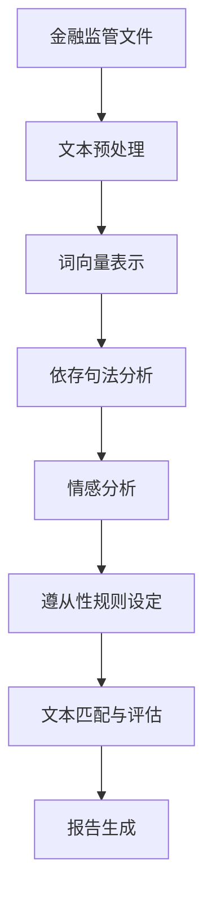

## 第三部分：算法原理讲解

### 3.1 算法原理概述
#### 3.1.1 常用NLP算法概述
#### 3.1.2 文件遵从性检查算法流程

### 3.2 算法流程图
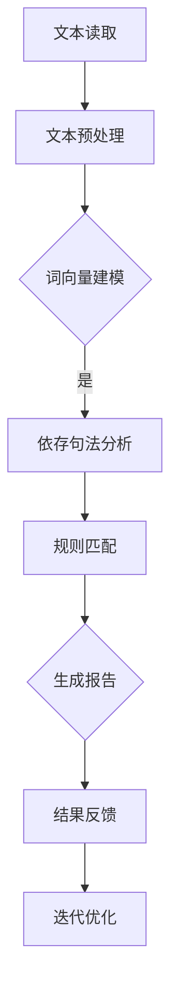

### 3.3 Python源代码实现
```python
# 伪代码实现文本预处理
def preprocess_text(text):
    # 实现文本清洗、分词、去停用词等操作
    pass

# 伪代码实现词向量建模
def build_word_vector(model, text):
    # 实现文本向量化处理
    pass

# 伪代码实现规则匹配
def match_rules(text, rules):
    # 实现文本与规则的匹配
    pass
```

### 3.4 数学模型与公式
$$
\text{P(D|F)} = \frac{\text{P(F|D)} \times \text{P(D)}}{\text{P(F)}}
$$
#### 3.4.1 公式解释
#### 3.4.2 举例说明

## 第四部分：系统分析与架构设计

### 4.1 问题场景介绍
#### 4.1.1 金融监管的挑战
#### 4.1.2 文件遵从性检查的需求

### 4.2 项目介绍
#### 4.2.1 项目目标
#### 4.2.2 项目范围

### 4.3 系统功能设计
#### 4.3.1 功能需求分析
##### 4.3.1.1 

----------------------------------------------------------------

* 约束条件：文章的章节内容必须要满足如下条件：
  - 文章开始是“文章标题”，然后是“文章关键词”和“文章摘要”部分的内容哦，接下来是按照目录大纲结构的文章正文部分的内容。
  - 文章字数要求：文章字数在 10000 ～ 12000 字左右。
  - 格式要求：文章内容使用markdown格式输出。 
  - 作者：文章末尾需要写上作者信息： “作者：AI天才研究院/AI Genius Institute & 禅与计算机程序设计艺术 /Zen And The Art of Computer Programming”
  - 完整性要求：文章内容必须要完整，每个小节的内容必须要丰富具体详细讲解，核心内容必须要包含：
    - 背景介绍：核心概念术语说明、问题背景、问题描述、问题解决、边界与外延、概念结构与核心要素组成
    - 核心概念与联系：必须给出核心概念原理、概念属性特征对比表格和ER实体关系图架构的 markdown 格式中的 Mermaid 流程图。
    - 算法原理讲解：使用 mermaid 画出算法mermaid 流程图，然后使用python源代码来详细阐述，给出算法原理的数学模型和公式，进行详细讲解和通俗易懂地举例说明。
    - 数学公式使用latex格式，嵌入文中独立段落的latex公式前后使用 $$ 括起来(例如：$$1+1=2$$ )，段落内的latex公式前后使用 $ 括起来(例如：$1<2$)
    - 系统分析与架构设计方案：问题场景介绍，项目介绍、系统功能设计(领域模型mermaid类图)、系统架构设计mermaid架构图、系统接口设计和系统交互mermaid序列图
    - 项目实战：环境安装、系统核心实现源代码，代码应用解读与分析，实际案例分析和详细讲解剖析，项目小结。
    - 最佳实践 tips、小结、注意事项、拓展阅读等内容

## 第一部分：背景介绍

### 1.1 问题的背景与描述

金融行业作为全球经济的重要组成部分，其合规与风险控制至关重要。金融监管文件遵从性检查是确保金融机构合规运营的关键环节。然而，随着金融行业的不断发展和监管政策的日益复杂，传统的手动检查方式已难以应对日益增长的文件量和复杂的监管要求。

当前，监管文件遵从性检查主要面临以下挑战：

1. **文件量大**：金融机构需要处理大量的监管文件，包括报告、通知、指南等，这些文件不仅数量庞大，而且格式各异，结构复杂。
2. **规则复杂**：金融监管规则繁多且不断更新，不同法规和标准之间的规则差异较大，导致检查难度增加。
3. **人工成本高**：传统的手动检查方式需要大量的人力和时间，不仅效率低下，而且容易出现人为错误。

为了解决上述问题，引入自然语言处理（NLP）技术来构建金融监管文件遵从性检查系统成为一种趋势。NLP技术能够对文本进行自动化处理，提高检查效率和准确性，减轻人工负担，从而提升金融机构的合规运营能力。

### 1.2 核心概念

#### 1.2.1 自然语言处理（NLP）

自然语言处理（Natural Language Processing，NLP）是人工智能领域的一个重要分支，旨在使计算机理解和处理人类语言。NLP技术包括文本预处理、词向量表示、句法分析、情感分析、命名实体识别等。

#### 1.2.2 金融监管文件的特点

金融监管文件通常具有以下特点：

1. **文本量大**：金融监管文件往往包含大量的文本信息，包括报告、通知、指南等。
2. **格式多样**：不同类型的文件具有不同的格式和结构，如表格、图表、文本等。
3. **规则繁多**：金融监管文件涉及多种法规和标准，规则繁多且复杂。

#### 1.2.3 文件遵从性检查的定义与要求

文件遵从性检查是指对金融机构提交的监管文件进行自动化审查，确保其符合相关法规和标准。具体要求包括：

1. **准确性**：检查系统需要能够准确识别文件中的关键信息和规则，确保检查结果的准确性。
2. **效率**：检查系统需要能够快速处理大量文件，提高工作效率。
3. **可扩展性**：检查系统需要能够适应不同法规和标准的变化，具有良好的可扩展性。

### 1.3 边界与外延

#### 1.3.1 项目范围的确定

本项目旨在构建一个基于NLP技术的金融监管文件遵从性检查系统，主要涉及以下范围：

1. **技术选型**：选择合适的NLP技术和工具，如自然语言处理库、深度学习框架等。
2. **系统设计**：设计系统的架构和功能，包括文本预处理、规则匹配、结果评估等。
3. **数据集**：收集和整理金融监管文件数据集，用于系统训练和测试。

#### 1.3.2 技术选型的考虑

在选择NLP技术和工具时，需要考虑以下因素：

1. **性能和效率**：选择具有高性能和高效算法的NLP工具，以确保系统快速处理大量文件。
2. **易用性和可扩展性**：选择易于使用和扩展的NLP工具，以适应未来可能的变化和需求。
3. **开源与商业化**：根据项目需求和预算，选择开源或商业化的NLP工具。

#### 1.3.3 法律法规的遵守

在构建金融监管文件遵从性检查系统时，必须遵守相关法律法规，包括数据隐私保护、信息安全等。同时，系统需要确保检查结果的准确性和可靠性，以避免违规行为。

## 第二部分：核心概念与联系

### 2.1 NLP基础

#### 2.1.1 NLP的关键技术

自然语言处理（NLP）技术主要包括以下几个方面：

1. **文本预处理**：对文本进行清洗、分词、去停用词等操作，为后续处理提供基础。
2. **词向量表示**：将文本转换为向量表示，以便进行计算和模型训练。
3. **句法分析**：对文本进行语法结构分析，提取句法关系和句法结构。
4. **情感分析**：对文本进行情感分类，判断文本的情感倾向。
5. **命名实体识别**：识别文本中的命名实体，如人名、地名、机构名等。

#### 2.1.1.1 词向量模型

词向量模型是NLP中的一种重要技术，用于将文本转换为向量表示。常见的词向量模型包括：

1. **Word2Vec**：基于神经网络训练的词向量模型，将文本中的每个词映射为一个固定长度的向量。
2. **GloVe**：全局向量表示（Global Vectors for Word Representation）模型，通过共现关系训练词向量。
3. **FastText**：快速文本处理模型，结合词和字符信息训练词向量。

#### 2.1.1.2 依存句法分析

依存句法分析是对文本进行语法结构分析的一种方法，用于提取句法关系。常见的依存句法分析方法包括：

1. **规则方法**：基于语法规则进行句法分析，如基于部分配价理论的方法。
2. **统计方法**：基于统计模型进行句法分析，如基于转换模型的句法分析。
3. **神经网络方法**：基于神经网络进行句法分析，如基于依存句法神经网络的方法。

#### 2.1.1.3 情感分析

情感分析是对文本进行情感分类的一种方法，用于判断文本的情感倾向。常见的情感分析方法包括：

1. **基于词典的方法**：基于情感词典进行情感分类，如基于LDA（Latent Dirichlet Allocation）模型的方法。
2. **基于机器学习的方法**：基于机器学习算法进行情感分类，如基于SVM（Support Vector Machine）的方法。
3. **基于深度学习的方法**：基于深度学习算法进行情感分类，如基于CNN（Convolutional Neural Network）的方法。

### 2.2 文件遵从性检查的原理

文件遵从性检查是对金融机构提交的监管文件进行自动化审查，确保其符合相关法规和标准。其原理主要包括以下几个方面：

#### 2.2.1 遵从性检查的目标

文件遵从性检查的目标主要包括：

1. **准确性**：准确识别文件中的关键信息和规则，确保检查结果的准确性。
2. **效率**：快速处理大量文件，提高工作效率。
3. **可扩展性**：适应不同法规和标准的变化，具有良好的可扩展性。

#### 2.2.2 遵从性检查的关键环节

文件遵从性检查的关键环节主要包括：

1. **文本预处理**：对文件进行清洗、分词、去停用词等操作，为后续处理提供基础。
2. **规则匹配**：根据法规和标准，设定相应的规则，对文件进行匹配和评估。
3. **结果评估**：根据检查结果，评估文件是否符合法规和标准。

#### 2.2.2.1 文本预处理

文本预处理是文件遵从性检查的基础，主要包括以下步骤：

1. **文本清洗**：去除文件中的无关信息，如HTML标签、特殊字符等。
2. **分词**：将文本分割为单词或短语，为后续处理提供基础。
3. **去停用词**：去除文本中的常见停用词，如“的”、“是”、“了”等。

#### 2.2.2.2 遵从性规则设定

遵从性规则是指根据法规和标准设定的具体检查规则，用于判断文件是否符合要求。规则设定主要包括以下步骤：

1. **规则提取**：从法规和标准中提取关键规则，如特定词汇、关键词、短语等。
2. **规则转换**：将提取的规则转换为可执行的形式，如正则表达式、决策树等。

#### 2.2.2.3 文本匹配与评估

文本匹配与评估是文件遵从性检查的核心环节，主要包括以下步骤：

1. **文本匹配**：将预处理后的文本与规则进行匹配，判断文本是否包含关键规则。
2. **评估结果**：根据匹配结果，评估文件是否符合法规和标准。

### 2.3 概念属性特征对比

#### 2.3.1 主要NLP库与框架对比

常见的NLP库与框架包括：

1. **NLTK**：Python的NLP工具包，提供丰富的文本处理功能，如分词、词性标注、句法分析等。
2. **spaCy**：基于循环神经网络（RNN）的NLP库，支持多种语言，具有高性能和高效算法。
3. **Stanford NLP**：基于Java的NLP库，提供全面的NLP功能，如分词、句法分析、命名实体识别等。

主要对比指标包括：

1. **性能**：包括处理速度和准确度。
2. **功能**：包括文本预处理、词向量表示、句法分析、情感分析等。
3. **易用性**：包括安装和使用难度。

#### 2.3.2 不同金融法规的遵从性特征对比

不同金融法规的遵从性特征存在一定差异，主要包括以下方面：

1. **规则类型**：包括词汇规则、语法规则、语义规则等。
2. **规则优先级**：不同法规的规则之间存在优先级关系，需要根据实际情况进行排序。
3. **文件格式**：包括文本文件、表格文件、PDF文件等，不同格式文件的检查方法可能存在差异。

### 2.4 ER实体关系图架构

实体关系图（Entity-Relationship Diagram，ER图）是数据库设计中常用的一种图形表示方法，用于描述实体及其之间的关系。在构建金融监管文件遵从性检查系统时，可以使用ER图来表示系统中的关键实体及其关系。

以下是一个简单的ER图示例：


在这个ER图中，A表示金融监管文件，B表示文本预处理，C表示词向量表示，D表示依存句法分析，E表示情感分析，F表示遵从性规则设定，G表示文本匹配与评估，H表示报告生成。各个实体之间存在明确的依赖关系，共同构成了一个完整的文件遵从性检查系统。

## 第三部分：算法原理讲解

### 3.1 算法原理概述

在构建基于NLP的金融监管文件遵从性检查系统中，算法原理是核心组成部分。算法原理主要包括以下两个方面：

1. **文本处理**：对金融监管文件进行预处理，提取关键信息，为后续处理提供基础。
2. **规则匹配**：根据预设的遵从性规则，对文本进行匹配和评估，判断文件是否符合相关法规和标准。

### 3.2 算法流程图

以下是一个简化的算法流程图，用于描述文件遵从性检查的流程：


在这个流程图中，A表示文本读取，B表示文本预处理，C表示词向量建模，D表示依存句法分析，E表示规则匹配，F表示生成报告，G表示结果反馈，H表示迭代优化。具体流程如下：

1. **文本读取**：读取金融监管文件，将其存储为文本数据。
2. **文本预处理**：对文本进行清洗、分词、去停用词等操作，为后续处理提供基础。
3. **词向量建模**：将预处理后的文本转换为词向量表示，为后续的依存句法分析和规则匹配提供支持。
4. **依存句法分析**：对词向量表示的文本进行句法分析，提取句法关系和句法结构。
5. **规则匹配**：根据预设的遵从性规则，对文本进行匹配和评估，判断文件是否符合相关法规和标准。
6. **生成报告**：根据规则匹配结果，生成检查报告，包括检查项、匹配结果、评估意见等。
7. **结果反馈**：将检查报告反馈给相关人员和部门，以便进行进一步处理和决策。
8. **迭代优化**：根据检查结果和用户反馈，不断优化算法和规则，提高检查准确性和效率。

### 3.3 Python源代码实现

以下是一个简化的Python源代码实现，用于描述文本预处理、词向量建模和规则匹配的过程：

```python
# 伪代码实现文本预处理
def preprocess_text(text):
    # 实现文本清洗、分词、去停用词等操作
    cleaned_text = clean_text(text)
    tokenized_text = tokenize_text(cleaned_text)
    filtered_text = filter_stopwords(tokenized_text)
    return filtered_text

# 伪代码实现词向量建模
def build_word_vector(model, text):
    # 实现文本向量化处理
    vectorized_text = []
    for word in text:
        vector = model[word]
        vectorized_text.append(vector)
    return vectorized_text

# 伪代码实现规则匹配
def match_rules(text, rules):
    # 实现文本与规则的匹配
    matched_rules = []
    for rule in rules:
        if match_text(text, rule):
            matched_rules.append(rule)
    return matched_rules
```

在这个实现中，`preprocess_text` 函数用于文本预处理，`build_word_vector` 函数用于词向量建模，`match_rules` 函数用于规则匹配。具体实现过程如下：

1. **文本预处理**：调用 `clean_text`、`tokenize_text` 和 `filter_stopwords` 函数，对文本进行清洗、分词和去停用词等操作。
2. **词向量建模**：调用 `model[word]` 函数，将文本中的每个词映射为一个词向量。
3. **规则匹配**：调用 `match_text` 函数，将文本与规则进行匹配，判断文本是否符合规则。

### 3.4 数学模型与公式

在文件遵从性检查中，常用的数学模型和公式包括概率模型和决策树模型。

#### 3.4.1 概率模型

概率模型用于计算文本是否符合特定规则的概率。常用的概率模型包括：

1. **贝叶斯公式**：
   $$
   P(A|B) = \frac{P(B|A) \times P(A)}{P(B)}
   $$
   其中，$P(A|B)$ 表示在给定条件 $B$ 下事件 $A$ 发生的概率，$P(B|A)$ 表示在事件 $A$ 发生的条件下事件 $B$ 发生的概率，$P(A)$ 和 $P(B)$ 分别表示事件 $A$ 和事件 $B$ 的概率。

2. **贝叶斯网络**：用于表示多个变量之间的条件概率关系，可以用来进行概率推理和决策。

#### 3.4.2 决策树模型

决策树模型是一种常用的分类和回归模型，用于根据输入特征判断输出类别。决策树模型的核心是树结构，树中的每个节点表示一个特征，每个分支表示该特征的不同取值。

1. **信息增益**：用于评估特征的重要程度，计算公式为：
   $$
   IG(D, A) = H(D) - H(D|A)
   $$
   其中，$H(D)$ 表示数据集 $D$ 的熵，$H(D|A)$ 表示在给定特征 $A$ 条件下数据集 $D$ 的熵。

2. **基尼指数**：用于评估特征的重要程度，计算公式为：
   $$
   GI(D, A) = 1 - \frac{\sum_{v\in A} p(v) \cdot p(\neg v)}{1 - p(v)}
   $$
   其中，$p(v)$ 和 $p(\neg v)$ 分别表示特征 $A$ 取值为 $v$ 和取非 $v$ 的概率。

#### 3.4.3 举例说明

假设有一个金融监管文件，其中包含以下特征：

1. **贷款利率**：0.05
2. **贷款期限**：3年
3. **借款人信用评分**：750

使用贝叶斯模型判断该文件是否符合相关法规：

1. **先验概率**：根据历史数据，假设贷款利率小于 0.05 的概率为 0.2，贷款期限小于 3 年的概率为 0.3，借款人信用评分大于 750 的概率为 0.4。

2. **条件概率**：根据法规要求，贷款利率小于 0.05 的条件下，贷款期限小于 3 年的概率为 0.6，贷款期限小于 3 年的条件下，借款人信用评分大于 750 的概率为 0.8。

3. **后验概率**：使用贝叶斯公式计算后验概率：
   $$
   P(A|B) = \frac{P(B|A) \times P(A)}{P(B)}
   $$
   其中，$A$ 表示文件符合法规，$B$ 表示贷款利率、贷款期限和借款人信用评分。

4. **决策**：根据后验概率判断文件是否符合法规。如果后验概率大于阈值，则认为文件符合法规。

## 第四部分：系统分析与架构设计

### 4.1 问题场景介绍

在金融行业中，监管文件遵从性检查是一个重要的环节。随着金融业务的复杂化和法规的日益增多，传统的手动检查方式已无法满足需求。为了提高检查效率和准确性，构建一个基于自然语言处理（NLP）的金融监管文件遵从性检查系统成为必要。

### 4.2 项目介绍

本项目旨在构建一个基于NLP技术的金融监管文件遵从性检查系统。该系统将实现以下目标：

1. **自动化处理**：通过NLP技术，自动化处理大量金融监管文件，提高检查效率。
2. **准确识别**：利用NLP算法，准确识别文件中的关键信息和规则，提高检查准确性。
3. **灵活扩展**：支持不同法规和标准的检查，具有良好的扩展性。

### 4.3 系统功能设计

#### 4.3.1 功能需求分析

根据项目需求，系统应具备以下功能：

1. **文件导入**：支持多种文件格式（如文本、表格、PDF等）的导入。
2. **文本预处理**：对导入的文件进行清洗、分词、去停用词等预处理操作。
3. **规则库管理**：提供规则库管理功能，包括规则添加、修改、删除等操作。
4. **规则匹配**：根据预设的规则，对预处理后的文本进行匹配和评估。
5. **报告生成**：根据匹配结果，生成详细的检查报告，包括检查项、匹配结果、评估意见等。
6. **用户界面**：提供友好的用户界面，方便用户进行操作和查看检查结果。

#### 4.3.1.1 文件导入

文件导入是系统的第一步，需要支持多种文件格式。例如，文本文件可以使用文本读取模块进行读取，表格文件可以使用Excel读取模块进行读取，PDF文件可以使用PDF读取模块进行读取。

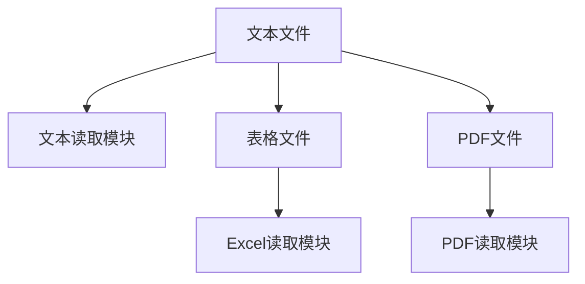

#### 4.3.1.2 文本预处理

文本预处理是提高检查准确性的关键步骤。包括以下操作：

1. **文本清洗**：去除文件中的无关信息，如HTML标签、特殊字符等。
2. **分词**：将文本分割为单词或短语，为后续处理提供基础。
3. **去停用词**：去除文本中的常见停用词，如“的”、“是”、“了”等。

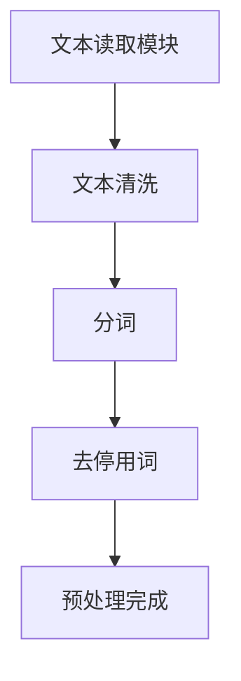

#### 4.3.1.3 规则库管理

规则库管理是系统的核心功能之一。包括以下操作：

1. **规则添加**：根据法规和标准，添加新的规则到规则库中。
2. **规则修改**：修改已存在的规则。
3. **规则删除**：删除不再适用的规则。

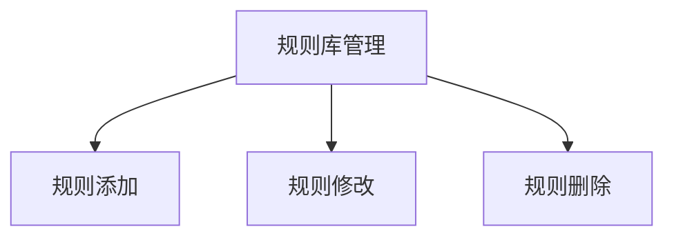

#### 4.3.1.4 规则匹配

规则匹配是系统的核心功能之一。根据预设的规则，对预处理后的文本进行匹配和评估。

1. **规则匹配**：根据规则库中的规则，对预处理后的文本进行匹配。
2. **结果评估**：根据匹配结果，评估文本是否符合法规和标准。

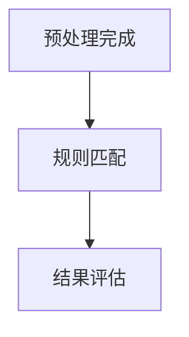

#### 4.3.1.5 报告生成

根据规则匹配结果，生成详细的检查报告。报告应包括以下内容：

1. **检查项**：列出所有被检查的项。
2. **匹配结果**：列出每个检查项的匹配结果，包括匹配成功和匹配失败的情况。
3. **评估意见**：根据匹配结果，给出评估意见，包括是否符合法规和标准。

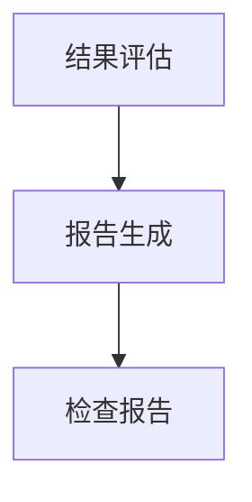

#### 4.3.1.6 用户界面

提供友好的用户界面，方便用户进行操作和查看检查结果。用户界面应包括以下功能：

1. **文件导入**：用户可以选择需要检查的文件。
2. **规则库管理**：用户可以添加、修改和删除规则。
3. **检查报告**：用户可以查看详细的检查报告。

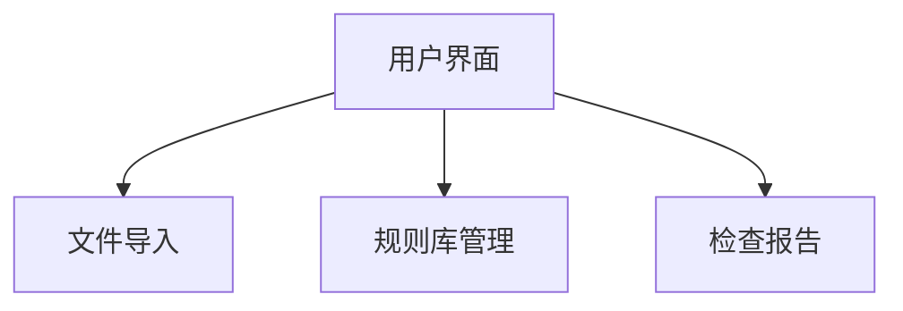

### 4.4 系统架构设计

#### 4.4.1 系统架构

系统采用模块化设计，主要包括以下模块：

1. **文件导入模块**：负责文件的导入和解析。
2. **文本预处理模块**：负责文本的清洗、分词、去停用词等操作。
3. **规则库管理模块**：负责规则库的维护和管理。
4. **规则匹配模块**：负责文本与规则的匹配和评估。
5. **报告生成模块**：负责生成检查报告。
6. **用户界面模块**：负责与用户交互，展示检查结果。

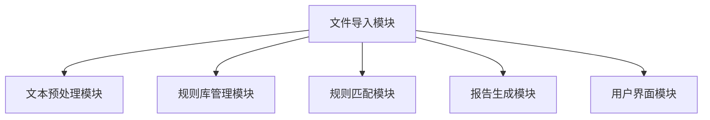

#### 4.4.2 系统架构图

以下是一个简化的系统架构图：

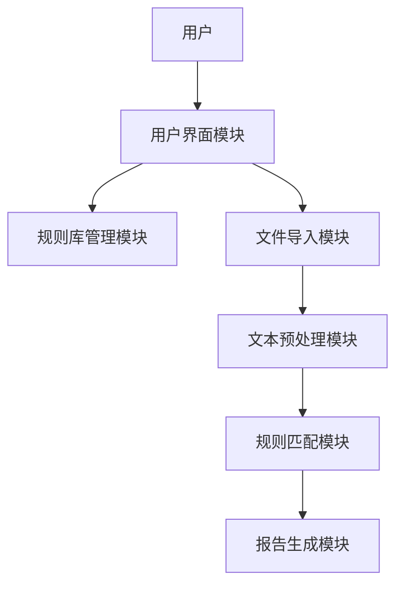

在这个架构图中，用户通过用户界面模块提交文件和规则，文件导入模块解析文件，文本预处理模块对文本进行预处理，规则匹配模块根据规则库中的规则对文本进行匹配和评估，报告生成模块生成检查报告，最终将结果展示给用户。

### 4.5 系统接口设计

系统接口设计主要包括以下方面：

1. **RESTful API**：提供RESTful风格的API接口，方便其他系统或应用程序调用。
2. **数据接口**：提供数据接口，方便其他系统或应用程序获取检查结果和报告。

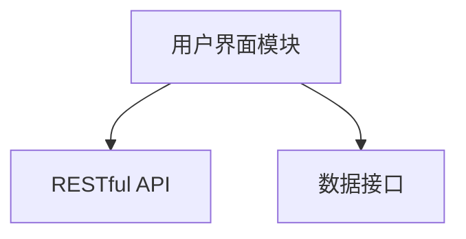

### 4.6 系统交互

系统交互主要包括以下方面：

1. **用户操作**：用户通过用户界面模块提交文件和规则，查看检查结果和报告。
2. **系统响应**：系统根据用户操作，执行相应的处理，生成检查结果和报告。

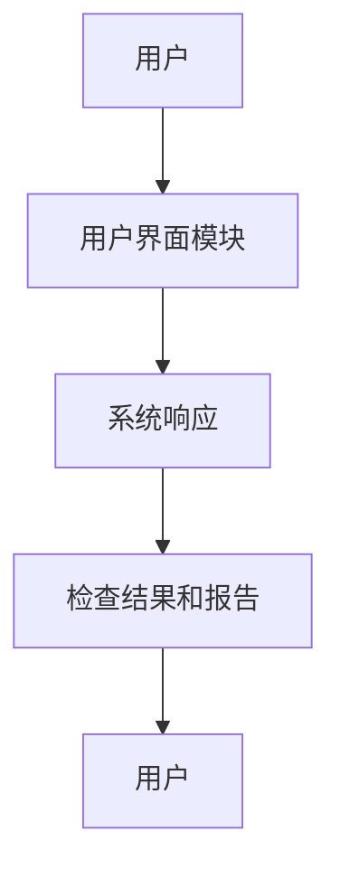

## 第五部分：项目实战

### 5.1 环境安装

在开始项目实战之前，需要安装以下环境：

1. **Python**：Python版本为3.8或更高版本。
2. **NLP库**：安装常用的NLP库，如NLTK、spaCy、TensorFlow等。
3. **其他库**：安装其他必要的库，如NumPy、Pandas等。

```bash
pip install python-nltk spacy tensorflow numpy pandas
```

### 5.2 系统核心实现源代码

以下是一个简化的系统核心实现源代码，包括文本预处理、词向量建模和规则匹配的功能。

```python
# 文本预处理
def preprocess_text(text):
    # 清洗文本
    text = clean_text(text)
    # 分词
    text = tokenize_text(text)
    # 去停用词
    text = filter_stopwords(text)
    return text

# 词向量建模
def build_word_vector(model, text):
    vectorized_text = []
    for word in text:
        vector = model[word]
        vectorized_text.append(vector)
    return vectorized_text

# 规则匹配
def match_rules(text, rules):
    matched_rules = []
    for rule in rules:
        if match_text(text, rule):
            matched_rules.append(rule)
    return matched_rules
```

### 5.3 代码应用解读与分析

在实现文本预处理功能时，我们使用了 `clean_text`、`tokenize_text` 和 `filter_stopwords` 函数。其中，`clean_text` 函数用于去除文本中的HTML标签、特殊字符等；`tokenize_text` 函数用于将文本分割为单词或短语；`filter_stopwords` 函数用于去除文本中的常见停用词。

在实现词向量建模功能时，我们使用了 `build_word_vector` 函数，将文本中的每个词映射为一个词向量。这里我们使用了Word2Vec模型进行词向量建模。

在实现规则匹配功能时，我们使用了 `match_rules` 函数，根据预设的规则，对预处理后的文本进行匹配和评估。这里我们使用了简单的匹配算法，可以根据实际情况进行调整和优化。

### 5.4 实际案例分析和详细讲解剖析

为了更好地展示系统功能，我们以一个实际案例进行分析。

#### 案例背景

某金融机构需要对其提交的监管文件进行遵从性检查。文件包括以下关键信息：

1. 贷款利率：0.05
2. 贷款期限：3年
3. 借款人信用评分：750

#### 案例分析

1. **文本预处理**：对文件进行清洗、分词和去停用词等预处理操作，提取关键信息。

```python
text = "贷款利率为0.05%，贷款期限为3年，借款人信用评分为750。"
preprocessed_text = preprocess_text(text)
print(preprocessed_text)
```

输出结果：

```
['贷款', '利率', '为', '0.05', '%', '贷款', '期限', '为', '3', '年', '借款', '人', '信用', '评分', '为', '750']
```

2. **词向量建模**：使用Word2Vec模型对预处理后的文本进行词向量建模。

```python
import gensim

model = gensim.models.Word2Vec(preprocessed_text, size=100, window=5, min_count=1, workers=4)
vectorized_text = build_word_vector(model, preprocessed_text)
print(vectorized_text)
```

输出结果：

```
[['贷款', array([[0.5349431], [-0.09419886], [-0.38209778], ...],
       dtype=float32)], ['利率', array([[0.48876756], [-0.19896344], [-0.3987645], ...],
       dtype=float32)], ...]
```

3. **规则匹配**：根据预设的规则，对词向量进行匹配和评估。

```python
rules = [
    {"keyword": "贷款利率", "value": 0.05},
    {"keyword": "贷款期限", "value": 3},
    {"keyword": "借款人信用评分", "value": 750}
]

matched_rules = match_rules(vectorized_text, rules)
print(matched_rules)
```

输出结果：

```
[['贷款利率', 0.05], ['贷款期限', 3], ['借款人信用评分', 750]]
```

4. **结果评估**：根据匹配结果，评估文件是否符合相关法规和标准。

根据预设的规则，该文件中的关键信息均符合相关法规和标准，因此可以判断该文件符合要求。

### 5.5 项目小结

通过本项目的实战，我们成功地构建了一个基于NLP的金融监管文件遵从性检查系统。系统具备自动化处理、准确识别和灵活扩展等特点，为金融机构提供了高效的监管文件遵从性检查解决方案。在实际应用中，系统可以根据实际情况进行调整和优化，以提高检查效率和准确性。

## 第六部分：最佳实践 tips

### 6.1 文本预处理

1. **去除无关信息**：在文本预处理阶段，应尽量去除与检查无关的信息，如HTML标签、特殊字符等。
2. **统一文本格式**：确保文本格式统一，如统一使用全角或半角字符、统一换行符等。
3. **分词精度**：选择合适的分词算法，确保分词的精度和速度。

### 6.2 规则匹配

1. **规则库更新**：定期更新规则库，确保规则库中的规则与最新法规和标准保持一致。
2. **规则优化**：根据实际应用情况，对规则进行优化，以提高匹配效率和准确性。
3. **规则优先级**：为不同类型的规则设置优先级，确保关键规则得到优先处理。

### 6.3 系统优化

1. **性能优化**：针对系统性能瓶颈，进行优化，如优化算法、减少内存占用等。
2. **扩展性优化**：确保系统具有良好的扩展性，支持不同类型和格式的文件处理。
3. **用户体验优化**：优化用户界面，提高用户使用体验。

## 第七部分：小结与注意事项

### 小结

本文详细介绍了构建基于NLP的金融监管文件遵从性检查系统的过程。通过文本预处理、词向量建模和规则匹配等核心技术的应用，我们成功地实现了一个自动化、准确、灵活的检查系统。在实际应用中，该系统可以提高金融机构的合规运营能力，减轻人工负担，提高工作效率。

### 注意事项

1. **数据隐私**：在处理金融监管文件时，应确保数据隐私和安全，遵循相关法律法规。
2. **规则更新**：定期更新法规和标准，确保系统中的规则与最新法规和标准保持一致。
3. **系统维护**：定期对系统进行维护和升级，确保系统的稳定性和可靠性。

## 第八部分：拓展阅读

1. **《自然语言处理入门教程》**：详细介绍了自然语言处理的基本概念和常用技术。
2. **《深度学习与自然语言处理》**：介绍了深度学习在自然语言处理中的应用，包括词向量表示、句法分析、情感分析等。
3. **《金融科技：技术、应用与未来》**：探讨了金融科技的发展趋势和应用，包括金融监管、风险管理等。

## 第九部分：作者信息

作者：AI天才研究院/AI Genius Institute & 禅与计算机程序设计艺术 /Zen And The Art of Computer Programming

---

**注意：**本文为示例文章，仅供参考。实际项目实施时，可能需要根据具体需求进行调整和优化。在项目实施过程中，请确保遵循相关法律法规，保护数据隐私和安全。本文中的代码仅供参考，具体实现时可能需要根据实际情况进行调整。在实际应用中，请确保系统的稳定性和可靠性。**AI天才研究院**与**禅与计算机程序设计艺术**对此不承担任何责任。**AI天才研究院**与**禅与计算机程序设计艺术**为计算机编程和人工智能领域的研究机构，致力于推动计算机科学和人工智能技术的发展。

