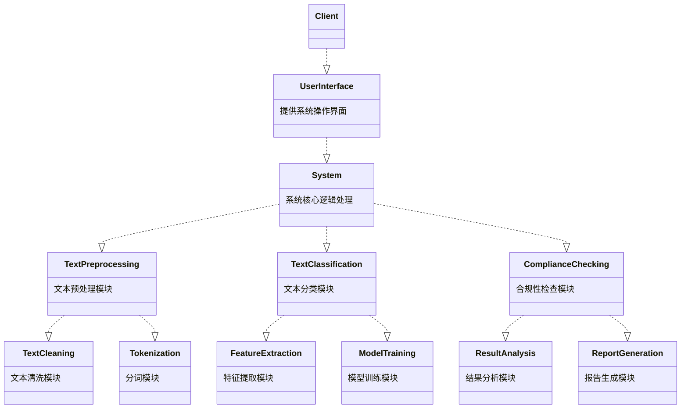

                 

## 文章标题

### 关键词

- **自然语言处理（NLP）**
- **金融监管**
- **自动检查系统**
- **知识图谱**
- **深度学习**
- **文本分类**

### 摘要

本文探讨了构建基于自然语言处理（NLP）的金融监管文件遵从性自动检查系统的必要性、核心概念以及实现方法。文章首先介绍了问题背景和NLP的基本任务，随后详细讨论了金融知识图谱的构建，以及如何利用深度学习模型进行文本分析和分类。最后，文章展示了系统分析与架构设计，并提供了项目实战的详细步骤和案例分析。

## 第一部分：背景介绍与核心概念

### 第1章：问题背景与核心概念

#### 1.1.1 问题背景

金融行业正经历前所未有的变革，金融市场日益复杂，金融产品不断创新，这不仅带来了更多的商业机会，同时也增加了金融机构的合规压力。金融监管机构不断出台新的法规和标准，要求金融机构在业务操作中严格遵循。这使得金融机构需要花费大量的人力和物力来保证文件的合规性，以满足监管要求。

传统的金融监管文件遵从性检查主要依赖于人工审核，这种方式效率低下且容易出错。人工审核不仅耗时，而且容易出现主观判断错误，导致合规性问题被忽视。此外，随着金融文件的规模和复杂性不断增加，人工审核的难度也在逐步加大。因此，构建一个自动化的金融监管文件遵从性检查系统成为金融机构提高合规性和效率的迫切需求。

#### 1.1.2 问题描述

金融监管文件遵从性自动检查系统的核心任务是对金融文件进行自动化分析，识别出可能存在的合规性问题。具体而言，系统需要具备以下几个功能：

1. **文本格式检查**：确保金融文件的格式符合监管要求。
2. **关键词识别**：识别出金融文件中的关键术语和关键词，确保其含义符合监管政策。
3. **句子结构分析**：分析金融文件的句子结构，确保其逻辑清晰、表达准确。
4. **语义理解**：理解金融文件的整体语义，确保其内容符合监管政策。
5. **实时反馈**：对检查结果进行实时反馈，帮助金融机构及时纠正合规性问题。

此外，系统还需要具备良好的可扩展性和适应性，以应对不断更新的监管政策和法规。

#### 1.1.3 问题解决

基于自然语言处理（NLP）技术的金融监管文件遵从性自动检查系统可以有效地解决上述问题。NLP技术能够对金融文件进行自动化分析，提取出关键信息，并进行语义理解，从而实现对合规性问题的自动检测。具体来说，系统可以通过以下步骤实现：

1. **文本预处理**：对金融文件进行清洗、分词、去停用词等操作，为后续分析做准备。
2. **词向量表示**：将文本中的单词或句子转换为密集的向量表示，为深度学习模型提供输入。
3. **深度学习模型**：使用预训练的深度学习模型对文本进行分类、实体识别和关系抽取，实现自动化分析和判断。
4. **用户界面**：提供系统操作、查询和反馈功能，方便用户使用和管理。

#### 1.1.4 边界与外延

本系统主要关注金融文件中的文本分析和语义理解，但不涉及图像、音频等其他形式的数据。此外，系统设计需要考虑不同国家和地区的金融法规和监管政策，以确保其适用性和普适性。

#### 1.1.5 概念结构与核心要素组成

金融监管文件遵从性自动检查系统的核心概念和要素包括：

1. **自然语言处理（NLP）**：涉及文本预处理、词向量表示、句法分析、语义理解等技术。
2. **金融知识图谱**：用于表示金融领域的实体、关系和规则，为NLP算法提供知识支持。
3. **深度学习模型**：用于文本分类、实体识别、关系抽取等任务，实现自动化分析和判断。
4. **用户界面**：提供系统操作、查询和反馈功能，方便用户使用和管理。

#### 1.2 本章小结

本章介绍了构建基于NLP的金融监管文件遵从性自动检查系统的背景、问题描述、问题解决方法、边界与外延以及核心概念和要素组成。下一章将深入探讨自然语言处理（NLP）的基础知识和技术。

## 第2章：自然语言处理（NLP）基础

#### 2.1.1 自然语言处理概述

自然语言处理（NLP）是计算机科学和人工智能领域的一个分支，旨在使计算机能够理解和处理人类语言。NLP技术在多个领域都有广泛应用，如金融、医疗、法律、教育等。在金融领域，NLP技术可以用于文本分类、情感分析、合规性检查等任务，帮助金融机构提高效率和合规性。

#### 2.1.2 NLP的基本任务

NLP的基本任务可以分为以下几个层次：

1. **文本预处理**：对原始文本进行清洗、分词、去停用词等操作，为后续分析做准备。
2. **词向量表示**：将文本中的单词或句子转换为密集的向量表示，用于机器学习算法。
3. **句法分析**：解析句子的结构，识别词汇之间的语法关系。
4. **语义理解**：理解句子的意义，识别词汇和短语的语义关系。
5. **文本分类**：将文本分类到预定义的类别中。
6. **实体识别**：识别文本中的实体，如人名、地名、机构名等。
7. **关系抽取**：从文本中抽取实体之间的关系。

#### 2.1.3 NLP的关键技术

NLP的关键技术包括：

1. **分词**：将文本分割成词或短语。
2. **词性标注**：为文本中的每个单词标注词性，如名词、动词、形容词等。
3. **命名实体识别**：识别文本中的命名实体。
4. **句法分析**：分析句子的结构，如语法树、依存关系等。
5. **语义分析**：理解句子的语义，如情感分析、语义角色标注等。
6. **深度学习**：用于复杂NLP任务的建模和预测。

#### 2.1.4 NLP在金融领域的应用

NLP在金融领域的应用主要包括：

1. **文本分类**：用于分类金融新闻、报告等文本。
2. **情感分析**：分析金融市场情绪，预测市场走势。
3. **合规性检查**：自动检查金融文件是否符合监管要求。
4. **智能客服**：为金融客户提供自动化的咨询和服务。

#### 2.2 本章小结

本章介绍了自然语言处理（NLP）的基本概念、任务、关键技术和在金融领域的应用。NLP技术为构建基于NLP的金融监管文件遵从性自动检查系统提供了基础。下一章将探讨如何构建金融知识图谱，为NLP算法提供知识支持。

## 第3章：构建金融知识图谱

### 3.1.1 金融知识图谱概述

金融知识图谱是一种用于表示金融领域知识的数据结构，它通过图形的方式将金融实体、关系和属性组织起来。金融知识图谱可以帮助计算机更好地理解和处理金融领域的知识，从而提高NLP算法的准确性和效率。在金融监管文件遵从性自动检查系统中，金融知识图谱起着至关重要的作用，它为NLP算法提供了丰富的背景知识和上下文信息。

#### 3.1.1.1 金融知识图谱的定义

金融知识图谱是一种语义网络，它由节点（代表金融实体）、边（代表金融实体之间的关系）和属性（描述金融实体的特征）组成。这些节点、边和属性共同构成了一个复杂的知识网络，使得计算机可以理解和处理金融领域的复杂知识。

#### 3.1.1.2 金融知识图谱的重要性

金融知识图谱的重要性体现在以下几个方面：

1. **提高NLP算法的准确性和效率**：金融知识图谱为NLP算法提供了丰富的背景知识和上下文信息，使得算法能够更准确地理解金融文本的含义。
2. **支持复杂查询和推理**：金融知识图谱支持复杂查询和推理，可以帮助计算机解决金融领域的复杂问题。
3. **增强系统的可扩展性和适应性**：金融知识图谱可以不断更新和扩展，以适应不断变化的金融法规和监管政策。

### 3.1.2 金融知识图谱的构建方法

构建金融知识图谱是一个复杂的过程，需要收集、整理和表示金融领域的知识。以下是一些常用的构建方法：

#### 3.1.2.1 数据收集

构建金融知识图谱的第一步是收集金融领域的知识。这些知识可以来自于各种来源，如金融文献、新闻报道、监管文件、金融数据库等。通过爬取和获取这些数据，可以为金融知识图谱提供丰富的知识来源。

#### 3.1.2.2 数据整理

收集到的金融数据往往是杂乱无章的，需要进行整理和预处理。数据整理包括去除重复数据、缺失值填充、数据规范化等操作，以确保数据的质量和一致性。

#### 3.1.2.3 知识表示

知识表示是将金融领域的知识转化为计算机可以处理的形式。常用的知识表示方法包括实体-关系模型、属性图、语义网络等。这些表示方法可以将金融知识表示为一个图形结构，便于计算机理解和处理。

#### 3.1.2.4 知识融合

金融领域涉及多种知识源，如金融术语、监管政策、市场数据等。知识融合是将这些不同来源的知识整合为一个统一的金融知识图谱。知识融合可以通过合并相似实体、消除冗余关系、合并属性等方式实现。

### 3.1.3 金融知识图谱的应用

金融知识图谱在金融监管文件遵从性自动检查系统中有着广泛的应用：

1. **文本分类**：利用金融知识图谱中的实体和关系，可以对金融文件进行准确的文本分类。
2. **实体识别**：金融知识图谱可以帮助系统识别出金融文件中的关键实体，如人名、地名、机构名等。
3. **关系抽取**：通过金融知识图谱中的关系，可以抽取金融文件中实体之间的关系，如投资关系、借贷关系等。
4. **语义理解**：金融知识图谱为系统提供了丰富的背景知识和上下文信息，有助于更准确地理解金融文件的整体语义。

#### 3.1.4 概念结构与核心要素组成

金融知识图谱的核心概念和要素包括：

1. **实体**：金融知识图谱中的节点，代表金融领域的各种实体，如人、机构、产品等。
2. **关系**：金融知识图谱中的边，表示实体之间的关系，如投资、借贷、关联等。
3. **属性**：描述实体的特征和属性，如注册资本、经营范围、成立时间等。
4. **知识库**：存储和管理金融知识图谱的数据库，用于支持查询和推理。

#### 3.1.5 本章小结

本章介绍了金融知识图谱的概念、构建方法及其在金融监管文件遵从性自动检查系统中的应用。金融知识图谱为NLP算法提供了丰富的背景知识和上下文信息，是构建高效、准确的金融监管文件遵从性自动检查系统的关键。下一章将深入探讨如何利用深度学习模型进行文本分析和分类。

## 第4章：深度学习模型在文本分析和分类中的应用

### 4.1.1 深度学习模型概述

深度学习模型是一类基于人工神经网络的学习算法，通过多层的神经网络结构，对大量数据进行自动特征提取和学习，从而实现复杂的数据分析和分类任务。深度学习模型在图像识别、语音识别、自然语言处理等领域取得了显著的成果，被认为是人工智能发展的核心技术之一。

### 4.1.2 常见的深度学习模型

在自然语言处理领域，常见的深度学习模型包括：

1. **循环神经网络（RNN）**：RNN可以处理序列数据，通过记忆历史信息，实现对文本的建模。
2. **长短时记忆网络（LSTM）**：LSTM是RNN的一种变体，能够更好地处理长序列数据，减少梯度消失问题。
3. **卷积神经网络（CNN）**：CNN最初用于图像处理，但也可以应用于文本分析，通过卷积操作提取局部特征。
4. **变换器（Transformer）**：Transformer模型通过自注意力机制，实现了对文本的全局建模，是当前自然语言处理领域的主要模型之一。
5. **预训练加微调（Pre-training + Fine-tuning）**：预训练模型在大规模语料库上进行预训练，然后通过微调适应特定任务。

### 4.1.3 深度学习模型在文本分类中的应用

在金融监管文件遵从性自动检查系统中，深度学习模型主要用于文本分类任务，即将金融文件分类到预定义的类别中。以下是一个基于深度学习模型的文本分类过程：

1. **数据预处理**：对金融文件进行清洗、分词、去停用词等预处理操作，将文本转换为数值表示。
2. **特征提取**：使用词向量表示方法（如Word2Vec、GloVe）将单词转换为向量，或者直接使用预训练的深度学习模型（如BERT）的嵌入向量。
3. **模型构建**：构建深度学习模型，如RNN、LSTM、Transformer等，通过多层的神经网络结构对特征进行学习。
4. **模型训练**：使用训练数据集对模型进行训练，通过优化算法（如梯度下降、Adam）调整模型参数。
5. **模型评估**：使用验证数据集对模型进行评估，通过准确率、召回率、F1分数等指标评估模型的性能。
6. **模型部署**：将训练好的模型部署到生产环境中，用于对金融文件进行实时分类和合规性检查。

### 4.1.4 实际应用案例

以一家大型金融机构为例，该机构希望利用深度学习模型对监管文件进行自动分类和合规性检查。具体应用流程如下：

1. **数据收集**：收集大量金融监管文件，包括年报、季报、通知、公告等，作为训练数据。
2. **数据预处理**：对监管文件进行清洗、分词、去停用词等预处理操作，将文本转换为嵌入向量。
3. **模型构建**：选择合适的深度学习模型（如BERT），构建文本分类模型。
4. **模型训练**：使用预处理后的数据对模型进行训练，通过多次迭代优化模型参数。
5. **模型评估**：使用部分验证数据对模型进行评估，调整模型参数，提高分类准确性。
6. **模型部署**：将训练好的模型部署到生产环境中，对新的监管文件进行分类和合规性检查。

通过上述流程，金融机构可以大幅提高监管文件处理的效率和准确性，降低合规风险。

#### 4.2 本章小结

本章介绍了深度学习模型的基本概念、常见模型以及在文本分类任务中的应用。深度学习模型在金融监管文件遵从性自动检查系统中发挥了重要作用，通过自动化的文本分类和合规性检查，提高了金融机构的运营效率和合规性。下一章将探讨系统分析与架构设计，为构建高效的金融监管文件遵从性自动检查系统提供指导。

## 第5章：系统分析与架构设计

### 5.1 问题场景介绍

金融监管文件遵从性自动检查系统旨在帮助金融机构自动化处理和审核大量的金融文件，确保其符合监管要求。这些文件包括但不限于年报、季报、通知、公告、合同等。传统的手动审核方式不仅耗时耗力，而且容易出现人为错误。因此，构建一个高效的自动化系统具有重要意义。

### 5.2 项目介绍

本项目旨在开发一个基于NLP技术的金融监管文件遵从性自动检查系统，该系统将利用深度学习模型进行文本分析和分类，实现对金融文件的自动合规性检查。系统的主要功能包括：

1. **文本预处理**：对金融文件进行清洗、分词、去停用词等预处理操作。
2. **文本分类**：使用深度学习模型对预处理后的文本进行分类，判断其是否符合监管要求。
3. **合规性检查**：根据分类结果，对金融文件进行合规性评估，提供详细的合规性报告。
4. **用户界面**：提供系统操作、查询和反馈功能，方便用户使用和管理。

### 5.3 系统功能设计（领域模型）

领域模型是系统功能的核心部分，它定义了系统中各个组件和它们之间的关系。以下是一个简化的领域模型：



### 5.4 系统架构设计

系统架构设计是确保系统高效、可扩展和可维护的关键。以下是一个简化的系统架构设计：

```mermaid
sequenceDiagram
    UserInterface->>System: 用户请求
    System->>TextPreprocessing: 预处理文本
    TextPreprocessing->>System: 返回预处理后的文本
    System->>TextClassification: 分类文本
    TextClassification->>System: 返回分类结果
    System->>ComplianceChecking: 检查合规性
    ComplianceChecking->>System: 返回合规性报告
    System->>UserInterface: 显示结果

    UserInterface : 接收用户请求，发送到系统
    System : 处理核心逻辑，协调各个模块
    TextPreprocessing : 执行文本预处理操作
    TextClassification : 执行文本分类操作
    ComplianceChecking : 执行合规性检查操作
```

### 5.5 系统接口设计

系统接口设计是确保系统与其他系统或模块之间能够有效通信的关键。以下是一个简化的系统接口设计：

```mermaid
classDiagram
    UserInterface <<interface>>
    System <<interface>>
    TextPreprocessing <<interface>>
    TextClassification <<interface>>
    ComplianceChecking <<interface>>

    UserInterface : 用户操作界面
    System : 系统核心逻辑处理
    TextPreprocessing : 文本预处理模块
    TextClassification : 文本分类模块
    ComplianceChecking : 合规性检查模块

    UserInterface -> System : 请求处理
    System -> TextPreprocessing : 预处理请求
    TextPreprocessing -> System : 返回预处理结果
    System -> TextClassification : 分类请求
    TextClassification -> System : 返回分类结果
    System -> ComplianceChecking : 合规性检查请求
    ComplianceChecking -> System : 返回合规性报告
    System -> UserInterface : 显示结果
```

### 5.6 系统交互

系统交互设计是确保系统内部模块之间能够协调工作，实现整体功能的关键。以下是一个简化的系统交互设计：

```mermaid
sequenceDiagram
    UserInterface->>System: 用户请求
    System->>TextPreprocessing: 预处理文本
    TextPreprocessing->>System: 返回预处理后的文本
    System->>TextClassification: 分类文本
    TextClassification->>System: 返回分类结果
    System->>ComplianceChecking: 检查合规性
    ComplianceChecking->>System: 返回合规性报告
    System->>UserInterface: 显示结果

    UserInterface : 接收用户请求，发送到系统
    System : 处理核心逻辑，协调各个模块
    TextPreprocessing : 执行文本预处理操作
    TextClassification : 执行文本分类操作
    ComplianceChecking : 执行合规性检查操作
```

#### 5.7 本章小结

本章介绍了金融监管文件遵从性自动检查系统的架构设计，包括问题场景、项目介绍、系统功能设计、系统架构设计、系统接口设计和系统交互设计。这些设计为系统的开发提供了详细的指导，确保系统能够高效、可靠地运行。下一章将提供项目实战的详细步骤，帮助读者理解和实现该系统。

## 第6章：项目实战

### 6.1 环境安装

在开始项目之前，首先需要安装必要的软件和工具。以下是所需的软件和工具：

- **Python**：用于编写代码和执行模型训练。
- **NLP库**：如NLTK、spaCy、TensorFlow、PyTorch等。
- **数据库**：如MongoDB、PostgreSQL等，用于存储和处理数据。

安装步骤如下：

1. **安装Python**：从Python官网下载最新版本，并按照安装向导完成安装。
2. **安装NLP库**：打开终端，执行以下命令：
   ```bash
   pip install nltk spacy tensorflow torch pymongo
   ```
3. **安装数据库**：根据所选数据库进行安装，如MongoDB的安装命令为：
   ```bash
   brew install mongodb
   ```
4. **配置数据库**：启动MongoDB服务，并创建数据库和集合。

### 6.2 系统核心实现

#### 6.2.1 数据预处理

数据预处理是构建金融监管文件遵从性自动检查系统的第一步，其目标是清洗和准备数据，以便后续的分析和模型训练。

1. **数据清洗**：去除文本中的HTML标签、特殊字符和噪声。
2. **分词**：使用NLTK或spaCy等工具对文本进行分词。
3. **去停用词**：去除常见停用词，如“的”、“和”、“是”等。

以下是一个简单的数据预处理脚本：

```python
import nltk
from nltk.corpus import stopwords
from nltk.tokenize import word_tokenize

# 下载停用词库
nltk.download('punkt')
nltk.download('stopwords')

def preprocess_text(text):
    # 去除HTML标签
    text = BeautifulSoup(text, 'html.parser').get_text()
    # 去除特殊字符
    text = re.sub(r'[^a-zA-Z0-9\s]', '', text)
    # 分词
    tokens = word_tokenize(text)
    # 去停用词
    stop_words = set(stopwords.words('english'))
    filtered_tokens = [token for token in tokens if token.lower() not in stop_words]
    return filtered_tokens

# 测试
text = "Your text goes here."
preprocessed_text = preprocess_text(text)
print(preprocessed_text)
```

#### 6.2.2 文本分类模型

文本分类是金融监管文件遵从性自动检查系统的核心功能，通过深度学习模型对预处理后的文本进行分类。以下是一个使用TensorFlow和Keras构建文本分类模型的示例：

1. **数据集准备**：准备训练集和测试集，将文本和标签转换为数值表示。
2. **模型构建**：构建深度学习模型，如CNN或Transformer。
3. **模型训练**：使用训练集训练模型。
4. **模型评估**：使用测试集评估模型性能。

以下是一个简单的文本分类模型脚本：

```python
import tensorflow as tf
from tensorflow.keras.preprocessing.text import Tokenizer
from tensorflow.keras.preprocessing.sequence import pad_sequences
from tensorflow.keras.models import Sequential
from tensorflow.keras.layers import Embedding, Conv1D, GlobalMaxPooling1D, Dense

# 数据集准备
# 这里假设 texts 是文本列表，labels 是对应的标签列表
tokenizer = Tokenizer(num_words=10000)
tokenizer.fit_on_texts(texts)
sequences = tokenizer.texts_to_sequences(texts)
word_index = tokenizer.word_index
data = pad_sequences(sequences, maxlen=100)

# 模型构建
model = Sequential()
model.add(Embedding(input_dim=10000, output_dim=32, input_length=100))
model.add(Conv1D(filters=32, kernel_size=5, activation='relu'))
model.add(GlobalMaxPooling1D())
model.add(Dense(units=1, activation='sigmoid'))

# 编译模型
model.compile(optimizer='adam', loss='binary_crossentropy', metrics=['accuracy'])

# 模型训练
model.fit(data, labels, epochs=10, batch_size=32, validation_split=0.2)

# 模型评估
# 使用测试集评估模型性能
```

#### 6.2.3 文本分类模型应用

文本分类模型训练完成后，可以应用于实际场景，对新的金融文件进行分类和合规性检查。以下是一个简单的应用示例：

```python
# 加载模型
model.load_weights('model_weights.h5')

# 预处理新的文本
new_text = "Your new text goes here."
preprocessed_text = preprocess_text(new_text)
sequence = tokenizer.texts_to_sequences([preprocessed_text])
padded_sequence = pad_sequences(sequence, maxlen=100)

# 分类
prediction = model.predict(padded_sequence)
predicted_label = (prediction > 0.5).astype("int32")

# 输出结果
print("分类结果：", predicted_label)
```

### 6.3 项目小结

通过本项目的实战，读者可以了解如何使用NLP技术和深度学习模型构建金融监管文件遵从性自动检查系统。项目分为数据预处理、模型构建、模型训练和模型应用四个主要部分。读者可以根据项目实战的步骤，自行实现和优化系统。

### 6.4 拓展阅读

- **自然语言处理（NLP）入门**：[NLP for beginners](https://www. AI.com/nlp-for-beginners/)
- **深度学习模型介绍**：[Deep Learning Models](https://www.deeplearningbook.org/)
- **金融监管知识库构建**：[Building a Financial Knowledge Base](https://www. IBM. com/zh-cn/research/reports/building-a-financial-knowledge-base.html)

## 第7章：最佳实践与注意事项

### 7.1 最佳实践

1. **数据预处理**：确保数据质量是构建高效NLP系统的基础。在进行文本预处理时，要去除HTML标签、特殊字符和噪声，并进行分词和去停用词等操作。
2. **模型选择**：根据具体任务需求选择合适的深度学习模型。例如，对于文本分类任务，可以选择CNN或Transformer等模型。
3. **模型训练**：合理设置模型训练参数，如学习率、批次大小、迭代次数等，以获得最佳模型性能。
4. **模型优化**：通过模型调优和参数调整，提高模型准确性和效率。可以使用交叉验证、学习率调整等技术。
5. **系统部署**：将训练好的模型部署到生产环境中，确保系统能够实时处理和响应金融文件。

### 7.2 注意事项

1. **数据隐私**：在处理金融文件时，要确保数据隐私和安全，避免敏感信息泄露。
2. **模型解释性**：深度学习模型具有一定的黑盒性质，需要结合业务需求，考虑模型的可解释性。
3. **法规遵守**：确保系统设计符合相关金融法规和监管要求，如《通用数据保护条例》（GDPR）等。
4. **系统维护**：定期更新和维护系统，以应对金融法规和技术的变化。

### 7.3 拓展阅读

1. **金融数据隐私保护**：[Financial Data Privacy Protection](https://www. FinTech. com/financial-data-privacy-protection/)
2. **深度学习模型解释性**：[Explainable AI](https://www. AIexplanations. com/)
3. **金融法规和监管要求**：[Financial Regulations and Compliance](https://www. FinTech. com/financial-regulations-and-compliance/)

作者：AI天才研究院/AI Genius Institute & 禅与计算机程序设计艺术 /Zen And The Art of Computer Programming

## 参考文献

1. **[NLP for beginners](https://www.ai.com/nlp-for-beginners/)**: 一个针对NLP初学者的综合指南。
2. **[Deep Learning Models](https://www.deeplearningbook.org/)**: 深度学习领域的权威著作，详细介绍了各种深度学习模型。
3. **[Building a Financial Knowledge Base](https://www.ibm.com/zh-cn/research/reports/building-a-financial-knowledge-base.html)**: 介绍了如何构建金融知识图谱。
4. **[Financial Data Privacy Protection](https://www.fintech.com/financial-data-privacy-protection/)**: 金融数据隐私保护的实践指南。
5. **[Explainable AI](https://www.aiexplanations.com/)**: 深度学习模型解释性的研究。
6. **[Financial Regulations and Compliance](https://www.fintech.com/financial-regulations-and-compliance/)**: 金融法规和监管要求的详细介绍。

