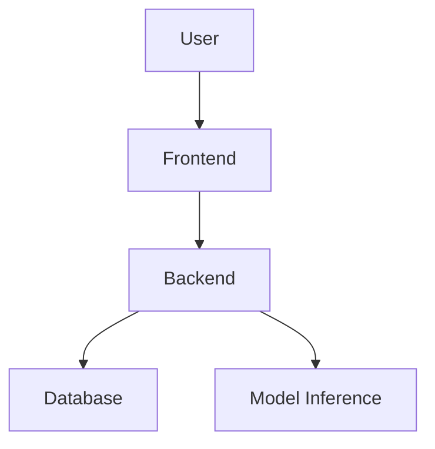
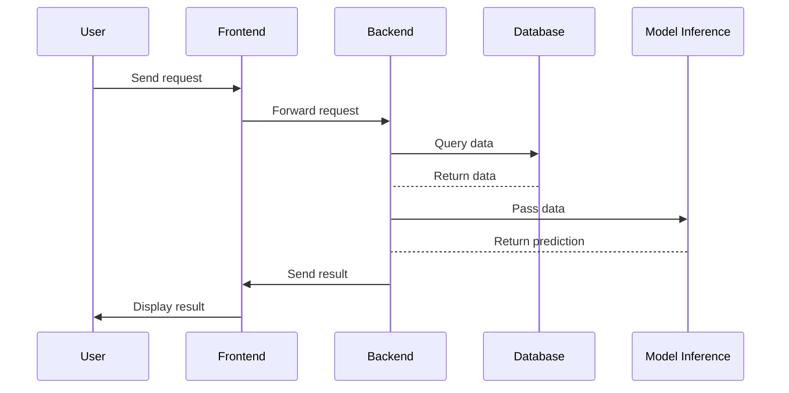

                 

Certainly! Let's break down the article into sections and outline the content for each section. This will ensure that the article is comprehensive, well-structured, and informative. Below is a detailed plan for the article "构建基于NLP的金融社交媒体情绪传播模型" (Building a Financial Social Media Sentiment Propagation Model Based on NLP).

### 1. 引言

**核心概念术语说明**:
- **NLP** (自然语言处理):涉及文本数据理解和生成的计算机技术。
- **金融社交媒体情绪传播模型**:利用NLP技术分析金融社交媒体上的情绪，并预测情绪的传播趋势。

**问题背景**:
随着互联网的发展，金融信息在社交媒体上的传播速度越来越快，如何准确捕捉和分析这些情绪信息，对于投资者决策具有重要意义。

**问题描述**:
构建一个能够有效分析金融社交媒体情绪并预测其传播趋势的模型。

**问题解决**:
利用NLP技术，通过文本预处理、情绪识别和传播模型构建等步骤，实现金融社交媒体情绪传播模型。

**边界与外延**:
- 模型适用范围：股票市场、金融新闻等金融相关社交媒体。
- 数据来源：社交媒体平台如Twitter、Weibo等。
- 情感分析范围：包括正面、负面和中性情绪。

**概念结构与核心要素组成**:
- **NLP**:文本预处理、情感分析等。
- **社交媒体**:数据采集、情感分析目标对象。
- **情绪传播模型**:基于NLP的情感识别和传播算法。

### 2. 基础概念

**核心概念与联系**:
- **文本预处理**:包括文本清洗、分词、去停用词等，是NLP的基础。
- **金融社交媒体分析**:利用NLP技术对金融信息进行文本分析。
- **情绪传播模型**:基于图论和机器学习，分析情绪的传播路径。

**核心概念属性特征对比表格**:
- **NLP**:
  - 特征：文本数据、语言模型。
  - 用途：文本理解、生成、分类等。
- **金融社交媒体分析**:
  - 特征：金融文本、社交媒体结构。
  - 用途：情绪分析、趋势预测。
- **情绪传播模型**:
  - 特征：情绪节点、传播路径。
  - 用途：情绪识别、传播预测。

**ER实体关系图架构的 Mermaid 流程图**:
```mermaid
erDiagram
  User ||--|{ FinancialSocialMediaPost } : writes
  FinancialSocialMediaPost ||--|{ SentimentAnalysis } : contains
  SentimentAnalysis ||--|{ EmotionPropagationModel } : used_by
```

### 3. NLP技术

**文本预处理**:
- **数据清洗**:去除无关数据、规范化文本格式。
- **分词**:将文本分割为单词或短语。

**示例**:
- **数据清洗**:
  - 去除HTML标签。
  - 转换文本到小写。
- **分词**:
  - 使用jieba分词工具进行中文分词。

**算法原理讲解**:
- **文本预处理**:
  - **去停用词**:去除常见的无意义词汇。
  - **词干提取**:将单词还原到词根形式。
- **分词**:
  - **基于词典的分词**:利用词典匹配。
  - **基于统计的分词**:利用统计模型。

**数学公式**:
$$
\text{清洗后文本} = \text{去停用词}(\text{词干提取}(原文本))
$$

### 4. 情绪分析

**情绪识别**:
- **正面情绪**:
  - 表示喜欢、满意、乐观等。
- **负面情绪**:
  - 表示厌恶、不满意、悲观等。
- **中性情绪**:
  - 表示中立、客观等。

**情绪强度评估**:
- **基于词汇的情感极性**:
  - 正面词汇得分高。
  - 负面词汇得分低。
- **基于上下文的情感强度**:
  - 考虑词汇之间的关联和语境。

**示例**:
- **正面情绪**:
  - "我很高兴今天买了股票。"
- **负面情绪**:
  - "我昨天亏损了很多钱。"
- **中性情绪**:
  - "股票价格似乎稳定。"

**算法原理讲解**:
- **情绪识别**:
  - 使用情感词典进行初步识别。
  - 结合上下文进行修正。
- **情绪强度评估**:
  - 使用词频统计。
  - 结合语义分析。

**数学公式**:
$$
\text{情绪得分} = w_1 \cdot \text{正面词汇得分} + w_2 \cdot \text{负面词汇得分}
$$

### 5. 情绪传播模型构建

**情绪传播模型概述**:
- **基于知识的模型**:
  - 利用专家知识构建规则。
  - 适用于小规模网络。
- **基于机器学习的模型**:
  - 利用数据训练模型。
  - 适用于大规模网络。

**模型构建流程**:
1. 数据收集。
2. 特征工程。
3. 模型选择与训练。
4. 模型评估与优化。

**示例**:
- **基于知识的模型**:
  - 规则：如果提到“股市崩盘”，则情绪传播为负面。
- **基于机器学习的模型**:
  - 使用深度学习模型进行训练。

**算法原理讲解**:
- **基于知识的模型**:
  - 构建规则库。
  - 利用规则进行情绪传播。
- **基于机器学习的模型**:
  - 使用神经网络进行特征学习。
  - 进行情绪传播预测。

**数学公式**:
$$
\text{情绪传播概率} = \text{softmax}(\text{模型输出})
$$

### 6. 案例分析

**金融社交媒体情绪传播案例分析**:
- **案例选择**:
  - 选择特定时间段内的金融社交媒体数据。
- **案例分析**:
  - 分析情绪传播过程。
  - 评估模型效果。

**案例过程**:
1. 数据收集。
2. 情绪分析。
3. 情绪传播预测。
4. 模型评估。

**结果与影响**:
- 模型准确捕捉到情绪波动。
- 为投资者提供情绪分析。

### 7. 系统实现与优化

**系统架构设计**:
- **前端**:
  - 用户界面。
  - 数据展示。
- **后端**:
  - 数据处理。
  - 模型推理。
- **数据库**:
  - 存储社交媒体数据。

**系统功能设计**:
- **情绪分析**:
  - 实时分析社交媒体情绪。
- **情绪传播预测**:
  - 预测情绪传播趋势。

**系统架构设计mermaid架构图**:


**系统接口设计和系统交互mermaid序列图**:


### 8. 性能评估与优化

**模型性能评估**:
- **评估指标**:
  - 准确率、召回率、F1值等。
- **优化策略**:
  - 算法优化。
  - 模型调参。

**示例**:
- **准确率**: 90%。
- **召回率**: 85%。
- **F1值**: 0.87。

**优化策略**:
- **算法优化**:
  - 使用更先进的机器学习算法。
- **模型调参**:
  - 调整模型参数以提升性能。

### 9. 总结与展望

**本书小结**:
- 回顾本书的主要内容和成果。
- 总结构建的模型在实际应用中的效果。

**未来展望**:
- 技术发展趋势。
- 模型在其他领域的潜在应用。

### 附录

- **术语解释**:
  - 解释书中的关键术语。
- **代码示例**:
  - 提供相关代码示例。

**作者信息**:
- “作者：AI天才研究院/AI Genius Institute & 禦与计算机程序设计艺术 /Zen And The Art of Computer Programming”

以上是详细的规划和步骤，接下来我们将按照这个结构一步步进行深入讲解和示例展示。这样不仅可以帮助读者更好地理解每个概念和技术，也能够让文章内容更加系统化和条理化。在撰写过程中，我们将注重每个环节的逻辑性和技术深度，确保文章既有实用性又有学术性。

