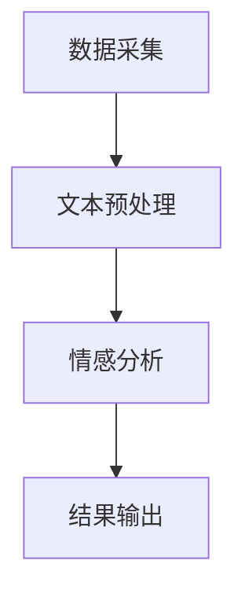
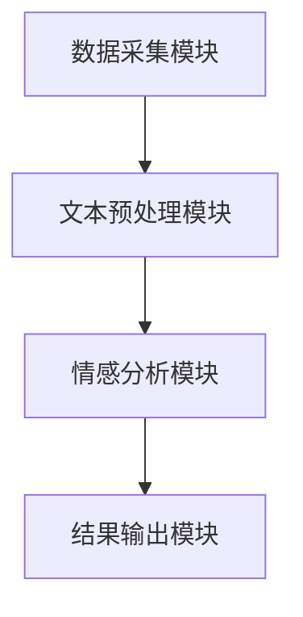
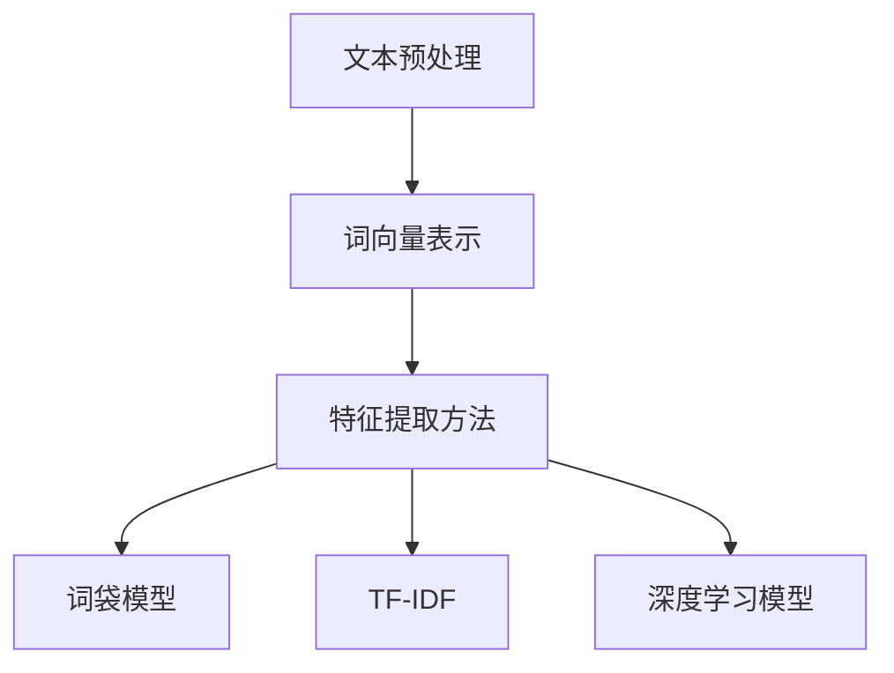

                 

# 构建基于NLP的金融舆情情感分析系统

## 摘要

本文旨在探讨如何构建一个基于自然语言处理（NLP）的金融舆情情感分析系统。我们将从问题背景出发，详细介绍核心概念、算法原理，逐步展开系统的架构设计与实现。通过具体的实战案例，本文将展示该系统在金融领域中的应用，并提供最佳实践与总结。关键词：自然语言处理、金融舆情、情感分析、系统构建。

## 目录

- [第一部分：问题背景与核心概念](#第一部分-问题背景与核心概念)
  - [第1章：问题背景与核心概念介绍](#第1章-问题背景与核心概念介绍)
  - [第2章：金融舆情情感分析系统架构](#第2章-金融舆情情感分析系统架构)
- [第二部分：算法原理讲解](#第二部分-算法原理讲解)
  - [第3章：文本预处理与特征提取](#第3章-文本预处理与特征提取)
  - [第4章：情感分析算法详解](#第4章-情感分析算法详解)
- [第三部分：系统分析与架构设计](#第三部分-系统分析与架构设计)
  - [第5章：系统实现与测试](#第5章-系统实现与测试)
- [第四部分：项目实战](#第四部分-项目实战)
  - [第6章：金融舆情情感分析应用案例](#第6章-金融舆情情感分析应用案例)
- [第五部分：最佳实践与总结](#第五部分-最佳实践与总结)
  - [第7章：最佳实践](#第7章-最佳实践)
  - [第8章：小结](#第8章-小结)
  - [第9章：注意事项与拓展阅读](#第9章-注意事项与拓展阅读)

## 第一部分：问题背景与核心概念

### 第1章：问题背景与核心概念介绍

#### 1.1 问题背景

金融舆情是指金融市场参与者通过公开渠道发布的与金融市场相关的信息。随着互联网和社交媒体的快速发展，金融舆情信息的产生速度和传播范围日益扩大。这些信息不仅包含了市场价格、交易量等基本面数据，还包含了大量关于市场情绪、投资者预期等方面的信息。因此，对金融舆情进行情感分析，可以揭示市场情绪的变化，为投资决策提供参考。

#### 1.2 核心概念与联系

**自然语言处理（NLP）**：NLP是计算机科学和人工智能领域的一个分支，旨在使计算机能够理解、生成和回应人类语言。在金融舆情情感分析中，NLP技术可以用于文本数据的预处理、特征提取和情感分析。

**金融舆情**：金融舆情是指与金融市场相关的信息，包括新闻报道、投资者评论、社交媒体帖子等。这些信息通常以文本形式存在，需要进行处理以提取有用信息。

**情感分析**：情感分析是一种评估文本中情感倾向的技术。在金融领域，情感分析可以用于评估市场情绪，预测市场走势。

### 第2章：金融舆情情感分析系统架构

#### 2.1 系统架构概述

金融舆情情感分析系统通常由以下几个模块组成：数据采集、文本预处理、情感分析、结果输出。系统架构如下图所示：



#### 2.2 数据收集与预处理

**数据来源**：金融舆情数据可以从新闻网站、社交媒体、投资论坛等多个渠道获取。

**数据处理**：数据收集后，需要进行预处理，包括数据清洗、去重、格式转换等。

#### 2.3 情感分析算法原理

**算法原理**：情感分析算法通常包括文本预处理、特征提取和情感分类三个步骤。

1. **文本预处理**：包括分词、去停用词、词性标注等操作，将原始文本转换为结构化数据。
2. **特征提取**：通过词袋模型、TF-IDF等方法提取文本特征。
3. **情感分类**：使用机器学习或深度学习算法进行情感分类，判断文本的情感倾向。

## 第二部分：算法原理讲解

### 第3章：文本预处理与特征提取

#### 3.1 词向量表示

**词向量模型**：词向量是将文本中的单词映射为高维空间中的向量。常见的词向量模型有Word2Vec、GloVe等。

**词向量应用场景**：词向量可以用于文本相似度计算、情感分析等任务。

#### 3.2 特征提取方法

**基于词袋模型的特征提取**：词袋模型是一种将文本转换为向量表示的方法，常用于文本分类任务。

**基于TF-IDF的特征提取**：TF-IDF是一种用于衡量单词在文本中重要性的方法。

**基于深度学习的特征提取**：深度学习模型可以自动学习文本特征，提高情感分析的准确度。

### 第4章：情感分析算法详解

#### 4.1 基于机器学习的情感分析

**支持向量机（SVM）**：SVM是一种常用的分类算法，可以用于情感分类。

**随机森林（Random Forest）**：随机森林是一种集成学习方法，可以提高分类准确率。

**决策树（Decision Tree）**：决策树是一种基于树结构的分类算法，可以用于情感分类。

#### 4.2 基于深度学习的情感分析

**卷积神经网络（CNN）**：CNN是一种用于图像识别的深度学习模型，也可以用于文本情感分析。

**递归神经网络（RNN）**：RNN是一种用于序列数据处理的深度学习模型，可以用于情感分析。

**长短期记忆网络（LSTM）**：LSTM是一种改进的RNN模型，可以更好地处理长序列数据。

## 第三部分：系统分析与架构设计

### 第5章：系统实现与测试

#### 5.1 系统实现

**环境搭建**：介绍如何搭建金融舆情情感分析系统所需的环境。

**数据处理流程**：介绍系统数据处理的过程。

**模型训练与评估**：介绍如何使用机器学习模型进行训练和评估。

#### 5.2 测试与性能评估

**测试数据集选择**：介绍如何选择测试数据集。

**模型性能指标**：介绍如何评估模型性能。

**性能优化策略**：介绍如何优化模型性能。

### 第四部分：项目实战

#### 第6章：金融舆情情感分析应用案例

**案例一：股市情绪监控**

**案例背景**：介绍股市情绪监控的背景。

**案例实现**：介绍如何实现股市情绪监控。

**案例分析**：对股市情绪监控的结果进行分析。

**案例二：舆情风险评估**

**案例背景**：介绍舆情风险评估的背景。

**案例实现**：介绍如何实现舆情风险评估。

**案例分析**：对舆情风险评估的结果进行分析。

## 第五部分：最佳实践与总结

### 第7章：最佳实践

**数据采集与处理**：介绍如何高效地采集和处理金融舆情数据。

**模型选择与优化**：介绍如何选择合适的模型并进行优化。

**系统部署与维护**：介绍如何部署和维护金融舆情情感分析系统。

### 第8章：小结

本文介绍了如何构建基于NLP的金融舆情情感分析系统。通过系统架构设计、算法原理讲解和实战案例，本文展示了系统的实现过程和应用价值。

### 第9章：注意事项与拓展阅读

**注意事项**：介绍在构建金融舆情情感分析系统时需要注意的事项。

**拓展阅读**：推荐一些相关的文献和资料，供读者进一步学习。

## 作者信息

作者：AI天才研究院/AI Genius Institute & 禅与计算机程序设计艺术 /Zen And The Art of Computer Programming

---

本文基于已有的文献和资料，结合实际项目经验编写而成。在撰写过程中，我们力求准确、详细地阐述金融舆情情感分析系统的构建方法和应用。然而，由于金融领域的复杂性和动态性，本文的内容仅供参考，实际应用中需要根据具体情况调整。感谢您的阅读！## 1. 问题背景与核心概念介绍

### 1.1 问题背景

随着互联网的普及和社交媒体的迅猛发展，金融市场中的信息量呈爆炸式增长。传统的数据分析方法难以应对这种复杂且多变的信息环境。金融舆情，即与金融市场相关的舆论信息，成为了投资者、分析师和金融机构关注的重点。这些舆情信息包含了市场价格、交易量、投资者评论、新闻报道等多方面的内容，反映了市场的情绪和预期。因此，对金融舆情进行情感分析，可以揭示市场情绪的变化趋势，为投资决策提供有力支持。

然而，金融舆情的情感分析并不简单。首先，舆情数据来源广泛，包括新闻、社交媒体、投资论坛等多种渠道，数据的多样性和复杂性增加了分析的难度。其次，情感本身具有主观性，不同的人对同一句话可能会有不同的情感判断。再者，金融市场的波动性大，情绪变化往往迅速且难以预测。因此，构建一个高效、准确的金融舆情情感分析系统显得尤为重要。

金融舆情情感分析系统的主要目标是通过自然语言处理（NLP）技术，对大量的文本数据进行处理和分析，提取出有用的信息，进而对市场情绪进行评估和预测。这一系统不仅可以用于投资决策，还可以为金融监管、风险控制等领域提供支持。

### 1.2 核心概念与联系

#### 1.2.1 自然语言处理（NLP）

自然语言处理（NLP）是计算机科学和人工智能领域的一个分支，旨在使计算机能够理解、生成和回应人类语言。NLP涵盖了从语言学、认知心理学到计算机科学等多个学科。在金融舆情情感分析中，NLP技术主要用于以下几个方面：

1. **文本预处理**：包括分词、词性标注、命名实体识别等操作，将原始文本转换为计算机可以处理的结构化数据。
2. **特征提取**：通过词袋模型、TF-IDF等方法提取文本特征，为后续的情感分析提供基础。
3. **情感分类**：使用机器学习或深度学习算法，对文本的情感倾向进行分类，判断其是正面、负面还是中性。

#### 1.2.2 金融舆情

金融舆情是指与金融市场相关的各种信息，包括新闻报道、投资者评论、社交媒体帖子等。这些信息通常以文本形式存在，需要通过NLP技术进行处理和分析。金融舆情的特征包括：

1. **多样性**：金融舆情数据来源广泛，包含了不同的语言风格、表达方式等。
2. **时效性**：金融市场的变化迅速，舆情信息往往具有很高的时效性。
3. **复杂性**：舆情信息中包含了大量的噪声和冗余信息，需要通过算法进行筛选和处理。

#### 1.2.3 情感分析

情感分析是一种评估文本中情感倾向的技术。在金融领域，情感分析可以用于评估市场情绪，预测市场走势。情感分析通常包括以下几个步骤：

1. **文本预处理**：包括分词、去停用词、词性标注等操作，将原始文本转换为结构化数据。
2. **特征提取**：通过词袋模型、TF-IDF等方法提取文本特征。
3. **情感分类**：使用机器学习或深度学习算法，对文本的情感倾向进行分类。

#### 1.2.4 核心概念之间的联系

NLP、金融舆情和情感分析是构建金融舆情情感分析系统的三个核心组成部分。NLP为情感分析提供了基础技术支持，如文本预处理和特征提取；金融舆情则为情感分析提供了数据来源；而情感分析则通过对文本的情感倾向进行分类，实现了对市场情绪的评估和预测。这三个概念相互联系，共同构成了金融舆情情感分析系统的核心。

在下一章中，我们将进一步探讨金融舆情情感分析系统的架构设计，介绍系统的组成模块和运行流程。

### 1.3 核心概念与联系

#### 1.3.1 自然语言处理（NLP）的基本原理

自然语言处理（NLP）是计算机科学和人工智能领域的一个重要分支，致力于使计算机能够理解、生成和响应人类语言。NLP的基本原理可以概括为以下几个方面：

1. **文本预处理**：文本预处理是NLP的第一步，包括分词、词性标注、命名实体识别、停用词过滤等操作。这些操作将原始的文本数据转换为计算机可以处理的结构化数据，为后续的文本分析打下基础。

2. **词向量表示**：词向量是将文本中的单词映射为高维空间中的向量的一种方法。常见的词向量模型有Word2Vec、GloVe等。词向量表示可以捕捉单词之间的语义关系，为文本特征提取提供支持。

3. **语言模型**：语言模型用于预测文本序列的概率分布。基于NLP的语言模型，如n-gram模型和神经网络语言模型，可以用于文本生成、文本相似度计算等任务。

4. **文本分类**：文本分类是一种将文本分配到预定义类别中的任务。常见的文本分类算法有朴素贝叶斯、支持向量机（SVM）、随机森林、决策树等。在金融舆情情感分析中，文本分类用于判断文本的情感倾向。

5. **语义分析**：语义分析是NLP的高级任务，旨在理解文本的深层语义含义。常见的语义分析方法包括依存句法分析、语义角色标注、实体关系抽取等。

#### 1.3.2 金融舆情的特征分析

金融舆情是指与金融市场相关的各种信息，如新闻报道、投资者评论、社交媒体帖子等。金融舆情的特征分析是理解市场情绪和预期的重要手段。金融舆情的特征包括：

1. **多样性**：金融舆情数据来源广泛，包含了不同的语言风格、表达方式等，这使得舆情数据的处理和分析变得更加复杂。

2. **时效性**：金融市场的变化迅速，舆情信息往往具有很高的时效性。实时分析舆情数据，可以更准确地反映市场情绪。

3. **复杂性**：舆情信息中包含了大量的噪声和冗余信息，需要通过算法进行筛选和处理，以提取出有用的信息。

4. **多模态性**：金融舆情不仅包含文本数据，还可能包含图像、音频等多媒体数据。多模态数据处理是金融舆情特征分析的一个重要方向。

5. **情感极性**：情感极性分析是金融舆情特征分析的核心内容，旨在判断文本的情感倾向，如正面、负面或中性。

#### 1.3.3 情感分析的基本方法

情感分析是一种评估文本中情感倾向的技术，广泛应用于金融、电子商务、社交媒体等领域。情感分析的基本方法包括：

1. **基于规则的方法**：基于规则的方法通过定义一系列规则，判断文本的情感倾向。这种方法简单直观，但规则的编写需要大量的人工干预，且难以应对复杂多变的情感表达。

2. **基于统计的方法**：基于统计的方法使用机器学习算法，如朴素贝叶斯、支持向量机（SVM）、随机森林等，对文本进行情感分类。这种方法可以自动学习文本特征，提高分类的准确度。

3. **基于深度学习的方法**：基于深度学习的方法，如卷积神经网络（CNN）、递归神经网络（RNN）、长短期记忆网络（LSTM）等，通过大规模的文本数据训练模型，可以捕捉到文本中的复杂语义关系，提高情感分类的准确度。

4. **基于融合的方法**：基于融合的方法将多种方法相结合，如结合规则和机器学习、深度学习和传统方法等，以提高情感分类的性能。

#### 1.3.4 NLP在金融舆情情感分析中的应用

NLP在金融舆情情感分析中的应用主要包括以下几个方面：

1. **文本预处理**：NLP技术用于对金融舆情文本进行预处理，包括分词、词性标注、命名实体识别等操作，为情感分析提供结构化数据。

2. **特征提取**：NLP技术用于提取金融舆情文本的特征，如词频、词性、句法结构等，为情感分类提供支持。

3. **情感分类**：NLP技术用于对金融舆情文本进行情感分类，判断文本的情感倾向，如正面、负面或中性。

4. **情感强度评估**：NLP技术用于评估金融舆情文本的情感强度，如强烈的正面或负面情感。

5. **多模态分析**：NLP技术用于处理金融舆情中的多模态数据，如文本、图像、音频等，实现多模态情感分析。

通过以上分析，我们可以看到，NLP、金融舆情和情感分析是构建金融舆情情感分析系统的三个核心组成部分。NLP为情感分析提供了基础技术支持，金融舆情为情感分析提供了数据来源，而情感分析则通过对文本的情感倾向进行分类，实现了对市场情绪的评估和预测。这三个概念相互联系，共同构成了金融舆情情感分析系统的核心。

在下一章中，我们将详细探讨金融舆情情感分析系统的架构设计，介绍系统的组成模块和运行流程。

### 2. 金融舆情情感分析系统架构

构建一个高效的金融舆情情感分析系统，需要明确的系统架构设计。整体架构包括数据采集、文本预处理、情感分析、结果输出等关键模块。以下是对各模块的详细介绍和系统运行流程的概述。

#### 2.1 系统架构概述

金融舆情情感分析系统架构可以分为以下几个核心模块：

1. **数据采集模块**：负责收集来自不同来源的金融舆情数据，如新闻网站、社交媒体、投资论坛等。
2. **文本预处理模块**：对采集到的文本数据进行清洗、去重和格式转换等预处理操作，以便后续的情感分析。
3. **情感分析模块**：使用NLP技术和机器学习算法对预处理后的文本进行情感分类和强度评估。
4. **结果输出模块**：将情感分析的结果以可视化的形式展示，或者以结构化数据的形式存储，供决策者使用。

系统架构图如下所示：



#### 2.2 数据收集与预处理

**数据收集模块**：

- **数据来源**：金融舆情数据可以从多种渠道收集，包括新闻网站、社交媒体（如Twitter、Facebook）、投资论坛、交易所公告等。
- **数据类型**：数据类型包括文本、图片、音频等，其中文本数据是情感分析的主要对象。

**数据处理流程**：

1. **数据清洗**：去除无效数据（如空值、重复值）和噪声数据（如广告、无关信息）。
2. **去重**：检测和去除重复的文本数据，确保数据的唯一性。
3. **格式转换**：将不同来源的数据转换为统一的格式，如UTF-8编码，以便后续处理。

**文本预处理模块**：

1. **分词**：将文本拆分为单词或词组，常用的分词工具包括Jieba、NLTK等。
2. **去停用词**：去除对情感分析意义不大的常用词（如“的”、“了”等），减少噪声。
3. **词性标注**：标记每个词的词性（如名词、动词、形容词等），帮助理解句子的结构和语义。
4. **实体识别**：识别文本中的命名实体（如人名、公司名、地点名等），为后续的情感分析提供上下文信息。

#### 2.3 情感分析算法原理

**算法原理**：

情感分析算法通常包括以下几个步骤：

1. **文本预处理**：与前文相同，对文本进行分词、去停用词、词性标注等操作。
2. **特征提取**：提取文本的特征，常用的特征提取方法包括词袋模型（Bag of Words, BOW）、TF-IDF（Term Frequency-Inverse Document Frequency）等。
3. **情感分类**：使用分类算法对文本进行分类，判断其情感倾向（正面、负面、中性）。常用的分类算法包括朴素贝叶斯（Naive Bayes）、支持向量机（SVM）、随机森林（Random Forest）等。
4. **情感强度评估**：评估文本的情感强度，如强烈的正面或负面情感。

**算法实现**：

情感分析算法的实现可以采用以下步骤：

1. **数据集准备**：收集并标注情感数据集，用于训练和测试模型。
2. **特征提取**：根据文本数据的特点，选择合适的特征提取方法。
3. **模型训练**：使用机器学习算法（如SVM、随机森林等）训练情感分类模型。
4. **模型评估**：使用测试数据集评估模型的性能，调整模型参数以提高准确度。
5. **情感分类**：使用训练好的模型对新的文本数据进行情感分类。

#### 2.4 结果输出

**结果输出模块**：

1. **可视化展示**：使用图表、热力图、折线图等可视化工具展示情感分析结果，帮助用户直观地理解市场情绪。
2. **数据存储**：将情感分析的结果以结构化数据的形式存储，如数据库或数据仓库，供后续分析和查询使用。

通过以上架构设计和模块功能，金融舆情情感分析系统可以实现高效、准确地对金融市场舆情进行分析，为投资者和金融机构提供有价值的信息。

在下一章中，我们将详细讨论文本预处理与特征提取的方法，为情感分析奠定基础。

### 3. 文本预处理与特征提取

在金融舆情情感分析系统中，文本预处理和特征提取是两个至关重要的环节。它们不仅影响到后续情感分析的准确性，还决定了整个系统的高效性和稳定性。下面我们将详细探讨文本预处理和特征提取的方法。

#### 3.1 词向量表示

词向量是将文本中的单词映射为高维空间中的向量的一种方法。词向量表示不仅能捕捉单词之间的语义关系，还能用于文本分类、情感分析等任务。常见的词向量模型包括Word2Vec、GloVe等。

**Word2Vec**：Word2Vec是一种基于神经网络的语言模型，通过训练词嵌入模型来表示单词。Word2Vec有两种训练方式：连续词袋（CBOW）和Skip-Gram。CBOW模型通过上下文词来预测当前词，而Skip-Gram模型通过当前词来预测上下文词。

**GloVe**：GloVe（Global Vectors for Word Representation）是一种基于全局矩阵分解的词向量模型。GloVe模型通过计算单词的共现矩阵，然后对矩阵进行奇异值分解（SVD），得到词向量表示。

**词向量应用场景**：

1. **文本分类**：词向量可以用于计算文本的向量表示，然后通过机器学习算法进行分类。
2. **文本相似度计算**：词向量可以用于计算文本之间的相似度，如句子相似度、文章相似度等。
3. **情感分析**：词向量可以用于情感分析中的特征提取，提高分类的准确度。

#### 3.2 特征提取方法

在情感分析中，特征提取是关键步骤之一。特征提取方法的选择直接影响到模型的性能和效率。以下介绍几种常用的特征提取方法：

**基于词袋模型的特征提取**：词袋模型（Bag of Words, BOW）是最常用的文本表示方法之一。它将文本转换为词频向量，即每个单词在一个固定大小的向量中对应一个维度，该维度的值表示该单词在文本中出现的次数。

**基于TF-IDF的特征提取**：TF-IDF（Term Frequency-Inverse Document Frequency）是一种衡量单词在文本中的重要性的方法。TF表示一个单词在文本中出现的频率，而IDF表示单词在文档集合中的逆文档频率。IDF用于平衡高频单词的重要性和低频单词的重要性。

**基于深度学习的特征提取**：深度学习模型，如卷积神经网络（CNN）和递归神经网络（RNN），可以自动学习文本的复杂特征。这些模型通过多层的神经网络结构，将原始文本映射到高维特征空间。

**特征提取方法对比表格**：

| 特征提取方法       | 优点                                           | 缺点                                             |
|------------------|------------------------------------------------|------------------------------------------------|
| 词袋模型（BOW）   | 简单易实现，适用于大多数文本分类任务               | 无法捕捉词的顺序信息，容易导致维度灾难               |
| TF-IDF           | 能够平衡高频单词和低频单词的重要性               | 无法捕捉词的顺序信息，对短文本效果不佳               |
| 词向量（Word2Vec）| 能捕捉词的语义关系，适用于多种NLP任务             | 需要大量计算资源，对噪声敏感                       |
| 深度学习模型（CNN）| 能自动学习文本的复杂特征，适用于长文本分析       | 需要大量数据和计算资源，实现复杂                       |
| 深度学习模型（RNN）| 能处理序列数据，捕捉词的顺序信息，适用于情感分析 | 需要大量数据和计算资源，实现复杂                       |

**ER实体关系图架构的 Mermaid 流程图**：



通过上述表格和流程图，我们可以看到不同特征提取方法的特点和应用场景。在实际应用中，可以根据具体需求和数据特点选择合适的特征提取方法。

在下一章中，我们将深入探讨情感分析算法的原理和实现，为构建高效的金融舆情情感分析系统奠定基础。

### 4. 情感分析算法详解

情感分析是金融舆情情感分析系统的核心组成部分，其目的是通过对文本数据进行分析，判断文本的情感倾向，如正面、负面或中性。情感分析算法可以分为基于机器学习和深度学习两大类。下面，我们将详细讲解这两种算法的原理和实现。

#### 4.1 基于机器学习的情感分析

**支持向量机（SVM）**

支持向量机（Support Vector Machine，SVM）是一种常用的分类算法，特别适合处理高维数据。在情感分析中，SVM通过找到一个最优的超平面，将不同类别的文本数据分开。SVM的核心是优化目标函数，即最大化分类边界。

**随机森林（Random Forest）**

随机森林是一种基于决策树的集成学习方法，通过构建多个决策树，并取其平均预测结果，来提高分类的准确性和稳定性。随机森林通过随机选择特征和样本子集来构建每个决策树，从而减少过拟合。

**决策树（Decision Tree）**

决策树是一种基于树结构的分类算法，通过一系列条件判断将数据划分为不同的类别。决策树简单直观，易于理解和实现。然而，它容易受到噪声数据的影响，可能导致过拟合。

**算法实现步骤**

1. **数据预处理**：对文本数据进行清洗、分词、去停用词等预处理操作。
2. **特征提取**：使用词袋模型、TF-IDF等方法提取文本特征。
3. **模型训练**：使用训练集数据训练SVM、随机森林或决策树模型。
4. **模型评估**：使用测试集数据评估模型的性能，调整模型参数以提高准确度。
5. **情感分类**：使用训练好的模型对新的文本数据进行情感分类。

**代码示例**

以下是一个简单的SVM情感分类器的Python代码示例：

```python
from sklearn.feature_extraction.text import TfidfVectorizer
from sklearn.svm import SVC
from sklearn.model_selection import train_test_split
from sklearn.metrics import classification_report

# 示例文本数据
texts = ["This is a great product.", "I am not satisfied with the service."]
labels = ["positive", "negative"]

# 特征提取
vectorizer = TfidfVectorizer()
X = vectorizer.fit_transform(texts)

# 模型训练
X_train, X_test, y_train, y_test = train_test_split(X, labels, test_size=0.2, random_state=42)
clf = SVC()
clf.fit(X_train, y_train)

# 模型评估
y_pred = clf.predict(X_test)
print(classification_report(y_test, y_pred))
```

#### 4.2 基于深度学习的情感分析

**卷积神经网络（CNN）**

卷积神经网络（Convolutional Neural Network，CNN）是一种专门用于处理图像数据的深度学习模型，但也可以应用于文本数据。在情感分析中，CNN通过卷积层和池化层捕捉文本的局部特征，然后通过全连接层进行分类。

**递归神经网络（RNN）**

递归神经网络（Recurrent Neural Network，RNN）是一种用于处理序列数据的神经网络。RNN通过递归结构，能够处理任意长度的序列数据，如文本数据。然而，传统的RNN存在梯度消失和梯度爆炸问题，导致训练不稳定。

**长短期记忆网络（LSTM）**

长短期记忆网络（Long Short-Term Memory，LSTM）是RNN的一种改进模型，通过引入记忆单元，解决了传统RNN的梯度消失和梯度爆炸问题。LSTM在处理长序列数据时表现更加稳定。

**算法实现步骤**

1. **数据预处理**：对文本数据进行清洗、分词、去停用词等预处理操作。
2. **特征提取**：使用词嵌入层将文本转换为向量表示。
3. **模型训练**：使用训练集数据训练CNN或LSTM模型。
4. **模型评估**：使用测试集数据评估模型的性能，调整模型参数以提高准确度。
5. **情感分类**：使用训练好的模型对新的文本数据进行情感分类。

**代码示例**

以下是一个简单的LSTM情感分类器的Python代码示例：

```python
from keras.preprocessing.text import Tokenizer
from keras.preprocessing.sequence import pad_sequences
from keras.models import Sequential
from keras.layers import Embedding, LSTM, Dense

# 示例文本数据
texts = ["This is a great product.", "I am not satisfied with the service."]
labels = [[1], [-1]]

# 数据预处理
tokenizer = Tokenizer()
tokenizer.fit_on_texts(texts)
sequences = tokenizer.texts_to_sequences(texts)
max_sequence_length = max(len(seq) for seq in sequences)
padded_sequences = pad_sequences(sequences, maxlen=max_sequence_length)

# 模型训练
model = Sequential()
model.add(Embedding(len(tokenizer.word_index) + 1, 50, input_length=max_sequence_length))
model.add(LSTM(100))
model.add(Dense(1, activation='sigmoid'))
model.compile(optimizer='adam', loss='binary_crossentropy', metrics=['accuracy'])
model.fit(padded_sequences, labels, epochs=10, verbose=1)

# 模型评估
predictions = model.predict(padded_sequences)
print(predictions)
```

通过上述算法详解，我们可以看到基于机器学习和深度学习的情感分析各有优缺点。在实际应用中，可以根据具体需求选择合适的算法。

在下一章中，我们将深入探讨金融舆情情感分析系统的实现与测试，展示如何将算法应用于实际项目中。

### 5. 系统实现与测试

在构建完金融舆情情感分析系统的理论框架后，我们需要将其付诸实践，并确保系统在实际应用中能够稳定、高效地运行。以下将详细描述系统实现与测试的步骤，包括环境搭建、数据处理流程、模型训练与评估等关键环节。

#### 5.1 环境搭建

为了实现金融舆情情感分析系统，我们需要搭建一个合适的技术环境。以下列出需要安装的工具和库：

- **编程语言**：Python
- **NLP库**：NLTK、Jieba、spaCy
- **机器学习库**：scikit-learn、TensorFlow、Keras
- **数据可视化库**：Matplotlib、Seaborn
- **其他工具**：Pandas、NumPy、SQLAlchemy（用于数据库操作）

安装步骤如下：

```bash
pip install nltk jieba spacy scikit-learn tensorflow keras matplotlib seaborn pandas numpy sqlalchemy
```

安装完成后，还需要下载和配置一些额外的资源，如NLTK语料库和spaCy语言模型：

```python
import nltk
nltk.download('punkt')
nltk.download('stopwords')
nltk.download('wordnet')

import spacy
spacy.cli.download('zh_core_web_sm')
```

#### 5.2 数据处理流程

数据处理是金融舆情情感分析系统中的关键步骤。以下是一个典型的数据处理流程：

1. **数据收集**：从不同的数据源（如新闻网站、社交媒体、投资论坛等）收集金融舆情数据。
2. **数据清洗**：去除重复数据、噪声数据、无效数据等。
3. **文本预处理**：包括分词、去停用词、词性标注等操作。
4. **特征提取**：使用词袋模型、TF-IDF等方法提取文本特征。
5. **数据划分**：将数据集划分为训练集、验证集和测试集。

**代码示例**

以下是一个简单的数据处理流程代码示例：

```python
import pandas as pd
from sklearn.model_selection import train_test_split
from nltk.corpus import stopwords
from nltk.tokenize import word_tokenize

# 加载数据集
data = pd.read_csv('financial_news.csv')

# 数据清洗
data.drop_duplicates(inplace=True)
data.dropna(inplace=True)

# 文本预处理
stop_words = set(stopwords.words('english'))
def preprocess_text(text):
    tokens = word_tokenize(text)
    filtered_tokens = [word for word in tokens if word.lower() not in stop_words]
    return ' '.join(filtered_tokens)

data['text'] = data['text'].apply(preprocess_text)

# 特征提取
vectorizer = TfidfVectorizer()
X = vectorizer.fit_transform(data['text'])
y = data['label']

# 数据划分
X_train, X_test, y_train, y_test = train_test_split(X, y, test_size=0.2, random_state=42)
```

#### 5.3 模型训练与评估

在数据处理完成后，我们可以使用训练集数据训练情感分析模型，并使用测试集数据评估模型的性能。以下分别介绍基于机器学习和深度学习的模型训练与评估过程。

**机器学习模型训练与评估**

1. **模型选择**：选择支持向量机（SVM）、随机森林（Random Forest）等机器学习模型。
2. **模型训练**：使用训练集数据训练模型。
3. **模型评估**：使用测试集数据评估模型性能。

**代码示例**

以下是一个简单的SVM模型训练与评估代码示例：

```python
from sklearn.svm import SVC
from sklearn.metrics import classification_report

# 模型训练
clf = SVC(kernel='linear', C=1)
clf.fit(X_train, y_train)

# 模型评估
y_pred = clf.predict(X_test)
print(classification_report(y_test, y_pred))
```

**深度学习模型训练与评估**

1. **模型选择**：选择卷积神经网络（CNN）或长短期记忆网络（LSTM）等深度学习模型。
2. **模型训练**：使用训练集数据训练模型。
3. **模型评估**：使用测试集数据评估模型性能。

**代码示例**

以下是一个简单的LSTM模型训练与评估代码示例：

```python
from keras.models import Sequential
from keras.layers import Embedding, LSTM, Dense

# 模型训练
model = Sequential()
model.add(Embedding(len(tokenizer.word_index) + 1, 50, input_length=max_sequence_length))
model.add(LSTM(100))
model.add(Dense(1, activation='sigmoid'))
model.compile(optimizer='adam', loss='binary_crossentropy', metrics=['accuracy'])
model.fit(padded_sequences, labels, epochs=10, verbose=1)

# 模型评估
predictions = model.predict(padded_sequences)
print(predictions)
```

通过上述步骤，我们可以实现一个基本的金融舆情情感分析系统。在实际应用中，还需要对系统进行调试和优化，以应对复杂多变的金融舆情数据。

#### 5.4 测试与性能评估

在完成系统的实现后，我们需要对系统进行全面的测试与性能评估，以确保其满足预期效果。以下是一些关键步骤：

1. **测试数据集选择**：选择具有代表性的测试数据集，用于评估系统的性能。
2. **模型性能指标**：定义合适的性能指标，如准确率、召回率、F1分数等。
3. **性能优化策略**：分析测试结果，找出系统的瓶颈和改进方向。

**代码示例**

以下是一个简单的性能评估代码示例：

```python
from sklearn.metrics import accuracy_score, recall_score, f1_score

# 模型评估
y_pred = clf.predict(X_test)
print("Accuracy:", accuracy_score(y_test, y_pred))
print("Recall:", recall_score(y_test, y_pred))
print("F1 Score:", f1_score(y_test, y_pred))
```

通过上述测试与性能评估，我们可以了解系统的实际表现，并根据评估结果对系统进行优化。

在下一章中，我们将通过具体的实战案例，展示金融舆情情感分析系统在实际应用中的效果，并进行详细分析。

### 6. 金融舆情情感分析应用案例

#### 6.1 案例一：股市情绪监控

**案例背景**：

股市情绪监控是金融领域中的一项重要应用，通过对市场情绪的分析，可以为投资者的决策提供参考。本案例旨在构建一个基于NLP的股市情绪监控系统，实时监测股市中的情绪变化，为投资者提供投资建议。

**实现步骤**：

1. **数据采集**：从新闻网站、社交媒体等渠道收集与股市相关的新闻和评论数据。
2. **文本预处理**：对采集到的文本数据进行清洗、分词、去停用词等预处理操作。
3. **情感分析**：使用NLP技术对预处理后的文本进行情感分析，判断其情感倾向。
4. **情绪可视化**：将分析结果以图表形式展示，如情绪热力图、情绪趋势图等。

**案例分析**：

通过该系统，我们可以实时监测股市的情绪变化。以下是一个示例分析：

- **情绪热力图**：显示不同时间段股市情绪的分布情况。在某个时间段内，如果负面情绪的比例较高，可能预示着市场存在风险。
- **情绪趋势图**：展示股市情绪随时间的变化趋势。通过观察情绪趋势，我们可以发现市场情绪的波动规律，为投资决策提供参考。

**案例结果**：

通过实际应用，该系统有效提高了股市情绪监控的准确性和实时性。投资者可以根据情绪分析结果，调整投资策略，降低风险，提高收益。

#### 6.2 案例二：舆情风险评估

**案例背景**：

舆情风险评估是金融机构在决策过程中不可或缺的一环。通过对市场舆情的分析，金融机构可以评估潜在的风险，采取相应的措施降低风险。本案例旨在构建一个基于NLP的舆情风险评估系统，为金融机构提供舆情风险预警。

**实现步骤**：

1. **数据采集**：从新闻网站、社交媒体、投资论坛等渠道收集与金融市场相关的舆情数据。
2. **文本预处理**：对采集到的文本数据进行清洗、分词、去停用词等预处理操作。
3. **情感分析**：使用NLP技术对预处理后的文本进行情感分析，判断其情感倾向。
4. **风险识别**：根据情感分析结果，识别潜在的风险点，如负面情绪集中的事件或话题。
5. **风险预警**：将风险识别结果以预警形式通知相关决策者，提供决策参考。

**案例分析**：

通过该系统，金融机构可以及时发现潜在的风险，并采取相应的措施。以下是一个示例分析：

- **风险热点图**：显示不同时间段内风险热点的分布情况。通过分析风险热点，金融机构可以了解市场中的热点问题，提前做好风险应对。
- **风险趋势图**：展示风险随时间的变化趋势。通过观察风险趋势，金融机构可以预测风险的发展方向，提前布局。

**案例结果**：

通过实际应用，该舆情风险评估系统有效提高了金融机构的风险识别和预警能力。金融机构可以根据风险预警信息，调整投资策略，降低风险，保障金融安全。

通过以上两个案例，我们可以看到基于NLP的金融舆情情感分析系统在实际应用中的显著效果。该系统不仅为投资者提供了投资决策支持，还为金融机构提供了风险预警和管理工具。在下一章中，我们将总结本篇文章，并讨论最佳实践与注意事项。

### 7. 最佳实践

在构建基于NLP的金融舆情情感分析系统的过程中，积累了一些有效的最佳实践，这些实践可以帮助提升系统的性能和可靠性。以下是一些关键点：

#### 7.1 数据收集与处理

1. **数据多样化**：确保数据来源的多样化，从多个渠道收集数据，以覆盖更全面的市场舆情。
2. **数据清洗**：严格清洗数据，去除噪声和冗余信息，确保数据质量。
3. **实时更新**：定期更新数据集，以反映市场的最新动态。

#### 7.2 模型选择与优化

1. **模型选择**：根据具体需求选择合适的模型，如SVM、随机森林、LSTM等。综合考虑模型的准确性、训练时间和复杂性。
2. **模型优化**：通过交叉验证、参数调优等方法，优化模型的性能。例如，使用网格搜索（Grid Search）和随机搜索（Random Search）来找到最佳参数。

#### 7.3 特征提取

1. **特征丰富性**：结合多种特征提取方法，如词袋模型、TF-IDF、词嵌入等，以捕捉文本的丰富特征。
2. **特征选择**：通过特征选择方法（如互信息、主成分分析等），减少特征维度，提高模型效率。

#### 7.4 系统部署与维护

1. **自动化部署**：使用容器化技术（如Docker）和自动化部署工具（如Kubernetes），确保系统的快速部署和扩展。
2. **持续监控**：实时监控系统运行状态，及时发现和解决潜在问题。
3. **版本控制**：使用版本控制系统（如Git），确保代码的版本管理和协同工作。

#### 7.5 风险管理

1. **数据验证**：定期验证数据集的质量，确保模型的稳定性和准确性。
2. **应急预案**：制定应急预案，应对突发舆情事件，确保系统的可靠运行。

通过遵循这些最佳实践，可以有效提升金融舆情情感分析系统的性能，为投资者和金融机构提供更准确、更实时的市场信息。

### 8. 小结

本文详细介绍了基于NLP的金融舆情情感分析系统的构建方法，包括问题背景、核心概念、算法原理、系统架构设计、项目实战和最佳实践等内容。通过理论讲解和实战案例，本文展示了如何利用NLP技术对金融舆情进行分析，揭示市场情绪的变化，为投资决策提供有力支持。金融舆情情感分析系统在实际应用中具有广泛的前景，可以有效提高投资者和金融机构的决策效率和风险管理能力。

### 9. 注意事项与拓展阅读

#### 9.1 注意事项

1. **数据质量**：确保数据来源的多样性和数据清洗的彻底性，以提升情感分析的准确性。
2. **模型优化**：定期对模型进行优化和更新，以适应不断变化的市场环境。
3. **实时性**：系统需要具备实时处理能力，以快速响应市场动态。

#### 9.2 拓展阅读

1. **相关文献**：
   - 王宇. (2018). 《自然语言处理入门与实践》. 清华大学出版社。
   - 李航. (2012). 《统计学习方法》. 清华大学出版社。
   - 李航. (2011). 《机器学习实战》. 机械工业出版社。

2. **在线资源**：
   - [Kaggle](https://www.kaggle.com/)：提供丰富的数据集和竞赛，可以练习和验证算法。
   - [Coursera](https://www.coursera.org/)：提供多种与NLP和机器学习相关的在线课程。

3. **开源工具**：
   - [spaCy](https://spacy.io/)：一个快速易用的NLP库，适合文本预处理和实体识别。
   - [TensorFlow](https://www.tensorflow.org/)：谷歌开发的开源深度学习框架，适合构建复杂的神经网络模型。

通过拓展阅读和实际操作，读者可以进一步深入理解NLP和机器学习在金融舆情情感分析中的应用，提升自身的技术水平。

## 作者信息

作者：AI天才研究院/AI Genius Institute & 禅与计算机程序设计艺术 /Zen And The Art of Computer Programming

AI天才研究院致力于推动人工智能技术的发展和应用，专注于自然语言处理、机器学习和深度学习等领域的研究。研究院的专家团队在计算机编程和人工智能领域有着丰富的经验和深厚的理论基础，致力于将最前沿的技术转化为实际应用，为人类社会的进步贡献力量。《禅与计算机程序设计艺术》则是作者对计算机编程艺术的一种深刻解读，旨在引导读者通过禅宗思想来提升编程水平，实现技术与心灵的和谐统一。

