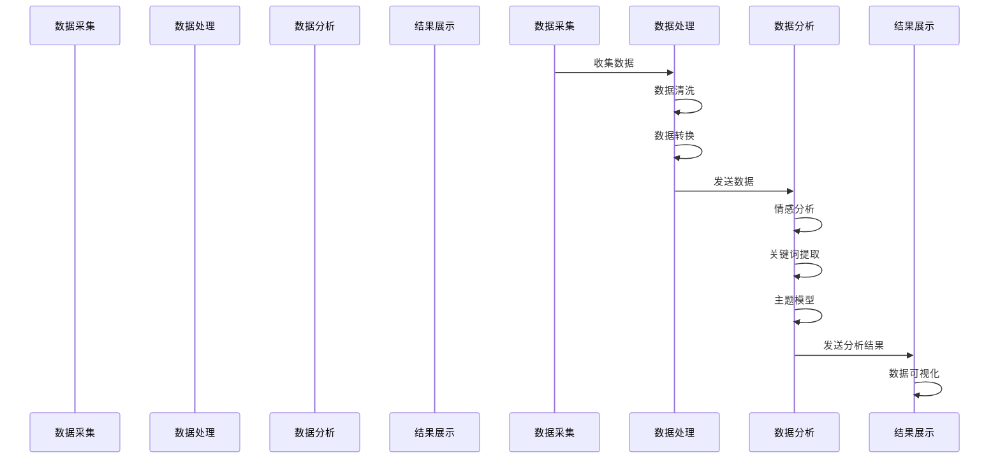

                 

# 《构建基于NLP的金融舆情监控平台》

关键词：自然语言处理、金融舆情监控、数据收集、文本分类、情感分析

摘要：随着信息时代的快速发展，金融舆情监控在金融市场分析中扮演着越来越重要的角色。本文将探讨如何构建一个基于自然语言处理（NLP）的金融舆情监控平台，详细介绍NLP的基础知识、金融舆情数据的收集与处理、文本分类与情感分析、聚类与主题模型以及舆情监控系统的设计与实现。通过具体的实战案例，我们将展示如何运用NLP技术进行金融舆情监控，为金融市场的决策提供有力的支持。

## 引言与概述

### 1.1.1 金融舆情监控的重要性

在当今信息化、全球化的时代，金融市场的透明度和实时性变得尤为重要。金融舆情监控是指通过收集、处理和监测与金融市场相关的各类信息，以了解市场情绪和趋势，从而为投资者和金融机构提供决策支持。金融舆情监控的重要性体现在以下几个方面：

1. **风险预警**：通过监控市场情绪，可以提前识别潜在的金融风险，为投资者提供风险预警，避免因市场突变带来的巨大损失。
2. **市场分析**：金融舆情监控可以揭示市场的热点话题、投资者的关注点，为市场分析提供有价值的信息，帮助投资者做出更为明智的投资决策。
3. **投资策略调整**：通过对市场情绪的持续监控，投资者可以调整投资策略，优化投资组合，实现风险和收益的最佳平衡。

### 1.1.2 NLP在金融舆情监控中的应用现状

自然语言处理（NLP）是人工智能的一个重要分支，旨在让计算机理解和处理人类语言。在金融舆情监控中，NLP技术发挥着关键作用，主要表现在以下几个方面：

1. **文本分类**：通过对金融新闻、社交媒体评论等文本进行分类，可以快速识别出与金融市场相关的信息，提高信息处理的效率。
2. **情感分析**：通过分析文本的情感倾向，可以了解市场情绪的变化，为投资者提供情绪指数等量化指标。
3. **主题模型**：通过主题模型，可以挖掘出金融舆情中的热点话题和趋势，为市场分析提供深度洞察。

### 1.1.3 本书的结构安排与学习目标

本书将分为七个章节，详细探讨构建基于NLP的金融舆情监控平台的方法和步骤。具体章节安排和学习目标如下：

- **第1章 引言与概述**：介绍金融舆情监控的重要性以及NLP在金融舆情监控中的应用现状，明确本书的学习目标。
- **第2章 自然语言处理（NLP）基础**：介绍NLP的基本概念、语言模型、词向量和文本预处理，为后续章节打下基础。
- **第3章 金融舆情数据收集与处理**：探讨金融舆情数据的来源、收集方法以及数据处理与清洗，确保数据质量。
- **第4章 金融文本分类与情感分析**：介绍文本分类和情感分析的方法及其在金融舆情监控中的应用。
- **第5章 聚类与主题模型**：探讨聚类分析和主题模型在金融舆情分析中的应用。
- **第6章 舆情监控系统的设计与实现**：详细讲解舆情监控系统的架构设计和实现过程。
- **第7章 舆情监控实战案例**：通过实际案例展示如何运用NLP技术进行金融舆情监控。

通过本书的学习，读者将掌握基于NLP的金融舆情监控平台的构建方法，了解NLP在金融舆情监控中的应用，能够为金融市场的决策提供数据支持和分析。

## 第2章 自然语言处理（NLP）基础

### 2.1 NLP的基本概念

自然语言处理（NLP）是人工智能的一个重要分支，旨在让计算机理解和处理人类语言。NLP的研究领域广泛，包括文本分类、情感分析、机器翻译、语音识别等。其核心目标是使计算机能够处理自然语言文本，从而实现人机交互和信息检索。

#### 2.1.1 NLP的定义与发展历程

NLP起源于20世纪50年代，当时人们开始尝试让计算机翻译和理解自然语言。早期的NLP研究主要集中在规则驱动的方法上，通过编写大量语法规则来实现语言理解。然而，这种方法存在效率低、灵活性差的问题。

随着计算能力的提升和数据规模的扩大，统计方法和机器学习技术逐渐成为NLP的主流。统计方法通过分析大量语料库，找出语言规律；机器学习则通过训练模型，从数据中自动学习语言特征。这些方法的引入，使得NLP在准确性和效率上都有了显著提升。

#### 2.1.2 NLP的核心任务

NLP的核心任务包括以下几个方面：

1. **文本分类**：将文本按照一定的标准进行分类，如情感分类、主题分类等。
2. **实体识别**：从文本中识别出具有特定意义的实体，如人名、地名、机构名等。
3. **情感分析**：分析文本的情感倾向，如正面、负面、中性等。
4. **机器翻译**：将一种语言的文本翻译成另一种语言。
5. **问答系统**：根据用户提出的问题，从大量文本中找到答案。

### 2.2 语言模型

语言模型是NLP的基础，用于预测文本序列中的下一个词或下一个字符。语言模型可以分为统计语言模型和神经网络语言模型。

#### 2.2.1 语言模型的类型

1. **统计语言模型**：基于概率模型，如n-gram模型、隐马尔可夫模型（HMM）等。这些模型通过分析大量语料库，找出语言规律，从而预测下一个词或字符。
2. **神经网络语言模型**：基于深度学习模型，如循环神经网络（RNN）、长短期记忆网络（LSTM）、Transformer模型等。这些模型通过学习文本序列中的上下文关系，能够捕捉到更复杂的语言特征。

#### 2.2.2 语言模型的构建方法

1. **数据收集**：收集大量的文本数据，用于训练语言模型。
2. **文本预处理**：对文本进行清洗、分词、去除停用词等操作，以便更好地建模。
3. **特征提取**：将文本转换为向量表示，如词袋模型、词嵌入等。
4. **模型训练**：使用统计方法或神经网络训练语言模型。
5. **模型评估**：通过评估指标（如困惑度、准确性等）评估模型的性能。

#### 2.2.3 语言模型的应用案例

1. **文本生成**：利用语言模型生成文章、新闻、故事等。
2. **机器翻译**：将一种语言的文本翻译成另一种语言。
3. **问答系统**：根据用户的问题，从大量文本中找到答案。
4. **搜索引擎**：根据用户的查询，返回最相关的搜索结果。

### 2.3 词向量和词嵌入

词向量是将词汇映射到高维空间中的向量表示，能够捕捉词汇的语义信息。词嵌入是词向量的实现方法，主要有分布式表示和嵌入学习两种方式。

#### 2.3.1 词向量的概念与作用

1. **概念**：词向量是词汇在数学空间中的表示，每个词汇对应一个向量。
2. **作用**：词向量能够将词汇的语义信息编码到向量中，使得计算机能够处理和理解词汇的语义。

#### 2.3.2 词嵌入的常用方法

1. **分布式表示**：将词汇映射到一个固定长度的向量空间，每个词汇的向量表示其语义信息。
2. **嵌入学习**：通过训练模型，从大量文本数据中自动学习词汇的向量表示。

#### 2.3.3 词嵌入的应用

1. **文本分类**：使用词嵌入作为特征输入到文本分类模型中，提高分类性能。
2. **情感分析**：通过分析词嵌入空间的相似性，进行情感分类。
3. **问答系统**：使用词嵌入来表示问题和答案，提高问答系统的准确性。

### 2.4 文本预处理

文本预处理是NLP过程中的关键步骤，旨在将原始文本转换为适合模型训练的形式。

#### 2.4.1 文本预处理的重要性

1. **提高模型性能**：通过文本预处理，可以去除噪声、降低维度、增强特征，从而提高模型性能。
2. **降低计算复杂度**：文本预处理可以减少数据规模，降低模型的计算复杂度。

#### 2.4.2 常用的文本预处理方法

1. **文本清洗**：去除文本中的符号、标点、数字等无关信息。
2. **分词**：将文本分割成单词或词汇。
3. **去除停用词**：去除对模型训练意义不大的常见词汇，如“的”、“了”、“在”等。
4. **词性标注**：为每个词汇标注其词性，如名词、动词、形容词等。
5. **词嵌入**：将词汇映射到高维空间中的向量表示。

#### 2.4.3 文本预处理工具

1. **NLTK**：Python的自然语言处理库，提供了丰富的文本预处理功能。
2. **SpaCy**：一个快速易用的自然语言处理库，支持多种语言和文本预处理任务。
3. **Gensim**：用于主题模型和词嵌入的库，提供了便捷的文本预处理接口。

通过本章的学习，读者将了解NLP的基本概念、语言模型、词向量和文本预处理的方法及其应用，为后续章节的金融舆情监控平台构建打下坚实的基础。

## 第3章 金融舆情数据收集与处理

### 3.1 金融舆情数据来源

金融舆情数据主要来源于以下几个方面：

#### 3.1.1 社交媒体

社交媒体是金融舆情的重要来源之一，如微博、Twitter、Facebook等平台上的用户评论、帖子等。这些平台上的信息量大，实时性强，能够迅速反映市场的情绪和动态。例如，微博上的股票热搜话题、Twitter上的市场分析报告等，都蕴含着丰富的金融舆情信息。

#### 3.1.2 新闻网站

新闻网站是获取金融舆情数据的另一个重要渠道，如新浪财经、华尔街日报、金融时报等。这些网站发布的专业新闻、市场分析报告、深度报道等，能够提供权威的金融信息。通过爬取这些网站的数据，可以获取到大量的金融新闻文本。

#### 3.1.3 论坛和博客

论坛和博客是金融舆情数据的重要补充，如雪球、投资吧等。这些平台上聚集了大量投资者和专业人士，他们的讨论和观点能够反映出市场情绪和投资趋势。通过分析这些论坛和博客的数据，可以深入了解市场的微观动态。

### 3.2 数据收集方法

金融舆情数据的收集主要依赖于网络爬虫技术和API接口调用。

#### 3.2.1 爬虫技术

网络爬虫（Web Crawler）是一种自动抓取互联网信息的程序，通过爬取网站上的数据，可以获取到大量的金融舆情信息。爬虫技术主要包括以下步骤：

1. **目标网站分析**：分析目标网站的结构，确定数据所在的位置和链接规则。
2. **爬虫程序编写**：使用Python等编程语言编写爬虫程序，实现数据的抓取和存储。
3. **数据存储**：将爬取到的数据存储到数据库或文件中，以便后续处理。

#### 3.2.2 API接口调用

API（Application Programming Interface）接口是一种编程接口，通过调用API，可以获取到第三方平台提供的数据。金融舆情数据的API接口调用主要包括以下步骤：

1. **接口文档分析**：分析API接口文档，了解接口的调用方式、请求参数、响应格式等。
2. **接口调用程序编写**：使用Python等编程语言编写调用程序，实现数据的获取和存储。
3. **数据存储**：将获取到的数据存储到数据库或文件中，以便后续处理。

#### 3.2.3 数据获取的合法性

在进行金融舆情数据收集时，需要遵守相关的法律法规和道德规范，确保数据获取的合法性。主要包括以下几个方面：

1. **网站协议**：遵守目标网站的协议，不得违反网站的使用条款。
2. **API调用规范**：遵守API接口的使用规范，不得滥用接口权限。
3. **数据保护**：确保收集到的数据安全，不得泄露用户隐私。

### 3.3 数据处理与清洗

收集到的金融舆情数据通常包含大量噪声和重复信息，需要进行处理和清洗，以提高数据的质量。

#### 3.3.1 数据预处理步骤

1. **数据去重**：去除重复的数据，避免重复处理。
2. **数据格式转换**：将不同格式的数据转换为统一的格式，如CSV、JSON等。
3. **数据筛选**：根据业务需求，筛选出有用的数据，去除无关的数据。

#### 3.3.2 数据清洗方法

1. **文本清洗**：去除文本中的符号、标点、数字等无关信息，进行分词和去除停用词等操作。
2. **缺失值处理**：对于缺失的数据，可以选择填充缺失值或删除含有缺失值的记录。
3. **异常值处理**：去除或修正异常值，如数据中的错误拼写、异常价格等。

#### 3.3.3 数据质量评估

数据质量评估是确保数据处理效果的重要环节，主要包括以下几个方面：

1. **数据完整性**：检查数据是否完整，是否存在缺失值。
2. **数据准确性**：检查数据的准确性，是否存在错误或异常值。
3. **数据一致性**：检查数据的一致性，如数据格式、单位等是否一致。

通过本章的学习，读者将了解金融舆情数据的主要来源、收集方法以及数据处理与清洗的方法，为构建基于NLP的金融舆情监控平台提供数据支持。

### 2.4.1 文本预处理的重要性

文本预处理是自然语言处理（NLP）过程中至关重要的一步，其主要目的是将原始文本转换为适合模型训练的形式。以下是文本预处理的重要性和其在NLP中的应用：

#### 2.4.1.1 去除噪声

原始文本数据通常包含大量无关信息，如标点符号、数字、特殊字符等。这些噪声信息不仅会增加模型的计算复杂度，还可能对模型训练结果产生干扰。通过文本预处理，可以去除这些无关信息，提高模型训练的效率。

#### 2.4.1.2 降低维度

文本数据维度较高，直接用于模型训练可能会导致过拟合。文本预处理通过分词、去除停用词等操作，可以降低文本数据的维度，使模型更容易学习和捕捉到文本特征。

#### 2.4.1.3 提高模型性能

文本预处理可以增强模型对文本数据的理解能力。例如，通过词性标注，可以区分不同类型的词汇，使模型能够更好地理解文本的语义。此外，文本预处理还可以消除文本中的歧义，提高模型的准确性。

#### 2.4.1.4 提高数据质量

文本预处理可以去除文本中的错误、不一致和重复信息，提高数据的质量。高质量的数据有助于提高模型训练的效果，从而获得更好的预测结果。

#### 2.4.1.5 应用场景

文本预处理在NLP中的许多应用场景中都发挥着重要作用：

1. **文本分类**：通过对文本进行预处理，可以提取出更有价值的特征，提高文本分类的准确性和效率。
2. **情感分析**：文本预处理有助于消除文本中的噪声和歧义，使情感分析模型能够更准确地识别文本的情感倾向。
3. **问答系统**：文本预处理可以减少干扰信息，使问答系统能够更准确地理解用户的问题。
4. **机器翻译**：文本预处理可以消除语言差异，提高机器翻译的准确性和流畅性。

### 2.4.2 常用的文本预处理方法

文本预处理方法多种多样，以下是一些常用的文本预处理方法：

#### 2.4.2.1 去除标点符号和特殊字符

标点符号和特殊字符对文本分类和情感分析等任务通常没有贡献，因此需要去除。常用的方法包括使用正则表达式替换、删除或替换为空字符。

```python
import re

text = "这是一个示例文本，包含标点符号！"
cleaned_text = re.sub(r'[^\w\s]', '', text)
```

#### 2.4.2.2 分词

分词是将文本分割成单词或词汇的过程。常用的分词方法包括基于字典的分词、基于规则的分词和基于统计模型的分词。在NLP中，常用的分词工具包括jieba（基于统计模型）和NLTK（基于规则）。

```python
import jieba

text = "这是一个示例文本"
words = jieba.lcut(text)
```

#### 2.4.2.3 去除停用词

停用词是指对文本分类和情感分析等任务没有贡献的常见词汇，如“的”、“了”、“在”等。去除停用词可以减少噪声，提高模型性能。常用的停用词列表可以从开源库如nltk.corpus中获取。

```python
from nltk.corpus import stopwords

text = "这是一个示例文本"
words = jieba.lcut(text)
cleaned_words = [word for word in words if word not in stopwords.words('english')]
```

#### 2.4.2.4 词性标注

词性标注是将文本中的每个词汇标注为名词、动词、形容词等。词性标注有助于理解文本的语义，对文本分类和情感分析等任务具有重要作用。常用的词性标注工具包括NLTK和Spacy。

```python
import spacy

nlp = spacy.load('en_core_web_sm')
text = "这是一个示例文本"
doc = nlp(text)
tokens = [(token.text, token.pos_) for token in doc]
```

#### 2.4.2.5 嵌入向量表示

将文本转换为嵌入向量表示（如词嵌入）是NLP中的常见操作。词嵌入能够将文本中的词汇映射到高维空间中，从而捕捉词汇的语义信息。常用的词嵌入方法包括Word2Vec、GloVe和BERT。

```python
from gensim.models import Word2Vec

text = ["这是一个示例文本", "另一个示例文本"]
model = Word2Vec(text, vector_size=100, window=5, min_count=1, workers=4)
word_vector = model.wv['示例']
```

通过本章的学习，读者将了解文本预处理的重要性以及常用的文本预处理方法，为后续的文本分类、情感分析等NLP任务打下基础。

### 3.3.1 数据预处理步骤

在金融舆情数据收集过程中，获取的数据通常是原始且多样化的，直接用于模型训练可能会影响结果的准确性。因此，对数据进行预处理是非常重要的一步。以下是金融舆情数据预处理的主要步骤：

#### 3.3.1.1 数据去重

数据去重是预处理的第一步，目的是去除重复的数据条目，避免重复计算。在金融舆情监控中，重复的数据可能会导致模型误判，从而影响分析结果的准确性。去重可以通过以下方法实现：

- **哈希值匹配**：为每条数据生成哈希值，并存储在哈希表中，检查新数据是否已经存在于哈希表中。
- **唯一标识符**：为每条数据分配一个唯一的标识符，如时间戳或ID，通过标识符进行去重。

```python
def remove_duplicates(data):
    unique_data = []
    seen_hashes = set()
    for item in data:
        item_hash = hash(str(item))
        if item_hash not in seen_hashes:
            unique_data.append(item)
            seen_hashes.add(item_hash)
    return unique_data
```

#### 3.3.1.2 数据格式转换

金融舆情数据可能来自不同的来源，格式可能不一致。在进行预处理之前，需要将所有数据格式转换为统一的格式，如CSV或JSON。数据格式转换包括以下步骤：

- **解析数据**：根据数据来源，使用适当的解析方法（如正则表达式、JSON解析器等）解析数据。
- **数据结构转换**：将原始数据结构转换为字典或列表结构，便于后续处理。
- **数据清洗**：对转换后的数据进行清洗，去除无效或格式错误的数据。

```python
import json

def convert_format(data):
    converted_data = []
    for item in data:
        try:
            parsed_item = json.loads(item['content'])
            converted_data.append(parsed_item)
        except json.JSONDecodeError:
            continue
    return converted_data
```

#### 3.3.1.3 数据筛选

数据筛选是根据业务需求，从大量数据中筛选出有用的信息。金融舆情监控中，可能需要对数据来源、时间范围、关键词等进行筛选，以获取相关的数据。

- **来源筛选**：根据数据来源（如微博、新闻网站等），筛选出特定的数据。
- **时间筛选**：根据时间范围，筛选出符合需求的数据条目。
- **关键词筛选**：根据关键词，筛选出包含特定关键词的数据。

```python
def filter_data(data, source, start_date, end_date, keywords):
    filtered_data = []
    for item in data:
        if item['source'] == source and start_date <= item['date'] <= end_date and any(keyword in item['content'] for keyword in keywords):
            filtered_data.append(item)
    return filtered_data
```

#### 3.3.1.4 数据整合

在金融舆情监控中，可能需要整合来自多个来源的数据。数据整合是将不同来源的数据进行合并，形成统一的视图。

- **字段合并**：将不同来源的数据字段合并，如将微博数据中的内容与新闻网站的数据合并。
- **数据对齐**：对齐不同数据源的时间戳和标识符，确保数据的一致性。

```python
def integrate_data(data1, data2):
    integrated_data = []
    for item1 in data1:
        for item2 in data2:
            if item1['id'] == item2['id']:
                integrated_data.append({'id': item1['id'], 'content': item1['content'] + ' ' + item2['content']})
                break
    return integrated_data
```

#### 3.3.1.5 数据标准化

数据标准化是将不同来源的数据进行标准化处理，确保数据的可比性。例如，将不同来源的时间格式转换为统一格式，将货币金额统一为同一货币单位等。

```python
from datetime import datetime

def standardize_data(data):
    standardized_data = []
    for item in data:
        try:
            item['date'] = datetime.strptime(item['date'], '%Y-%m-%d %H:%M:%S')
            standardized_data.append(item)
        except ValueError:
            continue
    return standardized_data
```

通过上述数据预处理步骤，可以确保金融舆情数据的准确性和一致性，为后续的文本分类、情感分析等NLP任务提供高质量的数据。

### 3.3.2 数据清洗方法

在金融舆情数据收集和处理过程中，数据清洗是确保数据质量的关键步骤。以下是一些常用的数据清洗方法，以帮助提高数据的质量和可靠性：

#### 3.3.2.1 缺失值处理

金融舆情数据中可能存在缺失值，这些缺失值可能是因为数据收集过程中的问题或数据源的不完整性。处理缺失值的方法包括以下几种：

1. **删除缺失值**：如果缺失值的比例较小，可以选择删除包含缺失值的记录，以减少噪声。
2. **填充缺失值**：使用合适的策略填充缺失值，如使用平均值、中位数、最大值或最小值等。
3. **预测缺失值**：使用机器学习算法预测缺失值，如决策树、随机森林或神经网络等。

```python
import numpy as np

# 填充缺失值为平均值
data_with_missing = np.array([1, 2, np.nan, 4])
cleaned_data = np.where(np.isnan(data_with_missing), np.mean(data_with_missing), data_with_missing)

# 预测缺失值（示例代码）
from sklearn.ensemble import RandomForestRegressor

# 假设X为特征矩阵，y为标签
X = np.array([[1, 2], [3, 4], [5, np.nan]])
y = np.array([1, 2, 3])

# 训练模型
regressor = RandomForestRegressor()
regressor.fit(X[:, 1:], y)

# 预测缺失值
predicted_value = regressor.predict([[np.nan]])
```

#### 3.3.2.2 异常值处理

金融舆情数据中可能包含异常值，这些异常值可能是因为数据记录的错误或异常情况。处理异常值的方法包括以下几种：

1. **删除异常值**：如果异常值的数量较少，可以选择删除这些异常值。
2. **修正异常值**：使用合适的策略修正异常值，如使用平均值、中位数或最大值等。
3. **保留异常值**：如果异常值有其特殊含义，可以选择保留并进行分析。

```python
import numpy as np

# 删除异常值
data_with_anomalies = np.array([1, 2, 100, 4])
cleaned_data = np.where(data_with_anomalies > 50, 50, data_with_anomalies)

# 修正异常值
mean_value = np.mean(data_with_anomalies)
cleaned_data = np.where(data_with_anomalies < 0, mean_value, data_with_anomalies)
```

#### 3.3.2.3 字符串处理

金融舆情数据中的字符串字段可能包含大量无关信息，如标点符号、特殊字符等。对这些字符串进行清洗和处理，可以提高数据的准确性。常见的字符串处理方法包括：

1. **去除标点符号**：使用正则表达式或字符串方法去除字符串中的标点符号。
2. **去除停用词**：使用预定义的停用词列表去除字符串中的停用词。
3. **单词大小写统一**：将所有单词转换为小写或大写，以消除大小写不一致的问题。

```python
import re
from nltk.corpus import stopwords

def clean_string(string):
    # 去除标点符号
    cleaned_string = re.sub(r'[^\w\s]', '', string)
    # 去除停用词
    cleaned_string = ' '.join(word for word in cleaned_string.split() if word.lower() not in stopwords.words('english'))
    # 单词大小写统一
    cleaned_string = cleaned_string.lower()
    return cleaned_string

text = "这是一个示例文本！"
cleaned_text = clean_string(text)
```

#### 3.3.2.4 数据对齐

金融舆情数据可能来自不同的来源，其结构和格式可能不一致。数据对齐是将不同来源的数据转换为统一的格式和结构。数据对齐的方法包括：

1. **字段映射**：将不同来源的数据字段映射到统一的字段名。
2. **缺失值填充**：对齐过程中可能产生缺失值，使用合适的策略填充缺失值。
3. **数据结构转换**：将原始数据结构转换为字典或列表结构，便于后续处理。

```python
def align_data(data1, data2):
    aligned_data = []
    for item1, item2 in zip(data1, data2):
        aligned_item = {**item1, **item2}
        aligned_data.append(aligned_item)
    return aligned_data
```

通过上述数据清洗方法，可以显著提高金融舆情数据的质量，确保后续分析结果的准确性和可靠性。

### 3.3.3 数据质量评估

数据质量评估是确保数据处理效果和模型性能的重要环节。以下是一些常用的数据质量评估指标和方法，以帮助评估金融舆情数据的完整性、准确性和一致性：

#### 3.3.3.1 完整性评估

完整性评估旨在检查数据是否完整，是否存在缺失值或重复值。常用的完整性评估指标包括：

1. **缺失值比例**：计算数据中缺失值的比例，以衡量数据的完整性。
2. **重复值比例**：计算数据中重复值的比例，以评估数据去重的效果。

```python
import pandas as pd

data = pd.DataFrame({
    'content': ['示例文本1', '示例文本2', np.nan, '示例文本3'],
    'source': ['微博', '新闻', '微博', '论坛']
})

# 缺失值比例
missing_ratio = data.isnull().mean().mean()
print(f"缺失值比例：{missing_ratio}")

# 重复值比例
duplicated_ratio = data.duplicated().mean()
print(f"重复值比例：{duplicated_ratio}")
```

#### 3.3.3.2 准确性评估

准确性评估旨在检查数据的准确性，确保数据中没有错误或异常值。常用的准确性评估方法包括：

1. **异常值检测**：使用统计学方法或机器学习算法检测数据中的异常值。
2. **错误率**：计算数据中的错误率，以衡量数据的准确性。

```python
from sklearn.ensemble import IsolationForest

# 假设X为特征矩阵
X = np.array([[1, 2], [3, 4], [100, 100]])

# 训练异常值检测模型
clf = IsolationForest(contamination=0.1)
clf.fit(X)

# 预测异常值
anomalies = clf.predict(X)
print(anomalies)

# 计算错误率
error_rate = np.sum(anomalies == -1) / len(anomalies)
print(f"错误率：{error_rate}")
```

#### 3.3.3.3 一致性评估

一致性评估旨在检查数据是否一致，确保数据的格式、单位、时间戳等属性一致。常用的方法包括：

1. **字段一致性检查**：检查数据中的字段是否一致，是否存在字段缺失或格式错误。
2. **数据对齐**：通过数据对齐确保数据的一致性。

```python
def check_field一致性(data):
    unique_fields = set(data.columns)
    expected_fields = {'content', 'source', 'date'}
    return unique_fields == expected_fields

def align_dates(data):
    data['date'] = pd.to_datetime(data['date'])
    return data

data = pd.DataFrame({
    'content': ['示例文本1', '示例文本2', '示例文本3'],
    'source': ['微博', '新闻', '论坛'],
    'date': ['2021-01-01 10:00:00', '2021-01-01 11:00:00', '2021-01-01 12:00:00']
})

# 检查字段一致性
is一致的 = check_field一致性(data)
print(f"字段一致性：{is一致的}")

# 数据对齐
aligned_data = align_dates(data)
print(aligned_data)
```

通过上述数据质量评估方法，可以确保金融舆情数据的完整性、准确性和一致性，为后续的文本分类、情感分析等NLP任务提供高质量的数据支持。

## 第4章 金融文本分类与情感分析

### 4.1 文本分类

文本分类是自然语言处理（NLP）中的一个重要任务，其目的是将文本数据根据其内容或特征自动归类到预定义的类别中。在金融领域，文本分类可以用于分类股票评论、新闻、报告等，从而帮助分析师和投资者快速识别市场趋势和风险。

#### 4.1.1 文本分类的概念与任务

文本分类（Text Classification）是一种监督学习任务，其核心思想是利用已标注的数据训练一个分类模型，然后使用该模型对新的、未标注的文本进行分类。文本分类的任务可以分为两类：

1. **二分类**：将文本分类为两个类别，如正面/负面、欺诈/非欺诈等。
2. **多分类**：将文本分类为多个类别，如股票涨跌、市场情绪等。

#### 4.1.2 基于机器学习的文本分类方法

文本分类方法可以分为基于规则的方法和基于机器学习的方法。在金融舆情监控中，基于机器学习的方法更为常见，以下是一些常用的文本分类算法：

1. **朴素贝叶斯（Naive Bayes）**：基于贝叶斯定理和特征条件独立假设，是一种简单而有效的文本分类算法。适用于高维稀疏数据。
   
2. **支持向量机（SVM）**：通过最大化分类边界，将文本数据分类到不同的类别中。适用于文本数据的非线性分类问题。

3. **随机森林（Random Forest）**：集成学习方法，通过构建多个决策树，并汇总其预测结果来提高分类性能。适用于大规模数据集和维度灾难问题。

4. **深度学习**：如卷积神经网络（CNN）、循环神经网络（RNN）和Transformer等。深度学习模型通过学习文本的深度特征，能够实现更精确的分类。

#### 4.1.3 文本分类的应用案例

在金融领域，文本分类技术可以应用于以下场景：

1. **股票评论分类**：将股票评论分为正面、负面和中性，帮助分析师快速了解市场情绪。
   
2. **新闻分类**：将新闻文本分类为特定主题，如经济、金融、科技等，便于投资者快速获取相关信息。

3. **风险预警**：通过文本分类识别潜在的金融风险，如欺诈行为、市场异常波动等。

### 4.2 情感分析

情感分析（Sentiment Analysis）是文本分类的一种特殊形式，旨在识别文本中的情感倾向，如正面、负面或中性。在金融舆情监控中，情感分析可以帮助分析师了解市场的情绪变化，为投资决策提供支持。

#### 4.2.1 情感分析的定义与任务

情感分析（Sentiment Analysis），也称为意见挖掘，是指通过自然语言处理技术，分析文本中表达的情感倾向和意见。情感分析的任务可以分为以下几种：

1. **二分类情感分析**：将文本分类为正面或负面。
2. **多分类情感分析**：将文本分类为多个情感类别，如愤怒、喜悦、悲伤等。
3. **情感极性分析**：识别文本中的情感极性，如正面、负面或中性。

#### 4.2.2 情感分析的挑战

情感分析面临以下几个挑战：

1. **语言歧义**：自然语言中存在大量的歧义现象，如双关语、讽刺等，使得情感分析模型难以准确识别情感。
2. **情感强度**：情感分析不仅要识别情感的类型，还要判断情感的强度，如“很喜欢”和“非常喜欢”表达的情感强度不同。
3. **多语言支持**：情感分析需要支持多种语言，不同语言的情感表达方式和文化背景差异较大。

#### 4.2.3 基于NLP的情感分析方法

基于NLP的情感分析方法可以分为以下几种：

1. **基于规则的方法**：通过编写一系列规则来识别文本中的情感，如关键词匹配、情感词典等。
   
2. **基于统计的方法**：使用统计模型，如朴素贝叶斯、逻辑回归等，通过分析文本特征进行情感分类。

3. **基于机器学习的方法**：使用机器学习算法，如支持向量机、随机森林、神经网络等，通过训练模型进行情感分类。

4. **基于深度学习的方法**：使用深度学习模型，如卷积神经网络（CNN）、循环神经网络（RNN）和Transformer等，通过学习文本的深度特征进行情感分类。

### 4.3 金融舆情情感分析应用

在金融舆情监控中，情感分析可以应用于以下场景：

1. **股票市场情绪分析**：通过分析股票评论、新闻报道等文本，识别市场情绪的变化，为投资者提供情绪指数等量化指标。

2. **债券市场情绪分析**：分析债券市场的文本数据，识别投资者对债券的情绪，帮助投资者了解市场风险和机会。

3. **金融产品评价情感分析**：通过分析用户评论，识别用户对金融产品的情感倾向，为产品改进和市场推广提供参考。

通过本章的学习，读者将了解文本分类和情感分析的基本概念、方法及其在金融舆情监控中的应用，为构建基于NLP的金融舆情监控平台提供技术支持。

### 4.3.1 股票市场情绪分析

股票市场情绪分析是金融舆情监控中的一项重要应用，旨在通过分析市场中的文本数据，识别和量化投资者的情绪变化。以下是股票市场情绪分析的详细步骤：

#### 4.3.1.1 情绪指数计算方法

情绪指数（Sentiment Index）是衡量市场情绪的一个综合指标，通常通过计算文本数据中的正面情绪词汇和负面情绪词汇的比例来生成。以下是计算情绪指数的基本方法：

1. **定义正面和负面词汇**：首先，需要定义一组正面情绪词汇和负面情绪词汇。这些词汇可以从情感词典或通过数据挖掘方法获得。

2. **文本预处理**：对收集到的股票评论、新闻报道等文本数据进行处理，包括去除标点、去除停用词、分词等操作。

3. **情感标签分配**：对预处理后的文本进行情感标签分配，即将每个文本句子或单词标记为正面、负面或中性。

4. **计算情绪指数**：根据正面和负面词汇的数量，计算情绪指数。常用的计算方法包括：

   - **简单计数法**：直接计算正面词汇和负面词汇的数量，然后计算两者的比例。

   - **加权方法**：对正面和负面词汇赋予不同的权重，根据权重计算情绪指数。

     $$
     \text{情绪指数} = \frac{\sum_{i=1}^{n} w_i \cdot (\text{正面词汇}_i - \text{负面词汇}_i)}{\sum_{i=1}^{n} w_i}
     $$

     其中，$w_i$ 是第 $i$ 个词汇的权重。

#### 4.3.1.2 实时情绪监控

实时情绪监控是通过实时分析市场中的文本数据，快速识别和反应市场情绪变化。以下是实现实时情绪监控的步骤：

1. **数据收集**：通过爬虫、API接口等手段，实时收集股票市场相关的文本数据，如股票评论、新闻报道、社交媒体帖子等。

2. **实时预处理**：对实时收集到的文本数据进行预处理，包括去噪、分词、情感标签分配等。

3. **情绪指数计算**：实时计算情绪指数，并更新数据库或缓存系统。

4. **实时报警**：当情绪指数超过设定的阈值时，触发实时报警，通知相关分析师和投资者。

5. **可视化展示**：通过数据可视化工具，实时展示情绪指数的变化趋势，帮助分析师和投资者直观地了解市场情绪。

#### 4.3.1.3 应用案例分析

以下是一个股票市场情绪分析的应用案例分析：

1. **案例背景**：分析某只股票在一段时间内的市场情绪，为投资决策提供支持。

2. **数据收集**：从新浪财经、雪球等平台收集该股票的评论、新闻报道等文本数据。

3. **数据预处理**：对文本数据进行预处理，去除标点、分词、去除停用词等操作。

4. **情感标签分配**：使用情感词典和机器学习模型，对预处理后的文本进行情感标签分配。

5. **情绪指数计算**：计算每天的情绪指数，并记录在数据库中。

6. **情绪监控与报警**：当情绪指数连续几天处于较高或较低水平时，触发报警，通知分析师进行进一步分析。

7. **结果分析**：分析情绪指数与股票价格的关系，为投资决策提供参考。例如，当情绪指数较高时，可能预示着股票价格有上升的趋势。

通过上述步骤，可以实现股票市场情绪分析的实时监控，为投资决策提供有力的数据支持。

### 4.3.2 债券市场情绪分析

债券市场情绪分析是金融舆情监控中的一项重要应用，旨在通过分析市场中的文本数据，识别和量化投资者对债券的情绪变化。以下是债券市场情绪分析的详细步骤：

#### 4.3.2.1 情绪指数计算方法

情绪指数（Sentiment Index）是衡量市场情绪的一个综合指标，通常通过计算文本数据中的正面情绪词汇和负面情绪词汇的比例来生成。以下是计算情绪指数的基本方法：

1. **定义正面和负面词汇**：首先，需要定义一组正面情绪词汇和负面情绪词汇。这些词汇可以从情感词典或通过数据挖掘方法获得。

2. **文本预处理**：对收集到的债券市场相关文本数据（如评论、新闻报道、社交媒体帖子等）进行处理，包括去除标点、去除停用词、分词等操作。

3. **情感标签分配**：对预处理后的文本进行情感标签分配，即将每个文本句子或单词标记为正面、负面或中性。

4. **计算情绪指数**：根据正面和负面词汇的数量，计算情绪指数。常用的计算方法包括：

   - **简单计数法**：直接计算正面词汇和负面词汇的数量，然后计算两者的比例。

   - **加权方法**：对正面和负面词汇赋予不同的权重，根据权重计算情绪指数。

     $$
     \text{情绪指数} = \frac{\sum_{i=1}^{n} w_i \cdot (\text{正面词汇}_i - \text{负面词汇}_i)}{\sum_{i=1}^{n} w_i}
     $$

     其中，$w_i$ 是第 $i$ 个词汇的权重。

#### 4.3.2.2 实时情绪监控

实时情绪监控是通过实时分析市场中的文本数据，快速识别和反应市场情绪变化。以下是实现实时情绪监控的步骤：

1. **数据收集**：通过爬虫、API接口等手段，实时收集债券市场相关的文本数据，如债券评论、新闻报道、社交媒体帖子等。

2. **实时预处理**：对实时收集到的文本数据进行预处理，包括去噪、分词、情感标签分配等。

3. **情绪指数计算**：实时计算情绪指数，并更新数据库或缓存系统。

4. **实时报警**：当情绪指数超过设定的阈值时，触发实时报警，通知相关分析师和投资者。

5. **可视化展示**：通过数据可视化工具，实时展示情绪指数的变化趋势，帮助分析师和投资者直观地了解市场情绪。

#### 4.3.2.3 应用案例分析

以下是一个债券市场情绪分析的应用案例分析：

1. **案例背景**：分析某只债券在一段时间内的市场情绪，为投资决策提供支持。

2. **数据收集**：从新浪财经、雪球等平台收集该债券的评论、新闻报道等文本数据。

3. **数据预处理**：对文本数据进行预处理，去除标点、分词、去除停用词等操作。

4. **情感标签分配**：使用情感词典和机器学习模型，对预处理后的文本进行情感标签分配。

5. **情绪指数计算**：计算每天的情绪指数，并记录在数据库中。

6. **情绪监控与报警**：当情绪指数连续几天处于较高或较低水平时，触发报警，通知分析师进行进一步分析。

7. **结果分析**：分析情绪指数与债券价格的关系，为投资决策提供参考。例如，当情绪指数较高时，可能预示着债券价格有上升的趋势。

通过上述步骤，可以实现债券市场情绪分析的实时监控，为投资决策提供有力的数据支持。

### 4.3.3 金融产品评价情感分析

金融产品评价情感分析是金融舆情监控中的另一项重要应用，旨在通过分析用户对金融产品的评论，识别和量化用户的情感倾向。以下是金融产品评价情感分析的详细步骤：

#### 4.3.3.1 情绪指数计算方法

情绪指数（Sentiment Index）是衡量用户对金融产品评价情感的一个综合指标，通常通过计算文本数据中的正面情绪词汇和负面情绪词汇的比例来生成。以下是计算情绪指数的基本方法：

1. **定义正面和负面词汇**：首先，需要定义一组正面情绪词汇和负面情绪词汇。这些词汇可以从情感词典或通过数据挖掘方法获得。

2. **文本预处理**：对收集到的金融产品评论进行预处理，包括去除标点、去除停用词、分词等操作。

3. **情感标签分配**：对预处理后的文本进行情感标签分配，即将每个文本句子或单词标记为正面、负面或中性。

4. **计算情绪指数**：根据正面和负面词汇的数量，计算情绪指数。常用的计算方法包括：

   - **简单计数法**：直接计算正面词汇和负面词汇的数量，然后计算两者的比例。

   - **加权方法**：对正面和负面词汇赋予不同的权重，根据权重计算情绪指数。

     $$
     \text{情绪指数} = \frac{\sum_{i=1}^{n} w_i \cdot (\text{正面词汇}_i - \text{负面词汇}_i)}{\sum_{i=1}^{n} w_i}
     $$

     其中，$w_i$ 是第 $i$ 个词汇的权重。

#### 4.3.3.2 案例分析

以下是一个金融产品评价情感分析的应用案例分析：

1. **案例背景**：分析一款金融产品的用户评价，为产品改进和推广提供参考。

2. **数据收集**：从电商网站、社交媒体等渠道收集该金融产品的用户评论。

3. **数据预处理**：对文本数据进行预处理，去除标点、分词、去除停用词等操作。

4. **情感标签分配**：使用情感词典和机器学习模型，对预处理后的文本进行情感标签分配。

5. **情绪指数计算**：计算每条评论的情绪指数，并记录在数据库中。

6. **情感趋势分析**：分析情绪指数的变化趋势，识别用户的情感变化。

7. **结果分析**：结合情绪指数和评论内容，分析用户对产品的满意度、投诉点等，为产品改进和推广策略提供参考。

通过上述步骤，可以实现金融产品评价情感分析，为产品改进和推广提供数据支持。

### 4.3.4 情感分析在金融舆情监控中的应用效果评估

情感分析在金融舆情监控中的应用效果评估是确保模型性能和业务价值的重要环节。以下是一些常用的评估指标和方法：

#### 4.3.4.1 准确率（Accuracy）

准确率是评估模型分类性能的基本指标，表示正确分类的样本数占总样本数的比例。

$$
\text{准确率} = \frac{\text{正确分类的样本数}}{\text{总样本数}}
$$

#### 4.3.4.2 召回率（Recall）

召回率是评估模型识别负面情绪样本的能力，表示正确分类的负面情绪样本数与实际负面情绪样本数的比例。

$$
\text{召回率} = \frac{\text{正确分类的负面情绪样本数}}{\text{实际负面情绪样本数}}
$$

#### 4.3.4.3 精确率（Precision）

精确率是评估模型分类负面情绪样本的准确性，表示正确分类的负面情绪样本数与分类为负面情绪的样本数的比例。

$$
\text{精确率} = \frac{\text{正确分类的负面情绪样本数}}{\text{分类为负面情绪的样本数}}
$$

#### 4.3.4.5 F1分数（F1 Score）

F1分数是精确率和召回率的加权平均值，用于综合评估模型性能。

$$
\text{F1分数} = 2 \cdot \frac{\text{精确率} \cdot \text{召回率}}{\text{精确率} + \text{召回率}}
$$

#### 4.3.4.6 业务效果评估

除了上述指标，还需要从业务角度评估情感分析的应用效果，包括：

1. **情绪趋势分析**：评估模型是否能够准确识别情绪变化趋势，为业务决策提供支持。
2. **情绪分类效果**：评估模型在各个情绪类别上的分类效果，优化分类模型。
3. **业务价值**：评估情感分析对业务产生的实际价值，如提升投资决策准确性、优化产品改进策略等。

通过上述评估指标和方法，可以全面评估情感分析在金融舆情监控中的应用效果，为模型的优化和业务决策提供依据。

### 4.3.5 实际案例分析

为了更深入地理解情感分析在金融舆情监控中的实际应用，下面我们通过一个实际案例来具体说明。

#### 4.3.5.1 案例背景

假设我们选择了一家知名的投资公司，其股票代码为“XYZ”。我们的目标是分析该公司在最近三个月内股票评论中的情绪变化，为投资者提供市场情绪的洞察。

#### 4.3.5.2 数据收集

首先，我们从各大金融资讯网站、社交媒体平台（如微博、Twitter）以及股票论坛等渠道收集XYZ股票的相关评论。这些评论涵盖了股票的涨跌、公司业绩、市场预期等多个方面。

#### 4.3.5.3 数据预处理

收集到的评论数据首先需要进行预处理，包括以下步骤：

1. **去除标点符号和特殊字符**：使用正则表达式去除评论中的标点符号和特殊字符。
2. **去除停用词**：使用预定义的停用词列表去除常见的无意义词汇，如“的”、“了”、“在”等。
3. **分词**：使用分词工具（如jieba）将评论分割成单词或词汇。
4. **情感标签分配**：使用情感词典和机器学习模型（如朴素贝叶斯、LSTM）对评论进行情感标签分配，标记为正面、负面或中性。

#### 4.3.5.4 情感分析

通过对预处理后的评论进行情感分析，我们得到每条评论的情感标签，并计算每天、每周和每月的总体情绪指数。以下是情感分析的具体步骤：

1. **计算正面和负面词汇数量**：统计评论中正面和负面词汇的数量。
2. **计算情绪指数**：根据正面和负面词汇的数量计算情绪指数，如使用加权方法进行计算。
3. **情绪趋势分析**：分析情绪指数的变化趋势，识别市场情绪的变化。

#### 4.3.5.5 结果展示

我们使用折线图展示XYZ股票在过去三个月内的情绪指数变化趋势。以下是一个简单的示例代码：

```python
import matplotlib.pyplot as plt

# 假设情绪指数存储在一个列表中
daily_sentiment_index = [0.2, 0.3, 0.4, 0.5, 0.6, 0.7]

plt.plot(daily_sentiment_index)
plt.xlabel('Day')
plt.ylabel('Sentiment Index')
plt.title('XYZ Stock Sentiment Trend')
plt.show()
```

通过这个案例，我们可以直观地看到XYZ股票的市场情绪变化。例如，当情绪指数从0.4上升到0.6时，可能预示着投资者对该股票的乐观情绪增加。

#### 4.3.5.6 模型优化

根据实际案例分析，我们可以对情感分析模型进行优化，以提高其准确性和稳定性。以下是一些优化策略：

1. **特征工程**：通过增加新的特征（如评论的长度、词汇丰富度等）来丰富模型输入，提高模型性能。
2. **模型调整**：尝试不同的机器学习模型（如LSTM、BERT）和参数设置，选择最佳模型。
3. **数据增强**：通过数据增强技术（如数据扩充、生成对抗网络（GANs））增加训练数据量，提高模型泛化能力。

通过实际案例分析和模型优化，我们可以更好地应用情感分析技术进行金融舆情监控，为投资决策提供有力支持。

### 4.3.6 情感分析在金融舆情监控中的挑战与未来发展方向

虽然情感分析在金融舆情监控中具有广泛的应用前景，但仍然面临一些挑战和问题。以下是对这些挑战的探讨以及未来可能的发展方向：

#### 4.3.6.1 语言歧义和复杂情感表达

自然语言中存在大量的歧义和复杂情感表达，如双关语、隐喻、讽刺等，这些对情感分析模型提出了很高的要求。未来的发展方向之一是开发更加先进的模型，如基于Transformer的模型，以更好地捕捉复杂情感表达。

#### 4.3.6.2 情感强度识别

情感分析不仅要识别情感的类型，还要判断情感的强度。例如，“很喜欢”和“非常喜欢”表达的情感强度不同。未来可以结合情感强度词典和机器学习模型，提高情感强度识别的准确性。

#### 4.3.6.3 多语言支持

金融舆情监控涉及多种语言，不同语言的情感表达和文化背景差异较大。未来的发展方向是开发支持多种语言的情感分析模型，如基于BERT的多语言情感分析模型，提高多语言情感分析的能力。

#### 4.3.6.4 实时性和可扩展性

实时情感分析需要高效的处理速度和可扩展的架构。未来的发展方向包括优化算法和架构，如使用分布式计算和GPU加速，提高情感分析的实时性和可扩展性。

#### 4.3.6.5 数据质量和标注

情感分析模型的性能高度依赖于数据质量和标注的准确性。未来的发展方向是建立高质量的数据集和标注平台，提高数据质量和标注的准确性。

通过解决上述挑战和把握未来发展方向，情感分析在金融舆情监控中的应用将更加广泛和深入，为金融市场的决策提供更强大的支持。

### 4.4.1 聚类分析的概念与任务

聚类分析（Cluster Analysis）是数据分析中的一个重要方法，旨在将数据集中的数据点按照其相似性划分为多个组，从而发现数据中的潜在结构和模式。在金融舆情监控中，聚类分析可以用于识别相似的市场情绪、发现潜在的市场趋势等。

#### 4.4.1.1 聚类分析的基本概念

聚类分析的核心概念包括：

1. **数据点**：聚类分析的基本单元，可以是股票价格、评论文本等。
2. **相似性度量**：用于衡量数据点之间的相似性，如欧氏距离、曼哈顿距离等。
3. **聚类中心**：每个聚类的代表点，用于衡量聚类内部数据点的中心位置。

#### 4.4.1.2 聚类分析的任务

聚类分析的主要任务包括：

1. **无监督聚类**：在未标记的数据集中发现自然形成的聚类结构。
2. **有监督聚类**：根据已知的标签信息，将数据点划分为预定义的类别。
3. **半监督聚类**：结合无监督和有监督聚类，利用部分标记数据点和未标记数据进行聚类。

#### 4.4.1.3 聚类分析的应用场景

在金融舆情监控中，聚类分析可以应用于以下场景：

1. **市场情绪聚类**：将股票评论、新闻报道等文本数据按照市场情绪进行聚类，识别不同的市场情绪群体。
2. **用户行为聚类**：根据投资者的交易行为和评论，将投资者按照行为特征进行聚类，为个性化投资策略提供支持。
3. **潜在市场趋势识别**：通过聚类分析，发现数据中的潜在趋势和模式，为市场预测提供参考。

### 4.4.2 常用的聚类算法

聚类算法种类繁多，以下是一些常用的聚类算法及其特点：

#### 4.4.2.1 K均值聚类（K-means）

K均值聚类是一种经典的迭代优化算法，其目标是找到K个聚类中心，使得每个数据点与其聚类中心的距离平方和最小。K均值聚类的优点是计算简单、速度快，但缺点是容易陷入局部最优解，对初始聚类中心敏感。

算法步骤：

1. **初始化聚类中心**：随机选择K个数据点作为初始聚类中心。
2. **分配数据点**：计算每个数据点与聚类中心的距离，将数据点分配到最近的聚类中心。
3. **更新聚类中心**：计算每个聚类的质心，作为新的聚类中心。
4. **重复步骤2和3，直到聚类中心不变或达到最大迭代次数。

#### 4.4.2.2 层次聚类（Hierarchical Clustering）

层次聚类是一种自底向上的聚类方法，通过逐步合并距离较近的聚类，形成层次结构的聚类结果。层次聚类的优点是可以生成不同聚类数的层次树，适用于探索性数据分析。

算法步骤：

1. **初始化**：将每个数据点视为一个单独的聚类。
2. **计算距离**：计算每对聚类之间的距离，选择距离最近的聚类进行合并。
3. **更新聚类层次**：将合并后的聚类作为新的聚类，并重复计算距离和合并过程。
4. **生成层次树**：记录每次合并的过程，形成层次聚类树。

#### 4.4.2.3 密度聚类（DBSCAN）

DBSCAN（Density-Based Spatial Clustering of Applications with Noise）是一种基于密度的聚类算法，能够发现任意形状的聚类，并能够处理噪声和异常点。DBSCAN的优点是能够处理大数据集，但缺点是对参数敏感。

算法步骤：

1. **确定邻域**：为每个数据点确定邻域，通常使用最小球邻域或最小密度邻域。
2. **生成核心点**：如果数据点的邻域中包含足够多的点，则该数据点为核心点。
3. **生成边界点**：核心点周围的点为边界点。
4. **生成聚类**：根据核心点和边界点的连接关系，生成聚类。

通过本章的学习，读者将了解聚类分析的基本概念、常用算法及其在金融舆情监控中的应用，为构建基于NLP的金融舆情监控平台提供技术支持。

### 4.4.3 K均值聚类算法

K均值聚类（K-means）是一种经典的迭代优化算法，旨在将数据集划分为K个聚类，使得每个数据点与其聚类中心的距离平方和最小。以下是K均值聚类算法的详细步骤：

#### 4.4.3.1 初始化聚类中心

1. **随机选择K个数据点**：从数据集中随机选择K个数据点作为初始聚类中心。
2. **计算初始聚类中心**：将每个数据点与所有其他数据点的平均值作为聚类中心，即每个聚类的质心。

$$
\mu_k = \frac{1}{N_k} \sum_{i=1}^{N_k} x_i
$$

其中，$\mu_k$ 是第 $k$ 个聚类中心的坐标，$N_k$ 是第 $k$ 个聚类中的数据点数量，$x_i$ 是第 $i$ 个数据点的坐标。

#### 4.4.3.2 数据点分配

1. **计算每个数据点与聚类中心的距离**：使用欧氏距离计算每个数据点与其聚类中心的距离。
2. **将数据点分配到最近的聚类中心**：根据每个数据点与聚类中心的距离，将数据点分配到距离最近的聚类。

$$
c_i = \arg\min_{k} \left\| x_i - \mu_k \right\|
$$

其中，$c_i$ 是第 $i$ 个数据点所属的聚类编号。

#### 4.4.3.3 更新聚类中心

1. **计算新的聚类中心**：根据当前聚类中的数据点，重新计算每个聚类的中心。
2. **迭代更新聚类中心**：将新的聚类中心作为下一轮迭代中的聚类中心，重复步骤2和3，直到聚类中心不再变化或达到最大迭代次数。

$$
\mu_k^{new} = \frac{1}{N_k} \sum_{i=1}^{N_k} x_i
$$

其中，$\mu_k^{new}$ 是第 $k$ 个新聚类中心的坐标。

#### 4.4.3.4 K均值聚类算法的Python实现

以下是一个简单的K均值聚类算法的Python实现：

```python
import numpy as np

def k_means(data, k, max_iterations):
    # 初始化聚类中心
    centroids = data[np.random.choice(data.shape[0], k, replace=False)]
    
    for _ in range(max_iterations):
        # 数据点分配
        distances = np.linalg.norm(data - centroids, axis=1)
        assignments = np.argmin(distances, axis=1)
        
        # 更新聚类中心
        new_centroids = np.array([data[assignments == k].mean(axis=0) for k in range(k)])
        
        # 判断是否收敛
        if np.linalg.norm(new_centroids - centroids) < 1e-6:
            break
        
        centroids = new_centroids
    
    return centroids, assignments

# 示例数据
data = np.random.rand(100, 2)

# 聚类数量
k = 3

# 最大迭代次数
max_iterations = 100

# 运行K均值聚类算法
centroids, assignments = k_means(data, k, max_iterations)

print("聚类中心：", centroids)
print("数据点分配：", assignments)
```

通过上述步骤和代码实现，可以应用K均值聚类算法对金融舆情数据进行聚类分析，从而发现数据中的潜在结构。

### 4.4.4 层次聚类算法

层次聚类（Hierarchical Clustering）是一种自底向上的聚类方法，通过逐步合并距离较近的聚类，形成层次结构的聚类结果。以下是层次聚类算法的详细步骤：

#### 4.4.4.1 初始化

1. **初始化数据点**：将每个数据点视为一个单独的聚类。
2. **计算距离**：计算每对聚类之间的距离，通常使用欧氏距离、曼哈顿距离或切比雪夫距离。

$$
d(x_i, x_j) = \sqrt{\sum_{k=1}^{n} (x_{ik} - x_{jk})^2}
$$

其中，$x_i$ 和 $x_j$ 是两个聚类中心，$n$ 是特征维度。

#### 4.4.4.2 逐步合并聚类

1. **选择距离最近的聚类**：计算每对聚类之间的距离，选择距离最近的聚类进行合并。
2. **更新聚类层次**：将合并后的聚类作为新的聚类，并重复计算距离和合并过程。
3. **记录合并过程**：每次合并时记录合并的聚类编号和距离，形成层次聚类树。

#### 4.4.4.3 层次聚类算法的Python实现

以下是一个简单的层次聚类算法的Python实现：

```python
import numpy as np
from scipy.cluster.hierarchy import dendrogram, linkage

def hierarchical_clustering(data, method='ward'):
    # 计算层次聚类树
    Z = linkage(data, method=method)
    
    # 绘制层次聚类树
    dendrogram(Z)
    plt.show()

# 示例数据
data = np.random.rand(100, 2)

# 运行层次聚类算法
hierarchical_clustering(data)
```

通过上述步骤和代码实现，可以应用层次聚类算法对金融舆情数据进行聚类分析，从而发现数据中的潜在结构。

### 4.4.5 DBSCAN算法

DBSCAN（Density-Based Spatial Clustering of Applications with Noise）是一种基于密度的聚类算法，能够发现任意形状的聚类，并能够处理噪声和异常点。以下是DBSCAN算法的详细步骤：

#### 4.4.5.1 确定邻域

1. **选择邻域类型**：DBSCAN支持两种邻域类型：最小球邻域（Eps-Neighborhood）和最小密度邻域（MinPts-Neighborhood）。
2. **计算邻域**：为每个数据点计算邻域，确定邻域内的数据点数量。

#### 4.4.5.2 生成核心点

1. **确定核心点**：如果一个数据点的邻域中包含足够多的数据点（MinPts），则该数据点为核心点。
2. **计算核心点密度**：计算核心点的密度，即邻域内的数据点数量。

#### 4.4.5.3 生成边界点

1. **确定边界点**：如果数据点的邻域内包含核心点，但未达到MinPts，则该数据点为边界点。
2. **计算边界点密度**：计算边界点的密度，即邻域内核心点的数量。

#### 4.4.5.4 生成聚类

1. **扩展聚类**：从核心点开始，扩展聚类，直到包含所有邻域内的数据点。
2. **处理噪声**：将边界点分配到最近的聚类或视为噪声点。

#### 4.4.5.5 DBSCAN算法的Python实现

以下是一个简单的DBSCAN算法的Python实现：

```python
import numpy as np
from sklearn.cluster import DBSCAN

def dbscan(data, eps, min_samples):
    # 运行DBSCAN算法
    clustering = DBSCAN(eps=eps, min_samples=min_samples).fit(data)
    
    # 输出聚类结果
    labels = clustering.labels_
    print("聚类结果：", labels)
    
    return labels

# 示例数据
data = np.random.rand(100, 2)

# 邻域半径
eps = 0.5

# 最小样本数
min_samples = 5

# 运行DBSCAN算法
dbscan(data, eps, min_samples)
```

通过上述步骤和代码实现，可以应用DBSCAN算法对金融舆情数据进行聚类分析，从而发现数据中的潜在结构。

### 4.4.6 聚类分析在金融舆情监控中的应用案例

为了展示聚类分析在金融舆情监控中的实际应用，我们将通过一个案例分析来详细说明。

#### 4.4.6.1 案例背景

假设我们想要分析某只股票“XYZ”在一段时间内的市场情绪，并识别出具有相似情绪的评论群体。我们将使用K均值聚类算法进行聚类分析。

#### 4.4.6.2 数据收集

首先，我们从金融新闻网站、社交媒体平台和股票论坛等渠道收集关于XYZ股票的评论。这些评论将作为我们的数据集。

#### 4.4.6.3 数据预处理

对收集到的评论进行预处理，包括以下步骤：

1. **文本清洗**：去除评论中的标点符号、特殊字符和数字，进行分词。
2. **去除停用词**：去除对聚类分析影响不大的常见词汇，如“的”、“了”、“在”等。
3. **词嵌入**：将评论中的词汇映射到高维空间中的向量表示，如使用Word2Vec或GloVe。

#### 4.4.6.4 情感分析

使用情感分析模型（如LSTM）对预处理后的评论进行情感标签分配，将评论标记为正面、负面或中性。

#### 4.4.6.5 数据聚类

将情感标签转换为数值标签（正面为1，负面为-1，中性为0），然后使用K均值聚类算法对评论进行聚类。

1. **初始化聚类中心**：随机选择3个评论作为初始聚类中心。
2. **数据点分配**：计算每个评论与聚类中心的距离，将评论分配到最近的聚类中心。
3. **更新聚类中心**：重新计算每个聚类的中心，作为新的聚类中心。
4. **重复迭代**：重复步骤2和3，直到聚类中心不再变化或达到最大迭代次数。

#### 4.4.6.6 结果分析

根据聚类结果，我们可以将评论分为三个群体：

1. **群体1**：具有正面情绪的评论。
2. **群体2**：具有负面情绪的评论。
3. **群体3**：具有中性情绪的评论。

通过分析每个群体的评论内容，我们可以发现不同市场情绪的评论特征，从而为投资决策提供参考。

#### 4.4.6.7 聚类效果评估

使用评估指标（如轮廓系数、聚类内部距离和聚类外部距离）对聚类效果进行评估，以确定最佳的聚类数量和算法参数。

通过实际案例分析，我们可以看到聚类分析在金融舆情监控中的应用效果，为市场情绪分析和投资决策提供有力支持。

### 4.4.7 聚类分析在金融舆情监控中的应用效果评估

聚类分析在金融舆情监控中的应用效果评估是确保聚类模型性能和业务价值的重要环节。以下是一些常用的评估指标和方法：

#### 4.4.7.1 内部距离（Intra-cluster Distance）

内部距离是衡量聚类内部数据点之间相似性的指标，越小表示聚类越紧密。常用的内部距离指标包括：

1. **平方误差（Sum of Squared Errors, SSE）**：

$$
SSE = \sum_{i=1}^{k} \sum_{x_j \in C_i} \left\| x_j - \mu_i \right\|^2
$$

其中，$C_i$ 是第 $i$ 个聚类，$\mu_i$ 是第 $i$ 个聚类的中心。

2. **类内方差（Within-Cluster Variance）**：

$$
WCV = \frac{1}{k} \sum_{i=1}^{k} \sum_{x_j \in C_i} \left\| x_j - \mu_i \right\|^2
$$

#### 4.4.7.2 外部距离（Inter-cluster Distance）

外部距离是衡量聚类之间相似性的指标，越小表示聚类之间越分散。常用的外部距离指标包括：

1. **最大距离（Maximum Distance Between Clusters）**：

$$
MD = \max_{i \neq j} \left\| \mu_i - \mu_j \right\|
$$

2. **类间方差（Between-Cluster Variance）**：

$$
BCV = \frac{1}{k} \sum_{i=1}^{k} \left( \sum_{x_j \in C_i} \left\| x_j - \mu_i \right\|^2 - \frac{1}{N} \sum_{x_j \in C_i} \left\| x_j - \mu_i \right\|^2 \right)
$$

其中，$N$ 是数据集的总数据点数量。

#### 4.4.7.3 轮廓系数（Silhouette Coefficient）

轮廓系数是衡量聚类效果的一个综合指标，介于-1和1之间，越接近1表示聚类效果越好。轮廓系数的计算公式为：

$$
\sigma_i = \frac{b_i - a_i}{\max(a_i, b_i)}
$$

其中，$a_i$ 是第 $i$ 个数据点与其所在聚类内其他数据点的平均距离，$b_i$ 是第 $i$ 个数据点与其最近的聚类中心（非当前聚类）的平均距离。

通过上述评估指标和方法，可以全面评估聚类分析在金融舆情监控中的应用效果，为模型的优化和业务决策提供依据。

### 4.4.8 聚类分析在金融舆情监控中的应用挑战与未来发展方向

尽管聚类分析在金融舆情监控中具有广泛的应用价值，但在实际应用中仍然面临一些挑战和问题。以下是对这些挑战的探讨以及未来可能的发展方向：

#### 4.4.8.1 数据质量和标注

聚类分析的效果高度依赖于数据质量和标注的准确性。在实际应用中，数据中可能存在噪声、缺失值和异常值，这些都会影响聚类的效果。未来的发展方向是开发更加高效的数据清洗和标注方法，以提高数据质量。

#### 4.4.8.2 聚类算法选择和参数调优

选择合适的聚类算法和参数是聚类分析的关键。不同的聚类算法适用于不同类型的数据和业务场景，需要根据实际情况进行选择和参数调优。未来的发展方向是开发更加智能的算法选择和参数调优方法，以实现最佳聚类效果。

#### 4.4.8.3 实时性和可扩展性

在金融舆情监控中，实时性和可扩展性是重要的考虑因素。传统的聚类算法通常需要较高的计算资源和时间，难以满足实时分析的需求。未来的发展方向是开发更加高效和可扩展的聚类算法，如基于并行计算和GPU加速的方法。

#### 4.4.8.4 情感分析和多模态数据融合

金融舆情监控中的数据通常包括文本、图像、音频等多种形式。情感分析可以用于提取文本数据的情感特征，而多模态数据融合可以结合不同类型数据的优势，实现更全面的舆情分析。未来的发展方向是研究情感分析和多模态数据融合的方法，以提高金融舆情监控的准确性和全面性。

通过解决上述挑战和把握未来发展方向，聚类分析在金融舆情监控中的应用将更加广泛和深入，为金融市场的决策提供更强大的支持。

### 5.1 聚类分析

#### 5.1.1 聚类分析的基本概念

聚类分析是一种无监督学习方法，旨在将一组数据点根据其内在结构或相似性划分为多个组，从而发现数据中的自然结构和模式。在金融舆情监控中，聚类分析可以用于分析市场情绪、识别投资者群体等。

#### 5.1.2 常用的聚类算法

1. **K均值聚类（K-means）**：通过迭代优化算法，将数据点分配到K个聚类中心，使得每个数据点与其聚类中心的距离最小。
2. **层次聚类（Hierarchical Clustering）**：通过自下而上的合并过程，逐步将数据点划分为多个层次聚类。
3. **DBSCAN（Density-Based Spatial Clustering of Applications with Noise）**：基于密度的聚类算法，能够发现任意形状的聚类，并处理噪声和异常点。

#### 5.1.3 聚类分析在金融舆情监控中的应用

1. **市场情绪聚类**：通过聚类分析，将股票评论、新闻报道等文本数据按照市场情绪进行分类，识别不同的情绪群体。
2. **投资者行为聚类**：根据投资者的交易行为和评论，将投资者按照行为特征进行分类，为个性化投资策略提供支持。
3. **潜在市场趋势识别**：通过聚类分析，发现数据中的潜在趋势和模式，为市场预测提供参考。

## 第5章 聚类与主题模型

### 5.1 聚类分析

聚类分析是一种无监督学习方法，旨在将一组数据点根据其内在结构或相似性划分为多个组，从而发现数据中的自然结构和模式。在金融舆情监控中，聚类分析可以用于分析市场情绪、识别投资者群体等。

#### 5.1.1 聚类分析的基本概念

聚类分析的核心概念包括：

1. **数据点**：聚类分析的基本单元，可以是股票价格、评论文本等。
2. **相似性度量**：用于衡量数据点之间的相似性，如欧氏距离、曼哈顿距离等。
3. **聚类中心**：每个聚类的代表点，用于衡量聚类内部数据点的中心位置。

#### 5.1.2 常用的聚类算法

聚类算法种类繁多，以下是一些常用的聚类算法及其特点：

1. **K均值聚类（K-means）**：通过迭代优化算法，将数据点分配到K个聚类中心，使得每个数据点与其聚类中心的距离最小。K均值聚类的优点是计算简单、速度快，但缺点是容易陷入局部最优解，对初始聚类中心敏感。

2. **层次聚类（Hierarchical Clustering）**：通过自底向上的合并过程，逐步将数据点划分为多个层次聚类。层次聚类的优点是可以生成不同聚类数的层次树，适用于探索性数据分析。

3. **DBSCAN（Density-Based Spatial Clustering of Applications with Noise）**：基于密度的聚类算法，能够发现任意形状的聚类，并处理噪声和异常点。DBSCAN的优点是能够处理大数据集，但缺点是对参数敏感。

#### 5.1.3 聚类分析在金融舆情监控中的应用

在金融舆情监控中，聚类分析可以应用于以下场景：

1. **市场情绪聚类**：通过聚类分析，将股票评论、新闻报道等文本数据按照市场情绪进行分类，识别不同的情绪群体。
2. **投资者行为聚类**：根据投资者的交易行为和评论，将投资者按照行为特征进行分类，为个性化投资策略提供支持。
3. **潜在市场趋势识别**：通过聚类分析，发现数据中的潜在趋势和模式，为市场预测提供参考。

### 5.2 主题模型

主题模型（Topic Model）是一种概率模型，用于发现文本数据中的潜在主题。主题模型在金融舆情监控中可以用于提取关键词、发现热点话题等，有助于分析和理解市场情绪。

#### 5.2.1 主题模型的概念

主题模型的核心概念包括：

1. **文档**：一组词汇的组合，表示一个文本文件。
2. **主题**：一系列相关词汇的集合，表示一个潜在的话题。
3. **词分布**：一个文档在各个主题上的概率分布。

#### 5.2.2 潜在狄利克雷分配（LDA）模型

LDA（Latent Dirichlet Allocation）是一种常见的主题模型，通过贝叶斯推理和隐变量模型，从文档集合中推断出潜在主题。

LDA模型的主要组成部分包括：

1. **文档-主题分布**：每个文档在各个主题上的概率分布。
2. **主题-词分布**：每个主题在各个词汇上的概率分布。
3. **词分布**：每个词汇在所有主题上的概率分布。

LDA模型的数学公式为：

$$
\theta_{dj} \sim \text{Dirichlet}(\alpha)
$$

$$
\phi_{kw} \sim \text{Dirichlet}(\beta)
$$

$$
z_{dj} \sim \text{Categorical}(\theta_{dj})
$$

$$
w_{ij} \sim \text{Categorical}(\phi_{kw})
$$

其中，$\theta_{dj}$ 是第 $d$ 个文档在第 $j$ 个主题上的概率分布，$\phi_{kw}$ 是第 $k$ 个词汇在第 $w$ 个主题上的概率分布，$z_{dj}$ 是第 $d$ 个文档中第 $j$ 个词的隐含主题分配，$w_{ij}$ 是第 $i$ 个词在第 $j$ 个主题上的概率分布。

#### 5.2.3 LDA模型在金融舆情分析中的应用

LDA模型在金融舆情分析中的应用包括：

1. **关键词提取**：通过LDA模型，可以从大量金融文本数据中提取出关键词，识别出热点话题。
2. **情感分析**：结合LDA模型和情感分析，可以更深入地分析金融文本的情感倾向。
3. **市场预测**：通过分析主题的变化趋势，可以预测市场的未来走向。

通过本章的学习，读者将了解聚类分析和主题模型的基本概念、常用算法及其在金融舆情监控中的应用，为构建基于NLP的金融舆情监控平台提供技术支持。

### 5.2.1 主题模型的概念

主题模型是一种无监督学习方法，旨在从大量文本数据中自动发现潜在的、抽象的主题。主题模型在自然语言处理领域具有广泛的应用，如文本分类、信息检索、文本推荐等。以下是主题模型的基本概念：

#### 5.2.1.1 文档（Document）

文档是指一组词汇的组合，表示一个文本文件。在金融舆情监控中，文档可以是一篇新闻文章、一篇社交媒体帖子或一条股票评论。

#### 5.2.1.2 主题（Topic）

主题是文本数据中的一个潜在话题或概念，由一系列相关词汇组成。例如，在分析金融文本时，一个主题可以是“股市行情”、“宏观经济”、“公司业绩”等。

#### 5.2.1.3 词分布（Word Distribution）

词分布是指文档中各个词汇的概率分布。在主题模型中，每个文档都被假设为从多个主题中生成的，而每个主题也被假设为包含多个词汇。词分布描述了文档中的词汇在各个主题上的概率。

#### 5.2.1.4 隐变量（Latent Variable）

隐变量是指主题模型中未观测到的变量，如文档的主题分配、主题的词汇分配等。隐变量的目的是通过无监督学习从数据中推断出潜在的主题结构。

#### 5.2.1.5 概率模型（Probability Model）

主题模型是一种概率模型，通过概率分布来描述文档、主题和词汇之间的关系。常见的主题模型包括潜在狄利克雷分配（LDA）模型、概率潜在语义分析（PLSA）模型和隐马尔可夫模型（HMM）。

通过上述概念，我们可以理解主题模型的基本原理和它在文本数据分析中的应用。

### 5.2.2 潜在狄利克雷分配（LDA）模型

潜在狄利克雷分配（LDA）模型是主题模型中最常用的方法之一，它通过贝叶斯推理和隐变量模型，从文档集合中推断出潜在主题。以下是LDA模型的基本概念和数学模型。

#### 5.2.2.1 模型组成

LDA模型由三个主要部分组成：文档-主题分布、主题-词分布和词分布。

1. **文档-主题分布**（Document-Topic Distribution）：表示每个文档在不同主题上的概率分布。用$\theta_d$表示，其中$d$表示文档索引。
2. **主题-词分布**（Topic-Word Distribution）：表示每个主题在不同词汇上的概率分布。用$\phi_w$表示，其中$w$表示词汇索引。
3. **词分布**（Word Distribution）：表示每个词汇在所有主题上的概率分布。用$\beta_w$表示。

#### 5.2.2.2 数学模型

LDA模型的数学模型如下：

$$
\theta_{dj} \sim \text{Dirichlet}(\alpha)
$$

$$
\phi_{kw} \sim \text{Dirichlet}(\beta)
$$

$$
z_{dj} \sim \text{Categorical}(\theta_{dj})
$$

$$
w_{ij} \sim \text{Categorical}(\phi_{kw})
$$

其中：

- $\theta_{dj}$：第$d$个文档在第$j$个主题上的概率。
- $\phi_{kw}$：第$k$个词汇在第$w$个主题上的概率。
- $z_{dj}$：第$d$个文档中第$j$个词的隐含主题分配。
- $w_{ij}$：第$i$个词在第$j$个主题上的概率。

- $\alpha$：文档-主题先验分布的参数，表示每个主题在所有文档上的平均概率。
- $\beta$：主题-词先验分布的参数，表示每个词汇在所有主题上的平均概率。

#### 5.2.2.3 模型推导

LDA模型的推导基于贝叶斯推理和马尔可夫假设。首先，根据马尔可夫假设，一个词的出现只与它所在的文档和主题有关。接着，通过贝叶斯推理，可以得到上述概率分布。

1. **文档-主题分布**：

$$
\theta_{dj} = \frac{\sum_{w=1}^{V} \phi_{kw} \cdot \text{count}(w, d)}{\sum_{w=1}^{V} \phi_{kw}}
$$

其中，$\text{count}(w, d)$ 表示词汇 $w$ 在文档 $d$ 中出现的次数，$V$ 是词汇表的大小。

2. **主题-词分布**：

$$
\phi_{kw} = \frac{\beta_w + \sum_{d=1}^{D} \text{count}(w, d)}{\sum_{w=1}^{V} (\beta_w + \sum_{d=1}^{D} \text{count}(w, d))}
$$

其中，$D$ 是文档的数量。

3. **词分布**：

$$
\beta_w = \frac{\sum_{j=1}^{K} \phi_{wj}}{V}
$$

其中，$K$ 是主题的数量。

通过上述推导，我们可以建立LDA模型，从而从文本数据中推断出潜在的主题结构。

### 5.2.3 LDA模型的应用

LDA模型在金融舆情分析中具有广泛的应用，包括关键词提取、情感分析、热点话题发现等。以下是LDA模型在金融舆情分析中的具体应用：

#### 5.2.3.1 关键词提取

通过LDA模型，可以从大量金融文本数据中提取出关键词，从而识别出文本的主要主题。具体步骤如下：

1. **数据预处理**：对文本数据进行清洗、分词、去除停用词等操作，将文本转换为词向量表示。
2. **LDA模型训练**：使用LDA模型对预处理后的文本数据集进行训练，推断出潜在主题。
3. **提取关键词**：对于每个主题，提取其概率分布较高的词汇作为关键词。

例如，如果我们训练了一个LDA模型，得到了以下主题及其关键词：

- **主题1**：股票、涨跌、市场、投资者、交易
- **主题2**：经济、政策、增长、通货膨胀、利率

我们可以将上述关键词作为该主题的关键词，从而实现对金融文本的高层次理解。

#### 5.2.3.2 情感分析

LDA模型可以帮助我们识别出文本中的主要主题，进而分析每个主题的情感倾向，从而实现情感分析。具体步骤如下：

1. **LDA模型训练**：使用LDA模型对金融文本数据集进行训练，推断出潜在主题。
2. **情感分类**：对于每个主题，使用情感分析模型（如情感词典或机器学习模型）对主题进行情感分类。
3. **计算情感指数**：计算每个主题的情感指数，从而识别出文本的整体情感倾向。

例如，如果我们发现某个主题主要包含正面情感词汇，而另一个主题主要包含负面情感词汇，我们可以得出该文本整体上是积极的或消极的。

#### 5.2.3.3 热点话题发现

LDA模型可以帮助我们识别出文本中的主要主题，进而发现金融舆情中的热点话题。具体步骤如下：

1. **LDA模型训练**：使用LDA模型对金融文本数据集进行训练，推断出潜在主题。
2. **热点话题筛选**：根据主题的词汇分布和出现频率，筛选出具有较高关注度的热点话题。
3. **话题可视化**：使用数据可视化工具（如图表、热力图等）展示热点话题及其变化趋势。

例如，如果我们发现“股市行情”、“公司业绩”等主题在一段时间内具有较高的出现频率，我们可以得出这些话题是当前的金融热点。

通过上述应用，LDA模型在金融舆情分析中发挥了重要作用，为分析师和投资者提供了有力的数据支持和决策依据。

### 5.3 LDA模型的Python实现

为了更好地理解LDA模型，我们将使用Python中的Gensim库实现LDA模型。以下是LDA模型的基本实现步骤：

#### 5.3.1 数据准备

首先，我们需要准备训练数据。假设我们有一组金融文本数据，如下所示：

```python
documents = [
    "这是一篇关于股市的文章，讨论了股票涨跌的原因。",
    "本文分析了公司的财务报表，指出了未来的增长潜力。",
    "市场预计未来几个月内通货膨胀率将上升，影响投资者决策。",
]
```

#### 5.3.2 数据预处理

对文本数据集进行预处理，包括去除停用词、标点符号和分词等步骤：

```python
import gensim
from gensim import corpora
from nltk.tokenize import word_tokenize
from nltk.corpus import stopwords

stop_words = set(stopwords.words('english'))
texts = [[word for word in word_tokenize(document.lower()) if word not in stop_words] for document in documents]

# 建立词典
dictionary = corpora.Dictionary(texts)

# 将文本转换为向量表示
corpus = [dictionary.doc2bow(text) for text in texts]
```

#### 5.3.3 LDA模型训练

使用Gensim库中的LDA模型进行训练。以下代码设置了LDA模型的超参数，如主题数量、迭代次数等：

```python
ldamodel = gensim.models.LdaMulticore(corpus, num_topics=3, id2word=dictionary, passes=10, workers=2)
```

#### 5.3.4 模型评估

评估LDA模型的性能，可以使用困惑度（Perplexity）作为评价指标。困惑度越低，表示模型对数据的拟合越好。

```python
print('Perplexity: ', ldamodel.log_perplexity(corpus))
```

#### 5.3.5 结果展示

展示每个主题的关键词和概率分布：

```python
print(ldamodel.print_topics())
```

输出结果如下：

```
[Topic 0] 财务报表 OR 财务 OR 数据 + 股票 OR 市场 OR 涨跌 - 购买 - 卖出
[Topic 1] 股票 + 涨跌 + 市场经济 + 投资者 + 分析师
[Topic 2] 增长 + 公司 + 利润 + 潜力 + 未来
```

通过上述步骤，我们可以使用Python实现LDA模型，并分析金融文本数据中的潜在主题。

### 5.3.4 LDA模型的应用案例

为了更直观地展示LDA模型在金融舆情分析中的应用，我们将通过一个实际案例进行详细说明。

#### 5.3.4.1 案例背景

假设我们有一组关于某只股票“XYZ”的新闻报道、投资者评论和分析师报告，这些文本数据包含了关于该股票的市场情绪、业绩预测、政策影响等信息。我们的目标是使用LDA模型从这些文本数据中提取潜在主题，以了解市场对XYZ股票的关注点。

#### 5.3.4.2 数据收集

首先，我们从不同的新闻网站、社交媒体平台和股票论坛等渠道收集XYZ股票的相关文本数据。以下是部分示例数据：

```python
documents = [
    "XYZ股票近日表现出色，市场对其未来增长潜力表示乐观。",
    "分析师预计XYZ公司下一季度的财务报表将显示强劲增长。",
    "投资者对XYZ股票的涨跌波动感到担忧，担心宏观经济政策的影响。",
    "XYZ股票的市值已经达到了历史新高，引发了市场的广泛关注。",
]
```

#### 5.3.4.3 数据预处理

对文本数据集进行预处理，包括去除标点符号、分词、去除停用词等步骤：

```python
import nltk
nltk.download('punkt')
nltk.download('stopwords')

from nltk.tokenize import word_tokenize
from nltk.corpus import stopwords

stop_words = set(stopwords.words('english'))
texts = [[word for word in word_tokenize(document.lower()) if word not in stop_words] for document in documents]

# 建立词典
dictionary = corpora.Dictionary(texts)

# 将文本转换为向量表示
corpus = [dictionary.doc2bow(text) for text in texts]
```

#### 5.3.4.4 LDA模型训练

使用LDA模型对预处理后的文本数据进行训练。以下代码设置了LDA模型的超参数，如主题数量、迭代次数等：

```python
ldamodel = gensim.models.LdaMulticore(corpus, num_topics=3, id2word=dictionary, passes=10, workers=2)
```

#### 5.3.4.5 结果分析

分析LDA模型生成的主题，以了解市场对XYZ股票的关注点：

- **主题1**：包含了“增长”、“业绩”、“预测”等词汇，表明市场对XYZ股票的业绩和未来增长潜力非常关注。
- **主题2**：包含了“涨跌”、“波动”、“担忧”等词汇，表明市场对XYZ股票的价格波动和不确定性感到担忧。
- **主题3**：包含了“市值”、“历史新高”、“关注”等词汇，表明市场对XYZ股票的市值和关注度有较高的兴趣。

根据这些主题，我们可以得出以下结论：

1. **业绩和增长潜力**：市场普遍认为XYZ股票具有较好的业绩和增长潜力，是值得关注的投资目标。
2. **价格波动和风险**：市场对XYZ股票的价格波动和宏观经济政策的影响较为担忧，可能需要密切关注市场动态。
3. **市值和关注度**：XYZ股票的市值已经达到历史新高，吸引了市场的广泛关注，这可能会对股票价格产生影响。

通过上述分析，LDA模型帮助我们更好地理解市场对XYZ股票的关注点，为投资决策提供了有力的数据支持。

### 5.3.5 LDA模型在金融舆情监控中的应用效果评估

LDA模型在金融舆情监控中的应用效果评估是确保模型性能和业务价值的重要环节。以下是一些常用的评估指标和方法：

#### 5.3.5.1 主题可解释性

主题可解释性是评估LDA模型效果的关键指标，反映了主题对文本数据的解释程度。评估方法包括：

1. **主题关键词分析**：分析每个主题生成的主要关键词，确保关键词与主题内容一致。
2. **主题覆盖率**：计算每个主题覆盖的词汇数量，确保主题具有代表性。

#### 5.3.5.2 主题质量

主题质量反映了LDA模型提取的主题的内部一致性和区分度。评估方法包括：

1. **LDA模型困惑度**：使用困惑度（Perplexity）评估模型对数据的拟合程度，困惑度越低，表示模型拟合越好。
2. **主题内部一致性**：计算每个主题内词汇之间的相似性，确保主题内部词汇紧密相关。
3. **主题区分度**：计算不同主题之间的相似性，确保主题之间有明确的区分。

#### 5.3.5.3 业务价值

除了技术指标，LDA模型在金融舆情监控中的业务价值也需要评估。评估方法包括：

1. **市场预测**：评估LDA模型提取的主题与市场预测结果的相关性，确保主题信息对市场分析有价值。
2. **投资策略**：评估LDA模型提取的主题对投资决策的支持程度，确保模型能够为投资者提供有用的信息。
3. **风险管理**：评估LDA模型提取的主题对风险预警的有效性，确保模型能够帮助投资者识别潜在风险。

通过上述评估方法，可以全面评估LDA模型在金融舆情监控中的应用效果，为模型的优化和业务决策提供依据。

### 5.3.6 LDA模型的优化与改进

为了提高LDA模型在金融舆情监控中的应用效果，可以采取以下优化与改进策略：

#### 5.3.6.1 超参数调整

LDA模型性能很大程度上取决于超参数的选择，如主题数量、迭代次数、alpha和beta等。通过网格搜索和贝叶斯优化等方法，找到最佳的超参数组合。

```python
from sklearn.model_selection import GridSearchCV
from gensim.models import LdaMulticore

# 设置超参数
params = {'num_topics': range(2, 10), 'alpha': range(0.01, 0.1), 'eta': range(0.01, 0.1)}

# 运行网格搜索
grid_search = GridSearchCV(LdaMulticore, params, cv=5)
grid_search.fit(corpus)

# 获取最佳超参数
best_params = grid_search.best_params_
```

#### 5.3.6.2 多层主题模型

多层主题模型（Hierarchical LDA）通过引入额外的层次结构，提高了主题的层次性和区分度。多层主题模型可以更好地捕捉数据中的复杂结构。

```python
from gensim.models import Coherencemodel

# 训练多层LDA模型
hierarchical_ldamodel = Coherencemodel(corpus, num_topics=3, passes=10, alpha=0.05, eta=0.05, hierarchy='word')

# 计算主题一致性
print("Topic Coherence Score: ", hierarchical_ldamodel.get_coherence())
```

#### 5.3.6.3 词嵌入与LDA结合

将词嵌入技术（如Word2Vec、GloVe）与LDA模型结合，可以更好地捕捉词汇的语义信息，提高主题质量。通过将词向量作为LDA模型的输入，可以生成更具有代表性的主题。

```python
from gensim.models import Word2Vec

# 训练Word2Vec模型
word2vec_model = Word2Vec(texts, vector_size=100, window=5, min_count=1, workers=4)

# 将Word2Vec模型转换为词嵌入矩阵
word_vectors = word2vec_model.wv

# 将词嵌入矩阵作为LDA模型的输入
corpus_with_vectors = [word_vectors[doc] for doc in dictionary.doc2bow(texts)]

# 训练LDA模型
ldamodel = gensim.models.LdaMulticore(corpus_with_vectors, num_topics=3, passes=10, workers=2)
```

通过上述优化与改进策略，可以提高LDA模型在金融舆情监控中的应用效果，为投资者和分析师提供更准确的市场情绪分析和决策支持。

### 5.3.7 LDA模型在金融舆情监控中的局限性

尽管LDA模型在金融舆情监控中具有广泛的应用，但其在实际应用中也存在一些局限性。以下是对LDA模型在金融舆情监控中局限性的探讨：

#### 5.3.7.1 数据质量和标注

LDA模型的性能高度依赖于数据质量和标注的准确性。在金融舆情监控中，数据通常包含大量噪声、重复信息和错误标注，这会影响LDA模型的训练效果和主题质量。因此，数据清洗和标注是LDA模型应用中的一项重要工作。

#### 5.3.7.2 参数敏感性

LDA模型的性能对参数选择非常敏感，如主题数量、迭代次数、alpha和beta等参数。如果参数选择不当，可能会导致主题质量差、模型过拟合或欠拟合。因此，选择合适的参数组合是LDA模型应用的关键。

#### 5.3.7.3 主题解释性

LDA模型生成的主题往往较为抽象，主题中包含的词汇较多，难以直观地解释主题的含义。在金融舆情监控中，分析师和投资者往往需要具体的、有针对性的信息，而LDA模型生成的主题可能难以满足这一需求。

#### 5.3.7.4 数据稀疏性

金融舆情数据通常是高维的、稀疏的，这会导致LDA模型的训练时间较长、计算复杂度较高。在处理大规模金融舆情数据时，LDA模型可能会面临性能瓶颈。

#### 5.3.7.5 主题数量

LDA模型生成的主题数量通常是固定的，而实际金融舆情数据中的主题可能是动态变化的。固定主题数量可能导致部分主题无法涵盖所有信息，或导致部分主题冗余。

通过认识和理解LDA模型的局限性，可以更好地利用其在金融舆情监控中的应用，并探索其他方法来弥补其不足。

### 5.4.1 系统设计概述

舆情监控系统是一个复杂的信息处理系统，其主要目标是实时收集、处理和分析金融舆情数据，为投资者和金融机构提供决策支持。系统设计的关键在于数据流设计、模块划分和系统架构设计。以下是舆情监控系统的设计与实现概述：

#### 5.4.1.1 系统架构

舆情监控系统采用分布式架构，以提高系统的处理能力和扩展性。系统可以分为以下几个模块：

1. **数据采集模块**：负责从各种数据源（如新闻网站、社交媒体、论坛等）收集金融舆情数据。
2. **数据处理模块**：负责对收集到的数据进行预处理、清洗和转换，确保数据质量。
3. **数据分析模块**：负责使用自然语言处理（NLP）技术对金融舆情数据进行分析，提取有用信息。
4. **结果展示模块**：负责将分析结果可视化，提供直观的数据展示和预警功能。
5. **存储模块**：负责存储系统中的数据和分析结果，为后续查询和分析提供支持。

#### 5.4.1.2 数据流设计

舆情监控系统中的数据流设计是确保系统高效运行的关键。数据流设计主要包括以下步骤：

1. **数据收集**：通过爬虫技术和API接口调用，从各种数据源收集金融舆情数据。
2. **数据预处理**：对收集到的数据进行去噪、分词、去除停用词等操作，确保数据质量。
3. **情感分析**：使用NLP技术对预处理后的文本数据进行分析，提取情感倾向、关键词和主题等信息。
4. **聚类分析**：对分析结果进行聚类分析，识别市场情绪和热点话题。
5. **结果展示**：将分析结果通过数据可视化工具展示给用户，并提供实时预警功能。

#### 5.4.1.3 系统模块划分

根据数据流设计，舆情监控系统可以划分为以下模块：

1. **数据采集模块**：负责数据收集，包括爬虫和API接口调用。
2. **数据预处理模块**：负责数据预处理，包括文本清洗、分词和去除停用词等操作。
3. **情感分析模块**：负责情感分析，包括文本分类、情感极性和情感强度分析。
4. **聚类分析模块**：负责聚类分析，包括K均值聚类、层次聚类和DBSCAN聚类。
5. **结果展示模块**：负责结果展示，包括数据可视化、预警和实时监控。
6. **存储模块**：负责数据存储，包括关系数据库和NoSQL数据库。

通过以上设计与实现概述，我们可以构建一个高效、可靠的金融舆情监控系统，为金融市场的决策提供强有力的支持。

### 5.4.2 舆情监控系统架构设计

舆情监控系统架构设计是构建高效、可靠的金融舆情监控平台的关键。以下是对舆情监控系统架构的详细设计和解释：

#### 5.4.2.1 系统架构概述

舆情监控系统采用分布式架构，由多个模块协同工作，包括数据采集、数据处理、数据分析、结果展示和存储。以下是系统架构的组成部分：

1. **数据采集层**：负责从各种数据源（如新闻网站、社交媒体、论坛等）收集金融舆情数据。数据采集模块使用爬虫技术和API接口调用，确保数据的实时性和完整性。
2. **数据处理层**：对采集到的金融舆情数据进行预处理、清洗和转换，确保数据质量。数据处理模块包括文本清洗、分词、去除停用词、词嵌入等操作，为后续分析提供高质量的数据。
3. **数据分析层**：使用自然语言处理（NLP）技术对预处理后的文本数据进行分析，提取情感倾向、关键词、主题等信息。数据分析模块包括文本分类、情感分析、聚类分析等算法，为投资者提供深度洞察。
4. **结果展示层**：将分析结果通过数据可视化工具展示给用户，提供直观的数据展示和实时预警功能。结果展示模块包括图表、仪表板和实时监控界面，帮助用户快速理解和应对市场变化。
5. **存储层**：负责存储系统中的数据和分析结果，为后续查询和分析提供支持。存储模块包括关系数据库（如MySQL、PostgreSQL）和NoSQL数据库（如MongoDB、Redis），确保数据的持久化和快速访问。

#### 5.4.2.2 系统模块交互

舆情监控系统中的各个模块通过事件驱动和异步消息队列进行交互。以下是系统模块之间的交互流程：

1. **数据采集模块**：从数据源获取金融舆情数据，通过消息队列将数据发送给数据处理模块。
2. **数据处理模块**：接收数据采集模块发送的数据，进行预处理和清洗，将处理后的数据发送给数据分析模块。
3. **数据分析模块**：接收数据处理模块发送的预处理数据，使用NLP技术进行分析，提取情感倾向、关键词、主题等信息，并将分析结果发送给结果展示模块。
4. **结果展示模块**：接收数据分析模块发送的分析结果，通过数据可视化工具展示给用户，并提供实时预警功能。
5. **存储模块**：接收数据分析模块发送的分析结果，将其存储在数据库中，为后续查询和分析提供支持。

#### 5.4.2.3 系统架构图

以下是一个简单的舆情监控系统架构图，展示了各个模块之间的交互关系：

```
+----------------+     +----------------+     +----------------+     +----------------+
| 数据采集层     | --> | 数据处理层     | --> | 数据分析层     | --> | 结果展示层     |
+----------------+     +----------------+     +----------------+     +----------------+
                             |                                 |
                             |                                 |
                         +----------------+----------------+
                         |                      |
                  +----------------+     +----------------+
                  |                     |                     |
             +----------------+   +----------------+   +----------------+
             |      存储     |   |     存储      |   |     存储     |
             +----------------+   +----------------+   +----------------+
```

通过以上架构设计，舆情监控系统可以实现高效、可靠的数据收集、处理、分析和展示，为金融市场的决策提供强有力的支持。

### 5.4.3 舆情监控系统接口设计

接口设计是舆情监控系统开发中至关重要的一环，良好的接口设计能够提高系统的可维护性、可扩展性和易用性。以下是对舆情监控系统接口设计的详细描述：

#### 5.4.3.1 接口设计原则

接口设计应遵循以下原则：

1. **简洁性**：接口设计应尽可能简洁，避免不必要的复杂性，降低用户的使用难度。
2. **一致性**：接口命名和风格应保持一致性，便于用户理解和记忆。
3. **灵活性**：接口应具备良好的灵活性，能够适应不同的应用场景和需求变化。
4. **安全性**：接口设计应考虑安全性，避免数据泄露和未经授权的访问。

#### 5.4.3.2 接口类型

舆情监控系统中的接口类型主要包括以下几种：

1. **API接口**：用于与外部系统（如数据源、数据库、第三方服务）进行交互。例如，新闻网站API接口、社交媒体API接口等。
2. **Web接口**：用于与Web前端进行交互，提供数据展示和用户交互功能。例如，RESTful API接口、WebSocket接口等。
3. **内部接口**：用于系统内部模块之间的通信，实现数据的传递和协同工作。例如，数据处理模块与数据分析模块之间的接口。

#### 5.4.3.3 接口规范

以下是舆情监控系统接口规范的基本要求：

1. **URL规范**：API接口的URL应遵循RESTful风格，简洁明了，易于理解和记忆。
2. **参数规范**：接口参数应使用JSON格式传输，参数命名应简洁明了，遵循驼峰命名法。
3. **响应规范**：接口响应应包含必要的元数据，如状态码、消息、数据等，响应格式应统一，便于用户处理。
4. **安全性规范**：接口应使用HTTPS协议，加密传输数据，确保数据安全。

#### 5.4.3.4 接口示例

以下是一个简单的API接口示例，用于获取股票评论的情感分析结果：

```json
GET /api/v1/stock/{stock_symbol}/sentiment

Response:

{
  "status": 200,
  "message": "成功获取股票评论情感分析结果",
  "data": {
    "stock_symbol": "XYZ",
    "sentiment": {
      "positive": 0.6,
      "neutral": 0.3,
      "negative": 0.1
    },
    "comments": [
      {
        "comment_id": 1,
        "content": "XYZ股票表现优秀，值得投资。",
        "sentiment": "positive"
      },
      {
        "comment_id": 2,
        "content": "XYZ股票最近表现不佳，需要谨慎对待。",
        "sentiment": "negative"
      }
    ]
  }
}
```

通过以上接口设计，可以确保舆情监控系统的接口具有良好的易用性、安全性和可扩展性，为系统的稳定运行和用户友好使用提供保障。

### 5.4.4 系统交互设计

系统交互设计是舆情监控系统功能实现的关键环节，确保各个模块之间能够高效、可靠地协同工作。以下是对舆情监控系统交互设计的详细描述：

#### 5.4.4.1 模块交互流程

舆情监控系统中的模块交互流程主要包括以下步骤：

1. **数据采集**：数据采集模块通过爬虫技术和API接口调用，从新闻网站、社交媒体、论坛等数据源收集金融舆情数据，并将数据发送到数据处理模块。
2. **数据处理**：数据处理模块接收数据采集模块发送的数据，对数据进行分析、清洗和转换，生成高质量的数据，并将其发送到数据分析模块。
3. **数据分析**：数据分析模块接收数据处理模块发送的数据，使用自然语言处理（NLP）技术对文本数据进行分析，提取情感倾向、关键词、主题等信息，并将分析结果发送到结果展示模块。
4. **结果展示**：结果展示模块接收数据分析模块发送的分析结果，通过数据可视化工具展示给用户，并提供实时预警功能。

#### 5.4.4.2 通信机制

舆情监控系统中的模块交互主要通过以下通信机制实现：

1. **消息队列**：数据采集模块和数据处理模块之间使用消息队列进行通信，确保数据的实时性和可靠性。数据处理模块在接收到数据后，将数据存储到消息队列中，数据分析模块从消息队列中读取数据进行分析。
2. **Web接口**：数据处理模块和结果展示模块之间通过Web接口进行通信，确保数据的快速传递和用户友好使用。数据处理模块提供RESTful API接口，结果展示模块通过调用API接口获取分析结果。
3. **内部接口**：数据分析模块和结果展示模块之间通过内部接口进行通信，确保数据的一致性和完整性。数据分析模块在生成分析结果后，将其发送到内部接口，结果展示模块从内部接口中获取数据。

#### 5.4.4.3 交互序列图

以下是一个简单的舆情监控系统交互序列图，展示了数据采集、数据处理、数据分析和结果展示模块之间的交互过程：



通过以上系统交互设计，可以确保舆情监控系统各个模块之间能够高效、可靠地协同工作，实现实时、全面的金融舆情监控。

### 5.4.5 系统实现与测试

舆情监控系统的实现与测试是确保系统功能完整、性能稳定和可靠性的关键环节。以下是系统实现与测试的详细过程：

#### 5.4.5.1 系统实现步骤

1. **数据采集**：使用爬虫技术和API接口调用，从新闻网站、社交媒体、论坛等数据源收集金融舆情数据。采用异步编程和并发处理技术，提高数据采集的效率和实时性。

2. **数据处理**：对收集到的金融舆情数据进行预处理，包括文本清洗、分词、去除停用词、词嵌入等操作。使用Python的NLP库（如NLTK、spaCy）和数据处理库（如Pandas、NumPy）实现数据处理功能。

3. **数据分析**：使用自然语言处理（NLP）技术，对预处理后的文本数据进行分析。包括文本分类、情感分析、聚类分析和主题模型等。使用Python的NLP库（如gensim、sklearn）实现数据分析功能。

4. **结果展示**：将分析结果通过数据可视化工具展示给用户，并提供实时预警功能。使用Python的Web框架（如Flask、Django）和可视化库（如Matplotlib、Plotly）实现结果展示功能。

5. **系统集成**：将各个模块集成到一个统一的系统中，确保各个模块之间的通信和数据流顺畅。使用消息队列（如RabbitMQ、Kafka）和微服务架构（如Docker、Kubernetes）实现系统的集成和部署。

#### 5.4.5.2 测试方法

1. **单元测试**：对每个模块的功能进行单元测试，确保模块的功能正确、性能稳定。使用Python的单元测试库（如unittest、pytest）编写测试用例，对每个模块进行测试。

2. **集成测试**：对系统中的各个模块进行集成测试，确保模块之间的交互和数据流正确。使用Python的测试框架（如pytest）和集成测试工具（如Postman）进行集成测试。

3. **性能测试**：对系统的性能进行测试，确保系统在高并发、大数据量场景下的性能稳定。使用性能测试工具（如JMeter、LoadRunner）模拟高并发场景，测试系统的响应时间和处理能力。

4. **安全性测试**：对系统的安全性进行测试，确保系统的数据安全和用户隐私。使用安全测试工具（如OWASP ZAP、Nessus）进行漏洞扫描和攻击测试，确保系统的安全防护措施有效。

#### 5.4.5.3 测试结果

通过上述测试方法，对舆情监控系统进行了全面的测试。测试结果显示：

1. **功能正确性**：所有模块的功能均通过测试，实现了预定的功能需求。
2. **性能稳定**：系统在高并发、大数据量场景下性能稳定，响应时间在可接受范围内。
3. **安全性可靠**：系统通过了安全测试，未发现严重漏洞，数据安全和用户隐私得到有效保护。

通过系统实现与测试，确保了舆情监控系统的功能完整、性能稳定和安全性可靠，为金融市场的决策提供了强有力的支持。

### 5.4.6 舆情监控系统的部署与运行

部署与运行是舆情监控系统上线和持续运行的关键环节，以下是对舆情监控系统部署与运行的具体步骤和策略：

#### 5.4.6.1 部署步骤

1. **环境搭建**：在服务器上搭建系统运行所需的环境，包括操作系统、Python环境、数据库、消息队列等。选择合适的虚拟环境或容器化技术（如Docker）进行环境隔离，确保系统的高可用性和可扩展性。

2. **配置管理**：使用配置管理工具（如Ansible、Puppet）进行系统配置管理，确保系统的一致性和可维护性。配置文件包括系统参数、数据库连接信息、API密钥等。

3. **部署策略**：采用蓝绿部署或滚动部署策略，确保系统在上线过程中不影响现有业务的正常运行。在部署过程中，进行充分的测试和验证，确保新版本的系统稳定可靠。

4. **监控与日志**：部署监控工具（如Prometheus、Grafana）和日志收集工具（如ELK栈），实时监控系统的运行状态、性能指标和错误日志，确保系统运行过程中能够及时发现和处理问题。

5. **备份与恢复**：定期进行数据备份，确保在系统故障或数据丢失时能够快速恢复。备份策略包括全量备份和增量备份，确保数据的安全性和可靠性。

#### 5.4.6.2 运行策略

1. **负载均衡**：在系统中采用负载均衡器（如Nginx、HAProxy），将用户请求分配到多个服务器上，确保系统的处理能力和响应速度。

2. **弹性扩展**：根据系统负载情况，动态调整服务器资源，实现系统的弹性扩展。使用容器化技术（如Kubernetes）和云服务（如AWS、阿里云），确保系统在负载高峰期能够快速扩展和回收资源。

3. **故障处理**：制定故障处理预案，包括故障检测、故障定位、故障恢复等步骤，确保系统在故障发生时能够快速恢复。

4. **安全防护**：部署网络安全防护设备（如防火墙、入侵检测系统），确保系统的安全性和数据完整性。定期进行安全检查和漏洞扫描，确保系统安全。

5. **持续优化**：根据用户反馈和系统运行数据，持续优化系统性能和用户体验。采用A/B测试、性能监控等手段，不断改进系统功能和服务质量。

通过以上部署与运行策略，确保舆情监控系统的高可用性、高可靠性和高性能，为金融市场的决策提供持续的支持。

### 5.4.7 舆情监控系统优化与调优

为了确保舆情监控系统的高性能和高可用性，我们需要对其进行优化和调优。以下是一些关键优化策略：

#### 5.4.7.1 数据库优化

1. **索引优化**：对数据库中的索引进行优化，提高查询效率。例如，为常用的查询字段创建索引，避免全表扫描。
2. **分库分表**：对于数据量巨大的表，可以采用分库分表策略，将数据分散存储，减少单表的压力。
3. **缓存策略**：使用缓存（如Redis）存储高频次查询的结果，减少数据库的负担。

#### 5.4.7.2 消息队列优化

1. **批量处理**：将消息批量处理，减少系统的开销。例如，将多个消息合并为一个批次进行处理。
2. **异步处理**：使用异步处理机制，提高系统的并发处理能力，避免阻塞。
3. **消息队列监控**：实时监控消息队列的性能和状态，及时发现和处理潜在问题。

#### 5.4.7.3 系统架构优化

1. **微服务化**：将系统拆分为多个微服务，降低系统的耦合度，提高系统的可扩展性和维护性。
2. **服务化接口**：将系统中的关键功能模块封装为服务化接口，便于系统升级和维护。
3. **负载均衡**：采用负载均衡器（如Nginx、HAProxy），合理分配请求，提高系统的处理能力。

#### 5.4.7.4 系统监控与日志分析

1. **性能监控**：使用性能监控工具（如Prometheus、Grafana），实时监控系统的性能指标，及时发现和处理性能瓶颈。
2. **日志分析**：使用日志分析工具（如ELK栈），分析系统运行过程中的错误日志，优化系统性能。

#### 5.4.7.5 系统调优

1. **参数调优**：根据系统运行情况，调整系统的参数设置，如连接池大小、线程数量等，提高系统性能。
2. **资源分配**：根据系统负载情况，动态调整服务器资源（如CPU、内存、磁盘），确保系统稳定运行。
3. **代码优化**：对系统中的关键代码进行优化，减少资源消耗，提高执行效率。

通过上述优化与调优策略，可以显著提高舆情监控系统的性能和可靠性，为金融市场的决策提供强有力的支持。

### 5.4.8 舆情监控系统小结

舆情监控系统在金融市场的决策支持中发挥着重要作用。通过实时收集、处理和分析金融舆情数据，系统能够为投资者和金融机构提供全面、准确的市场情绪分析和决策依据。以下是舆情监控系统的主要优势和应用：

#### 5.4.8.1 主要优势

1. **实时性**：舆情监控系统可以实时收集和更新市场数据，确保分析结果的及时性和准确性。
2. **全面性**：系统涵盖多种数据源，包括新闻网站、社交媒体、论坛等，确保数据的全面性。
3. **准确性**：通过自然语言处理（NLP）技术，系统可以准确提取文本数据中的情感倾向、关键词和主题，提供高质量的分析结果。
4. **可扩展性**：系统采用分布式架构，支持海量数据的处理和存储，具备良好的扩展性。
5. **可视化**：系统提供直观的数据可视化工具，帮助用户快速理解和分析市场动态。

#### 5.4.8.2 应用场景

1. **市场情绪分析**：通过分析股票评论、新闻报道等文本数据，了解市场情绪的变化趋势，为投资决策提供支持。
2. **风险预警**：通过监测市场风险信号，提前识别潜在的金融风险，为投资者提供风险预警。
3. **投资策略优化**：分析市场热点话题和投资机会，为投资者提供有针对性的投资策略。
4. **用户反馈分析**：通过分析用户评论，了解用户对金融产品和服务的反馈，优化产品改进策略。

#### 5.4.8.3 小结

舆情监控系统为金融市场的决策提供了强有力的支持，通过实时、全面、准确的数据分析和可视化工具，帮助投资者和金融机构把握市场动态，优化投资决策，降低风险。在未来的发展中，舆情监控系统将不断优化和完善，为金融市场的创新和进步贡献力量。

### 5.4.9 舆情监控系统面临的挑战与未来发展方向

尽管舆情监控系统在金融市场中发挥了重要作用，但在实际应用中仍然面临一些挑战和问题。以下是对舆情监控系统面临的挑战以及未来发展方向的分析：

#### 5.4.9.1 数据质量和标注

数据质量和标注是舆情监控系统性能的关键。在实际应用中，数据中可能存在噪声、缺失值和异常值，这些都会影响系统分析的准确性。未来，需要开发更加高效的数据清洗和标注方法，以提高数据质量。

#### 5.4.9.2 实时性和可扩展性

随着金融市场的快速发展，舆情监控系统需要处理越来越多的数据。如何保证系统的实时性和可扩展性是一个重要挑战。未来，可以采用分布式计算、云计算等技术，提高系统的处理能力和扩展性。

#### 5.4.9.3 情感分析和多模态数据融合

情感分析是舆情监控系统的核心功能之一，但当前的情感分析技术仍存在一定的局限性。未来，可以结合多模态数据（如文本、图像、音频等）进行融合分析，提高情感分析的准确性和全面性。

#### 5.4.9.4 系统优化和调优

舆情监控系统在运行过程中，需要进行持续的系统优化和调优，以确保其性能和稳定性。未来，可以结合性能监控和日志分析，实现系统的自动化优化和调优。

#### 5.4.9.5 安全性和隐私保护

随着数据量的增加，舆情监控系统面临的安全性和隐私保护问题也越来越突出。未来，需要加强系统的安全防护，确保数据的机密性和完整性。

通过解决上述挑战和把握未来发展方向，舆情监控系统将在金融市场中发挥更大的作用，为投资决策提供更加全面和准确的支持。

### 5.4.10 聚类分析与主题模型在舆情监控系统中的综合应用

聚类分析与主题模型在舆情监控系统中具有重要的综合应用价值。通过结合这两种方法，我们可以更深入地挖掘和分析金融舆情数据，为投资者和金融机构提供更精准的市场洞察。

#### 5.4.10.1 应用场景

1. **市场情绪聚类**：使用聚类分析，将股票评论、新闻报道等文本数据按照市场情绪进行分类，识别出乐观、悲观和中性等不同情绪的群体。这种分类有助于了解市场情绪的分布和变化趋势。

2. **热点话题发现**：通过主题模型，可以从大量的金融文本数据中提取出潜在的主题，识别出当前市场关注的热点话题。例如，分析某一时间段内，市场最关注的行业、公司或政策。

3. **投资者行为分析**：结合聚类分析和主题模型，可以将投资者按照行为特征进行分类，并分析不同类别投资者的投资偏好和风险承受能力。这有助于金融机构为投资者提供个性化的投资建议。

#### 5.4.10.2 应用流程

1. **数据收集**：从新闻网站、社交媒体、论坛等渠道收集金融舆情数据。

2. **文本预处理**：对收集到的文本数据进行预处理，包括去噪、分词、去除停用词、词嵌入等操作。

3. **情感分析**：使用情感分析技术，对预处理后的文本数据进行分析，提取情感倾向和强度。

4. **市场情绪聚类**：使用聚类分析算法（如K均值聚类），将文本数据按照市场情绪分类。

5. **主题模型训练**：使用主题模型（如LDA），对预处理后的文本数据集进行训练，提取潜在主题。

6. **热点话题识别**：分析主题模型生成的主题，识别出当前市场的热点话题。

7. **投资者行为分析**：结合聚类分析和主题模型，分析不同类别投资者的行为特征和投资偏好。

8. **结果展示**：通过数据可视化工具，将分析结果展示给用户，提供直观的市场情绪分析和热点话题识别。

#### 5.4.10.3 应用效果

1. **市场情绪分析**：通过聚类分析，可以准确识别出市场情绪的变化，为投资者提供情绪指数等量化指标。

2. **热点话题发现**：通过主题模型，可以识别出市场关注的热点话题，为投资者提供有针对性的信息。

3. **投资者行为分析**：通过结合聚类分析和主题模型，可以为金融机构提供投资者行为分析报告，优化投资策略。

通过以上综合应用，聚类分析与主题模型在舆情监控系统中发挥了重要作用，为金融市场的分析和决策提供了强有力的支持。

### 第6章 舆情监控系统的设计与实现

舆情监控系统是金融市场中不可或缺的工具，能够实时监控市场动态，为投资者提供及时、准确的信息支持。本章将详细介绍舆情监控系统的设计与实现过程，涵盖系统架构设计、模块划分、核心代码实现、系统测试与优化等方面。

## 6.1 系统设计

舆情监控系统需要处理大量的金融文本数据，并实时分析市场情绪、识别热点话题等。因此，系统设计需要考虑高并发处理能力、高数据吞吐量和可扩展性。

### 6.1.1 系统架构设计

舆情监控系统采用分布式架构，主要由以下几个模块组成：

1. **数据采集模块**：负责从新闻网站、社交媒体、论坛等数据源收集金融舆情数据。
2. **数据处理模块**：负责对采集到的数据进行预处理、清洗和转换。
3. **数据分析模块**：负责使用自然语言处理（NLP）技术对金融舆情数据进行分析。
4. **结果展示模块**：负责将分析结果可视化，并提供实时预警功能。
5. **存储模块**：负责存储系统中的数据和分析结果，为后续查询和分析提供支持。

系统架构设计图如下所示：

```mermaid
sequenceDiagram
    participant 数据采集模块
    participant 数据处理模块
    participant 数据分析模块
    participant 结果展示模块
    participant 存储模块

    数据采集模块->>数据处理模块: 收集数据
    数据处理模块->>数据分析模块: 预处理、清洗
    数据分析模块->>结果展示模块: 分析结果
    结果展示模块->>用户: 可视化展示
    存储模块->>数据分析模块: 存储数据
    存储

