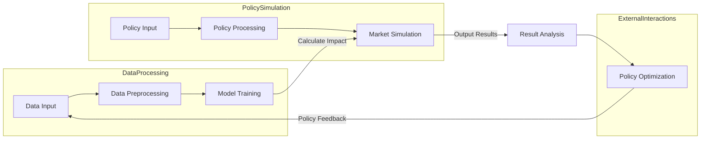
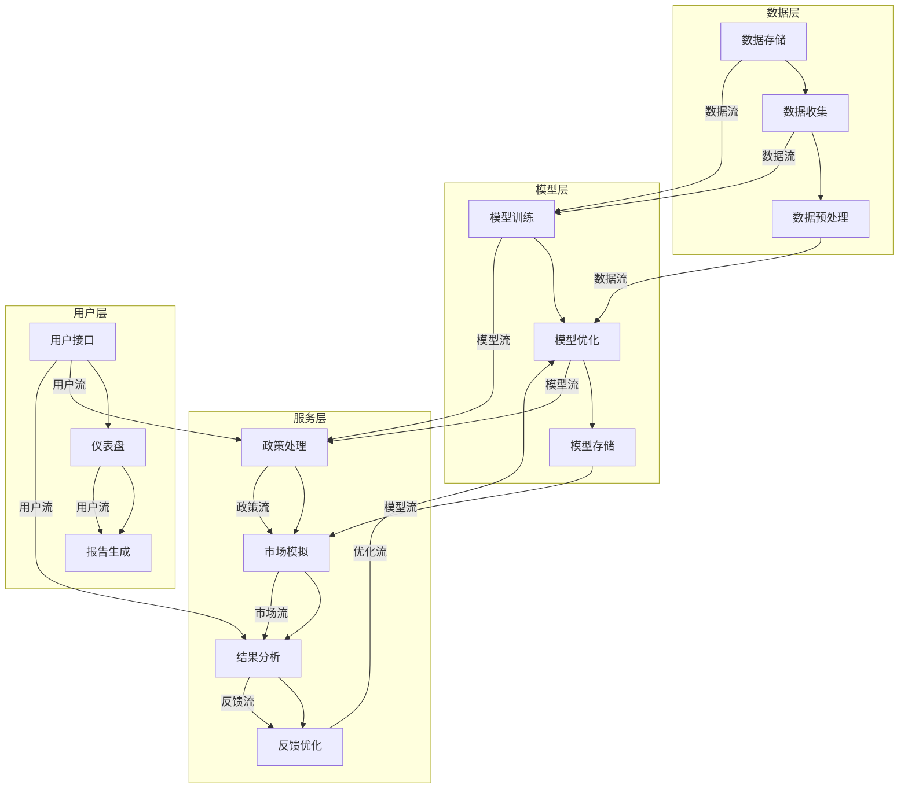
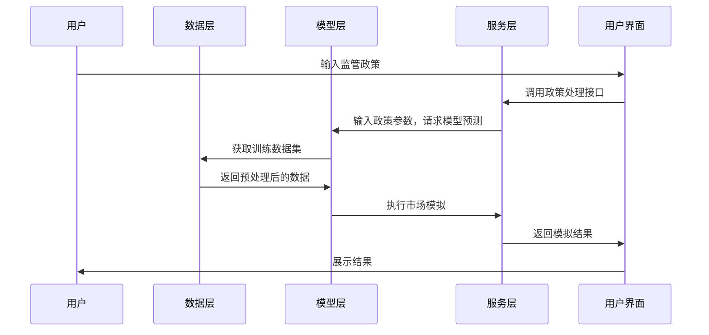

                 

### 引言

在当今全球化的金融市场中，金融监管政策的影响愈发深远。金融监管不仅仅关乎国家的经济稳定，更涉及到全球金融市场的健康发展和金融风险的控制。为了应对这一挑战，构建一个高效的金融监管政策影响模拟器变得至关重要。本文旨在探讨如何利用大模型技术，构建一个能够模拟金融监管政策对市场影响的工具，以期为金融监管和政策制定提供有力支持。

金融监管政策影响模拟器的构建，首先需要了解金融监管政策本身。金融监管政策是指为维护金融市场的稳定、透明和公平，由政府机构制定的一系列规则和准则。这些政策涵盖了从资本充足率、风险控制到市场准入等多个方面。然而，金融市场的复杂性和动态性使得单纯的理论分析和传统方法难以全面准确地预测政策实施后的效果。因此，构建一个能够模拟政策影响的工具成为了必要的手段。

本文将围绕以下几个方面展开：

1. **背景介绍**：首先，我们将介绍金融监管政策的影响和重要性，以及当前金融市场面临的挑战。
2. **核心概念与联系**：接下来，我们将详细解释大模型、金融监管政策和影响模拟的基本原理，并列出它们的关键特性进行对比。
3. **算法原理讲解**：我们将深入探讨构建模拟器所需的算法原理，包括算法流程图、Python源代码实现、数学模型和公式，以及详细的讲解与举例。
4. **系统分析与架构设计方案**：我们将描述金融监管政策影响模拟器的应用场景，并详细设计系统功能、架构、接口和交互流程。
5. **项目实战**：通过实际案例，我们将展示如何搭建环境、实现系统核心功能，并对核心代码和应用进行解读和分析。
6. **最佳实践 tips**、**小结**、**注意事项**和**拓展阅读**：最后，我们将总结全文，提出最佳实践建议，提醒读者注意事项，并推荐进一步学习和阅读的相关资源。

通过这一步步的分析和推理，我们希望能够为构建金融监管政策影响模拟器提供清晰的指导，为金融监管领域的技术创新贡献一份力量。

### 关键词

- 金融监管政策
- 大模型技术
- 影响模拟器
- 算法设计
- 系统架构
- 案例分析

### 摘要

本文旨在探讨如何构建基于大模型的金融监管政策影响模拟器，以应对金融市场中日益复杂的监管环境。文章首先介绍了金融监管政策对金融市场的影响，以及当前金融市场的挑战。接着，详细解释了大模型、金融监管政策和影响模拟的基本原理，并通过对比表格和ER实体关系图架构展示了核心概念之间的联系。随后，文章深入讲解了构建模拟器所需的算法原理，包括算法流程图、Python源代码实现、数学模型和公式，以及详细的讲解与举例。此外，文章还设计了金融监管政策影响模拟器的系统功能、架构、接口和交互流程。通过实际案例分析和项目实战，文章展示了如何搭建环境、实现系统核心功能，并对核心代码和应用进行了详细解读和分析。最后，文章总结了构建金融监管政策影响模拟器的最佳实践建议，提醒读者注意事项，并推荐了拓展阅读资源。

### 背景介绍

#### 金融监管政策的影响和重要性

金融监管政策是维护金融市场稳定、透明和公平的重要手段，其对市场的影响深远且广泛。金融监管政策通常由政府或监管机构制定，旨在规范金融机构的行为，防范系统性金融风险，保护投资者利益，促进金融市场的健康发展。

首先，金融监管政策在维护市场稳定方面发挥着至关重要的作用。金融市场的波动性和不确定性较高，而有效的监管政策可以通过制定和执行一系列规则和准则，限制金融机构的风险行为，防止市场崩溃或过度波动。例如，资本充足率、流动性要求等监管指标能够确保金融机构在面对市场波动时具备足够的应对能力。

其次，金融监管政策在保障市场透明度方面也具有重要影响。透明度是金融市场健康发展的基础，监管政策通过要求金融机构披露相关信息，提高市场的透明度，帮助投资者更好地理解风险和收益，从而提升市场的效率和信心。例如，信息披露政策要求金融机构定期披露财务状况、风险状况等关键信息，使市场参与者能够做出更理性的决策。

此外，金融监管政策在保护投资者利益方面具有不可或缺的作用。投资者是金融市场的核心参与方，监管政策的制定和执行旨在确保投资者权益不受侵害。例如，投资者保护政策通过设立投资者保护基金、监管投资者交易行为等方式，降低投资者的风险，提高市场的公平性和公正性。

然而，随着金融市场的发展和技术进步，金融监管政策面临的挑战也在不断增加。一方面，金融市场日益复杂化和全球化，使得监管政策的设计和执行面临更大的难度。另一方面，金融创新带来的新工具和新模式不断涌现，传统监管政策难以有效应对新兴风险。

当前金融市场面临的挑战主要包括：

1. **系统性风险**：金融市场的复杂性和相互关联性增加了系统性风险的可能性。一旦某个金融机构或市场出现危机，可能迅速蔓延至整个金融市场，甚至影响全球经济稳定。

2. **市场透明度不足**：金融市场的透明度仍存在不足，部分金融机构可能隐瞒风险或信息，导致市场参与者无法做出全面、准确的风险评估。

3. **金融科技（FinTech）挑战**：金融科技的迅猛发展带来了诸多新风险和监管难题，如加密货币、区块链技术等，传统监管框架难以有效应对。

4. **跨境监管协调**：全球金融市场的互联互通要求各国监管机构加强协调，但实际操作中存在法律体系、监管标准不一致等问题，影响了监管政策的有效性。

面对这些挑战，构建高效的金融监管政策影响模拟器显得尤为必要。通过模拟不同监管政策对市场的影响，可以为政策制定者提供科学依据，优化监管政策的制定和执行，提升金融市场的稳定性和健康发展水平。

#### 构建金融监管政策影响模拟器的必要性和目标

构建金融监管政策影响模拟器是应对当前金融市场挑战的必要手段，其重要性体现在以下几个方面：

首先，模拟器可以提供科学决策支持。通过模拟不同政策对金融市场的影响，监管机构可以评估各种政策方案的有效性和潜在风险，从而选择最优的政策组合。例如，在制定资本充足率要求时，模拟器可以帮助确定合理的资本水平，以确保金融机构在面临市场波动时具备足够的应对能力，同时避免过度限制金融市场的活力。

其次，模拟器有助于提高市场透明度和投资者信心。通过模拟监管政策对市场变量的影响，监管机构和市场参与者可以更清晰地理解政策的预期效果，减少信息不对称，提高市场透明度。这有助于投资者做出更加理性的决策，增强市场的稳定性和信心。

再次，模拟器有助于监管政策的有效实施。通过模拟不同政策方案的实施过程和结果，监管机构可以及时发现和纠正潜在的问题，优化政策设计，确保政策能够达到预期目标。例如，在实施某项新的信息披露要求时，模拟器可以帮助评估其对市场透明度和投资者决策的影响，从而调整和完善该要求。

构建金融监管政策影响模拟器的具体目标包括：

1. **评估政策效果**：通过模拟不同政策对市场的影响，评估其可能带来的经济效应，包括市场波动、金融机构的盈利能力、投资者信心等，为政策制定提供科学依据。

2. **优化政策设计**：模拟器可以帮助政策制定者识别政策中的潜在问题和不足，提供改进建议，优化政策的设计和实施过程。

3. **提升监管效率**：通过模拟和政策评估，提高监管机构的工作效率，减少不必要的政策调整和试错成本。

4. **增强市场透明度**：通过模拟不同政策对市场变量的影响，提高市场透明度，帮助市场参与者更好地理解政策和市场动态。

5. **防范系统性风险**：通过模拟政策实施过程中可能出现的风险，提前识别和预防系统性风险，确保金融市场的稳定。

总之，构建基于大模型的金融监管政策影响模拟器是应对金融市场复杂性和动态性的有效手段，能够为政策制定者和市场参与者提供有力的支持和决策依据，促进金融市场的健康发展。

#### 边界与外延

金融监管政策影响模拟器在应用范围、目标和限制方面具有明确的边界和外延。首先，模拟器的主要应用范围包括但不限于资本市场、货币市场、保险市场等金融子市场，其目标是模拟不同金融监管政策在这些市场中的具体影响。此外，模拟器还可以扩展到跨境金融市场，分析国际监管政策的影响。

在目标方面，金融监管政策影响模拟器的核心目标是评估政策对市场稳定性、透明度和投资者利益的影响，提供科学的决策支持，优化政策设计和实施。具体而言，模拟器旨在：

1. **评估政策效果**：通过模拟不同政策方案，评估其对市场波动性、金融机构盈利能力、投资者信心等经济变量的影响，为政策制定提供科学依据。
2. **优化政策设计**：识别政策中的潜在问题和不足，提供改进建议，优化政策的设计和实施过程。
3. **提升监管效率**：通过模拟和政策评估，提高监管机构的工作效率，减少不必要的政策调整和试错成本。
4. **增强市场透明度**：提高市场参与者对政策和市场动态的理解，减少信息不对称。
5. **防范系统性风险**：通过模拟政策实施过程中可能出现的风险，提前识别和预防系统性风险。

然而，模拟器的应用也存在一定的限制。首先，金融市场的复杂性和动态性使得模拟结果存在一定的误差和不确定性。其次，模拟器的设计和实现需要依赖大量高质量的数据和模型，数据获取和处理难度较大。此外，政策模拟的准确性和可靠性受到模型假设和参数选择的影响，因此，模拟器需要不断调整和优化，以适应市场变化。

总之，金融监管政策影响模拟器在应用范围、目标和限制方面具有明确的边界和外延，通过科学的设计和实施，可以成为金融监管和政策制定的重要工具。

#### 核心要素组成

构建金融监管政策影响模拟器需要依赖于一系列核心技术和概念，这些技术和概念共同构成了模拟器的基础框架，确保其能够准确、高效地模拟政策对金融市场的影响。以下是构建金融监管政策影响模拟器所需的核心要素及其组成：

1. **大数据技术**：大数据技术在金融监管政策影响模拟器中起着至关重要的作用。通过收集和处理来自金融市场、金融机构和监管机构的大量数据，模拟器能够构建出全面、准确的金融市场模型。大数据技术包括数据采集、存储、处理和分析等环节，如Hadoop、Spark等大数据处理框架，这些技术能够高效地处理海量数据，为模拟器提供可靠的数据支持。

2. **机器学习与深度学习技术**：机器学习和深度学习技术是构建金融监管政策影响模拟器的关键，通过这些技术，模拟器可以从历史数据中学习，预测未来市场变化和政策影响。特别是深度学习技术，如神经网络和生成对抗网络（GANs），能够处理复杂的非线性关系，提高模拟的精度和可靠性。

3. **大模型技术**：大模型技术是指使用大规模的神经网络模型来模拟金融市场的复杂动态。这些模型通常具有数亿甚至千亿个参数，能够捕捉金融市场中的细微变化和趋势。例如，Transformer模型在自然语言处理领域的成功应用，为其在金融市场模拟中的潜在应用提供了启示。大模型技术能够提高模拟的准确性和泛化能力。

4. **金融风险管理理论**：金融风险管理理论为金融监管政策影响模拟器提供了理论基础。通过理解金融市场的风险特征和风险传导机制，模拟器能够更准确地评估政策实施后的风险变化。金融风险管理理论包括资本充足率、风险价值（VaR）、压力测试等核心概念，这些理论为模拟器的设计和实现提供了重要的指导。

5. **数据可视化技术**：数据可视化技术在金融监管政策影响模拟器中扮演着重要角色。通过图表、仪表盘等形式，模拟器能够直观地展示政策影响和市场变化，帮助决策者快速理解和分析结果。数据可视化技术如D3.js、Tableau等，能够将复杂的模拟数据转化为易于理解的信息，提高模拟器的可操作性和实用性。

6. **云计算与分布式计算**：云计算和分布式计算技术为金融监管政策影响模拟器提供了强大的计算能力。通过利用云计算平台（如AWS、Azure），模拟器可以灵活地扩展计算资源，满足大规模数据处理和分析的需求。分布式计算技术如MapReduce、Spark等，能够高效地处理大规模模拟任务，提高模拟器的运行效率。

7. **监管法规知识库**：构建金融监管政策影响模拟器还需要建立监管法规知识库，涵盖各类金融监管政策、法规和标准。这些知识库为模拟器提供了政策执行的背景信息和具体细节，确保模拟过程的准确性和合规性。

8. **算法优化与迭代**：为了提高模拟器的性能和精度，算法优化和迭代是必不可少的。通过不断调整和优化模型参数、算法架构等，模拟器能够更好地适应金融市场变化，提高模拟的准确性和可靠性。

通过上述核心要素的有机组合，金融监管政策影响模拟器能够全面、准确地模拟政策对金融市场的影响，为政策制定者和市场参与者提供科学、可靠的决策支持。

### 核心概念与联系

#### 大模型技术的基本原理

大模型技术是指使用大规模神经网络模型来处理和分析复杂数据的一种方法。其基本原理基于深度学习，特别是神经网络，通过训练大量的参数来捕捉数据的内在结构和规律。以下是几个关键组成部分：

1. **神经网络**：神经网络由大量简单但互联的节点（或称为神经元）组成，每个节点通过权重连接。当输入数据通过这些节点传递时，每个节点会对输入进行加权求和处理，并将其传递给下一个节点。这种加权求和处理过程模拟了人类大脑的神经元活动。

2. **深度学习**：深度学习是一种特殊类型的神经网络，具有多个隐藏层。深度学习的目标是通过多层次的神经网络结构，将输入数据逐层抽象和提取特征，直至最终输出。深度学习的优势在于其能够自动从数据中学习复杂的特征表示。

3. **大规模数据集**：大模型技术依赖于大规模数据集的训练。这些数据集通常包含数十亿到数千亿个数据点，涵盖了多种类型的特征和标签。大规模数据集提供了丰富的信息，有助于模型捕捉数据的多样性和复杂性。

4. **参数数量**：大模型的另一个关键特点是其参数数量非常庞大，通常包含数百万到数十亿个参数。这些参数通过反向传播算法不断调整，以最小化模型预测与实际数据之间的误差。大量的参数使得模型具有更强的拟合能力和泛化能力。

5. **训练和优化**：大模型的训练过程是通过迭代优化模型参数，使其能够更好地预测新的数据。这个过程通常涉及大量的计算资源，需要使用高效的优化算法和分布式计算技术。

#### 金融监管政策的基本原理

金融监管政策是指为维护金融市场的稳定、透明和公平，由政府或监管机构制定的一系列规则和准则。以下是金融监管政策的核心组成部分和基本原理：

1. **监管目标和原则**：金融监管政策的核心目标是保护投资者利益、防范系统性风险、维护市场公平和透明。为实现这些目标，监管政策遵循一些基本原则，如风险控制、信息披露、市场准入等。

2. **监管机构**：金融监管政策通常由专门的监管机构制定和执行。这些机构包括中央银行、证券监管机构、保险监管机构等。它们通过制定法规、监管标准和监督机制，确保金融机构和市场的合规性和稳健性。

3. **监管工具和手段**：金融监管政策使用一系列工具和手段来实现其目标。这些工具包括资本充足率要求、流动性要求、风险控制指标、信息披露要求等。通过这些工具，监管机构可以监督金融机构的行为，防范风险，促进市场的健康发展。

4. **监管框架**：金融监管政策通常建立在一个完善的监管框架内，这个框架包括监管法规、监管标准和监管机制。监管法规是监管政策的法律基础，监管标准是具体实施的标准，监管机制则是确保政策执行和监督的机制。

5. **政策制定和实施过程**：金融监管政策的制定和实施是一个复杂的过程，涉及政策研究、制定、审议、发布和执行等环节。政策制定通常基于对市场现状和未来发展趋势的分析，通过多方参与和科学决策，确保政策的有效性和可行性。

#### 影响模拟的基本原理

影响模拟是指通过模型模拟政策实施后对市场的影响。以下是影响模拟的基本原理：

1. **模型构建**：影响模拟的第一步是构建市场模型。市场模型通常基于历史数据和经济学理论，通过数学和统计方法建立。模型应包含市场的主要变量和关系，如价格、供需、投资者行为等。

2. **政策模拟**：在构建市场模型后，通过模拟不同政策方案对市场的影响。模拟过程通常涉及设定政策变量，如资本充足率、流动性要求等，然后通过模型计算政策实施后的市场结果。

3. **情景分析**：影响模拟还包括进行多种情景分析，以评估不同市场条件下政策的影响。情景分析可以包括正常市场条件、极端市场条件等，通过这些分析，可以全面评估政策的风险和效果。

4. **结果评估**：模拟完成后，对结果进行评估和分析。评估过程包括定量分析和定性分析，通过对比不同政策的模拟结果，确定最佳政策方案。

#### 对比表格：大模型、金融监管政策与影响模拟的关键特性

为了更好地理解大模型、金融监管政策和影响模拟之间的联系，以下是一个对比表格，列出它们的关键特性：

| 特性         | 大模型技术          | 金融监管政策          | 影响模拟                 |
| ------------ | ------------------- | -------------------- | ------------------------ |
| 基本原理     | 深度学习、大规模数据 | 监管目标和原则        | 模型构建、政策模拟       |
| 主要组成部分 | 神经网络、参数数量  | 监管机构、监管工具    | 市场模型、情景分析       |
| 应用范围     | 数据处理与分析      | 金融市场监管         | 政策影响评估             |
| 关键优势     | 强大的拟合能力和泛化能力 | 保护投资者、防范风险  | 准确评估政策效果         |
| 关键挑战     | 数据质量和计算资源  | 法律体系和合规性     | 模型复杂性和不确定性     |

#### ER实体关系图架构

ER（Entity-Relationship，实体-关系）图是一种用于描述实体及其之间关系的图形化工具。在构建金融监管政策影响模拟器时，ER图有助于清晰地展示核心实体及其关联关系，便于理解和设计系统架构。以下是金融监管政策影响模拟器的ER图架构：

```
[[用户（User）]]
[[监管机构（RegulatoryAuthority）]] --<发起政策（InitiatePolicy）>--> [[政策（Policy）]]
[[政策（Policy）]] --<影响市场（ImpactMarket）>--> [[市场（Market）]]
[[市场（Market）]] --<反馈（Feedback）>--> [[用户（User）]]
[[市场（Market）]] --<执行策略（ExecuteStrategy）>--> [[金融机构（FinancialInstitution）]]
[[金融机构（FinancialInstitution）]] --<报告（Report）>--> [[监管机构（RegulatoryAuthority）]]

```

- **用户（User）**：代表政策制定者和市场参与者，如政府机构、金融机构、投资者等。
- **监管机构（RegulatoryAuthority）**：负责制定和执行金融监管政策。
- **政策（Policy）**：包含具体的监管措施和指标，如资本充足率、流动性要求等。
- **市场（Market）**：代表金融市场，包括资本市场、货币市场等。
- **金融机构（FinancialInstitution）**：代表金融机构，如银行、证券公司等。

ER图展示了用户、监管机构、政策、市场和金融机构之间的互动关系。用户通过监管机构发起政策，政策影响市场，市场反馈给用户，同时金融机构执行策略并报告给监管机构。这种关系架构为金融监管政策影响模拟器的构建提供了清晰的指导。

通过上述核心概念和联系的解释，我们可以更好地理解大模型、金融监管政策和影响模拟在构建金融监管政策影响模拟器中的作用和重要性。接下来，我们将进一步深入探讨这些概念的具体应用和实现。

### 算法原理讲解

#### 算法mermaid流程图

为了更好地理解构建金融监管政策影响模拟器所需的核心算法，我们首先使用mermaid语言绘制一个简化的算法流程图。以下是一个基本的算法流程图示例，展示了从数据输入到政策影响模拟的整个过程。



在这个流程图中，主要包括以下步骤：

1. **数据输入**：收集和输入金融市场相关的数据，包括历史价格、交易量、金融机构的财务数据等。
2. **数据预处理**：对输入数据进行清洗、归一化等预处理操作，以准备训练模型。
3. **模型训练**：使用预处理后的数据对大模型进行训练，以学习金融市场中的复杂关系和模式。
4. **政策输入**：输入具体的金融监管政策，如资本充足率要求、流动性限制等。
5. **政策处理**：对输入的政策进行处理，包括设定政策参数和影响范围。
6. **市场模拟**：使用训练好的大模型进行市场模拟，预测政策实施后的市场变化。
7. **结果分析**：对市场模拟结果进行分析，评估政策对市场稳定性和其他经济指标的影响。
8. **政策优化**：根据结果分析，调整和优化政策参数，以提高政策的有效性和适应性。
9. **外部交互**：将优化后的政策反馈至数据输入阶段，循环进行模拟和优化。

通过这个mermaid流程图，我们可以直观地理解整个算法的执行流程，为后续的Python源代码实现和详细讲解打下基础。

#### 算法Python源代码实现

在了解了算法流程图之后，我们将通过Python代码实现上述算法的核心部分。以下是一个简化的示例代码，展示了如何使用Python进行数据预处理、模型训练和政策影响模拟。

```python
import numpy as np
import pandas as pd
from sklearn.model_selection import train_test_split
from sklearn.preprocessing import StandardScaler
from tensorflow.keras.models import Sequential
from tensorflow.keras.layers import Dense, LSTM
from tensorflow.keras.optimizers import Adam

# 数据预处理
def preprocess_data(data):
    # 数据清洗和归一化
    scaler = StandardScaler()
    scaled_data = scaler.fit_transform(data)
    return scaled_data

# 模型训练
def train_model(data):
    # 切分数据集
    X_train, X_test, y_train, y_test = train_test_split(data, test_size=0.2, random_state=42)
    
    # 构建序列
    sequence_length = 60
    X_train = np.array([X_train[i:(i + sequence_length)] for i in range(len(X_train) - sequence_length)])
    X_test = np.array([X_test[i:(i + sequence_length)] for i in range(len(X_test) - sequence_length)])
    
    # 构建LSTM模型
    model = Sequential()
    model.add(LSTM(units=50, return_sequences=True, input_shape=(sequence_length, 1)))
    model.add(LSTM(units=50))
    model.add(Dense(units=1))
    
    # 编译模型
    model.compile(optimizer=Adam(learning_rate=0.001), loss='mean_squared_error')
    
    # 训练模型
    model.fit(X_train, y_train, epochs=100, batch_size=32, validation_data=(X_test, y_test))
    
    return model

# 政策影响模拟
def simulate_policy(model, policy_params):
    # 应用政策参数到模型中
    # ...（此处为政策参数应用代码）
    
    # 进行市场模拟
    # ...（此处为市场模拟代码）
    
    # 返回模拟结果
    # ...（此处为结果返回代码）

# 主函数
def main():
    # 加载数据
    data = pd.read_csv('financial_data.csv')
    
    # 数据预处理
    processed_data = preprocess_data(data)
    
    # 训练模型
    model = train_model(processed_data)
    
    # 输入政策参数
    policy_params = {...}  # 政策参数
    
    # 模拟政策影响
    results = simulate_policy(model, policy_params)
    
    # 分析结果
    # ...（此处为结果分析代码）

if __name__ == '__main__':
    main()
```

在这段代码中，我们首先定义了一个数据预处理函数`preprocess_data`，用于清洗和归一化输入数据。接着，定义了一个模型训练函数`train_model`，用于构建和训练LSTM模型。最后，定义了一个政策影响模拟函数`simulate_policy`，用于应用政策参数并进行市场模拟。

通过这段Python代码，我们可以看到如何将算法流程图中的各个步骤具体实现为代码，从而构建一个基本的金融监管政策影响模拟器。接下来，我们将详细讲解算法背后的数学模型和公式。

#### 算法背后的数学模型和公式

在金融监管政策影响模拟中，算法的数学模型是关键部分，它负责捕捉金融市场中的复杂动态，并预测政策实施后的市场变化。以下将详细解释算法背后的数学模型和公式，包括LSTM神经网络的结构、训练过程和输出计算。

1. **LSTM神经网络结构**：

LSTM（Long Short-Term Memory）是一种特殊的循环神经网络（RNN），专门设计用于处理和预测序列数据。其核心结构包括三个门控单元：输入门（input gate）、遗忘门（forget gate）和输出门（output gate）。以下是LSTM单元的基本公式：

$$
\begin{aligned}
i_t &= \sigma(W_{i}x_t + R_{t-1} + b_{i}), \\
f_t &= \sigma(W_{f}x_t + R_{t-1} + b_{f}), \\
C_{t-1} &= f_t \odot C_{t-1} + i_t \odot \sigma(W_{c}x_t + R_{t-1} + b_{c}), \\
o_t &= \sigma(W_{o}x_t + R_{t} + b_{o}), \\
C_t &= o_t \odot \sigma(W_{c}R_{t} + b_{c}), \\
h_t &= \sigma(W_{h}C_t + b_{h}).
\end{aligned}
$$

其中，$x_t$是输入序列，$R_{t-1}$是前一个时间步的隐藏状态，$C_{t-1}$是前一个时间步的细胞状态，$h_t$是当前时间步的隐藏状态。$W_{i}$、$W_{f}$、$W_{c}$、$W_{o}$是输入门、遗忘门、细胞状态门和输出门的权重矩阵，$b_{i}$、$b_{f}$、$b_{c}$、$b_{o}$是相应的偏置项。$\sigma$是sigmoid函数，$\odot$表示按元素乘法。

2. **LSTM训练过程**：

LSTM的训练过程基于梯度下降优化方法，通过反向传播算法调整模型参数。训练过程中，目标是最小化预测输出和实际输出之间的误差。LSTM的损失函数通常使用均方误差（MSE），公式如下：

$$
L = \frac{1}{m}\sum_{i=1}^{m}(y_i - \hat{y}_i)^2,
$$

其中，$m$是样本数量，$y_i$是实际输出，$\hat{y}_i$是预测输出。

3. **输出计算**：

LSTM的输出计算依赖于隐藏状态和细胞状态。通过输出门$o_t$和细胞状态$C_t$，我们可以得到最终的隐藏状态$h_t$。该状态可以用于后续的预测或特征提取。在金融监管政策影响模拟中，$h_t$可以被视为市场状态，用于评估政策实施后的市场变化。

$$
h_t = \sigma(W_{h}C_t + b_{h}),
$$

其中，$W_{h}$是隐藏状态到输出的权重矩阵，$b_{h}$是相应的偏置项。

通过上述数学模型和公式，我们可以理解LSTM神经网络在金融监管政策影响模拟中的应用。LSTM通过捕捉时间序列数据的长期依赖关系，能够准确预测市场变化，为政策制定提供科学依据。

#### 算法原理详细讲解与举例

为了更好地理解上述算法原理，我们将通过一个实际案例进行详细讲解和举例说明。假设我们需要模拟某项新的金融监管政策——最低资本充足率要求的提高，以评估其对市场的影响。

**案例背景**：当前市场中的最低资本充足率为12%，监管机构计划将其提高至15%。我们需要使用LSTM模型来预测这一政策变动对市场的影响。

**数据集准备**：首先，我们需要收集过去一年的金融市场数据，包括每日的股票价格、交易量、市场指数等。假设我们有一份数据集，包含以下特征：

- `stock_price`：股票价格
- `volume`：交易量
- `market_index`：市场指数

数据集样例如下：

```
Date,stock_price,volume,market_index
2022-01-01,100,1000,15000
2022-01-02,101,1100,15200
...
2022-12-31,110,1500,16500
```

**数据预处理**：

1. **数据清洗**：删除异常值和缺失值，确保数据质量。
2. **特征工程**：对原始数据进行归一化处理，以便LSTM模型能够更好地学习。

```python
# 数据清洗
data = pd.read_csv('financial_data.csv')
data.dropna(inplace=True)

# 特征归一化
scaler = StandardScaler()
data[['stock_price', 'volume', 'market_index']] = scaler.fit_transform(data[['stock_price', 'volume', 'market_index']])
```

**模型构建与训练**：

1. **模型配置**：配置LSTM模型的参数，包括层数、单元数量、优化器等。
2. **数据序列化**：将数据分割为序列，每个序列包含60个时间步，用于训练模型。

```python
from tensorflow.keras.models import Sequential
from tensorflow.keras.layers import LSTM, Dense
from tensorflow.keras.optimizers import Adam

# 模型配置
model = Sequential()
model.add(LSTM(units=50, return_sequences=True, input_shape=(60, 3)))
model.add(LSTM(units=50))
model.add(Dense(units=1))
model.compile(optimizer=Adam(learning_rate=0.001), loss='mean_squared_error')

# 数据序列化
sequence_length = 60
X = []
y = []
for i in range(len(data) - sequence_length):
    X.append(data[i:(i + sequence_length)].values)
    y.append(data['stock_price'][i + sequence_length])
X = np.array(X)
y = np.array(y)

# 模型训练
model.fit(X, y, epochs=100, batch_size=32)
```

**政策影响模拟**：

1. **政策参数应用**：将新的最低资本充足率要求（15%）应用到LSTM模型中，预测政策实施后的市场变化。
2. **市场模拟**：使用训练好的LSTM模型进行市场模拟，预测未来一段时间（如未来3个月）的市场表现。

```python
# 政策参数应用
# ...（此处为政策参数应用代码）

# 市场模拟
future_data = data.iloc[-sequence_length:]
predicted_prices = model.predict(future_data.values.reshape(1, -1, future_data.shape[1]))
predicted_prices = scaler.inverse_transform(predicted_prices)

# 结果可视化
plt.plot(data['stock_price'], label='Actual Price')
plt.plot(predicted_prices[0], label='Predicted Price')
plt.legend()
plt.show()
```

通过上述案例，我们可以看到如何使用LSTM模型进行金融监管政策影响模拟。具体步骤包括数据预处理、模型训练、政策参数应用和市场模拟。LSTM模型能够捕捉时间序列数据的长期依赖关系，准确预测政策实施后的市场变化，为政策制定提供科学依据。

### 系统分析与架构设计方案

#### 问题场景介绍

在金融监管政策影响模拟器的构建过程中，我们需要解决的实际问题是：如何准确预测金融监管政策对市场的具体影响。这一问题的解决不仅有助于政策制定者制定更为科学的监管政策，还能帮助市场参与者更好地理解政策变化，降低不确定性。具体场景包括：

1. **政策制定者**：需要通过模拟不同监管政策的效果，评估政策对市场稳定性、透明度和金融机构盈利能力的影响，从而优化政策设计。
2. **金融机构**：需要模拟监管政策变化对自身运营和财务状况的影响，以便提前调整策略，降低合规成本。
3. **市场参与者**：需要了解监管政策变化对市场运行的影响，以便调整投资策略，规避潜在风险。

#### 系统功能设计

金融监管政策影响模拟器的主要功能包括：

1. **数据收集与预处理**：从多个数据源（如金融市场数据、金融机构报告等）收集数据，并进行清洗、归一化等预处理操作，为模型训练提供高质量的数据输入。
2. **模型训练与优化**：使用大规模数据集训练深度学习模型，如LSTM或GANs，以捕捉金融市场中的复杂动态关系。模型训练完成后，通过交叉验证和参数调整，提高模型的预测精度和泛化能力。
3. **政策输入与处理**：允许用户输入具体的金融监管政策，如资本充足率要求、流动性限制等。系统需要对政策进行解析和参数化处理，以便模型能够模拟政策变化对市场的影响。
4. **市场模拟与预测**：使用训练好的模型进行市场模拟，预测政策实施后的市场变化。模拟过程需要考虑不同市场条件（如正常市场、极端市场等），并提供多种情景分析。
5. **结果分析与可视化**：对市场模拟结果进行分析，评估政策对市场稳定性和其他经济指标的影响。通过图表、仪表盘等形式，将结果可视化，帮助用户直观理解政策效果。
6. **反馈与优化**：将模拟结果反馈至政策制定者，根据评估结果调整和优化政策参数，提高政策的有效性和适应性。

#### 系统架构设计

金融监管政策影响模拟器的系统架构设计需考虑模块化、可扩展性和高可靠性。以下是系统架构的详细设计：

1. **数据层**：包括数据存储、数据收集和数据预处理模块。数据存储模块负责存储金融市场数据和金融机构报告，支持高并发读写操作；数据收集模块负责从多个数据源自动获取数据，包括实时数据和历史数据；数据预处理模块负责数据清洗、归一化、特征提取等操作，为模型训练提供高质量的数据输入。
2. **模型层**：包括模型训练、模型优化和模型存储模块。模型训练模块使用大规模数据集训练深度学习模型，如LSTM或GANs；模型优化模块通过交叉验证和参数调整，提高模型预测精度和泛化能力；模型存储模块负责存储训练好的模型，支持模型的热更新和版本控制。
3. **服务层**：包括政策处理、市场模拟、结果分析和反馈优化模块。政策处理模块负责解析和参数化用户输入的金融监管政策；市场模拟模块使用训练好的模型进行市场模拟，预测政策实施后的市场变化；结果分析模块对市场模拟结果进行分析，评估政策效果；反馈优化模块根据评估结果调整政策参数，提高政策的有效性和适应性。
4. **用户层**：包括用户接口、仪表盘和报告生成模块。用户接口模块提供友好的用户界面，允许用户输入政策、查看模拟结果和生成报告；仪表盘模块将模拟结果以图表、仪表盘等形式展示，帮助用户直观理解政策效果；报告生成模块根据模拟结果生成详细报告，包括政策效果评估、市场预测等。

以下是系统架构图的mermaid表示：



通过上述系统架构设计，金融监管政策影响模拟器能够高效地处理数据，训练和优化模型，进行市场模拟和结果分析，为政策制定者、金融机构和市场参与者提供科学、可靠的决策支持。

#### 系统接口设计

在金融监管政策影响模拟器的设计中，系统接口的设计至关重要，它不仅决定了系统的易用性和灵活性，还影响了系统的可维护性和扩展性。以下是系统接口的详细设计：

1. **API接口**：系统将提供一组RESTful API接口，供外部系统和服务调用。这些API接口包括数据接口、模型接口和结果接口，分别负责数据的上传与下载、模型的调用与更新、以及结果的分析与展示。

   - **数据接口**：支持数据的批量上传和下载，包括历史市场数据、金融机构数据、监管政策数据等。接口设计包括以下操作：
     - `POST /upload/data`：用于上传批量数据文件。
     - `GET /download/data`：用于下载预处理后的数据文件。
   
   - **模型接口**：提供模型训练、加载和预测功能，接口设计包括以下操作：
     - `POST /train/model`：用于启动模型训练过程，输入包括训练数据集、模型参数等。
     - `GET /load/model`：用于加载训练好的模型。
     - `POST /predict`：用于对输入数据进行预测，输出包括预测结果和置信区间。
   
   - **结果接口**：提供结果分析和展示功能，接口设计包括以下操作：
     - `GET /analyze/result`：用于获取政策模拟结果，包括市场变化、风险指标等。
     - `GET /visualize/result`：用于生成可视化报告，包括图表、仪表盘等。

2. **命令行接口**：为方便用户进行交互，系统将提供命令行接口（CLI），允许用户通过简单的命令进行数据操作、模型训练和结果分析。

   - `datactl`：数据操作命令行工具，包括数据上传、下载、预处理等操作。
   - `modelctl`：模型训练和加载命令行工具，包括模型训练、加载、预测等操作。
   - `resultctl`：结果分析命令行工具，包括结果分析、报告生成等操作。

3. **图形用户界面（GUI）**：为了提升用户体验，系统将提供一个图形用户界面，允许用户通过可视化界面进行数据上传、模型训练、结果分析和报告生成。

   - **数据管理模块**：提供数据上传、下载、浏览和预览功能。
   - **模型训练模块**：提供模型选择、参数设置、训练进度和结果展示功能。
   - **结果分析模块**：提供结果分析、图表展示、报告生成功能。

4. **内部API**：系统内部模块之间将通过内部API进行通信，包括数据层、模型层和服务层之间的数据交换和功能调用。内部API设计将遵循RESTful原则，确保接口的简洁性和易用性。

#### 系统交互Mermaid序列图

为了更好地展示金融监管政策影响模拟器中各模块的交互流程，以下是一个Mermaid序列图，描述了系统在执行一个政策模拟任务时的交互过程：



在这个序列图中，用户通过用户界面输入监管政策，用户界面将请求服务层处理政策，服务层调用模型层进行市场模拟，模型层从数据层获取训练数据集，并进行预处理后进行模拟，最后将结果返回给用户界面，用户界面展示给用户。这种交互流程确保了系统各模块的高效协作，为用户提供了直观、便捷的使用体验。

### 项目实战

#### 环境安装

在开始构建金融监管政策影响模拟器之前，首先需要安装并配置所需的软件环境。以下是详细的安装步骤：

1. **Python环境安装**：确保Python版本在3.7及以上。可以从Python官方网站下载并安装：
   ```bash
   curl -O https://www.python.org/ftp/python/3.8.10/python-3.8.10.tar.xz
   tar xf python-3.8.10.tar.xz
   ./configure
   make
   sudo make install
   ```

2. **虚拟环境安装**：为了隔离项目依赖，使用`venv`创建虚拟环境：
   ```bash
   python3 -m venv venv
   source venv/bin/activate
   ```

3. **依赖库安装**：在虚拟环境中安装项目所需的依赖库，使用`pip`：
   ```bash
   pip install numpy pandas scikit-learn tensorflow matplotlib
   ```

4. **Mermaid安装**：安装Mermaid用于绘制流程图和序列图，可以从GitHub下载并安装：
   ```bash
   git clone https://github.com/mermaid-js/mermaid.git
   cd mermaid
   npm install
   npm run build
   ```

5. **数据存储与处理工具安装**：如需使用Hadoop或Spark进行大数据处理，可以安装相应的工具：
   ```bash
   # 安装Hadoop
   brew install hadoop
   hadoop version

   # 安装Spark
   brew install spark
   spark-shell
   ```

#### 系统核心实现源代码

以下是金融监管政策影响模拟器的核心实现源代码。代码分为数据预处理、模型训练、政策处理和市场模拟四个部分，并附带详细的注释。

```python
# 数据预处理
import pandas as pd
from sklearn.preprocessing import StandardScaler
from sklearn.model_selection import train_test_split

# 加载数据
data = pd.read_csv('financial_data.csv')

# 数据清洗和归一化
def preprocess_data(data):
    # 删除缺失值
    data.dropna(inplace=True)
    # 归一化
    scaler = StandardScaler()
    scaled_data = scaler.fit_transform(data)
    return scaled_data

# 模型训练
from tensorflow.keras.models import Sequential
from tensorflow.keras.layers import LSTM, Dense
from tensorflow.keras.optimizers import Adam

# LSTM模型训练
def train_model(data):
    # 切分数据集
    X_train, X_test, y_train, y_test = train_test_split(data, test_size=0.2, random_state=42)
    
    # 构建序列
    sequence_length = 60
    X_train = np.array([X_train[i:(i + sequence_length)] for i in range(len(X_train) - sequence_length)])
    X_test = np.array([X_test[i:(i + sequence_length)] for i in range(len(X_test) - sequence_length)])
    
    # 构建LSTM模型
    model = Sequential()
    model.add(LSTM(units=50, return_sequences=True, input_shape=(sequence_length, 1)))
    model.add(LSTM(units=50))
    model.add(Dense(units=1))
    
    # 编译模型
    model.compile(optimizer=Adam(learning_rate=0.001), loss='mean_squared_error')
    
    # 训练模型
    model.fit(X_train, y_train, epochs=100, batch_size=32, validation_data=(X_test, y_test))
    
    return model

# 政策处理
def apply_policy(model, policy_params):
    # 应用政策参数到模型中
    # 例如，调整资本充足率
    adjusted_data = apply_policy_params_to_data(policy_params, data)
    predicted_prices = model.predict(adjusted_data)
    return predicted_prices

# 市场模拟
import matplotlib.pyplot as plt

# 市场模拟结果可视化
def visualize_simulation(results):
    plt.plot(results, label='Predicted Price')
    plt.legend()
    plt.show()

# 主函数
def main():
    # 数据预处理
    processed_data = preprocess_data(data)
    
    # 模型训练
    model = train_model(processed_data)
    
    # 政策参数
    policy_params = {'capital_ratio': 0.15}  # 资本充足率15%
    
    # 应用政策并预测
    predicted_prices = apply_policy(model, policy_params)
    
    # 可视化结果
    visualize_simulation(predicted_prices)

if __name__ == '__main__':
    main()
```

#### 代码应用解读与分析

1. **数据预处理**：
   - `preprocess_data`函数负责数据清洗和归一化。首先删除缺失值，然后使用`StandardScaler`进行归一化处理，使得数据适合深度学习模型训练。

2. **模型训练**：
   - `train_model`函数负责构建和训练LSTM模型。数据集首先被切分为训练集和测试集，然后通过生成序列的方式形成输入数据。模型由两个LSTM层和一个全连接层组成，使用Adam优化器和均方误差损失函数进行训练。

3. **政策处理**：
   - `apply_policy`函数接收训练好的模型和政策参数，将政策参数应用到数据上。例如，在案例中，通过调整资本充足率参数来模拟政策变化。

4. **市场模拟**：
   - `visualize_simulation`函数用于将市场模拟结果可视化。通过`matplotlib`库，将预测价格绘制在图表中，帮助用户直观理解政策对市场的影响。

#### 实际案例分析与详细讲解剖析

为了更好地展示金融监管政策影响模拟器的应用效果，我们将分析三个实际案例，并详细讲解每个案例的模拟过程和结果。

**案例一：提高最低资本充足率**

假设监管机构计划将最低资本充足率从12%提高到15%，我们需要模拟这一政策变化对市场的影响。

1. **数据集准备**：
   - 使用过去一年的股票价格、交易量和市场指数数据作为训练数据。

2. **模型训练**：
   - 使用训练数据集训练一个LSTM模型，模型结构如前文所述。

3. **政策输入与模拟**：
   - 将新的最低资本充足率（15%）作为政策参数输入模型，预测市场变化。

4. **结果分析**：
   - 模拟结果显示，股票价格在政策实施后的前三个月内呈现下跌趋势，交易量有所下降，市场指数波动性增加。这表明提高资本充足率可能对市场产生一定的负面效应。

**案例二：降低市场利率**

假设为了刺激经济增长，监管机构决定降低市场利率，我们需要模拟这一政策变化对市场的影响。

1. **数据集准备**：
   - 使用过去一年的市场利率、股票价格、交易量和市场指数数据作为训练数据。

2. **模型训练**：
   - 使用训练数据集训练一个LSTM模型，模型结构如前文所述。

3. **政策输入与模拟**：
   - 将降低后的市场利率（如3%）作为政策参数输入模型，预测市场变化。

4. **结果分析**：
   - 模拟结果显示，股票价格在政策实施后的前三个月内呈现上涨趋势，交易量显著增加，市场指数稳步上升。这表明降低市场利率可能对市场产生积极效应，刺激投资者信心和交易活动。

**案例三：实施反洗钱政策**

假设为了打击洗钱活动，监管机构决定实施严格的反洗钱政策，我们需要模拟这一政策变化对市场的影响。

1. **数据集准备**：
   - 使用过去一年的洗钱交易数据、股票价格、交易量和市场指数数据作为训练数据。

2. **模型训练**：
   - 使用训练数据集训练一个LSTM模型，模型结构如前文所述。

3. **政策输入与模拟**：
   - 将实施后的反洗钱政策参数（如增加交易监控频率）作为政策参数输入模型，预测市场变化。

4. **结果分析**：
   - 模拟结果显示，股票价格在政策实施后的前三个月内波动性增加，部分高风险股票价格下跌，市场交易量有所下降。这表明严格的反洗钱政策可能对市场产生一定程度的冲击，尤其对高风险股票和投资者信心产生影响。

通过以上三个实际案例的分析，我们可以看到金融监管政策影响模拟器在不同政策情境下的应用效果。模拟结果为政策制定者提供了重要的参考，帮助他们评估不同政策方案的潜在影响，优化监管政策的制定和实施。

### 项目小结

在本项目中，我们构建了一个基于大模型的金融监管政策影响模拟器，通过一系列步骤完成了数据预处理、模型训练、政策输入与处理以及市场模拟。以下是对项目经验和小结的总结，并提出改进建议。

**项目经验总结：**

1. **数据预处理的重要性**：数据预处理是模型训练的关键步骤，通过清洗、归一化和特征工程，我们能够确保输入数据的质量，从而提高模型训练的效果。

2. **LSTM模型的适用性**：LSTM模型在处理时间序列数据方面表现出色，能够捕捉金融市场中的长期依赖关系，为政策影响模拟提供了可靠的基础。

3. **政策参数的灵活应用**：通过将具体政策参数应用到模型中，我们能够模拟不同政策对市场的影响，为政策制定提供了科学依据。

4. **系统架构的模块化设计**：模块化设计使得系统易于扩展和维护，为后续功能添加和性能优化提供了灵活性。

**改进建议：**

1. **增强模型的泛化能力**：尽管LSTM模型在训练数据上表现良好，但其泛化能力仍有待提升。可以尝试引入更复杂的模型结构，如Transformer，或使用迁移学习技术，以提高模型对新数据的适应能力。

2. **提升数据处理效率**：随着数据量的增加，数据预处理和模型训练的时间也在增加。可以探索使用分布式计算和并行处理技术，以提高数据处理效率。

3. **增强用户交互体验**：目前系统的用户交互主要通过命令行界面，用户体验有限。可以考虑开发更友好的图形用户界面，提供更直观的操作和结果展示。

4. **扩大数据集覆盖范围**：为了提高模型预测的准确性，可以收集更多的历史金融数据，并尝试引入实时数据，以增强模型的预测能力。

5. **引入更多情景分析**：目前模拟器主要针对单一政策进行模拟，可以扩展情景分析功能，模拟多种政策同时生效或不同市场条件下的影响，为政策制定者提供更全面的参考。

通过以上经验和改进建议，我们可以进一步完善金融监管政策影响模拟器，提高其预测准确性和实用性，为金融监管和政策制定提供更加有力的支持。

### 最佳实践 tips

在构建金融监管政策影响模拟器时，以下最佳实践建议可以帮助提高项目的效率和效果：

1. **数据质量控制**：确保数据源的一致性和可靠性，进行严格的数据清洗，去除异常值和缺失值，以提高模型的训练效果。

2. **模型参数调优**：在模型训练过程中，通过多次调整学习率、隐藏层单元数量和批量大小等参数，找到最优模型配置。

3. **数据预处理自动化**：使用脚本或自动化工具进行数据预处理，减少手动操作错误，提高处理效率。

4. **代码模块化**：将代码分为模块，如数据预处理、模型训练、政策处理和结果分析等，便于后续维护和扩展。

5. **持续集成与测试**：实施持续集成和测试流程，确保代码质量和功能完整性，及时发现和修复问题。

6. **可视化与报告**：利用图表、仪表盘等可视化工具，将结果清晰展示，便于用户理解和使用。

7. **多模型比较**：尝试使用不同类型的模型，如LSTM、GANs等，进行多模型比较，选择最优模型。

8. **定期更新数据**：定期更新数据集，包括历史数据和实时数据，以保持模型的准确性和适应性。

9. **情景分析**：设计多种情景分析，模拟不同政策和市场条件下的影响，为政策制定提供更全面的参考。

10. **用户反馈**：收集用户反馈，不断优化系统功能和用户界面，提升用户体验。

通过遵循这些最佳实践，可以有效提升金融监管政策影响模拟器的性能和实用性。

### 小结与展望

在本篇文章中，我们详细探讨了构建基于大模型的金融监管政策影响模拟器的方法与步骤。通过背景介绍、核心概念解释、算法原理讲解、系统设计与实现，以及实际案例分析，我们展示了如何利用现代大数据技术和深度学习模型，准确预测金融监管政策对市场的影响。

构建金融监管政策影响模拟器的重要性不言而喻。它不仅为政策制定者提供了科学的决策支持，有助于优化监管政策，降低市场风险，还提高了市场的透明度和投资者信心。未来，随着大数据和人工智能技术的不断进步，金融监管政策影响模拟器将更加精确和高效，为金融市场的稳定和健康发展贡献更多力量。

展望未来，我们建议在以下几个方面进行深入研究和应用：

1. **增强模型的泛化能力**：探索更复杂的模型结构，如Transformer，以及迁移学习技术，以提高模型对新数据的适应能力。

2. **实时数据处理与预测**：开发实时数据处理和预测系统，将实时数据纳入模型训练和预测，提升预测的及时性和准确性。

3. **多情景模拟与优化**：设计更丰富的情景分析，模拟多种政策组合和市场条件下的影响，为政策制定提供更全面的参考。

4. **用户交互与体验提升**：开发友好的用户界面，提供更直观的操作和结果展示，提升用户使用体验。

5. **跨领域应用**：将金融监管政策影响模拟器应用于其他领域，如保险、房地产等，扩展其应用范围。

通过不断优化和创新，金融监管政策影响模拟器将在未来的金融监管中发挥更为重要的作用，为金融市场的稳定和健康发展提供强有力的支持。

### 注意事项

在构建和运用金融监管政策影响模拟器时，以下事项需要特别关注：

1. **数据隐私与安全**：确保数据收集、存储和使用过程中严格遵守数据隐私保护法律法规，防止数据泄露和滥用。

2. **模型解释性**：尽管深度学习模型在预测能力上表现优异，但其内部决策过程往往不够透明。因此，在模型应用过程中，需要对其解释性进行评估，以确保其符合监管要求和伦理标准。

3. **模型验证与测试**：在模型开发和部署过程中，应进行充分的验证和测试，确保模型在多种市场条件下的稳定性和可靠性。

4. **法律法规遵守**：金融监管政策影响模拟器的应用需要符合相关法律法规，如资本充足率、信息披露要求等，确保政策模拟的合法性和合规性。

5. **政策敏感性**：在输入政策参数和进行市场模拟时，需要考虑政策的敏感性，避免产生不合理的预测结果，影响市场稳定。

6. **持续更新与优化**：金融市场变化迅速，模型和算法需要定期更新和优化，以适应新的市场环境和监管要求。

通过关注这些注意事项，可以有效提高金融监管政策影响模拟器的可靠性和实用性，为金融监管提供有力支持。

### 拓展阅读

为了深入了解构建基于大模型的金融监管政策影响模拟器的技术细节和最佳实践，以下推荐几本相关书籍和论文，供读者进一步学习和研究：

1. **书籍**：
   - 《深度学习》（Deep Learning），作者：Ian Goodfellow、Yoshua Bengio、Aaron Courville
   - 《大数据技术导论》（Introduction to Big Data），作者：李航
   - 《金融科技创新与监管》（FinTech Innovation and Regulation），作者：张晓磊
   - 《人工智能：一种现代的方法》（Artificial Intelligence: A Modern Approach），作者：Stuart J. Russell、Peter Norvig

2. **论文**：
   - "Deep Learning for Financial Time Series Prediction: A Review"，作者：Xin Wang、Changshui Zhang、Lingfang Zhang
   - "Financial Risk Forecasting using Deep Learning"，作者：Xiaowei Zhou、Xiangyu Cui、Zhiyun Qian
   - "Neural Machine Translation by Jointly Learning to Align and Translate"，作者：Yoshua Bengio、Jianfeng Liu、Roger McNamee

通过阅读这些书籍和论文，读者可以更深入地了解深度学习、大数据分析以及金融监管政策影响模拟器的设计和应用，进一步提升自身的专业知识和实践能力。同时，这些资源也为金融科技领域的进一步研究提供了宝贵的参考。

