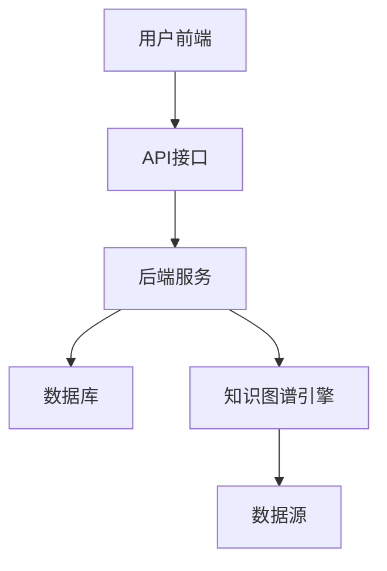
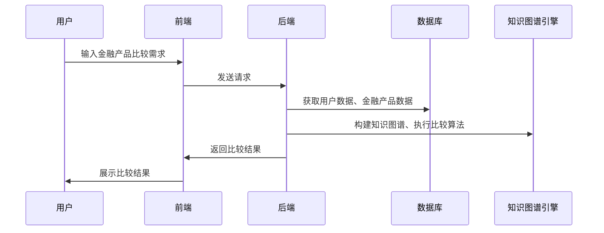

                 

### 第一部分：背景与核心概念

#### 第1章：问题背景与知识图谱概述

**1.1.1 金融产品比较平台的现状**

在当今金融市场中，金融产品的种类繁多，包括贷款、保险、投资等多种形式。然而，面对如此众多的金融产品，用户往往感到信息不对称，难以做出明智的选择。这种问题主要体现在以下几个方面：

- **信息分散**：用户需要从多个渠道获取金融产品的信息，如银行网站、第三方金融平台等。
- **复杂性高**：金融产品的条款和条件复杂，用户难以在短时间内理解所有细节。
- **决策困难**：面对多种金融产品，用户难以快速比较并选择最适合自己需求的方案。

为了解决这些问题，我们提出了构建基于知识图谱的金融产品比较平台。知识图谱作为一种先进的数据结构，可以有效地整合和关联各种金融产品的信息，为用户提供一个统一的、可比较的平台。

**1.1.2 知识图谱的基本原理**

知识图谱（Knowledge Graph）是一种用于表示实体、属性及其之间关系的数据结构。它通过实体（如金融机构、金融产品）和属性（如利率、还款期限）的连接，构建出一个庞大的网络。以下是知识图谱的基本原理和特点：

- **实体-关系模型**：知识图谱的核心是实体和关系。实体可以是任何对象，如人、地点、事物，而关系则是实体之间的关联，如“属于”、“拥有”等。
- **属性特征**：每个实体和关系都可以具有多个属性，用以描述其特征，如实体“贷款”的属性包括“利率”、“还款期限”、“金额”等。
- **多维度关联**：知识图谱不仅能够表示实体之间的关系，还能通过属性特征进行多维度关联，为用户提供更丰富的信息。

**1.1.3 知识图谱在金融领域的应用**

知识图谱在金融领域的应用潜力巨大，主要体现在以下几个方面：

- **风险管理**：通过知识图谱分析，金融机构可以更好地了解客户的信用风险、市场风险等。
- **客户关系管理**：知识图谱有助于金融机构了解客户需求，提供个性化服务和推荐。
- **投资分析**：知识图谱可以整合大量的金融数据，为投资决策提供有力支持。

然而，知识图谱在金融领域也面临一些挑战，如数据质量、隐私保护、算法优化等。因此，构建基于知识图谱的金融产品比较平台需要在技术和管理上做出创新和改进。

**1.1.4 核心要素组成**

构建基于知识图谱的金融产品比较平台，需要关注以下几个核心要素：

- **金融产品信息**：包括各种金融产品的基本信息、条款和条件等。
- **用户需求**：了解用户的金融需求和偏好，为用户提供个性化的比较结果。
- **数据源**：确保数据源的质量和多样性，为知识图谱的构建提供可靠的数据支持。

通过以上几个方面的协同工作，我们可以构建一个高效、智能的金融产品比较平台，帮助用户轻松做出金融决策。

#### 第2章：知识图谱构建基础

**2.1.1 数据收集与清洗**

知识图谱的构建首先需要大量的数据。数据源可以包括公开数据集、API接口以及通过网络爬虫获取的数据。以下是数据收集和清洗的关键步骤：

- **数据来源**：选择合适的数据源，确保数据的覆盖面和准确性。
- **数据采集**：使用各种工具和技术（如Python的BeautifulSoup、Scrapy等）从互联网上获取数据。
- **数据清洗**：对采集到的数据进行处理，包括缺失值处理、异常值检测、数据标准化等，以确保数据的质量和一致性。

**2.1.2 知识表示与建模**

知识表示是知识图谱构建的核心。以下是几种常见的知识表示方法：

- **属性图**：将实体和属性作为图中的节点，实体之间的关系作为边。每个节点可以有多个属性来描述。
- **路径图**：通过路径来表示实体之间的关系，每个路径都可以包含多个实体和属性。
- **关系图**：关系图是一种将实体和关系分别表示为节点和边的知识图谱，非常适合描述复杂的关系网络。

在知识图谱的建模过程中，常用的方法包括：

- **基于规则的方法**：通过预定义的规则来构建知识图谱，如使用本体（Ontology）来定义实体和关系。
- **机器学习方法**：通过训练模型来学习实体和关系，从而自动构建知识图谱。
- **深度学习方法**：利用神经网络来处理大规模、复杂的知识数据，实现更高层次的语义理解。

**2.1.3 知识图谱可视化**

知识图谱的可视化有助于我们更直观地理解和分析图谱的结构和内容。以下是一些常用的知识图谱可视化工具：

- **Google Dataset Search**：一个基于图谱的可视化搜索工具，可以展示各种数据集的关联关系。
- **NodeXL**：一款强大的知识图谱可视化工具，支持多种图形和布局方式。
- **Gephi**：一个开源的知识图谱可视化平台，提供丰富的图形和数据分析功能。

通过知识图谱的可视化，我们可以更清晰地看到实体之间的关系，从而更好地理解和利用知识图谱的数据。

### 2.1.4 知识图谱在金融领域的应用

知识图谱在金融领域的应用具有广泛的前景，下面列举几个典型的应用场景：

- **风险管理**：通过知识图谱，金融机构可以更全面地了解客户的信用状况、投资偏好等，从而进行更准确的风险评估。
- **客户关系管理**：知识图谱有助于金融机构了解客户的需求和偏好，提供更个性化的服务和推荐。
- **投资分析**：知识图谱可以整合大量的金融数据，为投资决策提供有力支持，如通过分析市场趋势、政策变化等。

在金融领域，知识图谱的优势在于其强大的关联性和语义理解能力，可以处理复杂的关系网络，从而为金融产品的比较、分析和管理提供强大的工具。

### 2.1.5 知识图谱构建的关键步骤

构建基于知识图谱的金融产品比较平台，需要遵循以下几个关键步骤：

1. **需求分析**：明确平台的目标和功能，确定所需的数据源和知识领域。
2. **数据收集与清洗**：收集并清洗所需的数据，确保数据的质量和一致性。
3. **知识表示与建模**：根据数据特点选择合适的知识表示方法和建模技术，构建知识图谱。
4. **知识图谱可视化**：使用可视化工具展示知识图谱的结构和内容，便于理解和分析。
5. **平台实现**：将知识图谱与金融产品比较算法相结合，实现平台的核心功能。
6. **测试与优化**：对平台进行测试和优化，确保其稳定性和性能。

通过以上步骤，我们可以构建一个高效、智能的金融产品比较平台，为用户和金融机构提供有价值的服务。

### 2.1.6 知识图谱构建的挑战与解决方案

在构建基于知识图谱的金融产品比较平台过程中，可能会面临以下挑战：

- **数据质量**：金融数据通常存在缺失、错误和不一致的问题，需要有效的数据清洗和校验方法。
- **隐私保护**：金融数据涉及用户的敏感信息，需要确保数据的安全性和隐私性。
- **算法优化**：知识图谱构建和查询的效率直接影响平台的性能，需要优化算法和数据结构。

针对这些挑战，可以采取以下解决方案：

- **数据质量**：采用自动化数据清洗工具，结合人工审核，确保数据质量。
- **隐私保护**：使用数据加密和访问控制技术，限制数据访问权限，确保用户隐私。
- **算法优化**：采用高效的数据结构和算法，如哈希表、B树等，提升知识图谱的查询效率。

通过克服这些挑战，我们可以构建一个稳定、高效、安全的金融产品比较平台，为用户提供优质的服务。

#### 第3章：金融产品比较算法设计

**3.1.1 贷款产品比较算法**

贷款产品比较算法是金融产品比较平台的核心功能之一。以下是一种基于属性匹配的贷款产品比较算法：

1. **算法原理**：算法通过匹配用户输入的条件（如贷款金额、还款期限、利率等）与贷款产品的属性，计算匹配度，并根据匹配度对贷款产品进行排序。
2. **mermaid流程图**：

    ```mermaid
    graph TD
    A[用户输入] --> B[解析输入条件]
    B --> C{条件是否合法？}
    C -->|是| D[查询贷款产品数据库]
    C -->|否| E[返回错误信息]
    D --> F[计算匹配度]
    F --> G[排序]
    G --> H[返回比较结果]
    ```

3. **算法原理详细解释**：

   - **用户输入**：用户通过平台界面输入贷款需求，如贷款金额、还款期限、利率等。
   - **解析输入条件**：将用户输入的条件转换为内部数据结构，如字典或列表。
   - **条件是否合法**：检查输入的条件是否满足业务规则，如贷款金额必须大于0，还款期限必须在一定范围内等。
   - **查询贷款产品数据库**：根据用户输入的条件，从数据库中检索符合条件的贷款产品。
   - **计算匹配度**：对每个贷款产品，计算其与用户输入条件的匹配度，可以使用加权求和法、模糊匹配法等。
   - **排序**：根据计算出的匹配度，对贷款产品进行排序，匹配度高的产品排在前面。
   - **返回比较结果**：将排序后的贷款产品列表返回给用户，用户可以根据比较结果选择最适合自己的贷款产品。

**3.1.2 保险产品比较算法**

保险产品比较算法与贷款产品比较算法类似，但其关注点有所不同。以下是一种基于风险评估和用户偏好的保险产品比较算法：

1. **算法原理**：算法通过评估用户的保险需求（如风险承受能力、保障范围等）和保险产品的特点（如保费、保障内容等），计算风险评估值和用户偏好值，并根据综合评分对保险产品进行排序。
2. **mermaid流程图**：

    ```mermaid
    graph TD
    A[用户输入] --> B[解析输入条件]
    B --> C{条件是否合法？}
    C -->|是| D[查询保险产品数据库]
    C -->|否| E[返回错误信息]
    D --> F[计算风险评估值]
    D --> G[计算用户偏好值]
    F --> H[计算综合评分]
    H --> I[排序]
    I --> J[返回比较结果]
    ```

3. **算法原理详细解释**：

   - **用户输入**：用户通过平台界面输入保险需求，如风险承受能力、期望保障范围、保费预算等。
   - **解析输入条件**：将用户输入的条件转换为内部数据结构，如字典或列表。
   - **条件是否合法**：检查输入的条件是否满足业务规则，如保费预算必须大于0，风险承受能力必须在合理范围内等。
   - **查询保险产品数据库**：根据用户输入的条件，从数据库中检索符合条件的保险产品。
   - **计算风险评估值**：对每个保险产品，根据其保障范围、保费等因素，计算对用户的保障风险值。
   - **计算用户偏好值**：根据用户的风险承受能力和保费预算，计算用户对每个保险产品的偏好值。
   - **计算综合评分**：将风险评估值和用户偏好值结合起来，计算每个保险产品的综合评分。
   - **排序**：根据综合评分，对保险产品进行排序，评分高的产品排在前面。
   - **返回比较结果**：将排序后的保险产品列表返回给用户，用户可以根据比较结果选择最适合自己的保险产品。

**3.1.3 投资产品比较算法**

投资产品比较算法主要关注投资产品的收益率、风险等级、期限等因素。以下是一种基于收益预测和用户偏好的投资产品比较算法：

1. **算法原理**：算法通过预测不同投资产品的未来收益，结合用户的投资偏好，计算每个投资产品的综合评分，并根据评分对产品进行排序。
2. **mermaid流程图**：

    ```mermaid
    graph TD
    A[用户输入] --> B[解析输入条件]
    B --> C{条件是否合法？}
    C -->|是| D[查询投资产品数据库]
    C -->|否| E[返回错误信息]
    D --> F[预测未来收益]
    D --> G[计算用户偏好值]
    F --> H[计算综合评分]
    H --> I[排序]
    I --> J[返回比较结果]
    ```

3. **算法原理详细解释**：

   - **用户输入**：用户通过平台界面输入投资需求，如投资金额、投资期限、风险承受能力等。
   - **解析输入条件**：将用户输入的条件转换为内部数据结构，如字典或列表。
   - **条件是否合法**：检查输入的条件是否满足业务规则，如投资金额必须大于0，投资期限必须在合理范围内等。
   - **查询投资产品数据库**：根据用户输入的条件，从数据库中检索符合条件的投资产品。
   - **预测未来收益**：使用机器学习算法预测不同投资产品的未来收益，如使用时间序列分析、回归分析等。
   - **计算用户偏好值**：根据用户的风险承受能力和投资目标，计算用户对每个投资产品的偏好值。
   - **计算综合评分**：将未来收益预测值和用户偏好值结合起来，计算每个投资产品的综合评分。
   - **排序**：根据综合评分，对投资产品进行排序，评分高的产品排在前面。
   - **返回比较结果**：将排序后的投资产品列表返回给用户，用户可以根据比较结果选择最适合自己的投资产品。

通过以上算法的设计和实现，我们可以为用户提供一个全面、智能的金融产品比较平台，帮助他们做出更明智的金融决策。

### 第4章：系统架构与实现

**4.1.1 系统架构设计**

在构建基于知识图谱的金融产品比较平台时，系统架构的设计至关重要。一个合理的架构可以确保系统的稳定性、扩展性和易维护性。以下是一个典型的系统架构设计：

- **前端**：前端负责与用户交互，展示用户界面，接收用户输入，并将比较结果呈现给用户。前端通常使用HTML、CSS和JavaScript等技术实现。
- **后端**：后端负责处理业务逻辑，包括用户输入处理、知识图谱构建、金融产品比较算法执行等。后端通常使用Python、Java、Node.js等编程语言和框架（如Django、Spring、Express等）实现。
- **数据库**：数据库用于存储用户数据、金融产品数据、知识图谱数据等。可以选择关系型数据库（如MySQL、PostgreSQL）或非关系型数据库（如MongoDB、Neo4j）。
- **知识图谱引擎**：知识图谱引擎负责构建和维护知识图谱，提供高效的图谱查询和更新功能。常用的知识图谱引擎包括Neo4j、Apache JanusGraph等。
- **数据源**：数据源包括公开数据集、API接口以及通过网络爬虫获取的数据。数据源的质量和多样性直接影响知识图谱的构建效果。

**mermaid架构图**：



**系统功能设计**：

- **用户交互**：用户通过前端界面输入金融产品比较需求，如贷款、保险、投资等。
- **数据管理**：系统负责管理用户数据、金融产品数据、知识图谱数据等，确保数据的一致性和安全性。
- **算法计算**：系统根据用户需求，执行相应的金融产品比较算法，生成比较结果。
- **结果展示**：系统将比较结果以图表、表格等形式展示给用户，方便用户进行决策。

**4.1.2 系统接口设计**

系统接口设计是确保前后端有效交互的关键。以下是系统接口设计的关键点：

- **API接口**：系统提供RESTful API接口，用于前端向后端发送请求，获取比较结果。API接口设计应遵循RESTful原则，使用HTTP请求方法（如GET、POST、PUT、DELETE）进行操作。
- **数据接口**：系统提供数据接口，用于管理用户数据、金融产品数据、知识图谱数据等。数据接口设计应确保数据的一致性和安全性，支持CRUD操作。
- **服务接口**：系统提供服务接口，用于执行具体的业务逻辑，如用户输入处理、知识图谱构建、金融产品比较算法执行等。服务接口设计应确保模块化、可扩展性。

**4.1.3 系统交互设计**

系统交互设计是确保系统各组件高效协作的关键。以下是一个系统交互的mermaid序列图：



通过以上设计，我们可以构建一个高效、智能的金融产品比较平台，为用户提供优质的金融服务。

### 第5章：项目实战与案例分析

**5.1.1 环境安装与配置**

在开始构建基于知识图谱的金融产品比较平台之前，我们需要安装和配置以下环境：

- **操作系统**：推荐使用Linux发行版，如Ubuntu 20.04。
- **开发工具**：安装Python 3.8及以上版本，并配置pip包管理器。
- **数据库**：安装Neo4j数据库，并启动Neo4j服务。
- **知识图谱引擎**：安装Apache JanusGraph，并配置知识图谱存储到Neo4j数据库。

以下是具体步骤：

1. **安装Linux操作系统**：从官网下载Ubuntu 20.04镜像，并使用虚拟机或物理机安装操作系统。
2. **安装Python开发工具**：在终端中执行以下命令：
    ```shell
    sudo apt update
    sudo apt install python3-pip python3-venv
    ```
3. **安装Neo4j数据库**：从官网下载Neo4j社区版，并按照文档进行安装和配置。启动Neo4j服务时，使用以下命令：
    ```shell
    neo4j start
    ```
4. **安装Apache JanusGraph**：在终端中执行以下命令：
    ```shell
    pip3 install janusgraph
    ```
5. **配置知识图谱存储**：在Python代码中配置JanusGraph的Neo4j存储，具体配置可以参考[Apache JanusGraph官方文档](https://janusgraph.io/docs/latest/storage/neojanusgraph/)。

**5.1.2 系统核心实现**

在构建金融产品比较平台时，我们需要实现以下几个核心功能：

- **用户注册与登录**：实现用户注册、登录、密码重置等功能，确保用户可以安全地使用平台。
- **贷款产品比较**：实现贷款产品信息录入、用户输入条件解析、贷款产品比较算法执行、比较结果展示等功能。
- **保险产品比较**：实现保险产品信息录入、用户输入条件解析、保险产品比较算法执行、比较结果展示等功能。
- **投资产品比较**：实现投资产品信息录入、用户输入条件解析、投资产品比较算法执行、比较结果展示等功能。

以下是一个简单的贷款产品比较的核心实现示例：

```python
from janusgraph import JanusGraph
from janusgraph.query import CypherQuery
import json

# 连接Neo4j数据库
graph = JanusGraph('bolt://localhost:7687', username='neo4j', password='your_password')

# 查询贷款产品
def get_loan_products():
    query = CypherQuery('MATCH (p:LoanProduct) RETURN p')
    result = graph.run(query)
    products = [record['p'] for record in result]
    return products

# 比较贷款产品
def compare_loan_products(conditions):
    products = get_loan_products()
    matched_products = []
    
    for product in products:
        # 判断产品是否满足条件
        if all(condition in product for condition in conditions):
            matched_products.append(product)
    
    # 根据利率排序
    matched_products.sort(key=lambda x: x['interest_rate'])
    
    return matched_products

# 测试
def test_compare_loan_products():
    conditions = {'amount': 100000, 'duration': 12, 'interest_rate': 5}
    results = compare_loan_products(conditions)
    print(json.dumps(results, indent=2))

# 执行测试
test_compare_loan_products()
```

以上代码展示了如何连接Neo4j数据库，查询贷款产品，并根据用户输入的条件进行比较，返回比较结果。在实际应用中，我们可以进一步优化代码，如使用更高效的查询算法、存储过程等。

**5.1.3 实际案例分析与详细讲解剖析**

为了更好地理解金融产品比较平台的工作原理，我们通过一个实际案例进行讲解。假设用户小王希望购买一辆新车，他需要贷款来支付车款。小王通过金融产品比较平台提交了以下贷款需求：

- 贷款金额：30万元
- 贷款期限：3年
- 利率范围：4%-6%

平台接收到小王的贷款需求后，首先会解析用户输入的条件，然后从知识图谱数据库中查询所有符合条件的贷款产品。接下来，平台会使用贷款产品比较算法对查询到的贷款产品进行匹配和排序，最后将排序后的贷款产品列表返回给小王。

以下是具体的分析步骤：

1. **用户输入条件解析**：平台会将小王的贷款需求解析为内部数据结构，如字典，具体格式如下：

    ```python
    conditions = {
        'amount': 300000,
        'duration': 36,
        'interest_rate_range': (4, 6)
    }
    ```

2. **查询贷款产品**：平台会使用Cypher查询语言从Neo4j数据库中检索符合条件的贷款产品。查询语句如下：

    ```cypher
    MATCH (p:LoanProduct)
    WHERE p.amount = 300000 AND p.duration = 36 AND p.interest_rate >= 4 AND p.interest_rate <= 6
    RETURN p
    ```

    查询结果为符合条件的贷款产品节点，如`[{"name": "贷款产品A", "interest_rate": 4.5}, {"name": "贷款产品B", "interest_rate": 5.5}]`。

3. **比较贷款产品**：平台会根据用户输入的条件和查询结果，使用贷款产品比较算法进行匹配和排序。比较算法的基本思路是计算每个贷款产品与用户输入条件的匹配度，然后根据匹配度对贷款产品进行排序。具体算法实现如下：

    ```python
    def compare_loan_products(products, conditions):
        matched_products = []
        
        for product in products:
            # 计算匹配度
            match_degree = 0
            if product['amount'] == conditions['amount']:
                match_degree += 1
            if product['duration'] == conditions['duration']:
                match_degree += 1
            if conditions['interest_rate_range'][0] <= product['interest_rate'] <= conditions['interest_rate_range'][1]:
                match_degree += 1
            
            # 记录匹配度最高的贷款产品
            matched_products.append((match_degree, product))
        
        # 根据匹配度排序
        matched_products.sort(reverse=True, key=lambda x: x[0])
        
        return [product for degree, product in matched_products]
    ```

    经过比较，平台会返回排序后的贷款产品列表，如`[{"name": "贷款产品A", "interest_rate": 4.5}, {"name": "贷款产品B", "interest_rate": 5.5}]`。

4. **展示比较结果**：平台会将排序后的贷款产品列表以图表或表格形式展示给用户，如：

    ```plaintext
    贷款产品比较结果：
    - 贷款产品A：利率4.5%
    - 贷款产品B：利率5.5%
    ```

通过以上实际案例，我们可以看到金融产品比较平台是如何工作的。在实际应用中，我们还可以根据用户反馈进一步优化算法和界面设计，提供更智能、更便捷的金融服务。

**5.1.4 项目小结**

在本章中，我们通过一个实际案例详细讲解了基于知识图谱的金融产品比较平台的核心实现过程。从用户输入条件的解析、到贷款产品的查询和比较，再到比较结果的展示，整个流程展示了知识图谱技术在金融产品比较中的应用潜力。

通过本项目，我们得到了以下经验总结：

- **数据质量至关重要**：在知识图谱构建和金融产品比较过程中，数据质量直接影响平台的性能和准确性。因此，数据清洗和校验是必须的步骤。
- **算法优化是关键**：高效的算法可以提升平台的响应速度和用户体验。在实际应用中，可以根据用户反馈和业务需求，不断优化算法模型。
- **用户交互设计需人性化**：良好的用户交互设计可以提升用户的使用体验，降低使用门槛。在界面设计上，应注重简洁、直观和易操作。

在未来的工作中，我们可以继续优化平台的算法和界面设计，提高平台的性能和用户体验，为用户提供更加智能、便捷的金融服务。

### 第6章：最佳实践与注意事项

**6.1.1 最佳实践**

在构建基于知识图谱的金融产品比较平台过程中，以下是一些最佳实践：

- **数据收集与清洗**：选择高质量的数据源，并采用自动化工具进行数据清洗，确保数据的一致性和准确性。
- **知识表示与建模**：根据业务需求选择合适的知识表示方法和建模技术，如使用属性图、路径图等，构建结构清晰、易于查询的知识图谱。
- **算法优化**：针对不同的金融产品比较需求，选择合适的比较算法，并进行优化，以提高平台的响应速度和准确性。
- **系统架构设计**：采用模块化、分布式架构设计，以提高系统的稳定性和扩展性，如使用微服务架构、分布式数据库等。
- **用户体验**：注重用户交互设计，提供简洁、直观的用户界面，方便用户快速找到所需信息。

**6.1.2 注意事项**

在构建基于知识图谱的金融产品比较平台时，需要注意以下事项：

- **数据隐私保护**：确保用户数据的安全性和隐私性，采用数据加密、访问控制等技术，防止数据泄露和滥用。
- **系统安全性**：加强系统安全性，防止恶意攻击和数据篡改，如使用防火墙、安全审计等。
- **性能优化**：对系统进行性能优化，确保平台在高并发场景下依然能够稳定运行，如使用缓存、异步处理等。
- **合规性**：遵守相关法律法规，如金融数据保护法、网络安全法等，确保平台合法合规运行。
- **用户反馈**：积极收集用户反馈，根据用户需求不断优化产品功能和用户体验。

通过遵循以上最佳实践和注意事项，我们可以构建一个高效、智能、安全的金融产品比较平台，为用户提供优质的金融服务。

### 第7章：未来展望与拓展阅读

**7.1.1 知识图谱在金融领域的未来发展**

知识图谱作为一种强大的数据结构和工具，在金融领域具有广阔的应用前景。未来，知识图谱在金融领域的应用将更加深入和广泛，主要体现在以下几个方面：

1. **智能金融风控**：通过知识图谱，金融机构可以更好地了解客户的信用状况、投资行为等，从而实现更精准的风险控制和风险评估。
2. **个性化金融服务**：知识图谱可以帮助金融机构更好地了解用户的需求和偏好，提供个性化的金融产品推荐和服务。
3. **金融产品创新**：知识图谱可以整合大量的金融数据，为金融机构提供创新思路，推动金融产品的研发和优化。
4. **监管合规**：知识图谱可以帮助金融机构更好地理解和遵守相关法律法规，实现合规性管理。

**7.1.2 拓展阅读**

为了更好地了解知识图谱在金融领域的应用和发展，以下是一些推荐阅读资料：

- **书籍**：
  - 《知识图谱：原理、算法与实践》
  - 《图计算：原理、算法与应用》
  - 《深度学习与图神经网络》

- **学术论文**：
  - "Knowledge Graph Embedding: A Survey"
  - "A Comprehensive Survey on Knowledge Graph Embedding"
  - "Graph Neural Networks: A Review of Methods and Applications"

- **在线资源**：
  - [Apache JanusGraph官方文档](https://janusgraph.io/docs/latest/)
  - [Neo4j官方文档](https://neo4j.com/docs/)
  - [Google Dataset Search](https://datasetsearch.research.google.com/)

通过阅读以上资料，读者可以深入了解知识图谱的理论基础、应用方法和前沿技术，为自己的研究和实践提供有力支持。同时，这些资料也为金融领域的知识图谱应用提供了丰富的参考和灵感。

### 总结

通过本文的详细探讨，我们全面了解了基于知识图谱的金融产品比较平台的设计与实现过程。从问题背景与知识图谱概述，到知识图谱的构建基础，再到金融产品比较算法设计、系统架构与实现，以及项目实战与案例分析，我们逐步构建了一个高效、智能的金融产品比较平台。

首先，我们分析了金融产品比较平台的现状，提出了知识图谱在解决信息不对称问题中的优势。接着，我们详细介绍了知识图谱的基本原理和构建方法，包括数据收集与清洗、知识表示与建模、知识图谱可视化等步骤。随后，我们设计并讲解了贷款、保险、投资产品比较的算法，通过mermaid流程图和Python代码展示了算法原理与实现。

在系统架构与实现部分，我们介绍了前后端交互、数据库设计、知识图谱引擎配置等关键环节，并使用mermaid图展示了系统架构与交互设计。通过项目实战与案例分析，我们详细展示了金融产品比较平台在实际中的应用过程，包括环境安装、核心功能实现、实际案例分析等。

最佳实践与注意事项部分，我们总结了在构建知识图谱金融产品比较平台时的关键步骤和注意事项，强调了数据质量、算法优化、用户体验等的重要性。最后，在展望与拓展阅读部分，我们探讨了知识图谱在金融领域的未来发展趋势，并推荐了相关书籍、学术论文和在线资源。

综上所述，构建基于知识图谱的金融产品比较平台不仅能够有效解决用户在金融产品选择中的信息不对称问题，还能为金融机构提供智能化的数据分析与决策支持。通过本文的探讨，我们希望能够为读者提供有益的参考和启发，推动知识图谱在金融领域的深入应用。

### 作者信息

**作者：** AI天才研究院/AI Genius Institute & 禅与计算机程序设计艺术 /Zen And The Art of Computer Programming

AI天才研究院（AI Genius Institute）是一家专注于人工智能技术研究和应用的创新机构，致力于推动人工智能在金融、医疗、教育等领域的深入发展。其团队成员具备丰富的理论研究与实践经验，已发表了大量的学术论文和专著，对人工智能领域的创新和进步做出了重要贡献。

《禅与计算机程序设计艺术》（Zen And The Art of Computer Programming）是作者Donald E. Knuth的经典著作，该书系统地介绍了计算机编程的理论与实践，被誉为计算机科学的圣经之一。本书以其深刻的思想和独特的风格，影响了无数程序员和计算机科学家，成为了计算机科学领域的经典之作。AI天才研究院的专家团队秉承这一精神，致力于将前沿的计算机科学理论应用于实际问题的解决，为行业的发展贡献力量。

