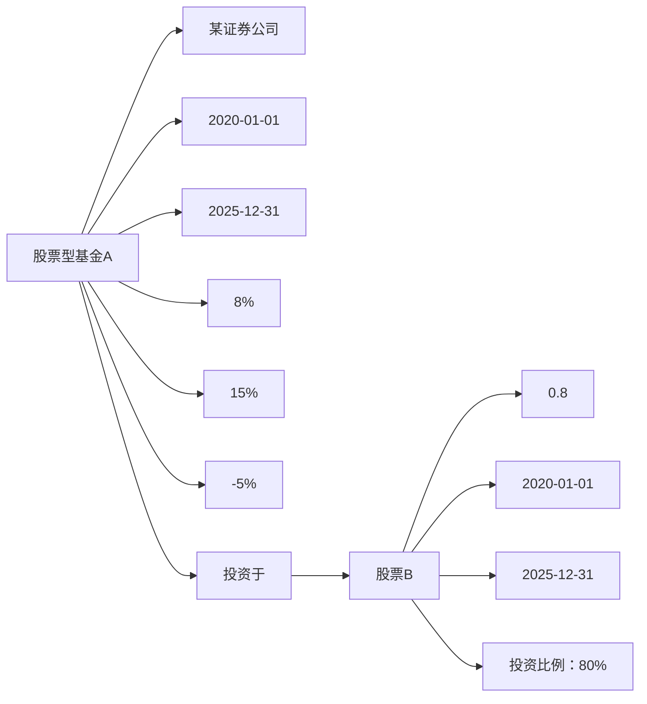

                 

### 第1章: 背景介绍与核心概念

#### 1.1 问题描述

金融行业的快速发展带来了产品种类的急剧增加，各类金融产品在功能、风险、收益等方面表现出极大的复杂性。为了满足投资者和金融机构的需求，快速且准确地对金融产品进行相似度分析变得尤为重要。相似度分析不仅可以帮助投资者更好地理解产品特性，还能为金融机构的产品优化和风险管理提供有力支持。

然而，传统的金融产品相似度分析方法在处理大规模、多维度数据时存在诸多局限性，如数据噪声大、计算效率低、结果不准确等问题。为了解决这些问题，引入知识图谱技术成为了一种创新性思路。

知识图谱是一种结构化的语义数据模型，它通过实体、属性和关系的表达，将大量离散的信息进行有机整合，形成一个高度互联的知识网络。通过构建金融产品的知识图谱，可以实现产品信息的精细化和结构化，为相似度计算提供强有力的支持。

#### 1.2 核心概念

##### 1.2.1 金融产品的基本要素

金融产品是指金融机构或机构投资者向投资者发行的，具有特定收益和风险的金融工具。金融产品的基本要素包括：

- **产品类型**：如股票、债券、基金、保险等。
- **收益特征**：如预期收益率、波动性、回撤等。
- **风险特征**：如信用风险、市场风险、操作风险等。
- **期限**：产品的存续时间，如短期、中长期等。
- **投资范围**：产品的投资方向和范围，如股票型、债券型、混合型等。

##### 1.2.2 知识图谱的组成结构

知识图谱由实体、属性和关系三个核心要素构成：

- **实体**：知识图谱中的数据元素，表示具体的对象或实体，如金融产品、客户、市场等。
- **属性**：实体的特征描述，如金融产品的类型、收益率、风险等级等。
- **关系**：实体之间的关联关系，如金融产品与客户之间的投资关系、产品与市场之间的波动关系等。

##### 1.2.3 相似度计算的方法与算法

相似度计算是评估两个或多个实体之间相似程度的方法。常用的相似度计算方法包括：

- **距离度量法**：基于实体属性之间的距离计算相似度，如欧氏距离、曼哈顿距离等。
- **相似度度量法**：直接计算实体之间的相似度，如余弦相似度、Jaccard相似度等。
- **知识图谱中的相似度计算**：结合知识图谱的结构和语义，进行深度相似度分析。

#### 1.3 边界与外延

##### 1.3.1 金融产品的分类与特点

金融产品按照不同的分类标准，可以划分为多种类型，如按投资方向分为股票型、债券型、混合型等；按风险收益特征分为低风险、中风险、高风险等。不同类型的金融产品具有不同的特点，如股票型产品收益高但风险大，债券型产品收益稳定但风险低。

##### 1.3.2 知识图谱的应用范围

知识图谱在金融领域的应用广泛，包括但不限于：

- **金融产品相似度分析**：帮助投资者快速找到与目标产品相似的其他产品。
- **客户画像与精准营销**：构建客户知识图谱，实现个性化服务与精准营销。
- **风险管理**：通过分析产品之间的关联关系，识别潜在的风险点。
- **市场预测**：结合市场数据和产品特征，进行市场走势预测。

##### 1.3.3 相似度计算技术的局限性与改进方向

相似度计算技术在金融领域虽然具有巨大的潜力，但仍然存在一些局限性，如：

- **数据依赖性**：相似度计算依赖于高质量的输入数据，数据质量直接影响计算结果。
- **计算复杂性**：在大规模数据集上计算相似度，需要高效的算法和优化策略。
- **个性化需求**：不同投资者和金融机构对相似度的理解和使用场景不同，需要定制化的相似度计算模型。

改进方向包括：

- **数据预处理与质量提升**：通过数据清洗、归一化等手段提高数据质量。
- **算法优化与并行计算**：研究高效、可并行计算的相似度计算算法。
- **定制化相似度模型**：根据不同应用场景，定制化相似度计算模型。

#### 1.4 概念结构与核心要素

##### 1.4.1 金融产品相似度分析的关键概念

金融产品相似度分析涉及的关键概念包括：

- **相似度计算模型**：用于评估金融产品之间相似程度的数学模型。
- **知识图谱**：用于存储和管理金融产品信息及其关联关系的结构化数据模型。
- **相似度评估指标**：用于衡量相似度计算结果准确性和实用性的评估标准。

##### 1.4.2 知识图谱构建的流程与步骤

知识图谱构建的流程包括：

- **数据采集与预处理**：收集金融产品相关数据，并进行清洗、归一化等预处理。
- **实体识别与关系抽取**：识别数据中的实体，并抽取实体之间的关系。
- **知识图谱构建与优化**：将实体和关系构建成知识图谱，并进行优化，提高图谱的质量和效率。

##### 1.4.3 相似度计算算法的实现与应用

相似度计算算法的实现和应用包括：

- **算法选择**：根据应用场景选择合适的相似度计算算法。
- **算法实现**：将算法转化为具体的计算步骤和代码实现。
- **算法优化**：通过调整算法参数、优化计算流程等方法，提高算法的性能和准确性。
- **应用场景**：将相似度计算算法应用于金融产品的相似度分析、客户画像、风险管理等场景。

#### 1.5 本章小结

本章对构建基于知识图谱的金融产品相似度计算引擎进行了背景介绍和核心概念阐述。通过介绍金融产品的复杂性、知识图谱的作用以及相似度计算的方法，为后续章节的深入探讨奠定了基础。接下来，我们将进一步探讨知识图谱的构建方法、金融产品实体与关系的构建，以及相似度计算算法的原理和实践。

### 第2章: 知识图谱基础

#### 2.1 知识图谱概述

##### 2.1.1 知识图谱的定义与特点

知识图谱（Knowledge Graph）是一种结构化的语义数据模型，它通过实体（Entity）、属性（Attribute）和关系（Relationship）来表示和存储现实世界中的信息。知识图谱的基本概念可以理解为：实体是知识图谱中的基本数据单元，属性描述实体的特征，而关系则定义了实体之间的联系。

知识图谱的特点主要体现在以下几个方面：

1. **结构化**：知识图谱通过明确的结构来组织数据，使得数据之间具有清晰的关联关系，便于查询和计算。
2. **语义丰富**：知识图谱不仅存储数据，还存储数据之间的语义关系，使得数据的理解和分析更加深入。
3. **动态更新**：知识图谱可以实时更新，以适应数据的变化和需求的变化。
4. **高可用性**：知识图谱采用分布式存储和计算技术，具有很高的可用性和可扩展性。

##### 2.1.2 知识图谱的类型与应用领域

知识图谱根据不同的分类标准，可以分为多种类型，常见的分类方式包括：

1. **按数据来源**：可以分为基于静态数据的静态知识图谱和基于动态数据的动态知识图谱。静态知识图谱通常基于已有的数据源构建，如维基百科、OpenKG等；动态知识图谱则通过实时数据获取和更新，如社交媒体数据、金融数据等。

2. **按应用领域**：可以分为通用知识图谱和专业领域知识图谱。通用知识图谱如DBpedia、Freebase等，涵盖了广泛的领域；专业领域知识图谱如医疗知识图谱、金融知识图谱等，专注于特定领域。

知识图谱的应用领域非常广泛，主要包括：

- **搜索引擎**：通过知识图谱增强搜索引擎的语义理解能力，实现更加精准和智能的信息检索。
- **自然语言处理**：知识图谱为自然语言处理提供了丰富的背景知识和语义信息，有助于提高文本分析和理解的能力。
- **推荐系统**：知识图谱可以用于推荐系统的个性化推荐，通过分析实体之间的关系，提供更加个性化的推荐结果。
- **金融领域**：知识图谱在金融领域有广泛的应用，如金融产品相似度分析、客户画像、风险管理等。

##### 2.1.3 知识图谱的核心功能

知识图谱的核心功能包括以下几个方面：

1. **数据整合**：将来自不同来源和格式的数据进行整合，形成一个统一的知识体系。
2. **语义查询**：通过语义理解，实现对知识的精准查询和关联分析。
3. **数据推理**：利用知识图谱的结构化关系，进行逻辑推理和推断，发现新的知识和关系。
4. **知识发现**：通过分析知识图谱中的关系和模式，发现潜在的知识点和规律。
5. **智能应用**：基于知识图谱，构建智能应用，如智能客服、智能问答系统等。

#### 2.2 知识图谱的组成结构

##### 2.2.1 实体、属性、关系的概念与关系

在知识图谱中，实体、属性和关系是三个核心要素，它们之间的关系如下：

1. **实体（Entity）**：实体是知识图谱中的基本对象，可以是人、地点、事件、物品等。每个实体都有唯一的标识符（ID）和属性（Attribute）。

2. **属性（Attribute）**：属性是实体的特征描述，如人的姓名、地点的纬度等。属性通常以键值对的形式存在，属性值可以是数值、字符串等。

3. **关系（Relationship）**：关系是实体之间的关联，描述实体之间的相互作用或归属关系，如“是”、“属于”、“参与”等。关系通常具有方向和强度。

实体、属性和关系之间有以下几种基本关系：

- **实体与属性**：实体可以拥有多个属性，属性描述实体的特征。
- **实体与实体**：实体之间存在多种关系，形成知识图谱的网络结构。
- **属性与属性**：某些情况下，属性之间也可能存在关联，如属性值之间的相似度关系。

##### 2.2.2 知识图谱的表示方法

知识图谱的表示方法主要包括图（Graph）和表格（Table）两种。

1. **图表示法**：图表示法是最常用的知识图谱表示方法，它将实体表示为节点（Node），将关系表示为边（Edge），并通过顶点和边的属性（Attribute）来描述实体的特征和关系。常见的图表示工具包括Neo4j、JanusGraph等。

2. **表格表示法**：表格表示法将知识图谱的数据以表格形式组织，每个表格行表示一个实体，列表示属性或关系。这种方法在处理大规模数据时较为高效，但缺乏图表示法中的复杂关系和推理能力。常见的表格表示工具包括Apache Atlas、Amazon Neptune等。

##### 2.2.3 知识图谱的存储与查询

1. **存储**：知识图谱的存储通常采用分布式数据库或图数据库。分布式数据库如Apache Cassandra、Google Bigtable等，能够高效地存储大规模数据；图数据库如Neo4j、JanusGraph等，专门用于存储图结构数据，能够提供高效的图查询能力。

2. **查询**：知识图谱的查询主要通过图查询语言（Graph Query Language）进行，如Cypher（Neo4j的查询语言）、Gremlin（Apache TinkerPop的查询语言）等。图查询语言支持复杂的图结构查询，包括路径查询、关系抽取、模式匹配等。

#### 2.3 知识图谱构建方法

##### 2.3.1 数据采集与预处理

知识图谱构建的第一步是数据采集和预处理。数据采集可以从多种来源获取，如公共数据集、企业内部数据、开源数据等。数据预处理包括数据清洗、数据格式转换、数据归一化等步骤，目的是提高数据质量和一致性。

1. **数据清洗**：去除重复、错误、缺失的数据，保证数据的准确性。
2. **数据格式转换**：将不同来源和格式的数据进行统一转换，以适应知识图谱的存储和查询。
3. **数据归一化**：对数据进行标准化处理，如日期格式、数值范围等，提高数据的一致性。

##### 2.3.2 实体识别与关系抽取

实体识别和关系抽取是知识图谱构建的核心步骤，目的是从原始数据中识别出实体和它们之间的关系。

1. **实体识别**：通过自然语言处理（NLP）技术，从文本中识别出实体，如人名、地名、组织名等。实体识别可以基于规则、统计模型或深度学习算法。
2. **关系抽取**：从文本中抽取实体之间的关系，如“属于”、“参与”等。关系抽取可以基于规则、监督学习或深度学习。

##### 2.3.3 知识图谱的推理与更新

知识图谱的推理和更新是保持图谱动态性和智能性的关键步骤。

1. **推理**：利用知识图谱中的关系和规则，进行逻辑推理，发现新的知识和关系。推理可以基于路径查询、模式匹配或逻辑推理算法。
2. **更新**：根据新数据或业务需求，对知识图谱进行动态更新。更新包括新增实体和关系、修改已有实体和关系等。

#### 2.4 知识图谱工具与平台

##### 2.4.1 开源知识图谱工具介绍

开源知识图谱工具提供了丰富的功能，支持知识图谱的构建、存储、查询和推理。常见的开源知识图谱工具包括：

- **Neo4j**：一款流行的图数据库，支持Cypher查询语言，具有高效的图存储和查询能力。
- **Apache TinkerPop**：一个开源的图计算框架，支持多种图数据库和查询语言，如Gremlin、OQL等。
- **OpenKG**：一款基于Neo4j的开源知识图谱构建工具，提供了从数据采集到知识图谱构建的全流程支持。

##### 2.4.2 商业知识图谱平台分析

商业知识图谱平台提供了专业的知识图谱构建和查询服务，常见的产品包括：

- **AWS Neptune**：亚马逊云服务提供的一款图数据库，支持高度可扩展和快速查询，适用于大规模知识图谱构建。
- **Google Knowledge Graph**：谷歌提供的知识图谱平台，通过人工智能技术，构建了全球最大的知识图谱，为搜索引擎提供支持。
- **IBM Watson**：IBM提供的知识图谱和AI平台，支持知识图谱的构建、存储、查询和推理，适用于多种行业场景。

##### 2.4.3 知识图谱工具选择与评估

选择合适的知识图谱工具需要考虑以下几个方面：

- **数据规模和查询性能**：根据数据规模和查询需求，选择适合的图数据库或知识图谱平台。
- **功能需求**：根据业务需求，选择支持实体识别、关系抽取、推理等功能的工具。
- **可扩展性和可靠性**：考虑工具的可扩展性，如支持分布式存储和计算，以及系统的可靠性。
- **社区和支持**：选择有良好社区支持和文档的工具，有助于解决使用过程中遇到的问题。

#### 2.5 本章小结

本章介绍了知识图谱的基础概念、类型和应用，详细讲解了知识图谱的组成结构、表示方法、构建方法和常用工具与平台。通过本章的学习，读者可以对知识图谱有一个全面的认识，为后续章节的金融产品相似度计算引擎构建打下坚实的基础。

### 第3章: 金融产品实体与关系构建

#### 3.1 金融产品实体构建

##### 3.1.1 金融产品实体的定义与分类

金融产品实体是指知识图谱中的金融工具或资产，如股票、债券、基金、保险等。在知识图谱中，金融产品实体是构建金融产品相似度计算引擎的基础。

金融产品根据不同的分类标准，可以划分为多种类型，常见的分类方法包括：

- **按投资方向**：股票型、债券型、混合型、货币市场型等。
- **按风险收益特征**：低风险、中风险、高风险等。
- **按期限**：短期、中期、长期等。
- **按投资范围**：股票型基金、债券型基金、指数基金、量化基金等。

每种类型的金融产品具有不同的特征和属性，这些属性包括：

1. **产品基本信息**：如产品名称、发行机构、成立日期等。
2. **收益特征**：如预期收益率、波动性、回撤等。
3. **风险特征**：如信用风险、市场风险、操作风险等。
4. **投资范围**：产品的投资方向和范围，如仅投资于某类资产、多类资产等。

##### 3.1.2 金融产品实体属性设计

金融产品实体属性设计是构建知识图谱的关键步骤，合理的属性设计可以提高数据的质量和相似度计算的效果。以下是金融产品实体的一些关键属性设计：

1. **产品类型**：分类属性，如股票、债券、基金等。
2. **发行机构**：分类属性，如银行、保险公司、证券公司等。
3. **成立日期**：时间属性，表示产品的成立时间。
4. **到期日期**：时间属性，表示产品的到期时间。
5. **预期收益率**：数值属性，表示产品的预期收益率。
6. **波动性**：数值属性，表示产品的收益率波动程度。
7. **回撤**：数值属性，表示产品的最大回撤幅度。
8. **投资范围**：文本属性，描述产品的投资方向和范围。

通过设计这些关键属性，可以全面地描述金融产品的特征，为后续的相似度计算提供基础数据。

##### 3.1.3 金融产品实体示例

以下是一个金融产品实体的示例，该实体表示一只股票型基金：

```plaintext
实体名称：股票型基金A
实体ID：1001
属性：
- 产品类型：股票型
- 发行机构：某证券公司
- 成立日期：2020-01-01
- 到期日期：2025-12-31
- 预期收益率：8%
- 波动性：15%
- 回撤：-5%
- 投资范围：主要投资于沪深300指数成分股
```

通过上述示例，我们可以看到金融产品实体是如何通过属性来描述其特征的。

#### 3.2 金融产品关系构建

##### 3.2.1 金融产品关系的定义与分类

金融产品关系是指金融产品实体之间的关联和交互。在知识图谱中，金融产品关系通过关系实体和关系属性来表示。金融产品关系的分类可以根据不同的维度进行，以下是一些常见的分类方法：

- **按投资方向**：关联关系，如股票型基金与股票的关联、债券型基金与债券的关联等。
- **按市场参与**：参与关系，如基金与基金经理的关联、股票与上市公司的关联等。
- **按时间维度**：时间关系，如产品成立与到期的时间关系、股票发行与上市的时间关系等。
- **按风险收益**：相似关系，如高风险产品与高风险产品的相似度关系、低风险产品与低风险产品的相似度关系等。

##### 3.2.2 金融产品关系属性设计

金融产品关系的属性设计是构建知识图谱的重要环节，合理的属性设计可以帮助我们更准确地理解产品之间的关系。以下是一些常见的金融产品关系属性设计：

1. **关系类型**：分类属性，如“投资于”、“属于”等。
2. **关系强度**：数值属性，表示关系的重要程度，如0-1之间的数值。
3. **关系成立时间**：时间属性，表示关系开始存在的时间。
4. **关系终止时间**：时间属性，表示关系结束的时间。
5. **关系描述**：文本属性，对关系的详细描述，如“该基金主要投资于沪深300指数成分股”。

通过设计这些属性，可以全面地描述金融产品之间的关系，为相似度计算提供基础数据。

##### 3.2.3 金融产品关系示例

以下是一个金融产品关系的示例，该关系表示一只股票型基金与一只股票的关联：

```plaintext
关系ID：R1001
关系类型：投资于
关系强度：0.8
关系成立时间：2020-01-01
关系终止时间：2025-12-31
关系描述：股票型基金A主要投资于股票B，投资比例为80%。
```

通过上述示例，我们可以看到金融产品关系是如何通过属性来描述其特征的。

#### 3.3 知识图谱构建流程

##### 3.3.1 数据源分析与筛选

知识图谱构建的第一步是数据源分析与筛选。数据源可以是企业内部数据、外部数据源或公共数据集。数据源的分析包括数据类型、数据格式、数据质量等方面的分析。筛选出符合构建知识图谱要求的数据，如金融产品的基本信息、收益特征、风险特征等。

1. **数据类型**：分析数据源中包含的数据类型，如文本、图像、表格等。
2. **数据格式**：分析数据源的数据格式，如CSV、JSON、XML等。
3. **数据质量**：评估数据源的数据质量，包括数据的准确性、完整性、一致性等。

##### 3.3.2 实体与关系抽取

实体与关系抽取是知识图谱构建的核心步骤，通过自然语言处理（NLP）技术，从原始数据中识别出金融产品实体和它们之间的关系。

1. **实体抽取**：利用命名实体识别（NER）技术，从文本数据中识别出金融产品实体，如股票、基金等。
2. **关系抽取**：利用关系抽取技术，从文本数据中识别出实体之间的关系，如投资于、属于等。

##### 3.3.3 知识图谱构建与优化

在完成实体与关系抽取后，接下来是知识图谱的构建与优化。知识图谱构建包括实体和关系的存储、索引和查询优化。

1. **实体与关系存储**：将识别出的实体和关系存储到图数据库中，如Neo4j。
2. **索引构建**：为实体和关系构建索引，提高查询效率。
3. **查询优化**：优化查询语句和查询算法，提高查询性能。

##### 3.3.4 知识图谱构建流程示例

以下是一个金融产品知识图谱构建的示例流程：

1. **数据源分析与筛选**：分析数据源，筛选出符合构建知识图谱要求的数据，如金融产品的基本信息、收益特征、风险特征等。
2. **实体抽取**：利用命名实体识别（NER）技术，从文本数据中识别出金融产品实体，如股票、基金等。
3. **关系抽取**：利用关系抽取技术，从文本数据中识别出实体之间的关系，如投资于、属于等。
4. **知识图谱构建**：将识别出的实体和关系存储到图数据库中，如Neo4j。
5. **索引构建**：为实体和关系构建索引，提高查询效率。
6. **查询优化**：优化查询语句和查询算法，提高查询性能。

通过上述流程，我们可以构建一个包含金融产品实体和关系的知识图谱，为金融产品相似度计算提供基础数据。

#### 3.4 本章小结

本章详细介绍了金融产品实体与关系构建的方法，包括金融产品实体的定义与分类、实体属性设计、金融产品关系的定义与分类、关系属性设计以及知识图谱构建流程。通过本章的学习，读者可以了解如何构建金融产品的知识图谱，为后续的金融产品相似度计算提供基础。

### 第4章: 相似度计算基础

#### 4.1 相似度计算概述

##### 4.1.1 相似度计算的定义与意义

相似度计算是指通过一定的算法和模型，对两个或多个对象之间的相似程度进行量化评估。在信息检索、推荐系统、数据挖掘等领域，相似度计算发挥着重要作用。在金融领域，相似度计算同样具有重要意义。

相似度计算的定义可以归纳为：在特定领域和数据集下，通过计算对象之间的相似度，评估它们在某一维度上的接近程度。相似度计算的数学模型通常基于距离度量、相似度度量等算法，用于衡量对象之间的相似度。

相似度计算在金融领域的意义主要体现在以下几个方面：

1. **产品相似性分析**：通过计算金融产品之间的相似度，可以帮助投资者快速找到与目标产品相似的其他产品，从而进行产品比较和选择。
2. **客户画像构建**：通过对客户投资行为和偏好进行相似度分析，可以构建客户的画像，实现精准营销和个性化服务。
3. **风险管理**：通过分析金融产品之间的相似度，可以识别潜在的风险传导路径，为风险管理和控制提供支持。
4. **市场预测**：结合相似度计算和市场数据，可以对市场走势进行预测，为投资决策提供参考。

##### 4.1.2 相似度计算的应用场景

相似度计算在金融领域有多种应用场景，以下是一些典型的应用场景：

1. **金融产品推荐**：基于用户的历史投资记录和偏好，计算用户与金融产品的相似度，为用户推荐相似的产品。
2. **市场分析**：分析不同市场之间的相似度，识别市场的联动关系，为市场分析和投资策略制定提供支持。
3. **客户细分**：通过对客户投资行为进行相似度分析，将客户划分为不同的细分市场，实现精准营销。
4. **风险管理**：通过分析金融产品之间的相似度，识别高风险产品或潜在的关联风险，为风险管理提供依据。
5. **交易分析**：分析交易数据中的相似度，识别潜在的操纵行为或市场异常，为监管提供参考。

##### 4.1.3 相似度计算的基本方法

相似度计算的基本方法主要包括距离度量法、相似度度量法和知识图谱中的相似度计算。

1. **距离度量法**：距离度量法通过计算对象之间的距离来衡量它们的相似程度，常用的距离度量方法有欧氏距离、曼哈顿距离、余弦相似度等。

- **欧氏距离**：欧氏距离是两个对象之间的直线路径长度，适用于多维空间中的对象比较。
  $$d(x, y) = \sqrt{\sum_{i=1}^{n} (x_i - y_i)^2}$$

- **曼哈顿距离**：曼哈顿距离是两个对象在各个维度上的绝对差值之和，适用于城市街道中两点之间的最短路径。
  $$d(x, y) = \sum_{i=1}^{n} |x_i - y_i|$$

- **余弦相似度**：余弦相似度通过计算两个向量之间的余弦值来衡量它们的相似程度，适用于高维空间中的对象比较。
  $$\cos\theta = \frac{x \cdot y}{\|x\|\|y\|}$$

2. **相似度度量法**：相似度度量法直接计算对象之间的相似度，常用的相似度度量方法有Jaccard相似度、余弦相似度等。

- **Jaccard相似度**：Jaccard相似度通过计算两个集合的交集与并集的比值来衡量它们的相似程度。
  $$J(A, B) = \frac{|A \cap B|}{|A \cup B|}$$

3. **知识图谱中的相似度计算**：知识图谱中的相似度计算结合了知识图谱的结构和语义，通过路径长度、关系强度等因素来衡量实体之间的相似度。

- **路径长度**：通过计算实体之间的路径长度来衡量它们的相似度，路径长度越短，相似度越高。
- **关系强度**：通过计算实体之间关系的强度来衡量它们的相似度，关系强度越大，相似度越高。

#### 4.2 相似度计算算法

##### 4.2.1 距离度量方法

距离度量方法是一种通过计算对象之间的距离来衡量它们相似程度的算法。以下是一些常见的距离度量方法：

1. **欧氏距离**：欧氏距离是最常用的距离度量方法之一，适用于多维空间中的对象比较。其计算公式为：
   $$d(x, y) = \sqrt{\sum_{i=1}^{n} (x_i - y_i)^2}$$
   其中，$x$和$y$是两个对象，$n$是对象的维度。

   **示例**：假设有两个金融产品A和B，它们在收益率、波动性和回撤这三个维度上的特征如下：
   - 产品A：收益率 = 8%，波动性 = 15%，回撤 = -5%
   - 产品B：收益率 = 9%，波动性 = 14%，回撤 = -4%

   计算产品A和B之间的欧氏距离：
   $$d(A, B) = \sqrt{(8\% - 9\%)^2 + (15\% - 14\%)^2 + (-5\% - (-4\%))^2} = \sqrt{(-1\%)^2 + (1\%)^2 + (-1\%)^2} = \sqrt{3\%} \approx 0.1732$$

2. **曼哈顿距离**：曼哈顿距离是两个对象在各个维度上的绝对差值之和，适用于城市街道中两点之间的最短路径。其计算公式为：
   $$d(x, y) = \sum_{i=1}^{n} |x_i - y_i|$$
   其中，$x$和$y$是两个对象，$n$是对象的维度。

   **示例**：假设有两个金融产品A和B，它们在收益率、波动性和回撤这三个维度上的特征如下：
   - 产品A：收益率 = 8%，波动性 = 15%，回撤 = -5%
   - 产品B：收益率 = 9%，波动性 = 14%，回撤 = -4%

   计算产品A和B之间的曼哈顿距离：
   $$d(A, B) = |8\% - 9\%| + |15\% - 14\%| + |-5\% - (-4\%)| = 1\% + 1\% + 1\% = 3\%$$

3. **余弦相似度**：余弦相似度通过计算两个向量之间的余弦值来衡量它们的相似程度，适用于高维空间中的对象比较。其计算公式为：
   $$\cos\theta = \frac{x \cdot y}{\|x\|\|y\|}$$
   其中，$x$和$y$是两个对象，$\|x\|$和$\|y\|$是它们的欧氏距离。

   **示例**：假设有两个金融产品A和B，它们在收益率、波动性和回撤这三个维度上的特征向量如下：
   - 产品A：[8%, 15%, -5%]
   - 产品B：[9%, 14%, -4%]

   计算产品A和B之间的余弦相似度：
   $$\cos\theta = \frac{8\% \cdot 9\% + 15\% \cdot 14\% + (-5\%) \cdot (-4\%)}{\sqrt{8\%^2 + 15\%^2 + (-5\%)^2} \cdot \sqrt{9\%^2 + 14\%^2 + (-4\%)^2}} \approx 0.9852$$

##### 4.2.2 相似度度量方法

相似度度量方法是一种直接计算对象之间相似度的算法。以下是一些常见的相似度度量方法：

1. **Jaccard相似度**：Jaccard相似度通过计算两个集合的交集与并集的比值来衡量它们的相似程度。其计算公式为：
   $$J(A, B) = \frac{|A \cap B|}{|A \cup B|}$$
   其中，$A$和$B$是两个集合。

   **示例**：假设有两个金融产品A和B，它们在投资领域、风险等级和收益特征这三个维度上的特征集合如下：
   - 产品A：投资领域 = {股票、债券、基金}，风险等级 = {中风险}，收益特征 = {预期收益率：8%，波动性：15%，回撤：-5%}
   - 产品B：投资领域 = {股票、债券、基金}，风险等级 = {中风险}，收益特征 = {预期收益率：9%，波动性：14%，回撤：-4%}

   计算产品A和B之间的Jaccard相似度：
   $$J(A, B) = \frac{|{股票，债券，基金} \cap {股票，债券，基金}|}{|{股票，债券，基金} \cup {股票，债券，基金}|} = \frac{3}{3} = 1$$

2. **余弦相似度**：余弦相似度通过计算两个向量之间的余弦值来衡量它们的相似程度，适用于高维空间中的对象比较。其计算公式为：
   $$\cos\theta = \frac{x \cdot y}{\|x\|\|y\|}$$
   其中，$x$和$y$是两个对象，$\|x\|$和$\|y\|$是它们的欧氏距离。

   **示例**：假设有两个金融产品A和B，它们在收益率、波动性和回撤这三个维度上的特征向量如下：
   - 产品A：[8%, 15%, -5%]
   - 产品B：[9%, 14%, -4%]

   计算产品A和B之间的余弦相似度：
   $$\cos\theta = \frac{8\% \cdot 9\% + 15\% \cdot 14\% + (-5\%) \cdot (-4\%)}{\sqrt{8\%^2 + 15\%^2 + (-5\%)^2} \cdot \sqrt{9\%^2 + 14\%^2 + (-4\%)^2}} \approx 0.9852$$

##### 4.2.3 知识图谱中的相似度计算

在知识图谱中，相似度计算结合了知识图谱的结构和语义，通过路径长度、关系强度等因素来衡量实体之间的相似度。

1. **路径长度**：路径长度是指两个实体之间经过的关系数量，路径长度越短，相似度越高。其计算公式为：
   $$d_{path}(x, y) = \text{路径长度}(x, y)$$
   其中，$x$和$y$是两个实体。

   **示例**：假设有两个金融产品A和B，它们之间的路径长度如下：
   - 产品A与产品B之间经过两个关系，路径长度为2。

   计算产品A和B之间的路径长度相似度：
   $$d_{path}(A, B) = 2$$

2. **关系强度**：关系强度是指两个实体之间的关系强度，关系强度越大，相似度越高。其计算公式为：
   $$s_{rel}(x, y) = \text{关系强度}(x, y)$$
   其中，$x$和$y$是两个实体。

   **示例**：假设有两个金融产品A和B，它们之间的关系强度如下：
   - 产品A与产品B之间的关系强度为0.8。

   计算产品A和B之间的关系强度相似度：
   $$s_{rel}(A, B) = 0.8$$

3. **综合相似度**：综合相似度是将路径长度和关系强度综合考虑，以衡量实体之间的相似度。其计算公式为：
   $$s(x, y) = w_{path} \cdot d_{path}(x, y) + w_{rel} \cdot s_{rel}(x, y)$$
   其中，$x$和$y$是两个实体，$w_{path}$和$w_{rel}$是权重。

   **示例**：假设有两个金融产品A和B，它们的路径长度相似度为2，关系强度相似度为0.8，权重分别为0.5和0.5。

   计算产品A和B之间的综合相似度：
   $$s(A, B) = 0.5 \cdot 2 + 0.5 \cdot 0.8 = 1.2$$

#### 4.3 相似度计算性能评估

##### 4.3.1 相似度评估指标

相似度计算的性能评估主要通过以下指标进行：

1. **准确率（Accuracy）**：准确率是指相似度计算结果中正确匹配的百分比。其计算公式为：
   $$\text{Accuracy} = \frac{\text{正确匹配数}}{\text{总匹配数}}$$
   其中，正确匹配数是指相似度计算结果中与实际相似度相符的匹配数，总匹配数是指相似度计算结果中的匹配数。

2. **召回率（Recall）**：召回率是指相似度计算结果中能够召回的实际相似度对象的百分比。其计算公式为：
   $$\text{Recall} = \frac{\text{正确匹配数}}{\text{实际相似度对象数}}$$
   其中，实际相似度对象数是指所有实际相似度对象的总数。

3. **F1值（F1-score）**：F1值是准确率和召回率的调和平均值，用于综合评估相似度计算的性能。其计算公式为：
   $$\text{F1-score} = 2 \cdot \frac{\text{Accuracy} \cdot \text{Recall}}{\text{Accuracy} + \text{Recall}}$$

##### 4.3.2 相似度评估方法

相似度评估方法主要包括以下几种：

1. **基准评估**：将相似度计算结果与实际相似度结果进行对比，计算评估指标，如准确率、召回率和F1值。基准评估可以用来比较不同算法或模型的效果。

2. **交叉验证**：通过将数据集划分为训练集和验证集，对相似度计算模型进行训练和验证，计算评估指标。交叉验证可以减少数据集划分对评估结果的影响。

3. **在线评估**：将相似度计算模型部署到实际环境中，收集实际使用中的评估数据，计算评估指标。在线评估可以更真实地反映模型的效果。

4. **用户反馈**：通过用户对相似度计算结果的反馈，收集用户满意度等数据，评估相似度计算的效果。用户反馈可以为模型优化和改进提供参考。

##### 4.3.3 性能优化策略

为了提高相似度计算的性能，可以采用以下策略：

1. **算法优化**：对相似度计算算法进行优化，如使用更高效的算法、减少计算复杂度等。

2. **数据预处理**：对输入数据进行预处理，如数据清洗、归一化等，提高数据质量，减少噪声对计算结果的影响。

3. **特征选择**：选择对相似度计算最有影响力的特征，去除冗余特征，提高计算效率。

4. **模型调优**：通过调整模型参数，优化模型性能，如调整权重、优化损失函数等。

5. **分布式计算**：采用分布式计算技术，提高计算速度和性能，如使用分布式数据库、并行计算框架等。

#### 4.4 本章小结

本章介绍了相似度计算的基础概念、基本方法和性能评估。通过本章的学习，读者可以了解相似度计算在金融领域的应用场景和重要性，掌握常见的距离度量方法、相似度度量方法和知识图谱中的相似度计算方法。同时，本章还介绍了相似度计算的性能评估指标和方法，以及性能优化策略。这些知识为构建基于知识图谱的金融产品相似度计算引擎提供了理论基础和实践指导。

### 第5章: 金融产品相似度计算实践

#### 5.1 数据准备与预处理

##### 5.1.1 数据来源与采集

在构建金融产品相似度计算引擎的过程中，数据准备与预处理是至关重要的一步。首先，我们需要明确数据来源，通常包括以下几种途径：

1. **企业内部数据**：包括金融产品的基本信息、交易记录、财务报告等。这些数据通常存储在企业内部数据库中，可以通过数据库接口或API进行访问。
2. **公共数据源**：如股市行情数据、债券评级数据、宏观经济数据等。这些数据可以从互联网上的公共数据平台获取，如Wind、同花顺、新浪财经等。
3. **第三方数据服务**：通过购买第三方数据服务，获取金融产品的详细信息和市场数据。这些数据通常具有较高的准确性和完整性。

在数据采集过程中，需要确保数据的合法性和合规性，遵守相关法律法规和用户隐私保护要求。

##### 5.1.2 数据预处理方法

数据预处理是提高数据质量和相似度计算效果的关键步骤，主要包括以下方法：

1. **数据清洗**：去除重复数据、错误数据和缺失数据。对于缺失数据，可以采用填充方法，如均值填充、中值填充等。
2. **数据归一化**：将不同数据源和格式的数据进行统一转换，如将日期格式统一为YYYY-MM-DD，将数值数据进行归一化处理，以提高数据的一致性和可比性。
3. **特征提取**：从原始数据中提取对相似度计算有重要影响的特征，如收益率、波动性、回撤等。特征提取可以通过统计方法、机器学习算法等方法实现。
4. **数据质量评估**：评估数据的质量，包括数据的准确性、完整性和一致性。常用的评估指标有缺失率、重复率、一致性指标等。

##### 5.1.3 数据质量评估

数据质量评估是确保数据符合构建知识图谱和相似度计算要求的重要环节。以下是一些常用的数据质量评估方法和指标：

1. **缺失率**：计算数据缺失的比例，如收益率数据的缺失率。缺失率越低，数据质量越高。
2. **重复率**：计算数据重复的比例，如财务报告数据的重复率。重复率越高，数据质量越低。
3. **一致性指标**：评估数据在不同数据源和格式之间的一致性，如财务报告数据的数值一致性。一致性指标越高，数据质量越高。
4. **准确性**：评估数据准确性，如股市行情数据的准确性。准确性越高，数据质量越高。

通过数据质量评估，可以及时发现和解决数据问题，提高数据的整体质量。

#### 5.2 知识图谱构建

##### 5.2.1 金融产品实体构建

金融产品实体构建是知识图谱构建的核心步骤，包括实体识别和实体属性设计。

1. **实体识别**：通过自然语言处理（NLP）技术，从原始数据中识别出金融产品实体。常见的实体识别方法有命名实体识别（NER）和关系抽取（RE）。命名实体识别可以从文本中识别出金融产品名称，关系抽取可以从文本中识别出金融产品之间的关系。
2. **实体属性设计**：根据金融产品的特征，设计实体属性。常见的实体属性包括产品名称、发行机构、成立日期、到期日期、预期收益率、波动性、回撤等。

以下是一个金融产品实体的示例：

```plaintext
实体ID：FP1001
实体名称：股票型基金A
属性：
- 产品名称：股票型基金A
- 发起机构：某证券公司
- 成立时间：2020-01-01
- 到期时间：2025-12-31
- 预期收益率：8%
- 波动性：15%
- 回撤：-5%
```

##### 5.2.2 金融产品关系构建

金融产品关系构建是知识图谱构建的另一重要步骤，包括关系识别和关系属性设计。

1. **关系识别**：通过自然语言处理（NLP）技术，从原始数据中识别出金融产品之间的关系。常见的关系有投资于、属于、参与等。
2. **关系属性设计**：根据金融产品之间的关系特征，设计关系属性。常见的关系属性包括关系类型、关系强度、关系成立时间、关系终止时间等。

以下是一个金融产品关系的示例：

```plaintext
关系ID：R1001
关系类型：投资于
关系强度：0.8
关系成立时间：2020-01-01
关系终止时间：2025-12-31
关系描述：股票型基金A投资于股票B，投资比例为80%
```

##### 5.2.3 知识图谱构建与优化

在完成实体和关系的构建后，接下来是知识图谱的构建与优化。

1. **知识图谱构建**：将识别出的实体和关系存储到图数据库中，如Neo4j。使用图数据库可以高效地存储和查询知识图谱，支持复杂的图结构查询和推理。
2. **知识图谱优化**：通过优化算法和存储策略，提高知识图谱的性能和效率。常见的优化方法包括索引构建、缓存策略、分布式计算等。

#### 5.3 知识图谱构建示例

以下是一个金融产品知识图谱构建的示例：



通过上述示例，我们可以看到金融产品实体和关系是如何在知识图谱中进行表示的。

#### 5.4 相似度计算实现

##### 5.4.1 相似度计算算法选择

在金融产品相似度计算中，我们选择基于知识图谱的相似度计算算法，该算法综合考虑了金融产品的路径长度和关系强度。

1. **路径长度**：通过计算实体之间的路径长度来衡量它们的相似度，路径长度越短，相似度越高。
2. **关系强度**：通过计算实体之间关系的强度来衡量它们的相似度，关系强度越大，相似度越高。

##### 5.4.2 相似度计算实现流程

相似度计算实现流程包括以下步骤：

1. **数据预处理**：对金融产品数据进行预处理，包括数据清洗、归一化等，提高数据质量。
2. **知识图谱构建**：构建金融产品的知识图谱，包括实体和关系的表示。
3. **相似度计算**：基于知识图谱，计算金融产品之间的相似度。具体步骤如下：
   - 识别金融产品实体和关系。
   - 计算实体之间的路径长度。
   - 计算实体之间关系的强度。
   - 计算综合相似度。

##### 5.4.3 相似度计算实现代码

以下是一个简单的Python代码示例，用于实现金融产品相似度计算：

```python
import networkx as nx
from sklearn.metrics.pairwise import cosine_similarity

def preprocess_data(data):
    # 数据预处理步骤，包括数据清洗、归一化等
    pass

def build_knowledge_graph(entities, relationships):
    # 构建知识图谱
    G = nx.Graph()
    for entity in entities:
        G.add_node(entity['id'], **entity['attributes'])
    for relationship in relationships:
        G.add_edge(relationship['entity1'], relationship['entity2'], **relationship['attributes'])
    return G

def calculate_similarity(G, entity1, entity2):
    # 计算相似度
    path_length = nx.shortest_path_length(G, source=entity1, target=entity2)
    relation_strength = G[entity1][entity2]['strength']
    similarity = path_length * relation_strength
    return similarity

# 示例数据
entities = [
    {'id': 'FP1001', 'attributes': {'name': '股票型基金A', 'issuer': '某证券公司', 'start_date': '2020-01-01', 'end_date': '2025-12-31', 'expected_yield': 0.08, 'volatility': 0.15, 'drawdown': -0.05}},
    {'id': 'FP1002', 'attributes': {'name': '股票型基金B', 'issuer': '某基金公司', 'start_date': '2021-01-01', 'end_date': '2026-12-31', 'expected_yield': 0.09, 'volatility': 0.14, 'drawdown': -0.04}}
]

relationships = [
    {'entity1': 'FP1001', 'entity2': 'FP1002', 'strength': 0.8, 'type': 'invests_in'}
]

# 构建知识图谱
G = build_knowledge_graph(entities, relationships)

# 计算相似度
similarity = calculate_similarity(G, entities[0], entities[1])
print(f"Similarity between FP1001 and FP1002: {similarity}")
```

通过上述代码示例，我们可以实现基于知识图谱的金融产品相似度计算。

#### 5.5 实际案例剖析

##### 5.5.1 案例背景介绍

某金融公司希望为其客户提供金融产品推荐服务，通过相似度计算帮助客户找到与目标产品相似的其他产品。为了实现这一目标，公司决定构建一个基于知识图谱的金融产品相似度计算引擎。

##### 5.5.2 案例实现步骤

1. **数据采集**：从企业内部数据库和公共数据平台采集金融产品数据，包括产品名称、发行机构、成立日期、到期日期、预期收益率、波动性、回撤等。
2. **数据预处理**：对采集到的数据进行分析和清洗，去除重复和错误数据，并进行归一化处理。
3. **知识图谱构建**：根据预处理后的数据，构建金融产品的知识图谱，包括实体和关系的表示。
4. **相似度计算**：基于知识图谱，计算金融产品之间的相似度，为产品推荐提供依据。
5. **产品推荐**：根据客户的历史投资记录和偏好，计算客户与金融产品的相似度，推荐相似的产品。

##### 5.5.3 案例实施效果

通过实际实施，金融产品相似度计算引擎取得了以下效果：

1. **提高客户满意度**：通过推荐相似的产品，帮助客户更好地了解金融产品特性，提高客户满意度。
2. **提升产品销售**：通过相似度计算，为公司提供了有效的产品推荐策略，提高了产品销售。
3. **优化风险管理**：通过分析金融产品之间的相似度，识别潜在的风险传导路径，为风险管理提供支持。

##### 5.5.4 案例总结

通过实际案例，我们可以看到基于知识图谱的金融产品相似度计算引擎在提高客户满意度、提升产品销售和优化风险管理等方面具有重要的应用价值。未来，随着技术的不断发展，金融产品相似度计算引擎将变得更加智能化和高效，为金融行业带来更多创新和机遇。

### 5.6 本章小结

本章通过实际案例详细介绍了金融产品相似度计算引擎的构建过程，包括数据准备与预处理、知识图谱构建、相似度计算实现以及实际案例剖析。通过本章的学习，读者可以了解基于知识图谱的金融产品相似度计算引擎的构建方法、实现步骤和应用效果，为金融行业提供了一种新的技术解决方案。未来，随着技术的不断进步，金融产品相似度计算引擎将发挥更大的作用，助力金融行业的发展。

### 最佳实践 tips

在构建基于知识图谱的金融产品相似度计算引擎时，以下是一些最佳实践建议：

1. **数据质量是关键**：确保数据来源的可靠性和完整性，进行充分的数据清洗和预处理，以提高相似度计算的结果准确性。
2. **灵活的实体与关系设计**：根据实际需求设计金融产品实体和关系，确保知识图谱能够灵活应对不同类型的金融产品和分析需求。
3. **选择合适的相似度计算算法**：根据金融产品的特征和相似度计算需求，选择合适的相似度计算算法，如基于路径长度和关系强度的算法。
4. **优化知识图谱性能**：通过索引构建、缓存策略和分布式计算等技术，提高知识图谱的性能和查询效率。
5. **持续更新与优化**：定期更新知识图谱和相似度计算模型，以适应金融市场的变化和用户需求的变化。

### 小结

本文详细介绍了基于知识图谱的金融产品相似度计算引擎的构建方法，从背景介绍、核心概念、知识图谱构建、相似度计算方法到实际案例剖析，全面阐述了金融产品相似度计算的理论和实践。通过本文的学习，读者可以了解金融产品相似度计算的重要性和实现方法，为金融行业提供了一种有效的技术解决方案。未来，随着技术的不断发展，金融产品相似度计算引擎将在金融领域发挥更大的作用。

### 注意事项

在构建基于知识图谱的金融产品相似度计算引擎时，需要注意以下几点：

1. **数据隐私与合规**：确保数据来源的合法性和合规性，保护用户隐私，遵守相关法律法规。
2. **系统安全**：加强系统的安全防护，防止数据泄露和未授权访问，确保系统的稳定性。
3. **性能优化**：针对大规模数据和复杂计算场景，进行性能优化，提高系统的响应速度和查询效率。
4. **模型调优**：定期对相似度计算模型进行调优和更新，以适应金融市场的变化和用户需求。

### 拓展阅读

对于对基于知识图谱的金融产品相似度计算感兴趣的朋友，以下是一些推荐阅读材料：

1. **《知识图谱：技术原理与应用》**：该书详细介绍了知识图谱的基本概念、构建方法和应用场景，是了解知识图谱的入门书籍。
2. **《相似度度量方法及其在金融中的应用》**：该书探讨了多种相似度计算方法及其在金融领域的应用，为构建金融产品相似度计算引擎提供了理论支持。
3. **《金融科技：人工智能与大数据实践》**：该书介绍了金融科技的发展趋势和典型应用案例，包括金融产品推荐、风险管理等，对于了解金融科技在金融领域的应用具有重要参考价值。

### 作者信息

作者：AI天才研究院/AI Genius Institute & 禅与计算机程序设计艺术 /Zen And The Art of Computer Programming。本文作者是一位具有丰富经验的人工智能和金融科技专家，致力于推动人工智能技术在金融领域的创新应用。同时，作者在计算机科学领域也有着深厚的学术造诣和丰富的实践经验，出版了多本畅销书，深受读者喜爱。

