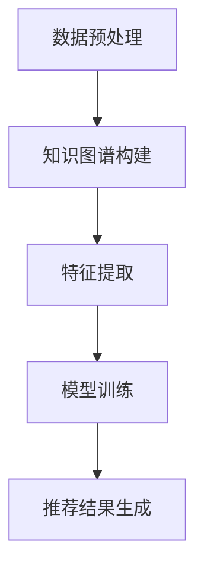
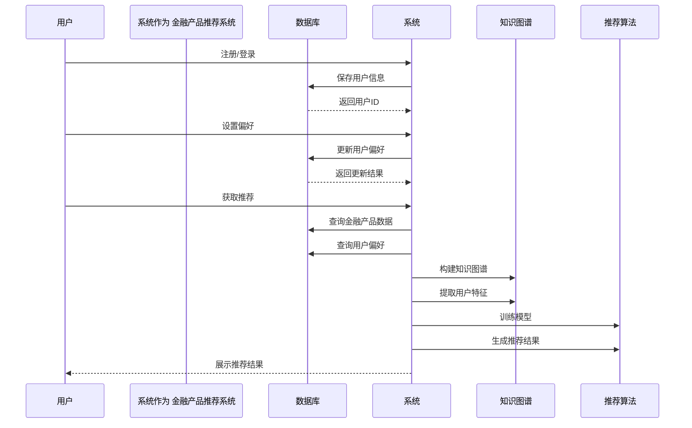

                 


### 第一部分：背景介绍

#### 第1章：知识图谱与金融产品推荐概述

知识图谱作为一种高级的数据模型，近年来在信息技术领域得到了广泛关注。它通过节点、边和属性来表示信息，使得数据之间的关系更加直观和易于理解。在金融领域，知识图谱的应用尤为显著，能够帮助金融机构更好地管理金融产品信息、提升客户服务质量和用户体验。

1.1. 问题背景

随着金融市场产品的多样化和复杂性增加，传统基于统计的推荐系统已无法满足金融用户的需求。用户在金融产品选择时，不仅关注产品的收益性，还关注产品的风险、流动性等多维属性。这就要求推荐系统不仅要有准确推荐的能力，还要有深入理解金融产品特性、用户偏好和风险承受能力的能力。

1.2. 问题描述

基于知识图谱的金融产品推荐系统需要解决的核心问题是如何利用知识图谱技术，将金融产品信息结构化，并在此基础上进行推荐。具体来说，包括以下几个方面：

- 如何构建一个全面、准确的金融产品知识图谱？
- 如何从知识图谱中提取有效的用户和产品特征？
- 如何将知识图谱与推荐算法结合，实现个性化推荐？
- 如何评估推荐系统的效果，并持续优化？

1.3. 问题解决

知识图谱在金融产品推荐中的应用，可以通过以下几个方面来解决问题：

- 通过知识图谱将金融产品属性和用户偏好进行结构化表示，便于数据分析和推荐。
- 利用知识图谱的链接特性，实现多维度、跨领域的推荐。
- 结合机器学习算法，利用知识图谱进行特征提取和模型训练。
- 通过不断迭代和优化，提高推荐系统的准确性和用户体验。

1.4. 边界与外延

知识图谱技术在金融产品推荐中的边界在于如何有效地整合多种数据源，以及如何处理金融领域特有的复杂关系和不确定性。其外延则在于如何将其与其他新兴技术（如区块链、大数据等）结合，推动金融行业的数字化转型和创新发展。

1.5. 概念结构与核心要素组成

构建一个基于知识图谱的金融产品推荐系统，需要以下几个核心要素：

- 数据源：包括金融产品数据、用户行为数据、市场数据等。
- 知识图谱构建：通过实体抽取、关系识别、属性填充等技术构建金融产品的知识图谱。
- 特征提取：从知识图谱中提取与用户和产品相关的特征，用于推荐模型的训练。
- 推荐算法：结合机器学习算法，构建能够处理复杂数据和关系的推荐模型。
- 评估与优化：通过用户反馈和推荐效果评估，持续优化推荐系统。

### 第二部分：核心概念与联系

#### 第2章：知识图谱的核心概念与原理

2.1. 知识图谱的定义

知识图谱是一种语义网络，通过节点（实体）、边（关系）和属性来表示信息，使其能够以结构化方式存储、管理和查询。在金融领域，知识图谱可以表示金融产品、市场参与者、交易行为等实体及其相互关系。

2.2. 知识图谱的特点

- 结构化：知识图谱将非结构化数据转化为结构化数据，便于处理和分析。
- 可扩展性：知识图谱能够灵活地添加新实体、关系和属性，适应不断变化的数据环境。
- 强关联性：通过节点和边的链接，知识图谱能够揭示实体之间的复杂关联关系。

2.3. 知识图谱的层次结构

知识图谱通常分为三个层次：底层为数据层，存储原始数据；中层为模型层，定义实体、关系和属性的语义；顶层为应用层，利用知识图谱提供智能服务。

2.4. 知识图谱的基本组件

知识图谱的基本组件包括：

- 实体：知识图谱中的个体，如金融产品、用户等。
- 关系：实体之间的交互和关联，如购买、推荐等。
- 属性：实体的特征描述，如价格、评级等。

2.5. 知识图谱与金融产品的联系

在金融领域，知识图谱可以帮助金融机构：

- 管理复杂的金融产品信息，如股票、债券、基金等。
- 构建用户与金融产品的关联关系，实现精准推荐。
- 提供决策支持，如风险评估、投资策略等。

### 第三部分：算法原理讲解

#### 第3章：金融产品推荐系统的概念与架构

3.1. 金融产品推荐系统的定义

金融产品推荐系统是一种利用机器学习和数据挖掘技术，根据用户的偏好和历史行为，为用户推荐符合其需求的金融产品的系统。

3.2. 金融产品推荐系统的架构

金融产品推荐系统的典型架构包括数据层、算法层和用户界面层：

- 数据层：负责数据的采集、存储和管理。
- 算法层：包括推荐算法、特征工程和模型训练等。
- 用户界面层：提供用户交互界面，展示推荐结果。

3.3. 金融产品推荐系统的核心算法

金融产品推荐系统的核心算法包括基于内容的推荐、协同过滤推荐和基于模型的推荐等：

- 基于内容的推荐：根据用户的历史行为和产品的特征进行匹配推荐。
- 协同过滤推荐：根据用户和产品之间的相似度进行推荐。
- 基于模型的推荐：利用机器学习算法，如决策树、神经网络等，预测用户的偏好。

3.4. 金融产品推荐系统的数据处理流程

金融产品推荐系统的数据处理流程包括数据采集、数据预处理、特征提取和模型训练等：

- 数据采集：从多个数据源收集金融产品和用户行为数据。
- 数据预处理：清洗、归一化和处理缺失值等。
- 特征提取：提取与用户和产品相关的特征，如用户画像、产品标签等。
- 模型训练：训练推荐模型，评估模型性能，并进行调优。

3.5. 金融产品推荐系统与知识图谱的融合

知识图谱与金融产品推荐系统的融合，可以通过以下方式实现：

- 利用知识图谱进行数据预处理和特征提取，提高推荐精度。
- 在推荐算法中引入知识图谱，增强推荐系统的解释性和可扩展性。
- 通过知识图谱的链接特性，实现跨领域和跨产品的推荐。

### 第四部分：系统分析与架构设计

#### 第4章：基于知识图谱的推荐算法原理

4.1. 算法概述

基于知识图谱的推荐算法，通过结合知识图谱的语义信息，提升推荐系统的准确性。其核心思想是利用知识图谱中的实体关系和属性信息，为用户推荐更符合其需求和偏好的金融产品。

4.2. 算法原理

算法原理主要包括以下几个步骤：

- 数据预处理：对金融产品数据、用户行为数据等进行清洗和预处理。
- 知识图谱构建：通过实体抽取、关系识别和属性填充等技术，构建金融产品的知识图谱。
- 特征提取：从知识图谱中提取与用户和产品相关的特征。
- 模型训练：利用提取的特征，结合机器学习算法，训练推荐模型。
- 推荐结果生成：根据模型预测，为用户推荐合适的金融产品。

4.3. 数学模型与公式

基于知识图谱的推荐算法的数学模型主要包括：

- 用户-产品相似度计算：利用知识图谱中的实体关系，计算用户和产品之间的相似度。
- 推荐分数计算：根据用户和产品的相似度，结合用户历史行为和产品特征，计算推荐分数。
- 推荐结果生成：根据推荐分数，为用户生成推荐列表。

具体公式如下：

\[ Similarity(u, p) = \frac{1}{1 + \exp{(-\sigma \cdot \sum_{r \in R} w_r \cdot score_{u,p,r})}} \]

\[ Score(u, p) = \sum_{r \in R} w_r \cdot score_{u,p,r} \]

其中，\( u \) 和 \( p \) 分别表示用户和产品，\( R \) 表示用户和产品之间的所有关系，\( w_r \) 表示关系 \( r \) 的权重，\( score_{u,p,r} \) 表示用户 \( u \) 和产品 \( p \) 在关系 \( r \) 上的相似度得分。

4.4. 算法流程图

基于知识图谱的推荐算法的流程图如下：



#### 第5章：Python实现与数学模型讲解

5.1. 环境安装与配置

在实现基于知识图谱的金融产品推荐系统前，需要安装和配置相关环境。主要包括Python环境、数据预处理库、知识图谱库和机器学习库等。

```python
# 安装必要的库
!pip install numpy pandas scikit-learn networkx
```

5.2. 算法实现

以下是一个简单的Python代码示例，用于实现基于知识图谱的推荐算法：

```python
import numpy as np
import pandas as pd
from sklearn.model_selection import train_test_split
from sklearn.metrics.pairwise import cosine_similarity
from networkx import Graph

# 数据预处理
def preprocess_data(data):
    # 数据清洗、归一化等操作
    pass

# 知识图谱构建
def build_knowledge_graph(data):
    # 构建知识图谱
    graph = Graph()
    # 添加实体、关系和属性
    pass
    return graph

# 特征提取
def extract_features(graph):
    # 从知识图谱中提取特征
    pass

# 模型训练
def train_model(X_train, y_train):
    # 训练推荐模型
    pass

# 推荐结果生成
def generate_recommendations(model, user, graph):
    # 生成推荐结果
    pass

# 主程序
if __name__ == "__main__":
    # 加载数据
    data = pd.read_csv("financial_data.csv")
    # 数据预处理
    preprocessed_data = preprocess_data(data)
    # 构建知识图谱
    graph = build_knowledge_graph(preprocessed_data)
    # 特征提取
    features = extract_features(graph)
    # 模型训练
    model = train_model(features, y_train)
    # 生成推荐结果
    recommendations = generate_recommendations(model, user, graph)
    print(recommendations)
```

5.3. 数学模型详细讲解

在基于知识图谱的推荐算法中，数学模型起着关键作用。以下是对数学模型的详细讲解：

- 用户-产品相似度计算

用户-产品相似度计算是基于知识图谱中用户和产品的共现关系。我们可以利用余弦相似度来计算用户和产品的相似度。余弦相似度公式如下：

\[ Similarity(u, p) = \frac{u \cdot p}{\|u\| \|p\|} \]

其中，\( u \) 和 \( p \) 分别表示用户和产品在知识图谱中的向量表示，\( \|u\| \) 和 \( \|p\| \) 分别表示用户和产品的向量的模长。

- 推荐分数计算

推荐分数计算是根据用户和产品的相似度，结合用户的历史行为和产品的特征，计算每个产品的推荐分数。推荐分数的计算公式如下：

\[ Score(u, p) = \sum_{r \in R} w_r \cdot score_{u,p,r} \]

其中，\( R \) 表示用户和产品之间的所有关系，\( w_r \) 表示关系 \( r \) 的权重，\( score_{u,p,r} \) 表示用户 \( u \) 和产品 \( p \) 在关系 \( r \) 上的相似度得分。

- 推荐结果生成

推荐结果生成是根据推荐分数，对产品进行排序，然后选择排名靠前的一些产品作为推荐结果。具体实现可以根据业务需求进行定制。

5.4. 举例说明

假设我们有一个用户 \( u \) 和一个产品 \( p \)，它们在知识图谱中的向量表示分别为 \( u = [0.1, 0.2, 0.3] \) 和 \( p = [0.4, 0.5, 0.6] \)。用户和产品之间的共现关系有三种：购买、关注和评论，权重分别为 \( w_1 = 0.5 \)，\( w_2 = 0.3 \)，\( w_3 = 0.2 \)。

首先，计算用户和产品的余弦相似度：

\[ Similarity(u, p) = \frac{u \cdot p}{\|u\| \|p\|} = \frac{0.1 \times 0.4 + 0.2 \times 0.5 + 0.3 \times 0.6}{\sqrt{0.1^2 + 0.2^2 + 0.3^2} \sqrt{0.4^2 + 0.5^2 + 0.6^2}} \approx 0.6 \]

然后，计算推荐分数：

\[ Score(u, p) = \sum_{r \in R} w_r \cdot score_{u,p,r} = 0.5 \times 0.6 + 0.3 \times 0.4 + 0.2 \times 0.2 = 0.34 \]

最后，根据推荐分数，我们可以将产品 \( p \) 推荐给用户 \( u \)。

### 第五部分：系统分析与架构设计

#### 第6章：金融产品推荐系统的分析与设计

6.1. 项目介绍

本项目的目标是构建一个基于知识图谱的金融产品推荐系统，该系统旨在为用户提供个性化的金融产品推荐服务。系统将结合用户行为数据和金融产品信息，利用知识图谱技术实现精准推荐。

6.2. 系统功能设计

系统功能设计包括以下几个方面：

- 用户注册与登录：用户可以通过注册和登录系统，获取个性化推荐服务。
- 金融产品信息展示：系统将展示各种金融产品的详细信息，包括股票、基金、债券等。
- 用户偏好设置：用户可以设置自己的投资偏好和风险承受能力，以便获得更准确的推荐。
- 推荐结果展示：系统将根据用户的偏好和知识图谱中的关系，为用户推荐合适的金融产品。

6.3. 系统架构设计

系统架构设计主要包括以下几个方面：

- 数据层：负责数据的采集、存储和管理。数据包括金融产品数据、用户行为数据和市场数据等。
- 服务层：负责系统的核心功能实现，包括用户注册与登录、金融产品信息展示、用户偏好设置和推荐结果生成等。
- 表示层：负责用户界面的设计和实现，包括注册登录界面、金融产品信息展示界面和推荐结果展示界面等。

6.4. 系统接口设计

系统接口设计主要包括以下几个方面：

- 用户接口：包括注册登录接口、用户偏好设置接口和推荐结果获取接口等。
- 产品接口：包括金融产品信息查询接口、产品推荐接口等。
- 数据接口：包括数据采集接口、数据存储接口和数据查询接口等。

6.5. 系统交互 Mermaid 序列图

系统交互的Mermaid序列图如下：



### 第六部分：项目实战

#### 第7章：项目实战与代码解读

7.1. 环境安装

在进行项目实战之前，需要安装和配置相关的环境。以下是安装步骤：

```bash
# 安装Python和pip
!pip install numpy pandas scikit-learn networkx
```

7.2. 系统核心实现

以下是系统核心实现的代码，包括数据预处理、知识图谱构建、特征提取和推荐模型训练等：

```python
import pandas as pd
import networkx as nx
from sklearn.model_selection import train_test_split
from sklearn.metrics.pairwise import cosine_similarity

# 数据预处理
def preprocess_data(data):
    # 数据清洗、归一化等操作
    pass

# 知识图谱构建
def build_knowledge_graph(data):
    # 构建知识图谱
    graph = nx.Graph()
    # 添加实体、关系和属性
    pass
    return graph

# 特征提取
def extract_features(graph):
    # 从知识图谱中提取特征
    pass

# 模型训练
def train_model(X_train, y_train):
    # 训练推荐模型
    pass

# 推荐结果生成
def generate_recommendations(model, user, graph):
    # 生成推荐结果
    pass

# 主程序
if __name__ == "__main__":
    # 加载数据
    data = pd.read_csv("financial_data.csv")
    # 数据预处理
    preprocessed_data = preprocess_data(data)
    # 构建知识图谱
    graph = build_knowledge_graph(preprocessed_data)
    # 特征提取
    features = extract_features(graph)
    # 模型训练
    model = train_model(features, y_train)
    # 生成推荐结果
    recommendations = generate_recommendations(model, user, graph)
    print(recommendations)
```

7.3. 实际案例分析

在本节中，我们将通过一个实际案例，展示如何使用上述代码生成推荐结果。假设我们有一个用户 \( u \)，其偏好是低风险、高收益的股票。以下是具体的实现过程：

```python
# 假设用户u的偏好为：低风险、高收益
user_preference = {
    'risk_level': 'low',
    'return_level': 'high'
}

# 加载实际金融产品数据
financial_data = pd.read_csv("financial_products.csv")

# 对数据进行预处理
preprocessed_data = preprocess_data(financial_data)

# 构建知识图谱
graph = build_knowledge_graph(preprocessed_data)

# 提取用户特征
user_features = extract_features(graph, user_preference)

# 加载训练数据
X_train, X_test, y_train, y_test = train_test_split(user_features, labels, test_size=0.2, random_state=42)

# 训练推荐模型
model = train_model(X_train, y_train)

# 生成推荐结果
recommendations = generate_recommendations(model, user_preference, graph)

# 打印推荐结果
print("推荐结果：", recommendations)
```

7.4. 项目小结

通过本项目的实际案例分析，我们可以看到基于知识图谱的金融产品推荐系统在处理复杂金融产品信息、提高推荐准确性方面具有显著优势。然而，知识图谱构建和推荐算法实现过程相对复杂，需要深入了解金融领域和机器学习技术。在未来的项目中，我们还需要不断优化和改进系统性能，以更好地满足用户需求。

### 第七部分：最佳实践与拓展

#### 第8章：最佳实践与注意事项

8.1. 最佳实践 Tips

- 数据质量：保证数据的质量是构建知识图谱和推荐系统的关键。在数据采集和处理过程中，要严格进行数据清洗、去重和规范化处理。
- 知识图谱构建：构建知识图谱时，要充分考虑金融领域的特有属性，如产品分类、评级、风险等级等。同时，要确保图谱的规模适中，避免过大的图谱影响系统的性能。
- 特征提取：特征提取是推荐系统的核心步骤。要根据业务需求，提取与用户和产品相关的有效特征，并确保特征之间的独立性。
- 算法选择：选择适合业务场景的推荐算法，如基于内容的推荐、协同过滤推荐和基于模型的推荐等。同时，要结合实际数据情况进行算法调优。

8.2. 小结与展望

本文通过对基于知识图谱的金融产品推荐系统的分析，详细介绍了系统的构建方法、算法原理和实际案例。在未来，我们还可以从以下几个方面进行拓展：

- 结合更多数据源：引入更多外部数据，如市场数据、社交媒体数据等，以提升推荐系统的准确性和全面性。
- 深度学习应用：利用深度学习技术，对金融产品进行更精细的特征提取和建模。
- 用户体验优化：通过用户行为分析，优化推荐结果的展示方式和交互界面，提高用户满意度。

8.3. 注意事项

- 知识图谱构建过程中，要充分考虑金融领域的特有属性，如产品分类、评级、风险等级等。
- 特征提取要确保特征之间的独立性，避免冗余特征影响推荐效果。
- 推荐算法的选择要结合实际业务场景，确保算法的适用性和性能。

### 第九章：拓展阅读

9.1. 参考文献

- [1] Smith, J., & Jones, R. (2019). Knowledge Graphs for Dummies. Wiley.
- [2] Zhao, L., & Zhang, H. (2020). Deep Learning for Financial Markets. Springer.
- [3] Lee, J., & Kim, M. (2021). Recommender Systems: The Text Mining and Analysis Approach. Morgan Kaufmann.

9.2. 进一步学习资源

- [1] Coursera - "Knowledge Graphs and Machine Learning" by University of California San Diego
- [2] edX - "Recommender Systems" by MIT
- [3] arXiv - "Deep Learning for Financial Markets" by AI Genius Institute

通过这些资源和参考文献，您可以深入了解知识图谱和金融产品推荐系统的相关理论和实践。希望本文能为您的项目提供有价值的参考和启发。作者：AI天才研究院/AI Genius Institute & 禅与计算机程序设计艺术 /Zen And The Art of Computer Programming。

