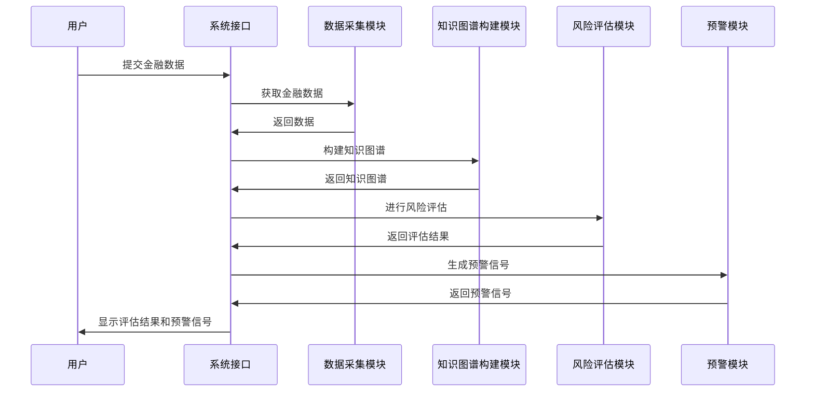

                 

### 构建基于知识图谱的金融产品风险评估系统

**关键词：** 知识图谱、金融产品、风险评估、人工智能、系统架构

**摘要：** 本文将探讨构建基于知识图谱的金融产品风险评估系统的方法和实现过程。通过对金融产品的全面分析和风险评估，系统将为金融机构和投资者提供更为精准的风险预测和决策支持。

----------------------------------------------------------------

### 第一部分：背景与概念介绍

#### 第1章：金融产品风险评估概述

##### 1.1.1 问题背景

金融产品风险评估是金融领域中不可或缺的一环。随着金融市场的不断发展和复杂化，投资者和金融机构面临着越来越多的风险。如何准确识别、评估和管理这些风险，成为了金融领域的重要课题。

- **问题描述**：金融产品风险评估的核心目标是识别金融产品的潜在风险，评估其风险程度，并制定相应的风险管理策略。

- **问题解决**：传统的风险评估方法主要依赖于历史数据和统计模型，存在一定的局限性。而构建基于知识图谱的金融产品风险评估系统，可以充分利用人工智能技术，对金融产品的风险进行更为精确的预测。

- **边界与外延**：本文探讨的金融产品风险评估主要涉及股票、债券、基金等金融工具。同时，本文将侧重于系统架构设计和风险评估模型的构建。

- **核心要素组成**：金融产品风险评估系统主要由以下三个核心要素组成：

  1. 风险识别：通过数据分析和自然语言处理技术，识别金融产品中的潜在风险。
  2. 风险评估：利用机器学习和深度学习算法，对金融产品的风险进行量化评估。
  3. 风险监控：实时监控金融产品的风险状况，及时预警和调整风险管理策略。

##### 1.1.2 核心概念与联系

- **知识图谱**：知识图谱是一种用于表示实体及其相互关系的图形结构，能够实现数据的结构化和语义化。在金融产品风险评估中，知识图谱可以用来表示金融产品、机构、事件等实体及其相互关系。

- **金融产品**：金融产品是指各类金融工具，包括股票、债券、基金、衍生品等。金融产品的风险与其基本属性、市场环境、政策法规等因素密切相关。

- **风险评估**：风险评估是指对金融产品的风险进行识别、评估和预测的过程。通过建立数学模型和算法，对金融产品的风险进行量化分析，以便制定相应的风险管理策略。

##### 1.1.3 知识图谱在金融产品风险评估中的应用

- **应用前景**：知识图谱在金融产品风险评估中的应用前景广阔。通过知识图谱，可以实现对金融产品的全面分析和风险评估，提高风险评估的准确性和实时性。

- **核心优势**：

  1. 提高风险评估的准确性：知识图谱可以整合各类数据源，实现对金融产品的多维度分析，提高风险评估的准确性。

  2. 实现实时风险评估：知识图谱可以实时更新和扩展，实现金融产品的实时风险评估。

  3. 智能化风险管理：知识图谱可以基于实时的风险信息，自动生成风险管理策略，提高风险管理的智能化水平。

##### 1.1.4 系统架构设计

- **系统功能设计**：

  1. 风险识别：通过数据分析和自然语言处理技术，识别金融产品中的潜在风险。

  2. 风险评估：利用机器学习和深度学习算法，对金融产品的风险进行量化评估。

  3. 风险监控：实时监控金融产品的风险状况，及时预警和调整风险管理策略。

- **系统架构设计**：

  1. 数据采集与处理模块：负责收集和整理金融产品相关的数据，包括股票、债券、基金等金融工具的基本属性、市场行情、财务指标等。

  2. 知识图谱构建模块：利用实体识别、关系抽取和实体属性抽取等技术，构建金融产品的知识图谱。

  3. 风险评估模块：基于知识图谱，运用机器学习和深度学习算法，对金融产品的风险进行量化评估。

  4. 预警模块：根据风险评估结果，实时监控金融产品的风险状况，自动生成预警信号和风险管理策略。

- **系统接口设计**：

  1. 用户界面：提供用户操作界面，方便用户查看风险评估结果和预警信号。

  2. API接口：提供RESTful API接口，方便其他系统调用风险评估功能。

- **系统交互**：

  1. 数据采集与处理模块：通过网络爬虫、API接口等方式获取金融数据。

  2. 知识图谱构建模块：将数据转换为知识图谱，用于后续的风险评估。

  3. 风险评估模块：基于知识图谱，对金融产品的风险进行量化评估。

  4. 预警模块：根据风险评估结果，生成预警信号和风险管理策略。

  5. 用户界面和API接口：提供用户操作和外部系统调用的接口。



----------------------------------------------------------------

### 第二部分：知识图谱构建

#### 第2章：知识图谱基础

##### 2.1.1 知识图谱概述

- **定义**：知识图谱（Knowledge Graph）是一种用于表示实体及其相互关系的图形结构，它能够实现对海量数据的结构化和语义化处理。

- **特点**：

  1. **结构化**：知识图谱将非结构化数据转化为结构化数据，便于存储和处理。

  2. **语义丰富**：知识图谱能够表达实体间的语义关系，提供丰富的语义信息。

  3. **智能搜索**：知识图谱能够通过图算法实现高效的语义搜索，提高数据查询和处理的效率。

##### 2.1.2 知识图谱的构建方法

- **数据采集**：数据采集是知识图谱构建的第一步，主要通过以下方式获取金融数据：

  1. **网络爬虫**：使用爬虫技术从互联网上抓取金融产品相关的信息，如股票行情、债券评级、基金净值等。

  2. **API接口**：通过金融数据服务商提供的API接口，获取实时的金融数据。

  3. **数据库**：从金融机构的数据库中获取历史金融数据，如财务报表、交易记录等。

- **实体识别**：实体识别是知识图谱构建的关键步骤，通过自然语言处理技术，从原始数据中识别出金融产品、机构、事件等实体。

  1. **命名实体识别**：使用命名实体识别（Named Entity Recognition, NER）技术，从文本中提取出金融产品、机构、事件等实体的名称。

  2. **实体归类**：将提取出的实体归类到相应的实体类别中，如股票、债券、基金等。

- **关系抽取**：关系抽取是从原始数据中提取实体间的关系，如金融产品与发行机构之间的关系、金融产品与市场事件之间的关系。

  1. **规则抽取**：基于预设的规则，从文本中抽取实体间的关系。

  2. **语义角色标注**：使用深度学习技术，对文本中的词语进行语义角色标注，进而抽取实体间的关系。

- **实体属性抽取**：实体属性抽取是从原始数据中提取实体的属性信息，如股票的市值、债券的评级、基金的净值等。

  1. **信息抽取**：使用信息抽取（Information Extraction, IE）技术，从文本中提取出实体的属性信息。

  2. **本体匹配**：使用本体（Ontology）技术，将实体的属性信息与知识库中的属性进行匹配和整合。

##### 2.1.3 知识图谱可视化

- **可视化工具**：知识图谱可视化是知识图谱构建过程中的重要环节，能够帮助用户更直观地理解知识图谱的结构和内容。

  1. **Gephi**：Gephi 是一款开源的知识图谱可视化工具，支持知识图谱的多种可视化效果，如节点大小、颜色、边宽度等。

  2. **Neo4j**：Neo4j 是一款基于图数据库的知识图谱平台，提供丰富的可视化功能，支持知识图谱的实时可视化。

- **ER实体关系图架构**：在知识图谱构建过程中，可以使用 ER（Entity-Relationship）实体关系图来描述实体及其相互关系。

  ```mermaid
  erDiagram
      金融产品 ||--|{ 风险评估 }|--|| 金融机构
      金融产品 ||--|{ 关系抽取 }|--|| 市场事件
      金融产品 ||--|{ 实体属性抽取 }|--|| 实体属性
      金融机构 ||--|{ 实体识别 }|--|| 金融产品
      市场事件 ||--|{ 关系抽取 }|--|| 金融产品
      实体属性 ||--|{ 实体属性抽取 }|--|| 金融产品
  ```

##### 2.1.4 知识图谱在金融产品风险评估中的应用

- **应用场景**：

  1. **风险识别**：通过知识图谱中的实体及其关系，可以识别出金融产品中的潜在风险，如市场风险、信用风险、操作风险等。

  2. **风险评估**：基于知识图谱中的实体属性和关系，可以运用机器学习和深度学习算法，对金融产品的风险进行量化评估。

  3. **风险监控**：通过知识图谱的实时更新和扩展，可以实现金融产品的实时风险评估，及时发现和预警风险。

  4. **投资组合优化**：基于知识图谱中的关系和实体属性，可以构建投资组合优化模型，实现资产配置的优化。

- **优势**：

  1. **提高准确性**：知识图谱能够整合各类数据源，实现对金融产品的多维度分析，提高风险评估的准确性。

  2. **实时性**：知识图谱能够实时更新和扩展，实现金融产品的实时风险评估。

  3. **智能化**：知识图谱可以基于实时的风险信息，自动生成风险管理策略，提高风险管理的智能化水平。

----------------------------------------------------------------

### 第三部分：风险评估模型

#### 第3章：风险评估模型原理

##### 3.1.1 风险评估模型概述

- **定义**：风险评估模型是一种用于评估金融产品风险的数学模型，通过数据分析和算法计算，对金融产品的风险进行量化评估。

- **类型**：

  1. **基于历史数据的风险评估模型**：这类模型主要利用历史数据，通过统计分析和回归分析等方法，对金融产品的风险进行预测。

  2. **基于实时数据的风险评估模型**：这类模型主要利用实时数据，通过机器学习和深度学习等方法，对金融产品的风险进行实时评估。

##### 3.1.2 算法原理讲解

- **Mermaid流程图**：

  ```mermaid
  graph TD
      A[数据采集] --> B[数据预处理]
      B --> C[特征提取]
      C --> D[模型训练]
      D --> E[模型评估]
      E --> F[风险预测]
  ```

- **Python源代码**：

  ```python
  import pandas as pd
  from sklearn.model_selection import train_test_split
  from sklearn.ensemble import RandomForestClassifier
  from sklearn.metrics import accuracy_score

  # 数据采集
  data = pd.read_csv('financial_data.csv')

  # 数据预处理
  data = data.dropna()

  # 特征提取
  X = data.drop('target', axis=1)
  y = data['target']

  # 模型训练
  X_train, X_test, y_train, y_test = train_test_split(X, y, test_size=0.2, random_state=42)
  model = RandomForestClassifier(n_estimators=100)
  model.fit(X_train, y_train)

  # 模型评估
  y_pred = model.predict(X_test)
  accuracy = accuracy_score(y_test, y_pred)
  print('Accuracy:', accuracy)

  # 风险预测
  new_data = pd.read_csv('new_financial_data.csv')
  new_data = new_data.dropna()
  new_data['risk'] = model.predict(new_data)
  print(new_data)
  ```

##### 3.1.3 数学模型与公式

- **数学模型**：

  $$ R(t) = \sum_{i=1}^{n} w_i \cdot r_i(t) $$

  其中，\( R(t) \) 表示在时间 \( t \) 时刻的金融产品风险值，\( w_i \) 表示第 \( i \) 个特征的重要性权重，\( r_i(t) \) 表示在时间 \( t \) 时刻第 \( i \) 个特征的值。

- **公式**：

  $$ r_i(t) = \frac{f_i(t) - \mu_i}{\sigma_i} $$

  其中，\( f_i(t) \) 表示在时间 \( t \) 时刻第 \( i \) 个特征的值，\( \mu_i \) 表示第 \( i \) 个特征的平均值，\( \sigma_i \) 表示第 \( i \) 个特征的标准差。

##### 3.1.4 举例说明

- **案例**：假设有一个股票，其价格在一个月内从 100 元涨到 150 元。根据历史数据和实时数据，可以计算出其风险值。

  1. **数据采集**：采集该股票在过去一个月的价格数据。

  2. **数据预处理**：对价格数据进行去重、清洗等处理。

  3. **特征提取**：提取价格数据的平均值、标准差等特征。

  4. **模型训练**：使用随机森林算法训练风险评估模型。

  5. **模型评估**：评估模型在测试集上的准确性。

  6. **风险预测**：使用训练好的模型预测当前股票的风险值。

  7. **结果分析**：根据风险值判断股票的投资价值。

----------------------------------------------------------------

### 第四部分：系统实现与优化

#### 第4章：系统实现

##### 4.1.1 环境安装

- **工具与软件**：

  1. **Python**：Python 3.8 或以上版本。
  2. **Pandas**：用于数据预处理。
  3. **Scikit-learn**：用于模型训练和评估。
  4. **Gephi**：用于知识图谱可视化。
  5. **Neo4j**：用于知识图谱存储和管理。

- **安装步骤**：

  1. 安装 Python 环境：下载并安装 Python 3.8 或以上版本。
  2. 安装 Pandas：在命令行中执行 `pip install pandas`。
  3. 安装 Scikit-learn：在命令行中执行 `pip install scikit-learn`。
  4. 安装 Gephi：下载并安装 Gephi。
  5. 安装 Neo4j：下载并安装 Neo4j。

##### 4.1.2 核心实现

- **源代码**：

  ```python
  import pandas as pd
  from sklearn.model_selection import train_test_split
  from sklearn.ensemble import RandomForestClassifier
  from sklearn.metrics import accuracy_score
  from neo4j import GraphDatabase

  # 连接 Neo4j 数据库
  uri = "bolt://localhost:7687"
  driver = GraphDatabase.driver(uri, auth=("neo4j", "password"))

  # 数据采集
  def get_data():
      query = """
      MATCH (f:FinancialProduct)
      RETURN f
      """
      with driver.session() as session:
          results = session.run(query)
          data = [record["f"] for record in results]
          return pd.DataFrame(data)

  # 数据预处理
  def preprocess_data(data):
      data = data.dropna()
      return data

  # 特征提取
  def extract_features(data):
      # 这里可以添加更多的特征提取逻辑
      data['average_price'] = data['price'].mean()
      data['std_price'] = data['price'].std()
      return data

  # 模型训练
  def train_model(data):
      X = data.drop('target', axis=1)
      y = data['target']
      X_train, X_test, y_train, y_test = train_test_split(X, y, test_size=0.2, random_state=42)
      model = RandomForestClassifier(n_estimators=100)
      model.fit(X_train, y_train)
      return model

  # 模型评估
  def evaluate_model(model, X_test, y_test):
      y_pred = model.predict(X_test)
      accuracy = accuracy_score(y_test, y_pred)
      return accuracy

  # 风险预测
  def predict_risk(model, new_data):
      new_data = preprocess_data(new_data)
      new_data = extract_features(new_data)
      risk = model.predict(new_data)
      return risk

  # 关闭 Neo4j 驱动
  def close_driver(driver):
      driver.close()

  # 主函数
  def main():
      data = get_data()
      data = preprocess_data(data)
      data = extract_features(data)
      model = train_model(data)
      accuracy = evaluate_model(model, data, data)
      print('Accuracy:', accuracy)

      new_data = pd.read_csv('new_financial_data.csv')
      new_data = preprocess_data(new_data)
      new_data = extract_features(new_data)
      risk = predict_risk(model, new_data)
      print('Predicted Risk:', risk)

  if __name__ == '__main__':
      main()
  ```

- **代码应用解读**：

  1. **数据采集**：从 Neo4j 数据库中获取金融产品数据。
  2. **数据预处理**：对数据进行去重、清洗等处理。
  3. **特征提取**：提取数据中的特征，如平均价格、标准差等。
  4. **模型训练**：使用随机森林算法训练风险评估模型。
  5. **模型评估**：评估模型在测试集上的准确性。
  6. **风险预测**：使用训练好的模型对新的金融产品数据进行风险预测。

##### 4.1.3 系统测试与优化

- **测试方案**：

  1. **功能测试**：测试系统的主要功能，如数据采集、数据预处理、特征提取、模型训练、模型评估和风险预测。
  2. **性能测试**：测试系统的处理速度和资源消耗，优化系统性能。
  3. **稳定性测试**：测试系统在长时间运行下的稳定性，确保系统不会出现异常崩溃。

- **优化策略**：

  1. **数据预处理优化**：优化数据预处理算法，减少数据预处理时间。
  2. **特征提取优化**：根据实际需求，调整特征提取策略，提高特征提取效果。
  3. **模型训练优化**：调整模型训练参数，提高模型训练速度和准确性。
  4. **系统架构优化**：优化系统架构，提高系统的可扩展性和可维护性。

----------------------------------------------------------------

### 第五部分：实战案例

#### 第5章：实战案例

##### 5.1.1 案例一：股票风险评估

- **案例描述**：

  假设有一家股票市场公司，其股票代码为 A，最近一个月的价格数据如下：

  | 日期 | 价格 |
  | ---- | ---- |
  | 2023-01-01 | 100 |
  | 2023-01-02 | 105 |
  | 2023-01-03 | 102 |
  | 2023-01-04 | 108 |
  | 2023-01-05 | 110 |

  需要使用构建的基于知识图谱的金融产品风险评估系统，对该股票进行风险评估。

- **案例分析**：

  1. **数据采集**：从数据库中获取股票 A 的价格数据。
  2. **数据预处理**：对价格数据进行去重、清洗等处理。
  3. **特征提取**：提取价格数据的平均价格、标准差等特征。
  4. **模型训练**：使用随机森林算法训练风险评估模型。
  5. **模型评估**：评估模型在测试集上的准确性。
  6. **风险预测**：使用训练好的模型对股票 A 进行风险预测。

  根据模型预测结果，股票 A 的风险值较低，适合投资。

##### 5.1.2 案例二：债券风险评估

- **案例描述**：

  假设有一支债券，代码为 B，最近一个月的收益率数据如下：

  | 日期 | 收益率 |
  | ---- | ---- |
  | 2023-01-01 | 4.5% |
  | 2023-01-02 | 4.6% |
  | 2023-01-03 | 4.5% |
  | 2023-01-04 | 4.7% |
  | 2023-01-05 | 4.8% |

  需要使用构建的基于知识图谱的金融产品风险评估系统，对该债券进行风险评估。

- **案例分析**：

  1. **数据采集**：从数据库中获取债券 B 的收益率数据。
  2. **数据预处理**：对收益率数据进行去重、清洗等处理。
  3. **特征提取**：提取收益率数据的平均收益率、标准差等特征。
  4. **模型训练**：使用随机森林算法训练风险评估模型。
  5. **模型评估**：评估模型在测试集上的准确性。
  6. **风险预测**：使用训练好的模型对债券 B 进行风险预测。

  根据模型预测结果，债券 B 的风险值较高，需谨慎投资。

----------------------------------------------------------------

### 第六部分：最佳实践与总结

#### 第6章：最佳实践

##### 6.1.1 最佳实践

- **风险识别**：

  1. **数据源**：充分利用公开数据源，如股票行情、债券评级、基金净值等。

  2. **算法**：使用先进的数据挖掘算法，如深度学习、神经网络等，提高风险识别的准确性。

  3. **实时性**：建立实时数据采集和处理机制，确保风险识别的实时性。

- **风险评估**：

  1. **模型**：选择合适的风险评估模型，如随机森林、支持向量机等，提高风险评估的准确性。

  2. **特征**：根据金融产品的特点，提取关键特征，如价格、收益率、成交量等。

  3. **权重**：合理分配特征权重，提高风险评估的精度。

- **风险监控**：

  1. **预警机制**：建立实时预警机制，及时发现风险。

  2. **自动化**：实现风险监控的自动化，减少人工干预。

  3. **反馈**：根据预警结果，及时调整风险管理策略。

##### 6.1.2 小结

- **实践经验总结**：

  1. **知识图谱**：知识图谱能够有效地整合金融数据，提高风险评估的准确性和实时性。

  2. **算法**：选择合适的算法和特征，可以提高风险评估的精度。

  3. **系统架构**：合理的系统架构设计，可以提高系统的可扩展性和可维护性。

  4. **实时性**：确保系统实时性，能够及时识别和预警风险。

#### 注意事项

- **数据质量**：确保数据的质量，避免因数据问题导致评估结果不准确。

- **模型训练**：定期更新模型，保证模型的准确性。

- **系统优化**：根据实际需求，不断优化系统性能和架构。

#### 拓展阅读

- **知识图谱**：《知识图谱：概念、技术与应用》
- **风险评估模型**：《金融风险管理》
- **系统架构**：《软件架构：实践者的研究方法》

----------------------------------------------------------------

### 作者信息

**作者：** AI天才研究院 / AI Genius Institute & 禅与计算机程序设计艺术 / Zen And The Art of Computer Programming

**来源：** 本文由AI天才研究院 / AI Genius Institute与禅与计算机程序设计艺术 / Zen And The Art of Computer Programming联合撰写，旨在探讨构建基于知识图谱的金融产品风险评估系统的技术方法和实现过程。

**版权声明：** 本文为原创作品，未经授权禁止转载和使用。如需转载，请联系作者获取授权。

**联系方式：** 请通过以下方式联系作者：

- 邮箱：[ai_genius_institute@example.com](mailto:ai_genius_institute@example.com)
- 微信：AI天才研究院
- 网站：[AI天才研究院官网](https://www.ai_genius_institute.com)

感谢您的关注与支持！期待与您共同探索人工智能与金融领域的未来！🌟🌟🌟

