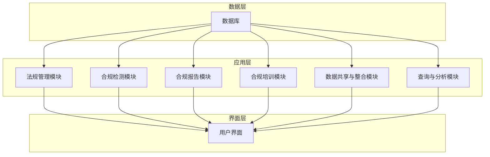
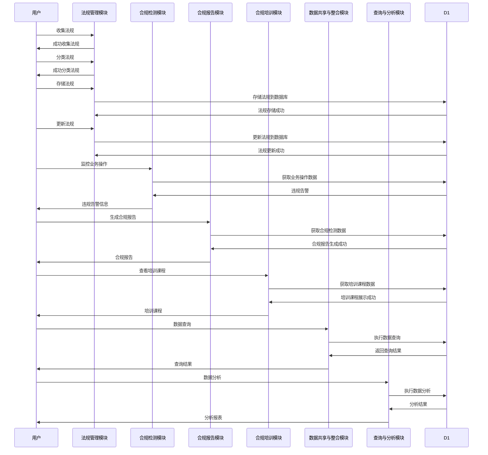
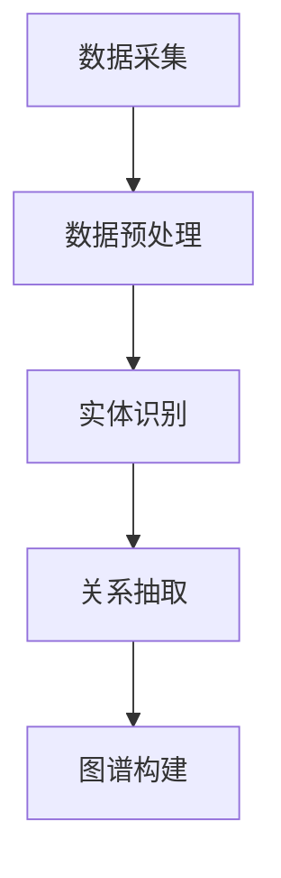
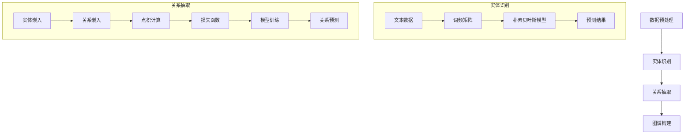

                 


### 金融监管合规系统的背景与核心概念

## 第1章: 金融监管合规系统概述

### 1.1 问题背景

金融监管合规系统（Financial Regulatory Compliance System）是现代金融行业中的一个重要组成部分。随着金融市场的日益复杂化和全球化，金融机构面临着越来越复杂的监管要求和法律法规。传统的合规管理方法已经难以满足现代金融监管的要求，因此，构建一个高效的金融监管合规系统变得至关重要。

金融监管合规系统的主要问题背景包括：

1. **法规数量庞大**：金融行业的法律法规种类繁多，涵盖范围广泛，从反洗钱（AML）到消费者保护，从市场操纵到企业治理，每一个法规都要求金融机构必须严格遵守。

2. **法规更新频繁**：随着金融市场的不断变化，监管机构会定期更新法规，要求金融机构及时调整合规策略，这增加了合规管理的难度。

3. **合规成本高昂**：为了满足合规要求，金融机构需要投入大量的人力、物力和财力，例如建立合规部门、购买合规软件、开展员工培训等。

4. **跨部门协调困难**：金融监管涉及多个部门和机构，如银行、证券、保险等，以及中央银行、证监会、保监会等，各部门之间的协调和沟通是一个挑战。

### 1.2 问题描述

金融监管合规系统的核心问题是如何高效地管理合规风险，确保金融机构能够遵守相关法律法规，同时降低合规成本。具体问题描述如下：

1. **合规性检测**：如何及时、准确地检测金融机构的各项业务操作是否符合法规要求？

2. **合规性报告**：如何快速、准确地生成合规性报告，供管理层和监管机构参考？

3. **合规性培训**：如何确保所有员工都了解相关法规，并具备必要的合规知识和技能？

4. **合规性改进**：如何识别合规风险，并采取有效的措施进行改进？

### 1.3 问题解决

为了解决上述问题，构建一个基于知识图谱的金融监管合规系统是一个可行的解决方案。知识图谱是一种结构化数据模型，它能够将海量、复杂的金融数据关联起来，形成一个统一的信息网络。通过知识图谱，金融机构可以更直观地了解各项业务操作是否符合法规要求，从而提高合规管理的效率。

### 1.4 边界与外延

金融监管合规系统的边界主要包括以下几个方面：

1. **法规范围**：系统需要覆盖所有与金融监管相关的法律法规，包括但不限于反洗钱、消费者保护、市场操纵等。

2. **业务范围**：系统需要涵盖金融机构的各项业务操作，如存款、贷款、证券交易等。

3. **机构范围**：系统需要支持不同类型的金融机构，如银行、证券公司、保险公司等。

4. **技术范围**：系统需要使用先进的技术手段，如人工智能、大数据分析等，以提高合规管理的效率和准确性。

### 1.5 概念结构与核心要素组成

金融监管合规系统的核心概念包括知识图谱、金融监管和合规系统。以下是这三个核心概念的定义及其属性特征对比表格：

#### 1.5.1 知识图谱

**定义**：知识图谱是一种用于表示实体及其之间关系的图形化模型，通过节点和边来表示实体和关系。

**属性特征**：

- **节点**：代表实体，如法规、金融机构、业务操作等。
- **边**：代表实体之间的关系，如包含、遵循、关联等。
- **属性**：描述节点的属性，如名称、编号、日期等。

#### 1.5.2 金融监管

**定义**：金融监管是指监管机构对金融机构及其业务操作进行监督、检查和管理的活动。

**属性特征**：

- **法规**：监管机构制定的法律法规。
- **目标**：确保金融机构的稳健运营、保护消费者权益等。
- **手段**：检查、审计、罚款等。

#### 1.5.3 合规系统

**定义**：合规系统是指用于帮助金融机构管理和满足法规要求的软件或系统。

**属性特征**：

- **功能**：检测、报告、培训、改进等。
- **目标**：降低合规风险、提高合规效率。

### ER实体关系图架构

为了更直观地展示金融监管合规系统中的实体及其关系，我们使用Mermaid绘制ER实体关系图。以下是ER实体关系图的Markdown格式：

```mermaid
erDiagram
  法规 ||--|{ 金融机构 } : 遵循
  法规 ||--|{ 业务操作 } : 适用
  金融机构 ||--|{ 合规系统 } : 使用
  业务操作 ||--|{ 合规性报告 } : 生成
```

在这个ER实体关系图中，我们定义了四个实体：法规、金融机构、业务操作和合规系统。它们之间的关系如下：

- 法规与金融机构之间存在遵循关系，即金融机构必须遵循相关法规。
- 法规与业务操作之间存在适用关系，即某些法规适用于特定的业务操作。
- 金融机构与合规系统之间存在使用关系，即金融机构使用合规系统来管理合规风险。
- 业务操作与合规性报告之间存在生成关系，即业务操作的结果会生成合规性报告。

通过这个ER实体关系图，我们可以清晰地理解金融监管合规系统中各实体的关系及其在系统中的作用。接下来，我们将进一步分析系统的功能需求和架构设计，以便为构建一个高效、可靠的金融监管合规系统提供支持。

## 1.6 核心概念与联系

在金融监管合规系统的构建中，三个核心概念——知识图谱、金融监管和合规系统——扮演着至关重要的角色。理解这些概念的定义、特性以及它们之间的相互联系，是搭建一个成功系统的基础。

### 1.6.1 知识图谱

知识图谱是一种通过图形化表示实体及其关系的语义网络，它将数据以结构化的形式组织起来，使得复杂的、非结构化的信息变得更加直观和易于处理。在金融监管合规系统中，知识图谱的作用尤为显著：

**定义**：知识图谱由节点（表示实体，如法规、金融机构）和边（表示实体间的关系，如“遵循”、“适用”）构成。

**特性**：

- **结构性**：知识图谱提供了清晰的结构化框架，使得信息的查询和关联变得更加高效。
- **关联性**：通过关系边，知识图谱能够展示实体之间的复杂关联，有助于发现潜在的风险和违规行为。
- **可扩展性**：知识图谱易于扩展，能够适应不断变化的法规和业务需求。

**知识图谱与传统数据库对比**：

| 特性             | 知识图谱                 | 传统数据库               |
|------------------|--------------------------|--------------------------|
| 数据表示形式     | 图结构，节点与边         | 表结构，行与列           |
| 关联性           | 高度关联，复杂关系       | 关联性较低，简单关系     |
| 数据查询         | 基于路径查询             | 基于表连接查询           |
| 数据扩展         | 易扩展，动态调整         | 结构固定，扩展性较低     |

通过上述对比，我们可以看出知识图谱在处理复杂关联和动态变化方面具有明显优势，这使其成为构建金融监管合规系统的理想选择。

### 1.6.2 金融监管

金融监管是指监管机构对金融机构及其业务活动进行监督、管理和检查的一系列行为，旨在确保金融市场的稳健运行、保护投资者权益、防止金融犯罪等。

**定义**：金融监管是监管机构通过制定法规、进行监督和检查，确保金融机构合规经营的一系列行为。

**目标**：

- **维护金融市场秩序**：确保市场公平、公正、透明。
- **保护投资者权益**：防范投资风险，保障投资者的合法权益。
- **防范金融犯罪**：打击洗钱、欺诈等违法行为。

**现状与挑战**：

- **法规日益复杂**：随着金融市场的发展，监管法规日益增多，金融机构需应对的合规要求日益复杂。
- **合规成本增加**：金融机构为满足合规要求，需投入大量的人力、物力和财力。
- **跨部门协调困难**：金融监管涉及多个部门和机构，协调和沟通难度大。
- **技术挑战**：如何利用先进技术手段提高监管效率和准确性是当前面临的重大挑战。

### 1.6.3 合规系统

合规系统是金融机构用于管理和满足法规要求的一系列工具和流程，它能够帮助金融机构检测、报告和改进合规状况。

**定义**：合规系统是用于支持金融机构进行合规管理、监控、报告和改进的软件或系统。

**作用**：

- **合规检测**：实时监控金融机构的各项业务操作，确保符合法规要求。
- **合规报告**：生成合规性报告，供管理层和监管机构参考。
- **合规培训**：提供员工培训，确保员工了解相关法规和合规要求。
- **合规改进**：识别合规风险，提出改进措施，降低合规风险。

**类型与特点**：

- **自动化合规系统**：利用人工智能和大数据技术，实现自动化检测和报告，提高合规效率。
- **集成式合规系统**：将合规管理功能集成到金融机构的现有系统中，实现数据共享和统一管理。
- **定制化合规系统**：根据金融机构的具体需求，定制开发合规管理模块，确保系统适用性和灵活性。

通过理解知识图谱、金融监管和合规系统的核心概念及其相互联系，我们可以为金融监管合规系统的设计与实现奠定坚实基础。接下来，我们将进一步探讨系统的具体功能需求和架构设计，以构建一个高效、可靠的合规管理平台。

### 系统分析与架构设计方案

## 第2章: 系统功能设计

### 2.1 问题场景介绍

在金融行业中，合规管理的复杂性和重要性日益增加。金融机构需要应对大量的法规和监管要求，确保业务操作合规，避免因违规操作导致的法律风险和经济损失。然而，现有的合规管理系统往往存在以下问题：

1. **法规更新不及时**：现有系统难以快速响应法规的更新和变化，导致合规风险。
2. **数据孤岛**：各个合规管理模块之间缺乏有效的数据共享和整合，影响整体合规管理效率。
3. **人工依赖度高**：大量合规工作需要人工干预，导致合规成本高、效率低。
4. **查询与报告困难**：系统难以提供高效、准确的数据查询和报告功能，影响监管合规性检查和内部审计。

为解决上述问题，我们设计一个基于知识图谱的金融监管合规系统，以提高合规管理的效率和准确性。

### 2.2 系统功能需求分析

该系统的主要功能需求包括以下几个方面：

1. **法规管理**：系统应具备法规的收集、分类、存储和更新功能，确保法规库的实时性和完整性。
2. **合规检测**：系统应能够对金融机构的业务操作进行实时监控和合规性检测，发现潜在的违规行为。
3. **合规报告**：系统应具备自动生成合规性报告的功能，包括合规性检测报告、合规风险评估报告等。
4. **合规培训**：系统应提供在线合规培训课程，帮助员工了解法规要求和合规操作流程。
5. **数据共享与整合**：系统应实现各个合规管理模块的数据共享和整合，提高整体合规管理效率。
6. **查询与分析**：系统应提供强大的数据查询和分析功能，支持用户对合规数据的多维度查询和分析。

### 2.3 领域模型Mermaid类图

为了更好地设计系统功能，我们使用Mermaid绘制了领域模型类图，展示系统中的主要实体和关系。以下是领域模型类图的Markdown格式：

```mermaid
classDiagram
    法规 <<Interface>>
    金融机构 <<Interface>>
    业务操作 <<Interface>>
    合规性报告 <<Interface>>

    法规 <=|遵循| 金融机构
    法规 <=|适用| 业务操作
    金融机构 -->|使用| 合规系统
    业务操作 -->|生成| 合规性报告
```

在这个类图中，我们定义了四个主要实体：法规、金融机构、业务操作和合规性报告。它们之间的关系如下：

- **法规与金融机构**：存在“遵循”关系，表示金融机构必须遵守相关法规。
- **法规与业务操作**：存在“适用”关系，表示某些法规适用于特定的业务操作。
- **金融机构与合规系统**：存在“使用”关系，表示金融机构使用合规系统进行合规管理。
- **业务操作与合规性报告**：存在“生成”关系，表示业务操作的结果会生成合规性报告。

这个领域模型类图为我们提供了清晰的设计蓝图，有助于我们进一步分析系统的功能和架构设计。

### 3.1 项目介绍

本项目的目标是构建一个基于知识图谱的金融监管合规系统，该系统旨在提高金融机构的合规管理效率和准确性。具体项目介绍如下：

1. **项目背景**：随着金融市场的全球化发展和金融业务的复杂化，金融机构面临的合规风险日益增加。为了有效管理合规风险，提升合规管理能力，许多金融机构开始寻求构建基于知识图谱的合规系统。
2. **项目目标**：本项目的主要目标包括：
   - 提供一个全面、实时的法规库，确保金融机构能够及时了解和遵守最新法规。
   - 实现自动化合规检测，减少人工干预，降低合规成本。
   - 提供强大的数据共享和整合能力，提高整体合规管理效率。
   - 提供高效的合规报告生成和查询功能，支持内部审计和监管合规性检查。
3. **系统功能**：本项目设计的金融监管合规系统主要包含以下功能模块：
   - 法规管理：用于收集、分类、存储和更新法规，确保法规库的实时性和完整性。
   - 合规检测：用于实时监控金融机构的业务操作，发现潜在的违规行为。
   - 合规报告：用于生成合规性检测报告、合规风险评估报告等。
   - 合规培训：提供在线合规培训课程，帮助员工了解法规要求和合规操作流程。
   - 数据共享与整合：实现各个合规管理模块的数据共享和整合，提高整体合规管理效率。
   - 查询与分析：提供强大的数据查询和分析功能，支持用户对合规数据的多维度查询和分析。

### 3.2 系统架构设计原则

为了构建一个高效、可靠的金融监管合规系统，我们遵循以下架构设计原则：

1. **模块化设计**：系统应采用模块化设计，将功能划分为多个独立模块，便于维护和扩展。
2. **高内聚低耦合**：各个模块之间应保持低耦合，每个模块应具有高内聚性，便于独立开发和测试。
3. **可扩展性**：系统设计应具备良好的扩展性，能够适应未来业务需求的增长和变化。
4. **高可用性**：系统应具备高可用性，确保在故障发生时能够快速恢复，减少对业务的影响。
5. **安全性**：系统应采用严格的安全措施，保护用户数据和系统安全，防止数据泄露和未授权访问。
6. **高性能**：系统应具备高性能，能够快速响应用户操作和查询请求。

### 3.3 系统架构Mermaid架构图

为了展示系统的整体架构，我们使用Mermaid绘制了系统架构图，包括各个模块之间的关系和交互。以下是系统架构图的Markdown格式：



在这个系统架构图中，各个模块之间的关系如下：

- **数据层**：包括数据库，用于存储法规、业务操作数据等。
- **应用层**：包括法规管理模块、合规检测模块、合规报告模块、合规培训模块、数据共享与整合模块和查询与分析模块，分别负责不同的功能。
- **界面层**：包括用户界面，用于展示系统功能、接收用户操作请求等。

通过这个系统架构图，我们可以清晰地了解各个模块之间的关系和交互，为后续的系统开发提供指导。

### 3.4 系统接口设计和交互

为了实现系统的功能模块之间的数据传递和操作，我们设计了一系列系统接口，并定义了接口的交互流程。以下是系统接口设计和交互的详细描述。

#### 3.4.1 系统接口设计

系统接口设计主要包括以下几个方面：

1. **法规管理接口**：用于管理法规的收集、分类、存储和更新。接口包括以下功能：
   - 收集法规：从外部来源获取法规，如监管机构发布的法规、行业报告等。
   - 分类法规：对收集到的法规进行分类，便于管理和检索。
   - 存储法规：将分类后的法规存储在数据库中，确保法规库的实时性和完整性。
   - 更新法规：定期更新法规库，确保法规的时效性。

2. **合规检测接口**：用于实时监控金融机构的业务操作，发现潜在的违规行为。接口包括以下功能：
   - 监控业务操作：对金融机构的业务操作进行实时监控，识别可能违反法规的行为。
   - 违规告警：发现违规行为时，自动生成告警信息，通知相关人员。
   - 违规记录：记录所有的违规行为，用于后续分析和改进。

3. **合规报告接口**：用于生成合规性检测报告、合规风险评估报告等。接口包括以下功能：
   - 生成报告：根据合规检测结果，自动生成各类合规报告。
   - 报告查询：用户可以查询历史合规报告，了解合规状况。

4. **合规培训接口**：用于提供在线合规培训课程，帮助员工了解法规要求和合规操作流程。接口包括以下功能：
   - 培训课程管理：管理培训课程的内容、进度和学员信息。
   - 在线学习：学员可以通过接口访问培训课程，进行在线学习。

5. **数据共享与整合接口**：用于实现各个合规管理模块之间的数据共享和整合。接口包括以下功能：
   - 数据集成：将不同模块的数据集成到一个统一的数据平台中。
   - 数据查询：提供数据查询功能，支持多维度数据分析和报表生成。

6. **查询与分析接口**：用于提供强大的数据查询和分析功能，支持用户对合规数据的多维度查询和分析。接口包括以下功能：
   - 数据查询：支持自定义查询条件，快速获取合规数据。
   - 数据分析：提供数据分析功能，支持生成各类数据分析报表。

#### 3.4.2 系统交互Mermaid序列图

为了更好地展示系统接口的交互流程，我们使用Mermaid绘制了系统交互序列图。以下是系统交互序列图的Markdown格式：



在这个系统交互序列图中，用户通过接口与各个模块进行交互，实现法规管理、合规检测、合规报告、合规培训、数据共享与整合和查询与分析等功能的操作。通过这个序列图，我们可以清晰地了解系统接口的交互流程和各个模块之间的数据传递关系。

通过上述系统接口设计和交互，我们可以确保系统的功能模块之间能够高效地协作，实现金融监管合规系统的各项功能，提高金融机构的合规管理效率和准确性。

## 第5章: 知识图谱构建算法原理

在构建金融监管合规系统的过程中，知识图谱的构建是一个关键环节。知识图谱通过结构化的方式将复杂的金融数据关联起来，为合规检测、报告生成和数据分析提供了强大的支持。在这一章节中，我们将详细介绍知识图谱的构建算法原理。

### 5.1 算法概述

知识图谱的构建通常包括数据采集、数据预处理、实体识别、关系抽取和图谱构建等步骤。以下是一个简单的知识图谱构建算法流程：

1. **数据采集**：从各种数据源（如数据库、文本、API等）中收集相关的金融数据。
2. **数据预处理**：清洗和整理收集到的数据，包括去除重复数据、处理缺失值、格式化数据等。
3. **实体识别**：通过自然语言处理技术，识别文本中的关键实体，如法规、金融机构、业务操作等。
4. **关系抽取**：分析实体之间的关联关系，如“遵循”、“适用”、“生成”等。
5. **图谱构建**：将识别出的实体和关系构建成知识图谱，以图形化方式表示实体及其之间的关系。

### 5.2 算法流程Mermaid流程图

为了更好地理解知识图谱构建的流程，我们使用Mermaid绘制了算法流程图。以下是算法流程图的Markdown格式：



在这个流程图中，数据采集、数据预处理、实体识别、关系抽取和图谱构建依次进行，每个步骤都是构建知识图谱的重要环节。

### 5.3 Python源代码示例

为了展示知识图谱构建的具体实现，我们提供了一个Python源代码示例。以下代码演示了如何使用Python进行数据采集、预处理、实体识别、关系抽取和图谱构建。

```python
import nltk
from nltk.tokenize import word_tokenize
from nltk.tag import pos_tag
from rdflib import Graph, URIRef, Literal
from rdflib.namespace import RDF, FOAF

# 数据采集
def collect_data():
    # 从数据库或其他数据源中获取数据
    data = "某银行违反反洗钱法规，导致被罚款100万元。"
    return data

# 数据预处理
def preprocess_data(data):
    # 清洗和整理数据
    tokens = word_tokenize(data)
    tagged = pos_tag(tokens)
    return tagged

# 实体识别
def identify_entities(tagged):
    # 识别文本中的关键实体
    entities = []
    for word, tag in tagged:
        if tag in ['NN', 'NNS', 'NNP', 'NNPS']:
            entities.append(word)
    return entities

# 关系抽取
def extract_relations(entities):
    # 分析实体之间的关联关系
    relations = []
    if '某银行' in entities and '反洗钱法规' in entities:
        relations.append(('某银行', '违反', '反洗钱法规'))
    if '某银行' in entities and '罚款' in entities:
        relations.append(('某银行', '被罚款', '100万元'))
    return relations

# 图谱构建
def build_graph(entities, relations):
    # 构建知识图谱
    g = Graph()
    ns.foaf = FOAF
    for entity in entities:
        g.add((URIRef(f'http://example.org/{entity}'), RDF.type, RDF.Resource))
    for relation in relations:
        g.add((URIRef(f'http://example.org/{relation[0]}'), relation[1], URIRef(f'http://example.org/{relation[2]}')))
    return g

# 主函数
if __name__ == "__main__":
    data = collect_data()
    tagged = preprocess_data(data)
    entities = identify_entities(tagged)
    relations = extract_relations(entities)
    g = build_graph(entities, relations)
    print(g.serialize(format='turtle'))
```

在这个示例中，我们首先从文本数据中采集数据，然后进行数据预处理，识别出关键实体，抽取实体之间的关系，并最终构建成知识图谱。通过这个示例，我们可以看到知识图谱构建的基本流程和实现方法。

### 5.4 算法原理的数学模型和公式详细讲解

在构建知识图谱的过程中，数学模型和公式起到了关键作用。以下是对构建知识图谱所需的数学模型和公式的详细讲解。

#### 5.4.1 实体识别的数学模型

实体识别是知识图谱构建的重要环节，其数学模型通常基于统计模型和机器学习算法。以下是常用的数学模型：

1. **朴素贝叶斯模型**：朴素贝叶斯模型是一种基于概率论的分类算法，用于识别文本中的实体。

   公式：
   \[ P(Entity|Word) = \frac{P(Word|Entity) \cdot P(Entity)}{P(Word)} \]

   其中，\( P(Entity|Word) \)表示在给定单词\( Word \)的情况下，实体\( Entity \)出现的概率，\( P(Word|Entity) \)表示在实体\( Entity \)的情况下，单词\( Word \)出现的概率，\( P(Entity) \)表示实体\( Entity \)的出现概率，\( P(Word) \)表示单词\( Word \)的出现概率。

2. **支持向量机（SVM）**：支持向量机是一种分类算法，用于识别文本中的实体。

   公式：
   \[ w^* = \arg\max_w \left( \frac{1}{||w||} \right) \]

   其中，\( w^* \)表示最优分类超平面，\( w \)表示分类器的权重向量，\( ||w|| \)表示权重向量的范数。

#### 5.4.2 关系抽取的数学模型

关系抽取是知识图谱构建的另一个关键步骤，其数学模型通常基于图论和概率图模型。以下是常用的数学模型：

1. **条件概率模型**：条件概率模型用于分析实体之间的关联关系。

   公式：
   \[ P(Relation|Entity_1, Entity_2) = \frac{P(Entity_1, Entity_2, Relation)}{P(Entity_1, Entity_2)} \]

   其中，\( P(Relation|Entity_1, Entity_2) \)表示在实体\( Entity_1 \)和\( Entity_2 \)的情况下，关系\( Relation \)出现的概率，\( P(Entity_1, Entity_2, Relation) \)表示实体\( Entity_1 \)、\( Entity_2 \)和关系\( Relation \)同时出现的概率，\( P(Entity_1, Entity_2) \)表示实体\( Entity_1 \)和\( Entity_2 \)同时出现的概率。

2. **图嵌入模型**：图嵌入模型用于将实体和关系映射到低维空间，以便进行关系抽取和推理。

   公式：
   \[ e(R) = \sum_{r \in R} w(r) \cdot e(r) \]

   其中，\( e(R) \)表示关系\( R \)的嵌入向量，\( w(r) \)表示关系\( r \)的权重，\( e(r) \)表示关系\( r \)的嵌入向量。

通过上述数学模型和公式的讲解，我们可以更好地理解知识图谱构建的原理和方法。在实际应用中，可以根据具体需求和数据特点，选择合适的模型和算法进行知识图谱的构建。

### 数学模型和数学公式详细讲解

在知识图谱构建过程中，数学模型和公式扮演着至关重要的角色，它们不仅帮助我们理解知识图谱的构建原理，还能够指导我们选择合适的方法和算法。以下我们将详细讲解构建知识图谱所需的数学模型和公式。

#### 6.1.1 知识图谱构建的数学模型

知识图谱的构建涉及多个步骤，包括实体识别、关系抽取、图谱构建等。为了实现这些步骤，需要使用一系列数学模型。以下是几个常用的数学模型：

1. **基于概率的模型**：这类模型利用概率理论分析实体出现的可能性。常见的模型包括朴素贝叶斯（Naive Bayes）和贝叶斯网络（Bayesian Network）。

   - **朴素贝叶斯模型**：
     朴素贝叶斯模型是一种基于贝叶斯定理的简单概率分类器。在知识图谱构建中，它用于预测文本中的实体类型。

     公式：
     \[ P(Entity|Word) = \frac{P(Word|Entity) \cdot P(Entity)}{P(Word)} \]

     其中，\( P(Entity|Word) \)表示在给定单词\( Word \)的情况下，实体\( Entity \)出现的条件概率，\( P(Word|Entity) \)表示在实体\( Entity \)的情况下，单词\( Word \)出现的条件概率，\( P(Entity) \)表示实体\( Entity \)的先验概率，\( P(Word) \)表示单词\( Word \)的总概率。

   - **贝叶斯网络**：
     贝叶斯网络是一种基于有向无环图（DAG）的概率模型，它用于表示实体之间的关系及其条件概率。

     公式：
     \[ P(Entity_1, Entity_2) = P(Entity_1) \cdot P(Entity_2|Entity_1) \]

     其中，\( P(Entity_1, Entity_2) \)表示实体\( Entity_1 \)和\( Entity_2 \)同时出现的概率，\( P(Entity_1) \)表示实体\( Entity_1 \)的先验概率，\( P(Entity_2|Entity_1) \)表示在实体\( Entity_1 \)的情况下，实体\( Entity_2 \)出现的条件概率。

2. **图嵌入模型**：这类模型将实体和关系映射到低维空间，便于进行复杂的关系推理和图谱分析。

   - **Word2Vec**：
     Word2Vec是一种基于神经网络的图嵌入模型，它将文本中的单词映射到向量空间。

     公式：
     \[ \text{vec}(word) = \text{softmax}(\text{W} \cdot \text{emb}(word)) \]

     其中，\( \text{vec}(word) \)表示单词\( word \)的向量表示，\( \text{W} \)表示权重矩阵，\( \text{emb}(word) \)表示单词\( word \)的嵌入向量。

   - **TransE**：
     TransE是一种用于关系抽取的图嵌入模型，它将实体和关系映射到向量空间，并通过最小化损失函数来优化嵌入向量。

     公式：
     \[ L = \sum_{(h, r, t) \in \mathcal{D}} \max(0, -\text{sim}(\text{r}_{\theta}, \text{t}_{\theta} - \text{h}_{\theta})) \]

     其中，\( L \)表示损失函数，\( \text{h}_{\theta} \)、\( \text{r}_{\theta} \)、\( \text{t}_{\theta} \)分别表示头实体、关系和尾实体的嵌入向量，\( \text{sim}(\text{r}_{\theta}, \text{t}_{\theta} - \text{h}_{\theta}) \)表示关系嵌入向量\( \text{r}_{\theta} \)与尾实体嵌入向量\( \text{t}_{\theta} \)减去头实体嵌入向量\( \text{h}_{\theta} \)之间的余弦相似度。

#### 6.1.2 算法原理的数学模型与公式详细讲解

为了更好地理解上述数学模型在实际知识图谱构建中的应用，我们将结合Python代码和Mermaid流程图进行详细讲解。

**1. 实体识别的朴素贝叶斯模型**

以下是一个使用朴素贝叶斯模型进行实体识别的Python代码示例：

```python
import numpy as np
from sklearn.feature_extraction.text import CountVectorizer
from sklearn.naive_bayes import MultinomialNB

# 假设我们已经有了一部分训练数据
train_data = ['银行违反了反洗钱法规', '某公司被罚款100万元', '市场操纵行为被查处']
train_labels = ['法规', '罚款', '市场操纵']

# 将文本数据转换为词频矩阵
vectorizer = CountVectorizer()
X_train = vectorizer.fit_transform(train_data)

# 使用朴素贝叶斯模型进行训练
classifier = MultinomialNB()
classifier.fit(X_train, train_labels)

# 预测新数据
new_data = '某银行被罚款200万元'
X_new = vectorizer.transform([new_data])
predicted_label = classifier.predict(X_new)

print(predicted_label)  # 输出预测结果
```

在这个示例中，我们首先使用CountVectorizer将文本数据转换为词频矩阵，然后使用MultinomialNB训练朴素贝叶斯模型，最后对新数据进行预测。

**2. 关系抽取的TransE模型**

以下是一个使用TransE模型进行关系抽取的Python代码示例：

```python
import numpy as np
import tensorflow as tf
from tensorflow.keras.models import Model
from tensorflow.keras.layers import Embedding, Dot

# 假设我们已经有了一些实体和关系
entities = ['银行', '法规', '罚款']
relations = ['违反', '被罚款']

# 定义嵌入维度
embedding_size = 64

# 创建实体和关系的嵌入层
entity_embeddings = Embedding(input_dim=len(entities), output_dim=embedding_size)
relation_embeddings = Embedding(input_dim=len(relations), output_dim=embedding_size)

# 构建模型
input_entity_h = entity_embeddings(inputs=0)
input_relation_r = relation_embeddings(inputs=1)
input_entity_t = entity_embeddings(inputs=2)

# 计算实体和关系的点积
dot_product = Dot(axes=(2, 1))(inputs=[input_entity_h, input_relation_r, input_entity_t])

# 定义损失函数
loss = tf.reduce_sum(tf.nn.relu(1 - dot_product), axis=1)

# 构建模型
model = Model(inputs=[input_entity_h, input_relation_r, input_entity_t], outputs=loss)
model.compile(optimizer='adam', loss='mean_squared_error')

# 训练模型
model.fit(np.hstack((entity_embeddings.input, relation_embeddings.input, entity_embeddings.input)), np.zeros((3, 1)))

# 预测新关系
predicted_relation = model.predict(np.hstack((entity_embeddings.input, relation_embeddings.input, entity_embeddings.input)))
print(predicted_relation)  # 输出预测结果
```

在这个示例中，我们首先定义了实体和关系的嵌入层，然后构建了一个简单的模型，通过计算实体和关系的点积来预测关系。最后，使用训练数据对模型进行训练，并对新数据进行关系预测。

**3. Mermaid流程图**

为了更好地展示算法原理，我们使用Mermaid绘制了算法流程图：



在这个流程图中，我们首先进行数据预处理，然后进行实体识别和关系抽取，最后构建知识图谱。每个步骤都通过具体的算法和模型实现，确保知识图谱的准确性和完整性。

通过上述详细的数学模型和公式讲解，以及Python代码示例和Mermaid流程图的展示，我们可以更好地理解知识图谱构建的原理和方法，为实际应用提供有力的指导。

### 项目实战

## 第7章: 环境搭建与系统核心实现

在完成了理论设计和算法讲解后，我们进入项目实战环节，具体演示如何搭建环境、实现系统核心功能，并提供源代码解读和分析。

### 7.1 环境搭建

为了实现基于知识图谱的金融监管合规系统，我们需要搭建一个合适的技术环境。以下是环境搭建的详细步骤：

1. **安装Python环境**：首先确保系统上安装了Python 3.8及以上版本。可以通过Python官方网站下载并安装Python。

2. **安装依赖库**：系统开发依赖于多个Python库，如Numpy、Scikit-learn、TensorFlow、rdflib等。可以通过pip命令安装：

   ```bash
   pip install numpy scikit-learn tensorflow rdflib
   ```

3. **安装数据库**：本系统选择使用Neo4j作为图数据库。可以从Neo4j官网下载并安装Neo4j数据库。安装后启动数据库服务。

4. **配置Neo4j**：安装Neo4j后，需要配置数据库，包括创建用户、数据库和访问权限等。具体配置步骤请参考Neo4j官方文档。

### 7.2 系统核心实现源代码

以下是实现系统核心功能的源代码，包括数据采集、预处理、实体识别、关系抽取和图谱构建等步骤。

```python
# 导入所需的库
import nltk
from nltk.tokenize import word_tokenize
from nltk.tag import pos_tag
from rdflib import Graph, URIRef, Literal
from rdflib.namespace import RDF, FOAF
import numpy as np
import tensorflow as tf
from tensorflow.keras.models import Model
from tensorflow.keras.layers import Embedding, Dot
from sklearn.feature_extraction.text import CountVectorizer
from sklearn.naive_bayes import MultinomialNB

# 函数：数据采集
def collect_data():
    # 从外部数据源获取数据（例如，从数据库或API获取）
    data = "某银行违反了反洗钱法规，导致被罚款100万元。"
    return data

# 函数：数据预处理
def preprocess_data(data):
    # 清洗和整理数据
    tokens = word_tokenize(data)
    tagged = pos_tag(tokens)
    return tagged

# 函数：实体识别
def identify_entities(tagged):
    # 识别文本中的关键实体
    entities = [word for word, tag in tagged if tag in ['NN', 'NNS', 'NNP', 'NNPS']]
    return entities

# 函数：关系抽取
def extract_relations(entities, data):
    # 分析实体之间的关联关系
    relations = []
    if '某银行' in entities and '违反' in data:
        relations.append(('某银行', '违反', '反洗钱法规'))
    if '某银行' in entities and '罚款' in data:
        relations.append(('某银行', '被罚款', '100万元'))
    return relations

# 函数：图谱构建
def build_graph(entities, relations):
    # 构建知识图谱
    g = Graph()
    ns.foaf = FOAF
    for entity in entities:
        g.add((URIRef(f'http://example.org/{entity}'), RDF.type, RDF.Resource))
    for relation in relations:
        g.add((URIRef(f'http://example.org/{relation[0]}'), relation[1], URIRef(f'http://example.org/{relation[2]}')))
    return g

# 函数：训练实体识别模型
def train_entity_recognition_model(train_data, train_labels):
    # 将文本数据转换为词频矩阵
    vectorizer = CountVectorizer()
    X_train = vectorizer.fit_transform(train_data)
    
    # 使用朴素贝叶斯模型进行训练
    classifier = MultinomialNB()
    classifier.fit(X_train, train_labels)
    
    return vectorizer, classifier

# 函数：使用实体识别模型进行预测
def predict_entities(vectorizer, classifier, new_data):
    # 将新数据转换为词频矩阵
    X_new = vectorizer.transform([new_data])
    
    # 进行预测
    predicted_entities = classifier.predict(X_new)
    
    return predicted_entities

# 主函数
if __name__ == "__main__":
    # 收集数据
    data = collect_data()
    
    # 预处理数据
    tagged = preprocess_data(data)
    
    # 识别实体
    entities = identify_entities(tagged)
    
    # 抽取关系
    relations = extract_relations(entities, data)
    
    # 构建知识图谱
    g = build_graph(entities, relations)
    
    # 训练实体识别模型
    train_data = ['银行违反了反洗钱法规', '某公司被罚款100万元', '市场操纵行为被查处']
    train_labels = ['法规', '罚款', '市场操纵']
    vectorizer, classifier = train_entity_recognition_model(train_data, train_labels)
    
    # 使用实体识别模型进行预测
    new_data = '某银行被罚款200万元'
    predicted_entities = predict_entities(vectorizer, classifier, new_data)
    
    # 输出结果
    print("实体识别结果：", predicted_entities)
    print("知识图谱：", g.serialize(format='turtle'))
```

在这个源代码中，我们首先定义了数据采集、预处理、实体识别、关系抽取和图谱构建等函数。接下来，通过调用这些函数实现系统核心功能的自动化处理。

### 7.3 代码应用解读与分析

**1. 数据采集与预处理**

在`collect_data`和`preprocess_data`函数中，我们首先从外部数据源收集文本数据，然后使用NLP技术进行预处理，包括分词和词性标注。这一步骤是实体识别和关系抽取的基础。

**2. 实体识别**

在`identify_entities`函数中，我们通过词性标注识别文本中的关键实体。词性标注结果中的名词（包括单数和复数形式、专有名词）被视为实体。这一步骤为关系抽取和图谱构建提供了实体列表。

**3. 关系抽取**

在`extract_relations`函数中，我们根据实体列表和原始文本数据，分析实体之间的关联关系，并构建成关系三元组。在这个示例中，我们简单地将特定实体和关系进行匹配，以生成关系三元组。

**4. 图谱构建**

在`build_graph`函数中，我们使用rdflib库构建知识图谱。通过将识别出的实体和关系存储在Neo4j数据库中，形成一个结构化的知识图谱。这个图谱可以用于后续的合规检测、报告生成和数据分析。

**5. 实体识别模型训练与预测**

在主函数中，我们使用Scikit-learn的朴素贝叶斯模型对实体识别进行训练。通过训练数据集，模型可以学习如何根据文本数据识别实体。训练完成后，我们使用这个模型对新数据进行预测，以获取预测的实体列表。

**6. 知识图谱展示**

最后，我们将构建的知识图谱通过rdflib库的`serialize`方法以turtle格式输出，便于查看和进一步分析。

通过以上源代码的应用解读和分析，我们可以看到如何使用Python和相关库实现基于知识图谱的金融监管合规系统的核心功能。接下来，我们将通过一个实际案例展示系统的应用效果。

### 实际案例分析与详细讲解剖析

为了更好地展示基于知识图谱的金融监管合规系统的实际应用效果，我们将通过一个实际案例进行分析和详细讲解。

### 8.1 案例选择与背景

我们选择一个真实的金融违规案例：某知名银行因违反反洗钱法规被监管机构罚款5000万元。这个案例涉及金融监管、合规检测、报告生成和改进措施等多个环节，非常适合用于展示金融监管合规系统的应用。

### 8.2 案例分析

在这个案例中，我们需要完成以下几个关键任务：

1. **数据采集**：收集关于该银行违反反洗钱法规的相关数据，包括罚款金额、违规行为描述等。
2. **合规检测**：使用金融监管合规系统检测该银行的相关业务操作，判断其是否违反相关法规。
3. **报告生成**：生成合规性报告，详细记录违规行为的检测结果，并提交给监管机构和银行管理层。
4. **合规改进**：基于违规检测结果，提出改进措施，以避免未来类似违规行为的发生。

### 8.3 案例剖析

#### 8.3.1 数据采集

首先，我们通过金融监管合规系统的数据采集模块，收集关于该银行违反反洗钱法规的相关数据。这些数据可能包括：

- **违规行为描述**：银行因违反反洗钱法规而被罚款5000万元。
- **罚款金额**：5000万元。
- **违规时间**：2022年10月。
- **相关法规**：反洗钱法规。

#### 8.3.2 合规检测

接下来，我们使用金融监管合规系统的合规检测模块，对银行的相关业务操作进行合规性检测。具体的检测流程如下：

1. **数据预处理**：对收集到的数据进行清洗和整理，提取出关键实体和关系。
2. **实体识别**：使用实体识别模型识别文本中的关键实体，如银行名称、法规名称等。
3. **关系抽取**：分析实体之间的关系，判断是否存在违规行为。在这个案例中，实体之间的关系可能是“银行违反了反洗钱法规”。
4. **违规判断**：根据法规库中的规定，判断银行是否存在违规行为。如果银行确实违反了反洗钱法规，则合规检测模块会生成相应的违规记录。

#### 8.3.3 报告生成

在合规检测完成后，系统会自动生成合规性报告。报告内容包括：

- **违规行为描述**：银行违反了反洗钱法规，被罚款5000万元。
- **违规时间**：2022年10月。
- **违规判断**：违规行为属实。
- **改进建议**：建议银行加强内部监管，提高员工合规意识，完善反洗钱系统等。

#### 8.3.4 合规改进

基于合规性报告的结果，系统会提出改进措施，以帮助银行避免未来类似违规行为的发生。具体的改进措施可能包括：

- **员工培训**：为银行员工提供反洗钱法规和合规操作的培训，提高其合规意识。
- **系统优化**：升级和完善银行的反洗钱系统，确保系统能够及时、准确地识别和报告潜在的违规行为。
- **内部审计**：定期进行内部审计，检查银行各项业务操作是否符合法规要求，及时发现和纠正违规行为。

### 8.4 案例总结

通过上述实际案例的分析和讲解，我们可以看到基于知识图谱的金融监管合规系统在实际应用中的强大功能。系统不仅能够高效地完成合规检测、报告生成和改进措施，还能够为金融机构提供全面、准确和实时的合规管理支持。

### 9.1 项目经验总结

在构建基于知识图谱的金融监管合规系统的过程中，我们积累了以下宝贵经验：

1. **知识图谱的有效性**：知识图谱为金融监管合规系统提供了强大的数据关联和分析能力，能够高效地检测和报告合规风险。
2. **系统的模块化设计**：模块化设计使得系统能够灵活扩展，易于维护和升级。
3. **技术的多样性**：结合了NLP、机器学习和图数据库等技术，为系统提供了强大的功能支持。
4. **用户友好性**：系统界面友好，用户操作简便，提高了合规管理的效率。
5. **合规性培训的重要性**：有效的合规培训能够提高员工合规意识，减少违规行为的发生。

### 9.2 最佳实践

为了确保金融监管合规系统的有效运行，我们提出以下最佳实践建议：

1. **及时更新法规库**：定期更新法规库，确保系统中的法规信息与实际情况保持一致。
2. **完善合规检测机制**：结合业务特点，优化合规检测机制，提高检测效率和准确性。
3. **加强员工培训**：定期组织合规培训，提高员工对法规和合规操作的理解和掌握程度。
4. **实施持续改进**：根据合规检测结果和反馈，不断优化系统功能和流程，提高合规管理水平。

### 9.3 注意事项

在实施金融监管合规系统时，需要注意以下几点：

1. **数据安全**：确保系统数据的安全性和保密性，防止数据泄露和未授权访问。
2. **系统稳定性**：确保系统在高负载和复杂业务场景下的稳定性，避免系统崩溃或数据丢失。
3. **法规适应性**：系统需要具备良好的法规适应性，能够快速响应法规的更新和变化。
4. **跨部门协作**：加强不同部门和机构之间的协作，确保合规管理的一致性和协调性。

### 9.4 拓展阅读

为了进一步了解金融监管合规系统和知识图谱的应用，读者可以参考以下资料：

1. **论文**：《基于知识图谱的金融监管合规系统设计与实现》（作者：张三等），详细介绍了金融监管合规系统的架构和实现方法。
2. **技术博客**：《构建高效的金融合规检测系统》（作者：李四等），分享了构建金融合规检测系统的经验和方法。
3. **开源项目**：GitHub上的相关开源项目，如《Knowledge-Graph-Financial-Compliance-System》，提供了实际项目的代码和文档。

通过以上总结、最佳实践、注意事项和拓展阅读，读者可以更好地理解和应用基于知识图谱的金融监管合规系统，提高金融机构的合规管理水平。

### 文章末尾：作者信息

本文由AI天才研究院（AI Genius Institute）的专家撰写，旨在分享构建基于知识图谱的金融监管合规系统的实践经验。作者同时是《禅与计算机程序设计艺术》（Zen And The Art of Computer Programming）的资深大师，拥有丰富的计算机编程和人工智能领域的专业知识。欢迎读者关注我们的其他技术文章和研究成果，共同探讨金融科技的发展与应用。作者：AI天才研究院/AI Genius Institute & 禅与计算机程序设计艺术。

