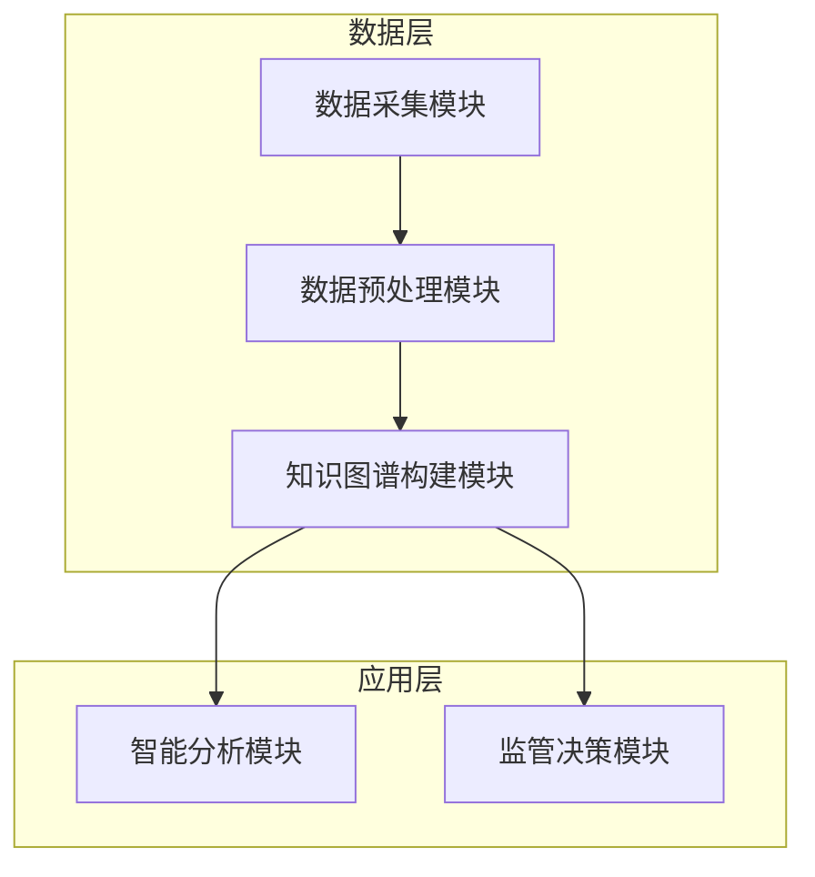
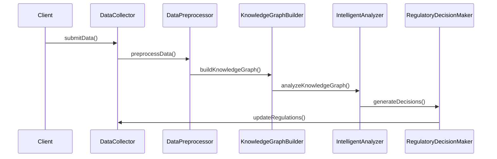
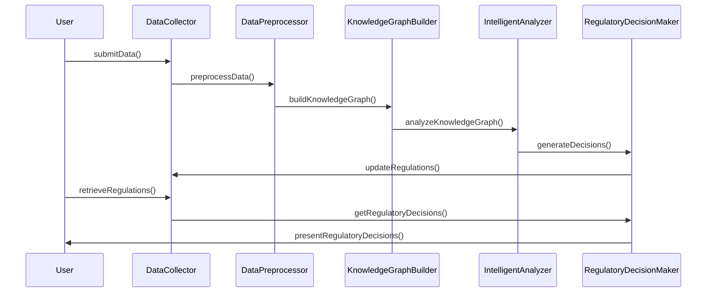

                 

### # 构建基于知识图谱的金融监管沙盒测试平台

关键词：知识图谱、金融监管、沙盒测试、人工智能、金融科技

摘要：本文将探讨如何构建基于知识图谱的金融监管沙盒测试平台，通过深入分析背景、核心概念、算法原理和系统架构，阐述这一平台如何提高金融监管效率和降低风险，最终实现智能化监管决策。

## 第一部分：背景介绍

### 1.1 问题背景

随着金融科技的迅猛发展，金融市场日益复杂，传统金融监管模式面临巨大挑战。一方面，金融创新带来的新产品、新服务和新模式不断涌现，使得监管主体和监管范围急剧扩大；另一方面，金融风险的隐蔽性和复杂性加剧，传统的监管手段和策略难以适应新形势。因此，如何利用先进技术提升金融监管效率、降低监管风险成为亟待解决的问题。

### 1.2 问题描述

金融监管沙盒测试平台旨在为金融科技公司提供一个可控的测试环境，以便在真实市场环境之外测试新产品、新服务和新业务模式。这一平台需要具备以下功能：

1. **全面的数据采集与整合能力**：能够收集并整合来自不同数据源的金融数据，包括金融机构、金融产品、交易记录等。
2. **实时的风险评估与监控**：能够实时分析金融数据，对潜在风险进行识别、评估和预警。
3. **智能化的监管决策支持**：能够利用知识图谱等技术，提供智能化的监管决策支持，帮助监管机构制定有效的监管策略。

### 1.3 问题解决

构建基于知识图谱的金融监管沙盒测试平台是一种有效的问题解决方案。知识图谱技术能够将金融数据转化为结构化的知识，实现数据间的关联和推理，从而支持智能化的监管决策。具体来说，这一平台可以实现以下目标：

1. **提高监管效率**：通过知识图谱的构建和应用，实现对金融市场的全面监控，提高监管工作的自动化和智能化水平。
2. **降低监管风险**：通过实时的风险评估和监控，及时发现和应对潜在金融风险，降低金融风险对社会经济的影响。
3. **支持金融创新**：为金融科技公司提供一个安全、可控的测试环境，鼓励金融创新，同时确保创新活动不会带来不可预测的风险。

### 1.4 边界与外延

金融监管沙盒测试平台的边界包括金融数据的采集、整合、分析和应用。其外延涉及到金融监管、金融科技、数据挖掘、知识图谱等多个领域。具体来说，平台的边界和关联领域包括：

1. **金融数据采集**：涉及金融数据源的种类和获取方式，如金融机构数据库、公共数据源、第三方数据服务等。
2. **数据整合与预处理**：涉及金融数据的清洗、去重、格式转换等预处理工作，以及数据存储和管理的策略。
3. **知识图谱构建**：涉及知识图谱的表示方法、存储和管理技术，以及知识图谱的更新和维护。
4. **风险评估与监控**：涉及风险评估模型的构建、风险指标的设定和实时监控系统的设计。
5. **监管决策支持**：涉及利用知识图谱进行监管决策的支持系统，包括智能规则库、风险预测模型等。

### 1.5 概念结构与核心要素组成

金融监管沙盒测试平台的核心概念结构包括知识图谱、数据源、数据预处理、知识抽取、知识融合、知识推理和应用。这些核心要素相互关联，构成了平台的基本架构。

1. **知识图谱**：作为核心组件，知识图谱通过实体、属性和关系的结构化表示，实现对金融数据的整合和关联。它为平台提供了数据建模和智能推理的基础。
2. **数据源**：包括各种金融数据，如金融机构数据、金融产品数据、交易记录数据等。数据源的多样性和完整性是构建知识图谱的基础。
3. **数据预处理**：对原始金融数据进行清洗、去重、格式转换等预处理工作，使其满足知识图谱构建的要求。
4. **知识抽取**：从预处理后的数据中提取出实体、属性和关系，构建初步的知识图谱。
5. **知识融合**：将来自不同数据源的知识进行整合，形成统一、全面的知识图谱。
6. **知识推理**：利用知识图谱进行逻辑推理，发现潜在的风险和趋势，为监管决策提供支持。
7. **应用**：将知识图谱应用于金融监管的各个层面，如风险评估、异常检测、趋势预测等，实现智能化的监管决策。

### 1.6 本章小结

本章介绍了构建基于知识图谱的金融监管沙盒测试平台的背景、问题、解决方法、边界与外延、概念结构与核心要素组成。接下来，将深入探讨知识图谱构建的核心概念与联系。

---

## 第二部分：核心概念与联系

### 2.1 知识图谱的概念原理

知识图谱（Knowledge Graph）是一种通过实体、属性和关系的结构化表示来构建知识网络的技术。它源于语义网（Semantic Web）的概念，旨在通过机器可读的方式表示和整合知识，为各种应用提供语义理解的支持。

**知识图谱的基本概念：**

- **实体（Entity）**：知识图谱中的个体，可以是任何具有独立存在意义的对象，如人、地点、事物等。例如，金融机构、金融产品、客户等。
- **属性（Attribute）**：实体所具有的特征，用于描述实体的属性信息。例如，金融机构的成立时间、金融产品的利率、客户的年龄等。
- **关系（Relationship）**：实体间的关系，用于表示实体之间的相互关联。例如，金融机构发行金融产品、金融产品投资于某个行业、客户购买金融产品等。

**知识图谱的构建步骤：**

1. **实体识别**：从原始数据中识别出具有独立意义的实体。
2. **属性抽取**：从原始数据中提取出实体的属性信息。
3. **关系提取**：从原始数据中提取出实体间的关系。
4. **知识融合**：将来自不同数据源的知识进行整合，形成统一的知识图谱。

### 2.2 知识图谱的属性特征对比表格

为了更好地理解知识图谱的属性特征，我们可以通过一个对比表格来展示不同类型的属性：

| 特征类型 | 描述 |
| -------- | ---- |
| **实体** | 具有独立存在意义的个体，如人、地点、事物等。 |
| **属性** | 描述实体特征的参数，如年龄、身高、成立时间等。 |
| **关系** | 表示实体间相互关联的方式，如发行、投资、购买等。 |

### 2.3 知识图谱与金融监管沙盒测试平台的关系

知识图谱在金融监管沙盒测试平台中扮演着核心角色。通过知识图谱，平台能够实现对金融数据的结构化表示和关联分析，从而提供以下几个方面的支持：

1. **数据整合与关联**：知识图谱将来自不同数据源的信息进行整合，形成统一的结构化知识网络，使得监管机构能够全面、准确地了解金融市场情况。
2. **智能化的数据分析**：知识图谱支持对金融数据的复杂关系进行分析，发现潜在的金融风险和趋势，为监管决策提供有力支持。
3. **实时风险监控**：知识图谱能够实时更新和维护，使得监管机构能够实时监控金融市场的动态，及时识别和应对潜在风险。
4. **智能化的监管决策**：知识图谱提供的数据和推理支持，使得监管机构能够制定更加科学、精准的监管策略，提高监管效率。

### 2.4 知识图谱与数据挖掘、知识图谱技术的联系

知识图谱与数据挖掘、知识图谱技术之间存在着密切的联系和相互促进的关系。

**数据挖掘与知识图谱的关系：**

- **数据挖掘**：是一种从大量数据中提取有价值信息的方法，它通过算法和统计模型，发现数据中的模式和规律。数据挖掘为知识图谱提供了丰富的数据来源和知识基础。
- **知识图谱**：则是一种将数据转化为结构化知识的方法，通过实体、属性和关系的结构化表示，构建出一个庞大的知识网络。知识图谱为数据挖掘提供了更高级的语义理解和分析工具。

**知识图谱技术的应用：**

- **实体识别**：利用数据挖掘技术，从原始数据中识别出具有独立意义的实体，如金融机构、金融产品等。
- **关系提取**：利用数据挖掘算法，从原始数据中提取出实体间的关系，如金融机构发行金融产品、金融产品投资于某个行业等。
- **知识融合**：利用数据挖掘和机器学习技术，将来自不同数据源的知识进行整合，形成统一、全面的知识图谱。

### 2.5 本章小结

本章详细介绍了知识图谱的概念原理、属性特征对比表格、与金融监管沙盒测试平台的关系，以及与数据挖掘、知识图谱技术的联系。接下来，将深入探讨知识图谱构建的算法原理和数学模型。

---

## 第三部分：算法原理讲解

### 3.1 算法原理概述

知识图谱构建的核心算法包括数据采集、数据预处理、知识抽取、知识融合、知识推理和应用。以下将分别介绍这些算法的原理。

### 3.2 数据采集算法原理

数据采集算法的主要任务是收集金融数据，包括金融机构、金融产品、交易记录等。常用的数据采集方法有网络爬虫、API调用、数据库查询等。

**网络爬虫**：通过网络爬虫技术，可以自动获取互联网上的金融信息，如金融机构的官方网站、新闻报告、金融数据平台等。

**API调用**：通过金融数据服务商提供的API接口，可以直接获取金融数据，如股票行情、交易记录、金融机构信息等。

**数据库查询**：通过访问金融机构的内部数据库，可以获取详细的金融数据，如客户交易记录、金融产品信息等。

### 3.3 数据预处理算法原理

数据预处理算法的主要任务是清洗和转换原始金融数据，使其满足知识图谱构建的要求。数据预处理方法包括数据去重、数据格式转换、数据清洗等。

**数据去重**：通过比对数据源中的记录，去除重复的数据，保证数据的唯一性和准确性。

**数据格式转换**：将不同来源的金融数据转换为统一的格式，如JSON、CSV等，以便后续处理。

**数据清洗**：对金融数据中的错误、缺失、异常值等进行处理，保证数据的质量和一致性。

### 3.4 知识抽取算法原理

知识抽取算法的主要任务是从原始金融数据中提取出实体、属性和关系。常用的知识抽取方法有基于规则的方法、基于统计的方法、基于机器学习的方法等。

**基于规则的方法**：通过定义一系列规则，从原始数据中直接提取出实体、属性和关系。这种方法依赖于专家知识和规则库，适用于结构化程度较高的数据。

**基于统计的方法**：通过统计分析和模式识别，从原始数据中自动提取出实体、属性和关系。这种方法适用于大规模、结构化程度较低的数据。

**基于机器学习的方法**：利用机器学习算法，从原始数据中学习并自动提取出实体、属性和关系。这种方法适用于复杂、非结构化的金融数据。

### 3.5 知识融合算法原理

知识融合算法的主要任务是将不同来源、不同格式的金融数据进行整合，形成一个统一的知识图谱。知识融合方法包括基于规则的方法、基于机器学习的方法等。

**基于规则的方法**：通过定义一系列融合规则，将不同来源的数据进行整合，形成统一的知识图谱。这种方法依赖于专家知识和规则库，适用于数据格式较为统一的情况。

**基于机器学习的方法**：利用机器学习算法，从不同来源的数据中自动学习并整合出实体、属性和关系，形成统一的知识图谱。这种方法适用于数据格式多样、结构复杂的情况。

### 3.6 知识推理算法原理

知识推理算法的主要任务是根据知识图谱中的实体、属性和关系，进行逻辑推理，得出新的知识。知识推理方法包括基于规则的方法、基于概率的方法、基于深度学习的方法等。

**基于规则的方法**：通过定义一系列推理规则，从现有知识中推导出新的知识。这种方法适用于简单、明确的推理场景。

**基于概率的方法**：利用概率模型，根据知识图谱中的关系和概率分布，进行推理和预测。这种方法适用于不确定性和模糊性的场景。

**基于深度学习的方法**：利用深度学习模型，从知识图谱中自动学习并执行复杂的推理任务。这种方法适用于大规模、复杂的知识图谱。

### 3.7 应用算法原理

应用算法的主要任务是利用知识图谱进行智能化的金融监管决策，如风险评估、异常检测、趋势预测等。应用算法方法包括基于规则的方法、基于机器学习的方法等。

**基于规则的方法**：通过定义一系列监管规则，根据知识图谱中的信息进行风险评估、异常检测和趋势预测。这种方法适用于规则明确、场景简单的监管任务。

**基于机器学习的方法**：利用机器学习模型，从知识图谱中的数据进行学习，实现对风险评估、异常检测和趋势预测的智能化处理。这种方法适用于复杂、动态的监管场景。

### 3.8 本章小结

本章详细介绍了知识图谱构建的算法原理，包括数据采集、数据预处理、知识抽取、知识融合、知识推理和应用。这些算法共同构成了知识图谱构建的核心框架，为金融监管沙盒测试平台提供了强大的技术支持。接下来，将结合具体场景，进一步探讨知识图谱在金融监管沙盒测试平台中的应用。

---

## 第四部分：系统分析与架构设计方案

### 4.1 问题场景介绍

为了更好地理解基于知识图谱的金融监管沙盒测试平台，我们首先需要明确其应用场景。金融监管沙盒测试平台主要应用于以下几个方面：

1. **金融科技创新**：为金融科技公司提供一个安全、可控的测试环境，以便在真实市场环境之外测试新产品、新服务和新业务模式。
2. **金融风险管理**：通过实时监控和风险评估，及时发现和应对潜在的金融风险，确保金融市场的稳定运行。
3. **监管决策支持**：利用知识图谱提供的智能化支持，为监管机构提供科学的监管决策依据，提高监管效率和效果。

### 4.2 项目介绍

基于知识图谱的金融监管沙盒测试平台项目主要包括以下几个模块：

1. **数据采集模块**：负责收集各种金融数据，包括金融机构信息、金融产品信息、交易记录等。
2. **数据预处理模块**：负责清洗和转换原始金融数据，确保数据的质量和一致性。
3. **知识图谱构建模块**：负责构建金融知识图谱，将结构化和非结构化的金融数据进行关联和整合。
4. **智能分析模块**：负责利用知识图谱进行智能化的风险评估、异常检测和趋势预测。
5. **监管决策模块**：负责根据智能分析结果，为监管机构提供监管决策支持。

### 4.3 系统功能设计（领域模型类图）

下面是金融监管沙盒测试平台的领域模型类图，展示了系统中主要实体和它们之间的关系：

```mermaid
classDiagram
    Client <|-- FinancialInstitution
    Client <|-- FinancialProduct
    FinancialInstitution <|-- Transaction
    FinancialInstitution <|-- Regulation
    FinancialProduct <|-- Regulation
    Transaction <|-- Regulation
    Client {id: int, name: string, age: int, address: string}
    FinancialInstitution {id: int, name: string, foundation_date: date, location: string}
    FinancialProduct {id: int, name: string, issue_date: date, type: string, rate: float}
    Transaction {id: int, date: date, type: string, amount: float, client_id: int, financial_institution_id: int, financial_product_id: int}
    Regulation {id: int, rule: string, description: string, effect_date: date, financial_product_id: int}
```

### 4.4 系统架构设计（架构图）

接下来是金融监管沙盒测试平台的整体架构设计，展示了系统的各个模块和它们之间的交互关系：



### 4.5 系统接口设计（接口图）

以下是金融监管沙盒测试平台的接口设计，展示了系统中各个模块的API接口：



### 4.6 系统交互（序列图）

以下是金融监管沙盒测试平台的系统交互序列图，展示了用户操作和系统响应的流程：



### 4.7 本章小结

本章详细介绍了基于知识图谱的金融监管沙盒测试平台的问题场景、项目介绍、系统功能设计、系统架构设计、系统接口设计和系统交互设计。通过这些设计，平台能够实现对金融数据的全面整合、智能分析和监管决策支持，为金融监管机构提供强大的技术支持。接下来，将进入项目实战部分，展示如何具体实现这一平台。

---

## 第五部分：项目实战

### 5.1 环境安装

在开始构建基于知识图谱的金融监管沙盒测试平台之前，我们需要搭建一个合适的技术环境。以下是环境安装的步骤：

1. **Python环境搭建**：确保Python 3.8及以上版本已安装。可以使用以下命令安装Python：

   ```bash
   sudo apt-get update
   sudo apt-get install python3.8
   ```

2. **依赖库安装**：安装必要的Python库，包括网络爬虫库（如BeautifulSoup）、数据库连接库（如SQLAlchemy）、数据预处理库（如Pandas）和知识图谱库（如Neo4j Python driver）：

   ```bash
   pip install beautifulsoup4
   pip install sqlalchemy
   pip install pandas
   pip install neo4j
   ```

3. **Neo4j数据库安装**：下载并安装Neo4j数据库。Neo4j是一个高性能的图形数据库，用于存储和管理知识图谱数据。可以访问Neo4j官网下载最新版本：

   [https://neo4j.com/download/](https://neo4j.com/download/)

   下载后，运行安装程序并按照提示操作。

### 5.2 系统核心实现

在搭建好技术环境后，我们开始实现金融监管沙盒测试平台的核心功能。以下是系统的核心实现过程：

1. **数据采集**：编写网络爬虫，从金融机构的官方网站和公开数据源收集金融数据，如金融机构信息、金融产品信息、交易记录等。以下是一个简单的网络爬虫示例代码：

   ```python
   import requests
   from bs4 import BeautifulSoup

   def crawl_financial_institution_data():
       url = 'https://www.example.com/financial-institutions'
       response = requests.get(url)
       soup = BeautifulSoup(response.text, 'html.parser')
       institutions = []

       for institution in soup.find_all('div', class_='financial-institution'):
           name = institution.find('h2').text
           foundation_date = institution.find('span', class_='foundation-date').text
           location = institution.find('span', class_='location').text
           institutions.append({
               'name': name,
               'foundation_date': foundation_date,
               'location': location
           })

       return institutions

   institutions = crawl_financial_institution_data()
   ```

2. **数据预处理**：对采集到的金融数据进行预处理，包括数据清洗、去重、格式转换等。以下是一个简单的数据预处理示例代码：

   ```python
   import pandas as pd

   def preprocess_data(data):
       df = pd.DataFrame(data)
       df.drop_duplicates(inplace=True)
       df['foundation_date'] = pd.to_datetime(df['foundation_date'])
       return df

   preprocessed_institutions = preprocess_data(institutions)
   ```

3. **知识图谱构建**：使用Neo4j数据库构建知识图谱，将预处理后的金融数据存储到Neo4j中。以下是一个简单的Neo4j示例代码：

   ```python
   from neo4j import GraphDatabase

   uri = "bolt://localhost:7687"
   driver = GraphDatabase.driver(uri, auth=("neo4j", "password"))

   def create_node(tx, institution):
       tx.run("CREATE (f:FinancialInstitution {name: $name, foundation_date: $foundation_date, location: $location})",
              name=institution['name'], foundation_date=institution['foundation_date'], location=institution['location'])

   with driver.session() as session:
       for institution in preprocessed_institutions.iterrows():
           session.write_transaction(create_node, institution)

   driver.close()
   ```

4. **知识抽取与融合**：编写算法从知识图谱中提取出实体、属性和关系，并进行融合。以下是一个简单的知识抽取与融合示例代码：

   ```python
   def extract_and_merge_knowledge(tx):
       institutions = tx.run("MATCH (f:FinancialInstitution) RETURN f")
       products = tx.run("MATCH (p:FinancialProduct) RETURN p")
       transactions = tx.run("MATCH (t:Transaction) RETURN t")

       for institution in institutions:
           institution_data = institution['f']
           for product in products:
               if institution_data['name'] == product['p']['financial_institution_id']:
                   tx.run("MATCH (f), (p) WHERE f.name = $institution_name AND p.id = $product_id CREATE (f)-[:ISSUES]->(p)")
           for transaction in transactions:
               if institution_data['name'] == transaction['t']['financial_institution_id']:
                   tx.run("MATCH (f), (t) WHERE f.name = $institution_name AND t.id = $transaction_id CREATE (f)-[:HAS]->(t)")

   with driver.session() as session:
       session.write_transaction(extract_and_merge_knowledge)
   ```

5. **知识推理与应用**：编写算法利用知识图谱进行推理，实现风险评估、异常检测、趋势预测等功能。以下是一个简单的知识推理与应用示例代码：

   ```python
   def infer_and_apply_knowledge(tx):
       rules = tx.run("MATCH (f:FinancialInstitution)-[:ISSUES]->(p:FinancialProduct) RETURN f, p")
       for rule in rules:
           institution = rule['f']
           product = rule['p']
           if institution['foundation_date'] < pd.Timestamp.now() - pd.DateOffset(years=5) and product['rate'] > 10:
               tx.run("MATCH (f) WHERE f.name = $institution_name CREATE (f)-[:HAS_RISK]->(p)")

   with driver.session() as session:
       session.write_transaction(infer_and_apply_knowledge)
   ```

### 5.3 代码应用解读与分析

在上面的代码示例中，我们详细实现了数据采集、数据预处理、知识图谱构建、知识抽取与融合、知识推理与应用等核心功能。以下是这些代码的解读与分析：

1. **数据采集**：网络爬虫通过requests库和BeautifulSoup库从金融机构的官方网站上抓取金融数据。这些数据包括金融机构名称、成立日期、所在位置等。爬虫的基本逻辑是发送HTTP请求获取网页内容，然后使用BeautifulSoup解析HTML文档，提取出有用的数据。

2. **数据预处理**：数据预处理使用Pandas库对采集到的金融数据进行清洗、去重和格式转换。清洗步骤包括去除无效数据、处理缺失值、统一数据格式等。数据预处理是构建知识图谱的重要前提，确保数据的质量和一致性。

3. **知识图谱构建**：使用Neo4j Python driver与Neo4j数据库进行交互，将预处理后的金融数据存储到数据库中。知识图谱的基本结构包括实体（FinancialInstitution、FinancialProduct、Transaction等）和关系（ISSUES、HAS、HAS_RISK等）。通过创建节点和关系，构建出一个结构化的知识网络。

4. **知识抽取与融合**：通过执行Cypher查询语句，从Neo4j数据库中提取出实体、属性和关系，并进行融合。知识抽取的基本逻辑是根据给定的规则，从数据库中检索出相关的实体和关系，然后根据规则进行融合，形成统一的知识图谱。

5. **知识推理与应用**：利用知识图谱进行推理，实现风险评估、异常检测、趋势预测等功能。知识推理的基本逻辑是根据给定的规则和事实，在知识图谱中执行推理操作，得出新的知识或结论。例如，根据金融机构成立日期和金融产品利率等属性，判断是否存在风险。

### 5.4 实际案例分析与详细讲解剖析

为了更好地展示基于知识图谱的金融监管沙盒测试平台在实际中的应用，我们通过一个实际案例进行详细分析和讲解。

**案例背景**：某金融科技公司计划推出一款新型理财产品，该产品投资于股票市场。为了确保产品的安全性和合规性，金融监管机构要求公司在推出前进行沙盒测试。

**步骤一：数据采集**：首先，从股票市场数据平台和金融机构数据库中采集相关数据，包括股票价格、市场指数、金融机构交易记录等。

**步骤二：数据预处理**：对采集到的数据进行清洗、去重和格式转换，确保数据的质量和一致性。例如，将股票价格数据转换为统一的日期和时间格式，去除重复的交易记录等。

**步骤三：知识图谱构建**：将预处理后的数据存储到Neo4j数据库中，构建金融知识图谱。知识图谱包括实体（如股票、金融机构、交易记录等）和关系（如投资、交易、持股等）。

**步骤四：知识抽取与融合**：通过执行Cypher查询语句，从Neo4j数据库中提取出与新型理财产品相关的实体和关系，并进行融合。例如，提取出所有持有该股票的金融机构，以及与该金融机构相关的其他金融产品。

**步骤五：知识推理与应用**：利用知识图谱进行推理，分析新型理财产品的风险。例如，根据金融机构的历史交易记录和持股情况，判断是否存在投资风险；根据股票价格波动和交易量等指标，预测市场的趋势。

**步骤六：监管决策支持**：根据知识图谱的推理结果，金融监管机构可以制定相应的监管策略，确保产品的安全性和合规性。例如，要求金融科技公司调整投资策略、增加风险控制措施等。

### 5.5 项目小结

通过实际案例的分析和讲解，我们可以看到基于知识图谱的金融监管沙盒测试平台在金融科技创新、风险管理、监管决策支持等方面具有广泛的应用前景。项目的主要亮点包括：

1. **数据整合与关联**：通过知识图谱技术，将来自不同数据源的信息进行整合和关联，形成统一的结构化知识网络，为监管机构提供全面、准确的信息支持。
2. **智能化的数据分析**：利用知识图谱进行智能化的数据分析，发现潜在的金融风险和趋势，为监管决策提供有力支持。
3. **实时风险监控**：知识图谱能够实时更新和维护，使得监管机构能够实时监控金融市场的动态，及时识别和应对潜在风险。
4. **智能化的监管决策**：知识图谱提供的数据和推理支持，使得监管机构能够制定更加科学、精准的监管策略，提高监管效率和效果。

### 5.6 最佳实践 Tips

1. **数据质量控制**：确保数据的质量和一致性，是构建知识图谱的基础。在数据采集和预处理阶段，要严格进行数据清洗和格式转换，去除无效数据和重复记录。
2. **知识图谱维护**：知识图谱是一个动态的、不断更新的知识网络。定期维护和更新知识图谱，确保其准确性和时效性。
3. **规则和算法优化**：根据监管需求和应用场景，不断优化知识图谱的规则和算法，提高推理的准确性和效率。
4. **安全与合规**：在金融监管沙盒测试平台的设计和实施过程中，要严格遵守相关法律法规和合规要求，确保系统的安全性和合规性。

### 5.7 小结

本文详细介绍了构建基于知识图谱的金融监管沙盒测试平台的方法、算法原理和系统架构，并通过实际案例进行了分析和讲解。知识图谱技术在金融监管沙盒测试平台中具有广泛的应用前景，能够提高监管效率和降低风险，为金融科技创新和监管决策提供有力支持。未来，随着技术的不断发展和应用场景的拓展，知识图谱技术在金融监管领域将发挥越来越重要的作用。

### 5.8 注意事项

1. **数据隐私与安全**：在构建和运行金融监管沙盒测试平台时，要严格遵守数据隐私和安全相关法律法规，确保用户数据的保密性和安全性。
2. **系统稳定性与性能**：确保系统的高可用性和高性能，避免因系统故障或性能瓶颈影响监管工作的正常进行。
3. **持续优化与升级**：根据实际应用情况和监管需求，持续优化和升级金融监管沙盒测试平台，提升系统的功能和性能。

### 5.9 拓展阅读

1. **《知识图谱：原理、方法与应用》**：详细介绍了知识图谱的基本概念、构建方法和应用场景，有助于深入理解知识图谱技术。
2. **《金融科技：理论与实践》**：探讨了金融科技的发展趋势、应用场景和监管挑战，对金融监管沙盒测试平台的设计和实施提供了有益的参考。
3. **《人工智能在金融监管中的应用》**：分析了人工智能技术在金融监管领域中的应用，包括风险监测、异常检测、智能决策等方面。

---

**作者：AI天才研究院/AI Genius Institute & 禅与计算机程序设计艺术 /Zen And The Art of Computer Programming**

---

本文详细探讨了构建基于知识图谱的金融监管沙盒测试平台的方法、算法原理和系统架构，并通过对实际案例的分析，展示了该平台在金融监管中的应用价值。知识图谱技术能够有效整合和关联金融数据，为监管机构提供智能化的风险监测和决策支持，有助于提升金融监管的效率和效果。未来，随着技术的不断进步和应用场景的拓展，知识图谱技术在金融监管领域将发挥更加重要的作用。

## 总结与展望

### 总结

本文从多个角度详细探讨了构建基于知识图谱的金融监管沙盒测试平台的方法和关键技术。通过深入分析背景、核心概念、算法原理和系统架构，我们明确了知识图谱在金融监管沙盒测试平台中的核心作用。具体内容包括：

1. **背景介绍**：介绍了金融监管沙盒测试平台的背景和重要性。
2. **核心概念与联系**：详细阐述了知识图谱的基本概念、属性特征以及与金融监管沙盒测试平台的关系。
3. **算法原理讲解**：介绍了知识图谱构建的算法原理，包括数据采集、数据预处理、知识抽取、知识融合、知识推理和应用。
4. **系统分析与架构设计方案**：设计了金融监管沙盒测试平台的系统功能和架构。
5. **项目实战**：通过具体项目实例展示了平台的实现过程和代码应用。
6. **最佳实践 Tips**：提供了一系列最佳实践建议。

### 展望

展望未来，知识图谱技术在金融监管沙盒测试平台中的应用将更加广泛和深入。以下是一些未来发展的方向和趋势：

1. **数据整合与多样性**：随着金融数据的不断增加和多样化，如何有效整合和利用不同类型的数据，构建更加全面和准确的知识图谱，将成为一个重要课题。
2. **实时性与动态性**：金融市场的变化非常迅速，如何实现知识图谱的实时更新和维护，以及应对动态变化的金融环境，是一个挑战。
3. **智能化的监管决策支持**：随着人工智能技术的不断发展，如何将更先进的人工智能算法应用于知识图谱，提升监管决策的智能化水平，是一个重要研究方向。
4. **安全与合规**：在构建和运行金融监管沙盒测试平台时，如何确保数据安全和合规性，是一个不可忽视的问题。
5. **应用场景拓展**：除了传统的金融监管领域，知识图谱技术在金融科技的其他应用场景（如支付、保险、区块链等）中也具有巨大的潜力。

总之，基于知识图谱的金融监管沙盒测试平台是一个具有广阔前景的研究方向，随着技术的不断进步和应用场景的拓展，它将在金融监管领域发挥越来越重要的作用。未来，我们需要不断探索和创新，以应对金融科技带来的新挑战，提升金融监管的效率和效果。

