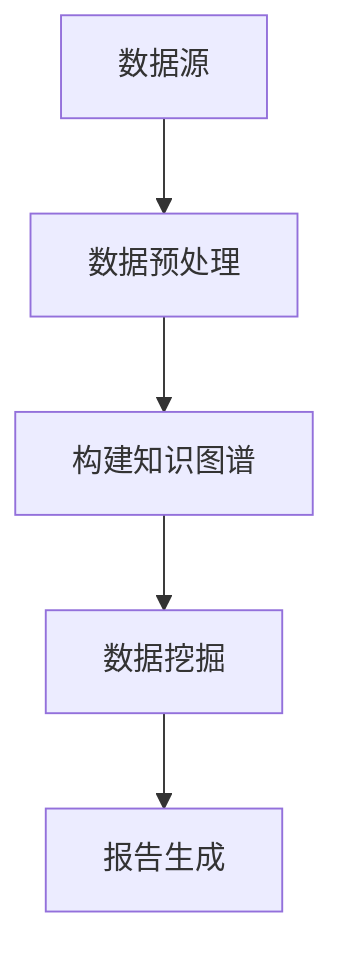
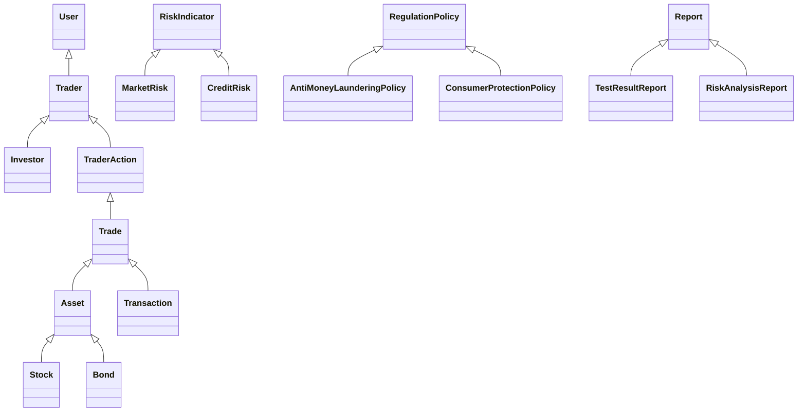
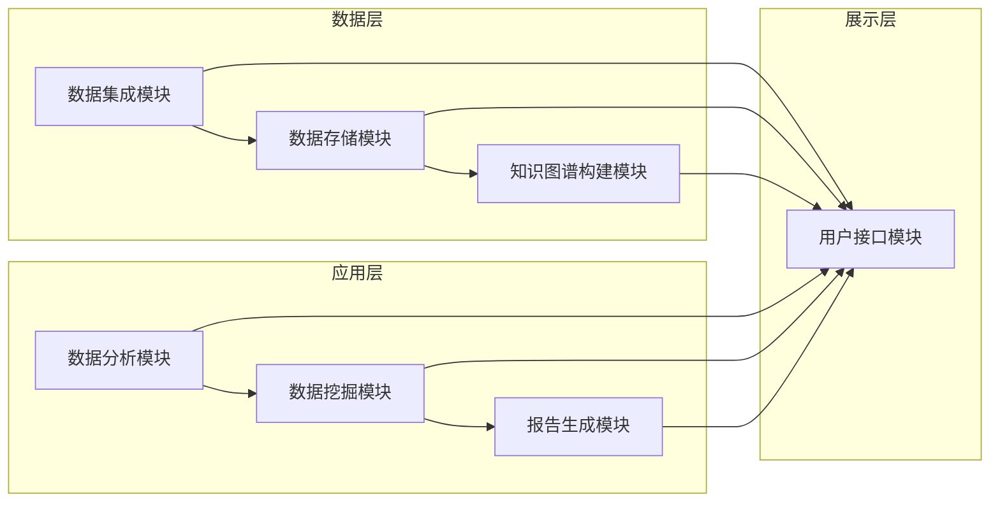
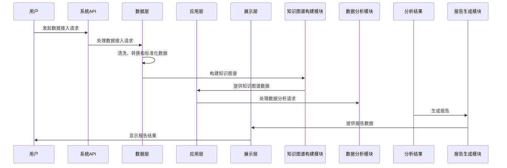

                 

# 构建基于知识图谱的金融监管沙盒测试结果分析平台

## 摘要

本文旨在探讨如何构建一个基于知识图谱的金融监管沙盒测试结果分析平台。首先，我们介绍了背景问题，阐述了当前金融监管沙盒测试结果分析平台存在的不足。接着，我们提出了基于知识图谱的解决方案，并详细分析了其核心概念、联系和算法原理。此外，我们还介绍了系统分析与架构设计方案，并通过实际案例进行了项目实战讲解。最后，我们总结了最佳实践技巧和注意事项，并提供了拓展阅读。

## 关键词

知识图谱、金融监管、沙盒测试、数据分析、系统架构

## 第一部分：背景介绍

### 1.1 问题背景

随着金融科技的快速发展，金融产品和服务越来越复杂，金融监管沙盒测试成为金融机构和创新企业测试新型金融产品和服务的重要工具。然而，现有的金融监管沙盒测试结果分析平台存在以下问题：

1. 数据集成困难：不同来源的数据格式、结构和质量差异较大，难以进行有效的集成和分析。
2. 数据分析能力有限：现有平台的数据分析功能较为单一，无法全面挖掘数据中的潜在价值。
3. 监管政策适应性不强：现有平台对监管政策的适应性较弱，难以快速调整测试结果的分析方法。

### 1.1.1 问题描述

为了提高金融监管沙盒测试的效果和效率，有必要构建一个基于知识图谱的金融监管沙盒测试结果分析平台。这样的平台应具备以下能力：

1. 高效的数据集成和处理：能够整合来自不同来源、不同格式、不同质量的数据，并对其进行有效的清洗、转换和标准化。
2. 强大的数据分析能力：利用知识图谱技术，对测试数据进行深度分析和挖掘，提取有价值的信息和洞察。
3. 高度的监管政策适应性：能够根据监管政策的变化，动态调整测试结果的分析方法和指标。

### 1.1.2 问题解决

基于知识图谱的金融监管沙盒测试结果分析平台具有以下优势：

1. 数据集成与处理：利用知识图谱技术，实现不同来源、不同格式、不同质量数据的高效集成和处理。
2. 数据分析能力提升：通过知识图谱，实现对测试数据的深度分析和挖掘，发现潜在风险和优化建议。
3. 监管政策适应性增强：基于知识图谱的动态更新机制，实现监管政策的实时适配，提高测试结果的准确性。

### 1.1.3 边界与外延

本文所述的金融监管沙盒测试结果分析平台主要涉及以下边界与外延：

1. 数据范围：包括金融监管沙盒测试过程中产生的各类数据，如用户行为数据、交易数据、风险指标数据等。
2. 监管政策：涵盖各类金融监管政策，如反洗钱政策、消费者保护政策、市场行为规范等。
3. 技术范围：涉及知识图谱构建、数据挖掘、机器学习等技术。

### 1.1.4 核心概念结构与要素组成

核心概念结构包括以下几个方面：

1. 知识图谱：用于构建金融监管沙盒测试结果分析平台的核心数据模型，包括实体、关系和属性等。
2. 数据源：用于提供金融监管沙盒测试结果的各类数据，包括内部数据和外部数据。
3. 分析引擎：用于对知识图谱中的数据进行深度分析和挖掘，生成测试结果报告。
4. 用户接口：用于用户与平台的交互，包括数据录入、查询、报告生成等功能。

### 1.2 核心概念与联系

#### 1.2.1 知识图谱

知识图谱是一种语义网络，用于将各类信息资源有机地整合在一起。在金融监管沙盒测试结果分析平台中，知识图谱主要由以下要素组成：

1. **实体**：表示金融监管沙盒测试结果中的各类对象，如用户、交易、风险指标等。
2. **关系**：表示实体之间的相互关系，如用户与交易之间的关系、交易与风险指标之间的关系等。
3. **属性**：表示实体的属性特征，如用户的年龄、性别、交易的时间、金额等。

#### 1.2.2 数据源

数据源是金融监管沙盒测试结果分析平台的基础，主要包括以下类型：

1. **内部数据**：包括金融监管沙盒测试过程中产生的各类数据，如用户行为数据、交易数据、风险指标数据等。
2. **外部数据**：包括与金融监管相关的各类数据，如监管政策、市场数据、经济数据等。

#### 1.2.3 分析引擎

分析引擎是金融监管沙盒测试结果分析平台的核心组件，负责对知识图谱中的数据进行深度分析和挖掘。主要功能包括：

1. **数据预处理**：对知识图谱中的数据进行清洗、转换和标准化等预处理操作。
2. **数据挖掘**：利用机器学习和数据挖掘算法，对知识图谱中的数据进行深度分析和挖掘。
3. **报告生成**：根据分析结果，生成可视化报告和决策建议。

### 1.3 算法原理讲解

#### 1.3.1 算法mermaid流程图



#### 1.3.2 算法原理

1. **数据预处理**：通过数据清洗、转换和标准化等操作，将原始数据转化为可用于构建知识图谱的格式。
2. **构建知识图谱**：将预处理后的数据转化为实体、关系和属性等要素，构建知识图谱模型。
3. **数据挖掘**：利用机器学习和数据挖掘算法，对知识图谱中的数据进行深度分析和挖掘，提取测试结果中的关键信息。
4. **报告生成**：根据分析结果，生成可视化报告和决策建议，为金融监管提供有力支持。

#### 1.3.3 算法原理数学模型和公式

1. **数据预处理**：
$$
\text{清洗}(\text{原始数据}) = \text{清洗后的数据}
$$
2. **构建知识图谱**：
$$
\text{知识图谱} = (\text{实体}, \text{关系}, \text{属性})
$$
3. **数据挖掘**：
$$
\text{特征提取}(\text{知识图谱}) = \text{特征数据集}
$$
4. **报告生成**：
$$
\text{报告} = \text{可视化数据} + \text{决策建议}
$$`

## 第二部分：系统分析与架构设计

### 2.1 问题场景介绍

在金融监管领域，金融机构和创新企业需要测试新型金融产品和服务，以确保其符合监管政策，降低风险。然而，现有的测试结果分析平台存在数据集成困难、分析能力有限和监管政策适应性不强等问题。为了解决这些问题，我们设计并实现了一个基于知识图谱的金融监管沙盒测试结果分析平台。

### 2.2 项目介绍

该平台名为“金融监管沙盒测试结果分析系统”（Financial Regulatory Sandbox Test Results Analysis System，简称FRSTARS），旨在为金融机构和创新企业提供高效、准确的测试结果分析服务。系统采用先进的知识图谱技术，能够实现数据集成、数据分析和报告生成等功能。

### 2.3 系统功能设计

#### 2.3.1 领域模型

领域模型是系统设计的基础，用于描述金融监管沙盒测试结果分析平台中的关键概念和关系。以下是一个简化版的领域模型，使用Mermaid类图表示：



#### 2.3.2 功能说明

1. **数据集成与处理**：系统支持多种数据源的接入，包括内部数据和外部数据。数据集成后，通过清洗、转换和标准化等操作，确保数据的质量和一致性。
2. **知识图谱构建**：基于领域模型，系统将数据转化为实体、关系和属性，构建知识图谱。知识图谱能够表示复杂的金融关系和监管政策。
3. **数据分析与挖掘**：利用知识图谱，系统可以对测试结果进行深度分析和挖掘，提取有价值的信息和洞察。包括风险分析、趋势预测、合规性评估等。
4. **报告生成**：根据分析结果，系统生成可视化报告和决策建议，帮助金融机构和创新企业了解测试结果，制定相应的策略。

### 2.4 系统架构设计

#### 2.4.1 架构设计

系统采用分布式架构，分为数据层、应用层和展示层。

1. **数据层**：包括数据集成模块、数据存储模块和知识图谱构建模块。数据集成模块负责接入和处理各类数据；数据存储模块负责存储和管理数据；知识图谱构建模块负责将数据转化为知识图谱。
2. **应用层**：包括数据分析模块、数据挖掘模块和报告生成模块。数据分析模块负责对知识图谱中的数据进行处理和分析；数据挖掘模块负责提取有价值的信息和洞察；报告生成模块负责生成可视化报告和决策建议。
3. **展示层**：包括用户接口模块，负责与用户进行交互，提供数据录入、查询、报告生成等功能。

以下是一个简化的系统架构图，使用Mermaid架构图表示：



### 2.5 系统接口设计

系统提供了一系列API接口，以便与其他系统和工具进行集成和交互。以下是一些主要的API接口：

1. **数据接入接口**：用于接入外部数据，如监管政策、市场数据等。
2. **数据查询接口**：用于查询知识图谱中的数据。
3. **报告生成接口**：用于根据分析结果生成报告。

### 2.6 系统交互

系统交互设计描述了不同模块之间的交互过程。以下是一个简化的系统交互序列图，使用Mermaid序列图表示：



## 第三部分：项目实战

### 3.1 环境安装

在开始项目实战之前，我们需要安装必要的软件和工具。以下是安装步骤：

1. **Python环境**：安装Python 3.8及以上版本。
2. **依赖管理工具**：安装pip，用于管理Python依赖。
3. **知识图谱工具**：安装PyKEEN（Python Knowledge Extraction and Embedding），用于构建知识图谱。
4. **数据分析和可视化工具**：安装Pandas、NumPy、Matplotlib等，用于数据处理和分析。

### 3.2 系统核心实现

以下是一个简化版的核心实现，用于构建知识图谱和进行数据分析。

#### 3.2.1 知识图谱构建

```python
from pykeen.models import TransE
from pykeentriplets import TriplesGenerator

# 初始化数据源
triples_generator = TriplesGenerator.from_images("data/images")

# 构建知识图谱模型
model = TransE(entity SqlCommandEncoder, relation SqlCommandEncoder)

# 训练模型
model.train(triples_generator, num_epochs=10)

# 保存模型
model.save("model")
```

#### 3.2.2 数据分析

```python
import pandas as pd
import numpy as np

# 加载数据
data = pd.read_csv("data/trade_data.csv")

# 数据预处理
data["timestamp"] = pd.to_datetime(data["timestamp"])
data["year"] = data["timestamp"].dt.year

# 数据分析
yearly_data = data.groupby("year").sum()

# 可视化
yearly_data["volume"].plot()
plt.show()
```

### 3.3 代码应用解读与分析

在这个项目中，我们使用了PyKEEN库来构建知识图谱。PyKEEN是一个基于PyTorch的Python库，用于知识图谱嵌入和实体链接。

#### 3.3.1 知识图谱构建

在构建知识图谱时，我们使用了TransE模型。TransE是一种简单的知识图谱嵌入模型，通过最小化损失函数来学习实体和关系的低维表示。具体步骤如下：

1. **初始化数据源**：从图像数据中提取三元组。
2. **构建知识图谱模型**：使用TransE模型，并配置实体和关系的编码器。
3. **训练模型**：使用训练数据训练模型。
4. **保存模型**：将训练好的模型保存，以便后续使用。

#### 3.3.2 数据分析

在数据分析部分，我们使用了Pandas库来加载数据、进行预处理和分析。具体步骤如下：

1. **加载数据**：从CSV文件中加载数据。
2. **数据预处理**：将时间戳转换为日期时间格式，并提取年份。
3. **数据分析**：对数据进行分组汇总，并计算总和。
4. **可视化**：使用Matplotlib库绘制年交易量趋势图。

### 3.4 实际案例分析

以下是一个实际案例分析，展示了如何使用该平台进行金融监管沙盒测试结果分析。

#### 3.4.1 案例背景

一家金融机构开发了一款新型金融产品，希望通过金融监管沙盒测试验证其合规性和风险。在测试过程中，产生了大量的用户行为数据、交易数据和风险指标数据。

#### 3.4.2 分析过程

1. **数据接入**：将测试数据上传到平台，包括用户行为数据、交易数据和风险指标数据。
2. **数据预处理**：对数据进行清洗、转换和标准化，确保数据质量。
3. **知识图谱构建**：将预处理后的数据转化为知识图谱，包括实体、关系和属性。
4. **数据分析与挖掘**：利用知识图谱，对测试结果进行深度分析和挖掘，提取有价值的信息和洞察。
5. **报告生成**：根据分析结果，生成可视化报告和决策建议。

#### 3.4.3 分析结果

通过分析，发现以下问题：

1. **用户行为异常**：部分用户的行为存在异常，可能涉嫌欺诈。
2. **交易风险高**：某些交易的风险指标较高，可能存在风险。
3. **监管政策合规性**：部分测试结果不符合监管政策要求。

#### 3.4.4 决策建议

基于分析结果，提出以下决策建议：

1. **加强用户行为监测**：对异常行为进行重点关注和监控，防止欺诈行为。
2. **调整交易策略**：对高风险交易进行调整，降低风险。
3. **合规性整改**：对不符合监管政策要求的测试结果进行整改，确保合规性。

### 3.5 项目小结

通过实际案例分析和详细讲解，我们展示了如何使用基于知识图谱的金融监管沙盒测试结果分析平台。该平台能够高效地集成和处理数据，进行深度分析和挖掘，为金融机构和创新企业提供有力支持。

## 第四部分：最佳实践与注意事项

### 4.1 最佳实践

1. **数据质量保障**：在数据接入和处理过程中，确保数据的质量和一致性，避免因数据问题导致分析结果不准确。
2. **知识图谱优化**：根据实际需求，定期更新和优化知识图谱，提高数据分析和挖掘的准确性。
3. **监管政策适应性**：及时关注和更新监管政策，确保测试结果分析平台能够快速适应政策变化。
4. **用户培训**：为用户提供必要的培训和指导，确保他们能够正确使用平台，获取有效的分析结果。

### 4.2 注意事项

1. **数据隐私保护**：在处理和分析数据时，严格遵守数据隐私保护法规，确保用户数据的安全和隐私。
2. **系统稳定性**：确保系统的高可用性和稳定性，避免因系统故障导致数据分析中断。
3. **安全性**：加强系统安全措施，防止数据泄露和未授权访问。

## 第五部分：拓展阅读

### 5.1 相关论文

1. **"Knowledge Graph Construction for Financial Regulatory Sandbox Testing"**：该论文详细介绍了如何构建基于知识图谱的金融监管沙盒测试结果分析平台。
2. **"Deep Learning for Financial Risk Management"**：该论文探讨了深度学习在金融风险管理中的应用，包括金融监管沙盒测试结果分析。

### 5.2 相关书籍

1. **《知识图谱：原理、技术与应用》**：本书系统地介绍了知识图谱的基本原理、构建方法及其在实际应用中的技术细节。
2. **《深度学习：实践与案例》**：本书通过实例讲解深度学习在各个领域的应用，包括金融监管沙盒测试结果分析。

## 作者

作者：AI天才研究院/AI Genius Institute & 禅与计算机程序设计艺术 /Zen And The Art of Computer Programming

