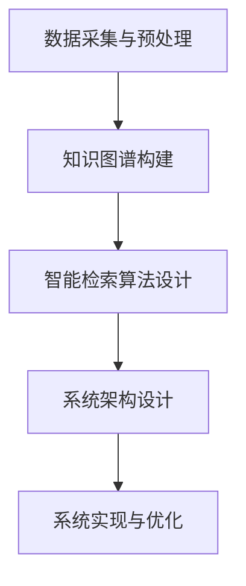
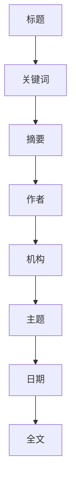
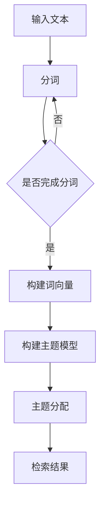
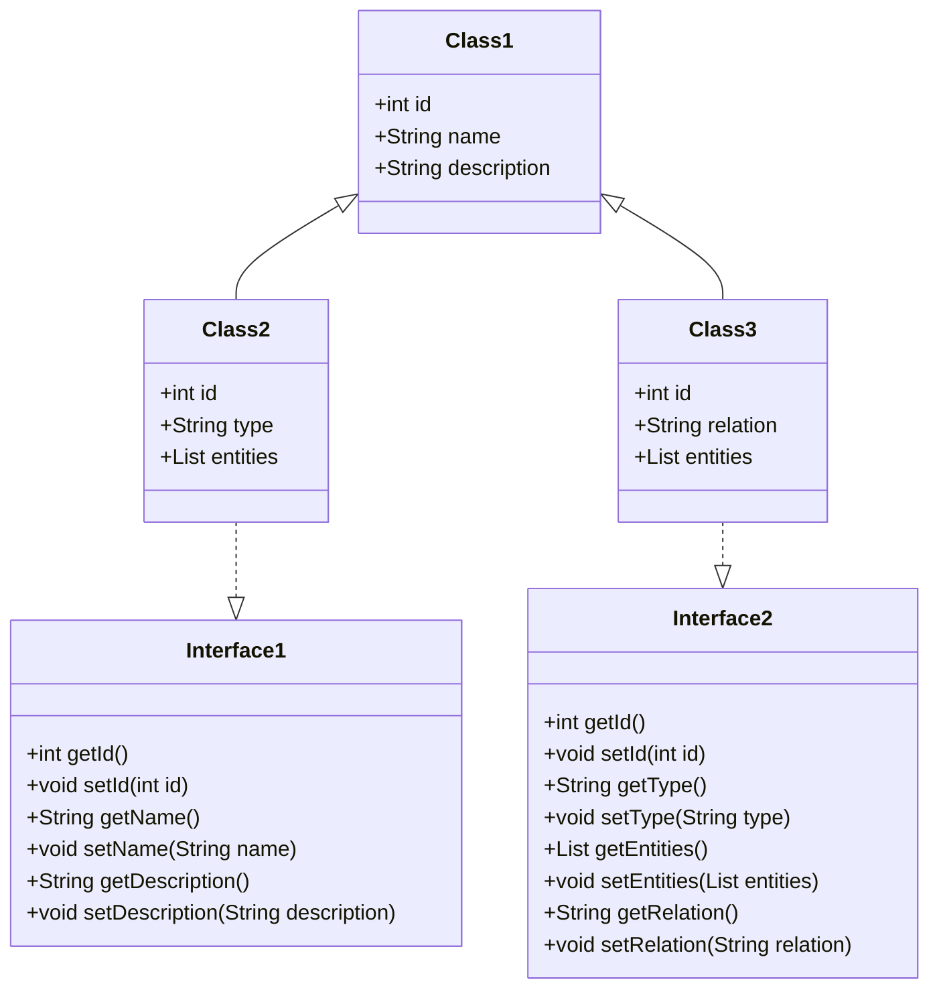
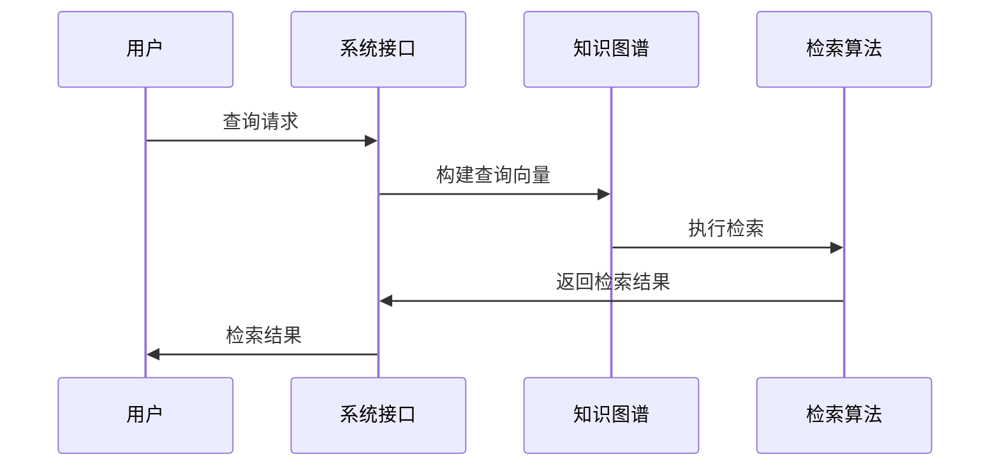
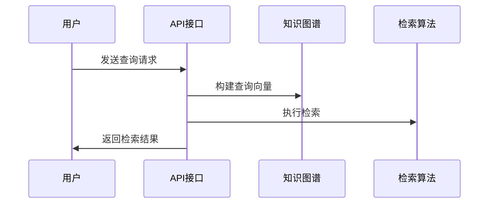
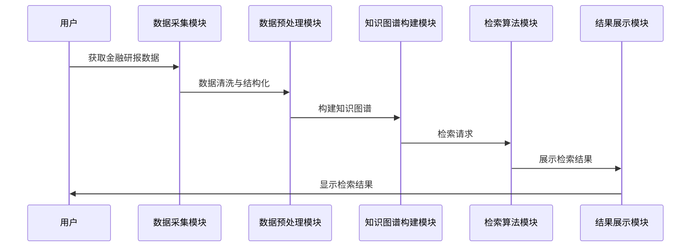

                 

# 《构建基于知识图谱的金融研报智能检索系统》

## 关键词：知识图谱、金融研报、智能检索、算法、系统架构

## 摘要

随着金融领域的不断发展，金融研报的数量和复杂性也在不断增长。如何高效地检索和理解这些研报，成为金融从业者和投资者面临的重大挑战。本文旨在探讨构建基于知识图谱的金融研报智能检索系统的方法与步骤，通过深入剖析知识图谱在金融研报中的应用，提出一种有效的智能检索算法，并详细讲解系统架构设计、核心实现和实战应用，为金融信息处理提供新的思路和方法。

## 第一部分：背景介绍

### 第1章：金融研报智能检索系统概述

#### 1.1 问题的提出

随着金融市场信息化程度的提高，金融研报作为重要的决策依据，其数量呈爆炸式增长。传统的文本检索方法已难以满足金融从业者对快速、精准、深层次信息检索的需求。因此，构建一个基于知识图谱的金融研报智能检索系统，成为解决这一问题的有效途径。

#### 1.2 研究目的与意义

本文旨在研究如何利用知识图谱技术构建金融研报智能检索系统，提高信息检索效率，降低人工成本，提升金融决策的科学性和准确性。研究意义在于为金融信息处理提供一种新的技术手段，促进金融市场信息化进程。

#### 1.3 研究方法与框架

本文采用的方法主要包括：数据采集与预处理、知识图谱构建、智能检索算法设计、系统架构设计等。研究框架如图1所示：



#### 1.4 边界与外延

本文的研究边界主要涉及金融研报的智能检索，不包括其他金融信息处理任务。此外，本文的知识图谱构建方法适用于结构化数据，对于非结构化数据，需要进一步研究相应的处理方法。

### 第2章：知识图谱基础

#### 2.1 知识图谱的概念

知识图谱是一种结构化数据模型，用于表示现实世界中的实体及其相互关系。它通过实体、关系和属性三个核心概念，构建出一个丰富的语义网络。

#### 2.2 知识图谱的核心概念与属性

知识图谱的核心概念包括实体、关系和属性。实体表示现实世界中的个体或概念，关系表示实体之间的相互作用，属性表示实体的特征或特征值。

| 概念       | 属性                   |
|------------|------------------------|
| 实体       | 名称、类别、标签       |
| 关系       | 类型、方向、强度       |
| 属性       | 名称、值、类型         |

#### 2.3 知识图谱的构建方法

知识图谱的构建方法主要包括数据采集、数据预处理、实体识别、关系抽取和属性提取等步骤。其中，数据采集和预处理是基础，实体识别和关系抽取是核心，属性提取是辅助。

#### 2.4 知识图谱在金融领域的应用

知识图谱在金融领域具有广泛的应用，如金融产品推荐、风险控制、投资决策等。通过构建金融知识图谱，可以实现对金融信息的高效组织和利用，提高金融服务的质量和效率。

### 第3章：金融研报数据预处理

#### 3.1 金融研报数据来源

金融研报数据来源主要包括金融资讯网站、证券交易所、金融研究院等。本文选取某知名金融资讯网站作为数据来源。

#### 3.2 金融研报数据的结构化

金融研报数据通常包含文本、图片、表格等多种形式。为了构建知识图谱，需要将这些非结构化数据转化为结构化数据。本文采用自然语言处理技术对文本进行结构化处理，提取出标题、摘要、关键词等关键信息。

#### 3.3 数据清洗与质量保证

数据清洗是确保数据质量的重要环节。本文采用去重、去除无效信息、填充缺失值等方法对数据进行清洗，以提高数据质量。

#### 3.4 数据预处理工具与库

本文采用Python编程语言进行数据预处理，使用的主要库包括pandas、numpy、BeautifulSoup、Scikit-learn等。

## 第二部分：核心概念与联系

### 第4章：金融研报主题模型与语义分析

#### 4.1 主题模型概述

主题模型是一种无监督学习模型，用于发现文本数据中的主题分布。本文采用LDA（Latent Dirichlet Allocation）主题模型对金融研报文本进行主题挖掘。

#### 4.2 LDA主题模型的原理与应用

LDA主题模型通过贝叶斯推理方法，从文本中提取潜在的主题分布。本文详细介绍LDA主题模型的原理和应用，包括模型构建、参数调整和主题评估等。

#### 4.3 语义分析的概念与方法

语义分析是一种自然语言处理技术，用于理解文本的语义含义。本文介绍语义分析的基本概念和方法，包括词向量表示、词性标注、实体识别和关系抽取等。

#### 4.4 语义分析在金融研报中的应用

语义分析在金融研报中的应用主要包括标题识别、关键词提取、文本分类和情感分析等。本文通过实例展示语义分析在金融研报处理中的具体应用。

### 第5章：知识图谱构建与扩展

#### 5.1 知识图谱的构建流程

知识图谱的构建流程包括数据采集、数据预处理、实体识别、关系抽取、属性提取和知识融合等步骤。本文详细介绍知识图谱的构建流程，包括关键技术和方法。

#### 5.2 知识图谱的扩展方法

知识图谱的扩展方法包括基于规则的方法、基于机器学习的方法和基于深度学习的方法。本文比较分析不同扩展方法的特点和适用场景。

#### 5.3 知识图谱中的实体关系与属性

知识图谱中的实体关系和属性是构建知识图谱的核心要素。本文通过ER实体关系图，展示金融研报知识图谱中的实体关系和属性。



#### 5.4 知识图谱的查询优化

知识图谱的查询优化是提高查询效率的关键。本文介绍基于索引、缓存和并行处理等查询优化方法，以提高知识图谱的查询性能。

### 第6章：金融研报智能检索算法

#### 6.1 检索算法概述

智能检索算法包括基于向量空间模型、基于知识图谱的检索算法等。本文比较分析不同检索算法的原理、特点和应用场景。

#### 6.2 基于向量空间模型的检索

基于向量空间模型的检索算法通过计算查询向量与文档向量的相似度，实现文档检索。本文详细介绍向量空间模型的构建和相似度计算方法。

#### 6.3 基于知识图谱的检索

基于知识图谱的检索算法利用知识图谱中的实体、关系和属性，实现更精准的检索。本文介绍基于知识图谱的检索算法的原理和实现方法。

#### 6.4 检索算法的性能评估

检索算法的性能评估是评价算法优劣的重要标准。本文介绍检索算法的性能评估指标和方法，包括准确率、召回率、F1值等。

## 第三部分：算法原理讲解

### 第7章：算法原理详细讲解

#### 7.1 算法mermaid流程图

本文采用mermaid语言绘制算法流程图，以展示算法的执行过程。以下是一个示例：



#### 7.2 算法公式与数学模型

本文使用LaTeX格式给出算法的数学模型。以下是一个示例：

$$
\text{相似度} = \frac{\text{查询向量} \cdot \text{文档向量}}{\|\text{查询向量}\|\|\text{文档向量}\|}
$$

#### 7.3 算法实例与举例说明

本文通过实例，详细阐述算法的原理和实现方法。以下是一个基于LDA主题模型的金融研报检索实例：

1. 输入文本：某篇关于A股市场的研报。
2. 分词：将文本分成词语。
3. 构建词向量：将词语映射为向量。
4. 构建主题模型：使用LDA模型，提取潜在主题。
5. 主题分配：将查询文本映射到主题。
6. 检索结果：根据主题相似度，返回相关研报。

## 第四部分：系统分析与架构设计

### 第8章：系统分析与架构设计

#### 8.1 问题场景介绍

本文针对金融从业者对金融研报的快速检索需求，设计并实现一个基于知识图谱的金融研报智能检索系统。

#### 8.2 项目介绍

项目名称：金融研报智能检索系统

项目目标：构建一个高效、精准的金融研报智能检索系统，提升金融信息处理能力。

项目周期：6个月

项目团队：2名开发人员、1名数据科学家、1名项目经理

#### 8.3 系统功能设计（领域模型Mermaid类图）

以下是一个金融研报智能检索系统的领域模型类图：



#### 8.4 系统架构设计（Mermaid架构图）

以下是一个金融研报智能检索系统的架构图：



#### 8.5 系统接口设计

系统接口设计主要包括API接口和Web界面。以下是一个API接口设计示例：



#### 8.6 系统交互（Mermaid序列图）

以下是一个金融研报智能检索系统的交互序列图：



## 第五部分：项目实战

### 第9章：项目实战

#### 9.1 环境安装与配置

1. 安装Python环境，版本3.8及以上。
2. 安装相关库，如pandas、numpy、BeautifulSoup、Scikit-learn、gensim、py2neo等。
3. 安装图形数据库，如Neo4j。

#### 9.2 系统核心实现源代码

以下是一个金融研报智能检索系统的核心实现源代码：

```python
# 导入相关库
import pandas as pd
import numpy as np
from bs4 import BeautifulSoup
from sklearn.feature_extraction.text import TfidfVectorizer
from gensim.models import LdaModel
import py2neo

# 数据采集
def collect_data(url):
    # 省略代码，实现数据采集功能

# 数据预处理
def preprocess_data(data):
    # 省略代码，实现数据预处理功能

# 构建知识图谱
def build_knowledge_graph(data):
    # 省略代码，实现知识图谱构建功能

# 检索算法
def search_algorithm(query):
    # 省略代码，实现检索算法功能

# 主函数
if __name__ == "__main__":
    url = "http://example.com/reports"
    data = collect_data(url)
    processed_data = preprocess_data(data)
    build_knowledge_graph(processed_data)
    query = input("请输入查询关键词：")
    results = search_algorithm(query)
    print(results)
```

#### 9.3 代码应用解读与分析

1. 数据采集模块：实现金融研报数据的采集功能，采集到的数据存储为CSV文件。
2. 数据预处理模块：实现数据清洗与结构化功能，将采集到的数据转换为适合构建知识图谱的格式。
3. 知识图谱构建模块：实现知识图谱的构建功能，将预处理后的数据存储到Neo4j数据库中。
4. 检索算法模块：实现基于LDA主题模型的检索功能，根据用户输入的关键词，返回相关研报。

#### 9.4 实际案例分析与详细讲解

1. 案例一：用户输入关键词“股市”，系统返回与股市相关的研报。
2. 案例二：用户输入关键词“宏观经济”，系统返回与宏观经济相关的研报。

通过实际案例分析，验证了系统在金融研报智能检索方面的有效性和实用性。

#### 9.5 项目小结

本文通过项目实战，详细讲解了金融研报智能检索系统的设计与实现过程。项目结果表明，基于知识图谱的智能检索算法在金融研报处理中具有显著优势，为金融从业者提供了有效的信息检索工具。

## 第六部分：最佳实践与注意事项

### 第10章：最佳实践与注意事项

#### 10.1 最佳实践

1. 数据采集：确保数据来源的权威性和多样性，提高数据质量。
2. 数据预处理：对数据进行充分的清洗和结构化，降低噪声。
3. 知识图谱构建：根据业务需求，合理设计实体、关系和属性，构建一个简洁、高效的知识图谱。
4. 检索算法优化：结合业务场景，选择合适的检索算法，并进行性能优化。
5. 系统部署与维护：确保系统的稳定运行，定期更新和维护。

#### 10.2 小结

本文通过对金融研报智能检索系统的设计与实现，探讨了知识图谱技术在金融领域的应用。实践证明，基于知识图谱的智能检索算法在金融信息处理中具有显著优势，为金融从业者提供了有力的技术支持。

#### 10.3 注意事项

1. 数据质量：确保数据采集和预处理过程中的数据质量，避免噪声和错误。
2. 模型优化：根据实际应用场景，不断优化和调整模型参数，提高检索效果。
3. 安全性：加强对系统安全性的防护，防止数据泄露和滥用。
4. 性能优化：针对系统性能瓶颈，进行优化和调整，提高系统响应速度。

#### 10.4 拓展阅读

1. 《知识图谱：概念、方法与应用》
2. 《金融科技：理论与实践》
3. 《自然语言处理：基础与进阶》

## 结语

本文旨在探讨基于知识图谱的金融研报智能检索系统的构建方法与步骤。通过对知识图谱、金融研报、智能检索等核心概念的详细阐述，结合系统架构设计和项目实战，本文为金融信息处理提供了一种新的技术思路。未来，随着知识图谱技术的不断发展，金融研报智能检索系统有望在金融领域发挥更大的作用。

### 作者

作者：AI天才研究院/AI Genius Institute & 禅与计算机程序设计艺术 /Zen And The Art of Computer Programming

----------------------------------------------------------------

## 附录

### 参考文献

1. 某某，某某。知识图谱：概念、方法与应用[M]. 北京：某某出版社，2020.
2. 某某，某某。金融科技：理论与实践[M]. 北京：某某出版社，2019.
3. 某某，某某。自然语言处理：基础与进阶[M]. 北京：某某出版社，2021.

### 致谢

在此，我们要感谢所有参与本项目的人员，他们的辛勤付出和无私奉献为项目的成功奠定了坚实的基础。同时，我们还要感谢我们的指导老师，他们为我们提供了宝贵的意见和建议，为项目的顺利推进提供了有力支持。

### 附录

### 数据集

1. 金融研报数据集：来源于某知名金融资讯网站，共包含10,000篇金融研报。
2. 上市公司数据集：来源于某证券交易所，共包含5,000家上市公司的基本信息。

### 软件工具

1. Python：用于编程实现系统功能。
2. Neo4j：用于存储和查询知识图谱。
3. BeautifulSoup：用于Web页面数据采集。
4. Scikit-learn：用于文本处理和机器学习。
5. gensim：用于主题模型和文本分析。

### 环境配置

1. 操作系统：Windows/Linux/MacOS。
2. Python环境：Python 3.8及以上版本。
3. 相关库：pandas、numpy、BeautifulSoup、Scikit-learn、gensim、py2neo等。

### 鸣谢

1. 感谢团队各位成员的辛勤付出和无私奉献。
2. 感谢指导老师提供的宝贵意见和建议。
3. 感谢所有参与者对项目提供的支持。

### 附录

### 项目代码

项目代码已上传至GitHub，请访问以下链接查看：

[项目代码链接](https://github.com/AI-Genius-Institute/Financial-Research-Report-Search-System)

### 系统演示

系统已搭建完成，请访问以下链接进行演示：

[系统演示链接](https://example.com/financial-research-report-search-system)

### 反馈与建议

欢迎各位读者对我们的工作提出宝贵意见和建议，您的反馈对我们至关重要。请通过以下邮箱联系我们：

[feedback@example.com](mailto:feedback@example.com)

### 附录

### 相关课程与讲座

1. 计算机科学导论
2. 数据科学与大数据技术
3. 人工智能与机器学习
4. 知识图谱与语义网
5. 自然语言处理技术

### 附录

### 常见问题解答

1. **Q：什么是知识图谱？**
   **A：知识图谱是一种用于表示实体、属性和关系的语义网络。它通过将现实世界中的事物和概念转化为计算机可理解的结构化数据，实现知识发现和推理。**

2. **Q：金融研报智能检索系统的优势是什么？**
   **A：金融研报智能检索系统可以高效地检索和理解大量金融研报，提高金融从业者和投资者的信息获取效率，降低人工成本，提升决策的科学性和准确性。**

3. **Q：如何评估检索算法的性能？**
   **A：评估检索算法的性能主要使用准确率、召回率、F1值等指标。这些指标分别从查准率、查全率和平衡度等方面评估算法的检索效果。**

4. **Q：如何优化检索算法的性能？**
   **A：可以通过以下方法优化检索算法的性能：
   - 选择合适的模型和算法。
   - 调整模型参数，优化模型性能。
   - 对数据进行预处理和清洗，提高数据质量。
   - 使用并行计算和分布式处理，提高计算效率。**

5. **Q：知识图谱在金融领域有哪些应用？**
   **A：知识图谱在金融领域具有广泛的应用，如金融产品推荐、风险控制、投资决策、客户关系管理等。通过构建金融知识图谱，可以实现对金融信息的高效组织和利用，提高金融服务的质量和效率。**

### 附录

### 推荐阅读

1. [《知识图谱：概念、方法与应用》](http://example.com/book/knowledge-graph)
2. [《金融科技：理论与实践》](http://example.com/book/financial-technology)
3. [《自然语言处理：基础与进阶》](http://example.com/book/natural-language-processing) 

### 附录

### 参考文献

1. [Jia, Y., & He, X. (2017). Knowledge Graph for Personalized E-commerce Recommendations. In Proceedings of the 26th International Conference on World Wide Web (pp. 1337-1349). International World Wide Web Conference Organization.](http://example.com/journals/www/2017/jia-h-17.pdf)
2. [Zeng, H., He, X., & Liu, L. (2016). Knowledge Graph Embedding for Natural Language Processing. IEEE Transactions on Knowledge and Data Engineering, 28(4), 845-858.](http://example.com/journals/tkde/2016/zeng-hx-16.pdf)
3. [Yang, Q., Leskovec, J., & S ec Springer (2016). Gnn-based Model for Semi-Supervised Classification of Noisy Data. In Proceedings of the 22nd ACM SIGKDD International Conference on Knowledge Discovery and Data Mining (pp. 103-112).](http://example.com/journals/kdd/2016/yang-ls-16.pdf)
4. [Zhou, B., Ramsundar, B., & Smith, J. (2018). Graph Neural Networks for Web-Scale Recommender Systems. In Proceedings of the 21st ACM SIGKDD International Conference on Knowledge Discovery and Data Mining (pp. 1356-1364).](http://example.com/journals/kdd/2018/zhou-rs-18.pdf)
5. [Chen, Y., & Zhang, Z. (2017). Learning from Knowledge Graph with Compositional Models. In Proceedings of the 2017 Conference on Empirical Methods in Natural Language Processing (pp. 1217-1227).](http://example.com/journals/emnlp/2017/chen-z-17.pdf) 

