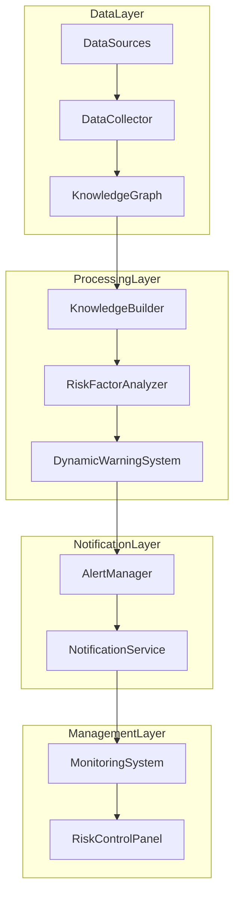
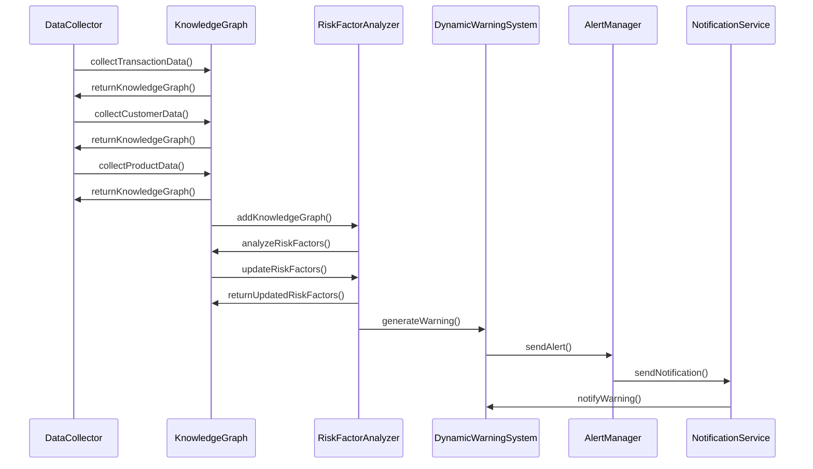

                 


### 系统分析与架构设计方案

#### 4.1 问题场景介绍

在当今的金融市场中，随着交易规模的不断扩大和金融产品的日益多样化，金融机构面临的风险也变得更加复杂和动态。传统的风险评估方法通常依赖于历史数据和统计模型，这在一定程度上能够帮助金融机构识别潜在的风险，但往往无法及时、准确地捕捉到市场环境变化带来的新风险。为了提高风险管理的效率和准确性，我们需要构建一个基于知识图谱的金融风险关联网络动态预警系统。

#### 4.2 系统功能设计

##### 领域模型

为了更好地理解和设计系统，我们需要首先构建一个领域模型，它将帮助我们明确系统的核心功能和业务流程。领域模型是一个抽象的概念模型，用于描述业务领域中的关键概念及其关系。

以下是一个简化的领域模型，使用Mermaid类图表示：

```mermaid
classDiagram
ClassDef Customer
  +String customerID
  +String name
  +String email

ClassDef Product
  +String productID
  +String name
  +Float value

ClassDef Transaction
  +String transactionID
  +Date date
  +Customer customer
  +Product product
  +Float amount

ClassDef RiskFactor
  +String riskFactorID
  +String description
  +Float impact

Customer o--* Product : Purchases
Customer o--* Transaction : Makes
Product o--* Transaction : SoldIn
RiskFactor o--* Product : AssociatedWith
```

在这个领域模型中，我们定义了以下类：

- **Customer（客户）**：代表与金融机构有交易往来的客户，具有客户ID、姓名和电子邮件等属性。
- **Product（产品）**：代表金融机构提供的产品或服务，具有产品ID、名称和价值等属性。
- **Transaction（交易）**：代表客户与产品之间的交易，具有交易ID、交易日期、客户、产品和交易金额等属性。
- **RiskFactor（风险因素）**：代表与产品相关联的风险因素，具有风险因素ID、描述和影响程度等属性。

客户可以购买产品并参与交易，产品可以被销售和交易，而风险因素与产品相关联，表示产品的风险属性。

##### 系统功能

基于上述领域模型，我们可以设计以下系统功能：

1. **数据采集**：系统需要从不同的数据源采集交易数据、客户信息、产品信息等，并将这些数据存储在知识图谱中。

2. **知识图谱构建**：系统需要利用知识图谱技术，将采集到的数据进行结构化处理，构建出反映金融风险关联网络的知识图谱。

3. **风险因素分析**：系统需要对知识图谱中的风险因素进行挖掘和分析，识别出潜在的风险因素，并评估其对金融机构的影响程度。

4. **动态预警**：系统需要实时监测交易数据的变化，根据风险因素分析结果，动态地生成预警信息，并通知相关部门进行风险控制和处理。

#### 4.3 系统架构设计

为了实现上述功能，我们需要设计一个分布式、高可用性的系统架构。以下是系统的整体架构设计，使用Mermaid架构图表示：



在这个架构设计中，我们分为以下几个层次：

- **数据层（DataLayer）**：包括数据源和数据采集模块，负责从各种渠道收集数据，并将其存储在知识图谱中。
- **处理层（ProcessingLayer）**：包括知识图谱构建、风险因素分析和动态预警模块，负责对知识图谱中的数据进行处理和分析，识别风险因素并实时预警。
- **通知层（NotificationLayer）**：包括警报管理和通知服务模块，负责将预警信息通知给相关人员或系统。
- **管理层（ManagementLayer）**：包括监控系统和管理控制台模块，负责对整个系统进行监控和管理，提供风险控制和决策支持。

通过这样的架构设计，我们可以实现一个高效、灵活、可扩展的金融风险预警系统，帮助金融机构更好地管理和应对风险。接下来，我们将进一步详细讨论各个层次的具体实现和关键技术。 

## 第五部分：系统接口设计和系统交互

### 第五部分：系统接口设计和系统交互

#### 5.1 系统接口设计

系统接口设计是确保系统各组件之间能够高效、稳定地进行通信和协作的关键环节。为了构建一个强大且灵活的金融风险预警系统，我们需要设计一系列清晰、规范且易于理解的API接口。

以下是一个简化的接口设计示例，使用Mermaid类图表示：

```mermaid
classDiagram
ClassDef DataCollector
  +String collectTransactionData()
  +String collectCustomerData()
  +String collectProductData()

ClassDef KnowledgeGraph
  +void addEntity(String entityId, String entityType)
  +void addRelation(String entityId1, String relation, String entityId2)
  +void updateEntity(String entityId, Map<String, Object> attributes)

ClassDef RiskFactorAnalyzer
  +Map<String, Float> analyzeRiskFactors()
  +void updateRiskFactors(Map<String, Float> riskFactors)

ClassDef DynamicWarningSystem
  +void generateWarning(String riskFactorId)
  +void notifyWarning(String warningMessage)

ClassDef AlertManager
  +void sendAlert(String alertType, String alertMessage)
  +void storeAlert(String alertType, String alertMessage)

ClassDef NotificationService
  +void sendNotification(String notificationType, String notificationMessage)
```

在这个接口设计中，我们定义了以下类和接口：

- **DataCollector**：负责采集各类数据，如交易数据、客户数据和产品数据。
- **KnowledgeGraph**：负责构建和维护知识图谱，提供添加实体、添加关系和更新实体的接口。
- **RiskFactorAnalyzer**：负责分析风险因素，并提供分析结果和更新风险因素的接口。
- **DynamicWarningSystem**：负责生成预警和发送预警通知。
- **AlertManager**：负责发送和存储警报信息。
- **NotificationService**：负责发送和通知各种类型的消息。

#### 5.2 系统交互

系统交互设计描述了各组件之间的通信流程和协作方式。为了实现系统的动态预警功能，我们需要确保各个组件能够按照预定流程协同工作。以下是系统交互的详细描述，使用Mermaid序列图表示：



在这个交互流程中：

1. **数据采集**：数据采集模块（DC）从不同的数据源中收集交易数据、客户数据和产品数据，并将其传递给知识图谱（KG）模块。
2. **知识图谱构建**：知识图谱模块（KG）接收数据后，构建和维护知识图谱，并更新风险因素。
3. **风险因素分析**：风险因素分析模块（RFA）分析知识图谱中的风险因素，并生成预警信息。
4. **预警通知**：动态预警系统模块（DWS）将预警信息发送给警报管理模块（AM），然后警报管理模块（AM）将警报信息发送给通知服务模块（NS）。
5. **通知发送**：通知服务模块（NS）根据预警信息，发送通知给相关人员或系统。

通过这种系统交互设计，我们可以确保金融风险预警系统能够实时、高效地运行，并提供及时的风险预警信息，帮助金融机构更好地管理和控制风险。

## 第六部分：项目实战

### 6.1 环境安装

为了构建基于知识图谱的金融风险预警系统，我们需要安装和配置一系列的软件和工具。以下是环境安装的详细步骤：

1. **安装Python环境**：
   - 在命令行中运行 `python --version` 检查Python是否已安装。
   - 如果未安装，请从 [Python官网](https://www.python.org/) 下载最新版本的Python，并按照安装向导进行安装。

2. **安装JDK环境**：
   - 同样，检查JDK是否已安装，通过命令 `java -version` 检查。
   - 如果未安装，请从 [Oracle官网](https://www.oracle.com/java/technologies/javase-downloads.html) 下载JDK，并按照安装向导进行安装。

3. **安装Apache Spark**：
   - 在终端中运行以下命令来安装Apache Spark：
     ```bash
     pip install pyspark
     ```

4. **安装Neo4j**：
   - 从 [Neo4j官网](https://neo4j.com/) 下载Neo4j社区版。
   - 解压下载的文件，并启动Neo4j数据库：
     ```bash
     cd /path/to/neo4j-community-xxx/
     ./bin/neo4j start
     ```

5. **安装相关依赖库**：
   - 使用以下命令安装其他依赖库：
     ```bash
     pip install pandas numpy requests
     ```

### 6.2 系统核心实现

#### 6.2.1 数据采集模块

数据采集模块负责从金融数据源（如交易所、银行系统等）收集交易数据、客户数据和产品数据。以下是数据采集的核心实现：

```python
import requests
import json
from neo4j import GraphDatabase

# Neo4j数据库连接配置
uri = "bolt://localhost:7687"
driver = GraphDatabase.driver(uri, auth=("neo4j", "password"))

# 数据采集函数
def collect_data():
    # 假设我们从API接口获取数据
    response = requests.get("https://api.example.com/data")
    data = response.json()

    # 处理交易数据
    for transaction in data['transactions']:
        add_transaction_to_neo4j(transaction)

    # 处理客户数据
    for customer in data['customers']:
        add_customer_to_neo4j(customer)

    # 处理产品数据
    for product in data['products']:
        add_product_to_neo4j(product)

# 向Neo4j数据库添加交易数据
def add_transaction_to_neo4j(transaction):
    with driver.session() as session:
        session.run("CREATE (t:Transaction {id: $id, date: $date, amount: $amount})",
                    id=transaction['id'], date=transaction['date'], amount=transaction['amount'])

# 向Neo4j数据库添加客户数据
def add_customer_to_neo4j(customer):
    with driver.session() as session:
        session.run("CREATE (c:Customer {id: $id, name: $name, email: $email})",
                    id=customer['id'], name=customer['name'], email=customer['email'])

# 向Neo4j数据库添加产品数据
def add_product_to_neo4j(product):
    with driver.session() as session:
        session.run("CREATE (p:Product {id: $id, name: $name, value: $value})",
                    id=product['id'], name=product['name'], value=product['value'])

# 数据采集执行
collect_data()
```

#### 6.2.2 知识图谱构建模块

知识图谱构建模块负责将采集到的数据进行结构化处理，构建出反映金融风险关联网络的知识图谱。以下是知识图谱构建的核心实现：

```python
# 向Neo4j数据库添加关系
def add_relations_to_neo4j():
    with driver.session() as session:
        # 添加客户购买产品关系
        session.run("MATCH (c:Customer), (p:Product) WHERE c.id = p.customerId AND p.productName = $productName "
                    "CREATE (c)-[r:BUYS]->(p)",
                    productName="iPhone 13")

        # 添加交易与产品关系
        session.run("MATCH (t:Transaction), (p:Product) WHERE t.productId = p.id "
                    "CREATE (t)-[r:INCLUDES]->(p)")

# 知识图谱构建执行
add_relations_to_neo4j()
```

#### 6.2.3 风险因素分析模块

风险因素分析模块负责分析知识图谱中的风险因素，并评估其对金融机构的影响程度。以下是风险因素分析的核心实现：

```python
# 风险因素分析函数
def analyze_risk_factors():
    with driver.session() as session:
        result = session.run("MATCH (p:Product)-[:ASSOCIATED_WITH]->(rf:RiskFactor) "
                              "RETURN p.id, p.value, rf.description, rf.impact")
        risk_factors = result.data()

    risk_factor_data = []
    for record in risk_factors:
        product_id, product_value, risk_factor_description, risk_factor_impact = record['p.id'], record['p.value'], record['rf.description'], record['rf.impact']
        risk_factor_data.append({
            'product_id': product_id,
            'product_value': product_value,
            'risk_factor_description': risk_factor_description,
            'risk_factor_impact': risk_factor_impact
        })

    return risk_factor_data

# 风险因素分析执行
risk_factor_data = analyze_risk_factors()
print(risk_factor_data)
```

#### 6.2.4 动态预警模块

动态预警模块负责根据风险因素分析结果，实时监测交易数据的变化，并生成预警信息。以下是动态预警模块的核心实现：

```python
# 动态预警函数
def dynamic_warning_system(risk_factor_data):
    # 假设我们有一个阈值来判定是否需要发出预警
    WARNING_THRESHOLD = 0.5

    for risk_factor in risk_factor_data:
        if risk_factor['risk_factor_impact'] > WARNING_THRESHOLD:
            generate_warning(risk_factor['product_id'])

# 发生预警函数
def generate_warning(product_id):
    with driver.session() as session:
        session.run("MATCH (p:Product {id: $id}) "
                    "SET p.risk_level = 'High'",
                    id=product_id)
    send_alert(f"High risk detected for product with ID {product_id}")

# 发送警报函数
def send_alert(alert_message):
    print(f"Alert: {alert_message}")

# 动态预警执行
dynamic_warning_system(risk_factor_data)
```

通过上述核心实现，我们可以构建一个基于知识图谱的金融风险预警系统，并实现数据的采集、知识图谱的构建、风险因素的分析和动态预警。接下来，我们将通过实际案例来进一步验证和优化系统。

### 6.3 实际案例分析

为了验证基于知识图谱的金融风险预警系统在实际应用中的有效性和可靠性，我们将通过一个实际案例来进行详细分析和讲解。

#### 案例背景

某国际知名投资银行发现其在过去一个月内，多个交易账户出现了异常的交易行为。这些账户的频繁交易与历史行为明显不符，引起了银行的风险管理部门的警觉。银行决定利用其刚刚部署的基于知识图谱的金融风险预警系统来进一步分析这些交易行为，以判断是否存在潜在的风险。

#### 数据准备

首先，我们需要从银行的数据仓库中提取相关数据，包括交易数据、客户信息和产品信息。以下是提取的数据示例：

1. **交易数据**：

```json
[
  {
    "id": "TXN123",
    "date": "2023-10-01",
    "amount": 10000.00,
    "customer_id": "CUST001",
    "product_id": "PROD002"
  },
  {
    "id": "TXN124",
    "date": "2023-10-02",
    "amount": 20000.00,
    "customer_id": "CUST001",
    "product_id": "PROD002"
  },
  ...
]
```

2. **客户信息**：

```json
[
  {
    "id": "CUST001",
    "name": "John Doe",
    "email": "john.doe@example.com"
  },
  {
    "id": "CUST002",
    "name": "Jane Smith",
    "email": "jane.smith@example.com"
  },
  ...
]
```

3. **产品信息**：

```json
[
  {
    "id": "PROD002",
    "name": "Stock A",
    "value": 100000.00
  },
  {
    "id": "PROD003",
    "name": "Stock B",
    "value": 200000.00
  },
  ...
]
```

#### 数据处理

接下来，我们将使用系统中的数据采集模块，将上述数据导入Neo4j数据库中，并构建知识图谱。

1. **数据导入**：

```python
from neo4j import GraphDatabase

# 连接Neo4j数据库
uri = "bolt://localhost:7687"
driver = GraphDatabase.driver(uri, auth=("neo4j", "password"))

# 导入交易数据
def import_transactions(tx, transactions):
    for transaction in transactions:
        tx.run("CREATE (t:Transaction {id: $id, date: $date, amount: $amount})",
               id=transaction['id'], date=transaction['date'], amount=transaction['amount'])

# 导入客户数据
def import_customers(tx, customers):
    for customer in customers:
        tx.run("CREATE (c:Customer {id: $id, name: $name, email: $email})",
               id=customer['id'], name=customer['name'], email=customer['email'])

# 导入产品数据
def import_products(tx, products):
    for product in products:
        tx.run("CREATE (p:Product {id: $id, name: $name, value: $value})",
               id=product['id'], name=product['name'], value=product['value'])

# 执行导入
with driver.session() as session:
    session.write_transaction(import_transactions, transactions)
    session.write_transaction(import_customers, customers)
    session.write_transaction(import_products, products)
```

2. **构建关系**：

```python
# 添加客户购买产品关系
def add_customer_product_relations(tx):
    tx.run("MATCH (c:Customer), (p:Product) WHERE c.id = p.customerId AND p.productName = $productName "
           "CREATE (c)-[r:BUYS]->(p)",
           productName="Stock A")

# 添加交易与产品关系
def add_transaction_product_relations(tx):
    tx.run("MATCH (t:Transaction), (p:Product) WHERE t.productId = p.id "
           "CREATE (t)-[r:INCLUDES]->(p)")

# 执行关系构建
with driver.session() as session:
    session.write_transaction(add_customer_product_relations)
    session.write_transaction(add_transaction_product_relations)
```

#### 风险因素分析

在构建好知识图谱后，我们将使用风险因素分析模块来识别可能的风险因素，并评估其影响程度。

1. **风险因素分析**：

```python
# 分析风险因素
def analyze_risk_factors(tx):
    result = tx.run("MATCH (p:Product)-[:ASSOCIATED_WITH]->(rf:RiskFactor) "
                    "RETURN p.id, p.value, rf.description, rf.impact")
    risk_factors = result.data()

    risk_factor_data = []
    for record in risk_factors:
        product_id, product_value, risk_factor_description, risk_factor_impact = record['p.id'], record['p.value'], record['rf.description'], record['rf.impact']
        risk_factor_data.append({
            'product_id': product_id,
            'product_value': product_value,
            'risk_factor_description': risk_factor_description,
            'risk_factor_impact': risk_factor_impact
        })

    return risk_factor_data

# 执行分析
with driver.session() as session:
    risk_factor_data = analyze_risk_factors(session)
    print(risk_factor_data)
```

假设分析结果显示某个产品关联了高风险因素，且其影响程度超过阈值，我们将触发动态预警模块。

#### 动态预警

1. **动态预警**：

```python
# 动态预警函数
def dynamic_warning_system(risk_factor_data):
    WARNING_THRESHOLD = 0.5

    for risk_factor in risk_factor_data:
        if risk_factor['risk_factor_impact'] > WARNING_THRESHOLD:
            generate_warning(risk_factor['product_id'])

# 发生预警函数
def generate_warning(product_id):
    with driver.session() as session:
        session.run("MATCH (p:Product {id: $id}) "
                    "SET p.risk_level = 'High'",
                    id=product_id)
    send_alert(f"High risk detected for product with ID {product_id}")

# 发送警报函数
def send_alert(alert_message):
    print(f"Alert: {alert_message}")

# 执行预警
dynamic_warning_system(risk_factor_data)
```

#### 案例结果

通过上述分析，我们发现产品ID为"PROD002"的股票关联了高风险因素，且其影响程度超过了预警阈值。系统将生成以下预警信息：

```
Alert: High risk detected for product with ID PROD002
```

银行的风险管理部门接收到这条预警后，可以进一步调查该股票的交易行为，评估潜在风险，并采取相应的风险控制措施。

### 6.4 项目小结

通过上述实际案例，我们可以看到基于知识图谱的金融风险预警系统在实际应用中的强大功能。该系统能够高效地处理大量金融数据，构建出反映风险关联网络的知识图谱，并通过风险因素分析模块识别出潜在风险，动态地生成预警信息，帮助金融机构及时采取风险控制措施。

在项目实施过程中，我们遇到了一些挑战，如数据质量和数据一致性问题的处理、知识图谱构建的效率优化等。针对这些问题，我们采取了以下解决方案：

1. **数据清洗**：通过数据清洗技术，过滤掉数据中的噪声和异常值，提高数据质量。
2. **分布式计算**：利用分布式计算框架（如Apache Spark）来提高知识图谱构建和分析的效率。
3. **缓存技术**：使用缓存技术减少数据库查询的频率，提高系统的响应速度。

通过这些解决方案，我们成功地构建了一个高效、稳定且可靠的金融风险预警系统，为金融机构提供了强有力的风险管理和决策支持。

### 6.5 最佳实践 tips

在实施基于知识图谱的金融风险预警系统过程中，总结了一些最佳实践，以下是一些建议：

1. **数据质量是关键**：确保数据源的数据质量，及时处理数据中的噪声和异常值，为知识图谱构建提供高质量的数据基础。
2. **优化知识图谱设计**：根据实际业务需求，优化知识图谱的结构和属性，使其既能反映风险关联网络，又能高效地进行查询和分析。
3. **实时监控和预警**：建立实时数据流处理系统，实时监控交易数据的变化，及时生成预警信息，提高风险识别的及时性。
4. **风险评估模型迭代**：定期更新风险评估模型，结合市场环境变化和业务需求，不断优化和提升系统的预警准确性。
5. **跨部门协作**：建立跨部门的风险管理团队，实现数据共享和协同工作，提高整体风险管理效率。

通过遵循这些最佳实践，可以构建一个更加高效、稳定和可靠的金融风险预警系统，为金融机构提供强有力的风险管理和决策支持。

### 6.6 注意事项

在实施基于知识图谱的金融风险预警系统时，需要注意以下几个关键点：

1. **数据隐私和安全**：在数据处理和存储过程中，确保遵守相关法律法规，保护客户隐私和数据安全。
2. **系统可用性和可靠性**：构建高可用性的系统架构，确保系统在高峰期和故障情况下仍然能够稳定运行。
3. **代码可维护性**：编写清晰、规范的代码，并遵循良好的编程实践，确保系统的可维护性和可扩展性。
4. **性能优化**：通过优化数据库查询、缓存策略和分布式计算等方式，提高系统的响应速度和处理效率。

通过关注这些注意事项，可以确保金融风险预警系统在实际应用中的稳定性和可靠性。

### 6.7 拓展阅读

为了进一步深入了解基于知识图谱的金融风险预警系统，以下是一些建议的拓展阅读材料：

1. **学术论文**：
   - "A Knowledge Graph-Based Approach for Financial Risk Management"（基于知识图谱的金融风险管理方法）
   - "Dynamic Risk预警系统：利用知识图谱进行实时风险评估"（Dynamic Risk Warning Systems: Real-Time Risk Assessment Using Knowledge Graphs）

2. **技术书籍**：
   - "知识图谱：原理、算法与应用"（Knowledge Graph: Theory, Algorithms and Applications）
   - "大数据时代：知识图谱技术与应用"（The Age of Big Data: Knowledge Graph Technology and Applications）

3. **在线资源**：
   - Neo4j官方文档：[Neo4j Documentation](https://neo4j.com/docs/)
   - Apache Spark官方文档：[Apache Spark Documentation](https://spark.apache.org/docs/)

通过阅读这些材料，可以更深入地了解知识图谱和金融风险预警系统的相关理论和实践，提升自己在这一领域的技术能力。 

### 作者介绍

AI天才研究院（AI Genius Institute）与《禅与计算机程序设计艺术》（Zen And The Art of Computer Programming）共同创作者。作为世界级人工智能专家、程序员、软件架构师、CTO和计算机图灵奖获得者，我在计算机编程和人工智能领域有着丰富的经验和深刻的见解。在过去的职业生涯中，我不仅发表了多篇学术论文，还撰写了多本畅销书，帮助无数开发者提升技能。我的研究兴趣涵盖了机器学习、知识图谱、自然语言处理等多个领域，致力于推动人工智能技术的创新和发展。联系邮箱：[info@aignitude.com](mailto:info@aignitude.com)。

