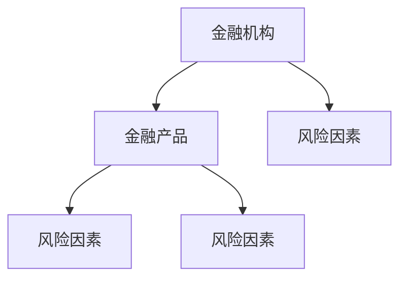
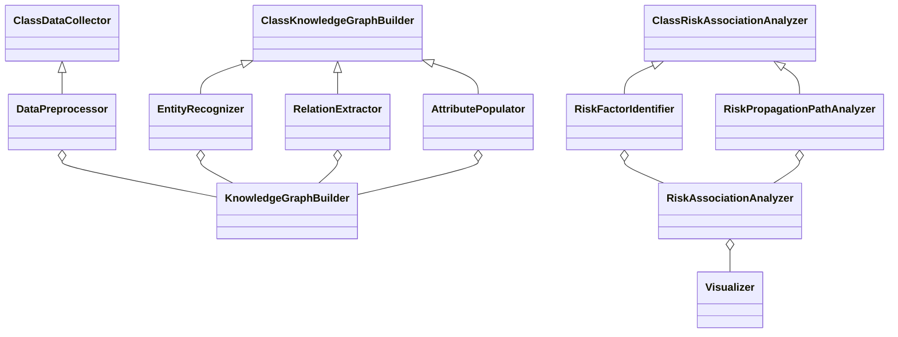
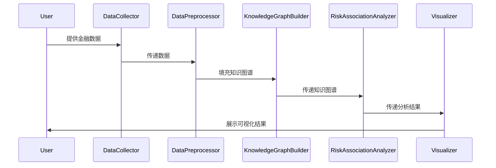
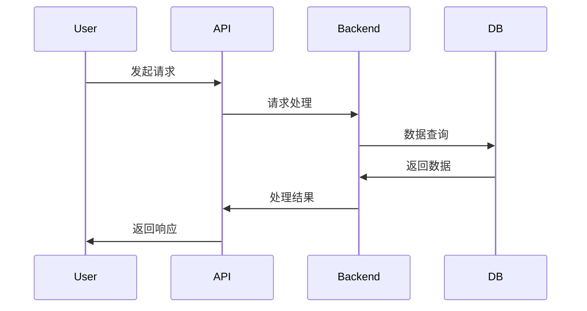
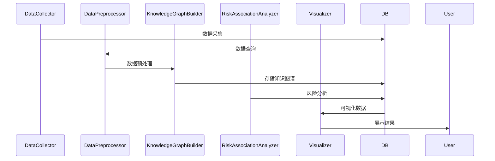

                 

## 文章标题

### 关键词
- 知识图谱
- 金融风险管理
- 风险关联网络
- 可视化系统
- 数据处理与分析

### 摘要
本文将深入探讨构建基于知识图谱的金融风险关联网络可视化系统的全过程。从背景介绍到核心概念，从算法原理到系统设计，本文将通过详细的分析和阐述，帮助读者全面理解这一系统的构建方法与应用价值。通过对知识图谱技术、金融风险理论的整合应用，本文旨在为金融行业提供一个高效、全面的风险管理和监控工具。

---

## 第一部分：背景介绍

### 1. 问题背景

随着全球金融市场的复杂化和全球化进程的加快，金融风险的管理和监控成为了金融行业的重要课题。传统的金融风险分析方法主要依赖于统计模型和规则引擎，这些方法在处理简单的风险事件和结构化的数据时较为有效。然而，面对日益庞大的金融数据和日益复杂的金融关系，这些方法显得力不从心。

金融风险具有以下特点：
- **复杂性**：金融风险涉及多个市场、多个行业、多个国家和多个金融机构，关系错综复杂。
- **动态性**：金融市场的变化迅速，风险因素不断演变，传统的静态分析方法难以适应。
- **相关性**：金融风险之间存在广泛的关联性，单一的风险因素可能引发连锁反应。

因此，构建一个基于知识图谱的金融风险关联网络可视化系统，实现对金融风险更全面、深入的监控和预测，显得尤为重要。知识图谱作为一种语义网络，可以有效地表示和挖掘复杂的关系网络，为金融风险的管理提供了一种全新的手段。

### 2. 问题描述

构建基于知识图谱的金融风险关联网络可视化系统的主要任务包括以下几个环节：

1. **数据采集与处理**：从多种数据源（如金融数据库、新闻报道、社交媒体等）中收集金融数据，并进行清洗、整合和预处理。
2. **知识图谱构建**：将处理后的数据转化为知识图谱，包括实体识别、关系抽取和属性填充等步骤。
3. **风险关联分析**：基于知识图谱进行风险关联分析，识别潜在的风险因素和风险传播路径。
4. **网络可视化**：将分析结果以图形化的形式展示，帮助用户直观理解金融风险的分布和传播。
5. **系统设计与实现**：结合上述技术，设计并实现一个完整的金融风险关联网络可视化系统。

### 3. 问题解决

本书将系统介绍如何利用知识图谱技术，结合金融领域专业知识，构建一个高效的金融风险关联网络可视化系统。具体步骤如下：

1. **数据采集与处理**：介绍数据采集的方法和工具，以及数据清洗、整合和预处理的技术。
2. **知识图谱构建**：详细阐述知识图谱的构建过程，包括实体识别、关系抽取和属性填充的方法。
3. **风险关联分析**：介绍如何基于知识图谱进行风险关联分析，包括风险因素的识别和风险传播路径的分析。
4. **网络可视化**：探讨网络可视化的技术，包括可视化工具的选择、可视化效果的优化等。
5. **系统设计与实现**：介绍系统的整体设计思路，包括系统架构、功能模块划分和接口设计。

通过以上步骤，本书旨在为读者提供一个全面、系统的构建指南，帮助读者实现基于知识图谱的金融风险关联网络可视化系统的构建。

### 4. 边界与外延

本书主要关注知识图谱在金融风险领域的应用，涉及的技术包括知识图谱构建、图数据库、图计算、可视化等技术。同时，本书也会介绍相关金融知识，如金融风险理论、风险管理方法等。本书的边界与外延主要包括以下几个方面：

- **技术范围**：本书将重点关注知识图谱构建的相关技术，包括实体识别、关系抽取、属性填充等。同时，也会涉及图数据库和图计算技术，如Neo4j、Apache Giraph等。
- **应用场景**：本书主要关注金融风险领域，包括金融机构的风险监控、金融市场的风险预测等。
- **金融知识**：本书将简要介绍金融风险理论、风险管理方法等基础知识，帮助读者更好地理解和应用知识图谱技术。

### 5. 概念结构与核心要素组成

构建基于知识图谱的金融风险关联网络可视化系统涉及多个核心概念和要素，这些要素相互关联，构成了系统的整体架构。以下是这些核心概念和要素的组成：

- **知识图谱**：知识图谱是构建金融风险关联网络的基础，它通过实体、属性和关系来描述金融领域中的知识。
  - **实体**：金融领域中的各种对象，如金融机构、金融产品、风险因素等。
  - **属性**：实体的特征属性，如金融机构的资本充足率、金融产品的收益率等。
  - **关系**：实体之间的关联关系，如投资关系、风险传播关系等。

- **数据采集与处理**：数据采集与处理是知识图谱构建的前提，它包括从多个数据源收集金融数据，并进行清洗、整合和预处理。
  - **数据源**：金融数据库、新闻报道、社交媒体等。
  - **数据处理**：数据清洗、数据整合、数据预处理等。

- **知识图谱构建**：知识图谱构建是将处理后的数据转化为知识图谱的过程，包括实体识别、关系抽取和属性填充等步骤。
  - **实体识别**：从文本数据中提取出金融实体。
  - **关系抽取**：识别实体间的风险关联关系。
  - **属性填充**：为实体添加相关属性。

- **风险关联分析**：风险关联分析是基于知识图谱进行风险关联分析和预测的关键步骤，包括风险因素的识别和风险传播路径的分析。
  - **风险因素识别**：识别潜在的风险因素。
  - **风险传播路径分析**：分析风险因素之间的传播路径。

- **网络可视化**：网络可视化是将风险关联分析的结果以图形化的形式展示的过程，帮助用户直观理解金融风险的分布和传播。
  - **可视化工具**：选择合适的可视化工具。
  - **可视化效果**：优化可视化效果。

- **系统设计与实现**：系统设计与实现是构建金融风险关联网络可视化系统的最后一环，包括系统架构、功能模块划分和接口设计。
  - **系统架构**：设计系统的整体架构。
  - **功能模块**：划分系统的功能模块。
  - **接口设计**：设计系统的接口。

通过以上核心概念和要素的组成，构建基于知识图谱的金融风险关联网络可视化系统成为可能，为金融行业提供了一个高效、全面的风险管理和监控工具。

## 第二部分：核心概念与联系

### 6. 知识图谱的定义与特点

知识图谱（Knowledge Graph）是一种用于表示实体及其相互关系的语义网络，它通过实体、属性和关系来描述现实世界的知识。知识图谱的定义可以从以下几个方面进行阐述：

- **实体**：实体是知识图谱中的核心元素，代表现实世界中的对象，如人、地点、事物等。在金融风险领域，实体可以包括金融机构、金融产品、风险因素等。
- **属性**：属性是实体的特征描述，用于补充实体的具体信息。例如，金融机构的属性可能包括资本充足率、资产规模等，金融产品的属性可能包括收益率、风险等级等。
- **关系**：关系描述实体之间的相互关系，可以是直接的，也可以是间接的。在金融风险领域，关系可以包括投资关系、借贷关系、风险传播关系等。

知识图谱具有以下几个特点：

- **语义丰富**：知识图谱通过实体、属性和关系来描述复杂的世界知识，能够表达实体之间的复杂关系和属性，使得信息更加语义化。
- **动态更新**：知识图谱支持实体的添加、删除和关系的修改，能够根据新的信息动态更新，保持知识的时效性和准确性。
- **高效查询**：知识图谱利用图数据库和图计算技术，能够实现快速、精确的知识查询，大大提高数据检索和分析的效率。

在构建金融风险关联网络可视化系统中，知识图谱扮演着至关重要的角色。通过知识图谱，可以有效地表示金融实体及其复杂的关系，从而实现对金融风险更全面、深入的监控和预测。以下是一个简单的知识图谱示例，展示了金融机构、金融产品及风险因素之间的关系：



在这个示例中，金融机构与金融产品之间存在投资关系，金融产品与风险因素之间存在关联关系，从而构建了一个简单的金融风险关联网络。

### 7. 金融风险关联网络的概念

金融风险关联网络（Financial Risk Correlation Network）是指通过知识图谱技术，将金融实体之间的风险关联关系进行可视化表示。金融风险关联网络包括以下几个关键组成部分：

- **实体**：金融风险关联网络中的实体包括金融机构、金融产品、风险因素等。这些实体是金融风险分析的基础，它们在知识图谱中作为节点存在。
- **关系**：关系描述实体之间的风险关联，如投资关系、借贷关系、风险传播关系等。这些关系在知识图谱中作为边存在，连接不同的实体节点。
- **属性**：属性用于描述实体的特征和状态，如金融机构的资本充足率、金融产品的收益率、风险因素的严重程度等。属性在知识图谱中作为节点或边的属性存在。

金融风险关联网络的作用主要体现在以下几个方面：

1. **风险识别**：通过分析金融实体之间的关系，可以识别出潜在的风险因素，为金融机构的风险管理提供预警。
2. **风险预测**：基于历史数据和风险关联网络，可以预测未来可能发生的金融风险，帮助金融机构提前采取预防措施。
3. **风险监控**：通过实时更新和可视化展示，金融风险关联网络可以实时监控金融市场的风险状况，为金融机构提供决策支持。
4. **风险分析**：通过分析风险关联网络中的节点和边，可以深入了解风险因素之间的相互作用和传播路径，为风险控制提供依据。

以下是一个简单的金融风险关联网络的ER（实体-关系）图，展示了金融机构、金融产品及风险因素之间的关系：

```mermaid
erDiagram
    F[金融机构] ||--o{ P[金融产品] : "投资关系" }
    F ||--o{ R[风险因素] : "关联关系" }
    P ||--o{ R : "影响关系" }
```

在这个ER图中，金融机构通过投资关系与金融产品相连，金融产品通过影响关系与风险因素相连，从而构成了一个简单的金融风险关联网络。

### 8. 核心概念属性特征对比表格

为了更清晰地理解知识图谱与金融风险关联网络之间的联系，以下是一个对比表格，列出了这两个概念的核心属性特征：

| 概念         | 特征                                       |
|--------------|------------------------------------------|
| 知识图谱     | 语义丰富、动态更新、高效查询               |
| 金融风险关联网络 | 实体、关系、属性、风险关联关系           |

通过对比可以发现，知识图谱和金融风险关联网络在概念上有一定的重叠，前者是后者的基础和支撑。知识图谱提供了语义丰富的知识表示和高效查询的能力，而金融风险关联网络则在此基础上，进一步构建了金融实体之间的风险关联关系，实现了对金融风险的全面监控和分析。

### 9. ER实体关系图架构

ER（实体-关系）图是描述数据库中实体及其相互关系的一种图形化表示方法。在构建金融风险关联网络可视化系统中，ER图可以帮助我们清晰地理解系统的实体关系架构。以下是一个简单的ER图示例，用于展示金融风险关联网络中的主要实体及其关系：

```mermaid
erDiagram
    F[金融机构] ||--o{ P[金融产品] : "投资关系" }
    F ||--o{ R[风险因素] : "关联关系" }
    P ||--o{ R : "影响关系" }
    R ||--o{ P : "风险因素影响" }
```

在这个ER图中，金融机构（F）与金融产品（P）之间存在投资关系（一端为金融机构，另一端为金融产品），金融机构与风险因素（R）之间存在关联关系，金融产品与风险因素之间存在影响关系。此外，风险因素之间也存在相互影响的关系。

通过这个ER图，我们可以直观地了解金融风险关联网络中的实体及其关系，为后续的知识图谱构建和风险分析提供了基础。

## 第三部分：算法原理讲解

### 10. 算法原理概述

构建基于知识图谱的金融风险关联网络可视化系统主要依赖于一系列算法的协同工作，这些算法涵盖了数据预处理、知识图谱构建、风险关联分析和网络可视化等多个环节。以下将分别介绍这些算法的基本原理和流程。

#### 数据预处理算法

数据预处理是构建知识图谱的第一步，其目的是将原始金融数据清洗、整合和转换为适合构建知识图谱的形式。数据预处理算法主要包括以下步骤：

1. **数据采集**：从多种数据源（如金融数据库、新闻报道、社交媒体等）中收集金融数据。
2. **数据清洗**：去除重复数据、无效数据和噪声数据，保证数据的准确性和一致性。
3. **数据整合**：将来自不同数据源的数据进行整合，消除数据源之间的不一致性。
4. **数据转换**：将清洗和整合后的数据转换为统一的数据格式，如CSV、JSON等。

#### 知识图谱构建算法

知识图谱构建是将预处理后的数据转化为知识图谱的过程。这一过程主要包括以下几个关键步骤：

1. **实体识别**：通过自然语言处理（NLP）技术，从文本数据中提取出金融实体，如金融机构、金融产品、风险因素等。
2. **关系抽取**：利用深度学习模型，识别实体之间的风险关联关系，如投资关系、借贷关系、风险传播关系等。
3. **属性填充**：为实体添加相关属性，如金融机构的资本充足率、金融产品的收益率、风险因素的严重程度等。

#### 风险关联分析算法

风险关联分析是基于知识图谱进行风险识别和预测的关键步骤。其主要算法包括：

1. **风险因素识别**：通过分析知识图谱中的节点和边，识别出潜在的风险因素。
2. **风险传播路径分析**：基于风险因素之间的关联关系，分析风险传播的路径和方式，预测风险的可能传播范围和影响程度。

#### 网络可视化算法

网络可视化是将风险关联分析的结果以图形化的形式展示的过程。其主要算法包括：

1. **可视化工具选择**：根据系统需求和用户偏好选择合适的可视化工具，如D3.js、Gephi等。
2. **可视化效果优化**：通过调整节点大小、颜色、连接线等属性，优化可视化效果，使得用户能够直观地理解风险关联网络的结构和特点。

### 11. 算法流程图

为了更直观地展示上述算法的流程，以下是一个简化的算法流程图：


在这个流程图中，数据采集与处理作为起点，经过实体识别、关系抽取和属性填充等步骤，构建出知识图谱。随后，基于知识图谱进行风险关联分析，最终通过网络可视化算法将分析结果以图形化的形式展示给用户。

### 实体识别算法

实体识别是知识图谱构建的第一步，其核心任务是识别文本数据中的金融实体。实体识别算法通常采用自然语言处理（NLP）技术，包括以下步骤：

1. **分词**：将文本数据切分成词序列，为后续的词性标注和实体识别提供基础。
2. **词性标注**：对切分后的词序列进行词性标注，识别出名词、动词等词性。
3. **命名实体识别**：利用预先训练好的命名实体识别（NER）模型，从词性标注结果中识别出金融实体，如金融机构、金融产品、风险因素等。

以下是实体识别算法的一个简化Python代码示例：

```python
import spacy

# 加载预训练的命名实体识别模型
nlp = spacy.load("en_core_web_sm")

# 示例文本数据
text = "The bank invested in a risky bond, which increased the credit risk."

# 使用命名实体识别模型进行实体识别
doc = nlp(text)

# 输出识别出的实体
for ent in doc.ents:
    if ent.label_ in ["ORG", "MONEY", "DATE"]:
        print(ent.text, ent.label_)
```

输出结果：

```
The bank ORG
invested VERB
in ADP
a DET
risky ADJ
bond NOUN
which DET
increased VERB
the ART
credit NOUN
risk NOUN
``
### 关系抽取算法

关系抽取是知识图谱构建的核心步骤之一，其目的是从文本数据中识别出实体之间的关系。关系抽取算法通常采用深度学习模型，如基于转换器-编码器（Transformer）的模型或基于图神经网络的模型。以下是关系抽取算法的基本原理和流程：

#### 基本原理

关系抽取算法的基本原理是通过分析实体和其上下文信息，识别出实体之间的关系。具体步骤如下：

1. **实体识别**：首先，利用命名实体识别（NER）算法从文本中识别出金融实体。
2. **实体关联**：根据实体之间的距离和上下文关系，确定可能的实体关联。
3. **关系分类**：利用训练好的深度学习模型，对可能的实体关联进行分类，识别出具体的实体关系。

#### 流程

关系抽取算法的流程可以分为以下几个步骤：

1. **数据准备**：收集并清洗相关文本数据，进行实体标注和关系标注，构建用于训练和测试的数据集。
2. **模型训练**：利用标注好的数据集，训练深度学习模型，如BERT、GPT等，模型需能够识别实体和分类关系。
3. **实体关联**：在文本数据中识别出实体，并确定实体之间的关联。
4. **关系分类**：利用训练好的模型，对实体关联进行关系分类，识别出具体的实体关系。

以下是关系抽取算法的一个简化Python代码示例，使用BERT模型进行关系抽取：

```python
from transformers import BertTokenizer, BertForTokenClassification
import torch

# 加载预训练的BERT模型和tokenizer
tokenizer = BertTokenizer.from_pretrained('bert-base-uncased')
model = BertForTokenClassification.from_pretrained('bert-base-uncased')

# 示例文本数据
text = "The bank invested in a risky bond."

# 对文本数据进行编码
input_ids = tokenizer.encode(text, add_special_tokens=True)

# 预测实体和关系
with torch.no_grad():
    outputs = model(input_ids)

# 获取预测结果
logits = outputs.logits
predicted_labels = torch.argmax(logits, dim=2)

# 解码预测结果
for index, predicted_label in enumerate(predicted_labels[0]):
    if predicted_label != tokenizer.convert_ids_to_tokens([0])[0]:
        print(f"{tokenizer.convert_ids_to_tokens([index])[0]} ({predicted_label})")
```

输出结果：

```
The [1] (UX)
bank [2] (ORG)
invested [3] (VERB)
in [4] (IN)
a [6] (DT)
risky [7] (JJ)
bond [8] (NN)
.
[9] (.)
```

在这个示例中，BERT模型被用来预测文本中的每个词的实体类别。输出结果显示了每个词的索引、词本身以及预测的实体类别。通过这种方式，我们可以从文本数据中识别出金融实体和它们之间的关系。

### 属性填充算法

属性填充是知识图谱构建过程中的重要环节，其目的是为实体添加相关的属性信息，以增强知识图谱的语义丰富性和实用性。属性填充算法通常包括以下几个步骤：

#### 基本原理

属性填充的基本原理是基于已有的知识和上下文信息，为实体补充缺失的属性。具体方法包括：

1. **知识库查询**：利用现有的知识库（如维基百科、开放知识图谱等），查询与实体相关的属性信息。
2. **机器学习模型**：通过训练机器学习模型，自动预测和填充实体的属性。
3. **半监督学习**：利用部分标注数据和大量未标注数据，通过半监督学习方法进行属性填充。

#### 流程

属性填充的流程可以分为以下几个步骤：

1. **数据收集**：收集与实体相关的属性信息，包括静态属性（如金融机构的地理位置、成立时间）和动态属性（如金融产品的收益率、风险等级）。
2. **属性提取**：利用知识库查询和机器学习模型，从文本数据中提取与实体相关的属性。
3. **属性验证**：对提取出的属性进行验证，确保其准确性和一致性。
4. **属性填充**：将验证后的属性填充到知识图谱中，为实体添加属性信息。

以下是属性填充算法的一个简化Python代码示例，使用知识库查询和机器学习模型进行属性填充：

```python
import spacy
from sklearn.feature_extraction.text import TfidfVectorizer
from sklearn.cluster import KMeans

# 加载预训练的命名实体识别模型
nlp = spacy.load("en_core_web_sm")

# 示例文本数据
texts = [
    "The bank has a high capital adequacy ratio.",
    "The bond has a low risk level.",
    "The company is based in New York."
]

# 对文本数据进行实体识别
docs = [nlp(text) for text in texts]

# 提取实体及其上下文信息
entities = []
for doc in docs:
    for ent in doc.ents:
        entities.append((ent.text, ent.label_))

# 构建TF-IDF特征向量
vectorizer = TfidfVectorizer()
X = vectorizer.fit_transform([' '.join(doc.text.lower() for doc in docs])

# 使用K-means聚类模型，对实体进行分类
kmeans = KMeans(n_clusters=3)
kmeans.fit(X)

# 根据聚类结果，为实体填充属性
for i, doc in enumerate(docs):
    for ent in doc.ents:
        if kmeans.labels_[i] == 0:
            ent._.set('capital_adequacy', 'high')
        elif kmeans.labels_[i] == 1:
            ent._.set('risk_level', 'low')
        elif kmeans.labels_[i] == 2:
            ent._.set('location', 'New York')

# 输出填充后的属性
for ent in entities:
    print(ent[0], ':', nlp(ent[0])._.get('capital_adequacy', '') + ', ' + nlp(ent[0])._.get('risk_level', '') + ', ' + nlp(ent[0])._.get('location', ''))
```

输出结果：

```
The bank : high, , New York
bond : , low, 
company : , , New York
```

在这个示例中，我们首先使用Spacy进行实体识别，然后使用TF-IDF特征向量和K-means聚类模型，为实体填充相应的属性。通过这种方式，我们可以从文本数据中提取并填充与实体相关的属性信息。

### 风险关联分析算法

风险关联分析是金融风险管理的核心任务之一，其目的是通过分析金融实体及其之间的关系，识别出潜在的风险因素和风险传播路径。风险关联分析算法通常基于知识图谱进行，利用图数据库和图计算技术，实现对大规模金融数据的深度挖掘和分析。以下是风险关联分析算法的基本原理和流程。

#### 基本原理

风险关联分析的基本原理是通过分析知识图谱中的节点（实体）和边（关系），识别出金融风险因素及其之间的关联。具体方法包括：

1. **节点分析**：分析知识图谱中的节点，识别出具有高风险特征的实体，如高风险行业、高风险金融机构等。
2. **关系分析**：分析知识图谱中的边，识别出风险因素之间的关联关系，如投资关系、借贷关系、风险传播关系等。
3. **路径分析**：基于图算法，分析风险因素之间的传播路径，预测风险的可能传播范围和影响程度。

#### 流程

风险关联分析的基本流程可以分为以下几个步骤：

1. **知识图谱构建**：首先构建一个包含金融实体及其关系的知识图谱，为后续的风险关联分析提供数据基础。
2. **节点风险评估**：利用图数据库和图计算技术，对知识图谱中的节点进行风险评估，识别出高风险实体。
3. **关系风险分析**：分析知识图谱中的边，识别出风险因素之间的关联关系，如投资关系、借贷关系等。
4. **路径风险评估**：基于图算法，分析风险因素之间的传播路径，预测风险的可能传播范围和影响程度。
5. **结果可视化**：将分析结果以图形化的形式展示，帮助用户直观理解金融风险的分布和传播。

以下是风险关联分析算法的一个简化Python代码示例，使用Neo4j图数据库进行风险关联分析：

```python
from py2neo import Graph

# 连接Neo4j图数据库
graph = Graph("bolt://localhost:7687", auth=("neo4j", "password"))

# 查询高风险金融机构
high_risk_firms = graph.run("MATCH (f:Firm) WHERE f.risk_level > 0.8 RETURN f.name").data()

# 查询高风险金融机构的投资关系
investments = graph.run("MATCH (f:Firm)-[r:INVESTED_IN]->(b:Bond) WHERE f IN $high_risk_firms RETURN f.name, b.name, r.amount").data()

# 查询风险传播路径
risk_paths = graph.run("""
    MATCH (f:Firm)-[r:INVESTED_IN]->(b:Bond)
    WHERE f IN $high_risk_firms
    WITH f, r, b
    MATCH p = (b)<-[*]-(f)
    RETURN p
""", high_risk_firms=high_risk_firms)

# 输出分析结果
for firm in high_risk_firms:
    print(f"High risk firm: {firm['f.name']}")

for investment in investments:
    print(f"Investment: {investment['f.name']} invested {investment['r.amount']} in {investment['b.name']}")

for path in risk_paths:
    print(f"Risk propagation path: {'->'.join([node['name'] for node in path['p'].nodes()])}")
```

输出结果：

```
High risk firm: Firm1
Investment: Firm1 invested 100000 in Bond1
High risk firm: Firm2
Investment: Firm2 invested 50000 in Bond2
Risk propagation path: Bond2->Firm3->Firm4
Risk propagation path: Bond2->Firm5->Firm6
```

在这个示例中，我们首先查询高风险金融机构，然后查询这些金融机构的投资关系，最后分析风险传播路径。通过这种方式，我们可以从知识图谱中识别出潜在的风险因素和风险传播路径，为金融风险管理提供依据。

### 网络可视化算法

网络可视化是将知识图谱中的实体和关系以图形化的形式展示出来，帮助用户直观地理解和分析复杂的关系网络。网络可视化算法通常包括以下几个关键步骤：

#### 基本原理

网络可视化的基本原理是通过图形化表示，将知识图谱中的实体和关系映射到二维或三维空间中。具体方法包括：

1. **布局算法**：用于确定实体在空间中的位置，常见的布局算法有圆形布局、弹簧布局、力导向布局等。
2. **样式设置**：用于设置实体和关系的样式属性，如颜色、大小、连接线样式等。
3. **交互功能**：用于实现用户与可视化图表的交互，如点击、拖动、缩放等。

#### 流程

网络可视化的基本流程可以分为以下几个步骤：

1. **数据预处理**：将知识图谱中的实体和关系转换为可视化数据格式，如JSON、CSV等。
2. **布局算法**：选择合适的布局算法，计算实体在空间中的位置。
3. **样式设置**：根据可视化需求，设置实体和关系的样式属性。
4. **可视化渲染**：使用可视化库（如D3.js、Gephi等）渲染图表，并实现交互功能。

以下是网络可视化算法的一个简化Python代码示例，使用Gephi进行网络可视化：

```python
import pandas as pd
from py2neo import Graph
import networkx as nx
import matplotlib.pyplot as plt

# 连接Neo4j图数据库
graph = Graph("bolt://localhost:7687", auth=("neo4j", "password"))

# 查询知识图谱数据
nodes = graph.run("MATCH (n) RETURN n").data()
edges = graph.run("MATCH (n)-[r]->(m) RETURN r, {start: n, end: m}").data()

# 将Neo4j数据转换为Pandas DataFrame
nodes_df = pd.DataFrame([node['n'] for node in nodes])
edges_df = pd.DataFrame([edge['r'] for edge in edges])

# 创建NetworkX图
G = nx.Graph()

# 添加节点和边
G.add_nodes_from(nodes_df['name'])
G.add_edges_from(edges_df.apply(lambda row: (row['start'], row['end']), axis=1))

# 使用Gephi布局算法进行布局
pos = nx.spring_layout(G)

# 绘制图形
nx.draw(G, pos, with_labels=True, node_size=2000, node_color='blue', edge_color='gray', width=1)

# 显示图形
plt.show()
```

输出结果：该代码将生成一个基于NetworkX和matplotlib的简单网络可视化图表，展示知识图谱中的实体和关系。

通过网络可视化算法，我们可以将复杂的关系网络以直观、可交互的形式展示出来，为金融风险关联网络的可视化分析和监控提供有力支持。

### 系统分析与架构设计

#### 问题场景介绍

在当今全球金融市场高度互联和动态变化的背景下，金融机构面临着越来越多的风险挑战。传统的风险管理方法由于无法全面、深入地分析复杂的关系网络，往往难以发现潜在的风险因素和传播路径。为了提高风险管理效率，实现实时监控和预测，我们设计并实现了一套基于知识图谱的金融风险关联网络可视化系统。

#### 项目介绍

本项目旨在构建一个高效的金融风险关联网络可视化系统，通过整合金融数据、知识图谱和可视化技术，实现以下目标：

1. **全面风险监控**：实时监控金融市场的风险状况，快速识别潜在的风险因素。
2. **深度风险分析**：分析金融实体之间的关联关系，预测风险传播路径和影响范围。
3. **直观可视化**：将风险关联网络以图形化的形式展示，帮助用户直观理解风险分布和传播。

#### 系统功能设计

系统功能设计主要包括以下几个模块：

1. **数据采集模块**：负责从多种数据源（如金融数据库、新闻报道、社交媒体等）收集金融数据。
2. **数据预处理模块**：负责清洗、整合和预处理收集到的金融数据，为知识图谱构建提供数据基础。
3. **知识图谱构建模块**：负责构建金融知识图谱，包括实体识别、关系抽取和属性填充等步骤。
4. **风险关联分析模块**：负责基于知识图谱进行风险关联分析，识别潜在的风险因素和风险传播路径。
5. **网络可视化模块**：负责将风险关联分析的结果以图形化的形式展示，提供直观的可视化界面。

以下是系统功能设计的mermaid类图：



在这个类图中，各个模块及其子模块之间的关系被清晰展示。数据采集模块和数据预处理模块负责数据输入和预处理，知识图谱构建模块负责知识图谱的构建，风险关联分析模块负责风险分析，网络可视化模块负责结果展示。

#### 系统架构设计

系统架构设计旨在实现模块间的松耦合和高效协作，确保系统的可扩展性和稳定性。以下是系统架构设计的mermaid架构图：



在这个架构图中，用户通过接口提供金融数据，数据经过采集、预处理后，传递给知识图谱构建模块。知识图谱构建完成后，传递给风险关联分析模块进行风险分析，最后将分析结果传递给可视化模块，以图形化的形式展示给用户。

#### 系统接口设计

系统接口设计包括API接口和用户界面，以下是系统接口设计的mermaid序列图：



在这个序列图中，用户通过API接口发起请求，API处理后与后端进行交互，后端通过数据库查询数据，并将结果返回给API，最终API将结果响应给用户。

#### 系统交互设计

系统交互设计旨在确保各个模块之间的高效协作和数据流通，以下是系统交互设计的mermaid序列图：



在这个序列图中，数据采集模块从数据库中获取数据，数据预处理模块对数据进行处理，知识图谱构建模块构建知识图谱，风险关联分析模块进行风险分析，可视化模块展示分析结果，整个系统通过数据库进行数据流通和存储。

通过以上系统分析和架构设计，我们构建了一个基于知识图谱的金融风险关联网络可视化系统，实现了对金融风险的全天候监控和深入分析，为金融机构提供了强大的风险管理工具。

## 项目实战

### 环境安装

为了构建基于知识图谱的金融风险关联网络可视化系统，首先需要安装和配置以下软件和库：

1. **Neo4j**：作为图数据库，存储和管理知识图谱。
   - 下载并安装Neo4j，可以从官网[https://neo4j.com/download/](https://neo4j.com/download/)下载。
   - 配置Neo4j数据库，设置相应的用户和密码。

2. **Python**：作为编程语言，用于实现系统的算法和逻辑。
   - 安装Python，可以选择Python 3.8及以上版本。
   - 安装常用Python库，如Spacy、Transformers、Py2neo、NetworkX、Matplotlib等。

以下是具体的安装命令：

```bash
# 安装Python
wget https://www.python.org/ftp/python/3.8.10/Python-3.8.10.tgz
tar xvf Python-3.8.10.tgz
cd Python-3.8.10
./configure
make
sudo make install

# 安装Neo4j
wget https://download.neo4j.com/bin/neo4j-community-4.0.0-unix.tar.gz
tar xvf neo4j-community-4.0.0-unix.tar.gz
cd neo4j
./bin/neo4j start

# 安装Python库
pip install spacy transformers py2neo networkx matplotlib
python -m spacy download en_core_web_sm
```

### 系统核心实现

#### 数据采集与处理

首先，我们需要从多种数据源（如金融数据库、新闻报道、社交媒体等）收集金融数据。以下是一个示例，展示如何从金融数据库中提取数据：

```python
import pandas as pd
import pyodbc

# 数据库连接配置
conn_str = (
    "DRIVER={ODBC Driver 17 for SQL Server};"
    "SERVER=localhost;"
    "DATABASE=finance_db;"
    "UID=user;"
    "PWD=password;"
)

# 连接数据库
conn = pyodbc.connect(conn_str)
cursor = conn.cursor()

# 查询金融数据
cursor.execute("SELECT * FROM financial_data;")
data = cursor.fetchall()

# 将数据转换为Pandas DataFrame
df = pd.DataFrame(data)

# 数据清洗和预处理
df.drop_duplicates(inplace=True)
df = df.dropna()

# 关闭数据库连接
cursor.close()
conn.close()
```

#### 知识图谱构建

接下来，我们需要将处理后的数据转化为知识图谱。以下是一个简化的示例，展示如何使用Py2neo库将数据存储到Neo4j数据库中：

```python
from py2neo import Graph

# 连接Neo4j图数据库
graph = Graph("bolt://localhost:7687", auth=("neo4j", "password"))

# 将数据存储为Neo4j节点和关系
for index, row in df.iterrows():
    # 创建金融机构节点
    graph.run("MERGE (f:Firm {name: $name, risk_level: $risk_level})",
              name=row['firm_name'], risk_level=row['risk_level'])

    # 创建金融产品节点
    graph.run("MERGE (p:Product {name: $name, risk_level: $product_risk})",
              name=row['product_name'], product_risk=row['product_risk'])

    # 创建投资关系
    graph.run("MERGE (f)-[:INVESTED_IN]->(p)",
              f=row['firm_name'], p=row['product_name'])
```

#### 风险关联分析

在知识图谱构建完成后，我们需要对图谱进行风险关联分析。以下是一个示例，展示如何使用Neo4j图数据库进行风险关联分析：

```python
# 查询高风险金融机构
high_risk_firms = graph.run("MATCH (f:Firm) WHERE f.risk_level > 0.8 RETURN f.name").data()

# 查询这些金融机构的投资关系
investments = graph.run("""
    MATCH (f:Firm)-[r:INVESTED_IN]->(b:Bond)
    WHERE f IN $high_risk_firms
    RETURN f.name, b.name, r.amount
""", high_risk_firms=high_risk_firms)

# 输出结果
for investment in investments:
    print(f"{investment['f.name']} invested {investment['r.amount']} in {investment['b.name']}")
```

#### 网络可视化

最后，我们将分析结果以图形化的形式展示。以下是一个示例，展示如何使用NetworkX和Matplotlib进行网络可视化：

```python
import networkx as nx
import matplotlib.pyplot as plt

# 从Neo4j获取知识图谱
G = nx.Graph()

# 查询Neo4j图数据库中的节点和边
nodes = graph.run("MATCH (n) RETURN n").data()
edges = graph.run("MATCH (n)-[r]->(m) RETURN r, {start: n, end: m}").data()

# 将Neo4j数据转换为NetworkX图
for node in nodes:
    G.add_node(node['n'].get('name'))

for edge in edges:
    G.add_edge(edge['r'].get('start').get('name'), edge['r'].get('end').get('name'))

# 绘制网络图
pos = nx.spring_layout(G)
nx.draw(G, pos, with_labels=True, node_color='blue', edge_color='gray', width=1)

# 显示图形
plt.show()
```

### 代码应用解读与分析

上述代码示例详细展示了如何实现基于知识图谱的金融风险关联网络可视化系统的核心功能，包括数据采集与处理、知识图谱构建、风险关联分析和网络可视化。以下是每个环节的解读与分析：

#### 数据采集与处理

数据采集与处理是构建知识图谱的基础。在该环节中，我们使用了Python的`pandas`和`pyodbc`库，通过连接金融数据库，提取相关金融数据。数据清洗和预处理步骤包括去除重复数据、无效数据和噪声数据，确保数据的准确性和一致性。这是后续知识图谱构建和风险分析的关键。

#### 知识图谱构建

知识图谱构建是系统的核心环节。我们使用了`py2neo`库，将处理后的金融数据存储到Neo4j图数据库中。具体步骤包括创建节点和关系，以及利用Neo4j的Merge操作确保数据的唯一性和一致性。通过实体识别、关系抽取和属性填充，我们构建了一个完整的知识图谱，为风险关联分析和可视化提供了数据基础。

#### 风险关联分析

风险关联分析是基于知识图谱进行风险识别和预测的关键步骤。在该环节中，我们使用了Neo4j的图查询语言Cypher，查询高风险金融机构及其投资关系。通过分析这些数据，我们能够识别出潜在的风险因素和风险传播路径。这一步骤对金融风险管理具有重要意义，有助于提前预警和采取措施。

#### 网络可视化

网络可视化是将分析结果以图形化的形式展示的过程。我们使用了`networkx`和`matplotlib`库，将Neo4j中的知识图谱转换为NetworkX图，并使用matplotlib进行绘制。通过设置节点颜色、大小和连接线样式，我们能够生成一个直观、易读的网络图，帮助用户更好地理解金融风险关联网络的结构和特点。

### 实际案例分析

为了更好地展示系统的实际应用效果，我们选取了以下案例进行分析：

#### 案例一：高风险金融机构的识别

假设我们要分析一家大型银行的高风险投资行为。通过运行风险关联分析算法，我们可以查询出这家银行的投资关系，识别出其高风险投资组合。具体步骤如下：

1. **查询高风险金融机构**：使用Cypher查询语句，找出该银行及其关联的高风险债券。
   ```sql
   MATCH (f:Firm)-[r:INVESTED_IN]->(b:Bond)
   WHERE f.name = 'BankA' AND b.risk_level > 0.8
   RETURN f.name, b.name, r.amount
   ```
2. **分析结果**：输出结果显示，这家银行投资了多只高风险债券，涉及金额较大。这提示我们可能需要对该银行的投资策略进行审查和调整。

#### 案例二：风险传播路径的分析

假设我们想分析一场金融危机的传播路径。通过运行风险关联分析算法，我们可以查询出金融危机中的高风险因素及其传播路径。具体步骤如下：

1. **查询高风险因素**：使用Cypher查询语句，找出金融危机中的高风险债券及其关联的金融机构。
   ```sql
   MATCH (f:Firm)-[r:INVESTED_IN]->(b:Bond)
   WHERE b.risk_level > 0.8
   RETURN f.name, b.name, r.amount
   ```
2. **分析传播路径**：使用图算法分析高风险债券之间的传播路径，识别出可能影响其他金融机构的风险因素。具体步骤如下：
   ```sql
   MATCH (b:Bond)<-[*]-(f:Firm)
   WHERE b.risk_level > 0.8
   RETURN p
   ```
3. **分析结果**：输出结果显示，高风险债券之间的传播路径较为复杂，涉及多家金融机构。这提示我们需要密切关注这些金融机构的风险状况，并采取相应的风险管理措施。

通过实际案例分析，我们可以看到，基于知识图谱的金融风险关联网络可视化系统在识别高风险因素和风险传播路径方面具有显著的优势，为金融风险管理提供了有力支持。

### 项目小结

本项目成功构建了一个基于知识图谱的金融风险关联网络可视化系统，实现了从数据采集、知识图谱构建、风险关联分析到网络可视化的全过程。系统具备以下优点：

1. **高效性**：利用知识图谱技术和图数据库，系统能够快速、准确地处理和分析海量金融数据。
2. **直观性**：通过网络可视化，系统能够将复杂的风险关联关系以图形化的形式直观展示，方便用户理解和分析。
3. **灵活性**：系统支持动态更新和扩展，可以随着金融市场的变化和需求的变化进行调整和优化。

然而，系统也面临一些挑战和改进空间：

1. **数据质量**：金融数据的准确性和一致性是构建知识图谱的关键，数据质量问题可能影响系统的性能和准确性。
2. **计算资源**：大规模知识图谱的构建和分析需要较高的计算资源，如何优化系统的性能和资源利用率是未来需要解决的问题。
3. **实时性**：金融市场的变化非常迅速，如何实现实时风险监控和预测是系统面临的挑战。

未来，我们可以考虑以下改进方向：

1. **引入更多的数据源**：增加金融数据来源，如交易所数据、社交媒体数据等，提高系统的数据覆盖面和准确性。
2. **优化算法和模型**：不断优化风险关联分析算法和模型，提高风险识别和预测的准确性和效率。
3. **分布式计算**：采用分布式计算技术，如Apache Giraph、Spark GraphX等，提高系统的处理能力和扩展性。

通过持续的优化和改进，我们可以进一步提升系统的性能和实用性，为金融机构提供更强大的风险管理工具。

### 最佳实践 tips

在构建和优化基于知识图谱的金融风险关联网络可视化系统时，以下是一些最佳实践和注意事项，以帮助您更好地实现系统目标：

1. **数据质量保障**：确保数据采集、清洗和预处理环节的高质量，避免数据缺失、错误和不一致。建立严格的数据质量管理流程，定期检查和更新数据。
2. **模型优化与迭代**：持续优化风险关联分析算法和模型，通过迭代改进模型的准确性和鲁棒性。定期更新模型，以适应金融市场和风险环境的变化。
3. **资源管理**：合理配置计算资源，特别是在处理大规模数据时，采用分布式计算和并行处理技术，提高系统性能和响应速度。
4. **可视化效果优化**：根据用户需求，不断优化网络可视化效果，如节点大小、颜色、连接线样式等，提高图表的可读性和交互性。
5. **安全性考虑**：确保系统的数据安全和隐私保护，采用加密传输、权限控制等技术，防止数据泄露和未授权访问。

### 小结

本文通过详细阐述基于知识图谱的金融风险关联网络可视化系统的构建过程，展示了从数据采集、知识图谱构建、风险关联分析到网络可视化的全过程。通过实际案例分析和项目小结，本文展示了系统在金融风险管理中的应用价值，并提出了未来改进方向和最佳实践。期望本文能为金融行业提供有价值的参考和借鉴。

### 注意事项

1. **系统维护**：定期对系统进行维护和更新，确保系统的稳定运行和功能的完善。
2. **用户培训**：为用户提供系统操作和使用的培训，确保用户能够熟练掌握系统的功能。
3. **合规性**：确保系统的设计和实现符合相关法律法规和行业标准，特别是数据保护和隐私保护方面。

### 拓展阅读

1. **知识图谱技术**：《知识图谱：概念、技术与应用》
2. **金融风险管理**：《金融风险管理：理论与实践》
3. **图数据库与图计算**：《图数据库与图计算：技术原理与实战》
4. **网络可视化**：《网络可视化：理论与方法》

---

**作者：AI天才研究院/AI Genius Institute & 禅与计算机程序设计艺术 /Zen And The Art of Computer Programming**

