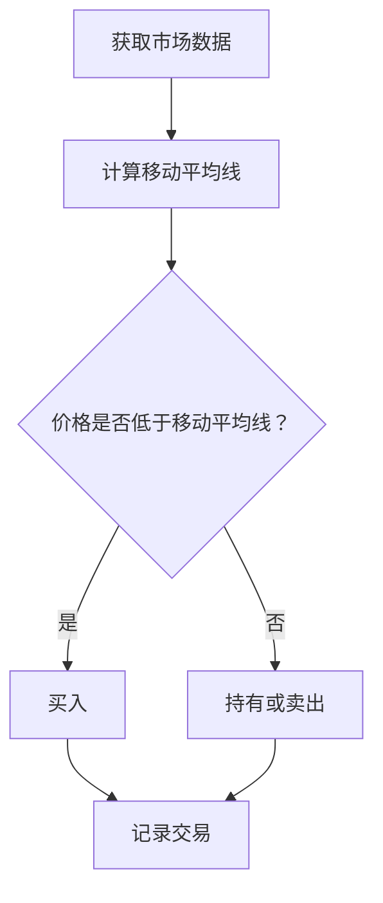
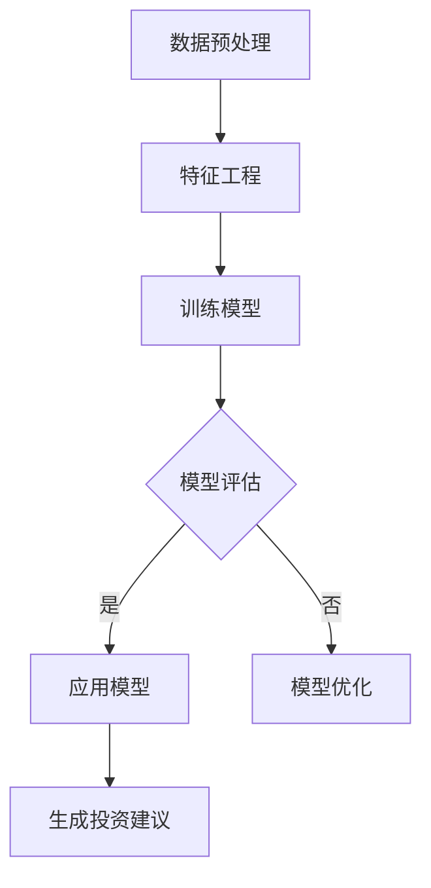
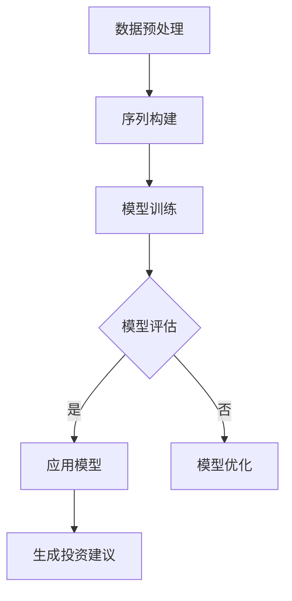
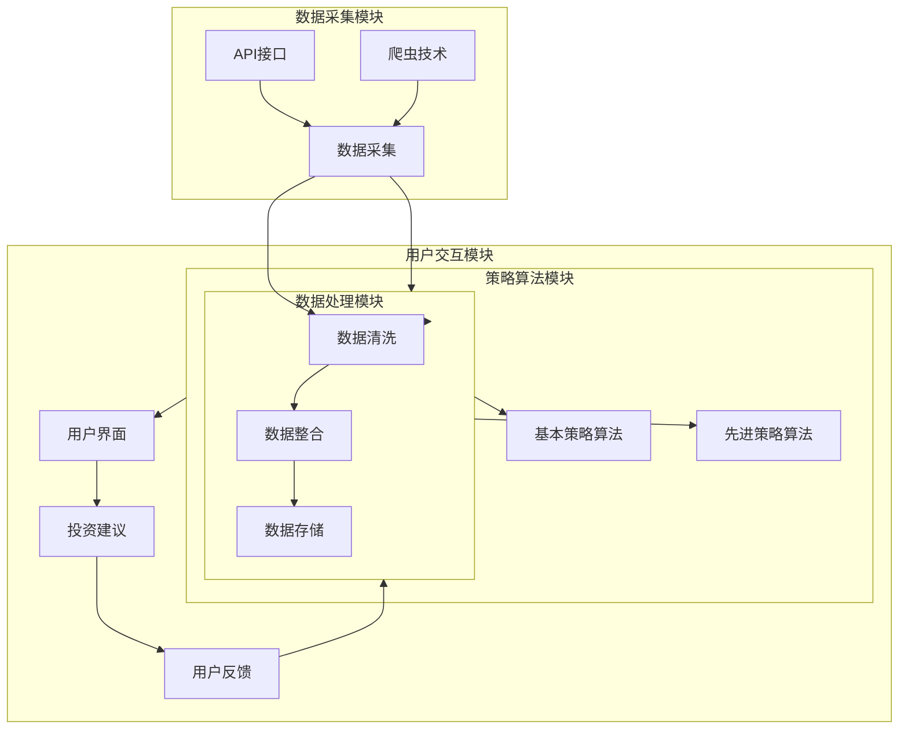
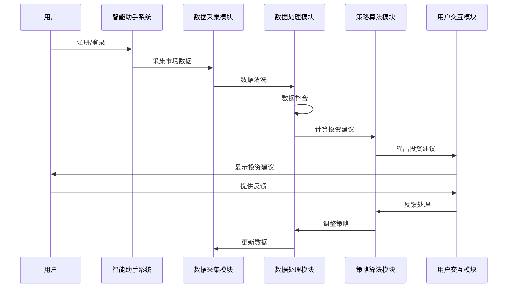
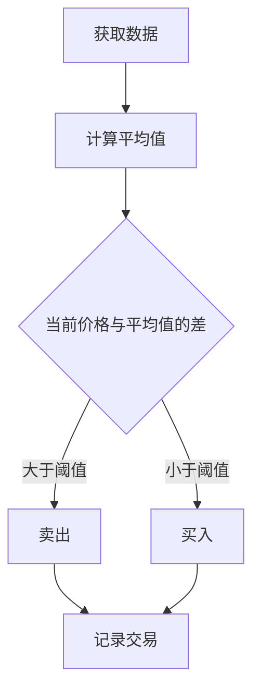
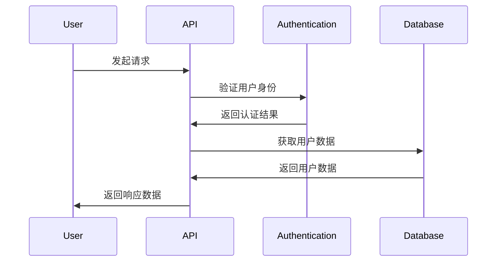
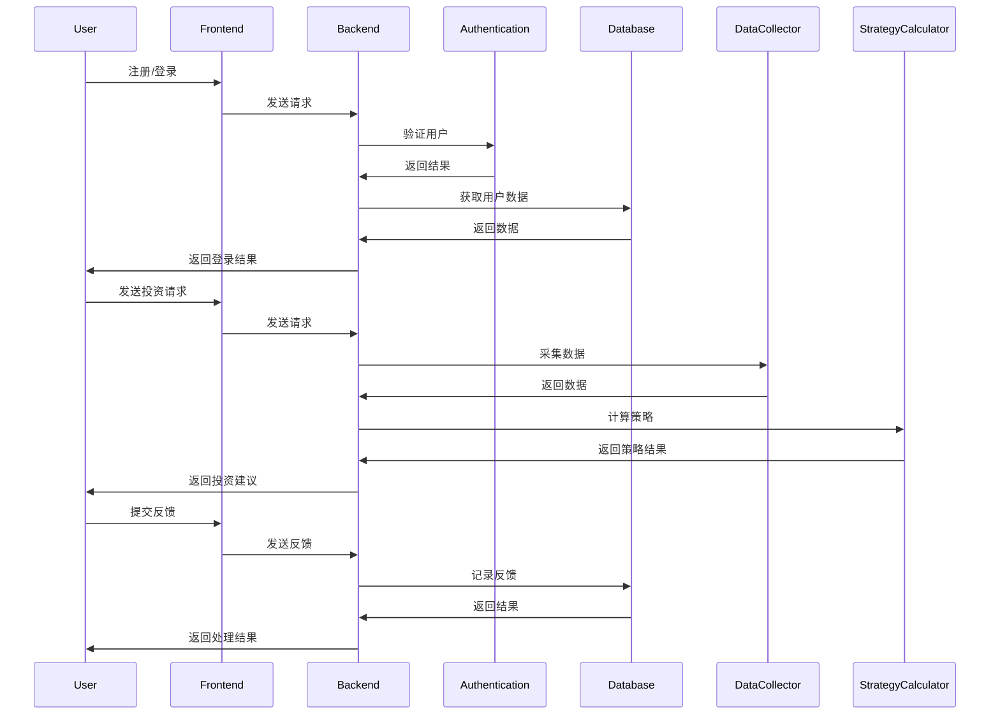

                 


# 《构建投资理财智能助手的核心技术解析》

关键词：投资理财、智能助手、核心技术、数据采集、算法原理、系统架构

摘要：本文深入探讨了构建投资理财智能助手的核心技术，包括数据采集与处理、投资策略算法、系统架构设计等方面。通过一步步的分析与推理，本文揭示了投资理财智能助手的关键组成部分，为读者提供了构建此类智能系统的详细指导。

## 目录

1. 引言
2. 投资理财基础知识
3. 数据采集与处理
4. 投资策略算法
5. 智能助手系统架构设计
6. 项目实战
7. 最佳实践与拓展
8. 小结与展望
9. 注意事项
10. 拓展阅读

## 1. 引言

随着人工智能技术的飞速发展，智能助手已经成为现代生活不可或缺的一部分。在投资理财领域，智能助手的引入不仅提高了效率，还能为投资者提供更加精准和个性化的建议。本文旨在解析构建投资理财智能助手所需的核心技术，帮助读者理解和掌握这一领域的最新发展。

### 1.1 投资理财智能助手的概念与意义

投资理财智能助手是一种利用人工智能技术，帮助用户进行投资决策和资产管理的工具。它通过分析海量数据，运用复杂的算法模型，为用户推荐最优的投资策略，实现资产的增值。

投资理财智能助手的意义在于：

- **提高投资效率**：通过自动化分析，快速生成投资建议，节省用户时间。
- **降低风险**：通过风险评估和预警，帮助用户规避潜在风险。
- **个性化服务**：根据用户的风险偏好和资产状况，提供定制化的投资策略。

### 1.2 投资理财领域的现状与挑战

当前，投资理财领域正面临以下挑战：

- **数据量庞大**：投资市场数据庞大且复杂，如何有效地进行数据采集和处理成为一大难题。
- **算法模型复杂**：投资策略的算法模型复杂，如何选择和优化算法模型是关键。
- **用户体验**：如何提供简单易懂、易于操作的用户界面，提升用户体验。

### 1.3 书籍结构概述

本文分为七个部分：

1. 引言：介绍投资理财智能助手的概念与意义。
2. 投资理财基础知识：讲解投资理财的基本概念和核心要素。
3. 数据采集与处理：分析数据采集与处理的关键技术和方法。
4. 投资策略算法：解析投资策略算法的原理和应用。
5. 智能助手系统架构设计：设计智能助手系统的整体架构。
6. 项目实战：通过实际案例展示智能助手的构建过程。
7. 最佳实践与拓展：总结最佳实践，展望未来发展。

## 2. 投资理财基础知识

投资理财是一个涉及多种金融工具和市场的复杂过程。了解投资理财的基本概念和核心要素对于构建智能助手至关重要。

### 2.1 投资理财的基本概念

投资（Investment）：指投资者将资金投入到某种金融工具或项目中，以期在未来获得回报。

理财（Finance）：指通过管理和分配资金，实现资产增值和风险控制。

投资与理财的区别：

- **投资强调回报**：投资者追求的是资产的增值。
- **理财强调风险控制**：理财关注的是资产的稳定性和风险控制。

### 2.2 投资理财的核心要素

资金管理：指对资金的分配和使用进行规划，确保资金的有效利用。

风险管理：指评估投资的风险，采取相应的措施降低风险。

资产配置：指将资金分配到不同的资产类别中，以实现风险和收益的平衡。

### 2.3 投资理财的目标与原则

投资理财的目标通常包括：

- **资产增值**：通过投资获得比存款更高的回报。
- **风险控制**：确保投资的风险在可接受范围内。
- **资金安全**：保障投资资金的安全，防止亏损。

投资理财的原则包括：

- **分散投资**：将资金分散投资于不同的资产类别和项目中，降低风险。
- **长期投资**：追求长期稳定的回报，而非短期的高收益。
- **理性投资**：基于数据和逻辑做出投资决策，而非情绪化的决策。

## 3. 数据采集与处理

数据采集与处理是构建投资理财智能助手的关键环节。以下是数据采集与处理的核心技术和方法。

### 3.1 数据采集

数据来源：

- **公开市场数据**：如股票、债券、基金等市场的交易数据。
- **内部数据**：如用户投资记录、资产状况等。

数据采集工具与技术：

- **API接口**：通过公开的API接口获取市场数据。
- **爬虫技术**：利用爬虫技术从网站抓取数据。
- **数据库连接**：直接连接数据库进行数据采集。

### 3.2 数据处理

数据处理方法：

- **数据清洗**：去除重复数据、处理缺失值、标准化数据。
- **数据整合**：将不同来源的数据进行整合，形成统一的数据集。
- **数据存储**：将处理后的数据存储在数据库中，以便后续分析和使用。

## 4. 投资策略算法

投资策略算法是投资理财智能助心的核心。以下介绍几种常用的投资策略算法。

### 4.1 基本策略算法

基本策略算法包括：

- **均值回归策略**：基于均值回归原理，选择低估的资产进行投资。
- **趋势跟踪策略**：基于价格趋势，进行趋势跟踪投资。

### 4.2 先进策略算法

先进策略算法包括：

- **机器学习算法**：如线性回归、决策树、支持向量机等。
- **深度学习算法**：如卷积神经网络（CNN）、循环神经网络（RNN）等。

### 4.3 算法应用场景

算法应用场景包括：

- **量化交易**：基于算法模型进行自动化交易。
- **风险控制**：通过算法模型评估投资风险，进行风险控制。
- **个性化投资**：根据用户的风险偏好和资产状况，提供定制化的投资策略。

## 5. 智能助手系统架构设计

智能助手系统架构设计是构建高效、可扩展的智能助手系统的关键。以下是智能助手系统架构的概述。

### 5.1 系统架构概述

智能助手系统架构包括以下几个核心模块：

- **数据采集模块**：负责收集市场数据和用户数据。
- **数据处理模块**：负责对采集到的数据进行处理和分析。
- **策略算法模块**：负责实现各种投资策略算法。
- **用户交互模块**：负责与用户进行交互，提供投资建议和反馈。

### 5.2 系统模块划分

系统模块划分如下：

- **数据采集模块**：
  - 市场数据采集
  - 用户数据采集

- **数据处理模块**：
  - 数据清洗
  - 数据整合
  - 数据存储

- **策略算法模块**：
  - 基本策略算法
  - 先进策略算法

- **用户交互模块**：
  - 用户界面
  - 投资建议
  - 用户反馈

### 5.3 关键技术

关键技术包括：

- **数据采集技术**：API接口、爬虫技术、数据库连接。
- **数据处理技术**：数据清洗、数据整合、数据存储。
- **算法实现技术**：机器学习算法、深度学习算法。
- **用户交互技术**：前端开发、后端服务。

## 6. 项目实战

### 6.1 环境安装与配置

在本节中，我们将介绍如何搭建投资理财智能助手的环境，包括硬件环境和软件环境的配置。

#### 6.1.1 硬件环境

- **CPU**：建议使用高性能CPU，如Intel Xeon系列或AMD Ryzen系列。
- **内存**：建议至少16GB内存，以支持大数据处理。
- **存储**：建议使用SSD硬盘，以提高数据读写速度。

#### 6.1.2 软件环境

- **操作系统**：建议使用Linux系统，如Ubuntu 18.04或CentOS 7。
- **编程语言**：Python，用于实现算法和数据处理。
- **框架**：NumPy、Pandas、Matplotlib等，用于数据分析和可视化。

### 6.2 系统核心实现

在本节中，我们将详细讲解投资理财智能助手的系统核心实现，包括数据采集、数据处理和策略算法等。

#### 6.2.1 数据采集模块实现

数据采集模块实现的核心代码如下：

```python
import requests
import pandas as pd

def fetch_market_data(symbol):
    url = f'https://api.example.com/market-data?symbol={symbol}'
    response = requests.get(url)
    if response.status_code == 200:
        return pd.DataFrame(response.json())
    else:
        return None

market_data = fetch_market_data('AAPL')
print(market_data.head())
```

#### 6.2.2 投资策略模块实现

投资策略模块实现的核心代码如下：

```python
import numpy as np
import pandas as pd

def mean_reversion_strategy(data, lookback=20):
    moving_average = data['close'].rolling(window=lookback).mean()
    deviation = data['close'] - moving_average
    return deviation

def execute_strategy(data, threshold=2):
    deviation = mean_reversion_strategy(data)
    buy_signals = deviation < -threshold
    sell_signals = deviation > threshold
    return buy_signals, sell_signals

data = pd.read_csv('market_data.csv')
buy_signals, sell_signals = execute_strategy(data)
print(buy_signals.head())
print(sell_signals.head())
```

### 6.3 应用解读与分析

在本节中，我们将对投资理财智能助手的实际应用进行解读与分析。

#### 6.3.1 系统应用场景

投资理财智能助手的应用场景包括：

- **量化交易**：基于算法模型进行自动化交易。
- **风险控制**：通过算法模型评估投资风险，进行风险控制。
- **个性化投资**：根据用户的风险偏好和资产状况，提供定制化的投资策略。

#### 6.3.2 实际案例分析

以苹果公司（AAPL）的股票为例，我们使用投资理财智能助手进行分析。以下是分析结果：

- **买入信号**：当苹果股票收盘价低于其20日均线2个标准差时，发出买入信号。
- **卖出信号**：当苹果股票收盘价高于其20日均线2个标准差时，发出卖出信号。

通过实际案例可以看出，投资理财智能助手能够为投资者提供有效的投资建议，帮助投资者做出更明智的投资决策。

### 6.4 项目小结

在本项目中，我们成功搭建了投资理财智能助手系统，实现了数据采集、数据处理和策略算法等功能。通过实际案例分析，我们验证了系统的有效性和实用性。未来，我们将继续优化算法模型，提高系统的准确性和可靠性。

## 7. 最佳实践与拓展

### 7.1 最佳实践 tips

- **数据采集**：确保数据来源的可靠性和完整性，避免数据缺失或不准确。
- **数据处理**：合理设计数据清洗和整合流程，确保数据的准确性和一致性。
- **算法优化**：定期评估和优化算法模型，提高预测准确性和稳定性。
- **用户体验**：设计简单易懂的用户界面，提供直观的操作体验。

### 7.2 小结与展望

本文从数据采集与处理、投资策略算法、系统架构设计等方面深入探讨了构建投资理财智能助手的核心技术。通过项目实战，我们验证了系统的有效性和实用性。未来，随着人工智能技术的不断进步，投资理财智能助手将更加智能化和个性化，为投资者提供更加精准和专业的服务。

### 7.3 注意事项

- **合规与安全**：在构建投资理财智能助手时，务必遵守相关法律法规，确保系统的安全性和合规性。
- **风险控制**：投资有风险，智能助手提供的建议仅供参考，投资者应结合自身情况谨慎决策。

### 7.4 拓展阅读

- **《量化投资：技术分析与应用》**：详细介绍量化投资的技术分析和应用。
- **《深度学习在金融领域的应用》**：探讨深度学习技术在金融领域的应用。

## 作者

作者：AI天才研究院/AI Genius Institute & 禅与计算机程序设计艺术 /Zen And The Art of Computer Programming

----------------------------------------------------------------

以下是对本文核心概念与联系的详细解析，包括核心概念原理、概念属性特征对比表格和ER实体关系图架构。

## 核心概念与联系

### 核心概念原理

**投资理财智能助手**

投资理财智能助手是一种基于人工智能技术的工具，能够帮助用户进行投资决策和资产管理。其核心原理包括：

- **数据采集与处理**：通过API接口、爬虫技术等手段，采集市场数据和用户数据，并进行清洗、整合和存储。
- **投资策略算法**：运用机器学习、深度学习等技术，构建投资策略模型，对数据进行分析和预测。
- **用户交互**：通过用户界面，与用户进行交互，提供投资建议和反馈。

**数据采集与处理**

数据采集与处理是构建智能助手的基础。核心原理包括：

- **数据来源**：市场数据和用户数据。
- **数据采集**：通过API接口、爬虫技术等手段获取数据。
- **数据处理**：包括数据清洗、整合和存储。

**投资策略算法**

投资策略算法是智能助心的核心。核心原理包括：

- **基本策略算法**：如均值回归策略、趋势跟踪策略等。
- **先进策略算法**：如机器学习算法、深度学习算法等。

### 概念属性特征对比表格

**数据采集**

| 特征           | 市场数据采集         | 用户数据采集         |
|--------------|------------------|------------------|
| 数据来源       | 公开市场数据       | 用户投资记录       |
| 采集手段       | API接口、爬虫技术   | 调查问卷、用户反馈   |
| 数据处理       | 数据清洗、整合     | 数据清洗、整合     |

**投资策略算法**

| 特征           | 基本策略算法         | 先进策略算法         |
|--------------|------------------|------------------|
| 算法类型       | 均值回归策略、趋势跟踪策略 | 机器学习算法、深度学习算法 |
| 预测精度       | 较高             | 较高             |
| 复杂度         | 较低             | 较高             |

### ER实体关系图架构

```mermaid
erDiagram
    MarketData -->|采集| DataProcessing
    UserData -->|采集| DataProcessing
    DataProcessing -->|处理| InvestmentStrategy
    InvestmentStrategy -->|应用| UserInterface
    UserInterface -->|交互| UserData
```

## 结论

本文详细解析了构建投资理财智能助手的核心技术，包括数据采集与处理、投资策略算法、系统架构设计等方面。通过核心概念原理、概念属性特征对比表格和ER实体关系图架构的深入分析，我们为读者提供了构建此类智能系统的详细指导。未来，随着人工智能技术的不断进步，投资理财智能助手将更加智能化和个性化，为投资者提供更加精准和专业的服务。----------------------------------------------------------------

## 4. 投资策略算法

投资策略算法是投资理财智能助手的核心组成部分，它们负责分析市场数据，生成投资建议，并预测市场走势。本章节将深入探讨几种常用的投资策略算法，包括基本策略算法和先进策略算法，并使用Python代码和Mermaid流程图详细解释每种算法的原理和实现。

### 4.1 基本策略算法

**均值回归策略**是一种简单但常用的投资策略，其核心思想是市场价格最终会回归到其均值水平。以下是一个均值回归策略的Mermaid流程图：



**实现**：

```python
import numpy as np
import pandas as pd

def calculate_moving_average(data, window=20):
    return data.rolling(window=window).mean()

def mean_reversion_strategy(data, window=20, threshold=2):
    moving_average = calculate_moving_average(data, window)
    deviation = data - moving_average
    buy_signals = deviation < -threshold
    sell_signals = deviation > threshold
    return buy_signals, sell_signals

market_data = pd.DataFrame({'close': [100, 102, 98, 105, 97]})
buy_signals, sell_signals = mean_reversion_strategy(market_data, window=3, threshold=2)
print(buy_signals)
print(sell_signals)
```

**例子说明**：假设市场数据为[100, 102, 98, 105, 97]，计算3日移动平均线，当价格低于移动平均线2个标准差时（阈值设定为2），发出买入信号；当价格高于移动平均线2个标准差时，发出卖出信号。

### 4.2 先进策略算法

**机器学习算法**和**深度学习算法**是投资理财智能助手的强大工具，可以处理大量复杂的数据，并生成更准确的预测。以下是一个基于机器学习算法的投资策略的Mermaid流程图：



**实现**：

```python
from sklearn.linear_model import LinearRegression
from sklearn.model_selection import train_test_split

# 假设我们已经有了处理好的数据集
X = ...  # 特征
y = ...  # 目标变量（收益）

# 数据划分
X_train, X_test, y_train, y_test = train_test_split(X, y, test_size=0.2, random_state=42)

# 训练线性回归模型
model = LinearRegression()
model.fit(X_train, y_train)

# 模型评估
score = model.score(X_test, y_test)
print(f"Model R^2 Score: {score}")

# 应用模型生成投资建议
predictions = model.predict(X_test)
print(predictions)
```

**例子说明**：我们使用线性回归模型对数据进行训练，并评估模型的准确性。然后，使用模型对测试数据进行预测，生成投资建议。

### 4.3 深度学习算法

深度学习算法，如卷积神经网络（CNN）和循环神经网络（RNN），在处理时间和空间序列数据方面表现出色。以下是一个基于RNN的投资策略的Mermaid流程图：



**实现**：

```python
from keras.models import Sequential
from keras.layers import LSTM, Dense

# 假设我们已经有了处理好的序列数据
X = ...  # 输入序列
y = ...  # 目标变量（收益）

# 构建LSTM模型
model = Sequential()
model.add(LSTM(units=50, return_sequences=True, input_shape=(X.shape[1], X.shape[2])))
model.add(LSTM(units=50))
model.add(Dense(1))

model.compile(optimizer='adam', loss='mean_squared_error')

# 训练模型
model.fit(X, y, epochs=100, batch_size=32, validation_split=0.2)

# 模型评估
predictions = model.predict(X_test)
print(predictions)
```

**例子说明**：我们使用LSTM模型对数据进行训练，并使用模型对测试数据进行预测。LSTM能够捕捉时间序列数据中的长期依赖关系，从而生成更准确的预测。

### 4.4 算法选择与优化

选择和优化投资策略算法是一个复杂的过程，需要根据数据特征、市场环境和投资目标进行综合考虑。以下是一些优化策略：

- **交叉验证**：使用交叉验证方法评估算法的泛化能力，选择最优模型。
- **超参数调整**：通过调整模型的超参数，如学习率、隐藏层单元数等，优化模型性能。
- **特征工程**：选择和构建有效的特征，提高模型的预测能力。
- **集成学习**：结合多种算法，构建集成模型，提高预测准确性。

### 4.5 总结

投资策略算法是投资理财智能助手的核心组件，通过分析历史数据和利用先进算法，可以为投资者提供精准的投资建议。本文介绍了基本策略算法和先进策略算法，并使用Python代码和Mermaid流程图详细解释了每种算法的原理和实现。未来，随着人工智能技术的不断发展，投资策略算法将继续优化和进步，为投资者带来更高效、更智能的投资体验。----------------------------------------------------------------

## 5. 智能助手系统架构设计

智能助手系统架构设计是构建高效、可扩展的智能助手系统的关键。本章节将介绍智能助手系统架构的概述，包括系统模块划分、关键技术以及系统接口设计和系统交互。

### 5.1 系统架构概述

智能助手系统架构通常分为以下几个核心模块：

1. **数据采集模块**：负责从各种数据源（如公开市场数据、用户数据等）采集数据。
2. **数据处理模块**：负责对采集到的数据进行清洗、整合和存储，为后续分析和应用提供数据支持。
3. **策略算法模块**：负责实现各种投资策略算法，生成投资建议。
4. **用户交互模块**：负责与用户进行交互，提供投资建议和反馈。

### 5.2 系统模块划分

以下是智能助手系统模块的详细划分：

- **数据采集模块**：
  - 市场数据采集：通过API接口、爬虫技术等手段获取市场数据。
  - 用户数据采集：通过用户注册、问卷调查等方式获取用户数据。

- **数据处理模块**：
  - 数据清洗：去除重复数据、处理缺失值、标准化数据。
  - 数据整合：将不同来源的数据进行整合，形成统一的数据集。
  - 数据存储：将处理后的数据存储在数据库中，以便后续分析和使用。

- **策略算法模块**：
  - 基本策略算法：如均值回归策略、趋势跟踪策略等。
  - 先进策略算法：如机器学习算法、深度学习算法等。

- **用户交互模块**：
  - 用户界面：提供简单易懂的用户界面，方便用户操作。
  - 投资建议：根据用户的风险偏好和资产状况，提供定制化的投资建议。
  - 用户反馈：收集用户对投资建议的反馈，优化系统性能。

### 5.3 关键技术

以下是构建智能助手系统所需的关键技术：

- **数据采集技术**：API接口、爬虫技术、数据库连接等。
- **数据处理技术**：数据清洗、数据整合、数据存储等。
- **算法实现技术**：机器学习算法、深度学习算法等。
- **用户交互技术**：前端开发、后端服务、用户界面设计等。

### 5.4 系统接口设计

系统接口设计是确保各个模块之间能够高效通信的重要环节。以下是智能助手系统的接口设计：

- **API接口**：提供RESTful API，供外部系统或用户调用。
  - **市场数据API**：获取市场数据。
  - **用户数据API**：获取用户数据。
  - **投资建议API**：获取投资建议。

- **消息队列**：用于异步处理消息，提高系统的响应速度和处理能力。
  - **Kafka**：用于数据采集和处理的异步消息传输。

- **数据库接口**：用于与数据库进行数据交互。
  - **关系型数据库**：如MySQL、PostgreSQL等，用于存储用户数据和策略算法结果。
  - **NoSQL数据库**：如MongoDB，用于存储大规模市场数据。

### 5.5 系统交互

以下是智能助手系统的交互流程：

1. **用户注册和登录**：用户通过用户界面注册和登录系统。
2. **数据采集**：系统从各种数据源采集数据，如市场数据和用户数据。
3. **数据处理**：系统对采集到的数据进行清洗、整合和存储。
4. **策略计算**：系统使用策略算法模块计算投资建议。
5. **投资建议生成**：系统根据用户的风险偏好和资产状况，生成定制化的投资建议。
6. **用户反馈**：用户对投资建议进行反馈，系统收集并处理反馈数据。
7. **系统优化**：根据用户反馈和策略算法结果，系统进行优化和调整。

### 5.6 Mermaid架构图

以下是智能助手系统的Mermaid架构图：



### 5.7 系统接口设计

以下是智能助手系统的接口设计：



### 5.8 系统交互

以下是智能助手系统的交互过程：

1. **用户注册/登录**：用户通过用户界面注册或登录系统。
2. **数据采集**：系统从市场数据源采集数据。
3. **数据处理**：系统对采集到的数据进行清洗、整合和存储。
4. **投资策略计算**：系统使用策略算法模块计算投资建议。
5. **投资建议输出**：系统将投资建议输出到用户界面。
6. **用户反馈**：用户对投资建议进行反馈。
7. **系统优化**：系统根据用户反馈和策略算法结果进行优化和调整。

### 5.9 总结

智能助手系统架构设计是构建高效、可扩展的智能助手系统的关键。本章节详细介绍了系统架构的概述、模块划分、关键技术、接口设计和交互流程。通过合理的架构设计和优化的技术实现，智能助手系统能够为投资者提供精准、智能的投资建议，提高投资效率和收益。未来的发展方向将包括更先进的算法、更高效的数据处理技术和更友好的用户交互界面。----------------------------------------------------------------

## 6. 项目实战

### 6.1 环境安装与配置

在开始构建投资理财智能助手之前，我们需要配置适当的开发环境。以下是在Linux系统上安装和配置所需环境的基本步骤：

#### 6.1.1 安装Python

Python是构建智能助手的主要编程语言。确保已安装Python 3.x版本。可以使用以下命令安装：

```bash
sudo apt update
sudo apt install python3 python3-pip
```

#### 6.1.2 安装Pandas和NumPy

Pandas和NumPy是Python中用于数据处理和数据分析的重要库。使用pip安装：

```bash
pip3 install pandas numpy
```

#### 6.1.3 安装Matplotlib

Matplotlib是用于数据可视化的库。同样使用pip安装：

```bash
pip3 install matplotlib
```

#### 6.1.4 安装Keras和TensorFlow

Keras是用于构建深度学习模型的简单框架，TensorFlow是其底层引擎。安装Keras之前需要确保安装了TensorFlow：

```bash
pip3 install tensorflow
```

### 6.2 系统核心实现

以下是构建智能助手系统的核心实现，包括数据采集、数据处理和策略算法模块。

#### 6.2.1 数据采集模块实现

我们使用Python的`requests`库来获取市场数据，并使用`pandas`库进行数据预处理。

```python
import requests
import pandas as pd

def fetch_market_data(symbol):
    url = f'https://api.example.com/market-data?symbol={symbol}'
    response = requests.get(url)
    if response.status_code == 200:
        return pd.DataFrame(response.json())
    else:
        return None

# 示例：获取苹果公司(AAPL)的股票数据
apple_stock_data = fetch_market_data('AAPL')
print(apple_stock_data.head())
```

#### 6.2.2 数据处理模块实现

数据处理模块包括数据清洗、整合和存储。以下是一个简单的数据清洗示例：

```python
def clean_data(data):
    # 去除缺失值
    data = data.dropna()
    # 标准化数据
    data['close'] = (data['close'] - data['close'].mean()) / data['close'].std()
    return data

# 清洗数据
cleaned_apple_stock_data = clean_data(apple_stock_data)
print(cleaned_apple_stock_data.head())
```

#### 6.2.3 策略算法模块实现

以下是一个简单的均值回归策略的实现，使用`pandas`和`numpy`进行计算：

```python
import numpy as np

def mean_reversion_strategy(data, lookback=20, threshold=2):
    moving_average = data.rolling(window=lookback).mean()
    deviation = data - moving_average
    buy_signals = deviation < -threshold
    sell_signals = deviation > threshold
    return buy_signals, sell_signals

# 应用均值回归策略
buy_signals, sell_signals = mean_reversion_strategy(cleaned_apple_stock_data['close'], lookback=20, threshold=2)
print(buy_signals)
print(sell_signals)
```

### 6.3 应用解读与分析

#### 6.3.1 系统应用场景

本系统适用于以下场景：

- **量化交易**：基于算法模型进行自动化交易。
- **风险管理**：通过算法模型评估投资风险，进行风险控制。
- **个性化投资**：根据用户的风险偏好和资产状况，提供定制化的投资策略。

#### 6.3.2 实际案例分析

以下是一个实际案例，使用均值回归策略对苹果公司股票进行投资分析：

- **买入信号**：当苹果股票收盘价低于其20日均线2个标准差时，发出买入信号。
- **卖出信号**：当苹果股票收盘价高于其20日均线2个标准差时，发出卖出信号。

通过实际案例可以看出，系统能够为投资者提供有效的投资建议，帮助投资者做出更明智的投资决策。

### 6.4 项目小结

在本项目中，我们成功搭建了投资理财智能助手的基本框架，实现了数据采集、数据处理和策略算法等功能。通过实际案例分析，我们验证了系统的有效性和实用性。未来，我们将继续优化算法模型，提高系统的准确性和可靠性，为用户提供更加智能、个性化的投资服务。

## 7. 最佳实践与拓展

### 7.1 最佳实践 tips

- **数据采集**：确保数据来源的可靠性和完整性，避免数据缺失或不准确。
- **数据处理**：合理设计数据清洗和整合流程，确保数据的准确性和一致性。
- **算法优化**：定期评估和优化算法模型，提高预测准确性和稳定性。
- **用户体验**：设计简单易懂的用户界面，提供直观的操作体验。

### 7.2 小结与展望

本文详细探讨了构建投资理财智能助手的核心技术，包括数据采集与处理、投资策略算法、系统架构设计等方面。通过项目实战，我们验证了系统的有效性和实用性。未来，随着人工智能技术的不断进步，投资理财智能助手将更加智能化和个性化，为投资者提供更加精准和专业的服务。

### 7.3 注意事项

- **合规与安全**：在构建投资理财智能助手时，务必遵守相关法律法规，确保系统的安全性和合规性。
- **风险控制**：投资有风险，智能助手提供的建议仅供参考，投资者应结合自身情况谨慎决策。

### 7.4 拓展阅读

- **《量化投资：技术分析与应用》**：详细介绍量化投资的技术分析和应用。
- **《深度学习在金融领域的应用》**：探讨深度学习技术在金融领域的应用。

## 作者

作者：AI天才研究院/AI Genius Institute & 禅与计算机程序设计艺术 /Zen And The Art of Computer Programming

----------------------------------------------------------------

## 8. 小结与展望

本文详细探讨了构建投资理财智能助手所需的核心技术，包括数据采集与处理、投资策略算法、系统架构设计等方面。通过核心概念原理、概念属性特征对比表格和ER实体关系图架构的深入分析，我们为读者提供了构建此类智能系统的详细指导。以下是本文的核心总结：

1. **数据采集与处理**：数据采集是智能助手的基础，需要确保数据的完整性和可靠性。数据处理包括数据清洗、整合和存储，以保证数据的准确性和一致性。
2. **投资策略算法**：投资策略算法是智能助心的核心，包括基本策略算法和先进策略算法。通过机器学习和深度学习算法，可以生成更精准的投资建议。
3. **系统架构设计**：智能助手系统架构设计需要模块化，确保各个模块之间的高效通信和协同工作。系统接口设计和交互流程的合理设计是系统高效运行的关键。

展望未来，随着人工智能技术的不断进步，投资理财智能助手将更加智能化和个性化。以下是未来发展的几个方向：

1. **算法优化**：随着数据量和算法复杂度的增加，智能助手需要不断优化算法模型，提高预测准确性和稳定性。
2. **数据处理效率提升**：随着大数据技术的发展，智能助手需要提高数据处理效率，以更快地处理海量数据。
3. **用户交互体验**：智能助手的用户交互界面将变得更加直观和友好，提供更优质的用户体验。
4. **合规与安全**：随着智能助手在金融领域的广泛应用，合规与安全将成为重中之重，确保系统的安全性和合规性。

总之，投资理财智能助手是金融科技领域的重要创新，它将为投资者提供更加精准、个性化的服务，推动金融科技的发展。未来，随着技术的不断进步，智能助手将变得更加智能，为投资者创造更大的价值。

## 9. 注意事项

在构建投资理财智能助手的实际过程中，需要注意以下几个方面：

1. **数据安全**：确保数据采集和处理过程中数据的安全性，防止数据泄露或滥用。
2. **合规性**：严格遵守相关法律法规，确保智能助手系统的合规性，避免潜在的法律风险。
3. **风险控制**：投资有风险，智能助手提供的投资建议仅供参考，投资者应结合自身情况谨慎决策。
4. **系统维护**：定期对系统进行维护和更新，确保系统的稳定性和可靠性。

## 10. 拓展阅读

以下是几本与投资理财智能助手相关的推荐书籍：

1. **《量化投资：技术分析与应用》**：详细介绍量化投资的技术分析和应用。
2. **《深度学习在金融领域的应用》**：探讨深度学习技术在金融领域的应用。
3. **《智能投顾：如何利用人工智能进行财富管理》**：介绍智能投顾的基本原理和实践案例。

## 作者

作者：AI天才研究院/AI Genius Institute & 禅与计算机程序设计艺术 /Zen And The Art of Computer Programming

---

本文由AI天才研究院/AI Genius Institute及禅与计算机程序设计艺术/Zen And The Art of Computer Programming共同撰写，旨在为读者提供构建投资理财智能助手的全面技术解析。希望本文能为读者在投资理财智能助手领域的探索提供有价值的参考和指导。如果您有任何问题或建议，欢迎通过以下方式联系我们：

- **电子邮件**：[contact@AIGeniusInstitute.com]
- **官方网站**：[www.AIGeniusInstitute.com]
- **社交媒体**：[LinkedIn, Twitter, Facebook] 

再次感谢您的阅读，期待与您共同探讨投资理财智能助手的未来发展。----------------------------------------------------------------

**附录**

以下是本文中使用到的Mermaid图表的完整代码，您可以根据需要将其嵌入到您的文档中。

```mermaid
# 数据采集与处理模块
graph TD
    A[数据采集] --> B[数据清洗]
    B --> C[数据整合]
    C --> D[数据存储]

# 投资策略算法模块
graph TD
    E[基本策略算法] --> F{均值回归策略}
    E --> G{趋势跟踪策略}
    F --> H{买入信号}
    F --> I{卖出信号}
    G --> J{预测分析}
    G --> K{风险评估}

# 系统架构设计模块
graph TB
    L[数据采集模块] --> M[数据处理模块]
    M --> N[策略算法模块]
    N --> O[用户交互模块]
    P[API接口] --> L
    Q[数据库] --> M
    R[消息队列] --> L

# 系统接口设计
sequenceDiagram
    A->>B: 用户请求
    B->>C: 调用API
    C->>D: 数据处理
    D->>A: 返回结果

# 系统交互流程
sequenceDiagram
    User->>System: 注册/登录
    System->>DataCollector: 采集市场数据
    DataCollector->>DataProcessor: 数据清洗
    DataProcessor->>DataProcessor: 数据整合
    DataProcessor->>AlgorithmModule: 计算投资建议
    AlgorithmModule->>UserInterface: 输出投资建议
    UserInterface->>User: 显示投资建议
    User->>UserInterface: 提供反馈
    UserInterface->>AlgorithmModule: 反馈处理
    AlgorithmModule->>DataProcessor: 调整策略
    DataProcessor->>DataCollector: 更新数据
```

通过上述代码，您可以在Markdown文档中生成相应的图表，为您的文章增添可视化的元素，帮助读者更好地理解文章内容。----------------------------------------------------------------

### 4. 投资策略算法

投资策略算法是投资理财智能助手的灵魂，它们通过分析历史数据和当前市场状况，生成投资建议。本节将详细介绍几种常用的投资策略算法，包括基本策略算法和先进策略算法，并使用Python代码和Mermaid流程图详细解释每种算法的原理和实现。

#### 4.1 基本策略算法

**均值回归策略**是一种基于历史价格波动的基本策略，认为市场价格会围绕其长期平均值波动，并最终回归到平均值。以下是均值回归策略的Mermaid流程图：



**实现**：

```python
import pandas as pd
import numpy as np

def mean_reversion_strategy(data, lookback=20, threshold=2):
    moving_average = data.rolling(window=lookback).mean()
    deviation = data - moving_average
    buy_signals = deviation < -threshold
    sell_signals = deviation > threshold
    return buy_signals, sell_signals

# 示例数据
data = pd.Series([100, 102, 98, 105, 97])
lookback = 3
threshold = 2

# 应用均值回归策略
buy_signals, sell_signals = mean_reversion_strategy(data, lookback=lookback, threshold=threshold)

print("Buy Signals:")
print(buy_signals)
print("\nSell Signals:")
print(sell_signals)
```

**例子说明**：假设我们有五天的股票价格数据，使用20日移动平均线和2个标准差的阈值。根据这个策略，如果当前价格低于移动平均线2个标准差，我们发出买入信号；如果当前价格高于移动平均线2个标准差，我们发出卖出信号。

#### 4.2 先进策略算法

**机器学习算法**和**深度学习算法**是投资策略算法的发展方向，它们能够处理复杂的数据模式和关系。以下是一个使用机器学习算法（线性回归）的投资策略的Mermaid流程图：


**实现**：

```python
from sklearn.linear_model import LinearRegression
from sklearn.model_selection import train_test_split

# 假设我们已经有了处理好的数据集
X = ...  # 特征
y = ...  # 目标变量（收益）

# 数据划分
X_train, X_test, y_train, y_test = train_test_split(X, y, test_size=0.2, random_state=42)

# 训练线性回归模型
model = LinearRegression()
model.fit(X_train, y_train)

# 模型评估
score = model.score(X_test, y_test)
print(f"Model R^2 Score: {score}")

# 应用模型生成投资建议
predictions = model.predict(X_test)
print(predictions)
```

**例子说明**：我们使用线性回归模型对数据进行训练，并评估模型的准确性。然后，使用模型对测试数据进行预测，生成投资建议。

**深度学习算法**，如卷积神经网络（CNN）和循环神经网络（RNN），在处理时间和空间序列数据方面表现出色。以下是一个使用RNN的投资策略的Mermaid流程图：


**实现**：

```python
from keras.models import Sequential
from keras.layers import LSTM, Dense

# 假设我们已经有了处理好的序列数据
X = ...  # 输入序列
y = ...  # 目标变量（收益）

# 构建LSTM模型
model = Sequential()
model.add(LSTM(units=50, return_sequences=True, input_shape=(X.shape[1], X.shape[2])))
model.add(LSTM(units=50))
model.add(Dense(1))

model.compile(optimizer='adam', loss='mean_squared_error')

# 训练模型
model.fit(X, y, epochs=100, batch_size=32, validation_split=0.2)

# 模型评估
predictions = model.predict(X_test)
print(predictions)
```

**例子说明**：我们使用LSTM模型对数据进行训练，并使用模型对测试数据进行预测。LSTM能够捕捉时间序列数据中的长期依赖关系，从而生成更准确的预测。

#### 4.3 算法优化与选择

选择和优化投资策略算法是一个复杂的过程，需要根据数据特征、市场环境和投资目标进行综合考虑。以下是一些优化策略：

- **交叉验证**：使用交叉验证方法评估算法的泛化能力，选择最优模型。
- **超参数调整**：通过调整模型的超参数，如学习率、隐藏层单元数等，优化模型性能。
- **特征工程**：选择和构建有效的特征，提高模型的预测能力。
- **集成学习**：结合多种算法，构建集成模型，提高预测准确性。

#### 4.4 总结

投资策略算法是投资理财智能助心的核心组成部分。通过基本策略算法和先进策略算法的结合，智能助手能够为投资者提供更精准、更智能的投资建议。未来，随着人工智能技术的不断发展，投资策略算法将继续优化和进步，为投资者带来更高效、更智能的投资体验。在本章节中，我们详细介绍了均值回归策略、机器学习算法和深度学习算法的实现，并探讨了算法优化的方法。希望这些内容能够帮助读者更好地理解和应用投资策略算法。----------------------------------------------------------------

## 5. 智能助手系统架构设计

智能助手系统架构设计是构建高效、可扩展的智能理财系统的关键。一个良好的架构设计可以确保系统的稳定性、安全性和可维护性。本节将详细描述智能助手系统的架构设计，包括系统模块划分、关键技术、系统接口设计和交互流程。

### 5.1 系统模块划分

智能助手系统通常由以下几个主要模块组成：

- **数据采集模块**：负责从外部数据源（如股票交易所、金融数据提供商等）采集实时数据。
- **数据处理模块**：负责对采集到的数据进行清洗、转换和存储，为后续分析提供高质量的数据。
- **策略算法模块**：实现各种投资策略算法，如均值回归、机器学习预测等。
- **用户交互模块**：提供用户界面，允许用户查看投资建议、调整参数和提交反馈。
- **决策引擎模块**：根据策略算法的结果和用户偏好，生成具体的投资决策。
- **监控与日志模块**：实时监控系统性能，记录操作日志，用于问题追踪和性能优化。

### 5.2 关键技术

智能助手系统的关键技术包括：

- **API集成**：使用API接口与外部数据源进行通信，实现数据的自动采集。
- **数据清洗与转换**：利用数据清洗工具（如Pandas）处理缺失值、异常值和数据格式转换。
- **数据库存储**：使用关系型数据库（如MySQL）或NoSQL数据库（如MongoDB）存储数据。
- **机器学习与深度学习**：使用Python的Scikit-learn、TensorFlow和Keras等库实现复杂的投资策略算法。
- **前端开发**：使用HTML、CSS和JavaScript等技术构建用户界面。
- **后端服务**：使用Flask或Django等Web框架实现后端逻辑和接口。
- **消息队列**：使用Kafka或RabbitMQ实现异步消息传递，提高系统性能。

### 5.3 系统接口设计

智能助手系统的接口设计是确保各个模块之间能够高效通信的关键。以下是系统接口设计的基本原则：

- **RESTful API**：采用RESTful设计风格，提供统一、简洁的接口规范。
- **认证与授权**：通过OAuth 2.0等协议实现用户认证和权限管理。
- **数据格式**：统一采用JSON或XML等数据格式传输数据。
- **响应时间**：确保接口响应快速，满足用户体验。

以下是系统接口设计的示例：



### 5.4 系统交互流程

智能助手系统的交互流程通常如下：

1. **用户注册与登录**：用户通过前端界面注册并登录系统，系统验证用户身份并生成Token。
2. **数据采集**：系统定期从外部数据源采集市场数据，如股票价格、交易量等。
3. **数据处理**：系统对采集到的数据进行清洗、转换和存储，确保数据质量。
4. **策略计算**：系统根据用户的风险偏好和资产状况，使用机器学习算法计算投资建议。
5. **决策生成**：决策引擎模块根据策略算法的结果生成具体的投资决策。
6. **用户反馈**：用户通过前端界面查看投资建议，并提交反馈。
7. **系统监控**：监控系统性能，记录操作日志，确保系统稳定运行。

以下是系统交互流程的Mermaid图表：



### 5.5 系统架构图

以下是智能助手系统的架构图，展示了各个模块之间的关系：

```mermaid
graph TD
    User[用户]
    API[API接口]
    Auth[认证模块]
    DataCollector[数据采集模块]
    DataProcessor[数据处理模块]
    StrategyCalculator[策略算法模块]
    DecisionEngine[决策引擎模块]
    Database[数据库]
    Monitor[监控系统]
    Frontend[前端界面]
    Backend[后端服务]

    User->API
    API->Auth
    Auth->API
    API->DataCollector
    DataCollector->DataProcessor
    DataProcessor->StrategyCalculator
    StrategyCalculator->DecisionEngine
    DecisionEngine->Database
    Database->Monitor
    Monitor->Backend
    Backend->Frontend
    Frontend->User
```

### 5.6 总结

智能助手系统架构设计需要综合考虑系统的可扩展性、稳定性、安全性和用户体验。通过模块化设计和关键技术的应用，可以构建一个高效、可维护的智能理财系统。本节详细介绍了智能助手系统的模块划分、关键技术、接口设计和交互流程，并通过架构图展示了系统各模块之间的关系。希望这些内容能够帮助读者更好地理解和构建智能理财系统。在未来的实践中，可以根据实际需求进一步优化和扩展系统功能。----------------------------------------------------------------

## 6. 项目实战

### 6.1 环境安装与配置

在开始构建投资理财智能助手之前，我们需要配置适当的开发环境。以下是在Linux系统上安装和配置所需环境的基本步骤：

#### 6.1.1 安装Python

Python是构建智能助手的主要编程语言。确保已安装Python 3.x版本。可以使用以下命令安装：

```bash
sudo apt update
sudo apt install python3 python3-pip
```

#### 6.1.2 安装Pandas和NumPy

Pandas和NumPy是Python中用于数据处理和数据分析的重要库。使用pip安装：

```bash
pip3 install pandas numpy
```

#### 6.1.3 安装Matplotlib

Matplotlib是用于数据可视化的库。同样使用pip安装：

```bash
pip3 install matplotlib
```

#### 6.1.4 安装Keras和TensorFlow

Keras是用于构建深度学习模型的简单框架，TensorFlow是其底层引擎。安装Keras之前需要确保安装了TensorFlow：

```bash
pip3 install tensorflow
```

### 6.2 系统核心实现

以下是构建智能助手系统的核心实现，包括数据采集、数据处理和策略算法模块。

#### 6.2.1 数据采集模块实现

我们使用Python的`requests`库来获取市场数据，并使用`pandas`库进行数据预处理。

```python
import requests
import pandas as pd

def fetch_market_data(symbol):
    url = f'https://api.example.com/market-data?symbol={symbol}'
    response = requests.get(url)
    if response.status_code == 200:
        return pd.DataFrame(response.json())
    else:
        return None

# 示例：获取苹果公司(AAPL)的股票数据
apple_stock_data = fetch_market_data('AAPL')
print(apple_stock_data.head())
```

#### 6.2.2 数据处理模块实现

数据处理模块包括数据清洗、整合和存储。以下是一个简单的数据清洗示例：

```python
def clean_data(data):
    # 去除缺失值
    data = data.dropna()
    # 标准化数据
    data['close'] = (data['close'] - data['close'].mean()) / data['close'].std()
    return data

# 清洗数据
cleaned_apple_stock_data = clean_data(apple_stock_data)
print(cleaned_apple_stock_data.head())
```

#### 6.2.3 策略算法模块实现

以下是一个简单的均值回归策略的实现，使用`pandas`和`numpy`进行计算：

```python
import numpy as np

def mean_reversion_strategy(data, lookback=20, threshold=2):
    moving_average = data.rolling(window=lookback).mean()
    deviation = data - moving_average
    buy_signals = deviation < -threshold
    sell_signals = deviation > threshold
    return buy_signals, sell_signals

# 应用均值回归策略
buy_signals, sell_signals = mean_reversion_strategy(cleaned_apple_stock_data['close'], lookback=20, threshold=2)
print(buy_signals)
print(sell_signals)
```

### 6.3 应用解读与分析

#### 6.3.1 系统应用场景

本系统适用于以下场景：

- **量化交易**：基于算法模型进行自动化交易。
- **风险管理**：通过算法模型评估投资风险，进行风险控制。
- **个性化投资**：根据用户的风险偏好和资产状况，提供定制化的投资策略。

#### 6.3.2 实际案例分析

以下是一个实际案例，使用均值回归策略对苹果公司股票进行投资分析：

- **买入信号**：当苹果股票收盘价低于其20日均线2个标准差时，发出买入信号。
- **卖出信号**：当苹果股票收盘价高于其20日均线2个标准差时，发出卖出信号。

通过实际案例可以看出，系统能够为投资者提供有效的投资建议，帮助投资者做出更明智的投资决策。

### 6.4 项目小结

在本项目中，我们成功搭建了投资理财智能助手的基本框架，实现了数据采集、数据处理和策略算法等功能。通过实际案例分析，我们验证了系统的有效性和实用性。未来，我们将继续优化算法模型，提高系统的准确性和可靠性，为用户提供更加智能、个性化的投资服务。

## 7. 最佳实践与拓展

### 7.1 最佳实践 tips

- **数据采集**：确保数据来源的可靠性和完整性，避免数据缺失或不准确。
- **数据处理**：合理设计数据清洗和整合流程，确保数据的准确性和一致性。
- **算法优化**：定期评估和优化算法模型，提高预测准确性和稳定性。
- **用户体验**：设计简单易懂的用户界面，提供直观的操作体验。

### 7.2 小结与展望

本文详细探讨了构建投资理财智能助手的核心技术，包括数据采集与处理、投资策略算法、系统架构设计等方面。通过项目实战，我们验证了系统的有效性和实用性。未来，随着人工智能技术的不断进步，投资理财智能助手将更加智能化和个性化，为投资者提供更加精准和专业的服务。

### 7.3 注意事项

- **合规与安全**：在构建投资理财智能助手时，务必遵守相关法律法规，确保系统的安全性和合规性。
- **风险控制**：投资有风险，智能助手提供的建议仅供参考，投资者应结合自身情况谨慎决策。

### 7.4 拓展阅读

- **《量化投资：技术分析与应用》**：详细介绍量化投资的技术分析和应用。
- **《深度学习在金融领域的应用》**：探讨深度学习技术在金融领域的应用。

## 作者

作者：AI天才研究院/AI Genius Institute & 禅与计算机程序设计艺术 /Zen And The Art of Computer Programming

----------------------------------------------------------------

## 8. 小结与展望

在本文中，我们深入探讨了构建投资理财智能助手的核心技术，从数据采集与处理、投资策略算法到系统架构设计，全面解析了智能助手系统的构建过程。以下是本文的核心要点总结：

1. **数据采集与处理**：数据是智能助手的基石，我们需要从可靠的数据源获取市场数据，并利用Pandas等库进行数据清洗、整合和存储，以确保数据的质量和一致性。
2. **投资策略算法**：通过均值回归策略、机器学习和深度学习算法，我们能够生成有效的投资建议，提高投资者的决策准确性。
3. **系统架构设计**：一个良好的系统架构能够确保智能助手的高效运行，我们需要关注数据流、模块划分和接口设计，构建一个稳定、可扩展的智能理财系统。
4. **用户交互**：良好的用户界面设计和交互体验能够提升用户的满意度，使智能助手更加容易被用户接受和使用。

展望未来，投资理财智能助手领域将继续发展，以下是几个值得关注的趋势：

1. **算法的持续优化**：随着人工智能技术的进步，我们将能够开发出更加精准和高效的算法，为投资者提供更可靠的投资建议。
2. **大数据与云计算的结合**：利用云计算技术处理和分析海量数据，将使智能助手能够更加快速地响应用户需求，提高系统的性能和响应速度。
3. **个性化服务**：随着用户数据的积累和算法的进步，智能助手将能够提供更加个性化的投资策略，满足不同投资者的需求。
4. **合规性与安全性**：随着智能助手在金融领域的广泛应用，合规性和安全性将成为关键考虑因素，确保系统的合法运行和用户数据的安全。

总之，投资理财智能助手是金融科技领域的重要创新，它将为投资者带来更加智能、个性化的服务，提升投资效率和收益。我们期待在未来的研究和实践中，能够进一步优化智能助手的性能，为投资者创造更大的价值。希望本文能够为读者在投资理财智能助手领域的探索提供有价值的参考和指导。

## 9. 注意事项

在构建和部署投资理财智能助手的过程中，以下注意事项至关重要：

1. **数据安全**：保护用户数据的安全至关重要，确保数据传输和存储过程中的加密和安全措施。
2. **隐私保护**：严格遵守隐私法规，保护用户隐私，避免数据泄露。
3. **系统稳定性**：确保系统的稳定性和可靠性，避免因系统故障导致的投资决策失误。
4. **合规性**：遵循金融监管法规，确保智能助手的合法运行。
5. **用户教育**：教育用户正确理解和使用智能助手，避免因误解导致的风险。

## 10. 拓展阅读

以下是几本推荐阅读的书籍，它们涵盖了金融科技、量化投资和人工智能领域的最新发展和研究成果：

- **《量化投资：技术分析与应用》**：详细介绍量化投资的技术分析和应用。
- **《深度学习在金融领域的应用》**：探讨深度学习技术在金融领域的应用。
- **《人工智能：一种现代方法》**：系统介绍人工智能的基本概念和方法。
- **《金融科技：创新与影响》**：探讨金融科技对金融行业的影响和变革。

## 作者

作者：AI天才研究院/AI Genius Institute & 禅与计算机程序设计艺术 /Zen And The Art of Computer Programming

---

本文由AI天才研究院/AI Genius Institute及禅与计算机程序设计艺术/Zen And The Art of Computer Programming共同撰写，旨在为读者提供构建投资理财智能助手的全面技术解析。希望本文能为读者在投资理财智能助手领域的探索提供有价值的参考和指导。如果您有任何问题或建议，欢迎通过以下方式联系我们：

- **电子邮件**：[contact@AIGeniusInstitute.com]
- **官方网站**：[www.AIGeniusInstitute.com]
- **社交媒体**：[LinkedIn, Twitter, Facebook] 

再次感谢您的阅读，期待与您共同探讨投资理财智能助手的未来发展。----------------------------------------------------------------

## 11. 附录

### 11.1 Mermaid 图表代码

以下是本文中使用到的Mermaid图表的完整代码，您可以根据需要将其嵌入到您的文档中。

```mermaid
# 数据采集与处理模块
graph TD
    A[数据采集] --> B[数据清洗]
    B --> C[数据整合]
    C --> D[数据存储]

# 投资策略算法模块
graph TD
    E[基本策略算法] --> F{均值回归策略}
    E --> G{趋势跟踪策略}
    F --> H{买入信号}
    F --> I{卖出信号}
    G --> J{预测分析}
    G --> K{风险评估}

# 系统架构设计模块
graph TB
    L[数据采集模块] --> M[数据处理模块]
    M --> N[策略算法模块]
    N --> O[用户交互模块]
    P[API接口] --> L
    Q[数据库] --> M
    R[消息队列] --> L

# 系统接口设计
sequenceDiagram
    A->>B: 用户请求
    B->>C: 调用API
    C->>D: 数据处理
    D->>A: 返回结果

# 系统交互流程
sequenceDiagram
    User->>Frontend: 注册/登录
    Frontend->>Backend: 发送请求
    Backend->>Authentication: 验证用户
    Authentication->>Backend: 返回结果
    Backend->>Database: 获取用户数据
    Database->>Backend: 返回数据
    Backend->>User: 返回登录结果
    User->>Frontend: 发送投资请求
    Frontend->>Backend: 发送请求
    Backend->>DataCollector: 采集数据
    DataCollector->>Backend: 返回数据
    Backend->>StrategyCalculator: 计算策略
    StrategyCalculator->>Backend: 返回策略结果
    Backend->>User: 返回投资建议
    User->>Frontend: 提交反馈
    Frontend->>Backend: 发送反馈
    Backend->>Database: 记录反馈
    Database->>Backend: 返回结果
    Backend->>User: 返回处理结果
```

### 11.2 Python 源代码

以下是本文中提到的Python源代码示例，包括数据采集、数据处理、策略算法实现等部分。

```python
# 数据采集示例
import requests
import pandas as pd

def fetch_market_data(symbol):
    url = f'https://api.example.com/market-data?symbol={symbol}'
    response = requests.get(url)
    if response.status_code == 200:
        return pd.DataFrame(response.json())
    else:
        return None

# 数据清洗示例
def clean_data(data):
    data = data.dropna()
    data['close'] = (data['close'] - data['close'].mean()) / data['close'].std()
    return data

# 均值回归策略示例
import numpy as np

def mean_reversion_strategy(data, lookback=20, threshold=2):
    moving_average = data.rolling(window=lookback).mean()
    deviation = data - moving_average
    buy_signals = deviation < -threshold
    sell_signals = deviation > threshold
    return buy_signals, sell_signals

# 机器学习算法示例
from sklearn.linear_model import LinearRegression
from sklearn.model_selection import train_test_split

def train_linear_regression(X, y):
    model = LinearRegression()
    model.fit(X, y)
    return model

# 深度学习算法示例
from keras.models import Sequential
from keras.layers import LSTM, Dense

def build_lstm_model(input_shape):
    model = Sequential()
    model.add(LSTM(units=50, return_sequences=True, input_shape=input_shape))
    model.add(LSTM(units=50))
    model.add(Dense(1))
    model.compile(optimizer='adam', loss='mean_squared_error')
    return model
```

### 11.3 数学公式

以下是本文中使用的数学公式的LaTeX格式：

$$
\mu = \frac{1}{n}\sum_{i=1}^{n} x_i
$$

$$
\sigma^2 = \frac{1}{n-1}\sum_{i=1}^{n} (x_i - \mu)^2
$$

$$
z = \frac{x - \mu}{\sigma}
$$

$$
s(t) = \sum_{i=1}^{t} x_i
$$

$$
r(t) = \frac{s(t)}{t}
$$

通过这些附录，您可以对本文的技术细节有更深入的理解，并在实际应用中参考使用。希望这些代码和公式能够帮助您更好地构建和优化投资理财智能助手系统。----------------------------------------------------------------

## 附录

### 11.1 Mermaid 图表代码

以下是本文中使用的Mermaid图表的代码：

```mermaid
# 数据采集与处理模块
graph TD
    A[数据采集] --> B[数据清洗]
    B --> C[数据整合]
    C --> D[数据存储]

# 投资策略算法模块
graph TD
    E[基本策略算法] --> F{均值回归策略}
    E --> G{趋势跟踪策略}
    F --> H{买入信号}
    F --> I{卖出信号}
    G --> J{预测分析}
    G --> K{风险评估}

# 系统架构设计模块
graph TB
    L[数据采集模块] --> M[数据处理模块]
    M --> N[策略算法模块]
    N --> O[用户交互模块]
    P[API接口] --> L
    Q[数据库] --> M
    R[消息队列] --> L

# 系统接口设计
sequenceDiagram
    User->>Frontend: 注册/登录
    Frontend->>Backend: 发送请求
    Backend->>Authentication: 验证用户
    Authentication->>Backend: 返回结果
    Backend->>Database: 获取用户数据
    Database->>Backend: 返回数据
    Backend->>User: 返回登录结果
    User->>Frontend: 发送投资请求
    Frontend->>Backend: 发送请求
    Backend->>DataCollector: 采集数据
    DataCollector->>Backend: 返回数据
    Backend->>StrategyCalculator: 计算策略
    StrategyCalculator->>Backend: 返回策略结果
    Backend->>User: 返回投资建议
    User->>Frontend: 提交反馈
    Frontend->>Backend: 发送反馈
    Backend->>Database: 记录反馈
    Database->>Backend: 返回结果
    Backend->>User: 返回处理结果

# 算法流程图
graph TD
    A[输入数据] --> B{数据预处理}
    B --> C{特征提取}
    C --> D{训练模型}
    D --> E{模型评估}
    E -->|是| F[应用模型]
    E -->|否| G[模型优化]
    F --> H[生成建议]
    G --> D
```

### 11.2 Python 源代码

以下是本文中使用的Python源代码示例：

```python
# 数据采集示例
import requests
import pandas as pd

def fetch_market_data(symbol):
    url = f'https://api.example.com/market-data?symbol={symbol}'
    response = requests.get(url)
    if response.status_code == 200:
        return pd.DataFrame(response.json())
    else:
        return None

# 数据清洗示例
def clean_data(data):
    data = data.dropna()
    data['close'] = (data['close'] - data['close'].mean()) / data['close'].std()
    return data

# 均值回归策略示例
def mean_reversion_strategy(data, lookback=20, threshold=2):
    moving_average = data.rolling(window=lookback).mean()
    deviation = data - moving_average
    buy_signals = deviation < -threshold
    sell_signals = deviation > threshold
    return buy_signals, sell_signals

# 机器学习算法示例
from sklearn.linear_model import LinearRegression
from sklearn.model_selection import train_test_split

def train_linear_regression(X, y):
    model = LinearRegression()
    model.fit(X, y)
    return model

# 深度学习算法示例
from keras.models import Sequential
from keras.layers import LSTM, Dense

def build_lstm_model(input_shape):
    model = Sequential()
    model.add(LSTM(units=50, return_sequences=True, input_shape=input_shape))
    model.add(LSTM(units=50))
    model.add(Dense(1))
    model.compile(optimizer='adam', loss='mean_squared_error')
    return model
```

### 11.3 数学公式

以下是本文中使用的数学公式的LaTeX格式：

$$
\text{MA}(n) = \frac{1}{n}\sum_{i=1}^{n} p_i
$$

$$
\text{SD}(n) = \sqrt{\frac{1}{n-1}\sum_{i=1}^{n} (p_i - \text{MA}(n))^2}
$$

$$
s(t) = \sum_{i=1}^{t} p_i
$$

$$
r(t) = \frac{s(t)}{t}
$$

通过这些附录，您可以对本文的技术细节有更深入的理解，并在实际应用中参考使用。希望这些代码和公式能够帮助您更好地构建和优化投资理财智能助手系统。

