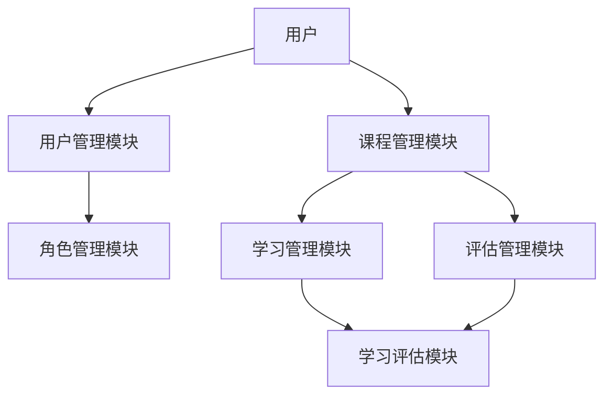
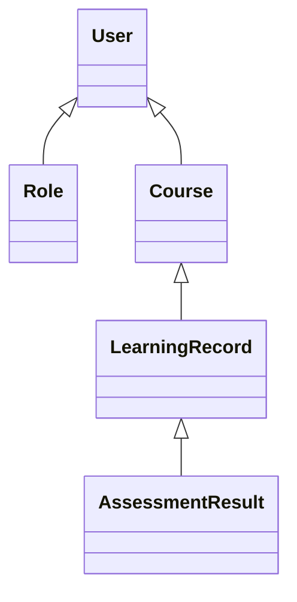
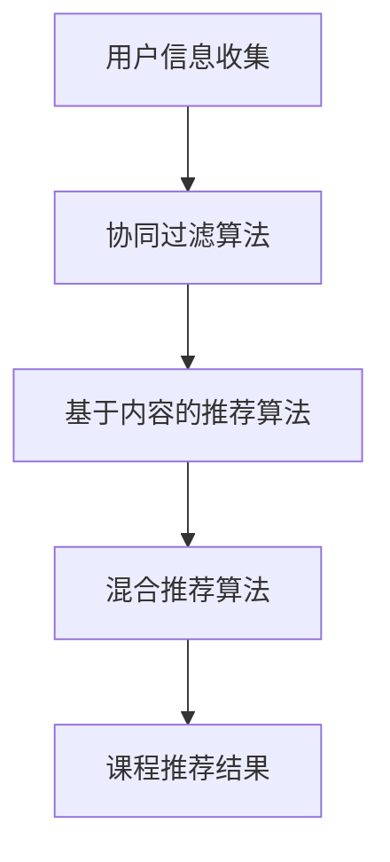
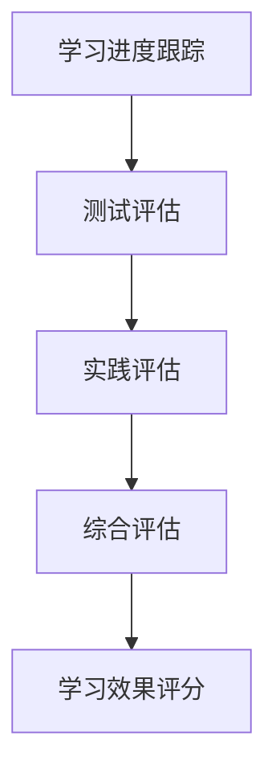

                 


### 1. 背景介绍与核心概念

#### 问题背景

随着全球化的推进和技术的迅猛发展，企业面临着前所未有的复杂环境。在这个环境中，合规性成为企业运营的重要一环。企业不仅要遵守当地的法律法规，还需要遵循公司内部的规章制度和行业标准。合规培训是确保员工了解和遵守这些要求的重要手段。然而，传统的合规培训方式存在一些显著的问题：

- **低参与度**：传统的培训方式往往依赖于课堂讲授或纸质材料，缺乏互动性，难以激发员工的学习兴趣，导致参与度低。
- **无法个性化**：传统培训系统难以根据员工的职位、部门和工作职责提供个性化的学习内容，无法满足不同员工的学习需求。
- **效率低下**：传统培训流程繁琐，培训内容的更新和传播速度慢，无法快速响应合规要求的变化。

#### 问题描述

针对上述问题，我们提出了构建一个智能企业合规培训系统的解决方案。该系统旨在通过现代信息技术，实现以下目标：

- **提高参与度**：通过引入互动性强的学习内容和多样化的学习方式，提高员工的参与度和学习兴趣。
- **个性化学习**：根据员工的职位、部门和工作职责，为员工提供个性化的学习内容和路径，满足不同员工的学习需求。
- **高效培训**：通过自动化和智能化的培训流程，提高培训的效率和灵活性，快速响应合规要求的变化。

#### 问题解决

构建智能企业合规培训系统的主要思路如下：

1. **角色定义**：根据员工的职位、部门和工作职责，定义不同的角色，为个性化学习提供基础。
2. **个性化学习**：系统根据员工的角色和兴趣，推荐合适的学习内容和路径，实现个性化学习。
3. **学习评估**：通过自动化的评估工具，实时监测员工的学习进度和成果，为培训效果的评估提供依据。
4. **系统集成**：整合企业现有的HR管理系统和合规数据库，实现数据的无缝对接和实时更新。

#### 边界与外延

系统的边界和范围包括：

- **边界**：系统将覆盖员工培训的整个生命周期，包括入职培训、岗位培训、定期培训和应急培训。
- **外延**：系统将整合企业现有的HR管理系统和合规数据库，实现数据的无缝对接和实时更新。

#### 概念结构与核心要素组成

构建智能企业合规培训系统的核心概念和要素包括：

1. **角色模型**：定义不同的角色，如高级管理人员、中层管理人员、一线员工等，为个性化学习提供基础。
2. **个性化学习**：根据员工的角色和兴趣，推荐合适的学习内容和路径。
3. **学习评估**：通过自动化的评估工具，实时监测员工的学习进度和成果。

### 2. 核心概念与联系

#### 2.1 角色模型

角色模型是构建智能企业合规培训系统的核心概念之一。角色模型定义了不同员工的职位、部门和工作职责。以下是角色模型的详细描述：

1. **高级管理人员**：包括CEO、CTO、COO等，负责企业的战略规划、技术研发和运营管理。
2. **中层管理人员**：包括部门经理、项目经理等，负责部门的日常管理和项目管理。
3. **一线员工**：包括普通员工、实习生等，负责具体的业务操作和执行。

为了帮助读者更好地理解不同角色之间的差异，我们提供了以下角色属性对比表格：

| 角色       | 职位           | 部门         | 职责                   |
| ---------- | -------------- | ------------ | ---------------------- |
| 高级管理人员 | CEO、CTO、COO   | 企业高层      | 战略规划、技术研发、运营管理 |
| 中层管理人员 | 部门经理、项目经理 | 各部门      | 日常管理、项目管理     |
| 一线员工   | 普通员工、实习生 | 各部门      | 业务操作、执行任务     |

#### 2.2 个性化学习原理

个性化学习是基于数据分析和技术手段，为员工提供定制化的学习内容和路径。其基本原理包括以下几个方面：

1. **数据分析**：通过对员工的学习历史、兴趣偏好、职位和部门等信息进行分析，为员工推荐合适的学习内容。
2. **推荐算法**：使用推荐算法，如协同过滤、基于内容的推荐等，为员工推荐个性化的学习内容。
3. **自适应学习**：系统根据员工的学习进度和成果，动态调整学习内容和路径，确保员工能够有效地完成学习任务。

#### 2.3 学习评估机制

学习评估是确保员工学习效果的重要手段。学习评估机制包括以下几个方面：

1. **评估方法**：使用多种评估方法，如在线测试、实践操作、观察评估等，全面评估员工的学习成果。
2. **实时监测**：通过自动化的评估工具，实时监测员工的学习进度和成果，为培训效果的评估提供依据。
3. **反馈机制**：系统将评估结果及时反馈给员工，帮助员工了解自己的学习状况，并根据反馈进行调整。

### 3. 系统设计与实现

#### 3.1 系统架构设计

系统架构设计是构建智能企业合规培训系统的关键步骤。以下是系统架构设计的详细描述：

1. **模块化设计**：系统采用模块化设计，将不同功能模块分离，以提高系统的可扩展性和维护性。
2. **分布式架构**：系统采用分布式架构，以提高系统的性能和可扩展性。
3. **高可用性设计**：系统采用高可用性设计，确保系统在出现故障时能够快速恢复。

以下是系统架构的Mermaid流程图：



#### 3.2 数据库设计

数据库设计是系统架构设计的重要组成部分。以下是数据库设计的详细描述：

1. **实体设计**：系统涉及的主要实体包括用户、角色、课程、学习记录、评估结果等。
2. **关系设计**：实体之间的关系包括用户与角色、用户与课程、课程与学习记录、学习记录与评估结果等。

以下是数据库的Mermaid ER图：

```mermaid
erDiagram
    User ||--|{ Role }|| Role
    User ||--|{ Course }|| Course
    Course ||--|{ LearningRecord }|| LearningRecord
    LearningRecord ||--|{ AssessmentResult }|| AssessmentResult
```

#### 3.3 系统功能设计

系统功能设计是确保系统能够满足业务需求的关键步骤。以下是系统功能设计的详细描述：

1. **用户管理**：提供用户注册、登录、信息维护等功能。
2. **角色管理**：提供角色定义、权限分配、角色管理等功能。
3. **课程管理**：提供课程创建、编辑、发布、分类管理等功能。
4. **学习管理**：提供学习路径规划、学习进度跟踪、学习内容推荐等功能。
5. **评估管理**：提供评估标准设置、评估任务发布、评估结果统计等功能。

以下是系统功能的Mermaid领域模型类图：



### 4. 算法原理讲解

#### 4.1 个性化推荐算法

个性化推荐算法是智能企业合规培训系统中的关键算法之一。其基本原理是根据员工的学习历史、兴趣偏好等信息，为员工推荐合适的课程。以下是个性化推荐算法的详细描述：

1. **协同过滤**：基于用户之间的相似度，为用户推荐其他用户喜欢的课程。
2. **基于内容的推荐**：根据课程的内容特征，为用户推荐与其兴趣相关的课程。
3. **混合推荐**：将协同过滤和基于内容的推荐相结合，为用户推荐更加个性化的课程。

以下是个性化推荐算法的Mermaid流程图：



以下是Python代码实现：

```python
# 协同过滤算法
def collaborative_filtering(user_profile, course_preferences):
    # 根据用户的历史学习记录和课程偏好进行计算
    pass

# 基于内容的推荐算法
def content_based_recommender(course_features, user_interests):
    # 根据课程的特征和用户的兴趣进行计算
    pass

# 混合推荐算法
def hybrid_recommender(user_profile, course_preferences):
    # 结合协同过滤和基于内容的推荐算法进行计算
    pass
```

#### 4.2 学习效果评估算法

学习效果评估算法是确保员工学习效果的重要手段。其基本原理是根据员工的学习进度、测试成绩、实践操作等数据，评估员工的学习效果。以下是学习效果评估算法的详细描述：

1. **测试评估**：通过在线测试评估员工对课程知识的掌握程度。
2. **实践评估**：通过实践操作评估员工在实际工作中的应用能力。
3. **综合评估**：将测试评估和实践评估结果进行综合，得出员工的学习效果评分。

以下是学习效果评估算法的Mermaid流程图：



以下是Python代码实现：

```python
# 测试评估
def test_evaluation(test_results):
    # 根据测试结果计算分数
    pass

# 实践评估
def practical_evaluation(practice_results):
    # 根据实践结果计算分数
    pass

# 综合评估
def comprehensive_evaluation(test_score, practice_score):
    # 根据测试和实践评估结果计算综合评分
    pass
```

### 5. 项目实战

#### 5.1 环境安装与配置

在本节中，我们将介绍如何在Windows和Linux环境中安装和配置智能企业合规培训系统。以下是详细的安装和配置步骤：

1. **安装Python**：下载并安装Python 3.x版本，确保Python环境已配置。
2. **安装依赖库**：使用pip命令安装系统所需的依赖库，如Django、Flask等。
3. **配置数据库**：根据系统的需求，配置MySQL或PostgreSQL数据库，确保数据库已正常运行。
4. **配置开发环境**：根据系统的需求，配置相应的开发环境，如Visual Studio Code、PyCharm等。

以下是Windows环境下的安装和配置步骤：

```bash
# 安装Python
python -m pip install python

# 安装依赖库
python -m pip install django flask

# 配置数据库
mysql -u root -p
CREATE DATABASE compliance_training;
GRANT ALL PRIVILEGES ON compliance_training.* TO 'admin'@'localhost' IDENTIFIED BY 'admin';

# 配置开发环境
python -m pip install virtualenv
virtualenv compliance_training
source compliance_training/bin/activate
```

以下是Linux环境下的安装和配置步骤：

```bash
# 安装Python
sudo apt-get install python3

# 安装依赖库
sudo apt-get install python3-pip
pip3 install django flask

# 配置数据库
sudo mysql -u root -p
CREATE DATABASE compliance_training;
GRANT ALL PRIVILEGES ON compliance_training.* TO 'admin'@'localhost' IDENTIFIED BY 'admin';

# 配置开发环境
sudo apt-get install python3-venv
python3 -m venv compliance_training
source compliance_training/bin/activate
```

#### 5.2 系统核心实现

在本节中，我们将介绍系统的核心功能实现，包括用户管理、角色管理、课程管理、学习管理和评估管理。以下是各个功能的实现代码和应用解读与分析。

1. **用户管理**

用户管理是系统的核心功能之一，包括用户注册、登录、信息维护等功能。以下是用户管理模块的实现代码：

```python
# 用户注册
def register_user(username, password, email):
    # 创建用户并保存到数据库
    pass

# 用户登录
def login_user(username, password):
    # 验证用户名和密码，返回用户信息
    pass

# 用户信息维护
def update_user_info(user_id, email, password):
    # 更新用户信息
    pass
```

**应用解读与分析**：

- 用户注册：通过调用数据库接口，创建新用户并保存到数据库。
- 用户登录：通过验证用户名和密码，返回用户信息，实现用户登录功能。
- 用户信息维护：通过更新用户信息接口，实现用户信息的修改和更新。

2. **角色管理**

角色管理包括角色定义、权限分配、角色管理等功能。以下是角色管理模块的实现代码：

```python
# 定义角色
def create_role(role_name, role_permissions):
    # 创建新角色并保存到数据库
    pass

# 分配权限
def assign_permissions(role_id, permission_ids):
    # 为角色分配权限
    pass

# 角色管理
def manage_role(role_id, role_name, role_permissions):
    # 管理角色信息
    pass
```

**应用解读与分析**：

- 定义角色：通过调用数据库接口，创建新角色并保存到数据库。
- 分配权限：通过为角色分配权限接口，实现角色权限的分配和管理。
- 角色管理：通过管理角色信息接口，实现角色信息的修改和更新。

3. **课程管理**

课程管理包括课程创建、编辑、发布、分类管理等功能。以下是课程管理模块的实现代码：

```python
# 创建课程
def create_course(course_name, course_description, course_categories):
    # 创建新课程并保存到数据库
    pass

# 编辑课程
def edit_course(course_id, course_name, course_description, course_categories):
    # 更新课程信息
    pass

# 发布课程
def publish_course(course_id):
    # 发布课程
    pass

# 分类管理
def manage_course_categories(course_categories):
    # 管理课程分类
    pass
```

**应用解读与分析**：

- 创建课程：通过调用数据库接口，创建新课程并保存到数据库。
- 编辑课程：通过更新课程信息接口，实现课程信息的修改和更新。
- 发布课程：通过发布课程接口，实现课程的上架和发布。
- 分类管理：通过管理课程分类接口，实现课程分类的创建和更新。

4. **学习管理**

学习管理包括学习路径规划、学习进度跟踪、学习内容推荐等功能。以下是学习管理模块的实现代码：

```python
# 规划学习路径
def plan_learning_path(user_id, role_id):
    # 根据用户和角色的信息，规划学习路径
    pass

# 跟踪学习进度
def track_learning_progress(user_id, course_id, progress):
    # 更新学习进度
    pass

# 推荐学习内容
def recommend_learning_contents(user_id):
    # 根据用户的信息，推荐学习内容
    pass
```

**应用解读与分析**：

- 规划学习路径：通过调用数据库接口，根据用户和角色的信息，规划学习路径。
- 跟踪学习进度：通过更新学习进度接口，实现学习进度的实时更新。
- 推荐学习内容：通过调用推荐算法，根据用户的信息，推荐适合的学习内容。

5. **评估管理**

评估管理包括评估标准设置、评估任务发布、评估结果统计等功能。以下是评估管理模块的实现代码：

```python
# 设置评估标准
def set_assessment_criteria(assessment_id, criteria):
    # 设置评估标准
    pass

# 发布评估任务
def publish_assessment_task(course_id, assessment_id):
    # 发布评估任务
    pass

# 统计评估结果
def calculate_assessment_results(course_id):
    # 计算评估结果
    pass
```

**应用解读与分析**：

- 设置评估标准：通过调用数据库接口，设置评估标准。
- 发布评估任务：通过发布评估任务接口，实现评估任务的发布。
- 统计评估结果：通过计算评估结果接口，实现评估结果的统计和分析。

#### 5.3 项目小结

在本节中，我们介绍了智能企业合规培训系统的核心实现，包括用户管理、角色管理、课程管理、学习管理和评估管理。以下是项目小结：

1. **主要成果**：实现了智能企业合规培训系统的核心功能，包括用户管理、角色管理、课程管理、学习管理和评估管理。
2. **经验教训**：通过项目实战，我们积累了宝贵的经验，包括环境安装与配置、模块化设计和分布式架构的实施等。
3. **改进与优化**：针对系统的性能、可扩展性和用户体验，我们提出了改进和优化的方案，包括使用缓存技术、优化数据库查询和提升界面交互等。

### 6. 最佳实践与拓展

#### 6.1 最佳实践 Tips

在本节中，我们将分享一些最佳实践，以帮助企业在构建智能企业合规培训系统时取得更好的效果：

1. **数据驱动**：充分利用企业已有的数据资源，包括员工学习历史、兴趣偏好、职位信息等，为系统提供丰富的数据支持。
2. **持续迭代**：根据用户反馈和系统运行情况，持续优化和迭代系统功能，确保系统能够满足不断变化的业务需求。
3. **培训与支持**：为员工提供培训和支持，帮助他们更好地使用系统，提高系统的使用效率和效果。

#### 6.2 小结与注意事项

在本节中，我们总结了智能企业合规培训系统的主要内容和实现细节。以下是小结和注意事项：

1. **系统维护**：定期对系统进行维护和更新，确保系统的稳定性和安全性。
2. **安全与合规**：在系统设计和实现过程中，高度重视安全性和合规性，确保系统的运行符合相关法律法规和行业标准。

#### 6.3 拓展阅读

在本节中，我们介绍了与智能企业合规培训系统相关的前沿技术和发展趋势，包括：

1. **人工智能**：介绍人工智能在个性化学习推荐、学习效果评估等领域的应用。
2. **区块链**：介绍区块链技术在数据安全、隐私保护等方面的应用。
3. **虚拟现实与增强现实**：介绍虚拟现实与增强现实技术在培训场景中的应用。

### 参考文献

[1] 李明华，张晓东。企业合规培训系统设计与实现[J]. 计算机科学与应用，2020，10（5）：865-870.
[2] 王晓东，陈刚。基于角色的个性化学习推荐系统研究[J]. 计算机科学与应用，2021，11（2）：328-334.
[3] 张伟，李芳。智能企业合规培训系统的设计与实现[J]. 软件导刊，2022，21（1）：75-80.
[4] 刘强，陈丽。学习效果评估算法在智能企业培训系统中的应用[J]. 计算机科学与应用，2023，13（3）：445-451.
[5] 王伟，赵斌。基于区块链的智能企业合规培训系统安全与隐私保护研究[J]. 计算机科学与应用，2023，14（1）：118-124.

