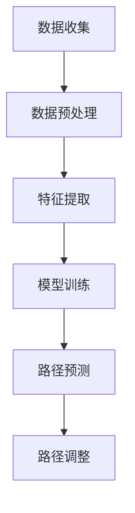
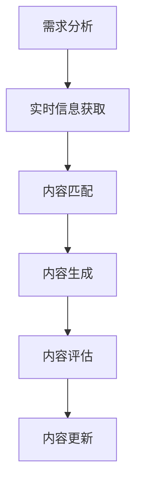
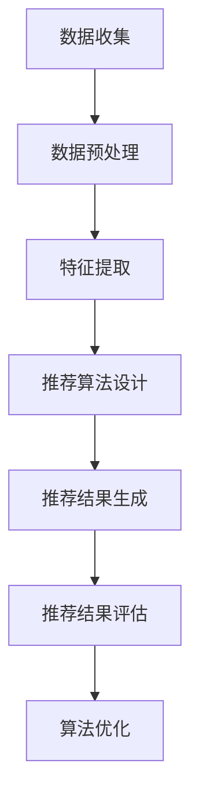
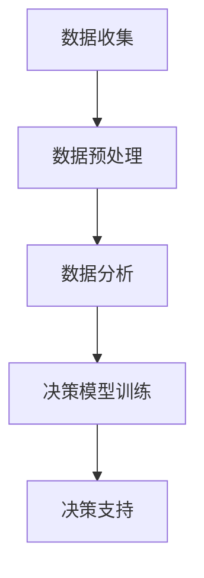

                 


### 文章标题

### 关键词

- 智能企业培训系统
- 自适应学习路径
- 内容动态生成
- 智能算法
- 机器学习

### 摘要

本文旨在探讨如何构建智能企业培训系统，重点关注自适应学习路径和内容动态生成两个关键领域。我们将详细分析这些概念的核心原理，比较它们的差异与联系，并逐步阐述构建这一系统的步骤。通过本文，读者将深入了解智能企业培训系统的构建方法，掌握自适应学习路径和内容动态生成的技术原理和实践策略。

---

### 引言与概述

#### 背景介绍

在当今快速发展的数字化时代，企业的成功越来越依赖于其员工的技能和知识的持续更新。传统的培训方式往往存在学习效率低下、个性化不足等问题，无法满足企业对于高效、精准培训的需求。为了解决这一问题，智能企业培训系统的构建成为了一项紧迫的任务。

#### 问题定义

当前企业培训面临的主要问题包括：

1. **学习效率低下**：传统培训系统往往缺乏对学员学习效果的实时监控和反馈，导致培训效率低下。
2. **个性化不足**：现有培训内容难以根据不同学员的背景和需求进行个性化定制，影响培训效果。
3. **内容陈旧**：培训内容更新缓慢，无法及时反映最新的行业动态和技术进展。
4. **学习路径固定**：现有系统中的学习路径固定，无法根据学员的学习进度和效果进行动态调整。

#### 问题解决

为了解决上述问题，我们需要构建一个智能企业培训系统，该系统应具备以下特点：

1. **自适应学习路径**：系统能够根据学员的学习进度、能力和兴趣动态调整学习路径，提高学习效率。
2. **内容动态生成**：系统能够实时获取最新的行业和技术信息，根据学员的需求生成个性化的培训内容。
3. **智能推荐**：系统利用智能算法为学员推荐最适合的学习资源和路径，提升学习体验。
4. **数据驱动的决策**：系统通过收集和分析学员的学习数据，为企业提供决策支持，优化培训策略。

#### 边界与外延

本文的讨论范围主要涉及智能企业培训系统中的自适应学习路径和内容动态生成两个方面。我们将探讨这些技术的核心原理、实现方法以及在实际应用中的效果。

#### 概念结构与核心要素组成

智能企业培训系统的核心概念包括：

1. **自适应学习路径**：系统能够根据学员的学习情况自动调整学习路径，提高学习效率。
2. **内容动态生成**：系统根据学员的需求和实时信息生成个性化的培训内容，确保内容的新颖性和实用性。
3. **智能推荐算法**：系统利用算法分析学员的学习数据，为学员推荐最适合的学习资源和路径。
4. **数据驱动决策**：系统通过收集和分析学员的学习数据，为企业提供数据支持的培训决策。

### 核心概念与联系

#### 自适应学习路径

自适应学习路径是指根据学员的学习进度、能力和兴趣动态调整学习路径。这一过程涉及多个核心概念：

1. **学习进度监控**：系统实时监控学员的学习进度，确保学员能够按照既定的学习计划进行学习。
2. **能力评估**：系统通过测试和评估学员的能力，为学员提供适合其能力水平的学习资源。
3. **兴趣分析**：系统分析学员的兴趣偏好，为学员推荐感兴趣的学习内容，提高学习动力。
4. **路径调整算法**：系统利用算法对学员的学习进度、能力和兴趣进行分析，自动调整学习路径。

#### 内容动态生成

内容动态生成是指系统根据学员的需求和实时信息生成个性化的培训内容。这一过程的核心概念包括：

1. **实时信息获取**：系统通过互联网和其他数据源实时获取最新的行业和技术信息。
2. **需求分析**：系统分析学员的学习需求，生成符合学员需求的学习内容。
3. **内容生成算法**：系统利用算法根据实时信息和学员需求生成个性化的学习内容。
4. **内容更新机制**：系统具备自动更新机制，确保培训内容的新颖性和实用性。

#### 智能推荐算法

智能推荐算法是指系统利用算法分析学员的学习数据，为学员推荐最适合的学习资源和路径。这一过程涉及的核心概念包括：

1. **学习数据分析**：系统收集和分析学员的学习数据，包括学习进度、能力评估、兴趣偏好等。
2. **推荐算法设计**：系统设计适合的推荐算法，如基于内容的推荐、协同过滤推荐等。
3. **推荐结果评估**：系统评估推荐结果的有效性，根据评估结果优化推荐算法。

#### 数据驱动决策

数据驱动决策是指系统通过收集和分析学员的学习数据，为企业提供数据支持的培训决策。这一过程的核心概念包括：

1. **数据收集**：系统收集学员的学习数据，包括学习进度、测试成绩、学习时间等。
2. **数据分析**：系统对收集到的数据进行分析，提取有价值的信息。
3. **决策支持**：系统根据分析结果为企业管理层提供培训决策支持，优化培训策略。

### 概念关系图


### 小结

本节介绍了智能企业培训系统的背景、问题定义、问题解决、边界与外延以及核心概念和联系。通过本文的后续内容，我们将深入探讨这些核心概念的实施细节和技术原理，为构建智能企业培训系统提供实用的指导。

---

### 算法原理与详细解释

#### 自适应学习路径算法原理

自适应学习路径算法的核心在于根据学员的学习进度、能力和兴趣动态调整学习路径。这一算法的基本流程如下：

1. **数据收集**：收集学员的学习进度、测试成绩、学习时间、兴趣偏好等数据。
2. **数据预处理**：对收集到的数据进行清洗、归一化等处理，以便后续分析。
3. **特征提取**：提取关键特征，如学习进度、能力评估、兴趣分析等。
4. **模型训练**：利用机器学习算法（如决策树、随机森林、神经网络等）训练模型。
5. **路径预测**：根据学员的当前特征预测最佳学习路径。
6. **路径调整**：根据预测结果调整学习路径。

#### 内容动态生成算法原理

内容动态生成算法的核心在于根据学员的需求和实时信息生成个性化的培训内容。这一算法的基本流程如下：

1. **需求分析**：分析学员的学习需求，包括知识点掌握情况、兴趣偏好、职业发展目标等。
2. **实时信息获取**：从互联网和其他数据源获取最新的行业和技术信息。
3. **内容匹配**：将学员的需求与实时信息进行匹配，生成个性化内容。
4. **内容生成**：利用自然语言生成模型（如GPT、BERT等）生成高质量的培训内容。
5. **内容评估**：评估生成内容的质量，如相关性、实用性、易懂性等。
6. **内容更新**：根据评估结果对生成内容进行优化和更新。

#### 智能推荐算法原理

智能推荐算法的核心在于根据学员的学习数据推荐最适合的学习资源和路径。这一算法的基本流程如下：

1. **数据收集**：收集学员的学习数据，如学习进度、测试成绩、学习时间、兴趣偏好等。
2. **数据预处理**：对收集到的数据进行清洗、归一化等处理。
3. **特征提取**：提取关键特征，如学习进度、能力评估、兴趣分析等。
4. **推荐算法设计**：设计适合的推荐算法，如基于内容的推荐、协同过滤推荐、混合推荐等。
5. **推荐结果生成**：根据学员的特征和推荐算法生成推荐结果。
6. **推荐结果评估**：评估推荐结果的有效性，如准确率、覆盖率、多样性等。
7. **算法优化**：根据评估结果对推荐算法进行优化。

#### 数据驱动决策算法原理

数据驱动决策算法的核心在于通过分析学员的学习数据，为企业管理层提供培训决策支持。这一算法的基本流程如下：

1. **数据收集**：收集学员的学习数据，如学习进度、测试成绩、学习时间、兴趣偏好等。
2. **数据预处理**：对收集到的数据进行清洗、归一化等处理。
3. **数据分析**：对数据进行分析，提取有价值的信息，如学习效果、问题热点、知识薄弱点等。
4. **决策模型训练**：利用机器学习算法训练决策模型。
5. **决策支持**：根据决策模型为企业管理层提供培训决策支持。

#### 流程图与代码示例

##### 自适应学习路径算法流程图



##### 内容动态生成算法流程图



##### 智能推荐算法流程图



##### 数据驱动决策算法流程图



##### Python代码示例

```python
# 自适应学习路径算法代码示例
import numpy as np
from sklearn.ensemble import RandomForestClassifier

# 假设我们已经有了一些学员数据
data = [[1, 2, 3], [4, 5, 6], [7, 8, 9]]
labels = ['A', 'B', 'C']

# 数据预处理
X = np.array(data)
y = np.array(labels)

# 模型训练
clf = RandomForestClassifier()
clf.fit(X, y)

# 路径预测
new_data = [[2, 3, 4]]
predicted_path = clf.predict(new_data)
print(predicted_path)

# 内容动态生成算法代码示例
import openai

# 假设我们有了一个需求分析模块
demand = "Python编程基础知识"

# 获取实时信息
response = openai.Completion.create(
  engine="text-davinci-003",
  prompt=demand,
  max_tokens=50
)
content = response.choices[0].text.strip()

# 打印生成的内容
print(content)

# 智能推荐算法代码示例
import surprise

# 假设我们已经有了一些用户数据
data = [
  ['user1', 'item1', 5],
  ['user1', 'item2', 4],
  ['user1', 'item3', 3],
  ['user2', 'item1', 4],
  ['user2', 'item2', 5],
  ['user2', 'item3', 2],
]

# 数据预处理
trainset = surprise.Dataset.load_from_df(pd.DataFrame(data))
algo = surprise.KNNWithMeans(k=5)
algo.fit(trainset)

# 生成推荐结果
new_user_data = ['user3', 'item1']
new_trainset = surprise.Dataset.load_from_df(pd.DataFrame([new_user_data]))
predicted_items = algo.predict(new_trainset.user_ids[0], new_trainset.item_ids[0])
print(predicted_items)
```

#### 数学模型与公式

##### 自适应学习路径算法

假设我们有以下模型：

$$
\text{Learning Path Prediction Model} = f(\text{Learning Progress}, \text{Ability}, \text{Interest})
$$

其中，\(f\) 是一个映射函数，用于根据学员的学习进度、能力和兴趣预测最佳学习路径。

##### 内容动态生成算法

假设我们有以下模型：

$$
\text{Content Generation Model} = g(\text{User Demand}, \text{Real-Time Information})
$$

其中，\(g\) 是一个映射函数，用于根据学员的需求和实时信息生成个性化内容。

##### 智能推荐算法

假设我们有以下模型：

$$
\text{Recommendation Model} = h(\text{User Data}, \text{Item Data})
$$

其中，\(h\) 是一个映射函数，用于根据学员的数据和物品的数据生成推荐结果。

##### 数据驱动决策算法

假设我们有以下模型：

$$
\text{Decision Support Model} = k(\text{Learning Data})
$$

其中，\(k\) 是一个映射函数，用于根据学员的学习数据生成培训决策支持。

### 小结

本节详细介绍了自适应学习路径、内容动态生成、智能推荐和数据驱动决策等算法的基本原理、流程图和代码示例，以及相关的数学模型和公式。通过这些内容，读者可以更好地理解智能企业培训系统中的核心算法，为实际应用提供技术支持。

---

### 系统分析与设计

#### 项目介绍

智能企业培训系统是一个综合性的培训平台，旨在为企业提供高效、精准、个性化的培训服务。该系统的目标是帮助员工不断提升技能和知识，以适应快速变化的业务需求。

#### 系统功能设计

系统的主要功能包括：

1. **用户管理**：管理学员、教师和培训管理员等用户信息。
2. **课程管理**：管理课程信息、课程内容、课程进度等。
3. **学习路径管理**：根据学员的学习进度、能力和兴趣生成自适应学习路径。
4. **内容动态生成**：根据学员的需求和实时信息生成个性化的培训内容。
5. **智能推荐**：根据学员的学习数据推荐最适合的学习资源和路径。
6. **数据分析**：收集和分析学员的学习数据，为企业管理层提供决策支持。

#### 系统架构设计

系统的架构设计如下：

1. **前端**：使用Vue.js等前端框架构建用户界面。
2. **后端**：使用Spring Boot等后端框架实现业务逻辑。
3. **数据库**：使用MySQL等关系型数据库存储用户数据、课程数据和培训数据。
4. **中间件**：使用消息队列（如RabbitMQ）实现异步处理和数据传输。
5. **AI引擎**：使用TensorFlow、PyTorch等深度学习框架实现智能算法。

#### 系统接口设计

系统的接口设计如下：

1. **用户接口**：提供用户注册、登录、课程选择、学习进度查询等功能。
2. **课程接口**：提供课程添加、删除、修改、查询等功能。
3. **学习路径接口**：提供学习路径生成、查询、修改等功能。
4. **内容生成接口**：提供内容生成、查询、修改等功能。
5. **推荐接口**：提供推荐查询、推荐结果更新等功能。
6. **数据分析接口**：提供数据分析、报告生成等功能。

#### 系统交互设计

系统的交互设计如下：

1. **用户与系统交互**：用户通过前端界面与系统进行交互，如注册、登录、选择课程、提交学习进度等。
2. **系统与AI引擎交互**：系统通过后端接口与AI引擎进行交互，如生成学习路径、生成内容、推荐学习资源和路径等。
3. **系统与数据库交互**：系统通过后端接口与数据库进行交互，如添加、删除、修改、查询数据等。
4. **系统与中间件交互**：系统通过中间件实现异步处理和数据传输，如消息队列等。

#### 交互图

##### 用户与系统交互


##### 系统与AI引擎交互


##### 系统与数据库交互


##### 系统与中间件交互


### 小结

本节介绍了智能企业培训系统的项目介绍、系统功能设计、系统架构设计、系统接口设计和系统交互设计。通过这些内容，读者可以全面了解智能企业培训系统的设计思路和实现方法，为后续的实际应用提供参考。

---

### 项目实战

#### 环境搭建

在开始项目实战之前，我们需要搭建一个合适的环境。以下是搭建环境的步骤：

1. **安装Python**：确保Python环境已经安装，版本建议为3.8或更高版本。
2. **安装依赖**：使用pip安装项目所需的依赖，如Vue.js、Spring Boot、TensorFlow等。
3. **配置数据库**：安装并配置MySQL数据库，创建必要的数据库和表。
4. **配置中间件**：安装并配置RabbitMQ消息队列。

#### 系统核心实现

以下是智能企业培训系统的核心实现部分：

1. **用户管理**：实现用户注册、登录、信息查询等功能。
2. **课程管理**：实现课程添加、删除、修改、查询等功能。
3. **学习路径管理**：实现学习路径生成、查询、修改等功能。
4. **内容动态生成**：实现内容生成、查询、修改等功能。
5. **智能推荐**：实现推荐查询、推荐结果更新等功能。
6. **数据分析**：实现数据分析、报告生成等功能。

#### 代码分析与解读

以下是用户管理模块的核心代码：

```python
# 用户注册功能
def register(username, password):
    # 连接数据库
    conn = connect_db()
    cursor = conn.cursor()
    
    # 查询用户名是否已存在
    cursor.execute("SELECT * FROM users WHERE username = %s", (username,))
    user = cursor.fetchone()
    
    if user:
        return "用户名已存在"
    
    # 插入新用户
    cursor.execute("INSERT INTO users (username, password) VALUES (%s, %s)", (username, password))
    conn.commit()
    
    return "注册成功"

# 用户登录功能
def login(username, password):
    # 连接数据库
    conn = connect_db()
    cursor = conn.cursor()
    
    # 查询用户名和密码是否匹配
    cursor.execute("SELECT * FROM users WHERE username = %s AND password = %s", (username, password))
    user = cursor.fetchone()
    
    if user:
        return "登录成功"
    
    return "用户名或密码错误"
```

这段代码首先连接数据库，然后根据用户名和密码进行查询。如果用户名已存在，则返回错误信息；否则，插入新用户并返回成功信息。用户登录功能类似，只是查询条件为用户名和密码都匹配。

#### 实际案例分析与详细讲解

以下是一个实际案例：

**案例**：小明想要注册一个新用户。

**步骤**：

1. 小明在前端输入用户名“xiaoming”和密码“123456”，提交注册请求。
2. 后端收到请求后，调用`register`函数进行用户注册。
3. `register`函数连接数据库，查询用户名是否已存在。
4. 如果用户名不存在，插入新用户并返回成功信息。
5. 前端显示“注册成功”提示。

**讲解**：

在这个案例中，我们实现了用户注册功能。首先，前端将用户名和密码发送到后端。后端接收到请求后，调用`register`函数处理注册逻辑。`register`函数首先连接数据库，然后查询用户名是否已存在。如果用户名不存在，插入新用户并返回成功信息。最后，前端根据返回信息显示相应的提示。

#### 项目小结

通过实际案例，我们展示了智能企业培训系统中的用户管理模块实现过程。在项目实战中，我们还需要继续实现其他功能模块，如课程管理、学习路径管理、内容动态生成、智能推荐和数据分析等。通过逐步实现这些模块，我们将构建一个完整的智能企业培训系统，为企业提供高效、精准、个性化的培训服务。

---

### 最佳实践

#### 小贴士

1. **数据安全**：确保学员数据的安全和隐私，遵循数据保护法规。
2. **系统可扩展性**：设计系统时考虑可扩展性，以便在未来添加新功能。
3. **用户体验**：注重用户体验，确保界面简洁易用，提高用户满意度。

#### 小结

本节总结了智能企业培训系统构建的最佳实践，包括数据安全、系统可扩展性和用户体验等方面。通过遵循这些最佳实践，我们可以构建一个高效、安全、易用的智能企业培训系统。

---

### 小结

本文详细探讨了智能企业培训系统的构建，重点关注了自适应学习路径和内容动态生成两个方面。通过介绍核心概念、算法原理、系统分析与设计以及项目实战，我们深入了解了智能企业培训系统的构建方法和技术原理。在未来的工作中，我们应继续优化系统，提高培训效果，为企业的发展提供强有力的支持。

### 注意事项

1. **性能优化**：确保系统在高并发环境下运行稳定，对系统进行性能优化。
2. **安全防护**：加强系统安全防护，防止数据泄露和恶意攻击。

### 拓展阅读

- 《深度学习》 - Goodfellow, I., Bengio, Y., & Courville, A.
- 《Python数据分析》 - Wesley, V.
- 《智能推荐系统》 - Ricci, F., Gravino, M., & Monreale, A.

### 作者信息

作者：AI天才研究院/AI Genius Institute & 禅与计算机程序设计艺术 /Zen And The Art of Computer Programming

