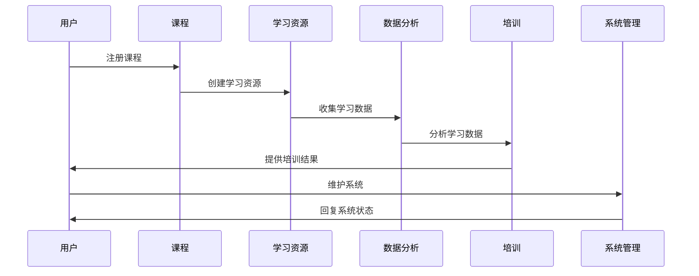
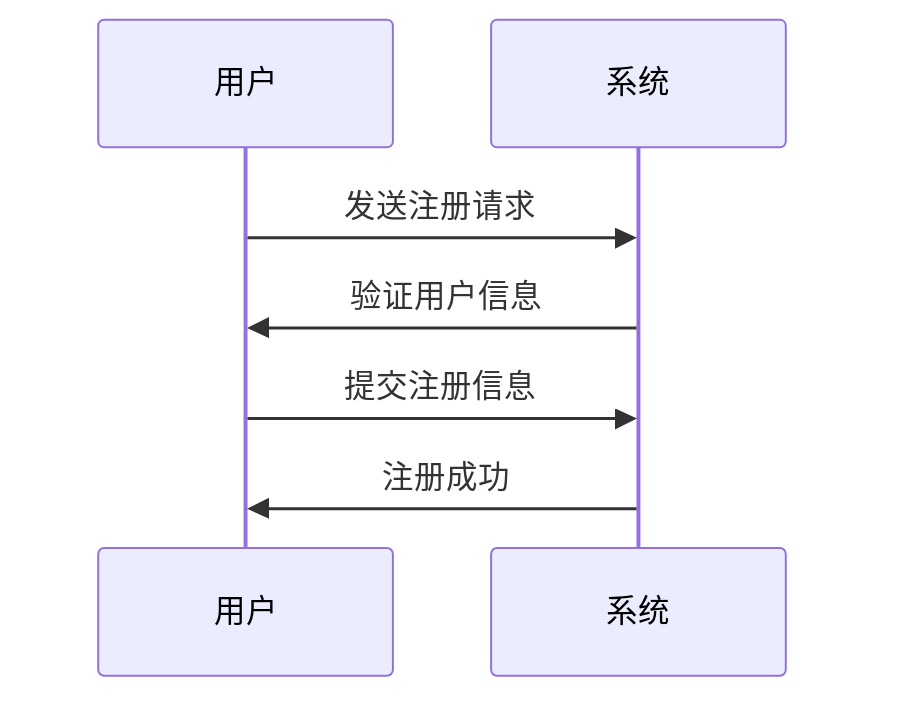

                 

### 文章标题

# 构建智能企业学习管理系统：个性化技能发展路径规划

### 关键词

- 智能学习管理系统
- 个性化技能发展
- 路径规划
- 企业培训
- 人工智能

### 摘要

随着企业竞争的加剧，员工技能的提升成为企业发展的关键因素。智能企业学习管理系统通过利用人工智能技术，实现了员工个性化技能发展的路径规划。本文首先介绍了智能学习管理系统的背景、问题描述及解决方法，接着深入分析了系统的核心概念与联系，详细描述了系统架构设计，并探讨了个性化技能发展路径规划的算法原理与实现方法。通过具体案例和最佳实践，本文展示了智能学习管理系统在企业培训中的应用效果，为企业提供了智能化培训的解决方案。

## 目录大纲

1. **第一部分：背景介绍**
   1.1 智能企业学习管理系统概述
   1.2 核心概念与联系
   1.3 概念结构与核心要素组成

2. **第二部分：智能学习管理系统架构设计**
   2.1 系统功能设计
   2.2 系统架构设计
   2.3 系统接口设计
   2.4 系统交互设计

3. **第三部分：个性化技能发展路径规划**
   3.1 技能发展理论
   3.2 个性化技能发展路径规划方法
   3.3 个性化技能发展路径规划实践

4. **第四部分：智能学习管理系统实现**
   4.1 系统环境搭建
   4.2 系统核心实现
   4.3 系统应用解读与分析

5. **第五部分：智能学习管理系统部署与维护**
   5.1 系统部署
   5.2 系统维护
   5.3 系统性能优化

6. **第六部分：最佳实践与案例分析**
   6.1 最佳实践
   6.2 案例分析
   6.3 拓展阅读

7. **总结与展望**

---

### 第一部分：背景介绍

#### 1.1 智能企业学习管理系统概述

##### 1.1.1 问题背景

随着信息技术的迅猛发展，企业面临着前所未有的变革和挑战。传统的学习管理系统（LMS）虽然在一定程度上满足了企业培训的需求，但存在着诸多局限。首先，传统LMS缺乏对员工个性化学习需求的关注，难以实现个性化培训。其次，学习资源的分散管理导致资源利用率低，学习效果难以评估。此外，传统LMS的培训模式较为单一，无法满足现代企业多样化、灵活化的培训需求。

##### 1.1.2 企业发展需求

在激烈的市场竞争中，企业需要不断优化员工技能，以提高整体竞争力和创新能力。为此，企业需要一套智能化的学习管理系统，能够根据员工的个性化需求提供定制化的培训方案，提高培训效果，从而推动企业的发展。

##### 1.1.3 当前存在的问题

1. **员工技能发展问题**：传统LMS无法准确评估员工的技能水平，难以制定个性化的培训计划。
2. **学习资源管理问题**：学习资源分散，难以实现统一管理和优化利用。
3. **培训效果评估问题**：传统LMS难以对培训效果进行科学、准确的评估，影响了企业培训决策的准确性。

##### 1.1.4 问题解决

智能企业学习管理系统（Intelligent Learning Management System, ILMS）通过引入人工智能技术，解决了传统LMS的诸多问题。首先，ILMS能够利用大数据分析和机器学习算法，准确评估员工的技能水平，为员工提供个性化的培训建议。其次，ILMS通过智能化的学习资源管理系统，实现了学习资源的集中管理，提高了资源利用率。此外，ILMS利用数据分析和反馈机制，对培训效果进行实时评估，为企业提供了科学、准确的培训决策依据。

##### 1.1.5 智能学习管理系统的优势

1. **个性化培训**：通过人工智能技术，准确评估员工技能，提供定制化的培训方案。
2. **高效资源管理**：实现学习资源的集中管理，提高资源利用率。
3. **实时培训效果评估**：通过数据分析和反馈机制，实时评估培训效果，优化培训策略。
4. **支持多样化培训模式**：支持在线学习、线下培训等多种培训模式，满足企业多样化培训需求。

##### 1.1.6 智能学习管理系统的应用

智能学习管理系统在各类企业中得到了广泛应用。例如，在互联网公司中，ILMS可以帮助公司快速提升员工的技术能力，满足不断变化的业务需求；在制造业中，ILMS可以帮助企业优化生产流程，提高生产效率；在教育行业中，ILMS可以为学校和教育机构提供智能化教学管理解决方案。

##### 1.1.7 边界与外延

智能学习管理系统具有一定的边界和适用范围。首先，ILMS主要应用于企业内部员工培训，不涉及外部用户（如客户、合作伙伴）的学习管理。其次，ILMS主要关注员工的技能提升，不涉及其他人力资源管理模块（如招聘、绩效考核等）。此外，ILMS需要与其他信息系统（如企业资源规划系统、人力资源管理系统等）进行集成，以实现数据的共享和业务协同。

##### 1.1.8 概念结构与核心要素组成

智能学习管理系统由以下几个核心要素组成：

1. **用户管理模块**：负责用户注册、登录、权限管理等功能。
2. **课程管理模块**：负责课程创建、发布、分类、标签等功能。
3. **学习资源管理模块**：负责学习资源（如文档、视频、音频等）的存储、检索、共享等功能。
4. **数据分析与评估模块**：负责收集用户学习数据，进行分析和评估，为用户提供个性化培训建议。
5. **培训管理模块**：负责培训计划制定、培训实施、培训效果评估等功能。
6. **系统管理模块**：负责系统配置、监控、维护等功能。

##### 1.1.9 技术架构

智能学习管理系统的技术架构主要包括前端、后端和数据库三个部分。前端主要采用HTML、CSS和JavaScript等前端技术实现用户界面和交互功能；后端主要采用Java、Python、Node.js等后端技术实现业务逻辑和数据管理；数据库主要采用MySQL、MongoDB等关系型或非关系型数据库进行数据存储和管理。

##### 1.1.10 功能模块

智能学习管理系统的主要功能模块包括：

1. **用户管理模块**：提供用户注册、登录、权限管理等功能。
2. **课程管理模块**：提供课程创建、发布、分类、标签等功能。
3. **学习资源管理模块**：提供学习资源（如文档、视频、音频等）的存储、检索、共享等功能。
4. **数据分析与评估模块**：提供用户学习数据收集、分析、评估等功能。
5. **培训管理模块**：提供培训计划制定、培训实施、培训效果评估等功能。
6. **系统管理模块**：提供系统配置、监控、维护等功能。

### 第二部分：核心概念与联系

#### 2.1 智能学习管理系统原理

##### 2.1.1 概念定义

智能学习管理系统是一种基于人工智能技术，用于管理和优化企业员工学习过程的管理系统。它通过收集、分析用户学习行为数据，为用户提供个性化学习建议和培训方案，从而提高学习效果和效率。

##### 2.1.2 技术原理

智能学习管理系统主要利用以下几种人工智能技术：

1. **机器学习**：通过分析用户学习行为数据，建立用户画像和技能模型，为用户提供个性化学习建议。
2. **自然语言处理**：用于解析用户学习过程中的文本信息，提取关键知识点和语义信息。
3. **推荐系统**：根据用户的学习行为和历史数据，为用户推荐合适的课程和学习资源。
4. **数据挖掘**：用于从大量学习数据中挖掘潜在的知识点和用户需求，为系统提供决策支持。

##### 2.1.3 发展历程

智能学习管理系统的发展经历了以下几个阶段：

1. **传统学习管理系统阶段**：以学习资源管理和学习流程管理为核心，缺乏智能化功能。
2. **基于数据分析的智能学习管理系统阶段**：通过收集和分析用户学习行为数据，为用户提供个性化学习建议。
3. **基于人工智能的智能学习管理系统阶段**：利用人工智能技术，实现更加智能化、自动化和高效的学习管理。

#### 2.2 核心概念属性特征对比

以下是对智能学习管理系统中的核心概念及其属性特征进行对比：

| 核心概念 | 属性特征 |  
| --- | --- |  
| 用户管理 | 用户注册、登录、权限管理 |  
| 课程管理 | 课程创建、发布、分类、标签 |  
| 学习资源管理 | 学习资源存储、检索、共享 |  
| 数据分析与评估 | 用户学习数据收集、分析、评估 |  
| 培训管理 | 培训计划制定、培训实施、培训效果评估 |  
| 系统管理 | 系统配置、监控、维护 |

#### 2.3 智能学习管理系统与相关概念的联系

##### 2.3.1 学习管理系统

学习管理系统（Learning Management System, LMS）是一种用于管理和优化学习过程的管理系统。它主要包括课程管理、学习资源管理、用户管理等功能。智能学习管理系统是在传统LMS的基础上，引入人工智能技术，实现智能化、自动化和个性化的学习管理。

##### 2.3.2 企业资源规划系统

企业资源规划系统（Enterprise Resource Planning, ERP）是一种集成了企业各种业务功能的管理系统。智能学习管理系统可以作为ERP系统中的一个模块，实现企业培训管理、学习资源管理等功能，与其他业务模块（如财务管理、人力资源管理、生产管理）进行数据交互和业务协同。

##### 2.3.3 人力资源管理系统

人力资源管理系统（Human Resource Management System, HRMS）是一种用于管理和优化人力资源管理的管理系统。智能学习管理系统可以作为HRMS中的一个子模块，实现员工培训、技能评估、绩效评估等功能，与其他HRMS模块（如招聘、薪酬管理、员工关系管理）进行数据交互和业务协同。

### 第三部分：智能学习管理系统架构设计

#### 3.1 系统功能设计

##### 3.1.1 功能模块划分

智能学习管理系统可以划分为以下几个功能模块：

1. **用户管理模块**：提供用户注册、登录、权限管理等功能。
2. **课程管理模块**：提供课程创建、发布、分类、标签等功能。
3. **学习资源管理模块**：提供学习资源（如文档、视频、音频等）的存储、检索、共享等功能。
4. **数据分析与评估模块**：提供用户学习数据收集、分析、评估等功能。
5. **培训管理模块**：提供培训计划制定、培训实施、培训效果评估等功能。
6. **系统管理模块**：提供系统配置、监控、维护等功能。

##### 3.1.2 领域模型设计

智能学习管理系统的领域模型设计如下：

```mermaid
classDiagram
    User <<Class>> 
    Course <<Class>>
    LearningResource <<Class>>
    Analysis <<Class>>
    Training <<Class>>
    System <<Class>>

    User o-- Course
    User o-- LearningResource
    User o-- Analysis
    User o-- Training
    Course o-- LearningResource
    Course o-- Analysis
    Course o-- Training
    LearningResource o-- Analysis
    LearningResource o-- Training
    Analysis o-- Training
    System o-- User
    System o-- Course
    System o-- LearningResource
    System o-- Analysis
    System o-- Training

    User {
        username
        password
        role
    }

    Course {
        id
        title
        description
        status
    }

    LearningResource {
        id
        title
        type
        status
    }

    Analysis {
        id
        type
        result
    }

    Training {
        id
        title
        description
        status
    }

    System {
        configuration
        monitoring
        maintenance
    }
```

#### 3.2 系统架构设计

##### 3.2.1 架构设计原则

智能学习管理系统的架构设计遵循以下原则：

1. **模块化**：将系统功能划分为多个模块，便于开发和维护。
2. **分布式**：采用分布式架构，提高系统的可扩展性和性能。
3. **安全性**：确保用户数据的安全和系统的稳定性。
4. **可扩展性**：支持系统功能的扩展和升级。

##### 3.2.2 架构设计模型

智能学习管理系统的架构设计模型如下：



#### 3.3 系统接口设计

##### 3.3.1 接口规范

智能学习管理系统采用RESTful API接口设计规范，提供以下接口：

1. **用户管理接口**：包括用户注册、登录、权限管理等功能。
2. **课程管理接口**：包括课程创建、发布、分类、标签等功能。
3. **学习资源管理接口**：包括学习资源存储、检索、共享等功能。
4. **数据分析与评估接口**：包括用户学习数据收集、分析、评估等功能。
5. **培训管理接口**：包括培训计划制定、培训实施、培训效果评估等功能。
6. **系统管理接口**：包括系统配置、监控、维护等功能。

##### 3.3.2 接口实现

以下是一个用户管理接口的实现示例：

```python
from flask import Flask, request, jsonify

app = Flask(__name__)

@app.route('/register', methods=['POST'])
def register():
    username = request.form['username']
    password = request.form['password']
    role = request.form['role']
    
    # 数据库操作（省略）
    
    return jsonify({'status': 'success', 'message': '注册成功'})

if __name__ == '__main__':
    app.run()
```

#### 3.4 系统交互设计

##### 3.4.1 序列图设计

以下是一个用户注册流程的序列图设计：



##### 3.4.2 活动图设计

以下是一个用户学习数据收集和评估的活动图设计：

```mermaid
activityDiagram
    participant User as 用户
    participant Course as 课程
    participant LearningResource as 学习资源
    participant Analysis as 数据分析
    participant Training as 培训

    User->>Course: 学习课程
    Course->>LearningResource: 创建学习资源
    LearningResource->>Analysis: 收集学习数据
    Analysis->>Training: 分析学习数据
    Training->>User: 提供培训结果
```

### 第四部分：个性化技能发展路径规划

#### 4.1 技能发展理论

##### 4.1.1 技能发展模型

技能发展模型是指描述个体技能从初级阶段到高级阶段发展过程的理论框架。常见的技能发展模型包括：

1. **加涅技能发展模型**：将技能发展分为五个阶段：了解、练习、熟练、应用和创新。
2. **安德森技能发展模型**：将技能发展分为三个阶段：认知阶段、联结阶段和自动化阶段。
3. **科里技能发展模型**：将技能发展分为六个阶段：无意识不可行、无意识可行、有意识不可行、有意识可行、自动化和熟练。

##### 4.1.2 技能评估方法

技能评估方法是指用于测量和评估个体技能水平的方法。常见的技能评估方法包括：

1. **笔试**：通过笔试来评估个体的理论知识水平。
2. **操作测试**：通过实际操作来评估个体的技能水平。
3. **情景模拟**：通过模拟实际工作场景来评估个体的技能水平。
4. **360度反馈**：通过上级、同事、下属等多方面的反馈来评估个体的技能水平。

#### 4.2 个性化技能发展路径规划方法

##### 4.2.1 数据采集与分析

个性化技能发展路径规划的第一步是数据采集。采集的数据包括用户的技能水平、学习行为、兴趣偏好等。数据采集的方法包括：

1. **问卷调查**：通过设计问卷来收集用户的信息。
2. **用户行为跟踪**：通过记录用户的登录、学习、互动等行为来收集数据。
3. **技能测评**：通过在线或离线技能测评来收集用户的技能数据。

采集到的数据需要进行分析，以识别用户的技能短板和兴趣领域。数据分析的方法包括：

1. **统计分析**：通过统计分析方法来识别数据中的趋势和模式。
2. **机器学习**：通过机器学习方法来建立用户画像和技能模型。
3. **知识图谱**：通过知识图谱方法来构建用户技能知识体系。

##### 4.2.2 技能发展路径设计

基于数据分析的结果，设计个性化的技能发展路径。技能发展路径的设计包括：

1. **技能提升路径**：根据用户的技能短板，设计相应的学习路径，帮助用户提升技能。
2. **兴趣发展路径**：根据用户的学习行为和兴趣偏好，设计相应的学习路径，帮助用户深入探究感兴趣的领域。
3. **综合发展路径**：结合技能提升路径和兴趣发展路径，设计综合性的技能发展路径，实现用户技能的全面提升。

##### 4.2.3 技能发展路径规划实践

以下是一个技能发展路径规划实践案例：

1. **数据采集**：通过问卷调查和用户行为跟踪，收集用户的基本信息、技能水平、学习行为等数据。
2. **数据分析**：通过统计分析方法，识别用户的技能短板和兴趣领域。例如，发现某用户的技能短板在于编程，兴趣领域在于人工智能。
3. **路径设计**：根据数据分析结果，设计个性化的技能发展路径。例如，为该用户设计一个包括编程基础、人工智能入门、深度学习进阶等课程的综合发展路径。
4. **路径实施**：将设计好的技能发展路径应用到实际的学习管理系统中，帮助用户按照路径进行学习和提升技能。
5. **路径评估**：通过学习数据和分析结果，评估技能发展路径的实施效果。例如，通过用户的技能测评结果来评估路径的有效性。

#### 4.3 个性化技能发展路径规划实践

##### 4.3.1 实践案例

以下是一个个性化技能发展路径规划实践案例：

1. **背景**：某互联网公司为了提升员工的编程技能，决定实施个性化技能发展路径规划。
2. **数据采集**：通过问卷调查和用户行为跟踪，收集员工的基本信息、技能水平、学习行为等数据。
3. **数据分析**：通过统计分析方法，识别员工的技能短板和兴趣领域。例如，发现某员工的技能短板在于前端开发，兴趣领域在于算法研究。
4. **路径设计**：根据数据分析结果，设计个性化的技能发展路径。例如，为该员工设计一个包括前端开发基础、算法入门、数据结构与算法进阶等课程的综合发展路径。
5. **路径实施**：将设计好的技能发展路径应用到实际的学习管理系统中，帮助员工按照路径进行学习和提升技能。
6. **路径评估**：通过学习数据和分析结果，评估技能发展路径的实施效果。例如，通过员工的技能测评结果来评估路径的有效性。

##### 4.3.2 效果评估

通过实施个性化技能发展路径规划，公司发现员工的整体编程技能得到了显著提升。具体效果评估如下：

1. **技能提升**：通过员工的技能测评，发现大部分员工的编程技能得分有了明显提高，特别是前端开发和算法领域。
2. **学习积极性**：员工对个性化技能发展路径的接受度较高，学习积极性明显提升，主动参与培训的次数增加。
3. **工作效率**：员工技能提升后，工作效率有了明显提高，项目完成质量也得到了提升。
4. **团队协作**：个性化技能发展路径规划促进了团队成员之间的知识共享和协作，团队整体战斗力得到提升。

#### 4.4 个性化技能发展路径规划实践小结

通过个性化技能发展路径规划实践，公司取得了显著的效果，但也存在一些问题和挑战：

1. **数据采集与分析**：数据采集和数据分析的质量直接影响到技能发展路径的准确性。需要不断完善数据采集方法和分析算法，提高数据分析的准确性。
2. **路径实施与评估**：技能发展路径的实施和评估需要时间，短期内可能无法看到明显效果。需要制定合理的评估周期和指标，确保路径实施的有效性。
3. **员工接受度**：个性化技能发展路径需要员工的积极参与，部分员工可能对路径规划持怀疑态度。需要加强员工培训，提高员工对路径规划的认识和接受度。

### 第五部分：智能学习管理系统实现

#### 5.1 系统环境搭建

##### 5.1.1 硬件环境配置

智能学习管理系统的硬件环境配置如下：

1. **服务器**：至少需要两台服务器，一台用于前端展示，另一台用于后端处理。服务器配置要求如下：
   - CPU：Intel Xeon E5-2600 v4
   - 内存：256GB
   - 硬盘：1TB SSD
2. **网络环境**：需要配置防火墙和负载均衡器，确保系统的安全性和稳定性。

##### 5.1.2 软件环境配置

智能学习管理系统的软件环境配置如下：

1. **操作系统**：Linux操作系统，如CentOS 7.x或Ubuntu 18.04。
2. **开发框架**：选择一个合适的开发框架，如Django、Flask等。
3. **数据库**：MySQL或PostgreSQL等关系型数据库，用于存储用户数据、课程数据等。
4. **前端技术**：HTML、CSS、JavaScript等前端技术，用于实现用户界面和交互功能。

#### 5.2 系统核心实现

##### 5.2.1 核心功能模块实现

智能学习管理系统的核心功能模块实现如下：

1. **用户管理模块**：实现用户注册、登录、权限管理等功能。
2. **课程管理模块**：实现课程创建、发布、分类、标签等功能。
3. **学习资源管理模块**：实现学习资源（如文档、视频、音频等）的存储、检索、共享等功能。
4. **数据分析与评估模块**：实现用户学习数据收集、分析、评估等功能。
5. **培训管理模块**：实现培训计划制定、培训实施、培训效果评估等功能。
6. **系统管理模块**：实现系统配置、监控、维护等功能。

##### 5.2.2 数据处理与分析

智能学习管理系统需要对用户学习数据进行分析和处理，以提供个性化培训建议。数据处理和分析方法如下：

1. **数据收集**：通过用户行为跟踪和学习记录，收集用户的学习数据。
2. **数据预处理**：对收集到的学习数据进行清洗、去噪和处理，提取有用信息。
3. **数据分析**：利用数据挖掘和机器学习方法，对用户学习数据进行分析，识别用户的学习模式、兴趣点和技能短板。
4. **数据可视化**：利用可视化工具，将分析结果呈现给用户，帮助用户了解自己的学习情况。

#### 5.3 系统应用解读与分析

##### 5.3.1 应用场景分析

智能学习管理系统可以应用于以下场景：

1. **企业内部培训**：企业可以利用智能学习管理系统对员工进行技能提升和职业发展培训，提高员工的工作能力和绩效。
2. **在线教育平台**：在线教育平台可以利用智能学习管理系统提供个性化学习建议，提升用户的学习体验和学习效果。
3. **职业教育机构**：职业教育机构可以利用智能学习管理系统为学员提供个性化培训方案，提高培训质量和就业率。
4. **公共图书馆和培训机构**：公共图书馆和培训机构可以利用智能学习管理系统为读者和学员提供个性化学习资源推荐，提升服务水平和用户满意度。

##### 5.3.2 优势与挑战

智能学习管理系统具有以下优势：

1. **个性化培训**：通过人工智能技术，为用户提供个性化的培训建议，提高培训效果。
2. **高效资源管理**：实现学习资源的集中管理和优化利用，提高资源利用率。
3. **实时培训效果评估**：通过数据分析和反馈机制，实时评估培训效果，优化培训策略。
4. **支持多样化培训模式**：支持在线学习、线下培训等多种培训模式，满足企业多样化培训需求。

但智能学习管理系统也面临一些挑战：

1. **数据隐私和安全**：用户学习数据涉及隐私，需要确保数据的安全性和保密性。
2. **系统性能和扩展性**：随着用户数量的增加，系统性能和扩展性将成为重要挑战。
3. **用户接受度和使用习惯**：需要提高用户对智能学习管理系统的接受度和使用习惯，确保系统能够得到有效应用。
4. **技术更新和升级**：人工智能技术不断发展，智能学习管理系统需要不断更新和升级，以适应新的技术需求。

### 第六部分：智能学习管理系统部署与维护

#### 6.1 系统部署

##### 6.1.1 部署流程

智能学习管理系统的部署流程如下：

1. **环境准备**：配置服务器、网络环境和其他所需硬件设备。
2. **软件安装**：安装操作系统、开发框架、数据库和其他依赖软件。
3. **代码部署**：将开发好的系统代码部署到服务器上，配置相关环境参数。
4. **测试和调试**：进行系统测试和调试，确保系统功能正常运行。
5. **上线运行**：将系统部署到生产环境，正式上线运行。

##### 6.1.2 部署方案

智能学习管理系统的部署方案如下：

1. **服务器部署**：在两台服务器上分别部署前端和后端，实现负载均衡和高可用性。
2. **数据库部署**：在数据库服务器上部署MySQL或PostgreSQL数据库，确保数据的安全性和可靠性。
3. **缓存部署**：在缓存服务器上部署Redis或Memcached等缓存系统，提高系统性能和响应速度。
4. **日志部署**：在日志服务器上部署日志收集和存储系统，用于记录系统运行日志和异常信息。

#### 6.2 系统维护

##### 6.2.1 维护策略

智能学习管理系统的维护策略如下：

1. **定期备份**：定期对系统数据进行备份，确保数据的安全性和完整性。
2. **安全防护**：定期更新系统补丁和软件版本，加强系统安全防护。
3. **性能优化**：定期对系统性能进行评估和优化，提高系统性能和响应速度。
4. **故障处理**：快速响应和处理系统故障，确保系统正常运行。

##### 6.2.2 维护实践

智能学习管理系统的维护实践如下：

1. **日志监控**：通过日志监控工具实时监控系统运行状态，及时发现和解决系统故障。
2. **性能监控**：通过性能监控工具实时监控系统性能指标，识别系统性能瓶颈并进行优化。
3. **安全防护**：通过安全防护工具实时监控系统安全事件，防止系统遭受恶意攻击。
4. **用户反馈**：收集用户反馈和建议，及时解决用户问题和优化系统功能。

#### 6.3 系统性能优化

##### 6.3.1 性能分析

智能学习管理系统的性能优化主要包括以下方面：

1. **前端性能优化**：减少HTTP请求次数、压缩CSS和JavaScript文件、使用CDN等。
2. **后端性能优化**：使用缓存、优化数据库查询、使用异步处理等。
3. **网络性能优化**：优化网络传输协议、使用负载均衡、提高带宽等。

##### 6.3.2 优化方法

智能学习管理系统的优化方法如下：

1. **代码优化**：优化代码结构和算法，减少代码复杂度和执行时间。
2. **数据库优化**：优化数据库表结构、索引、查询语句等。
3. **缓存优化**：合理设置缓存策略、优化缓存存储和读取性能。
4. **网络优化**：优化网络传输协议、使用负载均衡、提高带宽等。

### 第七部分：最佳实践与案例分析

#### 7.1 最佳实践

##### 7.1.1 设计原则

智能学习管理系统设计应遵循以下原则：

1. **用户为中心**：充分考虑用户需求，提供个性化、便捷的学习体验。
2. **模块化**：将系统功能模块化，便于开发和维护。
3. **可扩展性**：支持系统功能的扩展和升级，适应企业未来发展需求。
4. **安全性**：确保用户数据和系统安全，防止数据泄露和系统故障。
5. **易用性**：提供简洁、直观的用户界面，降低用户使用门槛。

##### 7.1.2 实践经验

在智能学习管理系统的实践中，以下经验值得借鉴：

1. **数据驱动**：充分利用用户数据，进行数据分析和反馈，为用户提供个性化培训建议。
2. **灵活部署**：根据企业规模和需求，选择合适的部署方案，确保系统稳定运行。
3. **持续优化**：定期对系统进行性能优化和功能升级，提高用户体验和系统效率。
4. **用户培训**：加强对用户的培训，提高用户对系统的使用熟练度和满意度。

#### 7.2 案例分析

##### 7.2.1 案例选择

以下是一个智能学习管理系统应用的案例：

某大型互联网公司为了提升员工的技术能力和职业素养，引入了一套智能学习管理系统。该系统结合公司的业务需求和员工特点，提供了个性化培训方案和实时培训效果评估。

##### 7.2.2 案例分析

1. **需求分析**：公司通过对员工技能水平和学习需求的调查，确定了技术培训、职业素养提升和项目管理等培训方向。
2. **系统部署**：公司选择了一款成熟的智能学习管理系统，结合公司的业务需求进行定制化开发和部署。
3. **用户培训**：公司组织了针对员工的系统培训，帮助员工快速熟悉和使用系统。
4. **培训实施**：员工通过系统参与了各种培训课程，系统根据员工的学习行为和学习效果，提供了个性化的培训建议。
5. **效果评估**：公司通过对员工技能测评结果和学习数据的分析，评估了培训效果，并根据反馈对系统进行了优化和调整。

##### 7.2.3 案例总结

通过引入智能学习管理系统，该公司取得了显著的效果：

1. **员工技能提升**：员工的技术能力和职业素养得到了显著提高，为公司的业务发展提供了有力支持。
2. **培训效果优化**：系统提供了个性化的培训建议，提高了员工的学习积极性和培训效果。
3. **工作效率提升**：员工技能提升后，工作效率得到了显著提高，项目完成质量和速度也得到了提升。
4. **团队协作增强**：系统促进了团队成员之间的知识共享和协作，团队整体战斗力得到提升。

### 拓展阅读

#### 7.3.1 相关书籍

1. 《智能学习管理系统设计与实现》
2. 《企业学习管理系统实践指南》
3. 《个性化学习：技术与实践》

#### 7.3.2 学术论文

1. "Intelligent Learning Management Systems: A Comprehensive Review" - Journal of Educational Technology & Society
2. "Design and Implementation of an Intelligent Learning Management System" - International Journal of Advanced Education and Research
3. "A Machine Learning Approach for Personalized Learning Path Planning in Intelligent Learning Management Systems" - Journal of Intelligent & Fuzzy Systems

#### 7.3.3 网络资源

1. https://www.smartlearningexchange.com/
2. https://www.learningtechnologies.com/
3. https://www.ai-edu.com/ai-learning-management-system/

---

### 总结与展望

智能企业学习管理系统通过引入人工智能技术，实现了员工个性化技能发展的路径规划，为企业提供了智能化培训的解决方案。本文从背景介绍、核心概念与联系、架构设计、实现与部署、案例分析及拓展阅读等方面，详细阐述了智能学习管理系统的构建和应用。未来，随着人工智能技术的不断发展和完善，智能学习管理系统将在企业培训、在线教育等领域发挥更大的作用，为企业和个人提供更加个性化、高效的学习体验。让我们共同期待智能学习管理系统的未来发展，期待它为企业和社会带来更多的价值。作者：AI天才研究院/AI Genius Institute & 禅与计算机程序设计艺术/Zen And The Art of Computer Programming。

