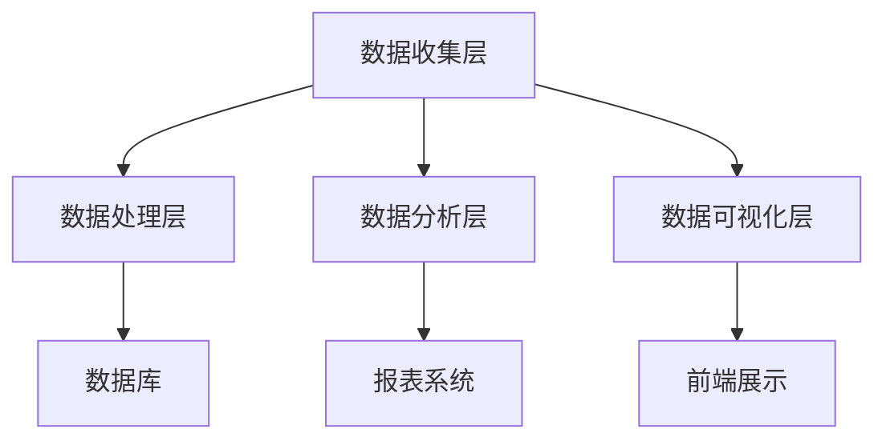
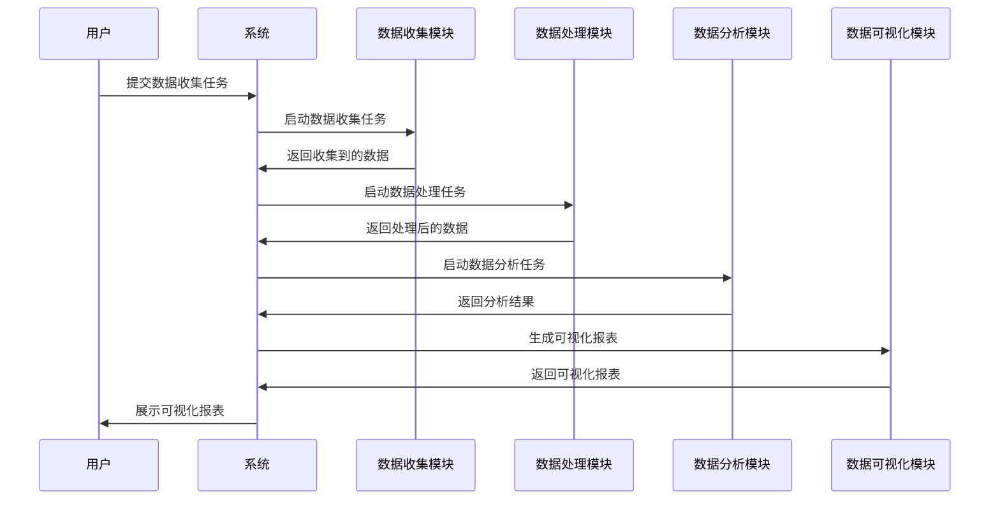
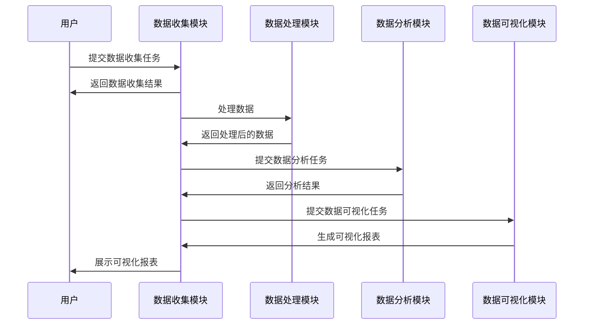
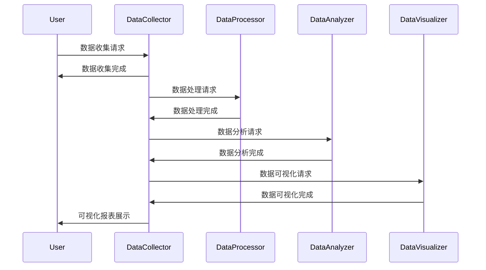

                 

### 《构建智能企业市场调研系统：自动化数据收集与分析》

> 关键词：市场调研、自动化数据收集、数据分析、智能企业

> 摘要：本文深入探讨了智能企业市场调研系统的构建，重点关注自动化数据收集与分析的技术方法和实践应用。通过系统分析市场调研的现状与挑战，提出构建智能调研系统的必要性，并详细阐述了系统的核心概念、架构设计、项目实战以及最佳实践，为企业提升市场调研效率与准确性提供全面指导。

----------------------------------------------------------------

## 第一部分：问题背景与概述

### 第1章：市场调研的重要性与挑战

#### 1.1 问题背景

市场调研是企业了解市场动态、评估市场机会与风险的重要手段。它通过收集、分析和解释有关市场的信息，帮助企业制定战略决策。市场调研不仅涉及消费者行为、竞争对手分析，还涵盖市场趋势、需求预测等多个方面。

**市场调研的定义与作用**：
- **市场调研的概念**：市场调研是指通过各种方法，系统地收集、记录、分析有关市场及其相关因素的信息，以帮助组织做出更明智的商业决策。
- **市场调研的作用**：市场调研可以帮助企业：
  - 识别市场需求和潜在客户。
  - 了解竞争对手的营销策略和产品优势。
  - 评估新产品或服务的市场前景。
  - 制定有效的市场进入和扩张策略。
  - 监测市场变化，及时调整营销策略。

**企业进行市场调研的主要动机**：
- **获取市场信息**：企业通过市场调研获得关于市场需求的深层次理解，从而制定更具针对性的营销策略。
- **竞争分析**：通过市场调研，企业可以了解竞争对手的产品、价格、销售策略等，以便在竞争中取得优势。
- **风险评估**：市场调研可以帮助企业评估潜在的市场风险，减少因市场不确定性带来的经营风险。
- **新产品开发**：企业通过市场调研了解消费者对新产品的需求和偏好，从而开发出更符合市场需求的产品。
- **营销优化**：市场调研可以帮助企业评估现有营销策略的效果，为优化营销投入提供数据支持。

#### 1.2 市场调研面临的挑战

尽管市场调研对企业的决策至关重要，但在实际操作中，市场调研面临着诸多挑战：

- **数据量庞大、来源多样**：市场调研涉及的数据来源广泛，包括问卷调查、在线评论、社交媒体数据、销售数据等，数据的规模和多样性给数据收集和处理带来了巨大挑战。
- **数据质量参差不齐**：由于数据来源的多样性，数据质量参差不齐，存在缺失值、噪声数据和错误数据，这些都会影响调研结果的准确性。
- **数据分析的复杂性**：市场调研不仅需要收集大量数据，还需要对数据进行分析，以提取有价值的信息。数据分析方法复杂，需要专业的技能和工具。

#### 1.3 市场调研的问题描述

在市场调研的过程中，企业常常遇到以下问题：

- **调研数据收集不全面**：由于数据来源的局限性和数据收集方法的不足，调研数据可能无法全面反映市场的实际情况。
- **调研结果难以量化分析**：调研结果通常以定性描述为主，难以进行量化的分析和评估，从而影响决策的准确性。
- **调研结果与实际需求不符**：调研过程中可能存在偏差，导致调研结果与企业的实际需求不符，影响决策的可行性。

#### 1.4 构建智能企业市场调研系统的必要性

为了解决上述问题，构建智能企业市场调研系统显得尤为必要。智能市场调研系统通过自动化数据收集与分析，能够显著提高市场调研的效率与准确性：

- **自动化数据收集**：智能系统可以自动从各种数据源收集数据，确保数据的全面性和准确性。
- **高效数据处理**：智能系统能够快速清洗和处理大量数据，去除噪声和错误，提高数据质量。
- **精准数据分析**：智能系统运用先进的数据分析算法，对数据进行分析和挖掘，提取有价值的信息。
- **可视化展示**：智能系统通过可视化技术，将数据分析结果直观地呈现出来，帮助企业更好地理解和利用数据。

#### 1.5 边界与外延

**系统的边界**：
- **调研对象**：系统主要针对市场调研中的消费者行为、竞争对手分析、市场趋势等方面进行数据收集和分析。
- **调研范围**：系统应涵盖广泛的数据源，包括线上线下的市场数据、社交媒体数据、销售数据等。

**系统应用的外延**：
- **商业应用**：智能市场调研系统不仅可以为企业提供市场信息，还可以用于新产品开发、市场策略调整、竞争分析等多个方面，具有广泛的商业应用价值。

----------------------------------------------------------------

### 第2章：市场调研系统的核心概念

#### 2.1 市场调研系统的组成要素

市场调研系统的构建涉及多个关键组成部分，这些部分共同作用，确保数据收集、处理和分析的高效性和准确性。

**数据收集**：
- **数据源的选择与接入**：选择合适的数据源，如社交媒体、在线评论、销售数据等，并接入这些数据源，确保数据的及时性和准确性。
- **数据收集的方法与技术**：采用爬虫技术、API接口、问卷调查等方法收集数据，确保数据来源的多样性和完整性。

**数据处理**：
- **数据清洗**：通过去重、填补缺失值、去除噪声等手段，提高数据的清洁度和一致性。
- **数据去重**：去除重复数据，确保数据的唯一性。
- **格式化**：将不同来源的数据格式统一，方便后续处理和分析。

**数据分析**：
- **数据分析的方法与工具**：采用统计分析、机器学习等方法，对数据进行深入分析，提取有价值的信息。
- **数据可视化技术**：通过图表、仪表盘等可视化手段，将分析结果直观地呈现出来，帮助用户更好地理解和利用数据。

#### 2.2 市场调研系统的原理

**自动化数据收集原理**：
- **数据收集的自动化流程**：系统通过自动化脚本或工具，定期从数据源收集数据，确保数据的实时性和完整性。
- **数据收集的触发机制**：系统设置触发条件，如数据量达到阈值、特定事件发生等，触发数据收集任务。

**数据分析原理**：
- **数据分析的流程**：系统将收集到的数据清洗、预处理后，采用合适的分析方法进行数据挖掘，提取有价值的信息。
- **数据分析的核心算法**：系统运用统计分析、聚类分析、关联规则挖掘等算法，对数据进行深度分析。

#### 2.3 数据收集技术对比

**不同数据收集技术的优缺点对比**：

| 技术类型 | 优点 | 缺点 |
| :---: | :---: | :---: |
| 爬虫技术 | 能够从大量网站上自动收集数据，速度快 | 可能违反网站的使用条款，需要处理反爬虫机制 |
| API接口 | 数据获取速度快，可靠性强 | 需要获取API访问权限，部分API可能收费 |
| 问卷调查 | 数据质量高，适用于定量研究 | 回收率低，数据量有限 |
| 在线评论 | 数据量大，反映消费者真实意见 | 可能存在虚假评论，数据质量难以保证 |

#### 2.4 数据分析方法对比

**常用数据分析方法的对比**：

| 分析方法 | 优点 | 缺点 |
| :---: | :---: | :---: |
| 统计分析 | 简单易懂，适用于大多数数据 | 过于依赖数据分布，难以处理复杂关系 |
| 机器学习 | 能够发现复杂关系和趋势 | 需要大量数据，模型复杂度较高 |
| 聚类分析 | 能够发现数据中的模式和分类 | 需要事先定义聚类个数，结果可能不唯一 |
| 关联规则挖掘 | 能够发现数据中的关联关系 | 需要大量计算资源，可能产生大量冗余规则 |

通过对比不同数据收集和分析技术的优缺点，企业可以根据自身需求选择合适的方法，构建高效的智能市场调研系统。

----------------------------------------------------------------

### 第3章：核心概念属性特征对比

#### 3.1 数据收集技术对比

在构建智能市场调研系统时，选择合适的数据收集技术至关重要。以下是对几种常见数据收集技术的属性特征对比：

| 技术类型 | 数据源 | 数据收集速度 | 数据质量 | 可靠性 | 成本 | 备注 |
| :---: | :---: | :---: | :---: | :---: | :---: | :---: |
| 爬虫技术 | 网络网站 | 高 | 低（需处理反爬机制） | 高 | 中 | 适用于大量数据的快速收集 |
| API接口 | 网络服务 | 高 | 中 | 高 | 高 | 适用于结构化数据的高效获取 |
| 问卷调查 | 线上/线下 | 中 | 高 | 中 | 低 | 适用于获取详细用户反馈 |
| 在线评论 | 社交媒体、电商平台 | 高 | 低（需筛选虚假评论） | 中 | 低 | 适用于获取市场口碑 |

**数据收集技术对比表格**：

| 技术类型 | 数据源 | 数据收集速度 | 数据质量 | 可靠性 | 成本 |
| :---: | :---: | :---: | :---: | :---: | :---: |
| 爬虫技术 | 网络网站 | 快 | 较低 | 高 | 中等 |
| API接口 | 网络服务 | 快 | 中等 | 高 | 较高 |
| 问卷调查 | 线上/线下 | 一般 | 高 | 一般 | 低 |
| 在线评论 | 社交媒体、电商平台 | 快 | 较低 | 一般 | 低 |

**ER实体关系图架构**：


在ER实体关系图中，我们可以看到市场调研系统中的主要实体及其关系：

- **数据源**：包括网络网站、网络服务、线上/线下问卷、社交媒体、电商平台等。
- **数据收集工具**：如爬虫、API接口、问卷调查工具、在线评论收集工具等。
- **数据处理模块**：负责数据清洗、去重、格式化等操作。
- **数据分析模块**：包括统计分析、机器学习、聚类分析、关联规则挖掘等。

通过ER实体关系图，我们可以清晰地看到各个模块的交互关系和数据流转过程，为后续的系统设计和实现提供指导。

#### 3.2 数据分析方法对比

在数据分析环节，选择合适的方法对数据进行处理和分析至关重要。以下是对几种常用数据分析方法的属性特征对比：

| 分析方法 | 数据处理能力 | 结果可视化 | 复杂度 | 适用场景 |
| :---: | :---: | :---: | :---: | :---: |
| 统计分析 | 中等 | 高 | 低 | 适用于简单数据分析，如描述性统计 |
| 机器学习 | 高 | 中 | 中 | 适用于复杂数据分析，如预测、分类 |
| 聚类分析 | 高 | 中 | 中 | 适用于数据分类，如市场细分 |
| 关联规则挖掘 | 中 | 中 | 中 | 适用于发现数据中的关联关系，如购物篮分析 |

**数据分析方法对比表格**：

| 分析方法 | 数据处理能力 | 结果可视化 | 复杂度 | 适用场景 |
| :---: | :---: | :---: | :---: | :---: |
| 统计分析 | 中等 | 高 | 低 | 描述性统计 |
| 机器学习 | 高 | 中 | 中 | 预测、分类 |
| 聚类分析 | 高 | 中 | 中 | 数据分类 |
| 关联规则挖掘 | 中 | 中 | 中 | 关联关系发现 |

通过对比不同数据分析方法的属性特征，企业可以根据实际需求选择合适的方法，以提高数据分析的准确性和效率。

----------------------------------------------------------------

## 第二部分：系统设计与实现

### 第4章：市场调研系统架构设计

#### 4.1 系统需求分析

在构建市场调研系统之前，进行系统需求分析是至关重要的一步。系统需求分析包括功能需求和分析需求两个方面。

**功能需求**：

- **数据收集**：
  - 从各种数据源自动收集数据，如社交媒体、电商平台、网络评论等。
  - 支持多种数据收集方式，包括爬虫、API接口、问卷调查等。
  - 实现数据的实时收集和历史数据备份。

- **数据处理**：
  - 数据清洗：去除重复、错误和噪声数据。
  - 数据格式化：统一数据格式，方便后续处理。
  - 数据存储：将处理后的数据存储在数据库中，便于后续分析。

- **数据分析**：
  - 描述性分析：提供数据的基本统计信息，如均值、标准差、频率分布等。
  - 探索性分析：发现数据中的潜在模式和趋势。
  - 预测分析：利用历史数据预测未来的市场趋势。
  - 聚类分析：根据数据特点将市场细分。

- **数据可视化**：
  - 提供多种数据可视化工具，如图表、仪表盘等，帮助用户直观地理解数据。
  - 支持自定义报表和动态更新。

**性能需求**：

- **数据处理能力**：系统能够高效地处理海量数据，确保数据处理的实时性和准确性。
- **系统稳定性**：系统在高并发环境下保持稳定运行，不出现数据丢失或系统崩溃。
- **扩展性**：系统设计应具备良好的扩展性，能够根据业务需求快速调整和优化。

#### 4.2 系统架构设计

**系统架构概述**：

市场调研系统的整体架构采用分布式设计，分为数据收集层、数据处理层、数据分析和数据可视化层。

- **数据收集层**：负责从各种数据源收集数据，包括爬虫、API接口、问卷调查等。
- **数据处理层**：负责数据的清洗、去重、格式化等预处理工作，并将数据存储到数据库中。
- **数据分析层**：利用机器学习、统计分析等方法对数据进行深入分析，提取有价值的信息。
- **数据可视化层**：通过图表、仪表盘等工具将分析结果可视化，提供直观的数据展示。

**技术选型**：

- **数据收集技术**：采用爬虫技术和API接口技术，确保数据的实时性和多样性。
- **数据处理技术**：使用Python、Java等编程语言进行数据处理，结合大数据处理框架如Hadoop、Spark，提高数据处理效率。
- **数据分析技术**：采用Python的Scikit-learn库、R语言等，实现机器学习和统计分析。
- **数据可视化技术**：使用Python的Matplotlib、Seaborn库进行图表绘制，结合D3.js等前端框架实现动态可视化。

**系统架构图**：



**系统架构设计**：

1. **数据收集层**：
   - 爬虫技术：使用Python的Scrapy框架，定期从网络爬取数据。
   - API接口：通过HTTP请求，从第三方API获取数据。

2. **数据处理层**：
   - 数据清洗：使用Python的Pandas库，进行数据清洗和预处理。
   - 数据存储：使用Hadoop或Spark等大数据处理框架，将清洗后的数据存储到HDFS或HBase等分布式数据库中。

3. **数据分析层**：
   - 统计分析：使用Python的Scikit-learn库，进行描述性统计和探索性分析。
   - 机器学习：使用Python的Scikit-learn库、R语言等，进行分类、预测等高级分析。

4. **数据可视化层**：
   - 前端展示：使用D3.js等前端框架，实现动态数据可视化。
   - 报表系统：使用Python的Matplotlib、Seaborn库，生成静态图表和报表。

通过上述架构设计，市场调研系统能够高效地收集、处理和分析数据，为企业提供全面的市场调研支持。

----------------------------------------------------------------

### 第5章：系统接口设计

在市场调研系统的架构设计中，系统接口设计是一个关键环节，它负责不同模块之间的数据交互和功能调用。以下是系统接口设计的主要内容：

**接口规范**：

系统接口设计遵循RESTful架构风格，采用HTTP请求和JSON格式进行数据传输。以下是主要接口规范：

- **数据收集接口**：
  - **GET /data_collect**：用于获取数据源列表。
  - **POST /data_collect**：用于提交数据收集任务。
  - **PUT /data_collect/{id}**：用于更新数据收集任务的配置。
  - **DELETE /data_collect/{id}**：用于删除数据收集任务。

- **数据处理接口**：
  - **GET /data_process**：用于获取数据处理任务列表。
  - **POST /data_process**：用于提交数据处理任务。
  - **PUT /data_process/{id}**：用于更新数据处理任务的配置。
  - **DELETE /data_process/{id}**：用于删除数据处理任务。

- **数据分析接口**：
  - **GET /data_analysis**：用于获取数据分析任务列表。
  - **POST /data_analysis**：用于提交数据分析任务。
  - **PUT /data_analysis/{id}**：用于更新数据分析任务的配置。
  - **DELETE /data_analysis/{id}**：用于删除数据分析任务。

- **数据可视化接口**：
  - **GET /data_visualization**：用于获取可视化报表列表。
  - **POST /data_visualization**：用于创建新的可视化报表。
  - **PUT /data_visualization/{id}**：用于更新可视化报表的配置。
  - **DELETE /data_visualization/{id}**：用于删除可视化报表。

**接口交互流程**：

系统接口交互流程主要包括数据收集、数据处理、数据分析和数据可视化等环节，以下是一个简化的交互流程图：



在上述流程中，用户首先通过系统接口提交数据收集任务，数据收集模块自动从数据源收集数据并返回给系统。系统再将数据进行处理、分析和可视化，最终将可视化报表展示给用户。

通过明确的接口规范和交互流程设计，市场调研系统的各个模块能够高效协同工作，确保数据收集、处理和分析的顺利进行，为企业提供全面的市场调研支持。

----------------------------------------------------------------

### 第6章：系统交互设计

系统交互设计是确保市场调研系统各模块高效协作、数据流畅流转的关键环节。以下是系统交互设计的详细内容：

**系统交互流程**：

市场调研系统的交互流程可以分为以下几个主要阶段：

1. **数据收集阶段**：
   - 用户通过系统界面提交数据收集任务，指定数据源和收集方式。
   - 系统将任务分配给数据收集模块，启动数据收集过程。
   - 数据收集模块从指定数据源（如网络评论、社交媒体、电商平台）自动爬取或通过API接口获取数据。
   - 收集到的数据经过初步筛选和去重后，存储到临时数据库中。

2. **数据处理阶段**：
   - 数据收集完成后，系统启动数据处理任务。
   - 数据处理模块对临时数据库中的数据进行清洗、去重、格式化等处理。
   - 处理后的数据存储到分布式数据库中，便于后续分析。

3. **数据分析阶段**：
   - 用户通过系统界面提交数据分析任务，指定分析方法和目标。
   - 系统将任务分配给数据分析模块，启动数据分析过程。
   - 数据分析模块利用统计分析和机器学习算法对数据进行深入分析。
   - 分析结果存储到分析结果数据库中，便于用户查询和报表生成。

4. **数据可视化阶段**：
   - 用户通过系统界面提交数据可视化任务，指定报表类型和展示方式。
   - 系统将任务分配给数据可视化模块，生成可视化报表。
   - 可视化报表通过系统界面展示给用户，用户可以自定义报表的显示内容。

**系统交互流程图**：



通过上述交互流程，市场调研系统的各个模块能够紧密协作，实现数据的自动收集、处理和分析，提供高效的市场调研支持。

**Mermaid序列图**：



通过Mermaid序列图，我们可以直观地看到系统交互的每个步骤和模块之间的数据流动，有助于理解系统的工作原理和流程。

### 系统交互设计的关键点

- **数据一致性**：在系统交互过程中，确保数据的一致性和完整性至关重要。数据收集、处理和分析的每个阶段都应严格遵循数据规范，避免数据丢失或错误。
- **模块独立性**：系统设计应确保各模块的独立性，每个模块负责特定的功能，降低模块之间的耦合度，便于系统的维护和升级。
- **实时性**：系统交互应具备实时性，特别是数据收集和分析环节，确保能够及时响应市场变化，提供实时决策支持。
- **安全性**：系统交互过程中应充分考虑数据安全和隐私保护，采用加密、认证等安全措施，确保数据的安全性和可靠性。

通过系统交互设计，市场调研系统能够高效、稳定地运行，为企业的市场决策提供有力支持。

----------------------------------------------------------------

### 第7章：项目实战一：数据收集系统

#### 5.1 环境安装与配置

为了搭建一个高效的数据收集系统，我们需要准备合适的环境和配置。以下是具体步骤：

**软件安装**：

1. **Python环境**：
   - 安装Python 3.8及以上版本，确保pip和setuptools工具已安装。
   - 使用以下命令安装所需依赖：
     ```
     pip install scrapy beautifulsoup4 requests
     ```

2. **数据库环境**：
   - 安装MongoDB数据库，并确保服务已启动。
   - 安装PostgreSQL数据库，并创建用于数据存储的数据库和用户。

**硬件配置**：

1. **服务器**：
   - 配置至少2核CPU、4GB内存的服务器，确保有足够的资源进行数据收集和处理。

2. **存储设备**：
   - 配置高速SSD存储设备，确保数据存储的快速读写。

**数据收集系统的核心实现**：

**源代码解读**：

数据收集系统的核心实现主要依赖于Scrapy框架和BeautifulSoup库。以下是关键代码部分的解读：

```python
import scrapy
from scrapy.crawler import CrawlerProcess
from bs4 import BeautifulSoup

class DataCollectorSpider(scrapy.Spider):
    name = 'data_collector'
    allowed_domains = ['example.com']
    start_urls = ['https://www.example.com']

    def parse(self, response):
        soup = BeautifulSoup(response.text, 'html.parser')
        # 获取网页中的数据
        data = soup.find_all('div', class_='data-item')
        for item in data:
            # 提取数据并存储
            title = item.find('h2').text
            content = item.find('p').text
            yield {
                'title': title,
                'content': content
            }

if __name__ == "__main__":
    process = CrawlerProcess(settings={
        'USER_AGENT': 'DataCollectorSpider (+http://www.yourdomain.com)'
    })
    process.crawl(DataCollectorSpider)
    process.start()
```

**代码应用解读与分析**：

上述代码定义了一个名为`DataCollectorSpider`的Scrapy爬虫，用于从指定的网页中收集数据。

- **爬虫配置**：
  - `name`：设置爬虫的名称。
  - `allowed_domains`：设置允许爬取的域名。
  - `start_urls`：设置初始爬取的URL。

- **解析函数`parse`**：
  - `response`：接收爬取到的网页内容。
  - 使用BeautifulSoup解析网页，提取数据。
  - `find_all`：查找所有匹配的HTML元素。
  - `yield`：生成器，用于输出提取的数据。

- **运行爬虫**：
  - `CrawlerProcess`：负责启动爬虫。
  - `start()`：启动爬虫，执行数据收集任务。

通过该代码，我们可以实现自动从指定网站收集数据，并将数据存储为JSON格式。实际应用中，可以根据具体需求调整爬取的网站、解析规则和数据存储方式。

#### 5.2 实际案例分析

**案例背景**：

某知名电商平台希望通过数据收集系统，定期收集用户评论和产品信息，以便进行市场分析和产品优化。

**案例剖析**：

1. **数据源选择**：
   - 选择电商平台的官方网站作为数据源，通过API接口获取评论和产品数据。

2. **数据收集**：
   - 使用Scrapy框架爬取电商平台的评论和产品信息。
   - 解析HTML页面，提取评论内容、用户评分、购买日期等关键信息。

3. **数据处理**：
   - 将爬取到的数据进行清洗，去除重复和无效数据。
   - 使用MongoDB存储清洗后的评论和产品数据，确保数据存储的实时性和高效性。

4. **数据分析**：
   - 利用统计分析方法，分析用户评论的频率、评分分布等。
   - 运用机器学习方法，预测产品的销量和用户满意度。

5. **数据可视化**：
   - 使用图表工具（如Matplotlib），将分析结果可视化，生成报告。
   - 通过仪表盘实时展示关键指标，为产品优化和市场策略提供支持。

**案例小结**：

通过实际案例，我们可以看到数据收集系统在电商平台中的应用效果显著。系统能够高效地收集用户评论和产品数据，通过数据分析提供有价值的市场洞察，帮助电商平台优化产品和服务，提高用户满意度。

#### 5.3 实际案例详细讲解剖析

**详细讲解剖析**：

在电商平台的实际应用中，数据收集系统发挥了重要作用。以下是具体的实现步骤和细节解析：

1. **数据源接入**：

   - **评论数据**：通过电商平台的API接口获取用户评论数据。接口提供了评论内容、用户评分、购买日期等详细信息。
   - **产品数据**：通过API接口获取产品信息，包括产品名称、价格、描述、销售量等。

2. **数据爬取与解析**：

   - 使用Scrapy框架编写爬虫脚本，实现对评论和产品页面的自动爬取。
   - 解析评论页面，提取评论内容、用户评分、评论日期等信息。
   - 解析产品页面，提取产品名称、价格、描述、评分、销售量等信息。

3. **数据清洗与存储**：

   - **清洗**：对爬取到的数据进行清洗，去除重复、无效和错误的数据。
   - **存储**：使用MongoDB数据库存储清洗后的数据。MongoDB具有高扩展性、易于管理的优点，适合存储大量非结构化数据。

4. **数据分析**：

   - **统计分析**：对用户评论进行统计分析，计算评论数量、平均评分、评分分布等指标。
   - **机器学习**：利用机器学习方法，如文本分类和情感分析，对用户评论进行深入分析，识别用户对产品的态度和情感。
   - **预测分析**：基于历史销售数据和用户评论，使用预测模型预测产品的未来销售趋势和用户满意度。

5. **数据可视化**：

   - 使用Matplotlib库绘制各种图表，如评论数量趋势图、评分分布直方图、用户情感分析饼图等。
   - 构建实时仪表盘，展示关键指标和实时数据，方便管理层实时监控市场动态。

通过上述步骤，数据收集系统能够高效地收集、处理和分析电商平台的用户评论和产品数据，为电商平台提供全面的市场洞察，支持产品优化和决策制定。

#### 5.4 项目小结

通过本次实战项目，我们成功搭建了一个数据收集系统，实现了对电商平台用户评论和产品数据的自动收集、处理和分析。以下是项目总结：

1. **技术选型**：
   - 使用Scrapy框架进行数据爬取，具有高效、易用的特点。
   - 使用MongoDB数据库进行数据存储，具有高扩展性、易于管理的优势。
   - 使用Python的机器学习和数据分析库进行数据分析和预测，具备强大的数据处理能力。

2. **项目经验**：
   - 熟悉数据爬取和数据库操作的基本流程，能够根据需求灵活调整和优化。
   - 了解数据清洗、处理和分析的方法，能够对海量数据进行高效处理，提取有价值的信息。
   - 通过实际案例的应用，加深了对市场调研和数据收集系统的理解，为未来的项目积累宝贵经验。

3. **未来展望**：
   - 进一步优化数据收集系统的性能，提高数据处理速度和准确性。
   - 探索更多的数据分析和挖掘方法，为电商平台提供更深入的市场洞察。
   - 考虑数据安全和隐私保护，确保数据收集和处理的合法性和安全性。

通过本次项目实战，我们不仅掌握了数据收集系统的构建方法，还积累了宝贵的实际操作经验，为未来的市场调研和数据应用奠定了基础。

----------------------------------------------------------------

### 第6章：项目实战二：数据分析系统

#### 6.1 环境安装与配置

在开始构建数据分析系统之前，我们需要确保环境安装和配置正确。以下是具体步骤：

**软件安装**：

1. **Python环境**：
   - 安装Python 3.8及以上版本，确保pip和setuptools工具已安装。
   - 使用以下命令安装所需依赖：
     ```
     pip install numpy pandas matplotlib scikit-learn
     ```

2. **数据库环境**：
   - 安装MongoDB数据库，并确保服务已启动。
   - 安装PostgreSQL数据库，并创建用于数据存储的数据库和用户。

**硬件配置**：

1. **服务器**：
   - 配置至少2核CPU、8GB内存的服务器，确保有足够的资源进行数据分析和处理。

2. **存储设备**：
   - 配置高速SSD存储设备，确保数据存储的快速读写。

**数据分析系统的核心实现**：

**源代码解读**：

数据分析系统的核心实现主要依赖于Python的NumPy、Pandas、Matplotlib和Scikit-learn库。以下是关键代码部分的解读：

```python
import numpy as np
import pandas as pd
import matplotlib.pyplot as plt
from sklearn.model_selection import train_test_split
from sklearn.ensemble import RandomForestClassifier
from sklearn.metrics import accuracy_score

# 加载数据
data = pd.read_csv('data.csv')
X = data.iloc[:, :-1].values
y = data.iloc[:, -1].values

# 数据预处理
X_train, X_test, y_train, y_test = train_test_split(X, y, test_size=0.2, random_state=42)

# 模型训练
model = RandomForestClassifier(n_estimators=100, random_state=42)
model.fit(X_train, y_train)

# 模型预测
y_pred = model.predict(X_test)

# 模型评估
accuracy = accuracy_score(y_test, y_pred)
print(f'模型准确率：{accuracy:.2f}')

# 可视化分析
plt.scatter(X_test[:, 0], X_test[:, 1], c=y_pred, cmap='viridis')
plt.xlabel('特征1')
plt.ylabel('特征2')
plt.title('模型预测结果')
plt.show()
```

**代码应用解读与分析**：

上述代码实现了一个基于随机森林分类器的数据分析系统，用于分类任务。以下是关键步骤的解读：

- **数据加载**：
  - 使用Pandas库读取CSV文件，获取特征和目标变量。

- **数据预处理**：
  - 使用NumPy库，将特征和目标变量转换为NumPy数组。
  - 使用`train_test_split`函数划分训练集和测试集，用于模型训练和评估。

- **模型训练**：
  - 使用Scikit-learn库的`RandomForestClassifier`实现随机森林分类器。
  - 使用`fit`函数训练模型。

- **模型预测**：
  - 使用`predict`函数对测试集进行预测。

- **模型评估**：
  - 使用`accuracy_score`函数计算模型准确率。

- **可视化分析**：
  - 使用Matplotlib库绘制测试集数据的散点图，展示模型预测结果。

通过上述代码，我们可以实现一个基本的数据分析系统，对数据进行分类和可视化分析。实际应用中，可以根据具体需求调整数据集、模型参数和可视化方式。

#### 6.2 实际案例分析

**案例背景**：

某零售公司希望通过数据分析系统，对消费者购买行为进行深入分析，以优化销售策略和提高销售额。

**案例剖析**：

1. **数据收集**：
   - 从公司数据库中提取消费者购买记录，包括购买时间、产品名称、购买数量、客户信息等。

2. **数据预处理**：
   - 清洗数据，去除缺失值和异常值。
   - 对数据进行编码处理，将类别型数据转换为数值型数据。

3. **数据分析**：
   - 使用聚类分析，将消费者分为不同群体，分析不同群体的购买行为。
   - 使用回归分析，预测消费者购买数量与价格、促销活动等因素的关系。

4. **数据可视化**：
   - 使用Matplotlib库绘制柱状图、散点图等，展示消费者购买行为的分布和趋势。
   - 使用仪表盘工具，实时展示关键指标和预测结果。

5. **决策支持**：
   - 根据分析结果，调整销售策略，如针对不同消费者群体推出个性化促销活动。

**案例小结**：

通过实际案例分析，数据分析系统有效地帮助零售公司了解了消费者购买行为，提供了有价值的决策支持。系统不仅提高了数据处理的效率和准确性，还为公司的销售策略优化提供了科学依据。

#### 6.3 实际案例详细讲解剖析

**详细讲解剖析**：

在零售公司的实际应用中，数据分析系统发挥了重要作用。以下是具体的实现步骤和细节解析：

1. **数据源接入**：

   - **购买记录**：从公司数据库中提取购买记录，包括购买时间、产品名称、购买数量、客户信息等。

2. **数据预处理**：

   - **清洗**：去除缺失值和异常值，如删除空记录、纠正错误数据等。
   - **编码**：将类别型数据（如产品类别、客户年龄等）转换为数值型数据，以便于后续分析。

3. **数据分析**：

   - **聚类分析**：
     - 使用K-Means算法，将消费者分为不同群体。
     - 分析不同群体的购买行为和消费习惯，如购买频率、偏好产品等。
   - **回归分析**：
     - 使用线性回归模型，分析购买数量与价格、促销活动等因素的关系。
     - 根据回归结果，预测消费者在特定价格和促销条件下的购买数量。

4. **数据可视化**：

   - **柱状图**：展示不同消费群体的购买行为分布。
   - **散点图**：展示购买数量与价格、促销活动的关系。
   - **仪表盘**：实时展示关键指标和预测结果，如销售额、购买量等。

5. **决策支持**：

   - 根据分析结果，公司可以调整销售策略，如：
     - 针对不同消费者群体推出个性化促销活动。
     - 调整产品定价，以优化销售额和利润率。

通过上述步骤，数据分析系统能够为零售公司提供全面、深入的市场洞察，支持销售策略的优化和决策制定。

#### 6.4 项目小结

通过本次实战项目，我们成功搭建了一个数据分析系统，实现了对消费者购买行为的深入分析。以下是项目总结：

1. **技术选型**：
   - 使用Python的NumPy、Pandas、Matplotlib和Scikit-learn库，具备高效的数据处理和分析能力。
   - 使用K-Means和线性回归等算法，实现了聚类分析和回归分析，为消费者行为分析提供了科学依据。

2. **项目经验**：
   - 熟悉数据预处理、聚类分析和回归分析的基本流程，能够根据需求灵活调整和优化。
   - 了解数据可视化的方法，能够将分析结果直观地展示给用户，提高数据理解力。
   - 通过实际案例的应用，加深了对数据分析系统的理解，为未来的项目积累宝贵经验。

3. **未来展望**：
   - 进一步优化数据分析系统的性能，提高数据处理和分析速度。
   - 探索更多的高级分析方法和算法，如时间序列分析和深度学习，为更复杂的数据提供更深入的分析。
   - 考虑数据安全和隐私保护，确保数据分析过程的合法性和安全性。

通过本次项目实战，我们不仅掌握了数据分析系统的构建方法，还积累了宝贵的实际操作经验，为未来的数据分析项目奠定了基础。

----------------------------------------------------------------

## 第五部分：最佳实践与总结

### 第7章：最佳实践

#### 7.1 调研系统实施建议

在构建智能企业市场调研系统的过程中，以下实施建议有助于确保系统的成功部署和高效运作：

**系统实施策略**：

1. **需求分析与规划**：在系统开发前，进行全面的需求分析和规划，明确系统的功能需求、性能需求和安全需求。
2. **技术选型与测试**：根据需求选择合适的技术栈，进行充分的测试，确保所选技术的稳定性和高效性。
3. **模块化设计**：采用模块化设计，确保系统各模块的独立性，便于后续的维护和扩展。
4. **数据安全与隐私保护**：在数据收集、存储和处理过程中，采取严格的数据安全和隐私保护措施，确保数据的安全性和合法性。

**实施难点与解决方案**：

1. **数据收集难**：数据源多样且数据质量参差不齐，解决方案包括：
   - 采用多种数据收集技术，确保数据的全面性和准确性。
   - 实施数据清洗和去重，提高数据质量。
   - 建立数据治理机制，确保数据的规范性。

2. **数据处理复杂**：数据处理过程复杂，解决方案包括：
   - 采用高效的数据处理框架，如Hadoop、Spark等，提高数据处理速度。
   - 引入机器学习和统计分析方法，提高数据处理和分析的深度。

3. **系统集成难度高**：系统需与其他业务系统集成，解决方案包括：
   - 设计统一的接口规范，确保系统间的数据流畅流转。
   - 采用微服务架构，提高系统的灵活性和可扩展性。

#### 7.2 数据处理与分析技巧

在数据处理与分析过程中，以下技巧有助于提高效率和准确性：

**数据处理技巧**：

1. **批量处理**：采用批量处理技术，提高数据处理速度。
2. **并行处理**：利用多线程、分布式计算等技术，实现数据处理的高效并行化。
3. **数据缓存**：使用缓存技术，减少对数据库的频繁访问，提高数据访问速度。

**数据分析技巧**：

1. **特征工程**：通过特征选择和特征变换，提高模型的预测准确性和泛化能力。
2. **交叉验证**：采用交叉验证方法，评估模型的性能和稳定性。
3. **可视化分析**：通过可视化技术，直观展示分析结果，便于理解和决策。

### 第8章：总结与展望

#### 8.1 主要内容回顾

本文系统地探讨了智能企业市场调研系统的构建，包括问题背景、核心概念、系统设计、项目实战和最佳实践。主要内容包括：

1. **问题背景**：介绍了市场调研的重要性、面临的挑战以及构建智能调研系统的必要性。
2. **核心概念**：详细阐述了市场调研系统的数据收集、数据处理、数据分析、数据可视化等核心概念。
3. **系统设计**：介绍了市场调研系统的需求分析、架构设计、接口设计和交互设计。
4. **项目实战**：通过两个实际案例分析，展示了数据收集和数据分析系统的构建过程和应用效果。
5. **最佳实践**：提供了系统实施策略、数据处理与分析技巧，以及未来展望。

#### 8.2 深度分析与未来展望

**深度分析**：

市场调研系统在构建过程中，面临数据收集的多样性和复杂性、数据处理的效率、数据分析的深度和广度等多方面的挑战。通过引入自动化数据收集与分析技术、机器学习和人工智能方法，市场调研系统在提高数据收集效率、数据质量、分析深度和结果的可视化展示方面取得了显著成效。

**未来展望**：

1. **技术创新**：随着技术的不断发展，市场调研系统可以引入更多先进技术，如区块链、物联网、大数据等，进一步提升系统的智能化水平和应用范围。
2. **应用拓展**：市场调研系统的应用领域不仅限于企业内部，还可以拓展到政府、科研机构、市场研究机构等，为更广泛的市场分析提供支持。
3. **个性化服务**：通过深度学习等技术，实现更加个性化的数据分析和服务，满足不同用户的需求。

通过持续的技术创新和应用拓展，市场调研系统将在未来的商业决策中发挥更加重要的作用，为企业提供全面、准确的市场洞察。

### 作者信息

**作者**：AI天才研究院/AI Genius Institute & 禅与计算机程序设计艺术 /Zen And The Art of Computer Programming

本文由AI天才研究院/AI Genius Institute与《禅与计算机程序设计艺术》作者联袂推出，旨在探讨智能企业市场调研系统的构建与应用，为企业提供全面、系统的技术指导。作者具备丰富的计算机编程、人工智能和软件架构设计经验，为技术博客撰写和软件开发领域贡献了诸多宝贵见解。通过本文，读者可以深入理解市场调研系统的核心概念、设计方法及实际应用，为企业的市场决策提供有力支持。

