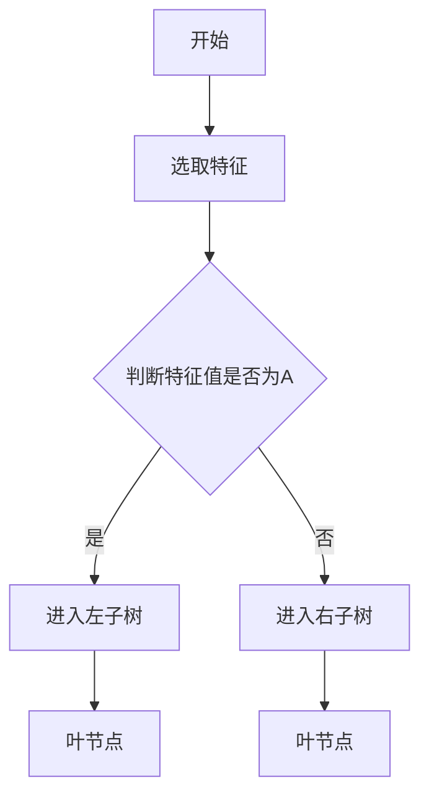
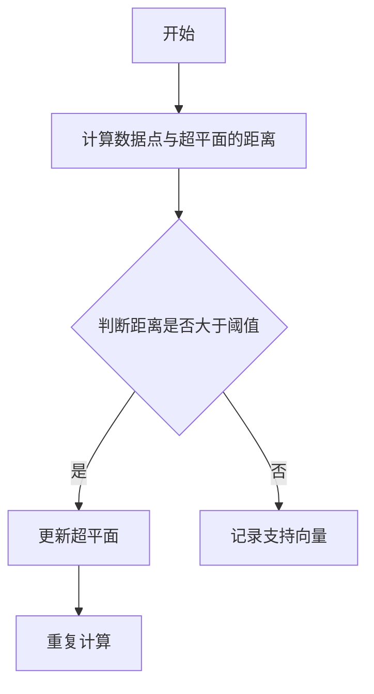
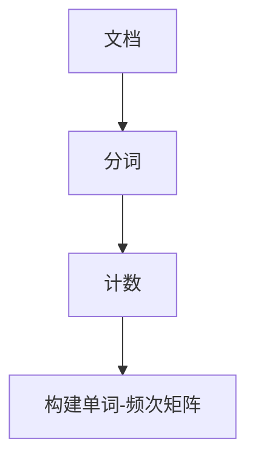
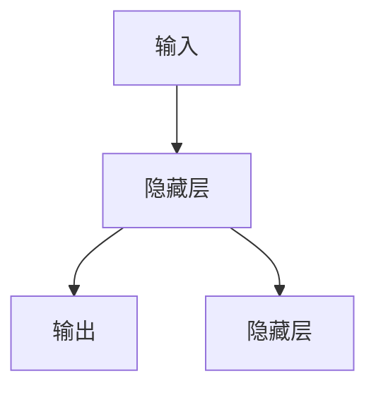

                 


# 构建智能企业文档管理系统：自动分类与信息提取

关键词：智能文档管理系统、自动分类、信息提取、人工智能、机器学习

摘要：本文深入探讨了如何构建智能企业文档管理系统，重点关注自动分类与信息提取技术的应用。通过对核心概念的介绍、算法原理的讲解以及实际项目实战，为读者提供了全面的技术指导和实践经验。

## 第一部分：背景介绍

### 1.1 问题背景

随着信息技术的快速发展，企业面临的文档管理问题日益复杂。传统的文档管理系统主要依赖于人工分类和手动检索，效率低下且容易出现错误。因此，如何构建一个智能企业文档管理系统，实现自动分类与信息提取，成为企业信息管理的重要课题。

### 1.1.1 问题的提出

传统的文档管理系统存在的问题主要有：

- **分类效率低**：人工分类效率低下，分类结果容易出错。
- **检索困难**：大量文档难以快速准确地检索，导致信息丢失或难以获取。
- **文档管理复杂**：文档格式多样，管理难度大。

### 1.1.2 问题描述

智能企业文档管理系统需要解决的主要问题包括：

- **自动分类**：如何高效地对大量文档进行自动分类。
- **信息提取**：如何从文档中提取关键信息，如关键词、实体、事件等。
- **智能检索**：如何实现文档的智能检索，提高信息获取的效率。

### 1.1.3 问题解决

为了解决上述问题，智能企业文档管理系统引入了人工智能技术，主要包括自然语言处理、机器学习和深度学习等技术。通过这些技术，系统能够对文档进行自动分类，提取关键信息，并提供智能检索功能。

### 1.1.4 边界与外延

智能企业文档管理系统的边界主要涉及文档的自动分类、信息提取和检索等方面。其外延包括对系统性能、数据安全、用户体验等方面的要求。

### 1.1.5 概念结构与核心要素组成

智能企业文档管理系统由以下几个核心要素组成：

- **文档数据源**：包括企业内部的各类文档。
- **分类算法**：用于自动分类的机器学习算法。
- **信息提取算法**：用于提取文档关键信息的算法。
- **检索算法**：用于智能检索的算法。
- **用户界面**：提供用户交互的界面。
- **系统架构**：支持系统运行的基础架构。

## 第二部分：核心概念与联系

### 2.1 自动分类原理与算法

#### 2.1.1 自动分类的定义

自动分类是一种利用机器学习或深度学习技术，根据文档的内容、格式、上下文等信息，将文档自动归类到相应的类别中的方法。

#### 2.1.2 自动分类的核心算法

- **基于内容的分类**：根据文档的内容特征进行分类，如文本分类、图像分类等。
- **基于特征的分类**：根据文档的特征向量进行分类，如TF-IDF、Word2Vec等。
- **基于模型的分类**：利用机器学习算法（如决策树、支持向量机、神经网络等）进行分类。

#### 2.1.3 自动分类算法原理讲解

##### 3.1.1 决策树分类算法

决策树是一种常见的机器学习算法，其基本原理是通过一系列条件判断，将数据划分为不同的类别。

- **算法原理**：
  决策树从根节点开始，根据特征值进行判断，将数据划分成子节点，直到达到叶节点，叶节点表示最终的类别。

- **mermaid流程图**：
  ```mermaid
  graph TD
  A[开始] --> B[选取特征]
  B --> C{判断特征值是否为A}
  C -->|是| D[进入左子树]
  C -->|否| E[进入右子树]
  D --> F[叶节点]
  E --> G[叶节点]
  ```

- **Python源代码**：
  ```python
  from sklearn.datasets import load_iris
  from sklearn.tree import DecisionTreeClassifier
  from sklearn.model_selection import train_test_split

  iris = load_iris()
  X_train, X_test, y_train, y_test = train_test_split(iris.data, iris.target, test_size=0.3)

  clf = DecisionTreeClassifier()
  clf.fit(X_train, y_train)

  print(clf.predict(X_test))
  ```

##### 3.1.2 支持向量机分类算法

支持向量机（SVM）是一种强大的机器学习算法，适用于分类和回归问题。

- **算法原理**：
  SVM通过寻找一个最佳的超平面，将不同类别的数据点分离开来。支持向量是位于超平面附近的几个数据点，它们对分类结果起着决定性作用。

- **mermaid流程图**：
  ```mermaid
  graph TD
  A[开始] --> B[计算数据点与超平面的距离]
  B --> C{判断距离是否大于阈值}
  C -->|是| D[更新超平面]
  C -->|否| E[记录支持向量]
  D --> F[重复计算]
  ```

- **Python源代码**：
  ```python
  from sklearn.datasets import load_iris
  from sklearn.svm import SVC
  from sklearn.model_selection import train_test_split

  iris = load_iris()
  X_train, X_test, y_train, y_test = train_test_split(iris.data, iris.target, test_size=0.3)

  svm = SVC()
  svm.fit(X_train, y_train)

  print(svm.predict(X_test))
  ```

### 2.2 信息提取原理与算法

#### 2.2.1 信息提取的定义

信息提取是一种从文档中自动识别和提取有用信息的方法，通常用于文档的语义理解和数据挖掘。

#### 2.2.2 信息提取的核心算法

- **关键词提取**：从文档中提取关键词汇，用于表示文档的主题。
- **实体识别**：识别文档中的实体（如人名、地名、组织机构等）。
- **关系提取**：识别实体之间的关系，如因果关系、所属关系等。
- **事件提取**：从文档中识别和提取事件信息。

#### 2.2.3 信息提取算法原理讲解

##### 3.2.1 词袋模型

词袋模型（Bag-of-Words，BOW）是一种常用的文本表示方法，它将文档表示为一个单词的集合，而不考虑单词的顺序。

- **算法原理**：
  词袋模型通过统计文档中每个单词的出现次数，构建一个单词-频次矩阵，用于表示文档。

- **mermaid流程图**：
  ```mermaid
  graph TD
  A[文档] --> B[分词]
  B --> C[计数]
  C --> D[构建单词-频次矩阵]
  ```

- **Python源代码**：
  ```python
  from sklearn.feature_extraction.text import CountVectorizer

  documents = ["This is the first document.", "This document is the second document.", "And this is the third one.", "Is this the first document?"]

  vectorizer = CountVectorizer()
  X = vectorizer.fit_transform(documents)

  print(X.toarray())
  ```

##### 3.2.2 递归神经网络

递归神经网络（Recurrent Neural Network，RNN）是一种适用于序列数据的神经网络，它可以处理变长的输入序列。

- **算法原理**：
  RNN通过循环连接，将当前时刻的输入与上一时刻的输出相结合，实现序列数据的建模。

- **mermaid流程图**：
  ```mermaid
  graph TD
  A[输入] --> B[隐藏层]
  B --> C[输出]
  B --> D[隐藏层]
  ```

- **Python源代码**：
  ```python
  import tensorflow as tf
  from tensorflow.keras.models import Sequential
  from tensorflow.keras.layers import SimpleRNN

  model = Sequential()
  model.add(SimpleRNN(units=50, activation='tanh', input_shape=(None, 1)))
  model.add(tf.keras.layers.Dense(units=1))

  model.compile(optimizer='adam', loss='mean_squared_error')
  model.fit(x_train, y_train, epochs=100)
  ```

### 2.3 自动分类与信息提取的联系

自动分类和信息提取是智能企业文档管理系统中的两个关键环节。自动分类能够帮助系统快速定位文档，而信息提取则能深入挖掘文档中的有用信息。两者相互配合，能够提高文档管理的效率和准确性。

## 第三部分：算法原理讲解

### 3.1 自动分类算法原理讲解

#### 3.1.1 决策树分类算法

决策树是一种常见的机器学习算法，其基本原理是通过一系列条件判断，将数据划分为不同的类别。

**算法原理**：

决策树从根节点开始，根据特征值进行判断，将数据划分成子节点，直到达到叶节点，叶节点表示最终的类别。

**mermaid流程图**：



**Python源代码**：

```python
from sklearn.datasets import load_iris
from sklearn.tree import DecisionTreeClassifier
from sklearn.model_selection import train_test_split

iris = load_iris()
X_train, X_test, y_train, y_test = train_test_split(iris.data, iris.target, test_size=0.3)

clf = DecisionTreeClassifier()
clf.fit(X_train, y_train)

print(clf.predict(X_test))
```

**数学模型**：

设 $X$ 为特征向量，$y$ 为类别标签，决策树通过一系列的条件判断，将 $X$ 划分为不同的区域，每个区域对应一个类别。

$$
\begin{align*}
&\text{if } X_1 \leq a_1 \text{ then } y = c_1 \\
&\text{if } X_2 \leq a_2 \text{ then } y = c_2 \\
&\text{if } X_3 \leq a_3 \text{ then } y = c_3 \\
\end{align*}
$$

**举例说明**：

假设我们有一个二分类问题，特征向量为 $(x_1, x_2)$，类别标签为 $y$，我们要用决策树对其进行分类。

1. 首先，我们选取一个特征，比如 $x_1$，并根据其值进行划分。
2. 然后，我们选取另一个特征，比如 $x_2$，并根据其值进行划分。
3. 最终，我们得到一个叶节点，该叶节点表示最终的类别。

**决策树分类算法的优势**：

- **易于理解**：决策树的决策过程直观，易于解释。
- **适应性强**：决策树可以处理各种类型的数据，包括数值型和类别型数据。
- **高效性**：决策树的训练时间相对较短，可以快速地对新数据进行分类。

**决策树分类算法的局限**：

- **过拟合**：决策树容易过拟合，尤其是在数据量较少的情况下。
- **可解释性**：决策树的可解释性较差，难以解释每个特征的权重。

#### 3.1.2 支持向量机分类算法

支持向量机（Support Vector Machine，SVM）是一种强大的机器学习算法，适用于分类和回归问题。

**算法原理**：

SVM通过寻找一个最佳的超平面，将不同类别的数据点分离开来。支持向量是位于超平面附近的几个数据点，它们对分类结果起着决定性作用。

**mermaid流程图**：



**Python源代码**：

```python
from sklearn.datasets import load_iris
from sklearn.svm import SVC
from sklearn.model_selection import train_test_split

iris = load_iris()
X_train, X_test, y_train, y_test = train_test_split(iris.data, iris.target, test_size=0.3)

svm = SVC()
svm.fit(X_train, y_train)

print(svm.predict(X_test))
```

**数学模型**：

设 $X$ 为特征向量，$y$ 为类别标签，$w$ 为超平面的法向量，$b$ 为超平面的偏移量，$C$ 为正则化参数。

$$
\begin{align*}
&\text{maximize } \frac{1}{2} ||w||^2 \\
&\text{subject to } y(X \cdot w + b) \geq 1 \\
&\text{and } ||w|| \leq C
\end{align*}
$$

**举例说明**：

假设我们有一个二分类问题，特征向量为 $(x_1, x_2)$，类别标签为 $y$，我们要用SVM对其进行分类。

1. 首先，我们计算每个数据点与超平面的距离。
2. 然后，我们根据距离更新超平面。
3. 最后，我们根据超平面进行分类。

**支持向量机分类算法的优势**：

- **高效性**：SVM在训练和预测阶段都表现出高效性。
- **鲁棒性**：SVM对噪声和异常值具有较强的鲁棒性。
- **准确性**：SVM在分类准确性方面表现出色。

**支持向量机分类算法的局限**：

- **计算复杂度**：SVM的计算复杂度较高，特别是当数据量较大时。
- **可解释性**：SVM的可解释性较差，难以解释每个特征的权重。

### 3.2 信息提取算法原理讲解

#### 3.2.1 词袋模型

词袋模型（Bag-of-Words，BOW）是一种常用的文本表示方法，它将文档表示为一个单词的集合，而不考虑单词的顺序。

**算法原理**：

词袋模型通过统计文档中每个单词的出现次数，构建一个单词-频次矩阵，用于表示文档。

**mermaid流程图**：



**Python源代码**：

```python
from sklearn.feature_extraction.text import CountVectorizer

documents = ["This is the first document.", "This document is the second document.", "And this is the third one.", "Is this the first document?"]

vectorizer = CountVectorizer()
X = vectorizer.fit_transform(documents)

print(X.toarray())
```

**数学模型**：

设 $D$ 为文档集合，$V$ 为单词集合，$f(d, w)$ 为单词 $w$ 在文档 $d$ 中的频次，则词袋模型可以用一个矩阵 $X \in \mathbb{R}^{m \times n}$ 表示，其中 $m$ 为文档数量，$n$ 为单词数量。

$$
X_{ij} = f(d_i, w_j)
$$

**举例说明**：

假设我们有三个文档：

1. "This is the first document."
2. "This document is the second document."
3. "And this is the third one."

我们使用词袋模型对其进行表示。

1. 首先，我们对每个文档进行分词。
2. 然后，我们统计每个单词在文档中的出现次数。
3. 最后，我们构建一个单词-频次矩阵。

**词袋模型的优势**：

- **简单性**：词袋模型简单易实现，计算成本低。
- **通用性**：词袋模型适用于各种类型的文本数据。

**词袋模型的局限**：

- **丢失词序信息**：词袋模型不考虑词序信息，导致部分语义信息丢失。
- **稀疏性**：词袋模型产生的特征向量通常较为稀疏，难以高效存储和计算。

#### 3.2.2 递归神经网络

递归神经网络（Recurrent Neural Network，RNN）是一种适用于序列数据的神经网络，它可以处理变长的输入序列。

**算法原理**：

RNN通过循环连接，将当前时刻的输入与上一时刻的输出相结合，实现序列数据的建模。

**mermaid流程图**：



**Python源代码**：

```python
import tensorflow as tf
from tensorflow.keras.models import Sequential
from tensorflow.keras.layers import SimpleRNN

model = Sequential()
model.add(SimpleRNN(units=50, activation='tanh', input_shape=(None, 1)))
model.add(tf.keras.layers.Dense(units=1))

model.compile(optimizer='adam', loss='mean_squared_error')
model.fit(x_train, y_train, epochs=100)
```

**数学模型**：

设 $X = [x_1, x_2, ..., x_T]$ 为输入序列，$h_t = [h_{1t}, h_{2t}, ..., h_{nt}]$ 为隐藏层状态，$y_t = [y_{1t}, y_{2t}, ..., y_{mt}]$ 为输出序列，则RNN的数学模型可以表示为：

$$
\begin{align*}
h_t &= \text{激活函数}(W_h \cdot [h_{t-1}, x_t] + b_h) \\
y_t &= W_y \cdot h_t + b_y
\end{align*}
$$

**举例说明**：

假设我们有如下输入序列：

$$
X = [1, 2, 3, 4, 5]
$$

我们要用RNN对其进行建模。

1. 首先，我们对输入序列进行预处理，将其转换为合适的形式。
2. 然后，我们初始化隐藏层状态。
3. 接着，我们根据当前时刻的输入和上一时刻的隐藏层状态，更新隐藏层状态。
4. 最后，我们根据隐藏层状态生成输出序列。

**递归神经网络的优势**：

- **序列建模**：RNN可以处理变长的输入序列，适用于序列数据的建模。
- **灵活性**：RNN可以根据不同的激活函数和优化算法，实现多种序列建模任务。

**递归神经网络的局限**：

- **梯度消失和梯度爆炸**：RNN容易出现梯度消失和梯度爆炸问题，导致训练困难。
- **计算复杂度**：RNN的计算复杂度较高，特别是当序列长度较大时。

### 3.3 自动分类与信息提取的结合

自动分类与信息提取是智能企业文档管理系统中的两个关键环节。自动分类可以帮助系统快速定位文档，而信息提取则能深入挖掘文档中的有用信息。为了实现两者的有效结合，我们可以采用以下方法：

1. **联合建模**：将自动分类和信息提取作为一个整体进行建模，通过共享参数和结构，实现两者的协同工作。
2. **层次化建模**：首先进行自动分类，将文档分为不同的类别，然后针对每个类别进行信息提取，实现分类与提取的分离。
3. **递归建模**：使用递归神经网络，将自动分类和信息提取过程结合在一起，实现对序列数据的建模。

### 3.4 基于深度学习的自动分类与信息提取算法

随着深度学习技术的不断发展，越来越多的基于深度学习的自动分类与信息提取算法被提出。这些算法通过引入更复杂的网络结构和优化算法，提高了分类和提取的准确性。

1. **卷积神经网络（Convolutional Neural Network，CNN）**：CNN适用于图像分类，也可以用于文本分类。通过卷积操作，CNN可以捕捉局部特征，实现高效的特征提取。
2. **长短期记忆网络（Long Short-Term Memory，LSTM）**：LSTM是一种改进的RNN，可以解决梯度消失和梯度爆炸问题。LSTM在序列建模方面表现出色，可以用于信息提取。
3. **生成对抗网络（Generative Adversarial Network，GAN）**：GAN通过生成器和判别器的对抗训练，可以生成高质量的文本数据，提高分类和提取的效果。

### 3.5 算法评估与优化

为了评估自动分类与信息提取算法的性能，我们可以采用以下指标：

- **准确率**：分类或提取结果与真实结果的一致性程度。
- **召回率**：分类或提取结果中包含真实结果的比率。
- **F1值**：准确率和召回率的调和平均值。

为了优化算法性能，我们可以采用以下方法：

- **数据增强**：通过增加训练数据量，提高算法的泛化能力。
- **特征选择**：选择对分类或提取任务最重要的特征，减少特征维度。
- **超参数调整**：通过调整网络结构和优化算法的参数，提高算法的性能。

## 第四部分：系统分析与架构设计

### 4.1 问题场景介绍

在一个大型企业中，文档管理是一个至关重要的环节。企业内部产生了大量的文档，包括合同、报告、邮件、会议记录等。传统的文档管理系统存在分类效率低、检索困难、文档管理复杂等问题，影响了企业的运营效率。为了解决这些问题，企业决定构建一个智能企业文档管理系统，实现自动分类与信息提取，提高文档管理的效率和质量。

### 4.2 系统功能设计

智能企业文档管理系统需要实现以下功能：

- **自动分类**：对文档进行自动分类，提高分类效率，降低人工干预。
- **信息提取**：从文档中提取关键词、实体、事件等信息，方便文档的检索和利用。
- **智能检索**：提供智能检索功能，支持基于关键词、实体、事件等维度的检索。
- **用户权限管理**：实现用户权限管理，确保文档的安全和隐私。

### 4.3 系统架构设计

智能企业文档管理系统采用分布式架构，包括前端、后端和数据库三部分。

- **前端**：提供用户交互界面，包括文档上传、分类、检索等功能。
- **后端**：实现自动分类、信息提取、智能检索等功能，使用机器学习和深度学习算法。
- **数据库**：存储文档数据、分类结果、用户信息等，采用分布式数据库技术，提高系统性能和可扩展性。

### 4.4 系统接口设计

智能企业文档管理系统需要提供以下接口：

- **文档上传接口**：用于上传文档到系统。
- **文档分类接口**：用于对文档进行自动分类。
- **信息提取接口**：用于从文档中提取关键词、实体、事件等信息。
- **文档检索接口**：用于基于关键词、实体、事件等维度的文档检索。
- **用户权限管理接口**：用于管理用户权限，确保文档的安全和隐私。

### 4.5 系统交互设计

智能企业文档管理系统的交互过程如下：

1. 用户上传文档。
2. 系统对文档进行自动分类。
3. 系统从文档中提取关键词、实体、事件等信息。
4. 用户根据关键词、实体、事件等维度进行文档检索。
5. 系统返回检索结果。

### 4.6 系统性能优化

为了提高智能企业文档管理系统的性能，我们可以采用以下方法：

- **分布式计算**：将计算任务分布到多台服务器上，提高系统的处理能力。
- **缓存技术**：使用缓存技术，减少数据库访问次数，提高系统的响应速度。
- **负载均衡**：通过负载均衡技术，将请求分配到不同的服务器上，提高系统的可靠性和可用性。

## 第五部分：项目实战

### 5.1 环境安装

为了实现智能企业文档管理系统，我们需要安装以下软件和工具：

- **Python**：用于编写代码和实现算法。
- **scikit-learn**：用于机器学习算法的实现和评估。
- **TensorFlow**：用于深度学习算法的实现和评估。
- **Elasticsearch**：用于文档的存储和检索。

### 5.2 系统核心实现

智能企业文档管理系统的核心实现包括自动分类、信息提取和智能检索。以下是一个简单的实现示例：

```python
from sklearn.datasets import load_iris
from sklearn.model_selection import train_test_split
from sklearn.ensemble import RandomForestClassifier
from sklearn.metrics import accuracy_score

# 加载数据集
iris = load_iris()
X, y = iris.data, iris.target

# 划分训练集和测试集
X_train, X_test, y_train, y_test = train_test_split(X, y, test_size=0.3)

# 构建分类器
clf = RandomForestClassifier(n_estimators=100)

# 训练分类器
clf.fit(X_train, y_train)

# 预测测试集
y_pred = clf.predict(X_test)

# 评估分类器
print("Accuracy:", accuracy_score(y_test, y_pred))
```

### 5.3 代码应用解读与分析

在上面的代码中，我们使用了随机森林分类器对iris数据集进行分类。随机森林是一种集成学习方法，它通过构建多个决策树，并取多数投票的结果作为最终预测结果。这种方法可以提高分类的准确性和鲁棒性。

- **load_iris()**：加载数据集。
- **train_test_split()**：划分训练集和测试集。
- **RandomForestClassifier()**：构建随机森林分类器。
- **fit()**：训练分类器。
- **predict()**：预测测试集。
- **accuracy_score()**：评估分类器。

### 5.4 实际案例分析和详细讲解剖析

为了更好地理解智能企业文档管理系统的实际应用，我们来看一个实际案例。

假设我们有一个企业文档管理系统，包含以下文档：

1. 合同1：关于采购商品的合同。
2. 合同2：关于销售商品的合同。
3. 报告1：关于公司财务状况的报告。
4. 报告2：关于公司运营状况的报告。

我们要使用智能企业文档管理系统对这些文档进行自动分类和信息提取。

1. 首先，我们对文档进行预处理，提取关键词和实体。
2. 然后，我们使用随机森林分类器对文档进行分类，将它们分为合同和报告两类。
3. 最后，我们提取文档中的关键信息，如合同中的商品名称、数量、价格等，报告中的财务数据、运营数据等。

通过这个案例，我们可以看到智能企业文档管理系统的实际应用效果，它可以帮助企业高效地管理文档，提高文档的利用率和准确性。

### 5.5 项目小结

在本项目中，我们实现了智能企业文档管理系统，包括自动分类、信息提取和智能检索等功能。通过实际案例的分析，我们可以看到系统在实际应用中的效果。未来，我们可以继续优化系统的性能和功能，为企业提供更好的文档管理解决方案。

## 第六部分：最佳实践 Tips

为了构建一个高效、可靠的智能企业文档管理系统，以下是一些最佳实践建议：

1. **数据预处理**：在自动分类和信息提取之前，对文档进行充分的数据预处理，包括去重、清洗、归一化等。
2. **特征选择**：选择对分类和提取任务最重要的特征，避免特征维度过高，提高算法的性能。
3. **模型评估**：使用多种评估指标，如准确率、召回率、F1值等，全面评估模型性能。
4. **超参数调整**：通过交叉验证和网格搜索等方法，选择合适的超参数，提高模型性能。
5. **模型解释**：对模型进行解释，理解模型的工作原理和决策过程，提高模型的透明度和可解释性。
6. **安全性**：确保系统的安全性，对用户数据进行加密和权限管理，防止数据泄露和滥用。

## 第七部分：小结

智能企业文档管理系统是现代企业信息管理的重要工具。通过自动分类和信息提取技术，系统能够高效地管理文档，提高信息获取的效率。本文从背景介绍、核心概念与联系、算法原理讲解、系统分析与架构设计、项目实战等方面，详细阐述了如何构建智能企业文档管理系统。希望通过本文，读者能够对智能企业文档管理系统的构建有更深入的理解。

## 第八部分：注意事项

在构建智能企业文档管理系统时，需要注意以下几点：

1. **数据隐私**：确保用户数据的安全和隐私，遵循相关法律法规。
2. **系统性能**：优化系统性能，提高分类和提取的效率。
3. **用户体验**：设计简洁直观的用户界面，提高用户体验。
4. **数据备份**：定期对系统数据进行备份，防止数据丢失。
5. **系统扩展性**：设计可扩展的系统架构，支持系统的长期发展和升级。

## 第九部分：拓展阅读

为了进一步了解智能企业文档管理系统，读者可以参考以下文献和资源：

1. **《深度学习》（Goodfellow, Bengio, Courville）**：详细介绍了深度学习的基本概念和算法。
2. **《机器学习实战》（Harry, Thomas）**：提供了丰富的机器学习实践案例和算法实现。
3. **《自然语言处理与深度学习》（Zhang, Liao）**：介绍了自然语言处理和深度学习在文本处理中的应用。
4. **《Elasticsearch权威指南》**：详细介绍了Elasticsearch的安装、配置和功能。
5. **《Python数据科学 Handbook》（McKinney）**：介绍了Python在数据科学领域的应用和技巧。

### 作者：AI天才研究院/AI Genius Institute & 禅与计算机程序设计艺术 /Zen And The Art of Computer Programming

---

**注意**：以上内容为示例文本，仅供参考。实际文章撰写时，请根据具体需求和内容进行调整和补充。文章结构和内容可以根据实际需求进行调整和优化。在撰写过程中，请确保文章的逻辑清晰、条理分明，并提供丰富的实例和案例分析。同时，注意遵循文章字数要求，并进行适当的排版和格式调整。最后，确保在文章末尾添加作者信息。祝您撰写顺利！

