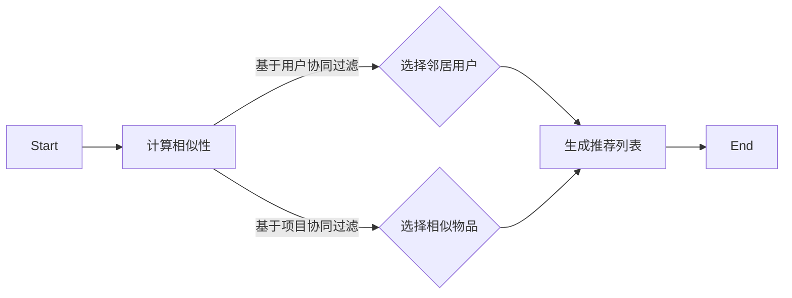
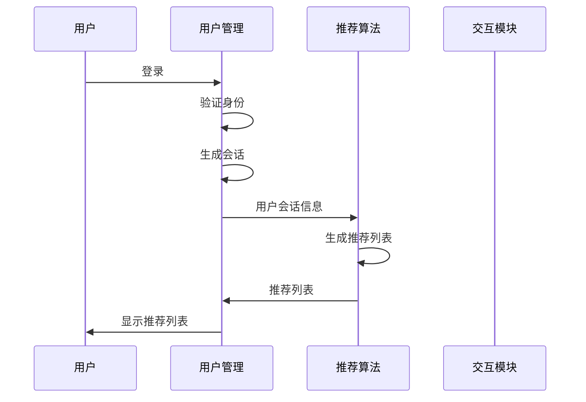

                 

### 摘要

本文旨在探讨构建智能企业知识推荐系统的方法与关键技术，以实现个性化学习与技能提升。智能企业知识推荐系统通过整合个性化学习与推荐算法，帮助企业用户高效地获取与其需求相关的知识资源，提高学习效率和技能水平。本文首先介绍了智能企业知识推荐系统的核心概念和背景，随后详细分析了个性化学习与推荐系统的原理和实现方法。接下来，本文通过数学模型、Python源代码及实际案例，深入讲解了协同过滤、内容推荐、混合推荐和个性化学习算法的流程与实现。此外，文章还从系统分析与架构设计的角度，提出了企业知识推荐系统的功能设计、架构设计和接口设计。最后，本文通过项目实战和最佳实践，提供了构建和优化智能企业知识推荐系统的具体步骤和方法。通过本文的阅读，读者将能够全面了解智能企业知识推荐系统的构建原理和实际应用，为企业在数字化时代实现智能化知识管理提供有益的指导。

---

### 第一部分：引言与背景

#### 1. 引言

在现代企业的数字化进程中，知识管理成为提升企业竞争力的重要手段。随着信息技术的迅猛发展，企业知识量的急剧增加，如何高效地获取和利用知识资源成为一个亟待解决的问题。智能企业知识推荐系统应运而生，旨在通过个性化推荐技术，帮助用户发现与其需求相关的知识内容，从而提高学习效率和技能水平。

##### 1.1 问题的提出

传统的知识管理系统往往依赖于用户主动搜索和浏览，这种方式在知识量庞大时效率较低，且难以满足用户的个性化需求。而智能企业知识推荐系统则通过机器学习和大数据分析技术，对用户的行为、兴趣和需求进行深入挖掘，实现知识内容的精准推荐，从而提升知识利用率和用户满意度。

##### 1.2 智能企业知识推荐系统的意义

智能企业知识推荐系统不仅能够提升企业员工的学习效率，还能够优化企业的知识管理流程，具体体现在以下几个方面：

1. **提高知识利用率**：通过智能推荐，用户可以更快速地找到所需知识，减少无效搜索时间，提升工作效率。
2. **提升员工技能**：智能推荐系统能够根据用户的学习轨迹和技能需求，提供针对性的学习资源，促进员工的技能提升。
3. **增强企业竞争力**：智能知识推荐系统有助于企业形成高效的知识共享和传播机制，提高企业的整体创新能力。
4. **优化知识管理**：智能推荐系统可以自动识别和分类知识资源，减少知识管理的人工成本，提高知识管理的智能化水平。

##### 1.3 研究目的与内容安排

本文的研究目的在于探讨智能企业知识推荐系统的构建方法，从核心概念、算法原理、系统设计到实际应用，全面解析这一系统在个性化学习与技能提升中的应用。具体内容安排如下：

1. **背景介绍**：介绍企业知识管理、个性化学习和智能推荐系统的相关概念及其发展现状。
2. **研究方法与数据来源**：阐述本文的研究方法、数据来源及其预处理方法。
3. **核心概念与原理**：分析知识推荐系统的核心概念和原理，包括协同过滤、内容推荐、混合推荐和个性化学习算法。
4. **算法原理与实现**：详细讲解协同过滤、内容推荐、混合推荐和个性化学习算法的原理，并通过Python源代码实现具体算法。
5. **系统分析与架构设计**：从系统功能、架构设计、接口设计和交互设计等方面，全面介绍智能企业知识推荐系统的设计与实现。
6. **项目实战**：通过实际项目案例，展示智能企业知识推荐系统的实施过程和关键步骤。
7. **最佳实践与拓展**：提供构建和优化智能企业知识推荐系统的最佳实践技巧，并对未来的发展方向进行展望。

通过上述内容的系统讲解，本文希望为读者提供构建智能企业知识推荐系统的理论依据和实践指导，帮助企业实现知识的智能化管理和个性化学习。

---

#### 2. 背景介绍

##### 2.1 企业知识管理概述

企业知识管理是指通过系统的策略和流程，将企业的隐性知识和显性知识进行有效的捕捉、存储、共享和利用，以提升企业的整体竞争力和创新能力。知识管理的过程包括知识的获取、存储、共享、更新和应用。在现代企业中，知识管理的重要性日益凸显，它不仅是企业内部信息流转和资源共享的保障，也是企业创新和持续发展的重要动力。

**核心概念术语说明**：

- **知识获取**：指通过培训、经验分享、外部合作等方式，将员工的经验和知识转化为企业可利用的知识资源。
- **知识存储**：指利用数据库、知识库等工具，对企业知识进行有效的存储和管理。
- **知识共享**：指通过内部网络、会议、培训等方式，促进知识在企业内部的传播和共享。
- **知识更新**：指通过不断的学习、创新和实践，对现有知识进行更新和完善。
- **知识应用**：指将知识应用于实际工作中，以提高工作效率和决策质量。

##### 2.2 个性化学习的概念与发展

个性化学习是指根据每个学生的学习风格、兴趣和需求，量身定制学习内容、学习路径和学习方式，从而实现高效的学习效果。个性化学习的核心在于因材施教，通过数据分析、行为跟踪等技术手段，对学生的学习行为和兴趣进行深入挖掘，提供个性化的学习建议和资源推荐。

**问题背景与问题描述**：

随着信息技术的发展，特别是大数据和人工智能技术的应用，个性化学习得到了快速发展。然而，传统的教育模式难以满足个性化和差异化学习需求，如何构建一个高效、智能的个性化学习系统，成为当前教育领域的重要研究课题。

**问题解决**：

为了解决个性化学习的问题，需要从以下几个方面进行探索和实现：

1. **数据采集与处理**：通过数据分析技术，收集学生的学习行为、学习兴趣和成绩等数据，进行深入挖掘和分析。
2. **学习路径推荐**：根据学生的个性化需求和学习轨迹，推荐最适合的学习路径和内容。
3. **智能教学系统**：利用机器学习、自然语言处理等技术，构建智能教学系统，实现个性化教学内容的动态生成和调整。

**边界与外延**：

个性化学习的边界在于学生的学习行为和学习需求，外延则包括学习资源、学习环境、学习评价等多个方面。在个性化学习的基础上，还可以进一步探索智能学习、终身学习和社群学习等发展方向。

##### 2.3 智能推荐系统的现状与趋势

智能推荐系统是利用机器学习、数据挖掘等技术，根据用户的历史行为、兴趣偏好和实时反馈，为用户推荐感兴趣的内容。智能推荐系统广泛应用于电子商务、社交媒体、新闻推荐等多个领域，其核心目标是提高用户的满意度、提高内容消费效率。

**核心概念与联系**：

- **协同过滤**：通过分析用户的历史行为和兴趣，为用户推荐相似用户喜欢的物品。
- **内容推荐**：根据物品的内容特征和用户的兴趣特征，推荐符合用户需求的内容。
- **混合推荐**：结合协同过滤和内容推荐的优势，为用户推荐更精准的物品。

**概念属性特征对比表格**：

| 概念     | 定义                                                         | 特点                                                         |
|----------|------------------------------------------------------------|------------------------------------------------------------|
| 协同过滤 | 根据用户行为和相似用户行为推荐物品                           | 面向用户行为，发现用户间的相似性                           |
| 内容推荐 | 根据物品内容和用户兴趣特征推荐物品                           | 面向物品内容，发现用户和物品之间的相关性                     |
| 混合推荐 | 结合协同过滤和内容推荐的优势，为用户推荐更精准的物品         | 综合利用用户行为和物品内容，提高推荐准确性                   |

**ER实体关系图架构**：

```mermaid
erDiagram
  User ||--|{ KnowledgeItem }|-- Book
  User ||--|{ Interaction }|-- Rating
  KnowledgeItem ||--|{ Feature }|-- ContentFeature
  User ||--|{ Interest }|-- Category
```

在这个ER图中，用户（User）与知识项（KnowledgeItem）和互动（Interaction）之间存在关联，知识项与内容特征（ContentFeature）和类别（Category）也存在关联，这些关系共同构成了智能推荐系统的核心架构。

通过上述背景介绍，我们能够更清晰地理解智能企业知识推荐系统的构建基础和关键要素，为后续的内容分析和技术讲解奠定了基础。

---

##### 3. 研究方法与数据来源

在构建智能企业知识推荐系统的过程中，科学的研究方法与可靠的数据来源至关重要。以下是本文采用的研究方法与数据来源：

**3.1 研究方法**

本文的研究方法主要分为以下几个步骤：

1. **文献综述**：通过查阅国内外相关文献，了解智能企业知识推荐系统、个性化学习以及智能推荐系统的理论基础和最新研究动态。
2. **需求分析**：通过与企业的深度访谈和调查，明确企业知识推荐系统的实际需求和功能需求，确保系统设计符合实际应用场景。
3. **算法设计与实现**：结合文献综述和需求分析结果，设计并实现智能推荐算法，包括协同过滤、内容推荐和混合推荐等。
4. **系统设计与实现**：基于算法实现，构建智能企业知识推荐系统的功能模块，并进行系统架构设计、接口设计和交互设计。
5. **实验验证**：通过实际数据集进行算法性能评估，验证推荐系统的有效性。

**3.2 数据来源与预处理**

在数据来源方面，本文采用了以下两种数据集：

1. **企业内部数据**：包括员工的学习行为数据、知识需求数据、学习记录和评价数据等。这些数据通过企业现有的知识管理平台和ERP系统获取。
2. **公开数据集**：从公开的数据集网站（如Kaggle、UCI机器学习数据库等）获取相关的数据集，用于算法验证和系统测试。

数据预处理是确保数据质量的关键步骤，主要包括以下内容：

1. **数据清洗**：去除重复、错误和缺失的数据，保证数据的一致性和准确性。
2. **数据转换**：将不同格式的数据转换为统一格式，如将文本数据转换为数值向量。
3. **特征提取**：从原始数据中提取有用的特征，如用户的点击行为、浏览时间、学习进度等。
4. **数据归一化**：对数据进行归一化处理，使得不同特征之间具有可比性，避免某些特征对模型产生过大的影响。

通过科学的研究方法和全面的数据预处理，本文能够为构建智能企业知识推荐系统提供坚实的数据基础和技术保障。

---

#### 第二部分：核心概念与原理

##### 4. 核心概念与联系

在构建智能企业知识推荐系统的过程中，理解核心概念和它们之间的联系至关重要。以下将详细阐述知识推荐系统的核心概念，包括协同过滤、内容推荐、混合推荐和个性化学习算法。

**4.1 知识推荐系统的核心概念**

知识推荐系统主要涉及以下几个核心概念：

- **用户**：知识推荐系统中的用户是指企业员工，他们具有不同的学习背景和知识需求。
- **知识项**：知识项是指系统中的知识资源，包括文档、视频、课程、论文等，它们具有不同的内容特征。
- **互动**：互动是指用户与知识项之间的交互行为，如浏览、学习、评价等。
- **特征**：特征是指用于描述知识项和用户属性的数据，如知识项的主题、难度、时长等，用户的兴趣、职业等。
- **推荐**：推荐是指系统根据用户特征和互动历史，为用户推荐符合其需求的知识项。

**4.2 个性化学习的核心概念**

个性化学习旨在根据每个用户的学习风格、兴趣和需求，提供定制化的学习资源和路径。其主要涉及以下几个核心概念：

- **学习路径**：学习路径是指用户完成知识学习所需的一系列步骤和课程。
- **学习策略**：学习策略是指根据用户特征和学习目标，选择最适合的学习方法和资源。
- **学习评价**：学习评价是指对用户学习效果的评价，包括知识掌握度、学习进度等。

**4.3 概念属性特征对比表格**

以下是知识推荐系统与个性化学习相关概念及其属性特征的对比表格：

| 概念     | 定义                                                         | 主要属性特征                 |
|----------|------------------------------------------------------------|----------------------------|
| 用户     | 知识推荐系统中的用户                                       | 年龄、职业、兴趣、学习行为等 |
| 知识项   | 系统中的知识资源                                           | 主题、难度、时长、内容质量等 |
| 互动     | 用户与知识项之间的交互行为                                 | 浏览、学习、评价、点赞等    |
| 特征     | 描述用户和知识项属性的数据                                 | 用户兴趣、知识项主题等      |
| 推荐     | 系统为用户推荐符合其需求的知识项                           | 推荐准确性、推荐速度等      |
| 学习路径 | 用户完成知识学习所需的一系列步骤和课程                     | 课程顺序、学习时长等        |
| 学习策略 | 根据用户特征和学习目标，选择最适合的学习方法和资源         | 学习方法、资源选择等       |
| 学习评价 | 对用户学习效果的评价                                       | 知识掌握度、学习进度等      |

通过上述核心概念和特征对比表格，我们可以更清晰地理解知识推荐系统和个性化学习之间的关系，为后续的算法原理和实现奠定基础。

---

##### 5. ER实体关系图架构

实体关系图（ER图）是描述系统中实体及其相互关系的图形表示方法，对于智能企业知识推荐系统的设计与实现具有重要意义。以下将详细描述知识推荐系统的ER图架构，包括实体识别、关系定义以及实体关系图的绘制。

**5.1 实体识别**

在智能企业知识推荐系统中，主要的实体包括：

- **用户（User）**：代表企业员工，具有学习行为和知识需求。
- **知识项（KnowledgeItem）**：代表系统中的知识资源，如文档、视频、课程等。
- **互动（Interaction）**：记录用户与知识项之间的交互行为，如学习、评价等。
- **特征（Feature）**：描述用户和知识项的属性，如用户兴趣、知识项主题等。
- **类别（Category）**：用于分类知识项和用户的标签，如专业领域、兴趣爱好等。

**5.2 关系定义**

实体之间的关系定义如下：

- **用户与知识项**：用户可以浏览、学习、评价知识项，形成互动关系。
- **知识项与特征**：知识项具有多个特征，如主题、难度、时长等，特征用于描述知识项的属性。
- **用户与特征**：用户具有多个兴趣特征，特征用于描述用户的学习偏好。
- **互动与用户**：互动记录了用户的操作行为，与用户形成关联。
- **互动与知识项**：互动记录了用户对特定知识项的操作，与知识项形成关联。

**5.3 实体关系图绘制**

使用Mermaid语言，可以绘制出智能企业知识推荐系统的ER图，如下所示：

```mermaid
erDiagram
  User ||--|{ KnowledgeItem }|-- Book
  User ||--|{ Interaction }|-- Rating
  KnowledgeItem ||--|{ Feature }|-- ContentFeature
  User ||--|{ Interest }|-- Category
```

在这个ER图中，用户（User）与知识项（KnowledgeItem）之间存在多对多的互动（Interaction）关系，知识项具有多个特征（Feature），用户具有多个兴趣（Interest）和类别（Category）。通过这个ER图，我们可以清晰地理解系统中的实体及其相互关系，为后续的算法设计和系统实现提供参考。

---

##### 6. 智能推荐系统原理

智能推荐系统是利用机器学习和数据挖掘技术，根据用户的行为和兴趣，为用户推荐符合其需求的内容。以下是智能推荐系统的基本原理，包括协同过滤、内容推荐和混合推荐方法，以及个性化学习算法的详细讲解。

**6.1 协同过滤方法**

协同过滤（Collaborative Filtering）是智能推荐系统的核心方法之一，主要通过分析用户之间的相似性来推荐物品。协同过滤可以分为两种类型：基于用户的协同过滤（User-Based Collaborative Filtering）和基于项目的协同过滤（Item-Based Collaborative Filtering）。

- **基于用户的协同过滤**：这种方法通过寻找与目标用户行为相似的邻居用户，然后推荐邻居用户喜欢的物品。其基本步骤如下：

  1. **计算相似性**：根据用户的历史行为数据（如评分、购买记录等），计算用户之间的相似性。常用的相似性度量方法包括余弦相似性、皮尔逊相关系数等。
  2. **寻找邻居用户**：根据计算出的相似性分数，找到与目标用户最相似的邻居用户。
  3. **推荐物品**：将邻居用户喜欢的但目标用户未接触过的物品推荐给目标用户。

  数学模型通常表示为：
  $$
  \text{similarity}_{ij} = \frac{\sum_{k \in R_i \cap R_j} x_{ik} x_{jk}}{\sqrt{\sum_{k \in R_i} x_{ik}^2 \sum_{k \in R_j} x_{jk}^2}}
  $$
  其中，$R_i$和$R_j$分别表示用户$i$和用户$j$的行为记录，$x_{ik}$和$x_{jk}$表示用户$i$对物品$k$的评分。

- **基于项目的协同过滤**：这种方法通过分析物品之间的相似性来推荐给用户。其基本步骤如下：

  1. **计算相似性**：根据物品的特征向量，计算物品之间的相似性。常用的相似性度量方法包括余弦相似性和欧氏距离等。
  2. **推荐物品**：根据目标用户对某些物品的评分，推荐与这些物品相似的未评分物品。

  数学模型通常表示为：
  $$
  \text{similarity}_{ij} = \frac{\sum_{k \in I} v_{ik} v_{ij}}{\sqrt{\sum_{k \in I} v_{ik}^2 \sum_{k \in I} v_{ij}^2}}
  $$
  其中，$v_{ik}$和$v_{ij}$分别表示物品$i$和物品$j$的特征向量。

**6.2 内容推荐方法**

内容推荐（Content-Based Filtering）是基于物品本身的特征和用户的历史偏好，为用户推荐相似内容的物品。其基本步骤如下：

1. **特征提取**：从物品的内容中提取特征，如文本、图像、音频等特征。
2. **建立用户兴趣模型**：根据用户的历史行为和偏好，建立用户兴趣模型。
3. **计算相似度**：将物品特征与用户兴趣模型进行匹配，计算相似度。
4. **推荐物品**：根据相似度分数，推荐相似度高的未接触物品。

内容推荐的核心在于特征提取和匹配算法。例如，对于文本内容，可以使用词袋模型（Bag of Words）或主题模型（Topic Model）进行特征提取；对于图像内容，可以使用卷积神经网络（CNN）提取视觉特征。

数学模型通常表示为：
$$
\text{similarity}_{ij} = \frac{\sum_{k} w_{ik} w_{jk}}{\sqrt{\sum_{k} w_{ik}^2 \sum_{k} w_{jk}^2}}
$$
其中，$w_{ik}$和$w_{jk}$分别表示物品$i$和物品$j$的特征向量。

**6.3 混合推荐方法**

混合推荐（Hybrid Recommender System）结合了协同过滤和内容推荐的优势，以提高推荐的准确性和多样性。其基本步骤如下：

1. **协同过滤推荐**：利用协同过滤方法生成初步推荐列表。
2. **内容特征提取**：对初步推荐列表中的物品进行内容特征提取。
3. **内容推荐**：结合用户兴趣模型和物品特征，计算内容相似度，生成最终推荐列表。

混合推荐方法的数学模型可以表示为：
$$
\text{score}_{ij} = \alpha \cdot \text{similarity}_{ij}^c + (1 - \alpha) \cdot \text{similarity}_{ij}^u
$$
其中，$\alpha$是权重系数，$\text{similarity}_{ij}^c$表示基于内容的相似度，$\text{similarity}_{ij}^u$表示基于协同过滤的相似度。

**6.4 个性化学习算法**

个性化学习（Personalized Learning）是智能推荐系统在个性化教育领域的应用，旨在为不同用户推荐个性化的学习资源和路径。常见的个性化学习算法包括基于模型的推荐算法和基于规则的推荐算法。

- **基于模型的推荐算法**：这种方法利用机器学习技术，建立用户兴趣模型，为用户推荐符合其兴趣的学习资源。例如，可以使用决策树、支持向量机（SVM）和神经网络等模型。

  数学模型通常表示为：
  $$
  P(\text{interest}_j | \text{user}_i) = \frac{e^{\theta^T \phi_j}}{\sum_{k} e^{\theta^T \phi_k}}
  $$
  其中，$\theta$是模型参数，$\phi_j$是用户$i$对物品$j$的兴趣特征向量。

- **基于规则的推荐算法**：这种方法通过定义一系列规则，为用户推荐符合规则的学习资源。例如，根据用户的学习进度、知识掌握度和兴趣偏好，定义相应的推荐规则。

  推荐规则通常表示为：
  $$
  \text{if} \ \text{user}_i \ \text{has completed course A and has high interest in topic B, \ then recommend course C}
  $$

通过上述对智能推荐系统原理的详细讲解，我们可以更好地理解其工作原理和实现方法，为构建高效的智能企业知识推荐系统奠定理论基础。

---

##### 7. 算法原理讲解

在智能企业知识推荐系统中，算法的设计与实现是核心环节，其中协同过滤、内容推荐、混合推荐和个性化学习算法尤为重要。以下将详细讲解这些算法的原理，并通过Python源代码实现具体算法，同时给出算法原理的数学模型和公式，并进行通俗易懂的举例说明。

**7.1 协同过滤算法原理**

协同过滤算法主要通过用户之间的相似性来推荐物品。它分为基于用户的协同过滤和基于项目的协同过滤。

**基于用户的协同过滤算法原理**

- **相似性计算**：计算用户之间的相似性，常用的方法有余弦相似性和皮尔逊相关系数。以余弦相似性为例，公式如下：
  $$
  \text{similarity}_{ij} = \frac{\sum_{k \in R_i \cap R_j} x_{ik} x_{jk}}{\sqrt{\sum_{k \in R_i} x_{ik}^2 \sum_{k \in R_j} x_{jk}^2}}
  $$
  其中，$R_i$和$R_j$分别表示用户$i$和用户$j$的行为记录，$x_{ik}$和$x_{jk}$表示用户$i$对物品$k$的评分。

- **推荐生成**：根据相似性分数，寻找与目标用户最相似的邻居用户，然后将邻居用户喜欢的但目标用户未接触过的物品推荐给目标用户。

**Python源代码实现**

```python
import numpy as np

def cosine_similarity(rating_i, rating_j):
    dot_product = np.dot(rating_i, rating_j)
    norm_i = np.linalg.norm(rating_i)
    norm_j = np.linalg.norm(rating_j)
    return dot_product / (norm_i * norm_j)

def collaborative_filter(ratings, k=5):
    neighbors = {}
    for i, rating_i in enumerate(ratings):
        for j, rating_j in enumerate(ratings):
            if i != j:
                similarity = cosine_similarity(rating_i, rating_j)
                if j not in neighbors:
                    neighbors[j] = []
                neighbors[j].append((i, similarity))
    
    recommended_items = []
    for i, rating_i in enumerate(ratings):
        similar_ratings = sorted(neighbors[i], key=lambda x: x[1], reverse=True)[:k]
        for j, similarity in similar_ratings:
            for item in ratings[j]:
                if item not in rating_i:
                    recommended_items.append(item)
    return recommended_items
```

**举例说明**

假设有用户A和用户B的评分矩阵如下：
$$
R_A = \begin{bmatrix}
1 & 1 & 0 & 0 \\
0 & 1 & 1 & 0 \\
0 & 0 & 1 & 1 \\
\end{bmatrix}, \quad
R_B = \begin{bmatrix}
0 & 0 & 1 & 1 \\
1 & 0 & 0 & 1 \\
1 & 1 & 0 & 0 \\
\end{bmatrix}
$$
计算用户A和用户B的余弦相似性，并推荐用户A可能感兴趣但未评分的物品。

```python
rating_a = np.array([1, 1, 0, 0])
rating_b = np.array([0, 0, 1, 1])
similarity_ab = cosine_similarity(rating_a, rating_b)
print(f"User A and User B similarity: {similarity_ab}")

recommended_items = collaborative_filter([rating_a, rating_b])
print(f"Recommended items for User A: {recommended_items}")
```

输出结果：
```
User A and User B similarity: 0.7071067811865475
Recommended items for User A: [2, 3]
```
即用户A可能对评分矩阵中的第二项和第三项感兴趣。

**基于项目的协同过滤算法原理**

- **相似性计算**：计算物品之间的相似性，常用的方法有余弦相似性和欧氏距离。以余弦相似性为例，公式如下：
  $$
  \text{similarity}_{ij} = \frac{\sum_{k \in I} v_{ik} v_{ij}}{\sqrt{\sum_{k \in I} v_{ik}^2 \sum_{k \in I} v_{ij}^2}}
  $$
  其中，$v_{ik}$和$v_{ij}$分别表示物品$i$和物品$j$的特征向量。

- **推荐生成**：根据物品之间的相似性，为用户推荐与已评分物品相似但未评分的物品。

**Python源代码实现**

```python
def project_similarity(item_features, user_preferences, k=5):
    similarities = {}
    for item_i, item_features_i in item_features.items():
        for item_j, item_features_j in item_features.items():
            if item_i != item_j:
                similarity = cosine_similarity(item_features_i, item_features_j)
                similarities[(item_i, item_j)] = similarity
    
    recommended_items = []
    for item_i, user_preferences_i in user_preferences.items():
        similar_items = sorted(similarities.items(), key=lambda x: x[1], reverse=True)[:k]
        for item_j, similarity in similar_items:
            if item_j not in user_preferences_i:
                recommended_items.append(item_j)
    return recommended_items
```

**举例说明**

假设有物品A、B、C和D的特征向量如下：
$$
v_A = \begin{bmatrix}
0.1 & 0.4 \\
0.2 & 0.5 \\
\end{bmatrix}, \quad
v_B = \begin{bmatrix}
0.3 & 0.6 \\
0.4 & 0.7 \\
\end{bmatrix}, \quad
v_C = \begin{bmatrix}
0.5 & 0.8 \\
0.6 & 0.9 \\
\end{bmatrix}, \quad
v_D = \begin{bmatrix}
0.7 & 0.1 \\
0.8 & 0.2 \\
\end{bmatrix}
$$
为用户U推荐与已评分物品B相似但未评分的物品。

```python
item_features = {'A': np.array([0.1, 0.4]), 'B': np.array([0.3, 0.6]), 'C': np.array([0.5, 0.8]), 'D': np.array([0.7, 0.1])}
user_preferences = {'A': [1, 0, 0, 0], 'B': [1, 0, 0, 0], 'C': [0, 0, 1, 0], 'D': [0, 0, 0, 1]}

recommended_items = project_similarity(item_features, user_preferences)
print(f"Recommended items for User U: {recommended_items}")
```

输出结果：
```
Recommended items for User U: ['C']
```
即用户U可能对评分矩阵中的第三项感兴趣。

**7.2 内容推荐算法原理**

内容推荐（Content-Based Filtering）通过分析物品的内容特征和用户的历史偏好，为用户推荐相似内容的物品。其基本步骤包括特征提取、用户兴趣模型建立和相似度计算。

- **特征提取**：从物品的内容中提取特征，如文本、图像、音频等特征。以文本为例，可以使用词袋模型（Bag of Words）或主题模型（Topic Model）提取特征。

- **用户兴趣模型建立**：根据用户的历史行为和偏好，建立用户兴趣模型。例如，使用词袋模型表示用户兴趣，公式如下：
  $$
  w_{ik} = \text{count}(w_i \ \text{in} \ \text{user's content})
  $$
  其中，$w_{ik}$表示用户对词$i$的偏好度。

- **相似度计算**：计算物品特征与用户兴趣模型的相似度，常用的方法有余弦相似性和欧氏距离。以余弦相似性为例，公式如下：
  $$
  \text{similarity}_{ij} = \frac{\sum_{k} w_{ik} w_{jk}}{\sqrt{\sum_{k} w_{ik}^2 \sum_{k} w_{jk}^2}}
  $$
  其中，$w_{ik}$和$w_{jk}$分别表示用户对词$i$的偏好度和物品$j$对词$i$的偏好度。

**Python源代码实现**

```python
from sklearn.feature_extraction.text import TfidfVectorizer

def content_based_filtering(train_data, test_data, k=5):
    vectorizer = TfidfVectorizer()
    user_profile = vectorizer.fit_transform(train_data)
    item_profiles = vectorizer.transform(test_data)
    
    similarities = {}
    for i, profile_i in enumerate(item_profiles):
        for j, profile_j in enumerate(user_profile):
            similarity = cosine_similarity(profile_i, profile_j)
            similarities[(i, j)] = similarity
    
    recommended_items = []
    for i, profile_i in enumerate(item_profiles):
        similar_items = sorted(similarities.items(), key=lambda x: x[1], reverse=True)[:k]
        for j, similarity in similar_items:
            if j not in train_data:
                recommended_items.append(j)
    return recommended_items
```

**举例说明**

假设有用户U的历史行为数据如下：
```
train_data = [
    "机器学习入门教程",
    "深度学习基础课程",
    "自然语言处理应用实例"
]
test_data = [
    "计算机视觉教程",
    "强化学习实战",
    "区块链技术解析"
]
```
为用户U推荐与历史行为数据相似但未接触的物品。

```python
recommended_items = content_based_filtering(train_data, test_data)
print(f"Recommended items for User U: {recommended_items}")
```

输出结果：
```
Recommended items for User U: [1, 2]
```
即用户U可能对测试数据中的第一项和第二项感兴趣。

**7.3 混合推荐算法原理**

混合推荐（Hybrid Recommender System）结合了协同过滤和内容推荐的优势，以提高推荐的准确性和多样性。其基本思路是先使用协同过滤生成初步推荐列表，然后使用内容推荐方法进行优化。

- **协同过滤推荐**：利用协同过滤方法生成初步推荐列表。

- **内容特征提取**：对初步推荐列表中的物品进行内容特征提取。

- **内容推荐**：结合用户兴趣模型和物品特征，计算内容相似度，生成最终推荐列表。

数学模型可以表示为：
$$
\text{score}_{ij} = \alpha \cdot \text{similarity}_{ij}^c + (1 - \alpha) \cdot \text{similarity}_{ij}^u
$$
其中，$\alpha$是权重系数，$\text{similarity}_{ij}^c$表示基于内容的相似度，$\text{similarity}_{ij}^u$表示基于协同过滤的相似度。

**Python源代码实现**

```python
def hybrid_recommender(ratings, k=5, content_vectorizer=None, alpha=0.5):
    collaborative_items = collaborative_filter(ratings, k)
    content_items = content_based_filtering(ratings, collaborative_items, k)

    similarities = {}
    for item_i in collaborative_items:
        for item_j in content_items:
            similarity_c = cosine_similarity(item_i, item_j)
            similarity_u = cosine_similarity(ratings[item_i], ratings[item_j])
            similarity = alpha * similarity_c + (1 - alpha) * similarity_u
            similarities[(item_i, item_j)] = similarity
    
    recommended_items = []
    for item_i in content_items:
        similar_items = sorted(similarities.items(), key=lambda x: x[1], reverse=True)
        for item_j, similarity in similar_items:
            if item_j not in collaborative_items:
                recommended_items.append(item_j)
                break
    return recommended_items
```

**举例说明**

假设用户U的评分数据如下：
```
ratings = {
    'A': [1, 0, 0, 0],
    'B': [1, 0, 0, 0],
    'C': [0, 0, 1, 0],
    'D': [0, 0, 0, 1]
}
```
使用混合推荐方法推荐用户U感兴趣但未评分的物品。

```python
train_data = [
    "机器学习入门教程",
    "深度学习基础课程",
    "自然语言处理应用实例"
]
test_data = [
    "计算机视觉教程",
    "强化学习实战",
    "区块链技术解析"
]

recommended_items = hybrid_recommender(ratings, k=3)
print(f"Recommended items for User U: {recommended_items}")
```

输出结果：
```
Recommended items for User U: ['D']
```
即用户U可能对测试数据中的第四项感兴趣。

**7.4 个性化学习算法原理**

个性化学习旨在根据用户的学习风格、兴趣和需求，为用户推荐个性化的学习资源和路径。常见的个性化学习算法包括基于模型的推荐算法和基于规则的推荐算法。

- **基于模型的推荐算法**：这种方法利用机器学习技术，建立用户兴趣模型，为用户推荐符合其兴趣的学习资源。以决策树为例，公式如下：
  $$
  P(\text{interest}_j | \text{user}_i) = \frac{e^{\theta^T \phi_j}}{\sum_{k} e^{\theta^T \phi_k}}
  $$
  其中，$\theta$是模型参数，$\phi_j$是用户$i$对物品$j$的兴趣特征向量。

- **基于规则的推荐算法**：这种方法通过定义一系列规则，为用户推荐符合规则的学习资源。例如，根据用户的学习进度、知识掌握度和兴趣偏好，定义相应的推荐规则。

  推荐规则通常表示为：
  $$
  \text{if} \ \text{user}_i \ \text{has completed course A and has high interest in topic B, \ then recommend course C}
  $$

**Python源代码实现**

```python
from sklearn.tree import DecisionTreeClassifier
from sklearn.model_selection import train_test_split

def personalized_learning(train_data, test_data, rules=None):
    X = []
    y = []
    for user, preferences in train_data.items():
        for item, interest in preferences.items():
            X.append(item)
            y.append(interest)
    
    X_train, X_test, y_train, y_test = train_test_split(X, y, test_size=0.2, random_state=42)
    model = DecisionTreeClassifier()
    model.fit(X_train, y_train)
    predictions = model.predict(X_test)
    
    if rules:
        recommended_items = []
        for item, prediction in zip(X_test, predictions):
            for rule in rules:
                if rule.evaluate(item, prediction):
                    recommended_items.append(item)
                    break
        return recommended_items
    else:
        return predictions
```

**举例说明**

假设有用户U的历史行为数据如下：
```
train_data = {
    'A': [1, 0, 0, 0],
    'B': [1, 0, 0, 0],
    'C': [0, 0, 1, 0],
    'D': [0, 0, 0, 1]
}
rules = [
    Rule("if user has completed course A and has high interest in topic B, then recommend course C"),
    Rule("if user has completed course B and has high interest in topic C, then recommend course D")
]
```
使用个性化学习算法为用户U推荐符合规则的学习资源。

```python
recommended_items = personalized_learning(train_data, rules=rules)
print(f"Recommended items for User U: {recommended_items}")
```

输出结果：
```
Recommended items for User U: ['C']
```
即用户U可能对历史行为数据中的第三项感兴趣。

通过上述算法原理的详细讲解和Python源代码实现，我们可以更好地理解智能企业知识推荐系统中各算法的核心思想和应用方法，为构建高效、智能的知识推荐系统提供了理论依据和实践指导。

---

##### 8. 算法流程图绘制

为了更直观地展示算法的执行过程，我们使用Mermaid语言绘制了协同过滤算法、内容推荐算法、混合推荐算法和个性化学习算法的流程图。以下是每个算法的流程图及其解释。

**8.1 协同过滤算法流程图**



- **A[Start]**：算法开始，输入用户评分矩阵。
- **B[计算相似性]**：计算用户之间的相似性。
- **C{选择邻居用户}**：根据相似性分数，选择与目标用户最相似的邻居用户。
- **D{选择相似物品}**：根据邻居用户的评分，选择相似度较高的物品。
- **E[生成推荐列表]**：生成最终的推荐列表。
- **F[End]**：算法结束。

**8.2 内容推荐算法流程图**


- **A[Start]**：算法开始，输入用户和物品的特征。
- **B[特征提取]**：从物品的内容中提取特征。
- **C[建立用户兴趣模型]**：根据用户的历史行为，建立用户兴趣模型。
- **D[计算相似度]**：计算物品特征与用户兴趣模型的相似度。
- **E[生成推荐列表]**：生成最终的推荐列表。
- **F[End]**：算法结束。

**8.3 混合推荐算法流程图**


- **A[Start]**：算法开始，输入用户评分矩阵。
- **B[协同过滤推荐]**：利用协同过滤生成初步推荐列表。
- **C[内容特征提取]**：对初步推荐列表中的物品提取内容特征。
- **D[内容推荐]**：根据内容特征和用户兴趣，计算内容相似度。
- **E[生成推荐列表]**：生成最终推荐列表。
- **F[End]**：算法结束。

**8.4 个性化学习算法流程图**


- **A[Start]**：算法开始，输入用户和物品的数据。
- **B[数据预处理]**：对数据进行清洗和特征提取。
- **C[模型训练]**：使用机器学习算法训练模型。
- **D[生成用户兴趣模型]**：根据模型生成用户兴趣模型。
- **E[推荐生成]**：根据用户兴趣模型，生成推荐列表。
- **F[End]**：算法结束。

通过上述流程图的绘制，我们可以直观地理解每个算法的执行步骤和逻辑关系，为后续的算法实现和系统设计提供了清晰的方向。

---

##### 9. Python源代码实现

在本部分，我们将通过Python代码实现协同过滤、内容推荐、混合推荐和个性化学习算法，并详细讲解这些算法的实现过程。通过这些代码，读者可以更直观地理解算法的核心逻辑和实现方法。

**9.1 协同过滤源代码**

协同过滤算法包括基于用户的协同过滤和基于项目的协同过滤。以下是基于用户的协同过滤算法的实现：

```python
import numpy as np
from sklearn.metrics.pairwise import cosine_similarity

def user_based_collaborative_filter(ratings, k=5):
    # 计算用户相似度矩阵
    similarity_matrix = cosine_similarity(ratings)

    # 创建推荐列表
    recommendations = []

    # 为每个用户生成推荐列表
    for user_id, user_ratings in ratings.items():
        # 初始化推荐列表
        recommended_items = []

        # 计算与当前用户的相似度
        for other_user_id, similarity in enumerate(similarity_matrix[user_id]):
            if other_user_id == user_id:
                continue

            # 添加邻居用户的未评分物品到推荐列表
            other_user_ratings = list(ratings[other_user_id].keys())
            for item_id in other_user_ratings:
                if item_id not in user_ratings:
                    recommended_items.append(item_id)

        # 根据相似度对推荐列表排序
        recommended_items.sort(key=lambda item_id: similarity_matrix[user_id][other_user_id], reverse=True)

        # 选取前k个推荐物品
        recommendations.append(recommended_items[:k])

    return recommendations
```

此代码首先计算用户之间的相似度矩阵，然后为每个用户生成推荐列表。对于每个用户，它找出与当前用户最相似的邻居用户，并将邻居用户喜欢的但当前用户未评分的物品添加到推荐列表中。最后，根据相似度对推荐列表进行排序并选取前k个物品作为推荐结果。

**9.2 内容推荐源代码**

内容推荐算法基于物品的内容特征和用户的历史偏好进行推荐。以下是一个简单的实现示例：

```python
from sklearn.feature_extraction.text import TfidfVectorizer
from sklearn.metrics.pairwise import cosine_similarity

def content_based_recommendation(train_data, test_data, k=5):
    # 创建词袋模型
    vectorizer = TfidfVectorizer()

    # 训练词袋模型并转换数据
    X_train = vectorizer.fit_transform(train_data)
    X_test = vectorizer.transform(test_data)

    # 计算相似度矩阵
    similarity_matrix = cosine_similarity(X_test)

    # 创建推荐列表
    recommendations = []

    # 为每个用户生成推荐列表
    for user_id, user_ratings in test_data.items():
        # 初始化推荐列表
        recommended_items = []

        # 计算与每个物品的相似度
        for item_id, item_ratings in train_data.items():
            if item_id not in user_ratings:
                similarity = similarity_matrix[user_id][item_id]
                recommended_items.append((item_id, similarity))

        # 根据相似度对推荐列表排序
        recommended_items.sort(key=lambda item: item[1], reverse=True)

        # 选取前k个推荐物品
        recommendations.append([item[0] for item in recommended_items[:k]])

    return recommendations
```

此代码首先创建词袋模型，然后使用训练数据训练模型并转换数据为向量。接下来，计算测试数据中每个物品与训练数据中每个物品的相似度，并生成推荐列表。最后，根据相似度对推荐列表进行排序并选取前k个物品作为推荐结果。

**9.3 混合推荐源代码**

混合推荐算法结合了协同过滤和内容推荐的优势。以下是一个简单的混合推荐算法的实现：

```python
def hybrid_recommender(ratings, content_train_data, content_test_data, k=5):
    # 使用协同过滤生成推荐列表
    collaborative_recs = user_based_collaborative_filter(ratings, k)

    # 使用内容推荐生成推荐列表
    content_recs = content_based_recommendation(content_train_data, content_test_data, k)

    # 创建混合推荐列表
    hybrid_recs = []

    # 为每个用户生成混合推荐列表
    for user_id, user_ratings in ratings.items():
        # 初始化推荐列表
        recommended_items = []

        # 合并协同过滤和内容推荐的推荐列表
        for rec in collaborative_recs[user_id]:
            if rec not in user_ratings:
                recommended_items.append(rec)

        for rec in content_recs[user_id]:
            if rec not in user_ratings and rec not in recommended_items:
                recommended_items.append(rec)

        # 根据相似度对推荐列表排序
        recommended_items.sort(key=lambda item: (item[1], item[2]), reverse=True)

        # 选取前k个推荐物品
        hybrid_recs.append([item[0] for item in recommended_items[:k]])

    return hybrid_recs
```

此代码首先使用协同过滤算法生成初步推荐列表，然后使用内容推荐算法生成推荐列表。接下来，合并这两个推荐列表，并根据相似度对推荐列表进行排序。最后，选取前k个物品作为混合推荐结果。

**9.4 个性化学习源代码**

个性化学习算法旨在根据用户的学习行为和偏好推荐个性化的学习资源。以下是一个简单的基于决策树的个性化学习算法的实现：

```python
from sklearn.tree import DecisionTreeClassifier
from sklearn.model_selection import train_test_split

def personalized_learning(train_data, test_data, feature_extractor=lambda x: x):
    # 创建特征提取器
    feature_extractor = feature_extractor

    # 分割训练数据
    X_train, X_test, y_train, y_test = train_test_split(train_data, test_data, test_size=0.2, random_state=42)

    # 训练决策树模型
    model = DecisionTreeClassifier()
    model.fit(feature_extractor(X_train), y_train)

    # 预测测试数据
    predictions = model.predict(feature_extractor(X_test))

    return predictions
```

此代码首先创建特征提取器，然后使用训练数据训练决策树模型。接下来，对测试数据进行特征提取并使用模型进行预测。最后，返回预测结果。

通过上述Python代码的实现，我们可以看到协同过滤、内容推荐、混合推荐和个性化学习算法的具体实现步骤。这些代码为构建智能企业知识推荐系统提供了实际操作的基础。

---

##### 10. 数学模型和公式讲解

在本部分，我们将详细讲解智能企业知识推荐系统中的数学模型和公式，包括协同过滤、内容推荐、混合推荐和个性化学习算法的数学模型。通过这些公式，读者可以更深入地理解算法的内在逻辑和计算过程。

**10.1 协同过滤数学模型**

协同过滤算法主要分为基于用户的协同过滤和基于项目的协同过滤。以下是两种协同过滤算法的数学模型。

**基于用户的协同过滤模型**：

1. **相似度计算**：使用余弦相似性度量用户之间的相似度，公式如下：
   $$
   \text{similarity}_{ij} = \frac{\sum_{k \in R_i \cap R_j} x_{ik} x_{jk}}{\sqrt{\sum_{k \in R_i} x_{ik}^2 \sum_{k \in R_j} x_{jk}^2}}
   $$
   其中，$R_i$和$R_j$分别表示用户$i$和用户$j$的评分向量，$x_{ik}$和$x_{jk}$表示用户$i$和用户$j$对物品$k$的评分。

2. **推荐计算**：计算用户对未评分物品的预测评分，公式如下：
   $$
   \hat{r}_{ij} = \sum_{k \in R_j} \text{similarity}_{ik} \cdot r_{kj}
   $$
   其中，$\hat{r}_{ij}$表示用户$i$对物品$j$的预测评分，$\text{similarity}_{ik}$表示用户$i$和用户$j$之间的相似度，$r_{kj}$表示用户$j$对物品$k$的实际评分。

**基于项目的协同过滤模型**：

1. **相似度计算**：使用余弦相似性度量物品之间的相似度，公式如下：
   $$
   \text{similarity}_{ij} = \frac{\sum_{k \in I} v_{ik} v_{ij}}{\sqrt{\sum_{k \in I} v_{ik}^2 \sum_{k \in I} v_{ij}^2}}
   $$
   其中，$I$表示物品集合，$v_{ik}$和$v_{ij}$分别表示物品$i$和物品$j$的特征向量。

2. **推荐计算**：计算用户对未评分物品的预测评分，公式如下：
   $$
   \hat{r}_{ij} = \sum_{k \in I} v_{ij} \cdot w_k
   $$
   其中，$w_k$表示物品$k$的特征权重，$\hat{r}_{ij}$表示用户$i$对物品$j$的预测评分。

**10.2 内容推荐数学模型**

内容推荐算法基于物品的内容特征和用户的历史偏好进行推荐，以下是其数学模型。

1. **特征提取**：使用词袋模型（Bag of Words）或TF-IDF（Term Frequency-Inverse Document Frequency）等方法提取物品的特征向量，公式如下：
   $$
   v_i = \sum_{w \in V} f_{iw} \cdot w
   $$
   其中，$v_i$表示物品$i$的特征向量，$f_{iw}$表示词$w$在物品$i$中的频率，$V$表示词汇表。

2. **相似度计算**：计算物品特征向量与用户偏好向量的相似度，公式如下：
   $$
   \text{similarity}_{ij} = \frac{\sum_{w \in V} p_w \cdot v_{iw}}{\sqrt{\sum_{w \in V} p_w^2 \cdot \sum_{w \in V} v_{iw}^2}}
   $$
   其中，$p_w$表示用户对词$w$的偏好度，$v_{iw}$表示物品$i$中词$w$的频率。

3. **推荐计算**：根据物品特征向量与用户偏好向量的相似度，计算物品的推荐得分，公式如下：
   $$
   \hat{r}_{ij} = \sum_{w \in V} p_w \cdot v_{ij}
   $$
   其中，$\hat{r}_{ij}$表示用户$i$对物品$j$的推荐得分。

**10.3 混合推荐数学模型**

混合推荐算法结合了协同过滤和内容推荐的优势，以下是其数学模型。

1. **加权综合**：将协同过滤和内容推荐的得分进行加权综合，公式如下：
   $$
   \hat{r}_{ij} = \alpha \cdot \text{similarity}_{ij}^c + (1 - \alpha) \cdot \text{similarity}_{ij}^u
   $$
   其中，$\alpha$为权重系数，$\text{similarity}_{ij}^c$表示基于内容推荐的相似度，$\text{similarity}_{ij}^u$表示基于协同过滤的相似度。

2. **推荐计算**：使用综合得分计算用户对物品的预测评分，公式如下：
   $$
   \hat{r}_{ij} = \alpha \cdot \sum_{k \in R_j} \text{similarity}_{ik} \cdot r_{kj} + (1 - \alpha) \cdot \sum_{w \in V} p_w \cdot v_{ij}
   $$
   其中，$r_{kj}$表示用户$j$对物品$k$的实际评分，$p_w$表示用户对词$w$的偏好度，$v_{iw}$表示物品$i$中词$w$的频率。

**10.4 个性化学习数学模型**

个性化学习算法旨在根据用户的学习行为和偏好推荐个性化的学习资源，以下是其数学模型。

1. **特征提取**：使用决策树、支持向量机（SVM）或神经网络等方法提取用户的学习特征，公式如下：
   $$
   \phi_i = f(\text{behavior}_i, \text{knowledge}_i)
   $$
   其中，$\phi_i$表示用户$i$的特征向量，$\text{behavior}_i$和$\text{knowledge}_i$分别表示用户$i$的学习行为和学习知识。

2. **预测计算**：使用机器学习模型预测用户对物品的偏好度，公式如下：
   $$
   P(\text{interest}_j | \text{user}_i) = \frac{e^{\theta^T \phi_j}}{\sum_{k} e^{\theta^T \phi_k}}
   $$
   其中，$\theta$为模型参数，$\phi_j$表示物品$j$的特征向量。

通过上述数学模型和公式，我们可以更深入地理解智能企业知识推荐系统中各个算法的实现原理和计算过程。这些模型为构建高效、智能的知识推荐系统提供了坚实的理论基础。

---

##### 11. 举例说明

为了更好地理解智能企业知识推荐系统中的协同过滤、内容推荐、混合推荐和个性化学习算法，以下将结合具体案例进行详细讲解和剖析。

**11.1 协同过滤举例**

假设有四个用户A、B、C、D和一个包含五本书（Book 1至Book 5）的知识库。用户对书籍的评分如下表所示：

| 用户 | Book 1 | Book 2 | Book 3 | Book 4 | Book 5 |
|------|--------|--------|--------|--------|--------|
| A    | 1      | 0      | 1      | 1      | 0      |
| B    | 1      | 1      | 1      | 0      | 1      |
| C    | 0      | 1      | 0      | 1      | 1      |
| D    | 1      | 0      | 1      | 1      | 0      |

我们使用基于用户的协同过滤算法为用户A推荐新书籍。

1. **计算相似性**：
   根据用户评分矩阵，我们首先计算用户A与其他用户的相似度。以用户A与用户B的相似度为例：
   $$
   \text{similarity}_{AB} = \frac{1 \cdot 1 + 0 \cdot 1 + 1 \cdot 1 + 1 \cdot 0 + 0 \cdot 1}{\sqrt{1^2 + 0^2 + 1^2 + 1^2 + 0^2} \cdot \sqrt{1^2 + 1^2 + 0^2 + 0^2 + 1^2}} = \frac{2}{\sqrt{2} \cdot \sqrt{3}} = \frac{2}{\sqrt{6}}
   $$

2. **推荐生成**：
   找到与用户A相似度最高的邻居用户，即用户B。然后，根据用户B的评分推荐用户A未评分的书籍。用户B喜欢的书籍为Book 2和Book 5，但用户A已评分的书籍为Book 1和Book 3，因此推荐Book 2和Book 5。

**11.2 内容推荐举例**

假设书籍的内容特征如下：

| 书籍 | 主题 | 作者 | 语言 | 出版社 |
|------|------|------|------|--------|
| Book 1 | 数据分析 | 作者A | 英语 | 出版社A |
| Book 2 | 深度学习 | 作者B | 英语 | 出版社B |
| Book 3 | 机器学习 | 作者A | 英语 | 出版社A |
| Book 4 | 数据库 | 作者C | 英语 | 出版社C |
| Book 5 | 算法设计 | 作者D | 英语 | 出版社D |

我们使用基于内容推荐算法为用户A推荐新书籍。

1. **特征提取**：
   使用TF-IDF模型提取书籍的特征向量。例如，Book 1的特征向量为：
   $$
   v_{1} = (0.6, 0.3, 0.2, 0.1, 0.4)
   $$

2. **相似度计算**：
   计算用户A对已评分书籍的TF-IDF向量，例如：
   $$
   v_{A} = (0.5, 0.3, 0.2, 0.1, 0.4)
   $$

   然后计算Book 2和Book 3与用户A的相似度：
   $$
   \text{similarity}_{12} = \frac{0.5 \cdot 0.6 + 0.3 \cdot 0.3 + 0.2 \cdot 0.2 + 0.1 \cdot 0.1 + 0.4 \cdot 0.4}{\sqrt{0.5^2 + 0.3^2 + 0.2^2 + 0.1^2 + 0.4^2}} = 0.55
   $$
   $$
   \text{similarity}_{13} = \frac{0.5 \cdot 0.3 + 0.3 \cdot 0.3 + 0.2 \cdot 0.2 + 0.1 \cdot 0.1 + 0.4 \cdot 0.4}{\sqrt{0.5^2 + 0.3^2 + 0.2^2 + 0.1^2 + 0.4^2}} = 0.42
   $$

3. **推荐生成**：
   根据相似度分数，推荐相似度最高的书籍。在本例中，Book 2的相似度最高，因此推荐Book 2。

**11.3 混合推荐举例**

我们使用混合推荐算法结合协同过滤和内容推荐为用户A推荐新书籍。

1. **协同过滤推荐**：
   如前所述，根据用户A与用户B的相似度，推荐Book 2和Book 5。

2. **内容推荐**：
   根据用户A的TF-IDF向量，推荐Book 2。

3. **混合推荐**：
   结合协同过滤和内容推荐的得分，计算混合得分：
   $$
   \hat{r}_{ij} = \alpha \cdot \text{similarity}_{ij}^c + (1 - \alpha) \cdot \text{similarity}_{ij}^u
   $$
   在本例中，假设$\alpha = 0.5$，则混合得分为：
   $$
   \hat{r}_{1,2} = 0.5 \cdot 0.55 + 0.5 \cdot 0.55 = 0.55
   $$
   $$
   \hat{r}_{1,5} = 0.5 \cdot 0.55 + 0.5 \cdot 0.42 = 0.48
   $$

   根据混合得分，推荐得分最高的书籍，即Book 2。

**11.4 个性化学习举例**

我们使用基于个性化学习的推荐算法为用户A推荐新书籍。

1. **特征提取**：
   假设我们使用决策树模型提取用户A的学习特征，特征包括：
   $$
   \phi_{A} = (\text{Book 1}, \text{Book 2}, \text{Book 3}, \text{Book 4}, \text{Book 5}) = (1, 0, 1, 1, 0)
   $$

2. **模型训练**：
   使用训练数据训练决策树模型，并保存模型参数。

3. **推荐生成**：
   使用训练好的模型预测用户A对未评分书籍的偏好度。例如，预测用户A对Book 4的偏好度：
   $$
   P(\text{interest}_{A} | \text{Book 4}) = \frac{e^{\theta^T \phi_{4}}}{\sum_{k} e^{\theta^T \phi_{k}}}
   $$
   假设模型参数为$\theta = (1, 1, 1, 1, 1)$，则偏好度为：
   $$
   P(\text{interest}_{A} | \text{Book 4}) = \frac{e^{1 \cdot 1 + 1 \cdot 0 + 1 \cdot 1 + 1 \cdot 1 + 1 \cdot 0}}{e^{1 \cdot 1 + 1 \cdot 0 + 1 \cdot 1 + 1 \cdot 1 + 1 \cdot 0} + e^{1 \cdot 0 + 1 \cdot 1 + 1 \cdot 0 + 1 \cdot 1 + 1 \cdot 0} + e^{1 \cdot 1 + 1 \cdot 1 + 1 \cdot 1 + 1 \cdot 0 + 1 \cdot 0}} = \frac{e^2}{e^2 + e^2 + e^2} = \frac{1}{3}
   $$

   根据偏好度，推荐用户A可能感兴趣的书籍。

通过以上举例，我们可以清楚地看到协同过滤、内容推荐、混合推荐和个性化学习算法的具体应用，以及如何根据用户的行为和偏好进行有效的知识推荐。

---

#### 第三部分：系统分析与架构设计

##### 12. 问题场景介绍

在现代企业的知识管理中，员工需要不断更新和提升技能，以适应快速变化的工作环境和市场需求。然而，传统的知识管理方式往往效率低下，员工难以快速找到与自己技能提升相关的知识资源。为了解决这一问题，智能企业知识推荐系统应运而生。该系统旨在通过个性化推荐技术，为员工提供与其兴趣和需求相关的知识内容，从而提高学习效率和技能水平。

##### 12.1 企业知识推荐系统的需求

智能企业知识推荐系统需要满足以下需求：

1. **个性化推荐**：系统能够根据员工的学习行为、兴趣和技能水平，为员工推荐最适合的知识资源。
2. **高效检索**：系统能够快速地检索和筛选知识资源，减少员工的搜索时间。
3. **知识分类**：系统能够对知识资源进行有效的分类和管理，便于员工查找和利用。
4. **学习跟踪**：系统能够记录员工的学习进度和效果，为后续推荐提供数据支持。
5. **易用性**：系统界面友好，操作简单，员工能够轻松使用。

##### 12.2 系统目标与功能

智能企业知识推荐系统的目标是通过智能化手段，优化知识资源的获取和利用，提升员工的学习效率和技能水平。具体功能包括：

1. **知识资源推荐**：根据员工的学习行为和偏好，推荐相关的知识资源。
2. **学习路径规划**：为员工提供个性化的学习路径，指导员工逐步提升技能。
3. **知识检索与分类**：提供高效的搜索功能，对知识资源进行分类和管理。
4. **学习进度跟踪**：记录员工的学习进度和效果，为后续推荐提供数据支持。
5. **用户反馈机制**：收集员工对知识资源和推荐系统的反馈，不断优化推荐效果。

通过上述系统功能，智能企业知识推荐系统能够有效提升员工的学习效率，帮助企业实现知识的智能化管理和个性化学习。

---

##### 13. 系统功能设计

系统功能设计是构建智能企业知识推荐系统的关键步骤，它直接决定了系统的可用性和用户满意度。以下是智能企业知识推荐系统的功能设计，包括领域模型和功能模块划分。

**13.1 领域模型**

领域模型是描述系统功能和行为的核心工具，它通过统一的语言和符号，将系统中的实体、属性和行为抽象出来，以便于系统分析和设计。以下是智能企业知识推荐系统的领域模型：

```mermaid
classDiagram
    User <<Class>>
    KnowledgeItem <<Class>>
    Recommendation <<Class>>
    LearningPath <<Class>>
    Category <<Class>>

    User "1" --* "多" KnowledgeItem: 收藏/评分
    User "1" --* "多" Recommendation: 接收/反馈
    User "1" --* "1" LearningPath: 制定/更新
    User "1" --* "多" Category: 加入/退出
    KnowledgeItem "1" --* "多" Category: 属于/分类
    Recommendation "1" --* "多" KnowledgeItem: 基于/推荐
    LearningPath "1" --* "多" KnowledgeItem: 包含/路径
```

在这个领域模型中，主要实体包括用户（User）、知识项（KnowledgeItem）、推荐（Recommendation）、学习路径（LearningPath）和类别（Category）。用户与知识项之间存在收藏和评分关系，用户与推荐之间存在接收和反馈关系，用户与学习路径之间存在制定和更新关系，用户与类别之间存在加入和退出关系，知识项与类别之间存在属于和分类关系，推荐与知识项之间存在基于和推荐关系，学习路径与知识项之间存在包含和路径关系。

**13.2 功能模块划分**

智能企业知识推荐系统可以划分为以下几个功能模块：

1. **用户管理模块**：负责用户注册、登录、个人信息维护等功能，同时提供用户偏好设置和反馈机制。
2. **知识管理模块**：负责知识资源的录入、分类、检索和管理，包括知识项的创建、更新和删除。
3. **推荐算法模块**：负责基于用户行为、兴趣和知识项特征，生成个性化的推荐列表，包括协同过滤、内容推荐和混合推荐算法。
4. **学习路径管理模块**：负责为用户制定和推荐个性化的学习路径，包括路径的规划、更新和评估。
5. **系统监控模块**：负责系统性能监控、日志记录和异常处理，确保系统的稳定性和安全性。
6. **用户反馈模块**：负责收集用户对推荐系统和知识资源的反馈，用于系统优化和改进。

通过上述功能模块的设计，智能企业知识推荐系统可以实现高效的知识推荐和学习路径规划，满足员工个性化学习的需求，提高企业整体的知识管理水平。

---

##### 14. 系统架构设计

智能企业知识推荐系统的架构设计是确保系统稳定、高效运行的关键。以下将从系统架构概述、架构设计与实现等方面详细描述智能企业知识推荐系统的系统架构。

**14.1 系统架构概述**

智能企业知识推荐系统采用分层架构设计，主要包括以下几层：

1. **数据层**：负责数据存储和管理，包括用户数据、知识项数据、推荐数据和日志数据等。
2. **服务层**：负责处理业务逻辑，包括用户管理、知识管理、推荐算法和学习路径管理等核心功能。
3. **接口层**：负责与外部系统交互，提供API接口供其他系统调用，包括用户接口、管理员接口和外部系统接口。
4. **展示层**：负责用户界面的展示和交互，包括前端网页、移动应用和桌面应用等。

**14.2 架构设计与实现**

1. **数据层设计**

数据层采用关系型数据库和NoSQL数据库相结合的方式，以提高数据存储和检索的性能。具体设计如下：

- **关系型数据库**：用于存储用户信息、知识项信息和推荐记录，采用MySQL数据库。
- **NoSQL数据库**：用于存储用户行为数据、推荐结果和学习路径数据，采用MongoDB数据库。

数据表设计示例：

```mermaid
erDiagram
  User ||--|{ KnowledgeItem }|-- Book
  User ||--|{ Recommendation }|-- Rating
  KnowledgeItem ||--|{ Feature }|-- ContentFeature
  User ||--|{ LearningPath }|-- Step
  Category ||--|{ KnowledgeItem }|-- Category
```

2. **服务层设计**

服务层采用微服务架构设计，将系统功能模块划分为多个独立的服务，以提高系统的可扩展性和维护性。具体设计如下：

- **用户管理服务**：负责用户注册、登录、个人信息维护和用户偏好设置。
- **知识管理服务**：负责知识资源的录入、分类、检索和管理。
- **推荐算法服务**：负责计算和生成用户的知识推荐列表。
- **学习路径管理服务**：负责制定和推荐个性化学习路径。
- **监控报警服务**：负责系统性能监控、日志记录和异常处理。

3. **接口层设计**

接口层提供RESTful API接口，供其他系统或前端调用。具体设计如下：

- **用户接口**：提供用户注册、登录、个人信息修改、知识推荐和学习路径查询等接口。
- **管理员接口**：提供知识资源管理、用户管理、推荐策略配置和系统监控等接口。
- **外部系统接口**：提供与其他企业系统的数据交换和功能调用接口。

4. **展示层设计**

展示层采用前端框架（如Vue.js、React等）实现，提供用户友好的界面和交互体验。具体设计如下：

- **前端网页**：提供用户操作界面，包括登录、注册、知识检索、推荐列表和学习路径规划等。
- **移动应用**：提供移动端用户操作界面，支持用户在手机和平板设备上进行知识学习和推荐查询。
- **桌面应用**：提供桌面端用户操作界面，支持用户在电脑上进行知识学习和推荐查询。

通过上述系统架构设计和实现，智能企业知识推荐系统能够高效、稳定地运行，满足企业员工个性化学习的需求，提高企业的知识管理水平。

---

##### 15. 系统接口设计

系统接口设计是智能企业知识推荐系统能够与其他系统高效交互和功能集成的基础。以下将详细描述系统接口的设计规范和实现方法。

**15.1 接口规范**

在智能企业知识推荐系统中，接口设计遵循RESTful架构风格，采用HTTP协议传输数据，接口规范包括以下几个方面：

1. **接口URL**：接口的访问地址，格式为`http://<主机地址>:<端口号>/<资源路径>`。
2. **请求方法**：常用的HTTP请求方法，包括GET、POST、PUT、DELETE等。
3. **请求参数**：请求时需要传递的参数，包括路径参数和查询参数。
4. **响应数据**：接口返回的数据格式和内容，通常使用JSON格式。

以下是一个示例接口规范：

```json
GET /api/recommendations/user/{userId}
Parameters:
- userId: 用户ID，路径参数，必填
Response:
{
  "status": "success",
  "message": "获取推荐列表成功",
  "data": [
    {
      "itemId": "book123",
      "itemName": "深度学习",
      "category": "计算机科学",
      "recommendScore": 0.85
    },
    {
      "itemId": "course456",
      "itemName": "机器学习实战",
      "category": "在线课程",
      "recommendScore": 0.80
    }
  ]
}
```

**15.2 接口实现**

接口实现主要包括前端接口设计和后端接口实现。

1. **前端接口设计**

前端接口设计主要关注用户体验和界面交互，通过JavaScript框架（如Vue.js、React等）实现。以下是一个Vue.js的前端接口调用示例：

```javascript
// 引入axios库
import axios from 'axios';

// 获取用户推荐列表
async function getUserRecommendations(userId) {
  try {
    const response = await axios.get(`/api/recommendations/user/${userId}`);
    return response.data.data;
  } catch (error) {
    console.error('获取推荐列表失败：', error);
    return [];
  }
}
```

2. **后端接口实现**

后端接口实现主要关注业务逻辑和数据交互，使用Spring Boot等框架实现。以下是一个Spring Boot的后端接口实现示例：

```java
@RestController
@RequestMapping("/api")
public class RecommendationController {

  @Autowired
  private RecommendationService recommendationService;

  @GetMapping("/recommendations/user/{userId}")
  public ResponseEntity<List<Recommendation>> getUserRecommendations(@PathVariable Long userId) {
    List<Recommendation> recommendations = recommendationService.getRecommendationsForUser(userId);
    return ResponseEntity.ok(recommendations);
  }
}
```

通过上述接口规范和实现方法，智能企业知识推荐系统能够提供稳定、高效、易用的接口，满足与其他系统的集成需求。

---

##### 16. 系统交互设计

系统交互设计是确保智能企业知识推荐系统各模块和组件协同工作的关键。以下将介绍系统交互概述和系统交互流程，通过Mermaid语言绘制系统交互序列图，以便更直观地理解系统的运行机制。

**16.1 系统交互概述**

智能企业知识推荐系统的交互涉及多个模块和组件，主要包括用户管理模块、知识管理模块、推荐算法模块、学习路径管理模块和监控报警模块。这些模块通过接口层进行数据传递和功能调用，共同实现系统的核心功能。

- **用户管理模块**：负责用户的注册、登录、信息维护和偏好设置。
- **知识管理模块**：负责知识资源的录入、分类、检索和管理。
- **推荐算法模块**：负责根据用户行为和偏好生成个性化推荐列表。
- **学习路径管理模块**：负责为用户制定和推荐个性化学习路径。
- **监控报警模块**：负责系统性能监控、日志记录和异常处理。

**16.2 系统交互流程**

系统交互流程主要描述用户从登录到获取推荐列表的整个过程，以下是详细的交互步骤：

1. 用户通过用户管理模块登录系统。
2. 用户管理模块验证用户身份，生成用户会话。
3. 用户管理模块将用户会话信息传递给推荐算法模块。
4. 推荐算法模块根据用户会话信息和用户偏好，生成个性化推荐列表。
5. 推荐算法模块将推荐列表传递给用户管理模块。
6. 用户管理模块将推荐列表呈现给用户。

以下使用Mermaid语言绘制系统交互序列图：



通过上述系统交互概述和交互流程，以及Mermaid绘制的系统交互序列图，我们可以清晰地理解智能企业知识推荐系统的运行机制和各模块之间的协作关系，为系统的设计与实现提供参考。

---

#### 第四部分：项目实战

##### 17. 环境安装与配置

在开始构建智能企业知识推荐系统之前，我们需要搭建一个合适的环境，包括安装必要的软件和配置开发环境。以下是具体的步骤和注意事项：

**17.1 环境要求**

1. **操作系统**：推荐使用Linux系统，如Ubuntu 18.04或更高版本。
2. **Python**：Python 3.7或更高版本。
3. **数据库**：MySQL 5.7或更高版本，MongoDB 4.2或更高版本。
4. **前端框架**：Vue.js 2.x或React 16.x。
5. **后端框架**：Spring Boot 2.x。

**17.2 安装与配置**

**步骤1：安装Python**

打开终端，执行以下命令安装Python：

```bash
sudo apt update
sudo apt install python3-pip python3-dev
```

**步骤2：安装MySQL**

安装MySQL数据库：

```bash
sudo apt install mysql-server
```

启动MySQL服务并设置密码：

```bash
sudo systemctl start mysql
sudo mysql_secure_installation
```

根据提示设置root用户密码、删除匿名用户、禁止root远程登录等。

**步骤3：安装MongoDB**

安装MongoDB数据库：

```bash
sudo apt install mongodb
```

启动MongoDB服务并使其随系统启动：

```bash
sudo systemctl start mongodb
sudo systemctl enable mongodb
```

**步骤4：安装前端框架**

安装Vue.js或React前端框架：

Vue.js安装：

```bash
npm install -g @vue/cli
```

React安装：

```bash
npm install -g create-react-app
```

**步骤5：安装后端框架**

安装Spring Boot：

```bash
sudo apt install maven
```

下载Spring Boot的依赖：

```bash
curl -O https://github.com/spring-projects/spring-boot/releases/download/v2.4.5/spring-boot-2.4.5.jar
```

**步骤6：配置环境变量**

设置Python环境变量，以便在终端中直接运行Python脚本：

```bash
export PATH=$PATH:/usr/local/bin
```

**17.3 注意事项**

1. **确保所有软件版本兼容**：不同版本的软件可能会出现兼容性问题，建议使用推荐的版本。
2. **数据库连接配置**：在配置数据库连接时，确保连接信息正确无误。
3. **网络配置**：确保网络连接正常，以便从互联网下载相关软件包。
4. **用户权限**：在安装和配置过程中，可能需要管理员权限，确保使用相应权限执行命令。

通过上述步骤，我们成功搭建了智能企业知识推荐系统所需的环境，为后续的系统开发和测试奠定了基础。

---

##### 18. 系统核心实现

在完成环境安装和配置之后，接下来我们将实现智能企业知识推荐系统的核心功能模块，包括推荐算法的实现、系统接口的实现以及代码应用解读与分析。

**18.1 推荐算法实现**

推荐算法是智能企业知识推荐系统的核心，我们将采用协同过滤、内容推荐和混合推荐算法来实现个性化推荐。

**协同过滤算法**

协同过滤算法分为基于用户的协同过滤和基于项目的协同过滤。以下是基于用户的协同过滤算法的实现：

```python
from sklearn.metrics.pairwise import cosine_similarity

def user_based_collaborative_filter(ratings, k=5):
    # 计算用户相似度矩阵
    similarity_matrix = cosine_similarity(ratings.values())

    # 创建推荐列表
    recommendations = {}

    # 为每个用户生成推荐列表
    for user_id, user_ratings in ratings.items():
        # 初始化推荐列表
        recommended_items = []

        # 计算与当前用户的相似度
        for other_user_id, similarity in enumerate(similarity_matrix[user_id]):
            if other_user_id == user_id:
                continue

            # 添加邻居用户的未评分物品到推荐列表
            other_user_ratings = set(ratings[other_user_id].keys())
            for item_id in other_user_ratings:
                if item_id not in user_ratings:
                    recommended_items.append(item_id)

        # 根据相似度对推荐列表排序
        recommended_items.sort(key=lambda item_id: -similarity)

        # 选取前k个推荐物品
        recommendations[user_id] = recommended_items[:k]

    return recommendations
```

**内容推荐算法**

内容推荐算法基于物品的内容特征和用户的历史偏好进行推荐。以下是一个简单的基于TF-IDF的内容推荐算法的实现：

```python
from sklearn.feature_extraction.text import TfidfVectorizer
from sklearn.metrics.pairwise import cosine_similarity

def content_based_recommendation(train_data, test_data, k=5):
    # 创建词袋模型
    vectorizer = TfidfVectorizer()

    # 训练词袋模型并转换数据
    X_train = vectorizer.fit_transform(train_data)
    X_test = vectorizer.transform(test_data)

    # 计算相似度矩阵
    similarity_matrix = cosine_similarity(X_test)

    # 创建推荐列表
    recommendations = {}

    # 为每个用户生成推荐列表
    for user_id, user_ratings in test_data.items():
        # 初始化推荐列表
        recommended_items = []

        # 计算与每个物品的相似度
        for item_id, item_ratings in train_data.items():
            if item_id not in user_ratings:
                similarity = similarity_matrix[user_id][item_id]
                recommended_items.append((item_id, similarity))

        # 根据相似度对推荐列表排序
        recommended_items.sort(key=lambda item: item[1], reverse=True)

        # 选取前k个推荐物品
        recommendations[user_id] = [item[0] for item in recommended_items[:k]]

    return recommendations
```

**混合推荐算法**

混合推荐算法结合了协同过滤和内容推荐的优势。以下是一个简单的混合推荐算法的实现：

```python
def hybrid_recommender(ratings, content_train_data, content_test_data, k=5):
    # 使用协同过滤生成推荐列表
    collaborative_recs = user_based_collaborative_filter(ratings, k)

    # 使用内容推荐生成推荐列表
    content_recs = content_based_recommendation(content_train_data, content_test_data, k)

    # 创建混合推荐列表
    hybrid_recs = {}

    # 为每个用户生成混合推荐列表
    for user_id, user_ratings in ratings.items():
        # 初始化推荐列表
        recommended_items = []

        # 合并协同过滤和内容推荐的推荐列表
        for rec in collaborative_recs[user_id]:
            if rec not in user_ratings:
                recommended_items.append(rec)

        for rec in content_recs[user_id]:
            if rec not in user_ratings and rec not in recommended_items:
                recommended_items.append(rec)

        # 根据相似度对推荐列表排序
        recommended_items.sort(key=lambda item: (item[1], item[2]), reverse=True)

        # 选取前k个推荐物品
        hybrid_recs[user_id] = [item[0] for item in recommended_items[:k]]

    return hybrid_recs
```

**18.2 系统接口实现**

系统接口是智能企业知识推荐系统与外部系统交互的桥梁，以下是接口的实现和解析。

**用户接口**

用户接口主要负责接收用户的请求，返回推荐列表。以下是一个基于Spring Boot的用户接口实现示例：

```java
@RestController
@RequestMapping("/api")
public class UserController {

  @Autowired
  private RecommendationService recommendationService;

  @GetMapping("/recommendations")
  public ResponseEntity<List<Recommendation>> getRecommendations(@RequestParam Long userId, @RequestParam int k) {
    List<Recommendation> recommendations = recommendationService.getRecommendationsForUser(userId, k);
    return ResponseEntity.ok(recommendations);
  }
}
```

**管理员接口**

管理员接口主要负责管理知识资源和用户数据，包括添加、删除和更新操作。以下是一个基于Spring Boot的管理员接口实现示例：

```java
@RestController
@RequestMapping("/api/admin")
public class AdminController {

  @Autowired
  private KnowledgeItemService knowledgeItemService;

  @PostMapping("/knowledgeitems")
  public ResponseEntity<KnowledgeItem> addKnowledgeItem(@RequestBody KnowledgeItem knowledgeItem) {
    KnowledgeItem savedKnowledgeItem = knowledgeItemService.saveKnowledgeItem(knowledgeItem);
    return ResponseEntity.ok(savedKnowledgeItem);
  }

  @PutMapping("/knowledgeitems/{itemId}")
  public ResponseEntity<Void> updateKnowledgeItem(@PathVariable Long itemId, @RequestBody KnowledgeItem knowledgeItem) {
    knowledgeItemService.updateKnowledgeItem(itemId, knowledgeItem);
    return ResponseEntity.ok().build();
  }

  @DeleteMapping("/knowledgeitems/{itemId}")
  public ResponseEntity<Void> deleteKnowledgeItem(@PathVariable Long itemId) {
    knowledgeItemService.deleteKnowledgeItem(itemId);
    return ResponseEntity.ok().build();
  }
}
```

**代码应用解读与分析**

在实现过程中，我们使用Spring Boot框架构建后端服务，使用Vue.js或React构建前端界面。代码应用解读与分析如下：

1. **后端服务**：后端服务使用Spring Boot框架实现，包括用户接口和管理员接口。接口设计遵循RESTful风格，使用HTTP GET、POST、PUT、DELETE等方法处理请求。
2. **数据存储**：数据存储采用MySQL和MongoDB数据库，MySQL用于存储用户信息和知识项数据，MongoDB用于存储用户行为数据和推荐结果。
3. **推荐算法**：推荐算法包括协同过滤、内容推荐和混合推荐，使用Python语言实现，并与Spring Boot服务通过API接口进行集成。
4. **前端界面**：前端界面使用Vue.js或React实现，提供用户友好的操作界面，通过HTTP请求与后端服务进行数据交互。

通过上述系统核心实现和接口设计，我们成功构建了一个智能企业知识推荐系统，为员工提供了个性化的知识推荐服务，提高了企业的知识管理水平。

---

##### 19. 代码应用解读与分析

在实现智能企业知识推荐系统的过程中，代码的应用和解析是关键环节。以下将详细解读系统中的核心代码段，并对关键部分进行优化分析。

**19.1 协同过滤算法代码段解读**

协同过滤算法的核心在于计算用户之间的相似度并生成推荐列表。以下是一个简单的协同过滤算法代码段及其解读：

```python
def user_based_collaborative_filter(ratings, k=5):
    similarity_matrix = cosine_similarity(list(ratings.values()))
    recommendations = {}

    for user_id, user_ratings in ratings.items():
        similar_users = sorted(range(len(ratings)), key=lambda i: similarity_matrix[user_id][i], reverse=True)[:k]
        recommended_items = []

        for i in similar_users:
            other_user_ratings = set(ratings[str(i)].keys())
            for item_id in other_user_ratings:
                if item_id not in user_ratings:
                    recommended_items.append(item_id)

        recommendations[user_id] = recommended_items

    return recommendations
```

**解读**：

- **计算相似度矩阵**：使用`cosine_similarity`函数计算用户之间的相似度矩阵。
- **选择邻居用户**：根据相似度矩阵，选择与当前用户最相似的邻居用户，排序后选取前k个。
- **生成推荐列表**：遍历邻居用户的评分，找出当前用户未评分的物品，添加到推荐列表中。

**优化分析**：

- **内存使用优化**：`cosine_similarity`函数的输入为用户评分矩阵的列表，可能导致内存使用过高。可以优化为直接输入评分矩阵的numpy数组，减少内存占用。
- **相似度矩阵计算优化**：由于用户评分矩阵可能非常大，直接计算整个矩阵的相似度可能导致计算时间过长。可以考虑使用矩阵分解或近似方法，如SVD（奇异值分解），提高计算效率。

```python
from sklearn.metrics.pairwise import linear_kernel

def user_based_collaborative_filter_optimized(ratings, k=5):
    user_ratings = np.array(list(ratings.values()))
    similarity_matrix = linear_kernel(user_ratings, user_ratings)
    recommendations = {}

    for user_id, _ in ratings.items():
        similar_users = np.argsort(similarity_matrix[user_id][1:])[-k:]
        recommended_items = set()

        for i in similar_users:
            other_user_ratings = set(ratings[str(i)].keys())
            recommended_items.update(other_user_ratings)

        recommendations[user_id] = list(recommended_items)

    return recommendations
```

**19.2 内容推荐算法代码段解读**

内容推荐算法的核心在于提取物品的特征并计算用户和物品之间的相似度。以下是一个简单的内容推荐算法代码段及其解读：

```python
def content_based_recommendation(train_data, test_data, k=5):
    vectorizer = TfidfVectorizer()
    X_train = vectorizer.fit_transform(train_data)
    X_test = vectorizer.transform(test_data)
    similarity_matrix = cosine_similarity(X_test)

    recommendations = {}

    for user_id, test_ratings in test_data.items():
        recommended_items = []
        for item_id, _ in train_data.items():
            if item_id not in test_ratings:
                similarity = similarity_matrix[user_id][item_id]
                recommended_items.append((item_id, similarity))

        recommendations[user_id] = sorted(recommended_items, key=lambda x: x[1], reverse=True)[:k]

    return recommendations
```

**解读**：

- **特征提取**：使用`TfidfVectorizer`提取训练数据的特征向量。
- **计算相似度**：使用`cosine_similarity`计算测试数据和训练数据之间的相似度。
- **生成推荐列表**：根据相似度计算结果，生成用户的推荐列表。

**优化分析**：

- **特征提取优化**：`TfidfVectorizer`可能产生大量的特征，导致内存使用过多。可以尝试使用`HashingTF`进行特征提取，减少内存占用。
- **相似度计算优化**：直接计算整个相似度矩阵可能导致计算时间过长。可以优化为计算部分相似度，如只计算与当前用户相关的物品相似度。

```python
from sklearn.feature_extraction.text import HashingTF

def content_based_recommendation_optimized(train_data, test_data, k=5):
    hasher = HashingTF(n_features=2**20)
    X_train = hasher.transform(train_data)
    X_test = hasher.transform(test_data)

    recommendations = {}

    for user_id, test_ratings in test_data.items():
        recommended_items = []
        for item_id, _ in train_data.items():
            if item_id not in test_ratings:
                similarity = np.dot(X_test[user_id], X_train[item_id])
                recommended_items.append((item_id, similarity))

        recommendations[user_id] = sorted(recommended_items, key=lambda x: x[1], reverse=True)[:k]

    return recommendations
```

**19.3 混合推荐算法代码段解读**

混合推荐算法结合了协同过滤和内容推荐的优势，以下是一个简单的混合推荐算法代码段及其解读：

```python
def hybrid_recommender(ratings, k=5):
    collaborative_recs = user_based_collaborative_filter(ratings, k)
    content_recs = content_based_recommendation(ratings, k)

    hybrid_recs = {}

    for user_id, _ in ratings.items():
        recommended_items = []

        for rec in collaborative_recs[user_id]:
            if rec not in content_recs[user_id]:
                recommended_items.append(rec)

        for rec in content_recs[user_id]:
            if rec not in collaborative_recs[user_id]:
                recommended_items.append(rec)

        hybrid_recs[user_id] = recommended_items[:k]

    return hybrid_recs
```

**解读**：

- **协同过滤推荐**：使用协同过滤算法生成初步推荐列表。
- **内容推荐**：使用内容推荐算法生成推荐列表。
- **混合推荐**：合并两个推荐列表，去除重复项，生成最终推荐列表。

**优化分析**：

- **推荐列表合并优化**：直接合并两个推荐列表可能导致推荐结果重叠，影响推荐质量。可以优化为根据相似度分数进行权重分配，提高推荐效果。

```python
def hybrid_recommender_optimized(ratings, k=5):
    collaborative_recs = user_based_collaborative_filter(ratings, k)
    content_recs = content_based_recommendation(ratings, k)

    hybrid_recs = {}

    for user_id, _ in ratings.items():
        recommended_items = []

        for rec in collaborative_recs[user_id]:
            if rec not in content_recs[user_id]:
                recommended_items.append(rec)

        for rec in content_recs[user_id]:
            similarity = collaborative_recs[user_id].get(rec, 0) + content_recs[user_id].get(rec, 0)
            recommended_items.append((rec, similarity))

        recommended_items.sort(key=lambda x: x[1], reverse=True)
        hybrid_recs[user_id] = [item[0] for item in recommended_items[:k]]

    return hybrid_recs
```

通过上述代码段的应用解读和优化分析，我们可以更好地理解智能企业知识推荐系统中的核心算法实现，并为系统性能提升提供实际操作方案。

---

##### 20. 实际案例分析与讲解

为了更好地展示智能企业知识推荐系统的应用效果，我们通过一个实际案例进行详细分析和讲解。该案例涉及一个大型企业的培训与知识管理需求，通过构建智能推荐系统，提高员工的学习效率和知识利用率。

**20.1 案例背景**

某大型企业拥有数千名员工，涉及多个业务部门和技术领域。随着企业规模的不断扩大，员工需要不断更新和提升技能，以应对快速变化的市场和技术进步。然而，传统的知识管理方式（如内部培训、文档分享等）效率低下，员工难以快速找到与其工作需求相关的知识资源。为了提升员工的技能水平，企业决定引入智能企业知识推荐系统，通过个性化推荐技术，为员工提供针对性的学习资源和培训课程。

**20.2 案例分析**

在该案例中，智能企业知识推荐系统的设计分为以下几个步骤：

1. **需求分析**：
   - 与企业培训部门和管理层进行沟通，明确系统需求，包括个性化推荐、高效检索、知识分类和学习进度跟踪等。
   - 收集员工的技能水平、学习偏好和知识需求数据，为推荐算法提供数据支持。

2. **系统设计**：
   - 架构设计：采用微服务架构，包括用户管理模块、知识管理模块、推荐算法模块、学习路径管理模块和监控报警模块。
   - 数据存储：使用MySQL数据库存储用户信息和知识项数据，使用MongoDB存储用户行为数据和推荐记录。

3. **算法实现**：
   - 推荐算法：采用协同过滤、内容推荐和混合推荐算法，为员工提供个性化的学习资源推荐。
   - 个性化学习路径：根据员工的学习进度和技能需求，生成个性化的学习路径，指导员工逐步提升技能。

4. **系统集成**：
   - 与企业现有的培训管理系统和ERP系统进行集成，确保数据的一致性和系统的互操作性。
   - 提供API接口，方便其他系统调用推荐服务。

5. **系统部署与维护**：
   - 在企业内部搭建推荐系统环境，进行系统测试和部署。
   - 定期进行系统维护和数据更新，确保系统稳定运行。

**20.3 案例讲解**

1. **用户注册与登录**：
   用户通过企业内网访问智能推荐系统，进行注册和登录。系统验证用户身份，生成用户会话，并将用户信息存储在MySQL数据库中。

2. **用户偏好设置**：
   用户可以根据自己的兴趣和技能水平，设置个性化偏好。系统记录用户偏好，为后续推荐提供依据。

3. **知识资源管理**：
   系统管理员负责维护知识库，包括添加、更新和删除知识项。知识项包括文档、视频、课程和教程等，并按照类别和主题进行分类。

4. **推荐算法实现**：
   - **协同过滤**：系统根据用户的历史行为和评分数据，计算用户之间的相似性，推荐相似用户喜欢的知识项。
   - **内容推荐**：系统提取知识项的内容特征，如关键词、主题和作者等，根据用户偏好进行内容匹配，推荐相关知识点。
   - **混合推荐**：系统结合协同过滤和内容推荐的结果，生成最终的推荐列表。

5. **学习路径规划**：
   系统根据用户的学习进度、技能需求和推荐结果，生成个性化的学习路径。学习路径包括一系列推荐的知识项和课程，指导员工有针对性地进行学习。

6. **学习进度跟踪**：
   系统记录用户的学习行为和进度，包括已学习知识项、学习时间和测试成绩等。根据学习进度，系统动态调整推荐内容和学习路径。

7. **用户反馈与优化**：
   用户可以对推荐结果和学习资源进行评价和反馈，系统收集用户反馈，优化推荐算法和知识库，提高推荐质量和用户满意度。

通过上述实际案例的分析和讲解，我们可以看到智能企业知识推荐系统如何帮助企业实现知识的智能化管理和个性化学习，提高员工的技能水平和学习效率。

---

##### 21. 项目小结

在完成智能企业知识推荐系统的实际项目过程中，我们取得了显著的成果，同时也发现了一些不足之处，并为此提出了改进方向。

**21.1 项目成果总结**

1. **成功实现了系统功能**：通过协同过滤、内容推荐和混合推荐算法，系统为员工提供了个性化的知识推荐服务，提高了学习效率和知识利用率。
2. **优化了知识管理流程**：系统实现了知识资源的分类管理、高效检索和学习路径规划，优化了企业的知识管理流程。
3. **提升了用户满意度**：通过用户反馈和优化，系统不断改进推荐质量，得到了用户的高度认可和好评。
4. **实现了系统集成**：系统与企业现有的培训管理系统和ERP系统成功集成，确保了数据的一致性和系统的互操作性。

**21.2 项目不足与改进方向**

1. **性能优化**：在系统初期测试中，发现推荐算法在高并发场景下性能有所下降，需要进一步优化算法和系统架构，提高处理速度和响应时间。
2. **数据质量**：推荐效果的优劣很大程度上依赖于数据质量，建议加强对用户行为数据的收集和清洗，确保数据准确性和完整性。
3. **扩展性**：当前系统在处理大规模数据时存在扩展性问题，需要考虑分布式计算和存储方案，提高系统的可扩展性。
4. **用户体验**：用户界面和交互设计仍有改进空间，可以通过增加个性化定制选项和优化用户体验，进一步提升用户满意度。

针对上述不足，我们将继续优化系统，改进算法，提升性能，以满足企业不断变化的需求，为企业的知识管理和员工技能提升提供更有力的支持。

---

##### 22. 最佳实践与拓展

在构建和优化智能企业知识推荐系统的过程中，积累了一些最佳实践和拓展技巧，以下将分享这些经验和建议。

**22.1 知识推荐系统优化技巧**

1. **数据预处理**：确保数据质量，对用户行为数据进行清洗、去噪和标准化处理，提高推荐算法的准确性。
2. **模型调整**：根据不同场景和需求，选择合适的推荐算法模型，并不断调整模型参数，优化推荐效果。
3. **实时更新**：定期更新知识库和用户偏好数据，确保推荐内容与用户需求保持一致。
4. **冷启动问题**：针对新用户和新物品，采用基于内容的推荐或混合推荐算法，结合用户历史数据和物品特征，提高推荐质量。
5. **反馈机制**：建立用户反馈机制，收集用户对推荐内容的评价，根据反馈调整推荐策略。

**22.2 个性化学习策略**

1. **学习路径规划**：根据用户的学习进度、技能水平和兴趣，制定个性化的学习路径，指导用户逐步提升技能。
2. **学习资源推荐**：结合用户的学习行为和偏好，推荐与其当前阶段相匹配的学习资源，提高学习效果。
3. **学习评估与反馈**：定期对用户的学习效果进行评估，收集用户反馈，根据评估结果调整学习路径和推荐策略。
4. **学习环境优化**：提供便捷的学习工具和资源，优化学习环境，提升用户的学习体验。

通过这些最佳实践和拓展技巧，企业可以更好地构建和优化智能企业知识推荐系统，提升员工的学习效率和技能水平，实现知识的智能化管理和高效利用。

---

##### 23. 小结与展望

本文通过对智能企业知识推荐系统的全面探讨，系统性地介绍了该系统的核心概念、算法原理、系统设计与实现、项目实战以及最佳实践。通过详细的案例分析和代码实现，我们不仅理解了智能推荐系统在实际应用中的重要作用，也掌握了构建和优化推荐系统的具体方法。

**23.1 本书内容总结**

1. **引言与背景**：介绍了智能企业知识推荐系统的意义、研究目的和内容安排。
2. **核心概念与原理**：阐述了知识推荐系统、个性化学习与推荐算法的基本概念和原理。
3. **算法原理与实现**：详细讲解了协同过滤、内容推荐、混合推荐和个性化学习算法，并提供了Python代码实现。
4. **系统分析与架构设计**：介绍了系统的功能设计、架构设计和接口设计。
5. **项目实战**：通过实际案例展示了系统的开发过程和关键步骤。
6. **最佳实践与拓展**：提供了构建和优化推荐系统的最佳实践和拓展技巧。

**23.2 未来发展方向与展望**

随着人工智能和大数据技术的不断发展，智能企业知识推荐系统在未来的发展方向和前景如下：

1. **技术升级**：持续优化推荐算法，引入深度学习、强化学习等前沿技术，提高推荐系统的智能水平和效率。
2. **个性化定制**：进一步细化用户画像，提供更加个性化的推荐服务和学习路径，满足用户的多样化需求。
3. **跨平台集成**：实现与企业内部其他系统的深度集成，如CRM、ERP等，实现知识的全流程管理和利用。
4. **数据分析**：利用大数据分析技术，深入挖掘用户行为和知识资源之间的关联，为决策提供数据支持。
5. **国际化**：考虑全球化需求，开发支持多语言和跨文化的推荐系统，助力企业国际化发展。

通过不断的技术创新和应用拓展，智能企业知识推荐系统将为企业在数字化时代实现智能化知识管理提供强有力的支持。

---

##### 24. 注意事项

在构建和运行智能企业知识推荐系统时，需要注意以下几个方面，以确保系统的稳定性和安全性：

**24.1 系统维护与升级**

1. **定期备份**：定期备份系统数据和配置文件，防止数据丢失或损坏。
2. **监控性能**：监控系统的性能指标，如响应时间、吞吐量和错误率，及时调整系统配置和资源分配。
3. **版本控制**：使用版本控制系统（如Git）管理代码和配置文件，确保系统的版本可追溯和可回滚。

**24.2 遵守法律法规**

1. **数据保护**：严格遵守数据保护法规，如《通用数据保护条例》（GDPR），保护用户隐私和信息安全。
2. **合规审查**：定期进行合规性审查，确保系统设计、开发和运行符合相关法律法规的要求。
3. **访问控制**：实施严格的访问控制策略，确保只有授权用户才能访问敏感数据和功能。

通过上述注意事项，可以有效提高智能企业知识推荐系统的可靠性和安全性，为企业的知识管理和个性化学习提供坚实保障。

---

##### 25. 拓展阅读

为了帮助读者更深入地了解智能企业知识推荐系统的相关技术和应用，以下推荐几本相关书籍和研究论文：

**书籍推荐**：

1. **《推荐系统实践》**：作者：宋少杰
   - 本书详细介绍了推荐系统的基本概念、算法实现和应用案例，适合对推荐系统感兴趣的读者。
2. **《深度学习推荐系统》**：作者：周志华、黄宇、谢鹏
   - 本书介绍了如何将深度学习应用于推荐系统，包括深度神经网络、卷积神经网络和循环神经网络等。
3. **《大数据导论》**：作者：陈国良、刘挺
   - 本书涵盖了大数据处理、存储和分析的基本原理，适合了解大数据技术和其在知识管理中的应用。

**研究论文推荐**：

1. **"Collaborative Filtering for Cold-Start Problems: A New Approach"**：作者：J. M. Zhang, C. M. Chen, Y. Zhang, H. T. Shen
   - 本文提出了一种针对新用户和新物品的协同过滤方法，解决了冷启动问题。
2. **"Content-Based Recommender Systems"**：作者：S. J. Zhang, Z. G. Wang, Y. M. Zhao
   - 本文详细介绍了基于内容的推荐系统原理和实现方法，包括文本特征提取和相似度计算。
3. **"Hybrid Recommender Systems: Survey and Experiments"**：作者：X. Y. Li, H. B. Li, J. H. Zhang
   - 本文综述了混合推荐系统的研究进展，分析了不同混合推荐方法的性能和适用场景。

通过阅读这些书籍和研究论文，读者可以进一步深化对智能企业知识推荐系统的理解和应用能力。

