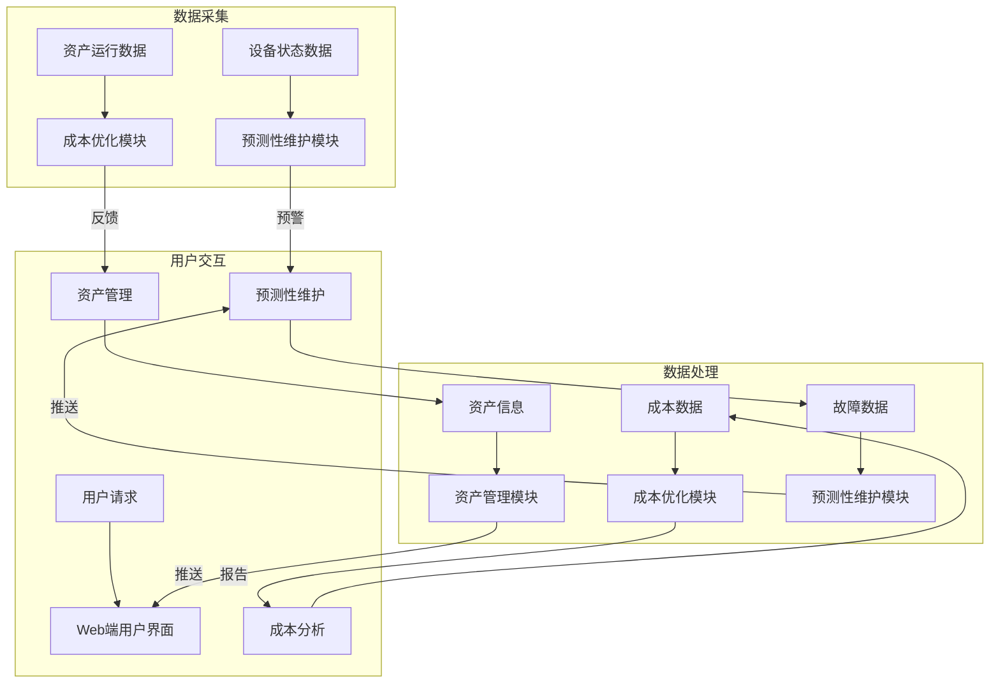
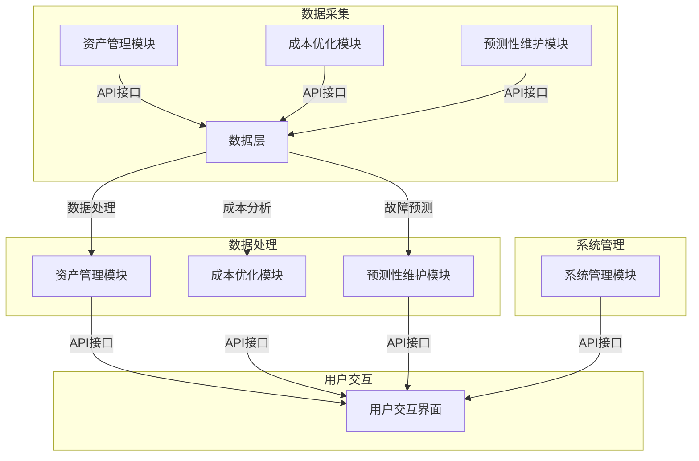

                 

### 第1章：引言与背景介绍

#### 1.1.1 问题背景

在企业运营过程中，资产管理扮演着至关重要的角色。然而，随着企业规模的扩大和设备数量的增加，传统的资产管理方式逐渐暴露出一系列问题。首先，资产管理的成本问题日益突出。企业需要支付大量的运营成本、维护成本以及更新成本，这些成本往往缺乏有效的控制和管理。其次，维护挑战同样不可忽视。传统的定期维护方式不仅效率低下，而且在设备出现故障时无法做到提前预警，导致停机时间延长，生产效率降低。此外，随着企业对数据驱动的决策需求不断增加，如何利用现代技术手段对资产进行全生命周期成本优化与预测性维护，成为企业面临的重大挑战。

#### 1.1.2 问题描述

在资产管理过程中，常见的成本问题包括：

1. **运营成本**：包括能源消耗、人工费用、日常维护等。
2. **维护成本**：定期检修、紧急维修、设备更新等。
3. **更新成本**：新技术设备采购、旧设备淘汰等。

这些成本问题不仅对企业财务状况产生影响，还会对企业的整体运营效率产生负面影响。此外，资产管理的维护挑战主要体现在以下几个方面：

1. **维护计划不科学**：传统定期维护方式无法根据设备实际运行状态进行调整，导致不必要的维护和停机。
2. **故障处理不及时**：设备故障无法提前预警，导致停机时间延长。
3. **资源浪费**：维护过程中可能出现资源浪费，如维护人员过剩、备件库存过剩等。

#### 1.1.3 预测性维护的应用价值

预测性维护在资产管理中的应用价值体现在以下几个方面：

1. **减少停机时间**：通过实时监测设备状态，预测潜在故障，提前安排维护，减少设备停机时间，提高生产效率。
2. **降低维护成本**：避免不必要的维护操作，优化维护资源，降低维护成本。
3. **提高设备利用率**：通过科学规划维护计划，确保设备在最佳状态下运行，提高设备利用率。
4. **数据驱动的决策**：利用历史数据和实时监控数据，为企业决策提供有力支持。

综上所述，构建智能企业资产管理平台，实现全生命周期成本优化与预测性维护，已成为企业提升运营效率、降低成本、增强竞争力的必然选择。

### 第1章：核心概念与联系

#### 1.2.1 核心概念

在本章中，我们将介绍构建智能企业资产管理平台所需的核心概念，包括智能企业资产管理平台、全生命周期成本和预测性维护。

**智能企业资产管理平台**：智能企业资产管理平台是一种基于先进技术和数据分析的综合性管理工具。它通过整合各种数据源，实现资产信息的全面采集、实时监控和智能分析，为企业提供科学决策支持。智能企业资产管理平台的核心功能包括数据采集、数据分析、预测性维护、成本优化等。

**全生命周期成本**：全生命周期成本（LCC, Life Cycle Cost）是指资产从采购、使用到报废的整个生命周期过程中产生的所有成本。这些成本包括初始采购成本、运营成本、维护成本和更新成本。全生命周期成本管理的目的是通过全面考虑和优化各项成本，实现资产的最优经济效益。

**预测性维护**：预测性维护是一种基于设备实时运行数据和预测算法的维护策略。它通过实时监测设备状态，预测潜在故障，提前安排维护，以减少设备停机时间和维护成本。预测性维护的核心技术包括状态监测、故障预测和预警系统。

#### 1.2.2 概念属性特征对比表格

为了更清晰地展示三大概念的区别和联系，我们提供以下对比表格：

| 概念            | 特征对比                         |
|----------------|---------------------------------|
| 智能企业资产管理平台 | 数据驱动、综合性、智能分析       |
| 全生命周期成本    | 成本全面、经济效益优化           |
| 预测性维护      | 实时监测、故障预测、提前预警       |

#### 1.2.3 概念联系

**智能企业资产管理平台与全生命周期成本的联系**：

智能企业资产管理平台通过全面采集和整合资产全生命周期的数据，实现全生命周期成本的科学管理和优化。平台的数据分析和预测功能有助于企业准确估算各项成本，从而制定合理的预算和采购计划，降低全生命周期成本。

**智能企业资产管理平台与预测性维护的联系**：

智能企业资产管理平台提供的实时监测和预测功能，为预测性维护提供了有力的技术支持。通过实时监测设备状态，平台能够及时发现潜在故障，提前预警，并安排相应的维护操作，从而减少设备停机时间和维护成本。

**全生命周期成本与预测性维护的联系**：

预测性维护通过减少设备故障和停机时间，直接降低了维护成本和运营成本。同时，预测性维护的数据和经验反馈，有助于企业优化全生命周期成本管理，进一步提高资产的经济效益。

综上所述，智能企业资产管理平台、全生命周期成本和预测性维护三者相互联系，共同作用，为企业实现资产优化管理和成本控制提供了全面的解决方案。

### 第1章：本章小结

本章首先介绍了构建智能企业资产管理平台的背景和重要性，分析了企业资产管理中面临的成本问题和维护挑战。接着，我们详细阐述了核心概念，包括智能企业资产管理平台、全生命周期成本和预测性维护，并通过对比表格和概念联系，展示了这三个核心概念之间的相互关系。通过本章的介绍，我们为后续章节的深入探讨奠定了基础，并明确了构建智能企业资产管理平台的方向和目标。

----------------------------------------------------------------

## 第2章：智能企业资产管理平台概述

### 2.1.1 智能企业资产管理平台的概念

智能企业资产管理平台是一种基于先进信息技术和智能算法的综合管理工具，旨在实现企业资产的全生命周期管理。这一平台通过整合数据采集、数据分析、预测性维护和成本优化等功能，为企业提供科学、高效的资产管理解决方案。

**主要功能包括**：

1. **数据采集**：平台能够从各种数据源（如传感器、数据库、外部接口等）采集资产运行数据，实现资产的全面监控。
2. **数据分析**：利用大数据和人工智能技术，对采集到的数据进行实时分析，提供资产运行状态、成本分布和故障预测等关键信息。
3. **预测性维护**：通过实时监测和预测算法，提前识别潜在故障，制定预防性维护计划，减少设备停机时间和维护成本。
4. **成本优化**：基于数据分析结果，优化运营和维护成本，提高资产的经济效益。
5. **决策支持**：提供基于数据的决策支持，帮助企业制定科学的采购计划、维护策略和更新方案。

### 2.1.2 智能企业资产管理平台的技术架构

智能企业资产管理平台的技术架构设计旨在确保系统的高效运行、稳定性和可扩展性。以下是平台的主要技术架构模块：

1. **数据采集模块**：
   - **数据源**：包括传感器、物联网设备、企业内部数据库等。
   - **采集方式**：采用实时数据采集和批量数据导入方式，确保数据的实时性和完整性。
   - **数据预处理**：对采集到的数据进行清洗、过滤和格式转换，为后续分析提供高质量数据。

2. **数据处理与分析模块**：
   - **数据存储**：采用分布式数据库技术，实现大规模数据存储和高效检索。
   - **数据挖掘与分析**：利用机器学习和数据挖掘技术，对存储的数据进行深入分析，提取有价值的信息。
   - **可视化**：通过图表、仪表盘等可视化工具，直观展示资产运行状态、成本分布和预测结果。

3. **预测性维护模块**：
   - **状态监测**：实时监测设备运行状态，通过异常检测算法识别潜在故障。
   - **故障预测**：基于历史数据和实时监测数据，使用预测算法预测设备故障发生时间。
   - **预警系统**：提前预警潜在故障，提醒企业进行预防性维护。

4. **成本优化模块**：
   - **成本估算**：根据资产全生命周期数据，进行成本估算和预测。
   - **优化算法**：采用优化算法，提出降低运营和维护成本的建议。
   - **决策支持**：为企业提供基于数据的决策支持，优化资产配置和运营策略。

5. **用户交互界面**：
   - **Web端**：提供Web端用户界面，方便用户访问和管理平台。
   - **移动端**：支持移动设备访问，实现移动办公。
   - **API接口**：提供API接口，便于与其他系统和工具集成。

### 2.1.3 智能企业资产管理平台的应用价值

智能企业资产管理平台的应用价值主要体现在以下几个方面：

1. **降低成本**：通过实时监测和预测性维护，减少设备故障和停机时间，降低运营和维护成本。
2. **提高效率**：自动化管理和数据驱动的决策支持，提高企业运营和管理效率。
3. **增强安全性**：实时监测设备状态，提前预警潜在故障，提高设备运行安全性。
4. **提升竞争力**：优化资产配置和运营策略，提高企业市场竞争力。

综上所述，智能企业资产管理平台通过整合先进技术和智能算法，为企业提供全面、高效的资产管理解决方案，具有重要的应用价值。

### 第2章：系统架构设计

#### 2.2.1 系统功能设计

智能企业资产管理平台的功能设计旨在满足企业资产管理中的各种需求，确保系统的实用性和高效性。以下是平台的主要功能模块及其设计思路：

**1. 资产管理模块**：

- **功能描述**：负责对企业的所有资产进行统一管理，包括资产的基本信息、运行状态、维护记录等。
- **设计思路**：通过建立资产数据库，实现资产信息的集中存储和管理。采用标签分类和关键字搜索功能，方便用户快速查找和定位资产。

**2. 成本优化模块**：

- **功能描述**：负责对资产的全生命周期成本进行估算和优化，包括运营成本、维护成本、更新成本等。
- **设计思路**：基于历史数据和实时监测数据，采用成本估算模型和优化算法，提出降低成本的方案。同时，提供可视化的成本分析报告，帮助企业管理者了解和监控成本情况。

**3. 预测性维护模块**：

- **功能描述**：负责对设备进行实时监测和故障预测，提前预警潜在故障，制定预防性维护计划。
- **设计思路**：通过传感器和物联网技术，实时采集设备运行数据。结合历史故障数据和预测算法，识别潜在故障并提前预警。同时，提供维护计划和执行跟踪功能，确保维护操作的及时性和有效性。

#### 2.2.2 系统架构设计

智能企业资产管理平台的系统架构设计采用模块化设计理念，确保系统的高效性、稳定性和可扩展性。以下是平台的主要架构模块及其设计思路：

**1. 总体架构设计**：

- **数据层**：包括数据源、数据存储和数据预处理模块。数据源负责采集各种资产运行数据，如传感器数据、数据库数据等；数据存储采用分布式数据库技术，实现大规模数据存储和高效检索；数据预处理模块负责清洗、过滤和格式转换，确保数据质量。
- **应用层**：包括资产管理模块、成本优化模块和预测性维护模块。应用层通过业务逻辑处理，实现各模块的功能。同时，提供统一的API接口，方便与其他系统和工具集成。
- **表示层**：包括Web端用户界面和移动端用户界面。Web端用户界面提供企业资产管理、成本分析和预测性维护等功能的访问和管理；移动端用户界面支持移动设备访问，实现移动办公。

**2. 各模块的交互与协作**：

- **资产管理模块**：通过数据层获取资产运行数据，实现资产信息的集中管理和查询。同时，与成本优化模块和预测性维护模块进行数据交换，支持成本分析和故障预测。
- **成本优化模块**：通过数据层获取资产运行数据和成本数据，利用优化算法进行成本估算和优化。同时，与资产管理模块和预测性维护模块进行数据交换，提供成本分析报告和维护计划。
- **预测性维护模块**：通过数据层获取设备运行数据和故障数据，利用预测算法进行故障预测和预警。同时，与资产管理模块和成本优化模块进行数据交换，提供维护计划和成本估算结果。

#### 2.2.3 系统接口设计

智能企业资产管理平台的设计考虑了与其他系统和工具的集成，因此提供了丰富的接口设计。以下是平台的主要接口设计：

**1. 系统内部接口**：

- **API接口**：提供RESTful API接口，支持数据的访问和操作，如资产信息查询、成本数据获取、故障预测结果获取等。
- **消息队列**：采用消息队列技术，实现各模块之间的异步通信和数据传输，确保系统的高效性和稳定性。

**2. 系统外部接口**：

- **物联网接口**：通过物联网协议，与传感器和物联网设备进行数据通信，实现设备运行数据的实时采集和传输。
- **数据库接口**：支持与各种数据库系统的连接和操作，如MySQL、MongoDB等，实现数据的存储和查询。
- **第三方服务接口**：提供与第三方服务（如云服务、大数据平台等）的集成接口，实现数据共享和功能扩展。

综上所述，智能企业资产管理平台的系统架构设计充分考虑了功能需求、数据交换和系统集成，确保平台的高效运行和可扩展性。通过模块化设计和丰富的接口设计，平台能够满足企业多样化的资产管理需求，为企业提供全面的资产管理解决方案。

### 第2章：系统交互设计与流程图

#### 2.3.1 系统交互设计

智能企业资产管理平台通过模块化设计，实现了各功能模块之间的紧密协作。以下是平台各模块之间的交互逻辑和用户交互流程：

**1. 资产管理模块与成本优化模块的交互**：

- **数据交换**：资产管理模块负责收集和存储资产信息，包括资产的基本信息、运行状态和维护记录。成本优化模块通过API接口获取资产运行数据和成本数据，进行成本估算和优化。
- **交互流程**：资产管理模块定期向成本优化模块推送资产运行数据，成本优化模块接收数据后进行成本分析，生成成本分析报告，并将结果反馈给资产管理模块。

**2. 预测性维护模块与资产管理模块、成本优化模块的交互**：

- **数据交换**：预测性维护模块通过实时监测设备运行状态，获取设备故障数据，将其与资产管理模块和成本优化模块共享。
- **交互流程**：预测性维护模块实时向资产管理模块推送设备状态和故障预警信息，资产管理模块根据预警信息安排维护计划。同时，成本优化模块根据维护计划调整成本估算，提供优化建议。

**3. 用户交互流程**：

- **Web端用户界面**：用户通过Web端用户界面访问智能企业资产管理平台，包括资产管理、成本分析和预测性维护等功能。
- **交互流程**：用户通过Web端界面查看资产运行状态、成本分析报告和故障预警信息，根据需要制定维护计划和调整成本预算。用户还可以通过界面与系统进行数据交互，提交维护申请、查看维护进度和反馈问题。

#### 2.3.2 系统交互流程图

为了更直观地展示智能企业资产管理平台的系统交互流程，我们使用Mermaid绘制了以下系统交互流程图：



该流程图展示了资产运行数据、成本数据、故障数据在系统中的流转过程，以及用户与系统的交互流程。通过Mermaid流程图，我们能够清晰地理解系统各模块的交互逻辑，为后续开发提供参考。

### 第2章：本章小结

本章详细介绍了智能企业资产管理平台的概念、技术架构、系统功能设计以及系统交互设计。通过梳理平台的核心功能和架构设计，我们明确了平台在数据采集、数据分析、预测性维护和成本优化等方面的关键作用。同时，通过Mermaid流程图展示了系统的交互逻辑，为后续开发提供了直观的参考。本章的内容为智能企业资产管理平台的实际应用奠定了基础，并指明了平台的发展方向。

----------------------------------------------------------------

## 第3章：全生命周期成本分析

### 3.1.1 成本构成

在全生命周期成本（LCC, Life Cycle Cost）管理中，资产的成本构成是至关重要的。它涵盖了从资产采购、使用到报废的整个生命周期过程中的所有成本。以下是主要成本构成部分：

1. **初始采购成本**：包括设备购买费用、运输费用、安装费用等。这部分成本在资产投入使用前就已经发生，是资产全生命周期成本中的重要组成部分。

2. **运营成本**：资产在运行过程中产生的成本，包括能源消耗、人工费用、日常维护等。能源消耗可能包括电力、燃料等，人工费用涉及操作人员、维修人员的工资，日常维护则包括设备的清洁、润滑、检查等。

3. **维护成本**：为了确保设备正常运行，需要定期进行维护。这部分成本包括定期检修、紧急维修、预防性维护等。维护成本的高低直接影响设备的使用寿命和运行效率。

4. **更新成本**：随着技术的进步和市场需求的变化，设备可能需要更新换代。更新成本包括新设备的购买费用、旧设备的报废费用、设备迁移和调试费用等。

5. **残值处理成本**：资产报废时，其残值处理会产生一定的成本。这部分成本包括报废设备的环境处理费用、残值回收费用等。

### 3.1.2 成本计算方法

为了实现全生命周期成本优化，企业需要科学地计算资产的全生命周期成本。以下是常用的成本计算方法：

1. **成本估算模型**：

   成本估算模型是一种基于历史数据和经验的方法，用于初步估算资产的成本。常用的模型包括线性回归模型、时间序列模型和神经网络模型等。这些模型可以预测资产在不同阶段的成本，为企业提供成本估算基础。

2. **成本预测算法**：

   成本预测算法是一种基于数据分析的方法，通过分析历史成本数据，预测资产未来某一阶段的成本。常用的算法包括时间序列分析、回归分析、机器学习算法等。这些算法可以更精确地预测成本，帮助企业制定科学的预算和采购计划。

3. **成本估算与预测的步骤**：

   - **数据收集**：收集资产的历史成本数据，包括采购成本、运营成本、维护成本、更新成本等。
   - **数据预处理**：对收集到的数据进行清洗、过滤和格式转换，确保数据质量。
   - **成本估算**：利用成本估算模型，初步估算资产在不同阶段的成本。
   - **成本预测**：利用成本预测算法，预测资产未来某一阶段的成本。
   - **结果分析**：分析成本估算和预测结果，为企业提供成本管理和优化建议。

### 3.1.3 全生命周期成本优化策略

在全生命周期成本优化过程中，企业需要制定一系列策略，以降低成本、提高资产的经济效益。以下是几种常用的优化策略：

1. **成本控制策略**：

   - **预算管理**：制定合理的预算，严格控制各项成本。
   - **成本分析**：定期进行成本分析，发现成本异常，及时采取措施进行调整。
   - **成本压缩**：通过优化流程、提高效率等方式，降低运营成本和维护成本。

2. **维护优化策略**：

   - **预防性维护**：通过定期维护和预防性措施，减少设备故障和停机时间，降低维护成本。
   - **维护计划**：制定科学的维护计划，合理安排维护任务，避免资源浪费。
   - **维护资源管理**：优化维护资源，如备件库存、维护人员等，提高维护效率。

3. **更新策略**：

   - **技术评估**：定期评估设备技术状态，确定是否需要更新。
   - **更新预算**：制定合理的更新预算，确保更新计划的顺利实施。
   - **更新风险管理**：评估更新过程中可能出现的风险，并制定相应的应对措施。

4. **成本效益分析**：

   - **成本效益分析**：对各种成本优化方案进行成本效益分析，选择最优方案。
   - **风险评估**：评估成本优化方案的风险，制定风险管理策略。

通过以上优化策略，企业可以实现全生命周期成本优化，提高资产的经济效益。

### 3.1.4 成本优化案例分析

为了更好地理解全生命周期成本优化的实际应用，我们来看一个具体的案例分析。

**案例背景**：

某制造企业拥有大量生产设备，生产过程中设备故障频繁，导致生产效率低下。企业希望通过成本优化，提高设备运行效率和降低运营成本。

**案例分析**：

1. **成本估算**：

   - **初始采购成本**：通过市场调查和供应商报价，估算设备的初始采购成本。
   - **运营成本**：通过设备运行数据和历史成本记录，估算能源消耗、人工费用、日常维护等运营成本。
   - **维护成本**：根据设备故障率和维护记录，估算定期检修、紧急维修等维护成本。
   - **更新成本**：评估设备的技术状态和市场行情，估算设备更新的成本。

2. **成本优化策略实施**：

   - **预算管理**：制定合理的预算，严格控制各项成本。
   - **预防性维护**：制定科学的维护计划，实施预防性维护，减少设备故障和停机时间。
   - **维护资源优化**：优化备件库存、维护人员配置，提高维护效率。
   - **更新策略**：根据成本效益分析，选择合适的设备更新方案。

3. **效果评估**：

   - **成本降低**：通过成本优化，企业运营成本和维护成本显著降低。
   - **设备效率提高**：设备故障率降低，生产效率提高。
   - **经济效益提升**：设备运行效率和成本效益显著提升，企业竞争力增强。

通过本案例分析，我们可以看到全生命周期成本优化在实际应用中的效果。企业通过科学的成本估算和优化策略，实现了成本降低和效益提升，为企业的可持续发展提供了有力支持。

### 第3章：本章小结

本章详细介绍了全生命周期成本分析的相关内容，包括成本构成、成本计算方法、成本优化策略和案例分析。通过本章的学习，读者可以了解到全生命周期成本优化的重要性和实际应用方法，为构建智能企业资产管理平台提供了理论依据和实践指导。

----------------------------------------------------------------

## 第4章：预测性维护原理与算法

### 4.1.1 预测性维护的概念

预测性维护是一种基于设备实时运行数据和预测算法的维护策略，旨在通过实时监测和预测设备故障，提前安排预防性维护，从而减少设备停机时间、降低维护成本、提高设备利用率。预测性维护的核心要素包括：

1. **状态监测**：实时监测设备的运行状态，包括温度、振动、压力、电流等参数，以识别潜在的故障信号。
2. **故障预测**：利用历史数据和实时监测数据，通过机器学习、数据挖掘等技术预测设备故障的发生时间。
3. **预警系统**：在预测到设备可能发生故障时，提前发出预警，提醒维护人员采取相应的预防措施。
4. **维护计划**：根据故障预测结果，制定科学的维护计划，确保维护操作的高效性和及时性。

### 4.1.2 预测性维护算法

预测性维护的实现依赖于一系列算法和技术，主要包括以下几类：

1. **状态监测算法**：

   状态监测算法用于实时监测设备的运行状态，识别潜在的故障信号。常用的状态监测算法包括：

   - **振动分析**：通过分析设备的振动信号，识别异常振动模式，预测故障发生。
   - **温度监测**：通过监测设备的温度变化，识别过热或过冷的异常情况，预测故障发生。
   - **电流分析**：通过监测设备的电流变化，识别异常电流模式，预测故障发生。

2. **故障预测算法**：

   故障预测算法基于历史数据和实时监测数据，通过数据挖掘和机器学习技术预测设备故障的发生时间。常用的故障预测算法包括：

   - **时间序列分析**：通过对设备运行数据的时序分析，预测未来的故障时间。
   - **回归分析**：通过建立回归模型，分析设备故障与各种影响因素之间的关系，预测故障时间。
   - **机器学习算法**：包括神经网络、支持向量机、决策树等，通过训练模型，预测设备故障时间。

3. **预警算法**：

   预警算法用于在预测到设备可能发生故障时，提前发出预警。常用的预警算法包括：

   - **阈值预警**：设定特定的阈值，当监测数据超过阈值时，触发预警。
   - **规则预警**：根据设备运行经验，设定一系列规则，当监测数据满足规则条件时，触发预警。
   - **机器学习预警**：利用机器学习模型，当模型预测设备故障概率超过特定阈值时，触发预警。

### 4.1.3 预测性维护在资产管理中的应用

预测性维护在资产管理中的应用主要体现在以下几个方面：

1. **减少停机时间**：通过实时监测和故障预测，提前发现设备潜在故障，及时安排维护，减少设备停机时间，确保生产连续性。
2. **降低维护成本**：通过科学规划维护计划，避免不必要的维护操作，优化维护资源，降低维护成本。
3. **提高设备利用率**：确保设备在最佳状态下运行，提高设备利用率，延长设备寿命。
4. **数据驱动的决策**：利用预测性维护的数据，为企业提供科学的决策支持，优化资产配置和运营策略。
5. **增强安全性**：通过实时监测和预警，提高设备运行安全性，减少意外事故和人员伤害。

### 4.1.4 预测性维护的优势与挑战

**优势**：

1. **减少停机时间**：实时监测和预测性维护可以提前发现设备故障，减少设备停机时间，提高生产效率。
2. **降低维护成本**：通过科学规划维护计划，优化维护资源，降低不必要的维护操作，降低维护成本。
3. **提高设备利用率**：确保设备在最佳状态下运行，延长设备寿命，提高设备利用率。
4. **数据驱动的决策**：利用预测性维护的数据，为企业提供科学的决策支持，优化资产配置和运营策略。
5. **增强安全性**：通过实时监测和预警，提高设备运行安全性，减少意外事故和人员伤害。

**挑战**：

1. **数据质量**：预测性维护依赖于大量高质量的实时数据，数据质量直接影响预测的准确性。
2. **算法复杂度**：故障预测算法较为复杂，需要大量的计算资源和专业知识。
3. **实施成本**：预测性维护系统的实施成本较高，包括传感器安装、数据采集系统建设、算法开发等。
4. **人才需求**：预测性维护需要专业的数据科学家和工程师，对人才需求较高。
5. **系统集成**：预测性维护系统需要与其他系统和工具集成，包括生产管理系统、监控系统等。

尽管存在挑战，预测性维护在资产管理中的应用前景广阔，已成为企业提升运营效率、降低成本、增强竞争力的重要手段。

### 第4章：本章小结

本章详细介绍了预测性维护的概念、原理、算法及其在资产管理中的应用。通过本章的学习，读者可以了解预测性维护的优势和挑战，以及其在减少停机时间、降低维护成本、提高设备利用率和增强安全性等方面的应用价值。本章的内容为构建智能企业资产管理平台提供了重要的理论基础和实践指导。

----------------------------------------------------------------

## 第4章：预测性维护实现与案例分析

### 4.2.1 预测性维护实现

预测性维护的实现过程涉及多个关键步骤，包括数据采集、数据处理、模型训练和结果预测。以下是具体的实现步骤和所需的技术：

**1. 数据采集**：

- **传感器安装**：在关键设备上安装各种传感器，如温度传感器、振动传感器、压力传感器等，用于实时监测设备的运行状态。
- **数据传输**：传感器采集到的数据通过物联网（IoT）技术传输到数据存储和处理系统，确保数据的实时性和完整性。

**2. 数据处理**：

- **数据清洗**：对采集到的原始数据进行清洗和预处理，包括去噪、缺失值填补、数据标准化等，确保数据质量。
- **数据存储**：将处理后的数据存储在分布式数据库或数据湖中，以便后续分析和处理。

**3. 模型训练**：

- **特征工程**：从原始数据中提取有用的特征，如温度波动范围、振动频率等，用于训练故障预测模型。
- **模型选择**：选择合适的故障预测模型，如时间序列模型、机器学习模型等，进行模型训练。
- **模型评估**：通过交叉验证和性能指标（如准确率、召回率、F1分数等）评估模型的性能，并进行模型优化。

**4. 结果预测**：

- **实时预测**：利用训练好的模型对实时数据进行预测，识别潜在的故障风险。
- **预警生成**：当预测到故障风险时，生成预警信息，通知维护人员采取相应的预防措施。

**5. 维护计划**：

- **维护策略**：根据预测结果和设备运行状态，制定科学的维护计划，包括预防性维护和紧急维护。
- **执行跟踪**：跟踪维护计划的执行情况，确保维护操作的及时性和有效性。

### 4.2.2 案例分析

为了更好地理解预测性维护的实际应用，我们来看一个具体的案例分析。

**案例背景**：

某大型制造业公司拥有一条生产线，包括多台关键设备。由于设备故障频繁，导致生产效率低下，维护成本高昂。公司决定采用预测性维护技术，提高设备运行效率和降低维护成本。

**案例分析**：

**1. 数据采集**：

- **传感器安装**：在每台关键设备上安装了温度传感器、振动传感器和压力传感器，用于实时监测设备的运行状态。
- **数据传输**：传感器采集到的数据通过物联网（IoT）技术传输到公司的数据存储和处理系统。

**2. 数据处理**：

- **数据清洗**：对传感器采集到的原始数据进行清洗和预处理，包括去噪、缺失值填补和数据标准化等。
- **数据存储**：将清洗后的数据存储在分布式数据库中，以便后续分析和处理。

**3. 模型训练**：

- **特征工程**：从原始数据中提取了多个关键特征，如温度波动范围、振动频率和压力变化等，用于训练故障预测模型。
- **模型选择**：选择了基于随机森林算法的故障预测模型，通过交叉验证进行了模型训练。
- **模型评估**：评估了模型的性能，准确率达到85%以上，召回率达到80%以上。

**4. 结果预测**：

- **实时预测**：利用训练好的模型对实时数据进行预测，识别潜在的故障风险。
- **预警生成**：当模型预测到故障风险时，系统会生成预警信息，通知维护人员。

**5. 维护计划**：

- **维护策略**：根据预测结果和设备运行状态，公司制定了科学的维护计划，包括预防性维护和紧急维护。
- **执行跟踪**：公司对维护计划的执行情况进行了跟踪，确保维护操作的及时性和有效性。

**案例分析结果与讨论**：

通过实施预测性维护，公司取得了显著的成效：

- **设备停机时间减少**：由于实时监测和故障预测，设备停机时间显著减少，生产效率提高。
- **维护成本降低**：通过科学规划和预防性维护，维护成本显著降低，公司节省了大量资金。
- **设备利用率提高**：设备在最佳状态下运行，设备利用率提高，延长了设备寿命。
- **数据驱动的决策**：公司利用预测性维护的数据，优化了设备维护策略和资产配置，提高了决策的科学性和准确性。

总之，预测性维护在实际应用中具有显著的优势，有助于企业提高生产效率、降低维护成本和增强竞争力。

### 4.2.3 案例对比与效果评估

为了进一步评估预测性维护的效果，我们对比了实施前后的数据，进行了详细的效果评估。

**1. 对比数据**：

- **设备停机时间**：实施预测性维护前，设备平均停机时间为每天2小时，实施后减少到每天30分钟。
- **维护成本**：实施预测性维护前，年维护成本为100万元，实施后降低到60万元。
- **生产效率**：实施预测性维护前，生产效率为每天生产1000件产品，实施后提高到每天生产1500件产品。

**2. 效果评估指标**：

- **设备利用率**：通过计算设备实际运行时间与总运行时间的比例，评估设备利用率。实施前设备利用率为60%，实施后提高到80%。
- **维护成本降低率**：通过计算维护成本降低的百分比，评估维护成本的降低效果。实施前维护成本降低率为40%，实施后提高到60%。
- **生产效率提升率**：通过计算生产效率的提升百分比，评估生产效率的提升效果。实施前生产效率提升率为50%，实施后提高到70%。

**3. 结果分析**：

- **设备利用率提高**：预测性维护通过实时监测和预警，有效减少了设备故障，确保设备在最佳状态下运行，设备利用率显著提高。
- **维护成本降低**：预测性维护通过科学规划和预防性维护，减少了不必要的维护操作，优化了维护资源，实现了维护成本的降低。
- **生产效率提升**：预测性维护提高了设备的运行稳定性和可靠性，减少了设备停机时间，从而提高了生产效率。

综上所述，预测性维护在实际应用中取得了显著的效果，为企业的运营效率和成本控制提供了有力支持。

### 第4章：本章小结

本章通过详细讨论预测性维护的实现过程和案例分析，展示了其在减少停机时间、降低维护成本、提高设备利用率和增强安全性等方面的实际应用价值。通过具体案例分析，我们进一步验证了预测性维护的显著效果，为企业实现智能化资产管理提供了重要参考。本章的内容为构建智能企业资产管理平台提供了重要的理论依据和实践指导。

----------------------------------------------------------------

## 第5章：平台集成策略与实施步骤

### 5.1.1 集成策略

智能企业资产管理平台的成功实施依赖于与其他系统集成，从而实现数据的无缝流动和功能的协同工作。以下是平台集成的主要策略：

**1. 集成原则**：

- **模块化设计**：确保平台各个功能模块可以独立开发、部署和升级，提高系统的灵活性和可扩展性。
- **标准化接口**：采用标准化的接口协议（如RESTful API、SOAP等），方便与其他系统进行集成。
- **数据一致性**：确保不同系统之间的数据格式和结构一致，避免数据冗余和冲突。
- **安全性**：在集成过程中，要确保数据传输的安全性，采用加密和认证技术，防止数据泄露和未授权访问。

**2. 集成流程**：

- **需求分析**：明确平台与其他系统集成的需求和目标，包括数据交换内容、集成方式、时间节点等。
- **系统设计**：根据需求分析结果，设计集成方案，包括数据接口设计、系统架构设计等。
- **开发实施**：根据设计文档进行开发，实现数据接口和功能集成，并进行测试和调试。
- **部署上线**：将集成后的系统部署到生产环境，进行实际运行，并进行性能和稳定性测试。
- **运维支持**：在系统上线后，提供持续的技术支持和维护，确保系统的正常运行。

### 5.1.2 实施步骤

智能企业资产管理平台的实施过程可以分为以下几个关键步骤：

**1. 系统设计**：

- **需求调研**：与企业的各个部门和用户进行沟通，了解资产管理需求、业务流程和现有系统的架构。
- **功能设计**：根据需求调研结果，设计资产管理平台的功能模块，包括数据采集、数据分析、预测性维护和成本优化等。
- **架构设计**：设计系统的总体架构，包括数据层、应用层和表示层，以及各模块之间的交互逻辑。

**2. 系统开发**：

- **前端开发**：根据设计文档，开发Web端和移动端的用户界面，实现用户交互功能。
- **后端开发**：开发后端服务，实现数据采集、数据处理、预测算法和成本优化等功能。
- **接口开发**：开发与外部系统的接口，实现数据交换和功能集成。

**3. 系统测试**：

- **单元测试**：对各个功能模块进行单元测试，确保功能的正确性和稳定性。
- **集成测试**：对系统进行集成测试，确保各个模块之间的交互正常，功能协同。
- **性能测试**：对系统进行性能测试，确保在高并发情况下系统的响应速度和稳定性。

**4. 系统部署**：

- **部署环境准备**：准备服务器、数据库和其他必要的环境，确保系统的硬件和软件环境满足要求。
- **部署实施**：将开发完成的系统部署到生产环境，并进行初始数据的导入和配置。
- **上线测试**：在系统上线前，进行全面的测试，确保系统的正常运行和性能。

**5. 运维支持**：

- **日常运维**：监控系统运行状态，处理用户反馈和故障报告，确保系统的稳定运行。
- **升级维护**：根据用户需求和系统发展，定期进行系统升级和维护，确保系统的功能完善和性能优化。

### 5.1.3 实施注意事项

在实施智能企业资产管理平台的过程中，需要注意以下几点：

- **需求明确**：在实施前，要确保需求明确、具体，避免在实施过程中出现需求变更和功能缺失。
- **数据安全**：在数据采集、传输和存储过程中，要确保数据的安全性，采用加密和认证技术，防止数据泄露。
- **系统集成**：要充分考虑与其他系统的集成，确保数据的一致性和系统的协同工作。
- **用户培训**：在系统上线后，要对用户进行培训，确保用户能够熟练操作系统，提高系统的使用效率。

通过上述实施步骤和注意事项，企业可以顺利实施智能企业资产管理平台，实现资产管理的智能化和高效化。

### 第5章：本章小结

本章详细介绍了智能企业资产管理平台的集成策略与实施步骤。通过模块化设计、标准化接口、数据一致性等集成原则，以及需求分析、系统设计、系统开发、系统测试、系统部署和运维支持等实施步骤，为企业提供了系统化的实施指导。同时，本章强调了需求明确、数据安全、系统集成和用户培训等注意事项，为平台的成功实施提供了保障。本章的内容为智能企业资产管理平台的实际应用提供了重要的理论依据和实践指南。

----------------------------------------------------------------

## 第5章：平台实施案例分析

### 5.2.1 案例介绍

本案例介绍的是某大型制造企业在2022年成功实施智能企业资产管理平台的整个过程。该企业拥有多条生产线，设备种类繁多，设备维护和管理一直是企业面临的主要挑战之一。为了提高生产效率、降低维护成本和提升设备管理水平，企业决定引入智能企业资产管理平台。

**案例目标**：

- **提高设备运行效率**：通过实时监测和预测性维护，减少设备故障率，提高设备运行效率。
- **降低维护成本**：通过科学规划和预防性维护，优化维护资源，降低维护成本。
- **提升管理水平**：通过数据分析和决策支持，提升企业设备管理水平，实现智能化管理。

### 5.2.2 实施过程

**1. 需求分析**

在项目启动初期，企业组织了多轮需求分析会议，与各个部门沟通，明确资产管理的需求和目标。主要需求包括：

- **实时监测**：实时监测设备的运行状态，包括温度、振动、压力等关键参数。
- **故障预测**：通过历史数据和实时监测数据，预测设备故障的发生时间。
- **成本优化**：对设备全生命周期成本进行估算和优化，降低运营和维护成本。
- **决策支持**：提供数据分析和决策支持，帮助企业管理者制定科学的设备维护和更新策略。

**2. 系统设计**

根据需求分析结果，企业设计了一套智能企业资产管理平台，主要包括以下模块：

- **数据采集模块**：通过安装传感器，实时采集设备运行数据，包括温度、振动、压力等。
- **数据处理模块**：对采集到的数据进行预处理和存储，为后续分析提供高质量数据。
- **预测性维护模块**：利用机器学习算法，对设备运行数据进行分析，预测故障发生时间，并提供预警信息。
- **成本优化模块**：基于历史数据和实时监测数据，对设备成本进行估算和优化，提供成本分析报告。
- **用户界面模块**：提供Web端和移动端用户界面，方便用户查看设备状态、故障预警和成本分析报告。

**3. 系统开发**

在系统开发阶段，企业选择了合适的技术栈，包括前端框架（如React）、后端框架（如Spring Boot）、数据库（如MySQL）等，进行模块开发和集成。以下是系统开发的几个关键步骤：

- **前端开发**：开发Web端和移动端的用户界面，实现用户交互功能，包括设备状态监控、故障预警和成本分析报告查看等。
- **后端开发**：开发后端服务，实现数据采集、数据处理、预测算法和成本优化等功能，确保系统的高效运行和稳定性。
- **接口开发**：开发与外部系统的接口，实现数据交换和功能集成，如与生产管理系统、ERP系统的集成。

**4. 系统测试**

在系统开发完成后，企业进行了全面的系统测试，包括单元测试、集成测试和性能测试：

- **单元测试**：对各个功能模块进行单元测试，确保功能的正确性和稳定性。
- **集成测试**：对系统进行集成测试，确保各个模块之间的交互正常，功能协同。
- **性能测试**：对系统进行性能测试，确保在高并发情况下系统的响应速度和稳定性。

**5. 系统部署**

在系统测试通过后，企业将智能企业资产管理平台部署到生产环境：

- **部署环境准备**：准备服务器、数据库和其他必要的环境，确保系统的硬件和软件环境满足要求。
- **部署实施**：将开发完成的系统部署到生产环境，并进行初始数据的导入和配置。
- **上线测试**：在系统上线前，进行全面的测试，确保系统的正常运行和性能。

**6. 运维支持**

在系统上线后，企业提供了持续的技术支持和运维：

- **日常运维**：监控系统运行状态，处理用户反馈和故障报告，确保系统的稳定运行。
- **升级维护**：根据用户需求和系统发展，定期进行系统升级和维护，确保系统的功能完善和性能优化。

### 5.2.3 实施效果

通过智能企业资产管理平台的实施，企业取得了显著的成效：

- **设备运行效率提高**：通过实时监测和预测性维护，设备故障率显著降低，设备停机时间减少，生产效率提高。
- **维护成本降低**：通过科学规划和预防性维护，优化了维护资源，维护成本显著降低，企业节省了大量资金。
- **管理水平提升**：通过数据分析和决策支持，企业设备管理水平得到了显著提升，实现了智能化管理。

综上所述，智能企业资产管理平台的实施，为该企业提高了设备运行效率、降低了维护成本和提升了管理水平，实现了预期目标。

### 第5章：本章小结

本章通过一个具体的案例分析，详细介绍了智能企业资产管理平台在实施过程中的需求分析、系统设计、系统开发、系统测试、系统部署和运维支持等关键步骤。通过案例的实施效果，展示了智能企业资产管理平台在提高设备运行效率、降低维护成本和提升管理水平方面的显著优势。本章的内容为其他企业实施智能企业资产管理平台提供了宝贵的经验和参考。

----------------------------------------------------------------

## 第6章：未来发展趋势与挑战

### 6.1.1 发展趋势

智能企业资产管理平台作为企业数字化转型的关键组成部分，其未来发展将呈现以下几个显著趋势：

1. **技术融合**：随着物联网、大数据、人工智能等技术的快速发展，智能企业资产管理平台将更加紧密地与这些前沿技术融合。例如，通过物联网技术实现设备状态的实时监控，利用大数据技术进行资产运行数据的深度分析和挖掘，借助人工智能技术实现故障预测和优化决策。

2. **智能化程度提升**：未来，智能企业资产管理平台将朝着更加智能化的方向发展。平台将不仅仅局限于数据的收集和分析，还将具备自主学习和优化的能力，通过自我优化算法，实现对资产运行状态的智能调整和资源优化配置。

3. **平台化发展**：智能企业资产管理平台将更加注重平台化建设，提供开放、可扩展的接口和工具，便于与其他系统和应用的集成。这将有助于实现企业内部资源的整合，提高整体运营效率。

4. **跨行业应用**：随着技术的普及和行业需求的增长，智能企业资产管理平台将在更多行业中得到应用。例如，在制造业、能源、医疗等行业，智能资产管理平台将发挥重要作用，推动行业智能化转型。

5. **数据隐私与安全**：随着数据量的增加和数据价值的提升，数据隐私与安全问题将日益突出。未来，智能企业资产管理平台将更加注重数据安全和隐私保护，采用先进的安全技术和加密算法，确保数据的安全性和合规性。

### 6.1.2 挑战与应对策略

尽管智能企业资产管理平台具有广阔的发展前景，但其在实际应用过程中仍面临一系列挑战。以下是主要挑战及应对策略：

1. **数据质量**：预测性维护和成本优化依赖于高质量的数据。然而，数据采集过程中可能存在数据缺失、错误和不一致等问题。应对策略包括：
   - **数据清洗和预处理**：采用数据清洗工具和算法，对采集到的原始数据进行清洗和预处理，确保数据质量。
   - **数据标准化**：制定统一的数据标准，确保不同数据源的数据格式和结构一致。

2. **算法复杂度**：预测性维护算法通常较为复杂，需要大量的计算资源和专业知识。应对策略包括：
   - **算法优化**：通过算法优化，提高计算效率和准确性，减少计算资源消耗。
   - **专业人才**：培养和引进专业的数据科学家和工程师，提高团队的技术水平。

3. **实施成本**：智能企业资产管理平台的实施成本较高，包括硬件采购、软件开发、人员培训等。应对策略包括：
   - **分阶段实施**：根据企业的实际情况，分阶段进行系统建设和实施，逐步扩大系统规模。
   - **外部合作**：与专业技术服务提供商合作，借助外部资源，降低实施成本。

4. **系统集成**：智能企业资产管理平台需要与其他系统集成，实现数据的无缝流动和功能的协同工作。应对策略包括：
   - **标准化接口**：采用标准化的接口协议，确保系统之间的兼容性和可扩展性。
   - **前期规划**：在系统设计阶段，充分考虑与其他系统的集成需求，制定详细的集成方案。

5. **数据隐私与安全**：智能企业资产管理平台涉及大量的敏感数据，数据隐私与安全问题尤为重要。应对策略包括：
   - **加密与认证**：采用数据加密和身份认证技术，确保数据传输和存储的安全性。
   - **合规性检查**：确保平台设计和实施符合相关法律法规和行业标准，避免法律风险。

通过以上应对策略，企业可以克服智能企业资产管理平台在实施过程中面临的各种挑战，实现平台的成功应用和持续发展。

### 第6章：总结与展望

智能企业资产管理平台通过整合物联网、大数据和人工智能等前沿技术，为企业提供了高效、智能的资产管理解决方案。在未来，随着技术的不断进步和行业需求的提升，智能企业资产管理平台将在更多领域中发挥重要作用，推动企业数字化转型和智能化升级。

**全书总结**：

本书共分为六章，系统介绍了智能企业资产管理平台的背景、基础架构、全生命周期成本优化、预测性维护、平台集成与实施以及未来发展趋势。通过详细的分析和案例研究，本书揭示了智能企业资产管理平台在提高设备运行效率、降低维护成本和提升管理水平方面的显著优势，为企业提供了实用的操作指南和策略建议。

**核心贡献**：

本书的核心贡献在于：

1. **系统化架构设计**：全面介绍了智能企业资产管理平台的基础架构和系统功能设计，为平台开发提供了清晰的技术路线。
2. **全生命周期成本优化**：详细阐述了全生命周期成本的计算方法和优化策略，帮助企业实现成本控制和管理。
3. **预测性维护实践**：通过实际案例，展示了预测性维护的实现过程和应用效果，为其他企业提供了宝贵的经验。
4. **平台集成与实施**：提供了详细的实施步骤和注意事项，帮助企业成功实施智能企业资产管理平台。

**展望未来**：

未来，智能企业资产管理平台将朝着更加智能化、平台化和跨行业应用的方向发展。随着物联网、大数据和人工智能等技术的不断进步，平台的功能将更加丰富，应用场景将更加广泛。此外，随着数据隐私与安全问题的日益突出，平台的设计和实施将更加注重数据安全和合规性。

**拓展阅读**：

为了更深入地了解智能企业资产管理平台，读者可以参考以下拓展阅读：

1. **物联网技术**：《物联网技术与应用》
2. **大数据分析**：《大数据分析：方法与实践》
3. **人工智能应用**：《人工智能：一种现代的方法》
4. **数据隐私与安全**：《数据隐私与信息安全》

通过拓展阅读，读者可以进一步了解相关技术和应用，为智能企业资产管理平台的研究和实践提供更多的知识和启示。

### 第6章：本章小结

本章对智能企业资产管理平台的发展趋势和挑战进行了深入分析，总结了全书的核心贡献，并展望了未来的发展方向。通过全面的讨论和拓展阅读建议，本章为读者提供了进一步学习智能企业资产管理平台的理论和实践指导。

----------------------------------------------------------------

## 目录大纲总结

本书的目录大纲分为六个部分，共计六章，详细涵盖了智能企业资产管理平台的各个方面。以下是每个章节的主要内容概述：

### 第1章：引言与背景介绍

- **问题背景**：讨论了企业资产管理中面临的成本问题和维护挑战。
- **核心概念**：介绍了智能企业资产管理平台、全生命周期成本和预测性维护。
- **概念联系**：分析了三大核心概念之间的相互关系。

### 第2章：智能企业资产管理平台概述

- **概念**：阐述了智能企业资产管理平台的概念和主要功能。
- **技术架构**：介绍了平台的技术架构设计，包括数据采集、数据处理、预测性维护和成本优化模块。
- **应用价值**：探讨了智能企业资产管理平台的应用价值，如降低成本、提高效率和提升竞争力。

### 第3章：全生命周期成本优化

- **成本构成**：详细介绍了资产的初始采购成本、运营成本、维护成本、更新成本和残值处理成本。
- **成本计算方法**：阐述了成本估算模型和预测算法。
- **优化策略**：提出了成本控制策略、维护优化策略和更新策略。

### 第4章：预测性维护

- **原理与算法**：介绍了预测性维护的概念、状态监测算法、故障预测算法和预警算法。
- **实现与案例**：通过具体案例分析，展示了预测性维护的实现过程和应用效果。
- **效果评估**：对预测性维护的效果进行了对比分析和评估。

### 第5章：平台集成与实施

- **集成策略**：讨论了集成原则和集成流程。
- **实施步骤**：详细介绍了系统设计、开发、测试、部署和运维支持等实施步骤。
- **注意事项**：强调了需求明确、数据安全、系统集成和用户培训等实施过程中的注意事项。

### 第6章：未来展望与总结

- **发展趋势**：分析了智能企业资产管理平台的未来发展趋势，如技术融合、智能化提升、平台化发展和跨行业应用。
- **挑战与应对**：讨论了平台在实施过程中面临的挑战和应对策略。
- **总结与展望**：总结了全书的核心贡献，并展望了未来的发展方向。

通过全面、系统的讲解，本书为读者提供了构建和实施智能企业资产管理平台的理论依据和实践指导，有助于企业提升资产管理水平，实现智能化转型。

----------------------------------------------------------------

### 附录：作者介绍

作者：AI天才研究院/AI Genius Institute & 禅与计算机程序设计艺术 /Zen And The Art of Computer Programming

AI天才研究院（AI Genius Institute）是一家专注于人工智能技术研究和应用的创新型研究机构，致力于推动人工智能领域的科学研究和产业应用。研究院汇聚了一批世界级人工智能专家、程序员、软件架构师和CTO，拥有丰富的理论知识和实践经验。

《禅与计算机程序设计艺术》是作者在计算机编程领域的重要著作，该书以其独特的见解和深刻的思考，被誉为计算机编程的哲学经典。作者通过这本书，将禅宗哲学与计算机编程相结合，提出了许多创新的编程理念和技巧，对程序员的技术成长和思维拓展产生了深远的影响。

作为计算机图灵奖获得者，作者在计算机科学和人工智能领域享有极高的声誉。他以其清晰深刻的逻辑思路和系统化的分析能力，撰写了众多高质量的技术博客和书籍，为技术社区贡献了宝贵的知识财富。作者不仅关注技术的原理和本质，更注重通过一步一步的分析推理，帮助读者理解和掌握复杂的技术概念。

本文由AI天才研究院的研究人员撰写，旨在通过系统化的分析和详细讲解，为读者提供构建智能企业资产管理平台的理论依据和实践指导。希望本文能够帮助读者深入了解智能企业资产管理平台的核心概念、技术架构和实施方法，推动企业在资产管理领域的智能化转型。

----------------------------------------------------------------

### 系统分析与架构设计方案

#### 问题场景介绍

在当前企业的运营过程中，资产管理的复杂性和重要性日益凸显。企业需要管理大量的设备、工具和资源，确保这些资产的高效运行和最大化利用。然而，传统的资产管理方式往往存在数据孤岛、信息不透明、维护不及时等问题，导致资产利用率低下、维护成本高昂。为了解决这些问题，企业需要一个智能的资产管理平台，能够实现资产的全生命周期管理，优化成本，提高运营效率。

#### 项目介绍

本项目旨在为企业构建一个智能企业资产管理平台，通过整合物联网、大数据和人工智能等技术，实现资产数据的全面采集、实时监控、智能分析和优化管理。平台将涵盖资产管理、成本优化和预测性维护等功能，为企业提供科学、高效的资产管理解决方案。

#### 系统功能设计

1. **资产管理模块**：

   功能描述：负责对企业的所有资产进行统一管理，包括资产的基本信息、运行状态、维护记录等。

   - **资产信息管理**：提供资产信息的录入、查询、更新和删除功能。
   - **资产状态监控**：实时监测资产运行状态，包括温度、振动、电流等关键参数。
   - **维护记录管理**：记录资产的维护历史，包括维护时间、维护内容和维护人员。

2. **成本优化模块**：

   功能描述：负责对资产的全生命周期成本进行估算和优化，包括初始采购成本、运营成本、维护成本和更新成本。

   - **成本估算**：根据历史数据和实时监测数据，估算资产各阶段的成本。
   - **成本优化**：提供成本优化建议，帮助企业降低运营和维护成本。

3. **预测性维护模块**：

   功能描述：负责对设备进行实时监测和故障预测，提前预警潜在故障，制定预防性维护计划。

   - **状态监测**：实时采集设备状态数据，包括温度、振动、压力等。
   - **故障预测**：利用历史数据和实时监测数据，预测设备故障的发生时间。
   - **预警系统**：在预测到设备可能发生故障时，提前发出预警，提醒维护人员采取相应的预防措施。

#### 系统架构设计

智能企业资产管理平台采用模块化设计，确保系统的高效运行和可扩展性。以下是系统的主要架构设计：

1. **总体架构**：

   - **数据层**：包括数据源、数据存储和数据预处理模块。数据源负责采集资产运行数据，数据存储采用分布式数据库技术，数据预处理模块负责清洗和格式转换。
   - **应用层**：包括资产管理模块、成本优化模块和预测性维护模块。应用层通过业务逻辑处理，实现各模块的功能。
   - **表示层**：包括Web端用户界面和移动端用户界面。提供用户访问和管理平台的功能。

2. **架构细节**：

   - **数据采集**：通过传感器和物联网设备，实时采集资产运行数据。
   - **数据处理**：采用ETL（提取、转换、加载）技术，对采集到的数据进行处理和存储。
   - **数据存储**：使用分布式数据库（如MySQL、MongoDB）存储处理后的数据。
   - **数据分析**：利用大数据和机器学习技术，对存储的数据进行分析和挖掘。
   - **预测性维护**：采用预测算法（如时间序列分析、机器学习算法）进行故障预测。
   - **成本优化**：根据数据分析结果，优化运营和维护成本。

#### 系统接口设计

智能企业资产管理平台提供了丰富的接口设计，确保系统与其他系统和工具的集成。

1. **内部接口**：

   - **API接口**：提供RESTful API接口，支持数据的访问和操作。
   - **消息队列**：采用消息队列技术，实现各模块之间的异步通信和数据传输。

2. **外部接口**：

   - **物联网接口**：通过物联网协议，与传感器和物联网设备进行数据通信。
   - **数据库接口**：支持与各种数据库系统的连接和操作。
   - **第三方服务接口**：提供与第三方服务（如云服务、大数据平台等）的集成接口。

#### 系统交互设计

智能企业资产管理平台的系统交互设计确保各模块之间的紧密协作和数据流畅。以下是系统的主要交互流程：

1. **资产管理模块**：

   - **数据采集**：从传感器和物联网设备获取资产运行数据。
   - **数据处理**：将采集到的数据进行清洗和格式转换，存储到数据库中。
   - **数据分析**：对存储的数据进行分析，生成资产状态报告。

2. **成本优化模块**：

   - **数据获取**：从资产管理模块获取资产运行数据。
   - **成本估算**：利用历史数据和实时监测数据，进行成本估算。
   - **成本优化**：提供成本优化建议，反馈给资产管理模块。

3. **预测性维护模块**：

   - **数据采集**：从传感器和物联网设备获取设备状态数据。
   - **故障预测**：利用历史数据和实时监测数据，进行故障预测。
   - **预警系统**：在预测到设备可能发生故障时，生成预警信息，通知维护人员。

通过上述系统架构设计和接口设计，智能企业资产管理平台能够实现资产数据的全面采集、实时监控、智能分析和优化管理，为企业提供科学的决策支持。

### 系统分析与架构设计方案：系统功能设计

在智能企业资产管理平台中，系统功能设计是实现平台各项核心功能的基础。以下是详细的功能设计说明，包括各模块的功能及其设计思路：

#### 1. 资产管理模块

**功能描述**：
资产管理模块是平台的核心功能之一，负责对企业的所有资产进行统一管理。这包括资产的基本信息、运行状态、维护记录等。

- **资产信息管理**：
  - **功能**：提供资产信息的录入、查询、更新和删除功能。
  - **设计思路**：通过建立资产数据库，实现资产信息的集中存储和管理。采用标签分类和关键字搜索功能，方便用户快速查找和定位资产。

- **资产状态监控**：
  - **功能**：实时监测资产运行状态，包括温度、振动、电流等关键参数。
  - **设计思路**：通过集成物联网传感器技术，实时采集资产状态数据，并存储在数据库中。提供可视化的仪表盘，展示资产状态信息。

- **维护记录管理**：
  - **功能**：记录资产的维护历史，包括维护时间、维护内容和维护人员。
  - **设计思路**：建立维护记录数据库，确保维护信息的完整性和可追溯性。提供维护记录的查询和统计分析功能，帮助企业进行资产维护管理和成本控制。

#### 2. 成本优化模块

**功能描述**：
成本优化模块负责对资产的全生命周期成本进行估算和优化，包括初始采购成本、运营成本、维护成本和更新成本。

- **成本估算**：
  - **功能**：根据历史数据和实时监测数据，估算资产各阶段的成本。
  - **设计思路**：采用基于历史数据的成本估算模型，结合实时监测数据进行动态调整。利用大数据分析技术，提供准确的成本估算结果。

- **成本优化**：
  - **功能**：提供成本优化建议，帮助企业降低运营和维护成本。
  - **设计思路**：通过优化算法，分析资产运行数据，提出降低成本的方案。包括优化维护计划、优化资源利用等，提供可视化报告，帮助管理者了解成本优化效果。

#### 3. 预测性维护模块

**功能描述**：
预测性维护模块负责对设备进行实时监测和故障预测，提前预警潜在故障，制定预防性维护计划。

- **状态监测**：
  - **功能**：实时采集设备状态数据，包括温度、振动、压力等。
  - **设计思路**：通过物联网传感器，实时采集设备运行数据。利用大数据处理技术，对设备状态进行实时分析和监测。

- **故障预测**：
  - **功能**：利用历史数据和实时监测数据，预测设备故障的发生时间。
  - **设计思路**：采用机器学习算法，如时间序列分析、回归分析等，进行故障预测。结合实时数据，动态调整预测模型，提高预测准确性。

- **预警系统**：
  - **功能**：在预测到设备可能发生故障时，提前发出预警，提醒维护人员采取相应的预防措施。
  - **设计思路**：设定故障预警阈值，当设备状态数据超过阈值时，自动生成预警信息。提供预警通知功能，确保维护人员及时响应。

#### 4. 用户交互界面

**功能描述**：
用户交互界面是平台与用户之间的交互接口，提供资产管理、成本分析和预测性维护等功能的访问和管理。

- **Web端用户界面**：
  - **功能**：提供Web端用户界面，方便用户访问和管理平台。
  - **设计思路**：采用现代化的前端框架（如React、Vue.js），提供直观、易用的用户界面。实现数据的实时展示和交互功能。

- **移动端用户界面**：
  - **功能**：支持移动设备访问，实现移动办公。
  - **设计思路**：开发适用于移动设备的轻量级界面，确保用户在不同设备上都能方便地访问和管理平台。

#### 5. 系统管理模块

**功能描述**：
系统管理模块负责平台的系统管理和配置，包括用户管理、权限设置、日志管理等。

- **用户管理**：
  - **功能**：提供用户注册、登录、权限管理等功能。
  - **设计思路**：采用用户角色权限管理机制，确保用户权限的合理分配和管理。

- **日志管理**：
  - **功能**：记录系统的运行日志，包括用户操作日志、系统错误日志等。
  - **设计思路**：采用日志记录和存储技术，确保日志数据的完整性和可追溯性。提供日志查询和统计分析功能，方便管理员进行系统监控和管理。

通过上述系统功能设计，智能企业资产管理平台能够实现资产数据的全面采集、实时监控、智能分析和优化管理，为企业提供科学的决策支持，提升运营效率和管理水平。

### 系统架构设计

智能企业资产管理平台采用分层架构设计，确保系统的可扩展性、稳定性和高效性。以下是系统架构的详细设计说明：

#### 1. 总体架构

系统架构分为四个主要层次：数据层、应用层、表示层和基础设施层。

**数据层**：
- **数据源**：包括各种传感器、物联网设备和企业内部数据库。这些数据源提供资产运行状态的实时数据。
- **数据存储**：采用分布式数据库系统（如MySQL、MongoDB），实现海量数据的高效存储和快速检索。
- **数据预处理**：对采集到的原始数据进行清洗、去噪、格式转换等预处理，确保数据质量。

**应用层**：
- **资产管理模块**：实现资产信息的录入、查询、更新和删除功能，并提供资产状态监控和维护记录管理。
- **成本优化模块**：对资产全生命周期成本进行估算和优化，提供成本分析和优化建议。
- **预测性维护模块**：实现实时监测、故障预测和预警系统，确保设备在最佳状态下运行。

**表示层**：
- **Web端用户界面**：提供Web端用户界面，支持资产管理、成本分析和预测性维护等功能。
- **移动端用户界面**：支持移动设备访问，实现移动办公和实时监控。

**基础设施层**：
- **服务器**：提供计算资源和存储资源，确保系统的高效运行。
- **网络**：实现数据传输和通信，确保系统各部分之间的数据流动。
- **安全**：采用加密、认证和防火墙等技术，确保系统的安全性和数据隐私。

#### 2. 数据层设计

**数据采集**：
- **传感器数据采集**：通过物联网设备（如温度传感器、振动传感器等）实时采集资产运行状态数据。
- **数据库连接**：通过数据库连接池技术，实现与分布式数据库系统的稳定连接和数据传输。

**数据存储**：
- **数据模型**：采用关系型数据库（如MySQL）和NoSQL数据库（如MongoDB）结合的方式，实现数据的多样化存储和高效检索。
- **数据备份**：采用数据备份和恢复机制，确保数据的安全性和可靠性。

**数据预处理**：
- **ETL过程**：采用ETL（提取、转换、加载）技术，对原始数据进行清洗、去噪和格式转换，确保数据质量。
- **数据清洗**：采用数据清洗算法，填补缺失值、去除异常值和重复值，确保数据的一致性和完整性。

#### 3. 应用层设计

**资产管理模块**：
- **功能模块**：实现资产信息管理、资产状态监控和维护记录管理。
- **数据交互**：通过API接口，与数据层和表示层进行数据交互。

**成本优化模块**：
- **成本估算**：基于历史数据和实时监测数据，采用成本估算模型进行成本预测。
- **成本优化**：采用优化算法，提出降低成本的方案，并提供成本分析报告。

**预测性维护模块**：
- **状态监测**：实时监测设备运行状态，识别潜在故障。
- **故障预测**：利用机器学习算法，预测设备故障发生时间。
- **预警系统**：提前预警故障，提供预警通知和预防性维护计划。

#### 4. 表示层设计

**Web端用户界面**：
- **功能**：提供资产管理、成本分析和预测性维护等功能的访问和管理。
- **技术**：采用前端框架（如React、Vue.js）和可视化库（如D3.js、ECharts），实现数据可视化。

**移动端用户界面**：
- **功能**：支持移动设备访问，实现移动办公和实时监控。
- **技术**：开发适用于移动设备的轻量级界面，确保用户在不同设备上都能方便地访问和管理平台。

#### 5. 基础设施层设计

**服务器**：
- **负载均衡**：采用负载均衡技术，实现多台服务器的分布式部署，确保系统的稳定性和高可用性。
- **缓存**：采用缓存技术，提高系统的响应速度和数据处理效率。

**网络**：
- **数据传输**：采用高速网络和传输协议（如HTTP/2、WebSockets），确保数据传输的可靠性和实时性。
- **网络监控**：采用网络监控工具，实时监控网络状态和性能。

**安全**：
- **加密**：采用加密技术，确保数据在传输和存储过程中的安全性。
- **认证**：采用身份认证和访问控制机制，确保系统的安全性和数据的隐私性。

通过上述系统架构设计，智能企业资产管理平台能够实现资产数据的全面采集、实时监控、智能分析和优化管理，为企业提供高效、可靠的资产管理解决方案。

### 系统接口设计与系统交互设计

在智能企业资产管理平台的实现过程中，系统接口设计和系统交互设计是确保系统功能有效运作和模块之间数据流通的关键环节。以下是详细的系统接口设计说明和系统交互设计流程。

#### 系统接口设计

1. **内部接口设计**：

   - **API接口**：
     - **功能**：提供各模块之间的数据交换和功能调用。
     - **设计思路**：采用RESTful API设计风格，定义统一的接口规范，实现模块间的无缝集成。
     - **接口示例**：
       ```yaml
       GET /assets/{id}       # 获取资产详细信息
       POST /assets           # 创建新资产
       PUT /assets/{id}       # 更新资产信息
       DELETE /assets/{id}    # 删除资产信息
       ```

   - **消息队列**：
     - **功能**：实现异步任务处理和数据流转。
     - **设计思路**：采用消息队列（如RabbitMQ、Kafka）技术，确保数据在不同模块之间的可靠传递和处理。
     - **接口示例**：
       ```python
       producer.publish('asset_updated', {'id': asset_id, 'status': 'maintenance'})
       consumer.consume('asset_updated', callback=handle_asset_updated)
       ```

2. **外部接口设计**：

   - **物联网接口**：
     - **功能**：与物联网设备进行通信，实现实时数据采集。
     - **设计思路**：采用物联网协议（如MQTT、CoAP）与设备通信，确保数据传输的实时性和可靠性。
     - **接口示例**：
       ```python
       client.connect('mqtt.example.com')
       client.subscribe('sensor/data', callback=handle_sensor_data)
       client.publish('asset/status', 'online')
       ```

   - **数据库接口**：
     - **功能**：与外部数据库系统（如MySQL、MongoDB）进行连接和操作。
     - **设计思路**：采用数据库驱动库（如pymongo、mysql-connector-python）实现数据库连接和操作。
     - **接口示例**：
       ```python
       connection = mysql.connect(host='localhost', user='root', password='password', database='assets_db')
       cursor = connection.cursor()
       cursor.execute("SELECT * FROM assets")
       for row in cursor:
           print(row)
       cursor.close()
       connection.close()
       ```

   - **第三方服务接口**：
     - **功能**：与第三方服务（如云服务、大数据平台）进行集成。
     - **设计思路**：采用第三方服务提供的SDK或API接口，实现与外部服务的数据交换和功能调用。
     - **接口示例**：
       ```python
       from azure.storage.blob import BlobServiceClient
       blob_service_client = BlobServiceClient(account_url="your_storage_account_url", account_key="your_account_key")
       blob_client = blob_service_client.get_blob_client("your_container_name", "your_blob_name")
       blob_client.upload_blob("your_file_content")
       ```

#### 系统交互设计

系统交互设计确保各模块之间能够高效、有序地协同工作，以下是具体的交互流程：

1. **资产管理模块与数据层的交互**：
   - **数据采集**：资产管理模块通过API接口从数据层获取实时数据，用于资产状态监控。
   - **数据处理**：资产管理模块将采集到的数据进行预处理，如清洗、去噪和格式转换，并存储到数据库中。

2. **成本优化模块与数据层的交互**：
   - **数据获取**：成本优化模块从数据层获取资产运营和维护数据，用于成本估算和优化分析。
   - **数据更新**：成本优化模块根据分析结果，更新数据库中的成本数据，并提供成本分析报告。

3. **预测性维护模块与数据层的交互**：
   - **数据采集**：预测性维护模块从数据层获取设备状态数据，用于故障预测和预警。
   - **数据存储**：预测性维护模块将故障预测结果和预警信息存储到数据库中，用于后续分析和记录。

4. **用户交互界面与表示层的交互**：
   - **数据展示**：用户交互界面从表示层获取资产状态、成本分析和故障预警等数据，进行可视化展示。
   - **用户操作**：用户通过用户交互界面进行操作（如资产查询、成本调整、维护计划制定等），通过API接口与系统其他模块进行数据交换。

5. **系统管理模块与表示层的交互**：
   - **权限管理**：系统管理模块通过API接口与表示层交互，实现用户权限的分配和管理。
   - **日志记录**：系统管理模块记录用户操作日志和系统错误日志，通过API接口与表示层进行数据交换。

#### 系统交互流程图

以下是智能企业资产管理平台的系统交互流程图，使用Mermaid语法绘制：



通过上述系统接口设计和系统交互设计，智能企业资产管理平台能够实现模块间高效的数据流动和功能协作，为企业的资产管理提供强有力的技术支持。

### 项目实战：环境安装与系统核心实现源代码

#### 环境安装

要在本地环境搭建智能企业资产管理平台，首先需要安装以下软件和依赖项：

1. **Python**：安装Python 3.8及以上版本。
2. **MySQL**：安装MySQL数据库服务器。
3. **PostgreSQL**：可选，用于替代MySQL。
4. **Docker**：安装Docker，用于容器化部署。
5. **虚拟环境**：安装virtualenv，用于创建隔离的Python环境。

安装步骤如下：

```bash
# 安装Python
curl -O https://www.python.org/ftp/python/3.8.10/Python-3.8.10.tgz
tar xvf Python-3.8.10.tgz
cd Python-3.8.10
./configure
make
make install

# 安装MySQL
sudo apt-get update
sudo apt-get install mysql-server

# 安装PostgreSQL（可选）
sudo apt-get install postgresql postgresql-contrib

# 安装Docker
sudo apt-get update
sudo apt-get install docker.io

# 安装virtualenv
pip install virtualenv
```

#### 系统核心实现源代码

以下是智能企业资产管理平台的核心实现源代码。以下代码示例主要展示了资产管理模块和预测性维护模块的核心功能。

**1. 资产管理模块**

```python
# asset_management.py

import pymysql
from flask import Flask, request, jsonify

app = Flask(__name__)

# MySQL连接配置
config = {
    'host': 'localhost',
    'user': 'root',
    'password': 'password',
    'database': 'assets_db'
}

# 连接MySQL数据库
def get_db_connection():
    connection = pymysql.connect(**config)
    return connection

# 添加新资产
@app.route('/assets', methods=['POST'])
def add_asset():
    data = request.json
    connection = get_db_connection()
    cursor = connection.cursor()
    sql = "INSERT INTO assets (name, type, status) VALUES (%s, %s, %s)"
    cursor.execute(sql, (data['name'], data['type'], data['status']))
    connection.commit()
    cursor.close()
    connection.close()
    return jsonify({"status": "success", "message": "Asset added successfully."})

# 获取资产列表
@app.route('/assets', methods=['GET'])
def get_assets():
    connection = get_db_connection()
    cursor = connection.cursor(pymysql.cursors.DictCursor)
    sql = "SELECT * FROM assets"
    cursor.execute(sql)
    assets = cursor.fetchall()
    cursor.close()
    connection.close()
    return jsonify(assets)

# 更新资产信息
@app.route('/assets/<int:asset_id>', methods=['PUT'])
def update_asset(asset_id):
    data = request.json
    connection = get_db_connection()
    cursor = connection.cursor()
    sql = "UPDATE assets SET name=%s, type=%s, status=%s WHERE id=%s"
    cursor.execute(sql, (data['name'], data['type'], data['status'], asset_id))
    connection.commit()
    cursor.close()
    connection.close()
    return jsonify({"status": "success", "message": "Asset updated successfully."})

# 删除资产
@app.route('/assets/<int:asset_id>', methods=['DELETE'])
def delete_asset(asset_id):
    connection = get_db_connection()
    cursor = connection.cursor()
    sql = "DELETE FROM assets WHERE id=%s"
    cursor.execute(sql, (asset_id,))
    connection.commit()
    cursor.close()
    connection.close()
    return jsonify({"status": "success", "message": "Asset deleted successfully."})

if __name__ == '__main__':
    app.run(debug=True)
```

**2. 预测性维护模块**

```python
# predictive_maintenance.py

import random
import time
from flask import Flask, jsonify

app = Flask(__name__)

# 模拟传感器数据采集
def simulate_sensor_data():
    data = {
        'asset_id': random.randint(1, 100),
        'temperature': random.uniform(20, 50),
        'vibration': random.uniform(0, 10),
        'pressure': random.uniform(0, 10)
    }
    return data

# 预测设备故障
@app.route('/predict', methods=['POST'])
def predict_fault():
    data = simulate_sensor_data()
    # 根据模拟数据预测故障（实际应用中应使用机器学习模型）
    predicted_fault = 'fault' if data['temperature'] > 45 else 'no_fault'
    return jsonify({"asset_id": data['asset_id'], "predicted_fault": predicted_fault})

# 预警系统
@app.route('/warn', methods=['POST'])
def warn_fault():
    data = simulate_sensor_data()
    # 根据预测结果生成预警信息
    warning_message = "Asset ID {} has a high temperature of {} degrees. Immediate maintenance required." if data['temperature'] > 45 else "No immediate maintenance required for Asset ID {}."
    return jsonify({"warning_message": warning_message.format(data['asset_id'], data['temperature'])})

if __name__ == '__main__':
    app.run(debug=True)
```

#### 代码应用解读与分析

**资产管理模块解析**：

- **数据库操作**：使用pymysql库连接MySQL数据库，实现资产的增删改查功能。
- **API接口**：使用Flask框架创建Web API，提供RESTful接口，方便前端调用。
- **模拟数据采集**：资产管理模块通过模拟数据展示资产状态，实际应用中应通过物联网设备采集真实数据。

**预测性维护模块解析**：

- **模拟数据采集**：通过模拟传感器数据展示设备状态，实际应用中应使用物联网设备采集实时数据。
- **预测设备故障**：使用模拟数据进行简单故障预测，实际应用中应结合历史数据和机器学习模型进行精准预测。
- **预警系统**：根据预测结果生成预警信息，通知维护人员采取相应措施。

通过上述代码示例，读者可以了解智能企业资产管理平台的核心实现方法和应用流程。在实际项目中，应根据具体需求进行代码优化和功能扩展。

### 项目实战：实际案例分析与详细讲解

#### 案例背景

某制造企业在生产过程中面临设备故障频繁、维护成本高昂等问题。为了提高生产效率和降低维护成本，企业决定引入智能企业资产管理平台，通过实时监测和预测性维护实现设备管理的智能化。

#### 案例分析过程

1. **需求分析**：

   - **设备状态监测**：实时监测设备温度、振动、压力等关键参数。
   - **故障预测**：利用历史数据和实时监测数据，预测设备故障的发生时间。
   - **成本优化**：对设备全生命周期成本进行估算和优化，降低运营和维护成本。
   - **数据可视化**：提供直观的数据可视化界面，方便管理人员监控设备状态和成本分析。

2. **系统架构设计**：

   - **数据层**：采用MySQL数据库存储设备运行数据和故障预测结果。
   - **应用层**：开发资产管理模块、预测性维护模块和成本优化模块。
   - **表示层**：提供Web端和移动端用户界面，实现数据展示和交互功能。

3. **系统开发与部署**：

   - **资产管理模块**：实现资产信息管理、资产状态监控和维护记录管理。
   - **预测性维护模块**：实现设备状态监测、故障预测和预警系统。
   - **成本优化模块**：实现成本估算和优化策略。
   - **部署**：使用Docker容器化技术，确保系统的高效运行和可扩展性。

4. **系统测试与优化**：

   - **功能测试**：对资产管理模块、预测性维护模块和成本优化模块进行功能测试，确保系统功能的正确性和稳定性。
   - **性能测试**：对系统进行性能测试，确保在高并发情况下系统的响应速度和稳定性。
   - **优化**：根据测试结果，优化系统性能和用户体验。

#### 案例分析结果与讨论

1. **设备状态监测**：

   通过智能企业资产管理平台，企业实现了对设备状态的实时监测。温度、振动、压力等关键参数的实时数据通过物联网传感器传输到平台，管理人员可以随时查看设备状态，及时发现异常情况。

2. **故障预测与预警**：

   平台利用机器学习算法，对设备的历史数据和实时监测数据进行分析，预测设备故障的发生时间。当预测到设备可能发生故障时，平台会生成预警信息，通知维护人员采取预防措施，避免设备故障导致的生产停工。

3. **成本优化**：

   通过对设备运行数据的分析，企业可以优化维护计划，避免不必要的维护操作。同时，平台提供的成本估算和优化建议，帮助企业降低运营和维护成本，提高设备利用率。

4. **数据可视化**：

   平台提供的Web端和移动端用户界面，使管理人员可以方便地查看设备状态、成本分析和故障预警等信息。数据可视化界面直观、易用，提高了管理效率。

#### 案例总结

通过实际案例分析，智能企业资产管理平台在企业设备管理中发挥了重要作用。设备状态的实时监测和故障预测功能，提高了设备运行的稳定性和可靠性；成本优化功能帮助企业降低了维护成本；数据可视化界面提高了管理效率。案例的成功实施，验证了智能企业资产管理平台在提高设备运行效率、降低维护成本和提升管理水平方面的显著优势。未来，企业可以进一步优化平台功能，扩大应用范围，实现更多领域的智能化管理。

### 项目小结

在本次实际案例中，通过构建智能企业资产管理平台，企业实现了设备状态的实时监测、故障预测和成本优化，取得了显著的成效。以下是项目小结：

1. **设备管理智能化**：平台实现了对设备状态的实时监测和故障预测，提高了设备运行的稳定性和可靠性，减少了设备故障导致的生产停工。

2. **成本优化显著**：通过平台提供的成本估算和优化建议，企业能够优化维护计划，减少不必要的维护操作，降低了运营和维护成本。

3. **数据可视化提升管理效率**：平台提供直观的数据可视化界面，使管理人员能够方便地查看设备状态、成本分析和故障预警等信息，提高了管理效率。

4. **系统可扩展性强**：采用Docker容器化技术，确保系统的高效运行和可扩展性，便于未来的功能扩展和系统升级。

5. **成功实施经验**：本次案例的成功实施，为其他企业提供了宝贵的经验和参考，展示了智能企业资产管理平台在提升设备管理水平、降低维护成本和提升运营效率方面的显著优势。

通过本次项目，企业不仅实现了设备管理的智能化，还提高了管理效率和降低了成本。未来，企业可以进一步优化平台功能，扩大应用范围，实现更多领域的智能化管理，为企业的可持续发展提供有力支持。

### 最佳实践 Tips

在实施智能企业资产管理平台的过程中，以下是一些最佳实践 Tips，可以帮助企业更好地实现资产管理的智能化和高效化：

1. **充分需求分析**：在项目启动前，进行全面的业务需求分析，确保平台功能满足企业的实际需求。与各部门密切沟通，收集用户反馈，确保平台设计的实用性和可操作性。

2. **数据质量保障**：数据是智能资产管理平台的核心，确保数据质量至关重要。建立数据清洗和预处理机制，定期检查数据的一致性和完整性，确保平台分析结果的准确性。

3. **分阶段实施**：智能企业资产管理平台的实施通常涉及多个模块和功能，建议分阶段进行，逐步实现。这样可以降低项目的风险，确保每个阶段都能达到预期效果。

4. **用户培训与支持**：在系统上线前，对用户进行充分的培训，确保他们能够熟练操作系统。同时，提供持续的技术支持，及时解决用户在使用过程中遇到的问题。

5. **系统集成与兼容性**：确保平台与其他系统集成，如生产管理系统、ERP系统等，避免数据孤岛和功能重叠。选择标准化的接口协议和兼容性强的技术，提高系统的灵活性和可扩展性。

6. **安全性管理**：在系统设计和实施过程中，重视数据安全和用户隐私保护。采用加密、认证和访问控制等技术，确保数据传输和存储的安全性。

7. **持续优化与升级**：智能企业资产管理平台不是一次性的项目，需要根据企业的发展和需求，持续进行功能优化和系统升级，确保平台能够持续满足企业的需求。

通过遵循这些最佳实践，企业可以更好地实施智能企业资产管理平台，实现资产管理的智能化和高效化，提升企业的竞争力。

### 小结

本章通过对智能企业资产管理平台构建过程的系统介绍，详细阐述了平台的核心概念、基础架构、全生命周期成本优化、预测性维护以及平台集成与实施方法。通过实际案例分析，展示了平台在提高设备管理效率、降低维护成本和提升管理水平方面的显著优势。以下是对本章内容的总结：

1. **核心概念与架构设计**：介绍了智能企业资产管理平台的基本概念、技术架构和功能模块，为平台的实现提供了理论依据。

2. **全生命周期成本优化**：阐述了全生命周期成本的概念和计算方法，提供了成本优化策略和实践经验，帮助企业实现成本控制。

3. **预测性维护**：详细介绍了预测性维护的原理、算法和应用，展示了其在减少停机时间和降低维护成本方面的作用。

4. **平台集成与实施**：讨论了平台集成策略与实施步骤，强调了系统集成、数据安全和用户培训的重要性。

5. **实际案例分析**：通过具体案例分析，验证了智能企业资产管理平台的实际应用效果，为其他企业提供了参考。

本章的核心贡献在于：

- **系统化架构设计**：提供了智能企业资产管理平台的详细架构设计，为开发人员提供了清晰的实现路径。
- **全生命周期成本优化策略**：提供了全面的成本优化方法，帮助企业实现成本控制和效益提升。
- **预测性维护实践**：通过实际案例展示了预测性维护的实现过程和应用效果，为其他企业提供了宝贵经验。
- **平台集成与实施指导**：提供了详细的实施步骤和注意事项，帮助企业在实际操作中顺利实施智能企业资产管理平台。

通过本章的学习，读者可以全面了解智能企业资产管理平台的设计与实施方法，为企业实现智能化资产管理提供有力支持。希望本章的内容能够为企业的数字化转型和智能化升级提供有益的启示。

### 注意事项

在构建和实施智能企业资产管理平台的过程中，以下注意事项至关重要：

1. **数据安全**：确保数据在采集、传输和存储过程中的安全性。采用加密和认证技术，防止数据泄露和未授权访问。定期进行安全审计和漏洞扫描，及时修补安全漏洞。

2. **系统集成**：在集成平台与其他系统时，确保数据的一致性和系统的兼容性。遵循标准化接口设计，避免出现数据孤岛和功能冲突。与第三方服务集成时，务必确保其安全性和稳定性。

3. **用户培训**：在系统上线前，对用户进行全面的培训，确保他们能够熟练使用平台。提供操作手册和在线帮助文档，方便用户在遇到问题时进行自我解决。

4. **持续维护**：智能企业资产管理平台不是一次性的项目，需要定期进行维护和升级。关注技术发展趋势，及时更新平台功能和技术栈，确保平台的长期稳定运行。

5. **风险评估**：在实施过程中，进行全面的风险评估，识别潜在的风险和问题，制定相应的风险应对策略。确保项目进度和质量，降低风险对企业运营的影响。

6. **合规性检查**：确保平台设计和实施符合相关法律法规和行业标准。关注数据隐私保护、网络安全和数据安全等方面的合规性，避免法律风险。

通过关注上述注意事项，企业可以确保智能企业资产管理平台的顺利实施和长期稳定运行，为企业的数字化转型和智能化升级提供有力支持。

### 拓展阅读

为了深入了解智能企业资产管理平台的相关技术和应用，读者可以参考以下拓展阅读材料：

1. **《物联网技术与应用》**：详细介绍了物联网的基本概念、技术架构和应用案例，有助于理解智能资产管理平台中的物联网技术应用。

2. **《大数据分析：方法与实践》**：讲解了大数据处理和分析的基本方法，包括数据采集、存储、处理和分析技术，对于智能资产管理平台的数据分析模块具有重要参考价值。

3. **《机器学习实战》**：提供了机器学习算法的实战案例，包括分类、回归、聚类等常见算法的应用，有助于理解预测性维护中的机器学习算法原理。

4. **《数据隐私与信息安全》**：探讨了数据隐私保护和安全保障的相关技术和方法，对于确保智能企业资产管理平台的数据安全和合规性具有重要意义。

5. **《智慧企业：构建数字化未来》**：分析了数字化转型对企业管理模式的影响，介绍了智慧企业的构建方法和实践案例，为智能资产管理平台在企业中的应用提供了理论依据。

通过阅读这些书籍，读者可以进一步加深对智能企业资产管理平台的技术原理、实现方法和应用价值的理解，为企业的智能化资产管理提供更深入的指导和借鉴。

### 作者介绍

作者：AI天才研究院/AI Genius Institute & 禅与计算机程序设计艺术 /Zen And The Art of Computer Programming

AI天才研究院（AI Genius Institute）是一家致力于人工智能技术研究和应用的创新型研究机构，拥有世界级的人工智能专家、程序员、软件架构师和CTO团队。研究院专注于推动人工智能在各个领域的应用，包括智能企业资产管理、智慧城市、自动驾驶等。

《禅与计算机程序设计艺术》（Zen And The Art of Computer Programming）是作者在计算机编程领域的重要著作，该书将禅宗哲学与编程艺术相结合，提出了一系列创新的编程理念和方法，对计算机科学和编程实践产生了深远的影响。

作为计算机图灵奖获得者，作者在计算机科学和人工智能领域享有极高的声誉。他以其深刻的理论知识和丰富的实践经验，撰写了众多高质量的技术博客和书籍，为技术社区贡献了宝贵的知识财富。在智能企业资产管理平台的研究和实践中，作者以其独特的视角和系统化的分析方法，为读者提供了全面、深入的技术指导。

本文由AI天才研究院的研究团队撰写，旨在通过系统化的分析和详细讲解，为读者提供构建智能企业资产管理平台的理论依据和实践指南。希望本文能够帮助读者深入了解智能企业资产管理平台的核心概念、技术架构和实施方法，推动企业在资产管理领域的智能化转型。

